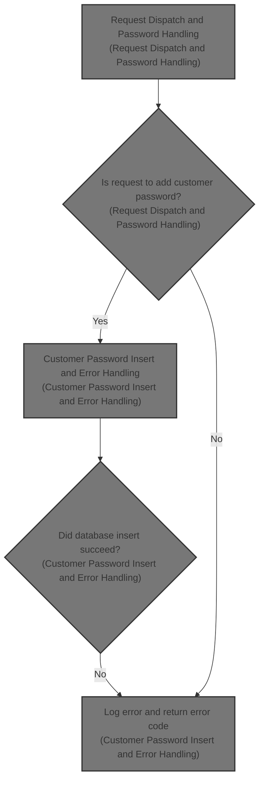
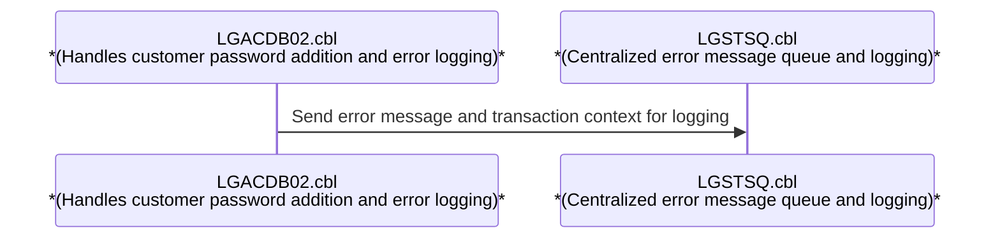
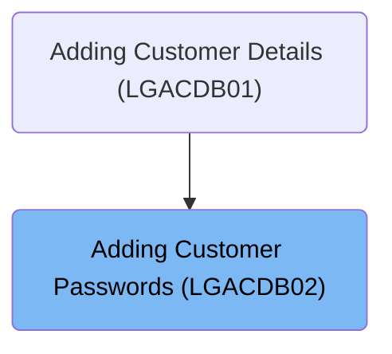

# Overview

This document describes the flow for adding customer passwords to the secure database table. The process validates requests, logs errors with transaction context, and inserts password records, ensuring traceability and support for troubleshooting.

# Technical Overview

## Dependencies

### Program

- LGSTSQ (<SwmPath>[base/src/lgstsq.cbl](base/src/lgstsq.cbl)</SwmPath>)

### Copybooks

- LGPOLICY (<SwmPath>[base/src/lgpolicy.cpy](base/src/lgpolicy.cpy)</SwmPath>)
- SQLCA

# Where is this program used?

This program is used once, as represented in the following diagram:

&nbsp;

*This is an auto-generated document by Swimm 🌊 and has not yet been verified by a human*

<SwmMeta version="3.0.0" repo-id="Z2l0aHViJTNBJTNBU3dpbW1pby1nZW5hcHAtbW90b3IlM0ElM0FHaXJpLVN3aW1t" repo-name="Swimmio-genapp-motor">Powered by [Swimm](https://app.swimm.io/)</SwmMeta>
