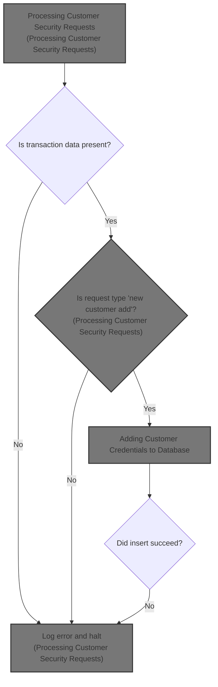
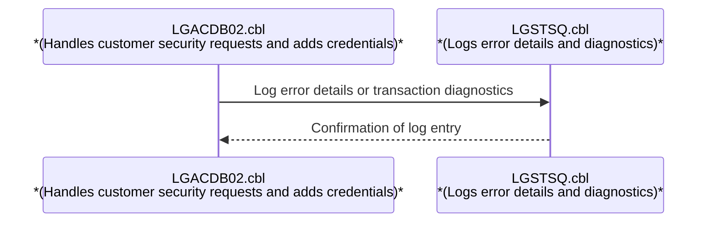
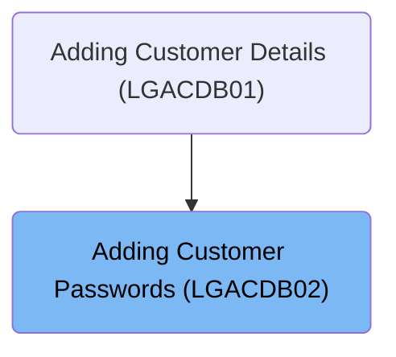
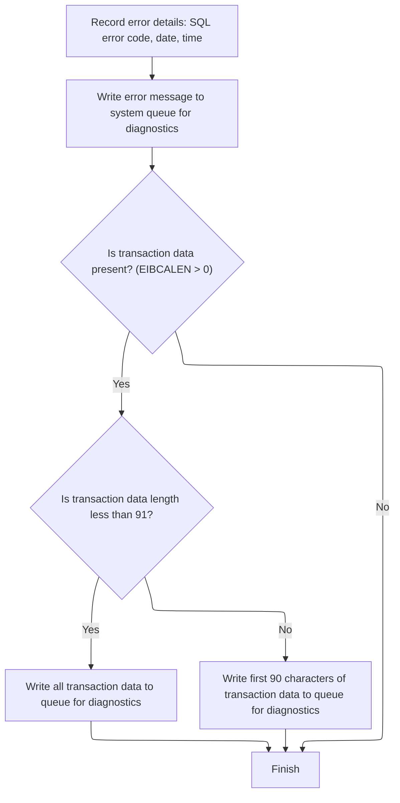

# Overview

This document explains the flow of adding customer credentials to the secure database. The system validates incoming requests, initializes the transaction context, and inserts credentials if all required data is present. Errors are logged with full context for diagnostics.



# Technical Overview



## Dependencies

### Program

- LGSTSQ (<SwmPath>[base/src/lgstsq.cbl](base/src/lgstsq.cbl)</SwmPath>)

### Copybooks

- LGPOLICY (<SwmPath>[base/src/lgpolicy.cpy](base/src/lgpolicy.cpy)</SwmPath>)
- SQLCA

# Where is this program used?

This program is used once, as represented in the following diagram:



## Input and Output Tables/Files used in the Program

| Table / File Name                                                                                                                      | Type                                                                                                                                              | Description                                   | Usage Mode | Key Fields / Layout Highlights                                                                                                                                                                                                                                                                                                                                                                                                                                                                                                                          |
| -------------------------------------------------------------------------------------------------------------------------------------- | ------------------------------------------------------------------------------------------------------------------------------------------------- | --------------------------------------------- | ---------- | ------------------------------------------------------------------------------------------------------------------------------------------------------------------------------------------------------------------------------------------------------------------------------------------------------------------------------------------------------------------------------------------------------------------------------------------------------------------------------------------------------------------------------------------------------- |
| <SwmToken path="base/src/lgacdb02.cbl" pos="167:5:5" line-data="             INSERT INTO CUSTOMER_SECURE">`CUSTOMER_SECURE`</SwmToken> | <SwmToken path="base/src/lgacdb02.cbl" pos="146:11:11" line-data="               Move D2-CUSTOMER-NUM    To DB2-CUSTOMERNUM-INT">`DB2`</SwmToken> | Customer password and security change history | Output     | <SwmToken path="base/src/lgacdb02.cbl" pos="168:3:3" line-data="                       ( customerNumber,">`customerNumber`</SwmToken>, <SwmToken path="base/src/lgacdb02.cbl" pos="169:1:1" line-data="                         customerPass,">`customerPass`</SwmToken>, <SwmToken path="base/src/lgacdb02.cbl" pos="170:1:1" line-data="                         state_indicator,">`state_indicator`</SwmToken>, <SwmToken path="base/src/lgacdb02.cbl" pos="171:1:1" line-data="                         pass_changes   )">`pass_changes`</SwmToken> |

&nbsp;

## Detailed View of the Program's Functionality

## Initializing Transaction Context

At the start, the program sets up its internal environment to track the transaction. It initializes a block of memory used for working storage, which includes fields for the transaction ID, terminal ID, and task number. These values are fetched from the system-provided identifiers for the current transaction. This setup ensures that any subsequent error handling or routing can reference the correct transaction context.

## Handling Missing Input

The program checks if any input data (commarea) was provided to the transaction. If no input is present, it prepares an error message indicating that no commarea was received. This message is logged using a dedicated error logging routine. After logging, the transaction is immediately terminated with a specific error code, ensuring that no further processing occurs without valid input.

## Preparing for Request Processing

If input data is present, the program sets the return code in the commarea to indicate success (initially zero). It also records the length of the input data and stores a pointer to the commarea for later use. This prepares the environment for processing the actual request.

## Determining Request Type and Routing

The program examines the request type specified in the input data. If the request is to add a new customer, it extracts the customer number and a count value from the input and prepares them for database insertion. It then calls a routine to insert the customer's password and related security information into the database. If the request type is anything else, it sets an error return code and ends the transaction.

## Adding Customer Credentials to Database

When handling a new customer add request, the program prepares a message indicating that a security insert is being performed. It then attempts to insert a new row into the customer security table in the database, using the customer number, password, state indicator, and change count from the input data.

If the database insert fails (indicated by a non-zero SQL error code), the program sets an error return code in the commarea, logs the error using the error logging routine, and terminates the transaction immediately.

## Formatting and Logging Error Details

The error logging routine captures the SQL error code and formats the current date and time using system services. It prepares a detailed error message that includes the date, time, program name, customer number, and SQL error code.

This error message is sent to a system queue for diagnostics by invoking a separate program responsible for queue management. The message is written to both a transient data queue (TDQ) and a temporary storage queue (TSQ), ensuring that it is available for system diagnostics and troubleshooting.

If there is input data present, the routine also logs the contents of the commarea. If the commarea is less than 91 bytes, the entire contents are logged; otherwise, only the first 90 bytes are logged. This ensures that relevant context is captured for error analysis.

## Queue Management and Message Routing

The queue management program receives the error message and determines whether it was invoked directly by another program or as a result of a system receive operation. It adjusts the message format if a special queue name is specified (using a prefix in the message). The message is then written to both the system diagnostic queue and the application-specific queue.

If the message was received from the system rather than another program, the queue manager sends a single space character back as an acknowledgment before returning control.

## Transaction Completion

After processing the request and handling any errors, the program returns control to the caller, completing the transaction. If an error occurred during database insertion or input validation, the transaction is terminated early with an appropriate error code and diagnostic information logged for further investigation.

# Data Definitions

| Table / Record Name                                                                                                                    | Type                                                                                                                                              | Short Description                             | Usage Mode      |
| -------------------------------------------------------------------------------------------------------------------------------------- | ------------------------------------------------------------------------------------------------------------------------------------------------- | --------------------------------------------- | --------------- |
| <SwmToken path="base/src/lgacdb02.cbl" pos="167:5:5" line-data="             INSERT INTO CUSTOMER_SECURE">`CUSTOMER_SECURE`</SwmToken> | <SwmToken path="base/src/lgacdb02.cbl" pos="146:11:11" line-data="               Move D2-CUSTOMER-NUM    To DB2-CUSTOMERNUM-INT">`DB2`</SwmToken> | Customer password and security change history | Output (INSERT) |

&nbsp;

# Rule Definition

| Paragraph Name                                                                                                                                                                                                  | Rule ID | Category          | Description                                                                                                                                                                                                                                                                                                                                                                                                                                                                                                                                                                                                                                                                                                                                                                                                                                                                                                                       | Conditions                                                                                 | Remarks                                                                                                                                                                                                                                                                                       |
| --------------------------------------------------------------------------------------------------------------------------------------------------------------------------------------------------------------- | ------- | ----------------- | --------------------------------------------------------------------------------------------------------------------------------------------------------------------------------------------------------------------------------------------------------------------------------------------------------------------------------------------------------------------------------------------------------------------------------------------------------------------------------------------------------------------------------------------------------------------------------------------------------------------------------------------------------------------------------------------------------------------------------------------------------------------------------------------------------------------------------------------------------------------------------------------------------------------------------- | ------------------------------------------------------------------------------------------ | --------------------------------------------------------------------------------------------------------------------------------------------------------------------------------------------------------------------------------------------------------------------------------------------- |
| MAINLINE SECTION, lines 121-126                                                                                                                                                                                 | RL-001  | Data Assignment   | The system must initialize the transaction context using the data provided in the DFHCOMMAREA linkage section, ensuring all fields are available for downstream processing and error handling.                                                                                                                                                                                                                                                                                                                                                                                                                                                                                                                                                                                                                                                                                                                                    | DFHCOMMAREA is present and EIBCALEN > 0.                                                   | All fields in the commarea must be available for downstream logic. The commarea structure includes request ID, return code, customer number, password, count, state, and data fields.                                                                                                         |
| MAINLINE SECTION, lines 130-135                                                                                                                                                                                 | RL-002  | Conditional Logic | If no input data is present in the commarea, the transaction must be stopped and no further processing occurs.                                                                                                                                                                                                                                                                                                                                                                                                                                                                                                                                                                                                                                                                                                                                                                                                                    | EIBCALEN = 0 (no commarea received)                                                        | Error message is set to 'NO COMMAREA RECEIVED' and error handling is invoked before abending the transaction.                                                                                                                                                                                 |
| <SwmToken path="base/src/lgacdb02.cbl" pos="133:3:7" line-data="               PERFORM WRITE-ERROR-MESSAGE">`WRITE-ERROR-MESSAGE`</SwmToken>, lines 192-225; LGSTSQ, lines 82-88, 105-111                       | RL-003  | Computation       | When an error occurs (such as a SQL error or unsupported request type), the system must record the error details including the SQL error code, current date (MMDDYYYY), current time (HHMMSS), program name (<SwmToken path="base/src/lgacdb02.cbl" pos="13:6:6" line-data="       PROGRAM-ID. LGACDB02.">`LGACDB02`</SwmToken>), customer number, SQL request description, and SQL return code. The error message must be formatted as a single string, up to 90 bytes, in the format: \[MMDDYYYY\]\[space\]\[HHMMSS\]\[space\]<SwmToken path="base/src/lgacdb02.cbl" pos="13:6:6" line-data="       PROGRAM-ID. LGACDB02.">`LGACDB02`</SwmToken>\[space\]CNUM=\[customer number\]\[space\]\[SQL request\]\[space\]SQLCODE=\[sql code\].                                                                                                                                                                                         | An error is detected (e.g., SQLCODE not 0, unsupported request type, or missing commarea). | Error message format: string, max 90 bytes: \[MMDDYYYY\]\[space\]\[HHMMSS\]\[space\]<SwmToken path="base/src/lgacdb02.cbl" pos="13:6:6" line-data="       PROGRAM-ID. LGACDB02.">`LGACDB02`</SwmToken>\[space\]CNUM=\[customer number\]\[space\]\[SQL request\]\[space\]SQLCODE=\[sql code\]. |
| Program name is always <SwmToken path="base/src/lgacdb02.cbl" pos="13:6:6" line-data="       PROGRAM-ID. LGACDB02.">`LGACDB02`</SwmToken>.                                                                      |         |                   |                                                                                                                                                                                                                                                                                                                                                                                                                                                                                                                                                                                                                                                                                                                                                                                                                                                                                                                                   |                                                                                            |                                                                                                                                                                                                                                                                                               |
| Date and time are formatted as MMDDYYYY and HHMMSS, respectively.                                                                                                                                               |         |                   |                                                                                                                                                                                                                                                                                                                                                                                                                                                                                                                                                                                                                                                                                                                                                                                                                                                                                                                                   |                                                                                            |                                                                                                                                                                                                                                                                                               |
| <SwmToken path="base/src/lgacdb02.cbl" pos="133:3:7" line-data="               PERFORM WRITE-ERROR-MESSAGE">`WRITE-ERROR-MESSAGE`</SwmToken>, lines 205-208; LGSTSQ, lines 82-88, 105-111                       | RL-004  | Conditional Logic | The error message must be written to the TDQ named 'CSMT' for system diagnostics. The error message must also be written to the TSQ named 'GENAERRS' for application diagnostics, unless the message starts with 'Q=nnnn', in which case the TSQ name must be 'GENA' + nnnn and the first 7 bytes must be removed from the message before writing.                                                                                                                                                                                                                                                                                                                                                                                                                                                                                                                                                                                | Error message is generated. If the message starts with 'Q=nnnn', special handling applies. | TDQ name: 'CSMT'. Default TSQ name: 'GENAERRS'. If message starts with 'Q=nnnn', TSQ name is 'GENA' + nnnn and message is truncated by removing first 7 bytes. Message is up to 90 bytes.                                                                                                     |
| <SwmToken path="base/src/lgacdb02.cbl" pos="133:3:7" line-data="               PERFORM WRITE-ERROR-MESSAGE">`WRITE-ERROR-MESSAGE`</SwmToken>, lines 209-224                                                     | RL-005  | Conditional Logic | If transaction data (commarea) is present, the system must log the commarea data to the TSQ for diagnostics. If the commarea length is less than 91 bytes, the entire commarea must be written; otherwise, only the first 90 bytes must be written, prefixed with 'COMMAREA='.                                                                                                                                                                                                                                                                                                                                                                                                                                                                                                                                                                                                                                                    | EIBCALEN > 0 (commarea present)                                                            | If commarea length < 91, write all bytes; else, write first 90 bytes. Message is prefixed with 'COMMAREA=' (9 bytes), followed by up to 90 bytes of commarea data.                                                                                                                            |
| MAINLINE SECTION, lines 137-139, 145-152; <SwmToken path="base/src/lgacdb02.cbl" pos="148:3:7" line-data="               Perform INSERT-CUSTOMER-PASSWORD">`INSERT-CUSTOMER-PASSWORD`</SwmToken>, lines 178-181 | RL-006  | Data Assignment   | After error handling, the system must prepare the return code and commarea for output. For a new customer add request (<SwmToken path="base/src/lgacdb02.cbl" pos="143:3:7" line-data="           Evaluate D2-REQUEST-ID">`D2-REQUEST-ID`</SwmToken> = <SwmToken path="base/src/lgacdb02.cbl" pos="145:4:4" line-data="             When &#39;02ACUS&#39;">`02ACUS`</SwmToken>), the system must attempt to insert the customer credentials into the secure database table using the provided fields. All input variables must be valid and ready for database insertion. If the database insert fails, the system must log the error as described above and set the return code to '98'. For unsupported request types, the system must set the return code to '99' and log an error as described above. On successful processing, the system must set the return code to '00' in the commarea and not write any error messages. | Processing completes (success, SQL error, or unsupported request type).                    | Return code values: '00' (success), '98' (DB insert failure), '99' (unsupported request). Return code is a 2-digit string in the commarea. All output is reflected in the updated commarea.                                                                                                   |

# User Stories

## User Story 1: Transaction Context Initialization and Validation

---

### Story Description:

As a system, I want to initialize the transaction context using the DFHCOMMAREA linkage section and validate its presence so that downstream processing and error handling can proceed only with valid input data.

---

### Business Rule Mapping:

| Rule ID | Paragraph Name                  | Rule Description                                                                                                                                                                               |
| ------- | ------------------------------- | ---------------------------------------------------------------------------------------------------------------------------------------------------------------------------------------------- |
| RL-001  | MAINLINE SECTION, lines 121-126 | The system must initialize the transaction context using the data provided in the DFHCOMMAREA linkage section, ensuring all fields are available for downstream processing and error handling. |
| RL-002  | MAINLINE SECTION, lines 130-135 | If no input data is present in the commarea, the transaction must be stopped and no further processing occurs.                                                                                 |

---

### Relevant Functionality:

- **MAINLINE SECTION**
  1. **RL-001:**
     - Initialize working storage variables
     - Move transaction, terminal, and task IDs from environment to working storage
     - If commarea is present, move its length to a working storage field and set a pointer to its address
  2. **RL-002:**
     - If commarea length is zero:
       - Set error message variable to indicate missing commarea
       - Perform error message writing procedure
       - Issue CICS ABEND with code 'LGCA', no dump

## User Story 2: Request Processing, Error Handling, and Output Preparation

---

### Story Description:

As a user, I want my requests to be processed according to their type, with customer credentials inserted for new customer requests, appropriate return codes set for success or failure, and all errors recorded, formatted, and routed to diagnostics queues, with all output reflected in the updated DFHCOMMAREA so that I receive accurate results and status and errors are traceable for support.

---

### Business Rule Mapping:

| Rule ID | Paragraph Name                                                                                                                                                                                                  | Rule Description                                                                                                                                                                                                                                                                                                                                                                                                                                                                                                                                                                                                                                                                                                                                                                                                                                                                                                                  |
| ------- | --------------------------------------------------------------------------------------------------------------------------------------------------------------------------------------------------------------- | --------------------------------------------------------------------------------------------------------------------------------------------------------------------------------------------------------------------------------------------------------------------------------------------------------------------------------------------------------------------------------------------------------------------------------------------------------------------------------------------------------------------------------------------------------------------------------------------------------------------------------------------------------------------------------------------------------------------------------------------------------------------------------------------------------------------------------------------------------------------------------------------------------------------------------- |
| RL-003  | <SwmToken path="base/src/lgacdb02.cbl" pos="133:3:7" line-data="               PERFORM WRITE-ERROR-MESSAGE">`WRITE-ERROR-MESSAGE`</SwmToken>, lines 192-225; LGSTSQ, lines 82-88, 105-111                       | When an error occurs (such as a SQL error or unsupported request type), the system must record the error details including the SQL error code, current date (MMDDYYYY), current time (HHMMSS), program name (<SwmToken path="base/src/lgacdb02.cbl" pos="13:6:6" line-data="       PROGRAM-ID. LGACDB02.">`LGACDB02`</SwmToken>), customer number, SQL request description, and SQL return code. The error message must be formatted as a single string, up to 90 bytes, in the format: \[MMDDYYYY\]\[space\]\[HHMMSS\]\[space\]<SwmToken path="base/src/lgacdb02.cbl" pos="13:6:6" line-data="       PROGRAM-ID. LGACDB02.">`LGACDB02`</SwmToken>\[space\]CNUM=\[customer number\]\[space\]\[SQL request\]\[space\]SQLCODE=\[sql code\].                                                                                                                                                                                         |
| RL-004  | <SwmToken path="base/src/lgacdb02.cbl" pos="133:3:7" line-data="               PERFORM WRITE-ERROR-MESSAGE">`WRITE-ERROR-MESSAGE`</SwmToken>, lines 205-208; LGSTSQ, lines 82-88, 105-111                       | The error message must be written to the TDQ named 'CSMT' for system diagnostics. The error message must also be written to the TSQ named 'GENAERRS' for application diagnostics, unless the message starts with 'Q=nnnn', in which case the TSQ name must be 'GENA' + nnnn and the first 7 bytes must be removed from the message before writing.                                                                                                                                                                                                                                                                                                                                                                                                                                                                                                                                                                                |
| RL-005  | <SwmToken path="base/src/lgacdb02.cbl" pos="133:3:7" line-data="               PERFORM WRITE-ERROR-MESSAGE">`WRITE-ERROR-MESSAGE`</SwmToken>, lines 209-224                                                     | If transaction data (commarea) is present, the system must log the commarea data to the TSQ for diagnostics. If the commarea length is less than 91 bytes, the entire commarea must be written; otherwise, only the first 90 bytes must be written, prefixed with 'COMMAREA='.                                                                                                                                                                                                                                                                                                                                                                                                                                                                                                                                                                                                                                                    |
| RL-006  | MAINLINE SECTION, lines 137-139, 145-152; <SwmToken path="base/src/lgacdb02.cbl" pos="148:3:7" line-data="               Perform INSERT-CUSTOMER-PASSWORD">`INSERT-CUSTOMER-PASSWORD`</SwmToken>, lines 178-181 | After error handling, the system must prepare the return code and commarea for output. For a new customer add request (<SwmToken path="base/src/lgacdb02.cbl" pos="143:3:7" line-data="           Evaluate D2-REQUEST-ID">`D2-REQUEST-ID`</SwmToken> = <SwmToken path="base/src/lgacdb02.cbl" pos="145:4:4" line-data="             When &#39;02ACUS&#39;">`02ACUS`</SwmToken>), the system must attempt to insert the customer credentials into the secure database table using the provided fields. All input variables must be valid and ready for database insertion. If the database insert fails, the system must log the error as described above and set the return code to '98'. For unsupported request types, the system must set the return code to '99' and log an error as described above. On successful processing, the system must set the return code to '00' in the commarea and not write any error messages. |

---

### Relevant Functionality:

- <SwmToken path="base/src/lgacdb02.cbl" pos="133:3:7" line-data="               PERFORM WRITE-ERROR-MESSAGE">`WRITE-ERROR-MESSAGE`</SwmToken>
  1. **RL-003:**
     - On error:
       - Move SQLCODE to error message field
       - Obtain current date and time, format as MMDDYYYY and HHMMSS
       - Populate error message fields with program name, customer number, SQL request, and SQLCODE
       - Format message as a single string up to 90 bytes
  2. **RL-004:**
     - Write error message to TDQ 'CSMT'
     - Write error message to TSQ 'GENAERRS'
     - If message starts with 'Q=nnnn':
       - Set TSQ name to 'GENA' + nnnn
       - Remove first 7 bytes from message before writing to TSQ
  3. **RL-005:**
     - If commarea is present:
       - If length < 91:
         - Move entire commarea to message data field
         - Write to TSQ
       - Else:
         - Move first 90 bytes of commarea to message data field
         - Prefix with 'COMMAREA='
         - Write to TSQ
- **MAINLINE SECTION**
  1. **RL-006:**
     - On entry, set return code to '00'
     - If request ID is <SwmToken path="base/src/lgacdb02.cbl" pos="145:4:4" line-data="             When &#39;02ACUS&#39;">`02ACUS`</SwmToken>:
       - Attempt DB insert
       - If insert fails:
         - Set return code to '98'
         - Log error
     - If request ID is not supported:
       - Set return code to '99'
       - Log error
     - On success, leave return code as '00'
     - Write all output fields to commarea for return

# Workflow

# Initializing Transaction Context

This section ensures that every transaction begins with a valid context, including all necessary identifiers for error handling and routing. It also enforces that transactions without input data are immediately halted and logged for auditing.

| Category        | Rule Name                          | Description                                                                                                                                               |
| --------------- | ---------------------------------- | --------------------------------------------------------------------------------------------------------------------------------------------------------- |
| Data validation | Error message content requirement  | The error message for missing input must include the text 'NO COMMAREA RECEIVED' and be logged with the current transaction context for audit purposes.   |
| Business logic  | Transaction context initialization | Every transaction must have its context initialized with the current transaction ID, terminal ID, and task number before any further processing occurs.   |
| Business logic  | Context variable sourcing          | Transaction context variables must be set using the current system environment values at the time of initialization (e.g., EIBTRNID, EIBTRMID, EIBTASKN). |

<SwmSnippet path="/base/src/lgacdb02.cbl" line="115">

---

We start by setting up the transaction context so later error handling and routing have the right IDs.

```cobol
       MAINLINE SECTION.

      *----------------------------------------------------------------*
      * Common code                                                    *
      *----------------------------------------------------------------*
      * initialize working storage variables
           INITIALIZE WS-HEADER.
      * set up general variable
           MOVE EIBTRNID TO WS-TRANSID.
           MOVE EIBTRMID TO WS-TERMID.
           MOVE EIBTASKN TO WS-TASKNUM.
```

---

</SwmSnippet>

<SwmSnippet path="/base/src/lgacdb02.cbl" line="131">

---

If there's no input, we log the error and stop the transaction.

```cobol
           IF EIBCALEN IS EQUAL TO ZERO
               MOVE ' NO COMMAREA RECEIVED' TO EM-VARIABLE
               PERFORM WRITE-ERROR-MESSAGE
               EXEC CICS ABEND ABCODE('LGCA') NODUMP END-EXEC
           END-IF
```

---

</SwmSnippet>

## Formatting and Logging Error Details



This section ensures that all relevant error details are captured and logged in a standardized format, including SQL error codes, timestamps, and transaction data, to support effective diagnostics and auditing.

| Category        | Rule Name                       | Description                                                                                                                                                                                                                                                                                                                                                                                             |
| --------------- | ------------------------------- | ------------------------------------------------------------------------------------------------------------------------------------------------------------------------------------------------------------------------------------------------------------------------------------------------------------------------------------------------------------------------------------------------------- |
| Data validation | Standardized error format       | Error log entries must be formatted according to the defined <SwmToken path="base/src/lgacdb02.cbl" pos="206:3:5" line-data="                     COMMAREA(ERROR-MSG)">`ERROR-MSG`</SwmToken> and <SwmToken path="base/src/lgacdb02.cbl" pos="214:3:7" line-data="                         COMMAREA(CA-ERROR-MSG)">`CA-ERROR-MSG`</SwmToken> structures, ensuring consistency across all logged errors. |
| Business logic  | Error log completeness          | Whenever an SQL error occurs, the error log entry must include the SQL error code, the current date, and the current time.                                                                                                                                                                                                                                                                              |
| Business logic  | Centralized error logging       | All error messages must be written to the system diagnostic queue (LGSTSQ) to ensure centralized error tracking.                                                                                                                                                                                                                                                                                        |
| Business logic  | Transaction data logging        | If transaction data (commarea) is present, it must be logged as part of the error details. If the transaction data length is less than 91 characters, the entire data is logged; if it is 91 characters or more, only the first 90 characters are logged.                                                                                                                                               |
| Business logic  | Conditional transaction context | If no transaction data is present, only the error details (SQL code, date, time) are logged, and no additional transaction context is included.                                                                                                                                                                                                                                                         |

<SwmSnippet path="/base/src/lgacdb02.cbl" line="192">

---

In <SwmToken path="base/src/lgacdb02.cbl" pos="192:1:5" line-data="       WRITE-ERROR-MESSAGE.">`WRITE-ERROR-MESSAGE`</SwmToken>, we capture the SQL error code and format the current timestamp, prepping all the details needed for a complete error log entry.

```cobol
       WRITE-ERROR-MESSAGE.
      * Save SQLCODE in message
           MOVE SQLCODE TO EM-SQLRC
      * Obtain and format current time and date
           EXEC CICS ASKTIME ABSTIME(WS-ABSTIME)
           END-EXEC
           EXEC CICS FORMATTIME ABSTIME(WS-ABSTIME)
                     MMDDYYYY(WS-DATE)
                     TIME(WS-TIME)
           END-EXEC
```

---

</SwmSnippet>

<SwmSnippet path="/base/src/lgacdb02.cbl" line="202">

---

We send the error message to LGSTSQ so it gets logged in the system queues.

```cobol
           MOVE WS-DATE TO EM-DATE
           MOVE WS-TIME TO EM-TIME
      * Write output message to TDQ
           EXEC CICS LINK PROGRAM('LGSTSQ')
                     COMMAREA(ERROR-MSG)
                     LENGTH(LENGTH OF ERROR-MSG)
           END-EXEC.
```

---

</SwmSnippet>

<SwmSnippet path="/base/src/lgstsq.cbl" line="55">

---

<SwmToken path="base/src/lgstsq.cbl" pos="55:1:1" line-data="       MAINLINE SECTION.">`MAINLINE`</SwmToken> in LGSTSQ decides if the message comes from a program or a CICS receive, adjusts the message format (especially if it starts with 'Q='), and writes it to both TDQ and TSQ queues. If the message was received, it sends a space character back as an acknowledgment before returning.

```cobol
       MAINLINE SECTION.

           MOVE SPACES TO WRITE-MSG.
           MOVE SPACES TO WS-RECV.

           EXEC CICS ASSIGN SYSID(WRITE-MSG-SYSID)
                RESP(WS-RESP)
           END-EXEC.

           EXEC CICS ASSIGN INVOKINGPROG(WS-INVOKEPROG)
                RESP(WS-RESP)
           END-EXEC.
           
           IF WS-INVOKEPROG NOT = SPACES
              MOVE 'C' To WS-FLAG
              MOVE COMMA-DATA  TO WRITE-MSG-MSG
              MOVE EIBCALEN    TO WS-RECV-LEN
           ELSE
              EXEC CICS RECEIVE INTO(WS-RECV)
                  LENGTH(WS-RECV-LEN)
                  RESP(WS-RESP)
              END-EXEC
              MOVE 'R' To WS-FLAG
              MOVE WS-RECV-DATA  TO WRITE-MSG-MSG
              SUBTRACT 5 FROM WS-RECV-LEN
           END-IF.

           MOVE 'GENAERRS' TO STSQ-NAME.
           IF WRITE-MSG-MSG(1:2) = 'Q=' THEN
              MOVE WRITE-MSG-MSG(3:4) TO STSQ-EXT
              MOVE WRITE-MSG-REST TO TEMPO
              MOVE TEMPO          TO WRITE-MSG-MSG
              SUBTRACT 7 FROM WS-RECV-LEN
           END-IF.

           ADD 5 TO WS-RECV-LEN.

      * Write output message to TDQ CSMT
      *
           EXEC CICS WRITEQ TD QUEUE(STDQ-NAME)
                     FROM(WRITE-MSG)
                     RESP(WS-RESP)
                     LENGTH(WS-RECV-LEN)

           END-EXEC.

      * Write output message to Genapp TSQ
      * If no space is available then the task will not wait for
      *  storage to become available but will ignore the request...
      *
           EXEC CICS WRITEQ TS QUEUE(STSQ-NAME)
                     FROM(WRITE-MSG)
                     RESP(WS-RESP)
                     NOSUSPEND
                     LENGTH(WS-RECV-LEN)

           END-EXEC.

           If WS-FLAG = 'R' Then
             EXEC CICS SEND TEXT FROM(FILLER-X)
              WAIT
              ERASE
              LENGTH(1)
              FREEKB
             END-EXEC.

           EXEC CICS RETURN
           END-EXEC.
```

---

</SwmSnippet>

<SwmSnippet path="/base/src/lgacdb02.cbl" line="210">

---

After returning from LGSTSQ, <SwmToken path="base/src/lgacdb02.cbl" pos="133:3:7" line-data="               PERFORM WRITE-ERROR-MESSAGE">`WRITE-ERROR-MESSAGE`</SwmToken> checks if there's commarea data and logs it using another call to LGSTSQ, handling both short and long commareas to make sure the error context is captured.

```cobol
           IF EIBCALEN > 0 THEN
             IF EIBCALEN < 91 THEN
               MOVE DFHCOMMAREA(1:EIBCALEN) TO CA-DATA
               EXEC CICS LINK PROGRAM('LGSTSQ')
                         COMMAREA(CA-ERROR-MSG)
                         LENGTH(LENGTH OF CA-ERROR-MSG)
               END-EXEC
             ELSE
               MOVE DFHCOMMAREA(1:90) TO CA-DATA
               EXEC CICS LINK PROGRAM('LGSTSQ')
                         COMMAREA(CA-ERROR-MSG)
                         LENGTH(LENGTH OF CA-ERROR-MSG)
               END-EXEC
             END-IF
           END-IF.
           EXIT.
```

---

</SwmSnippet>

## Processing Customer Security Requests

<SwmSnippet path="/base/src/lgacdb02.cbl" line="138">

---

Back in MAINLINE, after error handling, we prep the return code and commarea, then check the request type. If it's a new customer add, we call <SwmToken path="base/src/lgacdb02.cbl" pos="148:3:7" line-data="               Perform INSERT-CUSTOMER-PASSWORD">`INSERT-CUSTOMER-PASSWORD`</SwmToken> to handle the database insert. Other request types get a default error code and return.

```cobol
           MOVE '00' TO D2-RETURN-CODE
           MOVE EIBCALEN TO WS-CALEN.
           SET WS-ADDR-DFHCOMMAREA TO ADDRESS OF DFHCOMMAREA.

      * Different types of security add
           Evaluate D2-REQUEST-ID
      *      New Customer add
             When '02ACUS'
               Move D2-CUSTOMER-NUM    To DB2-CUSTOMERNUM-INT
               Move D2-CUSTSECR-COUNT  To DB2-CUSTOMERCNT-INT
               Perform INSERT-CUSTOMER-PASSWORD
             When Other
               Move '99' To D2-RETURN-CODE
               Exec CICS Return End-EXEC
           End-Evaluate

      *    Return to caller
           EXEC CICS RETURN END-EXEC.
```

---

</SwmSnippet>

# Adding Customer Credentials to Database

This section governs the process of adding customer credentials to the secure database table, ensuring that only valid data is inserted and that errors are handled according to business requirements.

| Category        | Rule Name                           | Description                                                                                                                                                                                |
| --------------- | ----------------------------------- | ------------------------------------------------------------------------------------------------------------------------------------------------------------------------------------------ |
| Data validation | Credential completeness requirement | Only customer credentials with all required fields (customer number, password, state indicator, password change count) present and valid are eligible for insertion into the secure table. |

<SwmSnippet path="/base/src/lgacdb02.cbl" line="161">

---

In <SwmToken path="base/src/lgacdb02.cbl" pos="161:1:5" line-data="       INSERT-CUSTOMER-PASSWORD.">`INSERT-CUSTOMER-PASSWORD`</SwmToken>, we take the pre-populated customer data and attempt to insert it into the secure table. The function expects all input variables to be valid and ready for the <SwmToken path="base/src/lgacdb02.cbl" pos="172:6:6" line-data="                VALUES ( :DB2-CUSTOMERNUM-INT,">`DB2`</SwmToken> insert.

```cobol
       INSERT-CUSTOMER-PASSWORD.
      *================================================================*
      * Insert row into Customer Secure Table                          *
      *================================================================*
           MOVE ' INSERT SECURITY' TO EM-SQLREQ
           EXEC SQL
             INSERT INTO CUSTOMER_SECURE
                       ( customerNumber,
                         customerPass,
                         state_indicator,
                         pass_changes   )
                VALUES ( :DB2-CUSTOMERNUM-INT,
                         :D2-CUSTSECR-PASS,
                         :D2-CUSTSECR-STATE,
                         :DB2-CUSTOMERCNT-INT)
           END-EXEC
```

---

</SwmSnippet>

<SwmSnippet path="/base/src/lgacdb02.cbl" line="178">

---

If the insert fails, we log the error and bail out.

```cobol
           IF SQLCODE NOT EQUAL 0
             MOVE '98' TO D2-RETURN-CODE
             PERFORM WRITE-ERROR-MESSAGE
             EXEC CICS RETURN END-EXEC
           END-IF

           EXIT.
```

---

</SwmSnippet>

&nbsp;

*This is an auto-generated document by Swimm 🌊 and has not yet been verified by a human*

<SwmMeta version="3.0.0" repo-id="Z2l0aHViJTNBJTNBU3dpbW1pby1nZW5hcHAtbW90b3IlM0ElM0FHaXJpLVN3aW1t" repo-name="Swimmio-genapp-motor"><sup>Powered by [Swimm](https://app.swimm.io/)</sup></SwmMeta>
