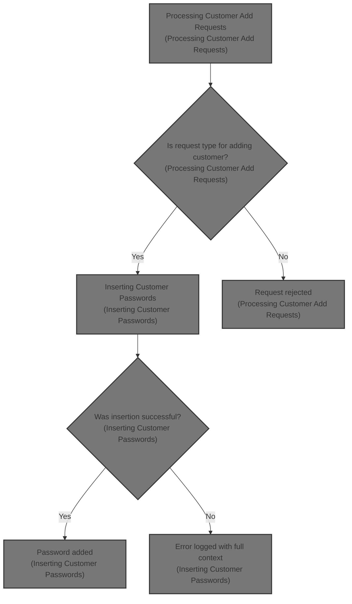
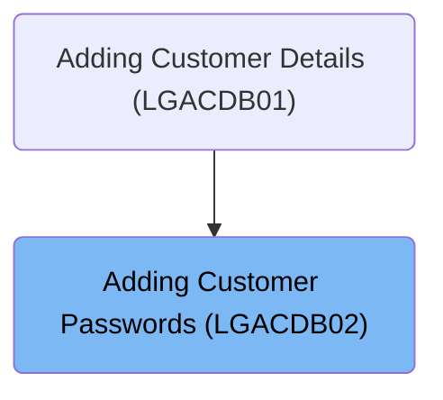
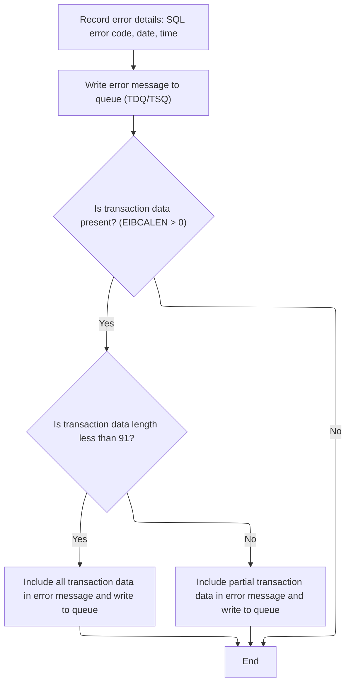
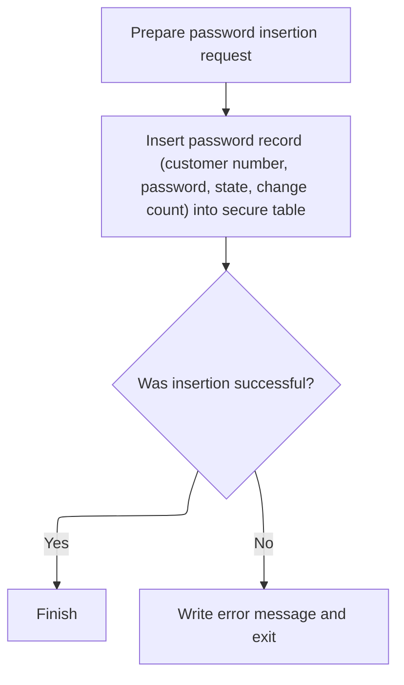

# Overview

This document describes the process for securely adding new customer passwords to the system. Only add-customer requests are processed, and all required details are inserted into the secure database. Errors are logged with full context for traceability.



## Dependencies

### Programs

- <SwmToken path="base/src/lgacdb02.cbl" pos="13:6:6" line-data="       PROGRAM-ID. LGACDB02.">`LGACDB02`</SwmToken> (<SwmPath>[base/src/lgacdb02.cbl](base/src/lgacdb02.cbl)</SwmPath>)
- LGSTSQ (<SwmPath>[base/src/lgstsq.cbl](base/src/lgstsq.cbl)</SwmPath>)

### Copybooks

- LGPOLICY (<SwmPath>[base/src/lgpolicy.cpy](base/src/lgpolicy.cpy)</SwmPath>)
- SQLCA

# Where is this program used?

This program is used once, as represented in the following diagram:



## Input and Output Tables/Files used in the Program

| Table / File Name                                                                                                                      | Type                                                                                                                                              | Description                                  | Usage Mode | Key Fields / Layout Highlights                                                                                                                                                                                                                                                                                                                                                                                                                                                                                                                          |
| -------------------------------------------------------------------------------------------------------------------------------------- | ------------------------------------------------------------------------------------------------------------------------------------------------- | -------------------------------------------- | ---------- | ------------------------------------------------------------------------------------------------------------------------------------------------------------------------------------------------------------------------------------------------------------------------------------------------------------------------------------------------------------------------------------------------------------------------------------------------------------------------------------------------------------------------------------------------------- |
| <SwmToken path="base/src/lgacdb02.cbl" pos="167:5:5" line-data="             INSERT INTO CUSTOMER_SECURE">`CUSTOMER_SECURE`</SwmToken> | <SwmToken path="base/src/lgacdb02.cbl" pos="146:11:11" line-data="               Move D2-CUSTOMER-NUM    To DB2-CUSTOMERNUM-INT">`DB2`</SwmToken> | Customer password and security state records | Output     | <SwmToken path="base/src/lgacdb02.cbl" pos="168:3:3" line-data="                       ( customerNumber,">`customerNumber`</SwmToken>, <SwmToken path="base/src/lgacdb02.cbl" pos="169:1:1" line-data="                         customerPass,">`customerPass`</SwmToken>, <SwmToken path="base/src/lgacdb02.cbl" pos="170:1:1" line-data="                         state_indicator,">`state_indicator`</SwmToken>, <SwmToken path="base/src/lgacdb02.cbl" pos="171:1:1" line-data="                         pass_changes   )">`pass_changes`</SwmToken> |

&nbsp;

## Detailed View of the Program's Functionality

a. Initializing Transaction Context

At the start of the transaction, the program prepares its internal context to ensure that all subsequent operations have the necessary identifiers for error logging and routing. This involves:

- Resetting (initializing) all working storage variables related to the transaction context.
- Copying the current transaction ID, terminal ID, and task number from the system environment into the program’s own storage. These identifiers are used for tracking, logging, and routing throughout the transaction.

b. Handling Missing Input

The program checks if any input data (COMMAREA) was provided to the transaction. If no input is present:

- It sets an error message indicating that no COMMAREA was received.
- It calls a routine to write this error message to the system error queues.
- It then immediately halts the transaction with a specific abnormal end (ABEND) code to prevent further processing of incomplete or invalid data.

c. Formatting and Logging Error Details

When an error occurs, the program constructs a detailed error message for logging. This process includes:

- Capturing the SQL error code (if any) and storing it in the error message structure.
- Requesting the current system time and date, formatting them, and including them in the error message.
- Preparing the error message with all relevant details, such as program name, customer number, and SQL code.
- Sending this error message to a system queue by linking to a dedicated queue-handling program.

The queue-handling program (LGSTSQ) performs the following:

- Determines if the message originated from another program or from a user terminal.
- If the message starts with a special prefix (e.g., 'Q='), it adjusts the target queue name accordingly.
- Writes the error message to both a transient data queue (TDQ) for system logs and a temporary storage queue (TSQ) for application-level tracking.
- If the queue is full, it does not wait but simply ignores the request (NOSUSPEND).
- If the message came from a terminal, it sends a minimal response back to the user.

After logging the main error message, the program checks if there was any input data (COMMAREA) provided:

- If present and less than 91 bytes, it copies all of it into a secondary error message and logs it.
- If longer, it copies only the first 90 bytes and logs that.
- This ensures that relevant context about the transaction is captured in the error logs, even if the input was large.

d. Processing Customer Add Requests

After error handling, the program checks the type of request received:

- If the request is to add a new customer (identified by a specific request code), it prepares the necessary fields for the database operation, such as customer number and password change count.
- It then calls a dedicated routine to insert the new customer’s password record into the secure database table.
- If the request is of any other type, it sets a default error code and returns control to the caller without further processing.

e. Inserting Customer Passwords

When adding a new customer’s password, the program:

- Sets up a label indicating that a security insert operation is being performed.
- Executes a database insert to add the customer number, password, state indicator, and password change count into the secure table.
- If the database insert fails, it sets an error code, logs the error using the previously described error logging routine, and returns control to the system.
- If the insert is successful, the routine simply exits, allowing the transaction to complete normally.

f. Summary of Error Logging and Message Routing (LGSTSQ)

The queue-handling program (LGSTSQ) is responsible for:

- Receiving error or informational messages from other programs or terminals.
- Determining the source and adjusting message handling accordingly.
- Optionally changing the target queue name based on message content.
- Writing messages to both system and application queues.
- Sending minimal responses to terminals if required.
- Returning control to the calling program or system.

This flow ensures that all errors and important events are logged with sufficient detail for troubleshooting, and that customer add requests are handled securely and robustly, with clear error handling and reporting at every step.

# Data Definitions

| Table / Record Name                                                                                                                    | Type                                                                                                                                              | Short Description                            | Usage Mode      |
| -------------------------------------------------------------------------------------------------------------------------------------- | ------------------------------------------------------------------------------------------------------------------------------------------------- | -------------------------------------------- | --------------- |
| <SwmToken path="base/src/lgacdb02.cbl" pos="167:5:5" line-data="             INSERT INTO CUSTOMER_SECURE">`CUSTOMER_SECURE`</SwmToken> | <SwmToken path="base/src/lgacdb02.cbl" pos="146:11:11" line-data="               Move D2-CUSTOMER-NUM    To DB2-CUSTOMERNUM-INT">`DB2`</SwmToken> | Customer password and security state records | Output (INSERT) |

&nbsp;

# Rule Definition

| Paragraph Name                                                                                                                                                                                                                                                                                                                                                                                                                              | Rule ID | Category          | Description                                                                                                                                                                                                                                                                                                                                                                                                                                                                                                                                                            | Conditions                                                                                                                                                                                                                                                    | Remarks                                                                                                                                                                                                                                                                                                                                                                                                                                                                                                                                                                                                                                                                                                                                                                                       |
| ------------------------------------------------------------------------------------------------------------------------------------------------------------------------------------------------------------------------------------------------------------------------------------------------------------------------------------------------------------------------------------------------------------------------------------------- | ------- | ----------------- | ---------------------------------------------------------------------------------------------------------------------------------------------------------------------------------------------------------------------------------------------------------------------------------------------------------------------------------------------------------------------------------------------------------------------------------------------------------------------------------------------------------------------------------------------------------------------- | ------------------------------------------------------------------------------------------------------------------------------------------------------------------------------------------------------------------------------------------------------------- | --------------------------------------------------------------------------------------------------------------------------------------------------------------------------------------------------------------------------------------------------------------------------------------------------------------------------------------------------------------------------------------------------------------------------------------------------------------------------------------------------------------------------------------------------------------------------------------------------------------------------------------------------------------------------------------------------------------------------------------------------------------------------------------------- |
| MAINLINE SECTION (<SwmToken path="base/src/lgacdb02.cbl" pos="13:6:6" line-data="       PROGRAM-ID. LGACDB02.">`LGACDB02`</SwmToken>), lines 121-126                                                                                                                                                                                                                                                                                        | RL-001  | Data Assignment   | The system must initialize the transaction context using the provided fields: eyecatcher, transaction ID, terminal ID, task number, filler, commarea address, and commarea length.                                                                                                                                                                                                                                                                                                                                                                                     | Always at the start of transaction processing.                                                                                                                                                                                                                | Fields: eyecatcher (string, 16 bytes), transaction ID (string, 4 bytes), terminal ID (string, 4 bytes), task number (number, 7 digits), filler (string, 1 byte), commarea address (pointer), commarea length (number, 4 bytes, COMP).                                                                                                                                                                                                                                                                                                                                                                                                                                                                                                                                                         |
| MAINLINE SECTION (<SwmToken path="base/src/lgacdb02.cbl" pos="13:6:6" line-data="       PROGRAM-ID. LGACDB02.">`LGACDB02`</SwmToken>), lines 131-135                                                                                                                                                                                                                                                                                        | RL-002  | Conditional Logic | If no input is present in DFHCOMMAREA, the system must halt further transaction processing and record an error message containing the SQL error code, date, and time.                                                                                                                                                                                                                                                                                                                                                                                                  | EIBCALEN is zero.                                                                                                                                                                                                                                             | Error message includes: date (string, 8 bytes), time (string, 6 bytes), customer number (string, 10 bytes), SQL request (string, 16 bytes), SQL return code (number, 5 digits, signed), literal <SwmToken path="base/src/lgacdb02.cbl" pos="13:6:6" line-data="       PROGRAM-ID. LGACDB02.">`LGACDB02`</SwmToken> (string, 9 bytes).                                                                                                                                                                                                                                                                                                                                                                                                                                                         |
| <SwmToken path="base/src/lgacdb02.cbl" pos="206:3:5" line-data="                     COMMAREA(ERROR-MSG)">`ERROR-MSG`</SwmToken> structure (<SwmToken path="base/src/lgacdb02.cbl" pos="13:6:6" line-data="       PROGRAM-ID. LGACDB02.">`LGACDB02`</SwmToken>), <SwmToken path="base/src/lgacdb02.cbl" pos="133:3:7" line-data="               PERFORM WRITE-ERROR-MESSAGE">`WRITE-ERROR-MESSAGE`</SwmToken> section, lines 44-55, 192-225 | RL-003  | Data Assignment   | Error messages must be formatted to include: date, time, customer number, SQL request, SQL return code, and the literal <SwmToken path="base/src/lgacdb02.cbl" pos="13:6:6" line-data="       PROGRAM-ID. LGACDB02.">`LGACDB02`</SwmToken>.                                                                                                                                                                                                                                                                                                                            | Whenever an error occurs (e.g., missing commarea, <SwmToken path="base/src/lgacdb02.cbl" pos="146:11:11" line-data="               Move D2-CUSTOMER-NUM    To DB2-CUSTOMERNUM-INT">`DB2`</SwmToken> insert failure).                                          | Format: date (string, 8 bytes), time (string, 6 bytes), customer number (string, 10 bytes), SQL request (string, 16 bytes), SQL return code (number, 5 digits, signed), literal <SwmToken path="base/src/lgacdb02.cbl" pos="13:6:6" line-data="       PROGRAM-ID. LGACDB02.">`LGACDB02`</SwmToken> (string, 9 bytes).                                                                                                                                                                                                                                                                                                                                                                                                                                                                         |
| <SwmPath>[base/src/lgstsq.cbl](base/src/lgstsq.cbl)</SwmPath>, lines 82-88                                                                                                                                                                                                                                                                                                                                                                  | RL-004  | Conditional Logic | Error messages must be sent to the LGSTSQ system queue, which routes messages based on their prefix (e.g., 'Q=' for queue extension).                                                                                                                                                                                                                                                                                                                                                                                                                                  | Whenever an error message is sent and the message starts with 'Q='.                                                                                                                                                                                           | Queue name is 'GENAERRS' by default, or <SwmToken path="base/src/lgstsq.cbl" pos="6:19:19" line-data="      *  parm Q=nnnn is passed then Queue name GENAnnnn is used        *">`GENAnnnn`</SwmToken> if 'Q=nnnn' prefix is present in the message.                                                                                                                                                                                                                                                                                                                                                                                                                                                                                                                                           |
| <SwmToken path="base/src/lgacdb02.cbl" pos="133:3:7" line-data="               PERFORM WRITE-ERROR-MESSAGE">`WRITE-ERROR-MESSAGE`</SwmToken> section (<SwmToken path="base/src/lgacdb02.cbl" pos="13:6:6" line-data="       PROGRAM-ID. LGACDB02.">`LGACDB02`</SwmToken>), lines 210-224                                                                                                                                                    | RL-005  | Conditional Logic | If transaction data is present and less than 91 bytes, all transaction data must be included in the error message and sent to the queue. If more than 90 bytes, only the first 90 bytes must be included.                                                                                                                                                                                                                                                                                                                                                              | EIBCALEN > 0                                                                                                                                                                                                                                                  | Error message field: 'COMMAREA=' (string, 9 bytes) followed by up to 90 bytes of commarea data.                                                                                                                                                                                                                                                                                                                                                                                                                                                                                                                                                                                                                                                                                               |
| MAINLINE SECTION (<SwmToken path="base/src/lgacdb02.cbl" pos="13:6:6" line-data="       PROGRAM-ID. LGACDB02.">`LGACDB02`</SwmToken>), lines 143-149, <SwmToken path="base/src/lgacdb02.cbl" pos="148:3:7" line-data="               Perform INSERT-CUSTOMER-PASSWORD">`INSERT-CUSTOMER-PASSWORD`</SwmToken> section, lines 161-185                                                                                                         | RL-006  | Conditional Logic | For customer add requests, the system must check if request ID equals <SwmToken path="base/src/lgacdb02.cbl" pos="145:4:4" line-data="             When &#39;02ACUS&#39;">`02ACUS`</SwmToken>. If so, it must prepare <SwmToken path="base/src/lgacdb02.cbl" pos="146:11:11" line-data="               Move D2-CUSTOMER-NUM    To DB2-CUSTOMERNUM-INT">`DB2`</SwmToken> fields and insert a new password record into the <SwmToken path="base/src/lgacdb02.cbl" pos="167:5:5" line-data="             INSERT INTO CUSTOMER_SECURE">`CUSTOMER_SECURE`</SwmToken> table. | <SwmToken path="base/src/lgacdb02.cbl" pos="143:3:7" line-data="           Evaluate D2-REQUEST-ID">`D2-REQUEST-ID`</SwmToken> equals <SwmToken path="base/src/lgacdb02.cbl" pos="145:4:4" line-data="             When &#39;02ACUS&#39;">`02ACUS`</SwmToken>. | <SwmToken path="base/src/lgacdb02.cbl" pos="146:11:11" line-data="               Move D2-CUSTOMER-NUM    To DB2-CUSTOMERNUM-INT">`DB2`</SwmToken> fields: <SwmToken path="base/src/lgacdb02.cbl" pos="168:3:3" line-data="                       ( customerNumber,">`customerNumber`</SwmToken> (number, 10 digits), <SwmToken path="base/src/lgacdb02.cbl" pos="169:1:1" line-data="                         customerPass,">`customerPass`</SwmToken> (string, 32 bytes), <SwmToken path="base/src/lgacdb02.cbl" pos="170:1:1" line-data="                         state_indicator,">`state_indicator`</SwmToken> (string, 1 byte), <SwmToken path="base/src/lgacdb02.cbl" pos="171:1:1" line-data="                         pass_changes   )">`pass_changes`</SwmToken> (number, 4 digits). |
| MAINLINE SECTION (<SwmToken path="base/src/lgacdb02.cbl" pos="13:6:6" line-data="       PROGRAM-ID. LGACDB02.">`LGACDB02`</SwmToken>), lines 150-152                                                                                                                                                                                                                                                                                        | RL-007  | Conditional Logic | If the request type is not <SwmToken path="base/src/lgacdb02.cbl" pos="145:4:4" line-data="             When &#39;02ACUS&#39;">`02ACUS`</SwmToken>, the system must set the return code to '99' and return without inserting a record.                                                                                                                                                                                                                                                                                                                                 | <SwmToken path="base/src/lgacdb02.cbl" pos="143:3:7" line-data="           Evaluate D2-REQUEST-ID">`D2-REQUEST-ID`</SwmToken> is not <SwmToken path="base/src/lgacdb02.cbl" pos="145:4:4" line-data="             When &#39;02ACUS&#39;">`02ACUS`</SwmToken>. | Return code: '99' (string, 2 bytes).                                                                                                                                                                                                                                                                                                                                                                                                                                                                                                                                                                                                                                                                                                                                                          |
| <SwmToken path="base/src/lgacdb02.cbl" pos="148:3:7" line-data="               Perform INSERT-CUSTOMER-PASSWORD">`INSERT-CUSTOMER-PASSWORD`</SwmToken> section (<SwmToken path="base/src/lgacdb02.cbl" pos="13:6:6" line-data="       PROGRAM-ID. LGACDB02.">`LGACDB02`</SwmToken>), lines 178-182                                                                                                                                          | RL-008  | Conditional Logic | If the <SwmToken path="base/src/lgacdb02.cbl" pos="146:11:11" line-data="               Move D2-CUSTOMER-NUM    To DB2-CUSTOMERNUM-INT">`DB2`</SwmToken> insert fails, the system must set the return code to '98', format an error message, and send it to the LGSTSQ queue.                                                                                                                                                                                                                                                                                          | SQLCODE not equal to 0 after <SwmToken path="base/src/lgacdb02.cbl" pos="146:11:11" line-data="               Move D2-CUSTOMER-NUM    To DB2-CUSTOMERNUM-INT">`DB2`</SwmToken> insert.                                                                        | Return code: '98' (string, 2 bytes). Error message format as described above.                                                                                                                                                                                                                                                                                                                                                                                                                                                                                                                                                                                                                                                                                                                 |
| MAINLINE SECTION (<SwmToken path="base/src/lgacdb02.cbl" pos="13:6:6" line-data="       PROGRAM-ID. LGACDB02.">`LGACDB02`</SwmToken>), lines 138-139, 155                                                                                                                                                                                                                                                                                   | RL-009  | Conditional Logic | If the <SwmToken path="base/src/lgacdb02.cbl" pos="146:11:11" line-data="               Move D2-CUSTOMER-NUM    To DB2-CUSTOMERNUM-INT">`DB2`</SwmToken> insert succeeds, the system must set the return code to '00' and complete the transaction.                                                                                                                                                                                                                                                                                                                    | <SwmToken path="base/src/lgacdb02.cbl" pos="146:11:11" line-data="               Move D2-CUSTOMER-NUM    To DB2-CUSTOMERNUM-INT">`DB2`</SwmToken> insert completes successfully (SQLCODE = 0).                                                                | Return code: '00' (string, 2 bytes).                                                                                                                                                                                                                                                                                                                                                                                                                                                                                                                                                                                                                                                                                                                                                          |
| <SwmToken path="base/src/lgacdb02.cbl" pos="206:3:5" line-data="                     COMMAREA(ERROR-MSG)">`ERROR-MSG`</SwmToken> structure (<SwmToken path="base/src/lgacdb02.cbl" pos="13:6:6" line-data="       PROGRAM-ID. LGACDB02.">`LGACDB02`</SwmToken>), <SwmToken path="base/src/lgacdb02.cbl" pos="133:3:7" line-data="               PERFORM WRITE-ERROR-MESSAGE">`WRITE-ERROR-MESSAGE`</SwmToken> section, lines 44-55, 192-225 | RL-010  | Data Assignment   | All error messages must be traceable and include relevant <SwmToken path="base/src/lgacdb02.cbl" pos="146:11:11" line-data="               Move D2-CUSTOMER-NUM    To DB2-CUSTOMERNUM-INT">`DB2`</SwmToken> information for auditing.                                                                                                                                                                                                                                                                                                                                  | Whenever an error message is generated.                                                                                                                                                                                                                       | Error message includes SQL request and SQL return code fields.                                                                                                                                                                                                                                                                                                                                                                                                                                                                                                                                                                                                                                                                                                                                |
| <SwmToken path="base/src/lgacdb02.cbl" pos="133:3:7" line-data="               PERFORM WRITE-ERROR-MESSAGE">`WRITE-ERROR-MESSAGE`</SwmToken> section (<SwmToken path="base/src/lgacdb02.cbl" pos="13:6:6" line-data="       PROGRAM-ID. LGACDB02.">`LGACDB02`</SwmToken>), lines 210-224                                                                                                                                                    | RL-011  | Computation       | The system must support logging up to 90 bytes of commarea data with a 'COMMAREA=' prefix in error messages when available.                                                                                                                                                                                                                                                                                                                                                                                                                                            | EIBCALEN > 0                                                                                                                                                                                                                                                  | Error message field: 'COMMAREA=' (string, 9 bytes) followed by up to 90 bytes of commarea data.                                                                                                                                                                                                                                                                                                                                                                                                                                                                                                                                                                                                                                                                                               |

# User Stories

## User Story 1: Transaction Initialization and Input Validation

---

### Story Description:

As a system, I want to initialize the transaction context and validate the presence of input data so that transactions only proceed with valid input and errors are recorded when input is missing.

---

### Business Rule Mapping:

| Rule ID | Paragraph Name                                                                                                                                       | Rule Description                                                                                                                                                                   |
| ------- | ---------------------------------------------------------------------------------------------------------------------------------------------------- | ---------------------------------------------------------------------------------------------------------------------------------------------------------------------------------- |
| RL-001  | MAINLINE SECTION (<SwmToken path="base/src/lgacdb02.cbl" pos="13:6:6" line-data="       PROGRAM-ID. LGACDB02.">`LGACDB02`</SwmToken>), lines 121-126 | The system must initialize the transaction context using the provided fields: eyecatcher, transaction ID, terminal ID, task number, filler, commarea address, and commarea length. |
| RL-002  | MAINLINE SECTION (<SwmToken path="base/src/lgacdb02.cbl" pos="13:6:6" line-data="       PROGRAM-ID. LGACDB02.">`LGACDB02`</SwmToken>), lines 131-135 | If no input is present in DFHCOMMAREA, the system must halt further transaction processing and record an error message containing the SQL error code, date, and time.              |

---

### Relevant Functionality:

- **MAINLINE SECTION (**<SwmToken path="base/src/lgacdb02.cbl" pos="13:6:6" line-data="       PROGRAM-ID. LGACDB02.">`LGACDB02`</SwmToken>**)**
  1. **RL-001:**
     - Initialize all transaction context fields from system environment.
     - Assign values from EIB fields to context fields.
     - Store commarea address and length for later use.
  2. **RL-002:**
     - Check if commarea length is zero.
     - If true, set error message variable to 'NO COMMAREA RECEIVED'.
     - Call error message writing procedure.
     - Issue CICS ABEND with code 'LGCA', no dump.

## User Story 2: Comprehensive Error Reporting and Auditing

---

### Story Description:

As a system, I want to format, route, and log error messages with relevant transaction and <SwmToken path="base/src/lgacdb02.cbl" pos="146:11:11" line-data="               Move D2-CUSTOMER-NUM    To DB2-CUSTOMERNUM-INT">`DB2`</SwmToken> information, including up to 90 bytes of commarea data, so that errors are traceable, auditable, and routed correctly for further analysis.

---

### Business Rule Mapping:

| Rule ID | Paragraph Name                                                                                                                                                                                                                                                                                                                                                                                                                              | Rule Description                                                                                                                                                                                                                            |
| ------- | ------------------------------------------------------------------------------------------------------------------------------------------------------------------------------------------------------------------------------------------------------------------------------------------------------------------------------------------------------------------------------------------------------------------------------------------- | ------------------------------------------------------------------------------------------------------------------------------------------------------------------------------------------------------------------------------------------- |
| RL-003  | <SwmToken path="base/src/lgacdb02.cbl" pos="206:3:5" line-data="                     COMMAREA(ERROR-MSG)">`ERROR-MSG`</SwmToken> structure (<SwmToken path="base/src/lgacdb02.cbl" pos="13:6:6" line-data="       PROGRAM-ID. LGACDB02.">`LGACDB02`</SwmToken>), <SwmToken path="base/src/lgacdb02.cbl" pos="133:3:7" line-data="               PERFORM WRITE-ERROR-MESSAGE">`WRITE-ERROR-MESSAGE`</SwmToken> section, lines 44-55, 192-225 | Error messages must be formatted to include: date, time, customer number, SQL request, SQL return code, and the literal <SwmToken path="base/src/lgacdb02.cbl" pos="13:6:6" line-data="       PROGRAM-ID. LGACDB02.">`LGACDB02`</SwmToken>. |
| RL-010  | <SwmToken path="base/src/lgacdb02.cbl" pos="206:3:5" line-data="                     COMMAREA(ERROR-MSG)">`ERROR-MSG`</SwmToken> structure (<SwmToken path="base/src/lgacdb02.cbl" pos="13:6:6" line-data="       PROGRAM-ID. LGACDB02.">`LGACDB02`</SwmToken>), <SwmToken path="base/src/lgacdb02.cbl" pos="133:3:7" line-data="               PERFORM WRITE-ERROR-MESSAGE">`WRITE-ERROR-MESSAGE`</SwmToken> section, lines 44-55, 192-225 | All error messages must be traceable and include relevant <SwmToken path="base/src/lgacdb02.cbl" pos="146:11:11" line-data="               Move D2-CUSTOMER-NUM    To DB2-CUSTOMERNUM-INT">`DB2`</SwmToken> information for auditing.       |
| RL-004  | <SwmPath>[base/src/lgstsq.cbl](base/src/lgstsq.cbl)</SwmPath>, lines 82-88                                                                                                                                                                                                                                                                                                                                                                  | Error messages must be sent to the LGSTSQ system queue, which routes messages based on their prefix (e.g., 'Q=' for queue extension).                                                                                                       |
| RL-005  | <SwmToken path="base/src/lgacdb02.cbl" pos="133:3:7" line-data="               PERFORM WRITE-ERROR-MESSAGE">`WRITE-ERROR-MESSAGE`</SwmToken> section (<SwmToken path="base/src/lgacdb02.cbl" pos="13:6:6" line-data="       PROGRAM-ID. LGACDB02.">`LGACDB02`</SwmToken>), lines 210-224                                                                                                                                                    | If transaction data is present and less than 91 bytes, all transaction data must be included in the error message and sent to the queue. If more than 90 bytes, only the first 90 bytes must be included.                                   |
| RL-011  | <SwmToken path="base/src/lgacdb02.cbl" pos="133:3:7" line-data="               PERFORM WRITE-ERROR-MESSAGE">`WRITE-ERROR-MESSAGE`</SwmToken> section (<SwmToken path="base/src/lgacdb02.cbl" pos="13:6:6" line-data="       PROGRAM-ID. LGACDB02.">`LGACDB02`</SwmToken>), lines 210-224                                                                                                                                                    | The system must support logging up to 90 bytes of commarea data with a 'COMMAREA=' prefix in error messages when available.                                                                                                                 |

---

### Relevant Functionality:

- <SwmToken path="base/src/lgacdb02.cbl" pos="206:3:5" line-data="                     COMMAREA(ERROR-MSG)">`ERROR-MSG`</SwmToken> **structure (**<SwmToken path="base/src/lgacdb02.cbl" pos="13:6:6" line-data="       PROGRAM-ID. LGACDB02.">`LGACDB02`</SwmToken>**)**
  1. **RL-003:**
     - Populate error message fields with current date and time.
     - Include customer number, SQL request, and SQL return code.
     - Add literal <SwmToken path="base/src/lgacdb02.cbl" pos="13:6:6" line-data="       PROGRAM-ID. LGACDB02.">`LGACDB02`</SwmToken> to message.
     - Send message to queue via LGSTSQ.
  2. **RL-010:**
     - Populate SQL request and SQL return code fields in error message.
     - Ensure message is sent to queue for auditing.
- <SwmPath>[base/src/lgstsq.cbl](base/src/lgstsq.cbl)</SwmPath>
  1. **RL-004:**
     - Check if message starts with 'Q='.
     - If true, extract extension and set queue name accordingly.
     - Adjust message content and length for routing.
- <SwmToken path="base/src/lgacdb02.cbl" pos="133:3:7" line-data="               PERFORM WRITE-ERROR-MESSAGE">`WRITE-ERROR-MESSAGE`</SwmToken> **section (**<SwmToken path="base/src/lgacdb02.cbl" pos="13:6:6" line-data="       PROGRAM-ID. LGACDB02.">`LGACDB02`</SwmToken>**)**
  1. **RL-005:**
     - If commarea length < 91, copy all bytes to error message.
     - If commarea length >= 91, copy first 90 bytes to error message.
     - Send error message to queue via LGSTSQ.
  2. **RL-011:**
     - If commarea length < 91, copy all bytes to error message after 'COMMAREA=' prefix.
     - If commarea length >= 91, copy first 90 bytes to error message after prefix.
     - Send error message to queue via LGSTSQ.

## User Story 3: Customer Password Insert Transaction

---

### Story Description:

As a user requesting a customer add, I want the system to process my request by inserting a password record into the <SwmToken path="base/src/lgacdb02.cbl" pos="167:5:5" line-data="             INSERT INTO CUSTOMER_SECURE">`CUSTOMER_SECURE`</SwmToken> table, handling both successful and failed inserts, and returning appropriate codes and error messages when necessary.

---

### Business Rule Mapping:

| Rule ID | Paragraph Name                                                                                                                                                                                                                                                                                                                      | Rule Description                                                                                                                                                                                                                                                                                                                                                                                                                                                                                                                                                       |
| ------- | ----------------------------------------------------------------------------------------------------------------------------------------------------------------------------------------------------------------------------------------------------------------------------------------------------------------------------------- | ---------------------------------------------------------------------------------------------------------------------------------------------------------------------------------------------------------------------------------------------------------------------------------------------------------------------------------------------------------------------------------------------------------------------------------------------------------------------------------------------------------------------------------------------------------------------- |
| RL-006  | MAINLINE SECTION (<SwmToken path="base/src/lgacdb02.cbl" pos="13:6:6" line-data="       PROGRAM-ID. LGACDB02.">`LGACDB02`</SwmToken>), lines 143-149, <SwmToken path="base/src/lgacdb02.cbl" pos="148:3:7" line-data="               Perform INSERT-CUSTOMER-PASSWORD">`INSERT-CUSTOMER-PASSWORD`</SwmToken> section, lines 161-185 | For customer add requests, the system must check if request ID equals <SwmToken path="base/src/lgacdb02.cbl" pos="145:4:4" line-data="             When &#39;02ACUS&#39;">`02ACUS`</SwmToken>. If so, it must prepare <SwmToken path="base/src/lgacdb02.cbl" pos="146:11:11" line-data="               Move D2-CUSTOMER-NUM    To DB2-CUSTOMERNUM-INT">`DB2`</SwmToken> fields and insert a new password record into the <SwmToken path="base/src/lgacdb02.cbl" pos="167:5:5" line-data="             INSERT INTO CUSTOMER_SECURE">`CUSTOMER_SECURE`</SwmToken> table. |
| RL-007  | MAINLINE SECTION (<SwmToken path="base/src/lgacdb02.cbl" pos="13:6:6" line-data="       PROGRAM-ID. LGACDB02.">`LGACDB02`</SwmToken>), lines 150-152                                                                                                                                                                                | If the request type is not <SwmToken path="base/src/lgacdb02.cbl" pos="145:4:4" line-data="             When &#39;02ACUS&#39;">`02ACUS`</SwmToken>, the system must set the return code to '99' and return without inserting a record.                                                                                                                                                                                                                                                                                                                                 |
| RL-009  | MAINLINE SECTION (<SwmToken path="base/src/lgacdb02.cbl" pos="13:6:6" line-data="       PROGRAM-ID. LGACDB02.">`LGACDB02`</SwmToken>), lines 138-139, 155                                                                                                                                                                           | If the <SwmToken path="base/src/lgacdb02.cbl" pos="146:11:11" line-data="               Move D2-CUSTOMER-NUM    To DB2-CUSTOMERNUM-INT">`DB2`</SwmToken> insert succeeds, the system must set the return code to '00' and complete the transaction.                                                                                                                                                                                                                                                                                                                    |
| RL-008  | <SwmToken path="base/src/lgacdb02.cbl" pos="148:3:7" line-data="               Perform INSERT-CUSTOMER-PASSWORD">`INSERT-CUSTOMER-PASSWORD`</SwmToken> section (<SwmToken path="base/src/lgacdb02.cbl" pos="13:6:6" line-data="       PROGRAM-ID. LGACDB02.">`LGACDB02`</SwmToken>), lines 178-182                                  | If the <SwmToken path="base/src/lgacdb02.cbl" pos="146:11:11" line-data="               Move D2-CUSTOMER-NUM    To DB2-CUSTOMERNUM-INT">`DB2`</SwmToken> insert fails, the system must set the return code to '98', format an error message, and send it to the LGSTSQ queue.                                                                                                                                                                                                                                                                                          |

---

### Relevant Functionality:

- **MAINLINE SECTION (**<SwmToken path="base/src/lgacdb02.cbl" pos="13:6:6" line-data="       PROGRAM-ID. LGACDB02.">`LGACDB02`</SwmToken>**)**
  1. **RL-006:**
     - Check if request ID is <SwmToken path="base/src/lgacdb02.cbl" pos="145:4:4" line-data="             When &#39;02ACUS&#39;">`02ACUS`</SwmToken>.
     - If true, move customer number and count to <SwmToken path="base/src/lgacdb02.cbl" pos="146:11:11" line-data="               Move D2-CUSTOMER-NUM    To DB2-CUSTOMERNUM-INT">`DB2`</SwmToken> integer fields.
     - Perform <SwmToken path="base/src/lgacdb02.cbl" pos="146:11:11" line-data="               Move D2-CUSTOMER-NUM    To DB2-CUSTOMERNUM-INT">`DB2`</SwmToken> insert using customer number, password, state indicator, and pass changes.
  2. **RL-007:**
     - If request ID is not <SwmToken path="base/src/lgacdb02.cbl" pos="145:4:4" line-data="             When &#39;02ACUS&#39;">`02ACUS`</SwmToken>, set return code to '99'.
     - Return to caller without <SwmToken path="base/src/lgacdb02.cbl" pos="146:11:11" line-data="               Move D2-CUSTOMER-NUM    To DB2-CUSTOMERNUM-INT">`DB2`</SwmToken> insert.
  3. **RL-009:**
     - On successful <SwmToken path="base/src/lgacdb02.cbl" pos="146:11:11" line-data="               Move D2-CUSTOMER-NUM    To DB2-CUSTOMERNUM-INT">`DB2`</SwmToken> insert, ensure return code is '00'.
     - Return to caller.
- <SwmToken path="base/src/lgacdb02.cbl" pos="148:3:7" line-data="               Perform INSERT-CUSTOMER-PASSWORD">`INSERT-CUSTOMER-PASSWORD`</SwmToken> **section (**<SwmToken path="base/src/lgacdb02.cbl" pos="13:6:6" line-data="       PROGRAM-ID. LGACDB02.">`LGACDB02`</SwmToken>**)**
  1. **RL-008:**
     - After <SwmToken path="base/src/lgacdb02.cbl" pos="146:11:11" line-data="               Move D2-CUSTOMER-NUM    To DB2-CUSTOMERNUM-INT">`DB2`</SwmToken> insert, check SQLCODE.
     - If not zero, set return code to '98'.
     - Call error message writing procedure.
     - Return to caller.

# Workflow

# Initializing Transaction Context

This section ensures that every transaction begins with a valid context, including all necessary identifiers for error tracking and routing. It also enforces that transactions without input data are stopped and logged to prevent downstream errors.

| Category        | Rule Name                  | Description                                                                                                                                                   |
| --------------- | -------------------------- | ------------------------------------------------------------------------------------------------------------------------------------------------------------- |
| Data validation | Input presence enforcement | If no input data (COMMAREA) is received, the transaction must log an error message and halt further processing to prevent invalid or incomplete transactions. |

<SwmSnippet path="/base/src/lgacdb02.cbl" line="115">

---

We start by prepping the transaction context so later steps can reference the right identifiers for error logging and routing.

```cobol
       MAINLINE SECTION.

      *----------------------------------------------------------------*
      * Common code                                                    *
      *----------------------------------------------------------------*
      * initialize working storage variables
           INITIALIZE WS-HEADER.
      * set up general variable
           MOVE EIBTRNID TO WS-TRANSID.
           MOVE EIBTRMID TO WS-TERMID.
           MOVE EIBTASKN TO WS-TASKNUM.
```

---

</SwmSnippet>

<SwmSnippet path="/base/src/lgacdb02.cbl" line="131">

---

If there's no input, we log the error and halt the transaction to avoid bad data downstream.

```cobol
           IF EIBCALEN IS EQUAL TO ZERO
               MOVE ' NO COMMAREA RECEIVED' TO EM-VARIABLE
               PERFORM WRITE-ERROR-MESSAGE
               EXEC CICS ABEND ABCODE('LGCA') NODUMP END-EXEC
           END-IF
```

---

</SwmSnippet>

## Formatting and Logging Error Details



This section ensures that every <SwmToken path="base/src/lgacdb02.cbl" pos="146:11:11" line-data="               Move D2-CUSTOMER-NUM    To DB2-CUSTOMERNUM-INT">`DB2`</SwmToken> SQL error is logged with sufficient detail for traceability and debugging, including error codes, timestamps, and transaction context when available.

| Category        | Rule Name                     | Description                                                                                                                                                             |
| --------------- | ----------------------------- | ----------------------------------------------------------------------------------------------------------------------------------------------------------------------- |
| Data validation | Transaction data length limit | If the transaction data length is less than 91 bytes, the entire transaction data is included in the error message; otherwise, only the first 90 bytes are included.    |
| Business logic  | Error message traceability    | Every error message must include the SQL error code, the current date, and the current time to ensure traceability.                                                     |
| Business logic  | Transaction context inclusion | If transaction data is present, up to 90 bytes of transaction context must be included in the error message for additional diagnostic information.                      |
| Business logic  | Queue redundancy              | Error messages must be written to both the transient data queue (TDQ) and temporary storage queue (TSQ) to ensure redundancy and availability for downstream processes. |

<SwmSnippet path="/base/src/lgacdb02.cbl" line="192">

---

In <SwmToken path="base/src/lgacdb02.cbl" pos="192:1:5" line-data="       WRITE-ERROR-MESSAGE.">`WRITE-ERROR-MESSAGE`</SwmToken>, we grab the SQL error code and timestamp, format them, and prep the error message for logging. This makes sure every error entry is traceable and includes relevant <SwmToken path="base/src/lgacdb02.cbl" pos="146:11:11" line-data="               Move D2-CUSTOMER-NUM    To DB2-CUSTOMERNUM-INT">`DB2`</SwmToken> info.

```cobol
       WRITE-ERROR-MESSAGE.
      * Save SQLCODE in message
           MOVE SQLCODE TO EM-SQLRC
      * Obtain and format current time and date
           EXEC CICS ASKTIME ABSTIME(WS-ABSTIME)
           END-EXEC
           EXEC CICS FORMATTIME ABSTIME(WS-ABSTIME)
                     MMDDYYYY(WS-DATE)
                     TIME(WS-TIME)
           END-EXEC
```

---

</SwmSnippet>

<SwmSnippet path="/base/src/lgacdb02.cbl" line="202">

---

We send the error message to LGSTSQ so it gets logged in the system queues.

```cobol
           MOVE WS-DATE TO EM-DATE
           MOVE WS-TIME TO EM-TIME
      * Write output message to TDQ
           EXEC CICS LINK PROGRAM('LGSTSQ')
                     COMMAREA(ERROR-MSG)
                     LENGTH(LENGTH OF ERROR-MSG)
           END-EXEC.
```

---

</SwmSnippet>

<SwmSnippet path="/base/src/lgstsq.cbl" line="55">

---

<SwmToken path="base/src/lgstsq.cbl" pos="55:1:1" line-data="       MAINLINE SECTION.">`MAINLINE`</SwmToken> in LGSTSQ handles message routing: it checks if the message comes from a program or user, sets flags, and processes message prefixes like 'Q='. It then writes the message to both TDQ and TSQ, adjusting lengths for protocol headers, and sends a control response if needed. The NOSUSPEND option on TSQ means we skip waiting if the queue is full.

```cobol
       MAINLINE SECTION.

           MOVE SPACES TO WRITE-MSG.
           MOVE SPACES TO WS-RECV.

           EXEC CICS ASSIGN SYSID(WRITE-MSG-SYSID)
                RESP(WS-RESP)
           END-EXEC.

           EXEC CICS ASSIGN INVOKINGPROG(WS-INVOKEPROG)
                RESP(WS-RESP)
           END-EXEC.
           
           IF WS-INVOKEPROG NOT = SPACES
              MOVE 'C' To WS-FLAG
              MOVE COMMA-DATA  TO WRITE-MSG-MSG
              MOVE EIBCALEN    TO WS-RECV-LEN
           ELSE
              EXEC CICS RECEIVE INTO(WS-RECV)
                  LENGTH(WS-RECV-LEN)
                  RESP(WS-RESP)
              END-EXEC
              MOVE 'R' To WS-FLAG
              MOVE WS-RECV-DATA  TO WRITE-MSG-MSG
              SUBTRACT 5 FROM WS-RECV-LEN
           END-IF.

           MOVE 'GENAERRS' TO STSQ-NAME.
           IF WRITE-MSG-MSG(1:2) = 'Q=' THEN
              MOVE WRITE-MSG-MSG(3:4) TO STSQ-EXT
              MOVE WRITE-MSG-REST TO TEMPO
              MOVE TEMPO          TO WRITE-MSG-MSG
              SUBTRACT 7 FROM WS-RECV-LEN
           END-IF.

           ADD 5 TO WS-RECV-LEN.

      * Write output message to TDQ CSMT
      *
           EXEC CICS WRITEQ TD QUEUE(STDQ-NAME)
                     FROM(WRITE-MSG)
                     RESP(WS-RESP)
                     LENGTH(WS-RECV-LEN)

           END-EXEC.

      * Write output message to Genapp TSQ
      * If no space is available then the task will not wait for
      *  storage to become available but will ignore the request...
      *
           EXEC CICS WRITEQ TS QUEUE(STSQ-NAME)
                     FROM(WRITE-MSG)
                     RESP(WS-RESP)
                     NOSUSPEND
                     LENGTH(WS-RECV-LEN)

           END-EXEC.

           If WS-FLAG = 'R' Then
             EXEC CICS SEND TEXT FROM(FILLER-X)
              WAIT
              ERASE
              LENGTH(1)
              FREEKB
             END-EXEC.

           EXEC CICS RETURN
           END-EXEC.
```

---

</SwmSnippet>

<SwmSnippet path="/base/src/lgacdb02.cbl" line="210">

---

After returning from LGSTSQ, <SwmToken path="base/src/lgacdb02.cbl" pos="133:3:7" line-data="               PERFORM WRITE-ERROR-MESSAGE">`WRITE-ERROR-MESSAGE`</SwmToken> checks if there's a COMMAREA to log. If so, it copies up to 90 bytes into <SwmToken path="base/src/lgacdb02.cbl" pos="212:12:14" line-data="               MOVE DFHCOMMAREA(1:EIBCALEN) TO CA-DATA">`CA-DATA`</SwmToken> and calls LGSTSQ again to log this error context, handling both small and large messages.

```cobol
           IF EIBCALEN > 0 THEN
             IF EIBCALEN < 91 THEN
               MOVE DFHCOMMAREA(1:EIBCALEN) TO CA-DATA
               EXEC CICS LINK PROGRAM('LGSTSQ')
                         COMMAREA(CA-ERROR-MSG)
                         LENGTH(LENGTH OF CA-ERROR-MSG)
               END-EXEC
             ELSE
               MOVE DFHCOMMAREA(1:90) TO CA-DATA
               EXEC CICS LINK PROGRAM('LGSTSQ')
                         COMMAREA(CA-ERROR-MSG)
                         LENGTH(LENGTH OF CA-ERROR-MSG)
               END-EXEC
             END-IF
           END-IF.
           EXIT.
```

---

</SwmSnippet>

## Processing Customer Add Requests

```mermaid
%%{init: {"flowchart": {"defaultRenderer": "elk"}} }%%
flowchart TD
    node1["Process customer security request"]
    click node1 openCode "base/src/lgacdb02.cbl:138:143"
    node1 --> node2{"Is request type 02ACUS?"}
    click node2 openCode "base/src/lgacdb02.cbl:143:145"
    node2 -->|"Yes"| node3["Move customer number and security count, add password"]
    click node3 openCode "base/src/lgacdb02.cbl:146:148"
    node2 -->|"No"| node4["Set error code '99', return"]
    click node4 openCode "base/src/lgacdb02.cbl:150:151"
    node3 --> node5["Return to caller"]
    click node5 openCode "base/src/lgacdb02.cbl:155:155"
    node4 --> node5

classDef HeadingStyle fill:#777777,stroke:#333,stroke-width:2px;

%% Swimm:
%% %%{init: {"flowchart": {"defaultRenderer": "elk"}} }%%
%% flowchart TD
%%     node1["Process customer security request"]
%%     click node1 openCode "<SwmPath>[base/src/lgacdb02.cbl](base/src/lgacdb02.cbl)</SwmPath>:138:143"
%%     node1 --> node2{"Is request type <SwmToken path="base/src/lgacdb02.cbl" pos="145:4:4" line-data="             When &#39;02ACUS&#39;">`02ACUS`</SwmToken>?"}
%%     click node2 openCode "<SwmPath>[base/src/lgacdb02.cbl](base/src/lgacdb02.cbl)</SwmPath>:143:145"
%%     node2 -->|"Yes"| node3["Move customer number and security count, add password"]
%%     click node3 openCode "<SwmPath>[base/src/lgacdb02.cbl](base/src/lgacdb02.cbl)</SwmPath>:146:148"
%%     node2 -->|"No"| node4["Set error code '99', return"]
%%     click node4 openCode "<SwmPath>[base/src/lgacdb02.cbl](base/src/lgacdb02.cbl)</SwmPath>:150:151"
%%     node3 --> node5["Return to caller"]
%%     click node5 openCode "<SwmPath>[base/src/lgacdb02.cbl](base/src/lgacdb02.cbl)</SwmPath>:155:155"
%%     node4 --> node5
%% 
%% classDef HeadingStyle fill:#777777,stroke:#333,stroke-width:2px;
```



<SwmSnippet path="/base/src/lgacdb02.cbl" line="138">

---

Back in MAINLINE, after error handling, we check if the request is to add a new customer. If so, we prep the <SwmToken path="base/src/lgacdb02.cbl" pos="146:11:11" line-data="               Move D2-CUSTOMER-NUM    To DB2-CUSTOMERNUM-INT">`DB2`</SwmToken> fields and call <SwmToken path="base/src/lgacdb02.cbl" pos="148:3:7" line-data="               Perform INSERT-CUSTOMER-PASSWORD">`INSERT-CUSTOMER-PASSWORD`</SwmToken> to actually insert the password record. Other requests get a default error code and return.

```cobol
           MOVE '00' TO D2-RETURN-CODE
           MOVE EIBCALEN TO WS-CALEN.
           SET WS-ADDR-DFHCOMMAREA TO ADDRESS OF DFHCOMMAREA.

      * Different types of security add
           Evaluate D2-REQUEST-ID
      *      New Customer add
             When '02ACUS'
               Move D2-CUSTOMER-NUM    To DB2-CUSTOMERNUM-INT
               Move D2-CUSTSECR-COUNT  To DB2-CUSTOMERCNT-INT
               Perform INSERT-CUSTOMER-PASSWORD
             When Other
               Move '99' To D2-RETURN-CODE
               Exec CICS Return End-EXEC
           End-Evaluate

      *    Return to caller
           EXEC CICS RETURN END-EXEC.
```

---

</SwmSnippet>

# Inserting Customer Passwords



This section is responsible for securely storing new customer password credentials in the database and ensuring that any errors during the process are properly logged and communicated.

| Category        | Rule Name                | Description                                                                                                                                              |
| --------------- | ------------------------ | -------------------------------------------------------------------------------------------------------------------------------------------------------- |
| Data validation | Required password fields | A password record must include the customer number, password, state indicator, and password change count. All fields are required for a valid insertion. |
| Business logic  | Insert only new records  | Only new password records are inserted; existing records are not updated or deleted in this section.                                                     |
| Business logic  | SQL request labeling     | The SQL request label for password insertion must be set to 'INSERT SECURITY' before attempting the database operation.                                  |

<SwmSnippet path="/base/src/lgacdb02.cbl" line="161">

---

In <SwmToken path="base/src/lgacdb02.cbl" pos="161:1:5" line-data="       INSERT-CUSTOMER-PASSWORD.">`INSERT-CUSTOMER-PASSWORD`</SwmToken>, we set up the SQL request label and insert the customer number, password, state, and change count into the secure table. This is the actual <SwmToken path="base/src/lgacdb02.cbl" pos="172:6:6" line-data="                VALUES ( :DB2-CUSTOMERNUM-INT,">`DB2`</SwmToken> insert for new customer credentials.

```cobol
       INSERT-CUSTOMER-PASSWORD.
      *================================================================*
      * Insert row into Customer Secure Table                          *
      *================================================================*
           MOVE ' INSERT SECURITY' TO EM-SQLREQ
           EXEC SQL
             INSERT INTO CUSTOMER_SECURE
                       ( customerNumber,
                         customerPass,
                         state_indicator,
                         pass_changes   )
                VALUES ( :DB2-CUSTOMERNUM-INT,
                         :D2-CUSTSECR-PASS,
                         :D2-CUSTSECR-STATE,
                         :DB2-CUSTOMERCNT-INT)
           END-EXEC
```

---

</SwmSnippet>

<SwmSnippet path="/base/src/lgacdb02.cbl" line="178">

---

If the <SwmToken path="base/src/lgacdb02.cbl" pos="146:11:11" line-data="               Move D2-CUSTOMER-NUM    To DB2-CUSTOMERNUM-INT">`DB2`</SwmToken> insert fails, we set an error code and call <SwmToken path="base/src/lgacdb02.cbl" pos="180:3:7" line-data="             PERFORM WRITE-ERROR-MESSAGE">`WRITE-ERROR-MESSAGE`</SwmToken> to log the failure before returning control to CICS.

```cobol
           IF SQLCODE NOT EQUAL 0
             MOVE '98' TO D2-RETURN-CODE
             PERFORM WRITE-ERROR-MESSAGE
             EXEC CICS RETURN END-EXEC
           END-IF

           EXIT.
```

---

</SwmSnippet>

&nbsp;

*This is an auto-generated document by Swimm 🌊 and has not yet been verified by a human*

<SwmMeta version="3.0.0" repo-id="Z2l0aHViJTNBJTNBU3dpbW1pby1nZW5hcHAtbW90b3IlM0ElM0FHaXJpLVN3aW1t" repo-name="Swimmio-genapp-motor"><sup>Powered by [Swimm](https://app.swimm.io/)</sup></SwmMeta>
