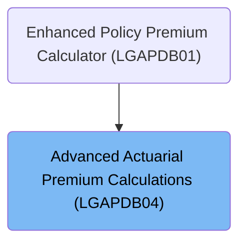

# Overview

This document describes the flow for calculating property insurance premiums. The process determines exposures and insured value, applies experience and schedule modifiers, and finalizes the premium and rate factor based on business rules and regulatory requirements.

## Dependencies

### Program

- LGAPDB04 (<SwmPath>[base/src/LGAPDB04.cbl](base/src/LGAPDB04.cbl)</SwmPath>)

### Copybook

- SQLCA

# Where is this program used?

This program is used once, as represented in the following diagram:

&nbsp;

*This is an auto-generated document by Swimm 🌊 and has not yet been verified by a human*

<SwmMeta version="3.0.0" repo-id="Z2l0aHViJTNBJTNBU3dpbW1pby1nZW5hcHAtbW90b3IlM0ElM0FHaXJpLVN3aW1t" repo-name="Swimmio-genapp-motor">Powered by [Swimm](https://app.swimm.io/)</SwmMeta>
