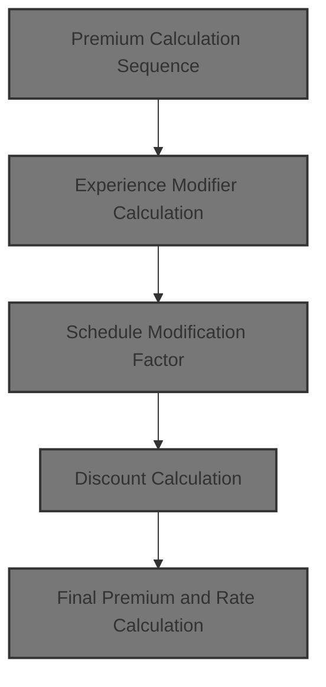
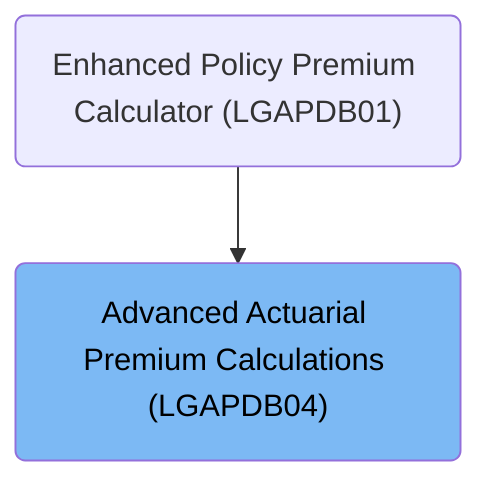

# Overview

This document explains how insurance premiums are calculated by evaluating risk factors, applying business rules for experience and schedule modifiers, determining eligible discounts, and producing the final premium and rate factor.

## Dependencies

### Copybook

- SQLCA

# Where is this program used?

This program is used once, as represented in the following diagram:

&nbsp;

*This is an auto-generated document by Swimm 🌊 and has not yet been verified by a human*

<SwmMeta version="3.0.0" repo-id="Z2l0aHViJTNBJTNBU3dpbW1pby1nZW5hcHAtbW90b3IlM0ElM0FHaXJpLVN3aW1t" repo-name="Swimmio-genapp-motor">Powered by [Swimm](https://app.swimm.io/)</SwmMeta>
