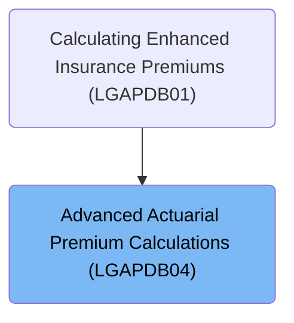

# Overview

This document outlines the process for calculating an insurance premium by adjusting for claims experience, aggregating premiums for selected perils, and applying taxes and regulatory caps. The calculation ensures the final premium reflects the policyholder's risk profile and complies with business rules.

## Dependencies

### Copybook

- SQLCA

# Where is this program used?

This program is used once, as represented in the following diagram:

&nbsp;

*This is an auto-generated document by Swimm 🌊 and has not yet been verified by a human*

<SwmMeta version="3.0.0" repo-id="Z2l0aHViJTNBJTNBU3dpbW1pby1nZW5hcHAtbW90b3IlM0ElM0FHaXJpLVN3aW1t" repo-name="Swimmio-genapp-motor">Powered by [Swimm](https://app.swimm.io/)</SwmMeta>
