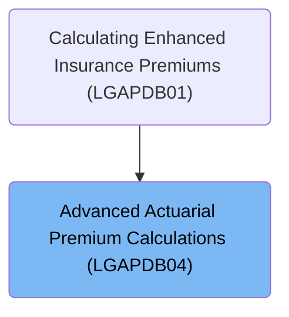

# Overview

This document describes the flow for calculating advanced insurance premiums for business properties. Coverage limits, risk scores, business history, and claims data are used to set up exposures and modifiers, calculate base premiums for selected perils, and aggregate all components to produce the final premium and rate factor.

## Dependencies

### Copybook

- SQLCA

# Where is this program used?

This program is used once, as represented in the following diagram:

&nbsp;

*This is an auto-generated document by Swimm 🌊 and has not yet been verified by a human*

<SwmMeta version="3.0.0" repo-id="Z2l0aHViJTNBJTNBU3dpbW1pby1nZW5hcHAtbW90b3IlM0ElM0FHaXJpLVN3aW1t" repo-name="Swimmio-genapp-motor">Powered by [Swimm](https://app.swimm.io/)</SwmMeta>
