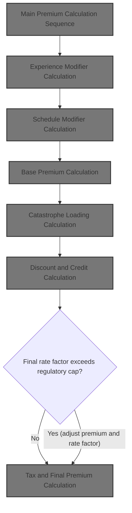
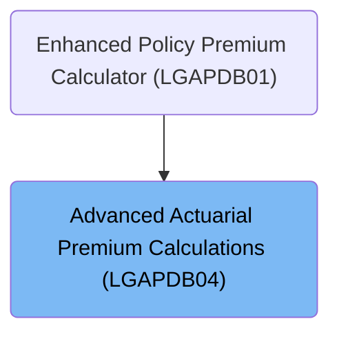
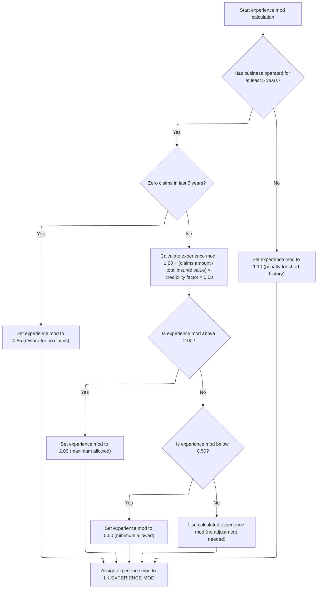
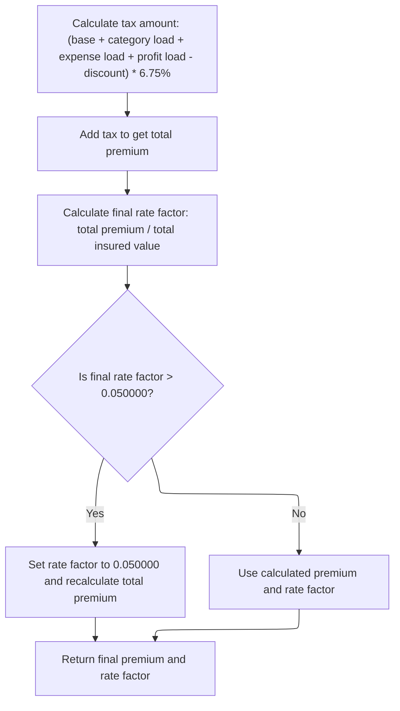

# Overview

This document describes the flow for calculating property insurance premiums by evaluating risk factors, applying actuarial modifiers, aggregating peril premiums, adding catastrophe loadings, applying discounts and credits, and enforcing regulatory caps.



## Dependencies

### Program

- <SwmToken path="base/src/LGAPDB04.cbl" pos="2:6:6" line-data="       PROGRAM-ID. LGAPDB04.">`LGAPDB04`</SwmToken> (<SwmPath>[base/src/LGAPDB04.cbl](base/src/LGAPDB04.cbl)</SwmPath>)

### Copybook

- SQLCA

# Where is this program used?

This program is used once, as represented in the following diagram:



## Input and Output Tables/Files used in the Program

| Table / File Name                                                                                                         | Type | Description                                                          | Usage Mode | Key Fields / Layout Highlights                                                                                                                                                                                                                                                                                                                                                                                                                                                                                                                                                                                                                                                                                                                   |
| ------------------------------------------------------------------------------------------------------------------------- | ---- | -------------------------------------------------------------------- | ---------- | ------------------------------------------------------------------------------------------------------------------------------------------------------------------------------------------------------------------------------------------------------------------------------------------------------------------------------------------------------------------------------------------------------------------------------------------------------------------------------------------------------------------------------------------------------------------------------------------------------------------------------------------------------------------------------------------------------------------------------------------------ |
| <SwmToken path="base/src/LGAPDB04.cbl" pos="183:3:3" line-data="               FROM RATE_MASTER">`RATE_MASTER`</SwmToken> | DB2  | Commercial property insurance rate parameters by peril and territory | Input      | <SwmToken path="base/src/LGAPDB04.cbl" pos="181:3:3" line-data="               SELECT BASE_RATE, MIN_PREMIUM, MAX_PREMIUM">`BASE_RATE`</SwmToken>, <SwmToken path="base/src/LGAPDB04.cbl" pos="181:6:6" line-data="               SELECT BASE_RATE, MIN_PREMIUM, MAX_PREMIUM">`MIN_PREMIUM`</SwmToken>, <SwmToken path="base/src/LGAPDB04.cbl" pos="325:1:5" line-data="                   WS-BASE-RATE (1, 1, 1, 1) * ">`WS-BASE-RATE`</SwmToken>, <SwmToken path="base/src/LGAPDB04.cbl" pos="51:3:7" line-data="                       25 WS-MIN-PREM   PIC 9(5)V99.">`WS-MIN-PREM`</SwmToken>, <SwmToken path="base/src/LGAPDB04.cbl" pos="52:3:7" line-data="                       25 WS-MAX-PREM   PIC 9(7)V99.">`WS-MAX-PREM`</SwmToken> |

&nbsp;

## Detailed View of the Program's Functionality

# a. Main Premium Calculation Sequence

The main sequence begins by initializing all necessary data and calculation areas. It then loads the relevant rate tables, calculates exposures, and proceeds through a series of calculation steps, each building on the results of the previous. The steps are:

 1. **Initialization**: All calculation work areas and rate tables are reset. Exposures for building, contents, and business interruption are calculated, adjusted for risk score, and summed to get the total insured value. Exposure density is also computed.
 2. **Rate Table Loading**: Base rates for each peril (fire, crime, flood, weather) are loaded from a database or set to default values if not found.
 3. **Experience Modifier Calculation**: The experience modifier is determined based on years in business and claims history, with adjustments for claims amount and credibility, and capped within allowed limits.
 4. **Schedule Modifier Calculation**: The schedule modifier is calculated by adjusting for building age, protection class, occupancy code, and exposure density, then capped within allowed bounds.
 5. **Base Premium Calculation**: For each selected peril, the premium is calculated using exposures, base rates, experience and schedule modifiers, and trend factors. These are summed to form the base premium.
 6. **Catastrophe Loading Calculation**: Additional loadings are added for hurricane, earthquake, tornado, and flood, depending on peril selection, using fixed factors.
 7. **Expense and Profit Loading**: Expense and profit loads are calculated as percentages of the base premium plus catastrophe loading.
 8. **Discount and Credit Calculation**: Discounts are applied for multi-peril coverage, claims-free history, and high deductibles. The total discount is capped and applied to the sum of premium components.
 9. **Tax Calculation**: Tax is calculated on the discounted premium sum using a fixed rate.
10. **Final Premium Calculation**: The total premium is finalized by summing all components, and the rate factor is calculated and capped if necessary.

# b. Experience Modifier Calculation

This step determines how much the premium should be adjusted based on the insured's claims history and tenure:

- If the business has operated for at least 5 years:
  - If there have been zero claims in the last 5 years, a significant discount is applied by setting the modifier to 0.85.
  - If there have been claims, the modifier is calculated by adding a proportion of the claims amount (relative to total insured value), weighted by a credibility factor and a scaling constant, to a base value of 1.00.
  - The result is then capped: if above 2.00, it's set to 2.00; if below <SwmToken path="base/src/LGAPDB04.cbl" pos="244:9:11" line-data="                        WS-CREDIBILITY-FACTOR * 0.50)">`0.50`</SwmToken>, it's set to <SwmToken path="base/src/LGAPDB04.cbl" pos="244:9:11" line-data="                        WS-CREDIBILITY-FACTOR * 0.50)">`0.50`</SwmToken>.
- If the business has operated for less than 5 years, a penalty modifier of 1.10 is applied.
- The final modifier is stored for use in subsequent calculations.

# c. Schedule Modifier Calculation

This step adjusts the premium based on risk characteristics of the property:

- Starts at zero.
- Adjusts for building age:
  - Newer buildings (2010 or later) get a reduction.
  - Older buildings (pre-1970) get increasing surcharges.
- Adjusts for protection class:
  - Better classes (lower numbers) get reductions; worse classes get surcharges.
- Adjusts for occupancy code:
  - Office and some manufacturing codes get reductions or surcharges.
- Adjusts for exposure density:
  - Very high density gets a surcharge; very low density gets a reduction.
- The total modifier is capped between +<SwmToken path="base/src/LGAPDB04.cbl" pos="308:12:14" line-data="           IF WS-SCHEDULE-MOD &gt; +0.400">`0.400`</SwmToken> and <SwmToken path="base/src/LGAPDB04.cbl" pos="312:11:14" line-data="           IF WS-SCHEDULE-MOD &lt; -0.200">`-0.200`</SwmToken>.
- The result is stored for use in premium calculations.

# d. Base Premium Calculation

For each peril selected (fire, crime, flood, weather):

- The relevant exposure is multiplied by the peril's base rate, the experience modifier, (1 + schedule modifier), and the trend factor.
- For crime, only 80% of contents exposure is used.
- For flood, building exposure is used and the result is further multiplied by <SwmToken path="base/src/LGAPDB04.cbl" pos="352:9:11" line-data="                   WS-TREND-FACTOR * 1.25">`1.25`</SwmToken>.
- Each peril's premium is added to the base premium amount.
- The total base premium is output for further calculations.

# e. Catastrophe Loading Calculation

This step adds extra charges for catastrophic risks:

- If weather peril is selected, a hurricane loading is added as a percentage of the weather premium.
- An earthquake loading is always added as a percentage of the base premium.
- If weather peril is selected, a tornado loading is added as a percentage of the weather premium.
- If flood peril is selected, a flood loading is added as a percentage of the flood premium.
- The total catastrophe loading is output for use in the next steps.

# f. Expense and Profit Loading

- Expense loading is calculated as a fixed percentage of the sum of base premium and catastrophe loading.
- Profit loading is calculated as a fixed percentage of the sum of base premium, catastrophe loading, and expense loading.
- Both are output for use in the final premium calculation.

# g. Discount and Credit Calculation

This step applies discounts and credits:

- <SwmToken path="base/src/LGAPDB04.cbl" pos="410:3:5" line-data="      * Multi-peril discount">`Multi-peril`</SwmToken> discount: 10% if all four perils are covered, 5% if fire and weather plus either crime or flood are covered, otherwise 0%.
- <SwmToken path="base/src/LGAPDB04.cbl" pos="425:3:5" line-data="      * Claims-free discount  ">`Claims-free`</SwmToken> discount: 7.5% if zero claims in 5 years and at least 5 years in business, otherwise 0%.
- Deductible credits: 2.5% for high fire deductible, 3.5% for high wind deductible, 4.5% for high flood deductible.
- All discounts and credits are summed and capped at 25%.
- The total discount is applied to the sum of base premium, catastrophe loading, expense loading, and profit loading.
- The discount amount is output for use in the final calculation.

# h. Tax and Final Premium Calculation

- Tax is calculated as 6.75% of the sum of base premium, catastrophe loading, expense loading, and profit loading, minus the discount.
- The total premium is calculated by summing all components and adding tax.
- The final rate factor is calculated as the total premium divided by the total insured value.
- If the rate factor exceeds 0.05, it is capped at 0.05 and the total premium is recalculated accordingly.
- The final premium and rate factor are output as the result of the calculation sequence.

# Data Definitions

| Table / Record Name                                                                                                       | Type | Short Description                                                    | Usage Mode     |
| ------------------------------------------------------------------------------------------------------------------------- | ---- | -------------------------------------------------------------------- | -------------- |
| <SwmToken path="base/src/LGAPDB04.cbl" pos="183:3:3" line-data="               FROM RATE_MASTER">`RATE_MASTER`</SwmToken> | DB2  | Commercial property insurance rate parameters by peril and territory | Input (SELECT) |

&nbsp;

# Rule Definition

| Paragraph Name                                                                                                                 | Rule ID | Category    | Description                                                                                                                                                                                                                                                                                                                                                                                                                                                                         | Conditions                                                                                                                                                                                                                                                                                                                                                                                                                                                                                                                                                                                                                                           | Remarks                                                                                                                                                                                                                                                                                                                                                                                                                                                               |
| ------------------------------------------------------------------------------------------------------------------------------ | ------- | ----------- | ----------------------------------------------------------------------------------------------------------------------------------------------------------------------------------------------------------------------------------------------------------------------------------------------------------------------------------------------------------------------------------------------------------------------------------------------------------------------------------- | ---------------------------------------------------------------------------------------------------------------------------------------------------------------------------------------------------------------------------------------------------------------------------------------------------------------------------------------------------------------------------------------------------------------------------------------------------------------------------------------------------------------------------------------------------------------------------------------------------------------------------------------------------- | --------------------------------------------------------------------------------------------------------------------------------------------------------------------------------------------------------------------------------------------------------------------------------------------------------------------------------------------------------------------------------------------------------------------------------------------------------------------- |
| <SwmToken path="base/src/LGAPDB04.cbl" pos="142:3:7" line-data="           PERFORM P400-EXP-MOD">`P400-EXP-MOD`</SwmToken>     | RL-001  | Computation | Calculates the experience modifier based on years in business, claims count in last 5 years, claims amount, total insured value, and credibility factor. Applies specific formulas and caps based on conditions.                                                                                                                                                                                                                                                                    | If years in business >= 5 and claims count in last 5 years is zero, set experience modifier to 0.85. If years in business >= 5 and claims count > 0, calculate experience modifier as: 1.00 + (claims amount / total insured value) × credibility factor × <SwmToken path="base/src/LGAPDB04.cbl" pos="244:9:11" line-data="                        WS-CREDIBILITY-FACTOR * 0.50)">`0.50`</SwmToken>. Cap experience modifier between <SwmToken path="base/src/LGAPDB04.cbl" pos="244:9:11" line-data="                        WS-CREDIBILITY-FACTOR * 0.50)">`0.50`</SwmToken> and 2.00. If years in business < 5, set experience modifier to 1.10. | Credibility factor is <SwmToken path="base/src/LGAPDB04.cbl" pos="27:15:17" line-data="           05 WS-CREDIBILITY-FACTOR    PIC V999 VALUE 0.750.">`0.750`</SwmToken>. Experience modifier is a decimal value, output as a number with up to 4 decimal places. Output field is <SwmToken path="base/src/LGAPDB04.cbl" pos="258:11:15" line-data="           MOVE WS-EXPERIENCE-MOD TO LK-EXPERIENCE-MOD.">`LK-EXPERIENCE-MOD`</SwmToken> (decimal, up to 4 places). |
| <SwmToken path="base/src/LGAPDB04.cbl" pos="143:3:7" line-data="           PERFORM P500-SCHED-MOD">`P500-SCHED-MOD`</SwmToken> | RL-002  | Computation | Calculates the schedule modifier starting at zero and adjusting based on building year, protection class, occupancy code, and exposure density, using fixed increments/decrements. Caps the modifier between +<SwmToken path="base/src/LGAPDB04.cbl" pos="308:12:14" line-data="           IF WS-SCHEDULE-MOD &gt; +0.400">`0.400`</SwmToken> and <SwmToken path="base/src/LGAPDB04.cbl" pos="312:11:14" line-data="           IF WS-SCHEDULE-MOD &lt; -0.200">`-0.200`</SwmToken>. | Adjustments based on:                                                                                                                                                                                                                                                                                                                                                                                                                                                                                                                                                                                                                                |                                                                                                                                                                                                                                                                                                                                                                                                                                                                       |

- Building year: subtract <SwmToken path="base/src/LGAPDB04.cbl" pos="266:3:5" line-data="                   SUBTRACT 0.050 FROM WS-SCHEDULE-MOD">`0.050`</SwmToken> if >=2010, add <SwmToken path="base/src/LGAPDB04.cbl" pos="270:3:5" line-data="                   ADD 0.100 TO WS-SCHEDULE-MOD">`0.100`</SwmToken> if >=1970, add <SwmToken path="base/src/LGAPDB04.cbl" pos="272:3:5" line-data="                   ADD 0.200 TO WS-SCHEDULE-MOD">`0.200`</SwmToken> if <1970
- Protection class: subtract <SwmToken path="base/src/LGAPDB04.cbl" pos="270:3:5" line-data="                   ADD 0.100 TO WS-SCHEDULE-MOD">`0.100`</SwmToken> for '01'-'03', subtract <SwmToken path="base/src/LGAPDB04.cbl" pos="266:3:5" line-data="                   SUBTRACT 0.050 FROM WS-SCHEDULE-MOD">`0.050`</SwmToken> for '04'-'06', add <SwmToken path="base/src/LGAPDB04.cbl" pos="284:3:5" line-data="                   ADD 0.150 TO WS-SCHEDULE-MOD">`0.150`</SwmToken> for other
- Occupancy code: subtract <SwmToken path="base/src/LGAPDB04.cbl" pos="290:3:5" line-data="                   SUBTRACT 0.025 FROM WS-SCHEDULE-MOD">`0.025`</SwmToken> for <SwmToken path="base/src/LGAPDB04.cbl" pos="289:4:4" line-data="               WHEN &#39;OFF01&#39; THRU &#39;OFF05&#39;">`OFF01`</SwmToken>-<SwmToken path="base/src/LGAPDB04.cbl" pos="289:10:10" line-data="               WHEN &#39;OFF01&#39; THRU &#39;OFF05&#39;">`OFF05`</SwmToken>, add <SwmToken path="base/src/LGAPDB04.cbl" pos="292:3:5" line-data="                   ADD 0.075 TO WS-SCHEDULE-MOD">`0.075`</SwmToken> for <SwmToken path="base/src/LGAPDB04.cbl" pos="291:4:4" line-data="               WHEN &#39;MFG01&#39; THRU &#39;MFG10&#39;">`MFG01`</SwmToken>-<SwmToken path="base/src/LGAPDB04.cbl" pos="291:10:10" line-data="               WHEN &#39;MFG01&#39; THRU &#39;MFG10&#39;">`MFG10`</SwmToken>, add <SwmToken path="base/src/LGAPDB04.cbl" pos="294:3:5" line-data="                   ADD 0.125 TO WS-SCHEDULE-MOD">`0.125`</SwmToken> for <SwmToken path="base/src/LGAPDB04.cbl" pos="293:4:4" line-data="               WHEN &#39;WHS01&#39; THRU &#39;WHS05&#39;">`WHS01`</SwmToken>-<SwmToken path="base/src/LGAPDB04.cbl" pos="293:10:10" line-data="               WHEN &#39;WHS01&#39; THRU &#39;WHS05&#39;">`WHS05`</SwmToken>
- Exposure density: add <SwmToken path="base/src/LGAPDB04.cbl" pos="270:3:5" line-data="                   ADD 0.100 TO WS-SCHEDULE-MOD">`0.100`</SwmToken> if ><SwmToken path="base/src/LGAPDB04.cbl" pos="300:11:13" line-data="           IF WS-EXPOSURE-DENSITY &gt; 500.00">`500.00`</SwmToken>, subtract <SwmToken path="base/src/LGAPDB04.cbl" pos="266:3:5" line-data="                   SUBTRACT 0.050 FROM WS-SCHEDULE-MOD">`0.050`</SwmToken> if <<SwmToken path="base/src/LGAPDB04.cbl" pos="303:11:13" line-data="               IF WS-EXPOSURE-DENSITY &lt; 50.00">`50.00`</SwmToken>
- Cap between +<SwmToken path="base/src/LGAPDB04.cbl" pos="308:12:14" line-data="           IF WS-SCHEDULE-MOD &gt; +0.400">`0.400`</SwmToken> and <SwmToken path="base/src/LGAPDB04.cbl" pos="312:11:14" line-data="           IF WS-SCHEDULE-MOD &lt; -0.200">`-0.200`</SwmToken> | Schedule modifier is a signed decimal value, output as a number with up to 3 decimal places. Output field is <SwmToken path="base/src/LGAPDB04.cbl" pos="316:11:15" line-data="           MOVE WS-SCHEDULE-MOD TO LK-SCHEDULE-MOD.">`LK-SCHEDULE-MOD`</SwmToken> (signed decimal, up to 3 places). | | <SwmToken path="base/src/LGAPDB04.cbl" pos="144:3:7" line-data="           PERFORM P600-BASE-PREM">`P600-BASE-PREM`</SwmToken> | RL-003 | Computation | Calculates base premium by summing premiums for each selected peril (fire, crime, flood, weather) using specific formulas for each peril. | If peril is selected (>0), calculate premium using:
- Fire: (Building + Contents Exposure) × Fire Rate × Experience Mod × (1 + Schedule Mod) × Trend Factor
- Crime: (Contents Exposure × <SwmToken path="base/src/LGAPDB04.cbl" pos="336:10:12" line-data="                   (WS-CONTENTS-EXPOSURE * 0.80) *">`0.80`</SwmToken>) × Crime Rate × Experience Mod × (1 + Schedule Mod) × Trend Factor
- Flood: (Building Exposure) × Flood Rate × Experience Mod × (1 + Schedule Mod) × Trend Factor × <SwmToken path="base/src/LGAPDB04.cbl" pos="352:9:11" line-data="                   WS-TREND-FACTOR * 1.25">`1.25`</SwmToken>
- Weather: (Building + Contents Exposure) × Weather Rate × Experience Mod × (1 + Schedule Mod) × Trend Factor | Trend factor is <SwmToken path="base/src/LGAPDB04.cbl" pos="26:15:17" line-data="           05 WS-TREND-FACTOR          PIC V9999 VALUE 1.0350.">`1.0350`</SwmToken>. Output fields are <SwmToken path="base/src/LGAPDB04.cbl" pos="323:3:7" line-data="               COMPUTE LK-FIRE-PREMIUM = ">`LK-FIRE-PREMIUM`</SwmToken>, <SwmToken path="base/src/LGAPDB04.cbl" pos="335:3:7" line-data="               COMPUTE LK-CRIME-PREMIUM = ">`LK-CRIME-PREMIUM`</SwmToken>, <SwmToken path="base/src/LGAPDB04.cbl" pos="347:3:7" line-data="               COMPUTE LK-FLOOD-PREMIUM = ">`LK-FLOOD-PREMIUM`</SwmToken>, <SwmToken path="base/src/LGAPDB04.cbl" pos="359:3:7" line-data="               COMPUTE LK-WEATHER-PREMIUM = ">`LK-WEATHER-PREMIUM`</SwmToken> (decimal, up to 8 digits before decimal, 2 after). Base amount is <SwmToken path="base/src/LGAPDB04.cbl" pos="319:7:11" line-data="           MOVE ZERO TO LK-BASE-AMOUNT">`LK-BASE-AMOUNT`</SwmToken> (decimal, up to 9 digits before decimal, 2 after). | | <SwmToken path="base/src/LGAPDB04.cbl" pos="145:3:7" line-data="           PERFORM P700-CAT-LOAD">`P700-CAT-LOAD`</SwmToken> | RL-004 | Computation | Adds fixed percentages to premium components for selected perils: hurricane, earthquake, tornado, and flood. | If weather peril selected, add hurricane loading (weather premium × <SwmToken path="base/src/LGAPDB04.cbl" pos="352:9:11" line-data="                   WS-TREND-FACTOR * 1.25">`1.25`</SwmToken>%) and tornado loading (weather premium × 0.45%). Always add earthquake loading (base amount × 0.8%). If flood peril selected, add flood loading (flood premium × 0.9%). | Hurricane factor: <SwmToken path="base/src/LGAPDB04.cbl" pos="35:15:17" line-data="           05 WS-HURRICANE-FACTOR      PIC V9999 VALUE 0.0125.">`0.0125`</SwmToken>, Earthquake factor: <SwmToken path="base/src/LGAPDB04.cbl" pos="36:15:17" line-data="           05 WS-EARTHQUAKE-FACTOR     PIC V9999 VALUE 0.0080.">`0.0080`</SwmToken>, Tornado factor: <SwmToken path="base/src/LGAPDB04.cbl" pos="37:15:17" line-data="           05 WS-TORNADO-FACTOR        PIC V9999 VALUE 0.0045.">`0.0045`</SwmToken>, Flood factor: <SwmToken path="base/src/LGAPDB04.cbl" pos="38:15:17" line-data="           05 WS-FLOOD-FACTOR          PIC V9999 VALUE 0.0090.">`0.0090`</SwmToken>. Output field is <SwmToken path="base/src/LGAPDB04.cbl" pos="394:11:17" line-data="           MOVE WS-CAT-LOADING TO LK-CAT-LOAD-AMT.">`LK-CAT-LOAD-AMT`</SwmToken> (decimal, up to 7 digits before decimal, 2 after). | | <SwmToken path="base/src/LGAPDB04.cbl" pos="147:3:5" line-data="           PERFORM P900-DISC">`P900-DISC`</SwmToken> | RL-005 | Computation | Applies multi-peril discount, claims-free discount, and deductible credits based on conditions. Caps total discount at 0.25. Calculates discount amount as capped total discount × (base + cat + expense + profit loads). | <SwmToken path="base/src/LGAPDB04.cbl" pos="410:3:5" line-data="      * Multi-peril discount">`Multi-peril`</SwmToken> discount: 0.10 if all four perils covered, 0.05 if fire & weather plus crime or flood, else 0. <SwmToken path="base/src/LGAPDB04.cbl" pos="425:3:5" line-data="      * Claims-free discount  ">`Claims-free`</SwmToken> discount: <SwmToken path="base/src/LGAPDB04.cbl" pos="292:3:5" line-data="                   ADD 0.075 TO WS-SCHEDULE-MOD">`0.075`</SwmToken> if zero claims in 5 years and >=5 years in business, else 0. Deductible credits: <SwmToken path="base/src/LGAPDB04.cbl" pos="290:3:5" line-data="                   SUBTRACT 0.025 FROM WS-SCHEDULE-MOD">`0.025`</SwmToken> if fire deductible >= 10000, <SwmToken path="base/src/LGAPDB04.cbl" pos="437:3:5" line-data="               ADD 0.035 TO WS-DEDUCTIBLE-CREDIT">`0.035`</SwmToken> if wind deductible >= 25000, <SwmToken path="base/src/LGAPDB04.cbl" pos="440:3:5" line-data="               ADD 0.045 TO WS-DEDUCTIBLE-CREDIT">`0.045`</SwmToken> if flood deductible >= 50000. Cap total discount at 0.25. | <SwmToken path="base/src/LGAPDB04.cbl" pos="410:3:5" line-data="      * Multi-peril discount">`Multi-peril`</SwmToken> discount: 0.10 or 0.05. <SwmToken path="base/src/LGAPDB04.cbl" pos="425:3:5" line-data="      * Claims-free discount  ">`Claims-free`</SwmToken> discount: <SwmToken path="base/src/LGAPDB04.cbl" pos="292:3:5" line-data="                   ADD 0.075 TO WS-SCHEDULE-MOD">`0.075`</SwmToken>. Deductible credits: <SwmToken path="base/src/LGAPDB04.cbl" pos="290:3:5" line-data="                   SUBTRACT 0.025 FROM WS-SCHEDULE-MOD">`0.025`</SwmToken>, <SwmToken path="base/src/LGAPDB04.cbl" pos="437:3:5" line-data="               ADD 0.035 TO WS-DEDUCTIBLE-CREDIT">`0.035`</SwmToken>, <SwmToken path="base/src/LGAPDB04.cbl" pos="440:3:5" line-data="               ADD 0.045 TO WS-DEDUCTIBLE-CREDIT">`0.045`</SwmToken>. Discount amount output as <SwmToken path="base/src/LGAPDB04.cbl" pos="451:3:7" line-data="           COMPUTE LK-DISCOUNT-AMT = ">`LK-DISCOUNT-AMT`</SwmToken> (decimal, up to 7 digits before decimal, 2 after). | | <SwmToken path="base/src/LGAPDB04.cbl" pos="148:3:5" line-data="           PERFORM P950-TAXES">`P950-TAXES`</SwmToken> | RL-006 | Computation | Calculates tax as (base + cat load + expense load + profit load - discount) × 6.75%. | Tax rate is 6.75%. | Tax rate: <SwmToken path="base/src/LGAPDB04.cbl" pos="460:10:12" line-data="                LK-DISCOUNT-AMT) * 0.0675">`0.0675`</SwmToken>. Output field is <SwmToken path="base/src/LGAPDB04.cbl" pos="462:11:15" line-data="           MOVE WS-TAX-AMOUNT TO LK-TAX-AMT.">`LK-TAX-AMT`</SwmToken> (decimal, up to 6 digits before decimal, 2 after). | | <SwmToken path="base/src/LGAPDB04.cbl" pos="149:3:5" line-data="           PERFORM P999-FINAL">`P999-FINAL`</SwmToken> | RL-007 | Computation | Calculates final premium by summing all premium components, subtracting discount, adding tax, and calculating final rate factor as total premium / total insured value. If final rate factor > <SwmToken path="base/src/LGAPDB04.cbl" pos="473:13:15" line-data="           IF LK-FINAL-RATE-FACTOR &gt; 0.050000">`0.050000`</SwmToken>, cap rate factor at <SwmToken path="base/src/LGAPDB04.cbl" pos="473:13:15" line-data="           IF LK-FINAL-RATE-FACTOR &gt; 0.050000">`0.050000`</SwmToken> and recalculate total premium. | If final rate factor > <SwmToken path="base/src/LGAPDB04.cbl" pos="473:13:15" line-data="           IF LK-FINAL-RATE-FACTOR &gt; 0.050000">`0.050000`</SwmToken>, cap rate factor at <SwmToken path="base/src/LGAPDB04.cbl" pos="473:13:15" line-data="           IF LK-FINAL-RATE-FACTOR &gt; 0.050000">`0.050000`</SwmToken> and recalculate total premium. | Maximum rate factor: <SwmToken path="base/src/LGAPDB04.cbl" pos="473:13:15" line-data="           IF LK-FINAL-RATE-FACTOR &gt; 0.050000">`0.050000`</SwmToken>. Output fields are <SwmToken path="base/src/LGAPDB04.cbl" pos="465:3:7" line-data="           COMPUTE LK-TOTAL-PREMIUM = ">`LK-TOTAL-PREMIUM`</SwmToken> (decimal, up to 9 digits before decimal, 2 after), <SwmToken path="base/src/LGAPDB04.cbl" pos="470:3:9" line-data="           COMPUTE LK-FINAL-RATE-FACTOR = ">`LK-FINAL-RATE-FACTOR`</SwmToken> (decimal, up to 4 places). | | <SwmToken path="base/src/LGAPDB04.cbl" pos="116:3:7" line-data="       01  LK-OUTPUT-RESULTS.">`LK-OUTPUT-RESULTS`</SwmToken> assignment throughout calculation paragraphs | RL-008 | Data Assignment | Ensures all calculated premium components and modifiers are assigned to the output structure as described in <SwmToken path="base/src/LGAPDB04.cbl" pos="116:3:7" line-data="       01  LK-OUTPUT-RESULTS.">`LK-OUTPUT-RESULTS`</SwmToken>. | After each calculation step, assign the result to the corresponding output field. | Output fields include <SwmToken path="base/src/LGAPDB04.cbl" pos="323:3:7" line-data="               COMPUTE LK-FIRE-PREMIUM = ">`LK-FIRE-PREMIUM`</SwmToken>, <SwmToken path="base/src/LGAPDB04.cbl" pos="335:3:7" line-data="               COMPUTE LK-CRIME-PREMIUM = ">`LK-CRIME-PREMIUM`</SwmToken>, <SwmToken path="base/src/LGAPDB04.cbl" pos="347:3:7" line-data="               COMPUTE LK-FLOOD-PREMIUM = ">`LK-FLOOD-PREMIUM`</SwmToken>, <SwmToken path="base/src/LGAPDB04.cbl" pos="359:3:7" line-data="               COMPUTE LK-WEATHER-PREMIUM = ">`LK-WEATHER-PREMIUM`</SwmToken>, <SwmToken path="base/src/LGAPDB04.cbl" pos="465:3:7" line-data="           COMPUTE LK-TOTAL-PREMIUM = ">`LK-TOTAL-PREMIUM`</SwmToken>, <SwmToken path="base/src/LGAPDB04.cbl" pos="319:7:11" line-data="           MOVE ZERO TO LK-BASE-AMOUNT">`LK-BASE-AMOUNT`</SwmToken>, <SwmToken path="base/src/LGAPDB04.cbl" pos="394:11:17" line-data="           MOVE WS-CAT-LOADING TO LK-CAT-LOAD-AMT.">`LK-CAT-LOAD-AMT`</SwmToken>, <SwmToken path="base/src/LGAPDB04.cbl" pos="453:1:7" line-data="                LK-EXPENSE-LOAD-AMT + LK-PROFIT-LOAD-AMT) *">`LK-EXPENSE-LOAD-AMT`</SwmToken>, <SwmToken path="base/src/LGAPDB04.cbl" pos="453:11:17" line-data="                LK-EXPENSE-LOAD-AMT + LK-PROFIT-LOAD-AMT) *">`LK-PROFIT-LOAD-AMT`</SwmToken>, <SwmToken path="base/src/LGAPDB04.cbl" pos="451:3:7" line-data="           COMPUTE LK-DISCOUNT-AMT = ">`LK-DISCOUNT-AMT`</SwmToken>, <SwmToken path="base/src/LGAPDB04.cbl" pos="462:11:15" line-data="           MOVE WS-TAX-AMOUNT TO LK-TAX-AMT.">`LK-TAX-AMT`</SwmToken>, <SwmToken path="base/src/LGAPDB04.cbl" pos="258:11:15" line-data="           MOVE WS-EXPERIENCE-MOD TO LK-EXPERIENCE-MOD.">`LK-EXPERIENCE-MOD`</SwmToken>, <SwmToken path="base/src/LGAPDB04.cbl" pos="316:11:15" line-data="           MOVE WS-SCHEDULE-MOD TO LK-SCHEDULE-MOD.">`LK-SCHEDULE-MOD`</SwmToken>, <SwmToken path="base/src/LGAPDB04.cbl" pos="470:3:9" line-data="           COMPUTE LK-FINAL-RATE-FACTOR = ">`LK-FINAL-RATE-FACTOR`</SwmToken>. Each field is a decimal or signed decimal as specified in the linkage section. |

# User Stories

## User Story 1: Calculate experience and schedule modifiers, and base premium for selected perils

---

### Story Description:

As a system, I want to calculate the experience modifier, schedule modifier, and base premium for each selected peril so that the premium calculation process starts with accurate risk and exposure adjustments.

---

### Business Rule Mapping:

| Rule ID | Paragraph Name                                                                                                                                                             | Rule Description                                                                                                                                                                                                                                                                                                                                                                                                                                                                    |
| ------- | -------------------------------------------------------------------------------------------------------------------------------------------------------------------------- | ----------------------------------------------------------------------------------------------------------------------------------------------------------------------------------------------------------------------------------------------------------------------------------------------------------------------------------------------------------------------------------------------------------------------------------------------------------------------------------- |
| RL-001  | <SwmToken path="base/src/LGAPDB04.cbl" pos="142:3:7" line-data="           PERFORM P400-EXP-MOD">`P400-EXP-MOD`</SwmToken>                                                 | Calculates the experience modifier based on years in business, claims count in last 5 years, claims amount, total insured value, and credibility factor. Applies specific formulas and caps based on conditions.                                                                                                                                                                                                                                                                    |
| RL-002  | <SwmToken path="base/src/LGAPDB04.cbl" pos="143:3:7" line-data="           PERFORM P500-SCHED-MOD">`P500-SCHED-MOD`</SwmToken>                                             | Calculates the schedule modifier starting at zero and adjusting based on building year, protection class, occupancy code, and exposure density, using fixed increments/decrements. Caps the modifier between +<SwmToken path="base/src/LGAPDB04.cbl" pos="308:12:14" line-data="           IF WS-SCHEDULE-MOD &gt; +0.400">`0.400`</SwmToken> and <SwmToken path="base/src/LGAPDB04.cbl" pos="312:11:14" line-data="           IF WS-SCHEDULE-MOD &lt; -0.200">`-0.200`</SwmToken>. |
| RL-003  | <SwmToken path="base/src/LGAPDB04.cbl" pos="144:3:7" line-data="           PERFORM P600-BASE-PREM">`P600-BASE-PREM`</SwmToken>                                             | Calculates base premium by summing premiums for each selected peril (fire, crime, flood, weather) using specific formulas for each peril.                                                                                                                                                                                                                                                                                                                                           |
| RL-008  | <SwmToken path="base/src/LGAPDB04.cbl" pos="116:3:7" line-data="       01  LK-OUTPUT-RESULTS.">`LK-OUTPUT-RESULTS`</SwmToken> assignment throughout calculation paragraphs | Ensures all calculated premium components and modifiers are assigned to the output structure as described in <SwmToken path="base/src/LGAPDB04.cbl" pos="116:3:7" line-data="       01  LK-OUTPUT-RESULTS.">`LK-OUTPUT-RESULTS`</SwmToken>.                                                                                                                                                                                                                                         |

---

### Relevant Functionality:

- <SwmToken path="base/src/LGAPDB04.cbl" pos="142:3:7" line-data="           PERFORM P400-EXP-MOD">`P400-EXP-MOD`</SwmToken>
  1. **RL-001:**
     - If years in business >= 5:
       - If claims count in last 5 years == 0:
         - Set experience modifier to 0.85
       - Else:
         - Calculate experience modifier as 1.00 + (claims amount / total insured value) × credibility factor × <SwmToken path="base/src/LGAPDB04.cbl" pos="244:9:11" line-data="                        WS-CREDIBILITY-FACTOR * 0.50)">`0.50`</SwmToken>
         - Cap experience modifier at 2.00 maximum, <SwmToken path="base/src/LGAPDB04.cbl" pos="244:9:11" line-data="                        WS-CREDIBILITY-FACTOR * 0.50)">`0.50`</SwmToken> minimum
     - Else:
       - Set experience modifier to 1.10
     - Store experience modifier in output
- <SwmToken path="base/src/LGAPDB04.cbl" pos="143:3:7" line-data="           PERFORM P500-SCHED-MOD">`P500-SCHED-MOD`</SwmToken>
  1. **RL-002:**
     - Start schedule modifier at 0
     - Adjust for building year
     - Adjust for protection class
     - Adjust for occupancy code
     - Adjust for exposure density
     - Cap schedule modifier at +<SwmToken path="base/src/LGAPDB04.cbl" pos="308:12:14" line-data="           IF WS-SCHEDULE-MOD &gt; +0.400">`0.400`</SwmToken> and <SwmToken path="base/src/LGAPDB04.cbl" pos="312:11:14" line-data="           IF WS-SCHEDULE-MOD &lt; -0.200">`-0.200`</SwmToken>
     - Store schedule modifier in output
- <SwmToken path="base/src/LGAPDB04.cbl" pos="144:3:7" line-data="           PERFORM P600-BASE-PREM">`P600-BASE-PREM`</SwmToken>
  1. **RL-003:**
     - For each peril:
       - If peril selected:
         - Calculate premium using formula
         - Add premium to base amount
     - Store each peril premium and base amount in output
- <SwmToken path="base/src/LGAPDB04.cbl" pos="116:3:7" line-data="       01  LK-OUTPUT-RESULTS.">`LK-OUTPUT-RESULTS`</SwmToken> **assignment throughout calculation paragraphs**
  1. **RL-008:**
     - After each calculation step:
       - Assign calculated value to corresponding output field
     - Ensure all output fields are populated according to <SwmToken path="base/src/LGAPDB04.cbl" pos="116:3:7" line-data="       01  LK-OUTPUT-RESULTS.">`LK-OUTPUT-RESULTS`</SwmToken> structure

## User Story 2: Apply catastrophe loading, discounts, credits, and calculate tax

---

### Story Description:

As a system, I want to apply catastrophe loading, discounts, deductible credits, and calculate tax so that the premium reflects all applicable risk loadings, incentives, and statutory charges.

---

### Business Rule Mapping:

| Rule ID | Paragraph Name                                                                                                                                                             | Rule Description                                                                                                                                                                                                                            |
| ------- | -------------------------------------------------------------------------------------------------------------------------------------------------------------------------- | ------------------------------------------------------------------------------------------------------------------------------------------------------------------------------------------------------------------------------------------- |
| RL-004  | <SwmToken path="base/src/LGAPDB04.cbl" pos="145:3:7" line-data="           PERFORM P700-CAT-LOAD">`P700-CAT-LOAD`</SwmToken>                                               | Adds fixed percentages to premium components for selected perils: hurricane, earthquake, tornado, and flood.                                                                                                                                |
| RL-005  | <SwmToken path="base/src/LGAPDB04.cbl" pos="147:3:5" line-data="           PERFORM P900-DISC">`P900-DISC`</SwmToken>                                                       | Applies multi-peril discount, claims-free discount, and deductible credits based on conditions. Caps total discount at 0.25. Calculates discount amount as capped total discount × (base + cat + expense + profit loads).                   |
| RL-006  | <SwmToken path="base/src/LGAPDB04.cbl" pos="148:3:5" line-data="           PERFORM P950-TAXES">`P950-TAXES`</SwmToken>                                                     | Calculates tax as (base + cat load + expense load + profit load - discount) × 6.75%.                                                                                                                                                        |
| RL-008  | <SwmToken path="base/src/LGAPDB04.cbl" pos="116:3:7" line-data="       01  LK-OUTPUT-RESULTS.">`LK-OUTPUT-RESULTS`</SwmToken> assignment throughout calculation paragraphs | Ensures all calculated premium components and modifiers are assigned to the output structure as described in <SwmToken path="base/src/LGAPDB04.cbl" pos="116:3:7" line-data="       01  LK-OUTPUT-RESULTS.">`LK-OUTPUT-RESULTS`</SwmToken>. |

---

### Relevant Functionality:

- <SwmToken path="base/src/LGAPDB04.cbl" pos="145:3:7" line-data="           PERFORM P700-CAT-LOAD">`P700-CAT-LOAD`</SwmToken>
  1. **RL-004:**
     - Start catastrophe loading at 0
     - If weather peril selected:
       - Add hurricane loading
       - Add tornado loading
     - Add earthquake loading
     - If flood peril selected:
       - Add flood loading
     - Store catastrophe loading in output
- <SwmToken path="base/src/LGAPDB04.cbl" pos="147:3:5" line-data="           PERFORM P900-DISC">`P900-DISC`</SwmToken>
  1. **RL-005:**
     - Calculate multi-peril discount
     - Calculate claims-free discount
     - Calculate deductible credits
     - Sum discounts and cap at 0.25
     - Calculate discount amount as capped total discount × (base + cat + expense + profit loads)
     - Store discount amount in output
- <SwmToken path="base/src/LGAPDB04.cbl" pos="148:3:5" line-data="           PERFORM P950-TAXES">`P950-TAXES`</SwmToken>
  1. **RL-006:**
     - Calculate tax as (base + cat load + expense load + profit load - discount) × <SwmToken path="base/src/LGAPDB04.cbl" pos="460:10:12" line-data="                LK-DISCOUNT-AMT) * 0.0675">`0.0675`</SwmToken>
     - Store tax amount in output
- <SwmToken path="base/src/LGAPDB04.cbl" pos="116:3:7" line-data="       01  LK-OUTPUT-RESULTS.">`LK-OUTPUT-RESULTS`</SwmToken> **assignment throughout calculation paragraphs**
  1. **RL-008:**
     - After each calculation step:
       - Assign calculated value to corresponding output field
     - Ensure all output fields are populated according to <SwmToken path="base/src/LGAPDB04.cbl" pos="116:3:7" line-data="       01  LK-OUTPUT-RESULTS.">`LK-OUTPUT-RESULTS`</SwmToken> structure

## User Story 3: Calculate final premium and rate factor, and assign all results to output

---

### Story Description:

As a system, I want to calculate the final premium and rate factor, ensuring caps are applied as required, and assign all calculated results to the output structure so that the user receives a complete and accurate premium breakdown.

---

### Business Rule Mapping:

| Rule ID | Paragraph Name                                                                                                                                                             | Rule Description                                                                                                                                                                                                                                                                                                                                                                                                                                                                                                                      |
| ------- | -------------------------------------------------------------------------------------------------------------------------------------------------------------------------- | ------------------------------------------------------------------------------------------------------------------------------------------------------------------------------------------------------------------------------------------------------------------------------------------------------------------------------------------------------------------------------------------------------------------------------------------------------------------------------------------------------------------------------------- |
| RL-007  | <SwmToken path="base/src/LGAPDB04.cbl" pos="149:3:5" line-data="           PERFORM P999-FINAL">`P999-FINAL`</SwmToken>                                                     | Calculates final premium by summing all premium components, subtracting discount, adding tax, and calculating final rate factor as total premium / total insured value. If final rate factor > <SwmToken path="base/src/LGAPDB04.cbl" pos="473:13:15" line-data="           IF LK-FINAL-RATE-FACTOR &gt; 0.050000">`0.050000`</SwmToken>, cap rate factor at <SwmToken path="base/src/LGAPDB04.cbl" pos="473:13:15" line-data="           IF LK-FINAL-RATE-FACTOR &gt; 0.050000">`0.050000`</SwmToken> and recalculate total premium. |
| RL-008  | <SwmToken path="base/src/LGAPDB04.cbl" pos="116:3:7" line-data="       01  LK-OUTPUT-RESULTS.">`LK-OUTPUT-RESULTS`</SwmToken> assignment throughout calculation paragraphs | Ensures all calculated premium components and modifiers are assigned to the output structure as described in <SwmToken path="base/src/LGAPDB04.cbl" pos="116:3:7" line-data="       01  LK-OUTPUT-RESULTS.">`LK-OUTPUT-RESULTS`</SwmToken>.                                                                                                                                                                                                                                                                                           |

---

### Relevant Functionality:

- <SwmToken path="base/src/LGAPDB04.cbl" pos="149:3:5" line-data="           PERFORM P999-FINAL">`P999-FINAL`</SwmToken>
  1. **RL-007:**
     - Calculate total premium as sum of all components minus discount plus tax
     - Calculate final rate factor as total premium / total insured value
     - If final rate factor > <SwmToken path="base/src/LGAPDB04.cbl" pos="473:13:15" line-data="           IF LK-FINAL-RATE-FACTOR &gt; 0.050000">`0.050000`</SwmToken>:
       - Cap rate factor at <SwmToken path="base/src/LGAPDB04.cbl" pos="473:13:15" line-data="           IF LK-FINAL-RATE-FACTOR &gt; 0.050000">`0.050000`</SwmToken>
       - Recalculate total premium as total insured value × capped rate factor
     - Store total premium and rate factor in output
- <SwmToken path="base/src/LGAPDB04.cbl" pos="116:3:7" line-data="       01  LK-OUTPUT-RESULTS.">`LK-OUTPUT-RESULTS`</SwmToken> **assignment throughout calculation paragraphs**
  1. **RL-008:**
     - After each calculation step:
       - Assign calculated value to corresponding output field
     - Ensure all output fields are populated according to <SwmToken path="base/src/LGAPDB04.cbl" pos="116:3:7" line-data="       01  LK-OUTPUT-RESULTS.">`LK-OUTPUT-RESULTS`</SwmToken> structure

# Workflow

# Main Premium Calculation Sequence

```mermaid
%%{init: {"flowchart": {"defaultRenderer": "elk"}} }%%
flowchart TD
    node1["Start premium calculation"] --> node2["Experience Modifier Calculation"]
    click node1 openCode "base/src/LGAPDB04.cbl:138:150"
    
    node2 --> node3["Schedule Modifier Calculation"]
    
    node3 --> node4["Base Premium Calculation"]
    
    node4 --> node5["Catastrophe Loading Calculation"]
    
    node5 --> node6["Discount and Credit Calculation"]
    
    node6 --> node7["Calculate taxes"]
    click node7 openCode "base/src/LGAPDB04.cbl:456:463"
    node7 --> node8{"Is final rate factor > 0.050000?"}
    click node8 openCode "base/src/LGAPDB04.cbl:464:477"
    node8 -->|"Yes"| node9["Adjust premium and rate factor to cap"]
    click node9 openCode "base/src/LGAPDB04.cbl:474:476"
    node8 -->|"No"| node10["Finalize premium"]
    click node10 openCode "base/src/LGAPDB04.cbl:465:472"
    node9 --> node10
classDef HeadingStyle fill:#777777,stroke:#333,stroke-width:2px;
click node2 goToHeading "Experience Modifier Calculation"
node2:::HeadingStyle
click node3 goToHeading "Schedule Modifier Calculation"
node3:::HeadingStyle
click node4 goToHeading "Base Premium Calculation"
node4:::HeadingStyle
click node5 goToHeading "Catastrophe Loading Calculation"
node5:::HeadingStyle
click node6 goToHeading "Discount and Credit Calculation"
node6:::HeadingStyle

%% Swimm:
%% %%{init: {"flowchart": {"defaultRenderer": "elk"}} }%%
%% flowchart TD
%%     node1["Start premium calculation"] --> node2["Experience Modifier Calculation"]
%%     click node1 openCode "<SwmPath>[base/src/LGAPDB04.cbl](base/src/LGAPDB04.cbl)</SwmPath>:138:150"
%%     
%%     node2 --> node3["Schedule Modifier Calculation"]
%%     
%%     node3 --> node4["Base Premium Calculation"]
%%     
%%     node4 --> node5["Catastrophe Loading Calculation"]
%%     
%%     node5 --> node6["Discount and Credit Calculation"]
%%     
%%     node6 --> node7["Calculate taxes"]
%%     click node7 openCode "<SwmPath>[base/src/LGAPDB04.cbl](base/src/LGAPDB04.cbl)</SwmPath>:456:463"
%%     node7 --> node8{"Is final rate factor > <SwmToken path="base/src/LGAPDB04.cbl" pos="473:13:15" line-data="           IF LK-FINAL-RATE-FACTOR &gt; 0.050000">`0.050000`</SwmToken>?"}
%%     click node8 openCode "<SwmPath>[base/src/LGAPDB04.cbl](base/src/LGAPDB04.cbl)</SwmPath>:464:477"
%%     node8 -->|"Yes"| node9["Adjust premium and rate factor to cap"]
%%     click node9 openCode "<SwmPath>[base/src/LGAPDB04.cbl](base/src/LGAPDB04.cbl)</SwmPath>:474:476"
%%     node8 -->|"No"| node10["Finalize premium"]
%%     click node10 openCode "<SwmPath>[base/src/LGAPDB04.cbl](base/src/LGAPDB04.cbl)</SwmPath>:465:472"
%%     node9 --> node10
%% classDef HeadingStyle fill:#777777,stroke:#333,stroke-width:2px;
%% click node2 goToHeading "Experience Modifier Calculation"
%% node2:::HeadingStyle
%% click node3 goToHeading "Schedule Modifier Calculation"
%% node3:::HeadingStyle
%% click node4 goToHeading "Base Premium Calculation"
%% node4:::HeadingStyle
%% click node5 goToHeading "Catastrophe Loading Calculation"
%% node5:::HeadingStyle
%% click node6 goToHeading "Discount and Credit Calculation"
%% node6:::HeadingStyle
```



This section governs the main sequence for calculating an insurance premium, ensuring all relevant risk factors, adjustments, and regulatory caps are applied to produce a compliant and accurate premium amount.

| Category        | Rule Name                        | Description                                                                                                                                                                                                                                                              |
| --------------- | -------------------------------- | ------------------------------------------------------------------------------------------------------------------------------------------------------------------------------------------------------------------------------------------------------------------------ |
| Data validation | Rate factor cap enforcement      | If the final rate factor exceeds <SwmToken path="base/src/LGAPDB04.cbl" pos="473:13:15" line-data="           IF LK-FINAL-RATE-FACTOR &gt; 0.050000">`0.050000`</SwmToken>, the premium and rate factor must be adjusted down to this cap before finalizing the premium. |
| Business logic  | Experience modifier prerequisite | The experience modifier must be calculated using the customer's claims history and years in business before any other premium components are determined.                                                                                                                 |
| Business logic  | Schedule modifier adjustment     | The schedule modifier must be calculated using building age, protection class, occupancy code, and exposure density to adjust the premium for property-specific risks.                                                                                                   |
| Business logic  | Base premium aggregation         | The base premium must be calculated by summing the premium amounts for all selected perils and coverages, using exposure values and rating factors.                                                                                                                      |
| Business logic  | Catastrophe loading inclusion    | Catastrophe loading must be calculated and added to the premium for hurricane, earthquake, tornado, and flood perils, if those coverages are selected.                                                                                                                   |
| Business logic  | Discount and credit application  | Discounts and credits must be calculated and applied to the premium based on coverage selections, absence of claims, deductible amounts, and years in business.                                                                                                          |
| Business logic  | Tax calculation sequence         | Taxes must be calculated and added to the premium after all other adjustments and discounts have been applied.                                                                                                                                                           |
| Business logic  | Calculation sequence order       | The premium calculation sequence must be completed in the prescribed order: experience modifier, schedule modifier, base premium, catastrophe loading, discounts/credits, taxes, rate cap check, and finalization.                                                       |

<SwmSnippet path="/base/src/LGAPDB04.cbl" line="138">

---

<SwmToken path="base/src/LGAPDB04.cbl" pos="138:1:3" line-data="       P100-MAIN.">`P100-MAIN`</SwmToken> kicks off the premium calculation flow. It runs the initialization, rates, and exposure logic, then calls <SwmToken path="base/src/LGAPDB04.cbl" pos="142:3:7" line-data="           PERFORM P400-EXP-MOD">`P400-EXP-MOD`</SwmToken> to get the experience modifier based on claims history and years in business. This modifier is needed before calculating the base premium and all downstream premium components, since it adjusts the premium for customer-specific risk.

```cobol
       P100-MAIN.
           PERFORM P200-INIT
           PERFORM P300-RATES
           PERFORM P350-EXPOSURE
           PERFORM P400-EXP-MOD
           PERFORM P500-SCHED-MOD
           PERFORM P600-BASE-PREM
           PERFORM P700-CAT-LOAD
           PERFORM P800-EXPENSE
           PERFORM P900-DISC
           PERFORM P950-TAXES
           PERFORM P999-FINAL
           GOBACK.
```

---

</SwmSnippet>

## Experience Modifier Calculation



This section calculates the experience modifier for a business insurance policy. The modifier adjusts the premium based on the business's claims history and longevity, using domain-specific constants to apply rewards, penalties, and caps.

| Category       | Rule Name                  | Description                                                                                                                                                                                                                                                                                                                                                                 |
| -------------- | -------------------------- | --------------------------------------------------------------------------------------------------------------------------------------------------------------------------------------------------------------------------------------------------------------------------------------------------------------------------------------------------------------------------- |
| Business logic | No claims reward           | If the business has operated for at least 5 years and has zero claims in the last 5 years, set the experience modifier to 0.85 as a reward for no claims.                                                                                                                                                                                                                   |
| Business logic | Claims penalty calculation | If the business has operated for at least 5 years and has claims in the last 5 years, calculate the experience modifier as 1.00 plus (claims amount divided by total insured value) times credibility factor times <SwmToken path="base/src/LGAPDB04.cbl" pos="244:9:11" line-data="                        WS-CREDIBILITY-FACTOR * 0.50)">`0.50`</SwmToken>.               |
| Business logic | Maximum modifier cap       | If the calculated experience modifier is above 2.00, set it to 2.00 as the maximum allowed value.                                                                                                                                                                                                                                                                           |
| Business logic | Minimum modifier floor     | If the calculated experience modifier is below <SwmToken path="base/src/LGAPDB04.cbl" pos="244:9:11" line-data="                        WS-CREDIBILITY-FACTOR * 0.50)">`0.50`</SwmToken>, set it to <SwmToken path="base/src/LGAPDB04.cbl" pos="244:9:11" line-data="                        WS-CREDIBILITY-FACTOR * 0.50)">`0.50`</SwmToken> as the minimum allowed value. |
| Business logic | Short history penalty      | If the business has operated for less than 5 years, set the experience modifier to 1.10 as a penalty for short operating history.                                                                                                                                                                                                                                           |

<SwmSnippet path="/base/src/LGAPDB04.cbl" line="234">

---

In <SwmToken path="base/src/LGAPDB04.cbl" pos="234:1:5" line-data="       P400-EXP-MOD.">`P400-EXP-MOD`</SwmToken> we set up the experience modifier using years in business, claims count, claims amount, total insured value, and a credibility factor. The logic applies discounts or surcharges based on these, using domain-specific constants, and assumes all inputs are valid.

```cobol
       P400-EXP-MOD.
           MOVE 1.0000 TO WS-EXPERIENCE-MOD
           
           IF LK-YEARS-IN-BUSINESS >= 5
               IF LK-CLAIMS-COUNT-5YR = ZERO
                   MOVE 0.8500 TO WS-EXPERIENCE-MOD
```

---

</SwmSnippet>

<SwmSnippet path="/base/src/LGAPDB04.cbl" line="240">

---

Next, if there are claims in the last 5 years, we calculate the experience modifier using the claims amount, total insured value, and credibility factor. No input validation is done here, so it relies on upstream checks.

```cobol
               ELSE
                   COMPUTE WS-EXPERIENCE-MOD = 
                       1.0000 + 
                       ((LK-CLAIMS-AMOUNT-5YR / WS-TOTAL-INSURED-VAL) * 
                        WS-CREDIBILITY-FACTOR * 0.50)
                   
                   IF WS-EXPERIENCE-MOD > 2.0000
                       MOVE 2.0000 TO WS-EXPERIENCE-MOD
                   END-IF
```

---

</SwmSnippet>

<SwmSnippet path="/base/src/LGAPDB04.cbl" line="250">

---

After calculating the modifier, we cap it between 0.5 and 2.0 using domain-specific constants. This keeps the adjustment within business-defined limits.

```cobol
                   IF WS-EXPERIENCE-MOD < 0.5000
                       MOVE 0.5000 TO WS-EXPERIENCE-MOD
                   END-IF
```

---

</SwmSnippet>

<SwmSnippet path="/base/src/LGAPDB04.cbl" line="254">

---

Finally, we set the calculated experience modifier to the output variable for use in all downstream premium calculations.

```cobol
           ELSE
               MOVE 1.1000 TO WS-EXPERIENCE-MOD
           END-IF
           
           MOVE WS-EXPERIENCE-MOD TO LK-EXPERIENCE-MOD.
```

---

</SwmSnippet>

## Schedule Modifier Calculation

```mermaid
%%{init: {"flowchart": {"defaultRenderer": "elk"}} }%%
flowchart TD
    node1["Start schedule mod calculation"]
    click node1 openCode "base/src/LGAPDB04.cbl:260:261"
    node1 --> node2{"Building age"}
    click node2 openCode "base/src/LGAPDB04.cbl:263:273"
    node2 -->|"#gt;=2010"| node3["Subtract 0.050 from mod"]
    click node3 openCode "base/src/LGAPDB04.cbl:265:266"
    node2 -->|"#gt;=1990"| node4["No change"]
    click node4 openCode "base/src/LGAPDB04.cbl:267:268"
    node2 -->|"#gt;=1970"| node5["Add 0.100 to mod"]
    click node5 openCode "base/src/LGAPDB04.cbl:269:270"
    node2 -->|"Other"| node6["Add 0.200 to mod"]
    click node6 openCode "base/src/LGAPDB04.cbl:271:272"
    node3 --> node7{"Protection class"}
    node4 --> node7
    node5 --> node7
    node6 --> node7
    click node7 openCode "base/src/LGAPDB04.cbl:276:285"
    node7 -->|"'01'-'03'"| node8["Subtract 0.100 from mod"]
    click node8 openCode "base/src/LGAPDB04.cbl:277:278"
    node7 -->|"'04'-'06'"| node9["Subtract 0.050 from mod"]
    click node9 openCode "base/src/LGAPDB04.cbl:279:280"
    node7 -->|"'07'-'09'"| node10["No change"]
    click node10 openCode "base/src/LGAPDB04.cbl:281:282"
    node7 -->|"Other"| node11["Add 0.150 to mod"]
    click node11 openCode "base/src/LGAPDB04.cbl:283:284"
    node8 --> node12{"Occupancy code"}
    node9 --> node12
    node10 --> node12
    node11 --> node12
    click node12 openCode "base/src/LGAPDB04.cbl:288:297"
    node12 -->|"OFF01-OFF05"| node13["Subtract 0.025 from mod"]
    click node13 openCode "base/src/LGAPDB04.cbl:289:290"
    node12 -->|"MFG01-MFG10"| node14["Add 0.075 to mod"]
    click node14 openCode "base/src/LGAPDB04.cbl:291:292"
    node12 -->|"WHS01-WHS05"| node15["Add 0.125 to mod"]
    click node15 openCode "base/src/LGAPDB04.cbl:293:294"
    node12 -->|"Other"| node16["No change"]
    click node16 openCode "base/src/LGAPDB04.cbl:295:296"
    node13 --> node17{"Exposure density"}
    node14 --> node17
    node15 --> node17
    node16 --> node17
    click node17 openCode "base/src/LGAPDB04.cbl:300:305"
    node17 -->|"#gt;500.00"| node18["Add 0.100 to mod"]
    click node18 openCode "base/src/LGAPDB04.cbl:301:301"
    node17 -->|"#lt;50.00"| node19["Subtract 0.050 from mod"]
    click node19 openCode "base/src/LGAPDB04.cbl:303:304"
    node17 -->|"Else"| node20["No change"]
    click node20 openCode "base/src/LGAPDB04.cbl:302:302"
    node18 --> node21{"Is mod > +0.400?"}
    node19 --> node21
    node20 --> node21
    click node21 openCode "base/src/LGAPDB04.cbl:308:310"
    node21 -->|"Yes"| node22["Set mod to +0.400"]
    click node22 openCode "base/src/LGAPDB04.cbl:309:309"
    node21 -->|"No"| node23{"Is mod < -0.200?"}
    click node23 openCode "base/src/LGAPDB04.cbl:312:314"
    node23 -->|"Yes"| node24["Set mod to -0.200"]
    click node24 openCode "base/src/LGAPDB04.cbl:313:313"
    node23 -->|"No"| node25["Keep mod as is"]
    click node25 openCode "base/src/LGAPDB04.cbl:315:315"
    node22 --> node26["Assign mod to LK-SCHEDULE-MOD"]
    node24 --> node26
    node25 --> node26
    click node26 openCode "base/src/LGAPDB04.cbl:316:316"

classDef HeadingStyle fill:#777777,stroke:#333,stroke-width:2px;

%% Swimm:
%% %%{init: {"flowchart": {"defaultRenderer": "elk"}} }%%
%% flowchart TD
%%     node1["Start schedule mod calculation"]
%%     click node1 openCode "<SwmPath>[base/src/LGAPDB04.cbl](base/src/LGAPDB04.cbl)</SwmPath>:260:261"
%%     node1 --> node2{"Building age"}
%%     click node2 openCode "<SwmPath>[base/src/LGAPDB04.cbl](base/src/LGAPDB04.cbl)</SwmPath>:263:273"
%%     node2 -->|"#gt;=2010"| node3["Subtract <SwmToken path="base/src/LGAPDB04.cbl" pos="266:3:5" line-data="                   SUBTRACT 0.050 FROM WS-SCHEDULE-MOD">`0.050`</SwmToken> from mod"]
%%     click node3 openCode "<SwmPath>[base/src/LGAPDB04.cbl](base/src/LGAPDB04.cbl)</SwmPath>:265:266"
%%     node2 -->|"#gt;=1990"| node4["No change"]
%%     click node4 openCode "<SwmPath>[base/src/LGAPDB04.cbl](base/src/LGAPDB04.cbl)</SwmPath>:267:268"
%%     node2 -->|"#gt;=1970"| node5["Add <SwmToken path="base/src/LGAPDB04.cbl" pos="270:3:5" line-data="                   ADD 0.100 TO WS-SCHEDULE-MOD">`0.100`</SwmToken> to mod"]
%%     click node5 openCode "<SwmPath>[base/src/LGAPDB04.cbl](base/src/LGAPDB04.cbl)</SwmPath>:269:270"
%%     node2 -->|"Other"| node6["Add <SwmToken path="base/src/LGAPDB04.cbl" pos="272:3:5" line-data="                   ADD 0.200 TO WS-SCHEDULE-MOD">`0.200`</SwmToken> to mod"]
%%     click node6 openCode "<SwmPath>[base/src/LGAPDB04.cbl](base/src/LGAPDB04.cbl)</SwmPath>:271:272"
%%     node3 --> node7{"Protection class"}
%%     node4 --> node7
%%     node5 --> node7
%%     node6 --> node7
%%     click node7 openCode "<SwmPath>[base/src/LGAPDB04.cbl](base/src/LGAPDB04.cbl)</SwmPath>:276:285"
%%     node7 -->|"'01'-'03'"| node8["Subtract <SwmToken path="base/src/LGAPDB04.cbl" pos="270:3:5" line-data="                   ADD 0.100 TO WS-SCHEDULE-MOD">`0.100`</SwmToken> from mod"]
%%     click node8 openCode "<SwmPath>[base/src/LGAPDB04.cbl](base/src/LGAPDB04.cbl)</SwmPath>:277:278"
%%     node7 -->|"'04'-'06'"| node9["Subtract <SwmToken path="base/src/LGAPDB04.cbl" pos="266:3:5" line-data="                   SUBTRACT 0.050 FROM WS-SCHEDULE-MOD">`0.050`</SwmToken> from mod"]
%%     click node9 openCode "<SwmPath>[base/src/LGAPDB04.cbl](base/src/LGAPDB04.cbl)</SwmPath>:279:280"
%%     node7 -->|"'07'-'09'"| node10["No change"]
%%     click node10 openCode "<SwmPath>[base/src/LGAPDB04.cbl](base/src/LGAPDB04.cbl)</SwmPath>:281:282"
%%     node7 -->|"Other"| node11["Add <SwmToken path="base/src/LGAPDB04.cbl" pos="284:3:5" line-data="                   ADD 0.150 TO WS-SCHEDULE-MOD">`0.150`</SwmToken> to mod"]
%%     click node11 openCode "<SwmPath>[base/src/LGAPDB04.cbl](base/src/LGAPDB04.cbl)</SwmPath>:283:284"
%%     node8 --> node12{"Occupancy code"}
%%     node9 --> node12
%%     node10 --> node12
%%     node11 --> node12
%%     click node12 openCode "<SwmPath>[base/src/LGAPDB04.cbl](base/src/LGAPDB04.cbl)</SwmPath>:288:297"
%%     node12 -->|"<SwmToken path="base/src/LGAPDB04.cbl" pos="289:4:4" line-data="               WHEN &#39;OFF01&#39; THRU &#39;OFF05&#39;">`OFF01`</SwmToken>-<SwmToken path="base/src/LGAPDB04.cbl" pos="289:10:10" line-data="               WHEN &#39;OFF01&#39; THRU &#39;OFF05&#39;">`OFF05`</SwmToken>"| node13["Subtract <SwmToken path="base/src/LGAPDB04.cbl" pos="290:3:5" line-data="                   SUBTRACT 0.025 FROM WS-SCHEDULE-MOD">`0.025`</SwmToken> from mod"]
%%     click node13 openCode "<SwmPath>[base/src/LGAPDB04.cbl](base/src/LGAPDB04.cbl)</SwmPath>:289:290"
%%     node12 -->|"<SwmToken path="base/src/LGAPDB04.cbl" pos="291:4:4" line-data="               WHEN &#39;MFG01&#39; THRU &#39;MFG10&#39;">`MFG01`</SwmToken>-<SwmToken path="base/src/LGAPDB04.cbl" pos="291:10:10" line-data="               WHEN &#39;MFG01&#39; THRU &#39;MFG10&#39;">`MFG10`</SwmToken>"| node14["Add <SwmToken path="base/src/LGAPDB04.cbl" pos="292:3:5" line-data="                   ADD 0.075 TO WS-SCHEDULE-MOD">`0.075`</SwmToken> to mod"]
%%     click node14 openCode "<SwmPath>[base/src/LGAPDB04.cbl](base/src/LGAPDB04.cbl)</SwmPath>:291:292"
%%     node12 -->|"<SwmToken path="base/src/LGAPDB04.cbl" pos="293:4:4" line-data="               WHEN &#39;WHS01&#39; THRU &#39;WHS05&#39;">`WHS01`</SwmToken>-<SwmToken path="base/src/LGAPDB04.cbl" pos="293:10:10" line-data="               WHEN &#39;WHS01&#39; THRU &#39;WHS05&#39;">`WHS05`</SwmToken>"| node15["Add <SwmToken path="base/src/LGAPDB04.cbl" pos="294:3:5" line-data="                   ADD 0.125 TO WS-SCHEDULE-MOD">`0.125`</SwmToken> to mod"]
%%     click node15 openCode "<SwmPath>[base/src/LGAPDB04.cbl](base/src/LGAPDB04.cbl)</SwmPath>:293:294"
%%     node12 -->|"Other"| node16["No change"]
%%     click node16 openCode "<SwmPath>[base/src/LGAPDB04.cbl](base/src/LGAPDB04.cbl)</SwmPath>:295:296"
%%     node13 --> node17{"Exposure density"}
%%     node14 --> node17
%%     node15 --> node17
%%     node16 --> node17
%%     click node17 openCode "<SwmPath>[base/src/LGAPDB04.cbl](base/src/LGAPDB04.cbl)</SwmPath>:300:305"
%%     node17 -->|"#gt;<SwmToken path="base/src/LGAPDB04.cbl" pos="300:11:13" line-data="           IF WS-EXPOSURE-DENSITY &gt; 500.00">`500.00`</SwmToken>"| node18["Add <SwmToken path="base/src/LGAPDB04.cbl" pos="270:3:5" line-data="                   ADD 0.100 TO WS-SCHEDULE-MOD">`0.100`</SwmToken> to mod"]
%%     click node18 openCode "<SwmPath>[base/src/LGAPDB04.cbl](base/src/LGAPDB04.cbl)</SwmPath>:301:301"
%%     node17 -->|"#lt;<SwmToken path="base/src/LGAPDB04.cbl" pos="303:11:13" line-data="               IF WS-EXPOSURE-DENSITY &lt; 50.00">`50.00`</SwmToken>"| node19["Subtract <SwmToken path="base/src/LGAPDB04.cbl" pos="266:3:5" line-data="                   SUBTRACT 0.050 FROM WS-SCHEDULE-MOD">`0.050`</SwmToken> from mod"]
%%     click node19 openCode "<SwmPath>[base/src/LGAPDB04.cbl](base/src/LGAPDB04.cbl)</SwmPath>:303:304"
%%     node17 -->|"Else"| node20["No change"]
%%     click node20 openCode "<SwmPath>[base/src/LGAPDB04.cbl](base/src/LGAPDB04.cbl)</SwmPath>:302:302"
%%     node18 --> node21{"Is mod > +<SwmToken path="base/src/LGAPDB04.cbl" pos="308:12:14" line-data="           IF WS-SCHEDULE-MOD &gt; +0.400">`0.400`</SwmToken>?"}
%%     node19 --> node21
%%     node20 --> node21
%%     click node21 openCode "<SwmPath>[base/src/LGAPDB04.cbl](base/src/LGAPDB04.cbl)</SwmPath>:308:310"
%%     node21 -->|"Yes"| node22["Set mod to +<SwmToken path="base/src/LGAPDB04.cbl" pos="308:12:14" line-data="           IF WS-SCHEDULE-MOD &gt; +0.400">`0.400`</SwmToken>"]
%%     click node22 openCode "<SwmPath>[base/src/LGAPDB04.cbl](base/src/LGAPDB04.cbl)</SwmPath>:309:309"
%%     node21 -->|"No"| node23{"Is mod < <SwmToken path="base/src/LGAPDB04.cbl" pos="312:11:14" line-data="           IF WS-SCHEDULE-MOD &lt; -0.200">`-0.200`</SwmToken>?"}
%%     click node23 openCode "<SwmPath>[base/src/LGAPDB04.cbl](base/src/LGAPDB04.cbl)</SwmPath>:312:314"
%%     node23 -->|"Yes"| node24["Set mod to <SwmToken path="base/src/LGAPDB04.cbl" pos="312:11:14" line-data="           IF WS-SCHEDULE-MOD &lt; -0.200">`-0.200`</SwmToken>"]
%%     click node24 openCode "<SwmPath>[base/src/LGAPDB04.cbl](base/src/LGAPDB04.cbl)</SwmPath>:313:313"
%%     node23 -->|"No"| node25["Keep mod as is"]
%%     click node25 openCode "<SwmPath>[base/src/LGAPDB04.cbl](base/src/LGAPDB04.cbl)</SwmPath>:315:315"
%%     node22 --> node26["Assign mod to <SwmToken path="base/src/LGAPDB04.cbl" pos="316:11:15" line-data="           MOVE WS-SCHEDULE-MOD TO LK-SCHEDULE-MOD.">`LK-SCHEDULE-MOD`</SwmToken>"]
%%     node24 --> node26
%%     node25 --> node26
%%     click node26 openCode "<SwmPath>[base/src/LGAPDB04.cbl](base/src/LGAPDB04.cbl)</SwmPath>:316:316"
%% 
%% classDef HeadingStyle fill:#777777,stroke:#333,stroke-width:2px;
```



The Schedule Modifier Calculation section determines the final schedule modifier (<SwmToken path="base/src/LGAPDB04.cbl" pos="316:11:15" line-data="           MOVE WS-SCHEDULE-MOD TO LK-SCHEDULE-MOD.">`LK-SCHEDULE-MOD`</SwmToken>) used in premium calculations. The modifier is adjusted in a stepwise manner based on building age, protection class, occupancy code, and exposure density, and is then capped within a defined range. Each adjustment is cumulative and follows a strict order, ensuring consistent and transparent premium adjustments for property insurance policies.

| Category        | Rule Name                         | Description                                                                                                                                                                                                                                                                                                                                                                                                                                                                                                       |
| --------------- | --------------------------------- | ----------------------------------------------------------------------------------------------------------------------------------------------------------------------------------------------------------------------------------------------------------------------------------------------------------------------------------------------------------------------------------------------------------------------------------------------------------------------------------------------------------------- |
| Data validation | Maximum Modifier Cap              | After all adjustments, if the schedule modifier is greater than +<SwmToken path="base/src/LGAPDB04.cbl" pos="308:12:14" line-data="           IF WS-SCHEDULE-MOD &gt; +0.400">`0.400`</SwmToken>, set it to +<SwmToken path="base/src/LGAPDB04.cbl" pos="308:12:14" line-data="           IF WS-SCHEDULE-MOD &gt; +0.400">`0.400`</SwmToken>.                                                                                                                                                                     |
| Data validation | Minimum Modifier Cap              | After all adjustments, if the schedule modifier is less than <SwmToken path="base/src/LGAPDB04.cbl" pos="312:11:14" line-data="           IF WS-SCHEDULE-MOD &lt; -0.200">`-0.200`</SwmToken>, set it to <SwmToken path="base/src/LGAPDB04.cbl" pos="312:11:14" line-data="           IF WS-SCHEDULE-MOD &lt; -0.200">`-0.200`</SwmToken>.                                                                                                                                                                        |
| Business logic  | Modifier Initialization           | The schedule modifier must be initialized to zero before any adjustments are applied.                                                                                                                                                                                                                                                                                                                                                                                                                             |
| Business logic  | Modern Building Discount          | If the building was built in 2010 or later, subtract <SwmToken path="base/src/LGAPDB04.cbl" pos="266:3:5" line-data="                   SUBTRACT 0.050 FROM WS-SCHEDULE-MOD">`0.050`</SwmToken> from the schedule modifier.                                                                                                                                                                                                                                                                                       |
| Business logic  | Recent Building Neutral           | If the building was built between 1990 and 2009, make no adjustment to the schedule modifier.                                                                                                                                                                                                                                                                                                                                                                                                                     |
| Business logic  | Older Building Surcharge          | If the building was built between 1970 and 1989, add <SwmToken path="base/src/LGAPDB04.cbl" pos="270:3:5" line-data="                   ADD 0.100 TO WS-SCHEDULE-MOD">`0.100`</SwmToken> to the schedule modifier.                                                                                                                                                                                                                                                                                                |
| Business logic  | Vintage Building Surcharge        | If the building was built before 1970, add <SwmToken path="base/src/LGAPDB04.cbl" pos="272:3:5" line-data="                   ADD 0.200 TO WS-SCHEDULE-MOD">`0.200`</SwmToken> to the schedule modifier.                                                                                                                                                                                                                                                                                                          |
| Business logic  | Best Protection Discount          | If the protection class is between '01' and '03', subtract <SwmToken path="base/src/LGAPDB04.cbl" pos="270:3:5" line-data="                   ADD 0.100 TO WS-SCHEDULE-MOD">`0.100`</SwmToken> from the schedule modifier.                                                                                                                                                                                                                                                                                        |
| Business logic  | Good Protection Discount          | If the protection class is between '04' and '06', subtract <SwmToken path="base/src/LGAPDB04.cbl" pos="266:3:5" line-data="                   SUBTRACT 0.050 FROM WS-SCHEDULE-MOD">`0.050`</SwmToken> from the schedule modifier.                                                                                                                                                                                                                                                                                 |
| Business logic  | Standard Protection Neutral       | If the protection class is between '07' and '09', make no adjustment to the schedule modifier.                                                                                                                                                                                                                                                                                                                                                                                                                    |
| Business logic  | Poor Protection Surcharge         | If the protection class is outside '01' to '09', add <SwmToken path="base/src/LGAPDB04.cbl" pos="284:3:5" line-data="                   ADD 0.150 TO WS-SCHEDULE-MOD">`0.150`</SwmToken> to the schedule modifier.                                                                                                                                                                                                                                                                                                |
| Business logic  | Office Occupancy Discount         | If the occupancy code is between <SwmToken path="base/src/LGAPDB04.cbl" pos="289:4:4" line-data="               WHEN &#39;OFF01&#39; THRU &#39;OFF05&#39;">`OFF01`</SwmToken> and <SwmToken path="base/src/LGAPDB04.cbl" pos="289:10:10" line-data="               WHEN &#39;OFF01&#39; THRU &#39;OFF05&#39;">`OFF05`</SwmToken>, subtract <SwmToken path="base/src/LGAPDB04.cbl" pos="290:3:5" line-data="                   SUBTRACT 0.025 FROM WS-SCHEDULE-MOD">`0.025`</SwmToken> from the schedule modifier. |
| Business logic  | Manufacturing Occupancy Surcharge | If the occupancy code is between <SwmToken path="base/src/LGAPDB04.cbl" pos="291:4:4" line-data="               WHEN &#39;MFG01&#39; THRU &#39;MFG10&#39;">`MFG01`</SwmToken> and <SwmToken path="base/src/LGAPDB04.cbl" pos="291:10:10" line-data="               WHEN &#39;MFG01&#39; THRU &#39;MFG10&#39;">`MFG10`</SwmToken>, add <SwmToken path="base/src/LGAPDB04.cbl" pos="292:3:5" line-data="                   ADD 0.075 TO WS-SCHEDULE-MOD">`0.075`</SwmToken> to the schedule modifier.               |
| Business logic  | Warehouse Occupancy Surcharge     | If the occupancy code is between <SwmToken path="base/src/LGAPDB04.cbl" pos="293:4:4" line-data="               WHEN &#39;WHS01&#39; THRU &#39;WHS05&#39;">`WHS01`</SwmToken> and <SwmToken path="base/src/LGAPDB04.cbl" pos="293:10:10" line-data="               WHEN &#39;WHS01&#39; THRU &#39;WHS05&#39;">`WHS05`</SwmToken>, add <SwmToken path="base/src/LGAPDB04.cbl" pos="294:3:5" line-data="                   ADD 0.125 TO WS-SCHEDULE-MOD">`0.125`</SwmToken> to the schedule modifier.               |
| Business logic  | Other Occupancy Neutral           | If the occupancy code is not in the specified ranges, make no adjustment to the schedule modifier.                                                                                                                                                                                                                                                                                                                                                                                                                |
| Business logic  | High Exposure Density Surcharge   | If the exposure density is greater than <SwmToken path="base/src/LGAPDB04.cbl" pos="300:11:13" line-data="           IF WS-EXPOSURE-DENSITY &gt; 500.00">`500.00`</SwmToken>, add <SwmToken path="base/src/LGAPDB04.cbl" pos="270:3:5" line-data="                   ADD 0.100 TO WS-SCHEDULE-MOD">`0.100`</SwmToken> to the schedule modifier.                                                                                                                                                                   |
| Business logic  | Low Exposure Density Discount     | If the exposure density is less than <SwmToken path="base/src/LGAPDB04.cbl" pos="303:11:13" line-data="               IF WS-EXPOSURE-DENSITY &lt; 50.00">`50.00`</SwmToken>, subtract <SwmToken path="base/src/LGAPDB04.cbl" pos="266:3:5" line-data="                   SUBTRACT 0.050 FROM WS-SCHEDULE-MOD">`0.050`</SwmToken> from the schedule modifier.                                                                                                                                                      |
| Business logic  | Standard Exposure Density Neutral | If the exposure density is between <SwmToken path="base/src/LGAPDB04.cbl" pos="303:11:13" line-data="               IF WS-EXPOSURE-DENSITY &lt; 50.00">`50.00`</SwmToken> and <SwmToken path="base/src/LGAPDB04.cbl" pos="300:11:13" line-data="           IF WS-EXPOSURE-DENSITY &gt; 500.00">`500.00`</SwmToken> inclusive, make no adjustment to the schedule modifier.                                                                                                                                        |
| Business logic  | Modifier Output Requirement       | The final capped schedule modifier must be output for use in subsequent premium calculations.                                                                                                                                                                                                                                                                                                                                                                                                                     |

<SwmSnippet path="/base/src/LGAPDB04.cbl" line="260">

---

In <SwmToken path="base/src/LGAPDB04.cbl" pos="260:1:5" line-data="       P500-SCHED-MOD.">`P500-SCHED-MOD`</SwmToken> we start by setting the schedule modifier to zero, then adjust it based on building year using fixed increments or decrements. These adjustments are domain-specific and assume valid input values.

```cobol
       P500-SCHED-MOD.
           MOVE +0.000 TO WS-SCHEDULE-MOD
           
      *    Building age factor
           EVALUATE TRUE
               WHEN LK-YEAR-BUILT >= 2010
                   SUBTRACT 0.050 FROM WS-SCHEDULE-MOD
               WHEN LK-YEAR-BUILT >= 1990
                   CONTINUE
               WHEN LK-YEAR-BUILT >= 1970
                   ADD 0.100 TO WS-SCHEDULE-MOD
               WHEN OTHER
                   ADD 0.200 TO WS-SCHEDULE-MOD
           END-EVALUATE
```

---

</SwmSnippet>

<SwmSnippet path="/base/src/LGAPDB04.cbl" line="276">

---

Next, we adjust the schedule modifier based on protection class, adding or subtracting fixed amounts depending on the code range. These changes stack with the building age adjustment.

```cobol
           EVALUATE LK-PROTECTION-CLASS
               WHEN '01' THRU '03'
                   SUBTRACT 0.100 FROM WS-SCHEDULE-MOD
               WHEN '04' THRU '06'
                   SUBTRACT 0.050 FROM WS-SCHEDULE-MOD
               WHEN '07' THRU '09'
                   CONTINUE
               WHEN OTHER
                   ADD 0.150 TO WS-SCHEDULE-MOD
           END-EVALUATE
```

---

</SwmSnippet>

<SwmSnippet path="/base/src/LGAPDB04.cbl" line="288">

---

Then we adjust the modifier for occupancy code, applying more increments or decrements based on the code range. This stacks with previous adjustments.

```cobol
           EVALUATE LK-OCCUPANCY-CODE
               WHEN 'OFF01' THRU 'OFF05'
                   SUBTRACT 0.025 FROM WS-SCHEDULE-MOD
               WHEN 'MFG01' THRU 'MFG10'
                   ADD 0.075 TO WS-SCHEDULE-MOD
               WHEN 'WHS01' THRU 'WHS05'
                   ADD 0.125 TO WS-SCHEDULE-MOD
               WHEN OTHER
                   CONTINUE
           END-EVALUATE
```

---

</SwmSnippet>

<SwmSnippet path="/base/src/LGAPDB04.cbl" line="300">

---

Finally, we check exposure density and adjust the modifier up or down if it's above 500 or below 50. This is the last additive step before capping.

```cobol
           IF WS-EXPOSURE-DENSITY > 500.00
               ADD 0.100 TO WS-SCHEDULE-MOD
           ELSE
               IF WS-EXPOSURE-DENSITY < 50.00
                   SUBTRACT 0.050 FROM WS-SCHEDULE-MOD
               END-IF
```

---

</SwmSnippet>

<SwmSnippet path="/base/src/LGAPDB04.cbl" line="306">

---

After all adjustments, we cap the modifier between +<SwmToken path="base/src/LGAPDB04.cbl" pos="308:12:14" line-data="           IF WS-SCHEDULE-MOD &gt; +0.400">`0.400`</SwmToken> and <SwmToken path="base/src/LGAPDB04.cbl" pos="312:11:14" line-data="           IF WS-SCHEDULE-MOD &lt; -0.200">`-0.200`</SwmToken> using business rules, then move it to the output variable.

```cobol
           END-IF
           
           IF WS-SCHEDULE-MOD > +0.400
               MOVE +0.400 TO WS-SCHEDULE-MOD
           END-IF
```

---

</SwmSnippet>

<SwmSnippet path="/base/src/LGAPDB04.cbl" line="312">

---

We output the capped schedule modifier for use in the premium calculation steps that follow.

```cobol
           IF WS-SCHEDULE-MOD < -0.200
               MOVE -0.200 TO WS-SCHEDULE-MOD
           END-IF
           
           MOVE WS-SCHEDULE-MOD TO LK-SCHEDULE-MOD.
```

---

</SwmSnippet>

## Base Premium Calculation

```mermaid
%%{init: {"flowchart": {"defaultRenderer": "elk"}} }%%
flowchart TD
    node1["Start base premium calculation"]
    click node1 openCode "base/src/LGAPDB04.cbl:318:319"
    node1 --> node2{"Is fire coverage selected?"}
    click node2 openCode "base/src/LGAPDB04.cbl:322:331"
    node2 -->|"Yes"| node3["Add fire premium: (Building + Contents Exposure) × Fire Rate × Experience Mod × (1 + Schedule Mod) × Trend Factor"]
    click node3 openCode "base/src/LGAPDB04.cbl:323:330"
    node2 -->|"No"| node4
    node3 --> node4
    node4{"Is crime coverage selected?"}
    click node4 openCode "base/src/LGAPDB04.cbl:334:343"
    node4 -->|"Yes"| node5["Add crime premium: (Contents Exposure × 0.80) × Crime Rate × Experience Mod × (1 + Schedule Mod) × Trend Factor"]
    click node5 openCode "base/src/LGAPDB04.cbl:335:342"
    node4 -->|"No"| node6
    node5 --> node6
    node6{"Is flood coverage selected?"}
    click node6 openCode "base/src/LGAPDB04.cbl:346:355"
    node6 -->|"Yes"| node7["Add flood premium: (Building Exposure) × Flood Rate × Experience Mod × (1 + Schedule Mod) × Trend Factor × 1.25"]
    click node7 openCode "base/src/LGAPDB04.cbl:347:354"
    node6 -->|"No"| node8
    node7 --> node8
    node8{"Is weather coverage selected?"}
    click node8 openCode "base/src/LGAPDB04.cbl:358:367"
    node8 -->|"Yes"| node9["Add weather premium: (Building + Contents Exposure) × Weather Rate × Experience Mod × (1 + Schedule Mod) × Trend Factor"]
    click node9 openCode "base/src/LGAPDB04.cbl:359:366"
    node8 -->|"No"| node10["Base premium calculation complete"]
    node9 --> node10
    click node10 openCode "base/src/LGAPDB04.cbl:318:367"
classDef HeadingStyle fill:#777777,stroke:#333,stroke-width:2px;

%% Swimm:
%% %%{init: {"flowchart": {"defaultRenderer": "elk"}} }%%
%% flowchart TD
%%     node1["Start base premium calculation"]
%%     click node1 openCode "<SwmPath>[base/src/LGAPDB04.cbl](base/src/LGAPDB04.cbl)</SwmPath>:318:319"
%%     node1 --> node2{"Is fire coverage selected?"}
%%     click node2 openCode "<SwmPath>[base/src/LGAPDB04.cbl](base/src/LGAPDB04.cbl)</SwmPath>:322:331"
%%     node2 -->|"Yes"| node3["Add fire premium: (Building + Contents Exposure) × Fire Rate × Experience Mod × (1 + Schedule Mod) × Trend Factor"]
%%     click node3 openCode "<SwmPath>[base/src/LGAPDB04.cbl](base/src/LGAPDB04.cbl)</SwmPath>:323:330"
%%     node2 -->|"No"| node4
%%     node3 --> node4
%%     node4{"Is crime coverage selected?"}
%%     click node4 openCode "<SwmPath>[base/src/LGAPDB04.cbl](base/src/LGAPDB04.cbl)</SwmPath>:334:343"
%%     node4 -->|"Yes"| node5["Add crime premium: (Contents Exposure × <SwmToken path="base/src/LGAPDB04.cbl" pos="336:10:12" line-data="                   (WS-CONTENTS-EXPOSURE * 0.80) *">`0.80`</SwmToken>) × Crime Rate × Experience Mod × (1 + Schedule Mod) × Trend Factor"]
%%     click node5 openCode "<SwmPath>[base/src/LGAPDB04.cbl](base/src/LGAPDB04.cbl)</SwmPath>:335:342"
%%     node4 -->|"No"| node6
%%     node5 --> node6
%%     node6{"Is flood coverage selected?"}
%%     click node6 openCode "<SwmPath>[base/src/LGAPDB04.cbl](base/src/LGAPDB04.cbl)</SwmPath>:346:355"
%%     node6 -->|"Yes"| node7["Add flood premium: (Building Exposure) × Flood Rate × Experience Mod × (1 + Schedule Mod) × Trend Factor × <SwmToken path="base/src/LGAPDB04.cbl" pos="352:9:11" line-data="                   WS-TREND-FACTOR * 1.25">`1.25`</SwmToken>"]
%%     click node7 openCode "<SwmPath>[base/src/LGAPDB04.cbl](base/src/LGAPDB04.cbl)</SwmPath>:347:354"
%%     node6 -->|"No"| node8
%%     node7 --> node8
%%     node8{"Is weather coverage selected?"}
%%     click node8 openCode "<SwmPath>[base/src/LGAPDB04.cbl](base/src/LGAPDB04.cbl)</SwmPath>:358:367"
%%     node8 -->|"Yes"| node9["Add weather premium: (Building + Contents Exposure) × Weather Rate × Experience Mod × (1 + Schedule Mod) × Trend Factor"]
%%     click node9 openCode "<SwmPath>[base/src/LGAPDB04.cbl](base/src/LGAPDB04.cbl)</SwmPath>:359:366"
%%     node8 -->|"No"| node10["Base premium calculation complete"]
%%     node9 --> node10
%%     click node10 openCode "<SwmPath>[base/src/LGAPDB04.cbl](base/src/LGAPDB04.cbl)</SwmPath>:318:367"
%% classDef HeadingStyle fill:#777777,stroke:#333,stroke-width:2px;
```



This section calculates the base premium for a property insurance policy by determining which perils are selected and applying the appropriate formulas for each peril. The calculation uses exposures, base rates, experience and schedule modifiers, and trend factors, and sums the results for all selected perils.

| Category        | Rule Name                | Description                                                                                                                                                                                                                                                     |
| --------------- | ------------------------ | --------------------------------------------------------------------------------------------------------------------------------------------------------------------------------------------------------------------------------------------------------------- |
| Data validation | Trend factor constant    | The trend factor applied in all peril premium calculations must be <SwmToken path="base/src/LGAPDB04.cbl" pos="26:15:17" line-data="           05 WS-TREND-FACTOR          PIC V9999 VALUE 1.0350.">`1.0350`</SwmToken>, as defined in the actuarial constants. |
| Data validation | Modifier application     | The experience modifier and schedule modifier must be applied multiplicatively in all peril premium calculations, using the formula: Experience Modifier × (1 + Schedule Modifier).                                                                             |
| Data validation | Exposure calculation     | Building and contents exposures must be calculated as: Limit × (1 + (Risk Score - 100) / 1000) before being used in any peril premium calculation.                                                                                                              |
| Business logic  | Base premium aggregation | The base premium amount must be the sum of all selected peril premiums (fire, crime, flood, weather). If no peril is selected, the base premium amount remains zero.                                                                                            |

<SwmSnippet path="/base/src/LGAPDB04.cbl" line="318">

---

In <SwmToken path="base/src/LGAPDB04.cbl" pos="318:1:5" line-data="       P600-BASE-PREM.">`P600-BASE-PREM`</SwmToken> we start by checking which perils are selected, then calculate each premium using exposures, base rates, experience and schedule modifiers, and trend factors. Each premium is added to the base amount.

```cobol
       P600-BASE-PREM.
           MOVE ZERO TO LK-BASE-AMOUNT
           
      * FIRE PREMIUM
           IF LK-FIRE-PERIL > ZERO
               COMPUTE LK-FIRE-PREMIUM = 
                   (WS-BUILDING-EXPOSURE + WS-CONTENTS-EXPOSURE) *
                   WS-BASE-RATE (1, 1, 1, 1) * 
                   WS-EXPERIENCE-MOD *
                   (1 + WS-SCHEDULE-MOD) *
                   WS-TREND-FACTOR
                   
               ADD LK-FIRE-PREMIUM TO LK-BASE-AMOUNT
           END-IF
```

---

</SwmSnippet>

<SwmSnippet path="/base/src/LGAPDB04.cbl" line="334">

---

Next, if crime peril is selected, we calculate the crime premium using a reduced contents exposure (<SwmToken path="base/src/LGAPDB04.cbl" pos="336:10:12" line-data="                   (WS-CONTENTS-EXPOSURE * 0.80) *">`0.80`</SwmToken> multiplier), then apply the same modifiers and add it to the base amount.

```cobol
           IF LK-CRIME-PERIL > ZERO
               COMPUTE LK-CRIME-PREMIUM = 
                   (WS-CONTENTS-EXPOSURE * 0.80) *
                   WS-BASE-RATE (2, 1, 1, 1) * 
                   WS-EXPERIENCE-MOD *
                   (1 + WS-SCHEDULE-MOD) *
                   WS-TREND-FACTOR
                   
               ADD LK-CRIME-PREMIUM TO LK-BASE-AMOUNT
           END-IF
```

---

</SwmSnippet>

<SwmSnippet path="/base/src/LGAPDB04.cbl" line="346">

---

Then, if flood peril is selected, we calculate the flood premium using building exposure, apply all modifiers, and multiply by <SwmToken path="base/src/LGAPDB04.cbl" pos="352:9:11" line-data="                   WS-TREND-FACTOR * 1.25">`1.25`</SwmToken> before adding to the base amount.

```cobol
           IF LK-FLOOD-PERIL > ZERO
               COMPUTE LK-FLOOD-PREMIUM = 
                   WS-BUILDING-EXPOSURE *
                   WS-BASE-RATE (3, 1, 1, 1) * 
                   WS-EXPERIENCE-MOD *
                   (1 + WS-SCHEDULE-MOD) *
                   WS-TREND-FACTOR * 1.25
                   
               ADD LK-FLOOD-PREMIUM TO LK-BASE-AMOUNT
           END-IF
```

---

</SwmSnippet>

<SwmSnippet path="/base/src/LGAPDB04.cbl" line="358">

---

Finally, we calculate the weather premium if selected, add it to the base amount, and output the total base premium for downstream calculations.

```cobol
           IF LK-WEATHER-PERIL > ZERO
               COMPUTE LK-WEATHER-PREMIUM = 
                   (WS-BUILDING-EXPOSURE + WS-CONTENTS-EXPOSURE) *
                   WS-BASE-RATE (4, 1, 1, 1) * 
                   WS-EXPERIENCE-MOD *
                   (1 + WS-SCHEDULE-MOD) *
                   WS-TREND-FACTOR
                   
               ADD LK-WEATHER-PREMIUM TO LK-BASE-AMOUNT
           END-IF.
```

---

</SwmSnippet>

## Catastrophe Loading Calculation

```mermaid
%%{init: {"flowchart": {"defaultRenderer": "elk"}} }%%
flowchart TD
    node1["Start catastrophe loading calculation"] --> node2{"Is hurricane/weather peril selected?"}
    click node1 openCode "base/src/LGAPDB04.cbl:369:370"
    node2 -->|"Yes"| node3["Add hurricane loading (LK-WEATHER-PREMIUM * 1.25%)"]
    click node2 openCode "base/src/LGAPDB04.cbl:373:376"
    node2 -->|"No"| node4
    node3 --> node5["Add earthquake loading (LK-BASE-AMOUNT * 0.8%)"]
    click node3 openCode "base/src/LGAPDB04.cbl:374:375"
    node4 --> node5
    click node5 openCode "base/src/LGAPDB04.cbl:379:380"
    node5 --> node6{"Is tornado/weather peril selected?"}
    click node6 openCode "base/src/LGAPDB04.cbl:383:386"
    node6 -->|"Yes"| node7["Add tornado loading (LK-WEATHER-PREMIUM * 0.45%)"]
    node6 -->|"No"| node8
    click node7 openCode "base/src/LGAPDB04.cbl:384:385"
    node7 --> node9{"Is flood peril selected?"}
    node8 --> node9
    click node9 openCode "base/src/LGAPDB04.cbl:389:392"
    node9 -->|"Yes"| node10["Add flood loading (LK-FLOOD-PREMIUM * 0.9%)"]
    node9 -->|"No"| node11
    click node10 openCode "base/src/LGAPDB04.cbl:390:391"
    node10 --> node12["Assign total catastrophe loading to output"]
    node11 --> node12
    click node12 openCode "base/src/LGAPDB04.cbl:394:394"
classDef HeadingStyle fill:#777777,stroke:#333,stroke-width:2px;

%% Swimm:
%% %%{init: {"flowchart": {"defaultRenderer": "elk"}} }%%
%% flowchart TD
%%     node1["Start catastrophe loading calculation"] --> node2{"Is hurricane/weather peril selected?"}
%%     click node1 openCode "<SwmPath>[base/src/LGAPDB04.cbl](base/src/LGAPDB04.cbl)</SwmPath>:369:370"
%%     node2 -->|"Yes"| node3["Add hurricane loading (<SwmToken path="base/src/LGAPDB04.cbl" pos="359:3:7" line-data="               COMPUTE LK-WEATHER-PREMIUM = ">`LK-WEATHER-PREMIUM`</SwmToken> * <SwmToken path="base/src/LGAPDB04.cbl" pos="352:9:11" line-data="                   WS-TREND-FACTOR * 1.25">`1.25`</SwmToken>%)"]
%%     click node2 openCode "<SwmPath>[base/src/LGAPDB04.cbl](base/src/LGAPDB04.cbl)</SwmPath>:373:376"
%%     node2 -->|"No"| node4
%%     node3 --> node5["Add earthquake loading (<SwmToken path="base/src/LGAPDB04.cbl" pos="319:7:11" line-data="           MOVE ZERO TO LK-BASE-AMOUNT">`LK-BASE-AMOUNT`</SwmToken> * 0.8%)"]
%%     click node3 openCode "<SwmPath>[base/src/LGAPDB04.cbl](base/src/LGAPDB04.cbl)</SwmPath>:374:375"
%%     node4 --> node5
%%     click node5 openCode "<SwmPath>[base/src/LGAPDB04.cbl](base/src/LGAPDB04.cbl)</SwmPath>:379:380"
%%     node5 --> node6{"Is tornado/weather peril selected?"}
%%     click node6 openCode "<SwmPath>[base/src/LGAPDB04.cbl](base/src/LGAPDB04.cbl)</SwmPath>:383:386"
%%     node6 -->|"Yes"| node7["Add tornado loading (<SwmToken path="base/src/LGAPDB04.cbl" pos="359:3:7" line-data="               COMPUTE LK-WEATHER-PREMIUM = ">`LK-WEATHER-PREMIUM`</SwmToken> * 0.45%)"]
%%     node6 -->|"No"| node8
%%     click node7 openCode "<SwmPath>[base/src/LGAPDB04.cbl](base/src/LGAPDB04.cbl)</SwmPath>:384:385"
%%     node7 --> node9{"Is flood peril selected?"}
%%     node8 --> node9
%%     click node9 openCode "<SwmPath>[base/src/LGAPDB04.cbl](base/src/LGAPDB04.cbl)</SwmPath>:389:392"
%%     node9 -->|"Yes"| node10["Add flood loading (<SwmToken path="base/src/LGAPDB04.cbl" pos="347:3:7" line-data="               COMPUTE LK-FLOOD-PREMIUM = ">`LK-FLOOD-PREMIUM`</SwmToken> * 0.9%)"]
%%     node9 -->|"No"| node11
%%     click node10 openCode "<SwmPath>[base/src/LGAPDB04.cbl](base/src/LGAPDB04.cbl)</SwmPath>:390:391"
%%     node10 --> node12["Assign total catastrophe loading to output"]
%%     node11 --> node12
%%     click node12 openCode "<SwmPath>[base/src/LGAPDB04.cbl](base/src/LGAPDB04.cbl)</SwmPath>:394:394"
%% classDef HeadingStyle fill:#777777,stroke:#333,stroke-width:2px;
```



This section calculates the total catastrophe loading for an insurance policy by applying fixed percentage loadings for selected perils (hurricane, earthquake, tornado, flood) to relevant premium or base values. The result is accumulated and assigned to the output catastrophe loading amount.

| Category       | Rule Name                            | Description                                                                                                                                                                                                                                      |
| -------------- | ------------------------------------ | ------------------------------------------------------------------------------------------------------------------------------------------------------------------------------------------------------------------------------------------------ |
| Business logic | Hurricane loading application        | If hurricane/weather peril is selected, add a loading equal to <SwmToken path="base/src/LGAPDB04.cbl" pos="352:9:11" line-data="                   WS-TREND-FACTOR * 1.25">`1.25`</SwmToken>% of the weather premium to the catastrophe loading. |
| Business logic | Earthquake loading application       | Always add earthquake loading equal to 0.8% of the base amount to the catastrophe loading, regardless of peril selections.                                                                                                                       |
| Business logic | Tornado loading application          | If tornado/weather peril is selected, add a loading equal to 0.45% of the weather premium to the catastrophe loading.                                                                                                                            |
| Business logic | Flood loading application            | If flood peril is selected, add a loading equal to 0.9% of the flood premium to the catastrophe loading.                                                                                                                                         |
| Business logic | Total catastrophe loading assignment | The total catastrophe loading is the sum of all applicable peril loadings and must be assigned to the output catastrophe loading amount for use in further premium calculations.                                                                 |

<SwmSnippet path="/base/src/LGAPDB04.cbl" line="369">

---

In <SwmToken path="base/src/LGAPDB04.cbl" pos="369:1:5" line-data="       P700-CAT-LOAD.">`P700-CAT-LOAD`</SwmToken> we start by initializing the catastrophe loading, then add hurricane loading if weather peril is selected, using a fixed factor. This sets up the accumulator for further peril loadings.

```cobol
       P700-CAT-LOAD.
           MOVE ZERO TO WS-CAT-LOADING
           
      * Hurricane loading (wind/weather peril)
           IF LK-WEATHER-PERIL > ZERO
               COMPUTE WS-CAT-LOADING = WS-CAT-LOADING +
                   (LK-WEATHER-PREMIUM * WS-HURRICANE-FACTOR)
           END-IF
```

---

</SwmSnippet>

<SwmSnippet path="/base/src/LGAPDB04.cbl" line="379">

---

Next, we add earthquake loading to the accumulator, then check for tornado loading if weather peril is present. Each loading uses its own factor and is added in sequence.

```cobol
           COMPUTE WS-CAT-LOADING = WS-CAT-LOADING +
               (LK-BASE-AMOUNT * WS-EARTHQUAKE-FACTOR)
           
      * Tornado loading (weather peril primarily)
           IF LK-WEATHER-PERIL > ZERO
               COMPUTE WS-CAT-LOADING = WS-CAT-LOADING +
                   (LK-WEATHER-PREMIUM * WS-TORNADO-FACTOR)
           END-IF
```

---

</SwmSnippet>

<SwmSnippet path="/base/src/LGAPDB04.cbl" line="389">

---

Finally, we add flood loading if selected, then output the total catastrophe loading for use in downstream premium steps.

```cobol
           IF LK-FLOOD-PERIL > ZERO
               COMPUTE WS-CAT-LOADING = WS-CAT-LOADING +
                   (LK-FLOOD-PREMIUM * WS-FLOOD-FACTOR)
           END-IF
           
           MOVE WS-CAT-LOADING TO LK-CAT-LOAD-AMT.
```

---

</SwmSnippet>

## Discount and Credit Calculation

```mermaid
%%{init: {"flowchart": {"defaultRenderer": "elk"}} }%%
flowchart TD
  node1["Start discount calculation"]
  click node1 openCode "base/src/LGAPDB04.cbl:407:411"
  node1 --> node2{"All four perils covered?"}
  click node2 openCode "base/src/LGAPDB04.cbl:412:416"
  node2 -->|"Yes"| node3["Set multi-peril discount to 0.10"]
  click node3 openCode "base/src/LGAPDB04.cbl:416:417"
  node2 -->|"No"| node4{"Fire & weather covered, plus crime or flood?"}
  click node4 openCode "base/src/LGAPDB04.cbl:418:421"
  node4 -->|"Yes"| node5["Set multi-peril discount to 0.05"]
  click node5 openCode "base/src/LGAPDB04.cbl:421:423"
  node4 -->|"No"| node6["Set multi-peril discount to 0"]
  click node6 openCode "base/src/LGAPDB04.cbl:423:425"
  node3 --> node7{"Zero claims in 5 years and >=5 years in business?"}
  node5 --> node7
  node6 --> node7
  click node7 openCode "base/src/LGAPDB04.cbl:427:428"
  node7 -->|"Yes"| node8["Set claims-free discount to 0.075"]
  click node8 openCode "base/src/LGAPDB04.cbl:428:429"
  node7 -->|"No"| node9["Set claims-free discount to 0"]
  click node9 openCode "base/src/LGAPDB04.cbl:429:432"
  node8 --> node10["Deductible credits"]
  node9 --> node10
  subgraph deductibleCredits["Deductible credits"]
    node10 --> node11{"Fire deductible >= 10000?"}
    click node11 openCode "base/src/LGAPDB04.cbl:433:434"
    node11 -->|"Yes"| node12["Add 0.025"]
    click node12 openCode "base/src/LGAPDB04.cbl:434:435"
    node11 -->|"No"| node13["No credit"]
    click node13 openCode "base/src/LGAPDB04.cbl:435:436"
    node12 --> node14{"Wind deductible >= 25000?"}
    node13 --> node14
    click node14 openCode "base/src/LGAPDB04.cbl:436:437"
    node14 -->|"Yes"| node15["Add 0.035"]
    click node15 openCode "base/src/LGAPDB04.cbl:437:438"
    node14 -->|"No"| node16["No credit"]
    click node16 openCode "base/src/LGAPDB04.cbl:438:439"
    node15 --> node17{"Flood deductible >= 50000?"}
    node16 --> node17
    click node17 openCode "base/src/LGAPDB04.cbl:439:440"
    node17 -->|"Yes"| node18["Add 0.045"]
    click node18 openCode "base/src/LGAPDB04.cbl:440:441"
    node17 -->|"No"| node19["No credit"]
    click node19 openCode "base/src/LGAPDB04.cbl:441:443"
  end
  node18 --> node20["Sum all discounts"]
  node19 --> node20
  click node20 openCode "base/src/LGAPDB04.cbl:443:447"
  node20 --> node21{"Total discount > 0.25?"}
  click node21 openCode "base/src/LGAPDB04.cbl:447:449"
  node21 -->|"Yes"| node22["Cap total discount at 0.25"]
  click node22 openCode "base/src/LGAPDB04.cbl:448:449"
  node21 -->|"No"| node23["Use calculated total discount"]
  click node23 openCode "base/src/LGAPDB04.cbl:449:451"
  node22 --> node24["Apply discount rate to (base + cat + expense + profit loads)"]
  node23 --> node24
  node24["Calculate discount amount"]
  click node24 openCode "base/src/LGAPDB04.cbl:451:454"
classDef HeadingStyle fill:#777777,stroke:#333,stroke-width:2px;

%% Swimm:
%% %%{init: {"flowchart": {"defaultRenderer": "elk"}} }%%
%% flowchart TD
%%   node1["Start discount calculation"]
%%   click node1 openCode "<SwmPath>[base/src/LGAPDB04.cbl](base/src/LGAPDB04.cbl)</SwmPath>:407:411"
%%   node1 --> node2{"All four perils covered?"}
%%   click node2 openCode "<SwmPath>[base/src/LGAPDB04.cbl](base/src/LGAPDB04.cbl)</SwmPath>:412:416"
%%   node2 -->|"Yes"| node3["Set multi-peril discount to 0.10"]
%%   click node3 openCode "<SwmPath>[base/src/LGAPDB04.cbl](base/src/LGAPDB04.cbl)</SwmPath>:416:417"
%%   node2 -->|"No"| node4{"Fire & weather covered, plus crime or flood?"}
%%   click node4 openCode "<SwmPath>[base/src/LGAPDB04.cbl](base/src/LGAPDB04.cbl)</SwmPath>:418:421"
%%   node4 -->|"Yes"| node5["Set multi-peril discount to 0.05"]
%%   click node5 openCode "<SwmPath>[base/src/LGAPDB04.cbl](base/src/LGAPDB04.cbl)</SwmPath>:421:423"
%%   node4 -->|"No"| node6["Set multi-peril discount to 0"]
%%   click node6 openCode "<SwmPath>[base/src/LGAPDB04.cbl](base/src/LGAPDB04.cbl)</SwmPath>:423:425"
%%   node3 --> node7{"Zero claims in 5 years and >=5 years in business?"}
%%   node5 --> node7
%%   node6 --> node7
%%   click node7 openCode "<SwmPath>[base/src/LGAPDB04.cbl](base/src/LGAPDB04.cbl)</SwmPath>:427:428"
%%   node7 -->|"Yes"| node8["Set claims-free discount to <SwmToken path="base/src/LGAPDB04.cbl" pos="292:3:5" line-data="                   ADD 0.075 TO WS-SCHEDULE-MOD">`0.075`</SwmToken>"]
%%   click node8 openCode "<SwmPath>[base/src/LGAPDB04.cbl](base/src/LGAPDB04.cbl)</SwmPath>:428:429"
%%   node7 -->|"No"| node9["Set claims-free discount to 0"]
%%   click node9 openCode "<SwmPath>[base/src/LGAPDB04.cbl](base/src/LGAPDB04.cbl)</SwmPath>:429:432"
%%   node8 --> node10["Deductible credits"]
%%   node9 --> node10
%%   subgraph deductibleCredits["Deductible credits"]
%%     node10 --> node11{"Fire deductible >= 10000?"}
%%     click node11 openCode "<SwmPath>[base/src/LGAPDB04.cbl](base/src/LGAPDB04.cbl)</SwmPath>:433:434"
%%     node11 -->|"Yes"| node12["Add <SwmToken path="base/src/LGAPDB04.cbl" pos="290:3:5" line-data="                   SUBTRACT 0.025 FROM WS-SCHEDULE-MOD">`0.025`</SwmToken>"]
%%     click node12 openCode "<SwmPath>[base/src/LGAPDB04.cbl](base/src/LGAPDB04.cbl)</SwmPath>:434:435"
%%     node11 -->|"No"| node13["No credit"]
%%     click node13 openCode "<SwmPath>[base/src/LGAPDB04.cbl](base/src/LGAPDB04.cbl)</SwmPath>:435:436"
%%     node12 --> node14{"Wind deductible >= 25000?"}
%%     node13 --> node14
%%     click node14 openCode "<SwmPath>[base/src/LGAPDB04.cbl](base/src/LGAPDB04.cbl)</SwmPath>:436:437"
%%     node14 -->|"Yes"| node15["Add <SwmToken path="base/src/LGAPDB04.cbl" pos="437:3:5" line-data="               ADD 0.035 TO WS-DEDUCTIBLE-CREDIT">`0.035`</SwmToken>"]
%%     click node15 openCode "<SwmPath>[base/src/LGAPDB04.cbl](base/src/LGAPDB04.cbl)</SwmPath>:437:438"
%%     node14 -->|"No"| node16["No credit"]
%%     click node16 openCode "<SwmPath>[base/src/LGAPDB04.cbl](base/src/LGAPDB04.cbl)</SwmPath>:438:439"
%%     node15 --> node17{"Flood deductible >= 50000?"}
%%     node16 --> node17
%%     click node17 openCode "<SwmPath>[base/src/LGAPDB04.cbl](base/src/LGAPDB04.cbl)</SwmPath>:439:440"
%%     node17 -->|"Yes"| node18["Add <SwmToken path="base/src/LGAPDB04.cbl" pos="440:3:5" line-data="               ADD 0.045 TO WS-DEDUCTIBLE-CREDIT">`0.045`</SwmToken>"]
%%     click node18 openCode "<SwmPath>[base/src/LGAPDB04.cbl](base/src/LGAPDB04.cbl)</SwmPath>:440:441"
%%     node17 -->|"No"| node19["No credit"]
%%     click node19 openCode "<SwmPath>[base/src/LGAPDB04.cbl](base/src/LGAPDB04.cbl)</SwmPath>:441:443"
%%   end
%%   node18 --> node20["Sum all discounts"]
%%   node19 --> node20
%%   click node20 openCode "<SwmPath>[base/src/LGAPDB04.cbl](base/src/LGAPDB04.cbl)</SwmPath>:443:447"
%%   node20 --> node21{"Total discount > 0.25?"}
%%   click node21 openCode "<SwmPath>[base/src/LGAPDB04.cbl](base/src/LGAPDB04.cbl)</SwmPath>:447:449"
%%   node21 -->|"Yes"| node22["Cap total discount at 0.25"]
%%   click node22 openCode "<SwmPath>[base/src/LGAPDB04.cbl](base/src/LGAPDB04.cbl)</SwmPath>:448:449"
%%   node21 -->|"No"| node23["Use calculated total discount"]
%%   click node23 openCode "<SwmPath>[base/src/LGAPDB04.cbl](base/src/LGAPDB04.cbl)</SwmPath>:449:451"
%%   node22 --> node24["Apply discount rate to (base + cat + expense + profit loads)"]
%%   node23 --> node24
%%   node24["Calculate discount amount"]
%%   click node24 openCode "<SwmPath>[base/src/LGAPDB04.cbl](base/src/LGAPDB04.cbl)</SwmPath>:451:454"
%% classDef HeadingStyle fill:#777777,stroke:#333,stroke-width:2px;
```



The Discount and Credit Calculation section determines the total discount to be applied to the insurance premium. It evaluates eligibility for multi-peril, claims-free, and deductible credits, sums them, applies a cap, and calculates the final discount amount for premium adjustment.

| Category       | Rule Name                                                                                                                         | Description                                                                                                                                                    |
| -------------- | --------------------------------------------------------------------------------------------------------------------------------- | -------------------------------------------------------------------------------------------------------------------------------------------------------------- |
| Business logic | Full multi-peril discount                                                                                                         | If all four perils (fire, crime, flood, weather) are covered, a multi-peril discount of 10% is applied.                                                        |
| Business logic | Partial multi-peril discount                                                                                                      | If fire and weather perils are covered, plus either crime or flood, a multi-peril discount of 5% is applied.                                                   |
| Business logic | No multi-peril discount                                                                                                           | If neither of the above peril combinations are met, no multi-peril discount is applied.                                                                        |
| Business logic | <SwmToken path="base/src/LGAPDB04.cbl" pos="425:3:5" line-data="      * Claims-free discount  ">`Claims-free`</SwmToken> discount | If the customer has zero claims in the past 5 years and has been in business for at least 5 years, a claims-free discount of 7.5% is applied.                  |
| Business logic | No claims-free discount                                                                                                           | If the claims-free criteria are not met, no claims-free discount is applied.                                                                                   |
| Business logic | Fire deductible credit                                                                                                            | If the fire deductible is at least $10,000, a deductible credit of 2.5% is added.                                                                              |
| Business logic | Wind deductible credit                                                                                                            | If the wind deductible is at least $25,000, a deductible credit of 3.5% is added.                                                                              |
| Business logic | Flood deductible credit                                                                                                           | If the flood deductible is at least $50,000, a deductible credit of 4.5% is added.                                                                             |
| Business logic | Discount summation                                                                                                                | All applicable discounts and credits are summed to determine the total discount.                                                                               |
| Business logic | Discount cap                                                                                                                      | If the total discount exceeds 25%, it is capped at 25%.                                                                                                        |
| Business logic | Discount application                                                                                                              | The final discount amount is calculated by multiplying the capped total discount rate by the sum of base, catastrophe, expense, and profit premium components. |

<SwmSnippet path="/base/src/LGAPDB04.cbl" line="407">

---

In <SwmToken path="base/src/LGAPDB04.cbl" pos="407:1:3" line-data="       P900-DISC.">`P900-DISC`</SwmToken> we start by initializing all discount variables, then check for multi-peril and subset discounts based on peril selection. These discounts are set using fixed percentages from business rules.

```cobol
       P900-DISC.
           MOVE ZERO TO WS-TOTAL-DISCOUNT
           
      * Multi-peril discount
           MOVE ZERO TO WS-MULTI-PERIL-DISC
           IF LK-FIRE-PERIL > ZERO AND
              LK-CRIME-PERIL > ZERO AND
              LK-FLOOD-PERIL > ZERO AND
              LK-WEATHER-PERIL > ZERO
               MOVE 0.100 TO WS-MULTI-PERIL-DISC
           ELSE
               IF LK-FIRE-PERIL > ZERO AND
                  LK-WEATHER-PERIL > ZERO AND
                  (LK-CRIME-PERIL > ZERO OR LK-FLOOD-PERIL > ZERO)
                   MOVE 0.050 TO WS-MULTI-PERIL-DISC
               END-IF
```

---

</SwmSnippet>

<SwmSnippet path="/base/src/LGAPDB04.cbl" line="423">

---

Next, we check for claims-free status and add a fixed discount if the conditions are met. This stacks with any multi-peril discount.

```cobol
           END-IF
           
      * Claims-free discount  
           MOVE ZERO TO WS-CLAIMS-FREE-DISC
           IF LK-CLAIMS-COUNT-5YR = ZERO AND LK-YEARS-IN-BUSINESS >= 5
               MOVE 0.075 TO WS-CLAIMS-FREE-DISC
           END-IF
```

---

</SwmSnippet>

<SwmSnippet path="/base/src/LGAPDB04.cbl" line="432">

---

Then we check fire deductible and add a credit if it's above the threshold. This is the first step in calculating deductible credits.

```cobol
           MOVE ZERO TO WS-DEDUCTIBLE-CREDIT
           IF LK-FIRE-DEDUCTIBLE >= 10000
               ADD 0.025 TO WS-DEDUCTIBLE-CREDIT
           END-IF
```

---

</SwmSnippet>

<SwmSnippet path="/base/src/LGAPDB04.cbl" line="436">

---

Next, we check wind deductible and add a credit if it's above the threshold, stacking with previous credits.

```cobol
           IF LK-WIND-DEDUCTIBLE >= 25000  
               ADD 0.035 TO WS-DEDUCTIBLE-CREDIT
           END-IF
```

---

</SwmSnippet>

<SwmSnippet path="/base/src/LGAPDB04.cbl" line="439">

---

Then we check flood deductible and add a credit if it's above the threshold, assuming all inputs are valid.

```cobol
           IF LK-FLOOD-DEDUCTIBLE >= 50000
               ADD 0.045 TO WS-DEDUCTIBLE-CREDIT
           END-IF
```

---

</SwmSnippet>

<SwmSnippet path="/base/src/LGAPDB04.cbl" line="443">

---

After summing all discounts and credits, we cap the total discount at 25% using a business rule, then move on to calculating the discount amount.

```cobol
           COMPUTE WS-TOTAL-DISCOUNT = 
               WS-MULTI-PERIL-DISC + WS-CLAIMS-FREE-DISC + 
               WS-DEDUCTIBLE-CREDIT
               
           IF WS-TOTAL-DISCOUNT > 0.250
               MOVE 0.250 TO WS-TOTAL-DISCOUNT
           END-IF
```

---

</SwmSnippet>

<SwmSnippet path="/base/src/LGAPDB04.cbl" line="451">

---

Finally, we calculate the discount amount by multiplying the capped total discount with the sum of premium components, then output it for use in the final premium calculation.

```cobol
           COMPUTE LK-DISCOUNT-AMT = 
               (LK-BASE-AMOUNT + LK-CAT-LOAD-AMT + 
                LK-EXPENSE-LOAD-AMT + LK-PROFIT-LOAD-AMT) *
               WS-TOTAL-DISCOUNT.
```

---

</SwmSnippet>

## Tax and Final Premium Calculation



<SwmSnippet path="/base/src/LGAPDB04.cbl" line="456">

---

<SwmToken path="base/src/LGAPDB04.cbl" pos="456:1:3" line-data="       P950-TAXES.">`P950-TAXES`</SwmToken> calculates the tax by summing all premium components, subtracting the discount, and multiplying by a fixed tax rate (<SwmToken path="base/src/LGAPDB04.cbl" pos="460:10:12" line-data="                LK-DISCOUNT-AMT) * 0.0675">`0.0675`</SwmToken>). The result is output for use in the final premium calculation.

```cobol
       P950-TAXES.
           COMPUTE WS-TAX-AMOUNT = 
               (LK-BASE-AMOUNT + LK-CAT-LOAD-AMT + 
                LK-EXPENSE-LOAD-AMT + LK-PROFIT-LOAD-AMT - 
                LK-DISCOUNT-AMT) * 0.0675
                
           MOVE WS-TAX-AMOUNT TO LK-TAX-AMT.
```

---

</SwmSnippet>

<SwmSnippet path="/base/src/LGAPDB04.cbl" line="464">

---

<SwmToken path="base/src/LGAPDB04.cbl" pos="464:1:3" line-data="       P999-FINAL.">`P999-FINAL`</SwmToken> sums all premium components, subtracts discount, adds tax, then calculates the rate factor by dividing by total insured value. If the rate factor is above 0.05, it's capped and the premium is recalculated. This enforces the business rule for maximum rate.

```cobol
       P999-FINAL.
           COMPUTE LK-TOTAL-PREMIUM = 
               LK-BASE-AMOUNT + LK-CAT-LOAD-AMT + 
               LK-EXPENSE-LOAD-AMT + LK-PROFIT-LOAD-AMT -
               LK-DISCOUNT-AMT + LK-TAX-AMT
               
           COMPUTE LK-FINAL-RATE-FACTOR = 
               LK-TOTAL-PREMIUM / WS-TOTAL-INSURED-VAL
               
           IF LK-FINAL-RATE-FACTOR > 0.050000
               MOVE 0.050000 TO LK-FINAL-RATE-FACTOR
               COMPUTE LK-TOTAL-PREMIUM = 
                   WS-TOTAL-INSURED-VAL * LK-FINAL-RATE-FACTOR
           END-IF.
```

---

</SwmSnippet>

&nbsp;

*This is an auto-generated document by Swimm 🌊 and has not yet been verified by a human*

<SwmMeta version="3.0.0" repo-id="Z2l0aHViJTNBJTNBU3dpbW1pby1nZW5hcHAtbW90b3IlM0ElM0FHaXJpLVN3aW1t" repo-name="Swimmio-genapp-motor"><sup>Powered by [Swimm](https://app.swimm.io/)</sup></SwmMeta>
