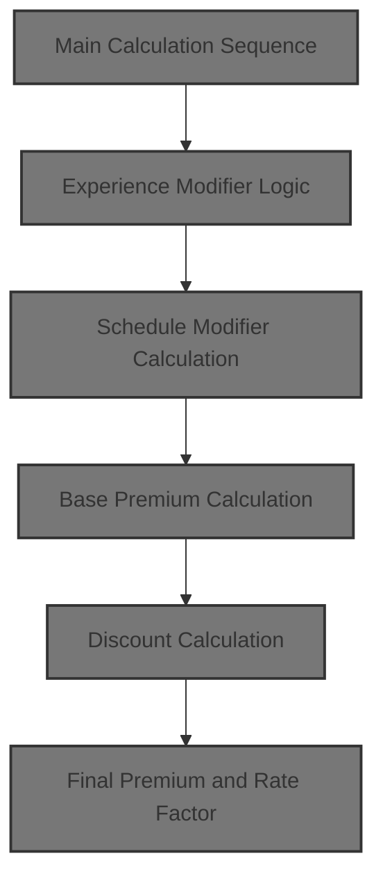
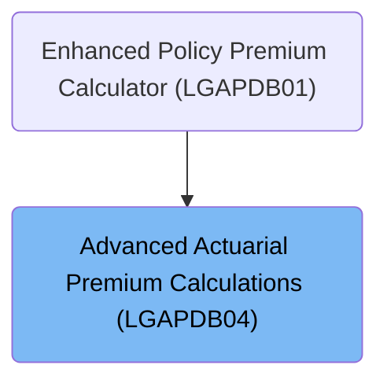
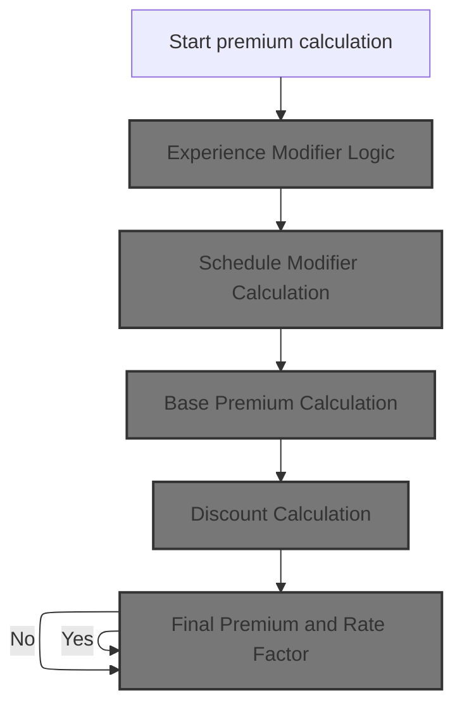
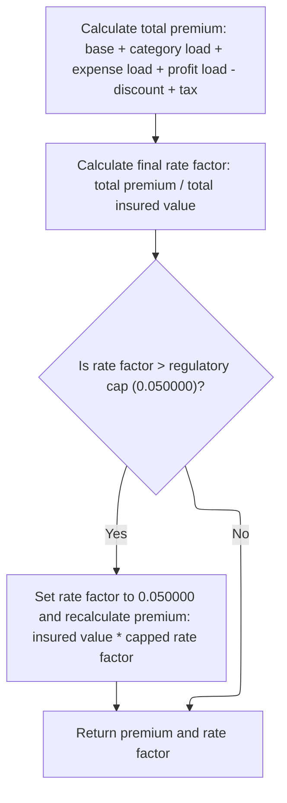

# Overview

This document describes the flow for calculating commercial property insurance premiums. The process evaluates risk modifiers and discounts based on policy details, then combines these factors to produce the final premium and rate factor.



## Dependencies

### Copybook

- SQLCA

# Where is this program used?

This program is used once, as represented in the following diagram:



## Input and Output Tables/Files used in the Program

| Table / File Name                                                                                                         | Type | Description                                                   | Usage Mode | Key Fields / Layout Highlights                                                                                                                                                                                                                                                                                                                                                                                                                                                                                                                                                                                                                                                                                                                   |
| ------------------------------------------------------------------------------------------------------------------------- | ---- | ------------------------------------------------------------- | ---------- | ------------------------------------------------------------------------------------------------------------------------------------------------------------------------------------------------------------------------------------------------------------------------------------------------------------------------------------------------------------------------------------------------------------------------------------------------------------------------------------------------------------------------------------------------------------------------------------------------------------------------------------------------------------------------------------------------------------------------------------------------ |
| <SwmToken path="base/src/LGAPDB04.cbl" pos="183:3:3" line-data="               FROM RATE_MASTER">`RATE_MASTER`</SwmToken> | DB2  | Territory-based peril rate parameters for premium calculation | Input      | <SwmToken path="base/src/LGAPDB04.cbl" pos="181:3:3" line-data="               SELECT BASE_RATE, MIN_PREMIUM, MAX_PREMIUM">`BASE_RATE`</SwmToken>, <SwmToken path="base/src/LGAPDB04.cbl" pos="181:6:6" line-data="               SELECT BASE_RATE, MIN_PREMIUM, MAX_PREMIUM">`MIN_PREMIUM`</SwmToken>, <SwmToken path="base/src/LGAPDB04.cbl" pos="325:1:5" line-data="                   WS-BASE-RATE (1, 1, 1, 1) * ">`WS-BASE-RATE`</SwmToken>, <SwmToken path="base/src/LGAPDB04.cbl" pos="51:3:7" line-data="                       25 WS-MIN-PREM   PIC 9(5)V99.">`WS-MIN-PREM`</SwmToken>, <SwmToken path="base/src/LGAPDB04.cbl" pos="52:3:7" line-data="                       25 WS-MAX-PREM   PIC 9(7)V99.">`WS-MAX-PREM`</SwmToken> |

&nbsp;

## Detailed View of the Program's Functionality

a. Main Calculation Sequence

The program begins by initializing all calculation work areas and loading the necessary rate tables. It then calculates exposures (the insured values for building, contents, and business interruption), followed by the experience modifier (which adjusts for claims history and business tenure). Next, it calculates the schedule modifier (which adjusts for risk factors like building age, protection class, occupancy, and exposure density). The base premium is then calculated for each selected peril (fire, crime, flood, weather), using the exposures, rates, and modifiers. Catastrophe loadings (for hurricane, earthquake, tornado, and flood) are added if relevant. Expense and profit loadings are calculated and added. Discounts are then determined and applied. Taxes are computed. Finally, the total premium and the final rate factor are calculated, with a regulatory cap applied if necessary.

b. Experience Modifier Logic

The experience modifier calculation starts by setting a neutral value. If the business has been operating for at least five years, it checks the claims history for the past five years. If there have been no claims, a favorable modifier is applied. If there have been claims, the modifier is increased based on the ratio of claims amount to total insured value, weighted by a credibility factor and a scaling constant. This calculated modifier is then capped at a maximum and minimum value to prevent excessive discounts or surcharges. If the business is newer than five years, a higher (less favorable) modifier is set. The final modifier is stored for use in subsequent premium calculations.

c. Schedule Modifier Calculation

The schedule modifier is initialized to zero. Adjustments are made based on building age: newer buildings receive a discount, while older buildings receive a surcharge. The protection class is then evaluated: better classes get discounts, worse classes get surcharges. The occupancy code is checked next: office occupancies get a small discount, manufacturing and warehouse occupancies get surcharges. Exposure density is then considered: high density gets a surcharge, low density gets a discount. After all adjustments, the modifier is capped within a specified range to prevent extreme values. The final value is stored for use in premium calculations.

d. Base Premium Calculation

The base premium calculation starts by resetting the base amount. For each peril (fire, crime, flood, weather), if it is selected, the premium is calculated using the relevant exposures, a rate from the rate table, the experience and schedule modifiers, and a trend factor. Each peril may have additional factors (e.g., crime uses 80% of contents exposure, flood applies a <SwmToken path="base/src/LGAPDB04.cbl" pos="352:9:11" line-data="                   WS-TREND-FACTOR * 1.25">`1.25`</SwmToken> multiplier to the trend factor). The calculated premium for each peril is added to the base amount. The sum of all selected peril premiums forms the base premium.

e. Discount Calculation

The discount calculation begins by resetting all discount components. It checks if all perils are selected, applying a larger multi-peril discount if so, or a smaller discount if a subset of perils is selected. It then checks for a claims-free history over at least five years, applying an additional discount if applicable. Deductible credits are added for high deductibles on fire, wind, and flood coverages. All discounts and credits are summed, and the total is capped at a maximum allowed value. The total discount is then applied to the sum of the major premium components to calculate the discount amount.

f. Final Premium and Rate Factor

The final premium is calculated by summing the base premium, catastrophe load, expense load, and profit load, subtracting the discount, and adding taxes. The final rate factor is then calculated as the total premium divided by the total insured value. If this rate factor exceeds a regulatory cap, it is set to the cap value, and the premium is recalculated as the insured value multiplied by the capped rate factor. The finalized premium and rate factor are then returned as the result.

# Data Definitions

| Table / Record Name                                                                                                       | Type | Short Description                                             | Usage Mode     |
| ------------------------------------------------------------------------------------------------------------------------- | ---- | ------------------------------------------------------------- | -------------- |
| <SwmToken path="base/src/LGAPDB04.cbl" pos="183:3:3" line-data="               FROM RATE_MASTER">`RATE_MASTER`</SwmToken> | DB2  | Territory-based peril rate parameters for premium calculation | Input (SELECT) |

&nbsp;

# Rule Definition

| Paragraph Name                                                                                                                 | Rule ID | Category          | Description                                                                                                                                                                                                                                                                                                                                                                                                                                                                                          | Conditions                                                                                                                                                                                                                                                                                                                                                                                                                                      | Remarks                                                                                                                                                                                                                                                                                                                                                                                                                                                                                                                                                                                                                                                                                                                                                                                                                                                                                                                                                                                                                                                                                                                                                                                                                                                                                                                                                                                                                            |
| ------------------------------------------------------------------------------------------------------------------------------ | ------- | ----------------- | ---------------------------------------------------------------------------------------------------------------------------------------------------------------------------------------------------------------------------------------------------------------------------------------------------------------------------------------------------------------------------------------------------------------------------------------------------------------------------------------------------- | ----------------------------------------------------------------------------------------------------------------------------------------------------------------------------------------------------------------------------------------------------------------------------------------------------------------------------------------------------------------------------------------------------------------------------------------------- | ---------------------------------------------------------------------------------------------------------------------------------------------------------------------------------------------------------------------------------------------------------------------------------------------------------------------------------------------------------------------------------------------------------------------------------------------------------------------------------------------------------------------------------------------------------------------------------------------------------------------------------------------------------------------------------------------------------------------------------------------------------------------------------------------------------------------------------------------------------------------------------------------------------------------------------------------------------------------------------------------------------------------------------------------------------------------------------------------------------------------------------------------------------------------------------------------------------------------------------------------------------------------------------------------------------------------------------------------------------------------------------------------------------------------------------- |
| <SwmToken path="base/src/LGAPDB04.cbl" pos="143:3:7" line-data="           PERFORM P500-SCHED-MOD">`P500-SCHED-MOD`</SwmToken> | RL-001  | Computation       | Calculates the schedule modifier by adjusting for building year, protection class, occupancy code, and exposure density, with additive/subtractive adjustments and final capping.                                                                                                                                                                                                                                                                                                                    | Always applies when calculating premium. Each factor is checked in sequence.                                                                                                                                                                                                                                                                                                                                                                    | Output is a signed decimal with three decimal places. Capped at <SwmToken path="base/src/LGAPDB04.cbl" pos="308:12:14" line-data="           IF WS-SCHEDULE-MOD &gt; +0.400">`0.400`</SwmToken>, floored at <SwmToken path="base/src/LGAPDB04.cbl" pos="312:11:14" line-data="           IF WS-SCHEDULE-MOD &lt; -0.200">`-0.200`</SwmToken>. Stored in <SwmToken path="base/src/LGAPDB04.cbl" pos="316:11:15" line-data="           MOVE WS-SCHEDULE-MOD TO LK-SCHEDULE-MOD.">`LK-SCHEDULE-MOD`</SwmToken>.                                                                                                                                                                                                                                                                                                                                                                                                                                                                                                                                                                                                                                                                                                                                                                                                                                                                                                                       |
| <SwmToken path="base/src/LGAPDB04.cbl" pos="144:3:7" line-data="           PERFORM P600-BASE-PREM">`P600-BASE-PREM`</SwmToken> | RL-002  | Computation       | Calculates the base premium as the sum of peril premiums for all selected perils, each with specific exposure and multiplier rules.                                                                                                                                                                                                                                                                                                                                                                  | For each peril (fire, crime, flood, weather), if selected (peril selection > 0), calculate premium.                                                                                                                                                                                                                                                                                                                                             | All monetary values are decimals with two decimal places. Each peril premium and the base premium are stored in <SwmToken path="base/src/LGAPDB04.cbl" pos="116:3:7" line-data="       01  LK-OUTPUT-RESULTS.">`LK-OUTPUT-RESULTS`</SwmToken>.                                                                                                                                                                                                                                                                                                                                                                                                                                                                                                                                                                                                                                                                                                                                                                                                                                                                                                                                                                                                                                                                                                                                                                                     |
| <SwmToken path="base/src/LGAPDB04.cbl" pos="147:3:5" line-data="           PERFORM P900-DISC">`P900-DISC`</SwmToken>           | RL-003  | Computation       | Calculates the total discount amount based on peril selection, claims-free status, and deductible credits, with a cap on the total discount.                                                                                                                                                                                                                                                                                                                                                         | If all perils selected, or fire/weather plus crime/flood, or claims-free for 5 years and >=5 years in business, or high deductibles.                                                                                                                                                                                                                                                                                                            | <SwmToken path="base/src/LGAPDB04.cbl" pos="410:3:5" line-data="      * Multi-peril discount">`Multi-peril`</SwmToken> discount: <SwmToken path="base/src/LGAPDB04.cbl" pos="270:3:5" line-data="                   ADD 0.100 TO WS-SCHEDULE-MOD">`0.100`</SwmToken> or <SwmToken path="base/src/LGAPDB04.cbl" pos="266:3:5" line-data="                   SUBTRACT 0.050 FROM WS-SCHEDULE-MOD">`0.050`</SwmToken>. <SwmToken path="base/src/LGAPDB04.cbl" pos="425:3:5" line-data="      * Claims-free discount  ">`Claims-free`</SwmToken> discount: <SwmToken path="base/src/LGAPDB04.cbl" pos="292:3:5" line-data="                   ADD 0.075 TO WS-SCHEDULE-MOD">`0.075`</SwmToken>. Deductible credits: <SwmToken path="base/src/LGAPDB04.cbl" pos="290:3:5" line-data="                   SUBTRACT 0.025 FROM WS-SCHEDULE-MOD">`0.025`</SwmToken> (fire >=10000), <SwmToken path="base/src/LGAPDB04.cbl" pos="437:3:5" line-data="               ADD 0.035 TO WS-DEDUCTIBLE-CREDIT">`0.035`</SwmToken> (wind >=25000), <SwmToken path="base/src/LGAPDB04.cbl" pos="440:3:5" line-data="               ADD 0.045 TO WS-DEDUCTIBLE-CREDIT">`0.045`</SwmToken> (flood >=50000). Total discount capped at <SwmToken path="base/src/LGAPDB04.cbl" pos="447:11:13" line-data="           IF WS-TOTAL-DISCOUNT &gt; 0.250">`0.250`</SwmToken>. Discount amount is decimal with two decimal places, stored in LK-DISCOUNT-AMOUNT. |
| <SwmToken path="base/src/LGAPDB04.cbl" pos="149:3:5" line-data="           PERFORM P999-FINAL">`P999-FINAL`</SwmToken>         | RL-004  | Computation       | Calculates the total premium and final rate factor, capping the rate factor if necessary and recalculating the premium.                                                                                                                                                                                                                                                                                                                                                                              | Always applies after all other calculations.                                                                                                                                                                                                                                                                                                                                                                                                    | Final rate factor capped at <SwmToken path="base/src/LGAPDB04.cbl" pos="473:13:15" line-data="           IF LK-FINAL-RATE-FACTOR &gt; 0.050000">`0.050000`</SwmToken>. Premium and rate factor are decimals with two and four decimal places, respectively. Stored in <SwmToken path="base/src/LGAPDB04.cbl" pos="116:3:7" line-data="       01  LK-OUTPUT-RESULTS.">`LK-OUTPUT-RESULTS`</SwmToken>.                                                                                                                                                                                                                                                                                                                                                                                                                                                                                                                                                                                                                                                                                                                                                                                                                                                                                                                                                                                                                               |
| Throughout, especially linkage section and calculations                                                                        | RL-005  | Conditional Logic | Ensures all input values are valid and non-null, monetary values are decimals with two decimal places, codes and IDs are fixed-length strings, and peril selections are integers (0 or 1).                                                                                                                                                                                                                                                                                                           | Applies to all input and output data.                                                                                                                                                                                                                                                                                                                                                                                                           | Monetary values: decimal(2). Codes/IDs: fixed-length strings. Peril selections: integer (0 or 1).                                                                                                                                                                                                                                                                                                                                                                                                                                                                                                                                                                                                                                                                                                                                                                                                                                                                                                                                                                                                                                                                                                                                                                                                                                                                                                                                  |
| <SwmToken path="base/src/LGAPDB04.cbl" pos="142:3:7" line-data="           PERFORM P400-EXP-MOD">`P400-EXP-MOD`</SwmToken>     | RL-006  | Computation       | Calculates the experience modifier based on years in business and claims history, with specific values for claims-free and new businesses, and a formula for others. The modifier is capped at <SwmToken path="base/src/LGAPDB04.cbl" pos="246:11:13" line-data="                   IF WS-EXPERIENCE-MOD &gt; 2.0000">`2.0000`</SwmToken> and floored at <SwmToken path="base/src/LGAPDB04.cbl" pos="250:11:13" line-data="                   IF WS-EXPERIENCE-MOD &lt; 0.5000">`0.5000`</SwmToken>. | If years in business >= 5 and claims count in 5 years = 0, set to <SwmToken path="base/src/LGAPDB04.cbl" pos="239:3:5" line-data="                   MOVE 0.8500 TO WS-EXPERIENCE-MOD">`0.8500`</SwmToken>. If years in business >= 5 and claims count > 0, use formula. If years in business < 5, set to <SwmToken path="base/src/LGAPDB04.cbl" pos="255:3:5" line-data="               MOVE 1.1000 TO WS-EXPERIENCE-MOD">`1.1000`</SwmToken>. | Credibility factor is 0.75. Output is a decimal with four decimal places. Stored in the experience modifier output field.                                                                                                                                                                                                                                                                                                                                                                                                                                                                                                                                                                                                                                                                                                                                                                                                                                                                                                                                                                                                                                                                                                                                                                                                                                                                                                          |

# User Stories

## User Story 1: Calculate experience and schedule modifiers

---

### Story Description:

As a system, I want to calculate the experience and schedule modifiers for a policy so that accurate risk adjustments can be applied before premium calculation.

---

### Business Rule Mapping:

| Rule ID | Paragraph Name                                                                                                                 | Rule Description                                                                                                                                                                                                                                                                                                                                                                                                                                                                                     |
| ------- | ------------------------------------------------------------------------------------------------------------------------------ | ---------------------------------------------------------------------------------------------------------------------------------------------------------------------------------------------------------------------------------------------------------------------------------------------------------------------------------------------------------------------------------------------------------------------------------------------------------------------------------------------------- |
| RL-006  | <SwmToken path="base/src/LGAPDB04.cbl" pos="142:3:7" line-data="           PERFORM P400-EXP-MOD">`P400-EXP-MOD`</SwmToken>     | Calculates the experience modifier based on years in business and claims history, with specific values for claims-free and new businesses, and a formula for others. The modifier is capped at <SwmToken path="base/src/LGAPDB04.cbl" pos="246:11:13" line-data="                   IF WS-EXPERIENCE-MOD &gt; 2.0000">`2.0000`</SwmToken> and floored at <SwmToken path="base/src/LGAPDB04.cbl" pos="250:11:13" line-data="                   IF WS-EXPERIENCE-MOD &lt; 0.5000">`0.5000`</SwmToken>. |
| RL-001  | <SwmToken path="base/src/LGAPDB04.cbl" pos="143:3:7" line-data="           PERFORM P500-SCHED-MOD">`P500-SCHED-MOD`</SwmToken> | Calculates the schedule modifier by adjusting for building year, protection class, occupancy code, and exposure density, with additive/subtractive adjustments and final capping.                                                                                                                                                                                                                                                                                                                    |

---

### Relevant Functionality:

- <SwmToken path="base/src/LGAPDB04.cbl" pos="142:3:7" line-data="           PERFORM P400-EXP-MOD">`P400-EXP-MOD`</SwmToken>
  1. **RL-006:**
     - If years in business >= 5:
       - If claims count in 5 years = 0, set modifier to <SwmToken path="base/src/LGAPDB04.cbl" pos="239:3:5" line-data="                   MOVE 0.8500 TO WS-EXPERIENCE-MOD">`0.8500`</SwmToken>
       - Else, calculate modifier as <SwmToken path="base/src/LGAPDB04.cbl" pos="235:3:5" line-data="           MOVE 1.0000 TO WS-EXPERIENCE-MOD">`1.0000`</SwmToken> + ((claims amount in 5 years / total insured value) \* 0.75 \* <SwmToken path="base/src/LGAPDB04.cbl" pos="244:9:11" line-data="                        WS-CREDIBILITY-FACTOR * 0.50)">`0.50`</SwmToken>)
       - Cap at <SwmToken path="base/src/LGAPDB04.cbl" pos="246:11:13" line-data="                   IF WS-EXPERIENCE-MOD &gt; 2.0000">`2.0000`</SwmToken>, floor at <SwmToken path="base/src/LGAPDB04.cbl" pos="250:11:13" line-data="                   IF WS-EXPERIENCE-MOD &lt; 0.5000">`0.5000`</SwmToken>
     - If years in business < 5, set modifier to <SwmToken path="base/src/LGAPDB04.cbl" pos="255:3:5" line-data="               MOVE 1.1000 TO WS-EXPERIENCE-MOD">`1.1000`</SwmToken>
     - Store result in the experience modifier output field
- <SwmToken path="base/src/LGAPDB04.cbl" pos="143:3:7" line-data="           PERFORM P500-SCHED-MOD">`P500-SCHED-MOD`</SwmToken>
  1. **RL-001:**
     - Start at <SwmToken path="base/src/LGAPDB04.cbl" pos="261:4:6" line-data="           MOVE +0.000 TO WS-SCHEDULE-MOD">`0.000`</SwmToken>
     - Adjust for building year:
       - &nbsp;

         > =2010: subtract <SwmToken path="base/src/LGAPDB04.cbl" pos="266:3:5" line-data="                   SUBTRACT 0.050 FROM WS-SCHEDULE-MOD">`0.050`</SwmToken>

       - &nbsp;

         > =1990: no change

       - &nbsp;

         > =1970: add <SwmToken path="base/src/LGAPDB04.cbl" pos="270:3:5" line-data="                   ADD 0.100 TO WS-SCHEDULE-MOD">`0.100`</SwmToken>

       - else: add <SwmToken path="base/src/LGAPDB04.cbl" pos="272:3:5" line-data="                   ADD 0.200 TO WS-SCHEDULE-MOD">`0.200`</SwmToken>
     - Adjust for protection class:
       - '01'-'03': subtract <SwmToken path="base/src/LGAPDB04.cbl" pos="270:3:5" line-data="                   ADD 0.100 TO WS-SCHEDULE-MOD">`0.100`</SwmToken>
       - '04'-'06': subtract <SwmToken path="base/src/LGAPDB04.cbl" pos="266:3:5" line-data="                   SUBTRACT 0.050 FROM WS-SCHEDULE-MOD">`0.050`</SwmToken>
       - '07'-'09': no change
       - else: add <SwmToken path="base/src/LGAPDB04.cbl" pos="284:3:5" line-data="                   ADD 0.150 TO WS-SCHEDULE-MOD">`0.150`</SwmToken>
     - Adjust for occupancy code:
       - <SwmToken path="base/src/LGAPDB04.cbl" pos="289:4:4" line-data="               WHEN &#39;OFF01&#39; THRU &#39;OFF05&#39;">`OFF01`</SwmToken>-<SwmToken path="base/src/LGAPDB04.cbl" pos="289:10:10" line-data="               WHEN &#39;OFF01&#39; THRU &#39;OFF05&#39;">`OFF05`</SwmToken>: subtract <SwmToken path="base/src/LGAPDB04.cbl" pos="290:3:5" line-data="                   SUBTRACT 0.025 FROM WS-SCHEDULE-MOD">`0.025`</SwmToken>
       - <SwmToken path="base/src/LGAPDB04.cbl" pos="291:4:4" line-data="               WHEN &#39;MFG01&#39; THRU &#39;MFG10&#39;">`MFG01`</SwmToken>-<SwmToken path="base/src/LGAPDB04.cbl" pos="291:10:10" line-data="               WHEN &#39;MFG01&#39; THRU &#39;MFG10&#39;">`MFG10`</SwmToken>: add <SwmToken path="base/src/LGAPDB04.cbl" pos="292:3:5" line-data="                   ADD 0.075 TO WS-SCHEDULE-MOD">`0.075`</SwmToken>
       - <SwmToken path="base/src/LGAPDB04.cbl" pos="293:4:4" line-data="               WHEN &#39;WHS01&#39; THRU &#39;WHS05&#39;">`WHS01`</SwmToken>-<SwmToken path="base/src/LGAPDB04.cbl" pos="293:10:10" line-data="               WHEN &#39;WHS01&#39; THRU &#39;WHS05&#39;">`WHS05`</SwmToken>: add <SwmToken path="base/src/LGAPDB04.cbl" pos="294:3:5" line-data="                   ADD 0.125 TO WS-SCHEDULE-MOD">`0.125`</SwmToken>
       - else: no change
     - Adjust for exposure density:
       - &nbsp;

         > <SwmToken path="base/src/LGAPDB04.cbl" pos="300:11:13" line-data="           IF WS-EXPOSURE-DENSITY &gt; 500.00">`500.00`</SwmToken>: add <SwmToken path="base/src/LGAPDB04.cbl" pos="270:3:5" line-data="                   ADD 0.100 TO WS-SCHEDULE-MOD">`0.100`</SwmToken>

       - <<SwmToken path="base/src/LGAPDB04.cbl" pos="303:11:13" line-data="               IF WS-EXPOSURE-DENSITY &lt; 50.00">`50.00`</SwmToken>: subtract <SwmToken path="base/src/LGAPDB04.cbl" pos="266:3:5" line-data="                   SUBTRACT 0.050 FROM WS-SCHEDULE-MOD">`0.050`</SwmToken>
     - Cap at <SwmToken path="base/src/LGAPDB04.cbl" pos="308:12:14" line-data="           IF WS-SCHEDULE-MOD &gt; +0.400">`0.400`</SwmToken>, floor at <SwmToken path="base/src/LGAPDB04.cbl" pos="312:11:14" line-data="           IF WS-SCHEDULE-MOD &lt; -0.200">`-0.200`</SwmToken>
     - Store result in schedule modifier output

## User Story 2: Calculate premium, discounts, and final rate with validation

---

### Story Description:

As a system, I want to calculate the base premium, apply discounts, determine the final premium and rate factor, and validate all input and output data so that the policyholder receives an accurate, fair, and compliant premium quote.

---

### Business Rule Mapping:

| Rule ID | Paragraph Name                                                                                                                 | Rule Description                                                                                                                                                                           |
| ------- | ------------------------------------------------------------------------------------------------------------------------------ | ------------------------------------------------------------------------------------------------------------------------------------------------------------------------------------------ |
| RL-002  | <SwmToken path="base/src/LGAPDB04.cbl" pos="144:3:7" line-data="           PERFORM P600-BASE-PREM">`P600-BASE-PREM`</SwmToken> | Calculates the base premium as the sum of peril premiums for all selected perils, each with specific exposure and multiplier rules.                                                        |
| RL-003  | <SwmToken path="base/src/LGAPDB04.cbl" pos="147:3:5" line-data="           PERFORM P900-DISC">`P900-DISC`</SwmToken>           | Calculates the total discount amount based on peril selection, claims-free status, and deductible credits, with a cap on the total discount.                                               |
| RL-004  | <SwmToken path="base/src/LGAPDB04.cbl" pos="149:3:5" line-data="           PERFORM P999-FINAL">`P999-FINAL`</SwmToken>         | Calculates the total premium and final rate factor, capping the rate factor if necessary and recalculating the premium.                                                                    |
| RL-005  | Throughout, especially linkage section and calculations                                                                        | Ensures all input values are valid and non-null, monetary values are decimals with two decimal places, codes and IDs are fixed-length strings, and peril selections are integers (0 or 1). |

---

### Relevant Functionality:

- <SwmToken path="base/src/LGAPDB04.cbl" pos="144:3:7" line-data="           PERFORM P600-BASE-PREM">`P600-BASE-PREM`</SwmToken>
  1. **RL-002:**
     - For each peril:
       - If selected:
         - Fire: (building + contents exposure) \* base rate \* experience mod \* (1 + schedule mod) \* trend factor
         - Crime: (contents exposure \* <SwmToken path="base/src/LGAPDB04.cbl" pos="336:10:12" line-data="                   (WS-CONTENTS-EXPOSURE * 0.80) *">`0.80`</SwmToken>) \* base rate \* experience mod \* (1 + schedule mod) \* trend factor
         - Flood: (building exposure) \* base rate \* experience mod \* (1 + schedule mod) \* trend factor \* <SwmToken path="base/src/LGAPDB04.cbl" pos="352:9:11" line-data="                   WS-TREND-FACTOR * 1.25">`1.25`</SwmToken>
         - Weather: (building + contents exposure) \* base rate \* experience mod \* (1 + schedule mod) \* trend factor
       - Add each peril premium to base premium
     - Store each peril premium and base premium in output
- <SwmToken path="base/src/LGAPDB04.cbl" pos="147:3:5" line-data="           PERFORM P900-DISC">`P900-DISC`</SwmToken>
  1. **RL-003:**
     - Set all discounts to zero
     - If all perils selected, set multi-peril discount to <SwmToken path="base/src/LGAPDB04.cbl" pos="270:3:5" line-data="                   ADD 0.100 TO WS-SCHEDULE-MOD">`0.100`</SwmToken>
     - Else if fire/weather and (crime or flood), set to <SwmToken path="base/src/LGAPDB04.cbl" pos="266:3:5" line-data="                   SUBTRACT 0.050 FROM WS-SCHEDULE-MOD">`0.050`</SwmToken>
     - If claims-free for 5 years and >=5 years in business, set claims-free discount to <SwmToken path="base/src/LGAPDB04.cbl" pos="292:3:5" line-data="                   ADD 0.075 TO WS-SCHEDULE-MOD">`0.075`</SwmToken>
     - Add deductible credits if deductibles meet thresholds
     - Sum all discounts, cap at <SwmToken path="base/src/LGAPDB04.cbl" pos="447:11:13" line-data="           IF WS-TOTAL-DISCOUNT &gt; 0.250">`0.250`</SwmToken>
     - Calculate discount amount as total discount \* sum of premium components
     - Store discount amount in output
- <SwmToken path="base/src/LGAPDB04.cbl" pos="149:3:5" line-data="           PERFORM P999-FINAL">`P999-FINAL`</SwmToken>
  1. **RL-004:**
     - Calculate total premium as base premium + cat load + expense load + profit load - discount amount + tax amount
     - Calculate final rate factor as total premium / total insured value
     - If rate factor > <SwmToken path="base/src/LGAPDB04.cbl" pos="473:13:15" line-data="           IF LK-FINAL-RATE-FACTOR &gt; 0.050000">`0.050000`</SwmToken>, set to <SwmToken path="base/src/LGAPDB04.cbl" pos="473:13:15" line-data="           IF LK-FINAL-RATE-FACTOR &gt; 0.050000">`0.050000`</SwmToken> and recalculate premium as insured value \* capped rate factor
     - Store total premium and rate factor in output
- **Throughout**
  1. **RL-005:**
     - Validate all input values are present and non-null
     - Ensure monetary values are formatted as decimals with two decimal places
     - Ensure codes and IDs are fixed-length strings
     - Ensure peril selections are integers (0 or 1)
     - Apply formatting to all outputs

# Workflow

# Main Calculation Sequence



This section sequences the main steps for calculating an insurance premium, ensuring that each modifier and premium component is calculated in the correct order and that all necessary factors are considered before producing the final premium and rate factor outputs.

| Category        | Rule Name                            | Description                                                                                                                                                                                                                                                                                 |
| --------------- | ------------------------------------ | ------------------------------------------------------------------------------------------------------------------------------------------------------------------------------------------------------------------------------------------------------------------------------------------- |
| Data validation | Minimum Rate Factor Enforcement      | If the final rate factor is less than or equal to <SwmToken path="base/src/LGAPDB04.cbl" pos="473:13:15" line-data="           IF LK-FINAL-RATE-FACTOR &gt; 0.050000">`0.050000`</SwmToken>, the premium calculation must still proceed and produce a final premium and rate factor output. |
| Business logic  | Experience Modifier Precedence       | The experience modifier must be calculated using the customer's claims history, years in business, and insured values before any other premium calculations are performed.                                                                                                                  |
| Business logic  | Schedule Modifier Application        | The schedule modifier must be determined based on building age, protection class, occupancy code, and exposure density, and applied to the premium calculation.                                                                                                                             |
| Business logic  | Base Premium Aggregation             | The base premium must be calculated by summing the premium amounts for all selected perils (fire, crime, flood, weather) using exposure values and actuarial rate tables.                                                                                                                   |
| Business logic  | Discount Eligibility and Application | Discounts must be calculated and applied to the premium based on coverage selections, absence of claims, deductible amounts, and years in business.                                                                                                                                         |

<SwmSnippet path="/base/src/LGAPDB04.cbl" line="138">

---

<SwmToken path="base/src/LGAPDB04.cbl" pos="138:1:3" line-data="       P100-MAIN.">`P100-MAIN`</SwmToken> sequences all the premium calculation steps, and calls <SwmToken path="base/src/LGAPDB04.cbl" pos="142:3:7" line-data="           PERFORM P400-EXP-MOD">`P400-EXP-MOD`</SwmToken> early so the experience modifier is available for all later premium calculations.

```cobol
       P100-MAIN.
           PERFORM P200-INIT
           PERFORM P300-RATES
           PERFORM P350-EXPOSURE
           PERFORM P400-EXP-MOD
           PERFORM P500-SCHED-MOD
           PERFORM P600-BASE-PREM
           PERFORM P700-CAT-LOAD
           PERFORM P800-EXPENSE
           PERFORM P900-DISC
           PERFORM P950-TAXES
           PERFORM P999-FINAL
           GOBACK.
```

---

</SwmSnippet>

## Experience Modifier Logic

```mermaid
%%{init: {"flowchart": {"defaultRenderer": "elk"}} }%%
flowchart TD
    node2{"Years in business >= 5?"}
    click node2 openCode "base/src/LGAPDB04.cbl:237:254"
    node2 -->|"Yes"| node3{"Claims count in 5 years = 0?"}
    click node3 openCode "base/src/LGAPDB04.cbl:238:239"
    node3 -->|"Yes"| node4["Set experience mod to 0.8500"]
    click node4 openCode "base/src/LGAPDB04.cbl:239:239"
    node3 -->|"No"| node5["Calculate experience mod: 1.0000 + ((claims amount / total insured value) * credibility factor (0.750) * 0.50)"]
    click node5 openCode "base/src/LGAPDB04.cbl:241:244"
    node5 --> node6{"Experience mod > 2.0000?"}
    click node6 openCode "base/src/LGAPDB04.cbl:246:247"
    node6 -->|"Yes"| node7["Set experience mod to 2.0000"]
    click node7 openCode "base/src/LGAPDB04.cbl:247:247"
    node6 -->|"No"| node8{"Experience mod < 0.5000?"}
    click node8 openCode "base/src/LGAPDB04.cbl:250:251"
    node8 -->|"Yes"| node9["Set experience mod to 0.5000"]
    click node9 openCode "base/src/LGAPDB04.cbl:251:251"
    node8 -->|"No"| node11["Move experience mod to LK-EXPERIENCE-MOD"]
    node4 --> node11["Move experience mod to LK-EXPERIENCE-MOD"]
    click node11 openCode "base/src/LGAPDB04.cbl:258:258"
    node7 --> node11
    node9 --> node11
    node2 -->|"No"| node12["Set experience mod to 1.1000"]
    click node12 openCode "base/src/LGAPDB04.cbl:255:255"
    node12 --> node11
classDef HeadingStyle fill:#777777,stroke:#333,stroke-width:2px;

%% Swimm:
%% %%{init: {"flowchart": {"defaultRenderer": "elk"}} }%%
%% flowchart TD
%%     node2{"Years in business >= 5?"}
%%     click node2 openCode "<SwmPath>[base/src/LGAPDB04.cbl](base/src/LGAPDB04.cbl)</SwmPath>:237:254"
%%     node2 -->|"Yes"| node3{"Claims count in 5 years = 0?"}
%%     click node3 openCode "<SwmPath>[base/src/LGAPDB04.cbl](base/src/LGAPDB04.cbl)</SwmPath>:238:239"
%%     node3 -->|"Yes"| node4["Set experience mod to <SwmToken path="base/src/LGAPDB04.cbl" pos="239:3:5" line-data="                   MOVE 0.8500 TO WS-EXPERIENCE-MOD">`0.8500`</SwmToken>"]
%%     click node4 openCode "<SwmPath>[base/src/LGAPDB04.cbl](base/src/LGAPDB04.cbl)</SwmPath>:239:239"
%%     node3 -->|"No"| node5["Calculate experience mod: <SwmToken path="base/src/LGAPDB04.cbl" pos="235:3:5" line-data="           MOVE 1.0000 TO WS-EXPERIENCE-MOD">`1.0000`</SwmToken> + ((claims amount / total insured value) * credibility factor (<SwmToken path="base/src/LGAPDB04.cbl" pos="27:15:17" line-data="           05 WS-CREDIBILITY-FACTOR    PIC V999 VALUE 0.750.">`0.750`</SwmToken>) * <SwmToken path="base/src/LGAPDB04.cbl" pos="244:9:11" line-data="                        WS-CREDIBILITY-FACTOR * 0.50)">`0.50`</SwmToken>)"]
%%     click node5 openCode "<SwmPath>[base/src/LGAPDB04.cbl](base/src/LGAPDB04.cbl)</SwmPath>:241:244"
%%     node5 --> node6{"Experience mod > <SwmToken path="base/src/LGAPDB04.cbl" pos="246:11:13" line-data="                   IF WS-EXPERIENCE-MOD &gt; 2.0000">`2.0000`</SwmToken>?"}
%%     click node6 openCode "<SwmPath>[base/src/LGAPDB04.cbl](base/src/LGAPDB04.cbl)</SwmPath>:246:247"
%%     node6 -->|"Yes"| node7["Set experience mod to <SwmToken path="base/src/LGAPDB04.cbl" pos="246:11:13" line-data="                   IF WS-EXPERIENCE-MOD &gt; 2.0000">`2.0000`</SwmToken>"]
%%     click node7 openCode "<SwmPath>[base/src/LGAPDB04.cbl](base/src/LGAPDB04.cbl)</SwmPath>:247:247"
%%     node6 -->|"No"| node8{"Experience mod < <SwmToken path="base/src/LGAPDB04.cbl" pos="250:11:13" line-data="                   IF WS-EXPERIENCE-MOD &lt; 0.5000">`0.5000`</SwmToken>?"}
%%     click node8 openCode "<SwmPath>[base/src/LGAPDB04.cbl](base/src/LGAPDB04.cbl)</SwmPath>:250:251"
%%     node8 -->|"Yes"| node9["Set experience mod to <SwmToken path="base/src/LGAPDB04.cbl" pos="250:11:13" line-data="                   IF WS-EXPERIENCE-MOD &lt; 0.5000">`0.5000`</SwmToken>"]
%%     click node9 openCode "<SwmPath>[base/src/LGAPDB04.cbl](base/src/LGAPDB04.cbl)</SwmPath>:251:251"
%%     node8 -->|"No"| node11["Move experience mod to <SwmToken path="base/src/LGAPDB04.cbl" pos="258:11:15" line-data="           MOVE WS-EXPERIENCE-MOD TO LK-EXPERIENCE-MOD.">`LK-EXPERIENCE-MOD`</SwmToken>"]
%%     node4 --> node11["Move experience mod to <SwmToken path="base/src/LGAPDB04.cbl" pos="258:11:15" line-data="           MOVE WS-EXPERIENCE-MOD TO LK-EXPERIENCE-MOD.">`LK-EXPERIENCE-MOD`</SwmToken>"]
%%     click node11 openCode "<SwmPath>[base/src/LGAPDB04.cbl](base/src/LGAPDB04.cbl)</SwmPath>:258:258"
%%     node7 --> node11
%%     node9 --> node11
%%     node2 -->|"No"| node12["Set experience mod to <SwmToken path="base/src/LGAPDB04.cbl" pos="255:3:5" line-data="               MOVE 1.1000 TO WS-EXPERIENCE-MOD">`1.1000`</SwmToken>"]
%%     click node12 openCode "<SwmPath>[base/src/LGAPDB04.cbl](base/src/LGAPDB04.cbl)</SwmPath>:255:255"
%%     node12 --> node11
%% classDef HeadingStyle fill:#777777,stroke:#333,stroke-width:2px;
```



This section determines the experience modifier for a business, which adjusts insurance premiums based on tenure and claims history. The logic ensures that businesses with longer tenure and no claims receive favorable rates, while newer businesses or those with claims are rated higher, with strict caps and floors to maintain premium fairness.

| Category       | Rule Name                         | Description                                                                                                                                                                                                                                                                                                                                                                                                                                                                                                                                                                                                                                                                         |
| -------------- | --------------------------------- | ----------------------------------------------------------------------------------------------------------------------------------------------------------------------------------------------------------------------------------------------------------------------------------------------------------------------------------------------------------------------------------------------------------------------------------------------------------------------------------------------------------------------------------------------------------------------------------------------------------------------------------------------------------------------------------- |
| Business logic | Long-tenure, claims-free discount | If the business has been operating for 5 years or more and has zero claims in the last 5 years, set the experience modifier to <SwmToken path="base/src/LGAPDB04.cbl" pos="239:3:5" line-data="                   MOVE 0.8500 TO WS-EXPERIENCE-MOD">`0.8500`</SwmToken>.                                                                                                                                                                                                                                                                                                                                                                                                            |
| Business logic | Claims-based risk adjustment      | If the business has been operating for 5 years or more and has claims in the last 5 years, calculate the experience modifier as <SwmToken path="base/src/LGAPDB04.cbl" pos="235:3:5" line-data="           MOVE 1.0000 TO WS-EXPERIENCE-MOD">`1.0000`</SwmToken> plus the ratio of claims amount to total insured value, multiplied by a credibility factor (<SwmToken path="base/src/LGAPDB04.cbl" pos="27:15:17" line-data="           05 WS-CREDIBILITY-FACTOR    PIC V999 VALUE 0.750.">`0.750`</SwmToken>) and a scaling constant (<SwmToken path="base/src/LGAPDB04.cbl" pos="244:9:11" line-data="                        WS-CREDIBILITY-FACTOR * 0.50)">`0.50`</SwmToken>). |
| Business logic | Maximum modifier cap              | If the calculated experience modifier exceeds <SwmToken path="base/src/LGAPDB04.cbl" pos="246:11:13" line-data="                   IF WS-EXPERIENCE-MOD &gt; 2.0000">`2.0000`</SwmToken>, set it to <SwmToken path="base/src/LGAPDB04.cbl" pos="246:11:13" line-data="                   IF WS-EXPERIENCE-MOD &gt; 2.0000">`2.0000`</SwmToken>.                                                                                                                                                                                                                                                                                                                                     |
| Business logic | Minimum modifier floor            | If the calculated experience modifier is less than <SwmToken path="base/src/LGAPDB04.cbl" pos="250:11:13" line-data="                   IF WS-EXPERIENCE-MOD &lt; 0.5000">`0.5000`</SwmToken>, set it to <SwmToken path="base/src/LGAPDB04.cbl" pos="250:11:13" line-data="                   IF WS-EXPERIENCE-MOD &lt; 0.5000">`0.5000`</SwmToken>.                                                                                                                                                                                                                                                                                                                                |
| Business logic | New business surcharge            | If the business has been operating for less than 5 years, set the experience modifier to <SwmToken path="base/src/LGAPDB04.cbl" pos="255:3:5" line-data="               MOVE 1.1000 TO WS-EXPERIENCE-MOD">`1.1000`</SwmToken>.                                                                                                                                                                                                                                                                                                                                                                                                                                                      |

<SwmSnippet path="/base/src/LGAPDB04.cbl" line="234">

---

In <SwmToken path="base/src/LGAPDB04.cbl" pos="234:1:5" line-data="       P400-EXP-MOD.">`P400-EXP-MOD`</SwmToken> we start by setting the experience modifier to a neutral value (<SwmToken path="base/src/LGAPDB04.cbl" pos="235:3:5" line-data="           MOVE 1.0000 TO WS-EXPERIENCE-MOD">`1.0000`</SwmToken>). If the business has been around for at least 5 years, we check claims history: no claims gets a favorable modifier (<SwmToken path="base/src/LGAPDB04.cbl" pos="239:3:5" line-data="                   MOVE 0.8500 TO WS-EXPERIENCE-MOD">`0.8500`</SwmToken>), otherwise we calculate a risk-based modifier using claims amount, insured value, and a credibility factor, then cap it between <SwmToken path="base/src/LGAPDB04.cbl" pos="250:11:13" line-data="                   IF WS-EXPERIENCE-MOD &lt; 0.5000">`0.5000`</SwmToken> and <SwmToken path="base/src/LGAPDB04.cbl" pos="246:11:13" line-data="                   IF WS-EXPERIENCE-MOD &gt; 2.0000">`2.0000`</SwmToken>. For newer businesses, we set a higher modifier (<SwmToken path="base/src/LGAPDB04.cbl" pos="255:3:5" line-data="               MOVE 1.1000 TO WS-EXPERIENCE-MOD">`1.1000`</SwmToken>). These constants are all business rules to control premium sensitivity to claims and tenure.

```cobol
       P400-EXP-MOD.
           MOVE 1.0000 TO WS-EXPERIENCE-MOD
           
           IF LK-YEARS-IN-BUSINESS >= 5
               IF LK-CLAIMS-COUNT-5YR = ZERO
                   MOVE 0.8500 TO WS-EXPERIENCE-MOD
```

---

</SwmSnippet>

<SwmSnippet path="/base/src/LGAPDB04.cbl" line="240">

---

Here we handle the case where there are claims in the last 5 years for established businesses. The modifier is bumped up based on the ratio of claims to insured value, weighted by a credibility factor and a scaling constant. The result is then capped in the next steps. The code assumes all inputs are valid and non-zero, especially <SwmToken path="base/src/LGAPDB04.cbl" pos="243:13:19" line-data="                       ((LK-CLAIMS-AMOUNT-5YR / WS-TOTAL-INSURED-VAL) * ">`WS-TOTAL-INSURED-VAL`</SwmToken>, or else this would break.

```cobol
               ELSE
                   COMPUTE WS-EXPERIENCE-MOD = 
                       1.0000 + 
                       ((LK-CLAIMS-AMOUNT-5YR / WS-TOTAL-INSURED-VAL) * 
                        WS-CREDIBILITY-FACTOR * 0.50)
                   
                   IF WS-EXPERIENCE-MOD > 2.0000
                       MOVE 2.0000 TO WS-EXPERIENCE-MOD
                   END-IF
```

---

</SwmSnippet>

<SwmSnippet path="/base/src/LGAPDB04.cbl" line="250">

---

This part clamps the experience modifier so it can't drop below <SwmToken path="base/src/LGAPDB04.cbl" pos="250:11:13" line-data="                   IF WS-EXPERIENCE-MOD &lt; 0.5000">`0.5000`</SwmToken>, even if the claims ratio is very low. This keeps the premium from being discounted too much. The next snippet will handle the case for newer businesses and finalize the modifier.

```cobol
                   IF WS-EXPERIENCE-MOD < 0.5000
                       MOVE 0.5000 TO WS-EXPERIENCE-MOD
                   END-IF
```

---

</SwmSnippet>

<SwmSnippet path="/base/src/LGAPDB04.cbl" line="254">

---

Finally, if the business is less than 5 years old, the modifier is set to <SwmToken path="base/src/LGAPDB04.cbl" pos="255:3:5" line-data="               MOVE 1.1000 TO WS-EXPERIENCE-MOD">`1.1000`</SwmToken>. The calculated modifier—whether capped, floored, or set by business age—is then stored in <SwmToken path="base/src/LGAPDB04.cbl" pos="258:11:15" line-data="           MOVE WS-EXPERIENCE-MOD TO LK-EXPERIENCE-MOD.">`LK-EXPERIENCE-MOD`</SwmToken> for use in later premium calculations.

```cobol
           ELSE
               MOVE 1.1000 TO WS-EXPERIENCE-MOD
           END-IF
           
           MOVE WS-EXPERIENCE-MOD TO LK-EXPERIENCE-MOD.
```

---

</SwmSnippet>

## Schedule Modifier Calculation

```mermaid
%%{init: {"flowchart": {"defaultRenderer": "elk"}} }%%
flowchart TD
    node1["Start schedule modification calculation"]
    click node1 openCode "base/src/LGAPDB04.cbl:260:261"
    node1 --> node2{"Building age?"}
    click node2 openCode "base/src/LGAPDB04.cbl:263:273"
    node2 -->|"#gt;=2010 (Subtract 0.050)"| node3
    node2 -->|"#gt;=1990 (No change)"| node3
    node2 -->|"#gt;=1970 (Add 0.100)"| node3
    node2 -->|"Older (Add 0.200)"| node3
    node3{"Protection class?"}
    click node3 openCode "base/src/LGAPDB04.cbl:276:285"
    node2 --> node3
    node3 -->|"'01'-'03' (Subtract 0.100)"| node4
    node3 -->|"'04'-'06' (Subtract 0.050)"| node4
    node3 -->|"'07'-'09' (No change)"| node4
    node3 -->|"Other (Add 0.150)"| node4
    node4{"Occupancy code?"}
    click node4 openCode "base/src/LGAPDB04.cbl:288:297"
    node3 --> node4
    node4 -->|"OFF01-OFF05 (Subtract 0.025)"| node5
    node4 -->|"MFG01-MFG10 (Add 0.075)"| node5
    node4 -->|"WHS01-WHS05 (Add 0.125)"| node5
    node4 -->|"Other (No change)"| node5
    node5{"Exposure density?"}
    click node5 openCode "base/src/LGAPDB04.cbl:300:305"
    node4 --> node5
    node5 -->|"#gt;500.00 (Add 0.100)"| node6
    node5 -->|"#lt;50.00 (Subtract 0.050)"| node6
    node5 -->|"Else (No change)"| node6
    node6{"Schedule mod limits?"}
    click node6 openCode "base/src/LGAPDB04.cbl:308:314"
    node5 --> node6
    node6 -->|"#gt;0.400 (Set to 0.400)"| node7
    node6 -->|"#lt;-0.200 (Set to -0.200)"| node7
    node6 -->|"Else (Keep value)"| node7
    node7["Store schedule modification result"]
    click node7 openCode "base/src/LGAPDB04.cbl:316:316"
classDef HeadingStyle fill:#777777,stroke:#333,stroke-width:2px;

%% Swimm:
%% %%{init: {"flowchart": {"defaultRenderer": "elk"}} }%%
%% flowchart TD
%%     node1["Start schedule modification calculation"]
%%     click node1 openCode "<SwmPath>[base/src/LGAPDB04.cbl](base/src/LGAPDB04.cbl)</SwmPath>:260:261"
%%     node1 --> node2{"Building age?"}
%%     click node2 openCode "<SwmPath>[base/src/LGAPDB04.cbl](base/src/LGAPDB04.cbl)</SwmPath>:263:273"
%%     node2 -->|"#gt;=2010 (Subtract <SwmToken path="base/src/LGAPDB04.cbl" pos="266:3:5" line-data="                   SUBTRACT 0.050 FROM WS-SCHEDULE-MOD">`0.050`</SwmToken>)"| node3
%%     node2 -->|"#gt;=1990 (No change)"| node3
%%     node2 -->|"#gt;=1970 (Add <SwmToken path="base/src/LGAPDB04.cbl" pos="270:3:5" line-data="                   ADD 0.100 TO WS-SCHEDULE-MOD">`0.100`</SwmToken>)"| node3
%%     node2 -->|"Older (Add <SwmToken path="base/src/LGAPDB04.cbl" pos="272:3:5" line-data="                   ADD 0.200 TO WS-SCHEDULE-MOD">`0.200`</SwmToken>)"| node3
%%     node3{"Protection class?"}
%%     click node3 openCode "<SwmPath>[base/src/LGAPDB04.cbl](base/src/LGAPDB04.cbl)</SwmPath>:276:285"
%%     node2 --> node3
%%     node3 -->|"'01'-'03' (Subtract <SwmToken path="base/src/LGAPDB04.cbl" pos="270:3:5" line-data="                   ADD 0.100 TO WS-SCHEDULE-MOD">`0.100`</SwmToken>)"| node4
%%     node3 -->|"'04'-'06' (Subtract <SwmToken path="base/src/LGAPDB04.cbl" pos="266:3:5" line-data="                   SUBTRACT 0.050 FROM WS-SCHEDULE-MOD">`0.050`</SwmToken>)"| node4
%%     node3 -->|"'07'-'09' (No change)"| node4
%%     node3 -->|"Other (Add <SwmToken path="base/src/LGAPDB04.cbl" pos="284:3:5" line-data="                   ADD 0.150 TO WS-SCHEDULE-MOD">`0.150`</SwmToken>)"| node4
%%     node4{"Occupancy code?"}
%%     click node4 openCode "<SwmPath>[base/src/LGAPDB04.cbl](base/src/LGAPDB04.cbl)</SwmPath>:288:297"
%%     node3 --> node4
%%     node4 -->|"<SwmToken path="base/src/LGAPDB04.cbl" pos="289:4:4" line-data="               WHEN &#39;OFF01&#39; THRU &#39;OFF05&#39;">`OFF01`</SwmToken>-<SwmToken path="base/src/LGAPDB04.cbl" pos="289:10:10" line-data="               WHEN &#39;OFF01&#39; THRU &#39;OFF05&#39;">`OFF05`</SwmToken> (Subtract <SwmToken path="base/src/LGAPDB04.cbl" pos="290:3:5" line-data="                   SUBTRACT 0.025 FROM WS-SCHEDULE-MOD">`0.025`</SwmToken>)"| node5
%%     node4 -->|"<SwmToken path="base/src/LGAPDB04.cbl" pos="291:4:4" line-data="               WHEN &#39;MFG01&#39; THRU &#39;MFG10&#39;">`MFG01`</SwmToken>-<SwmToken path="base/src/LGAPDB04.cbl" pos="291:10:10" line-data="               WHEN &#39;MFG01&#39; THRU &#39;MFG10&#39;">`MFG10`</SwmToken> (Add <SwmToken path="base/src/LGAPDB04.cbl" pos="292:3:5" line-data="                   ADD 0.075 TO WS-SCHEDULE-MOD">`0.075`</SwmToken>)"| node5
%%     node4 -->|"<SwmToken path="base/src/LGAPDB04.cbl" pos="293:4:4" line-data="               WHEN &#39;WHS01&#39; THRU &#39;WHS05&#39;">`WHS01`</SwmToken>-<SwmToken path="base/src/LGAPDB04.cbl" pos="293:10:10" line-data="               WHEN &#39;WHS01&#39; THRU &#39;WHS05&#39;">`WHS05`</SwmToken> (Add <SwmToken path="base/src/LGAPDB04.cbl" pos="294:3:5" line-data="                   ADD 0.125 TO WS-SCHEDULE-MOD">`0.125`</SwmToken>)"| node5
%%     node4 -->|"Other (No change)"| node5
%%     node5{"Exposure density?"}
%%     click node5 openCode "<SwmPath>[base/src/LGAPDB04.cbl](base/src/LGAPDB04.cbl)</SwmPath>:300:305"
%%     node4 --> node5
%%     node5 -->|"#gt;<SwmToken path="base/src/LGAPDB04.cbl" pos="300:11:13" line-data="           IF WS-EXPOSURE-DENSITY &gt; 500.00">`500.00`</SwmToken> (Add <SwmToken path="base/src/LGAPDB04.cbl" pos="270:3:5" line-data="                   ADD 0.100 TO WS-SCHEDULE-MOD">`0.100`</SwmToken>)"| node6
%%     node5 -->|"#lt;<SwmToken path="base/src/LGAPDB04.cbl" pos="303:11:13" line-data="               IF WS-EXPOSURE-DENSITY &lt; 50.00">`50.00`</SwmToken> (Subtract <SwmToken path="base/src/LGAPDB04.cbl" pos="266:3:5" line-data="                   SUBTRACT 0.050 FROM WS-SCHEDULE-MOD">`0.050`</SwmToken>)"| node6
%%     node5 -->|"Else (No change)"| node6
%%     node6{"Schedule mod limits?"}
%%     click node6 openCode "<SwmPath>[base/src/LGAPDB04.cbl](base/src/LGAPDB04.cbl)</SwmPath>:308:314"
%%     node5 --> node6
%%     node6 -->|"#gt;<SwmToken path="base/src/LGAPDB04.cbl" pos="308:12:14" line-data="           IF WS-SCHEDULE-MOD &gt; +0.400">`0.400`</SwmToken> (Set to <SwmToken path="base/src/LGAPDB04.cbl" pos="308:12:14" line-data="           IF WS-SCHEDULE-MOD &gt; +0.400">`0.400`</SwmToken>)"| node7
%%     node6 -->|"#lt;<SwmToken path="base/src/LGAPDB04.cbl" pos="312:11:14" line-data="           IF WS-SCHEDULE-MOD &lt; -0.200">`-0.200`</SwmToken> (Set to <SwmToken path="base/src/LGAPDB04.cbl" pos="312:11:14" line-data="           IF WS-SCHEDULE-MOD &lt; -0.200">`-0.200`</SwmToken>)"| node7
%%     node6 -->|"Else (Keep value)"| node7
%%     node7["Store schedule modification result"]
%%     click node7 openCode "<SwmPath>[base/src/LGAPDB04.cbl](base/src/LGAPDB04.cbl)</SwmPath>:316:316"
%% classDef HeadingStyle fill:#777777,stroke:#333,stroke-width:2px;
```



This section calculates the schedule modifier by applying a series of risk-based adjustments based on building age, protection class, occupancy code, and exposure density. The final modifier is capped within defined limits before being stored for use in premium calculations.

| Category        | Rule Name                   | Description                                                                                                                                                                                                                                                                                                                                                                                                                                                                                                                                                                                                                                                                                                                                                                                                                                                                                                                                                                                                                                                                                                                                                                                                                                                                                                                                                                                                                     |
| --------------- | --------------------------- | ------------------------------------------------------------------------------------------------------------------------------------------------------------------------------------------------------------------------------------------------------------------------------------------------------------------------------------------------------------------------------------------------------------------------------------------------------------------------------------------------------------------------------------------------------------------------------------------------------------------------------------------------------------------------------------------------------------------------------------------------------------------------------------------------------------------------------------------------------------------------------------------------------------------------------------------------------------------------------------------------------------------------------------------------------------------------------------------------------------------------------------------------------------------------------------------------------------------------------------------------------------------------------------------------------------------------------------------------------------------------------------------------------------------------------- |
| Data validation | Maximum modifier cap        | If the cumulative schedule modifier exceeds +<SwmToken path="base/src/LGAPDB04.cbl" pos="308:12:14" line-data="           IF WS-SCHEDULE-MOD &gt; +0.400">`0.400`</SwmToken>, set it to +<SwmToken path="base/src/LGAPDB04.cbl" pos="308:12:14" line-data="           IF WS-SCHEDULE-MOD &gt; +0.400">`0.400`</SwmToken>.                                                                                                                                                                                                                                                                                                                                                                                                                                                                                                                                                                                                                                                                                                                                                                                                                                                                                                                                                                                                                                                                                                       |
| Data validation | Minimum modifier floor      | If the cumulative schedule modifier is less than <SwmToken path="base/src/LGAPDB04.cbl" pos="312:11:14" line-data="           IF WS-SCHEDULE-MOD &lt; -0.200">`-0.200`</SwmToken>, set it to <SwmToken path="base/src/LGAPDB04.cbl" pos="312:11:14" line-data="           IF WS-SCHEDULE-MOD &lt; -0.200">`-0.200`</SwmToken>.                                                                                                                                                                                                                                                                                                                                                                                                                                                                                                                                                                                                                                                                                                                                                                                                                                                                                                                                                                                                                                                                                                  |
| Business logic  | Building age adjustment     | If the building was built in 2010 or later, subtract <SwmToken path="base/src/LGAPDB04.cbl" pos="266:3:5" line-data="                   SUBTRACT 0.050 FROM WS-SCHEDULE-MOD">`0.050`</SwmToken> from the schedule modifier. If built between 1990 and 2009, no change is made. If built between 1970 and 1989, add <SwmToken path="base/src/LGAPDB04.cbl" pos="270:3:5" line-data="                   ADD 0.100 TO WS-SCHEDULE-MOD">`0.100`</SwmToken>. If built before 1970, add <SwmToken path="base/src/LGAPDB04.cbl" pos="272:3:5" line-data="                   ADD 0.200 TO WS-SCHEDULE-MOD">`0.200`</SwmToken>.                                                                                                                                                                                                                                                                                                                                                                                                                                                                                                                                                                                                                                                                                                                                                                                                          |
| Business logic  | Protection class adjustment | If the protection class is '01' to '03', subtract <SwmToken path="base/src/LGAPDB04.cbl" pos="270:3:5" line-data="                   ADD 0.100 TO WS-SCHEDULE-MOD">`0.100`</SwmToken> from the schedule modifier. If '04' to '06', subtract <SwmToken path="base/src/LGAPDB04.cbl" pos="266:3:5" line-data="                   SUBTRACT 0.050 FROM WS-SCHEDULE-MOD">`0.050`</SwmToken>. If '07' to '09', no change. For any other class, add <SwmToken path="base/src/LGAPDB04.cbl" pos="284:3:5" line-data="                   ADD 0.150 TO WS-SCHEDULE-MOD">`0.150`</SwmToken>.                                                                                                                                                                                                                                                                                                                                                                                                                                                                                                                                                                                                                                                                                                                                                                                                                                               |
| Business logic  | Occupancy code adjustment   | If the occupancy code is <SwmToken path="base/src/LGAPDB04.cbl" pos="289:4:4" line-data="               WHEN &#39;OFF01&#39; THRU &#39;OFF05&#39;">`OFF01`</SwmToken> to <SwmToken path="base/src/LGAPDB04.cbl" pos="289:10:10" line-data="               WHEN &#39;OFF01&#39; THRU &#39;OFF05&#39;">`OFF05`</SwmToken>, subtract <SwmToken path="base/src/LGAPDB04.cbl" pos="290:3:5" line-data="                   SUBTRACT 0.025 FROM WS-SCHEDULE-MOD">`0.025`</SwmToken> from the schedule modifier. If <SwmToken path="base/src/LGAPDB04.cbl" pos="291:4:4" line-data="               WHEN &#39;MFG01&#39; THRU &#39;MFG10&#39;">`MFG01`</SwmToken> to <SwmToken path="base/src/LGAPDB04.cbl" pos="291:10:10" line-data="               WHEN &#39;MFG01&#39; THRU &#39;MFG10&#39;">`MFG10`</SwmToken>, add <SwmToken path="base/src/LGAPDB04.cbl" pos="292:3:5" line-data="                   ADD 0.075 TO WS-SCHEDULE-MOD">`0.075`</SwmToken>. If <SwmToken path="base/src/LGAPDB04.cbl" pos="293:4:4" line-data="               WHEN &#39;WHS01&#39; THRU &#39;WHS05&#39;">`WHS01`</SwmToken> to <SwmToken path="base/src/LGAPDB04.cbl" pos="293:10:10" line-data="               WHEN &#39;WHS01&#39; THRU &#39;WHS05&#39;">`WHS05`</SwmToken>, add <SwmToken path="base/src/LGAPDB04.cbl" pos="294:3:5" line-data="                   ADD 0.125 TO WS-SCHEDULE-MOD">`0.125`</SwmToken>. For any other code, no change. |
| Business logic  | Exposure density adjustment | If exposure density is greater than <SwmToken path="base/src/LGAPDB04.cbl" pos="300:11:13" line-data="           IF WS-EXPOSURE-DENSITY &gt; 500.00">`500.00`</SwmToken>, add <SwmToken path="base/src/LGAPDB04.cbl" pos="270:3:5" line-data="                   ADD 0.100 TO WS-SCHEDULE-MOD">`0.100`</SwmToken> to the schedule modifier. If less than <SwmToken path="base/src/LGAPDB04.cbl" pos="303:11:13" line-data="               IF WS-EXPOSURE-DENSITY &lt; 50.00">`50.00`</SwmToken>, subtract <SwmToken path="base/src/LGAPDB04.cbl" pos="266:3:5" line-data="                   SUBTRACT 0.050 FROM WS-SCHEDULE-MOD">`0.050`</SwmToken>. Otherwise, no change.                                                                                                                                                                                                                                                                                                                                                                                                                                                                                                                                                                                                                                                                                                                                                     |

<SwmSnippet path="/base/src/LGAPDB04.cbl" line="260">

---

In <SwmToken path="base/src/LGAPDB04.cbl" pos="260:1:5" line-data="       P500-SCHED-MOD.">`P500-SCHED-MOD`</SwmToken> we start by adjusting the schedule modifier based on building age. Newer buildings get a discount, older ones get a surcharge. This is the first of several risk-based adjustments that will be layered on in the next steps.

```cobol
       P500-SCHED-MOD.
           MOVE +0.000 TO WS-SCHEDULE-MOD
           
      *    Building age factor
           EVALUATE TRUE
               WHEN LK-YEAR-BUILT >= 2010
                   SUBTRACT 0.050 FROM WS-SCHEDULE-MOD
               WHEN LK-YEAR-BUILT >= 1990
                   CONTINUE
               WHEN LK-YEAR-BUILT >= 1970
                   ADD 0.100 TO WS-SCHEDULE-MOD
               WHEN OTHER
                   ADD 0.200 TO WS-SCHEDULE-MOD
           END-EVALUATE
```

---

</SwmSnippet>

<SwmSnippet path="/base/src/LGAPDB04.cbl" line="276">

---

Next we adjust the schedule modifier based on protection class. Good protection classes get a discount, poor ones get a surcharge. This stacks with the building age adjustment from before.

```cobol
           EVALUATE LK-PROTECTION-CLASS
               WHEN '01' THRU '03'
                   SUBTRACT 0.100 FROM WS-SCHEDULE-MOD
               WHEN '04' THRU '06'
                   SUBTRACT 0.050 FROM WS-SCHEDULE-MOD
               WHEN '07' THRU '09'
                   CONTINUE
               WHEN OTHER
                   ADD 0.150 TO WS-SCHEDULE-MOD
           END-EVALUATE
```

---

</SwmSnippet>

<SwmSnippet path="/base/src/LGAPDB04.cbl" line="288">

---

Now we tweak the schedule modifier again based on occupancy code. Offices get a small discount, manufacturing and warehouse occupancies get surcharges. This is cumulative with the earlier adjustments.

```cobol
           EVALUATE LK-OCCUPANCY-CODE
               WHEN 'OFF01' THRU 'OFF05'
                   SUBTRACT 0.025 FROM WS-SCHEDULE-MOD
               WHEN 'MFG01' THRU 'MFG10'
                   ADD 0.075 TO WS-SCHEDULE-MOD
               WHEN 'WHS01' THRU 'WHS05'
                   ADD 0.125 TO WS-SCHEDULE-MOD
               WHEN OTHER
                   CONTINUE
           END-EVALUATE
```

---

</SwmSnippet>

<SwmSnippet path="/base/src/LGAPDB04.cbl" line="300">

---

Here we adjust the modifier one last time based on exposure density. High density gets a surcharge, low density gets a discount. This is the final risk-based tweak before capping.

```cobol
           IF WS-EXPOSURE-DENSITY > 500.00
               ADD 0.100 TO WS-SCHEDULE-MOD
           ELSE
               IF WS-EXPOSURE-DENSITY < 50.00
                   SUBTRACT 0.050 FROM WS-SCHEDULE-MOD
               END-IF
```

---

</SwmSnippet>

<SwmSnippet path="/base/src/LGAPDB04.cbl" line="306">

---

Now we cap the modifier at +<SwmToken path="base/src/LGAPDB04.cbl" pos="308:12:14" line-data="           IF WS-SCHEDULE-MOD &gt; +0.400">`0.400`</SwmToken> if all the previous adjustments pushed it too high. This keeps the premium from getting out of hand.

```cobol
           END-IF
           
           IF WS-SCHEDULE-MOD > +0.400
               MOVE +0.400 TO WS-SCHEDULE-MOD
           END-IF
```

---

</SwmSnippet>

<SwmSnippet path="/base/src/LGAPDB04.cbl" line="312">

---

Finally, if the modifier dropped below <SwmToken path="base/src/LGAPDB04.cbl" pos="312:11:14" line-data="           IF WS-SCHEDULE-MOD &lt; -0.200">`-0.200`</SwmToken>, we clamp it there. The final value is then stored in <SwmToken path="base/src/LGAPDB04.cbl" pos="316:11:15" line-data="           MOVE WS-SCHEDULE-MOD TO LK-SCHEDULE-MOD.">`LK-SCHEDULE-MOD`</SwmToken> for use in premium calculations.

```cobol
           IF WS-SCHEDULE-MOD < -0.200
               MOVE -0.200 TO WS-SCHEDULE-MOD
           END-IF
           
           MOVE WS-SCHEDULE-MOD TO LK-SCHEDULE-MOD.
```

---

</SwmSnippet>

## Base Premium Calculation

```mermaid
%%{init: {"flowchart": {"defaultRenderer": "elk"}} }%%
flowchart TD
    node1["Start base premium calculation"]
    click node1 openCode "base/src/LGAPDB04.cbl:318:319"
    node1 --> node2{"Is fire coverage selected?"}
    click node2 openCode "base/src/LGAPDB04.cbl:322:331"
    node2 -->|"Yes"| node3["Calculate fire premium using exposures, base rate, modifiers, trend factor"]
    click node3 openCode "base/src/LGAPDB04.cbl:323:330"
    node2 -->|"No"| node4
    node3 --> node4
    node4{"Is crime coverage selected?"}
    click node4 openCode "base/src/LGAPDB04.cbl:334:343"
    node4 -->|"Yes"| node5["Calculate crime premium using exposures, base rate, modifiers, trend factor, 0.80 factor"]
    click node5 openCode "base/src/LGAPDB04.cbl:335:342"
    node4 -->|"No"| node6
    node5 --> node6
    node6{"Is flood coverage selected?"}
    click node6 openCode "base/src/LGAPDB04.cbl:346:355"
    node6 -->|"Yes"| node7["Calculate flood premium using exposures, base rate, modifiers, trend factor, 1.25 factor"]
    click node7 openCode "base/src/LGAPDB04.cbl:347:354"
    node6 -->|"No"| node8
    node7 --> node8
    node8{"Is weather coverage selected?"}
    click node8 openCode "base/src/LGAPDB04.cbl:358:367"
    node8 -->|"Yes"| node9["Calculate weather premium using exposures, base rate, modifiers, trend factor"]
    click node9 openCode "base/src/LGAPDB04.cbl:359:366"
    node8 -->|"No"| node10["Sum all calculated premiums for base amount"]
    node9 --> node10
    click node10 openCode "base/src/LGAPDB04.cbl:318:367"
classDef HeadingStyle fill:#777777,stroke:#333,stroke-width:2px;

%% Swimm:
%% %%{init: {"flowchart": {"defaultRenderer": "elk"}} }%%
%% flowchart TD
%%     node1["Start base premium calculation"]
%%     click node1 openCode "<SwmPath>[base/src/LGAPDB04.cbl](base/src/LGAPDB04.cbl)</SwmPath>:318:319"
%%     node1 --> node2{"Is fire coverage selected?"}
%%     click node2 openCode "<SwmPath>[base/src/LGAPDB04.cbl](base/src/LGAPDB04.cbl)</SwmPath>:322:331"
%%     node2 -->|"Yes"| node3["Calculate fire premium using exposures, base rate, modifiers, trend factor"]
%%     click node3 openCode "<SwmPath>[base/src/LGAPDB04.cbl](base/src/LGAPDB04.cbl)</SwmPath>:323:330"
%%     node2 -->|"No"| node4
%%     node3 --> node4
%%     node4{"Is crime coverage selected?"}
%%     click node4 openCode "<SwmPath>[base/src/LGAPDB04.cbl](base/src/LGAPDB04.cbl)</SwmPath>:334:343"
%%     node4 -->|"Yes"| node5["Calculate crime premium using exposures, base rate, modifiers, trend factor, <SwmToken path="base/src/LGAPDB04.cbl" pos="336:10:12" line-data="                   (WS-CONTENTS-EXPOSURE * 0.80) *">`0.80`</SwmToken> factor"]
%%     click node5 openCode "<SwmPath>[base/src/LGAPDB04.cbl](base/src/LGAPDB04.cbl)</SwmPath>:335:342"
%%     node4 -->|"No"| node6
%%     node5 --> node6
%%     node6{"Is flood coverage selected?"}
%%     click node6 openCode "<SwmPath>[base/src/LGAPDB04.cbl](base/src/LGAPDB04.cbl)</SwmPath>:346:355"
%%     node6 -->|"Yes"| node7["Calculate flood premium using exposures, base rate, modifiers, trend factor, <SwmToken path="base/src/LGAPDB04.cbl" pos="352:9:11" line-data="                   WS-TREND-FACTOR * 1.25">`1.25`</SwmToken> factor"]
%%     click node7 openCode "<SwmPath>[base/src/LGAPDB04.cbl](base/src/LGAPDB04.cbl)</SwmPath>:347:354"
%%     node6 -->|"No"| node8
%%     node7 --> node8
%%     node8{"Is weather coverage selected?"}
%%     click node8 openCode "<SwmPath>[base/src/LGAPDB04.cbl](base/src/LGAPDB04.cbl)</SwmPath>:358:367"
%%     node8 -->|"Yes"| node9["Calculate weather premium using exposures, base rate, modifiers, trend factor"]
%%     click node9 openCode "<SwmPath>[base/src/LGAPDB04.cbl](base/src/LGAPDB04.cbl)</SwmPath>:359:366"
%%     node8 -->|"No"| node10["Sum all calculated premiums for base amount"]
%%     node9 --> node10
%%     click node10 openCode "<SwmPath>[base/src/LGAPDB04.cbl](base/src/LGAPDB04.cbl)</SwmPath>:318:367"
%% classDef HeadingStyle fill:#777777,stroke:#333,stroke-width:2px;
```



This section calculates the base premium for a policy by evaluating each selected peril and applying the appropriate formula to determine the premium for fire, crime, flood, and weather coverage. The sum of these premiums forms the base premium amount.

| Category       | Rule Name                            | Description                                                                                                                                                                                                                                                                                                                                                                                                                       |
| -------------- | ------------------------------------ | --------------------------------------------------------------------------------------------------------------------------------------------------------------------------------------------------------------------------------------------------------------------------------------------------------------------------------------------------------------------------------------------------------------------------------- |
| Business logic | Fire coverage premium calculation    | If fire coverage is selected, the fire premium must be calculated using both building and contents exposures, the fire rate from the rate table, experience and schedule modifiers, and the trend factor. The fire premium is then added to the base premium amount.                                                                                                                                                              |
| Business logic | Crime coverage premium calculation   | If crime coverage is selected, the crime premium must be calculated using 80% of the contents exposure, the crime rate from the rate table, experience and schedule modifiers, and the trend factor. The crime premium is then added to the base premium amount.                                                                                                                                                                  |
| Business logic | Flood coverage premium calculation   | If flood coverage is selected, the flood premium must be calculated using building exposure, the flood rate from the rate table, experience and schedule modifiers, the trend factor, and an additional <SwmToken path="base/src/LGAPDB04.cbl" pos="352:9:11" line-data="                   WS-TREND-FACTOR * 1.25">`1.25`</SwmToken> multiplier to the trend factor. The flood premium is then added to the base premium amount. |
| Business logic | Weather coverage premium calculation | If weather coverage is selected, the weather premium must be calculated using both building and contents exposures, the weather rate from the rate table, experience and schedule modifiers, and the trend factor. The weather premium is then added to the base premium amount.                                                                                                                                                  |
| Business logic | Base premium summation               | The base premium amount must be the sum of all calculated premiums for active perils (fire, crime, flood, weather). If no perils are selected, the base premium amount is zero.                                                                                                                                                                                                                                                   |
| Business logic | Risk score adjustment                | All premium calculations must use the exposures adjusted for risk score, as defined by the formula: Exposure = Limit \* (1 + (Risk Score - 100)/1000).                                                                                                                                                                                                                                                                            |
| Business logic | Trend factor application             | All premium calculations must use the trend factor of <SwmToken path="base/src/LGAPDB04.cbl" pos="26:15:17" line-data="           05 WS-TREND-FACTOR          PIC V9999 VALUE 1.0350.">`1.0350`</SwmToken>, except for flood coverage, which uses a trend factor multiplied by <SwmToken path="base/src/LGAPDB04.cbl" pos="352:9:11" line-data="                   WS-TREND-FACTOR * 1.25">`1.25`</SwmToken>.                     |
| Business logic | Modifier application                 | All premium calculations must apply the experience modifier and schedule modifier as multiplicative factors in the calculation.                                                                                                                                                                                                                                                                                                   |

<SwmSnippet path="/base/src/LGAPDB04.cbl" line="318">

---

In <SwmToken path="base/src/LGAPDB04.cbl" pos="318:1:5" line-data="       P600-BASE-PREM.">`P600-BASE-PREM`</SwmToken> we start by zeroing out the base premium. For each peril, if it's active, we calculate the premium using exposures, a rate table lookup (with four risk parameters), the experience and schedule modifiers, and a trend factor. Each peril's premium is added to the running total.

```cobol
       P600-BASE-PREM.
           MOVE ZERO TO LK-BASE-AMOUNT
           
      * FIRE PREMIUM
           IF LK-FIRE-PERIL > ZERO
               COMPUTE LK-FIRE-PREMIUM = 
                   (WS-BUILDING-EXPOSURE + WS-CONTENTS-EXPOSURE) *
                   WS-BASE-RATE (1, 1, 1, 1) * 
                   WS-EXPERIENCE-MOD *
                   (1 + WS-SCHEDULE-MOD) *
                   WS-TREND-FACTOR
                   
               ADD LK-FIRE-PREMIUM TO LK-BASE-AMOUNT
           END-IF
```

---

</SwmSnippet>

<SwmSnippet path="/base/src/LGAPDB04.cbl" line="334">

---

Here we handle the crime peril. If it's active, we use 80% of the contents exposure in the premium calculation, reflecting lower risk for crime. The rest of the calculation is similar to fire, using the same modifiers and trend factor.

```cobol
           IF LK-CRIME-PERIL > ZERO
               COMPUTE LK-CRIME-PREMIUM = 
                   (WS-CONTENTS-EXPOSURE * 0.80) *
                   WS-BASE-RATE (2, 1, 1, 1) * 
                   WS-EXPERIENCE-MOD *
                   (1 + WS-SCHEDULE-MOD) *
                   WS-TREND-FACTOR
                   
               ADD LK-CRIME-PREMIUM TO LK-BASE-AMOUNT
           END-IF
```

---

</SwmSnippet>

<SwmSnippet path="/base/src/LGAPDB04.cbl" line="346">

---

Now we handle the flood peril. If it's active, we use the building exposure and apply a <SwmToken path="base/src/LGAPDB04.cbl" pos="352:9:11" line-data="                   WS-TREND-FACTOR * 1.25">`1.25`</SwmToken> multiplier to the trend factor, bumping up the premium for flood risk. This is added to the base amount like the others.

```cobol
           IF LK-FLOOD-PERIL > ZERO
               COMPUTE LK-FLOOD-PREMIUM = 
                   WS-BUILDING-EXPOSURE *
                   WS-BASE-RATE (3, 1, 1, 1) * 
                   WS-EXPERIENCE-MOD *
                   (1 + WS-SCHEDULE-MOD) *
                   WS-TREND-FACTOR * 1.25
                   
               ADD LK-FLOOD-PREMIUM TO LK-BASE-AMOUNT
           END-IF
```

---

</SwmSnippet>

<SwmSnippet path="/base/src/LGAPDB04.cbl" line="358">

---

Finally, if the weather peril is active, we calculate its premium using both building and contents exposures, then add it to the base amount. The total base amount at the end is the sum of all active peril premiums, ready for the next steps in the flow.

```cobol
           IF LK-WEATHER-PERIL > ZERO
               COMPUTE LK-WEATHER-PREMIUM = 
                   (WS-BUILDING-EXPOSURE + WS-CONTENTS-EXPOSURE) *
                   WS-BASE-RATE (4, 1, 1, 1) * 
                   WS-EXPERIENCE-MOD *
                   (1 + WS-SCHEDULE-MOD) *
                   WS-TREND-FACTOR
                   
               ADD LK-WEATHER-PREMIUM TO LK-BASE-AMOUNT
           END-IF.
```

---

</SwmSnippet>

## Discount Calculation

```mermaid
%%{init: {"flowchart": {"defaultRenderer": "elk"}} }%%
flowchart TD
    node1["Start discount calculation"] --> node2{"All perils selected?"}
    click node1 openCode "base/src/LGAPDB04.cbl:407:408"
    node2 -->|"Yes"| node3["Add 0.100 multi-peril discount"]
    click node2 openCode "base/src/LGAPDB04.cbl:412:416"
    node2 -->|"No"| node4{"Fire & Weather selected, and Crime or Flood selected?"}
    click node3 openCode "base/src/LGAPDB04.cbl:416:417"
    node4 -->|"Yes"| node5["Add 0.050 multi-peril discount"]
    click node4 openCode "base/src/LGAPDB04.cbl:418:421"
    node4 -->|"No"| node6["No multi-peril discount"]
    click node5 openCode "base/src/LGAPDB04.cbl:421:422"
    node3 --> node7{"Claims-free: No claims in 5 years & >=5 years in business?"}
    node5 --> node7
    node6 --> node7
    click node6 openCode "base/src/LGAPDB04.cbl:423:424"
    node7 -->|"Yes"| node8["Add 0.075 claims-free discount"]
    click node7 openCode "base/src/LGAPDB04.cbl:427:428"
    node7 -->|"No"| node9["No claims-free discount"]
    click node8 openCode "base/src/LGAPDB04.cbl:428:429"
    node8 --> node10["Evaluate deductible credits"]
    node9 --> node10
    click node9 openCode "base/src/LGAPDB04.cbl:429:432"
    node10 --> node11["Add credits for high fire, wind, flood deductibles"]
    click node10 openCode "base/src/LGAPDB04.cbl:433:441"
    node11 --> node12["Sum all discounts"]
    click node11 openCode "base/src/LGAPDB04.cbl:443:445"
    node12 --> node13{"Total discount > 0.250?"}
    click node12 openCode "base/src/LGAPDB04.cbl:447:448"
    node13 -->|"Yes"| node14["Set total discount to 0.250"]
    node13 -->|"No"| node15["Keep calculated total discount"]
    click node14 openCode "base/src/LGAPDB04.cbl:448:449"
    click node15 openCode "base/src/LGAPDB04.cbl:449:451"
    node14 --> node16["Calculate discount amount"]
    node15 --> node16
    click node16 openCode "base/src/LGAPDB04.cbl:451:454"
    node16 --> node17["End"]
classDef HeadingStyle fill:#777777,stroke:#333,stroke-width:2px;

%% Swimm:
%% %%{init: {"flowchart": {"defaultRenderer": "elk"}} }%%
%% flowchart TD
%%     node1["Start discount calculation"] --> node2{"All perils selected?"}
%%     click node1 openCode "<SwmPath>[base/src/LGAPDB04.cbl](base/src/LGAPDB04.cbl)</SwmPath>:407:408"
%%     node2 -->|"Yes"| node3["Add <SwmToken path="base/src/LGAPDB04.cbl" pos="270:3:5" line-data="                   ADD 0.100 TO WS-SCHEDULE-MOD">`0.100`</SwmToken> multi-peril discount"]
%%     click node2 openCode "<SwmPath>[base/src/LGAPDB04.cbl](base/src/LGAPDB04.cbl)</SwmPath>:412:416"
%%     node2 -->|"No"| node4{"Fire & Weather selected, and Crime or Flood selected?"}
%%     click node3 openCode "<SwmPath>[base/src/LGAPDB04.cbl](base/src/LGAPDB04.cbl)</SwmPath>:416:417"
%%     node4 -->|"Yes"| node5["Add <SwmToken path="base/src/LGAPDB04.cbl" pos="266:3:5" line-data="                   SUBTRACT 0.050 FROM WS-SCHEDULE-MOD">`0.050`</SwmToken> multi-peril discount"]
%%     click node4 openCode "<SwmPath>[base/src/LGAPDB04.cbl](base/src/LGAPDB04.cbl)</SwmPath>:418:421"
%%     node4 -->|"No"| node6["No multi-peril discount"]
%%     click node5 openCode "<SwmPath>[base/src/LGAPDB04.cbl](base/src/LGAPDB04.cbl)</SwmPath>:421:422"
%%     node3 --> node7{"<SwmToken path="base/src/LGAPDB04.cbl" pos="425:3:5" line-data="      * Claims-free discount  ">`Claims-free`</SwmToken>: No claims in 5 years & >=5 years in business?"}
%%     node5 --> node7
%%     node6 --> node7
%%     click node6 openCode "<SwmPath>[base/src/LGAPDB04.cbl](base/src/LGAPDB04.cbl)</SwmPath>:423:424"
%%     node7 -->|"Yes"| node8["Add <SwmToken path="base/src/LGAPDB04.cbl" pos="292:3:5" line-data="                   ADD 0.075 TO WS-SCHEDULE-MOD">`0.075`</SwmToken> claims-free discount"]
%%     click node7 openCode "<SwmPath>[base/src/LGAPDB04.cbl](base/src/LGAPDB04.cbl)</SwmPath>:427:428"
%%     node7 -->|"No"| node9["No claims-free discount"]
%%     click node8 openCode "<SwmPath>[base/src/LGAPDB04.cbl](base/src/LGAPDB04.cbl)</SwmPath>:428:429"
%%     node8 --> node10["Evaluate deductible credits"]
%%     node9 --> node10
%%     click node9 openCode "<SwmPath>[base/src/LGAPDB04.cbl](base/src/LGAPDB04.cbl)</SwmPath>:429:432"
%%     node10 --> node11["Add credits for high fire, wind, flood deductibles"]
%%     click node10 openCode "<SwmPath>[base/src/LGAPDB04.cbl](base/src/LGAPDB04.cbl)</SwmPath>:433:441"
%%     node11 --> node12["Sum all discounts"]
%%     click node11 openCode "<SwmPath>[base/src/LGAPDB04.cbl](base/src/LGAPDB04.cbl)</SwmPath>:443:445"
%%     node12 --> node13{"Total discount > <SwmToken path="base/src/LGAPDB04.cbl" pos="447:11:13" line-data="           IF WS-TOTAL-DISCOUNT &gt; 0.250">`0.250`</SwmToken>?"}
%%     click node12 openCode "<SwmPath>[base/src/LGAPDB04.cbl](base/src/LGAPDB04.cbl)</SwmPath>:447:448"
%%     node13 -->|"Yes"| node14["Set total discount to <SwmToken path="base/src/LGAPDB04.cbl" pos="447:11:13" line-data="           IF WS-TOTAL-DISCOUNT &gt; 0.250">`0.250`</SwmToken>"]
%%     node13 -->|"No"| node15["Keep calculated total discount"]
%%     click node14 openCode "<SwmPath>[base/src/LGAPDB04.cbl](base/src/LGAPDB04.cbl)</SwmPath>:448:449"
%%     click node15 openCode "<SwmPath>[base/src/LGAPDB04.cbl](base/src/LGAPDB04.cbl)</SwmPath>:449:451"
%%     node14 --> node16["Calculate discount amount"]
%%     node15 --> node16
%%     click node16 openCode "<SwmPath>[base/src/LGAPDB04.cbl](base/src/LGAPDB04.cbl)</SwmPath>:451:454"
%%     node16 --> node17["End"]
%% classDef HeadingStyle fill:#777777,stroke:#333,stroke-width:2px;
```



The Discount Calculation section determines the total discount to be applied to a commercial property insurance premium. It evaluates eligibility for multi-peril, claims-free, and deductible-based discounts, sums them, and applies a cap to ensure the total discount does not exceed the business rule maximum.

| Category        | Rule Name                                                                                                                         | Description                                                                                                                                                                                                                                                                                                                                                                    |
| --------------- | --------------------------------------------------------------------------------------------------------------------------------- | ------------------------------------------------------------------------------------------------------------------------------------------------------------------------------------------------------------------------------------------------------------------------------------------------------------------------------------------------------------------------------ |
| Data validation | Discount cap                                                                                                                      | The total discount, including all applicable credits, cannot exceed <SwmToken path="base/src/LGAPDB04.cbl" pos="447:11:13" line-data="           IF WS-TOTAL-DISCOUNT &gt; 0.250">`0.250`</SwmToken>. If the sum is greater, it is capped at <SwmToken path="base/src/LGAPDB04.cbl" pos="447:11:13" line-data="           IF WS-TOTAL-DISCOUNT &gt; 0.250">`0.250`</SwmToken>. |
| Business logic  | Full multi-peril discount                                                                                                         | If all four perils (fire, crime, flood, weather) are selected, a multi-peril discount of <SwmToken path="base/src/LGAPDB04.cbl" pos="270:3:5" line-data="                   ADD 0.100 TO WS-SCHEDULE-MOD">`0.100`</SwmToken> is applied.                                                                                                                                       |
| Business logic  | Partial multi-peril discount                                                                                                      | If fire and weather perils are selected, and either crime or flood peril is also selected, a multi-peril discount of <SwmToken path="base/src/LGAPDB04.cbl" pos="266:3:5" line-data="                   SUBTRACT 0.050 FROM WS-SCHEDULE-MOD">`0.050`</SwmToken> is applied.                                                                                                    |
| Business logic  | No multi-peril discount                                                                                                           | If neither full nor partial multi-peril conditions are met, no multi-peril discount is applied.                                                                                                                                                                                                                                                                                |
| Business logic  | <SwmToken path="base/src/LGAPDB04.cbl" pos="425:3:5" line-data="      * Claims-free discount  ">`Claims-free`</SwmToken> discount | If the insured has had zero claims in the past 5 years and has been in business for at least 5 years, a claims-free discount of <SwmToken path="base/src/LGAPDB04.cbl" pos="292:3:5" line-data="                   ADD 0.075 TO WS-SCHEDULE-MOD">`0.075`</SwmToken> is applied.                                                                                                |
| Business logic  | Fire deductible credit                                                                                                            | If the fire deductible is at least $10,000, a deductible credit of <SwmToken path="base/src/LGAPDB04.cbl" pos="290:3:5" line-data="                   SUBTRACT 0.025 FROM WS-SCHEDULE-MOD">`0.025`</SwmToken> is added to the discount.                                                                                                                                        |
| Business logic  | Wind deductible credit                                                                                                            | If the wind deductible is at least $25,000, a deductible credit of <SwmToken path="base/src/LGAPDB04.cbl" pos="437:3:5" line-data="               ADD 0.035 TO WS-DEDUCTIBLE-CREDIT">`0.035`</SwmToken> is added to the discount.                                                                                                                                              |
| Business logic  | Flood deductible credit                                                                                                           | If the flood deductible is at least $50,000, a deductible credit of <SwmToken path="base/src/LGAPDB04.cbl" pos="440:3:5" line-data="               ADD 0.045 TO WS-DEDUCTIBLE-CREDIT">`0.045`</SwmToken> is added to the discount.                                                                                                                                             |
| Business logic  | Discount application                                                                                                              | The final discount amount is calculated by multiplying the capped total discount by the sum of base premium, catastrophe load, expense load, and profit load.                                                                                                                                                                                                                  |

<SwmSnippet path="/base/src/LGAPDB04.cbl" line="407">

---

In <SwmToken path="base/src/LGAPDB04.cbl" pos="407:1:3" line-data="       P900-DISC.">`P900-DISC`</SwmToken> we start by zeroing out all discount components. We check for multi-peril coverage and set the discount rate based on which perils are active, using fixed business rule constants. This sets up the rest of the discount calculation.

```cobol
       P900-DISC.
           MOVE ZERO TO WS-TOTAL-DISCOUNT
           
      * Multi-peril discount
           MOVE ZERO TO WS-MULTI-PERIL-DISC
           IF LK-FIRE-PERIL > ZERO AND
              LK-CRIME-PERIL > ZERO AND
              LK-FLOOD-PERIL > ZERO AND
              LK-WEATHER-PERIL > ZERO
               MOVE 0.100 TO WS-MULTI-PERIL-DISC
           ELSE
               IF LK-FIRE-PERIL > ZERO AND
                  LK-WEATHER-PERIL > ZERO AND
                  (LK-CRIME-PERIL > ZERO OR LK-FLOOD-PERIL > ZERO)
                   MOVE 0.050 TO WS-MULTI-PERIL-DISC
               END-IF
```

---

</SwmSnippet>

<SwmSnippet path="/base/src/LGAPDB04.cbl" line="423">

---

Next we check for a claims-free history over at least 5 years. If that's true, we add a fixed discount for claims-free status. This stacks with the multi-peril discount from before.

```cobol
           END-IF
           
      * Claims-free discount  
           MOVE ZERO TO WS-CLAIMS-FREE-DISC
           IF LK-CLAIMS-COUNT-5YR = ZERO AND LK-YEARS-IN-BUSINESS >= 5
               MOVE 0.075 TO WS-CLAIMS-FREE-DISC
           END-IF
```

---

</SwmSnippet>

<SwmSnippet path="/base/src/LGAPDB04.cbl" line="432">

---

Now we start checking deductible amounts. If the fire deductible is high enough, we add a credit to the total discount. The next snippets do the same for wind and flood deductibles.

```cobol
           MOVE ZERO TO WS-DEDUCTIBLE-CREDIT
           IF LK-FIRE-DEDUCTIBLE >= 10000
               ADD 0.025 TO WS-DEDUCTIBLE-CREDIT
           END-IF
```

---

</SwmSnippet>

<SwmSnippet path="/base/src/LGAPDB04.cbl" line="436">

---

Here we check the wind deductible. If it's at least 25000, we add another credit to the discount. This is cumulative with the previous credits.

```cobol
           IF LK-WIND-DEDUCTIBLE >= 25000  
               ADD 0.035 TO WS-DEDUCTIBLE-CREDIT
           END-IF
```

---

</SwmSnippet>

<SwmSnippet path="/base/src/LGAPDB04.cbl" line="439">

---

Now we check the flood deductible. If it's at least 50000, we add the largest deductible credit to the discount. This is the last deductible-based adjustment before summing everything up.

```cobol
           IF LK-FLOOD-DEDUCTIBLE >= 50000
               ADD 0.045 TO WS-DEDUCTIBLE-CREDIT
           END-IF
```

---

</SwmSnippet>

<SwmSnippet path="/base/src/LGAPDB04.cbl" line="443">

---

Here we sum up all the discounts and credits. If the total exceeds <SwmToken path="base/src/LGAPDB04.cbl" pos="447:11:13" line-data="           IF WS-TOTAL-DISCOUNT &gt; 0.250">`0.250`</SwmToken>, we cap it there to avoid excessive discounting. This is a hard business rule.

```cobol
           COMPUTE WS-TOTAL-DISCOUNT = 
               WS-MULTI-PERIL-DISC + WS-CLAIMS-FREE-DISC + 
               WS-DEDUCTIBLE-CREDIT
               
           IF WS-TOTAL-DISCOUNT > 0.250
               MOVE 0.250 TO WS-TOTAL-DISCOUNT
           END-IF
```

---

</SwmSnippet>

<SwmSnippet path="/base/src/LGAPDB04.cbl" line="451">

---

Finally, we calculate the discount amount by multiplying the capped total discount by the sum of all major premium components. This value is used to reduce the final premium in the next steps.

```cobol
           COMPUTE LK-DISCOUNT-AMT = 
               (LK-BASE-AMOUNT + LK-CAT-LOAD-AMT + 
                LK-EXPENSE-LOAD-AMT + LK-PROFIT-LOAD-AMT) *
               WS-TOTAL-DISCOUNT.
```

---

</SwmSnippet>

## Final Premium and Rate Factor



<SwmSnippet path="/base/src/LGAPDB04.cbl" line="464">

---

This aggregates all premium parts, applies the cap, and finalizes the premium and rate factor.

```cobol
       P999-FINAL.
           COMPUTE LK-TOTAL-PREMIUM = 
               LK-BASE-AMOUNT + LK-CAT-LOAD-AMT + 
               LK-EXPENSE-LOAD-AMT + LK-PROFIT-LOAD-AMT -
               LK-DISCOUNT-AMT + LK-TAX-AMT
               
           COMPUTE LK-FINAL-RATE-FACTOR = 
               LK-TOTAL-PREMIUM / WS-TOTAL-INSURED-VAL
               
           IF LK-FINAL-RATE-FACTOR > 0.050000
               MOVE 0.050000 TO LK-FINAL-RATE-FACTOR
               COMPUTE LK-TOTAL-PREMIUM = 
                   WS-TOTAL-INSURED-VAL * LK-FINAL-RATE-FACTOR
           END-IF.
```

---

</SwmSnippet>

&nbsp;

*This is an auto-generated document by Swimm 🌊 and has not yet been verified by a human*

<SwmMeta version="3.0.0" repo-id="Z2l0aHViJTNBJTNBU3dpbW1pby1nZW5hcHAtbW90b3IlM0ElM0FHaXJpLVN3aW1t" repo-name="Swimmio-genapp-motor"><sup>Powered by [Swimm](https://app.swimm.io/)</sup></SwmMeta>
