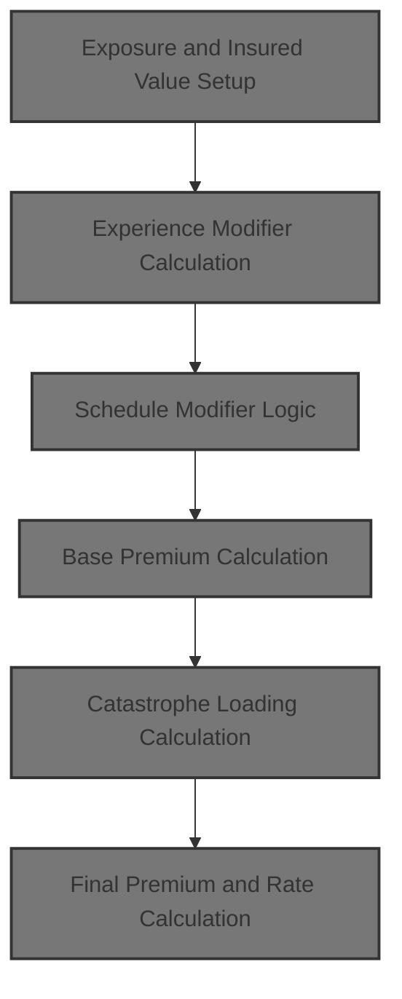
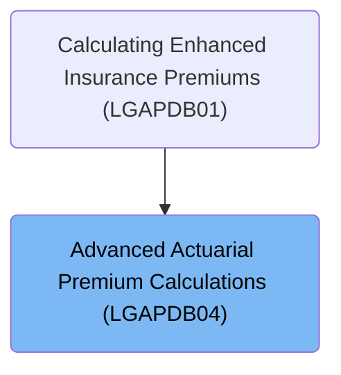
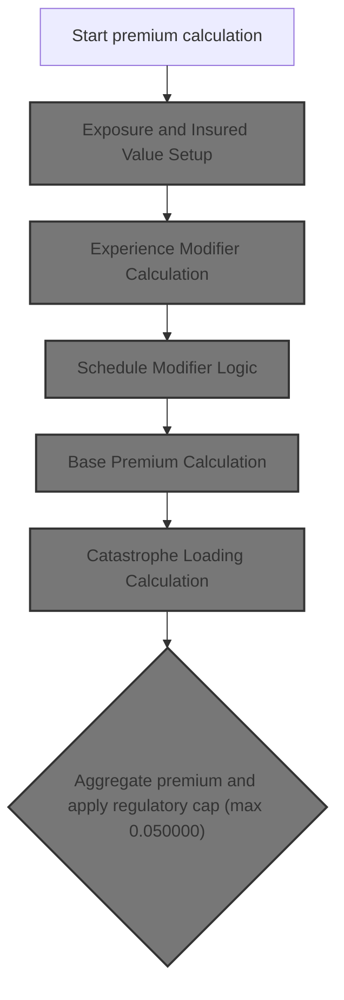
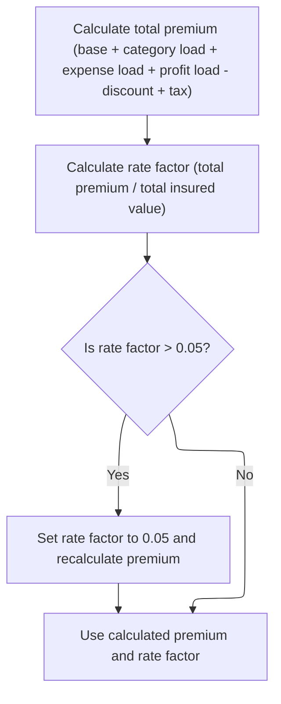

# Overview

This document describes the flow for calculating advanced property insurance premiums. The process sets up exposures, applies business-driven modifiers, aggregates premiums for selected perils, adds catastrophe loadings, and ensures the final premium meets regulatory caps. The output is a calculated premium and rate factor for the policy.



## Dependencies

### Copybook

- SQLCA

# Where is this program used?

This program is used once, as represented in the following diagram:



## Input and Output Tables/Files used in the Program

| Table / File Name                                                                                                         | Type | Description                                                    | Usage Mode | Key Fields / Layout Highlights                                                                                                                                                                                                                                                                                                                                                                                                                                                                                                                                                                                                                                                                                                            |
| ------------------------------------------------------------------------------------------------------------------------- | ---- | -------------------------------------------------------------- | ---------- | ----------------------------------------------------------------------------------------------------------------------------------------------------------------------------------------------------------------------------------------------------------------------------------------------------------------------------------------------------------------------------------------------------------------------------------------------------------------------------------------------------------------------------------------------------------------------------------------------------------------------------------------------------------------------------------------------------------------------------------------- |
| <SwmToken path="base/src/LGAPDB04.cbl" pos="183:3:3" line-data="               FROM RATE_MASTER">`RATE_MASTER`</SwmToken> | DB2  | Territory-based peril rates, min/max premiums, effective dates | Input      | <SwmToken path="base/src/LGAPDB04.cbl" pos="181:3:3" line-data="               SELECT BASE_RATE, MIN_PREMIUM, MAX_PREMIUM">`BASE_RATE`</SwmToken>, <SwmToken path="base/src/LGAPDB04.cbl" pos="181:6:6" line-data="               SELECT BASE_RATE, MIN_PREMIUM, MAX_PREMIUM">`MIN_PREMIUM`</SwmToken>, <SwmToken path="base/src/LGAPDB04.cbl" pos="154:3:7" line-data="           INITIALIZE WS-BASE-RATE-TABLE">`WS-BASE-RATE`</SwmToken>, <SwmToken path="base/src/LGAPDB04.cbl" pos="51:3:7" line-data="                       25 WS-MIN-PREM   PIC 9(5)V99.">`WS-MIN-PREM`</SwmToken>, <SwmToken path="base/src/LGAPDB04.cbl" pos="52:3:7" line-data="                       25 WS-MAX-PREM   PIC 9(7)V99.">`WS-MAX-PREM`</SwmToken> |

&nbsp;

# Workflow

# Main Calculation Sequence



This section governs the step-by-step calculation of an insurance policy premium, ensuring all relevant exposures, modifiers, and regulatory requirements are applied in the correct order.

| Category        | Rule Name                           | Description                                                                                                                                                                                                                                                         |
| --------------- | ----------------------------------- | ------------------------------------------------------------------------------------------------------------------------------------------------------------------------------------------------------------------------------------------------------------------- |
| Data validation | Exposure Initialization Requirement | The calculation sequence must begin with exposure and insured value setup before any premium or modifier calculations are performed.                                                                                                                                |
| Data validation | Regulatory Premium Cap              | The final aggregated premium must not exceed the regulatory cap of <SwmToken path="base/src/LGAPDB04.cbl" pos="473:13:15" line-data="           IF LK-FINAL-RATE-FACTOR &gt; 0.050000">`0.050000`</SwmToken>, and any excess must be reduced to this maximum value. |
| Business logic  | Experience Modifier Application     | The experience modifier must be calculated using the customer's years in business, claims history, and a credibility factor, and must update the premium accordingly.                                                                                               |
| Business logic  | Schedule Modifier Limits            | The schedule modifier must be determined based on building age, protection class, occupancy code, and exposure density, and must be capped according to product guidelines.                                                                                         |
| Business logic  | Base Premium Aggregation            | The base premium must aggregate contributions from selected perils (fire, crime, flood, weather) using exposure values and rating factors.                                                                                                                          |
| Business logic  | Catastrophe Loading Inclusion       | Catastrophe loading must be calculated by adding contributions for hurricane, earthquake, tornado, and flood risks, tailored by coverage selections and risk factors.                                                                                               |

<SwmSnippet path="/base/src/LGAPDB04.cbl" line="138">

---

<SwmToken path="base/src/LGAPDB04.cbl" pos="138:1:3" line-data="       P100-MAIN.">`P100-MAIN`</SwmToken> kicks off the whole calculation process. It calls each major step in order, starting with <SwmToken path="base/src/LGAPDB04.cbl" pos="139:3:5" line-data="           PERFORM P200-INIT">`P200-INIT`</SwmToken>, which sets up all the exposure values and totals needed for the rest of the calculations. Without running <SwmToken path="base/src/LGAPDB04.cbl" pos="139:3:5" line-data="           PERFORM P200-INIT">`P200-INIT`</SwmToken> first, none of the downstream premium or modifier logic would have the data it needs to work.

```cobol
       P100-MAIN.
           PERFORM P200-INIT
           PERFORM P300-RATES
           PERFORM P350-EXPOSURE
           PERFORM P400-EXP-MOD
           PERFORM P500-SCHED-MOD
           PERFORM P600-BASE-PREM
           PERFORM P700-CAT-LOAD
           PERFORM P800-EXPENSE
           PERFORM P900-DISC
           PERFORM P950-TAXES
           PERFORM P999-FINAL
           GOBACK.
```

---

</SwmSnippet>

## Exposure and Insured Value Setup

This section establishes the foundational insured values for a policy by adjusting coverage limits according to risk score and calculating exposure density, which are critical for downstream premium and modifier calculations.

<SwmSnippet path="/base/src/LGAPDB04.cbl" line="152">

---

In <SwmToken path="base/src/LGAPDB04.cbl" pos="152:1:3" line-data="       P200-INIT.">`P200-INIT`</SwmToken>, exposures for building, contents, and BI are calculated by adjusting their limits based on the risk score, using a formula that scales with how much the risk score deviates from 100. Then, it sums these exposures to get the total insured value. This sets up the base numbers for all later premium calculations.

```cobol
       P200-INIT.
           INITIALIZE WS-CALCULATION-AREAS
           INITIALIZE WS-BASE-RATE-TABLE
           
           COMPUTE WS-BUILDING-EXPOSURE = 
               LK-BUILDING-LIMIT * (1 + (LK-RISK-SCORE - 100) / 1000)
               
           COMPUTE WS-CONTENTS-EXPOSURE = 
               LK-CONTENTS-LIMIT * (1 + (LK-RISK-SCORE - 100) / 1000)
               
           COMPUTE WS-BI-EXPOSURE = 
               LK-BI-LIMIT * (1 + (LK-RISK-SCORE - 100) / 1000)
               
           COMPUTE WS-TOTAL-INSURED-VAL = 
               WS-BUILDING-EXPOSURE + WS-CONTENTS-EXPOSURE + 
               WS-BI-EXPOSURE
```

---

</SwmSnippet>

<SwmSnippet path="/base/src/LGAPDB04.cbl" line="169">

---

After exposures and total insured value are set, exposure density is calculated by dividing by square footage. If square footage is zero, it just sets exposure density to <SwmToken path="base/src/LGAPDB04.cbl" pos="173:3:5" line-data="               MOVE 100.00 TO WS-EXPOSURE-DENSITY">`100.00`</SwmToken> to avoid a crash. This value is used in later modifiers.

```cobol
           IF LK-SQUARE-FOOTAGE > ZERO
               COMPUTE WS-EXPOSURE-DENSITY = 
                   WS-TOTAL-INSURED-VAL / LK-SQUARE-FOOTAGE
           ELSE
               MOVE 100.00 TO WS-EXPOSURE-DENSITY
           END-IF.
```

---

</SwmSnippet>

## Experience Modifier Calculation

```mermaid
%%{init: {"flowchart": {"defaultRenderer": "elk"}} }%%
flowchart TD
    node1["Start experience modifier calculation"]
    click node1 openCode "base/src/LGAPDB04.cbl:234:235"
    node1 --> node2{"Is years in business >= 5?"}
    click node2 openCode "base/src/LGAPDB04.cbl:237:237"
    node2 -->|"Yes"| node3{"Claims count in 5 years = 0?"}
    click node3 openCode "base/src/LGAPDB04.cbl:238:238"
    node3 -->|"Yes"| node4["Set experience modifier to 0.8500"]
    click node4 openCode "base/src/LGAPDB04.cbl:239:239"
    node3 -->|"No"| node5["Calculate experience modifier: 1.0000 + (claims amount / total insured value) * credibility factor * 0.50"]
    click node5 openCode "base/src/LGAPDB04.cbl:241:244"
    node5 --> node6{"Is experience modifier > 2.0000?"}
    click node6 openCode "base/src/LGAPDB04.cbl:246:246"
    node6 -->|"Yes"| node7["Set experience modifier to 2.0000"]
    click node7 openCode "base/src/LGAPDB04.cbl:247:247"
    node6 -->|"No"| node8["Check minimum cap"]
    node7 --> node9{"Is experience modifier < 0.5000?"}
    click node9 openCode "base/src/LGAPDB04.cbl:250:250"
    node8 --> node9
    node9 -->|"Yes"| node10["Set experience modifier to 0.5000"]
    click node10 openCode "base/src/LGAPDB04.cbl:251:251"
    node9 -->|"No"| node11["Use calculated experience modifier"]
    click node11 openCode "base/src/LGAPDB04.cbl:241:244"
    node4 --> node12["Move experience modifier to output"]
    click node12 openCode "base/src/LGAPDB04.cbl:258:258"
    node10 --> node12
    node11 --> node12
    node2 -->|"No"| node13["Set experience modifier to 1.1000"]
    click node13 openCode "base/src/LGAPDB04.cbl:255:255"
    node13 --> node12
classDef HeadingStyle fill:#777777,stroke:#333,stroke-width:2px;

%% Swimm:
%% %%{init: {"flowchart": {"defaultRenderer": "elk"}} }%%
%% flowchart TD
%%     node1["Start experience modifier calculation"]
%%     click node1 openCode "<SwmPath>[base/src/LGAPDB04.cbl](base/src/LGAPDB04.cbl)</SwmPath>:234:235"
%%     node1 --> node2{"Is years in business >= 5?"}
%%     click node2 openCode "<SwmPath>[base/src/LGAPDB04.cbl](base/src/LGAPDB04.cbl)</SwmPath>:237:237"
%%     node2 -->|"Yes"| node3{"Claims count in 5 years = 0?"}
%%     click node3 openCode "<SwmPath>[base/src/LGAPDB04.cbl](base/src/LGAPDB04.cbl)</SwmPath>:238:238"
%%     node3 -->|"Yes"| node4["Set experience modifier to <SwmToken path="base/src/LGAPDB04.cbl" pos="239:3:5" line-data="                   MOVE 0.8500 TO WS-EXPERIENCE-MOD">`0.8500`</SwmToken>"]
%%     click node4 openCode "<SwmPath>[base/src/LGAPDB04.cbl](base/src/LGAPDB04.cbl)</SwmPath>:239:239"
%%     node3 -->|"No"| node5["Calculate experience modifier: <SwmToken path="base/src/LGAPDB04.cbl" pos="235:3:5" line-data="           MOVE 1.0000 TO WS-EXPERIENCE-MOD">`1.0000`</SwmToken> + (claims amount / total insured value) * credibility factor * <SwmToken path="base/src/LGAPDB04.cbl" pos="244:9:11" line-data="                        WS-CREDIBILITY-FACTOR * 0.50)">`0.50`</SwmToken>"]
%%     click node5 openCode "<SwmPath>[base/src/LGAPDB04.cbl](base/src/LGAPDB04.cbl)</SwmPath>:241:244"
%%     node5 --> node6{"Is experience modifier > <SwmToken path="base/src/LGAPDB04.cbl" pos="246:11:13" line-data="                   IF WS-EXPERIENCE-MOD &gt; 2.0000">`2.0000`</SwmToken>?"}
%%     click node6 openCode "<SwmPath>[base/src/LGAPDB04.cbl](base/src/LGAPDB04.cbl)</SwmPath>:246:246"
%%     node6 -->|"Yes"| node7["Set experience modifier to <SwmToken path="base/src/LGAPDB04.cbl" pos="246:11:13" line-data="                   IF WS-EXPERIENCE-MOD &gt; 2.0000">`2.0000`</SwmToken>"]
%%     click node7 openCode "<SwmPath>[base/src/LGAPDB04.cbl](base/src/LGAPDB04.cbl)</SwmPath>:247:247"
%%     node6 -->|"No"| node8["Check minimum cap"]
%%     node7 --> node9{"Is experience modifier < <SwmToken path="base/src/LGAPDB04.cbl" pos="250:11:13" line-data="                   IF WS-EXPERIENCE-MOD &lt; 0.5000">`0.5000`</SwmToken>?"}
%%     click node9 openCode "<SwmPath>[base/src/LGAPDB04.cbl](base/src/LGAPDB04.cbl)</SwmPath>:250:250"
%%     node8 --> node9
%%     node9 -->|"Yes"| node10["Set experience modifier to <SwmToken path="base/src/LGAPDB04.cbl" pos="250:11:13" line-data="                   IF WS-EXPERIENCE-MOD &lt; 0.5000">`0.5000`</SwmToken>"]
%%     click node10 openCode "<SwmPath>[base/src/LGAPDB04.cbl](base/src/LGAPDB04.cbl)</SwmPath>:251:251"
%%     node9 -->|"No"| node11["Use calculated experience modifier"]
%%     click node11 openCode "<SwmPath>[base/src/LGAPDB04.cbl](base/src/LGAPDB04.cbl)</SwmPath>:241:244"
%%     node4 --> node12["Move experience modifier to output"]
%%     click node12 openCode "<SwmPath>[base/src/LGAPDB04.cbl](base/src/LGAPDB04.cbl)</SwmPath>:258:258"
%%     node10 --> node12
%%     node11 --> node12
%%     node2 -->|"No"| node13["Set experience modifier to <SwmToken path="base/src/LGAPDB04.cbl" pos="255:3:5" line-data="               MOVE 1.1000 TO WS-EXPERIENCE-MOD">`1.1000`</SwmToken>"]
%%     click node13 openCode "<SwmPath>[base/src/LGAPDB04.cbl](base/src/LGAPDB04.cbl)</SwmPath>:255:255"
%%     node13 --> node12
%% classDef HeadingStyle fill:#777777,stroke:#333,stroke-width:2px;
```



This section determines the experience modifier for a business, which adjusts insurance premiums based on claims history and business tenure. The modifier rewards claim-free, established businesses and penalizes those with higher claims or less experience.

| Category        | Rule Name                                                                                                                                                    | Description                                                                                                                                                                                                                                                                                                                                                                                                                                                                                                                                                                                                                                                                                    |
| --------------- | ------------------------------------------------------------------------------------------------------------------------------------------------------------ | ---------------------------------------------------------------------------------------------------------------------------------------------------------------------------------------------------------------------------------------------------------------------------------------------------------------------------------------------------------------------------------------------------------------------------------------------------------------------------------------------------------------------------------------------------------------------------------------------------------------------------------------------------------------------------------------------- |
| Data validation | Maximum modifier cap                                                                                                                                         | The experience modifier cannot exceed <SwmToken path="base/src/LGAPDB04.cbl" pos="246:11:13" line-data="                   IF WS-EXPERIENCE-MOD &gt; 2.0000">`2.0000`</SwmToken>, regardless of calculation.                                                                                                                                                                                                                                                                                                                                                                                                                                                                                   |
| Data validation | Minimum modifier floor                                                                                                                                       | The experience modifier cannot be less than <SwmToken path="base/src/LGAPDB04.cbl" pos="250:11:13" line-data="                   IF WS-EXPERIENCE-MOD &lt; 0.5000">`0.5000`</SwmToken>, regardless of calculation.                                                                                                                                                                                                                                                                                                                                                                                                                                                                             |
| Business logic  | <SwmToken path="base/src/LGAPDB04.cbl" pos="425:3:5" line-data="      * Claims-free discount  ">`Claims-free`</SwmToken> discount for established businesses | If the business has been operating for 5 or more years and has zero claims in the past 5 years, the experience modifier is set to <SwmToken path="base/src/LGAPDB04.cbl" pos="239:3:5" line-data="                   MOVE 0.8500 TO WS-EXPERIENCE-MOD">`0.8500`</SwmToken>.                                                                                                                                                                                                                                                                                                                                                                                                                    |
| Business logic  | New business penalty                                                                                                                                         | If the business has been operating for less than 5 years, the experience modifier is set to <SwmToken path="base/src/LGAPDB04.cbl" pos="255:3:5" line-data="               MOVE 1.1000 TO WS-EXPERIENCE-MOD">`1.1000`</SwmToken>.                                                                                                                                                                                                                                                                                                                                                                                                                                                              |
| Business logic  | Claims-based experience adjustment                                                                                                                           | If the business has been operating for 5 or more years and has claims in the past 5 years, the experience modifier is calculated as <SwmToken path="base/src/LGAPDB04.cbl" pos="235:3:5" line-data="           MOVE 1.0000 TO WS-EXPERIENCE-MOD">`1.0000`</SwmToken> plus the claims ratio (claims amount divided by total insured value), multiplied by the credibility factor (<SwmToken path="base/src/LGAPDB04.cbl" pos="27:15:17" line-data="           05 WS-CREDIBILITY-FACTOR    PIC V999 VALUE 0.750.">`0.750`</SwmToken>) and a weight of <SwmToken path="base/src/LGAPDB04.cbl" pos="244:9:11" line-data="                        WS-CREDIBILITY-FACTOR * 0.50)">`0.50`</SwmToken>. |

<SwmSnippet path="/base/src/LGAPDB04.cbl" line="234">

---

In <SwmToken path="base/src/LGAPDB04.cbl" pos="234:1:5" line-data="       P400-EXP-MOD.">`P400-EXP-MOD`</SwmToken>, the experience modifier is set up based on years in business and claims history. If the business is 5+ years old and has no claims, it gets a 0.85 modifier (discount). Otherwise, it calculates a modifier using claims amount, insured value, credibility, and a 0.5 weight. For new businesses, it just uses 1.1.

```cobol
       P400-EXP-MOD.
           MOVE 1.0000 TO WS-EXPERIENCE-MOD
           
           IF LK-YEARS-IN-BUSINESS >= 5
               IF LK-CLAIMS-COUNT-5YR = ZERO
                   MOVE 0.8500 TO WS-EXPERIENCE-MOD
```

---

</SwmSnippet>

<SwmSnippet path="/base/src/LGAPDB04.cbl" line="240">

---

Next, if there are claims, the modifier is calculated from the claims ratio, credibility, and a 0.5 weight. There's no check for zero insured value, so this assumes the input is always valid.

```cobol
               ELSE
                   COMPUTE WS-EXPERIENCE-MOD = 
                       1.0000 + 
                       ((LK-CLAIMS-AMOUNT-5YR / WS-TOTAL-INSURED-VAL) * 
                        WS-CREDIBILITY-FACTOR * 0.50)
                   
                   IF WS-EXPERIENCE-MOD > 2.0000
                       MOVE 2.0000 TO WS-EXPERIENCE-MOD
                   END-IF
```

---

</SwmSnippet>

<SwmSnippet path="/base/src/LGAPDB04.cbl" line="250">

---

After calculating the modifier, it's capped at 2.0 max and 0.5 min to keep the premium impact within set bounds.

```cobol
                   IF WS-EXPERIENCE-MOD < 0.5000
                       MOVE 0.5000 TO WS-EXPERIENCE-MOD
                   END-IF
```

---

</SwmSnippet>

<SwmSnippet path="/base/src/LGAPDB04.cbl" line="254">

---

Finally, the computed experience modifier is stored in <SwmToken path="base/src/LGAPDB04.cbl" pos="258:11:15" line-data="           MOVE WS-EXPERIENCE-MOD TO LK-EXPERIENCE-MOD.">`LK-EXPERIENCE-MOD`</SwmToken> for use in later premium calculations.

```cobol
           ELSE
               MOVE 1.1000 TO WS-EXPERIENCE-MOD
           END-IF
           
           MOVE WS-EXPERIENCE-MOD TO LK-EXPERIENCE-MOD.
```

---

</SwmSnippet>

## Schedule Modifier Logic

```mermaid
%%{init: {"flowchart": {"defaultRenderer": "elk"}} }%%
flowchart TD
    node1["Start schedule modification calculation"]
    click node1 openCode "base/src/LGAPDB04.cbl:260:261"
    node1 --> node2{"Building age adjustment"}
    click node2 openCode "base/src/LGAPDB04.cbl:263:273"
    node2 -->|"#gt;= 2010"| node3["Subtract 0.050 from factor"]
    node2 -->|"#gt;= 1990"| node4["No change"]
    node2 -->|"#gt;= 1970"| node5["Add 0.100 to factor"]
    node2 -->|"Older"| node6["Add 0.200 to factor"]
    node3 --> node7{"Protection class adjustment"}
    node4 --> node7
    node5 --> node7
    node6 --> node7
    click node7 openCode "base/src/LGAPDB04.cbl:276:285"
    node7 -->|"'01'-'03'"| node8["Subtract 0.100 from factor"]
    node7 -->|"'04'-'06'"| node9["Subtract 0.050 from factor"]
    node7 -->|"'07'-'09'"| node10["No change"]
    node7 -->|"Other"| node11["Add 0.150 to factor"]
    node8 --> node12{"Occupancy code adjustment"}
    node9 --> node12
    node10 --> node12
    node11 --> node12
    click node12 openCode "base/src/LGAPDB04.cbl:288:297"
    node12 -->|"OFF01-OFF05"| node13["Subtract 0.025 from factor"]
    node12 -->|"MFG01-MFG10"| node14["Add 0.075 to factor"]
    node12 -->|"WHS01-WHS05"| node15["Add 0.125 to factor"]
    node12 -->|"Other"| node16["No change"]
    node13 --> node17{"Exposure density adjustment"}
    node14 --> node17
    node15 --> node17
    node16 --> node17
    click node17 openCode "base/src/LGAPDB04.cbl:300:305"
    node17 -->|"#gt; 500.00"| node18["Add 0.100 to factor"]
    node17 -->|"#lt; 50.00"| node19["Subtract 0.050 from factor"]
    node17 -->|"Else"| node20["No change"]
    node18 --> node21{"Cap factor"}
    node19 --> node21
    node20 --> node21
    click node21 openCode "base/src/LGAPDB04.cbl:308:314"
    node21 -->|"#gt; +0.400"| node22["Set factor to +0.400"]
    node21 -->|"#lt; -0.200"| node23["Set factor to -0.200"]
    node21 -->|"Else"| node24["Keep calculated factor"]
    node22 --> node25["Store schedule modification result"]
    node23 --> node25
    node24 --> node25
    click node25 openCode "base/src/LGAPDB04.cbl:316:316"
classDef HeadingStyle fill:#777777,stroke:#333,stroke-width:2px;

%% Swimm:
%% %%{init: {"flowchart": {"defaultRenderer": "elk"}} }%%
%% flowchart TD
%%     node1["Start schedule modification calculation"]
%%     click node1 openCode "<SwmPath>[base/src/LGAPDB04.cbl](base/src/LGAPDB04.cbl)</SwmPath>:260:261"
%%     node1 --> node2{"Building age adjustment"}
%%     click node2 openCode "<SwmPath>[base/src/LGAPDB04.cbl](base/src/LGAPDB04.cbl)</SwmPath>:263:273"
%%     node2 -->|"#gt;= 2010"| node3["Subtract <SwmToken path="base/src/LGAPDB04.cbl" pos="266:3:5" line-data="                   SUBTRACT 0.050 FROM WS-SCHEDULE-MOD">`0.050`</SwmToken> from factor"]
%%     node2 -->|"#gt;= 1990"| node4["No change"]
%%     node2 -->|"#gt;= 1970"| node5["Add <SwmToken path="base/src/LGAPDB04.cbl" pos="270:3:5" line-data="                   ADD 0.100 TO WS-SCHEDULE-MOD">`0.100`</SwmToken> to factor"]
%%     node2 -->|"Older"| node6["Add <SwmToken path="base/src/LGAPDB04.cbl" pos="272:3:5" line-data="                   ADD 0.200 TO WS-SCHEDULE-MOD">`0.200`</SwmToken> to factor"]
%%     node3 --> node7{"Protection class adjustment"}
%%     node4 --> node7
%%     node5 --> node7
%%     node6 --> node7
%%     click node7 openCode "<SwmPath>[base/src/LGAPDB04.cbl](base/src/LGAPDB04.cbl)</SwmPath>:276:285"
%%     node7 -->|"'01'-'03'"| node8["Subtract <SwmToken path="base/src/LGAPDB04.cbl" pos="270:3:5" line-data="                   ADD 0.100 TO WS-SCHEDULE-MOD">`0.100`</SwmToken> from factor"]
%%     node7 -->|"'04'-'06'"| node9["Subtract <SwmToken path="base/src/LGAPDB04.cbl" pos="266:3:5" line-data="                   SUBTRACT 0.050 FROM WS-SCHEDULE-MOD">`0.050`</SwmToken> from factor"]
%%     node7 -->|"'07'-'09'"| node10["No change"]
%%     node7 -->|"Other"| node11["Add <SwmToken path="base/src/LGAPDB04.cbl" pos="284:3:5" line-data="                   ADD 0.150 TO WS-SCHEDULE-MOD">`0.150`</SwmToken> to factor"]
%%     node8 --> node12{"Occupancy code adjustment"}
%%     node9 --> node12
%%     node10 --> node12
%%     node11 --> node12
%%     click node12 openCode "<SwmPath>[base/src/LGAPDB04.cbl](base/src/LGAPDB04.cbl)</SwmPath>:288:297"
%%     node12 -->|"<SwmToken path="base/src/LGAPDB04.cbl" pos="289:4:4" line-data="               WHEN &#39;OFF01&#39; THRU &#39;OFF05&#39;">`OFF01`</SwmToken>-<SwmToken path="base/src/LGAPDB04.cbl" pos="289:10:10" line-data="               WHEN &#39;OFF01&#39; THRU &#39;OFF05&#39;">`OFF05`</SwmToken>"| node13["Subtract <SwmToken path="base/src/LGAPDB04.cbl" pos="290:3:5" line-data="                   SUBTRACT 0.025 FROM WS-SCHEDULE-MOD">`0.025`</SwmToken> from factor"]
%%     node12 -->|"<SwmToken path="base/src/LGAPDB04.cbl" pos="291:4:4" line-data="               WHEN &#39;MFG01&#39; THRU &#39;MFG10&#39;">`MFG01`</SwmToken>-<SwmToken path="base/src/LGAPDB04.cbl" pos="291:10:10" line-data="               WHEN &#39;MFG01&#39; THRU &#39;MFG10&#39;">`MFG10`</SwmToken>"| node14["Add <SwmToken path="base/src/LGAPDB04.cbl" pos="292:3:5" line-data="                   ADD 0.075 TO WS-SCHEDULE-MOD">`0.075`</SwmToken> to factor"]
%%     node12 -->|"<SwmToken path="base/src/LGAPDB04.cbl" pos="293:4:4" line-data="               WHEN &#39;WHS01&#39; THRU &#39;WHS05&#39;">`WHS01`</SwmToken>-<SwmToken path="base/src/LGAPDB04.cbl" pos="293:10:10" line-data="               WHEN &#39;WHS01&#39; THRU &#39;WHS05&#39;">`WHS05`</SwmToken>"| node15["Add <SwmToken path="base/src/LGAPDB04.cbl" pos="294:3:5" line-data="                   ADD 0.125 TO WS-SCHEDULE-MOD">`0.125`</SwmToken> to factor"]
%%     node12 -->|"Other"| node16["No change"]
%%     node13 --> node17{"Exposure density adjustment"}
%%     node14 --> node17
%%     node15 --> node17
%%     node16 --> node17
%%     click node17 openCode "<SwmPath>[base/src/LGAPDB04.cbl](base/src/LGAPDB04.cbl)</SwmPath>:300:305"
%%     node17 -->|"#gt; <SwmToken path="base/src/LGAPDB04.cbl" pos="300:11:13" line-data="           IF WS-EXPOSURE-DENSITY &gt; 500.00">`500.00`</SwmToken>"| node18["Add <SwmToken path="base/src/LGAPDB04.cbl" pos="270:3:5" line-data="                   ADD 0.100 TO WS-SCHEDULE-MOD">`0.100`</SwmToken> to factor"]
%%     node17 -->|"#lt; <SwmToken path="base/src/LGAPDB04.cbl" pos="303:11:13" line-data="               IF WS-EXPOSURE-DENSITY &lt; 50.00">`50.00`</SwmToken>"| node19["Subtract <SwmToken path="base/src/LGAPDB04.cbl" pos="266:3:5" line-data="                   SUBTRACT 0.050 FROM WS-SCHEDULE-MOD">`0.050`</SwmToken> from factor"]
%%     node17 -->|"Else"| node20["No change"]
%%     node18 --> node21{"Cap factor"}
%%     node19 --> node21
%%     node20 --> node21
%%     click node21 openCode "<SwmPath>[base/src/LGAPDB04.cbl](base/src/LGAPDB04.cbl)</SwmPath>:308:314"
%%     node21 -->|"#gt; +<SwmToken path="base/src/LGAPDB04.cbl" pos="308:12:14" line-data="           IF WS-SCHEDULE-MOD &gt; +0.400">`0.400`</SwmToken>"| node22["Set factor to +<SwmToken path="base/src/LGAPDB04.cbl" pos="308:12:14" line-data="           IF WS-SCHEDULE-MOD &gt; +0.400">`0.400`</SwmToken>"]
%%     node21 -->|"#lt; <SwmToken path="base/src/LGAPDB04.cbl" pos="312:11:14" line-data="           IF WS-SCHEDULE-MOD &lt; -0.200">`-0.200`</SwmToken>"| node23["Set factor to <SwmToken path="base/src/LGAPDB04.cbl" pos="312:11:14" line-data="           IF WS-SCHEDULE-MOD &lt; -0.200">`-0.200`</SwmToken>"]
%%     node21 -->|"Else"| node24["Keep calculated factor"]
%%     node22 --> node25["Store schedule modification result"]
%%     node23 --> node25
%%     node24 --> node25
%%     click node25 openCode "<SwmPath>[base/src/LGAPDB04.cbl](base/src/LGAPDB04.cbl)</SwmPath>:316:316"
%% classDef HeadingStyle fill:#777777,stroke:#333,stroke-width:2px;
```



This section determines the schedule modifier for a property insurance policy. The modifier is calculated by sequentially adjusting a base value according to business rules for building age, protection class, occupancy code, and exposure density, and is then capped to ensure it remains within acceptable limits.

| Category        | Rule Name                   | Description                                                                                                                                                                                                                                                                                                                                                                                                                                                                                                                                                                                                                                                                                                                                                                                                                                                                                                                                                                                                                                                                                                                                                                                                                                                                                                                                                                                                                                                      |
| --------------- | --------------------------- | ---------------------------------------------------------------------------------------------------------------------------------------------------------------------------------------------------------------------------------------------------------------------------------------------------------------------------------------------------------------------------------------------------------------------------------------------------------------------------------------------------------------------------------------------------------------------------------------------------------------------------------------------------------------------------------------------------------------------------------------------------------------------------------------------------------------------------------------------------------------------------------------------------------------------------------------------------------------------------------------------------------------------------------------------------------------------------------------------------------------------------------------------------------------------------------------------------------------------------------------------------------------------------------------------------------------------------------------------------------------------------------------------------------------------------------------------------------------- |
| Data validation | Schedule modifier capping   | If the calculated schedule modifier exceeds +<SwmToken path="base/src/LGAPDB04.cbl" pos="308:12:14" line-data="           IF WS-SCHEDULE-MOD &gt; +0.400">`0.400`</SwmToken>, set it to +<SwmToken path="base/src/LGAPDB04.cbl" pos="308:12:14" line-data="           IF WS-SCHEDULE-MOD &gt; +0.400">`0.400`</SwmToken>. If it is less than <SwmToken path="base/src/LGAPDB04.cbl" pos="312:11:14" line-data="           IF WS-SCHEDULE-MOD &lt; -0.200">`-0.200`</SwmToken>, set it to <SwmToken path="base/src/LGAPDB04.cbl" pos="312:11:14" line-data="           IF WS-SCHEDULE-MOD &lt; -0.200">`-0.200`</SwmToken>. Otherwise, keep the calculated value.                                                                                                                                                                                                                                                                                                                                                                                                                                                                                                                                                                                                                                                                                                                                                                                                 |
| Business logic  | Building age adjustment     | If the building was built in 2010 or later, subtract <SwmToken path="base/src/LGAPDB04.cbl" pos="266:3:5" line-data="                   SUBTRACT 0.050 FROM WS-SCHEDULE-MOD">`0.050`</SwmToken> from the schedule modifier. If built between 1990 and 2009, no change is made. If built between 1970 and 1989, add <SwmToken path="base/src/LGAPDB04.cbl" pos="270:3:5" line-data="                   ADD 0.100 TO WS-SCHEDULE-MOD">`0.100`</SwmToken> to the modifier. If built before 1970, add <SwmToken path="base/src/LGAPDB04.cbl" pos="272:3:5" line-data="                   ADD 0.200 TO WS-SCHEDULE-MOD">`0.200`</SwmToken> to the modifier.                                                                                                                                                                                                                                                                                                                                                                                                                                                                                                                                                                                                                                                                                                                                                                                                           |
| Business logic  | Protection class adjustment | If the protection class is '01' through '03', subtract <SwmToken path="base/src/LGAPDB04.cbl" pos="270:3:5" line-data="                   ADD 0.100 TO WS-SCHEDULE-MOD">`0.100`</SwmToken> from the schedule modifier. If '04' through '06', subtract <SwmToken path="base/src/LGAPDB04.cbl" pos="266:3:5" line-data="                   SUBTRACT 0.050 FROM WS-SCHEDULE-MOD">`0.050`</SwmToken>. If '07' through '09', no change. For any other protection class, add <SwmToken path="base/src/LGAPDB04.cbl" pos="284:3:5" line-data="                   ADD 0.150 TO WS-SCHEDULE-MOD">`0.150`</SwmToken> to the modifier.                                                                                                                                                                                                                                                                                                                                                                                                                                                                                                                                                                                                                                                                                                                                                                                                                                      |
| Business logic  | Occupancy code adjustment   | If the occupancy code is <SwmToken path="base/src/LGAPDB04.cbl" pos="289:4:4" line-data="               WHEN &#39;OFF01&#39; THRU &#39;OFF05&#39;">`OFF01`</SwmToken> through <SwmToken path="base/src/LGAPDB04.cbl" pos="289:10:10" line-data="               WHEN &#39;OFF01&#39; THRU &#39;OFF05&#39;">`OFF05`</SwmToken>, subtract <SwmToken path="base/src/LGAPDB04.cbl" pos="290:3:5" line-data="                   SUBTRACT 0.025 FROM WS-SCHEDULE-MOD">`0.025`</SwmToken> from the schedule modifier. If <SwmToken path="base/src/LGAPDB04.cbl" pos="291:4:4" line-data="               WHEN &#39;MFG01&#39; THRU &#39;MFG10&#39;">`MFG01`</SwmToken> through <SwmToken path="base/src/LGAPDB04.cbl" pos="291:10:10" line-data="               WHEN &#39;MFG01&#39; THRU &#39;MFG10&#39;">`MFG10`</SwmToken>, add <SwmToken path="base/src/LGAPDB04.cbl" pos="292:3:5" line-data="                   ADD 0.075 TO WS-SCHEDULE-MOD">`0.075`</SwmToken>. If <SwmToken path="base/src/LGAPDB04.cbl" pos="293:4:4" line-data="               WHEN &#39;WHS01&#39; THRU &#39;WHS05&#39;">`WHS01`</SwmToken> through <SwmToken path="base/src/LGAPDB04.cbl" pos="293:10:10" line-data="               WHEN &#39;WHS01&#39; THRU &#39;WHS05&#39;">`WHS05`</SwmToken>, add <SwmToken path="base/src/LGAPDB04.cbl" pos="294:3:5" line-data="                   ADD 0.125 TO WS-SCHEDULE-MOD">`0.125`</SwmToken>. For any other occupancy code, no change is made. |
| Business logic  | Exposure density adjustment | If exposure density is greater than <SwmToken path="base/src/LGAPDB04.cbl" pos="300:11:13" line-data="           IF WS-EXPOSURE-DENSITY &gt; 500.00">`500.00`</SwmToken>, add <SwmToken path="base/src/LGAPDB04.cbl" pos="270:3:5" line-data="                   ADD 0.100 TO WS-SCHEDULE-MOD">`0.100`</SwmToken> to the schedule modifier. If less than <SwmToken path="base/src/LGAPDB04.cbl" pos="303:11:13" line-data="               IF WS-EXPOSURE-DENSITY &lt; 50.00">`50.00`</SwmToken>, subtract <SwmToken path="base/src/LGAPDB04.cbl" pos="266:3:5" line-data="                   SUBTRACT 0.050 FROM WS-SCHEDULE-MOD">`0.050`</SwmToken>. Otherwise, no change is made.                                                                                                                                                                                                                                                                                                                                                                                                                                                                                                                                                                                                                                                                                                                                                                              |

<SwmSnippet path="/base/src/LGAPDB04.cbl" line="260">

---

In <SwmToken path="base/src/LGAPDB04.cbl" pos="260:1:5" line-data="       P500-SCHED-MOD.">`P500-SCHED-MOD`</SwmToken>, the schedule modifier is built up by adjusting for building age, protection class, and occupancy code, each with their own set of increments or decrements. These are all business-driven ranges and constants. The modifier is then capped before being output.

```cobol
       P500-SCHED-MOD.
           MOVE +0.000 TO WS-SCHEDULE-MOD
           
      *    Building age factor
           EVALUATE TRUE
               WHEN LK-YEAR-BUILT >= 2010
                   SUBTRACT 0.050 FROM WS-SCHEDULE-MOD
               WHEN LK-YEAR-BUILT >= 1990
                   CONTINUE
               WHEN LK-YEAR-BUILT >= 1970
                   ADD 0.100 TO WS-SCHEDULE-MOD
               WHEN OTHER
                   ADD 0.200 TO WS-SCHEDULE-MOD
           END-EVALUATE
```

---

</SwmSnippet>

<SwmSnippet path="/base/src/LGAPDB04.cbl" line="276">

---

Next, the modifier is adjusted based on protection class, with different changes for each code range. This step follows building age and comes before occupancy code adjustments.

```cobol
           EVALUATE LK-PROTECTION-CLASS
               WHEN '01' THRU '03'
                   SUBTRACT 0.100 FROM WS-SCHEDULE-MOD
               WHEN '04' THRU '06'
                   SUBTRACT 0.050 FROM WS-SCHEDULE-MOD
               WHEN '07' THRU '09'
                   CONTINUE
               WHEN OTHER
                   ADD 0.150 TO WS-SCHEDULE-MOD
           END-EVALUATE
```

---

</SwmSnippet>

<SwmSnippet path="/base/src/LGAPDB04.cbl" line="288">

---

Then the modifier is adjusted for occupancy code, with each group (office, manufacturing, warehouse) getting its own increment or decrement. This comes after protection class and before exposure density.

```cobol
           EVALUATE LK-OCCUPANCY-CODE
               WHEN 'OFF01' THRU 'OFF05'
                   SUBTRACT 0.025 FROM WS-SCHEDULE-MOD
               WHEN 'MFG01' THRU 'MFG10'
                   ADD 0.075 TO WS-SCHEDULE-MOD
               WHEN 'WHS01' THRU 'WHS05'
                   ADD 0.125 TO WS-SCHEDULE-MOD
               WHEN OTHER
                   CONTINUE
           END-EVALUATE
```

---

</SwmSnippet>

<SwmSnippet path="/base/src/LGAPDB04.cbl" line="300">

---

After occupancy code, the modifier is bumped up or down if exposure density is above 500 or below 50. This is the last adjustment before capping.

```cobol
           IF WS-EXPOSURE-DENSITY > 500.00
               ADD 0.100 TO WS-SCHEDULE-MOD
           ELSE
               IF WS-EXPOSURE-DENSITY < 50.00
                   SUBTRACT 0.050 FROM WS-SCHEDULE-MOD
               END-IF
```

---

</SwmSnippet>

<SwmSnippet path="/base/src/LGAPDB04.cbl" line="306">

---

Now the modifier is capped at +0.4 if it went too high. The next step will cap the lower bound.

```cobol
           END-IF
           
           IF WS-SCHEDULE-MOD > +0.400
               MOVE +0.400 TO WS-SCHEDULE-MOD
           END-IF
```

---

</SwmSnippet>

<SwmSnippet path="/base/src/LGAPDB04.cbl" line="312">

---

Finally, the modifier is capped at -0.2 if it went too low, then stored in <SwmToken path="base/src/LGAPDB04.cbl" pos="316:11:15" line-data="           MOVE WS-SCHEDULE-MOD TO LK-SCHEDULE-MOD.">`LK-SCHEDULE-MOD`</SwmToken> for use in premium calculations.

```cobol
           IF WS-SCHEDULE-MOD < -0.200
               MOVE -0.200 TO WS-SCHEDULE-MOD
           END-IF
           
           MOVE WS-SCHEDULE-MOD TO LK-SCHEDULE-MOD.
```

---

</SwmSnippet>

## Base Premium Calculation

```mermaid
%%{init: {"flowchart": {"defaultRenderer": "elk"}} }%%
flowchart TD
    node1["Start base premium calculation"]
    click node1 openCode "base/src/LGAPDB04.cbl:318:318"
    node1 --> node2{"Fire coverage selected?"}
    click node2 openCode "base/src/LGAPDB04.cbl:322:331"
    node2 -->|"Yes"| node3["Calculate fire premium: (building + contents exposure) × base rate × experience mod × (1 + schedule mod) × trend factor; add to total"]
    click node3 openCode "base/src/LGAPDB04.cbl:323:330"
    node2 -->|"No"| node4{"Crime coverage selected?"}
    click node4 openCode "base/src/LGAPDB04.cbl:334:343"
    node3 --> node4
    node4 -->|"Yes"| node5["Calculate crime premium: contents exposure × 0.80 × base rate × experience mod × (1 + schedule mod) × trend factor; add to total"]
    click node5 openCode "base/src/LGAPDB04.cbl:335:342"
    node4 -->|"No"| node6{"Flood coverage selected?"}
    click node6 openCode "base/src/LGAPDB04.cbl:346:355"
    node5 --> node6
    node6 -->|"Yes"| node7["Calculate flood premium: building exposure × base rate × experience mod × (1 + schedule mod) × trend factor × 1.25; add to total"]
    click node7 openCode "base/src/LGAPDB04.cbl:347:354"
    node6 -->|"No"| node8{"Weather coverage selected?"}
    click node8 openCode "base/src/LGAPDB04.cbl:358:367"
    node7 --> node8
    node8 -->|"Yes"| node9["Calculate weather premium: (building + contents exposure) × base rate × experience mod × (1 + schedule mod) × trend factor; add to total"]
    click node9 openCode "base/src/LGAPDB04.cbl:359:366"
    node8 -->|"No"| node10["Return total base premium"]
    click node10 openCode "base/src/LGAPDB04.cbl:318:367"
    node9 --> node10
classDef HeadingStyle fill:#777777,stroke:#333,stroke-width:2px;

%% Swimm:
%% %%{init: {"flowchart": {"defaultRenderer": "elk"}} }%%
%% flowchart TD
%%     node1["Start base premium calculation"]
%%     click node1 openCode "<SwmPath>[base/src/LGAPDB04.cbl](base/src/LGAPDB04.cbl)</SwmPath>:318:318"
%%     node1 --> node2{"Fire coverage selected?"}
%%     click node2 openCode "<SwmPath>[base/src/LGAPDB04.cbl](base/src/LGAPDB04.cbl)</SwmPath>:322:331"
%%     node2 -->|"Yes"| node3["Calculate fire premium: (building + contents exposure) × base rate × experience mod × (1 + schedule mod) × trend factor; add to total"]
%%     click node3 openCode "<SwmPath>[base/src/LGAPDB04.cbl](base/src/LGAPDB04.cbl)</SwmPath>:323:330"
%%     node2 -->|"No"| node4{"Crime coverage selected?"}
%%     click node4 openCode "<SwmPath>[base/src/LGAPDB04.cbl](base/src/LGAPDB04.cbl)</SwmPath>:334:343"
%%     node3 --> node4
%%     node4 -->|"Yes"| node5["Calculate crime premium: contents exposure × <SwmToken path="base/src/LGAPDB04.cbl" pos="336:10:12" line-data="                   (WS-CONTENTS-EXPOSURE * 0.80) *">`0.80`</SwmToken> × base rate × experience mod × (1 + schedule mod) × trend factor; add to total"]
%%     click node5 openCode "<SwmPath>[base/src/LGAPDB04.cbl](base/src/LGAPDB04.cbl)</SwmPath>:335:342"
%%     node4 -->|"No"| node6{"Flood coverage selected?"}
%%     click node6 openCode "<SwmPath>[base/src/LGAPDB04.cbl](base/src/LGAPDB04.cbl)</SwmPath>:346:355"
%%     node5 --> node6
%%     node6 -->|"Yes"| node7["Calculate flood premium: building exposure × base rate × experience mod × (1 + schedule mod) × trend factor × <SwmToken path="base/src/LGAPDB04.cbl" pos="352:9:11" line-data="                   WS-TREND-FACTOR * 1.25">`1.25`</SwmToken>; add to total"]
%%     click node7 openCode "<SwmPath>[base/src/LGAPDB04.cbl](base/src/LGAPDB04.cbl)</SwmPath>:347:354"
%%     node6 -->|"No"| node8{"Weather coverage selected?"}
%%     click node8 openCode "<SwmPath>[base/src/LGAPDB04.cbl](base/src/LGAPDB04.cbl)</SwmPath>:358:367"
%%     node7 --> node8
%%     node8 -->|"Yes"| node9["Calculate weather premium: (building + contents exposure) × base rate × experience mod × (1 + schedule mod) × trend factor; add to total"]
%%     click node9 openCode "<SwmPath>[base/src/LGAPDB04.cbl](base/src/LGAPDB04.cbl)</SwmPath>:359:366"
%%     node8 -->|"No"| node10["Return total base premium"]
%%     click node10 openCode "<SwmPath>[base/src/LGAPDB04.cbl](base/src/LGAPDB04.cbl)</SwmPath>:318:367"
%%     node9 --> node10
%% classDef HeadingStyle fill:#777777,stroke:#333,stroke-width:2px;
```



The Base Premium Calculation section is responsible for determining the initial premium amount for a policy by aggregating the premiums for each selected peril (fire, crime, flood, weather) using defined business rules and actuarial constants.

| Category        | Rule Name                | Description                                                                                               |
| --------------- | ------------------------ | --------------------------------------------------------------------------------------------------------- |
| Data validation | Peril selection gating   | If a peril is not selected, no premium is calculated or added for that peril.                             |
| Business logic  | Base premium aggregation | The total base premium is the sum of all individual peril premiums calculated for the selected coverages. |

<SwmSnippet path="/base/src/LGAPDB04.cbl" line="318">

---

In <SwmToken path="base/src/LGAPDB04.cbl" pos="318:1:5" line-data="       P600-BASE-PREM.">`P600-BASE-PREM`</SwmToken>, the base premium is built up by checking each peril (fire, crime, flood, weather). For each active peril, it calculates the premium using exposures, the right rate from the table, and applies experience and schedule modifiers plus a trend factor. Each peril's premium is added to the total base amount.

```cobol
       P600-BASE-PREM.
           MOVE ZERO TO LK-BASE-AMOUNT
           
      * FIRE PREMIUM
           IF LK-FIRE-PERIL > ZERO
               COMPUTE LK-FIRE-PREMIUM = 
                   (WS-BUILDING-EXPOSURE + WS-CONTENTS-EXPOSURE) *
                   WS-BASE-RATE (1, 1, 1, 1) * 
                   WS-EXPERIENCE-MOD *
                   (1 + WS-SCHEDULE-MOD) *
                   WS-TREND-FACTOR
                   
               ADD LK-FIRE-PREMIUM TO LK-BASE-AMOUNT
           END-IF
```

---

</SwmSnippet>

<SwmSnippet path="/base/src/LGAPDB04.cbl" line="334">

---

Next, if crime peril is active, the premium is calculated using 80% of the contents exposure, then the same modifiers and trend factor as before. This is added to the base amount.

```cobol
           IF LK-CRIME-PERIL > ZERO
               COMPUTE LK-CRIME-PREMIUM = 
                   (WS-CONTENTS-EXPOSURE * 0.80) *
                   WS-BASE-RATE (2, 1, 1, 1) * 
                   WS-EXPERIENCE-MOD *
                   (1 + WS-SCHEDULE-MOD) *
                   WS-TREND-FACTOR
                   
               ADD LK-CRIME-PREMIUM TO LK-BASE-AMOUNT
           END-IF
```

---

</SwmSnippet>

<SwmSnippet path="/base/src/LGAPDB04.cbl" line="346">

---

Then, if flood peril is active, the premium is calculated from building exposure, the right rate, modifiers, trend factor, and then multiplied by <SwmToken path="base/src/LGAPDB04.cbl" pos="352:9:11" line-data="                   WS-TREND-FACTOR * 1.25">`1.25`</SwmToken> before being added to the base amount.

```cobol
           IF LK-FLOOD-PERIL > ZERO
               COMPUTE LK-FLOOD-PREMIUM = 
                   WS-BUILDING-EXPOSURE *
                   WS-BASE-RATE (3, 1, 1, 1) * 
                   WS-EXPERIENCE-MOD *
                   (1 + WS-SCHEDULE-MOD) *
                   WS-TREND-FACTOR * 1.25
                   
               ADD LK-FLOOD-PREMIUM TO LK-BASE-AMOUNT
           END-IF
```

---

</SwmSnippet>

<SwmSnippet path="/base/src/LGAPDB04.cbl" line="358">

---

Finally, if weather peril is active, its premium is calculated and added to the base amount. The total base premium is now ready for the next steps.

```cobol
           IF LK-WEATHER-PERIL > ZERO
               COMPUTE LK-WEATHER-PREMIUM = 
                   (WS-BUILDING-EXPOSURE + WS-CONTENTS-EXPOSURE) *
                   WS-BASE-RATE (4, 1, 1, 1) * 
                   WS-EXPERIENCE-MOD *
                   (1 + WS-SCHEDULE-MOD) *
                   WS-TREND-FACTOR
                   
               ADD LK-WEATHER-PREMIUM TO LK-BASE-AMOUNT
           END-IF.
```

---

</SwmSnippet>

## Catastrophe Loading Calculation

```mermaid
%%{init: {"flowchart": {"defaultRenderer": "elk"}} }%%
flowchart TD
    node1["Start catastrophe loading calculation"]
    click node1 openCode "base/src/LGAPDB04.cbl:369:370"
    node1 --> node2{"Is hurricane/weather peril selected? (LK-WEATHER-PERIL > 0)"}
    click node2 openCode "base/src/LGAPDB04.cbl:373:376"
    node2 -->|"Yes"| node3["Add hurricane loading (Premium * 0.0125)"]
    click node3 openCode "base/src/LGAPDB04.cbl:374:375"
    node2 -->|"No"| node5
    node3 --> node5["Add earthquake loading (Base Amount * 0.0080)"]
    click node5 openCode "base/src/LGAPDB04.cbl:379:380"
    node5 --> node6{"Is tornado/weather peril selected? (LK-WEATHER-PERIL > 0)"}
    click node6 openCode "base/src/LGAPDB04.cbl:383:386"
    node6 -->|"Yes"| node7["Add tornado loading (Premium * 0.0045)"]
    click node7 openCode "base/src/LGAPDB04.cbl:384:385"
    node6 -->|"No"| node9
    node7 --> node9{"Is flood peril selected? (LK-FLOOD-PERIL > 0)"}
    node9 -->|"Yes"| node10["Add flood loading (Flood Premium * 0.0090)"]
    click node10 openCode "base/src/LGAPDB04.cbl:390:391"
    node9 -->|"No"| node12
    node10 --> node12["Set total catastrophe loading"]
    node12 --> node13["Assign total to LK-CAT-LOAD-AMT"]
    click node12 openCode "base/src/LGAPDB04.cbl:394:394"
    click node13 openCode "base/src/LGAPDB04.cbl:394:394"
classDef HeadingStyle fill:#777777,stroke:#333,stroke-width:2px;

%% Swimm:
%% %%{init: {"flowchart": {"defaultRenderer": "elk"}} }%%
%% flowchart TD
%%     node1["Start catastrophe loading calculation"]
%%     click node1 openCode "<SwmPath>[base/src/LGAPDB04.cbl](base/src/LGAPDB04.cbl)</SwmPath>:369:370"
%%     node1 --> node2{"Is hurricane/weather peril selected? (<SwmToken path="base/src/LGAPDB04.cbl" pos="358:3:7" line-data="           IF LK-WEATHER-PERIL &gt; ZERO">`LK-WEATHER-PERIL`</SwmToken> > 0)"}
%%     click node2 openCode "<SwmPath>[base/src/LGAPDB04.cbl](base/src/LGAPDB04.cbl)</SwmPath>:373:376"
%%     node2 -->|"Yes"| node3["Add hurricane loading (Premium * <SwmToken path="base/src/LGAPDB04.cbl" pos="35:15:17" line-data="           05 WS-HURRICANE-FACTOR      PIC V9999 VALUE 0.0125.">`0.0125`</SwmToken>)"]
%%     click node3 openCode "<SwmPath>[base/src/LGAPDB04.cbl](base/src/LGAPDB04.cbl)</SwmPath>:374:375"
%%     node2 -->|"No"| node5
%%     node3 --> node5["Add earthquake loading (Base Amount * <SwmToken path="base/src/LGAPDB04.cbl" pos="36:15:17" line-data="           05 WS-EARTHQUAKE-FACTOR     PIC V9999 VALUE 0.0080.">`0.0080`</SwmToken>)"]
%%     click node5 openCode "<SwmPath>[base/src/LGAPDB04.cbl](base/src/LGAPDB04.cbl)</SwmPath>:379:380"
%%     node5 --> node6{"Is tornado/weather peril selected? (<SwmToken path="base/src/LGAPDB04.cbl" pos="358:3:7" line-data="           IF LK-WEATHER-PERIL &gt; ZERO">`LK-WEATHER-PERIL`</SwmToken> > 0)"}
%%     click node6 openCode "<SwmPath>[base/src/LGAPDB04.cbl](base/src/LGAPDB04.cbl)</SwmPath>:383:386"
%%     node6 -->|"Yes"| node7["Add tornado loading (Premium * <SwmToken path="base/src/LGAPDB04.cbl" pos="37:15:17" line-data="           05 WS-TORNADO-FACTOR        PIC V9999 VALUE 0.0045.">`0.0045`</SwmToken>)"]
%%     click node7 openCode "<SwmPath>[base/src/LGAPDB04.cbl](base/src/LGAPDB04.cbl)</SwmPath>:384:385"
%%     node6 -->|"No"| node9
%%     node7 --> node9{"Is flood peril selected? (<SwmToken path="base/src/LGAPDB04.cbl" pos="346:3:7" line-data="           IF LK-FLOOD-PERIL &gt; ZERO">`LK-FLOOD-PERIL`</SwmToken> > 0)"}
%%     node9 -->|"Yes"| node10["Add flood loading (Flood Premium * <SwmToken path="base/src/LGAPDB04.cbl" pos="38:15:17" line-data="           05 WS-FLOOD-FACTOR          PIC V9999 VALUE 0.0090.">`0.0090`</SwmToken>)"]
%%     click node10 openCode "<SwmPath>[base/src/LGAPDB04.cbl](base/src/LGAPDB04.cbl)</SwmPath>:390:391"
%%     node9 -->|"No"| node12
%%     node10 --> node12["Set total catastrophe loading"]
%%     node12 --> node13["Assign total to <SwmToken path="base/src/LGAPDB04.cbl" pos="394:11:17" line-data="           MOVE WS-CAT-LOADING TO LK-CAT-LOAD-AMT.">`LK-CAT-LOAD-AMT`</SwmToken>"]
%%     click node12 openCode "<SwmPath>[base/src/LGAPDB04.cbl](base/src/LGAPDB04.cbl)</SwmPath>:394:394"
%%     click node13 openCode "<SwmPath>[base/src/LGAPDB04.cbl](base/src/LGAPDB04.cbl)</SwmPath>:394:394"
%% classDef HeadingStyle fill:#777777,stroke:#333,stroke-width:2px;
```



This section calculates the total catastrophe loading for an insurance policy by applying specific loadings for hurricane, earthquake, tornado, and flood perils, based on peril selections and business-defined factors.

| Category       | Rule Name                    | Description                                                                                                                                                                                                                                                                                                                                                                                                                                                                                                                                                               |
| -------------- | ---------------------------- | ------------------------------------------------------------------------------------------------------------------------------------------------------------------------------------------------------------------------------------------------------------------------------------------------------------------------------------------------------------------------------------------------------------------------------------------------------------------------------------------------------------------------------------------------------------------------- |
| Business logic | Hurricane loading inclusion  | If hurricane/weather peril is selected (<SwmToken path="base/src/LGAPDB04.cbl" pos="358:3:7" line-data="           IF LK-WEATHER-PERIL &gt; ZERO">`LK-WEATHER-PERIL`</SwmToken> > 0), add a hurricane loading equal to <SwmToken path="base/src/LGAPDB04.cbl" pos="359:3:7" line-data="               COMPUTE LK-WEATHER-PREMIUM = ">`LK-WEATHER-PREMIUM`</SwmToken> multiplied by <SwmToken path="base/src/LGAPDB04.cbl" pos="35:15:17" line-data="           05 WS-HURRICANE-FACTOR      PIC V9999 VALUE 0.0125.">`0.0125`</SwmToken> to the total catastrophe loading. |
| Business logic | Earthquake loading inclusion | Always add earthquake loading, calculated as <SwmToken path="base/src/LGAPDB04.cbl" pos="319:7:11" line-data="           MOVE ZERO TO LK-BASE-AMOUNT">`LK-BASE-AMOUNT`</SwmToken> multiplied by <SwmToken path="base/src/LGAPDB04.cbl" pos="36:15:17" line-data="           05 WS-EARTHQUAKE-FACTOR     PIC V9999 VALUE 0.0080.">`0.0080`</SwmToken>, to the total catastrophe loading regardless of peril selections.                                                                                                                                                    |
| Business logic | Tornado loading inclusion    | If tornado/weather peril is selected (<SwmToken path="base/src/LGAPDB04.cbl" pos="358:3:7" line-data="           IF LK-WEATHER-PERIL &gt; ZERO">`LK-WEATHER-PERIL`</SwmToken> > 0), add a tornado loading equal to <SwmToken path="base/src/LGAPDB04.cbl" pos="359:3:7" line-data="               COMPUTE LK-WEATHER-PREMIUM = ">`LK-WEATHER-PREMIUM`</SwmToken> multiplied by <SwmToken path="base/src/LGAPDB04.cbl" pos="37:15:17" line-data="           05 WS-TORNADO-FACTOR        PIC V9999 VALUE 0.0045.">`0.0045`</SwmToken> to the total catastrophe loading.     |
| Business logic | Flood loading inclusion      | If flood peril is selected (<SwmToken path="base/src/LGAPDB04.cbl" pos="346:3:7" line-data="           IF LK-FLOOD-PERIL &gt; ZERO">`LK-FLOOD-PERIL`</SwmToken> > 0), add a flood loading equal to <SwmToken path="base/src/LGAPDB04.cbl" pos="347:3:7" line-data="               COMPUTE LK-FLOOD-PREMIUM = ">`LK-FLOOD-PREMIUM`</SwmToken> multiplied by <SwmToken path="base/src/LGAPDB04.cbl" pos="38:15:17" line-data="           05 WS-FLOOD-FACTOR          PIC V9999 VALUE 0.0090.">`0.0090`</SwmToken> to the total catastrophe loading.                         |

<SwmSnippet path="/base/src/LGAPDB04.cbl" line="369">

---

In <SwmToken path="base/src/LGAPDB04.cbl" pos="369:1:5" line-data="       P700-CAT-LOAD.">`P700-CAT-LOAD`</SwmToken>, the catastrophe loading starts at zero and adds weighted amounts for hurricane (if weather peril is present), earthquake (always), tornado (if weather peril is present), and flood (if flood peril is present), using business-specific factors for each.

```cobol
       P700-CAT-LOAD.
           MOVE ZERO TO WS-CAT-LOADING
           
      * Hurricane loading (wind/weather peril)
           IF LK-WEATHER-PERIL > ZERO
               COMPUTE WS-CAT-LOADING = WS-CAT-LOADING +
                   (LK-WEATHER-PREMIUM * WS-HURRICANE-FACTOR)
           END-IF
```

---

</SwmSnippet>

<SwmSnippet path="/base/src/LGAPDB04.cbl" line="379">

---

Next, earthquake loading is always added to the total, then tornado loading is conditionally added if weather peril is present. This comes before flood loading.

```cobol
           COMPUTE WS-CAT-LOADING = WS-CAT-LOADING +
               (LK-BASE-AMOUNT * WS-EARTHQUAKE-FACTOR)
           
      * Tornado loading (weather peril primarily)
           IF LK-WEATHER-PERIL > ZERO
               COMPUTE WS-CAT-LOADING = WS-CAT-LOADING +
                   (LK-WEATHER-PREMIUM * WS-TORNADO-FACTOR)
           END-IF
```

---

</SwmSnippet>

<SwmSnippet path="/base/src/LGAPDB04.cbl" line="389">

---

Finally, flood loading is added if flood peril is present, and the total loading is stored in <SwmToken path="base/src/LGAPDB04.cbl" pos="394:11:17" line-data="           MOVE WS-CAT-LOADING TO LK-CAT-LOAD-AMT.">`LK-CAT-LOAD-AMT`</SwmToken> for use in the premium calculation.

```cobol
           IF LK-FLOOD-PERIL > ZERO
               COMPUTE WS-CAT-LOADING = WS-CAT-LOADING +
                   (LK-FLOOD-PREMIUM * WS-FLOOD-FACTOR)
           END-IF
           
           MOVE WS-CAT-LOADING TO LK-CAT-LOAD-AMT.
```

---

</SwmSnippet>

## Final Premium and Rate Calculation



<SwmSnippet path="/base/src/LGAPDB04.cbl" line="464">

---

<SwmToken path="base/src/LGAPDB04.cbl" pos="464:1:3" line-data="       P999-FINAL.">`P999-FINAL`</SwmToken> sums up all the premium components, subtracts discounts, adds taxes, and then calculates the rate factor as total premium divided by total insured value. If the rate factor is over 0.05, it's capped and the premium is recalculated. This keeps the premium within a set percentage of the insured value.

```cobol
       P999-FINAL.
           COMPUTE LK-TOTAL-PREMIUM = 
               LK-BASE-AMOUNT + LK-CAT-LOAD-AMT + 
               LK-EXPENSE-LOAD-AMT + LK-PROFIT-LOAD-AMT -
               LK-DISCOUNT-AMT + LK-TAX-AMT
               
           COMPUTE LK-FINAL-RATE-FACTOR = 
               LK-TOTAL-PREMIUM / WS-TOTAL-INSURED-VAL
               
           IF LK-FINAL-RATE-FACTOR > 0.050000
               MOVE 0.050000 TO LK-FINAL-RATE-FACTOR
               COMPUTE LK-TOTAL-PREMIUM = 
                   WS-TOTAL-INSURED-VAL * LK-FINAL-RATE-FACTOR
           END-IF.
```

---

</SwmSnippet>

&nbsp;

*This is an auto-generated document by Swimm 🌊 and has not yet been verified by a human*

<SwmMeta version="3.0.0" repo-id="Z2l0aHViJTNBJTNBU3dpbW1pby1nZW5hcHAtbW90b3IlM0ElM0FHaXJpLVN3aW1t" repo-name="Swimmio-genapp-motor"><sup>Powered by [Swimm](https://app.swimm.io/)</sup></SwmMeta>
