# Overview

This document describes the flow for calculating property insurance premiums. Policy details, risk scores, claims history, and selected coverages are used to determine the final premium, with business rules applied for modifiers, discounts, and taxes.


## Dependencies

### Copybook

- SQLCA

# Where is this program used?

This program is used once, as represented in the following diagram:


## Input and Output Tables/Files used in the Program

| Table / File Name                                                                                                         | Type | Description                                                      | Usage Mode | Key Fields / Layout Highlights                                                                                                                                                                                                                                                                                                                                                                                                                                                                                                                                                                                                                                                                                                            |
| ------------------------------------------------------------------------------------------------------------------------- | ---- | ---------------------------------------------------------------- | ---------- | ----------------------------------------------------------------------------------------------------------------------------------------------------------------------------------------------------------------------------------------------------------------------------------------------------------------------------------------------------------------------------------------------------------------------------------------------------------------------------------------------------------------------------------------------------------------------------------------------------------------------------------------------------------------------------------------------------------------------------------------- |
| <SwmToken path="base/src/LGAPDB04.cbl" pos="183:3:3" line-data="               FROM RATE_MASTER">`RATE_MASTER`</SwmToken> | DB2  | Property insurance rate parameters by peril, territory, and type | Input      | <SwmToken path="base/src/LGAPDB04.cbl" pos="181:3:3" line-data="               SELECT BASE_RATE, MIN_PREMIUM, MAX_PREMIUM">`BASE_RATE`</SwmToken>, <SwmToken path="base/src/LGAPDB04.cbl" pos="181:6:6" line-data="               SELECT BASE_RATE, MIN_PREMIUM, MAX_PREMIUM">`MIN_PREMIUM`</SwmToken>, <SwmToken path="base/src/LGAPDB04.cbl" pos="154:3:7" line-data="           INITIALIZE WS-BASE-RATE-TABLE">`WS-BASE-RATE`</SwmToken>, <SwmToken path="base/src/LGAPDB04.cbl" pos="51:3:7" line-data="                       25 WS-MIN-PREM   PIC 9(5)V99.">`WS-MIN-PREM`</SwmToken>, <SwmToken path="base/src/LGAPDB04.cbl" pos="52:3:7" line-data="                       25 WS-MAX-PREM   PIC 9(7)V99.">`WS-MAX-PREM`</SwmToken> |

&nbsp;

# Workflow

# Main Premium Calculation Sequence


The Main Premium Calculation Sequence orchestrates the step-by-step calculation of an insurance policy's premium, ensuring each required input and adjustment is applied in the correct order to produce an accurate final premium.

| Category        | Rule Name                      | Description                                                                                                                                                                                                                                                                                                                                                                                    |
| --------------- | ------------------------------ | ---------------------------------------------------------------------------------------------------------------------------------------------------------------------------------------------------------------------------------------------------------------------------------------------------------------------------------------------------------------------------------------------- |
| Data validation | Exposure prerequisite          | Premium calculation must begin only after exposure values and total insured value are determined from insurance limits, risk score, and square footage.                                                                                                                                                                                                                                        |
| Data validation | Schedule modifier limits       | The schedule modifier must be calculated based on property characteristics and exposure density, and its value must be restricted within defined limits.                                                                                                                                                                                                                                       |
| Data validation | Rate factor cap                | If the final rate factor exceeds <SwmToken path="base/src/LGAPDB04.cbl" pos="473:13:15" line-data="           IF LK-FINAL-RATE-FACTOR &gt; 0.050000">`0.050000`</SwmToken>, it must be capped at <SwmToken path="base/src/LGAPDB04.cbl" pos="473:13:15" line-data="           IF LK-FINAL-RATE-FACTOR &gt; 0.050000">`0.050000`</SwmToken> and the premium recalculated using the capped rate. |
| Data validation | Finalization sequence          | Premium calculation must finalize only after all adjustments, caps, and taxes have been applied, ensuring the output is the correct final premium.                                                                                                                                                                                                                                             |
| Business logic  | Experience modifier adjustment | The experience modifier must be calculated using business years, claim count, claim amount, and total insured value, and must be applied to adjust the premium.                                                                                                                                                                                                                                |
| Business logic  | Peril-based base premium       | Base premium must be calculated for each selected peril (fire, crime, flood, weather) using exposure, rates, experience and schedule modifiers, and a trend factor, then summed to produce the total base premium.                                                                                                                                                                             |
| Business logic  | Premium discount application   | Discounts must be calculated and applied to the premium based on selected coverages, claims history, and deductible amounts.                                                                                                                                                                                                                                                                   |
| Business logic  | Tax inclusion                  | Taxes must be calculated and added to the premium after all other adjustments are made.                                                                                                                                                                                                                                                                                                        |

<SwmSnippet path="/base/src/LGAPDB04.cbl" line="138">

---

<SwmToken path="base/src/LGAPDB04.cbl" pos="138:1:3" line-data="       P100-MAIN.">`P100-MAIN`</SwmToken> kicks off the entire premium calculation process. It starts by calling <SwmToken path="base/src/LGAPDB04.cbl" pos="139:3:5" line-data="           PERFORM P200-INIT">`P200-INIT`</SwmToken> to get exposure values and total insured value, which are needed for all the following steps. Without those, the rest of the premium logic can't run correctly. Each subsequent PERFORM depends on the outputs from the previous ones, especially the exposure and insured value from <SwmToken path="base/src/LGAPDB04.cbl" pos="139:3:5" line-data="           PERFORM P200-INIT">`P200-INIT`</SwmToken>.

```cobol
       P100-MAIN.
           PERFORM P200-INIT
           PERFORM P300-RATES
           PERFORM P350-EXPOSURE
           PERFORM P400-EXP-MOD
           PERFORM P500-SCHED-MOD
           PERFORM P600-BASE-PREM
           PERFORM P700-CAT-LOAD
           PERFORM P800-EXPENSE
           PERFORM P900-DISC
           PERFORM P950-TAXES
           PERFORM P999-FINAL
           GOBACK.
```

---

</SwmSnippet>

## Exposure and Insured Value Calculation


This section determines the insured value and exposure density for a property by adjusting coverage limits with a risk score and dividing the total insured value by square footage, or defaulting to a constant if square footage is zero.

| Category       | Rule Name                     | Description                                                                                                                       |
| -------------- | ----------------------------- | --------------------------------------------------------------------------------------------------------------------------------- |
| Business logic | Total insured value summation | The total insured value must be calculated as the sum of building, contents, and business interruption exposures.                 |
| Business logic | Exposure density calculation  | If the square footage is greater than zero, exposure density must be calculated as total insured value divided by square footage. |

<SwmSnippet path="/base/src/LGAPDB04.cbl" line="152">

---

In <SwmToken path="base/src/LGAPDB04.cbl" pos="152:1:3" line-data="       P200-INIT.">`P200-INIT`</SwmToken> we set up the calculation areas and base rate table, then compute exposures for building, contents, and business interruption by scaling each limit with the risk score adjustment. These exposures are summed for the total insured value, which is used everywhere else in the flow.

```cobol
       P200-INIT.
           INITIALIZE WS-CALCULATION-AREAS
           INITIALIZE WS-BASE-RATE-TABLE
           
           COMPUTE WS-BUILDING-EXPOSURE = 
               LK-BUILDING-LIMIT * (1 + (LK-RISK-SCORE - 100) / 1000)
               
           COMPUTE WS-CONTENTS-EXPOSURE = 
               LK-CONTENTS-LIMIT * (1 + (LK-RISK-SCORE - 100) / 1000)
               
           COMPUTE WS-BI-EXPOSURE = 
               LK-BI-LIMIT * (1 + (LK-RISK-SCORE - 100) / 1000)
               
           COMPUTE WS-TOTAL-INSURED-VAL = 
               WS-BUILDING-EXPOSURE + WS-CONTENTS-EXPOSURE + 
               WS-BI-EXPOSURE
```

---

</SwmSnippet>

<SwmSnippet path="/base/src/LGAPDB04.cbl" line="169">

---

After exposures and total insured value are calculated, exposure density is set by dividing total insured value by square footage if it's positive; otherwise, it defaults to <SwmToken path="base/src/LGAPDB04.cbl" pos="173:3:5" line-data="               MOVE 100.00 TO WS-EXPOSURE-DENSITY">`100.00`</SwmToken> to avoid division by zero. This value is used in later premium calculations.

```cobol
           IF LK-SQUARE-FOOTAGE > ZERO
               COMPUTE WS-EXPOSURE-DENSITY = 
                   WS-TOTAL-INSURED-VAL / LK-SQUARE-FOOTAGE
           ELSE
               MOVE 100.00 TO WS-EXPOSURE-DENSITY
           END-IF.
```

---

</SwmSnippet>

## Experience Modifier Calculation


This section determines the experience modifier for a business insurance policy. The modifier is based on how long the business has operated and its claims history, and is used to adjust the insurance premium to reflect risk and reward claims-free behavior.

| Category        | Rule Name                                                                                                                       | Description                                                                                                                                                                                                                                                                                                                                                                                                                                                                     |
| --------------- | ------------------------------------------------------------------------------------------------------------------------------- | ------------------------------------------------------------------------------------------------------------------------------------------------------------------------------------------------------------------------------------------------------------------------------------------------------------------------------------------------------------------------------------------------------------------------------------------------------------------------------- |
| Data validation | Modifier cap                                                                                                                    | If the calculated experience modifier exceeds <SwmToken path="base/src/LGAPDB04.cbl" pos="246:11:13" line-data="                   IF WS-EXPERIENCE-MOD &gt; 2.0000">`2.0000`</SwmToken>, cap it at <SwmToken path="base/src/LGAPDB04.cbl" pos="246:11:13" line-data="                   IF WS-EXPERIENCE-MOD &gt; 2.0000">`2.0000`</SwmToken>.                                                                                                                                 |
| Data validation | Modifier floor                                                                                                                  | If the calculated experience modifier is less than <SwmToken path="base/src/LGAPDB04.cbl" pos="250:11:13" line-data="                   IF WS-EXPERIENCE-MOD &lt; 0.5000">`0.5000`</SwmToken>, set it to <SwmToken path="base/src/LGAPDB04.cbl" pos="250:11:13" line-data="                   IF WS-EXPERIENCE-MOD &lt; 0.5000">`0.5000`</SwmToken>.                                                                                                                            |
| Business logic  | New business modifier                                                                                                           | If the business has been established for less than 5 years, set the experience modifier to <SwmToken path="base/src/LGAPDB04.cbl" pos="255:3:5" line-data="               MOVE 1.1000 TO WS-EXPERIENCE-MOD">`1.1000`</SwmToken>.                                                                                                                                                                                                                                                |
| Business logic  | <SwmToken path="base/src/LGAPDB04.cbl" pos="425:3:5" line-data="      * Claims-free discount  ">`Claims-free`</SwmToken> reward | If the business has been established for 5 years or more and has zero claims in the last 5 years, set the experience modifier to <SwmToken path="base/src/LGAPDB04.cbl" pos="239:3:5" line-data="                   MOVE 0.8500 TO WS-EXPERIENCE-MOD">`0.8500`</SwmToken>.                                                                                                                                                                                                      |
| Business logic  | Claims penalty calculation                                                                                                      | If the business has been established for 5 years or more and has claims in the last 5 years, calculate the experience modifier as: <SwmToken path="base/src/LGAPDB04.cbl" pos="235:3:5" line-data="           MOVE 1.0000 TO WS-EXPERIENCE-MOD">`1.0000`</SwmToken> + (claims amount / total insured value) \* credibility factor \* <SwmToken path="base/src/LGAPDB04.cbl" pos="244:9:11" line-data="                        WS-CREDIBILITY-FACTOR * 0.50)">`0.50`</SwmToken>. |

<SwmSnippet path="/base/src/LGAPDB04.cbl" line="234">

---

In <SwmToken path="base/src/LGAPDB04.cbl" pos="234:1:5" line-data="       P400-EXP-MOD.">`P400-EXP-MOD`</SwmToken>, the experience modifier is set based on years in business and claims history. If the business is claims-free for 5+ years, it gets a lower modifier. Otherwise, the modifier is calculated using claims amount, insured value, and a credibility factor, then capped to avoid outliers.

```cobol
       P400-EXP-MOD.
           MOVE 1.0000 TO WS-EXPERIENCE-MOD
           
           IF LK-YEARS-IN-BUSINESS >= 5
               IF LK-CLAIMS-COUNT-5YR = ZERO
                   MOVE 0.8500 TO WS-EXPERIENCE-MOD
```

---

</SwmSnippet>

<SwmSnippet path="/base/src/LGAPDB04.cbl" line="240">

---

After checking for claims, the modifier is calculated using claims amount, insured value, and credibility factor. The code assumes insured value is valid and non-zero, otherwise this would break.

```cobol
               ELSE
                   COMPUTE WS-EXPERIENCE-MOD = 
                       1.0000 + 
                       ((LK-CLAIMS-AMOUNT-5YR / WS-TOTAL-INSURED-VAL) * 
                        WS-CREDIBILITY-FACTOR * 0.50)
                   
                   IF WS-EXPERIENCE-MOD > 2.0000
                       MOVE 2.0000 TO WS-EXPERIENCE-MOD
                   END-IF
```

---

</SwmSnippet>

<SwmSnippet path="/base/src/LGAPDB04.cbl" line="250">

---

The modifier is capped at 0.5 to keep the premium from dropping too far.

```cobol
                   IF WS-EXPERIENCE-MOD < 0.5000
                       MOVE 0.5000 TO WS-EXPERIENCE-MOD
                   END-IF
```

---

</SwmSnippet>

<SwmSnippet path="/base/src/LGAPDB04.cbl" line="254">

---

After all the checks and calculations, the experience modifier is set and moved to the output variable for use in premium calculations downstream.

```cobol
           ELSE
               MOVE 1.1000 TO WS-EXPERIENCE-MOD
           END-IF
           
           MOVE WS-EXPERIENCE-MOD TO LK-EXPERIENCE-MOD.
```

---

</SwmSnippet>

## Schedule Modifier Calculation


This section calculates the schedule modifier for a property insurance policy. The modifier reflects risk factors such as building age, protection class, occupancy, and exposure density, and is used to adjust the premium up or down according to business rules.

| Category        | Rule Name                   | Description                                                                                                                                                                                                                                                                                                                                                                                                                                                                                                                                                                                                                                                                                                                                                                                                                                                                                                                                                                                                                                                                                                                                                                                                                                                                                                                                                                                                                                                    |
| --------------- | --------------------------- | -------------------------------------------------------------------------------------------------------------------------------------------------------------------------------------------------------------------------------------------------------------------------------------------------------------------------------------------------------------------------------------------------------------------------------------------------------------------------------------------------------------------------------------------------------------------------------------------------------------------------------------------------------------------------------------------------------------------------------------------------------------------------------------------------------------------------------------------------------------------------------------------------------------------------------------------------------------------------------------------------------------------------------------------------------------------------------------------------------------------------------------------------------------------------------------------------------------------------------------------------------------------------------------------------------------------------------------------------------------------------------------------------------------------------------------------------------------- |
| Data validation | Maximum modifier cap        | After all adjustments, if the schedule modifier exceeds +<SwmToken path="base/src/LGAPDB04.cbl" pos="308:12:14" line-data="           IF WS-SCHEDULE-MOD &gt; +0.400">`0.400`</SwmToken>, set it to +<SwmToken path="base/src/LGAPDB04.cbl" pos="308:12:14" line-data="           IF WS-SCHEDULE-MOD &gt; +0.400">`0.400`</SwmToken>.                                                                                                                                                                                                                                                                                                                                                                                                                                                                                                                                                                                                                                                                                                                                                                                                                                                                                                                                                                                                                                                                                                                          |
| Data validation | Minimum modifier cap        | After all adjustments, if the schedule modifier is less than <SwmToken path="base/src/LGAPDB04.cbl" pos="312:11:14" line-data="           IF WS-SCHEDULE-MOD &lt; -0.200">`-0.200`</SwmToken>, set it to <SwmToken path="base/src/LGAPDB04.cbl" pos="312:11:14" line-data="           IF WS-SCHEDULE-MOD &lt; -0.200">`-0.200`</SwmToken>.                                                                                                                                                                                                                                                                                                                                                                                                                                                                                                                                                                                                                                                                                                                                                                                                                                                                                                                                                                                                                                                                                                                     |
| Business logic  | Modifier baseline           | The schedule modifier must start at zero before any adjustments are made.                                                                                                                                                                                                                                                                                                                                                                                                                                                                                                                                                                                                                                                                                                                                                                                                                                                                                                                                                                                                                                                                                                                                                                                                                                                                                                                                                                                      |
| Business logic  | Building age adjustment     | If the building was built in 2010 or later, subtract <SwmToken path="base/src/LGAPDB04.cbl" pos="266:3:5" line-data="                   SUBTRACT 0.050 FROM WS-SCHEDULE-MOD">`0.050`</SwmToken> from the schedule modifier. If built between 1970 and 1989, add <SwmToken path="base/src/LGAPDB04.cbl" pos="270:3:5" line-data="                   ADD 0.100 TO WS-SCHEDULE-MOD">`0.100`</SwmToken>. If built before 1970, add <SwmToken path="base/src/LGAPDB04.cbl" pos="272:3:5" line-data="                   ADD 0.200 TO WS-SCHEDULE-MOD">`0.200`</SwmToken>. Buildings built between 1990 and 2009 do not change the modifier.                                                                                                                                                                                                                                                                                                                                                                                                                                                                                                                                                                                                                                                                                                                                                                                                                          |
| Business logic  | Protection class adjustment | If the protection class is between '01' and '03', subtract <SwmToken path="base/src/LGAPDB04.cbl" pos="270:3:5" line-data="                   ADD 0.100 TO WS-SCHEDULE-MOD">`0.100`</SwmToken> from the modifier. If between '04' and '06', subtract <SwmToken path="base/src/LGAPDB04.cbl" pos="266:3:5" line-data="                   SUBTRACT 0.050 FROM WS-SCHEDULE-MOD">`0.050`</SwmToken>. If between '07' and '09', no change. Any other value adds <SwmToken path="base/src/LGAPDB04.cbl" pos="284:3:5" line-data="                   ADD 0.150 TO WS-SCHEDULE-MOD">`0.150`</SwmToken> to the modifier.                                                                                                                                                                                                                                                                                                                                                                                                                                                                                                                                                                                                                                                                                                                                                                                                                                                |
| Business logic  | Occupancy code adjustment   | If the occupancy code is between <SwmToken path="base/src/LGAPDB04.cbl" pos="289:4:4" line-data="               WHEN &#39;OFF01&#39; THRU &#39;OFF05&#39;">`OFF01`</SwmToken> and <SwmToken path="base/src/LGAPDB04.cbl" pos="289:10:10" line-data="               WHEN &#39;OFF01&#39; THRU &#39;OFF05&#39;">`OFF05`</SwmToken>, subtract <SwmToken path="base/src/LGAPDB04.cbl" pos="290:3:5" line-data="                   SUBTRACT 0.025 FROM WS-SCHEDULE-MOD">`0.025`</SwmToken> from the modifier. If between <SwmToken path="base/src/LGAPDB04.cbl" pos="291:4:4" line-data="               WHEN &#39;MFG01&#39; THRU &#39;MFG10&#39;">`MFG01`</SwmToken> and <SwmToken path="base/src/LGAPDB04.cbl" pos="291:10:10" line-data="               WHEN &#39;MFG01&#39; THRU &#39;MFG10&#39;">`MFG10`</SwmToken>, add <SwmToken path="base/src/LGAPDB04.cbl" pos="292:3:5" line-data="                   ADD 0.075 TO WS-SCHEDULE-MOD">`0.075`</SwmToken>. If between <SwmToken path="base/src/LGAPDB04.cbl" pos="293:4:4" line-data="               WHEN &#39;WHS01&#39; THRU &#39;WHS05&#39;">`WHS01`</SwmToken> and <SwmToken path="base/src/LGAPDB04.cbl" pos="293:10:10" line-data="               WHEN &#39;WHS01&#39; THRU &#39;WHS05&#39;">`WHS05`</SwmToken>, add <SwmToken path="base/src/LGAPDB04.cbl" pos="294:3:5" line-data="                   ADD 0.125 TO WS-SCHEDULE-MOD">`0.125`</SwmToken>. All other codes do not change the modifier. |
| Business logic  | Exposure density adjustment | If exposure density is greater than 500, add <SwmToken path="base/src/LGAPDB04.cbl" pos="270:3:5" line-data="                   ADD 0.100 TO WS-SCHEDULE-MOD">`0.100`</SwmToken> to the modifier. If less than 50, subtract <SwmToken path="base/src/LGAPDB04.cbl" pos="266:3:5" line-data="                   SUBTRACT 0.050 FROM WS-SCHEDULE-MOD">`0.050`</SwmToken>. Otherwise, no change.                                                                                                                                                                                                                                                                                                                                                                                                                                                                                                                                                                                                                                                                                                                                                                                                                                                                                                                                                                                                                                                                  |

<SwmSnippet path="/base/src/LGAPDB04.cbl" line="260">

---

In <SwmToken path="base/src/LGAPDB04.cbl" pos="260:1:5" line-data="       P500-SCHED-MOD.">`P500-SCHED-MOD`</SwmToken>, the schedule modifier starts at zero and is adjusted up or down based on building age, using fixed constants for each range. These adjustments reflect business rules for risk.

```cobol
       P500-SCHED-MOD.
           MOVE +0.000 TO WS-SCHEDULE-MOD
           
      *    Building age factor
           EVALUATE TRUE
               WHEN LK-YEAR-BUILT >= 2010
                   SUBTRACT 0.050 FROM WS-SCHEDULE-MOD
               WHEN LK-YEAR-BUILT >= 1990
                   CONTINUE
               WHEN LK-YEAR-BUILT >= 1970
                   ADD 0.100 TO WS-SCHEDULE-MOD
               WHEN OTHER
                   ADD 0.200 TO WS-SCHEDULE-MOD
           END-EVALUATE
```

---

</SwmSnippet>

<SwmSnippet path="/base/src/LGAPDB04.cbl" line="276">

---

After building age, the modifier is further adjusted based on protection class, with specific ranges mapped to fixed adjustments. Out-of-range values get a positive bump.

```cobol
           EVALUATE LK-PROTECTION-CLASS
               WHEN '01' THRU '03'
                   SUBTRACT 0.100 FROM WS-SCHEDULE-MOD
               WHEN '04' THRU '06'
                   SUBTRACT 0.050 FROM WS-SCHEDULE-MOD
               WHEN '07' THRU '09'
                   CONTINUE
               WHEN OTHER
                   ADD 0.150 TO WS-SCHEDULE-MOD
           END-EVALUATE
```

---

</SwmSnippet>

<SwmSnippet path="/base/src/LGAPDB04.cbl" line="288">

---

Next the modifier is adjusted for occupancy code, with certain codes getting positive or negative bumps. The code assumes valid input formats for these checks.

```cobol
           EVALUATE LK-OCCUPANCY-CODE
               WHEN 'OFF01' THRU 'OFF05'
                   SUBTRACT 0.025 FROM WS-SCHEDULE-MOD
               WHEN 'MFG01' THRU 'MFG10'
                   ADD 0.075 TO WS-SCHEDULE-MOD
               WHEN 'WHS01' THRU 'WHS05'
                   ADD 0.125 TO WS-SCHEDULE-MOD
               WHEN OTHER
                   CONTINUE
           END-EVALUATE
```

---

</SwmSnippet>

<SwmSnippet path="/base/src/LGAPDB04.cbl" line="300">

---

After occupancy, the modifier is tweaked for exposure density: high density bumps it up, low density knocks it down.

```cobol
           IF WS-EXPOSURE-DENSITY > 500.00
               ADD 0.100 TO WS-SCHEDULE-MOD
           ELSE
               IF WS-EXPOSURE-DENSITY < 50.00
                   SUBTRACT 0.050 FROM WS-SCHEDULE-MOD
               END-IF
```

---

</SwmSnippet>

<SwmSnippet path="/base/src/LGAPDB04.cbl" line="306">

---

After all adjustments, the modifier is capped at <SwmToken path="base/src/LGAPDB04.cbl" pos="308:12:14" line-data="           IF WS-SCHEDULE-MOD &gt; +0.400">`0.400`</SwmToken> to keep the premium from getting too high due to schedule factors.

```cobol
           END-IF
           
           IF WS-SCHEDULE-MOD > +0.400
               MOVE +0.400 TO WS-SCHEDULE-MOD
           END-IF
```

---

</SwmSnippet>

<SwmSnippet path="/base/src/LGAPDB04.cbl" line="312">

---

After all the adjustments and caps, the schedule modifier is finalized and moved to the output variable for use in premium calculations.

```cobol
           IF WS-SCHEDULE-MOD < -0.200
               MOVE -0.200 TO WS-SCHEDULE-MOD
           END-IF
           
           MOVE WS-SCHEDULE-MOD TO LK-SCHEDULE-MOD.
```

---

</SwmSnippet>

## Base Premium Calculation

```mermaid
%%{init: {"flowchart": {"defaultRenderer": "elk"}} }%%
flowchart TD
    node1["Start base premium calculation"] --> node2{"Fire coverage selected? (LK-FIRE-PERIL > 0)"}
    click node1 openCode "base/src/LGAPDB04.cbl:318:320"
    node2 -->|"Yes"| node3["Calculate fire premium: (Building + Contents Exposure)  Fire Rate  Experience Mod  (1 + Schedule Mod)  Trend Factor, add to base premium"]
    click node2 openCode "base/src/LGAPDB04.cbl:322:331"
    click node3 openCode "base/src/LGAPDB04.cbl:323:330"
    node2 -->|"No"| node4
    node3 --> node4
    node4{"Crime coverage selected? (LK-CRIME-PERIL > 0)"}
    click node4 openCode "base/src/LGAPDB04.cbl:334:343"
    node4 -->|"Yes"| node5["Calculate crime premium: (Contents Exposure  0.80)  Crime Rate  Experience Mod  (1 + Schedule Mod)  Trend Factor, add to base premium"]
    click node5 openCode "base/src/LGAPDB04.cbl:335:342"
    node4 -->|"No"| node6
    node5 --> node6
    node6{"Flood coverage selected? (LK-FLOOD-PERIL > 0)"}
    click node6 openCode "base/src/LGAPDB04.cbl:346:355"
    node6 -->|"Yes"| node7["Calculate flood premium: Building Exposure  Flood Rate  Experience Mod  (1 + Schedule Mod)  Trend Factor  1.25, add to base premium"]
    click node7 openCode "base/src/LGAPDB04.cbl:347:354"
    node6 -->|"No"| node8
    node7 --> node8
    node8{"Weather coverage selected? (LK-WEATHER-PERIL > 0)"}
    click node8 openCode "base/src/LGAPDB04.cbl:358:367"
    node8 -->|"Yes"| node9["Calculate weather premium: (Building + Contents Exposure)  Weather Rate  Experience Mod  (1 + Schedule Mod)  Trend Factor, add to base premium"]
    click node9 openCode "base/src/LGAPDB04.cbl:359:366"
    node8 -->|"No"| node10["End base premium calculation"]
    node9 --> node10
    click node10 openCode "base/src/LGAPDB04.cbl:318:367"
classDef HeadingStyle fill:#777777,stroke:#333,stroke-width:2px;

%% Swimm:
%% %%{init: {"flowchart": {"defaultRenderer": "elk"}} }%%
%% flowchart TD
%%     node1["Start base premium calculation"] --> node2{"Fire coverage selected? (<SwmToken path="base/src/LGAPDB04.cbl" pos="322:3:7" line-data="           IF LK-FIRE-PERIL &gt; ZERO">`LK-FIRE-PERIL`</SwmToken> > 0)"}
%%     click node1 openCode "<SwmPath>[base/src/LGAPDB04.cbl](base/src/LGAPDB04.cbl)</SwmPath>:318:320"
%%     node2 -->|"Yes"| node3["Calculate fire premium: (Building + Contents Exposure)  Fire Rate  Experience Mod  (1 + Schedule Mod)  Trend Factor, add to base premium"]
%%     click node2 openCode "<SwmPath>[base/src/LGAPDB04.cbl](base/src/LGAPDB04.cbl)</SwmPath>:322:331"
%%     click node3 openCode "<SwmPath>[base/src/LGAPDB04.cbl](base/src/LGAPDB04.cbl)</SwmPath>:323:330"
%%     node2 -->|"No"| node4
%%     node3 --> node4
%%     node4{"Crime coverage selected? (<SwmToken path="base/src/LGAPDB04.cbl" pos="334:3:7" line-data="           IF LK-CRIME-PERIL &gt; ZERO">`LK-CRIME-PERIL`</SwmToken> > 0)"}
%%     click node4 openCode "<SwmPath>[base/src/LGAPDB04.cbl](base/src/LGAPDB04.cbl)</SwmPath>:334:343"
%%     node4 -->|"Yes"| node5["Calculate crime premium: (Contents Exposure  <SwmToken path="base/src/LGAPDB04.cbl" pos="336:10:12" line-data="                   (WS-CONTENTS-EXPOSURE * 0.80) *">`0.80`</SwmToken>)  Crime Rate  Experience Mod  (1 + Schedule Mod)  Trend Factor, add to base premium"]
%%     click node5 openCode "<SwmPath>[base/src/LGAPDB04.cbl](base/src/LGAPDB04.cbl)</SwmPath>:335:342"
%%     node4 -->|"No"| node6
%%     node5 --> node6
%%     node6{"Flood coverage selected? (<SwmToken path="base/src/LGAPDB04.cbl" pos="346:3:7" line-data="           IF LK-FLOOD-PERIL &gt; ZERO">`LK-FLOOD-PERIL`</SwmToken> > 0)"}
%%     click node6 openCode "<SwmPath>[base/src/LGAPDB04.cbl](base/src/LGAPDB04.cbl)</SwmPath>:346:355"
%%     node6 -->|"Yes"| node7["Calculate flood premium: Building Exposure  Flood Rate  Experience Mod  (1 + Schedule Mod)  Trend Factor  <SwmToken path="base/src/LGAPDB04.cbl" pos="352:9:11" line-data="                   WS-TREND-FACTOR * 1.25">`1.25`</SwmToken>, add to base premium"]
%%     click node7 openCode "<SwmPath>[base/src/LGAPDB04.cbl](base/src/LGAPDB04.cbl)</SwmPath>:347:354"
%%     node6 -->|"No"| node8
%%     node7 --> node8
%%     node8{"Weather coverage selected? (<SwmToken path="base/src/LGAPDB04.cbl" pos="358:3:7" line-data="           IF LK-WEATHER-PERIL &gt; ZERO">`LK-WEATHER-PERIL`</SwmToken> > 0)"}
%%     click node8 openCode "<SwmPath>[base/src/LGAPDB04.cbl](base/src/LGAPDB04.cbl)</SwmPath>:358:367"
%%     node8 -->|"Yes"| node9["Calculate weather premium: (Building + Contents Exposure)  Weather Rate  Experience Mod  (1 + Schedule Mod)  Trend Factor, add to base premium"]
%%     click node9 openCode "<SwmPath>[base/src/LGAPDB04.cbl](base/src/LGAPDB04.cbl)</SwmPath>:359:366"
%%     node8 -->|"No"| node10["End base premium calculation"]
%%     node9 --> node10
%%     click node10 openCode "<SwmPath>[base/src/LGAPDB04.cbl](base/src/LGAPDB04.cbl)</SwmPath>:318:367"
%% classDef HeadingStyle fill:#777777,stroke:#333,stroke-width:2px;
```



The Base Premium Calculation section is responsible for determining the initial premium amount for a property insurance policy by evaluating selected perils and applying business rules for each peril's premium calculation.

| Category       | Rule Name                          | Description                                                                                                                                                                                                                                                                                                                                                                                             |
| -------------- | ---------------------------------- | ------------------------------------------------------------------------------------------------------------------------------------------------------------------------------------------------------------------------------------------------------------------------------------------------------------------------------------------------------------------------------------------------------- |
| Business logic | Fire coverage premium inclusion    | If fire coverage is selected, the fire premium must be calculated using the sum of building and contents exposures, multiplied by the fire rate, experience modifier, schedule modifier, and trend factor. The calculated fire premium is added to the base premium.                                                                                                                                    |
| Business logic | Crime coverage premium adjustment  | If crime coverage is selected, the crime premium must be calculated using 80% of the contents exposure, multiplied by the crime rate, experience modifier, schedule modifier, and trend factor. The calculated crime premium is added to the base premium.                                                                                                                                              |
| Business logic | Flood coverage premium boost       | If flood coverage is selected, the flood premium must be calculated using building exposure, multiplied by the flood rate, experience modifier, schedule modifier, trend factor, and an additional <SwmToken path="base/src/LGAPDB04.cbl" pos="352:9:11" line-data="                   WS-TREND-FACTOR * 1.25">`1.25`</SwmToken> multiplier. The calculated flood premium is added to the base premium. |
| Business logic | Weather coverage premium inclusion | If weather coverage is selected, the weather premium must be calculated using the sum of building and contents exposures, multiplied by the weather rate, experience modifier, schedule modifier, and trend factor. The calculated weather premium is added to the base premium.                                                                                                                        |
| Business logic | Base premium aggregation           | The base premium must be the sum of all peril premiums calculated for selected coverages (fire, crime, flood, weather). If no peril is selected, the base premium remains zero.                                                                                                                                                                                                                         |

<SwmSnippet path="/base/src/LGAPDB04.cbl" line="318">

---

In <SwmToken path="base/src/LGAPDB04.cbl" pos="318:1:5" line-data="       P600-BASE-PREM.">`P600-BASE-PREM`</SwmToken>, the base premium is built by checking each peril flag and calculating the premium for fire, crime, flood, and weather using exposures, base rates, experience and schedule modifiers, and trend factor. Each peril uses fixed indices for rate lookup.

```cobol
       P600-BASE-PREM.
           MOVE ZERO TO LK-BASE-AMOUNT
           
      * FIRE PREMIUM
           IF LK-FIRE-PERIL > ZERO
               COMPUTE LK-FIRE-PREMIUM = 
                   (WS-BUILDING-EXPOSURE + WS-CONTENTS-EXPOSURE) *
                   WS-BASE-RATE (1, 1, 1, 1) * 
                   WS-EXPERIENCE-MOD *
                   (1 + WS-SCHEDULE-MOD) *
                   WS-TREND-FACTOR
                   
               ADD LK-FIRE-PREMIUM TO LK-BASE-AMOUNT
           END-IF
```

---

</SwmSnippet>

<SwmSnippet path="/base/src/LGAPDB04.cbl" line="334">

---

After fire, crime premium is calculated using 80% of contents exposure, then added to the base amount. This tweak is a business rule for crime coverage.

```cobol
           IF LK-CRIME-PERIL > ZERO
               COMPUTE LK-CRIME-PREMIUM = 
                   (WS-CONTENTS-EXPOSURE * 0.80) *
                   WS-BASE-RATE (2, 1, 1, 1) * 
                   WS-EXPERIENCE-MOD *
                   (1 + WS-SCHEDULE-MOD) *
                   WS-TREND-FACTOR
                   
               ADD LK-CRIME-PREMIUM TO LK-BASE-AMOUNT
           END-IF
```

---

</SwmSnippet>

<SwmSnippet path="/base/src/LGAPDB04.cbl" line="346">

---

Next up, flood premium is calculated using the building exposure and a boosted trend factor (1.25x), then added to the base amount. This increases the flood premium relative to other perils.

```cobol
           IF LK-FLOOD-PERIL > ZERO
               COMPUTE LK-FLOOD-PREMIUM = 
                   WS-BUILDING-EXPOSURE *
                   WS-BASE-RATE (3, 1, 1, 1) * 
                   WS-EXPERIENCE-MOD *
                   (1 + WS-SCHEDULE-MOD) *
                   WS-TREND-FACTOR * 1.25
                   
               ADD LK-FLOOD-PREMIUM TO LK-BASE-AMOUNT
           END-IF
```

---

</SwmSnippet>

<SwmSnippet path="/base/src/LGAPDB04.cbl" line="358">

---

Finally, weather premium is calculated and added to the base amount. The total base premium is the sum of all peril premiums, ready for further loadings and discounts.

```cobol
           IF LK-WEATHER-PERIL > ZERO
               COMPUTE LK-WEATHER-PREMIUM = 
                   (WS-BUILDING-EXPOSURE + WS-CONTENTS-EXPOSURE) *
                   WS-BASE-RATE (4, 1, 1, 1) * 
                   WS-EXPERIENCE-MOD *
                   (1 + WS-SCHEDULE-MOD) *
                   WS-TREND-FACTOR
                   
               ADD LK-WEATHER-PREMIUM TO LK-BASE-AMOUNT
           END-IF.
```

---

</SwmSnippet>

## Discount Calculation


The Discount Calculation section determines the total discount a customer receives on their insurance premium based on peril selections, claims history, years in business, and deductible amounts. The section ensures that discounts are applied fairly and consistently, with a cap to prevent excessive reductions.

| Category        | Rule Name                                                                                                                         | Description                                                                                                                                      |
| --------------- | --------------------------------------------------------------------------------------------------------------------------------- | ------------------------------------------------------------------------------------------------------------------------------------------------ |
| Data validation | Discount cap                                                                                                                      | If the total discount percentage exceeds 25%, it is capped at 25%.                                                                               |
| Business logic  | Full coverage multi-peril discount                                                                                                | If the customer selects all four perils (fire, crime, flood, weather), they receive a multi-peril discount of 10%.                               |
| Business logic  | Partial coverage multi-peril discount                                                                                             | If the customer selects fire and weather perils, and at least one of crime or flood, they receive a multi-peril discount of 5%.                  |
| Business logic  | No multi-peril discount                                                                                                           | If neither full nor partial multi-peril coverage is selected, no multi-peril discount is applied.                                                |
| Business logic  | <SwmToken path="base/src/LGAPDB04.cbl" pos="425:3:5" line-data="      * Claims-free discount  ">`Claims-free`</SwmToken> discount | If the customer has zero claims in the past 5 years and has been in business for at least 5 years, they receive a claims-free discount of 7.5%.  |
| Business logic  | Fire deductible credit                                                                                                            | If the fire deductible is at least $10,000, add a deductible credit of 2.5% to the total discount.                                               |
| Business logic  | Wind deductible credit                                                                                                            | If the wind deductible is at least $25,000, add a deductible credit of 3.5% to the total discount.                                               |
| Business logic  | Flood deductible credit                                                                                                           | If the flood deductible is at least $50,000, add a deductible credit of 4.5% to the total discount.                                              |
| Business logic  | Discount summation                                                                                                                | All discounts and credits (multi-peril, claims-free, deductible credits) are summed to calculate the total discount percentage.                  |
| Business logic  | Discount application to premium                                                                                                   | The final discount amount is calculated by applying the total discount percentage to the sum of base, catastrophe, expense, and profit loadings. |

<SwmSnippet path="/base/src/LGAPDB04.cbl" line="407">

---

In <SwmToken path="base/src/LGAPDB04.cbl" pos="407:1:3" line-data="       P900-DISC.">`P900-DISC`</SwmToken>, the multi-peril discount is set to 10% if all four perils are selected, or 5% for certain combinations. This rewards customers for broader coverage.

```cobol
       P900-DISC.
           MOVE ZERO TO WS-TOTAL-DISCOUNT
           
      * Multi-peril discount
           MOVE ZERO TO WS-MULTI-PERIL-DISC
           IF LK-FIRE-PERIL > ZERO AND
              LK-CRIME-PERIL > ZERO AND
              LK-FLOOD-PERIL > ZERO AND
              LK-WEATHER-PERIL > ZERO
               MOVE 0.100 TO WS-MULTI-PERIL-DISC
           ELSE
               IF LK-FIRE-PERIL > ZERO AND
                  LK-WEATHER-PERIL > ZERO AND
                  (LK-CRIME-PERIL > ZERO OR LK-FLOOD-PERIL > ZERO)
                   MOVE 0.050 TO WS-MULTI-PERIL-DISC
               END-IF
```

---

</SwmSnippet>

<SwmSnippet path="/base/src/LGAPDB04.cbl" line="423">

---

After multi-peril, a claims-free discount is added if the customer has no claims in 5 years and has been in business at least 5 years. These discounts stack up.

```cobol
           END-IF
           
      * Claims-free discount  
           MOVE ZERO TO WS-CLAIMS-FREE-DISC
           IF LK-CLAIMS-COUNT-5YR = ZERO AND LK-YEARS-IN-BUSINESS >= 5
               MOVE 0.075 TO WS-CLAIMS-FREE-DISC
           END-IF
```

---

</SwmSnippet>

<SwmSnippet path="/base/src/LGAPDB04.cbl" line="432">

---

Next, deductible credits are added for high fire deductibles, giving a small bump to the total discount.

```cobol
           MOVE ZERO TO WS-DEDUCTIBLE-CREDIT
           IF LK-FIRE-DEDUCTIBLE >= 10000
               ADD 0.025 TO WS-DEDUCTIBLE-CREDIT
           END-IF
```

---

</SwmSnippet>

<SwmSnippet path="/base/src/LGAPDB04.cbl" line="436">

---

After fire, wind deductible credit is added if the threshold is met. Credits for different deductibles stack up.

```cobol
           IF LK-WIND-DEDUCTIBLE >= 25000  
               ADD 0.035 TO WS-DEDUCTIBLE-CREDIT
           END-IF
```

---

</SwmSnippet>

<SwmSnippet path="/base/src/LGAPDB04.cbl" line="439">

---

Flood deductible credit is added if the deductible is at least 50,000, giving the highest bump among deductible credits.

```cobol
           IF LK-FLOOD-DEDUCTIBLE >= 50000
               ADD 0.045 TO WS-DEDUCTIBLE-CREDIT
           END-IF
```

---

</SwmSnippet>

<SwmSnippet path="/base/src/LGAPDB04.cbl" line="443">

---

After all discounts and credits are summed, the total discount is capped at 25% to keep the premium from dropping too much.

```cobol
           COMPUTE WS-TOTAL-DISCOUNT = 
               WS-MULTI-PERIL-DISC + WS-CLAIMS-FREE-DISC + 
               WS-DEDUCTIBLE-CREDIT
               
           IF WS-TOTAL-DISCOUNT > 0.250
               MOVE 0.250 TO WS-TOTAL-DISCOUNT
           END-IF
```

---

</SwmSnippet>

<SwmSnippet path="/base/src/LGAPDB04.cbl" line="451">

---

The final discount amount is calculated by applying the total discount percentage to the sum of base, catastrophe, expense, and profit loadings. This value is used to reduce the premium.

```cobol
           COMPUTE LK-DISCOUNT-AMT = 
               (LK-BASE-AMOUNT + LK-CAT-LOAD-AMT + 
                LK-EXPENSE-LOAD-AMT + LK-PROFIT-LOAD-AMT) *
               WS-TOTAL-DISCOUNT.
```

---

</SwmSnippet>

## Tax and Final Premium Calculation


<SwmSnippet path="/base/src/LGAPDB04.cbl" line="456">

---

<SwmToken path="base/src/LGAPDB04.cbl" pos="456:1:3" line-data="       P950-TAXES.">`P950-TAXES`</SwmToken> calculates the tax by summing base, catastrophe, expense, and profit loadings, subtracting the discount, then multiplying by the fixed tax rate <SwmToken path="base/src/LGAPDB04.cbl" pos="460:10:12" line-data="                LK-DISCOUNT-AMT) * 0.0675">`0.0675`</SwmToken>. The result is stored for use in the final premium.

```cobol
       P950-TAXES.
           COMPUTE WS-TAX-AMOUNT = 
               (LK-BASE-AMOUNT + LK-CAT-LOAD-AMT + 
                LK-EXPENSE-LOAD-AMT + LK-PROFIT-LOAD-AMT - 
                LK-DISCOUNT-AMT) * 0.0675
                
           MOVE WS-TAX-AMOUNT TO LK-TAX-AMT.
```

---

</SwmSnippet>

<SwmSnippet path="/base/src/LGAPDB04.cbl" line="464">

---

<SwmToken path="base/src/LGAPDB04.cbl" pos="464:1:3" line-data="       P999-FINAL.">`P999-FINAL`</SwmToken> sums up all premium components, subtracts discount, adds tax, then calculates the final rate factor as total premium divided by insured value. If the rate factor is above <SwmToken path="base/src/LGAPDB04.cbl" pos="473:13:15" line-data="           IF LK-FINAL-RATE-FACTOR &gt; 0.050000">`0.050000`</SwmToken>, it's capped and the premium is recalculated to match the cap.

```cobol
       P999-FINAL.
           COMPUTE LK-TOTAL-PREMIUM = 
               LK-BASE-AMOUNT + LK-CAT-LOAD-AMT + 
               LK-EXPENSE-LOAD-AMT + LK-PROFIT-LOAD-AMT -
               LK-DISCOUNT-AMT + LK-TAX-AMT
               
           COMPUTE LK-FINAL-RATE-FACTOR = 
               LK-TOTAL-PREMIUM / WS-TOTAL-INSURED-VAL
               
           IF LK-FINAL-RATE-FACTOR > 0.050000
               MOVE 0.050000 TO LK-FINAL-RATE-FACTOR
               COMPUTE LK-TOTAL-PREMIUM = 
                   WS-TOTAL-INSURED-VAL * LK-FINAL-RATE-FACTOR
           END-IF.
```

---

</SwmSnippet>

&nbsp;

*This is an auto-generated document by Swimm  and has not yet been verified by a human*

<SwmMeta version="3.0.0" repo-id="Z2l0aHViJTNBJTNBU3dpbW1pby1nZW5hcHAtbW90b3IlM0ElM0FHaXJpLVN3aW1t" repo-name="Swimmio-genapp-motor"><sup>Powered by [Swimm](https://app.swimm.io/)</sup></SwmMeta>
