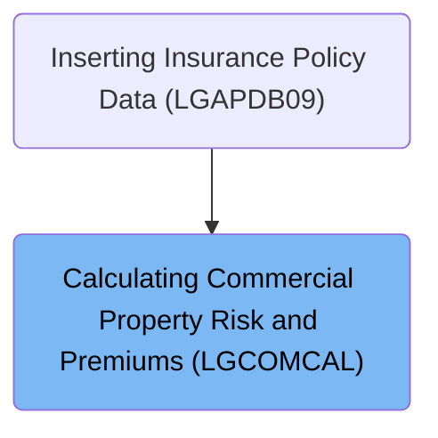

# Overview

This document describes the flow for calculating risk scores, determining policy status, and computing premiums for commercial property insurance policies. The process prepares the risk matrix, evaluates risk based on property type and postcode, and applies business rules to determine the policy status and premium.

## Dependencies

### Program

- LGCOMCAL (<SwmPath>[base/src/lgcomcal.cbl](base/src/lgcomcal.cbl)</SwmPath>)

### Copybook

- LGCOMDAT (<SwmPath>[base/src/lgcomdat.cpy](base/src/lgcomdat.cpy)</SwmPath>)

# Where is this program used?

This program is used once, as represented in the following diagram:

&nbsp;

*This is an auto-generated document by Swimm 🌊 and has not yet been verified by a human*

<SwmMeta version="3.0.0" repo-id="Z2l0aHViJTNBJTNBU3dpbW1pby1nZW5hcHAtbW90b3IlM0ElM0FHaXJpLVN3aW1t" repo-name="Swimmio-genapp-motor">Powered by [Swimm](https://app.swimm.io/)</SwmMeta>
