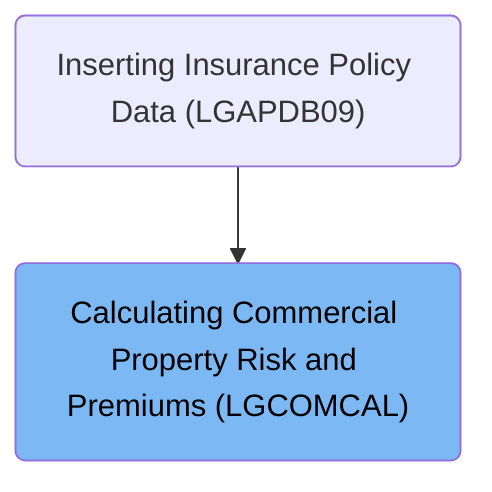
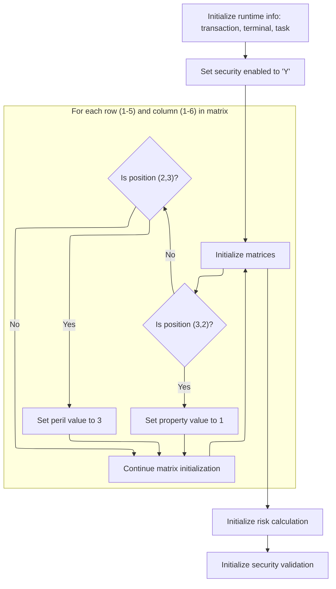
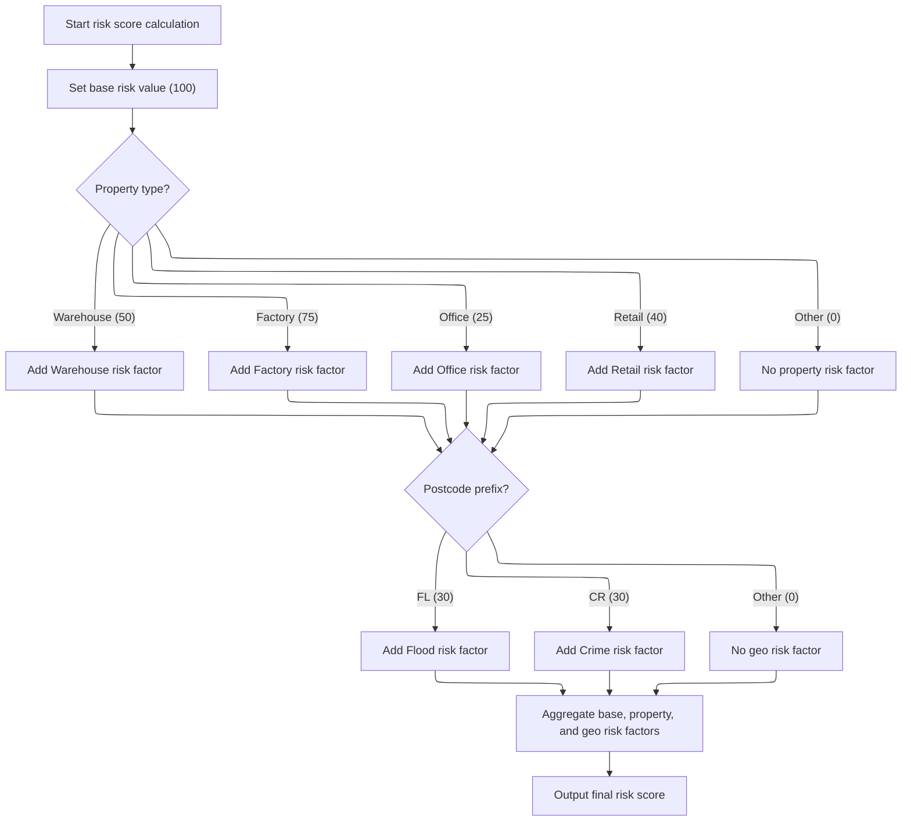

# Overview

This document explains the flow for processing commercial property insurance policies. The flow evaluates risk factors, determines policy status, and calculates the premium amount based on property and location data.

## Dependencies

### Program

- LGCOMCAL (<SwmPath>[base/src/lgcomcal.cbl](base/src/lgcomcal.cbl)</SwmPath>)

### Copybook

- LGCOMDAT (<SwmPath>[base/src/lgcomdat.cpy](base/src/lgcomdat.cpy)</SwmPath>)

# Where is this program used?

This program is used once, as represented in the following diagram:



## Detailed View of the Program's Functionality

a. Kickoff and Orchestration

The program begins execution in its main section, which is responsible for orchestrating the entire flow. This section performs three major actions in sequence:

1. It initializes the processing context and sets up all necessary matrices and flags.
2. It executes the core business logic, which includes risk scoring, policy status determination, and premium calculation.
3. It performs cleanup and prepares the output for return.

b. Context and Matrix Setup

The initialization phase is responsible for preparing the runtime environment and all supporting data structures:

- It resets and prepares the runtime information, such as transaction, terminal, and task identifiers.
- It calls a dedicated routine to initialize matrices and mappings, which are used for risk and security logic.
- During matrix initialization, a security flag is enabled.
- The code then iterates over a two-dimensional grid (5 rows by 6 columns), and for two specific positions in this grid, it sets special values:
  - At position (3,2), a property mapping value is set to 1.
  - At position (2,3), a peril mapping value is set to 3. These hardcoded spots are used later for risk and security mapping.
- After matrix setup, the risk calculation area is reset, and security validation is enabled by setting several flags and index values.

c. Risk, Status, and Premium Calculation

The main business logic is executed in three steps:

1. The risk score is calculated based on property type and geographic information.
2. The policy status is determined using the computed risk score and predefined thresholds.
3. Premiums for different perils (fire, crime, flood, weather) are calculated, potentially applying discounts if certain conditions are met.

d. Risk Score Computation

The risk score calculation is a multi-step process:

- It starts by setting a base risk value (typically 100), then performs a divide-and-multiply operation, likely for rounding or normalization.
- Property and geographic risk factors are reset to zero.
- The property type is checked:
  - If it matches known types (warehouse, factory, office, retail), a corresponding risk factor is added.
  - If it does not match, the property risk factor remains zero.
- The geographic risk factor is determined by examining the first two characters of the postcode:
  - If it starts with 'FL', a flood risk factor is added.
  - If it starts with 'CR', a crime risk factor is added.
  - Otherwise, no geographic risk factor is applied.
- The total risk score is the sum of the base, property, and geographic factors.
- This total is stored for use in subsequent steps.

e. Policy Status Determination

After calculating the risk score, the policy status is determined:

- Two threshold values are loaded.
- If the risk score exceeds the higher threshold, the policy is marked as high risk and flagged for manual review.
- If the risk score exceeds the lower threshold but not the higher, it is marked as medium risk and pending review.
- Otherwise, it is considered low risk.
- The risk score, status, and reason are stored for output.

f. Premium Calculation

Premiums for each peril are calculated as follows:

- A default discount factor is set.
- If all peril factors are positive, a discount is applied.
- For each peril (fire, crime, flood, weather):
  - If the corresponding factor is positive, the premium is calculated as the product of the risk score, peril factor, input factor, and discount.
  - If not, the premium is set to zero.
- The total premium is computed as the sum of all individual peril premiums.

g. Cleanup and Output

In the final phase:

- The computed risk score, policy status, reason, and all premium values are moved to the output area.
- The program then returns control to the caller, completing the flow.

# Rule Definition

| Paragraph Name                                                                                                                                                                                                                                                                                       | Rule ID | Category          | Description                                                                                                                                                                                     | Conditions                                                                                        | Remarks                                                                                                                                                                                                                                                                                                                                                                                                                                                                                                                                    |
| ---------------------------------------------------------------------------------------------------------------------------------------------------------------------------------------------------------------------------------------------------------------------------------------------------- | ------- | ----------------- | ----------------------------------------------------------------------------------------------------------------------------------------------------------------------------------------------- | ------------------------------------------------------------------------------------------------- | ------------------------------------------------------------------------------------------------------------------------------------------------------------------------------------------------------------------------------------------------------------------------------------------------------------------------------------------------------------------------------------------------------------------------------------------------------------------------------------------------------------------------------------------ |
| <SwmToken path="base/src/lgcomcal.cbl" pos="269:3:7" line-data="           PERFORM PROCESS-RISK-SCORE.">`PROCESS-RISK-SCORE`</SwmToken>                                                                                                                                                              | RL-001  | Computation       | Calculate the risk score for a policy based on property type, geographic location, and base value. The risk score is the sum of a base value, a property factor, and a geographic factor.       | Triggered for every invocation with valid property type and postcode in the input data.           | Property factors are mapped from types: WAREHOUSE=50, FACTORY=75, OFFICE=25, RETAIL=40, others=0. Geographic factors are mapped from postcodes: FL=30, CR=30, others=0. Base value is derived from a transformation matrix (default 100, divided and multiplied as per logic). Output risk score is a number, written to a field of size 3 digits in the output structure.                                                                                                                                                                 |
| <SwmToken path="base/src/lgcomcal.cbl" pos="270:3:7" line-data="           PERFORM DETERMINE-POLICY-STATUS.">`DETERMINE-POLICY-STATUS`</SwmToken>                                                                                                                                                    | RL-002  | Conditional Logic | Set the policy status indicator and reason text based on the computed risk score and predefined thresholds.                                                                                     | Triggered after risk score calculation. Requires risk score and threshold values.                 | Thresholds: Medium=150, High=200. Status indicator: 0=Low, 1=Medium, 2=High. Reason text is a string up to 50 characters. Output status and reason are written to respective fields in the output structure.                                                                                                                                                                                                                                                                                                                               |
| <SwmToken path="base/src/lgcomcal.cbl" pos="271:3:5" line-data="           PERFORM CALCULATE-PREMIUMS.">`CALCULATE-PREMIUMS`</SwmToken>, <SwmToken path="base/src/lgcomcal.cbl" pos="381:3:7" line-data="           PERFORM COMPLEX-PREMIUM-CALCULATIONS.">`COMPLEX-PREMIUM-CALCULATIONS`</SwmToken> | RL-003  | Computation       | Calculate premiums for each peril (fire, crime, flood, weather) based on risk score, peril factors, input factors, and discount. Only calculate if input factor for peril is greater than zero. | Triggered after risk score and status determination. Requires valid input factors for each peril. | Peril factors: FIRE=80, CRIME=60, FLOOD=120, WEATHER=90. Discount factor is <SwmToken path="base/src/lgcomcal.cbl" pos="127:15:17" line-data="           03 WS-SA-DISCOUNT           PIC V99 VALUE 0.90.">`0.90`</SwmToken> if all input factors > 0, otherwise <SwmToken path="base/src/lgcomcal.cbl" pos="126:15:17" line-data="           03 WS-SA-MULT               PIC V99 VALUE 1.00.">`1.00`</SwmToken>. Premiums are numbers up to 8 digits, written to respective output fields. Total premium is the sum of all peril premiums. |
| <SwmToken path="base/src/lgcomcal.cbl" pos="271:3:5" line-data="           PERFORM CALCULATE-PREMIUMS.">`CALCULATE-PREMIUMS`</SwmToken>                                                                                                                                                              | RL-004  | Conditional Logic | Apply a discount factor to premium calculations if all peril input factors are greater than zero.                                                                                               | All input factors for fire, crime, flood, and weather are greater than zero.                      | Discount factor is <SwmToken path="base/src/lgcomcal.cbl" pos="127:15:17" line-data="           03 WS-SA-DISCOUNT           PIC V99 VALUE 0.90.">`0.90`</SwmToken> if all input factors > 0, otherwise <SwmToken path="base/src/lgcomcal.cbl" pos="126:15:17" line-data="           03 WS-SA-MULT               PIC V99 VALUE 1.00.">`1.00`</SwmToken>. Discount percentage is written to a field in the output structure.                                                                                                                 |
| <SwmToken path="base/src/lgcomcal.cbl" pos="210:3:7" line-data="           PERFORM CLEANUP-AND-EXIT.">`CLEANUP-AND-EXIT`</SwmToken>                                                                                                                                                                  | RL-005  | Data Assignment   | Assign calculated risk score, status, reason, and premiums to output fields for return to caller.                                                                                               | Triggered at program exit after all calculations are complete.                                    | Output fields: risk score (3 digits), status indicator (1 digit), reason text (50 chars), premiums (8 digits each), discount percentage (decimal). All fields are aligned and padded as per their type and size.                                                                                                                                                                                                                                                                                                                           |

# User Stories

## User Story 1: Policy risk evaluation, status determination, and output assignment

---

### Story Description:

As a system, I want to evaluate the risk score for a policy, determine its status, and assign these results to output fields so that I can provide accurate and formatted risk assessment and status information for each insurance policy.

---

### Business Rule Mapping:

| Rule ID | Paragraph Name                                                                                                                                    | Rule Description                                                                                                                                                                          |
| ------- | ------------------------------------------------------------------------------------------------------------------------------------------------- | ----------------------------------------------------------------------------------------------------------------------------------------------------------------------------------------- |
| RL-001  | <SwmToken path="base/src/lgcomcal.cbl" pos="269:3:7" line-data="           PERFORM PROCESS-RISK-SCORE.">`PROCESS-RISK-SCORE`</SwmToken>           | Calculate the risk score for a policy based on property type, geographic location, and base value. The risk score is the sum of a base value, a property factor, and a geographic factor. |
| RL-002  | <SwmToken path="base/src/lgcomcal.cbl" pos="270:3:7" line-data="           PERFORM DETERMINE-POLICY-STATUS.">`DETERMINE-POLICY-STATUS`</SwmToken> | Set the policy status indicator and reason text based on the computed risk score and predefined thresholds.                                                                               |
| RL-005  | <SwmToken path="base/src/lgcomcal.cbl" pos="210:3:7" line-data="           PERFORM CLEANUP-AND-EXIT.">`CLEANUP-AND-EXIT`</SwmToken>               | Assign calculated risk score, status, reason, and premiums to output fields for return to caller.                                                                                         |

---

### Relevant Functionality:

- <SwmToken path="base/src/lgcomcal.cbl" pos="269:3:7" line-data="           PERFORM PROCESS-RISK-SCORE.">`PROCESS-RISK-SCORE`</SwmToken>
  1. **RL-001:**
     - Set base value from transformation matrix
     - Determine property factor based on input property type
     - Determine geographic factor based on first two characters of postcode
     - Sum base value, property factor, and geographic factor to get risk score
     - Store risk score for further processing
- <SwmToken path="base/src/lgcomcal.cbl" pos="270:3:7" line-data="           PERFORM DETERMINE-POLICY-STATUS.">`DETERMINE-POLICY-STATUS`</SwmToken>
  1. **RL-002:**
     - Compare risk score to high threshold (200)
       - If above, set status to 2 and reason to 'High Risk Score - Manual Review Required'
     - Else, compare to medium threshold (150)
       - If above, set status to 1 and reason to 'Medium Risk - Pending Review'
     - Else, set status to 0 and reason to blank
     - Store status and reason for output
- <SwmToken path="base/src/lgcomcal.cbl" pos="210:3:7" line-data="           PERFORM CLEANUP-AND-EXIT.">`CLEANUP-AND-EXIT`</SwmToken>
  1. **RL-005:**
     - Move calculated risk score to output field
     - Move status indicator to output field
     - Move reason text to output field
     - Move each peril premium to respective output field
     - Move discount percentage to output field
     - Return control to caller

## User Story 2: Premium calculation with discount logic and output assignment

---

### Story Description:

As a policyholder, I want my insurance premiums to be calculated for each peril, with applicable discounts, and have these results assigned to output fields so that I am charged fairly and receive a clear breakdown of my premiums and discounts.

---

### Business Rule Mapping:

| Rule ID | Paragraph Name                                                                                                                                                                                                                                                                                       | Rule Description                                                                                                                                                                                |
| ------- | ---------------------------------------------------------------------------------------------------------------------------------------------------------------------------------------------------------------------------------------------------------------------------------------------------- | ----------------------------------------------------------------------------------------------------------------------------------------------------------------------------------------------- |
| RL-003  | <SwmToken path="base/src/lgcomcal.cbl" pos="271:3:5" line-data="           PERFORM CALCULATE-PREMIUMS.">`CALCULATE-PREMIUMS`</SwmToken>, <SwmToken path="base/src/lgcomcal.cbl" pos="381:3:7" line-data="           PERFORM COMPLEX-PREMIUM-CALCULATIONS.">`COMPLEX-PREMIUM-CALCULATIONS`</SwmToken> | Calculate premiums for each peril (fire, crime, flood, weather) based on risk score, peril factors, input factors, and discount. Only calculate if input factor for peril is greater than zero. |
| RL-004  | <SwmToken path="base/src/lgcomcal.cbl" pos="271:3:5" line-data="           PERFORM CALCULATE-PREMIUMS.">`CALCULATE-PREMIUMS`</SwmToken>                                                                                                                                                              | Apply a discount factor to premium calculations if all peril input factors are greater than zero.                                                                                               |
| RL-005  | <SwmToken path="base/src/lgcomcal.cbl" pos="210:3:7" line-data="           PERFORM CLEANUP-AND-EXIT.">`CLEANUP-AND-EXIT`</SwmToken>                                                                                                                                                                  | Assign calculated risk score, status, reason, and premiums to output fields for return to caller.                                                                                               |

---

### Relevant Functionality:

- <SwmToken path="base/src/lgcomcal.cbl" pos="271:3:5" line-data="           PERFORM CALCULATE-PREMIUMS.">`CALCULATE-PREMIUMS`</SwmToken>
  1. **RL-003:**
     - For each peril (fire, crime, flood, weather):
       - If input factor > 0:
         - Compute premium = risk score \* peril factor \* input factor \* discount
         - Store premium in output
       - Else:
         - Set premium to 0 in output
     - Sum all peril premiums for total premium
     - Store all premiums for output
  2. **RL-004:**
     - Check if all input factors for perils > 0
       - If true, set discount factor to <SwmToken path="base/src/lgcomcal.cbl" pos="127:15:17" line-data="           03 WS-SA-DISCOUNT           PIC V99 VALUE 0.90.">`0.90`</SwmToken>
       - Else, set discount factor to <SwmToken path="base/src/lgcomcal.cbl" pos="126:15:17" line-data="           03 WS-SA-MULT               PIC V99 VALUE 1.00.">`1.00`</SwmToken>
     - Use discount factor in premium calculations
     - Store discount percentage for output
- <SwmToken path="base/src/lgcomcal.cbl" pos="210:3:7" line-data="           PERFORM CLEANUP-AND-EXIT.">`CLEANUP-AND-EXIT`</SwmToken>
  1. **RL-005:**
     - Move calculated risk score to output field
     - Move status indicator to output field
     - Move reason text to output field
     - Move each peril premium to respective output field
     - Move discount percentage to output field
     - Return control to caller

# Workflow

# Kickoff and Orchestration

This section governs the kickoff and orchestration of the main business process, ensuring that initialization, business logic execution, and cleanup are performed in the correct order.

| Category        | Rule Name                           | Description                                                                                                                                             |
| --------------- | ----------------------------------- | ------------------------------------------------------------------------------------------------------------------------------------------------------- |
| Data validation | Mandatory Initialization            | The process must always begin with initialization to ensure all required context and mappings are set before any business logic is executed.            |
| Business logic  | Sequential Business Logic Execution | Business logic must be executed only after successful initialization, and must process all relevant data according to defined business requirements.    |
| Business logic  | Post-Process Cleanup                | Cleanup operations must be performed after business logic execution to ensure all resources are released and outputs are finalized before process exit. |

<SwmSnippet path="/base/src/lgcomcal.cbl" line="206">

---

<SwmToken path="base/src/lgcomcal.cbl" pos="206:1:1" line-data="       MAINLINE SECTION.">`MAINLINE`</SwmToken> starts the flow by setting up context and mappings, then runs the business logic, and finally handles cleanup and output.

```cobol
       MAINLINE SECTION.
           
           PERFORM INITIALIZE-PROCESSING.
           PERFORM PROCESS-BUSINESS-LOGIC.
           PERFORM CLEANUP-AND-EXIT.
```

---

</SwmSnippet>

# Context and Matrix Setup



The main product role of this section is to establish the foundational context and matrix configuration required for risk and security calculations in the application. It ensures that all necessary flags and values are set before any business logic is executed.

| Category        | Rule Name                          | Description                                                                                                                                                     |
| --------------- | ---------------------------------- | --------------------------------------------------------------------------------------------------------------------------------------------------------------- |
| Data validation | Context Initialization             | The transaction, terminal, and task identifiers must be set using the current invocation's runtime values before any risk or security logic is processed.       |
| Business logic  | Security Enablement                | Security must be enabled by setting the security flag to 'Y' before any matrix or risk logic is executed.                                                       |
| Business logic  | Matrix Special Value Assignment    | The matrix must be initialized for all rows (1-5) and columns (1-6), with property value set to 1 at position (3,2) and peril value set to 3 at position (2,3). |
| Business logic  | Risk Calculation Initialization    | Risk calculation must be initialized after context and matrix setup, ensuring all required flags and values are present.                                        |
| Business logic  | Security Validation Initialization | Security validation must be initialized after risk calculation setup to ensure all security checks are ready for subsequent processing.                         |

<SwmSnippet path="/base/src/lgcomcal.cbl" line="217">

---

<SwmToken path="base/src/lgcomcal.cbl" pos="217:1:3" line-data="       INITIALIZE-PROCESSING.">`INITIALIZE-PROCESSING`</SwmToken> sets up context and then calls <SwmToken path="base/src/lgcomcal.cbl" pos="223:3:5" line-data="           PERFORM INITIALIZE-MATRICES.">`INITIALIZE-MATRICES`</SwmToken> to configure the flags needed for risk and security logic.

```cobol
       INITIALIZE-PROCESSING.
           INITIALIZE WS-HEADER.
           MOVE EIBTRNID TO WS-TRANSID.
           MOVE EIBTRMID TO WS-TERMID.
           MOVE EIBTASKN TO WS-TASKNUM.
           
           PERFORM INITIALIZE-MATRICES.
```

---

</SwmSnippet>

<SwmSnippet path="/base/src/lgcomcal.cbl" line="233">

---

<SwmToken path="base/src/lgcomcal.cbl" pos="233:1:3" line-data="       INITIALIZE-MATRICES.">`INITIALIZE-MATRICES`</SwmToken> enables security and then iterates over two index ranges, setting <SwmToken path="base/src/lgcomcal.cbl" pos="243:7:11" line-data="                      MOVE 1 TO WS-RM-PROP">`WS-RM-PROP`</SwmToken> to 1 at (3,2) and <SwmToken path="base/src/lgcomcal.cbl" pos="246:7:11" line-data="                      MOVE 3 TO WS-RM-PERIL">`WS-RM-PERIL`</SwmToken> to 3 at (2,3). These are hardcoded spots for special risk/security mapping, used later in the flow.

```cobol
       INITIALIZE-MATRICES.
           MOVE 'Y' TO WS-SEC-ENABLED.
           MOVE 1 TO WS-SUB-1.
           
           PERFORM VARYING WS-SUB-1 FROM 1 BY 1 
             UNTIL WS-SUB-1 > 5
               MOVE 0 TO WS-SUB-2
               PERFORM VARYING WS-SUB-2 FROM 1 BY 1 
                 UNTIL WS-SUB-2 > 6
                   IF WS-SUB-1 = 3 AND WS-SUB-2 = 2
                      MOVE 1 TO WS-RM-PROP
                   END-IF
                   IF WS-SUB-1 = 2 AND WS-SUB-2 = 3
                      MOVE 3 TO WS-RM-PERIL
                   END-IF
               END-PERFORM
           END-PERFORM.
           
           EXIT.
```

---

</SwmSnippet>

<SwmSnippet path="/base/src/lgcomcal.cbl" line="225">

---

After <SwmToken path="base/src/lgcomcal.cbl" pos="223:3:5" line-data="           PERFORM INITIALIZE-MATRICES.">`INITIALIZE-MATRICES`</SwmToken>, <SwmToken path="base/src/lgcomcal.cbl" pos="208:3:5" line-data="           PERFORM INITIALIZE-PROCESSING.">`INITIALIZE-PROCESSING`</SwmToken> sets up risk calculation and enables security validation for the next steps.

```cobol
           INITIALIZE WS-RISK-CALC.
           
           PERFORM INIT-SECURITY-VALIDATION.
           
           EXIT.
```

---

</SwmSnippet>

# Risk, Status, and Premium Calculation

This section is responsible for evaluating the risk associated with an insurance policy, determining its status, and calculating the premium amount to be charged. The risk score is the foundation for subsequent decisions and calculations.

| Category        | Rule Name                     | Description                                                                                                                                     |
| --------------- | ----------------------------- | ----------------------------------------------------------------------------------------------------------------------------------------------- |
| Data validation | Minimum premium enforcement   | Premiums must not fall below the minimum premium defined by business policy, regardless of risk score or discounts.                             |
| Business logic  | Comprehensive risk assessment | The risk score must be calculated using all relevant customer and policy risk factors before any other business decisions are made.             |
| Business logic  | Risk-based policy status      | Policy status is determined based on the calculated risk score, with predefined thresholds for approval, pending review, or decline.            |
| Business logic  | Premium calculation by risk   | Premiums are calculated using the risk score and coverage options, applying any relevant surcharges or discounts as defined by business policy. |

<SwmSnippet path="/base/src/lgcomcal.cbl" line="268">

---

<SwmToken path="base/src/lgcomcal.cbl" pos="268:1:5" line-data="       PROCESS-BUSINESS-LOGIC.">`PROCESS-BUSINESS-LOGIC`</SwmToken> runs the main calculations: it first calls <SwmToken path="base/src/lgcomcal.cbl" pos="269:3:7" line-data="           PERFORM PROCESS-RISK-SCORE.">`PROCESS-RISK-SCORE`</SwmToken> to get the risk score, which is then used to determine policy status and calculate premiums. The risk score is the basis for everything that follows.

```cobol
       PROCESS-BUSINESS-LOGIC.
           PERFORM PROCESS-RISK-SCORE.
           PERFORM DETERMINE-POLICY-STATUS.
           PERFORM CALCULATE-PREMIUMS.
           
           EXIT.
```

---

</SwmSnippet>

# Risk Score Computation



The Risk Score Computation section determines a property's risk score for insurance purposes by combining a base risk value with property-specific and geographic risk factors. The score is used to assess the overall risk profile of a commercial property based on its type and location.

| Category        | Rule Name                              | Description                                                                                                                                                             |
| --------------- | -------------------------------------- | ----------------------------------------------------------------------------------------------------------------------------------------------------------------------- |
| Data validation | Default risk factors for unknown types | If the property type or postcode prefix does not match any of the specified categories, the corresponding risk factor is set to zero.                                   |
| Business logic  | Base risk value                        | The base risk score for all properties is set to 100 before any adjustments are made.                                                                                   |
| Business logic  | Property type risk factor              | A property risk factor is added to the base risk score depending on the property type: Warehouse (50), Factory (75), Office (25), Retail (40), or 0 for any other type. |
| Business logic  | Geographic risk factor                 | A geographic risk factor is added based on the first two characters of the postcode: 'FL' (30), 'CR' (30), or 0 for any other prefix.                                   |
| Business logic  | Risk score aggregation                 | The final risk score is the sum of the base risk value, the property risk factor, and the geographic risk factor.                                                       |

<SwmSnippet path="/base/src/lgcomcal.cbl" line="277">

---

In <SwmToken path="base/src/lgcomcal.cbl" pos="277:1:5" line-data="       PROCESS-RISK-SCORE.">`PROCESS-RISK-SCORE`</SwmToken>, we start by setting up the base score, splitting and recombining it (possibly for rounding or legacy reasons), and then zeroing out the property and geo factors. We also set the type and version for the risk matrix.

```cobol
       PROCESS-RISK-SCORE.
           MOVE WS-TM-BASE TO WS-TEMP-SCORE.
           DIVIDE 2 INTO WS-TEMP-SCORE GIVING WS-SUB-1.
           MULTIPLY 2 BY WS-SUB-1 GIVING WS-RC-BASE-VAL.
           
           MOVE 0 TO WS-RC-PROP-FACT.
           
           MOVE 'COMMERCIAL' TO RMS-TYPE
           MOVE '1.0.5' TO RMS-VERSION
```

---

</SwmSnippet>

<SwmSnippet path="/base/src/lgcomcal.cbl" line="287">

---

Next in <SwmToken path="base/src/lgcomcal.cbl" pos="269:3:7" line-data="           PERFORM PROCESS-RISK-SCORE.">`PROCESS-RISK-SCORE`</SwmToken>, we pick the property factor based on the property type. If it's not a known type, the factor is set to zero. This value is added to the risk calculation.

```cobol
           EVALUATE CA-XPROPTYPE
               WHEN 'WAREHOUSE'
                   MOVE RMS-PF-W-VAL TO RMS-PF-WAREHOUSE
                   COMPUTE WS-TEMP-CALC = RMS-PF-WAREHOUSE
                   ADD WS-TEMP-CALC TO WS-RC-PROP-FACT
               WHEN 'FACTORY'
                   MOVE RMS-PF-F-VAL TO RMS-PF-FACTORY
                   COMPUTE WS-TEMP-CALC = RMS-PF-FACTORY
                   ADD WS-TEMP-CALC TO WS-RC-PROP-FACT
               WHEN 'OFFICE'
                   MOVE RMS-PF-O-VAL TO RMS-PF-OFFICE
                   COMPUTE WS-TEMP-CALC = RMS-PF-OFFICE
                   ADD WS-TEMP-CALC TO WS-RC-PROP-FACT
               WHEN 'RETAIL'
                   MOVE RMS-PF-R-VAL TO RMS-PF-RETAIL
                   COMPUTE WS-TEMP-CALC = RMS-PF-RETAIL
                   ADD WS-TEMP-CALC TO WS-RC-PROP-FACT
               WHEN OTHER
                   MOVE 0 TO WS-RC-PROP-FACT
           END-EVALUATE.
```

---

</SwmSnippet>

<SwmSnippet path="/base/src/lgcomcal.cbl" line="308">

---

Now we set up the geo factor: if the postcode starts with 'FL' or 'CR', we assign the corresponding geo factor value. There's an implicit assumption that the postcode is at least two characters long, which isn't checked.

```cobol
           MOVE 0 TO WS-RC-GEO-FACT.
           
           MOVE RMS-GF-FL-VAL TO RMS-GF-FL
           MOVE RMS-GF-CR-VAL TO RMS-GF-CR
           
           IF CA-XPOSTCODE(1:2) = 'FL'
              MOVE RMS-GF-FL TO WS-RC-GEO-FACT
           ELSE
              IF CA-XPOSTCODE(1:2) = 'CR'
                 MOVE RMS-GF-CR TO WS-RC-GEO-FACT
              END-IF
```

---

</SwmSnippet>

<SwmSnippet path="/base/src/lgcomcal.cbl" line="319">

---

Finally, we sum up the base, property, and geo factors to get the total risk score, then store it in <SwmToken path="base/src/lgcomcal.cbl" pos="324:11:15" line-data="           MOVE WS-RC-TOTAL TO WS-SA-RISK.">`WS-SA-RISK`</SwmToken> for use in the next steps. Again, this assumes the postcode is at least two characters.

```cobol
           END-IF.
           
           COMPUTE WS-RC-TOTAL = 
              WS-RC-BASE-VAL + WS-RC-PROP-FACT + WS-RC-GEO-FACT.
              
           MOVE WS-RC-TOTAL TO WS-SA-RISK.
           
           EXIT.
```

---

</SwmSnippet>

&nbsp;

*This is an auto-generated document by Swimm 🌊 and has not yet been verified by a human*

<SwmMeta version="3.0.0" repo-id="Z2l0aHViJTNBJTNBU3dpbW1pby1nZW5hcHAtbW90b3IlM0ElM0FHaXJpLVN3aW1t" repo-name="Swimmio-genapp-motor"><sup>Powered by [Swimm](https://app.swimm.io/)</sup></SwmMeta>
