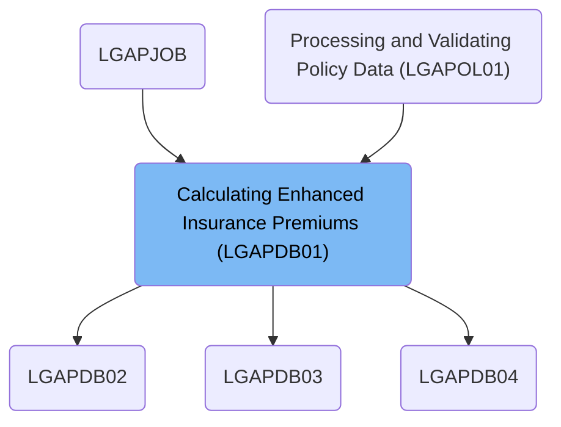

# Dependencies

## Paths

<SwmPath>[base/src/LGAPDB03.cbl](base/src/LGAPDB03.cbl)</SwmPath>

<SwmPath>[base/src/LGAPDB04.cbl](base/src/LGAPDB04.cbl)</SwmPath>

<SwmPath>[base/src/INPUTREC2.cpy](base/src/INPUTREC2.cpy)</SwmPath>

<SwmPath>[base/src/OUTPUTREC.cpy](base/src/OUTPUTREC.cpy)</SwmPath>

<SwmPath>[base/src/WORKSTOR.cpy](base/src/WORKSTOR.cpy)</SwmPath>

<SwmPath>[base/src/LGAPACT.cpy](base/src/LGAPACT.cpy)</SwmPath>

&nbsp;

*This is an auto-generated document by Swimm 🌊 and has not yet been verified by a human*

<SwmMeta version="3.0.0" repo-id="Z2l0aHViJTNBJTNBU3dpbW1pby1nZW5hcHAtbW90b3IlM0ElM0FHaXJpLVN3aW1t" repo-name="Swimmio-genapp-motor">Powered by [Swimm](https://app.swimm.io/)</SwmMeta>
