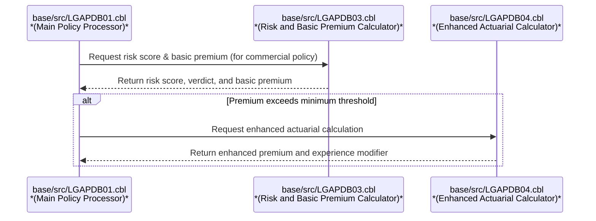

# Overview

This document explains the flow for processing insurance policy applications. Each record is validated, commercial policies receive premium calculations, and non-commercial policies are rejected. The flow outputs processed records with calculated premiums, risk scores, and status, along with summary statistics.

# Technical Overview

## Dependencies

### Programs

- LGAPDB02
- LGAPDB03 (<SwmPath>[base/src/LGAPDB03.cbl](base/src/LGAPDB03.cbl)</SwmPath>)
- LGAPDB04 (<SwmPath>[base/src/LGAPDB04.cbl](base/src/LGAPDB04.cbl)</SwmPath>)

### Copybooks

- SQLCA
- INPUTREC2
- OUTPUTREC
- WORKSTOR
- LGAPACT

&nbsp;

*This is an auto-generated document by Swimm 🌊 and has not yet been verified by a human*

<SwmMeta version="3.0.0" repo-id="Z2l0aHViJTNBJTNBU3dpbW1pby1nZW5hcHAtbW90b3IlM0ElM0FHaXJpLVN3aW1t" repo-name="Swimmio-genapp-motor">Powered by [Swimm](https://app.swimm.io/)</SwmMeta>
