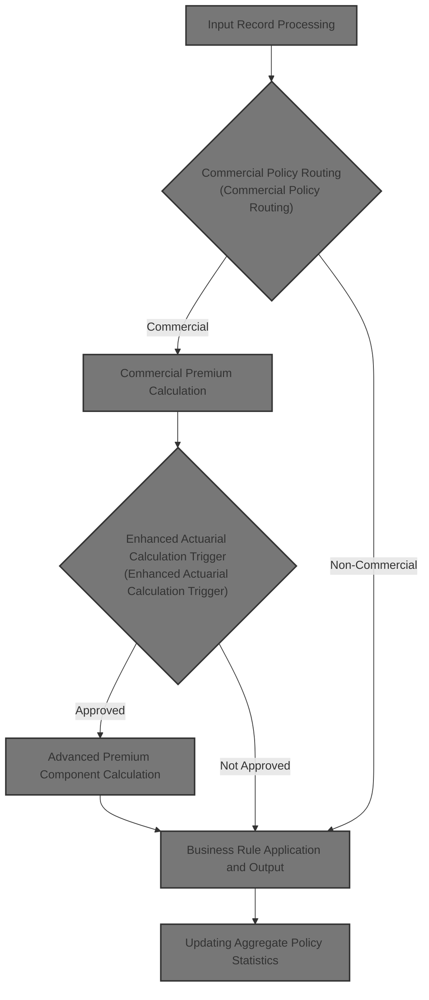
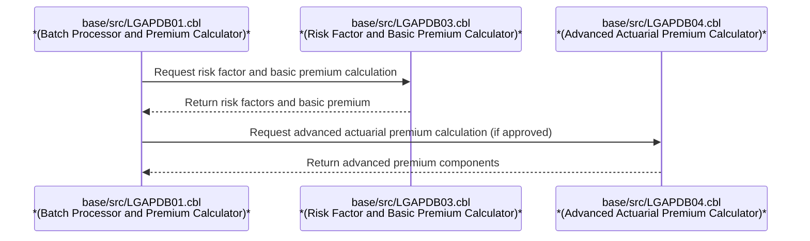
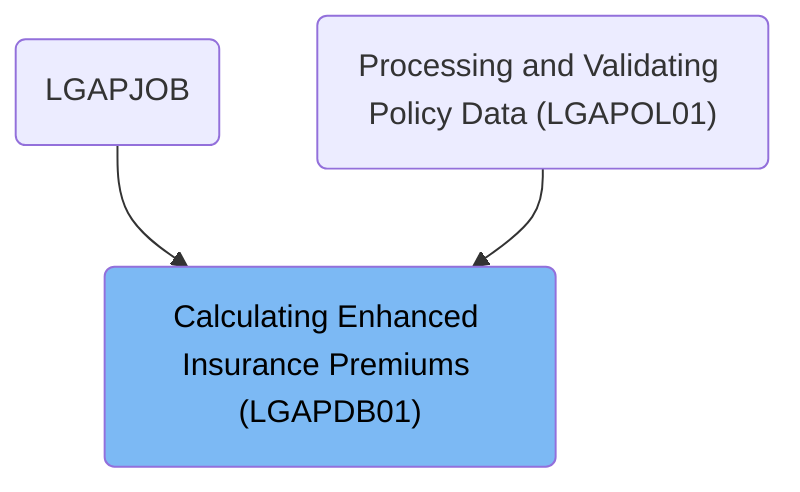

# Overview

This document explains the flow for calculating commercial insurance premiums and determining underwriting decisions for policy applications. Policy records are validated and routed, commercial policies are assessed for risk and premium, and business rules are applied to finalize decisions and update aggregate statistics.

# Technical Overview

## Dependencies

### Programs

- LGAPDB02
- LGAPDB03 (<SwmPath>[base/src/LGAPDB03.cbl](base/src/LGAPDB03.cbl)</SwmPath>)
- LGAPDB04 (<SwmPath>[base/src/LGAPDB04.cbl](base/src/LGAPDB04.cbl)</SwmPath>)

### Copybooks

- SQLCA
- INPUTREC2 (<SwmPath>[base/src/INPUTREC2.cpy](base/src/INPUTREC2.cpy)</SwmPath>)
- OUTPUTREC (<SwmPath>[base/src/OUTPUTREC.cpy](base/src/OUTPUTREC.cpy)</SwmPath>)
- WORKSTOR (<SwmPath>[base/src/WORKSTOR.cpy](base/src/WORKSTOR.cpy)</SwmPath>)
- LGAPACT (<SwmPath>[base/src/LGAPACT.cpy](base/src/LGAPACT.cpy)</SwmPath>)

# Where is this program used?

This program is used multiple times in the codebase as represented in the following diagram:

&nbsp;

*This is an auto-generated document by Swimm 🌊 and has not yet been verified by a human*

<SwmMeta version="3.0.0" repo-id="Z2l0aHViJTNBJTNBU3dpbW1pby1nZW5hcHAtbW90b3IlM0ElM0FHaXJpLVN3aW1t" repo-name="Swimmio-genapp-motor">Powered by [Swimm](https://app.swimm.io/)</SwmMeta>
