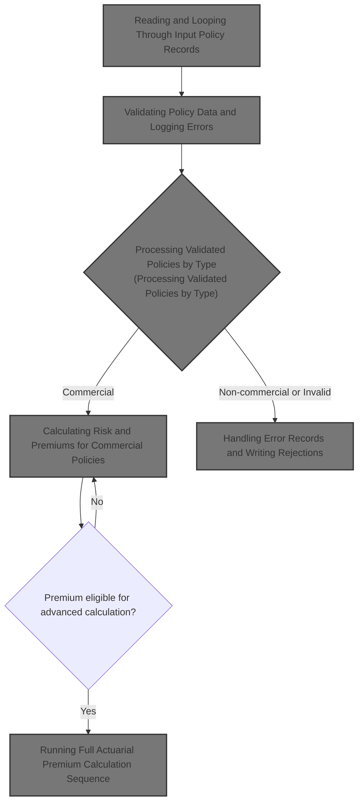
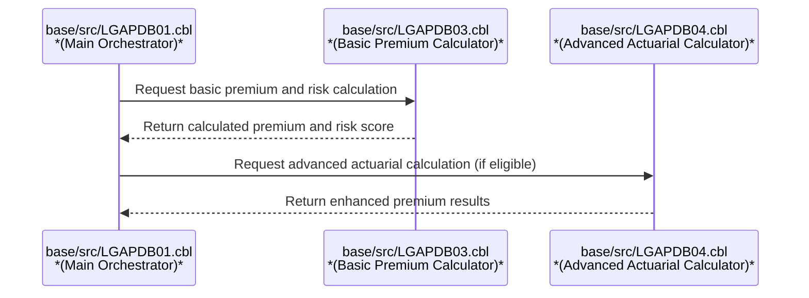
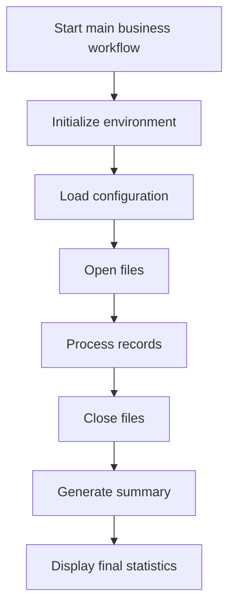
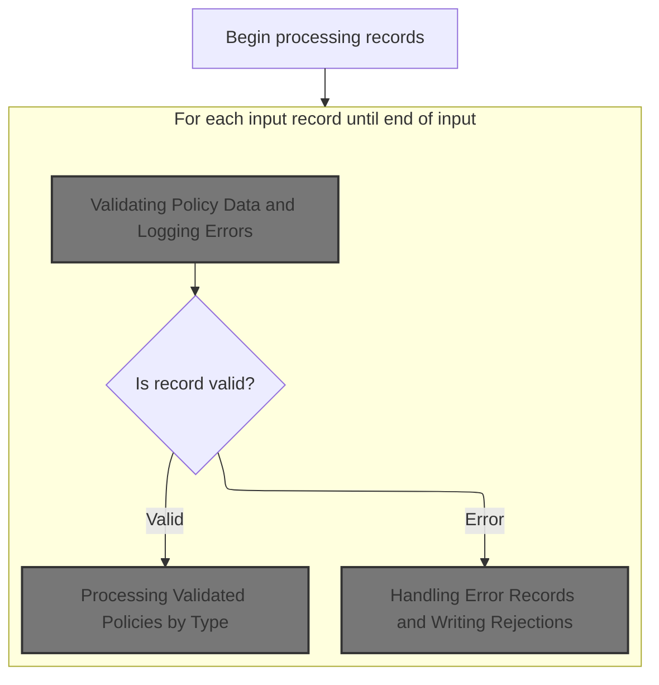
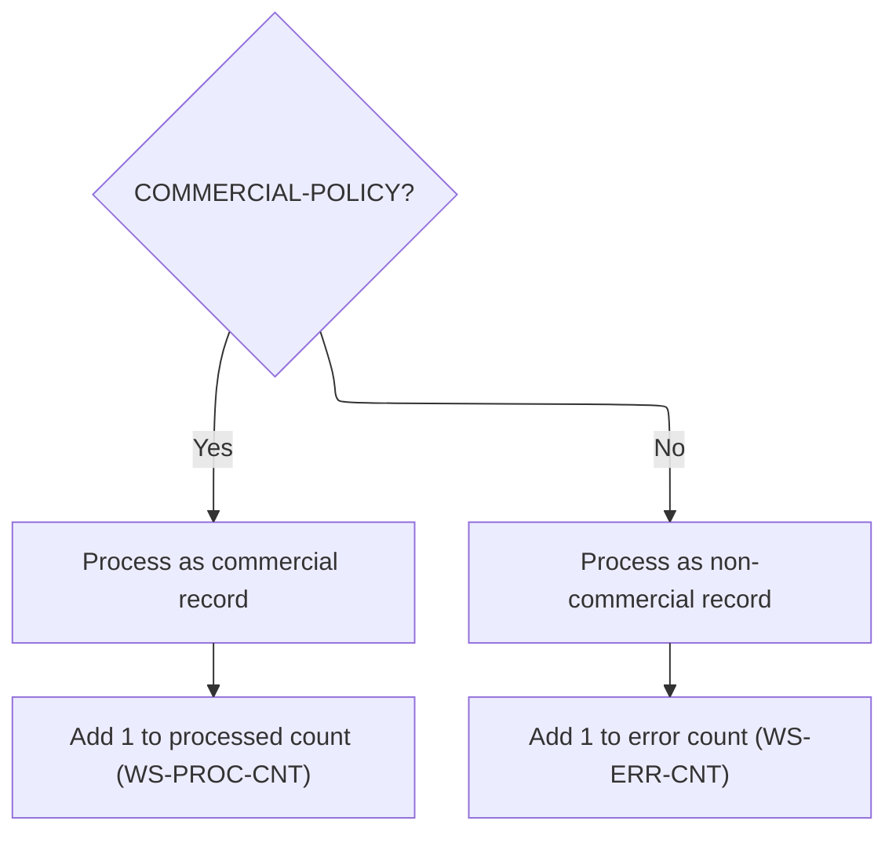
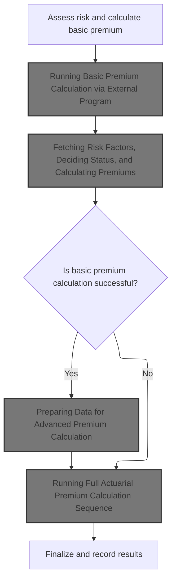
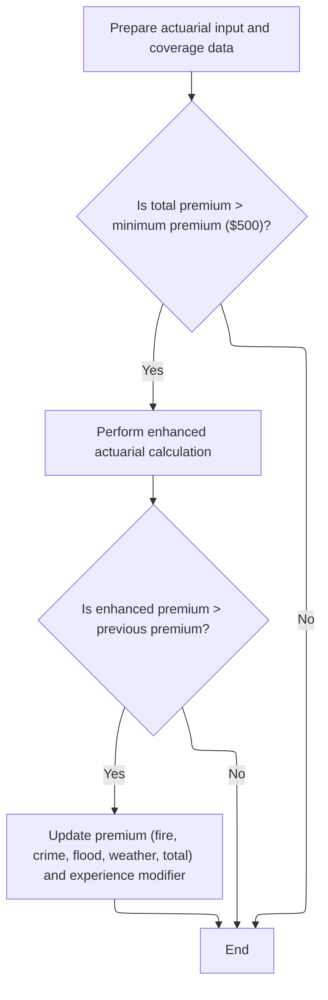
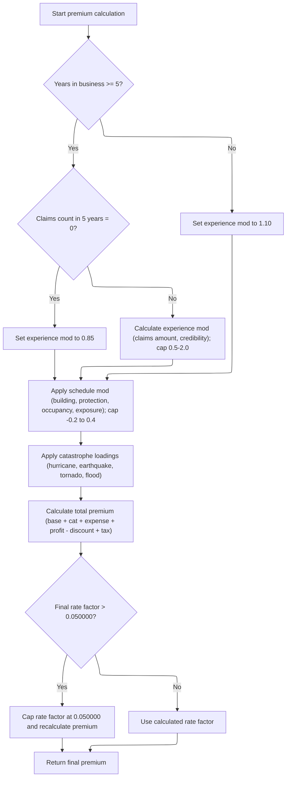

# Overview

This document describes the flow for processing insurance policy records. The system validates each record, calculates risk scores and premiums for commercial policies, and determines approval status. Non-commercial policies are rejected. The output includes processed records with calculated premiums, risk scores, and approval or rejection status.



# Technical Overview



## Dependencies

### Programs

- <SwmToken path="base/src/LGAPDB01.cbl" pos="269:4:4" line-data="           CALL &#39;LGAPDB02&#39; USING IN-PROPERTY-TYPE, IN-POSTCODE, ">`LGAPDB02`</SwmToken>
- <SwmToken path="base/src/LGAPDB01.cbl" pos="276:4:4" line-data="           CALL &#39;LGAPDB03&#39; USING WS-BASE-RISK-SCR, IN-FIRE-PERIL, ">`LGAPDB03`</SwmToken> (<SwmPath>[base/src/LGAPDB03.cbl](base/src/LGAPDB03.cbl)</SwmPath>)
- <SwmToken path="base/src/LGAPDB01.cbl" pos="313:4:4" line-data="               CALL &#39;LGAPDB04&#39; USING LK-INPUT-DATA, LK-COVERAGE-DATA, ">`LGAPDB04`</SwmToken> (<SwmPath>[base/src/LGAPDB04.cbl](base/src/LGAPDB04.cbl)</SwmPath>)

### Copybooks

- SQLCA
- <SwmToken path="base/src/LGAPDB01.cbl" pos="35:3:3" line-data="           COPY INPUTREC2.">`INPUTREC2`</SwmToken>
- OUTPUTREC
- WORKSTOR
- LGAPACT

## Input and Output Tables/Files used in the Program

| Table / File Name                                                                                                                                        | Type | Description                                                     | Usage Mode | Key Fields / Layout Highlights           |
| -------------------------------------------------------------------------------------------------------------------------------------------------------- | ---- | --------------------------------------------------------------- | ---------- | ---------------------------------------- |
| <SwmToken path="base/src/LGAPDB01.cbl" pos="17:3:5" line-data="           SELECT CONFIG-FILE ASSIGN TO &#39;CONFIG.DAT&#39;">`CONFIG-FILE`</SwmToken>    | DB2  | System config parameters and thresholds for premium calculation | Input      | Database table with relational structure |
| <SwmToken path="base/src/LGAPDB01.cbl" pos="9:3:5" line-data="           SELECT INPUT-FILE ASSIGN TO &#39;INPUT.DAT&#39;">`INPUT-FILE`</SwmToken>        | DB2  | Insurance policy input records for premium processing           | Input      | Database table with relational structure |
| <SwmToken path="base/src/LGAPDB01.cbl" pos="13:3:5" line-data="           SELECT OUTPUT-FILE ASSIGN TO &#39;OUTPUT.DAT&#39;">`OUTPUT-FILE`</SwmToken>    | DB2  | Processed policy premium results for each input record          | Output     | Database table with relational structure |
| <SwmToken path="base/src/LGAPDB01.cbl" pos="255:3:5" line-data="           WRITE OUTPUT-RECORD">`OUTPUT-RECORD`</SwmToken>                               | DB2  | Single output record with premium and status for a policy       | Output     | Database table with relational structure |
| <SwmToken path="base/src/LGAPDB01.cbl" pos="27:3:5" line-data="           SELECT SUMMARY-FILE ASSIGN TO &#39;SUMMARY.DAT&#39;">`SUMMARY-FILE`</SwmToken> | DB2  | Summary statistics of premium calculation run                   | Output     | Database table with relational structure |
| <SwmToken path="base/src/LGAPDB01.cbl" pos="64:3:5" line-data="       01  SUMMARY-RECORD             PIC X(132).">`SUMMARY-RECORD`</SwmToken>            | DB2  | Single summary record with run statistics or summary text       | Output     | Database table with relational structure |

&nbsp;

# Workflow

# Initializing and Orchestrating the Main Processing Steps



This section governs the initialization and orchestration of the main business workflow, ensuring that all necessary setup steps are completed before processing records and generating outputs.

| Category        | Rule Name                      | Description                                                                                                                                              |
| --------------- | ------------------------------ | -------------------------------------------------------------------------------------------------------------------------------------------------------- |
| Data validation | Prerequisite Enforcement       | The business workflow must not begin processing records until the environment has been successfully initialized and configuration has been loaded.       |
| Data validation | File Availability Requirement  | All required files must be opened before any record processing can occur. If any file fails to open, the workflow must not proceed to record processing. |
| Data validation | File Closure Requirement       | After all records are processed, all files must be closed to ensure data integrity and prevent resource leaks.                                           |
| Business logic  | Record Processing Mandate      | Each policy record must be processed through the designated record processing routine, which includes validation and actuarial calculations.             |
| Business logic  | Summary Generation Requirement | A summary of the processing run must be generated after all records are processed and files are closed.                                                  |
| Business logic  | Statistics Display Requirement | Final statistics must be displayed at the end of the workflow to inform users of key metrics and outcomes.                                               |

<SwmSnippet path="/base/src/LGAPDB01.cbl" line="90">

---

<SwmToken path="base/src/LGAPDB01.cbl" pos="90:1:1" line-data="       P001.">`P001`</SwmToken> kicks off the whole run: it initializes working areas, loads config, opens files, then hands off to <SwmToken path="base/src/LGAPDB01.cbl" pos="94:3:7" line-data="           PERFORM P006-PROCESS-RECORDS">`P006-PROCESS-RECORDS`</SwmToken> to actually read and process each policy record. We need to call <SwmToken path="base/src/LGAPDB01.cbl" pos="94:3:7" line-data="           PERFORM P006-PROCESS-RECORDS">`P006-PROCESS-RECORDS`</SwmToken> here because that's where the input data gets validated and actuarial calculations are triggered. Without this, nothing meaningful would be produced for output or stats.

```cobol
       P001.
           PERFORM P002-INITIALIZE
           PERFORM P003-LOAD-CONFIG
           PERFORM P005-OPEN-FILES
           PERFORM P006-PROCESS-RECORDS
           PERFORM P014-CLOSE-FILES
           PERFORM P015-GENERATE-SUMMARY
           PERFORM P016-DISPLAY-STATS
           STOP RUN.
```

---

</SwmSnippet>

# Reading and Looping Through Input Policy Records



This section governs the main loop for processing insurance policy records, ensuring each record is validated, processed, or rejected according to business rules and product requirements.

| Category        | Rule Name                       | Description                                                                                                                                                                                                                                                            |
| --------------- | ------------------------------- | ---------------------------------------------------------------------------------------------------------------------------------------------------------------------------------------------------------------------------------------------------------------------- |
| Data validation | Policy Data Validation          | Each input policy record must be validated for required fields before any actuarial calculations or processing are performed. Required fields include policy type, customer number, at least one coverage limit, and total coverage not exceeding the allowed maximum. |
| Business logic  | Commercial Policy Processing    | Commercial policy records that pass validation must be processed to calculate risk score and insurance premium, applying actuarial adjustments and business rules to determine approval or rejection.                                                                  |
| Business logic  | Non-Commercial Policy Rejection | Non-commercial policy records, even if valid, must be marked as unsupported and rejected, with appropriate rejection details included in the output.                                                                                                                   |
| Technical step  | Record Counting                 | The record count must be incremented for each processed input record, regardless of whether the record is valid or rejected.                                                                                                                                           |

<SwmSnippet path="/base/src/LGAPDB01.cbl" line="178">

---

In <SwmToken path="base/src/LGAPDB01.cbl" pos="178:1:5" line-data="       P006-PROCESS-RECORDS.">`P006-PROCESS-RECORDS`</SwmToken>, we start by reading the first input record. This sets up the loop to process each policy one by one, kicking off the validation and calculation steps for each record.

```cobol
       P006-PROCESS-RECORDS.
           PERFORM P007-READ-INPUT
```

---

</SwmSnippet>

<SwmSnippet path="/base/src/LGAPDB01.cbl" line="180">

---

After reading each record, we bump the record count and call <SwmToken path="base/src/LGAPDB01.cbl" pos="182:3:9" line-data="               PERFORM P008-VALIDATE-INPUT-RECORD">`P008-VALIDATE-INPUT-RECORD`</SwmToken> to check if the policy data is usable. This step is needed to filter out bad records before any calculations are done. If validation passes, we process the record; if not, we handle the error.

```cobol
           PERFORM UNTIL INPUT-EOF
               ADD 1 TO WS-REC-CNT
               PERFORM P008-VALIDATE-INPUT-RECORD
               IF WS-ERROR-COUNT = ZERO
                   PERFORM P009-PROCESS-VALID-RECORD
               ELSE
                   PERFORM P010-PROCESS-ERROR-RECORD
               END-IF
               PERFORM P007-READ-INPUT
           END-PERFORM.
```

---

</SwmSnippet>

## Validating Policy Data and Logging Errors

```mermaid
%%{init: {"flowchart": {"defaultRenderer": "elk"}} }%%
flowchart TD
    node1["Start input record validation"]
    click node1 openCode "base/src/LGAPDB01.cbl:195:196"
    node1 --> node2{"Is policy type valid? (commercial, personal, farm)"}
    click node2 openCode "base/src/LGAPDB01.cbl:198:204"
    node2 -->|"No"| node3["Log error: Invalid Policy Type"]
    click node3 openCode "base/src/LGAPDB01.cbl:201:204"
    node2 -->|"Yes"| node4
    node3 --> node4
    node4{"Is customer number provided?"}
    click node4 openCode "base/src/LGAPDB01.cbl:206:210"
    node4 -->|"No"| node5["Log error: Customer Number Required"]
    click node5 openCode "base/src/LGAPDB01.cbl:207:209"
    node4 -->|"Yes"| node6
    node5 --> node6
    node6{"Is at least one coverage limit provided? (building or contents > 0)"}
    click node6 openCode "base/src/LGAPDB01.cbl:212:217"
    node6 -->|"No"| node7["Log error: At least one coverage limit required"]
    click node7 openCode "base/src/LGAPDB01.cbl:214:216"
    node6 -->|"Yes"| node8
    node7 --> node8
    node8{"Does total coverage exceed 50,000,000.00?"}
    click node8 openCode "base/src/LGAPDB01.cbl:219:224"
    node8 -->|"Yes"| node9["Log error: Total coverage exceeds maximum TIV"]
    click node9 openCode "base/src/LGAPDB01.cbl:221:223"
    node8 -->|"No"| node10["Validation complete"]
    node9 --> node10
    click node10 openCode "base/src/LGAPDB01.cbl:224:224"

classDef HeadingStyle fill:#777777,stroke:#333,stroke-width:2px;

%% Swimm:
%% %%{init: {"flowchart": {"defaultRenderer": "elk"}} }%%
%% flowchart TD
%%     node1["Start input record validation"]
%%     click node1 openCode "<SwmPath>[base/src/LGAPDB01.cbl](base/src/LGAPDB01.cbl)</SwmPath>:195:196"
%%     node1 --> node2{"Is policy type valid? (commercial, personal, farm)"}
%%     click node2 openCode "<SwmPath>[base/src/LGAPDB01.cbl](base/src/LGAPDB01.cbl)</SwmPath>:198:204"
%%     node2 -->|"No"| node3["Log error: Invalid Policy Type"]
%%     click node3 openCode "<SwmPath>[base/src/LGAPDB01.cbl](base/src/LGAPDB01.cbl)</SwmPath>:201:204"
%%     node2 -->|"Yes"| node4
%%     node3 --> node4
%%     node4{"Is customer number provided?"}
%%     click node4 openCode "<SwmPath>[base/src/LGAPDB01.cbl](base/src/LGAPDB01.cbl)</SwmPath>:206:210"
%%     node4 -->|"No"| node5["Log error: Customer Number Required"]
%%     click node5 openCode "<SwmPath>[base/src/LGAPDB01.cbl](base/src/LGAPDB01.cbl)</SwmPath>:207:209"
%%     node4 -->|"Yes"| node6
%%     node5 --> node6
%%     node6{"Is at least one coverage limit provided? (building or contents > 0)"}
%%     click node6 openCode "<SwmPath>[base/src/LGAPDB01.cbl](base/src/LGAPDB01.cbl)</SwmPath>:212:217"
%%     node6 -->|"No"| node7["Log error: At least one coverage limit required"]
%%     click node7 openCode "<SwmPath>[base/src/LGAPDB01.cbl](base/src/LGAPDB01.cbl)</SwmPath>:214:216"
%%     node6 -->|"Yes"| node8
%%     node7 --> node8
%%     node8{"Does total coverage exceed 50,000,000.00?"}
%%     click node8 openCode "<SwmPath>[base/src/LGAPDB01.cbl](base/src/LGAPDB01.cbl)</SwmPath>:219:224"
%%     node8 -->|"Yes"| node9["Log error: Total coverage exceeds maximum TIV"]
%%     click node9 openCode "<SwmPath>[base/src/LGAPDB01.cbl](base/src/LGAPDB01.cbl)</SwmPath>:221:223"
%%     node8 -->|"No"| node10["Validation complete"]
%%     node9 --> node10
%%     click node10 openCode "<SwmPath>[base/src/LGAPDB01.cbl](base/src/LGAPDB01.cbl)</SwmPath>:224:224"
%% 
%% classDef HeadingStyle fill:#777777,stroke:#333,stroke-width:2px;
```



This section ensures that policy data meets business requirements before further processing. It enforces mandatory fields, valid values, and coverage limits, and logs any errors or warnings for tracking and downstream decision-making.

| Category        | Rule Name                    | Description                                                                                                                                                                                                                                                                                              |
| --------------- | ---------------------------- | -------------------------------------------------------------------------------------------------------------------------------------------------------------------------------------------------------------------------------------------------------------------------------------------------------- |
| Data validation | Valid Policy Type            | Only policies with a type of 'commercial', 'personal', or 'farm' are considered valid. Any other policy type is flagged as an error.                                                                                                                                                                     |
| Data validation | Customer Number Required     | A customer number must be provided for every policy record. If missing, an error is logged and the record is flagged for rejection.                                                                                                                                                                      |
| Data validation | Minimum Coverage Requirement | At least one coverage limit (building or contents) must be greater than zero. If both are zero, an error is logged and the record is flagged for rejection.                                                                                                                                              |
| Business logic  | Maximum Coverage Warning     | If the total coverage (building + contents + BI) exceeds 50,000,000.00, a warning is logged but the record is not rejected. The maximum allowed value is defined by <SwmToken path="base/src/LGAPDB01.cbl" pos="220:9:13" line-data="              IN-BI-LIMIT &gt; WS-MAX-TIV">`WS-MAX-TIV`</SwmToken>. |

<SwmSnippet path="/base/src/LGAPDB01.cbl" line="195">

---

In <SwmToken path="base/src/LGAPDB01.cbl" pos="195:1:7" line-data="       P008-VALIDATE-INPUT-RECORD.">`P008-VALIDATE-INPUT-RECORD`</SwmToken>, we start by checking if the policy type is valid. If not, we call <SwmToken path="base/src/LGAPDB01.cbl" pos="201:3:7" line-data="               PERFORM P008A-LOG-ERROR WITH ">`P008A-LOG-ERROR`</SwmToken> to record the issue, which is needed so we can track and reject incomplete or invalid policies.

```cobol
       P008-VALIDATE-INPUT-RECORD.
           INITIALIZE WS-ERROR-HANDLING
           
           IF NOT COMMERCIAL-POLICY AND 
              NOT PERSONAL-POLICY AND 
              NOT FARM-POLICY
               PERFORM P008A-LOG-ERROR WITH 
                   'POL001' 'F' 'IN-POLICY-TYPE' 
                   'Invalid Policy Type'
           END-IF
```

---

</SwmSnippet>

<SwmSnippet path="/base/src/LGAPDB01.cbl" line="226">

---

<SwmToken path="base/src/LGAPDB01.cbl" pos="226:1:5" line-data="       P008A-LOG-ERROR.">`P008A-LOG-ERROR`</SwmToken> bumps the error count and stores the error details in arrays. It assumes those arrays are big enough, but there's no check, so if you log too many errors, you could run into trouble.

```cobol
       P008A-LOG-ERROR.
           ADD 1 TO WS-ERROR-COUNT
           SET ERR-IDX TO WS-ERROR-COUNT
           MOVE WS-ERROR-CODE TO WS-ERROR-CODE (ERR-IDX)
           MOVE WS-ERROR-SEVERITY TO WS-ERROR-SEVERITY (ERR-IDX)
           MOVE WS-ERROR-FIELD TO WS-ERROR-FIELD (ERR-IDX)
           MOVE WS-ERROR-MESSAGE TO WS-ERROR-MESSAGE (ERR-IDX).
```

---

</SwmSnippet>

<SwmSnippet path="/base/src/LGAPDB01.cbl" line="206">

---

After returning from <SwmToken path="base/src/LGAPDB01.cbl" pos="207:3:7" line-data="               PERFORM P008A-LOG-ERROR WITH ">`P008A-LOG-ERROR`</SwmToken> in <SwmToken path="base/src/LGAPDB01.cbl" pos="182:3:9" line-data="               PERFORM P008-VALIDATE-INPUT-RECORD">`P008-VALIDATE-INPUT-RECORD`</SwmToken>, we keep checking other fields. If the customer number is missing, we log another error, so a record can have several issues tracked before it's rejected.

```cobol
           IF IN-CUSTOMER-NUM = SPACES
               PERFORM P008A-LOG-ERROR WITH 
                   'CUS001' 'F' 'IN-CUSTOMER-NUM' 
                   'Customer Number Required'
           END-IF
```

---

</SwmSnippet>

<SwmSnippet path="/base/src/LGAPDB01.cbl" line="212">

---

After checking customer number, we make sure at least one coverage limit is set. If both are zero, we log another error. These checks stack up, so a record can fail for multiple reasons.

```cobol
           IF IN-BUILDING-LIMIT = ZERO AND 
              IN-CONTENTS-LIMIT = ZERO
               PERFORM P008A-LOG-ERROR WITH 
                   'COV001' 'F' 'COVERAGE-LIMITS' 
                   'At least one coverage limit required'
           END-IF
```

---

</SwmSnippet>

<SwmSnippet path="/base/src/LGAPDB01.cbl" line="219">

---

At the end of <SwmToken path="base/src/LGAPDB01.cbl" pos="182:3:9" line-data="               PERFORM P008-VALIDATE-INPUT-RECORD">`P008-VALIDATE-INPUT-RECORD`</SwmToken>, we check if total coverage is over the allowed max. If so, we log a warning, but the record isn't rejected outright—it's just flagged.

```cobol
           IF IN-BUILDING-LIMIT + IN-CONTENTS-LIMIT + 
              IN-BI-LIMIT > WS-MAX-TIV
               PERFORM P008A-LOG-ERROR WITH 
                   'COV002' 'W' 'COVERAGE-LIMITS' 
                   'Total coverage exceeds maximum TIV'
           END-IF.
```

---

</SwmSnippet>

## Processing Validated Policies by Type



This section determines how validated policy records are processed based on their type (commercial or non-commercial). Commercial policies are processed for premium and risk calculations, while non-commercial policies are rejected and tracked as errors.

| Category       | Rule Name                       | Description                                                                                                                                       |
| -------------- | ------------------------------- | ------------------------------------------------------------------------------------------------------------------------------------------------- |
| Business logic | Commercial policy processing    | If a policy is identified as commercial, it must be processed using the commercial policy workflow, which includes premium and risk calculations. |
| Business logic | Processed count tracking        | Each successfully processed commercial policy must increment the processed count by 1.                                                            |
| Business logic | Non-commercial policy rejection | If a policy is not commercial, it must be rejected and handled by the non-commercial policy workflow.                                             |
| Business logic | Error count tracking            | Each rejected non-commercial policy must increment the error count by 1.                                                                          |

<SwmSnippet path="/base/src/LGAPDB01.cbl" line="234">

---

<SwmToken path="base/src/LGAPDB01.cbl" pos="234:1:7" line-data="       P009-PROCESS-VALID-RECORD.">`P009-PROCESS-VALID-RECORD`</SwmToken> checks if the policy is commercial. If it is, we call <SwmToken path="base/src/LGAPDB01.cbl" pos="236:3:7" line-data="               PERFORM P011-PROCESS-COMMERCIAL">`P011-PROCESS-COMMERCIAL`</SwmToken> to run the full premium and risk calculations. Non-commercial policies get rejected and handled separately.

```cobol
       P009-PROCESS-VALID-RECORD.
           IF COMMERCIAL-POLICY
               PERFORM P011-PROCESS-COMMERCIAL
               ADD 1 TO WS-PROC-CNT
           ELSE
               PERFORM P012-PROCESS-NON-COMMERCIAL
               ADD 1 TO WS-ERR-CNT
           END-IF.
```

---

</SwmSnippet>

## Calculating Risk and Premiums for Commercial Policies



This section governs how risk is assessed and premiums are calculated for commercial insurance policies, including the decision logic for approval and the application of advanced actuarial methods when required.

| Category        | Rule Name                         | Description                                                                                                                                                            |
| --------------- | --------------------------------- | ---------------------------------------------------------------------------------------------------------------------------------------------------------------------- |
| Data validation | Mandatory risk assessment         | A risk score must be calculated for every commercial policy before any premium calculation is performed.                                                               |
| Data validation | Approval and rejection recording  | The approval status and rejection reason must be recorded for every policy processed, regardless of outcome.                                                           |
| Business logic  | Basic premium calculation input   | Basic premium calculation must use the risk score and peril details as input to determine the initial premium and approval status.                                     |
| Business logic  | Advanced calculation threshold    | Advanced actuarial premium calculation is only performed if the previous total premium exceeds a defined minimum threshold.                                            |
| Business logic  | Discount application              | Discount factors must be applied to the calculated premium based on risk factor values and policy characteristics.                                                     |
| Business logic  | Comprehensive premium composition | The final premium must include all calculated components: exposure, risk adjustments, premium aggregation, expense and profit loadings, discounts, taxes, and capping. |

<SwmSnippet path="/base/src/LGAPDB01.cbl" line="258">

---

In <SwmToken path="base/src/LGAPDB01.cbl" pos="258:1:5" line-data="       P011-PROCESS-COMMERCIAL.">`P011-PROCESS-COMMERCIAL`</SwmToken>, we first calculate the risk score, then call <SwmToken path="base/src/LGAPDB01.cbl" pos="260:3:9" line-data="           PERFORM P011B-BASIC-PREMIUM-CALC">`P011B-BASIC-PREMIUM-CALC`</SwmToken> to figure out the premiums and approval status. The premium calculation needs the risk score as input.

```cobol
       P011-PROCESS-COMMERCIAL.
           PERFORM P011A-CALCULATE-RISK-SCORE
           PERFORM P011B-BASIC-PREMIUM-CALC
```

---

</SwmSnippet>

### Running Basic Premium Calculation via External Program

This section is responsible for calculating basic insurance premiums by delegating all premium and risk logic to an external program (<SwmToken path="base/src/LGAPDB01.cbl" pos="276:4:4" line-data="           CALL &#39;LGAPDB03&#39; USING WS-BASE-RISK-SCR, IN-FIRE-PERIL, ">`LGAPDB03`</SwmToken>), ensuring consistency and centralization of business logic.

| Category        | Rule Name                       | Description                                                                                                                            |
| --------------- | ------------------------------- | -------------------------------------------------------------------------------------------------------------------------------------- |
| Data validation | Calculation status reporting    | A status and status description must be provided for each premium calculation to indicate success, failure, or any special conditions. |
| Business logic  | Peril-based premium calculation | Premiums for fire, crime, flood, and weather perils must be calculated based on the risk profile and peril-specific input data.        |
| Business logic  | Total premium aggregation       | The total premium must be the sum of the individual peril premiums, adjusted by any applicable discount factor.                        |

<SwmSnippet path="/base/src/LGAPDB01.cbl" line="275">

---

We call <SwmToken path="base/src/LGAPDB01.cbl" pos="276:4:4" line-data="           CALL &#39;LGAPDB03&#39; USING WS-BASE-RISK-SCR, IN-FIRE-PERIL, ">`LGAPDB03`</SwmToken> to handle all the premium and risk logic, so we don't have to duplicate it here.

```cobol
       P011B-BASIC-PREMIUM-CALC.
           CALL 'LGAPDB03' USING WS-BASE-RISK-SCR, IN-FIRE-PERIL, 
                                IN-CRIME-PERIL, IN-FLOOD-PERIL, 
                                IN-WEATHER-PERIL, WS-STAT,
                                WS-STAT-DESC, WS-REJ-RSN, WS-FR-PREM,
                                WS-CR-PREM, WS-FL-PREM, WS-WE-PREM,
                                WS-TOT-PREM, WS-DISC-FACT.
```

---

</SwmSnippet>

### Fetching Risk Factors, Deciding Status, and Calculating Premiums

```mermaid
%%{init: {"flowchart": {"defaultRenderer": "elk"}} }%%
flowchart TD
    node1["Retrieve fire risk factor from DB"]
    click node1 openCode "base/src/LGAPDB03.cbl:48:59"
    node1 --> node2{"Fire factor found?"}
    click node2 openCode "base/src/LGAPDB03.cbl:55:59"
    node2 -->|"Yes"| node3["Use DB fire factor"]
    click node3 openCode "base/src/LGAPDB03.cbl:55:56"
    node2 -->|"No"| node4["Use default fire factor (0.80)"]
    click node4 openCode "base/src/LGAPDB03.cbl:58:59"
    node3 --> node5["Retrieve crime risk factor from DB"]
    node4 --> node5
    click node5 openCode "base/src/LGAPDB03.cbl:61:71"
    node5 --> node6{"Crime factor found?"}
    click node6 openCode "base/src/LGAPDB03.cbl:67:71"
    node6 -->|"Yes"| node7["Use DB crime factor"]
    click node7 openCode "base/src/LGAPDB03.cbl:67:68"
    node6 -->|"No"| node8["Use default crime factor (0.60)"]
    click node8 openCode "base/src/LGAPDB03.cbl:70:71"
    node7 --> node9["Determine application verdict"]
    node8 --> node9
    click node9 openCode "base/src/LGAPDB03.cbl:73:90"
    node9 --> node10{"Risk score?"}
    click node10 openCode "base/src/LGAPDB03.cbl:74:89"
    node10 -->|"#gt; 200"| node11["Reject: High Risk"]
    click node11 openCode "base/src/LGAPDB03.cbl:75:78"
    node10 -->|"151-200"| node12["Pending: Medium Risk"]
    click node12 openCode "base/src/LGAPDB03.cbl:81:84"
    node10 -->|"#lt;= 150"| node13["Approve"]
    click node13 openCode "base/src/LGAPDB03.cbl:86:88"
    node11 --> node14["Calculate premiums"]
    node12 --> node14
    node13 --> node14
    click node14 openCode "base/src/LGAPDB03.cbl:92:120"
    node14 --> node15{"All perils covered?"}
    click node15 openCode "base/src/LGAPDB03.cbl:95:100"
    node15 -->|"Yes"| node16["Apply 10% discount"]
    click node16 openCode "base/src/LGAPDB03.cbl:99:100"
    node15 -->|"No"| node17["No discount"]
    click node17 openCode "base/src/LGAPDB03.cbl:93:94"
    node16 --> node18["Compute individual and total premiums"]
    node17 --> node18
    click node18 openCode "base/src/LGAPDB03.cbl:102:120"
classDef HeadingStyle fill:#777777,stroke:#333,stroke-width:2px;

%% Swimm:
%% %%{init: {"flowchart": {"defaultRenderer": "elk"}} }%%
%% flowchart TD
%%     node1["Retrieve fire risk factor from DB"]
%%     click node1 openCode "<SwmPath>[base/src/LGAPDB03.cbl](base/src/LGAPDB03.cbl)</SwmPath>:48:59"
%%     node1 --> node2{"Fire factor found?"}
%%     click node2 openCode "<SwmPath>[base/src/LGAPDB03.cbl](base/src/LGAPDB03.cbl)</SwmPath>:55:59"
%%     node2 -->|"Yes"| node3["Use DB fire factor"]
%%     click node3 openCode "<SwmPath>[base/src/LGAPDB03.cbl](base/src/LGAPDB03.cbl)</SwmPath>:55:56"
%%     node2 -->|"No"| node4["Use default fire factor (<SwmToken path="base/src/LGAPDB03.cbl" pos="58:3:5" line-data="               MOVE 0.80 TO WS-FIRE-FACTOR">`0.80`</SwmToken>)"]
%%     click node4 openCode "<SwmPath>[base/src/LGAPDB03.cbl](base/src/LGAPDB03.cbl)</SwmPath>:58:59"
%%     node3 --> node5["Retrieve crime risk factor from DB"]
%%     node4 --> node5
%%     click node5 openCode "<SwmPath>[base/src/LGAPDB03.cbl](base/src/LGAPDB03.cbl)</SwmPath>:61:71"
%%     node5 --> node6{"Crime factor found?"}
%%     click node6 openCode "<SwmPath>[base/src/LGAPDB03.cbl](base/src/LGAPDB03.cbl)</SwmPath>:67:71"
%%     node6 -->|"Yes"| node7["Use DB crime factor"]
%%     click node7 openCode "<SwmPath>[base/src/LGAPDB03.cbl](base/src/LGAPDB03.cbl)</SwmPath>:67:68"
%%     node6 -->|"No"| node8["Use default crime factor (<SwmToken path="base/src/LGAPDB03.cbl" pos="70:3:5" line-data="               MOVE 0.60 TO WS-CRIME-FACTOR">`0.60`</SwmToken>)"]
%%     click node8 openCode "<SwmPath>[base/src/LGAPDB03.cbl](base/src/LGAPDB03.cbl)</SwmPath>:70:71"
%%     node7 --> node9["Determine application verdict"]
%%     node8 --> node9
%%     click node9 openCode "<SwmPath>[base/src/LGAPDB03.cbl](base/src/LGAPDB03.cbl)</SwmPath>:73:90"
%%     node9 --> node10{"Risk score?"}
%%     click node10 openCode "<SwmPath>[base/src/LGAPDB03.cbl](base/src/LGAPDB03.cbl)</SwmPath>:74:89"
%%     node10 -->|"#gt; 200"| node11["Reject: High Risk"]
%%     click node11 openCode "<SwmPath>[base/src/LGAPDB03.cbl](base/src/LGAPDB03.cbl)</SwmPath>:75:78"
%%     node10 -->|"151-200"| node12["Pending: Medium Risk"]
%%     click node12 openCode "<SwmPath>[base/src/LGAPDB03.cbl](base/src/LGAPDB03.cbl)</SwmPath>:81:84"
%%     node10 -->|"#lt;= 150"| node13["Approve"]
%%     click node13 openCode "<SwmPath>[base/src/LGAPDB03.cbl](base/src/LGAPDB03.cbl)</SwmPath>:86:88"
%%     node11 --> node14["Calculate premiums"]
%%     node12 --> node14
%%     node13 --> node14
%%     click node14 openCode "<SwmPath>[base/src/LGAPDB03.cbl](base/src/LGAPDB03.cbl)</SwmPath>:92:120"
%%     node14 --> node15{"All perils covered?"}
%%     click node15 openCode "<SwmPath>[base/src/LGAPDB03.cbl](base/src/LGAPDB03.cbl)</SwmPath>:95:100"
%%     node15 -->|"Yes"| node16["Apply 10% discount"]
%%     click node16 openCode "<SwmPath>[base/src/LGAPDB03.cbl](base/src/LGAPDB03.cbl)</SwmPath>:99:100"
%%     node15 -->|"No"| node17["No discount"]
%%     click node17 openCode "<SwmPath>[base/src/LGAPDB03.cbl](base/src/LGAPDB03.cbl)</SwmPath>:93:94"
%%     node16 --> node18["Compute individual and total premiums"]
%%     node17 --> node18
%%     click node18 openCode "<SwmPath>[base/src/LGAPDB03.cbl](base/src/LGAPDB03.cbl)</SwmPath>:102:120"
%% classDef HeadingStyle fill:#777777,stroke:#333,stroke-width:2px;
```



This section governs how risk factors are fetched, how application status is decided based on risk score thresholds, and how premiums are calculated, including discount logic for full coverage.

| Category       | Rule Name              | Description                                                                                                                    |
| -------------- | ---------------------- | ------------------------------------------------------------------------------------------------------------------------------ |
| Business logic | High risk rejection    | If the risk score is greater than 200, the application is rejected as high risk and flagged for manual review.                 |
| Business logic | Medium risk pending    | If the risk score is between 151 and 200, the application is marked as pending for medium risk and flagged for further review. |
| Business logic | Low risk approval      | If the risk score is 150 or less, the application is approved.                                                                 |
| Business logic | Full coverage discount | If all perils (fire, crime, flood, weather) are covered, apply a 10% discount to the premium calculation.                      |

<SwmSnippet path="/base/src/LGAPDB03.cbl" line="42">

---

<SwmToken path="base/src/LGAPDB03.cbl" pos="42:1:3" line-data="       MAIN-LOGIC.">`MAIN-LOGIC`</SwmToken> in <SwmToken path="base/src/LGAPDB01.cbl" pos="276:4:4" line-data="           CALL &#39;LGAPDB03&#39; USING WS-BASE-RISK-SCR, IN-FIRE-PERIL, ">`LGAPDB03`</SwmToken> runs the whole risk and premium calculation sequence: fetches risk factors, decides approval status, then computes premiums. Each step depends on the previous, so the order matters.

```cobol
       MAIN-LOGIC.
           PERFORM GET-RISK-FACTORS
           PERFORM CALCULATE-VERDICT
           PERFORM CALCULATE-PREMIUMS
           GOBACK.
```

---

</SwmSnippet>

<SwmSnippet path="/base/src/LGAPDB03.cbl" line="48">

---

<SwmToken path="base/src/LGAPDB03.cbl" pos="48:1:5" line-data="       GET-RISK-FACTORS.">`GET-RISK-FACTORS`</SwmToken> pulls fire and crime factors from the database. If the query fails, it falls back to hardcoded defaults (<SwmToken path="base/src/LGAPDB03.cbl" pos="58:3:5" line-data="               MOVE 0.80 TO WS-FIRE-FACTOR">`0.80`</SwmToken> and <SwmToken path="base/src/LGAPDB03.cbl" pos="70:3:5" line-data="               MOVE 0.60 TO WS-CRIME-FACTOR">`0.60`</SwmToken>). No bounds checking, so if the table is missing or empty, you still get a result, just not a precise one.

```cobol
       GET-RISK-FACTORS.
           EXEC SQL
               SELECT FACTOR_VALUE INTO :WS-FIRE-FACTOR
               FROM RISK_FACTORS
               WHERE PERIL_TYPE = 'FIRE'
           END-EXEC.
           
           IF SQLCODE = 0
               CONTINUE
           ELSE
               MOVE 0.80 TO WS-FIRE-FACTOR
           END-IF.
           
           EXEC SQL
               SELECT FACTOR_VALUE INTO :WS-CRIME-FACTOR
               FROM RISK_FACTORS
               WHERE PERIL_TYPE = 'CRIME'
           END-EXEC.
           
           IF SQLCODE = 0
               CONTINUE
           ELSE
               MOVE 0.60 TO WS-CRIME-FACTOR
           END-IF.
```

---

</SwmSnippet>

<SwmSnippet path="/base/src/LGAPDB03.cbl" line="73">

---

<SwmToken path="base/src/LGAPDB03.cbl" pos="73:1:3" line-data="       CALCULATE-VERDICT.">`CALCULATE-VERDICT`</SwmToken> sorts the risk score into approved, pending, or rejected using hardcoded thresholds (200, 150). The verdict sets status codes and rejection reasons, which drive later business logic.

```cobol
       CALCULATE-VERDICT.
           IF LK-RISK-SCORE > 200
             MOVE 2 TO LK-STAT
             MOVE 'REJECTED' TO LK-STAT-DESC
             MOVE 'High Risk Score - Manual Review Required' 
               TO LK-REJ-RSN
           ELSE
             IF LK-RISK-SCORE > 150
               MOVE 1 TO LK-STAT
               MOVE 'PENDING' TO LK-STAT-DESC
               MOVE 'Medium Risk - Pending Review'
                 TO LK-REJ-RSN
             ELSE
               MOVE 0 TO LK-STAT
               MOVE 'APPROVED' TO LK-STAT-DESC
               MOVE SPACES TO LK-REJ-RSN
             END-IF
           END-IF.
```

---

</SwmSnippet>

<SwmSnippet path="/base/src/LGAPDB03.cbl" line="92">

---

<SwmToken path="base/src/LGAPDB03.cbl" pos="92:1:3" line-data="       CALCULATE-PREMIUMS.">`CALCULATE-PREMIUMS`</SwmToken> sets a discount if all perils are covered, then calculates each peril's premium using fixed factors and the risk score. The total premium is just the sum of all four.

```cobol
       CALCULATE-PREMIUMS.
           MOVE 1.00 TO LK-DISC-FACT
           
           IF LK-FIRE-PERIL > 0 AND
              LK-CRIME-PERIL > 0 AND
              LK-FLOOD-PERIL > 0 AND
              LK-WEATHER-PERIL > 0
             MOVE 0.90 TO LK-DISC-FACT
           END-IF

           COMPUTE LK-FIRE-PREMIUM =
             ((LK-RISK-SCORE * WS-FIRE-FACTOR) * LK-FIRE-PERIL *
               LK-DISC-FACT)
           
           COMPUTE LK-CRIME-PREMIUM =
             ((LK-RISK-SCORE * WS-CRIME-FACTOR) * LK-CRIME-PERIL *
               LK-DISC-FACT)
           
           COMPUTE LK-FLOOD-PREMIUM =
             ((LK-RISK-SCORE * WS-FLOOD-FACTOR) * LK-FLOOD-PERIL *
               LK-DISC-FACT)
           
           COMPUTE LK-WEATHER-PREMIUM =
             ((LK-RISK-SCORE * WS-WEATHER-FACTOR) * LK-WEATHER-PERIL *
               LK-DISC-FACT)

           COMPUTE LK-TOTAL-PREMIUM = 
             LK-FIRE-PREMIUM + LK-CRIME-PREMIUM + 
             LK-FLOOD-PREMIUM + LK-WEATHER-PREMIUM. 
```

---

</SwmSnippet>

### Applying Enhanced Actuarial Calculations for Approved Policies

<SwmSnippet path="/base/src/LGAPDB01.cbl" line="261">

---

After returning from <SwmToken path="base/src/LGAPDB01.cbl" pos="260:3:9" line-data="           PERFORM P011B-BASIC-PREMIUM-CALC">`P011B-BASIC-PREMIUM-CALC`</SwmToken> in <SwmToken path="base/src/LGAPDB01.cbl" pos="236:3:7" line-data="               PERFORM P011-PROCESS-COMMERCIAL">`P011-PROCESS-COMMERCIAL`</SwmToken>, we check if the policy is approved. If so, we call <SwmToken path="base/src/LGAPDB01.cbl" pos="262:3:9" line-data="               PERFORM P011C-ENHANCED-ACTUARIAL-CALC">`P011C-ENHANCED-ACTUARIAL-CALC`</SwmToken> to run more detailed premium calculations, but only if the basic premium is above the minimum threshold.

```cobol
           IF WS-STAT = 0
               PERFORM P011C-ENHANCED-ACTUARIAL-CALC
           END-IF
```

---

</SwmSnippet>

### Preparing Data for Advanced Premium Calculation



This section ensures that only policies with a total premium above the minimum threshold ($500) are eligible for advanced actuarial calculation. If the enhanced calculation results in a higher premium, the premium and related fields are updated accordingly.

| Category        | Rule Name                        | Description                                                                                                                                                                                      |
| --------------- | -------------------------------- | ------------------------------------------------------------------------------------------------------------------------------------------------------------------------------------------------ |
| Data validation | Minimum premium eligibility      | The advanced actuarial calculation is only performed if the total premium exceeds the minimum premium threshold of $500.                                                                         |
| Data validation | Complete input data requirement  | All relevant customer, risk, and coverage fields must be populated in the input structure before the advanced actuarial calculation can proceed.                                                 |
| Business logic  | Premium update on improvement    | If the enhanced actuarial calculation produces a total premium greater than the previously calculated premium, the premium and experience modifier fields are updated to reflect the new values. |
| Business logic  | Skip calculation for low premium | If the total premium does not exceed the minimum premium threshold, the advanced actuarial calculation is skipped and no updates are made to the premium fields.                                 |

<SwmSnippet path="/base/src/LGAPDB01.cbl" line="283">

---

In <SwmToken path="base/src/LGAPDB01.cbl" pos="283:1:7" line-data="       P011C-ENHANCED-ACTUARIAL-CALC.">`P011C-ENHANCED-ACTUARIAL-CALC`</SwmToken>, we prep all the customer, risk, and coverage fields into the input structure. This sets up everything needed for the advanced premium calculation module.

```cobol
       P011C-ENHANCED-ACTUARIAL-CALC.
      *    Prepare input structure for actuarial calculation
           MOVE IN-CUSTOMER-NUM TO LK-CUSTOMER-NUM
           MOVE WS-BASE-RISK-SCR TO LK-RISK-SCORE
           MOVE IN-PROPERTY-TYPE TO LK-PROPERTY-TYPE
           MOVE IN-TERRITORY-CODE TO LK-TERRITORY
           MOVE IN-CONSTRUCTION-TYPE TO LK-CONSTRUCTION-TYPE
           MOVE IN-OCCUPANCY-CODE TO LK-OCCUPANCY-CODE
           MOVE IN-SPRINKLER-IND TO LK-PROTECTION-CLASS
           MOVE IN-YEAR-BUILT TO LK-YEAR-BUILT
           MOVE IN-SQUARE-FOOTAGE TO LK-SQUARE-FOOTAGE
           MOVE IN-YEARS-IN-BUSINESS TO LK-YEARS-IN-BUSINESS
           MOVE IN-CLAIMS-COUNT-3YR TO LK-CLAIMS-COUNT-5YR
           MOVE IN-CLAIMS-AMOUNT-3YR TO LK-CLAIMS-AMOUNT-5YR
           
      *    Set coverage data
           MOVE IN-BUILDING-LIMIT TO LK-BUILDING-LIMIT
           MOVE IN-CONTENTS-LIMIT TO LK-CONTENTS-LIMIT
           MOVE IN-BI-LIMIT TO LK-BI-LIMIT
           MOVE IN-FIRE-DEDUCTIBLE TO LK-FIRE-DEDUCTIBLE
           MOVE IN-WIND-DEDUCTIBLE TO LK-WIND-DEDUCTIBLE
           MOVE IN-FLOOD-DEDUCTIBLE TO LK-FLOOD-DEDUCTIBLE
           MOVE IN-OTHER-DEDUCTIBLE TO LK-OTHER-DEDUCTIBLE
           MOVE IN-FIRE-PERIL TO LK-FIRE-PERIL
           MOVE IN-CRIME-PERIL TO LK-CRIME-PERIL
           MOVE IN-FLOOD-PERIL TO LK-FLOOD-PERIL
           MOVE IN-WEATHER-PERIL TO LK-WEATHER-PERIL
```

---

</SwmSnippet>

<SwmSnippet path="/base/src/LGAPDB01.cbl" line="312">

---

At the end of <SwmToken path="base/src/LGAPDB01.cbl" pos="262:3:9" line-data="               PERFORM P011C-ENHANCED-ACTUARIAL-CALC">`P011C-ENHANCED-ACTUARIAL-CALC`</SwmToken>, we call <SwmToken path="base/src/LGAPDB01.cbl" pos="313:4:4" line-data="               CALL &#39;LGAPDB04&#39; USING LK-INPUT-DATA, LK-COVERAGE-DATA, ">`LGAPDB04`</SwmToken> if the premium is high enough. That program runs the full actuarial logic, and if the new premium is higher, we update the results.

```cobol
           IF WS-TOT-PREM > WS-MIN-PREMIUM
               CALL 'LGAPDB04' USING LK-INPUT-DATA, LK-COVERAGE-DATA, 
                                    LK-OUTPUT-RESULTS
               
      *        Update with enhanced calculations if successful
               IF LK-TOTAL-PREMIUM > WS-TOT-PREM
                   MOVE LK-FIRE-PREMIUM TO WS-FR-PREM
                   MOVE LK-CRIME-PREMIUM TO WS-CR-PREM
                   MOVE LK-FLOOD-PREMIUM TO WS-FL-PREM
                   MOVE LK-WEATHER-PREMIUM TO WS-WE-PREM
                   MOVE LK-TOTAL-PREMIUM TO WS-TOT-PREM
                   MOVE LK-EXPERIENCE-MOD TO WS-EXPERIENCE-MOD
               END-IF
           END-IF.
```

---

</SwmSnippet>

### Running Full Actuarial Premium Calculation Sequence



This section calculates the total insurance premium by applying a series of business rules and modifiers based on risk factors, claims history, building and occupancy details, and selected catastrophe coverages. Each step in the sequence adjusts the premium according to specific business logic and regulatory caps.

| Category       | Rule Name                            | Description                                                                                                                                                                                                                                                                   |
| -------------- | ------------------------------------ | ----------------------------------------------------------------------------------------------------------------------------------------------------------------------------------------------------------------------------------------------------------------------------- |
| Business logic | Long-term claims-free discount       | If the insured business has been operating for 5 years or more and has zero claims in the past 5 years, apply an experience modifier of 0.85 to the premium.                                                                                                                  |
| Business logic | Claims history experience adjustment | If the insured business has been operating for 5 years or more and has claims in the past 5 years, calculate the experience modifier using the formula: 1.0 + ((claims amount / total insured value) \* credibility factor \* 0.5), but clamp the result between 0.5 and 2.0. |
| Business logic | New business surcharge               | If the insured business has been operating for less than 5 years, apply an experience modifier of 1.10 to the premium.                                                                                                                                                        |
| Business logic | Schedule modifier adjustment         | Adjust the schedule modifier based on building age, protection class, occupancy code, and exposure density, with each factor increasing or decreasing the modifier by fixed amounts. Clamp the final schedule modifier between -0.2 and 0.4.                                  |
| Business logic | Catastrophe loading inclusion        | Add catastrophe loadings to the premium for hurricane, earthquake, tornado, and flood, using fixed multipliers for each peril. Only include a peril if the corresponding coverage is selected.                                                                                |
| Business logic | Premium component aggregation        | Calculate the total premium as the sum of base premium, catastrophe loading, expense loading, profit loading, minus discount, plus tax.                                                                                                                                       |
| Business logic | Rate factor cap                      | Calculate the final rate factor as total premium divided by total insured value. If the rate factor exceeds 0.05, cap it at 0.05 and recalculate the premium accordingly.                                                                                                     |

<SwmSnippet path="/base/src/LGAPDB04.cbl" line="138">

---

<SwmToken path="base/src/LGAPDB04.cbl" pos="138:1:3" line-data="       P100-MAIN.">`P100-MAIN`</SwmToken> in <SwmToken path="base/src/LGAPDB01.cbl" pos="313:4:4" line-data="               CALL &#39;LGAPDB04&#39; USING LK-INPUT-DATA, LK-COVERAGE-DATA, ">`LGAPDB04`</SwmToken> runs the whole premium calculation chain: exposure, rates, experience mod, schedule mod, base premium, catastrophe loading, expense, discount, taxes, and final premium. Each step builds on the previous, so you need the full sequence.

```cobol
       P100-MAIN.
           PERFORM P200-INIT
           PERFORM P300-RATES
           PERFORM P350-EXPOSURE
           PERFORM P400-EXP-MOD
           PERFORM P500-SCHED-MOD
           PERFORM P600-BASE-PREM
           PERFORM P700-CAT-LOAD
           PERFORM P800-EXPENSE
           PERFORM P900-DISC
           PERFORM P950-TAXES
           PERFORM P999-FINAL
           GOBACK.
```

---

</SwmSnippet>

<SwmSnippet path="/base/src/LGAPDB04.cbl" line="234">

---

<SwmToken path="base/src/LGAPDB04.cbl" pos="234:1:5" line-data="       P400-EXP-MOD.">`P400-EXP-MOD`</SwmToken> calculates the experience modifier using fixed constants and business rules. If the business is old and claims-free, you get a discount; otherwise, claims history bumps the modifier up, but it's clamped to avoid extremes. The code assumes total insured value is always valid—if not, you could get a crash.

```cobol
       P400-EXP-MOD.
           MOVE 1.0000 TO WS-EXPERIENCE-MOD
           
           IF LK-YEARS-IN-BUSINESS >= 5
               IF LK-CLAIMS-COUNT-5YR = ZERO
                   MOVE 0.8500 TO WS-EXPERIENCE-MOD
               ELSE
                   COMPUTE WS-EXPERIENCE-MOD = 
                       1.0000 + 
                       ((LK-CLAIMS-AMOUNT-5YR / WS-TOTAL-INSURED-VAL) * 
                        WS-CREDIBILITY-FACTOR * 0.50)
                   
                   IF WS-EXPERIENCE-MOD > 2.0000
                       MOVE 2.0000 TO WS-EXPERIENCE-MOD
                   END-IF
                   
                   IF WS-EXPERIENCE-MOD < 0.5000
                       MOVE 0.5000 TO WS-EXPERIENCE-MOD
                   END-IF
               END-IF
           ELSE
               MOVE 1.1000 TO WS-EXPERIENCE-MOD
           END-IF
           
           MOVE WS-EXPERIENCE-MOD TO LK-EXPERIENCE-MOD.
```

---

</SwmSnippet>

<SwmSnippet path="/base/src/LGAPDB04.cbl" line="260">

---

<SwmToken path="base/src/LGAPDB04.cbl" pos="260:1:5" line-data="       P500-SCHED-MOD.">`P500-SCHED-MOD`</SwmToken> tweaks the schedule modifier using building age, protection class, occupancy code, and exposure density. Each factor nudges the mod up or down, but it's clamped so you never get crazy values. The final mod is handed off for premium calculation.

```cobol
       P500-SCHED-MOD.
           MOVE +0.000 TO WS-SCHEDULE-MOD
           
      *    Building age factor
           EVALUATE TRUE
               WHEN LK-YEAR-BUILT >= 2010
                   SUBTRACT 0.050 FROM WS-SCHEDULE-MOD
               WHEN LK-YEAR-BUILT >= 1990
                   CONTINUE
               WHEN LK-YEAR-BUILT >= 1970
                   ADD 0.100 TO WS-SCHEDULE-MOD
               WHEN OTHER
                   ADD 0.200 TO WS-SCHEDULE-MOD
           END-EVALUATE
           
      *    Protection class factor
           EVALUATE LK-PROTECTION-CLASS
               WHEN '01' THRU '03'
                   SUBTRACT 0.100 FROM WS-SCHEDULE-MOD
               WHEN '04' THRU '06'
                   SUBTRACT 0.050 FROM WS-SCHEDULE-MOD
               WHEN '07' THRU '09'
                   CONTINUE
               WHEN OTHER
                   ADD 0.150 TO WS-SCHEDULE-MOD
           END-EVALUATE
           
      *    Occupancy hazard factor
           EVALUATE LK-OCCUPANCY-CODE
               WHEN 'OFF01' THRU 'OFF05'
                   SUBTRACT 0.025 FROM WS-SCHEDULE-MOD
               WHEN 'MFG01' THRU 'MFG10'
                   ADD 0.075 TO WS-SCHEDULE-MOD
               WHEN 'WHS01' THRU 'WHS05'
                   ADD 0.125 TO WS-SCHEDULE-MOD
               WHEN OTHER
                   CONTINUE
           END-EVALUATE
           
      *    Exposure density factor
           IF WS-EXPOSURE-DENSITY > 500.00
               ADD 0.100 TO WS-SCHEDULE-MOD
           ELSE
               IF WS-EXPOSURE-DENSITY < 50.00
                   SUBTRACT 0.050 FROM WS-SCHEDULE-MOD
               END-IF
           END-IF
           
           IF WS-SCHEDULE-MOD > +0.400
               MOVE +0.400 TO WS-SCHEDULE-MOD
           END-IF
           
           IF WS-SCHEDULE-MOD < -0.200
               MOVE -0.200 TO WS-SCHEDULE-MOD
           END-IF
           
           MOVE WS-SCHEDULE-MOD TO LK-SCHEDULE-MOD.
```

---

</SwmSnippet>

<SwmSnippet path="/base/src/LGAPDB04.cbl" line="369">

---

<SwmToken path="base/src/LGAPDB04.cbl" pos="369:1:5" line-data="       P700-CAT-LOAD.">`P700-CAT-LOAD`</SwmToken> builds the catastrophe loading by adding weighted premiums for hurricane, earthquake, tornado, and flood. Each peril uses a fixed multiplier, and only gets added if the coverage is selected. The total is passed on for final premium calculation.

```cobol
       P700-CAT-LOAD.
           MOVE ZERO TO WS-CAT-LOADING
           
      * Hurricane loading (wind/weather peril)
           IF LK-WEATHER-PERIL > ZERO
               COMPUTE WS-CAT-LOADING = WS-CAT-LOADING +
                   (LK-WEATHER-PREMIUM * WS-HURRICANE-FACTOR)
           END-IF
           
      * Earthquake loading (affects all perils)  
           COMPUTE WS-CAT-LOADING = WS-CAT-LOADING +
               (LK-BASE-AMOUNT * WS-EARTHQUAKE-FACTOR)
           
      * Tornado loading (weather peril primarily)
           IF LK-WEATHER-PERIL > ZERO
               COMPUTE WS-CAT-LOADING = WS-CAT-LOADING +
                   (LK-WEATHER-PREMIUM * WS-TORNADO-FACTOR)
           END-IF
           
      * Flood cat loading (if flood coverage selected)
           IF LK-FLOOD-PERIL > ZERO
               COMPUTE WS-CAT-LOADING = WS-CAT-LOADING +
                   (LK-FLOOD-PREMIUM * WS-FLOOD-FACTOR)
           END-IF
           
           MOVE WS-CAT-LOADING TO LK-CAT-LOAD-AMT.
```

---

</SwmSnippet>

<SwmSnippet path="/base/src/LGAPDB04.cbl" line="464">

---

<SwmToken path="base/src/LGAPDB04.cbl" pos="464:1:3" line-data="       P999-FINAL.">`P999-FINAL`</SwmToken> adds up all the premium components, calculates the rate factor, and caps it at 0.05 if needed. If the cap applies, the total premium is recalculated to match. The code assumes total insured value is always valid—if not, you could get a crash.

```cobol
       P999-FINAL.
           COMPUTE LK-TOTAL-PREMIUM = 
               LK-BASE-AMOUNT + LK-CAT-LOAD-AMT + 
               LK-EXPENSE-LOAD-AMT + LK-PROFIT-LOAD-AMT -
               LK-DISCOUNT-AMT + LK-TAX-AMT
               
           COMPUTE LK-FINAL-RATE-FACTOR = 
               LK-TOTAL-PREMIUM / WS-TOTAL-INSURED-VAL
               
           IF LK-FINAL-RATE-FACTOR > 0.050000
               MOVE 0.050000 TO LK-FINAL-RATE-FACTOR
               COMPUTE LK-TOTAL-PREMIUM = 
                   WS-TOTAL-INSURED-VAL * LK-FINAL-RATE-FACTOR
           END-IF.
```

---

</SwmSnippet>

### Applying Business Rules, Writing Output, and Updating Stats

<SwmSnippet path="/base/src/LGAPDB01.cbl" line="264">

---

After returning from <SwmToken path="base/src/LGAPDB01.cbl" pos="262:3:9" line-data="               PERFORM P011C-ENHANCED-ACTUARIAL-CALC">`P011C-ENHANCED-ACTUARIAL-CALC`</SwmToken> in <SwmToken path="base/src/LGAPDB01.cbl" pos="236:3:7" line-data="               PERFORM P011-PROCESS-COMMERCIAL">`P011-PROCESS-COMMERCIAL`</SwmToken>, we apply business rules to set the final status, write the output record, and update stats. This makes sure everything downstream uses the latest premium and risk data.

```cobol
           PERFORM P011D-APPLY-BUSINESS-RULES
           PERFORM P011E-WRITE-OUTPUT-RECORD
           PERFORM P011F-UPDATE-STATISTICS.
```

---

</SwmSnippet>

## Handling Error Records and Writing Rejections

<SwmSnippet path="/base/src/LGAPDB01.cbl" line="243">

---

<SwmToken path="base/src/LGAPDB01.cbl" pos="243:1:7" line-data="       P010-PROCESS-ERROR-RECORD.">`P010-PROCESS-ERROR-RECORD`</SwmToken> copies basic input fields to the output, zeroes out all premiums and risk score, sets status to 'ERROR', and writes the record. The reject reason is just the first character of the error message, so if that's empty, you get a blank reason.

```cobol
       P010-PROCESS-ERROR-RECORD.
           MOVE IN-CUSTOMER-NUM TO OUT-CUSTOMER-NUM
           MOVE IN-PROPERTY-TYPE TO OUT-PROPERTY-TYPE
           MOVE IN-POSTCODE TO OUT-POSTCODE
           MOVE ZERO TO OUT-RISK-SCORE
           MOVE ZERO TO OUT-FIRE-PREMIUM
           MOVE ZERO TO OUT-CRIME-PREMIUM
           MOVE ZERO TO OUT-FLOOD-PREMIUM
           MOVE ZERO TO OUT-WEATHER-PREMIUM
           MOVE ZERO TO OUT-TOTAL-PREMIUM
           MOVE 'ERROR' TO OUT-STATUS
           MOVE WS-ERROR-MESSAGE (1) TO OUT-REJECT-REASON
           WRITE OUTPUT-RECORD
           ADD 1 TO WS-ERR-CNT.
```

---

</SwmSnippet>

&nbsp;

*This is an auto-generated document by Swimm 🌊 and has not yet been verified by a human*

<SwmMeta version="3.0.0" repo-id="Z2l0aHViJTNBJTNBU3dpbW1pby1nZW5hcHAtbW90b3IlM0ElM0FHaXJpLVN3aW1t" repo-name="Swimmio-genapp-motor"><sup>Powered by [Swimm](https://app.swimm.io/)</sup></SwmMeta>
