# Overview

This document explains the flow for calculating enhanced insurance premiums for property policies. Policy records are validated, risk scores are determined, and business rules are applied to calculate premiums and underwriting decisions. Aggregate statistics are updated for reporting.

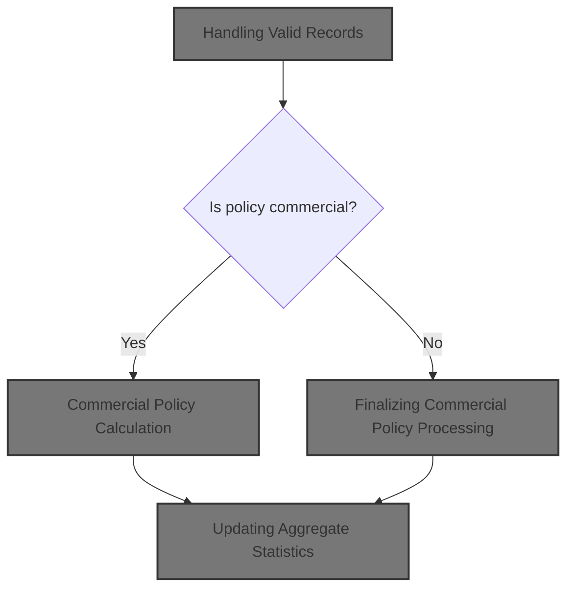

# Technical Overview

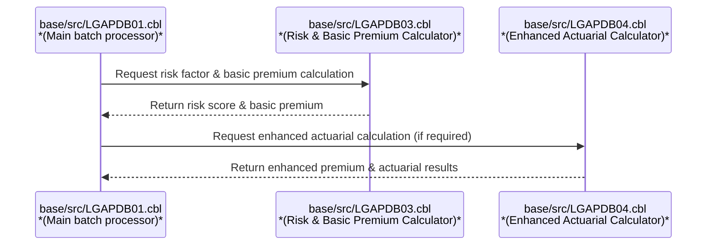

## Dependencies

### Programs

- <SwmToken path="base/src/LGAPDB01.cbl" pos="269:4:4" line-data="           CALL &#39;LGAPDB02&#39; USING IN-PROPERTY-TYPE, IN-POSTCODE, ">`LGAPDB02`</SwmToken>
- <SwmToken path="base/src/LGAPDB01.cbl" pos="276:4:4" line-data="           CALL &#39;LGAPDB03&#39; USING WS-BASE-RISK-SCR, IN-FIRE-PERIL, ">`LGAPDB03`</SwmToken> (<SwmPath>[base/src/LGAPDB03.cbl](base/src/LGAPDB03.cbl)</SwmPath>)
- <SwmToken path="base/src/LGAPDB01.cbl" pos="313:4:4" line-data="               CALL &#39;LGAPDB04&#39; USING LK-INPUT-DATA, LK-COVERAGE-DATA, ">`LGAPDB04`</SwmToken> (<SwmPath>[base/src/LGAPDB04.cbl](base/src/LGAPDB04.cbl)</SwmPath>)

### Copybooks

- SQLCA
- <SwmToken path="base/src/LGAPDB01.cbl" pos="35:3:3" line-data="           COPY INPUTREC2.">`INPUTREC2`</SwmToken> (<SwmPath>[base/src/INPUTREC2.cpy](base/src/INPUTREC2.cpy)</SwmPath>)
- OUTPUTREC (<SwmPath>[base/src/OUTPUTREC.cpy](base/src/OUTPUTREC.cpy)</SwmPath>)
- WORKSTOR (<SwmPath>[base/src/WORKSTOR.cpy](base/src/WORKSTOR.cpy)</SwmPath>)
- LGAPACT (<SwmPath>[base/src/LGAPACT.cpy](base/src/LGAPACT.cpy)</SwmPath>)

# Where is this program used?

This program is used multiple times in the codebase as represented in the following diagram:

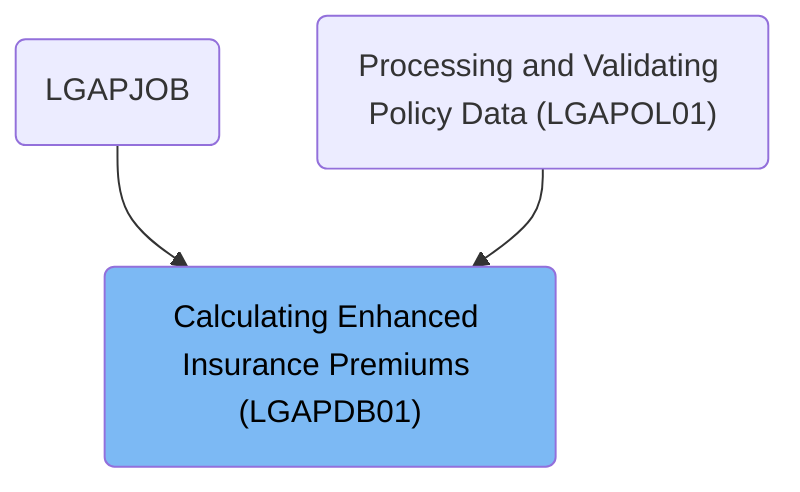

## Input and Output Tables/Files used in the Program

| Table / File Name                                                                                                                                        | Type | Description                                       | Usage Mode | Key Fields / Layout Highlights           |
| -------------------------------------------------------------------------------------------------------------------------------------------------------- | ---- | ------------------------------------------------- | ---------- | ---------------------------------------- |
| <SwmToken path="base/src/LGAPDB01.cbl" pos="17:3:5" line-data="           SELECT CONFIG-FILE ASSIGN TO &#39;CONFIG.DAT&#39;">`CONFIG-FILE`</SwmToken>    | DB2  | System config parameters and thresholds           | Input      | Database table with relational structure |
| <SwmToken path="base/src/LGAPDB01.cbl" pos="9:3:5" line-data="           SELECT INPUT-FILE ASSIGN TO &#39;INPUT.DAT&#39;">`INPUT-FILE`</SwmToken>        | DB2  | Insurance policy application input data           | Input      | Database table with relational structure |
| <SwmToken path="base/src/LGAPDB01.cbl" pos="13:3:5" line-data="           SELECT OUTPUT-FILE ASSIGN TO &#39;OUTPUT.DAT&#39;">`OUTPUT-FILE`</SwmToken>    | DB2  | Calculated premium and risk results per policy    | Output     | Database table with relational structure |
| <SwmToken path="base/src/LGAPDB01.cbl" pos="265:7:9" line-data="           PERFORM P011E-WRITE-OUTPUT-RECORD">`OUTPUT-RECORD`</SwmToken>                 | DB2  | Single policy premium and risk calculation result | Output     | Database table with relational structure |
| <SwmToken path="base/src/LGAPDB01.cbl" pos="27:3:5" line-data="           SELECT SUMMARY-FILE ASSIGN TO &#39;SUMMARY.DAT&#39;">`SUMMARY-FILE`</SwmToken> | DB2  | Summary statistics for batch processing           | Output     | Database table with relational structure |
| <SwmToken path="base/src/LGAPDB01.cbl" pos="64:3:5" line-data="       01  SUMMARY-RECORD             PIC X(132).">`SUMMARY-RECORD`</SwmToken>            | DB2  | Single summary line for batch statistics          | Output     | Database table with relational structure |

&nbsp;

# Workflow

# Startup and Initialization

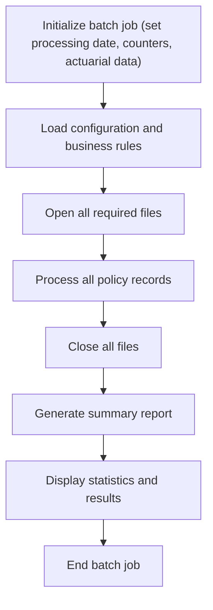

This section ensures that every batch job run starts with a clean slate, with all relevant data areas and counters reset, and the correct processing date established. It also communicates startup status and version information to the user.

| Category       | Rule Name             | Description                                                                                                                                                             |
| -------------- | --------------------- | ----------------------------------------------------------------------------------------------------------------------------------------------------------------------- |
| Business logic | Startup messaging     | The system must display a startup message and the current version number to the user at the beginning of each batch job run.                                            |
| Business logic | Data area reset       | All processing counters, enhanced counters, risk analysis data, actuarial data, premium breakdowns, and decision data must be cleared before any records are processed. |
| Business logic | Processing date setup | The processing date for the batch job must be set from the system date in YYYYMMDD format before any records are processed.                                             |

<SwmSnippet path="/base/src/LGAPDB01.cbl" line="90">

---

<SwmToken path="base/src/LGAPDB01.cbl" pos="90:1:1" line-data="       P001.">`P001`</SwmToken> starts the program and immediately calls <SwmToken path="base/src/LGAPDB01.cbl" pos="91:3:5" line-data="           PERFORM P002-INITIALIZE">`P002-INITIALIZE`</SwmToken> to clear out all counters and set up the processing date, making sure everything is reset before moving on.

```cobol
       P001.
           PERFORM P002-INITIALIZE
           PERFORM P003-LOAD-CONFIG
           PERFORM P005-OPEN-FILES
           PERFORM P006-PROCESS-RECORDS
           PERFORM P014-CLOSE-FILES
           PERFORM P015-GENERATE-SUMMARY
           PERFORM P016-DISPLAY-STATS
           STOP RUN.
```

---

</SwmSnippet>

<SwmSnippet path="/base/src/LGAPDB01.cbl" line="100">

---

<SwmToken path="base/src/LGAPDB01.cbl" pos="100:1:3" line-data="       P002-INITIALIZE.">`P002-INITIALIZE`</SwmToken> shows startup/version messages, clears all the main data areas, and sets the processing date from the system.

```cobol
       P002-INITIALIZE.
           DISPLAY 'Enhanced Policy Premium Calculator Starting...'
           DISPLAY 'Version 2.1 - With Actuarial Calculations'
           INITIALIZE WS-PROCESSING-COUNTERS
           INITIALIZE WS-ENHANCED-COUNTERS
           INITIALIZE WS-RISK-ANALYSIS
           INITIALIZE WS-ACTUARIAL-DATA
           INITIALIZE WS-PREMIUM-BREAKDOWN
           INITIALIZE WS-DECISION-DATA
           
           ACCEPT WS-PROCESSING-DATE FROM DATE YYYYMMDD.
```

---

</SwmSnippet>

# Processing Input Records

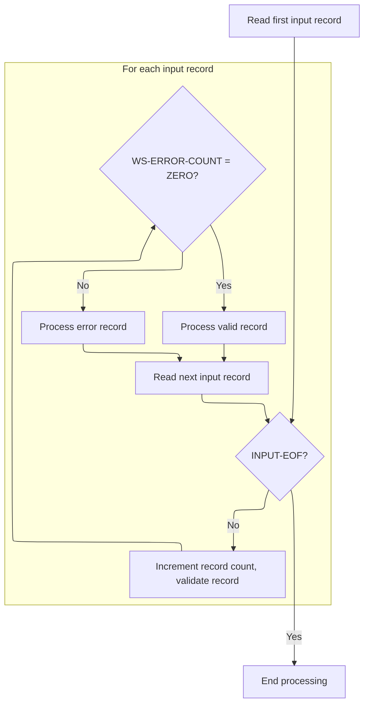

This section is responsible for reading and processing each input record, validating the data, and determining whether the record is processed as valid or logged as an error. It ensures all records are accounted for and processed according to their validation status.

| Category        | Rule Name                   | Description                                                                                                                                                                                                                              |
| --------------- | --------------------------- | ---------------------------------------------------------------------------------------------------------------------------------------------------------------------------------------------------------------------------------------- |
| Data validation | Mandatory record validation | Each input record must be validated before any further processing occurs. Validation determines if the record is eligible for standard processing or must be handled as an error.                                                        |
| Business logic  | Valid record processing     | If a record passes validation (i.e., no errors are found), it is processed as a valid record and included in the output.                                                                                                                 |
| Business logic  | Record count tracking       | The record count (<SwmToken path="base/src/LGAPDB01.cbl" pos="181:7:11" line-data="               ADD 1 TO WS-REC-CNT">`WS-REC-CNT`</SwmToken>) must be incremented for every input record processed, regardless of validation outcome.  |
| Technical step  | End-of-file termination     | Processing must continue until the end-of-file condition is reached, as indicated by the <SwmToken path="base/src/LGAPDB01.cbl" pos="180:5:7" line-data="           PERFORM UNTIL INPUT-EOF">`INPUT-EOF`</SwmToken> status value ('10'). |

<SwmSnippet path="/base/src/LGAPDB01.cbl" line="178">

---

<SwmToken path="base/src/LGAPDB01.cbl" pos="178:1:5" line-data="       P006-PROCESS-RECORDS.">`P006-PROCESS-RECORDS`</SwmToken> begins by reading the first input record to get things ready for the main loop.

```cobol
       P006-PROCESS-RECORDS.
           PERFORM P007-READ-INPUT
```

---

</SwmSnippet>

<SwmSnippet path="/base/src/LGAPDB01.cbl" line="180">

---

After reading each input record, the loop in <SwmToken path="base/src/LGAPDB01.cbl" pos="94:3:7" line-data="           PERFORM P006-PROCESS-RECORDS">`P006-PROCESS-RECORDS`</SwmToken> increments the record count and calls <SwmToken path="base/src/LGAPDB01.cbl" pos="182:3:9" line-data="               PERFORM P008-VALIDATE-INPUT-RECORD">`P008-VALIDATE-INPUT-RECORD`</SwmToken> to check if the data is valid. If there are no errors, it processes the record as valid; otherwise, it logs the error and moves on. The loop keeps going until the end of input.

```cobol
           PERFORM UNTIL INPUT-EOF
               ADD 1 TO WS-REC-CNT
               PERFORM P008-VALIDATE-INPUT-RECORD
               IF WS-ERROR-COUNT = ZERO
                   PERFORM P009-PROCESS-VALID-RECORD
               ELSE
                   PERFORM P010-PROCESS-ERROR-RECORD
               END-IF
               PERFORM P007-READ-INPUT
           END-PERFORM.
```

---

</SwmSnippet>

# Input Validation and Error Logging

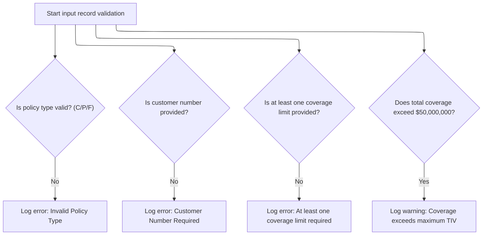

This section ensures that each input record meets required business criteria before further processing. It validates key fields and logs errors or warnings for any violations, supporting data integrity and compliance.

| Category        | Rule Name                  | Description                                                                                                                                                                             |
| --------------- | -------------------------- | --------------------------------------------------------------------------------------------------------------------------------------------------------------------------------------- |
| Data validation | Valid Policy Type Required | A policy record must specify a valid policy type. Accepted values are 'C' (Commercial), 'P' (Personal), or 'F' (Farm). If none are present, an error is logged for invalid policy type. |
| Data validation | Customer Number Mandatory  | A policy record must include a customer number. If the customer number is missing or blank, an error is logged indicating the field is required.                                        |
| Data validation | Coverage Limit Required    | At least one coverage limit (building, contents, or BI) must be provided in the record. If all are zero, an error is logged for missing coverage.                                       |
| Business logic  | Maximum Coverage Warning   | If the total coverage (building + contents + BI) exceeds $50,000,000, a warning is logged but the record is not blocked.                                                                |

<SwmSnippet path="/base/src/LGAPDB01.cbl" line="195">

---

In <SwmToken path="base/src/LGAPDB01.cbl" pos="195:1:7" line-data="       P008-VALIDATE-INPUT-RECORD.">`P008-VALIDATE-INPUT-RECORD`</SwmToken>, the function checks if the policy type is valid by making sure at least one of the policy type flags is set. If not, it calls <SwmToken path="base/src/LGAPDB01.cbl" pos="201:3:7" line-data="               PERFORM P008A-LOG-ERROR WITH ">`P008A-LOG-ERROR`</SwmToken> to record the problem and move on.

```cobol
       P008-VALIDATE-INPUT-RECORD.
           INITIALIZE WS-ERROR-HANDLING
           
           IF NOT COMMERCIAL-POLICY AND 
              NOT PERSONAL-POLICY AND 
              NOT FARM-POLICY
               PERFORM P008A-LOG-ERROR WITH 
                   'POL001' 'F' 'IN-POLICY-TYPE' 
                   'Invalid Policy Type'
           END-IF
```

---

</SwmSnippet>

<SwmSnippet path="/base/src/LGAPDB01.cbl" line="226">

---

<SwmToken path="base/src/LGAPDB01.cbl" pos="226:1:5" line-data="       P008A-LOG-ERROR.">`P008A-LOG-ERROR`</SwmToken> bumps the error count and saves the error details (code, severity, field, message) into indexed arrays. This lets the system keep track of multiple errors per record for later reporting or debugging.

```cobol
       P008A-LOG-ERROR.
           ADD 1 TO WS-ERROR-COUNT
           SET ERR-IDX TO WS-ERROR-COUNT
           MOVE WS-ERROR-CODE TO WS-ERROR-CODE (ERR-IDX)
           MOVE WS-ERROR-SEVERITY TO WS-ERROR-SEVERITY (ERR-IDX)
           MOVE WS-ERROR-FIELD TO WS-ERROR-FIELD (ERR-IDX)
           MOVE WS-ERROR-MESSAGE TO WS-ERROR-MESSAGE (ERR-IDX).
```

---

</SwmSnippet>

<SwmSnippet path="/base/src/LGAPDB01.cbl" line="206">

---

Back in <SwmToken path="base/src/LGAPDB01.cbl" pos="182:3:9" line-data="               PERFORM P008-VALIDATE-INPUT-RECORD">`P008-VALIDATE-INPUT-RECORD`</SwmToken>, after logging any policy type errors, the function checks if the customer number is missing (all spaces). If so, it logs another error for this required field.

```cobol
           IF IN-CUSTOMER-NUM = SPACES
               PERFORM P008A-LOG-ERROR WITH 
                   'CUS001' 'F' 'IN-CUSTOMER-NUM' 
                   'Customer Number Required'
           END-IF
```

---

</SwmSnippet>

<SwmSnippet path="/base/src/LGAPDB01.cbl" line="212">

---

Still in <SwmToken path="base/src/LGAPDB01.cbl" pos="182:3:9" line-data="               PERFORM P008-VALIDATE-INPUT-RECORD">`P008-VALIDATE-INPUT-RECORD`</SwmToken>, after checking customer number, the function verifies that at least one of the coverage limits is set. If both are zero, it logs an error for missing coverage.

```cobol
           IF IN-BUILDING-LIMIT = ZERO AND 
              IN-CONTENTS-LIMIT = ZERO
               PERFORM P008A-LOG-ERROR WITH 
                   'COV001' 'F' 'COVERAGE-LIMITS' 
                   'At least one coverage limit required'
           END-IF
```

---

</SwmSnippet>

<SwmSnippet path="/base/src/LGAPDB01.cbl" line="219">

---

At the end of <SwmToken path="base/src/LGAPDB01.cbl" pos="182:3:9" line-data="               PERFORM P008-VALIDATE-INPUT-RECORD">`P008-VALIDATE-INPUT-RECORD`</SwmToken>, the function checks if the sum of all coverage limits goes over the max allowed (<SwmToken path="base/src/LGAPDB01.cbl" pos="220:9:13" line-data="              IN-BI-LIMIT &gt; WS-MAX-TIV">`WS-MAX-TIV`</SwmToken>). If it does, it logs a warning, but doesn't block the record.

```cobol
           IF IN-BUILDING-LIMIT + IN-CONTENTS-LIMIT + 
              IN-BI-LIMIT > WS-MAX-TIV
               PERFORM P008A-LOG-ERROR WITH 
                   'COV002' 'W' 'COVERAGE-LIMITS' 
                   'Total coverage exceeds maximum TIV'
           END-IF.
```

---

</SwmSnippet>

# Handling Valid Records

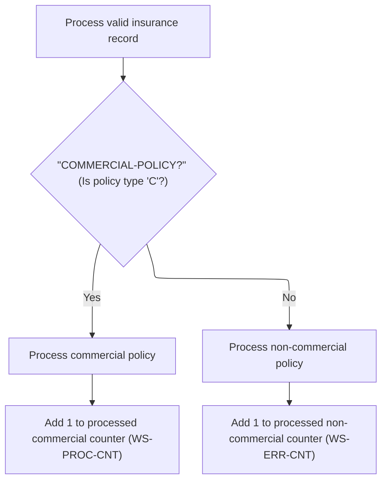

This section determines whether a valid insurance record is a commercial policy or not. Commercial policies are fully processed for risk and premium calculation, while non-commercial policies are logged as errors and counted separately.

| Category       | Rule Name                              | Description                                                                                                                                                   |
| -------------- | -------------------------------------- | ------------------------------------------------------------------------------------------------------------------------------------------------------------- |
| Business logic | Commercial policy processing           | If the policy type is 'C' (commercial), the record must be processed as a commercial policy and included in the commercial processed counter.                 |
| Business logic | Non-commercial policy error logging    | If the policy type is not 'C', the record must be processed as a non-commercial policy, logged as an error, and included in the non-commercial error counter. |
| Business logic | Commercial processed counter increment | Each processed commercial policy must increment the commercial processed counter by 1.                                                                        |
| Business logic | Non-commercial error counter increment | Each processed non-commercial policy must increment the non-commercial error counter by 1.                                                                    |

<SwmSnippet path="/base/src/LGAPDB01.cbl" line="234">

---

<SwmToken path="base/src/LGAPDB01.cbl" pos="234:1:7" line-data="       P009-PROCESS-VALID-RECORD.">`P009-PROCESS-VALID-RECORD`</SwmToken> checks if the policy is commercial. If so, it calls <SwmToken path="base/src/LGAPDB01.cbl" pos="236:3:7" line-data="               PERFORM P011-PROCESS-COMMERCIAL">`P011-PROCESS-COMMERCIAL`</SwmToken> for full risk and premium calculation; otherwise, it logs the policy as non-commercial and marks it as an error.

```cobol
       P009-PROCESS-VALID-RECORD.
           IF COMMERCIAL-POLICY
               PERFORM P011-PROCESS-COMMERCIAL
               ADD 1 TO WS-PROC-CNT
           ELSE
               PERFORM P012-PROCESS-NON-COMMERCIAL
               ADD 1 TO WS-ERR-CNT
           END-IF.
```

---

</SwmSnippet>

# Commercial Policy Calculation

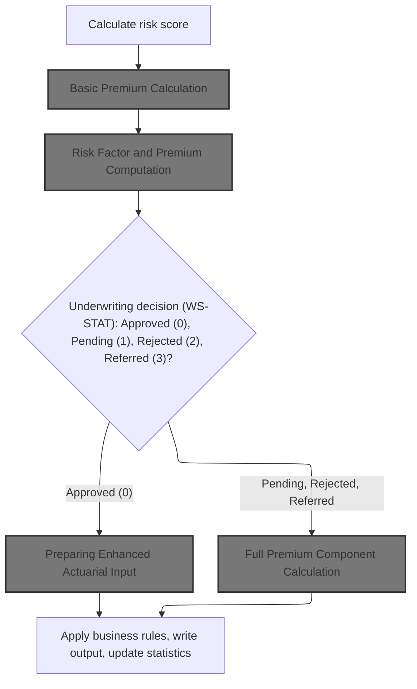

The Commercial Policy Calculation section determines the insurance premium and underwriting decision for a commercial policy by evaluating risk scores, peril indicators, and eligibility for discounts. It applies business rules to decide whether to proceed with enhanced actuarial calculations or full premium component calculations, and outputs the final premium and decision status.

| Category        | Rule Name                              | Description                                                                                                                                                                                                                     |
| --------------- | -------------------------------------- | ------------------------------------------------------------------------------------------------------------------------------------------------------------------------------------------------------------------------------- |
| Data validation | Risk score prerequisite                | The risk score must be calculated before any premium or underwriting decision is made, and must be used as input for subsequent calculations.                                                                                   |
| Business logic  | Underwriting decision status           | The underwriting decision must be set to one of the following statuses: Approved (0), Pending (1), Rejected (2), or Referred (3), based on the risk score and peril data.                                                       |
| Business logic  | Enhanced actuarial calculation trigger | If the underwriting decision is Approved (0), enhanced actuarial input must be prepared and used to potentially update the premium and experience modifier.                                                                     |
| Business logic  | Full premium calculation requirement   | If the underwriting decision is Pending (1), Rejected (2), or Referred (3), a full premium component calculation must be performed, including exposures, rates, modifiers, catastrophe loading, expenses, discounts, and taxes. |
| Business logic  | Discount eligibility and application   | Discount eligibility must be determined for multi-policy, claims-free, and safety program participation, and the corresponding discount factors must be applied to the premium calculation.                                     |
| Business logic  | Output update requirement              | All outputs, including underwriting decision, premium values, discount factors, and statistics, must be written and updated at the end of the calculation process.                                                              |

<SwmSnippet path="/base/src/LGAPDB01.cbl" line="258">

---

In <SwmToken path="base/src/LGAPDB01.cbl" pos="258:1:5" line-data="       P011-PROCESS-COMMERCIAL.">`P011-PROCESS-COMMERCIAL`</SwmToken>, the function first calculates the risk score, then immediately calls <SwmToken path="base/src/LGAPDB01.cbl" pos="260:3:9" line-data="           PERFORM P011B-BASIC-PREMIUM-CALC">`P011B-BASIC-PREMIUM-CALC`</SwmToken> to use that score for premium and decision calculations.

```cobol
       P011-PROCESS-COMMERCIAL.
           PERFORM P011A-CALCULATE-RISK-SCORE
           PERFORM P011B-BASIC-PREMIUM-CALC
```

---

</SwmSnippet>

## Basic Premium Calculation

This section governs the calculation of basic insurance premiums for property policies, determining the premium breakdown, underwriting decision, and eligibility for discounts based on risk and peril data.

| Category        | Rule Name                        | Description                                                                                                                                                                                                              |
| --------------- | -------------------------------- | ------------------------------------------------------------------------------------------------------------------------------------------------------------------------------------------------------------------------ |
| Data validation | Rejection Reason Requirement     | If the underwriting decision is 'rejected', a rejection reason must be provided in the output.                                                                                                                           |
| Data validation | Default Discount Factor          | The discount factor must have a default value of <SwmToken path="base/src/LGAPDB03.cbl" pos="93:3:5" line-data="           MOVE 1.00 TO LK-DISC-FACT">`1.00`</SwmToken> unless eligibility for discounts is established. |
| Data validation | Output Completeness              | All premium and decision outputs must be returned together for each calculation request.                                                                                                                                 |
| Business logic  | Peril Premium Calculation        | Premiums for each peril (fire, crime, flood, weather) must be calculated based on the provided risk scores and peril data for the property.                                                                              |
| Business logic  | Total Premium Calculation        | The total premium must be the sum of the individual peril premiums, adjusted by any applicable discount factors.                                                                                                         |
| Business logic  | Underwriting Decision Assignment | The underwriting decision must be set to 'approved', 'pending', 'rejected', or 'referred' based on the risk analysis and eligibility criteria.                                                                           |
| Business logic  | Discount Eligibility Application | Discount factors must be applied if the customer is eligible for multi-policy, claims-free, or safety program discounts.                                                                                                 |

<SwmSnippet path="/base/src/LGAPDB01.cbl" line="275">

---

<SwmToken path="base/src/LGAPDB01.cbl" pos="275:1:7" line-data="       P011B-BASIC-PREMIUM-CALC.">`P011B-BASIC-PREMIUM-CALC`</SwmToken> calls out to <SwmToken path="base/src/LGAPDB01.cbl" pos="276:4:4" line-data="           CALL &#39;LGAPDB03&#39; USING WS-BASE-RISK-SCR, IN-FIRE-PERIL, ">`LGAPDB03`</SwmToken>, passing risk scores and peril data to get back the premium, decision, and related outputs. This keeps the main program clean and lets the calculation logic live in its own module.

```cobol
       P011B-BASIC-PREMIUM-CALC.
           CALL 'LGAPDB03' USING WS-BASE-RISK-SCR, IN-FIRE-PERIL, 
                                IN-CRIME-PERIL, IN-FLOOD-PERIL, 
                                IN-WEATHER-PERIL, WS-STAT,
                                WS-STAT-DESC, WS-REJ-RSN, WS-FR-PREM,
                                WS-CR-PREM, WS-FL-PREM, WS-WE-PREM,
                                WS-TOT-PREM, WS-DISC-FACT.
```

---

</SwmSnippet>

## Risk Factor and Premium Computation

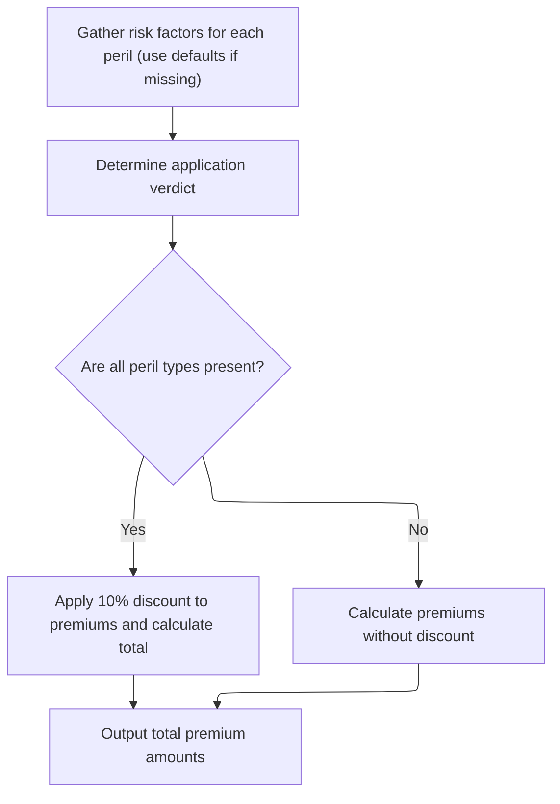

This section is responsible for computing insurance premiums by gathering risk factors, applying business rules for discounts, and ensuring fallback defaults are used if data is missing. It guarantees a premium calculation for every application, even if some risk data is unavailable.

| Category       | Rule Name                   | Description                                                                                                            |
| -------------- | --------------------------- | ---------------------------------------------------------------------------------------------------------------------- |
| Business logic | Full peril discount         | A 10% discount is applied to the total premium if all peril types (fire, crime, flood, weather) have positive values.  |
| Business logic | Premium calculation formula | Premiums for each peril are calculated using the formula: (risk score × peril factor × peril value × discount factor). |
| Business logic | Total premium aggregation   | The total premium is the sum of all individual peril premiums after applying any discounts.                            |

<SwmSnippet path="/base/src/LGAPDB03.cbl" line="42">

---

<SwmToken path="base/src/LGAPDB03.cbl" pos="42:1:3" line-data="       MAIN-LOGIC.">`MAIN-LOGIC`</SwmToken> in <SwmToken path="base/src/LGAPDB01.cbl" pos="276:4:4" line-data="           CALL &#39;LGAPDB03&#39; USING WS-BASE-RISK-SCR, IN-FIRE-PERIL, ">`LGAPDB03`</SwmToken> runs the calculation sequence: it fetches risk factors from the DB, determines the underwriting verdict, then calculates the premiums. Each step depends on the previous one, and the DB fetch allows for dynamic updates to risk factors.

```cobol
       MAIN-LOGIC.
           PERFORM GET-RISK-FACTORS
           PERFORM CALCULATE-VERDICT
           PERFORM CALCULATE-PREMIUMS
           GOBACK.
```

---

</SwmSnippet>

<SwmSnippet path="/base/src/LGAPDB03.cbl" line="48">

---

<SwmToken path="base/src/LGAPDB03.cbl" pos="48:1:5" line-data="       GET-RISK-FACTORS.">`GET-RISK-FACTORS`</SwmToken> tries to fetch fire and crime risk factors from the DB. If the DB call fails, it falls back to hardcoded defaults (<SwmToken path="base/src/LGAPDB03.cbl" pos="58:3:5" line-data="               MOVE 0.80 TO WS-FIRE-FACTOR">`0.80`</SwmToken> for fire, <SwmToken path="base/src/LGAPDB03.cbl" pos="70:3:5" line-data="               MOVE 0.60 TO WS-CRIME-FACTOR">`0.60`</SwmToken> for crime). This guarantees the calculation can proceed even if the DB is missing data.

```cobol
       GET-RISK-FACTORS.
           EXEC SQL
               SELECT FACTOR_VALUE INTO :WS-FIRE-FACTOR
               FROM RISK_FACTORS
               WHERE PERIL_TYPE = 'FIRE'
           END-EXEC.
           
           IF SQLCODE = 0
               CONTINUE
           ELSE
               MOVE 0.80 TO WS-FIRE-FACTOR
           END-IF.
           
           EXEC SQL
               SELECT FACTOR_VALUE INTO :WS-CRIME-FACTOR
               FROM RISK_FACTORS
               WHERE PERIL_TYPE = 'CRIME'
           END-EXEC.
           
           IF SQLCODE = 0
               CONTINUE
           ELSE
               MOVE 0.60 TO WS-CRIME-FACTOR
           END-IF.
```

---

</SwmSnippet>

<SwmSnippet path="/base/src/LGAPDB03.cbl" line="92">

---

<SwmToken path="base/src/LGAPDB03.cbl" pos="92:1:3" line-data="       CALCULATE-PREMIUMS.">`CALCULATE-PREMIUMS`</SwmToken> sets a discount factor to <SwmToken path="base/src/LGAPDB03.cbl" pos="93:3:5" line-data="           MOVE 1.00 TO LK-DISC-FACT">`1.00`</SwmToken>, but if all peril values are positive, it drops it to <SwmToken path="base/src/LGAPDB03.cbl" pos="99:3:5" line-data="             MOVE 0.90 TO LK-DISC-FACT">`0.90`</SwmToken> (10% off). It then calculates each peril's premium using the risk score, peril factor, peril value, and discount, and sums them up for the total premium.

```cobol
       CALCULATE-PREMIUMS.
           MOVE 1.00 TO LK-DISC-FACT
           
           IF LK-FIRE-PERIL > 0 AND
              LK-CRIME-PERIL > 0 AND
              LK-FLOOD-PERIL > 0 AND
              LK-WEATHER-PERIL > 0
             MOVE 0.90 TO LK-DISC-FACT
           END-IF

           COMPUTE LK-FIRE-PREMIUM =
             ((LK-RISK-SCORE * WS-FIRE-FACTOR) * LK-FIRE-PERIL *
               LK-DISC-FACT)
           
           COMPUTE LK-CRIME-PREMIUM =
             ((LK-RISK-SCORE * WS-CRIME-FACTOR) * LK-CRIME-PERIL *
               LK-DISC-FACT)
           
           COMPUTE LK-FLOOD-PREMIUM =
             ((LK-RISK-SCORE * WS-FLOOD-FACTOR) * LK-FLOOD-PERIL *
               LK-DISC-FACT)
           
           COMPUTE LK-WEATHER-PREMIUM =
             ((LK-RISK-SCORE * WS-WEATHER-FACTOR) * LK-WEATHER-PERIL *
               LK-DISC-FACT)

           COMPUTE LK-TOTAL-PREMIUM = 
             LK-FIRE-PREMIUM + LK-CRIME-PREMIUM + 
             LK-FLOOD-PREMIUM + LK-WEATHER-PREMIUM. 
```

---

</SwmSnippet>

## Enhanced Actuarial Calculation Trigger

<SwmSnippet path="/base/src/LGAPDB01.cbl" line="261">

---

Back in <SwmToken path="base/src/LGAPDB01.cbl" pos="236:3:7" line-data="               PERFORM P011-PROCESS-COMMERCIAL">`P011-PROCESS-COMMERCIAL`</SwmToken>, after the basic premium calc, if the policy is initially approved (<SwmToken path="base/src/LGAPDB01.cbl" pos="261:3:5" line-data="           IF WS-STAT = 0">`WS-STAT`</SwmToken> = 0), the function calls <SwmToken path="base/src/LGAPDB01.cbl" pos="262:3:9" line-data="               PERFORM P011C-ENHANCED-ACTUARIAL-CALC">`P011C-ENHANCED-ACTUARIAL-CALC`</SwmToken> to run a more detailed actuarial calculation and possibly update the premium.

```cobol
           IF WS-STAT = 0
               PERFORM P011C-ENHANCED-ACTUARIAL-CALC
           END-IF
```

---

</SwmSnippet>

## Preparing Enhanced Actuarial Input

```mermaid
%%{init: {"flowchart": {"defaultRenderer": "elk"}} }%%
flowchart TD
    node1["Prepare input and coverage data for actuarial calculation"]
    click node1 openCode "base/src/LGAPDB01.cbl:283:309"
    node1 --> node2{"Is total premium (WS-TOT-PREM) > minimum premium (WS-MIN-PREMIUM)?"}
    click node2 openCode "base/src/LGAPDB01.cbl:312:312"
    node2 -->|"Yes"| node3["Call LGAPDB04 for enhanced actuarial calculation"]
    click node3 openCode "base/src/LGAPDB01.cbl:313:314"
    node2 -->|"No"| node6["End"]
    node3 --> node4{"Is enhanced premium (LK-TOTAL-PREMIUM) > original premium (WS-TOT-PREM)?"}
    click node4 openCode "base/src/LGAPDB01.cbl:317:317"
    node4 -->|"Yes"| node5["Update premium and related values (fire, crime, flood, weather, total premium, experience mod)"]
    click node5 openCode "base/src/LGAPDB01.cbl:318:324"
    node4 -->|"No"| node6["End"]
    node5 --> node6["End"]
    click node6 openCode "base/src/LGAPDB01.cbl:325:325"
classDef HeadingStyle fill:#777777,stroke:#333,stroke-width:2px;

%% Swimm:
%% %%{init: {"flowchart": {"defaultRenderer": "elk"}} }%%
%% flowchart TD
%%     node1["Prepare input and coverage data for actuarial calculation"]
%%     click node1 openCode "<SwmPath>[base/src/LGAPDB01.cbl](base/src/LGAPDB01.cbl)</SwmPath>:283:309"
%%     node1 --> node2{"Is total premium (<SwmToken path="base/src/LGAPDB01.cbl" pos="281:1:5" line-data="                                WS-TOT-PREM, WS-DISC-FACT.">`WS-TOT-PREM`</SwmToken>) > minimum premium (<SwmToken path="base/src/LGAPDB01.cbl" pos="312:11:15" line-data="           IF WS-TOT-PREM &gt; WS-MIN-PREMIUM">`WS-MIN-PREMIUM`</SwmToken>)?"}
%%     click node2 openCode "<SwmPath>[base/src/LGAPDB01.cbl](base/src/LGAPDB01.cbl)</SwmPath>:312:312"
%%     node2 -->|"Yes"| node3["Call <SwmToken path="base/src/LGAPDB01.cbl" pos="313:4:4" line-data="               CALL &#39;LGAPDB04&#39; USING LK-INPUT-DATA, LK-COVERAGE-DATA, ">`LGAPDB04`</SwmToken> for enhanced actuarial calculation"]
%%     click node3 openCode "<SwmPath>[base/src/LGAPDB01.cbl](base/src/LGAPDB01.cbl)</SwmPath>:313:314"
%%     node2 -->|"No"| node6["End"]
%%     node3 --> node4{"Is enhanced premium (<SwmToken path="base/src/LGAPDB01.cbl" pos="317:3:7" line-data="               IF LK-TOTAL-PREMIUM &gt; WS-TOT-PREM">`LK-TOTAL-PREMIUM`</SwmToken>) > original premium (<SwmToken path="base/src/LGAPDB01.cbl" pos="281:1:5" line-data="                                WS-TOT-PREM, WS-DISC-FACT.">`WS-TOT-PREM`</SwmToken>)?"}
%%     click node4 openCode "<SwmPath>[base/src/LGAPDB01.cbl](base/src/LGAPDB01.cbl)</SwmPath>:317:317"
%%     node4 -->|"Yes"| node5["Update premium and related values (fire, crime, flood, weather, total premium, experience mod)"]
%%     click node5 openCode "<SwmPath>[base/src/LGAPDB01.cbl](base/src/LGAPDB01.cbl)</SwmPath>:318:324"
%%     node4 -->|"No"| node6["End"]
%%     node5 --> node6["End"]
%%     click node6 openCode "<SwmPath>[base/src/LGAPDB01.cbl](base/src/LGAPDB01.cbl)</SwmPath>:325:325"
%% classDef HeadingStyle fill:#777777,stroke:#333,stroke-width:2px;
```

This section ensures that enhanced actuarial calculations are only performed for policies with premiums above a minimum threshold, and updates the policy's premium and related values only if the enhanced calculation results in a higher premium. It prepares all necessary input and coverage data for the calculation.

| Category        | Rule Name                       | Description                                                                                                                                                                                                                                  |
| --------------- | ------------------------------- | -------------------------------------------------------------------------------------------------------------------------------------------------------------------------------------------------------------------------------------------- |
| Data validation | Minimum premium threshold       | Enhanced actuarial calculation is only performed if the current total premium is greater than the configured minimum premium value (default: $500.00).                                                                                       |
| Data validation | Input data completeness         | All relevant customer, property, risk, and coverage fields must be copied into the input structures required for the enhanced actuarial calculation.                                                                                         |
| Business logic  | Premium improvement requirement | If the enhanced actuarial calculation produces a total premium greater than the original premium, the policy's premium and related values (fire, crime, flood, weather, total premium, experience modifier) are updated with the new values. |
| Business logic  | No update on lower premium      | If the enhanced actuarial calculation does not produce a higher premium than the original, no changes are made to the policy's premium or related values.                                                                                    |

<SwmSnippet path="/base/src/LGAPDB01.cbl" line="283">

---

In <SwmToken path="base/src/LGAPDB01.cbl" pos="283:1:7" line-data="       P011C-ENHANCED-ACTUARIAL-CALC.">`P011C-ENHANCED-ACTUARIAL-CALC`</SwmToken>, the function copies all the relevant input, risk, and coverage fields into the structures needed for the advanced actuarial calculation. This sets up the data for the next step.

```cobol
       P011C-ENHANCED-ACTUARIAL-CALC.
      *    Prepare input structure for actuarial calculation
           MOVE IN-CUSTOMER-NUM TO LK-CUSTOMER-NUM
           MOVE WS-BASE-RISK-SCR TO LK-RISK-SCORE
           MOVE IN-PROPERTY-TYPE TO LK-PROPERTY-TYPE
           MOVE IN-TERRITORY-CODE TO LK-TERRITORY
           MOVE IN-CONSTRUCTION-TYPE TO LK-CONSTRUCTION-TYPE
           MOVE IN-OCCUPANCY-CODE TO LK-OCCUPANCY-CODE
           MOVE IN-SPRINKLER-IND TO LK-PROTECTION-CLASS
           MOVE IN-YEAR-BUILT TO LK-YEAR-BUILT
           MOVE IN-SQUARE-FOOTAGE TO LK-SQUARE-FOOTAGE
           MOVE IN-YEARS-IN-BUSINESS TO LK-YEARS-IN-BUSINESS
           MOVE IN-CLAIMS-COUNT-3YR TO LK-CLAIMS-COUNT-5YR
           MOVE IN-CLAIMS-AMOUNT-3YR TO LK-CLAIMS-AMOUNT-5YR
           
      *    Set coverage data
           MOVE IN-BUILDING-LIMIT TO LK-BUILDING-LIMIT
           MOVE IN-CONTENTS-LIMIT TO LK-CONTENTS-LIMIT
           MOVE IN-BI-LIMIT TO LK-BI-LIMIT
           MOVE IN-FIRE-DEDUCTIBLE TO LK-FIRE-DEDUCTIBLE
           MOVE IN-WIND-DEDUCTIBLE TO LK-WIND-DEDUCTIBLE
           MOVE IN-FLOOD-DEDUCTIBLE TO LK-FLOOD-DEDUCTIBLE
           MOVE IN-OTHER-DEDUCTIBLE TO LK-OTHER-DEDUCTIBLE
           MOVE IN-FIRE-PERIL TO LK-FIRE-PERIL
           MOVE IN-CRIME-PERIL TO LK-CRIME-PERIL
           MOVE IN-FLOOD-PERIL TO LK-FLOOD-PERIL
           MOVE IN-WEATHER-PERIL TO LK-WEATHER-PERIL
```

---

</SwmSnippet>

<SwmSnippet path="/base/src/LGAPDB01.cbl" line="312">

---

After prepping the input, <SwmToken path="base/src/LGAPDB01.cbl" pos="262:3:9" line-data="               PERFORM P011C-ENHANCED-ACTUARIAL-CALC">`P011C-ENHANCED-ACTUARIAL-CALC`</SwmToken> only calls <SwmToken path="base/src/LGAPDB01.cbl" pos="313:4:4" line-data="               CALL &#39;LGAPDB04&#39; USING LK-INPUT-DATA, LK-COVERAGE-DATA, ">`LGAPDB04`</SwmToken> if the current premium is above the minimum. If the enhanced calculation returns a higher premium, it updates the policy's premium and modifiers with the new values.

```cobol
           IF WS-TOT-PREM > WS-MIN-PREMIUM
               CALL 'LGAPDB04' USING LK-INPUT-DATA, LK-COVERAGE-DATA, 
                                    LK-OUTPUT-RESULTS
               
      *        Update with enhanced calculations if successful
               IF LK-TOTAL-PREMIUM > WS-TOT-PREM
                   MOVE LK-FIRE-PREMIUM TO WS-FR-PREM
                   MOVE LK-CRIME-PREMIUM TO WS-CR-PREM
                   MOVE LK-FLOOD-PREMIUM TO WS-FL-PREM
                   MOVE LK-WEATHER-PREMIUM TO WS-WE-PREM
                   MOVE LK-TOTAL-PREMIUM TO WS-TOT-PREM
                   MOVE LK-EXPERIENCE-MOD TO WS-EXPERIENCE-MOD
               END-IF
           END-IF.
```

---

</SwmSnippet>

## Full Premium Component Calculation

```mermaid
%%{init: {"flowchart": {"defaultRenderer": "elk"}} }%%
flowchart TD
    node1["Start premium calculation"] --> node2["Calculate exposures"]
    click node1 openCode "base/src/LGAPDB04.cbl:138:150"
    click node2 openCode "base/src/LGAPDB04.cbl:152:174"
    node2 --> node3["Calculate rates"]
    click node3 openCode "base/src/LGAPDB04.cbl:140:141"
    node3 --> node4["Calculate experience modifier"]
    click node4 openCode "base/src/LGAPDB04.cbl:234:258"
    node4 --> node5["Calculate schedule modifier"]
    click node5 openCode "base/src/LGAPDB04.cbl:143:143"
    node5 --> node6["Calculate base premium for covered perils"]
    click node6 openCode "base/src/LGAPDB04.cbl:318:367"
    node6 --> node7["Calculate catastrophe load"]
    click node7 openCode "base/src/LGAPDB04.cbl:145:145"
    node7 --> node8["Calculate expenses"]
    click node8 openCode "base/src/LGAPDB04.cbl:147:147"
    node8 --> node9["Apply discounts"]
    click node9 openCode "base/src/LGAPDB04.cbl:407:454"
    node9 --> node10["Calculate taxes"]
    click node10 openCode "base/src/LGAPDB04.cbl:456:462"
    node10 --> node12{"Is final rate factor > 0.050000?"}
    click node12 openCode "base/src/LGAPDB04.cbl:473:474"
    node12 -->|"No"| node11["Finalize premium and rate factor"]
    click node11 openCode "base/src/LGAPDB04.cbl:464:477"
    node12 -->|"Yes"| node13["Cap rate factor at 0.050000 and adjust premium"]
    click node13 openCode "base/src/LGAPDB04.cbl:474:477"
    node13 --> node11
classDef HeadingStyle fill:#777777,stroke:#333,stroke-width:2px;

%% Swimm:
%% %%{init: {"flowchart": {"defaultRenderer": "elk"}} }%%
%% flowchart TD
%%     node1["Start premium calculation"] --> node2["Calculate exposures"]
%%     click node1 openCode "<SwmPath>[base/src/LGAPDB04.cbl](base/src/LGAPDB04.cbl)</SwmPath>:138:150"
%%     click node2 openCode "<SwmPath>[base/src/LGAPDB04.cbl](base/src/LGAPDB04.cbl)</SwmPath>:152:174"
%%     node2 --> node3["Calculate rates"]
%%     click node3 openCode "<SwmPath>[base/src/LGAPDB04.cbl](base/src/LGAPDB04.cbl)</SwmPath>:140:141"
%%     node3 --> node4["Calculate experience modifier"]
%%     click node4 openCode "<SwmPath>[base/src/LGAPDB04.cbl](base/src/LGAPDB04.cbl)</SwmPath>:234:258"
%%     node4 --> node5["Calculate schedule modifier"]
%%     click node5 openCode "<SwmPath>[base/src/LGAPDB04.cbl](base/src/LGAPDB04.cbl)</SwmPath>:143:143"
%%     node5 --> node6["Calculate base premium for covered perils"]
%%     click node6 openCode "<SwmPath>[base/src/LGAPDB04.cbl](base/src/LGAPDB04.cbl)</SwmPath>:318:367"
%%     node6 --> node7["Calculate catastrophe load"]
%%     click node7 openCode "<SwmPath>[base/src/LGAPDB04.cbl](base/src/LGAPDB04.cbl)</SwmPath>:145:145"
%%     node7 --> node8["Calculate expenses"]
%%     click node8 openCode "<SwmPath>[base/src/LGAPDB04.cbl](base/src/LGAPDB04.cbl)</SwmPath>:147:147"
%%     node8 --> node9["Apply discounts"]
%%     click node9 openCode "<SwmPath>[base/src/LGAPDB04.cbl](base/src/LGAPDB04.cbl)</SwmPath>:407:454"
%%     node9 --> node10["Calculate taxes"]
%%     click node10 openCode "<SwmPath>[base/src/LGAPDB04.cbl](base/src/LGAPDB04.cbl)</SwmPath>:456:462"
%%     node10 --> node12{"Is final rate factor > <SwmToken path="base/src/LGAPDB04.cbl" pos="473:13:15" line-data="           IF LK-FINAL-RATE-FACTOR &gt; 0.050000">`0.050000`</SwmToken>?"}
%%     click node12 openCode "<SwmPath>[base/src/LGAPDB04.cbl](base/src/LGAPDB04.cbl)</SwmPath>:473:474"
%%     node12 -->|"No"| node11["Finalize premium and rate factor"]
%%     click node11 openCode "<SwmPath>[base/src/LGAPDB04.cbl](base/src/LGAPDB04.cbl)</SwmPath>:464:477"
%%     node12 -->|"Yes"| node13["Cap rate factor at <SwmToken path="base/src/LGAPDB04.cbl" pos="473:13:15" line-data="           IF LK-FINAL-RATE-FACTOR &gt; 0.050000">`0.050000`</SwmToken> and adjust premium"]
%%     click node13 openCode "<SwmPath>[base/src/LGAPDB04.cbl](base/src/LGAPDB04.cbl)</SwmPath>:474:477"
%%     node13 --> node11
%% classDef HeadingStyle fill:#777777,stroke:#333,stroke-width:2px;
```

This section governs the calculation of the full insurance premium for a policy, ensuring all relevant exposures, modifiers, discounts, and taxes are applied according to business rules. The result is a final premium and rate factor that reflect the risk and coverage profile.

| Category        | Rule Name                       | Description                                                                                                                                                                                                                                                                                                                                                                                                                                                                                                                                                                                                                                                                                                                                                                                                                                                                                                                                                                                                                                                                                                                                                                                                                                                                                   |
| --------------- | ------------------------------- | --------------------------------------------------------------------------------------------------------------------------------------------------------------------------------------------------------------------------------------------------------------------------------------------------------------------------------------------------------------------------------------------------------------------------------------------------------------------------------------------------------------------------------------------------------------------------------------------------------------------------------------------------------------------------------------------------------------------------------------------------------------------------------------------------------------------------------------------------------------------------------------------------------------------------------------------------------------------------------------------------------------------------------------------------------------------------------------------------------------------------------------------------------------------------------------------------------------------------------------------------------------------------------------------- |
| Data validation | Premium and rate factor capping | The final premium is the sum of all premium components, minus discounts, plus tax. The final rate factor is calculated as total premium divided by total insured value. If the rate factor exceeds 0.05, it is capped at 0.05 and the premium is recalculated to match the cap.                                                                                                                                                                                                                                                                                                                                                                                                                                                                                                                                                                                                                                                                                                                                                                                                                                                                                                                                                                                                               |
| Business logic  | Exposure calculation            | Exposures for building, contents, and business interruption are calculated by adjusting each coverage limit with the risk score. The total insured value is the sum of these exposures. Exposure density is calculated by dividing total insured value by square footage, or set to <SwmToken path="base/src/LGAPDB04.cbl" pos="173:3:5" line-data="               MOVE 100.00 TO WS-EXPOSURE-DENSITY">`100.00`</SwmToken> if square footage is zero.                                                                                                                                                                                                                                                                                                                                                                                                                                                                                                                                                                                                                                                                                                                                                                                                                                         |
| Business logic  | Experience modifier             | The experience modifier is set based on years in business and claims history. Businesses with 5+ years and no claims get a 0.85 modifier. Others get a calculated modifier based on claims ratio and credibility factor, capped between 0.5 and 2.0. New businesses get a 1.10 modifier.                                                                                                                                                                                                                                                                                                                                                                                                                                                                                                                                                                                                                                                                                                                                                                                                                                                                                                                                                                                                      |
| Business logic  | Peril premium calculation       | Base premium is calculated for each covered peril (fire, crime, flood, weather) only if the peril indicator is positive. Each peril uses exposures, base rates, experience and schedule modifiers, and a trend factor. Crime premiums use a <SwmToken path="base/src/LGAPDB03.cbl" pos="58:3:5" line-data="               MOVE 0.80 TO WS-FIRE-FACTOR">`0.80`</SwmToken> factor, flood premiums use a <SwmToken path="base/src/LGAPDB04.cbl" pos="352:9:11" line-data="                   WS-TREND-FACTOR * 1.25">`1.25`</SwmToken> factor.                                                                                                                                                                                                                                                                                                                                                                                                                                                                                                                                                                                                                                                                                                                                                   |
| Business logic  | Discount calculation            | <SwmToken path="base/src/LGAPDB04.cbl" pos="410:3:5" line-data="      * Multi-peril discount">`Multi-peril`</SwmToken>, claims-free, and deductible discounts are calculated and summed. <SwmToken path="base/src/LGAPDB04.cbl" pos="410:3:5" line-data="      * Multi-peril discount">`Multi-peril`</SwmToken> discount is 0.10 if all perils are covered, 0.05 for partial combinations. <SwmToken path="base/src/LGAPDB04.cbl" pos="425:3:5" line-data="      * Claims-free discount  ">`Claims-free`</SwmToken> discount is <SwmToken path="base/src/LGAPDB04.cbl" pos="428:3:5" line-data="               MOVE 0.075 TO WS-CLAIMS-FREE-DISC">`0.075`</SwmToken> for businesses with 5+ years and no claims. Deductible credits are <SwmToken path="base/src/LGAPDB04.cbl" pos="434:3:5" line-data="               ADD 0.025 TO WS-DEDUCTIBLE-CREDIT">`0.025`</SwmToken> for fire deductibles ≥ $10,000, <SwmToken path="base/src/LGAPDB04.cbl" pos="437:3:5" line-data="               ADD 0.035 TO WS-DEDUCTIBLE-CREDIT">`0.035`</SwmToken> for wind deductibles ≥ $25,000, and <SwmToken path="base/src/LGAPDB04.cbl" pos="440:3:5" line-data="               ADD 0.045 TO WS-DEDUCTIBLE-CREDIT">`0.045`</SwmToken> for flood deductibles ≥ $50,000. Total discount is capped at 0.25. |
| Business logic  | Tax calculation                 | Tax is calculated by summing all premium components, subtracting the discount, and multiplying by a fixed rate of <SwmToken path="base/src/LGAPDB04.cbl" pos="460:10:12" line-data="                LK-DISCOUNT-AMT) * 0.0675">`0.0675`</SwmToken>.                                                                                                                                                                                                                                                                                                                                                                                                                                                                                                                                                                                                                                                                                                                                                                                                                                                                                                                                                                                                                                           |

<SwmSnippet path="/base/src/LGAPDB04.cbl" line="138">

---

<SwmToken path="base/src/LGAPDB04.cbl" pos="138:1:3" line-data="       P100-MAIN.">`P100-MAIN`</SwmToken> in <SwmToken path="base/src/LGAPDB01.cbl" pos="313:4:4" line-data="               CALL &#39;LGAPDB04&#39; USING LK-INPUT-DATA, LK-COVERAGE-DATA, ">`LGAPDB04`</SwmToken> runs the full premium calculation pipeline: it initializes, loads rates, calculates exposures, applies modifiers, computes base and catastrophe premiums, adds expenses, applies discounts and taxes, and finally totals everything up. Each step is needed to get the final premium right.

```cobol
       P100-MAIN.
           PERFORM P200-INIT
           PERFORM P300-RATES
           PERFORM P350-EXPOSURE
           PERFORM P400-EXP-MOD
           PERFORM P500-SCHED-MOD
           PERFORM P600-BASE-PREM
           PERFORM P700-CAT-LOAD
           PERFORM P800-EXPENSE
           PERFORM P900-DISC
           PERFORM P950-TAXES
           PERFORM P999-FINAL
           GOBACK.
```

---

</SwmSnippet>

<SwmSnippet path="/base/src/LGAPDB04.cbl" line="152">

---

<SwmToken path="base/src/LGAPDB04.cbl" pos="152:1:3" line-data="       P200-INIT.">`P200-INIT`</SwmToken> calculates exposures for building, contents, and business interruption by adjusting each limit with the risk score. It then sums these for the total insured value, and divides by square footage to get exposure density (or uses <SwmToken path="base/src/LGAPDB04.cbl" pos="173:3:5" line-data="               MOVE 100.00 TO WS-EXPOSURE-DENSITY">`100.00`</SwmToken> if square footage is zero).

```cobol
       P200-INIT.
           INITIALIZE WS-CALCULATION-AREAS
           INITIALIZE WS-BASE-RATE-TABLE
           
           COMPUTE WS-BUILDING-EXPOSURE = 
               LK-BUILDING-LIMIT * (1 + (LK-RISK-SCORE - 100) / 1000)
               
           COMPUTE WS-CONTENTS-EXPOSURE = 
               LK-CONTENTS-LIMIT * (1 + (LK-RISK-SCORE - 100) / 1000)
               
           COMPUTE WS-BI-EXPOSURE = 
               LK-BI-LIMIT * (1 + (LK-RISK-SCORE - 100) / 1000)
               
           COMPUTE WS-TOTAL-INSURED-VAL = 
               WS-BUILDING-EXPOSURE + WS-CONTENTS-EXPOSURE + 
               WS-BI-EXPOSURE
               
           IF LK-SQUARE-FOOTAGE > ZERO
               COMPUTE WS-EXPOSURE-DENSITY = 
                   WS-TOTAL-INSURED-VAL / LK-SQUARE-FOOTAGE
           ELSE
               MOVE 100.00 TO WS-EXPOSURE-DENSITY
           END-IF.
```

---

</SwmSnippet>

<SwmSnippet path="/base/src/LGAPDB04.cbl" line="234">

---

<SwmToken path="base/src/LGAPDB04.cbl" pos="234:1:5" line-data="       P400-EXP-MOD.">`P400-EXP-MOD`</SwmToken> sets the experience modifier based on years in business and claims history. <SwmToken path="base/src/LGAPDB04.cbl" pos="425:3:5" line-data="      * Claims-free discount  ">`Claims-free`</SwmToken> businesses with 5+ years get a 0.85 modifier; others get a calculated value, capped between 0.5 and 2.0. Newer businesses get 1.10. The calculation uses a credibility factor and claims ratio.

```cobol
       P400-EXP-MOD.
           MOVE 1.0000 TO WS-EXPERIENCE-MOD
           
           IF LK-YEARS-IN-BUSINESS >= 5
               IF LK-CLAIMS-COUNT-5YR = ZERO
                   MOVE 0.8500 TO WS-EXPERIENCE-MOD
               ELSE
                   COMPUTE WS-EXPERIENCE-MOD = 
                       1.0000 + 
                       ((LK-CLAIMS-AMOUNT-5YR / WS-TOTAL-INSURED-VAL) * 
                        WS-CREDIBILITY-FACTOR * 0.50)
                   
                   IF WS-EXPERIENCE-MOD > 2.0000
                       MOVE 2.0000 TO WS-EXPERIENCE-MOD
                   END-IF
                   
                   IF WS-EXPERIENCE-MOD < 0.5000
                       MOVE 0.5000 TO WS-EXPERIENCE-MOD
                   END-IF
               END-IF
           ELSE
               MOVE 1.1000 TO WS-EXPERIENCE-MOD
           END-IF
           
           MOVE WS-EXPERIENCE-MOD TO LK-EXPERIENCE-MOD.
```

---

</SwmSnippet>

<SwmSnippet path="/base/src/LGAPDB04.cbl" line="318">

---

<SwmToken path="base/src/LGAPDB04.cbl" pos="318:1:5" line-data="       P600-BASE-PREM.">`P600-BASE-PREM`</SwmToken> calculates the base premium by summing up premiums for each peril. Each is computed using exposures, base rates, experience and schedule modifiers, and a trend factor. Crime gets a <SwmToken path="base/src/LGAPDB04.cbl" pos="336:10:12" line-data="                   (WS-CONTENTS-EXPOSURE * 0.80) *">`0.80`</SwmToken> factor, flood gets a <SwmToken path="base/src/LGAPDB04.cbl" pos="352:9:11" line-data="                   WS-TREND-FACTOR * 1.25">`1.25`</SwmToken> bump. Only perils with positive indicators are included.

```cobol
       P600-BASE-PREM.
           MOVE ZERO TO LK-BASE-AMOUNT
           
      * FIRE PREMIUM
           IF LK-FIRE-PERIL > ZERO
               COMPUTE LK-FIRE-PREMIUM = 
                   (WS-BUILDING-EXPOSURE + WS-CONTENTS-EXPOSURE) *
                   WS-BASE-RATE (1, 1, 1, 1) * 
                   WS-EXPERIENCE-MOD *
                   (1 + WS-SCHEDULE-MOD) *
                   WS-TREND-FACTOR
                   
               ADD LK-FIRE-PREMIUM TO LK-BASE-AMOUNT
           END-IF
           
      * CRIME PREMIUM
           IF LK-CRIME-PERIL > ZERO
               COMPUTE LK-CRIME-PREMIUM = 
                   (WS-CONTENTS-EXPOSURE * 0.80) *
                   WS-BASE-RATE (2, 1, 1, 1) * 
                   WS-EXPERIENCE-MOD *
                   (1 + WS-SCHEDULE-MOD) *
                   WS-TREND-FACTOR
                   
               ADD LK-CRIME-PREMIUM TO LK-BASE-AMOUNT
           END-IF
           
      * FLOOD PREMIUM
           IF LK-FLOOD-PERIL > ZERO
               COMPUTE LK-FLOOD-PREMIUM = 
                   WS-BUILDING-EXPOSURE *
                   WS-BASE-RATE (3, 1, 1, 1) * 
                   WS-EXPERIENCE-MOD *
                   (1 + WS-SCHEDULE-MOD) *
                   WS-TREND-FACTOR * 1.25
                   
               ADD LK-FLOOD-PREMIUM TO LK-BASE-AMOUNT
           END-IF
           
      * WEATHER PREMIUM
           IF LK-WEATHER-PERIL > ZERO
               COMPUTE LK-WEATHER-PREMIUM = 
                   (WS-BUILDING-EXPOSURE + WS-CONTENTS-EXPOSURE) *
                   WS-BASE-RATE (4, 1, 1, 1) * 
                   WS-EXPERIENCE-MOD *
                   (1 + WS-SCHEDULE-MOD) *
                   WS-TREND-FACTOR
                   
               ADD LK-WEATHER-PREMIUM TO LK-BASE-AMOUNT
           END-IF.
```

---

</SwmSnippet>

<SwmSnippet path="/base/src/LGAPDB04.cbl" line="407">

---

<SwmToken path="base/src/LGAPDB04.cbl" pos="407:1:3" line-data="       P900-DISC.">`P900-DISC`</SwmToken> calculates the total discount by adding up multi-peril, claims-free, and deductible credits, each with its own rate. The total discount is capped at 0.25, and the discount amount is applied to the sum of all premium components before tax.

```cobol
       P900-DISC.
           MOVE ZERO TO WS-TOTAL-DISCOUNT
           
      * Multi-peril discount
           MOVE ZERO TO WS-MULTI-PERIL-DISC
           IF LK-FIRE-PERIL > ZERO AND
              LK-CRIME-PERIL > ZERO AND
              LK-FLOOD-PERIL > ZERO AND
              LK-WEATHER-PERIL > ZERO
               MOVE 0.100 TO WS-MULTI-PERIL-DISC
           ELSE
               IF LK-FIRE-PERIL > ZERO AND
                  LK-WEATHER-PERIL > ZERO AND
                  (LK-CRIME-PERIL > ZERO OR LK-FLOOD-PERIL > ZERO)
                   MOVE 0.050 TO WS-MULTI-PERIL-DISC
               END-IF
           END-IF
           
      * Claims-free discount  
           MOVE ZERO TO WS-CLAIMS-FREE-DISC
           IF LK-CLAIMS-COUNT-5YR = ZERO AND LK-YEARS-IN-BUSINESS >= 5
               MOVE 0.075 TO WS-CLAIMS-FREE-DISC
           END-IF
           
      * Deductible credit
           MOVE ZERO TO WS-DEDUCTIBLE-CREDIT
           IF LK-FIRE-DEDUCTIBLE >= 10000
               ADD 0.025 TO WS-DEDUCTIBLE-CREDIT
           END-IF
           IF LK-WIND-DEDUCTIBLE >= 25000  
               ADD 0.035 TO WS-DEDUCTIBLE-CREDIT
           END-IF
           IF LK-FLOOD-DEDUCTIBLE >= 50000
               ADD 0.045 TO WS-DEDUCTIBLE-CREDIT
           END-IF
           
           COMPUTE WS-TOTAL-DISCOUNT = 
               WS-MULTI-PERIL-DISC + WS-CLAIMS-FREE-DISC + 
               WS-DEDUCTIBLE-CREDIT
               
           IF WS-TOTAL-DISCOUNT > 0.250
               MOVE 0.250 TO WS-TOTAL-DISCOUNT
           END-IF
           
           COMPUTE LK-DISCOUNT-AMT = 
               (LK-BASE-AMOUNT + LK-CAT-LOAD-AMT + 
                LK-EXPENSE-LOAD-AMT + LK-PROFIT-LOAD-AMT) *
               WS-TOTAL-DISCOUNT.
```

---

</SwmSnippet>

<SwmSnippet path="/base/src/LGAPDB04.cbl" line="456">

---

<SwmToken path="base/src/LGAPDB04.cbl" pos="456:1:3" line-data="       P950-TAXES.">`P950-TAXES`</SwmToken> calculates the tax by summing all premium components, subtracting the discount, and multiplying by a fixed <SwmToken path="base/src/LGAPDB04.cbl" pos="460:10:12" line-data="                LK-DISCOUNT-AMT) * 0.0675">`0.0675`</SwmToken> rate. The result is stored for use in the final premium.

```cobol
       P950-TAXES.
           COMPUTE WS-TAX-AMOUNT = 
               (LK-BASE-AMOUNT + LK-CAT-LOAD-AMT + 
                LK-EXPENSE-LOAD-AMT + LK-PROFIT-LOAD-AMT - 
                LK-DISCOUNT-AMT) * 0.0675
                
           MOVE WS-TAX-AMOUNT TO LK-TAX-AMT.
```

---

</SwmSnippet>

<SwmSnippet path="/base/src/LGAPDB04.cbl" line="464">

---

<SwmToken path="base/src/LGAPDB04.cbl" pos="464:1:3" line-data="       P999-FINAL.">`P999-FINAL`</SwmToken> adds up all the premium components, subtracts discounts, adds tax, and then calculates the final rate factor. If the rate factor is over 0.05, it caps it and recalculates the total premium to match the cap.

```cobol
       P999-FINAL.
           COMPUTE LK-TOTAL-PREMIUM = 
               LK-BASE-AMOUNT + LK-CAT-LOAD-AMT + 
               LK-EXPENSE-LOAD-AMT + LK-PROFIT-LOAD-AMT -
               LK-DISCOUNT-AMT + LK-TAX-AMT
               
           COMPUTE LK-FINAL-RATE-FACTOR = 
               LK-TOTAL-PREMIUM / WS-TOTAL-INSURED-VAL
               
           IF LK-FINAL-RATE-FACTOR > 0.050000
               MOVE 0.050000 TO LK-FINAL-RATE-FACTOR
               COMPUTE LK-TOTAL-PREMIUM = 
                   WS-TOTAL-INSURED-VAL * LK-FINAL-RATE-FACTOR
           END-IF.
```

---

</SwmSnippet>

## Finalizing Commercial Policy Processing

<SwmSnippet path="/base/src/LGAPDB01.cbl" line="264">

---

Back in <SwmToken path="base/src/LGAPDB01.cbl" pos="236:3:7" line-data="               PERFORM P011-PROCESS-COMMERCIAL">`P011-PROCESS-COMMERCIAL`</SwmToken>, after the enhanced actuarial calc, the function applies business rules, writes the output record, and then updates the aggregate statistics for reporting. Updating statistics at the end ensures all results are counted.

```cobol
           PERFORM P011D-APPLY-BUSINESS-RULES
           PERFORM P011E-WRITE-OUTPUT-RECORD
           PERFORM P011F-UPDATE-STATISTICS.
```

---

</SwmSnippet>

# Updating Aggregate Statistics

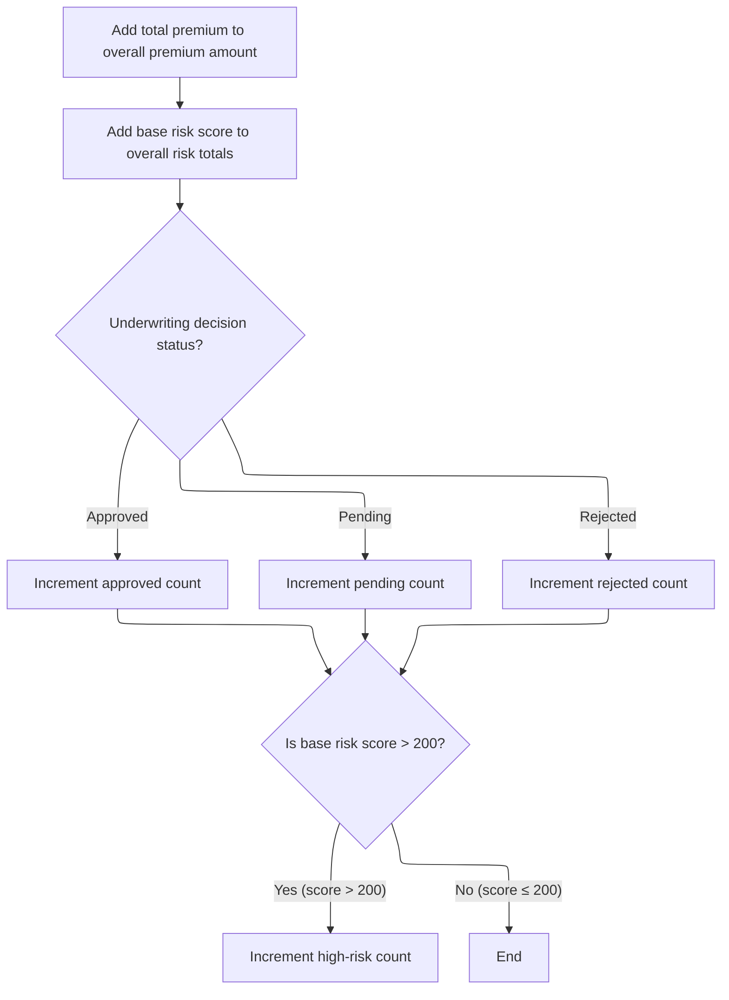

This section is responsible for maintaining up-to-date aggregate statistics for all processed policies, including total premium, risk score totals, and counts for underwriting decisions and high-risk policies.

| Category        | Rule Name                        | Description                                                                                                                                              |
| --------------- | -------------------------------- | -------------------------------------------------------------------------------------------------------------------------------------------------------- |
| Data validation | Aggregate counter initialization | All aggregate counters (approved, pending, rejected, high-risk, total premium, total risk score) must be initialized to zero at the start of processing. |
| Business logic  | Aggregate premium update         | The total premium amount for all processed policies must be updated by adding the current policy's premium to the running total.                         |
| Business logic  | Aggregate risk score update      | The aggregate risk score for all processed policies must be updated by adding the current policy's base risk score to the running total.                 |
| Business logic  | Underwriting decision count      | The system must increment the count of approved, pending, or rejected policies based on the underwriting decision status of the current policy.          |
| Business logic  | High-risk policy tracking        | If the base risk score of the current policy is greater than 200, the system must increment the high-risk policy count.                                  |

<SwmSnippet path="/base/src/LGAPDB01.cbl" line="365">

---

In <SwmToken path="base/src/LGAPDB01.cbl" pos="365:1:5" line-data="       P011F-UPDATE-STATISTICS.">`P011F-UPDATE-STATISTICS`</SwmToken>, the function adds the current policy's premium and risk score to the totals, then increments the approved, pending, or rejected counter based on <SwmToken path="base/src/LGAPDB01.cbl" pos="369:3:5" line-data="           EVALUATE WS-STAT">`WS-STAT`</SwmToken>'s value.

```cobol
       P011F-UPDATE-STATISTICS.
           ADD WS-TOT-PREM TO WS-TOTAL-PREMIUM-AMT
           ADD WS-BASE-RISK-SCR TO WS-CONTROL-TOTALS
           
           EVALUATE WS-STAT
               WHEN 0 ADD 1 TO WS-APPROVED-CNT
               WHEN 1 ADD 1 TO WS-PENDING-CNT
               WHEN 2 ADD 1 TO WS-REJECTED-CNT
           END-EVALUATE
```

---

</SwmSnippet>

<SwmSnippet path="/base/src/LGAPDB01.cbl" line="375">

---

At the end of <SwmToken path="base/src/LGAPDB01.cbl" pos="266:3:7" line-data="           PERFORM P011F-UPDATE-STATISTICS.">`P011F-UPDATE-STATISTICS`</SwmToken>, if the base risk score is over 200, the function increments the high risk counter. This lets the system track how many high risk policies are processed.

```cobol
           IF WS-BASE-RISK-SCR > 200
               ADD 1 TO WS-HIGH-RISK-CNT
           END-IF.
```

---

</SwmSnippet>

&nbsp;

*This is an auto-generated document by Swimm 🌊 and has not yet been verified by a human*

<SwmMeta version="3.0.0" repo-id="Z2l0aHViJTNBJTNBU3dpbW1pby1nZW5hcHAtbW90b3IlM0ElM0FHaXJpLVN3aW1t" repo-name="Swimmio-genapp-motor"><sup>Powered by [Swimm](https://app.swimm.io/)</sup></SwmMeta>
