# Overview

This document describes the flow for calculating insurance risk premiums. The process gathers risk factors, determines application eligibility, calculates premiums for multiple perils, and applies a discount for full coverage.


## Dependencies

### Copybook

- SQLCA

# Where is this program used?

This program is used once, as represented in the following diagram:


## Input and Output Tables/Files used in the Program

| Table / File Name                                                                                                          | Type | Description                                                  | Usage Mode | Key Fields / Layout Highlights                                                                                                                                                                                                                                                                               |
| -------------------------------------------------------------------------------------------------------------------------- | ---- | ------------------------------------------------------------ | ---------- | ------------------------------------------------------------------------------------------------------------------------------------------------------------------------------------------------------------------------------------------------------------------------------------------------------------ |
| <SwmToken path="base/src/LGAPDB03.cbl" pos="51:3:3" line-data="               FROM RISK_FACTORS">`RISK_FACTORS`</SwmToken> | DB2  | Peril-specific risk factor values for insurance calculations | Input      | <SwmToken path="base/src/LGAPDB03.cbl" pos="50:8:12" line-data="               SELECT FACTOR_VALUE INTO :WS-FIRE-FACTOR">`WS-FIRE-FACTOR`</SwmToken>, <SwmToken path="base/src/LGAPDB03.cbl" pos="62:8:12" line-data="               SELECT FACTOR_VALUE INTO :WS-CRIME-FACTOR">`WS-CRIME-FACTOR`</SwmToken> |

&nbsp;

# Workflow

# Orchestrating the Insurance Calculation Steps


This section coordinates the main steps required to process an insurance application, ensuring that risk factors are gathered before making a verdict and calculating premiums only for approved applications.

| Category        | Rule Name                                     | Description                                                                                                      |
| --------------- | --------------------------------------------- | ---------------------------------------------------------------------------------------------------------------- |
| Data validation | Mandatory risk factor gathering               | Risk factors for fire and crime must be gathered before any verdict or premium calculation is performed.         |
| Data validation | Verdict before premium calculation            | An application must receive a verdict (approved or declined) before any premium calculation is performed.        |
| Business logic  | Declined application termination              | If the application is declined, no premium calculation is performed and the process ends with a declined status. |
| Business logic  | Premium calculation for approved applications | If the application is approved, insurance premiums must be calculated using the gathered risk factors.           |

<SwmSnippet path="/base/src/LGAPDB03.cbl" line="42">

---

<SwmToken path="base/src/LGAPDB03.cbl" pos="42:1:3" line-data="       MAIN-LOGIC.">`MAIN-LOGIC`</SwmToken> kicks off the whole process: it first calls <SwmToken path="base/src/LGAPDB03.cbl" pos="43:3:7" line-data="           PERFORM GET-RISK-FACTORS">`GET-RISK-FACTORS`</SwmToken> to fetch the fire and crime risk factors, which are needed for all subsequent calculations. We call <SwmToken path="base/src/LGAPDB03.cbl" pos="43:3:7" line-data="           PERFORM GET-RISK-FACTORS">`GET-RISK-FACTORS`</SwmToken> first because both the verdict and premium calculations rely on these values being set, either from the database or defaults. After that, it moves on to calculating the verdict and then the premiums.

```cobol
       MAIN-LOGIC.
           PERFORM GET-RISK-FACTORS
           PERFORM CALCULATE-VERDICT
           PERFORM CALCULATE-PREMIUMS
           GOBACK.
```

---

</SwmSnippet>

# Fetching and Handling Risk Factors


This section ensures that risk factor values for 'FIRE' and 'CRIME' are always available for further processing, either by retrieving them from the database or by applying default values when necessary.

| Category       | Rule Name                  | Description                                                                                                                                                                                                                                              |
| -------------- | -------------------------- | -------------------------------------------------------------------------------------------------------------------------------------------------------------------------------------------------------------------------------------------------------- |
| Business logic | Database FIRE risk factor  | If the risk factor for 'FIRE' is available in the database, use the database value for all subsequent calculations.                                                                                                                                      |
| Business logic | Default FIRE risk factor   | If the risk factor for 'FIRE' is not available in the database, use the default value of <SwmToken path="base/src/LGAPDB03.cbl" pos="58:3:5" line-data="               MOVE 0.80 TO WS-FIRE-FACTOR">`0.80`</SwmToken> for all subsequent calculations.   |
| Business logic | Database CRIME risk factor | If the risk factor for 'CRIME' is available in the database, use the database value for all subsequent calculations.                                                                                                                                     |
| Business logic | Default CRIME risk factor  | If the risk factor for 'CRIME' is not available in the database, use the default value of <SwmToken path="base/src/LGAPDB03.cbl" pos="70:3:5" line-data="               MOVE 0.60 TO WS-CRIME-FACTOR">`0.60`</SwmToken> for all subsequent calculations. |

<SwmSnippet path="/base/src/LGAPDB03.cbl" line="48">

---

In <SwmToken path="base/src/LGAPDB03.cbl" pos="48:1:5" line-data="       GET-RISK-FACTORS.">`GET-RISK-FACTORS`</SwmToken>, we start by querying the <SwmToken path="base/src/LGAPDB03.cbl" pos="51:3:3" line-data="               FROM RISK_FACTORS">`RISK_FACTORS`</SwmToken> table for the 'FIRE' peril type. If the value is found, we use it; otherwise, we'll handle the fallback in the next step. This assumes the database has an entry for 'FIRE', but if not, we have a default ready.

```cobol
       GET-RISK-FACTORS.
           EXEC SQL
               SELECT FACTOR_VALUE INTO :WS-FIRE-FACTOR
               FROM RISK_FACTORS
               WHERE PERIL_TYPE = 'FIRE'
           END-EXEC.
```

---

</SwmSnippet>

<SwmSnippet path="/base/src/LGAPDB03.cbl" line="55">

---

If the fire risk factor isn't found in the database, we just set it to <SwmToken path="base/src/LGAPDB03.cbl" pos="58:3:5" line-data="               MOVE 0.80 TO WS-FIRE-FACTOR">`0.80`</SwmToken> and move on. This keeps the flow going even if the data isn't there.

```cobol
           IF SQLCODE = 0
               CONTINUE
           ELSE
               MOVE 0.80 TO WS-FIRE-FACTOR
           END-IF.
```

---

</SwmSnippet>

<SwmSnippet path="/base/src/LGAPDB03.cbl" line="61">

---

After handling 'FIRE', we do the same thing for 'CRIME'—query the database for its factor value. The next step will handle the fallback if this isn't found.

```cobol
           EXEC SQL
               SELECT FACTOR_VALUE INTO :WS-CRIME-FACTOR
               FROM RISK_FACTORS
               WHERE PERIL_TYPE = 'CRIME'
           END-EXEC.
```

---

</SwmSnippet>

<SwmSnippet path="/base/src/LGAPDB03.cbl" line="67">

---

If the crime factor isn't found, we set it to <SwmToken path="base/src/LGAPDB03.cbl" pos="70:3:5" line-data="               MOVE 0.60 TO WS-CRIME-FACTOR">`0.60`</SwmToken>. At this point, both fire and crime factors are set—either from the DB or defaults—and ready for the next calculation steps.

```cobol
           IF SQLCODE = 0
               CONTINUE
           ELSE
               MOVE 0.60 TO WS-CRIME-FACTOR
           END-IF.
```

---

</SwmSnippet>

# Premium Calculation and Discount Application

```mermaid
%%{init: {"flowchart": {"defaultRenderer": "elk"}} }%%
flowchart TD
    node1["Set discount factor to 1.00"] --> node2{"Are fire, crime, flood, and weather perils all present?"}
    click node1 openCode "base/src/LGAPDB03.cbl:93:93"
    click node2 openCode "base/src/LGAPDB03.cbl:95:98"
    node2 -->|"Yes"| node3["Set discount factor to 0.90"]
    click node3 openCode "base/src/LGAPDB03.cbl:99:99"
    node2 -->|"No"| node4["Use discount factor 1.00"]
    click node4 openCode "base/src/LGAPDB03.cbl:93:93"
    node3 --> node5["Calculate premiums for each peril:
Fire: risk score × 0.80 × fire peril × discount
Crime: risk score × 0.60 × crime peril × discount
Flood: risk score × 1.20 × flood peril × discount
Weather: risk score × 0.90 × weather peril × discount"]
    node4 --> node5
    click node5 openCode "base/src/LGAPDB03.cbl:102:116"
    node5 --> node6["Sum all premiums for total premium"]
    click node6 openCode "base/src/LGAPDB03.cbl:118:120"
classDef HeadingStyle fill:#777777,stroke:#333,stroke-width:2px;

%% Swimm:
%% %%{init: {"flowchart": {"defaultRenderer": "elk"}} }%%
%% flowchart TD
%%     node1["Set discount factor to <SwmToken path="base/src/LGAPDB03.cbl" pos="93:3:5" line-data="           MOVE 1.00 TO LK-DISC-FACT">`1.00`</SwmToken>"] --> node2{"Are fire, crime, flood, and weather perils all present?"}
%%     click node1 openCode "<SwmPath>[base/src/LGAPDB03.cbl](base/src/LGAPDB03.cbl)</SwmPath>:93:93"
%%     click node2 openCode "<SwmPath>[base/src/LGAPDB03.cbl](base/src/LGAPDB03.cbl)</SwmPath>:95:98"
%%     node2 -->|"Yes"| node3["Set discount factor to <SwmToken path="base/src/LGAPDB03.cbl" pos="99:3:5" line-data="             MOVE 0.90 TO LK-DISC-FACT">`0.90`</SwmToken>"]
%%     click node3 openCode "<SwmPath>[base/src/LGAPDB03.cbl](base/src/LGAPDB03.cbl)</SwmPath>:99:99"
%%     node2 -->|"No"| node4["Use discount factor <SwmToken path="base/src/LGAPDB03.cbl" pos="93:3:5" line-data="           MOVE 1.00 TO LK-DISC-FACT">`1.00`</SwmToken>"]
%%     click node4 openCode "<SwmPath>[base/src/LGAPDB03.cbl](base/src/LGAPDB03.cbl)</SwmPath>:93:93"
%%     node3 --> node5["Calculate premiums for each peril:
%% Fire: risk score × <SwmToken path="base/src/LGAPDB03.cbl" pos="58:3:5" line-data="               MOVE 0.80 TO WS-FIRE-FACTOR">`0.80`</SwmToken> × fire peril × discount
%% Crime: risk score × <SwmToken path="base/src/LGAPDB03.cbl" pos="70:3:5" line-data="               MOVE 0.60 TO WS-CRIME-FACTOR">`0.60`</SwmToken> × crime peril × discount
%% Flood: risk score × <SwmToken path="base/src/LGAPDB03.cbl" pos="16:15:17" line-data="       01  WS-FLOOD-FACTOR             PIC V99 VALUE 1.20.">`1.20`</SwmToken> × flood peril × discount
%% Weather: risk score × <SwmToken path="base/src/LGAPDB03.cbl" pos="99:3:5" line-data="             MOVE 0.90 TO LK-DISC-FACT">`0.90`</SwmToken> × weather peril × discount"]
%%     node4 --> node5
%%     click node5 openCode "<SwmPath>[base/src/LGAPDB03.cbl](base/src/LGAPDB03.cbl)</SwmPath>:102:116"
%%     node5 --> node6["Sum all premiums for total premium"]
%%     click node6 openCode "<SwmPath>[base/src/LGAPDB03.cbl](base/src/LGAPDB03.cbl)</SwmPath>:118:120"
%% classDef HeadingStyle fill:#777777,stroke:#333,stroke-width:2px;
```



This section calculates insurance premiums for four perils (fire, crime, flood, weather) based on risk score, peril values, and fixed factors. A discount is applied if all perils are present, and the total premium is the sum of all individual premiums.

| Category        | Rule Name                       | Description                                                                                                                                                                                                                                                                                                                                                                                                                                                                                                                                                                                                                                                                                                   |
| --------------- | ------------------------------- | ------------------------------------------------------------------------------------------------------------------------------------------------------------------------------------------------------------------------------------------------------------------------------------------------------------------------------------------------------------------------------------------------------------------------------------------------------------------------------------------------------------------------------------------------------------------------------------------------------------------------------------------------------------------------------------------------------------- |
| Data validation | Discount eligibility validation | If any peril value is zero or missing, the discount factor remains at <SwmToken path="base/src/LGAPDB03.cbl" pos="93:3:5" line-data="           MOVE 1.00 TO LK-DISC-FACT">`1.00`</SwmToken> and no discount is applied.                                                                                                                                                                                                                                                                                                                                                                                                                                                                                      |
| Business logic  | Full coverage discount          | The discount factor must be set to <SwmToken path="base/src/LGAPDB03.cbl" pos="93:3:5" line-data="           MOVE 1.00 TO LK-DISC-FACT">`1.00`</SwmToken> unless all four peril values (fire, crime, flood, weather) are greater than zero, in which case the discount factor is set to <SwmToken path="base/src/LGAPDB03.cbl" pos="99:3:5" line-data="             MOVE 0.90 TO LK-DISC-FACT">`0.90`</SwmToken>.                                                                                                                                                                                                                                                                                             |
| Business logic  | Peril premium calculation       | Each peril premium is calculated using the formula: risk score × peril factor × peril value × discount factor. The peril factors are: Fire (<SwmToken path="base/src/LGAPDB03.cbl" pos="58:3:5" line-data="               MOVE 0.80 TO WS-FIRE-FACTOR">`0.80`</SwmToken>), Crime (<SwmToken path="base/src/LGAPDB03.cbl" pos="70:3:5" line-data="               MOVE 0.60 TO WS-CRIME-FACTOR">`0.60`</SwmToken>), Flood (<SwmToken path="base/src/LGAPDB03.cbl" pos="16:15:17" line-data="       01  WS-FLOOD-FACTOR             PIC V99 VALUE 1.20.">`1.20`</SwmToken>), Weather (<SwmToken path="base/src/LGAPDB03.cbl" pos="99:3:5" line-data="             MOVE 0.90 TO LK-DISC-FACT">`0.90`</SwmToken>). |
| Business logic  | Total premium aggregation       | The total premium is the sum of all individual peril premiums (fire, crime, flood, weather).                                                                                                                                                                                                                                                                                                                                                                                                                                                                                                                                                                                                                  |

<SwmSnippet path="/base/src/LGAPDB03.cbl" line="92">

---

In <SwmToken path="base/src/LGAPDB03.cbl" pos="92:1:3" line-data="       CALCULATE-PREMIUMS.">`CALCULATE-PREMIUMS`</SwmToken>, we start by setting the discount factor to <SwmToken path="base/src/LGAPDB03.cbl" pos="93:3:5" line-data="           MOVE 1.00 TO LK-DISC-FACT">`1.00`</SwmToken>. If all peril values are greater than zero, we drop it to <SwmToken path="base/src/LGAPDB03.cbl" pos="99:3:5" line-data="             MOVE 0.90 TO LK-DISC-FACT">`0.90`</SwmToken>, applying a 10% discount for full coverage. This discount directly affects the premium calculations that follow.

```cobol
       CALCULATE-PREMIUMS.
           MOVE 1.00 TO LK-DISC-FACT
           
           IF LK-FIRE-PERIL > 0 AND
              LK-CRIME-PERIL > 0 AND
              LK-FLOOD-PERIL > 0 AND
              LK-WEATHER-PERIL > 0
             MOVE 0.90 TO LK-DISC-FACT
           END-IF
```

---

</SwmSnippet>

<SwmSnippet path="/base/src/LGAPDB03.cbl" line="102">

---

Each peril premium is calculated using its own factor, the risk score, the peril value, and the discount. Then, we sum up all four to get the total premium. This wraps up the premium calculation step.

```cobol
           COMPUTE LK-FIRE-PREMIUM =
             ((LK-RISK-SCORE * WS-FIRE-FACTOR) * LK-FIRE-PERIL *
               LK-DISC-FACT)
           
           COMPUTE LK-CRIME-PREMIUM =
             ((LK-RISK-SCORE * WS-CRIME-FACTOR) * LK-CRIME-PERIL *
               LK-DISC-FACT)
           
           COMPUTE LK-FLOOD-PREMIUM =
             ((LK-RISK-SCORE * WS-FLOOD-FACTOR) * LK-FLOOD-PERIL *
               LK-DISC-FACT)
           
           COMPUTE LK-WEATHER-PREMIUM =
             ((LK-RISK-SCORE * WS-WEATHER-FACTOR) * LK-WEATHER-PERIL *
               LK-DISC-FACT)

           COMPUTE LK-TOTAL-PREMIUM = 
             LK-FIRE-PREMIUM + LK-CRIME-PREMIUM + 
             LK-FLOOD-PREMIUM + LK-WEATHER-PREMIUM. 
```

---

</SwmSnippet>

&nbsp;

*This is an auto-generated document by Swimm 🌊 and has not yet been verified by a human*

<SwmMeta version="3.0.0" repo-id="Z2l0aHViJTNBJTNBU3dpbW1pby1nZW5hcHAtbW90b3IlM0ElM0FHaXJpLVN3aW1t" repo-name="Swimmio-genapp-motor"><sup>Powered by [Swimm](https://app.swimm.io/)</sup></SwmMeta>
