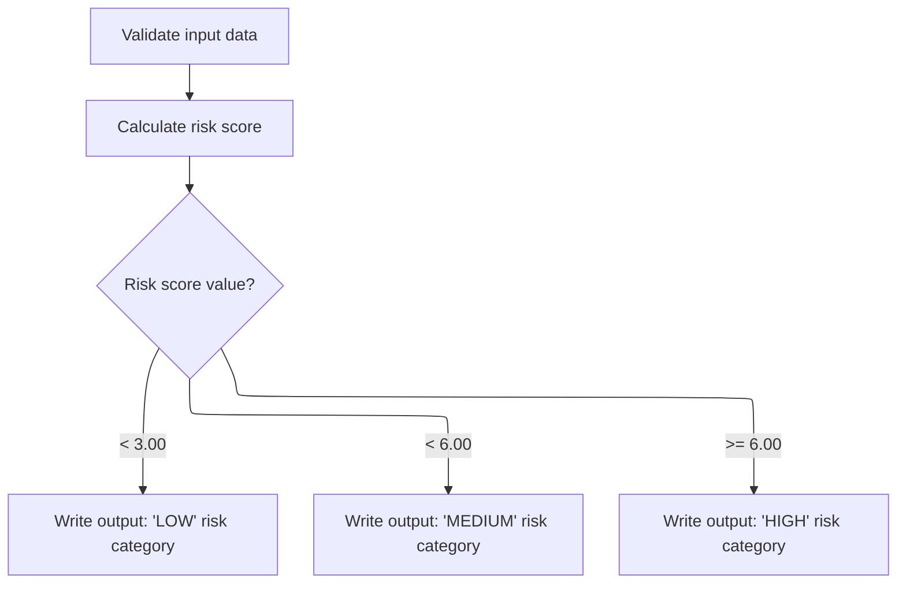

# Overview

This document explains the flow for evaluating property insurance policies. Each policy record is validated, scored for risk based on key factors, and categorized for output.

## Dependencies

### Program

- RISKPROG (<SwmPath>[base/src/lgarsk01.cbl](base/src/lgarsk01.cbl)</SwmPath>)

## Input and Output Tables/Files used in the Program

| Table / File Name                                                                                                                       | Type | Description                          | Usage Mode | Key Fields / Layout Highlights |
| --------------------------------------------------------------------------------------------------------------------------------------- | ---- | ------------------------------------ | ---------- | ------------------------------ |
| <SwmToken path="base/src/lgarsk01.cbl" pos="12:3:5" line-data="           SELECT ERROR-FILE ASSIGN TO ERRFILE">`ERROR-FILE`</SwmToken>  | File | Policy processing error logs         | Output     | File resource                  |
| <SwmToken path="base/src/lgarsk01.cbl" pos="88:3:5" line-data="               WRITE ERROR-RECORD">`ERROR-RECORD`</SwmToken>             | File | Error details for a specific policy  | Output     | File resource                  |
| <SwmToken path="base/src/lgarsk01.cbl" pos="80:3:5" line-data="           READ INPUT-FILE">`INPUT-FILE`</SwmToken>                      | File | Insurance policy risk input records  | Input      | File resource                  |
| <SwmToken path="base/src/lgarsk01.cbl" pos="9:3:5" line-data="           SELECT OUTPUT-FILE ASSIGN TO OUTFILE">`OUTPUT-FILE`</SwmToken> | File | Calculated risk scores for policies  | Output     | File resource                  |
| <SwmToken path="base/src/lgarsk01.cbl" pos="154:3:5" line-data="           WRITE OUTPUT-RECORD.">`OUTPUT-RECORD`</SwmToken>             | File | Risk score and category for a policy | Output     | File resource                  |

&nbsp;

## Detailed View of the Program's Functionality

a. Program Initialization and Main Loop

When the program starts, it first sets up all necessary resources. This includes opening the input, output, and error files. If there is any issue opening the input file, an error message is displayed and the program is flagged to stop further processing.

After initialization, the program enters its main processing loop. In this loop, it repeatedly processes each input record one by one. The loop continues until the end-of-file condition is reached for the input file. For each iteration, the program reads the next record, validates it, calculates the risk score, and writes the output. If an error or end-of-file is encountered, the loop exits.

Once all records have been processed, the program closes all files and exits cleanly.

b. Reading and Validating Input Records

For each record in the input file, the program attempts to read the data. If the end of the file is reached, it marks the process as complete and exits the current processing routine. If there is an error reading the record, it logs the error by writing the policy number and an error message to the error file, then skips further processing for that record.

After successfully reading a record, the program validates the policy number. If the policy number is missing or invalid, it writes an error message to the error file and skips further processing for that record.

c. Computing Property Risk Score

Once a record is validated, the program calculates the risk score for the property. This calculation is performed in several steps:

- The property type is checked, and a base risk factor is assigned. Different property types (such as office, retail, warehouse, industrial, or other) have different base risk values.
- The number of claims associated with the policy is evaluated. If there are no claims, a lower claim factor is used. If there are one or two claims, a moderate claim factor is applied. If there are more than two claims, a higher claim factor is used.
- The location factor is calculated as a weighted sum of several risk parameters: fire peril rate, crime peril rate, flood peril rate, and weather peril rate. Each parameter contributes a specific weight to the total location factor.
- The final risk score is computed by multiplying the base risk factor, the claim factor, and the location factor. If the resulting score exceeds a maximum threshold (<SwmToken path="base/src/lgarsk01.cbl" pos="138:11:13" line-data="           IF WS-F-RSK &gt; 9.99">`9.99`</SwmToken>), it is capped at that value.

d. Writing Output After Risk Calculation

After the risk score is calculated, the program prepares the output record. It copies the policy number and the calculated risk score to the output record.

The risk score is then categorized into one of three risk levels:

- If the score is less than <SwmToken path="base/src/lgarsk01.cbl" pos="147:11:13" line-data="               WHEN WS-F-RSK &lt; 3.00">`3.00`</SwmToken>, the risk category is set to "LOW".
- If the score is less than <SwmToken path="base/src/lgarsk01.cbl" pos="149:11:13" line-data="               WHEN WS-F-RSK &lt; 6.00">`6.00`</SwmToken> but at least <SwmToken path="base/src/lgarsk01.cbl" pos="147:11:13" line-data="               WHEN WS-F-RSK &lt; 3.00">`3.00`</SwmToken>, the risk category is set to "MEDIUM".
- If the score is <SwmToken path="base/src/lgarsk01.cbl" pos="149:11:13" line-data="               WHEN WS-F-RSK &lt; 6.00">`6.00`</SwmToken> or higher, the risk category is set to "HIGH".

The output record, containing the policy number, risk score, and risk category, is then written to the output file. This categorization allows downstream systems to interpret the risk level associated with each policy.

e. Closing Resources

After all records have been processed and written, the program closes all open files (input, output, and error files) to ensure that resources are released and data is properly saved. The program then exits.

# Rule Definition

| Paragraph Name                                                                                                                                                                                                                                                 | Rule ID | Category          | Description                                                                                                                                                                        | Conditions                                                               | Remarks                                                                                                                                                                                                                                                                                                                                                                                                                                                                                                                                                                                                                                                                                              |
| -------------------------------------------------------------------------------------------------------------------------------------------------------------------------------------------------------------------------------------------------------------- | ------- | ----------------- | ---------------------------------------------------------------------------------------------------------------------------------------------------------------------------------- | ------------------------------------------------------------------------ | ---------------------------------------------------------------------------------------------------------------------------------------------------------------------------------------------------------------------------------------------------------------------------------------------------------------------------------------------------------------------------------------------------------------------------------------------------------------------------------------------------------------------------------------------------------------------------------------------------------------------------------------------------------------------------------------------------- |
| <SwmToken path="base/src/lgarsk01.cbl" pos="64:1:3" line-data="       0000-MAIN.">`0000-MAIN`</SwmToken>, <SwmToken path="base/src/lgarsk01.cbl" pos="66:3:5" line-data="           PERFORM 2000-PROCESS UNTIL WS-EOF = &#39;Y&#39;">`2000-PROCESS`</SwmToken> | RL-001  | Conditional Logic | Process each input record one by one until the end of the input file is reached.                                                                                                   | Input file is open and not at end-of-file.                               | No constants. Sequential logic ensures all records are processed.                                                                                                                                                                                                                                                                                                                                                                                                                                                                                                                                                                                                                                    |
| <SwmToken path="base/src/lgarsk01.cbl" pos="92:3:7" line-data="           PERFORM 2100-VALIDATE-DATA">`2100-VALIDATE-DATA`</SwmToken>                                                                                                                          | RL-002  | Conditional Logic | Each input record must have a non-empty policy number before processing.                                                                                                           | Input record is read; policy number field is checked for spaces (empty). | Policy number is a string, 10 characters, left-justified.                                                                                                                                                                                                                                                                                                                                                                                                                                                                                                                                                                                                                                            |
| <SwmToken path="base/src/lgarsk01.cbl" pos="93:3:7" line-data="           PERFORM 2200-CALCULATE-RISK">`2200-CALCULATE-RISK`</SwmToken>                                                                                                                        | RL-003  | Data Assignment   | Assign base risk factor according to property type.                                                                                                                                | Input record is valid; property type field is evaluated.                 | Constants: OFFICE=<SwmToken path="base/src/lgarsk01.cbl" pos="110:3:5" line-data="                   MOVE 1.00 TO WS-BS-RS">`1.00`</SwmToken>, RETAIL=<SwmToken path="base/src/lgarsk01.cbl" pos="112:3:5" line-data="                   MOVE 1.25 TO WS-BS-RS">`1.25`</SwmToken>, WAREHOUSE=<SwmToken path="base/src/lgarsk01.cbl" pos="114:3:5" line-data="                   MOVE 1.50 TO WS-BS-RS">`1.50`</SwmToken>, INDUSTRIAL=<SwmToken path="base/src/lgarsk01.cbl" pos="116:3:5" line-data="                   MOVE 2.00 TO WS-BS-RS">`2.00`</SwmToken>, OTHER=<SwmToken path="base/src/lgarsk01.cbl" pos="118:3:5" line-data="                   MOVE 1.75 TO WS-BS-RS">`1.75`</SwmToken>. |
| <SwmToken path="base/src/lgarsk01.cbl" pos="93:3:7" line-data="           PERFORM 2200-CALCULATE-RISK">`2200-CALCULATE-RISK`</SwmToken>                                                                                                                        | RL-004  | Data Assignment   | Assign claim factor based on the number of claims.                                                                                                                                 | Input record is valid; claim count field is evaluated.                   | Constants: 0 claims=<SwmToken path="base/src/lgarsk01.cbl" pos="122:3:5" line-data="               MOVE 0.80 TO WS-CL-F">`0.80`</SwmToken>, 1-2 claims=<SwmToken path="base/src/lgarsk01.cbl" pos="124:3:5" line-data="               MOVE 1.30 TO WS-CL-F">`1.30`</SwmToken>, >2 claims=<SwmToken path="base/src/lgarsk01.cbl" pos="114:3:5" line-data="                   MOVE 1.50 TO WS-BS-RS">`1.50`</SwmToken>.                                                                                                                                                                                                                                                                                |
| <SwmToken path="base/src/lgarsk01.cbl" pos="93:3:7" line-data="           PERFORM 2200-CALCULATE-RISK">`2200-CALCULATE-RISK`</SwmToken>                                                                                                                        | RL-005  | Computation       | Calculate location factor using peril rates from the input record.                                                                                                                 | Input record is valid; peril rate fields are present.                    | location_factor = 1 + (fire_peril_rate \* <SwmToken path="base/src/lgarsk01.cbl" pos="130:10:12" line-data="               (IN-FR-PR * 0.2) +">`0.2`</SwmToken>) + (crime_peril_rate \* <SwmToken path="base/src/lgarsk01.cbl" pos="130:10:12" line-data="               (IN-FR-PR * 0.2) +">`0.2`</SwmToken>) + (flood_peril_rate \* <SwmToken path="base/src/lgarsk01.cbl" pos="132:10:12" line-data="               (IN-FL-PR * 0.3) +">`0.3`</SwmToken>) + (weather_peril_rate \* <SwmToken path="base/src/lgarsk01.cbl" pos="130:10:12" line-data="               (IN-FR-PR * 0.2) +">`0.2`</SwmToken>). All rates are integers.                                                                |
| <SwmToken path="base/src/lgarsk01.cbl" pos="93:3:7" line-data="           PERFORM 2200-CALCULATE-RISK">`2200-CALCULATE-RISK`</SwmToken>                                                                                                                        | RL-006  | Computation       | Calculate risk score and cap it at <SwmToken path="base/src/lgarsk01.cbl" pos="138:11:13" line-data="           IF WS-F-RSK &gt; 9.99">`9.99`</SwmToken> if it exceeds this value. | Base risk, claim factor, and location factor have been computed.         | risk_score = base_risk \* claim_factor \* location_factor; capped at <SwmToken path="base/src/lgarsk01.cbl" pos="138:11:13" line-data="           IF WS-F-RSK &gt; 9.99">`9.99`</SwmToken>. Output format: decimal with two digits after decimal point, padded to 6 characters.                                                                                                                                                                                                                                                                                                                                                                                                                      |
| <SwmToken path="base/src/lgarsk01.cbl" pos="94:3:7" line-data="           PERFORM 2300-WRITE-OUTPUT">`2300-WRITE-OUTPUT`</SwmToken>                                                                                                                            | RL-007  | Conditional Logic | Assign risk category string based on risk score.                                                                                                                                   | Risk score has been calculated.                                          | LOW: risk_score < <SwmToken path="base/src/lgarsk01.cbl" pos="147:11:13" line-data="               WHEN WS-F-RSK &lt; 3.00">`3.00`</SwmToken>; MEDIUM: risk_score < <SwmToken path="base/src/lgarsk01.cbl" pos="149:11:13" line-data="               WHEN WS-F-RSK &lt; 6.00">`6.00`</SwmToken>; HIGH: risk_score >= <SwmToken path="base/src/lgarsk01.cbl" pos="149:11:13" line-data="               WHEN WS-F-RSK &lt; 6.00">`6.00`</SwmToken>. Output format: string, left-justified, padded to 10 characters.                                                                                                                                                                                    |
| <SwmToken path="base/src/lgarsk01.cbl" pos="94:3:7" line-data="           PERFORM 2300-WRITE-OUTPUT">`2300-WRITE-OUTPUT`</SwmToken>                                                                                                                            | RL-008  | Data Assignment   | Format and write output record for each valid input record.                                                                                                                        | Risk score and category have been determined.                            | <SwmToken path="base/src/lgarsk01.cbl" pos="143:11:15" line-data="           MOVE IN-POLICY-NUM TO OUT-POLICY-NUM">`OUT-POLICY-NUM`</SwmToken>: string, left-justified, padded to 10 chars. <SwmToken path="base/src/lgarsk01.cbl" pos="144:11:15" line-data="           MOVE WS-F-RSK TO OUT-RISK-SCORE">`OUT-RISK-SCORE`</SwmToken>: decimal, 2 digits after decimal, padded to 6 chars. <SwmToken path="base/src/lgarsk01.cbl" pos="148:10:14" line-data="                   MOVE &#39;LOW      &#39; TO OUT-RISK-CATEGORY">`OUT-RISK-CATEGORY`</SwmToken>: string, left-justified, padded to 10 chars. FILLER: 75 spaces. Output record: 100 characters.                                         |

# User Stories

## User Story 1: Sequential processing and validation of input records

---

### Story Description:

As a system, I want to process each input record sequentially and validate that each has a non-empty policy number so that only valid records are considered for risk assessment.

---

### Business Rule Mapping:

| Rule ID | Paragraph Name                                                                                                                                                                                                                                                 | Rule Description                                                                 |
| ------- | -------------------------------------------------------------------------------------------------------------------------------------------------------------------------------------------------------------------------------------------------------------- | -------------------------------------------------------------------------------- |
| RL-001  | <SwmToken path="base/src/lgarsk01.cbl" pos="64:1:3" line-data="       0000-MAIN.">`0000-MAIN`</SwmToken>, <SwmToken path="base/src/lgarsk01.cbl" pos="66:3:5" line-data="           PERFORM 2000-PROCESS UNTIL WS-EOF = &#39;Y&#39;">`2000-PROCESS`</SwmToken> | Process each input record one by one until the end of the input file is reached. |
| RL-002  | <SwmToken path="base/src/lgarsk01.cbl" pos="92:3:7" line-data="           PERFORM 2100-VALIDATE-DATA">`2100-VALIDATE-DATA`</SwmToken>                                                                                                                          | Each input record must have a non-empty policy number before processing.         |

---

### Relevant Functionality:

- <SwmToken path="base/src/lgarsk01.cbl" pos="64:1:3" line-data="       0000-MAIN.">`0000-MAIN`</SwmToken>
  1. **RL-001:**
     - Open input, output, and error files.
     - Loop: Read next input record.
       - If end-of-file, exit loop.
       - Otherwise, process record.
- <SwmToken path="base/src/lgarsk01.cbl" pos="92:3:7" line-data="           PERFORM 2100-VALIDATE-DATA">`2100-VALIDATE-DATA`</SwmToken>
  1. **RL-002:**
     - If policy number is empty (all spaces):
       - Write error record with message 'INVALID POLICY NUMBER'.
       - Skip further processing for this record.

## User Story 2: Risk score calculation for valid records

---

### Story Description:

As a system, I want to calculate a risk score for each valid input record using property type, claim count, and peril rates, and cap the score at <SwmToken path="base/src/lgarsk01.cbl" pos="138:11:13" line-data="           IF WS-F-RSK &gt; 9.99">`9.99`</SwmToken> so that risk is assessed accurately and consistently.

---

### Business Rule Mapping:

| Rule ID | Paragraph Name                                                                                                                          | Rule Description                                                                                                                                                                   |
| ------- | --------------------------------------------------------------------------------------------------------------------------------------- | ---------------------------------------------------------------------------------------------------------------------------------------------------------------------------------- |
| RL-003  | <SwmToken path="base/src/lgarsk01.cbl" pos="93:3:7" line-data="           PERFORM 2200-CALCULATE-RISK">`2200-CALCULATE-RISK`</SwmToken> | Assign base risk factor according to property type.                                                                                                                                |
| RL-004  | <SwmToken path="base/src/lgarsk01.cbl" pos="93:3:7" line-data="           PERFORM 2200-CALCULATE-RISK">`2200-CALCULATE-RISK`</SwmToken> | Assign claim factor based on the number of claims.                                                                                                                                 |
| RL-005  | <SwmToken path="base/src/lgarsk01.cbl" pos="93:3:7" line-data="           PERFORM 2200-CALCULATE-RISK">`2200-CALCULATE-RISK`</SwmToken> | Calculate location factor using peril rates from the input record.                                                                                                                 |
| RL-006  | <SwmToken path="base/src/lgarsk01.cbl" pos="93:3:7" line-data="           PERFORM 2200-CALCULATE-RISK">`2200-CALCULATE-RISK`</SwmToken> | Calculate risk score and cap it at <SwmToken path="base/src/lgarsk01.cbl" pos="138:11:13" line-data="           IF WS-F-RSK &gt; 9.99">`9.99`</SwmToken> if it exceeds this value. |

---

### Relevant Functionality:

- <SwmToken path="base/src/lgarsk01.cbl" pos="93:3:7" line-data="           PERFORM 2200-CALCULATE-RISK">`2200-CALCULATE-RISK`</SwmToken>
  1. **RL-003:**
     - Evaluate property type:
       - OFFICE: base risk = <SwmToken path="base/src/lgarsk01.cbl" pos="110:3:5" line-data="                   MOVE 1.00 TO WS-BS-RS">`1.00`</SwmToken>
       - RETAIL: base risk = <SwmToken path="base/src/lgarsk01.cbl" pos="112:3:5" line-data="                   MOVE 1.25 TO WS-BS-RS">`1.25`</SwmToken>
       - WAREHOUSE: base risk = <SwmToken path="base/src/lgarsk01.cbl" pos="114:3:5" line-data="                   MOVE 1.50 TO WS-BS-RS">`1.50`</SwmToken>
       - INDUSTRIAL: base risk = <SwmToken path="base/src/lgarsk01.cbl" pos="116:3:5" line-data="                   MOVE 2.00 TO WS-BS-RS">`2.00`</SwmToken>
       - Any other: base risk = <SwmToken path="base/src/lgarsk01.cbl" pos="118:3:5" line-data="                   MOVE 1.75 TO WS-BS-RS">`1.75`</SwmToken>
  2. **RL-004:**
     - If claim count = 0: claim factor = <SwmToken path="base/src/lgarsk01.cbl" pos="122:3:5" line-data="               MOVE 0.80 TO WS-CL-F">`0.80`</SwmToken>
     - Else if claim count <= 2: claim factor = <SwmToken path="base/src/lgarsk01.cbl" pos="124:3:5" line-data="               MOVE 1.30 TO WS-CL-F">`1.30`</SwmToken>
     - Else: claim factor = <SwmToken path="base/src/lgarsk01.cbl" pos="114:3:5" line-data="                   MOVE 1.50 TO WS-BS-RS">`1.50`</SwmToken>
  3. **RL-005:**
     - location_factor = 1 + (fire_peril_rate \* <SwmToken path="base/src/lgarsk01.cbl" pos="130:10:12" line-data="               (IN-FR-PR * 0.2) +">`0.2`</SwmToken>) + (crime_peril_rate \* <SwmToken path="base/src/lgarsk01.cbl" pos="130:10:12" line-data="               (IN-FR-PR * 0.2) +">`0.2`</SwmToken>) + (flood_peril_rate \* <SwmToken path="base/src/lgarsk01.cbl" pos="132:10:12" line-data="               (IN-FL-PR * 0.3) +">`0.3`</SwmToken>) + (weather_peril_rate \* <SwmToken path="base/src/lgarsk01.cbl" pos="130:10:12" line-data="               (IN-FR-PR * 0.2) +">`0.2`</SwmToken>)
  4. **RL-006:**
     - risk_score = base_risk \* claim_factor \* location_factor
     - If risk_score > <SwmToken path="base/src/lgarsk01.cbl" pos="138:11:13" line-data="           IF WS-F-RSK &gt; 9.99">`9.99`</SwmToken>: set risk_score = <SwmToken path="base/src/lgarsk01.cbl" pos="138:11:13" line-data="           IF WS-F-RSK &gt; 9.99">`9.99`</SwmToken>

## User Story 3: Assign risk category and write formatted output record

---

### Story Description:

As a system, I want to assign a risk category based on the calculated risk score and write a formatted output record for each valid input so that results are clearly categorized and output meets specification.

---

### Business Rule Mapping:

| Rule ID | Paragraph Name                                                                                                                      | Rule Description                                            |
| ------- | ----------------------------------------------------------------------------------------------------------------------------------- | ----------------------------------------------------------- |
| RL-007  | <SwmToken path="base/src/lgarsk01.cbl" pos="94:3:7" line-data="           PERFORM 2300-WRITE-OUTPUT">`2300-WRITE-OUTPUT`</SwmToken> | Assign risk category string based on risk score.            |
| RL-008  | <SwmToken path="base/src/lgarsk01.cbl" pos="94:3:7" line-data="           PERFORM 2300-WRITE-OUTPUT">`2300-WRITE-OUTPUT`</SwmToken> | Format and write output record for each valid input record. |

---

### Relevant Functionality:

- <SwmToken path="base/src/lgarsk01.cbl" pos="94:3:7" line-data="           PERFORM 2300-WRITE-OUTPUT">`2300-WRITE-OUTPUT`</SwmToken>
  1. **RL-007:**
     - If risk_score < <SwmToken path="base/src/lgarsk01.cbl" pos="147:11:13" line-data="               WHEN WS-F-RSK &lt; 3.00">`3.00`</SwmToken>: risk_category = 'LOW      '
     - Else if risk_score < <SwmToken path="base/src/lgarsk01.cbl" pos="149:11:13" line-data="               WHEN WS-F-RSK &lt; 6.00">`6.00`</SwmToken>: risk_category = 'MEDIUM   '
     - Else: risk_category = 'HIGH     '
  2. **RL-008:**
     - Move policy number to output field, left-justified, pad to 10 chars
     - Move risk score to output field, format as decimal with 2 digits after decimal, pad to 6 chars
     - Move risk category to output field, left-justified, pad to 10 chars
     - Add filler of 75 spaces
     - Write output record

# Workflow

# Program Entry and Main Loop

```mermaid
%%{init: {"flowchart": {"defaultRenderer": "elk"}} }%%
flowchart TD
    node1["Initialize resources"] --> node2["Start processing loop"]
    click node1 openCode "base/src/lgarsk01.cbl:65:65"
    click node2 openCode "base/src/lgarsk01.cbl:66:66"
    subgraph loop1["Repeat until end-of-file"]
        node2 --> node3["Process next record"]
        click node3 openCode "base/src/lgarsk01.cbl:66:66"
        node3 --> node4{"Is WS-EOF = 'Y'?"}
        click node4 openCode "base/src/lgarsk01.cbl:66:66"
        node4 -->|"No"| node3
    end
    node4 -->|"Yes"| node5["Close resources and exit"]
    click node5 openCode "base/src/lgarsk01.cbl:67:68"

classDef HeadingStyle fill:#777777,stroke:#333,stroke-width:2px;

%% Swimm:
%% %%{init: {"flowchart": {"defaultRenderer": "elk"}} }%%
%% flowchart TD
%%     node1["Initialize resources"] --> node2["Start processing loop"]
%%     click node1 openCode "<SwmPath>[base/src/lgarsk01.cbl](base/src/lgarsk01.cbl)</SwmPath>:65:65"
%%     click node2 openCode "<SwmPath>[base/src/lgarsk01.cbl](base/src/lgarsk01.cbl)</SwmPath>:66:66"
%%     subgraph loop1["Repeat until end-of-file"]
%%         node2 --> node3["Process next record"]
%%         click node3 openCode "<SwmPath>[base/src/lgarsk01.cbl](base/src/lgarsk01.cbl)</SwmPath>:66:66"
%%         node3 --> node4{"Is <SwmToken path="base/src/lgarsk01.cbl" pos="66:9:11" line-data="           PERFORM 2000-PROCESS UNTIL WS-EOF = &#39;Y&#39;">`WS-EOF`</SwmToken> = 'Y'?"}
%%         click node4 openCode "<SwmPath>[base/src/lgarsk01.cbl](base/src/lgarsk01.cbl)</SwmPath>:66:66"
%%         node4 -->|"No"| node3
%%     end
%%     node4 -->|"Yes"| node5["Close resources and exit"]
%%     click node5 openCode "<SwmPath>[base/src/lgarsk01.cbl](base/src/lgarsk01.cbl)</SwmPath>:67:68"
%% 
%% classDef HeadingStyle fill:#777777,stroke:#333,stroke-width:2px;
```



The Program Entry and Main Loop section governs the lifecycle of the program, ensuring initialization, iterative record processing, and proper closure of resources.

| Category        | Rule Name                    | Description                                                                                                                                                                                                                                                                       |
| --------------- | ---------------------------- | --------------------------------------------------------------------------------------------------------------------------------------------------------------------------------------------------------------------------------------------------------------------------------- |
| Data validation | Resource Initialization      | The program must initialize all required resources before any record processing begins.                                                                                                                                                                                           |
| Data validation | End-of-File Check            | The program must check the end-of-file status (<SwmToken path="base/src/lgarsk01.cbl" pos="66:9:11" line-data="           PERFORM 2000-PROCESS UNTIL WS-EOF = &#39;Y&#39;">`WS-EOF`</SwmToken>) after each record is processed to determine whether to continue or exit the loop. |
| Business logic  | Sequential Record Processing | The program must process each input record in sequence until the end-of-file condition is met (<SwmToken path="base/src/lgarsk01.cbl" pos="66:9:11" line-data="           PERFORM 2000-PROCESS UNTIL WS-EOF = &#39;Y&#39;">`WS-EOF`</SwmToken> = 'Y').                            |

<SwmSnippet path="/base/src/lgarsk01.cbl" line="64">

---

<SwmToken path="base/src/lgarsk01.cbl" pos="64:1:3" line-data="       0000-MAIN.">`0000-MAIN`</SwmToken> kicks off the whole program: it sets up files, then loops through each input record by calling <SwmToken path="base/src/lgarsk01.cbl" pos="66:3:5" line-data="           PERFORM 2000-PROCESS UNTIL WS-EOF = &#39;Y&#39;">`2000-PROCESS`</SwmToken> until there are no more records (<SwmToken path="base/src/lgarsk01.cbl" pos="66:9:11" line-data="           PERFORM 2000-PROCESS UNTIL WS-EOF = &#39;Y&#39;">`WS-EOF`</SwmToken> = 'Y'), and finally closes everything. We call <SwmToken path="base/src/lgarsk01.cbl" pos="66:3:5" line-data="           PERFORM 2000-PROCESS UNTIL WS-EOF = &#39;Y&#39;">`2000-PROCESS`</SwmToken> next because that's where each record gets read, validated, scored, and output. This structure keeps file handling and record logic separate and makes error handling straightforward.

```cobol
       0000-MAIN.
           PERFORM 1000-INIT
           PERFORM 2000-PROCESS UNTIL WS-EOF = 'Y'
           PERFORM 3000-CLOSE
           GOBACK.
```

---

</SwmSnippet>

# Reading and Validating Input Records

This section ensures that only valid input records are processed for risk calculation and output. It handles end-of-file and read errors, validates the policy number, and only proceeds to risk calculation if the record passes validation.

| Category        | Rule Name                    | Description                                                                                    |
| --------------- | ---------------------------- | ---------------------------------------------------------------------------------------------- |
| Data validation | Policy Number Validation     | Only records with a valid policy number are processed for risk calculation and output writing. |
| Business logic  | Conditional Risk Calculation | Risk score calculation is performed only after the input record passes validation checks.      |

<SwmSnippet path="/base/src/lgarsk01.cbl" line="79">

---

In <SwmToken path="base/src/lgarsk01.cbl" pos="79:1:3" line-data="       2000-PROCESS.">`2000-PROCESS`</SwmToken>, we read a record, handle EOF or errors, and only continue if the record is valid.

```cobol
       2000-PROCESS.
           READ INPUT-FILE
               AT END MOVE 'Y' TO WS-EOF
               GO TO 2000-EXIT
           END-READ

           IF WS-INPUT-STATUS NOT = '00'
               MOVE IN-POLICY-NUM TO ERR-POLICY-NUM
               MOVE 'ERROR READING RECORD' TO ERR-MESSAGE
               WRITE ERROR-RECORD
               GO TO 2000-EXIT
           END-IF
```

---

</SwmSnippet>

<SwmSnippet path="/base/src/lgarsk01.cbl" line="92">

---

After reading and checking the record, we validate the policy number, then call <SwmToken path="base/src/lgarsk01.cbl" pos="93:3:7" line-data="           PERFORM 2200-CALCULATE-RISK">`2200-CALCULATE-RISK`</SwmToken> to compute the risk score. We need to call <SwmToken path="base/src/lgarsk01.cbl" pos="93:3:7" line-data="           PERFORM 2200-CALCULATE-RISK">`2200-CALCULATE-RISK`</SwmToken> here because the output depends on having a calculated risk score, which is only possible after validation.

```cobol
           PERFORM 2100-VALIDATE-DATA
           PERFORM 2200-CALCULATE-RISK
           PERFORM 2300-WRITE-OUTPUT
```

---

</SwmSnippet>

## Computing Property Risk Score

```mermaid
%%{init: {"flowchart": {"defaultRenderer": "elk"}} }%%
flowchart TD
    node1["Start risk calculation"] --> node2{"Property type?"}
    click node1 openCode "base/src/lgarsk01.cbl:107:108"
    node2 -->|"OFFICE (1.00)"| node3["Set base risk factor"]
    node2 -->|"RETAIL (1.25)"| node3
    node2 -->|"WAREHOUSE (1.50)"| node3
    node2 -->|"INDUSTRIAL (2.00)"| node3
    node2 -->|"OTHER (1.75)"| node3
    click node2 openCode "base/src/lgarsk01.cbl:108:119"
    click node3 openCode "base/src/lgarsk01.cbl:110:118"
    node3 --> node4{"Claim count?"}
    node4 -->|"0 (0.80)"| node5["Set claim factor"]
    node4 -->|"1-2 (1.30)"| node5
    node4 -->|"#gt;2 (1.50)"| node5
    click node4 openCode "base/src/lgarsk01.cbl:121:127"
    click node5 openCode "base/src/lgarsk01.cbl:122:126"
    node5 --> node6["Calculate location factor (fire, crime, flood, weather peril rates)"]
    click node6 openCode "base/src/lgarsk01.cbl:129:133"
    node6 --> node7["Calculate risk score: base risk × claim factor × location factor"]
    click node7 openCode "base/src/lgarsk01.cbl:135:136"
    node7 --> node8{"Is risk score > 9.99?"}
    click node8 openCode "base/src/lgarsk01.cbl:138:139"
    node8 -->|"Yes"| node9["Set risk score to 9.99"]
    click node9 openCode "base/src/lgarsk01.cbl:139:140"
    node8 -->|"No"| node10["Keep calculated risk score"]
    click node10 openCode "base/src/lgarsk01.cbl:135:136"
    node9 --> node11["Return risk score"]
    node10 --> node11
    click node11 openCode "base/src/lgarsk01.cbl:140:140"

classDef HeadingStyle fill:#777777,stroke:#333,stroke-width:2px;

%% Swimm:
%% %%{init: {"flowchart": {"defaultRenderer": "elk"}} }%%
%% flowchart TD
%%     node1["Start risk calculation"] --> node2{"Property type?"}
%%     click node1 openCode "<SwmPath>[base/src/lgarsk01.cbl](base/src/lgarsk01.cbl)</SwmPath>:107:108"
%%     node2 -->|"OFFICE (<SwmToken path="base/src/lgarsk01.cbl" pos="110:3:5" line-data="                   MOVE 1.00 TO WS-BS-RS">`1.00`</SwmToken>)"| node3["Set base risk factor"]
%%     node2 -->|"RETAIL (<SwmToken path="base/src/lgarsk01.cbl" pos="112:3:5" line-data="                   MOVE 1.25 TO WS-BS-RS">`1.25`</SwmToken>)"| node3
%%     node2 -->|"WAREHOUSE (<SwmToken path="base/src/lgarsk01.cbl" pos="114:3:5" line-data="                   MOVE 1.50 TO WS-BS-RS">`1.50`</SwmToken>)"| node3
%%     node2 -->|"INDUSTRIAL (<SwmToken path="base/src/lgarsk01.cbl" pos="116:3:5" line-data="                   MOVE 2.00 TO WS-BS-RS">`2.00`</SwmToken>)"| node3
%%     node2 -->|"OTHER (<SwmToken path="base/src/lgarsk01.cbl" pos="118:3:5" line-data="                   MOVE 1.75 TO WS-BS-RS">`1.75`</SwmToken>)"| node3
%%     click node2 openCode "<SwmPath>[base/src/lgarsk01.cbl](base/src/lgarsk01.cbl)</SwmPath>:108:119"
%%     click node3 openCode "<SwmPath>[base/src/lgarsk01.cbl](base/src/lgarsk01.cbl)</SwmPath>:110:118"
%%     node3 --> node4{"Claim count?"}
%%     node4 -->|"0 (<SwmToken path="base/src/lgarsk01.cbl" pos="122:3:5" line-data="               MOVE 0.80 TO WS-CL-F">`0.80`</SwmToken>)"| node5["Set claim factor"]
%%     node4 -->|"1-2 (<SwmToken path="base/src/lgarsk01.cbl" pos="124:3:5" line-data="               MOVE 1.30 TO WS-CL-F">`1.30`</SwmToken>)"| node5
%%     node4 -->|"#gt;2 (<SwmToken path="base/src/lgarsk01.cbl" pos="114:3:5" line-data="                   MOVE 1.50 TO WS-BS-RS">`1.50`</SwmToken>)"| node5
%%     click node4 openCode "<SwmPath>[base/src/lgarsk01.cbl](base/src/lgarsk01.cbl)</SwmPath>:121:127"
%%     click node5 openCode "<SwmPath>[base/src/lgarsk01.cbl](base/src/lgarsk01.cbl)</SwmPath>:122:126"
%%     node5 --> node6["Calculate location factor (fire, crime, flood, weather peril rates)"]
%%     click node6 openCode "<SwmPath>[base/src/lgarsk01.cbl](base/src/lgarsk01.cbl)</SwmPath>:129:133"
%%     node6 --> node7["Calculate risk score: base risk × claim factor × location factor"]
%%     click node7 openCode "<SwmPath>[base/src/lgarsk01.cbl](base/src/lgarsk01.cbl)</SwmPath>:135:136"
%%     node7 --> node8{"Is risk score > <SwmToken path="base/src/lgarsk01.cbl" pos="138:11:13" line-data="           IF WS-F-RSK &gt; 9.99">`9.99`</SwmToken>?"}
%%     click node8 openCode "<SwmPath>[base/src/lgarsk01.cbl](base/src/lgarsk01.cbl)</SwmPath>:138:139"
%%     node8 -->|"Yes"| node9["Set risk score to <SwmToken path="base/src/lgarsk01.cbl" pos="138:11:13" line-data="           IF WS-F-RSK &gt; 9.99">`9.99`</SwmToken>"]
%%     click node9 openCode "<SwmPath>[base/src/lgarsk01.cbl](base/src/lgarsk01.cbl)</SwmPath>:139:140"
%%     node8 -->|"No"| node10["Keep calculated risk score"]
%%     click node10 openCode "<SwmPath>[base/src/lgarsk01.cbl](base/src/lgarsk01.cbl)</SwmPath>:135:136"
%%     node9 --> node11["Return risk score"]
%%     node10 --> node11
%%     click node11 openCode "<SwmPath>[base/src/lgarsk01.cbl](base/src/lgarsk01.cbl)</SwmPath>:140:140"
%% 
%% classDef HeadingStyle fill:#777777,stroke:#333,stroke-width:2px;
```



This section determines the property risk score for an insurance policy by evaluating property type, claims history, and location-specific risk factors. The score is capped at a maximum value to ensure consistent risk categorization.

| Category        | Rule Name                | Description                                                                                                                                                                                                                                                                                                                                                                                                                                                                                                                                                                                                                                                                                                                                               |
| --------------- | ------------------------ | --------------------------------------------------------------------------------------------------------------------------------------------------------------------------------------------------------------------------------------------------------------------------------------------------------------------------------------------------------------------------------------------------------------------------------------------------------------------------------------------------------------------------------------------------------------------------------------------------------------------------------------------------------------------------------------------------------------------------------------------------------- |
| Data validation | Risk score cap           | If the calculated risk score exceeds <SwmToken path="base/src/lgarsk01.cbl" pos="138:11:13" line-data="           IF WS-F-RSK &gt; 9.99">`9.99`</SwmToken>, cap the score at <SwmToken path="base/src/lgarsk01.cbl" pos="138:11:13" line-data="           IF WS-F-RSK &gt; 9.99">`9.99`</SwmToken>.                                                                                                                                                                                                                                                                                                                                                                                                                                                       |
| Business logic  | Property type base risk  | Assign a base risk factor according to property type: OFFICE (<SwmToken path="base/src/lgarsk01.cbl" pos="110:3:5" line-data="                   MOVE 1.00 TO WS-BS-RS">`1.00`</SwmToken>), RETAIL (<SwmToken path="base/src/lgarsk01.cbl" pos="112:3:5" line-data="                   MOVE 1.25 TO WS-BS-RS">`1.25`</SwmToken>), WAREHOUSE (<SwmToken path="base/src/lgarsk01.cbl" pos="114:3:5" line-data="                   MOVE 1.50 TO WS-BS-RS">`1.50`</SwmToken>), INDUSTRIAL (<SwmToken path="base/src/lgarsk01.cbl" pos="116:3:5" line-data="                   MOVE 2.00 TO WS-BS-RS">`2.00`</SwmToken>), OTHER (<SwmToken path="base/src/lgarsk01.cbl" pos="118:3:5" line-data="                   MOVE 1.75 TO WS-BS-RS">`1.75`</SwmToken>). |
| Business logic  | Claim history adjustment | Adjust the risk score based on claim count: 0 claims (<SwmToken path="base/src/lgarsk01.cbl" pos="122:3:5" line-data="               MOVE 0.80 TO WS-CL-F">`0.80`</SwmToken>), 1-2 claims (<SwmToken path="base/src/lgarsk01.cbl" pos="124:3:5" line-data="               MOVE 1.30 TO WS-CL-F">`1.30`</SwmToken>), more than 2 claims (<SwmToken path="base/src/lgarsk01.cbl" pos="114:3:5" line-data="                   MOVE 1.50 TO WS-BS-RS">`1.50`</SwmToken>).                                                                                                                                                                                                                                                                                     |
| Business logic  | Location risk weighting  | Calculate the location factor as: 1 + (fire peril rate × <SwmToken path="base/src/lgarsk01.cbl" pos="130:10:12" line-data="               (IN-FR-PR * 0.2) +">`0.2`</SwmToken>) + (crime peril rate × <SwmToken path="base/src/lgarsk01.cbl" pos="130:10:12" line-data="               (IN-FR-PR * 0.2) +">`0.2`</SwmToken>) + (flood peril rate × <SwmToken path="base/src/lgarsk01.cbl" pos="132:10:12" line-data="               (IN-FL-PR * 0.3) +">`0.3`</SwmToken>) + (weather peril rate × <SwmToken path="base/src/lgarsk01.cbl" pos="130:10:12" line-data="               (IN-FR-PR * 0.2) +">`0.2`</SwmToken>).                                                                                                                                 |
| Business logic  | Risk score calculation   | Multiply base risk, claim factor, and location factor to produce the final risk score.                                                                                                                                                                                                                                                                                                                                                                                                                                                                                                                                                                                                                                                                    |

<SwmSnippet path="/base/src/lgarsk01.cbl" line="107">

---

In <SwmToken path="base/src/lgarsk01.cbl" pos="107:1:5" line-data="       2200-CALCULATE-RISK.">`2200-CALCULATE-RISK`</SwmToken>, we start by mapping the property type to a base risk score using an EVALUATE statement. This sets up the initial risk value for further adjustment based on claims and location.

```cobol
       2200-CALCULATE-RISK.
           EVALUATE IN-PROPERTY-TYPE
               WHEN 'OFFICE'
                   MOVE 1.00 TO WS-BS-RS
               WHEN 'RETAIL'
                   MOVE 1.25 TO WS-BS-RS
               WHEN 'WAREHOUSE'
                   MOVE 1.50 TO WS-BS-RS
               WHEN 'INDUSTRIAL'
                   MOVE 2.00 TO WS-BS-RS
               WHEN OTHER
                   MOVE 1.75 TO WS-BS-RS
           END-EVALUATE
```

---

</SwmSnippet>

<SwmSnippet path="/base/src/lgarsk01.cbl" line="121">

---

After setting the base risk score, we adjust the claim factor based on the number of claims. This step modifies the risk score to account for claims history before calculating the location factor.

```cobol
           IF IN-CLAIM-COUNT = 0
               MOVE 0.80 TO WS-CL-F
           ELSE IF IN-CLAIM-COUNT <= 2
               MOVE 1.30 TO WS-CL-F
           ELSE
               MOVE 1.50 TO WS-CL-F
           END-IF
```

---

</SwmSnippet>

<SwmSnippet path="/base/src/lgarsk01.cbl" line="129">

---

After setting the base and claim factors, we calculate the location factor as a weighted sum of risk parameters, then multiply everything to get the final risk score. If the score is above <SwmToken path="base/src/lgarsk01.cbl" pos="138:11:13" line-data="           IF WS-F-RSK &gt; 9.99">`9.99`</SwmToken>, we cap it. This value is used in the next step for categorization and output.

```cobol
           COMPUTE WS-LOC-F = 1 +
               (IN-FR-PR * 0.2) +
               (IN-CR-PR * 0.2) +
               (IN-FL-PR * 0.3) +
               (IN-WE-PR * 0.2)

           COMPUTE WS-F-RSK ROUNDED =
               WS-BS-RS * WS-CL-F * WS-LOC-F

           IF WS-F-RSK > 9.99
               MOVE 9.99 TO WS-F-RSK
           END-IF.
```

---

</SwmSnippet>

## Writing Output After Risk Calculation



<SwmSnippet path="/base/src/lgarsk01.cbl" line="92">

---

Back in <SwmToken path="base/src/lgarsk01.cbl" pos="66:3:5" line-data="           PERFORM 2000-PROCESS UNTIL WS-EOF = &#39;Y&#39;">`2000-PROCESS`</SwmToken>, after calculating the risk score, we call <SwmToken path="base/src/lgarsk01.cbl" pos="94:3:7" line-data="           PERFORM 2300-WRITE-OUTPUT">`2300-WRITE-OUTPUT`</SwmToken> to save the results. This step finalizes the record by writing the policy number, risk score, and category to the output file.

```cobol
           PERFORM 2100-VALIDATE-DATA
           PERFORM 2200-CALCULATE-RISK
           PERFORM 2300-WRITE-OUTPUT
```

---

</SwmSnippet>

<SwmSnippet path="/base/src/lgarsk01.cbl" line="142">

---

<SwmToken path="base/src/lgarsk01.cbl" pos="142:1:5" line-data="       2300-WRITE-OUTPUT.">`2300-WRITE-OUTPUT`</SwmToken> copies the policy number and risk score to the output record, then sets the risk category using fixed thresholds (<SwmToken path="base/src/lgarsk01.cbl" pos="147:11:13" line-data="               WHEN WS-F-RSK &lt; 3.00">`3.00`</SwmToken> and <SwmToken path="base/src/lgarsk01.cbl" pos="149:11:13" line-data="               WHEN WS-F-RSK &lt; 6.00">`6.00`</SwmToken>) and writes the result. The category strings are padded to fit the output field size, and this mapping is what downstream systems use to interpret risk levels.

```cobol
       2300-WRITE-OUTPUT.
           MOVE IN-POLICY-NUM TO OUT-POLICY-NUM
           MOVE WS-F-RSK TO OUT-RISK-SCORE
      * Set risk category
           EVALUATE TRUE
               WHEN WS-F-RSK < 3.00
                   MOVE 'LOW      ' TO OUT-RISK-CATEGORY
               WHEN WS-F-RSK < 6.00
                   MOVE 'MEDIUM   ' TO OUT-RISK-CATEGORY
               WHEN OTHER
                   MOVE 'HIGH     ' TO OUT-RISK-CATEGORY
           END-EVALUATE
           WRITE OUTPUT-RECORD.
```

---

</SwmSnippet>

&nbsp;

*This is an auto-generated document by Swimm 🌊 and has not yet been verified by a human*

<SwmMeta version="3.0.0" repo-id="Z2l0aHViJTNBJTNBU3dpbW1pby1nZW5hcHAtbW90b3IlM0ElM0FHaXJpLVN3aW1t" repo-name="Swimmio-genapp-motor"><sup>Powered by [Swimm](https://app.swimm.io/)</sup></SwmMeta>
