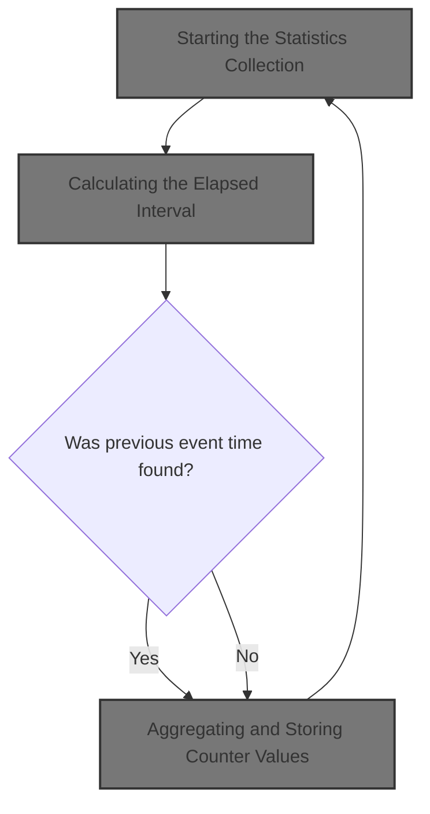

# Overview

This document explains the flow of transaction statistics collection for business monitoring. The process captures transaction context, calculates elapsed intervals, aggregates counter values, and stores summary metrics in shared queues, refreshing every 60 seconds.

## Dependencies

### Program

- LGWEBST5 (<SwmPath>[base/src/lgwebst5.cbl](base/src/lgwebst5.cbl)</SwmPath>)

&nbsp;

*This is an auto-generated document by Swimm 🌊 and has not yet been verified by a human*

<SwmMeta version="3.0.0" repo-id="Z2l0aHViJTNBJTNBU3dpbW1pby1nZW5hcHAtbW90b3IlM0ElM0FHaXJpLVN3aW1t" repo-name="Swimmio-genapp-motor">Powered by [Swimm](https://app.swimm.io/)</SwmMeta>
