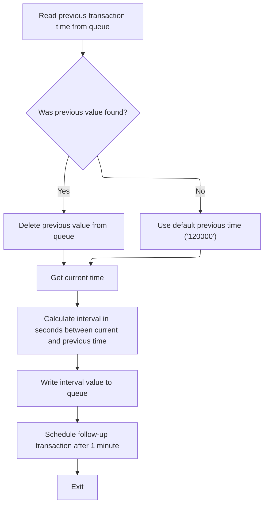
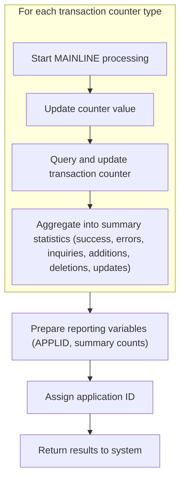

# Overview

This document describes the flow of collecting and aggregating transaction statistics for business monitoring. The process prepares transaction context, calculates elapsed intervals, and aggregates counter data to provide up-to-date statistics for reporting and scheduling.

## Dependencies

### Program

- <SwmToken path="base/src/lgwebst5.cbl" pos="11:6:6" line-data="       PROGRAM-ID. LGWEBST5">`LGWEBST5`</SwmToken> (<SwmPath>[base/src/lgwebst5.cbl](base/src/lgwebst5.cbl)</SwmPath>)

## Detailed View of the Program's Functionality

# A. Initializing Transaction Context

At the start of the main processing section, the program sets up its transaction context. It initializes a header structure that contains identifying information for the transaction, such as the transaction ID, terminal ID, task number, and the length of the call. These values are obtained from the CICS environment and stored in working storage for later use. The program also sets a prefix value ('GENA') that will be used to construct names for all subsequent queue operations. This setup does not enforce or check the presence of required counters, pools, or working-storage variables; it assumes they are defined elsewhere and available.

After the context is set, the program retrieves the current time from the system and formats it into separate date and time fields. This formatted time is used to calculate transaction rates and intervals. The program then calls a subroutine responsible for determining how much time has elapsed since the last run, storing this interval for later use in rate calculations.

# B. Calculating Elapsed Transaction Interval

The subroutine for calculating the transaction interval constructs a queue name using the previously set prefix and a fixed suffix. It attempts to read the previous time value from a transient queue. If the queue does not exist or the read is unsuccessful, a default time value ('120000') is used as a fallback.

Once the previous time is obtained, the program deletes the queue to remove any stale data before writing the new time value. The current time is then moved into the queue so it will be available for the next interval calculation.

Both the current and previous time values are broken down into hours, minutes, and seconds. These components are converted into total seconds, and the difference between them is computed to determine the interval in seconds. This interval value is then written to the queue.

To maintain the monitoring cycle, the program schedules a follow-up transaction to run after one minute. This ensures that the statistics collection and rate calculations continue at regular intervals.

# C. Aggregating and Storing Counter Statistics

After calculating the interval, the program begins aggregating statistics from various transaction counters. For each counter type, it constructs a queue name using the prefix and a mapped suffix, stores the counter value, and calls a subroutine to update rate statistics.

The aggregation process involves querying each counter in a specific order, which is important for building summary statistics. For each counter, the program updates aggregates such as success, errors, inquiries, additions, deletions, and updates. These aggregates are stored in working storage and mapped to summary variables for reporting.

For each counter, the program:

- Queries the counter value from the CICS environment.
- Updates the appropriate aggregate (success, error, inquiry, add, delete, update).
- Stores the value in a mapped variable.
- Constructs a queue name for the counter.
- Moves the value into a rate calculation variable.
- Calls the rate calculation subroutine.

This process is repeated for all defined counters, covering a wide range of transaction types and error codes. After all counters are processed, the program aggregates the total success and error counts into summary variables. These totals are also stored in mapped variables for reporting.

The program then prepares reporting variables, including the application ID, and moves the collected statistics into the appropriate fields. Finally, it returns the results to the system, completing the statistics collection and aggregation cycle.

# D. Rate Calculation for Each Counter

For each counter and aggregate, the program calls a subroutine that handles rate calculations. This subroutine:

- Reads the previous value for the counter from the queue.
- Deletes the old value from the queue.
- Writes the new value to the queue.
- Writes the previous value to the queue for reference.
- Calculates the difference between the new and previous values to determine the rate.
- Writes the rate value to the queue.

This ensures that for each counter and aggregate, the program maintains a history of values and can calculate rates over time.

# E. Application Context Assignment and Program Return

Before returning, the program assigns the application ID to a working storage variable, ensuring that all collected statistics are tagged with the correct application context. The application ID is then moved into a reporting variable.

Finally, the program returns control to the system, completing the transaction. There is no error handling for missing definitions or changes in business requirements, so any updates to counter mappings or aggregation logic must be made manually in the code. The program assumes all necessary definitions are present and that the aggregation logic matches current business needs.

# Rule Definition

| Paragraph Name                                                                                                                                                                                                                                                                               | Rule ID | Category          | Description                                                                                                                                                                                                                                                                                                                                                                                                                                                                                                                                                                                                                                                                                                                                                                                                                                                                                                                                                                                                                                                                                                                                      | Conditions                                                 | Remarks                                                                                                                                                                                                                                                                                                                                                                                                                                                                                                                                                                                                  |
| -------------------------------------------------------------------------------------------------------------------------------------------------------------------------------------------------------------------------------------------------------------------------------------------- | ------- | ----------------- | ------------------------------------------------------------------------------------------------------------------------------------------------------------------------------------------------------------------------------------------------------------------------------------------------------------------------------------------------------------------------------------------------------------------------------------------------------------------------------------------------------------------------------------------------------------------------------------------------------------------------------------------------------------------------------------------------------------------------------------------------------------------------------------------------------------------------------------------------------------------------------------------------------------------------------------------------------------------------------------------------------------------------------------------------------------------------------------------------------------------------------------------------ | ---------------------------------------------------------- | -------------------------------------------------------------------------------------------------------------------------------------------------------------------------------------------------------------------------------------------------------------------------------------------------------------------------------------------------------------------------------------------------------------------------------------------------------------------------------------------------------------------------------------------------------------------------------------------------------- |
| MAINLINE SECTION                                                                                                                                                                                                                                                                             | RL-001  | Data Assignment   | At the start of MAINLINE, the program must copy CICS environment variables (EIBTRNID, EIBTRMID, EIBTASKN, EIBCALEN) into working storage for later use.                                                                                                                                                                                                                                                                                                                                                                                                                                                                                                                                                                                                                                                                                                                                                                                                                                                                                                                                                                                          | Program execution begins in MAINLINE.                      | The copied values are used for transaction identification and statistics. All are stored as strings or numbers in working storage fields.                                                                                                                                                                                                                                                                                                                                                                                                                                                                |
| MAINLINE SECTION                                                                                                                                                                                                                                                                             | RL-002  | Data Assignment   | The TSQ prefix must be set to 'GENA' for all queue operations, ensuring consistent naming.                                                                                                                                                                                                                                                                                                                                                                                                                                                                                                                                                                                                                                                                                                                                                                                                                                                                                                                                                                                                                                                       | Before any queue operation is performed.                   | <SwmToken path="base/src/lgwebst5.cbl" pos="259:9:9" line-data="           MOVE &#39;GENA&#39;  To TSQpre">`TSQpre`</SwmToken> is always set to 'GENA'. All queue names are built using this prefix.                                                                                                                                                                                                                                                                                                                                                                                                     |
| MAINLINE SECTION, <SwmToken path="base/src/lgwebst5.cbl" pos="266:3:7" line-data="           Perform Tran-Rate-Interval">`Tran-Rate-Interval`</SwmToken>                                                                                                                                     | RL-003  | Computation       | The program retrieves the current time and formats it as HHMMSS for use in interval calculations.                                                                                                                                                                                                                                                                                                                                                                                                                                                                                                                                                                                                                                                                                                                                                                                                                                                                                                                                                                                                                                                | Before interval calculation is performed.                  | Time is formatted as a 6-character string (HHMMSS).                                                                                                                                                                                                                                                                                                                                                                                                                                                                                                                                                      |
| MAINLINE SECTION, <SwmToken path="base/src/lgwebst5.cbl" pos="266:3:7" line-data="           Perform Tran-Rate-Interval">`Tran-Rate-Interval`</SwmToken>                                                                                                                                     | RL-004  | Computation       | Queue name for interval calculation is built by concatenating TSQ prefix ('GENA') and a fixed suffix (<SwmToken path="base/src/lgwebst5.cbl" pos="718:2:2" line-data="                  &#39;000V&#39; Delimited By Spaces">`000V`</SwmToken>).                                                                                                                                                                                                                                                                                                                                                                                                                                                                                                                                                                                                                                                                                                                                                                                                                                                                                                  | When performing interval calculations.                     | Queue name is always 8 characters: 'GENA000V'.                                                                                                                                                                                                                                                                                                                                                                                                                                                                                                                                                           |
| <SwmToken path="base/src/lgwebst5.cbl" pos="266:3:7" line-data="           Perform Tran-Rate-Interval">`Tran-Rate-Interval`</SwmToken>                                                                                                                                                       | RL-005  | Conditional Logic | Read previous transaction time from TSQ. If queue does not exist or read is not normal, default previous time to '120000'.                                                                                                                                                                                                                                                                                                                                                                                                                                                                                                                                                                                                                                                                                                                                                                                                                                                                                                                                                                                                                       | When reading previous transaction time from TSQ.           | Previous time is a 6-character string (HHMMSS). Default value is '120000'.                                                                                                                                                                                                                                                                                                                                                                                                                                                                                                                               |
| <SwmToken path="base/src/lgwebst5.cbl" pos="266:3:7" line-data="           Perform Tran-Rate-Interval">`Tran-Rate-Interval`</SwmToken>                                                                                                                                                       | RL-006  | Conditional Logic | After reading previous transaction time from TSQ, delete the value from the queue.                                                                                                                                                                                                                                                                                                                                                                                                                                                                                                                                                                                                                                                                                                                                                                                                                                                                                                                                                                                                                                                               | After previous time is read from TSQ.                      | Deletion is performed using CICS <SwmToken path="base/src/lgwebst5.cbl" pos="729:5:5" line-data="           Exec Cics DeleteQ TS Queue(WS-TSQNAME)">`DeleteQ`</SwmToken> TS API.                                                                                                                                                                                                                                                                                                                                                                                                                         |
| <SwmToken path="base/src/lgwebst5.cbl" pos="266:3:7" line-data="           Perform Tran-Rate-Interval">`Tran-Rate-Interval`</SwmToken>                                                                                                                                                       | RL-007  | Computation       | Calculate the interval in seconds between current and previous time values using the formula: Interval = (CurrentHH \* 3600 + CurrentMM \* 60 + CurrentSS) - (PrevHH \* 3600 + PrevMM \* 60 + PrevSS).                                                                                                                                                                                                                                                                                                                                                                                                                                                                                                                                                                                                                                                                                                                                                                                                                                                                                                                                           | After both current and previous time values are available. | Interval is stored as a number (seconds).                                                                                                                                                                                                                                                                                                                                                                                                                                                                                                                                                                |
| <SwmToken path="base/src/lgwebst5.cbl" pos="266:3:7" line-data="           Perform Tran-Rate-Interval">`Tran-Rate-Interval`</SwmToken>                                                                                                                                                       | RL-008  | Data Assignment   | Write the calculated interval value to the TSQ for later use.                                                                                                                                                                                                                                                                                                                                                                                                                                                                                                                                                                                                                                                                                                                                                                                                                                                                                                                                                                                                                                                                                    | After interval is calculated.                              | Interval value is written as a 6-character string to TSQ.                                                                                                                                                                                                                                                                                                                                                                                                                                                                                                                                                |
| <SwmToken path="base/src/lgwebst5.cbl" pos="266:3:7" line-data="           Perform Tran-Rate-Interval">`Tran-Rate-Interval`</SwmToken>                                                                                                                                                       | RL-009  | Conditional Logic | Schedule a follow-up transaction ('SSST') to run after 1 minute using CICS Start Transid.                                                                                                                                                                                                                                                                                                                                                                                                                                                                                                                                                                                                                                                                                                                                                                                                                                                                                                                                                                                                                                                        | After interval calculation and TSQ update.                 | Transaction ID is 'SSST'. Delay is 1 minute.                                                                                                                                                                                                                                                                                                                                                                                                                                                                                                                                                             |
| MAINLINE SECTION                                                                                                                                                                                                                                                                             | RL-010  | Computation       | Query each transaction counter from the CICS pool and update corresponding aggregate variables (<SwmToken path="base/src/lgwebst5.cbl" pos="286:7:7" line-data="           Move CountVal  To CountSuccess">`CountSuccess`</SwmToken>, <SwmToken path="base/src/lgwebst5.cbl" pos="301:7:7" line-data="           Move CountVal  To CountErrors">`CountErrors`</SwmToken>, <SwmToken path="base/src/lgwebst5.cbl" pos="287:7:7" line-data="           Move CountVal  To CountInq">`CountInq`</SwmToken>, <SwmToken path="base/src/lgwebst5.cbl" pos="310:7:7" line-data="           Move CountVal  To CountAdd">`CountAdd`</SwmToken>, <SwmToken path="base/src/lgwebst5.cbl" pos="400:7:7" line-data="           Move CountVal  To CountUpd">`CountUpd`</SwmToken>, <SwmToken path="base/src/lgwebst5.cbl" pos="378:7:7" line-data="           Move CountVal  To CountDel">`CountDel`</SwmToken>).                                                                                                                                                                                                                                               | For each counter defined in the mapping.                   | Counters are queried using CICS Query Counter. Aggregate variables are updated according to mapping logic.                                                                                                                                                                                                                                                                                                                                                                                                                                                                                               |
| MAINLINE SECTION, <SwmToken path="base/src/lgwebst5.cbl" pos="279:3:7" line-data="           Perform Tran-Rate-Counts">`Tran-Rate-Counts`</SwmToken>                                                                                                                                         | RL-011  | Computation       | For each counter, build the TSQ name using the prefix and mapped suffix, store the value in the queue, and call the rate statistics subroutine.                                                                                                                                                                                                                                                                                                                                                                                                                                                                                                                                                                                                                                                                                                                                                                                                                                                                                                                                                                                                  | For each counter processed.                                | TSQ name is built by concatenating TSQ prefix and counter suffix. Value is stored as a 9-character string.                                                                                                                                                                                                                                                                                                                                                                                                                                                                                               |
| MAINLINE SECTION                                                                                                                                                                                                                                                                             | RL-012  | Computation       | Aggregate counter values into summary statistics for success, errors, inquiries, additions, deletions, and updates, following the mapping described in the flow.                                                                                                                                                                                                                                                                                                                                                                                                                                                                                                                                                                                                                                                                                                                                                                                                                                                                                                                                                                                 | After all counters are queried.                            | Summary statistics are stored in working storage and TSQs.                                                                                                                                                                                                                                                                                                                                                                                                                                                                                                                                               |
| MAINLINE SECTION                                                                                                                                                                                                                                                                             | RL-013  | Data Assignment   | Update the working storage summary structure (<SwmToken path="base/src/lgwebst5.cbl" pos="76:3:3" line-data="       01  SymbList.">`SymbList`</SwmToken>) with the latest aggregate and counter values (e.g., <SwmToken path="base/src/lgwebst5.cbl" pos="705:9:9" line-data="           Move WS-APPLID To S1.">`S1`</SwmToken> for APPLID, <SwmToken path="base/src/lgwebst5.cbl" pos="274:9:9" line-data="           Move GENAcount-V  To S3">`S3`</SwmToken> for <SwmToken path="base/src/lgwebst5.cbl" pos="288:7:9" line-data="           Move CountVal  To GENACNT100-V">`GENACNT100-V`</SwmToken>, <SwmToken path="base/src/lgwebst5.cbl" pos="672:9:9" line-data="           Move GENAsucces-V To S38">`S38`</SwmToken> for <SwmToken path="base/src/lgwebst5.cbl" pos="670:7:9" line-data="           Move CountSuccess To GENAsucces-V">`GENAsucces-V`</SwmToken>, <SwmToken path="base/src/lgwebst5.cbl" pos="673:9:9" line-data="           Move GENAerrors-V To S39">`S39`</SwmToken> for <SwmToken path="base/src/lgwebst5.cbl" pos="671:7:9" line-data="           Move Counterrors  To GENAerrors-V">`GENAerrors-V`</SwmToken>). | After aggregation is complete.                             | <SwmToken path="base/src/lgwebst5.cbl" pos="76:3:3" line-data="       01  SymbList.">`SymbList`</SwmToken> fields are updated with latest values. Each field has a defined format (e.g., <SwmToken path="base/src/lgwebst5.cbl" pos="705:9:9" line-data="           Move WS-APPLID To S1.">`S1`</SwmToken> is 8 characters, <SwmToken path="base/src/lgwebst5.cbl" pos="274:9:9" line-data="           Move GENAcount-V  To S3">`S3`</SwmToken> is 9 characters, <SwmToken path="base/src/lgwebst5.cbl" pos="672:9:9" line-data="           Move GENAsucces-V To S38">`S38`</SwmToken> is 9 characters). |
| MAINLINE SECTION                                                                                                                                                                                                                                                                             | RL-014  | Conditional Logic | Return control to the system with updated statistics available in TSQs and working storage summary variables.                                                                                                                                                                                                                                                                                                                                                                                                                                                                                                                                                                                                                                                                                                                                                                                                                                                                                                                                                                                                                                    | After all processing is complete.                          | Statistics are available in TSQs and working storage. Control is returned using CICS RETURN.                                                                                                                                                                                                                                                                                                                                                                                                                                                                                                             |
| MAINLINE SECTION, <SwmToken path="base/src/lgwebst5.cbl" pos="266:3:7" line-data="           Perform Tran-Rate-Interval">`Tran-Rate-Interval`</SwmToken>, <SwmToken path="base/src/lgwebst5.cbl" pos="279:3:7" line-data="           Perform Tran-Rate-Counts">`Tran-Rate-Counts`</SwmToken> | RL-015  | Conditional Logic | All queue and counter operations must use the CICS APIs for reading, writing, deleting, and querying counters.                                                                                                                                                                                                                                                                                                                                                                                                                                                                                                                                                                                                                                                                                                                                                                                                                                                                                                                                                                                                                                   | Whenever queue or counter operations are performed.        | Operations use CICS APIs: READQ TS, WRITEQ TS, DELETEQ TS, QUERY COUNTER.                                                                                                                                                                                                                                                                                                                                                                                                                                                                                                                                |
| MAINLINE SECTION                                                                                                                                                                                                                                                                             | RL-016  | Conditional Logic | The program must not enforce or check the presence of counters, pools, or working-storage variables; it assumes they are defined and available.                                                                                                                                                                                                                                                                                                                                                                                                                                                                                                                                                                                                                                                                                                                                                                                                                                                                                                                                                                                                  | Throughout program execution.                              | No existence checks are performed for counters, pools, or variables.                                                                                                                                                                                                                                                                                                                                                                                                                                                                                                                                     |
| MAINLINE SECTION                                                                                                                                                                                                                                                                             | RL-017  | Conditional Logic | The aggregation logic must match the business requirements as described, with manual updates required for changes in counter mappings.                                                                                                                                                                                                                                                                                                                                                                                                                                                                                                                                                                                                                                                                                                                                                                                                                                                                                                                                                                                                           | When business requirements or counter mappings change.     | Mapping logic is manually maintained in code.                                                                                                                                                                                                                                                                                                                                                                                                                                                                                                                                                            |

# User Stories

## User Story 1: Initialize transaction context and TSQ prefix

---

### Story Description:

As a system, I want to initialize the transaction context and set the TSQ prefix so that all subsequent operations have the necessary environment and consistent queue naming.

---

### Business Rule Mapping:

| Rule ID | Paragraph Name   | Rule Description                                                                                                                                        |
| ------- | ---------------- | ------------------------------------------------------------------------------------------------------------------------------------------------------- |
| RL-001  | MAINLINE SECTION | At the start of MAINLINE, the program must copy CICS environment variables (EIBTRNID, EIBTRMID, EIBTASKN, EIBCALEN) into working storage for later use. |
| RL-002  | MAINLINE SECTION | The TSQ prefix must be set to 'GENA' for all queue operations, ensuring consistent naming.                                                              |

---

### Relevant Functionality:

- **MAINLINE SECTION**
  1. **RL-001:**
     - On program start:
       - Copy EIBTRNID to transaction ID field
       - Copy EIBTRMID to terminal ID field
       - Copy EIBTASKN to task number field
       - Copy EIBCALEN to call length field
  2. **RL-002:**
     - Set TSQ prefix variable to 'GENA' before building any queue name

## User Story 2: Calculate transaction interval and schedule follow-up

---

### Story Description:

As a system, I want to calculate the interval between transactions and schedule a follow-up transaction so that transaction timing can be tracked and processed accurately.

---

### Business Rule Mapping:

| Rule ID | Paragraph Name                                                                                                                                           | Rule Description                                                                                                                                                                                                                                |
| ------- | -------------------------------------------------------------------------------------------------------------------------------------------------------- | ----------------------------------------------------------------------------------------------------------------------------------------------------------------------------------------------------------------------------------------------- |
| RL-005  | <SwmToken path="base/src/lgwebst5.cbl" pos="266:3:7" line-data="           Perform Tran-Rate-Interval">`Tran-Rate-Interval`</SwmToken>                   | Read previous transaction time from TSQ. If queue does not exist or read is not normal, default previous time to '120000'.                                                                                                                      |
| RL-006  | <SwmToken path="base/src/lgwebst5.cbl" pos="266:3:7" line-data="           Perform Tran-Rate-Interval">`Tran-Rate-Interval`</SwmToken>                   | After reading previous transaction time from TSQ, delete the value from the queue.                                                                                                                                                              |
| RL-007  | <SwmToken path="base/src/lgwebst5.cbl" pos="266:3:7" line-data="           Perform Tran-Rate-Interval">`Tran-Rate-Interval`</SwmToken>                   | Calculate the interval in seconds between current and previous time values using the formula: Interval = (CurrentHH \* 3600 + CurrentMM \* 60 + CurrentSS) - (PrevHH \* 3600 + PrevMM \* 60 + PrevSS).                                          |
| RL-008  | <SwmToken path="base/src/lgwebst5.cbl" pos="266:3:7" line-data="           Perform Tran-Rate-Interval">`Tran-Rate-Interval`</SwmToken>                   | Write the calculated interval value to the TSQ for later use.                                                                                                                                                                                   |
| RL-009  | <SwmToken path="base/src/lgwebst5.cbl" pos="266:3:7" line-data="           Perform Tran-Rate-Interval">`Tran-Rate-Interval`</SwmToken>                   | Schedule a follow-up transaction ('SSST') to run after 1 minute using CICS Start Transid.                                                                                                                                                       |
| RL-003  | MAINLINE SECTION, <SwmToken path="base/src/lgwebst5.cbl" pos="266:3:7" line-data="           Perform Tran-Rate-Interval">`Tran-Rate-Interval`</SwmToken> | The program retrieves the current time and formats it as HHMMSS for use in interval calculations.                                                                                                                                               |
| RL-004  | MAINLINE SECTION, <SwmToken path="base/src/lgwebst5.cbl" pos="266:3:7" line-data="           Perform Tran-Rate-Interval">`Tran-Rate-Interval`</SwmToken> | Queue name for interval calculation is built by concatenating TSQ prefix ('GENA') and a fixed suffix (<SwmToken path="base/src/lgwebst5.cbl" pos="718:2:2" line-data="                  &#39;000V&#39; Delimited By Spaces">`000V`</SwmToken>). |

---

### Relevant Functionality:

- <SwmToken path="base/src/lgwebst5.cbl" pos="266:3:7" line-data="           Perform Tran-Rate-Interval">`Tran-Rate-Interval`</SwmToken>
  1. **RL-005:**
     - Attempt to read previous time from TSQ
     - If read response is not normal, set previous time to '120000'
  2. **RL-006:**
     - After reading previous time, call CICS <SwmToken path="base/src/lgwebst5.cbl" pos="729:5:5" line-data="           Exec Cics DeleteQ TS Queue(WS-TSQNAME)">`DeleteQ`</SwmToken> TS to remove item from queue
  3. **RL-007:**
     - Parse current and previous time values into hours, minutes, seconds
     - Compute seconds for each
     - Subtract previous from current to get interval
  4. **RL-008:**
     - Move interval value to working storage
     - Write interval value to TSQ using CICS WRITEQ TS
  5. **RL-009:**
     - Call CICS Start Transid with 'SSST' and delay of 1 minute
- **MAINLINE SECTION**
  1. **RL-003:**
     - Call CICS ASKTIME to get current absolute time
     - Call CICS FORMATTIME to format time as HHMMSS
     - Store formatted time in working storage
  2. **RL-004:**
     - Concatenate TSQ prefix ('GENA') and suffix (<SwmToken path="base/src/lgwebst5.cbl" pos="718:2:2" line-data="                  &#39;000V&#39; Delimited By Spaces">`000V`</SwmToken>) to form queue name

## User Story 3: Aggregate and store transaction counters and statistics

---

### Story Description:

As a system, I want to query transaction counters, aggregate them into summary statistics, update working storage, and store values in TSQs so that transaction performance and outcomes are tracked and available for reporting.

---

### Business Rule Mapping:

| Rule ID | Paragraph Name                                                                                                                                       | Rule Description                                                                                                                                                                                                                                                                                                                                                                                                                                                                                                                                                                                                                                                                                                                                                                                                                                                                                                                                                                                                                                                                                                                                 |
| ------- | ---------------------------------------------------------------------------------------------------------------------------------------------------- | ------------------------------------------------------------------------------------------------------------------------------------------------------------------------------------------------------------------------------------------------------------------------------------------------------------------------------------------------------------------------------------------------------------------------------------------------------------------------------------------------------------------------------------------------------------------------------------------------------------------------------------------------------------------------------------------------------------------------------------------------------------------------------------------------------------------------------------------------------------------------------------------------------------------------------------------------------------------------------------------------------------------------------------------------------------------------------------------------------------------------------------------------ |
| RL-010  | MAINLINE SECTION                                                                                                                                     | Query each transaction counter from the CICS pool and update corresponding aggregate variables (<SwmToken path="base/src/lgwebst5.cbl" pos="286:7:7" line-data="           Move CountVal  To CountSuccess">`CountSuccess`</SwmToken>, <SwmToken path="base/src/lgwebst5.cbl" pos="301:7:7" line-data="           Move CountVal  To CountErrors">`CountErrors`</SwmToken>, <SwmToken path="base/src/lgwebst5.cbl" pos="287:7:7" line-data="           Move CountVal  To CountInq">`CountInq`</SwmToken>, <SwmToken path="base/src/lgwebst5.cbl" pos="310:7:7" line-data="           Move CountVal  To CountAdd">`CountAdd`</SwmToken>, <SwmToken path="base/src/lgwebst5.cbl" pos="400:7:7" line-data="           Move CountVal  To CountUpd">`CountUpd`</SwmToken>, <SwmToken path="base/src/lgwebst5.cbl" pos="378:7:7" line-data="           Move CountVal  To CountDel">`CountDel`</SwmToken>).                                                                                                                                                                                                                                               |
| RL-011  | MAINLINE SECTION, <SwmToken path="base/src/lgwebst5.cbl" pos="279:3:7" line-data="           Perform Tran-Rate-Counts">`Tran-Rate-Counts`</SwmToken> | For each counter, build the TSQ name using the prefix and mapped suffix, store the value in the queue, and call the rate statistics subroutine.                                                                                                                                                                                                                                                                                                                                                                                                                                                                                                                                                                                                                                                                                                                                                                                                                                                                                                                                                                                                  |
| RL-012  | MAINLINE SECTION                                                                                                                                     | Aggregate counter values into summary statistics for success, errors, inquiries, additions, deletions, and updates, following the mapping described in the flow.                                                                                                                                                                                                                                                                                                                                                                                                                                                                                                                                                                                                                                                                                                                                                                                                                                                                                                                                                                                 |
| RL-013  | MAINLINE SECTION                                                                                                                                     | Update the working storage summary structure (<SwmToken path="base/src/lgwebst5.cbl" pos="76:3:3" line-data="       01  SymbList.">`SymbList`</SwmToken>) with the latest aggregate and counter values (e.g., <SwmToken path="base/src/lgwebst5.cbl" pos="705:9:9" line-data="           Move WS-APPLID To S1.">`S1`</SwmToken> for APPLID, <SwmToken path="base/src/lgwebst5.cbl" pos="274:9:9" line-data="           Move GENAcount-V  To S3">`S3`</SwmToken> for <SwmToken path="base/src/lgwebst5.cbl" pos="288:7:9" line-data="           Move CountVal  To GENACNT100-V">`GENACNT100-V`</SwmToken>, <SwmToken path="base/src/lgwebst5.cbl" pos="672:9:9" line-data="           Move GENAsucces-V To S38">`S38`</SwmToken> for <SwmToken path="base/src/lgwebst5.cbl" pos="670:7:9" line-data="           Move CountSuccess To GENAsucces-V">`GENAsucces-V`</SwmToken>, <SwmToken path="base/src/lgwebst5.cbl" pos="673:9:9" line-data="           Move GENAerrors-V To S39">`S39`</SwmToken> for <SwmToken path="base/src/lgwebst5.cbl" pos="671:7:9" line-data="           Move Counterrors  To GENAerrors-V">`GENAerrors-V`</SwmToken>). |

---

### Relevant Functionality:

- **MAINLINE SECTION**
  1. **RL-010:**
     - For each counter:
       - Query counter value from CICS pool
       - Update corresponding aggregate variable
       - Store value in working storage
  2. **RL-011:**
     - Build TSQ name by concatenating prefix and suffix
     - Move counter value to working storage
     - Write value to TSQ
     - Call <SwmToken path="base/src/lgwebst5.cbl" pos="279:3:7" line-data="           Perform Tran-Rate-Counts">`Tran-Rate-Counts`</SwmToken> subroutine
  3. **RL-012:**
     - Sum counter values according to mapping for each statistic type
     - Store aggregate values in summary variables
  4. **RL-013:**
     - Move latest aggregate and counter values to corresponding fields in <SwmToken path="base/src/lgwebst5.cbl" pos="76:3:3" line-data="       01  SymbList.">`SymbList`</SwmToken>

## User Story 4: Ensure proper system interaction and business logic integrity

---

### Story Description:

As a system, I want all queue and counter operations to use CICS APIs, return control with updated statistics, avoid existence checks, and maintain manual mapping logic so that the program operates reliably and matches business requirements.

---

### Business Rule Mapping:

| Rule ID | Paragraph Name                                                                                                                                                                                                                                                                               | Rule Description                                                                                                                                |
| ------- | -------------------------------------------------------------------------------------------------------------------------------------------------------------------------------------------------------------------------------------------------------------------------------------------- | ----------------------------------------------------------------------------------------------------------------------------------------------- |
| RL-014  | MAINLINE SECTION                                                                                                                                                                                                                                                                             | Return control to the system with updated statistics available in TSQs and working storage summary variables.                                   |
| RL-015  | MAINLINE SECTION, <SwmToken path="base/src/lgwebst5.cbl" pos="266:3:7" line-data="           Perform Tran-Rate-Interval">`Tran-Rate-Interval`</SwmToken>, <SwmToken path="base/src/lgwebst5.cbl" pos="279:3:7" line-data="           Perform Tran-Rate-Counts">`Tran-Rate-Counts`</SwmToken> | All queue and counter operations must use the CICS APIs for reading, writing, deleting, and querying counters.                                  |
| RL-016  | MAINLINE SECTION                                                                                                                                                                                                                                                                             | The program must not enforce or check the presence of counters, pools, or working-storage variables; it assumes they are defined and available. |
| RL-017  | MAINLINE SECTION                                                                                                                                                                                                                                                                             | The aggregation logic must match the business requirements as described, with manual updates required for changes in counter mappings.          |

---

### Relevant Functionality:

- **MAINLINE SECTION**
  1. **RL-014:**
     - Ensure all statistics are written to TSQs and working storage
     - Call CICS RETURN to end transaction
  2. **RL-015:**
     - For each queue/counter operation, use appropriate CICS API
  3. **RL-016:**
     - Do not check for existence of counters, pools, or working-storage variables
  4. **RL-017:**
     - Update mapping logic in code when business requirements change

# Workflow

# Initializing Transaction Context

This section is responsible for preparing all necessary context and environment data for a transaction run, ensuring that all required variables and structures are initialized and ready for subsequent business logic and aggregation steps.

| Category        | Rule Name                          | Description                                                                                                                                               |
| --------------- | ---------------------------------- | --------------------------------------------------------------------------------------------------------------------------------------------------------- |
| Data validation | Context Initialization Requirement | All required header fields and working storage variables must be initialized before any aggregation or counter queries are performed.                     |
| Business logic  | CICS Environment Capture           | The transaction context must include the current transaction ID, terminal ID, task number, and call length, as provided by the CICS environment.          |
| Business logic  | TSQ Prefix Consistency             | The TSQ prefix for all queue operations must be set to 'GENA' to ensure consistent identification and grouping of transaction data.                       |
| Business logic  | Timestamp Standardization          | The transaction context must record the current date and time in a standardized format for each run.                                                      |
| Business logic  | Elapsed Interval Calculation       | The elapsed interval in seconds between the current and previous transaction runs must be calculated and stored for use in transaction rate calculations. |

<SwmSnippet path="/base/src/lgwebst5.cbl" line="250">

---

In <SwmToken path="base/src/lgwebst5.cbl" pos="250:1:1" line-data="       MAINLINE SECTION.">`MAINLINE`</SwmToken>, this is where the transaction context is set up. It initializes the header structure and copies key CICS environment variables (transaction ID, terminal ID, task number, and call length) into working storage. The TSQ prefix is set to 'GENA', which is used for all subsequent queue operations. The code assumes all counters, pools, and working-storage variables are defined and available, and that the aggregation logic matches business requirements, but none of this is enforced or checked here.

```cobol
       MAINLINE SECTION.
      *
           INITIALIZE WS-HEADER.

           MOVE EIBTRNID TO WS-TRANSID.
           MOVE EIBTRMID TO WS-TERMID.
           MOVE EIBTASKN TO WS-TASKNUM.
           MOVE EIBCALEN TO WS-CALEN.
      ****************************************************************
           MOVE 'GENA'  To TSQpre
```

---

</SwmSnippet>

<SwmSnippet path="/base/src/lgwebst5.cbl" line="260">

---

After setting up the context, we grab the current time and format it, then call <SwmToken path="base/src/lgwebst5.cbl" pos="266:3:7" line-data="           Perform Tran-Rate-Interval">`Tran-Rate-Interval`</SwmToken>. This subroutine figures out how much time has passed since the last run and stores it, so we can later calculate transaction rates. Only after this do we start querying counters and aggregating their values.

```cobol
           EXEC CICS ASKTIME ABSTIME(WS-ABSTIME)
           END-EXEC
           EXEC CICS FORMATTIME ABSTIME(WS-ABSTIME)
                     MMDDYYYY(WS-DATE)
                     TIME(WS-TIME)
           END-EXEC
           Perform Tran-Rate-Interval

           Exec CICS Query Counter(GENAcount)
                            Pool(GENApool)
                            Value(CountVal)
                            Resp(WS-RESP)
           End-Exec.
```

---

</SwmSnippet>

## Calculating Elapsed Transaction Interval



This section ensures that the elapsed time between two transaction events is accurately calculated and stored, enabling reliable monitoring and scheduling of follow-up transactions.

| Category       | Rule Name                        | Description                                                                                                                                                    |
| -------------- | -------------------------------- | -------------------------------------------------------------------------------------------------------------------------------------------------------------- |
| Business logic | Default previous time fallback   | If a previous transaction time is not found in the queue, the system must use the default value '120000' as the previous time.                                 |
| Business logic | Interval calculation standard    | The interval between transactions must be calculated as the difference in seconds between the current and previous transaction times, using the format HHMMSS. |
| Business logic | Interval persistence             | After calculating the interval, the value must be written to the queue for use in subsequent transaction cycles.                                               |
| Business logic | Follow-up transaction scheduling | A follow-up transaction must be scheduled to run exactly one minute after the current transaction completes.                                                   |
| Business logic | Stale data prevention            | The previous transaction time value must be deleted from the queue after it is read, to prevent stale data from affecting future calculations.                 |

<SwmSnippet path="/base/src/lgwebst5.cbl" line="715">

---

In <SwmToken path="base/src/lgwebst5.cbl" pos="715:1:5" line-data="       Tran-Rate-Interval.">`Tran-Rate-Interval`</SwmToken>, we build the queue name from the prefix and a fixed suffix, then read the previous time value from the transient queue. This lets us compare the current run's time to the last run, so we can calculate the interval. If the queue doesn't exist, we set a default value.

```cobol
       Tran-Rate-Interval.

           String TSQpre,
                  '000V' Delimited By Spaces
                  Into WS-TSQname
           Exec Cics ReadQ TS Queue(WS-TSQname)
                     Into(WS-OLDV)
                     Item(1)
                     Length(Length of WS-OLDV)
                     Resp(WS-RESP)
           End-Exec.
```

---

</SwmSnippet>

<SwmSnippet path="/base/src/lgwebst5.cbl" line="726">

---

If the queue read isn't normal, we set <SwmToken path="base/src/lgwebst5.cbl" pos="727:9:11" line-data="            Move &#39;120000&#39; To WS-OLDV.">`WS-OLDV`</SwmToken> to '120000' as a fallback, so the interval calculation can still proceed.

```cobol
           If WS-RESP Not = DFHRESP(NORMAL)
            Move '120000' To WS-OLDV.
```

---

</SwmSnippet>

<SwmSnippet path="/base/src/lgwebst5.cbl" line="729">

---

After reading the old time, we delete the queue to remove stale data before writing the new time value.

```cobol
           Exec Cics DeleteQ TS Queue(WS-TSQNAME)
                     Resp(WS-RESP)
           End-Exec.
```

---

</SwmSnippet>

<SwmSnippet path="/base/src/lgwebst5.cbl" line="733">

---

We move the current time into the queue so it's available for the next interval calculation.

```cobol
           Move WS-TIME   To WS-HHMMSS
           Exec Cics WRITEQ TS Queue(WS-TSQNAME)
                     FROM(WS-HHMMSS)
                     Length(Length of WS-HHMMSS)
                     Resp(WS-RESP)
           End-Exec.
```

---

</SwmSnippet>

<SwmSnippet path="/base/src/lgwebst5.cbl" line="739">

---

We break down both current and previous time values into hours, minutes, and seconds, convert them to total seconds, and compute the difference to get the interval.

```cobol
           Move WS-HH     To HHVal
           Move WS-MM     To MMVal
           Move WS-SS     To SSVal
           Compute NCountVal = (HHVal * 3600) +
                               (MMVal * 60)   +
                                SSVal
           Move WS-OLDVHH To HHVal
           Move WS-OLDVMM To MMVal
           Move WS-OLDVSS To SSVal
           Compute OCountVal = (HHVal * 3600) +
                               (MMVal * 60)   +
                                SSVal
           Compute ICountVal = NCountVal - OCountVal
           move ICountVal To WS-NEWV
           String TSQpre,
                  '000V' Delimited By Spaces
                  Into WS-TSQname
```

---

</SwmSnippet>

<SwmSnippet path="/base/src/lgwebst5.cbl" line="756">

---

After writing the interval value to the queue, we schedule the 'SSST' transaction to run in one minute, keeping the monitoring cycle going.

```cobol
           Exec Cics WRITEQ TS Queue(WS-TSQNAME)
                     FROM(WS-NEWV)
                     Length(Length of WS-NEWV)
                     Resp(WS-RESP)
           End-Exec.
           Exec Cics Start Transid('SSST')
                     After
                     Minutes(1)
                     Resp(WS-RESP)
           End-Exec.

           Exit.
```

---

</SwmSnippet>

## Aggregating and Storing Counter Statistics



<SwmSnippet path="/base/src/lgwebst5.cbl" line="273">

---

Back in MAINLINE after <SwmToken path="base/src/lgwebst5.cbl" pos="266:3:7" line-data="           Perform Tran-Rate-Interval">`Tran-Rate-Interval`</SwmToken>, we start aggregating counters. For each, we build a TSQ name using the prefix and a mapped suffix, then store the value and call <SwmToken path="base/src/lgwebst5.cbl" pos="279:3:7" line-data="           Perform Tran-Rate-Counts">`Tran-Rate-Counts`</SwmToken> to update rate statistics.

```cobol
           Move CountVal  To GENAcount-V
           Move GENAcount-V  To S3
           String TSQpre,
                  'X05V' Delimited By Spaces
                  Into WS-TSQname
           Move S3           To NRateVal
           Perform Tran-Rate-Counts
```

---

</SwmSnippet>

<SwmSnippet path="/base/src/lgwebst5.cbl" line="281">

---

We query <SwmToken path="base/src/lgwebst5.cbl" pos="281:9:9" line-data="           Exec CICS Query Counter(GENACNT100)">`GENACNT100`</SwmToken>, which kicks off the main aggregation loop. The order here matters for how summary stats are built.

```cobol
           Exec CICS Query Counter(GENACNT100)
                            Pool(GENApool)
                            Value(CountVal)
                            Resp(WS-RESP)
           End-Exec.
```

---

</SwmSnippet>

<SwmSnippet path="/base/src/lgwebst5.cbl" line="286">

---

After querying <SwmToken path="base/src/lgwebst5.cbl" pos="288:7:7" line-data="           Move CountVal  To GENACNT100-V">`GENACNT100`</SwmToken>, we update several aggregates and build the TSQ name for this counter, then call <SwmToken path="base/src/lgwebst5.cbl" pos="294:3:7" line-data="           Perform Tran-Rate-Counts">`Tran-Rate-Counts`</SwmToken> to update rate stats.

```cobol
           Move CountVal  To CountSuccess
           Move CountVal  To CountInq
           Move CountVal  To GENACNT100-V
           Move GENACNT100-V To S3
           String TSQpre,
                  '100V' Delimited By Spaces
                  Into WS-TSQname
           Move S3           To NRateVal
           Perform Tran-Rate-Counts

           Exec CICS Query Counter(GENACNT199)
                            Pool(GENApool)
                            Value(CountVal)
                            Resp(WS-RESP)
           End-Exec.
```

---

</SwmSnippet>

<SwmSnippet path="/base/src/lgwebst5.cbl" line="301">

---

We query <SwmToken path="base/src/lgwebst5.cbl" pos="302:7:7" line-data="           Move CountVal  To GENACNT199-V">`GENACNT199`</SwmToken> and add its value to the error aggregate, then move on to the next counter.

```cobol
           Move CountVal  To CountErrors
           Move CountVal  To GENACNT199-V
           Move GENACNT199-V To S4
           Exec CICS Query Counter(GENACNT200)
                            Pool(GENApool)
                            Value(CountVal)
                            Resp(WS-RESP)
           End-Exec.
```

---

</SwmSnippet>

<SwmSnippet path="/base/src/lgwebst5.cbl" line="309">

---

After querying <SwmToken path="base/src/lgwebst5.cbl" pos="311:7:7" line-data="           Move CountVal  To GENACNT200-V">`GENACNT200`</SwmToken>, we update success and add aggregates, build the TSQ name, and call <SwmToken path="base/src/lgwebst5.cbl" pos="317:3:7" line-data="           Perform Tran-Rate-Counts">`Tran-Rate-Counts`</SwmToken>.

```cobol
           Compute CountSuccess = CountSuccess + CountVal
           Move CountVal  To CountAdd
           Move CountVal  To GENACNT200-V
           Move GENACNT200-V To S5
           String TSQpre,
                  '200V' Delimited By Spaces
                  Into WS-TSQname
           Move S5           To NRateVal
           Perform Tran-Rate-Counts
           Exec CICS Query Counter(GENACNT299)
                            Pool(GENApool)
                            Value(CountVal)
                            Resp(WS-RESP)
           End-Exec.
```

---

</SwmSnippet>

<SwmSnippet path="/base/src/lgwebst5.cbl" line="323">

---

We query <SwmToken path="base/src/lgwebst5.cbl" pos="324:7:7" line-data="           Move CountVal  To GENACNT299-V">`GENACNT299`</SwmToken> and add its value to the error aggregate, then move to the next counter.

```cobol
           Compute CountErrors  = CountErrors + CountVal
           Move CountVal  To GENACNT299-V
           Move GENACNT299-V To S6
      *
           Exec CICS Query Counter(GENACNT300)
                            Pool(GENApool)
                            Value(CountVal)
                            Resp(WS-RESP)
           End-Exec.
```

---

</SwmSnippet>

<SwmSnippet path="/base/src/lgwebst5.cbl" line="332">

---

After querying <SwmToken path="base/src/lgwebst5.cbl" pos="333:7:7" line-data="           Move CountVal  To GENACNT300-V">`GENACNT300`</SwmToken>, we update both success and inquiry aggregates, build the TSQ name, and call <SwmToken path="base/src/lgwebst5.cbl" pos="340:3:7" line-data="           Perform Tran-Rate-Counts">`Tran-Rate-Counts`</SwmToken>.

```cobol
           Compute CountSuccess = CountSuccess + CountVal
           Move CountVal  To GENACNT300-V
           Compute CountInq = CountInq + CountVal
           Move GENACNT300-V To S7
           String TSQpre,
                  '300V' Delimited By Spaces
                  Into WS-TSQname
           Move S7           To NRateVal
           Perform Tran-Rate-Counts
           Exec CICS Query Counter(GENACNT399)
                            Pool(GENApool)
                            Value(CountVal)
                            Resp(WS-RESP)
           End-Exec.
```

---

</SwmSnippet>

<SwmSnippet path="/base/src/lgwebst5.cbl" line="346">

---

We query <SwmToken path="base/src/lgwebst5.cbl" pos="347:7:7" line-data="           Move CountVal  To GENACNT399-V">`GENACNT399`</SwmToken> and add its value to the error aggregate, then move to the next counter.

```cobol
           Compute CountErrors  = CountErrors + CountVal
           Move CountVal  To GENACNT399-V
           Move GENACNT399-V To S8
           Exec CICS Query Counter(GENACNT400)
                            Pool(GENApool)
                            Value(CountVal)
                            Resp(WS-RESP)
           End-Exec.
```

---

</SwmSnippet>

<SwmSnippet path="/base/src/lgwebst5.cbl" line="354">

---

After querying <SwmToken path="base/src/lgwebst5.cbl" pos="355:7:7" line-data="           Move CountVal  To GENACNT400-V">`GENACNT400`</SwmToken>, we update success and add aggregates, build the TSQ name, and call <SwmToken path="base/src/lgwebst5.cbl" pos="362:3:7" line-data="           Perform Tran-Rate-Counts">`Tran-Rate-Counts`</SwmToken>.

```cobol
           Compute CountSuccess = CountSuccess + CountVal
           Move CountVal  To GENACNT400-V
           Compute CountAdd = CountAdd + CountVal
           Move GENACNT400-V To S9
           String TSQpre,
                  '400V' Delimited By Spaces
                  Into WS-TSQname
           Move S9           To NRateVal
           Perform Tran-Rate-Counts
           Exec CICS Query Counter(GENACNT499)
                            Pool(GENApool)
                            Value(CountVal)
                            Resp(WS-RESP)
           End-Exec.
```

---

</SwmSnippet>

<SwmSnippet path="/base/src/lgwebst5.cbl" line="368">

---

We query <SwmToken path="base/src/lgwebst5.cbl" pos="369:7:7" line-data="           Move CountVal  To GENACNT499-V">`GENACNT499`</SwmToken> and add its value to the error aggregate, then move to the next counter.

```cobol
           Compute CountErrors  = CountErrors + CountVal
           Move CountVal  To GENACNT499-V
           Move GENACNT499-V To S10
           Exec CICS Query Counter(GENACNT500)
                            Pool(GENApool)
                            Value(CountVal)
                            Resp(WS-RESP)
           End-Exec.
```

---

</SwmSnippet>

<SwmSnippet path="/base/src/lgwebst5.cbl" line="376">

---

After querying <SwmToken path="base/src/lgwebst5.cbl" pos="377:7:7" line-data="           Move CountVal  To GENACNT500-V">`GENACNT500`</SwmToken>, we update success and delete aggregates, build the TSQ name, and call <SwmToken path="base/src/lgwebst5.cbl" pos="384:3:7" line-data="           Perform Tran-Rate-Counts">`Tran-Rate-Counts`</SwmToken>.

```cobol
           Compute CountSuccess = CountSuccess + CountVal
           Move CountVal  To GENACNT500-V
           Move CountVal  To CountDel
           Move GENACNT500-V To S11
           String TSQpre,
                  '500V' Delimited By Spaces
                  Into WS-TSQname
           Move S11          To NRateVal
           Perform Tran-Rate-Counts
           Exec CICS Query Counter(GENACNT599)
                            Pool(GENApool)
                            Value(CountVal)
                            Resp(WS-RESP)
           End-Exec.
```

---

</SwmSnippet>

<SwmSnippet path="/base/src/lgwebst5.cbl" line="390">

---

We query <SwmToken path="base/src/lgwebst5.cbl" pos="391:7:7" line-data="           Move CountVal  To GENACNT599-V">`GENACNT599`</SwmToken> and add its value to the error aggregate, then move to the next counter.

```cobol
           Compute CountErrors  = CountErrors + CountVal
           Move CountVal  To GENACNT599-V
           Move GENACNT599-V To S12
           Exec CICS Query Counter(GENACNT600)
                            Pool(GENApool)
                            Value(CountVal)
                            Resp(WS-RESP)
           End-Exec.
```

---

</SwmSnippet>

<SwmSnippet path="/base/src/lgwebst5.cbl" line="398">

---

After querying <SwmToken path="base/src/lgwebst5.cbl" pos="399:7:7" line-data="           Move CountVal  To GENACNT600-V">`GENACNT600`</SwmToken>, we update success and update aggregates, build the TSQ name, and call <SwmToken path="base/src/lgwebst5.cbl" pos="406:3:7" line-data="           Perform Tran-Rate-Counts">`Tran-Rate-Counts`</SwmToken>.

```cobol
           Compute CountSuccess = CountSuccess + CountVal
           Move CountVal  To GENACNT600-V
           Move CountVal  To CountUpd
           Move GENACNT600-V To S13
           String TSQpre,
                  '600V' Delimited By Spaces
                  Into WS-TSQname
           Move S13          To NRateVal
           Perform Tran-Rate-Counts
           Exec CICS Query Counter(GENACNT699)
                            Pool(GENApool)
                            Value(CountVal)
                            Resp(WS-RESP)
           End-Exec.
```

---

</SwmSnippet>

<SwmSnippet path="/base/src/lgwebst5.cbl" line="412">

---

We query <SwmToken path="base/src/lgwebst5.cbl" pos="413:7:7" line-data="           Move CountVal  To GENACNT699-V">`GENACNT699`</SwmToken> and add its value to the error aggregate, then move to the next counter.

```cobol
           Compute CountErrors  = CountErrors + CountVal
           Move CountVal  To GENACNT699-V
           Move GENACNT699-V To S14
      *
           Exec CICS Query Counter(GENACNT700)
                            Pool(GENApool)
                            Value(CountVal)
                            Resp(WS-RESP)
           End-Exec.
```

---

</SwmSnippet>

<SwmSnippet path="/base/src/lgwebst5.cbl" line="421">

---

After querying <SwmToken path="base/src/lgwebst5.cbl" pos="422:7:7" line-data="           Move CountVal  To GENACNT700-V">`GENACNT700`</SwmToken>, we update both success and inquiry aggregates, build the TSQ name, and call <SwmToken path="base/src/lgwebst5.cbl" pos="429:3:7" line-data="           Perform Tran-Rate-Counts">`Tran-Rate-Counts`</SwmToken>.

```cobol
           Compute CountSuccess = CountSuccess + CountVal
           Move CountVal  To GENACNT700-V
           Compute CountInq = CountInq + CountVal
           Move GENACNT700-V To S15
           String TSQpre,
                  '700V' Delimited By Spaces
                  Into WS-TSQname
           Move S15          To NRateVal
           Perform Tran-Rate-Counts
           Exec CICS Query Counter(GENACNT799)
                            Pool(GENApool)
                            Value(CountVal)
                            Resp(WS-RESP)
           End-Exec.
```

---

</SwmSnippet>

<SwmSnippet path="/base/src/lgwebst5.cbl" line="435">

---

We query <SwmToken path="base/src/lgwebst5.cbl" pos="436:7:7" line-data="           Move CountVal  To GENACNT799-V">`GENACNT799`</SwmToken> and add its value to the error aggregate, then move to the next counter.

```cobol
           Compute CountErrors  = CountErrors + CountVal
           Move CountVal  To GENACNT799-V
           Move GENACNT799-V To S16
           Exec CICS Query Counter(GENACNT800)
                            Pool(GENApool)
                            Value(CountVal)
                            Resp(WS-RESP)
           End-Exec.
```

---

</SwmSnippet>

<SwmSnippet path="/base/src/lgwebst5.cbl" line="443">

---

After querying <SwmToken path="base/src/lgwebst5.cbl" pos="444:7:7" line-data="           Move CountVal  To GENACNT800-V">`GENACNT800`</SwmToken>, we update success and add aggregates, build the TSQ name, and call <SwmToken path="base/src/lgwebst5.cbl" pos="451:3:7" line-data="           Perform Tran-Rate-Counts">`Tran-Rate-Counts`</SwmToken>.

```cobol
           Compute CountSuccess = CountSuccess + CountVal
           Move CountVal  To GENACNT800-V
           Compute CountAdd = CountAdd + CountVal
           Move GENACNT800-V To S17
           String TSQpre,
                  '800V' Delimited By Spaces
                  Into WS-TSQname
           Move S17          To NRateVal
           Perform Tran-Rate-Counts
           Exec CICS Query Counter(GENACNT899)
                            Pool(GENApool)
                            Value(CountVal)
                            Resp(WS-RESP)
           End-Exec.
```

---

</SwmSnippet>

<SwmSnippet path="/base/src/lgwebst5.cbl" line="457">

---

We query <SwmToken path="base/src/lgwebst5.cbl" pos="458:7:7" line-data="           Move CountVal  To GENACNT899-V">`GENACNT899`</SwmToken> and add its value to the error aggregate, then move to the next counter.

```cobol
           Compute CountErrors  = CountErrors + CountVal
           Move CountVal  To GENACNT899-V
           Move GENACNT899-V To S18
           Exec CICS Query Counter(GENACNT900)
                            Pool(GENApool)
                            Value(CountVal)
                            Resp(WS-RESP)
           End-Exec.
```

---

</SwmSnippet>

<SwmSnippet path="/base/src/lgwebst5.cbl" line="465">

---

After querying <SwmToken path="base/src/lgwebst5.cbl" pos="466:7:7" line-data="           Move CountVal  To GENACNT900-V">`GENACNT900`</SwmToken>, we update success and delete aggregates, build the TSQ name, and call <SwmToken path="base/src/lgwebst5.cbl" pos="473:3:7" line-data="           Perform Tran-Rate-Counts">`Tran-Rate-Counts`</SwmToken>.

```cobol
           Compute CountSuccess = CountSuccess + CountVal
           Move CountVal  To GENACNT900-V
           Compute CountDel = CountDel + CountVal
           Move GENACNT900-V To S19
           String TSQpre,
                  '900V' Delimited By Spaces
                  Into WS-TSQname
           Move S19          To NRateVal
           Perform Tran-Rate-Counts
           Exec CICS Query Counter(GENACNT999)
                            Pool(GENApool)
                            Value(CountVal)
                            Resp(WS-RESP)
           End-Exec.
```

---

</SwmSnippet>

<SwmSnippet path="/base/src/lgwebst5.cbl" line="479">

---

We query <SwmToken path="base/src/lgwebst5.cbl" pos="480:7:7" line-data="           Move CountVal  To GENACNT999-V">`GENACNT999`</SwmToken> and add its value to the error aggregate, then move to the next counter.

```cobol
           Compute CountErrors  = CountErrors + CountVal
           Move CountVal  To GENACNT999-V
           Move GENACNT999-V To S20
           Exec CICS Query Counter(GENACNTA00)
                            Pool(GENApool)
                            Value(CountVal)
                            Resp(WS-RESP)
           End-Exec.
```

---

</SwmSnippet>

<SwmSnippet path="/base/src/lgwebst5.cbl" line="487">

---

After querying <SwmToken path="base/src/lgwebst5.cbl" pos="488:7:7" line-data="           Move CountVal  To GENACNTA00-V">`GENACNTA00`</SwmToken>, we update success and update aggregates, build the TSQ name, and call <SwmToken path="base/src/lgwebst5.cbl" pos="495:3:7" line-data="           Perform Tran-Rate-Counts">`Tran-Rate-Counts`</SwmToken>.

```cobol
           Compute CountSuccess = CountSuccess + CountVal
           Move CountVal  To GENACNTA00-V
           Compute CountUpd = CountUpd + CountVal
           Move GENACNTA00-V To S21
           String TSQpre,
                  'A00V' Delimited By Spaces
                  Into WS-TSQname
           Move S21          To NRateVal
           Perform Tran-Rate-Counts
           Exec CICS Query Counter(GENACNTA99)
                            Pool(GENApool)
                            Value(CountVal)
                            Resp(WS-RESP)
           End-Exec.
```

---

</SwmSnippet>

<SwmSnippet path="/base/src/lgwebst5.cbl" line="501">

---

We query <SwmToken path="base/src/lgwebst5.cbl" pos="502:7:7" line-data="           Move CountVal  To GENACNTA99-V">`GENACNTA99`</SwmToken> and add its value to the error aggregate, then move to the next counter.

```cobol
           Compute CountErrors  = CountErrors + CountVal
           Move CountVal  To GENACNTA99-V
           Move GENACNTA99-V To S22
      *
           Exec CICS Query Counter(GENACNTB00)
                            Pool(GENApool)
                            Value(CountVal)
                            Resp(WS-RESP)
           End-Exec.
```

---

</SwmSnippet>

<SwmSnippet path="/base/src/lgwebst5.cbl" line="510">

---

After querying <SwmToken path="base/src/lgwebst5.cbl" pos="511:7:7" line-data="           Move CountVal  To GENACNTB00-V">`GENACNTB00`</SwmToken>, we update both success and inquiry aggregates, build the TSQ name, and call <SwmToken path="base/src/lgwebst5.cbl" pos="518:3:7" line-data="           Perform Tran-Rate-Counts">`Tran-Rate-Counts`</SwmToken>.

```cobol
           Compute CountSuccess = CountSuccess + CountVal
           Move CountVal  To GENACNTB00-V
           Compute CountInq = CountInq + CountVal
           Move GENACNTB00-V To S23
           String TSQpre,
                  'B00V' Delimited By Spaces
                  Into WS-TSQname
           Move S23          To NRateVal
           Perform Tran-Rate-Counts
           Exec CICS Query Counter(GENACNTB99)
                            Pool(GENApool)
                            Value(CountVal)
                            Resp(WS-RESP)
           End-Exec.
```

---

</SwmSnippet>

<SwmSnippet path="/base/src/lgwebst5.cbl" line="524">

---

We query <SwmToken path="base/src/lgwebst5.cbl" pos="525:7:7" line-data="           Move CountVal  To GENACNTB99-V">`GENACNTB99`</SwmToken> and add its value to the error aggregate, then move to the next counter.

```cobol
           Compute CountErrors  = CountErrors + CountVal
           Move CountVal  To GENACNTB99-V
           Move GENACNTB99-V To S24
           Exec CICS Query Counter(GENACNTC00)
                            Pool(GENApool)
                            Value(CountVal)
                            Resp(WS-RESP)
           End-Exec.
```

---

</SwmSnippet>

<SwmSnippet path="/base/src/lgwebst5.cbl" line="532">

---

After querying <SwmToken path="base/src/lgwebst5.cbl" pos="533:7:7" line-data="           Move CountVal  To GENACNTC00-V">`GENACNTC00`</SwmToken>, we update success and add aggregates, build the TSQ name, and call <SwmToken path="base/src/lgwebst5.cbl" pos="540:3:7" line-data="           Perform Tran-Rate-Counts">`Tran-Rate-Counts`</SwmToken>.

```cobol
           Compute CountSuccess = CountSuccess + CountVal
           Move CountVal  To GENACNTC00-V
           Compute CountAdd = CountAdd + CountVal
           Move GENACNTC00-V To S25
           String TSQpre,
                  'C00V' Delimited By Spaces
                  Into WS-TSQname
           Move S25          To NRateVal
           Perform Tran-Rate-Counts
           Exec CICS Query Counter(GENACNTC99)
                            Pool(GENApool)
                            Value(CountVal)
                            Resp(WS-RESP)
           End-Exec.
```

---

</SwmSnippet>

<SwmSnippet path="/base/src/lgwebst5.cbl" line="546">

---

We query <SwmToken path="base/src/lgwebst5.cbl" pos="547:7:7" line-data="           Move CountVal  To GENACNTC99-V">`GENACNTC99`</SwmToken> and add its value to the error aggregate, then move to the next counter.

```cobol
           Compute CountErrors  = CountErrors + CountVal
           Move CountVal  To GENACNTC99-V
           Move GENACNTC99-V To S26
           Exec CICS Query Counter(GENACNTD00)
                            Pool(GENApool)
                            Value(CountVal)
                            Resp(WS-RESP)
           End-Exec.
```

---

</SwmSnippet>

<SwmSnippet path="/base/src/lgwebst5.cbl" line="554">

---

After querying <SwmToken path="base/src/lgwebst5.cbl" pos="555:7:7" line-data="           Move CountVal  To GENACNTD00-V">`GENACNTD00`</SwmToken>, we update success and delete aggregates, build the TSQ name, and call <SwmToken path="base/src/lgwebst5.cbl" pos="562:3:7" line-data="           Perform Tran-Rate-Counts">`Tran-Rate-Counts`</SwmToken>.

```cobol
           Compute CountSuccess = CountSuccess + CountVal
           Move CountVal  To GENACNTD00-V
           Compute CountDel = CountDel + CountVal
           Move GENACNTD00-V To S27
           String TSQpre,
                  'D00V' Delimited By Spaces
                  Into WS-TSQname
           Move S27          To NRateVal
           Perform Tran-Rate-Counts
           Exec CICS Query Counter(GENACNTD99)
                            Pool(GENApool)
                            Value(CountVal)
                            Resp(WS-RESP)
           End-Exec.
```

---

</SwmSnippet>

<SwmSnippet path="/base/src/lgwebst5.cbl" line="568">

---

We query <SwmToken path="base/src/lgwebst5.cbl" pos="569:7:7" line-data="           Move CountVal  To GENACNTD99-V">`GENACNTD99`</SwmToken> and add its value to the error aggregate, then move to the next counter.

```cobol
           Compute CountErrors  = CountErrors + CountVal
           Move CountVal  To GENACNTD99-V
           Move GENACNTD99-V To S28
           Exec CICS Query Counter(GENACNTE00)
                            Pool(GENApool)
                            Value(CountVal)
                            Resp(WS-RESP)
           End-Exec.
```

---

</SwmSnippet>

<SwmSnippet path="/base/src/lgwebst5.cbl" line="576">

---

After querying <SwmToken path="base/src/lgwebst5.cbl" pos="577:7:7" line-data="           Move CountVal  To GENACNTE00-V">`GENACNTE00`</SwmToken>, we update success and update aggregates, build the TSQ name, and call <SwmToken path="base/src/lgwebst5.cbl" pos="584:3:7" line-data="           Perform Tran-Rate-Counts">`Tran-Rate-Counts`</SwmToken>.

```cobol
           Compute CountSuccess = CountSuccess + CountVal
           Move CountVal  To GENACNTE00-V
           Compute CountUpd = CountUpd + CountVal
           Move GENACNTE00-V To S29
           String TSQpre,
                  'E00V' Delimited By Spaces
                  Into WS-TSQname
           Move S29          To NRateVal
           Perform Tran-Rate-Counts
           Exec CICS Query Counter(GENACNTE99)
                            Pool(GENApool)
                            Value(CountVal)
                            Resp(WS-RESP)
           End-Exec.
```

---

</SwmSnippet>

<SwmSnippet path="/base/src/lgwebst5.cbl" line="590">

---

We wrap up error aggregation for the 'E' type and move on to querying the next transaction type ('F').

```cobol
           Compute CountErrors  = CountErrors + CountVal
           Move CountVal  To GENACNTE99-V
           Move GENACNTE99-V To S30
      *
           Exec CICS Query Counter(GENACNTF00)
                            Pool(GENApool)
                            Value(CountVal)
                            Resp(WS-RESP)
           End-Exec.
```

---

</SwmSnippet>

<SwmSnippet path="/base/src/lgwebst5.cbl" line="599">

---

Next, we process the 'F' transaction type by updating both success and inquiry aggregates, storing the value, building the TSQ name, and calling <SwmToken path="base/src/lgwebst5.cbl" pos="607:3:7" line-data="           Perform Tran-Rate-Counts">`Tran-Rate-Counts`</SwmToken> to update rate stats. Then we immediately query the error counter for 'F' (<SwmToken path="base/src/lgwebst5.cbl" pos="608:9:9" line-data="           Exec CICS Query Counter(GENACNTF99)">`GENACNTF99`</SwmToken>) to continue the aggregation loop.

```cobol
           Compute CountSuccess = CountSuccess + CountVal
           Move CountVal  To GENACNTF00-V
           Compute CountInq = CountInq + CountVal
           Move GENACNTF00-V To S31
           String TSQpre,
                  'F00V' Delimited By Spaces
                  Into WS-TSQname
           Move S31          To NRateVal
           Perform Tran-Rate-Counts
           Exec CICS Query Counter(GENACNTF99)
                            Pool(GENApool)
                            Value(CountVal)
                            Resp(WS-RESP)
           End-Exec.
```

---

</SwmSnippet>

<SwmSnippet path="/base/src/lgwebst5.cbl" line="613">

---

Here, we aggregate errors for the 'F' transaction type by updating <SwmToken path="base/src/lgwebst5.cbl" pos="613:3:3" line-data="           Compute CountErrors  = CountErrors + CountVal">`CountErrors`</SwmToken> and storing the value in <SwmToken path="base/src/lgwebst5.cbl" pos="614:7:9" line-data="           Move CountVal  To GENACNTF99-V">`GENACNTF99-V`</SwmToken> and <SwmToken path="base/src/lgwebst5.cbl" pos="615:9:9" line-data="           Move GENACNTF99-V To S32">`S32`</SwmToken>. Then we move on to querying the next transaction type ('G').

```cobol
           Compute CountErrors  = CountErrors + CountVal
           Move CountVal  To GENACNTF99-V
           Move GENACNTF99-V To S32
           Exec CICS Query Counter(GENACNTG00)
                            Pool(GENApool)
                            Value(CountVal)
                            Resp(WS-RESP)
           End-Exec.
```

---

</SwmSnippet>

<SwmSnippet path="/base/src/lgwebst5.cbl" line="621">

---

Here, we process the 'G' transaction type by updating success and add aggregates, storing the value, building the TSQ name, and calling <SwmToken path="base/src/lgwebst5.cbl" pos="629:3:7" line-data="           Perform Tran-Rate-Counts">`Tran-Rate-Counts`</SwmToken>. Then we query the error counter for 'G' (<SwmToken path="base/src/lgwebst5.cbl" pos="630:9:9" line-data="           Exec CICS Query Counter(GENACNTG99)">`GENACNTG99`</SwmToken>) to continue the loop.

```cobol
           Compute CountSuccess = CountSuccess + CountVal
           Move CountVal  To GENACNTG00-V
           Compute CountAdd = CountAdd + CountVal
           Move GENACNTG00-V To S33
           String TSQpre,
                  'G00V' Delimited By Spaces
                  Into WS-TSQname
           Move S33          To NRateVal
           Perform Tran-Rate-Counts
           Exec CICS Query Counter(GENACNTG99)
                            Pool(GENApool)
                            Value(CountVal)
                            Resp(WS-RESP)
           End-Exec.
```

---

</SwmSnippet>

<SwmSnippet path="/base/src/lgwebst5.cbl" line="635">

---

Here, we aggregate errors for the 'G' transaction type by updating <SwmToken path="base/src/lgwebst5.cbl" pos="635:3:3" line-data="           Compute CountErrors  = CountErrors + CountVal">`CountErrors`</SwmToken> and storing the value in <SwmToken path="base/src/lgwebst5.cbl" pos="636:7:9" line-data="           Move CountVal  To GENACNTG99-V">`GENACNTG99-V`</SwmToken> and <SwmToken path="base/src/lgwebst5.cbl" pos="637:9:9" line-data="           Move GENACNTG99-V To S34">`S34`</SwmToken>. Then we move on to querying the next transaction type ('H').

```cobol
           Compute CountErrors  = CountErrors + CountVal
           Move CountVal  To GENACNTG99-V
           Move GENACNTG99-V To S34
           Exec CICS Query Counter(GENACNTH00)
                            Pool(GENApool)
                            Value(CountVal)
                            Resp(WS-RESP)
           End-Exec.
```

---

</SwmSnippet>

<SwmSnippet path="/base/src/lgwebst5.cbl" line="643">

---

Here, we process the 'H' transaction type by updating success and delete aggregates, storing the value, building the TSQ name, and calling <SwmToken path="base/src/lgwebst5.cbl" pos="651:3:7" line-data="           Perform Tran-Rate-Counts">`Tran-Rate-Counts`</SwmToken>. Then we query the error counter for 'H' (<SwmToken path="base/src/lgwebst5.cbl" pos="652:9:9" line-data="           Exec CICS Query Counter(GENACNTH99)">`GENACNTH99`</SwmToken>) to continue the loop.

```cobol
           Compute CountSuccess = CountSuccess + CountVal
           Move CountVal  To GENACNTH00-V
           Compute CountDel = CountDel + CountVal
           Move GENACNTH00-V To S35
           String TSQpre,
                  'H00V' Delimited By Spaces
                  Into WS-TSQname
           Move S35          To NRateVal
           Perform Tran-Rate-Counts
           Exec CICS Query Counter(GENACNTH99)
                            Pool(GENApool)
                            Value(CountVal)
                            Resp(WS-RESP)
           End-Exec.
```

---

</SwmSnippet>

<SwmSnippet path="/base/src/lgwebst5.cbl" line="657">

---

Here, we aggregate errors for the 'H' transaction type by updating <SwmToken path="base/src/lgwebst5.cbl" pos="657:3:3" line-data="           Compute CountErrors  = CountErrors + CountVal">`CountErrors`</SwmToken> and storing the value in <SwmToken path="base/src/lgwebst5.cbl" pos="658:7:9" line-data="           Move CountVal  To GENACNTH99-V">`GENACNTH99-V`</SwmToken> and <SwmToken path="base/src/lgwebst5.cbl" pos="659:9:9" line-data="           Move GENACNTH99-V To S36">`S36`</SwmToken>. Then we move on to querying the next transaction type ('I').

```cobol
           Compute CountErrors  = CountErrors + CountVal
           Move CountVal  To GENACNTH99-V
           Move GENACNTH99-V To S36

      *
           Exec CICS Query Counter(GENACNTI99)
                            Pool(GENApool)
                            Value(CountVal)
                            Resp(WS-RESP)
           End-Exec.
```

---

</SwmSnippet>

<SwmSnippet path="/base/src/lgwebst5.cbl" line="667">

---

Here, we finish querying the last error counter ('I99'), store its value, and then aggregate the total success and error counts into <SwmToken path="base/src/lgwebst5.cbl" pos="670:7:9" line-data="           Move CountSuccess To GENAsucces-V">`GENAsucces-V`</SwmToken> and <SwmToken path="base/src/lgwebst5.cbl" pos="671:7:9" line-data="           Move Counterrors  To GENAerrors-V">`GENAerrors-V`</SwmToken>. These totals are moved into <SwmToken path="base/src/lgwebst5.cbl" pos="672:9:9" line-data="           Move GENAsucces-V To S38">`S38`</SwmToken> and <SwmToken path="base/src/lgwebst5.cbl" pos="673:9:9" line-data="           Move GENAerrors-V To S39">`S39`</SwmToken> for summary reporting. TSQ names for these aggregates are built using the <SwmToken path="base/src/lgwebst5.cbl" pos="675:2:2" line-data="                  &#39;X00V&#39; Delimited By Spaces">`X00V`</SwmToken> suffix, and the values are prepared for rate calculations. This section wraps up the custom aggregation algorithm, mapping each counter to its corresponding aggregate and summary variable.

```cobol
           Move CountVal  To GENACNTI99-V
           Move GENACNTI99-V To S37
      *
           Move CountSuccess To GENAsucces-V
           Move Counterrors  To GENAerrors-V
           Move GENAsucces-V To S38
           Move GENAerrors-V To S39
           String TSQpre,
                  'X00V' Delimited By Spaces
                  Into WS-TSQname
           Move S38          To NRateVal
```

---

</SwmSnippet>

<SwmSnippet path="/base/src/lgwebst5.cbl" line="678">

---

Here, we run <SwmToken path="base/src/lgwebst5.cbl" pos="678:3:7" line-data="           Perform Tran-Rate-Counts">`Tran-Rate-Counts`</SwmToken> for the total success aggregate, updating rate statistics for summary reporting. This follows the same pattern as for individual counters.

```cobol
           Perform Tran-Rate-Counts
```

---

</SwmSnippet>

<SwmSnippet path="/base/src/lgwebst5.cbl" line="680">

---

Here, we build the TSQ name for the inquiry aggregate (<SwmToken path="base/src/lgwebst5.cbl" pos="681:2:2" line-data="                  &#39;X01V&#39; Delimited By Spaces">`X01V`</SwmToken>), move the value, and run <SwmToken path="base/src/lgwebst5.cbl" pos="684:3:7" line-data="           Perform Tran-Rate-Counts">`Tran-Rate-Counts`</SwmToken> to update rate stats for inquiries. This pattern repeats for add, update, and delete aggregates in the next snippets.

```cobol
           String TSQpre,
                  'X01V' Delimited By Spaces
                  Into WS-TSQname
           Move CountInq     To NRateVal
           Perform Tran-Rate-Counts
```

---

</SwmSnippet>

<SwmSnippet path="/base/src/lgwebst5.cbl" line="685">

---

Here, we build the TSQ name for the add aggregate (<SwmToken path="base/src/lgwebst5.cbl" pos="686:2:2" line-data="                  &#39;X02V&#39; Delimited By Spaces">`X02V`</SwmToken>), move the value, and run <SwmToken path="base/src/lgwebst5.cbl" pos="689:3:7" line-data="           Perform Tran-Rate-Counts">`Tran-Rate-Counts`</SwmToken> to update rate stats for adds. This continues the pattern for each aggregate type.

```cobol
           String TSQpre,
                  'X02V' Delimited By Spaces
                  Into WS-TSQname
           Move CountAdd     To NRateVal
           Perform Tran-Rate-Counts
```

---

</SwmSnippet>

<SwmSnippet path="/base/src/lgwebst5.cbl" line="690">

---

Here, we build the TSQ name for the update aggregate (<SwmToken path="base/src/lgwebst5.cbl" pos="691:2:2" line-data="                  &#39;X03V&#39; Delimited By Spaces">`X03V`</SwmToken>), move the value, and run <SwmToken path="base/src/lgwebst5.cbl" pos="694:3:7" line-data="           Perform Tran-Rate-Counts">`Tran-Rate-Counts`</SwmToken> to update rate stats for updates. This continues the pattern for each aggregate type.

```cobol
           String TSQpre,
                  'X03V' Delimited By Spaces
                  Into WS-TSQname
           Move CountUpd     To NRateVal
           Perform Tran-Rate-Counts
```

---

</SwmSnippet>

<SwmSnippet path="/base/src/lgwebst5.cbl" line="695">

---

Here, we build the TSQ name for the delete aggregate (<SwmToken path="base/src/lgwebst5.cbl" pos="696:2:2" line-data="                  &#39;X04V&#39; Delimited By Spaces">`X04V`</SwmToken>), move the value, and run <SwmToken path="base/src/lgwebst5.cbl" pos="699:3:7" line-data="           Perform Tran-Rate-Counts">`Tran-Rate-Counts`</SwmToken> to update rate stats for deletes. This follows the same aggregation and storage pattern as for other aggregates, using hardcoded suffixes for each TSQ name.

```cobol
           String TSQpre,
                  'X04V' Delimited By Spaces
                  Into WS-TSQname
           Move CountDel     To NRateVal
           Perform Tran-Rate-Counts
```

---

</SwmSnippet>

<SwmSnippet path="/base/src/lgwebst5.cbl" line="703">

---

Here, we assign the application ID (APPLID) to <SwmToken path="base/src/lgwebst5.cbl" pos="703:9:11" line-data="           EXEC CICS ASSIGN APPLID(WS-APPLID)">`WS-APPLID`</SwmToken>, making sure the collected statistics are tagged with the correct application context before returning.

```cobol
           EXEC CICS ASSIGN APPLID(WS-APPLID)
           END-EXEC.
```

---

</SwmSnippet>

<SwmSnippet path="/base/src/lgwebst5.cbl" line="705">

---

Finally, we move the application ID to <SwmToken path="base/src/lgwebst5.cbl" pos="705:9:9" line-data="           Move WS-APPLID To S1.">`S1`</SwmToken> and return from the program. The code assumes all counters, pools, and working-storage variables are present and that the aggregation logic matches business needs. There's no error handling for missing definitions, so any changes to business requirements or counter mappings must be manually updated in the code.

```cobol
           Move WS-APPLID To S1.


           EXEC CICS RETURN
           END-EXEC.
```

---

</SwmSnippet>

&nbsp;

*This is an auto-generated document by Swimm 🌊 and has not yet been verified by a human*

<SwmMeta version="3.0.0" repo-id="Z2l0aHViJTNBJTNBU3dpbW1pby1nZW5hcHAtbW90b3IlM0ElM0FHaXJpLVN3aW1t" repo-name="Swimmio-genapp-motor"><sup>Powered by [Swimm](https://app.swimm.io/)</sup></SwmMeta>
