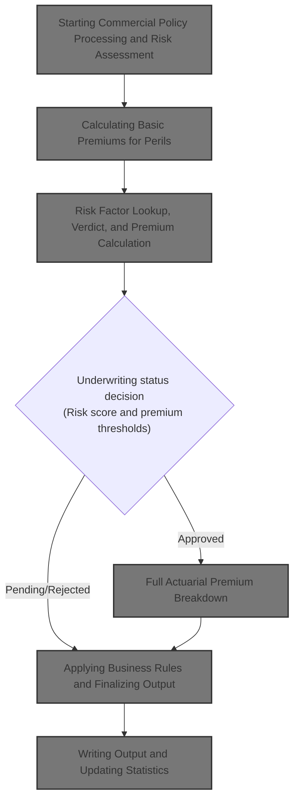
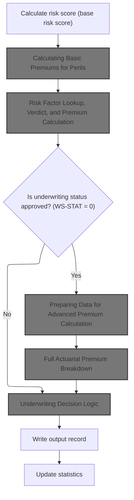
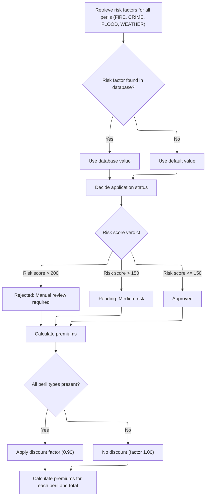
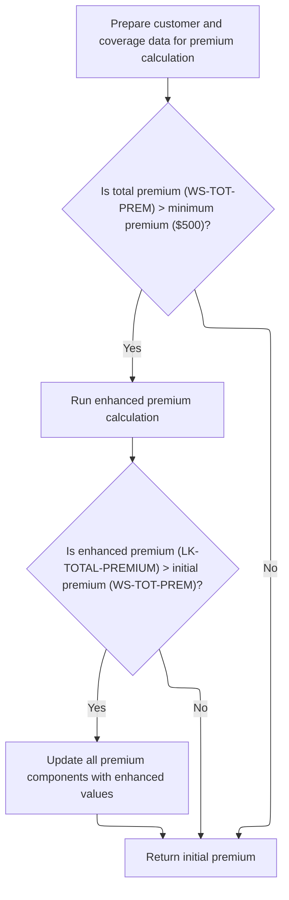
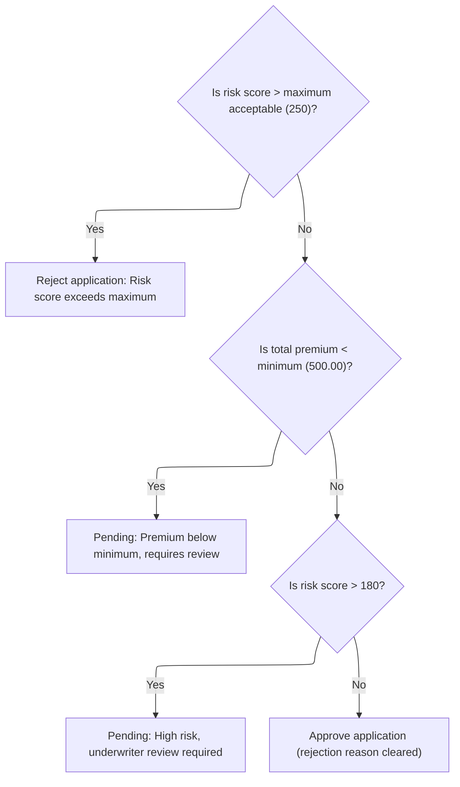

This document describes the flow for processing a commercial insurance application. The process starts with risk assessment and basic premium calculation. Risk factors determine the application's status, and approved cases receive an advanced actuarial premium calculation. Business rules are applied to finalize the underwriting decision, and results are recorded for reporting. The flow transforms customer, property, and coverage data into a final decision and premium breakdown.



# Spec

## Detailed View of the Program's Functionality

a. Starting Commercial Policy Processing and Risk Assessment

The process begins by handling a commercial insurance policy application. The first step is to calculate a risk score for the application. This is done by gathering all relevant property and customer information and passing it to a dedicated risk scoring module. The risk score is essential, as it determines both the pricing of the policy and whether the application can proceed.

Once the risk score is obtained, the next step is to calculate the basic premiums for each type of risk (peril) the policy covers. This calculation uses the risk score as a key input.

b. Calculating Basic Premiums for Perils

The basic premium calculation involves calling a separate module that determines the premium amounts for each peril (such as fire, crime, flood, and weather) and also provides an initial underwriting verdict (approved, pending, or rejected). This module first attempts to retrieve risk factor values for each peril from a database. If a value is not found, it uses a predefined default.

After retrieving the risk factors, the module decides the application status based on the risk score:

- If the risk score is above a high threshold, the application is rejected.
- If the risk score is in a medium range, the application is marked as pending.
- If the risk score is low enough, the application is approved.

Premiums for each peril are then calculated using the risk score, the peril’s risk factor, and whether a discount applies (for example, if all perils are covered, a discount is applied). The total premium is the sum of all individual peril premiums.

c. Risk Factor Lookup, Verdict, and Premium Calculation

For each peril, the system tries to fetch a risk factor from the database. If the lookup fails, a default value is used. The verdict logic then sets the application status and reason based on the risk score thresholds. Premiums are calculated for each peril, and if all perils are present, a discount factor is applied to the calculations. The total premium is then computed as the sum of all peril premiums.

d. Conditional Enhanced Actuarial Calculation

If the initial underwriting status is "approved," the system proceeds to a more advanced actuarial calculation. This step is only performed for approved applications and is designed to provide a more detailed and accurate premium breakdown.

e. Preparing Data for Advanced Premium Calculation

Before running the advanced actuarial calculation, all relevant customer, property, and coverage data is prepared and organized into the required structures. This includes moving all input fields into local structures for the actuarial module.

The system checks if the total premium from the basic calculation exceeds a minimum threshold. If it does, the advanced actuarial calculation is performed. If the enhanced calculation results in a higher premium than the initial one, all premium components are updated with the enhanced values.

f. Full Actuarial Premium Breakdown

The advanced actuarial calculation involves several steps:

- Initialization: All calculation areas are reset, and exposures are computed based on coverage limits and risk score.
- Base Rate Loading: The system attempts to load base rates for each peril from a database. If not found, default rates are used.
- Experience Modifier: An experience modifier is calculated based on years in business and claims history. This modifier is clamped within a specified range.
- Schedule Modifier: Adjustments are made based on building age, protection class, occupancy code, and exposure density. The result is also clamped within limits.
- Premium Calculation: For each peril, the premium is calculated using exposures, base rates, experience and schedule modifiers, and a trend factor. Flood premiums receive an additional multiplier.
- Catastrophe Loading: Additional charges are added for catastrophe risks (hurricane, earthquake, tornado, flood) based on peril selection.
- Expense and Profit Loading: Expense and profit margins are added to the premium.
- Discounts: Discounts are applied for multi-peril coverage, claims-free history, and high deductibles. The total discount is capped at a maximum percentage.
- Taxes: Taxes are calculated as a fixed percentage of the premium after discounts.
- Final Premium: The total premium is summed, and a final rate factor is computed. If this factor exceeds a maximum allowed value, the premium is capped accordingly.

g. Applying Business Rules and Finalizing Output

After the actuarial calculation, business rules are applied to make the final underwriting decision:

- If the risk score exceeds the maximum allowed, the application is rejected.
- If the total premium is below the minimum, the application is marked as pending for review.
- If the risk score is high but not above the maximum, the application is marked as pending for underwriter review.
- Otherwise, the application is approved.

The final decision, along with all calculated values, is prepared for output.

h. Writing Output and Updating Statistics

The final step is to write the results for the application to the output file. This includes all relevant fields such as customer number, property type, risk score, premiums for each peril, total premium, status, and any rejection reason.

After writing the output, statistics are updated to keep track of totals and counts for reporting purposes. This includes updating counts of approved, pending, and rejected applications, as well as aggregating total premiums and risk scores for summary reporting.

# Rule Definition

| Paragraph Name                                                                   | Rule ID | Category          | Description                                                                                                                                                                                                                                                             | Conditions                                                                                                                                                                                      | Remarks                                                                                                                                                                                                             |
| -------------------------------------------------------------------------------- | ------- | ----------------- | ----------------------------------------------------------------------------------------------------------------------------------------------------------------------------------------------------------------------------------------------------------------------- | ----------------------------------------------------------------------------------------------------------------------------------------------------------------------------------------------- | ------------------------------------------------------------------------------------------------------------------------------------------------------------------------------------------------------------------- |
| P008-VALIDATE-INPUT-RECORD in LGAPDB01                                           | RL-001  | Conditional Logic | The system validates that each input record is for a supported policy type (commercial), has a customer number, and at least one coverage limit. It also checks that the total insured value does not exceed the maximum allowed.                                       | Record must be for a commercial policy; customer number must not be blank; at least one of building, contents, or BI limit must be non-zero; total insured value must not exceed 50,000,000.00. | Maximum TIV: 50,000,000.00. Error codes and messages are logged for invalid records. Output for error records sets all premiums and risk score to zero, status to 'ERROR', and includes the first error message.    |
| P011A-CALCULATE-RISK-SCORE in LGAPDB01                                           | RL-002  | Computation       | The system calculates a risk score for each application using all provided property and customer information before any premium or underwriting logic.                                                                                                                  | Triggered for each valid commercial policy application.                                                                                                                                         | Risk score is a numeric value (integer, 3 digits).                                                                                                                                                                  |
| P011B-BASIC-PREMIUM-CALC in LGAPDB01, CALCULATE-PREMIUMS in LGAPDB03             | RL-003  | Computation       | For each peril (fire, crime, flood, weather), the system calculates a basic premium using the risk score, peril flags, peril factors, and a discount factor.                                                                                                            | Triggered for each valid commercial policy application after risk score calculation.                                                                                                            | Peril factors: fire (default 0.80), crime (default 0.60), flood (1.20), weather (0.90). Discount factor: 0.90 if all perils present, else 1.00. Premiums are numeric with 2 decimal places.                         |
| CALCULATE-VERDICT in LGAPDB03, P011D-APPLY-BUSINESS-RULES in LGAPDB01            | RL-004  | Conditional Logic | The system determines the application status based on the risk score: >200 is 'Rejected', >150 is 'Pending', <=150 is 'Approved'. Additional business rules apply for risk score >250 and >180.                                                                         | After risk score and premium calculation.                                                                                                                                                       | Status values: 'REJECTED', 'PENDING', 'APPROVED'. Rejection reason is set for rejected/pending cases.                                                                                                               |
| P011C-ENHANCED-ACTUARIAL-CALC in LGAPDB01, P100-MAIN and subroutines in LGAPDB04 | RL-005  | Computation       | If the total premium exceeds $500, the system performs an enhanced actuarial calculation using detailed property, customer, and coverage data. If the enhanced premium is greater than the initial, all premium components are updated.                                 | Total premium > $500 and underwriting status is approved.                                                                                                                                       | Minimum premium threshold: $500. Enhanced calculation includes experience and schedule modifiers, base premium per peril, discounts (max 25%), and taxes (6.75%).                                                   |
| P400-EXP-MOD and P500-SCHED-MOD in LGAPDB04                                      | RL-006  | Computation       | The experience modifier is calculated based on years in business and claims history, and is clamped between 0.5 and 2.0. The schedule modifier is based on building year, protection class, occupancy code, and exposure density, and is clamped between -0.2 and +0.4. | During enhanced actuarial calculation.                                                                                                                                                          | Experience modifier: 0.5 to 2.0. Schedule modifier: -0.2 to +0.4.                                                                                                                                                   |
| P600-BASE-PREM in LGAPDB04                                                       | RL-007  | Computation       | The flood peril premium is multiplied by 1.25 during enhanced actuarial calculation.                                                                                                                                                                                    | Flood peril is present in enhanced actuarial calculation.                                                                                                                                       | Flood premium multiplier: 1.25.                                                                                                                                                                                     |
| P900-DISC in LGAPDB04                                                            | RL-008  | Computation       | Discounts are calculated based on multi-peril coverage, claims-free history, and deductible amounts, and are capped at a maximum of 25%.                                                                                                                                | During enhanced actuarial calculation.                                                                                                                                                          | Discount cap: 25%. Multi-peril discount: 10% if all perils, 5% for partial. Claims-free: 7.5%. Deductible credits: fire >=10k (2.5%), wind >=25k (3.5%), flood >=50k (4.5%).                                        |
| P950-TAXES in LGAPDB04                                                           | RL-009  | Computation       | Taxes are calculated at a fixed rate of 6.75% on the sum of premium components minus discounts.                                                                                                                                                                         | During enhanced actuarial calculation.                                                                                                                                                          | Tax rate: 6.75%.                                                                                                                                                                                                    |
| P999-FINAL in LGAPDB04                                                           | RL-010  | Computation       | The final premium is calculated and the rate factor (total premium divided by insured value) is capped at 0.05 if exceeded, with premium recalculated if capped.                                                                                                        | After all premium components, discounts, and taxes are calculated.                                                                                                                              | Rate factor cap: 0.05. Premium is recalculated as insured value \* capped rate factor if exceeded.                                                                                                                  |
| P011E-WRITE-OUTPUT-RECORD in LGAPDB01, P005D-WRITE-HEADERS                       | RL-011  | Data Assignment   | The system outputs a record for each processed policy, including customer number, property type, postcode, risk score, premiums for each peril, total premium, status, and rejection reason.                                                                            | After processing each application.                                                                                                                                                              | Fields: customer number (string, 10), property type (string, 15), postcode (string), risk score (number, 3), peril premiums (number, 8+2), total premium (number, 9+2), status (string), rejection reason (string). |
| P011F-UPDATE-STATISTICS in LGAPDB01                                              | RL-012  | Computation       | After each application is processed, the system updates statistics including total premium, risk score totals, and counts for approved, pending, rejected, and high-risk applications.                                                                                  | After outputting each processed record.                                                                                                                                                         | Statistics: total premium (12+2), average risk score (3+2), counts (6 digits).                                                                                                                                      |

# User Stories

## User Story 1: Process risk scoring, basic premium calculation, and underwriting decision

---

### Story Description:

As a system, I want to calculate the risk score, determine the application status, and compute basic premiums for each peril so that each valid application is accurately assessed and priced according to business rules.

---

### Business Rule Mapping:

| Rule ID | Paragraph Name                                                        | Rule Description                                                                                                                                                                                |
| ------- | --------------------------------------------------------------------- | ----------------------------------------------------------------------------------------------------------------------------------------------------------------------------------------------- |
| RL-002  | P011A-CALCULATE-RISK-SCORE in LGAPDB01                                | The system calculates a risk score for each application using all provided property and customer information before any premium or underwriting logic.                                          |
| RL-003  | P011B-BASIC-PREMIUM-CALC in LGAPDB01, CALCULATE-PREMIUMS in LGAPDB03  | For each peril (fire, crime, flood, weather), the system calculates a basic premium using the risk score, peril flags, peril factors, and a discount factor.                                    |
| RL-004  | CALCULATE-VERDICT in LGAPDB03, P011D-APPLY-BUSINESS-RULES in LGAPDB01 | The system determines the application status based on the risk score: >200 is 'Rejected', >150 is 'Pending', <=150 is 'Approved'. Additional business rules apply for risk score >250 and >180. |

---

### Relevant Functionality:

- **P011A-CALCULATE-RISK-SCORE in LGAPDB01**
  1. **RL-002:**
     - Call risk score calculation module with property and customer data.
     - Store result for use in subsequent premium and decision logic.
- **P011B-BASIC-PREMIUM-CALC in LGAPDB01**
  1. **RL-003:**
     - Retrieve peril factor from database; if not found, use default.
     - If all perils present, set discount factor to 0.90; else 1.00.
     - For each peril, compute premium: (risk score \* peril factor) \* peril value \* discount factor.
     - Sum all peril premiums for total premium.
- **CALCULATE-VERDICT in LGAPDB03**
  1. **RL-004:**
     - If risk score > 250, set status to 'REJECTED', set rejection reason.
     - Else if risk score > 200, set status to 'REJECTED', require manual review.
     - Else if risk score > 180, set status to 'PENDING', flag for review.
     - Else if risk score > 150, set status to 'PENDING', mark as medium risk.
     - Else, set status to 'APPROVED'.

## User Story 2: Perform enhanced actuarial premium calculation for high-value policies

---

### Story Description:

As a system, I want to perform an enhanced actuarial premium calculation for approved applications with a total premium above $500 so that advanced pricing, discounts, taxes, and caps are applied for high-value policies.

---

### Business Rule Mapping:

| Rule ID | Paragraph Name                                                                   | Rule Description                                                                                                                                                                                                                                                        |
| ------- | -------------------------------------------------------------------------------- | ----------------------------------------------------------------------------------------------------------------------------------------------------------------------------------------------------------------------------------------------------------------------- |
| RL-005  | P011C-ENHANCED-ACTUARIAL-CALC in LGAPDB01, P100-MAIN and subroutines in LGAPDB04 | If the total premium exceeds $500, the system performs an enhanced actuarial calculation using detailed property, customer, and coverage data. If the enhanced premium is greater than the initial, all premium components are updated.                                 |
| RL-006  | P400-EXP-MOD and P500-SCHED-MOD in LGAPDB04                                      | The experience modifier is calculated based on years in business and claims history, and is clamped between 0.5 and 2.0. The schedule modifier is based on building year, protection class, occupancy code, and exposure density, and is clamped between -0.2 and +0.4. |
| RL-007  | P600-BASE-PREM in LGAPDB04                                                       | The flood peril premium is multiplied by 1.25 during enhanced actuarial calculation.                                                                                                                                                                                    |
| RL-008  | P900-DISC in LGAPDB04                                                            | Discounts are calculated based on multi-peril coverage, claims-free history, and deductible amounts, and are capped at a maximum of 25%.                                                                                                                                |
| RL-009  | P950-TAXES in LGAPDB04                                                           | Taxes are calculated at a fixed rate of 6.75% on the sum of premium components minus discounts.                                                                                                                                                                         |
| RL-010  | P999-FINAL in LGAPDB04                                                           | The final premium is calculated and the rate factor (total premium divided by insured value) is capped at 0.05 if exceeded, with premium recalculated if capped.                                                                                                        |

---

### Relevant Functionality:

- **P011C-ENHANCED-ACTUARIAL-CALC in LGAPDB01**
  1. **RL-005:**
     - If total premium > 500, call actuarial calculation module with detailed data.
     - If enhanced premium > initial, update all premium components with enhanced values.
     - Else, retain initial premium.
- **P400-EXP-MOD and P500-SCHED-MOD in LGAPDB04**
  1. **RL-006:**
     - Compute experience modifier; if >2.0, set to 2.0; if <0.5, set to 0.5.
     - Compute schedule modifier; if >0.4, set to 0.4; if <-0.2, set to -0.2.
- **P600-BASE-PREM in LGAPDB04**
  1. **RL-007:**
     - If flood peril is present, multiply calculated flood premium by 1.25.
- **P900-DISC in LGAPDB04**
  1. **RL-008:**
     - Calculate multi-peril, claims-free, and deductible discounts.
     - Sum discounts; if total > 0.25, cap at 0.25.
     - Apply discount to premium components.
- **P950-TAXES in LGAPDB04**
  1. **RL-009:**
     - Compute tax as 6.75% of (base + cat load + expense + profit - discount).
- **P999-FINAL in LGAPDB04**
  1. **RL-010:**
     - Compute rate factor as total premium / insured value.
     - If rate factor > 0.05, set to 0.05 and recalculate premium.

## User Story 3: Manage application intake, error handling, output, and statistics update

---

### Story Description:

As a system, I want to validate input records, handle errors, output processed policy records, and update processing statistics so that only valid applications are processed, errors are reported, and complete results and analytics are available for each application.

---

### Business Rule Mapping:

| Rule ID | Paragraph Name                                             | Rule Description                                                                                                                                                                                                                  |
| ------- | ---------------------------------------------------------- | --------------------------------------------------------------------------------------------------------------------------------------------------------------------------------------------------------------------------------- |
| RL-001  | P008-VALIDATE-INPUT-RECORD in LGAPDB01                     | The system validates that each input record is for a supported policy type (commercial), has a customer number, and at least one coverage limit. It also checks that the total insured value does not exceed the maximum allowed. |
| RL-011  | P011E-WRITE-OUTPUT-RECORD in LGAPDB01, P005D-WRITE-HEADERS | The system outputs a record for each processed policy, including customer number, property type, postcode, risk score, premiums for each peril, total premium, status, and rejection reason.                                      |
| RL-012  | P011F-UPDATE-STATISTICS in LGAPDB01                        | After each application is processed, the system updates statistics including total premium, risk score totals, and counts for approved, pending, rejected, and high-risk applications.                                            |

---

### Relevant Functionality:

- **P008-VALIDATE-INPUT-RECORD in LGAPDB01**
  1. **RL-001:**
     - If policy type is not commercial, log error.
     - If customer number is blank, log error.
     - If all coverage limits are zero, log error.
     - If total insured value exceeds max, log warning.
     - For error records, output zeroed premiums and status 'ERROR'.
- **P011E-WRITE-OUTPUT-RECORD in LGAPDB01**
  1. **RL-011:**
     - Assign all output fields from processing results.
     - Write output record to file.
- **P011F-UPDATE-STATISTICS in LGAPDB01**
  1. **RL-012:**
     - Add premium to total.
     - Add risk score to control total.
     - Increment appropriate status counter.
     - If risk score > 200, increment high-risk counter.

# Code Walkthrough

## Starting Commercial Policy Processing and Risk Assessment



<SwmSnippet path="/base/src/LGAPDB01.cbl" line="258">

---

In `P011-PROCESS-COMMERCIAL`, we kick off the flow by calculating the base risk score using P011A-CALCULATE-RISK-SCORE. This is needed because all premium calculations and underwriting decisions downstream depend on having a risk score for the application. Without it, we can't price the policy or decide if it's acceptable, so it's always the first step.

```cobol
       P011-PROCESS-COMMERCIAL.
           PERFORM P011A-CALCULATE-RISK-SCORE
           PERFORM P011B-BASIC-PREMIUM-CALC
```

---

</SwmSnippet>

<SwmSnippet path="/base/src/LGAPDB01.cbl" line="268">

---

`P011A-CALCULATE-RISK-SCORE` just calls LGAPDB02, passing in all the property and customer info. The actual risk score calculation is done in LGAPDB02, so this function is just a wrapper to get the score back for use in the rest of the flow.

```cobol
       P011A-CALCULATE-RISK-SCORE.
           CALL 'LGAPDB02' USING IN-PROPERTY-TYPE, IN-POSTCODE, 
                                IN-LATITUDE, IN-LONGITUDE,
                                IN-BUILDING-LIMIT, IN-CONTENTS-LIMIT,
                                IN-FLOOD-COVERAGE, IN-WEATHER-COVERAGE,
                                IN-CUSTOMER-HISTORY, WS-BASE-RISK-SCR.
```

---

</SwmSnippet>

<SwmSnippet path="/base/src/LGAPDB01.cbl" line="258">

---

Back in `P011-PROCESS-COMMERCIAL`, after getting the risk score, we immediately call P011B-BASIC-PREMIUM-CALC. This is because the premium calculation needs the risk score as input, so there's no point in proceeding without it.

```cobol
       P011-PROCESS-COMMERCIAL.
           PERFORM P011A-CALCULATE-RISK-SCORE
           PERFORM P011B-BASIC-PREMIUM-CALC
```

---

</SwmSnippet>

### Calculating Basic Premiums for Perils

<SwmSnippet path="/base/src/LGAPDB01.cbl" line="275">

---

`P011B-BASIC-PREMIUM-CALC` calls LGAPDB03 to get the premium amounts for each peril and the risk verdict. All the calculation logic for premiums is in LGAPDB03, so this step just passes the risk score and peril flags over and gets the results back.

```cobol
       P011B-BASIC-PREMIUM-CALC.
           CALL 'LGAPDB03' USING WS-BASE-RISK-SCR, IN-FIRE-PERIL, 
                                IN-CRIME-PERIL, IN-FLOOD-PERIL, 
                                IN-WEATHER-PERIL, WS-STAT,
                                WS-STAT-DESC, WS-REJ-RSN, WS-FR-PREM,
                                WS-CR-PREM, WS-FL-PREM, WS-WE-PREM,
                                WS-TOT-PREM, WS-DISC-FACT.
```

---

</SwmSnippet>

### Risk Factor Lookup, Verdict, and Premium Calculation



<SwmSnippet path="/base/src/LGAPDB03.cbl" line="42">

---

`MAIN-LOGIC` runs the whole risk and premium calculation sequence: first it grabs risk factors from the DB, then sets the verdict based on the risk score, then calculates premiums for each peril. All the logic is chained so each step has what it needs from the previous.

```cobol
       MAIN-LOGIC.
           PERFORM GET-RISK-FACTORS
           PERFORM CALCULATE-VERDICT
           PERFORM CALCULATE-PREMIUMS
           GOBACK.
```

---

</SwmSnippet>

<SwmSnippet path="/base/src/LGAPDB03.cbl" line="48">

---

`GET-RISK-FACTORS` pulls risk factor values for FIRE and CRIME from the database, but if the lookup fails, it just uses hardcoded defaults (0.80 for FIRE, 0.60 for CRIME) so the rest of the flow doesn't break.

```cobol
       GET-RISK-FACTORS.
           EXEC SQL
               SELECT FACTOR_VALUE INTO :WS-FIRE-FACTOR
               FROM RISK_FACTORS
               WHERE PERIL_TYPE = 'FIRE'
           END-EXEC.
           
           IF SQLCODE = 0
               CONTINUE
           ELSE
               MOVE 0.80 TO WS-FIRE-FACTOR
           END-IF.
           
           EXEC SQL
               SELECT FACTOR_VALUE INTO :WS-CRIME-FACTOR
               FROM RISK_FACTORS
               WHERE PERIL_TYPE = 'CRIME'
           END-EXEC.
           
           IF SQLCODE = 0
               CONTINUE
           ELSE
               MOVE 0.60 TO WS-CRIME-FACTOR
           END-IF.
```

---

</SwmSnippet>

<SwmSnippet path="/base/src/LGAPDB03.cbl" line="73">

---

`CALCULATE-VERDICT` uses the risk score to set the application status: over 200 is rejected, over 150 is pending, otherwise it's approved. The verdict and reason are set based on these thresholds.

```cobol
       CALCULATE-VERDICT.
           IF LK-RISK-SCORE > 200
             MOVE 2 TO LK-STAT
             MOVE 'REJECTED' TO LK-STAT-DESC
             MOVE 'High Risk Score - Manual Review Required' 
               TO LK-REJ-RSN
           ELSE
             IF LK-RISK-SCORE > 150
               MOVE 1 TO LK-STAT
               MOVE 'PENDING' TO LK-STAT-DESC
               MOVE 'Medium Risk - Pending Review'
                 TO LK-REJ-RSN
             ELSE
               MOVE 0 TO LK-STAT
               MOVE 'APPROVED' TO LK-STAT-DESC
               MOVE SPACES TO LK-REJ-RSN
             END-IF
           END-IF.
```

---

</SwmSnippet>

<SwmSnippet path="/base/src/LGAPDB03.cbl" line="92">

---

`CALCULATE-PREMIUMS` figures out the premium for each peril using the risk score, peril factor, peril value, and a discount factor. If all perils are covered, it applies a 10% discount to all premiums. Then it sums up the individual premiums for the total.

```cobol
       CALCULATE-PREMIUMS.
           MOVE 1.00 TO LK-DISC-FACT
           
           IF LK-FIRE-PERIL > 0 AND
              LK-CRIME-PERIL > 0 AND
              LK-FLOOD-PERIL > 0 AND
              LK-WEATHER-PERIL > 0
             MOVE 0.90 TO LK-DISC-FACT
           END-IF

           COMPUTE LK-FIRE-PREMIUM =
             ((LK-RISK-SCORE * WS-FIRE-FACTOR) * LK-FIRE-PERIL *
               LK-DISC-FACT)
           
           COMPUTE LK-CRIME-PREMIUM =
             ((LK-RISK-SCORE * WS-CRIME-FACTOR) * LK-CRIME-PERIL *
               LK-DISC-FACT)
           
           COMPUTE LK-FLOOD-PREMIUM =
             ((LK-RISK-SCORE * WS-FLOOD-FACTOR) * LK-FLOOD-PERIL *
               LK-DISC-FACT)
           
           COMPUTE LK-WEATHER-PREMIUM =
             ((LK-RISK-SCORE * WS-WEATHER-FACTOR) * LK-WEATHER-PERIL *
               LK-DISC-FACT)

           COMPUTE LK-TOTAL-PREMIUM = 
             LK-FIRE-PREMIUM + LK-CRIME-PREMIUM + 
             LK-FLOOD-PREMIUM + LK-WEATHER-PREMIUM. 
```

---

</SwmSnippet>

### Conditional Enhanced Actuarial Calculation

<SwmSnippet path="/base/src/LGAPDB01.cbl" line="261">

---

After `P011B-BASIC-PREMIUM-CALC`, `P011-PROCESS-COMMERCIAL` checks if the underwriting status is approved (WS-STAT = 0). If so, it runs P011C-ENHANCED-ACTUARIAL-CALC to get a more detailed premium calculation. This only happens for approved cases.

```cobol
           IF WS-STAT = 0
               PERFORM P011C-ENHANCED-ACTUARIAL-CALC
           END-IF
```

---

</SwmSnippet>

### Preparing Data for Advanced Premium Calculation



<SwmSnippet path="/base/src/LGAPDB01.cbl" line="283">

---

In `P011C-ENHANCED-ACTUARIAL-CALC`, we prep all the customer, property, and coverage fields by moving them into the local structures. This sets up the data for the advanced actuarial calculation that comes next.

```cobol
       P011C-ENHANCED-ACTUARIAL-CALC.
      *    Prepare input structure for actuarial calculation
           MOVE IN-CUSTOMER-NUM TO LK-CUSTOMER-NUM
           MOVE WS-BASE-RISK-SCR TO LK-RISK-SCORE
           MOVE IN-PROPERTY-TYPE TO LK-PROPERTY-TYPE
           MOVE IN-TERRITORY-CODE TO LK-TERRITORY
           MOVE IN-CONSTRUCTION-TYPE TO LK-CONSTRUCTION-TYPE
           MOVE IN-OCCUPANCY-CODE TO LK-OCCUPANCY-CODE
           MOVE IN-SPRINKLER-IND TO LK-PROTECTION-CLASS
           MOVE IN-YEAR-BUILT TO LK-YEAR-BUILT
           MOVE IN-SQUARE-FOOTAGE TO LK-SQUARE-FOOTAGE
           MOVE IN-YEARS-IN-BUSINESS TO LK-YEARS-IN-BUSINESS
           MOVE IN-CLAIMS-COUNT-3YR TO LK-CLAIMS-COUNT-5YR
           MOVE IN-CLAIMS-AMOUNT-3YR TO LK-CLAIMS-AMOUNT-5YR
           
      *    Set coverage data
           MOVE IN-BUILDING-LIMIT TO LK-BUILDING-LIMIT
           MOVE IN-CONTENTS-LIMIT TO LK-CONTENTS-LIMIT
           MOVE IN-BI-LIMIT TO LK-BI-LIMIT
           MOVE IN-FIRE-DEDUCTIBLE TO LK-FIRE-DEDUCTIBLE
           MOVE IN-WIND-DEDUCTIBLE TO LK-WIND-DEDUCTIBLE
           MOVE IN-FLOOD-DEDUCTIBLE TO LK-FLOOD-DEDUCTIBLE
           MOVE IN-OTHER-DEDUCTIBLE TO LK-OTHER-DEDUCTIBLE
           MOVE IN-FIRE-PERIL TO LK-FIRE-PERIL
           MOVE IN-CRIME-PERIL TO LK-CRIME-PERIL
           MOVE IN-FLOOD-PERIL TO LK-FLOOD-PERIL
           MOVE IN-WEATHER-PERIL TO LK-WEATHER-PERIL
```

---

</SwmSnippet>

<SwmSnippet path="/base/src/LGAPDB01.cbl" line="312">

---

After prepping the data in `P011C-ENHANCED-ACTUARIAL-CALC`, we call LGAPDB04 if the total premium is above the minimum. LGAPDB04 does the full actuarial breakdown, and if it calculates a higher premium, we update the premium fields with the new values.

```cobol
           IF WS-TOT-PREM > WS-MIN-PREMIUM
               CALL 'LGAPDB04' USING LK-INPUT-DATA, LK-COVERAGE-DATA, 
                                    LK-OUTPUT-RESULTS
               
      *        Update with enhanced calculations if successful
               IF LK-TOTAL-PREMIUM > WS-TOT-PREM
                   MOVE LK-FIRE-PREMIUM TO WS-FR-PREM
                   MOVE LK-CRIME-PREMIUM TO WS-CR-PREM
                   MOVE LK-FLOOD-PREMIUM TO WS-FL-PREM
                   MOVE LK-WEATHER-PREMIUM TO WS-WE-PREM
                   MOVE LK-TOTAL-PREMIUM TO WS-TOT-PREM
                   MOVE LK-EXPERIENCE-MOD TO WS-EXPERIENCE-MOD
               END-IF
           END-IF.
```

---

</SwmSnippet>

### Full Actuarial Premium Breakdown

```mermaid
%%{init: {"flowchart": {"defaultRenderer": "elk"}} }%%
flowchart TD
    node1["Start premium calculation"]
    click node1 openCode "base/src/LGAPDB04.cbl:138:150"
    node1 --> node2{"Years in business >= 5?"}
    click node2 openCode "base/src/LGAPDB04.cbl:234:258"
    node2 -->|"Yes"| node3{"Claims count (5yr) = 0?"}
    node2 -->|"No"| node4["Set experience modifier to higher value"]
    click node4 openCode "base/src/LGAPDB04.cbl:234:258"
    node3 -->|"Yes"| node5["Set experience modifier to lower value"]
    click node5 openCode "base/src/LGAPDB04.cbl:234:258"
    node3 -->|"No"| node6["Calculate experience modifier based on claims amount"]
    click node6 openCode "base/src/LGAPDB04.cbl:234:258"
    node5 --> node7["Calculate schedule modifier"]
    node6 --> node7
    node4 --> node7
    click node7 openCode "base/src/LGAPDB04.cbl:260:316"
    node7 --> node8{"Building year?"}
    click node8 openCode "base/src/LGAPDB04.cbl:265:273"
    node8 -->|"#gt;= 2010"| node9["Subtract 0.050"]
    node8 -->|"#gt;= 1990"| node10["Continue"]
    node8 -->|"#gt;= 1970"| node11["Add 0.100"]
    node8 -->|"Other"| node12["Add 0.200"]
    node9 --> node13{"Protection class?"}
    node10 --> node13
    node11 --> node13
    node12 --> node13
    click node13 openCode "base/src/LGAPDB04.cbl:276:285"
    node13 -->|"'01'-'03'"| node14["Subtract 0.100"]
    node13 -->|"'04'-'06'"| node15["Subtract 0.050"]
    node13 -->|"'07'-'09'"| node16["Continue"]
    node13 -->|"Other"| node17["Add 0.150"]
    node14 --> node18{"Occupancy code?"}
    node15 --> node18
    node16 --> node18
    node17 --> node18
    click node18 openCode "base/src/LGAPDB04.cbl:288:297"
    node18 -->|"'OFF01'-'OFF05'"| node19["Subtract 0.025"]
    node18 -->|"'MFG01'-'MFG10'"| node20["Add 0.075"]
    node18 -->|"'WHS01'-'WHS05'"| node21["Add 0.125"]
    node18 -->|"Other"| node22["Continue"]
    node19 --> node23{"Exposure density?"}
    node20 --> node23
    node21 --> node23
    node22 --> node23
    click node23 openCode "base/src/LGAPDB04.cbl:300:306"
    node23 -->|"#gt; 500"| node24["Add 0.100"]
    node23 -->|"#lt; 50"| node25["Subtract 0.050"]
    node23 -->|"Other"| node26["Continue"]
    node24 --> node27["Cap schedule modifier if needed"]
    node25 --> node27
    node26 --> node27
    click node27 openCode "base/src/LGAPDB04.cbl:308:314"
    node27 --> node28{"Peril selected?"}
    click node28 openCode "base/src/LGAPDB04.cbl:322:367"
    node28 -->|"Fire"| node29["Calculate fire premium"]
    node28 -->|"Crime"| node30["Calculate crime premium"]
    node28 -->|"Flood"| node31["Calculate flood premium"]
    node28 -->|"Weather"| node32["Calculate weather premium"]
    node29 --> node33["Sum base premium"]
    node30 --> node33
    node31 --> node33
    node32 --> node33
    click node33 openCode "base/src/LGAPDB04.cbl:330:367"
    node33 --> node34["Apply discounts (multi-peril, claims-free, deductible)"]
    click node34 openCode "base/src/LGAPDB04.cbl:407:454"
    node34 --> node35{"Is total discount > 25%?"}
    click node35 openCode "base/src/LGAPDB04.cbl:447:449"
    node35 -->|"Yes"| node36["Cap discount at 25%"]
    node35 -->|"No"| node37["Continue with calculated discount"]
    click node36 openCode "base/src/LGAPDB04.cbl:447:449"
    click node37 openCode "base/src/LGAPDB04.cbl:443:446"
    node36 --> node38["Apply taxes"]
    node37 --> node38
    click node38 openCode "base/src/LGAPDB04.cbl:456:462"
    node38 --> node39["Calculate final premium"]
    click node39 openCode "base/src/LGAPDB04.cbl:464:477"
    node39 --> node40{"Is final rate factor > 0.050000?"}
    click node40 openCode "base/src/LGAPDB04.cbl:473:477"
    node40 -->|"Yes"| node41["Cap rate factor and recalculate premium"]
    node40 -->|"No"| node42["Finish premium calculation"]
    click node41 openCode "base/src/LGAPDB04.cbl:474:477"
    click node42 openCode "base/src/LGAPDB04.cbl:465:472"
    node41 --> node42
classDef HeadingStyle fill:#777777,stroke:#333,stroke-width:2px;
```



<SwmSnippet path="/base/src/LGAPDB04.cbl" line="138">

---

`P100-MAIN` runs through all the actuarial premium calculation steps: exposure, rates, experience mod, schedule mod, base premium, catastrophe load, expense, discount, taxes, and final premium. Each step adds a piece to the total premium.

```cobol
       P100-MAIN.
           PERFORM P200-INIT
           PERFORM P300-RATES
           PERFORM P350-EXPOSURE
           PERFORM P400-EXP-MOD
           PERFORM P500-SCHED-MOD
           PERFORM P600-BASE-PREM
           PERFORM P700-CAT-LOAD
           PERFORM P800-EXPENSE
           PERFORM P900-DISC
           PERFORM P950-TAXES
           PERFORM P999-FINAL
           GOBACK.
```

---

</SwmSnippet>

<SwmSnippet path="/base/src/LGAPDB04.cbl" line="234">

---

`P400-EXP-MOD` calculates the experience modifier for pricing based on years in business and claims history. It uses a bunch of constants to set or adjust the modifier, and clamps it between 0.5 and 2.0 before output.

```cobol
       P400-EXP-MOD.
           MOVE 1.0000 TO WS-EXPERIENCE-MOD
           
           IF LK-YEARS-IN-BUSINESS >= 5
               IF LK-CLAIMS-COUNT-5YR = ZERO
                   MOVE 0.8500 TO WS-EXPERIENCE-MOD
               ELSE
                   COMPUTE WS-EXPERIENCE-MOD = 
                       1.0000 + 
                       ((LK-CLAIMS-AMOUNT-5YR / WS-TOTAL-INSURED-VAL) * 
                        WS-CREDIBILITY-FACTOR * 0.50)
                   
                   IF WS-EXPERIENCE-MOD > 2.0000
                       MOVE 2.0000 TO WS-EXPERIENCE-MOD
                   END-IF
                   
                   IF WS-EXPERIENCE-MOD < 0.5000
                       MOVE 0.5000 TO WS-EXPERIENCE-MOD
                   END-IF
               END-IF
           ELSE
               MOVE 1.1000 TO WS-EXPERIENCE-MOD
           END-IF
           
           MOVE WS-EXPERIENCE-MOD TO LK-EXPERIENCE-MOD.
```

---

</SwmSnippet>

<SwmSnippet path="/base/src/LGAPDB04.cbl" line="260">

---

`P500-SCHED-MOD` adjusts the schedule modifier using building age, protection class, occupancy code, and exposure density, with each factor adding or subtracting a set amount. The result is clamped between -0.2 and +0.4 before output.

```cobol
       P500-SCHED-MOD.
           MOVE +0.000 TO WS-SCHEDULE-MOD
           
      *    Building age factor
           EVALUATE TRUE
               WHEN LK-YEAR-BUILT >= 2010
                   SUBTRACT 0.050 FROM WS-SCHEDULE-MOD
               WHEN LK-YEAR-BUILT >= 1990
                   CONTINUE
               WHEN LK-YEAR-BUILT >= 1970
                   ADD 0.100 TO WS-SCHEDULE-MOD
               WHEN OTHER
                   ADD 0.200 TO WS-SCHEDULE-MOD
           END-EVALUATE
           
      *    Protection class factor
           EVALUATE LK-PROTECTION-CLASS
               WHEN '01' THRU '03'
                   SUBTRACT 0.100 FROM WS-SCHEDULE-MOD
               WHEN '04' THRU '06'
                   SUBTRACT 0.050 FROM WS-SCHEDULE-MOD
               WHEN '07' THRU '09'
                   CONTINUE
               WHEN OTHER
                   ADD 0.150 TO WS-SCHEDULE-MOD
           END-EVALUATE
           
      *    Occupancy hazard factor
           EVALUATE LK-OCCUPANCY-CODE
               WHEN 'OFF01' THRU 'OFF05'
                   SUBTRACT 0.025 FROM WS-SCHEDULE-MOD
               WHEN 'MFG01' THRU 'MFG10'
                   ADD 0.075 TO WS-SCHEDULE-MOD
               WHEN 'WHS01' THRU 'WHS05'
                   ADD 0.125 TO WS-SCHEDULE-MOD
               WHEN OTHER
                   CONTINUE
           END-EVALUATE
           
      *    Exposure density factor
           IF WS-EXPOSURE-DENSITY > 500.00
               ADD 0.100 TO WS-SCHEDULE-MOD
           ELSE
               IF WS-EXPOSURE-DENSITY < 50.00
                   SUBTRACT 0.050 FROM WS-SCHEDULE-MOD
               END-IF
           END-IF
           
           IF WS-SCHEDULE-MOD > +0.400
               MOVE +0.400 TO WS-SCHEDULE-MOD
           END-IF
           
           IF WS-SCHEDULE-MOD < -0.200
               MOVE -0.200 TO WS-SCHEDULE-MOD
           END-IF
           
           MOVE WS-SCHEDULE-MOD TO LK-SCHEDULE-MOD.
```

---

</SwmSnippet>

<SwmSnippet path="/base/src/LGAPDB04.cbl" line="318">

---

`P600-BASE-PREM` calculates the base premium for each peril using exposures, base rates, experience and schedule mods, and a trend factor. Flood gets an extra 1.25 multiplier. All premiums are summed into the base amount.

```cobol
       P600-BASE-PREM.
           MOVE ZERO TO LK-BASE-AMOUNT
           
      * FIRE PREMIUM
           IF LK-FIRE-PERIL > ZERO
               COMPUTE LK-FIRE-PREMIUM = 
                   (WS-BUILDING-EXPOSURE + WS-CONTENTS-EXPOSURE) *
                   WS-BASE-RATE (1, 1, 1, 1) * 
                   WS-EXPERIENCE-MOD *
                   (1 + WS-SCHEDULE-MOD) *
                   WS-TREND-FACTOR
                   
               ADD LK-FIRE-PREMIUM TO LK-BASE-AMOUNT
           END-IF
           
      * CRIME PREMIUM
           IF LK-CRIME-PERIL > ZERO
               COMPUTE LK-CRIME-PREMIUM = 
                   (WS-CONTENTS-EXPOSURE * 0.80) *
                   WS-BASE-RATE (2, 1, 1, 1) * 
                   WS-EXPERIENCE-MOD *
                   (1 + WS-SCHEDULE-MOD) *
                   WS-TREND-FACTOR
                   
               ADD LK-CRIME-PREMIUM TO LK-BASE-AMOUNT
           END-IF
           
      * FLOOD PREMIUM
           IF LK-FLOOD-PERIL > ZERO
               COMPUTE LK-FLOOD-PREMIUM = 
                   WS-BUILDING-EXPOSURE *
                   WS-BASE-RATE (3, 1, 1, 1) * 
                   WS-EXPERIENCE-MOD *
                   (1 + WS-SCHEDULE-MOD) *
                   WS-TREND-FACTOR * 1.25
                   
               ADD LK-FLOOD-PREMIUM TO LK-BASE-AMOUNT
           END-IF
           
      * WEATHER PREMIUM
           IF LK-WEATHER-PERIL > ZERO
               COMPUTE LK-WEATHER-PREMIUM = 
                   (WS-BUILDING-EXPOSURE + WS-CONTENTS-EXPOSURE) *
                   WS-BASE-RATE (4, 1, 1, 1) * 
                   WS-EXPERIENCE-MOD *
                   (1 + WS-SCHEDULE-MOD) *
                   WS-TREND-FACTOR
                   
               ADD LK-WEATHER-PREMIUM TO LK-BASE-AMOUNT
           END-IF.
```

---

</SwmSnippet>

<SwmSnippet path="/base/src/LGAPDB04.cbl" line="407">

---

`P900-DISC` calculates discounts based on how many perils are covered, claims-free history, and deductible amounts. It adds up all the discounts, caps the total at 25%, and applies it to the premium components.

```cobol
       P900-DISC.
           MOVE ZERO TO WS-TOTAL-DISCOUNT
           
      * Multi-peril discount
           MOVE ZERO TO WS-MULTI-PERIL-DISC
           IF LK-FIRE-PERIL > ZERO AND
              LK-CRIME-PERIL > ZERO AND
              LK-FLOOD-PERIL > ZERO AND
              LK-WEATHER-PERIL > ZERO
               MOVE 0.100 TO WS-MULTI-PERIL-DISC
           ELSE
               IF LK-FIRE-PERIL > ZERO AND
                  LK-WEATHER-PERIL > ZERO AND
                  (LK-CRIME-PERIL > ZERO OR LK-FLOOD-PERIL > ZERO)
                   MOVE 0.050 TO WS-MULTI-PERIL-DISC
               END-IF
           END-IF
           
      * Claims-free discount  
           MOVE ZERO TO WS-CLAIMS-FREE-DISC
           IF LK-CLAIMS-COUNT-5YR = ZERO AND LK-YEARS-IN-BUSINESS >= 5
               MOVE 0.075 TO WS-CLAIMS-FREE-DISC
           END-IF
           
      * Deductible credit
           MOVE ZERO TO WS-DEDUCTIBLE-CREDIT
           IF LK-FIRE-DEDUCTIBLE >= 10000
               ADD 0.025 TO WS-DEDUCTIBLE-CREDIT
           END-IF
           IF LK-WIND-DEDUCTIBLE >= 25000  
               ADD 0.035 TO WS-DEDUCTIBLE-CREDIT
           END-IF
           IF LK-FLOOD-DEDUCTIBLE >= 50000
               ADD 0.045 TO WS-DEDUCTIBLE-CREDIT
           END-IF
           
           COMPUTE WS-TOTAL-DISCOUNT = 
               WS-MULTI-PERIL-DISC + WS-CLAIMS-FREE-DISC + 
               WS-DEDUCTIBLE-CREDIT
               
           IF WS-TOTAL-DISCOUNT > 0.250
               MOVE 0.250 TO WS-TOTAL-DISCOUNT
           END-IF
           
           COMPUTE LK-DISCOUNT-AMT = 
               (LK-BASE-AMOUNT + LK-CAT-LOAD-AMT + 
                LK-EXPENSE-LOAD-AMT + LK-PROFIT-LOAD-AMT) *
               WS-TOTAL-DISCOUNT.
```

---

</SwmSnippet>

<SwmSnippet path="/base/src/LGAPDB04.cbl" line="456">

---

`P950-TAXES` calculates the tax by applying a fixed 6.75% rate to the sum of premium components minus the discount. The result is moved to the output tax field.

```cobol
       P950-TAXES.
           COMPUTE WS-TAX-AMOUNT = 
               (LK-BASE-AMOUNT + LK-CAT-LOAD-AMT + 
                LK-EXPENSE-LOAD-AMT + LK-PROFIT-LOAD-AMT - 
                LK-DISCOUNT-AMT) * 0.0675
                
           MOVE WS-TAX-AMOUNT TO LK-TAX-AMT.
```

---

</SwmSnippet>

<SwmSnippet path="/base/src/LGAPDB04.cbl" line="464">

---

`P999-FINAL` sums up all the premium components, divides by the insured value for the rate factor, and caps it at 0.05 if needed. If capped, it recalculates the premium to match the max rate.

```cobol
       P999-FINAL.
           COMPUTE LK-TOTAL-PREMIUM = 
               LK-BASE-AMOUNT + LK-CAT-LOAD-AMT + 
               LK-EXPENSE-LOAD-AMT + LK-PROFIT-LOAD-AMT -
               LK-DISCOUNT-AMT + LK-TAX-AMT
               
           COMPUTE LK-FINAL-RATE-FACTOR = 
               LK-TOTAL-PREMIUM / WS-TOTAL-INSURED-VAL
               
           IF LK-FINAL-RATE-FACTOR > 0.050000
               MOVE 0.050000 TO LK-FINAL-RATE-FACTOR
               COMPUTE LK-TOTAL-PREMIUM = 
                   WS-TOTAL-INSURED-VAL * LK-FINAL-RATE-FACTOR
           END-IF.
```

---

</SwmSnippet>

### Applying Business Rules and Finalizing Output

<SwmSnippet path="/base/src/LGAPDB01.cbl" line="264">

---

After enhanced actuarial calculation in `P011-PROCESS-COMMERCIAL`, we run P011D-APPLY-BUSINESS-RULES to set the final underwriting decision based on the risk score and premium. This step uses all the calculated values to decide if the application is approved, pending, or rejected.

```cobol
           PERFORM P011D-APPLY-BUSINESS-RULES
           PERFORM P011E-WRITE-OUTPUT-RECORD
           PERFORM P011F-UPDATE-STATISTICS.
```

---

</SwmSnippet>

### Underwriting Decision Logic



<SwmSnippet path="/base/src/LGAPDB01.cbl" line="327">

---

In `P011D-APPLY-BUSINESS-RULES`, we start by checking if the risk score is above the max allowed. If so, the case is rejected and the reason is set. This uses the configured thresholds and status codes.

```cobol
       P011D-APPLY-BUSINESS-RULES.
      *    Determine underwriting decision based on enhanced criteria
           EVALUATE TRUE
               WHEN WS-BASE-RISK-SCR > WS-MAX-RISK-SCORE
                   MOVE 2 TO WS-STAT
                   MOVE 'REJECTED' TO WS-STAT-DESC
                   MOVE 'Risk score exceeds maximum acceptable level' 
                        TO WS-REJ-RSN
```

---

</SwmSnippet>

<SwmSnippet path="/base/src/LGAPDB01.cbl" line="335">

---

After the risk score check, if the premium is below the minimum, we set the status to pending and flag it for review. This comes right after the rejection logic and before the high risk check.

```cobol
               WHEN WS-TOT-PREM < WS-MIN-PREMIUM
                   MOVE 1 TO WS-STAT
                   MOVE 'PENDING' TO WS-STAT-DESC
                   MOVE 'Premium below minimum - requires review'
                        TO WS-REJ-RSN
```

---

</SwmSnippet>

<SwmSnippet path="/base/src/LGAPDB01.cbl" line="340">

---

Next up, if the risk score is above 180 but not over the max, we set the status to pending for underwriter review. This sits between the premium check and the final approval branch.

```cobol
               WHEN WS-BASE-RISK-SCR > 180
                   MOVE 1 TO WS-STAT
                   MOVE 'PENDING' TO WS-STAT-DESC
                   MOVE 'High risk - underwriter review required'
                        TO WS-REJ-RSN
```

---

</SwmSnippet>

<SwmSnippet path="/base/src/LGAPDB01.cbl" line="345">

---

Finally, if none of the previous conditions hit, we set the status to approved and clear the rejection reason. This wraps up the decision logic and sets up the output for the next steps.

```cobol
               WHEN OTHER
                   MOVE 0 TO WS-STAT
                   MOVE 'APPROVED' TO WS-STAT-DESC
                   MOVE SPACES TO WS-REJ-RSN
           END-EVALUATE.
```

---

</SwmSnippet>

### Writing Output and Updating Statistics

<SwmSnippet path="/base/src/LGAPDB01.cbl" line="264">

---

After setting the decision and writing the output record in `P011-PROCESS-COMMERCIAL`, we update statistics to keep track of totals and counts for reporting. This wraps up the flow for each application.

```cobol
           PERFORM P011D-APPLY-BUSINESS-RULES
           PERFORM P011E-WRITE-OUTPUT-RECORD
           PERFORM P011F-UPDATE-STATISTICS.
```

---

</SwmSnippet>

&nbsp;

*This is an auto-generated document by Swimm 🌊 and has not yet been verified by a human*

<SwmMeta version="3.0.0" repo-id="Z2l0aHViJTNBJTNBU3dpbW1pby1nZW5hcHAtbW90b3IlM0ElM0FHaXJpLVN3aW1t" repo-name="Swimmio-genapp-motor"><sup>Powered by [Swimm](https://app.swimm.io/)</sup></SwmMeta>
