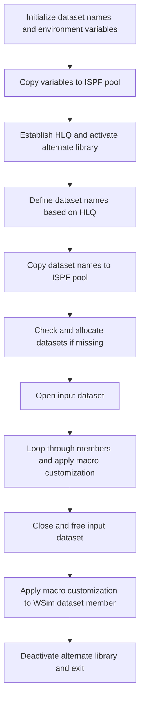

# What the script does

The cust1 Rexx script is designed to customize and prepare a set of GenApp-related data sets and members for further processing. It primarily manages dataset allocation, environment setup, and performs member-level customization by applying a macro to each member in a specified input dataset. The script ensures that necessary datasets exist, opens the input dataset, iterates through its members (excluding those starting with '@'), and applies a macro customization to each member. It also performs a specific customization on a member in the <SwmToken path="base/exec/cust1.rexx" pos="143:10:10" line-data="/* One change in the WSim data set */">`WSim`</SwmToken> dataset before deactivating the alternate library and exiting.

# Script Flow

The script flow can be broken down into the following main steps:

- Define and initialize key dataset names and environment variables.
- Copy these variables into the ISPF variable pool for use by other ISPF services.
- Establish the high-level qualifier (HLQ) for <SwmToken path="base/exec/cust1.rexx" pos="40:12:12" line-data="/* Establish a HLQ for the GenApp data sets */">`GenApp`</SwmToken> datasets and activate the alternate library for Rexx execution.
- Define dataset names for DBRM, MAPCOPY, LOAD, MSGTXT, and others based on the HLQ.
- Copy these dataset names into the ISPF variable pool.
- Check if the required datasets exist; if not, allocate new datasets with appropriate attributes.
- Open the input dataset for reading.
- Loop through all members of the input dataset, skipping those starting with '@', and apply a macro customization to each member.
- Close and free the input dataset.
- Perform a final macro customization on a specific member in the <SwmToken path="base/exec/cust1.rexx" pos="143:10:10" line-data="/* One change in the WSim data set */">`WSim`</SwmToken> dataset.
- Deactivate the alternate library and exit the script.



<SwmSnippet path="/base/exec/cust1.rexx" line="6">

---

First, the script defines a series of dataset names and environment variables that are used throughout the customization process. These include dataset high-level qualifiers, application IDs, and system IDs.

```rexx
PDSMEMin  = 'userid.GENAPP.CNTL'
CICSHLQ   = 'CTS540.CICS710'
CPSMHLQ   = 'CTS540.CPSM540'
CICSLIC   = 'CTS540.CICS710.LIC'
CSDNAME   = 'userid.GENAPP.DFHCSD'
USRHLQ    = 'userid'
COBOLHLQ  = 'PP.COBOL390.V610'
CEEHLQ    = 'CEE'
DB2HLQ    = 'SYS2.DB2.V12'
DB2RUN    = 'DSNV12P3'
SQLID     = 'userid'
DB2SSID   = 'DKM1'
DB2DBID   = 'GENASA1'
DB2CCSID  = '285'
DB2PLAN   = 'DSNTIA12'
WSIMHLQ   = 'PP.WSIM.V110'
ZFSHOME   = '/u/userid'
TORAPPL   = 'IYI0TOR1'
AORAPPL   = 'IYI0AOR1'
DORAPPL   = 'IYI0DOR1'
TORSYSID  = 'TOR1'
AORSYSID  = 'AOR1'
DORSYSID  = 'DOR1'
CMASAPPL  = 'IYI0CMAS'
CMASYSID  = 'ICMA'
WUIAPPL   = 'IYI0WUI'
WUISYSID  = 'IWUI'

```

---

</SwmSnippet>

<SwmSnippet path="/base/exec/cust1.rexx" line="34">

---

Next, these variables are copied into the ISPF variable pool using the <SwmToken path="base/exec/cust1.rexx" pos="35:1:3" line-data="&#39;ISPEXEC VPUT (CICSHLQ CPSMHLQ CICSLIC USRHLQ COBOLHLQ DB2HLQ CEEHLQ)&#39;">`ISPEXEC VPUT`</SwmToken> command, making them accessible to other ISPF services and commands invoked later in the script.

```rexx
/* Copy variables to the pool */
'ISPEXEC VPUT (CICSHLQ CPSMHLQ CICSLIC USRHLQ COBOLHLQ DB2HLQ CEEHLQ)'
'ISPEXEC VPUT (CSDNAME DB2RUN SQLID DB2SSID DB2DBID DB2CCSID DB2PLAN)'
'ISPEXEC VPUT (TORAPPL AORAPPL DORAPPL TORSYSID AORSYSID DORSYSID)'
'ISPEXEC VPUT (CMASAPPL CMASYSID WUIAPPL WUISYSID WSIMHLQ ZFSHOME)'
```

---

</SwmSnippet>

<SwmSnippet path="/base/exec/cust1.rexx" line="40">

---

Then, the script establishes the high-level qualifier (HLQ) for the <SwmToken path="base/exec/cust1.rexx" pos="40:12:12" line-data="/* Establish a HLQ for the GenApp data sets */">`GenApp`</SwmToken> datasets by extracting it from the input dataset name. It activates the alternate library for Rexx execution by specifying the EXEC dataset corresponding to the HLQ.

```rexx
/* Establish a HLQ for the GenApp data sets */
PDSHLQ = Substr(PDSMEMin,1,Pos('.CNTL',PDSMEMin)-1)

/* Location of Rexx code */
PDSexec = PDSHLQ || '.EXEC'
"ALTLIB ACTIVATE APPLICATION(EXEC) DATASET('" || PDSexec || "')"

```

---

</SwmSnippet>

<SwmSnippet path="/base/exec/cust1.rexx" line="47">

---

Following this, the script defines dataset names for DBRM, MAPCOPY, LOAD, MSGTXT, and other related datasets by concatenating the HLQ with specific suffixes. These names are prepared both with and without quotes for later use.

```rexx
/* Variables used for substitution when customizing */
PDSDBRM = "'" || PDSHLQ || ".DBRMLIB'"
PDSMAPC = "'" || PDSHLQ || ".MAPCOPY'"
PDSLOAD = "'" || PDSHLQ || ".LOAD'"
PDSMSGS = "'" || PDSHLQ || ".MSGTXT'"
WSIMLOG = "'" || PDSHLQ || ".LOG'"
WSIMSTL =        PDSHLQ || ".WSIM"
SOURCEX =        PDSHLQ || ".SRC"
KSDSCUS =        PDSHLQ || ".KSDSCUST.TXT"
KSDSPOL =        PDSHLQ || ".KSDSPOLY.TXT"
LOADX   = Strip(PDSLOAD,,"'")
MAPCOPX = Strip(PDSMAPC,,"'")
DBRMLIX = Strip(PDSDBRM,,"'")
WSIMLGX = Strip(WSIMLOG,,"'")
WSIMWSX = Strip(WSIMSTL,,"'")
WSIMMSX = Strip(PDSMSGS,,"'")
```

---

</SwmSnippet>

<SwmSnippet path="/base/exec/cust1.rexx" line="63">

---

These dataset names are then copied into the ISPF variable pool again to ensure they are available for subsequent ISPF commands and macros.

```rexx

/* Copy variables to the pool */
'ISPEXEC VPUT (PDSDBRM PDSMACP PDSLOAD PDSMSGS WSIMLOG WSIMSTL)'
'ISPEXEC VPUT (KSDSPOL KSDSCUS SOURCEX LOADX MAPCOPX DBRMLIX)'
'ISPEXEC VPUT (WSIMLGX WSIMWSX WSIMMSX)'
```

---

</SwmSnippet>

<SwmSnippet path="/base/exec/cust1.rexx" line="69">

---

The script proceeds to check if each of the key datasets exists by using the <SwmToken path="base/exec/cust1.rexx" pos="70:2:2" line-data="If SYSDSN(PDSDBRM) \= &#39;OK&#39; Then Do">`SYSDSN`</SwmToken> function. If a dataset does not exist, it allocates a new dataset with attributes similar to the input dataset or with specified space and organization parameters.

```rexx
/* Allocate data sets if required */
If SYSDSN(PDSDBRM) \= 'OK' Then Do
  "ALLOC DD(DB1) DA(" || PDSDBRM || ") New Like('" || PDSMEMin || "')"
  If RC = 0 Then "Free DD(DB1)"
End
If SYSDSN(PDSMAPC) \= 'OK' Then Do
  "ALLOC DD(MC1) DA(" || PDSMAPC || ") New Like('" || PDSMEMin || "')"
  If RC = 0 Then "Free DD(MC1)"
End
If SYSDSN(PDSLOAD) \= 'OK' Then Do
  "ALLOC DD(LM1) DA(" || PDSLOAD || ") New Space(5,2) Cylinders " ||,
    "BlkSize(6144) Dir(8) DSorg(PO) Recfm(U) Dsntype(LIBRARY)"
  If RC = 0 Then "Free DD(LM1)"
End
If SYSDSN(PDSMSGS) \= 'OK' Then Do
  "ALLOC DD(DB1) DA(" || PDSMSGS || ") New Like('" || PDSMEMin || "')"
  If RC = 0 Then "Free DD(DB1)"
End
If SYSDSN(WSIMLOG) \= 'OK' Then Do
  "ALLOC DD(LM1) DA(" || WSIMLOG || ") New Space(20,5) Cylinders " ||,
    "LrecL(27994) BlkSize(27998) Dir(0) DSorg(PS) Recfm(V B)"
  If RC = 0 Then "Free DD(LM1)"
End
```

---

</SwmSnippet>

<SwmSnippet path="/base/exec/cust1.rexx" line="93">

---

Next, the script opens the input dataset for processing using ISPF services <SwmToken path="base/exec/cust1.rexx" pos="94:3:3" line-data="&quot;ISPEXEC LMINIT DATAID(IN) DATASET(&#39;&quot; || PDSMEMin || &quot;&#39;)&quot;">`LMINIT`</SwmToken> and <SwmToken path="base/exec/cust1.rexx" pos="100:3:3" line-data="&#39;ISPEXEC LMOPEN DATAID(&amp;IN)&#39;">`LMOPEN`</SwmToken>. It checks for errors after each operation and exits if any occur.

```rexx
/* Open the input data set */
"ISPEXEC LMINIT DATAID(IN) DATASET('" || PDSMEMin || "')"
If RC \= 0 Then Do
  Say PDSMEMin 'Return code' RC 'from LMINIT'
  Exit RC
End

'ISPEXEC LMOPEN DATAID(&IN)'
If RC \= 0 Then Do
  Say PDSMEMin 'Return code' RC 'from LMOPEN'
  Exit RC
End
```

---

</SwmSnippet>

<SwmSnippet path="/base/exec/cust1.rexx" line="110">

---

Then, the script enters a loop where it lists members of the input dataset using <SwmToken path="base/exec/cust1.rexx" pos="112:4:4" line-data="  &#39;ISPEXEC LMMLIST DATAID(&amp;IN) OPTION(LIST) MEMBER(MEMBER)&#39;">`LMMLIST`</SwmToken>. For each member that does not start with '@', it increments a counter, constructs input and output member names, and applies a macro customization (<SwmToken path="base/exec/cust1.rexx" pos="122:17:17" line-data="               &#39;Member(&#39; || Member || &#39;) Macro(MAC1)&#39;">`MAC1`</SwmToken>) to the member using the ISPF EDIT command.

```rexx
/* Perform replace on all members in data set not beginning '@' */
Do Until List_rc \= 0
  'ISPEXEC LMMLIST DATAID(&IN) OPTION(LIST) MEMBER(MEMBER)'
  List_rc = RC
  If RC = 0 Then Do
    If Left(Member,1) \= '@' then Do
      Counter = Counter + 1
      Member = Space(Member)
      MemInName.Counter  = PDSMEMIN || '(' || Member || ')'
      MemOutName.Counter = PDSMEMOUT || '(' || Member || ')'
      MemName.Counter    = Member
      'ISPEXEC EDIT DATAID(' || IN || ') ' ||,
               'Member(' || Member || ') Macro(MAC1)'
    End
  End
```

---

</SwmSnippet>

<SwmSnippet path="/base/exec/cust1.rexx" line="130">

---

After processing all members, the script outputs the count of customized members, then closes and frees the input dataset using <SwmToken path="base/exec/cust1.rexx" pos="131:3:3" line-data="&#39;ISPEXEC LMCLOSE DATAID(&amp;IN)&#39;">`LMCLOSE`</SwmToken> and <SwmToken path="base/exec/cust1.rexx" pos="137:3:3" line-data="&#39;ISPEXEC LMFREE DATAID(&amp;IN)&#39;">`LMFREE`</SwmToken> ISPF services, checking for errors after each step.

```rexx
/* Close input data set */
'ISPEXEC LMCLOSE DATAID(&IN)'
If RC \= 0 Then Do
  Say PDSMEMin 'Return code' RC 'from LMCLOSE'
  Exit RC
End

'ISPEXEC LMFREE DATAID(&IN)'
If RC \= 0 Then Do
  Say PDSMEMin 'Return code' RC 'from LMFREE'
  Exit RC
End
```

---

</SwmSnippet>

<SwmSnippet path="/base/exec/cust1.rexx" line="143">

---

Finally, the script performs one additional macro customization on a specific member ('ONCICS') in the <SwmToken path="base/exec/cust1.rexx" pos="143:10:10" line-data="/* One change in the WSim data set */">`WSim`</SwmToken> dataset, deactivates the alternate library, and exits with a success code.

```rexx
/* One change in the WSim data set */
"ISPEXEC EDIT DATASET('" || WSIMSTL || "(ONCICS)') Macro(MAC1)"

"ALTLIB DEACTIVATE APPLICATION(EXEC)"

Exit 0
```

---

</SwmSnippet>

&nbsp;

*This is an auto-generated document by Swimm 🌊 and has not yet been verified by a human*

<SwmMeta version="3.0.0" repo-id="Z2l0aHViJTNBJTNBU3dpbW1pby1nZW5hcHAtbW90b3IlM0ElM0FHaXJpLVN3aW1t" repo-name="Swimmio-genapp-motor"><sup>Powered by [Swimm](https://app.swimm.io/)</sup></SwmMeta>
