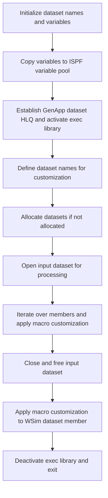

# What the script does

The cust1 Rexx script automates the customization and allocation of various GenApp-related data sets and libraries. It prepares the environment by setting up dataset high-level qualifiers, allocating datasets if they do not exist, and performing member-level edits on a control dataset. The script processes all members in a specified input dataset, applying a macro-based customization to each member, and finally makes a specific update to a <SwmToken path="base/exec/cust1.rexx" pos="143:10:10" line-data="/* One change in the WSim data set */">`WSim`</SwmToken> dataset member. This facilitates consistent setup and customization of the <SwmToken path="base/exec/cust1.rexx" pos="40:12:12" line-data="/* Establish a HLQ for the GenApp data sets */">`GenApp`</SwmToken> environment.

# Script Flow

The script flow can be broken down into the following main steps:

- Define and initialize key dataset names and high-level qualifiers used throughout the script.
- Copy these variables into the ISPF variable pool for use by other ISPF commands.
- Establish the high-level qualifier for the <SwmToken path="base/exec/cust1.rexx" pos="40:12:12" line-data="/* Establish a HLQ for the GenApp data sets */">`GenApp`</SwmToken> datasets and activate the Rexx exec library.
- Define dataset names for DBRM, MAPCOPY, LOAD, MSGTXT, and others, preparing them for allocation and use.
- Allocate datasets if they are not already allocated, ensuring necessary datasets exist for subsequent processing.
- Open the input dataset containing members to be customized.
- Iterate over each member in the input dataset that does not start with '@', applying a macro customization to each member.
- Close and free the input dataset after processing all members.
- Perform a final macro customization on a specific member in the <SwmToken path="base/exec/cust1.rexx" pos="143:10:10" line-data="/* One change in the WSim data set */">`WSim`</SwmToken> dataset.
- Deactivate the Rexx exec library and exit the script.



<SwmSnippet path="/base/exec/cust1.rexx" line="6">

---

First, the script defines a series of dataset names and high-level qualifiers that are used throughout the customization process. These include control datasets, CICS libraries, COBOL libraries, <SwmToken path="base/exec/cust1.rexx" pos="14:7:7" line-data="DB2HLQ    = &#39;SYS2.DB2.V12&#39;">`DB2`</SwmToken> identifiers, and application-specific datasets. This setup ensures that all necessary dataset references are centralized and consistent.

```rexx
PDSMEMin  = 'userid.GENAPP.CNTL'
CICSHLQ   = 'CTS540.CICS710'
CPSMHLQ   = 'CTS540.CPSM540'
CICSLIC   = 'CTS540.CICS710.LIC'
CSDNAME   = 'userid.GENAPP.DFHCSD'
USRHLQ    = 'userid'
COBOLHLQ  = 'PP.COBOL390.V610'
CEEHLQ    = 'CEE'
DB2HLQ    = 'SYS2.DB2.V12'
DB2RUN    = 'DSNV12P3'
SQLID     = 'userid'
DB2SSID   = 'DKM1'
DB2DBID   = 'GENASA1'
DB2CCSID  = '285'
DB2PLAN   = 'DSNTIA12'
WSIMHLQ   = 'PP.WSIM.V110'
ZFSHOME   = '/u/userid'
TORAPPL   = 'IYI0TOR1'
AORAPPL   = 'IYI0AOR1'
DORAPPL   = 'IYI0DOR1'
TORSYSID  = 'TOR1'
AORSYSID  = 'AOR1'
DORSYSID  = 'DOR1'
CMASAPPL  = 'IYI0CMAS'
CMASYSID  = 'ICMA'
WUIAPPL   = 'IYI0WUI'
WUISYSID  = 'IWUI'

```

---

</SwmSnippet>

<SwmSnippet path="/base/exec/cust1.rexx" line="34">

---

Next, these variables are copied into the ISPF variable pool using the ISPEXEC VPUT command. This allows subsequent ISPF commands and macros to access these variables during the script execution.

```rexx
/* Copy variables to the pool */
'ISPEXEC VPUT (CICSHLQ CPSMHLQ CICSLIC USRHLQ COBOLHLQ DB2HLQ CEEHLQ)'
'ISPEXEC VPUT (CSDNAME DB2RUN SQLID DB2SSID DB2DBID DB2CCSID DB2PLAN)'
'ISPEXEC VPUT (TORAPPL AORAPPL DORAPPL TORSYSID AORSYSID DORSYSID)'
'ISPEXEC VPUT (CMASAPPL CMASYSID WUIAPPL WUISYSID WSIMHLQ ZFSHOME)'
```

---

</SwmSnippet>

<SwmSnippet path="/base/exec/cust1.rexx" line="40">

---

Then, the script establishes the high-level qualifier (HLQ) for the <SwmToken path="base/exec/cust1.rexx" pos="40:12:12" line-data="/* Establish a HLQ for the GenApp data sets */">`GenApp`</SwmToken> datasets by extracting it from the input dataset name. It activates the Rexx exec library associated with this HLQ to ensure that the necessary Rexx procedures are available for execution.

```rexx
/* Establish a HLQ for the GenApp data sets */
PDSHLQ = Substr(PDSMEMin,1,Pos('.CNTL',PDSMEMin)-1)

/* Location of Rexx code */
PDSexec = PDSHLQ || '.EXEC'
"ALTLIB ACTIVATE APPLICATION(EXEC) DATASET('" || PDSexec || "')"

```

---

</SwmSnippet>

<SwmSnippet path="/base/exec/cust1.rexx" line="47">

---

Following this, the script defines dataset names for DBRM libraries, mapcopy libraries, load libraries, message text datasets, and other related datasets. These names are prepared both with and without quotes for use in allocation and editing commands.

```rexx
/* Variables used for substitution when customizing */
PDSDBRM = "'" || PDSHLQ || ".DBRMLIB'"
PDSMAPC = "'" || PDSHLQ || ".MAPCOPY'"
PDSLOAD = "'" || PDSHLQ || ".LOAD'"
PDSMSGS = "'" || PDSHLQ || ".MSGTXT'"
WSIMLOG = "'" || PDSHLQ || ".LOG'"
WSIMSTL =        PDSHLQ || ".WSIM"
SOURCEX =        PDSHLQ || ".SRC"
KSDSCUS =        PDSHLQ || ".KSDSCUST.TXT"
KSDSPOL =        PDSHLQ || ".KSDSPOLY.TXT"
LOADX   = Strip(PDSLOAD,,"'")
MAPCOPX = Strip(PDSMAPC,,"'")
DBRMLIX = Strip(PDSDBRM,,"'")
WSIMLGX = Strip(WSIMLOG,,"'")
WSIMWSX = Strip(WSIMSTL,,"'")
WSIMMSX = Strip(PDSMSGS,,"'")

```

---

</SwmSnippet>

<SwmSnippet path="/base/exec/cust1.rexx" line="64">

---

Subsequently, these dataset names are again copied into the ISPF variable pool to make them accessible for allocation and editing commands later in the script.

```rexx
/* Copy variables to the pool */
'ISPEXEC VPUT (PDSDBRM PDSMACP PDSLOAD PDSMSGS WSIMLOG WSIMSTL)'
'ISPEXEC VPUT (KSDSPOL KSDSCUS SOURCEX LOADX MAPCOPX DBRMLIX)'
'ISPEXEC VPUT (WSIMLGX WSIMWSX WSIMMSX)'
```

---

</SwmSnippet>

<SwmSnippet path="/base/exec/cust1.rexx" line="69">

---

The script then checks if each of the key datasets (DBRM, MAPCOPY, LOAD, MSGTXT, and <SwmToken path="base/exec/cust1.rexx" pos="143:10:10" line-data="/* One change in the WSim data set */">`WSim`</SwmToken> log) is allocated. If any dataset is not allocated, it allocates a new dataset with appropriate attributes such as space, block size, record format, and dataset organization. This ensures that all required datasets exist before proceeding.

```rexx
/* Allocate data sets if required */
If SYSDSN(PDSDBRM) \= 'OK' Then Do
  "ALLOC DD(DB1) DA(" || PDSDBRM || ") New Like('" || PDSMEMin || "')"
  If RC = 0 Then "Free DD(DB1)"
End
If SYSDSN(PDSMAPC) \= 'OK' Then Do
  "ALLOC DD(MC1) DA(" || PDSMAPC || ") New Like('" || PDSMEMin || "')"
  If RC = 0 Then "Free DD(MC1)"
End
If SYSDSN(PDSLOAD) \= 'OK' Then Do
  "ALLOC DD(LM1) DA(" || PDSLOAD || ") New Space(5,2) Cylinders " ||,
    "BlkSize(6144) Dir(8) DSorg(PO) Recfm(U) Dsntype(LIBRARY)"
  If RC = 0 Then "Free DD(LM1)"
End
If SYSDSN(PDSMSGS) \= 'OK' Then Do
  "ALLOC DD(DB1) DA(" || PDSMSGS || ") New Like('" || PDSMEMin || "')"
  If RC = 0 Then "Free DD(DB1)"
End
If SYSDSN(WSIMLOG) \= 'OK' Then Do
  "ALLOC DD(LM1) DA(" || WSIMLOG || ") New Space(20,5) Cylinders " ||,
    "LrecL(27994) BlkSize(27998) Dir(0) DSorg(PS) Recfm(V B)"
  If RC = 0 Then "Free DD(LM1)"
End
```

---

</SwmSnippet>

<SwmSnippet path="/base/exec/cust1.rexx" line="93">

---

Next, the script opens the input dataset for processing using ISPF LMINIT and LMOPEN commands. It verifies successful opening and exits with an error if unsuccessful.

```rexx
/* Open the input data set */
"ISPEXEC LMINIT DATAID(IN) DATASET('" || PDSMEMin || "')"
If RC \= 0 Then Do
  Say PDSMEMin 'Return code' RC 'from LMINIT'
  Exit RC
End

'ISPEXEC LMOPEN DATAID(&IN)'
If RC \= 0 Then Do
  Say PDSMEMin 'Return code' RC 'from LMOPEN'
  Exit RC
End
```

---

</SwmSnippet>

<SwmSnippet path="/base/exec/cust1.rexx" line="105">

---

Then, the script enters a loop to list all members in the input dataset. For each member whose name does not start with '@', it applies a macro customization by invoking the ISPF EDIT command with a macro named <SwmToken path="base/exec/cust1.rexx" pos="122:17:17" line-data="               &#39;Member(&#39; || Member || &#39;) Macro(MAC1)&#39;">`MAC1`</SwmToken>. It tracks the number of members customized and stores member names for reference.

```rexx

List_rc  = 0
Counter  = 0
Memname. = ''

/* Perform replace on all members in data set not beginning '@' */
Do Until List_rc \= 0
  'ISPEXEC LMMLIST DATAID(&IN) OPTION(LIST) MEMBER(MEMBER)'
  List_rc = RC
  If RC = 0 Then Do
    If Left(Member,1) \= '@' then Do
      Counter = Counter + 1
      Member = Space(Member)
      MemInName.Counter  = PDSMEMIN || '(' || Member || ')'
      MemOutName.Counter = PDSMEMOUT || '(' || Member || ')'
      MemName.Counter    = Member
      'ISPEXEC EDIT DATAID(' || IN || ') ' ||,
               'Member(' || Member || ') Macro(MAC1)'
    End
  End
  MemName.0 = Counter
End
```

---

</SwmSnippet>

<SwmSnippet path="/base/exec/cust1.rexx" line="127">

---

After processing all members, the script outputs the count of customized members, closes the input dataset using LMCLOSE, and frees the dataset using LMFREE, checking for errors at each step.

```rexx

Say '===> ' Counter 'Members customised'

/* Close input data set */
'ISPEXEC LMCLOSE DATAID(&IN)'
If RC \= 0 Then Do
  Say PDSMEMin 'Return code' RC 'from LMCLOSE'
  Exit RC
End

'ISPEXEC LMFREE DATAID(&IN)'
If RC \= 0 Then Do
  Say PDSMEMin 'Return code' RC 'from LMFREE'
  Exit RC
End
```

---

</SwmSnippet>

<SwmSnippet path="/base/exec/cust1.rexx" line="142">

---

Finally, the script performs one last macro customization on a specific member named ONCICS in the <SwmToken path="base/exec/cust1.rexx" pos="143:10:10" line-data="/* One change in the WSim data set */">`WSim`</SwmToken> dataset. It then deactivates the Rexx exec library and exits cleanly.

```rexx

/* One change in the WSim data set */
"ISPEXEC EDIT DATASET('" || WSIMSTL || "(ONCICS)') Macro(MAC1)"

"ALTLIB DEACTIVATE APPLICATION(EXEC)"

Exit 0
```

---

</SwmSnippet>

&nbsp;

*This is an auto-generated document by Swimm 🌊 and has not yet been verified by a human*

<SwmMeta version="3.0.0" repo-id="Z2l0aHViJTNBJTNBU3dpbW1pby1nZW5hcHAtbW90b3IlM0ElM0FHaXJpLVN3aW1t" repo-name="Swimmio-genapp-motor"><sup>Powered by [Swimm](https://app.swimm.io/)</sup></SwmMeta>
