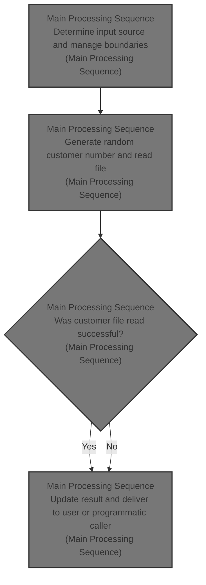

# Overview

This document describes the flow for selecting and returning a random customer number from the customer dataset. The process manages customer boundaries using a shared queue, updates boundaries based on queue messages, and delivers the result to either a user terminal or a programmatic caller.



## Detailed View of the Program's Functionality

a. Transaction Initialization and Context Assignment

The program begins by preparing for a new transaction. It clears the buffer used for receiving input data, ensuring no leftover information from previous transactions. Next, it retrieves several pieces of system context from the CICS environment: the system identifier, the transaction start code, and the name of the invoking program. These values are stored for use in subsequent decision-making steps.

b. Input Source Determination and Flag Setting

The code then determines how the transaction was initiated. If the start code indicates a direct transaction or if the invoking program name is present, it sets a flag to indicate a programmatic or invoked request. In this case, it copies the input data from the communication area and records the length of the received data. Otherwise, it assumes the transaction was started from a terminal and receives the input data into the buffer, sets a flag for a terminal request, copies the relevant data to the communication area, and adjusts the length value to account for the transaction identifier.

c. Customer Range Initialization and Queue Locking

Initial values for the customer number range are set, establishing both the lower and upper boundaries. Flags are set to indicate that control, low, and high customer messages may need to be written to the queue. The program then locks the temporary storage queue (TSQ) resource to ensure exclusive access, preventing other transactions from modifying the queue during this process. It reads the first message from the queue to begin processing shared customer range data.

d. Queue Message Processing and Boundary Updates

If the queue read is successful, the flag indicating the need to write the control message is cleared. The program enters a loop, reading subsequent messages from the queue one by one. For each message, it checks if the message type is "LOW CUSTOMER" or "HIGH CUSTOMER." If a "LOW CUSTOMER" message is found, the lower boundary is updated and the flag for writing the low customer message is cleared. If a "HIGH CUSTOMER" message is found, the upper boundary is updated and the flag for writing the high customer message is cleared. The loop continues until there are no more messages to process.

e. Writing Control Messages to the Queue

After processing all queue messages, the program prepares to write control messages to the queue if necessary. It updates the message structures with the current customer boundaries. If the flag for the control message is still set, it writes the control message to the queue. Similarly, if the flags for the low or high customer messages are set, it writes those messages to the queue as well. Each write operation is performed only if the corresponding flag indicates that the message was not already present in the queue.

f. Queue Unlocking

Once all necessary messages have been written, the program releases the lock on the TSQ resource, allowing other transactions to access and modify the queue.

g. Random Customer Selection and File Read

The program generates a random customer number within the established boundaries. This is done by calculating a random value based on the current transaction number and the customer range. The random customer number is then used as a key to read a record from the customer file (KSDSCUST). The program attempts to retrieve the customer data corresponding to the generated number.

h. Result Update Based on File Read

If the file read is successful, the program updates the customer number in the output structure to match the actual record found in the file. This ensures that the result reflects a valid customer from the dataset.

i. Output Handling and Transaction Completion

Finally, the program determines how to return the result based on the type of transaction. If the request originated from a terminal, it sends the result as a text message to the user. If the request was programmatic, it updates the communication area with the result data for the calling program to use. The transaction is then ended and control is returned to CICS, completing the process.

# Rule Definition

| Paragraph Name                                             | Rule ID | Category          | Description                                                                                                                                                                                                                                           | Conditions                                                                                     | Remarks                                                                                                                                                                       |
| ---------------------------------------------------------- | ------- | ----------------- | ----------------------------------------------------------------------------------------------------------------------------------------------------------------------------------------------------------------------------------------------------- | ---------------------------------------------------------------------------------------------- | ----------------------------------------------------------------------------------------------------------------------------------------------------------------------------- |
| Lines 101-121                                              | RL-001  | Conditional Logic | The program determines if the transaction is programmatic or terminal by inspecting the CICS context variables: if the first character of STARTCODE is 'D' or Invokingprog is not blank, it is programmatic; otherwise, it is terminal.               | STARTCODE(1:1) = 'D' OR Invokingprog is not blank (not spaces) => programmatic; else terminal. | STARTCODE is a 2-character string; Invokingprog is an 8-character string. Programmatic transactions use commarea for input/output; terminal transactions use terminal buffer. |
| Lines 111-121, 211-222                                     | RL-002  | Conditional Logic | For programmatic transactions, input and output are handled via the commarea structure. For terminal transactions, input is received from the terminal buffer and output is sent to the terminal.                                                     | Transaction type determined as programmatic or terminal.                                       | Commarea is 80 bytes; terminal output is a 24-character message. For programmatic, output is split into a 14-character header, 10-digit number, and 60 spaces filler.         |
| Lines 129-131, 189-191                                     | RL-003  | Conditional Logic | The program must lock the TSQ resource before reading or writing messages, and unlock it after processing. No retry logic is required for locking.                                                                                                    | Before any TSQ read/write operations.                                                          | TSQ resource name is 'GENACNTL' (8 characters).                                                                                                                               |
| Lines 199-209                                              | RL-004  | Conditional Logic | Attempt to read the customer record from KSDSCUST using the generated customer number as key. If found, use the actual customer number from the file; if not, use the generated number.                                                               | After generating random customer number.                                                       | KSDSCUST key is 10 digits; file read uses GTEQ. Output uses actual or generated number as appropriate.                                                                        |
| Lines 211-222                                              | RL-005  | Data Assignment   | For terminal transactions, output is a 24-character message: 'HIGH CUSTOMER=' (14 chars) + customer number (10 digits), sent to terminal. For programmatic, output is written to commarea: 14-char header, 10-digit number, 60 spaces filler.         | Based on transaction type flag after processing.                                               | Terminal output: 24 chars; programmatic output: commarea fields (14 chars, 10 digits, 60 spaces).                                                                             |
| Throughout (e.g., 44, 47, 49, 50, 51, 60, 70, 85, 197-209) | RL-006  | Data Assignment   | Customer numbers must always be 10 digits, with leading zeros, and only numeric values are valid.                                                                                                                                                     | Any time a customer number is assigned, generated, or output.                                  | 10-digit numeric string, left-padded with zeros if necessary.                                                                                                                 |
| Lines 137, 155-156, 207-209                                | RL-007  | Conditional Logic | If TSQ or file reads fail, proceed using default or previously set values; no error messages are sent to the user.                                                                                                                                    | TSQ or file read returns non-normal response.                                                  | No error output; use initialized or previously set values.                                                                                                                    |
| Lines 123-127, 158-159, 162-187                            | RL-008  | Data Assignment   | If no LOW/HIGH CUSTOMER messages are found in the TSQ, initialize both the customer lower boundary and customer upper boundary to '0001000001'.                                                                                                       | No LOW/HIGH CUSTOMER messages found in TSQ after scanning.                                     | Initial value is '0001000001' (10 digits, numeric, leading zeros).                                                                                                            |
| Lines 132-156                                              | RL-009  | Conditional Logic | Scan all messages in the TSQ, updating the customer lower boundary and customer upper boundary if 'LOW CUSTOMER=' or 'HIGH CUSTOMER=' messages are found, using the 10-digit customer number from each message.                                       | Each message in TSQ is checked for 'LOW CUSTOMER=' or 'HIGH CUSTOMER=' prefix.                 | Message prefixes are 13 and 14 characters respectively; customer numbers are 10 digits, numeric, leading zeros.                                                               |
| Lines 162-187                                              | RL-010  | Conditional Logic | If a LOW or HIGH CUSTOMER message is missing, write the corresponding message to the TSQ using the current boundary value for the customer lower or upper boundary.                                                                                   | Flag for LOW or HIGH message is set after scanning TSQ.                                        | LOW message: 13-char prefix + 10-digit number (23 bytes); HIGH message: 14-char prefix + 10-digit number (24 bytes).                                                          |
| Lines 193-197                                              | RL-011  | Computation       | Generate a random customer number using: Integer(Random(transaction identifier) \* (customer upper boundary - customer lower boundary)) + customer lower boundary. Lower boundary inclusive, upper exclusive. Result is 10 digits with leading zeros. | After TSQ processing and boundary determination.                                               | Random function uses the transaction identifier as seed. Result must be 10 digits, numeric, leading zeros.                                                                    |

# User Stories

## User Story 1: Transaction Type Determination and Input/Output Handling

---

### Story Description:

As a system, I want to determine whether a transaction is programmatic or terminal so that I can correctly handle input and output according to the transaction type.

---

### Business Rule Mapping:

| Rule ID | Paragraph Name         | Rule Description                                                                                                                                                                                                                              |
| ------- | ---------------------- | --------------------------------------------------------------------------------------------------------------------------------------------------------------------------------------------------------------------------------------------- |
| RL-001  | Lines 101-121          | The program determines if the transaction is programmatic or terminal by inspecting the CICS context variables: if the first character of STARTCODE is 'D' or Invokingprog is not blank, it is programmatic; otherwise, it is terminal.       |
| RL-002  | Lines 111-121, 211-222 | For programmatic transactions, input and output are handled via the commarea structure. For terminal transactions, input is received from the terminal buffer and output is sent to the terminal.                                             |
| RL-005  | Lines 211-222          | For terminal transactions, output is a 24-character message: 'HIGH CUSTOMER=' (14 chars) + customer number (10 digits), sent to terminal. For programmatic, output is written to commarea: 14-char header, 10-digit number, 60 spaces filler. |

---

### Relevant Functionality:

- **Lines 101-121**
  1. **RL-001:**
     - Get STARTCODE and Invokingprog from CICS context
     - If STARTCODE starts with 'D' or Invokingprog is not blank:
       - Set flag to indicate programmatic
       - Move commarea data to working storage
     - Else:
       - Set flag to indicate terminal
       - Receive input from terminal buffer
       - Adjust buffer length
- **Lines 111-121**
  1. **RL-002:**
     - If programmatic:
       - Read input from commarea
       - Write output to commarea fields
     - If terminal:
       - Read input from terminal buffer
       - Write output as a 24-character message to terminal
- **Lines 211-222**
  1. **RL-005:**
     - If terminal:
       - Send 24-char message to terminal
     - If programmatic:
       - Write header, number, and filler to commarea

## User Story 2: Customer Boundary Management and TSQ Message Handling

---

### Story Description:

As a system, I want to manage customer boundaries by scanning, updating, and writing LOW/HIGH CUSTOMER messages in the TSQ so that customer boundary values are always correctly initialized and maintained.

---

### Business Rule Mapping:

| Rule ID | Paragraph Name                  | Rule Description                                                                                                                                                                                                |
| ------- | ------------------------------- | --------------------------------------------------------------------------------------------------------------------------------------------------------------------------------------------------------------- |
| RL-003  | Lines 129-131, 189-191          | The program must lock the TSQ resource before reading or writing messages, and unlock it after processing. No retry logic is required for locking.                                                              |
| RL-008  | Lines 123-127, 158-159, 162-187 | If no LOW/HIGH CUSTOMER messages are found in the TSQ, initialize both the customer lower boundary and customer upper boundary to '0001000001'.                                                                 |
| RL-009  | Lines 132-156                   | Scan all messages in the TSQ, updating the customer lower boundary and customer upper boundary if 'LOW CUSTOMER=' or 'HIGH CUSTOMER=' messages are found, using the 10-digit customer number from each message. |
| RL-010  | Lines 162-187                   | If a LOW or HIGH CUSTOMER message is missing, write the corresponding message to the TSQ using the current boundary value for the customer lower or upper boundary.                                             |

---

### Relevant Functionality:

- **Lines 129-131**
  1. **RL-003:**
     - Issue ENQ (lock) on TSQ resource before processing
     - Perform all TSQ read/write operations
     - Issue DEQ (unlock) on TSQ resource after processing
- **Lines 123-127**
  1. **RL-008:**
     - Set the customer lower boundary and customer upper boundary to '0001000001' before scanning TSQ
     - If after scanning, flags indicate missing messages, write messages with current boundary values to TSQ
- **Lines 132-156**
  1. **RL-009:**
     - For each message in TSQ:
       - If message starts with 'LOW CUSTOMER=', update the customer lower boundary
       - If message starts with 'HIGH CUSTOMER=', update the customer upper boundary
- **Lines 162-187**
  1. **RL-010:**
     - If LOW message missing:
       - Write 'LOW CUSTOMER=' + current customer lower boundary to TSQ
     - If HIGH message missing:
       - Write 'HIGH CUSTOMER=' + current customer upper boundary to TSQ

## User Story 3: Customer Number Generation, Validation, and Record Lookup

---

### Story Description:

As a system, I want to generate a valid random customer number, ensure it is properly formatted, attempt to read the corresponding record, and use fallback values if necessary so that customer selection and output are always reliable and correct.

---

### Business Rule Mapping:

| Rule ID | Paragraph Name                                             | Rule Description                                                                                                                                                                                                                                      |
| ------- | ---------------------------------------------------------- | ----------------------------------------------------------------------------------------------------------------------------------------------------------------------------------------------------------------------------------------------------- |
| RL-004  | Lines 199-209                                              | Attempt to read the customer record from KSDSCUST using the generated customer number as key. If found, use the actual customer number from the file; if not, use the generated number.                                                               |
| RL-006  | Throughout (e.g., 44, 47, 49, 50, 51, 60, 70, 85, 197-209) | Customer numbers must always be 10 digits, with leading zeros, and only numeric values are valid.                                                                                                                                                     |
| RL-007  | Lines 137, 155-156, 207-209                                | If TSQ or file reads fail, proceed using default or previously set values; no error messages are sent to the user.                                                                                                                                    |
| RL-011  | Lines 193-197                                              | Generate a random customer number using: Integer(Random(transaction identifier) \* (customer upper boundary - customer lower boundary)) + customer lower boundary. Lower boundary inclusive, upper exclusive. Result is 10 digits with leading zeros. |

---

### Relevant Functionality:

- **Lines 199-209**
  1. **RL-004:**
     - Attempt to read KSDSCUST with generated customer number as key
     - If found, use customer number from file
     - Else, use generated number
- **Throughout (e.g.**
  1. **RL-006:**
     - When assigning or outputting customer numbers, ensure they are 10 digits, numeric, left-padded with zeros
- **Lines 137**
  1. **RL-007:**
     - If TSQ read fails, use initial boundary values
     - If file read fails, use generated customer number
- **Lines 193-197**
  1. **RL-011:**
     - Compute random value: Integer(Random(seed) \* (upper boundary - lower boundary)) + lower boundary
     - Format result as 10-digit string with leading zeros

# Workflow

# Main Processing Sequence

```mermaid
%%{init: {"flowchart": {"defaultRenderer": "elk"}} }%%
flowchart TD
    node1["Start transaction and assign context"] --> node2{"Is transaction direct or invoked?"}
    click node1 openCode "base/src/lgicvs01.cbl:93:107"
    node2 -->|"Direct/Invoked"| node3["Set boundaries and flags"]
    click node2 openCode "base/src/lgicvs01.cbl:108:113"
    node2 -->|"Other"| node4["Receive data and set boundaries"]
    click node4 openCode "base/src/lgicvs01.cbl:114:121"
    node3 --> node5["Lock and read customer queue"]
    click node3 openCode "base/src/lgicvs01.cbl:123:136"
    node4 --> node5
    node5 --> node6{"Was queue read successful?"}
    click node5 openCode "base/src/lgicvs01.cbl:137:156"
    node6 -->|"Yes"| node7["Process queue messages"]
    node6 -->|"No"| node13["Write messages if needed"]
    
    subgraph loop1["Process queue messages until all customer data is handled"]
        node7 --> node8{"Is message type LOW or HIGH?"}
        click node7 openCode "base/src/lgicvs01.cbl:139:155"
        node8 -->|"LOW"| node9["Update LOW boundary"]
        click node9 openCode "base/src/lgicvs01.cbl:147:148"
        node8 -->|"HIGH"| node10["Update HIGH boundary"]
        click node10 openCode "base/src/lgicvs01.cbl:152:153"
        node9 --> node11{"Are more messages available?"}
        node10 --> node11
        node11 -->|"Yes"| node7
        node11 -->|"No"| node13
    end
    node13 --> node14["Write messages if needed (based on flags)"]
    click node13 openCode "base/src/lgicvs01.cbl:158:187"
    node14 --> node15["Unlock queue"]
    click node14 openCode "base/src/lgicvs01.cbl:189:191"
    node15 --> node16["Generate random customer number within boundaries"]
    click node15 openCode "base/src/lgicvs01.cbl:193:197"
    node16 --> node17["Read customer file"]
    click node16 openCode "base/src/lgicvs01.cbl:199:206"
    node17 --> node18{"Was file read successful?"}
    click node17 openCode "base/src/lgicvs01.cbl:207:209"
    node18 -->|"Yes"| node19["Update result"]
    click node19 openCode "base/src/lgicvs01.cbl:208:209"
    node18 -->|"No"| node20["Proceed"]
    node19 --> node21{"Is transaction type 'R'?"}
    click node21 openCode "base/src/lgicvs01.cbl:211:222"
    node21 -->|"Yes"| node22["Send result to user"]
    click node22 openCode "base/src/lgicvs01.cbl:212:217"
    node21 -->|"No"| node23["Update shared memory"]
    click node23 openCode "base/src/lgicvs01.cbl:219:221"
    node22 --> node24["End"]
    node23 --> node24
    node20 --> node24["End"]

classDef HeadingStyle fill:#777777,stroke:#333,stroke-width:2px;

%% Swimm:
%% %%{init: {"flowchart": {"defaultRenderer": "elk"}} }%%
%% flowchart TD
%%     node1["Start transaction and assign context"] --> node2{"Is transaction direct or invoked?"}
%%     click node1 openCode "<SwmPath>[base/src/lgicvs01.cbl](base/src/lgicvs01.cbl)</SwmPath>:93:107"
%%     node2 -->|"Direct/Invoked"| node3["Set boundaries and flags"]
%%     click node2 openCode "<SwmPath>[base/src/lgicvs01.cbl](base/src/lgicvs01.cbl)</SwmPath>:108:113"
%%     node2 -->|"Other"| node4["Receive data and set boundaries"]
%%     click node4 openCode "<SwmPath>[base/src/lgicvs01.cbl](base/src/lgicvs01.cbl)</SwmPath>:114:121"
%%     node3 --> node5["Lock and read customer queue"]
%%     click node3 openCode "<SwmPath>[base/src/lgicvs01.cbl](base/src/lgicvs01.cbl)</SwmPath>:123:136"
%%     node4 --> node5
%%     node5 --> node6{"Was queue read successful?"}
%%     click node5 openCode "<SwmPath>[base/src/lgicvs01.cbl](base/src/lgicvs01.cbl)</SwmPath>:137:156"
%%     node6 -->|"Yes"| node7["Process queue messages"]
%%     node6 -->|"No"| node13["Write messages if needed"]
%%     
%%     subgraph loop1["Process queue messages until all customer data is handled"]
%%         node7 --> node8{"Is message type LOW or HIGH?"}
%%         click node7 openCode "<SwmPath>[base/src/lgicvs01.cbl](base/src/lgicvs01.cbl)</SwmPath>:139:155"
%%         node8 -->|"LOW"| node9["Update LOW boundary"]
%%         click node9 openCode "<SwmPath>[base/src/lgicvs01.cbl](base/src/lgicvs01.cbl)</SwmPath>:147:148"
%%         node8 -->|"HIGH"| node10["Update HIGH boundary"]
%%         click node10 openCode "<SwmPath>[base/src/lgicvs01.cbl](base/src/lgicvs01.cbl)</SwmPath>:152:153"
%%         node9 --> node11{"Are more messages available?"}
%%         node10 --> node11
%%         node11 -->|"Yes"| node7
%%         node11 -->|"No"| node13
%%     end
%%     node13 --> node14["Write messages if needed (based on flags)"]
%%     click node13 openCode "<SwmPath>[base/src/lgicvs01.cbl](base/src/lgicvs01.cbl)</SwmPath>:158:187"
%%     node14 --> node15["Unlock queue"]
%%     click node14 openCode "<SwmPath>[base/src/lgicvs01.cbl](base/src/lgicvs01.cbl)</SwmPath>:189:191"
%%     node15 --> node16["Generate random customer number within boundaries"]
%%     click node15 openCode "<SwmPath>[base/src/lgicvs01.cbl](base/src/lgicvs01.cbl)</SwmPath>:193:197"
%%     node16 --> node17["Read customer file"]
%%     click node16 openCode "<SwmPath>[base/src/lgicvs01.cbl](base/src/lgicvs01.cbl)</SwmPath>:199:206"
%%     node17 --> node18{"Was file read successful?"}
%%     click node17 openCode "<SwmPath>[base/src/lgicvs01.cbl](base/src/lgicvs01.cbl)</SwmPath>:207:209"
%%     node18 -->|"Yes"| node19["Update result"]
%%     click node19 openCode "<SwmPath>[base/src/lgicvs01.cbl](base/src/lgicvs01.cbl)</SwmPath>:208:209"
%%     node18 -->|"No"| node20["Proceed"]
%%     node19 --> node21{"Is transaction type 'R'?"}
%%     click node21 openCode "<SwmPath>[base/src/lgicvs01.cbl](base/src/lgicvs01.cbl)</SwmPath>:211:222"
%%     node21 -->|"Yes"| node22["Send result to user"]
%%     click node22 openCode "<SwmPath>[base/src/lgicvs01.cbl](base/src/lgicvs01.cbl)</SwmPath>:212:217"
%%     node21 -->|"No"| node23["Update shared memory"]
%%     click node23 openCode "<SwmPath>[base/src/lgicvs01.cbl](base/src/lgicvs01.cbl)</SwmPath>:219:221"
%%     node22 --> node24["End"]
%%     node23 --> node24
%%     node20 --> node24["End"]
%% 
%% classDef HeadingStyle fill:#777777,stroke:#333,stroke-width:2px;
```



This section governs the main transaction processing sequence, handling context assignment, input source determination, customer boundary management, queue message processing, customer selection, and result delivery. It ensures that each transaction operates within the correct customer boundaries and updates shared resources as needed.

| Category        | Rule Name                                 | Description                                                                                                                                                                                 |
| --------------- | ----------------------------------------- | ------------------------------------------------------------------------------------------------------------------------------------------------------------------------------------------- |
| Data validation | Customer File Read Validation             | If the customer file read is successful, the actual customer number from the file must be used in the result; otherwise, proceed without updating the result.                               |
| Business logic  | Input Source Determination                | If the transaction is initiated directly or by another program, set the flag to 'C' and use the programmatic data area; otherwise, set the flag to 'R' and use the terminal receive buffer. |
| Business logic  | Customer Boundary Initialization          | Customer boundaries (low and high) must be initialized to 0001000001 at the start of each transaction.                                                                                      |
| Business logic  | Queue Message Boundary Update             | If queue messages of type 'LOW CUSTOMER' or 'HIGH CUSTOMER' are found, update the corresponding boundary values and clear the write flags to prevent overwriting existing data.             |
| Business logic  | Conditional Queue Message Write           | Control messages ('GENAPP CNTL', 'LOW CUSTOMER', 'HIGH CUSTOMER') must be written to the queue only if their respective flags indicate they are missing.                                    |
| Business logic  | Queue Locking Requirement                 | The customer queue must be locked before reading or writing and unlocked after all queue operations are complete.                                                                           |
| Business logic  | Random Customer Selection                 | A random customer number must be generated within the current low and high boundaries for each transaction.                                                                                 |
| Business logic  | Result Delivery Based on Transaction Type | If the transaction type is 'R', the result must be sent to the user via terminal; otherwise, the shared memory structure must be updated for programmatic callers.                          |

<SwmSnippet path="/base/src/lgicvs01.cbl" line="93">

---

In MAINLINE, this is where the flow starts: it clears the receive buffer and pulls in system context (SYSID, STARTCODE, Invokingprog) from CICS. These values are used to decide how to handle the incoming request in the next steps.

```cobol
       MAINLINE SECTION.
      *
           MOVE SPACES TO WS-RECV.

           EXEC CICS ASSIGN SYSID(WS-SYSID)
                RESP(WS-RESP)
           END-EXEC.

           EXEC CICS ASSIGN STARTCODE(WS-STARTCODE)
                RESP(WS-RESP)
           END-EXEC.

           EXEC CICS ASSIGN Invokingprog(WS-Invokeprog)
                RESP(WS-RESP)
           END-EXEC.
```

---

</SwmSnippet>

<SwmSnippet path="/base/src/lgicvs01.cbl" line="108">

---

This block picks the input source (programmatic or terminal) and sets a flag for how to handle the request.

```cobol
           IF WS-STARTCODE(1:1) = 'D' or
              WS-Invokeprog Not = Spaces
              MOVE 'C' To WS-FLAG
              MOVE COMMA-DATA  TO WS-COMMAREA
              MOVE EIBCALEN    TO WS-RECV-LEN
           ELSE
              EXEC CICS RECEIVE INTO(WS-RECV)
                  LENGTH(WS-RECV-LEN)
                  RESP(WS-RESP)
              END-EXEC
              MOVE 'R' To WS-FLAG
              MOVE WS-RECV-DATA  TO WS-COMMAREA
              SUBTRACT 5 FROM WS-RECV-LEN
           END-IF.
```

---

</SwmSnippet>

<SwmSnippet path="/base/src/lgicvs01.cbl" line="123">

---

Next the code sets up initial customer range values and flags, then locks (ENQ) the TSQ resource and reads the first message from the queue. This is prepping to manage customer range data shared across transactions.

```cobol
           Move 0001000001 to WS-Cust-Low
           Move 0001000001 to WS-Cust-High
           Move 'Y'        to WS-FLAG-TSQE
           Move 'Y'        to WS-FLAG-TSQH
           Move 'Y'        to WS-FLAG-TSQL
      *
           EXEC CICS ENQ Resource(STSQ-NAME)
                         Length(Length Of STSQ-NAME)
           END-EXEC.
           Exec CICS ReadQ TS Queue(STSQ-NAME)
                     Into(READ-MSG)
                     Resp(WS-RESP)
                     Item(1)
           End-Exec.
```

---

</SwmSnippet>

<SwmSnippet path="/base/src/lgicvs01.cbl" line="137">

---

Here the code loops through the TSQ messages, looking for 'LOW CUSTOMER' and 'HIGH CUSTOMER' entries. When it finds them, it updates the customer range variables and clears the corresponding write flags to avoid overwriting existing data.

```cobol
           If WS-RESP = DFHRESP(NORMAL)
              Move Space to WS-FLAG-TSQE
              Perform With Test after Until WS-RESP > 0
                 Exec CICS ReadQ TS Queue(STSQ-NAME)
                     Into(READ-MSG)
                     Resp(WS-RESP)
                     Next
                 End-Exec
                 If WS-RESP = DFHRESP(NORMAL) And
                      Read-Msg-Msg(1:12) = 'LOW CUSTOMER'
                      Move READ-CUST-LOW to WS-Cust-Low
                      Move Space to WS-FLAG-TSQL
                 End-If
                 If WS-RESP = DFHRESP(NORMAL) And
                      Read-Msg-Msg(1:13) = 'HIGH CUSTOMER'
                      Move READ-CUST-HIGH to WS-Cust-High
                      Move Space to WS-FLAG-TSQH
                 End-If
              End-Perform
           End-If.
```

---

</SwmSnippet>

<SwmSnippet path="/base/src/lgicvs01.cbl" line="158">

---

This part writes the control message to the TSQ if needed.

```cobol
           Move WS-Cust-Low to WRITE-MSG-LOW
           Move WS-Cust-High to WRITE-MSG-HIGH
      *
      *
           If WS-FLAG-TSQE = 'Y'
             EXEC CICS WRITEQ TS QUEUE(STSQ-NAME)
                       FROM(WRITE-MSG-E)
                       RESP(WS-RESP)
                       NOSUSPEND
                       LENGTH(20)
             END-EXEC
           End-If.
```

---

</SwmSnippet>

<SwmSnippet path="/base/src/lgicvs01.cbl" line="171">

---

Here the code writes the 'LOW CUSTOMER' message to the TSQ if it wasn't already present, based on the flag from the earlier scan.

```cobol
           If WS-FLAG-TSQL = 'Y'
             EXEC CICS WRITEQ TS QUEUE(STSQ-NAME)
                       FROM(WRITE-MSG-L)
                       RESP(WS-RESP)
                       NOSUSPEND
                       LENGTH(23)
             END-EXEC
           End-If.
```

---

</SwmSnippet>

<SwmSnippet path="/base/src/lgicvs01.cbl" line="180">

---

Here the code writes the 'HIGH CUSTOMER' message to the TSQ if it wasn't already present, using the flag set during the TSQ scan.

```cobol
           If WS-FLAG-TSQH = 'Y'
             EXEC CICS WRITEQ TS QUEUE(STSQ-NAME)
                       FROM(WRITE-MSG-H)
                       RESP(WS-RESP)
                       NOSUSPEND
                       LENGTH(24)
             END-EXEC
           End-If.
```

---

</SwmSnippet>

<SwmSnippet path="/base/src/lgicvs01.cbl" line="189">

---

Finally for the TSQ part, the code releases the lock on the TSQ resource so other transactions can use it.

```cobol
           EXEC CICS DEQ Resource(STSQ-NAME)
                         Length(Length Of STSQ-NAME)
           END-EXEC.
```

---

</SwmSnippet>

<SwmSnippet path="/base/src/lgicvs01.cbl" line="193">

---

Here the code generates a random customer number within the current range and uses it to read a record from the KSDSCUST file. This picks a customer for the transaction to work with.

```cobol
           Compute WS-Random-Number = Function Integer((
                     Function Random(EIBTASKN) *
                       (ws-cust-high - ws-cust-low)) +
                          WS-Cust-Low)
           Move WS-Random-Number to WRITE-MSG-HIGH

           Exec CICS Read File('KSDSCUST')
                     Into(CA-AREA)
                     Length(F82)
                     Ridfld(WRITE-MSG-HIGH)
                     KeyLength(F10)
                     RESP(WS-RESP)
                     GTEQ
           End-Exec.
```

---

</SwmSnippet>

<SwmSnippet path="/base/src/lgicvs01.cbl" line="207">

---

If the file read worked, the code updates the customer number to match the actual record found. This makes sure the output always reflects a real customer from the file.

```cobol
           If WS-RESP = DFHRESP(NORMAL)
             Move CA-Customer-Num to WRITE-MSG-HIGH
           End-if.
```

---

</SwmSnippet>

<SwmSnippet path="/base/src/lgicvs01.cbl" line="211">

---

Finally, the code either sends the result to the terminal (if it's a user request) or fills the <SwmToken path="base/src/lgicvs01.cbl" pos="111:3:5" line-data="              MOVE COMMA-DATA  TO WS-COMMAREA">`COMMA-DATA`</SwmToken> structure for a programmatic caller, then returns control to CICS.

```cobol
           If WS-FLAG = 'R' Then
             EXEC CICS SEND TEXT FROM(WRITE-MSG-H)
              WAIT
              ERASE
              LENGTH(24)
              FREEKB
             END-EXEC
           Else
             Move Spaces To COMMA-Data
             Move Write-Msg-H    To COMMA-Data-H
             Move Write-Msg-High To COMMA-Data-High
           End-If.

           EXEC CICS RETURN
           END-EXEC.
```

---

</SwmSnippet>

&nbsp;

*This is an auto-generated document by Swimm 🌊 and has not yet been verified by a human*

<SwmMeta version="3.0.0" repo-id="Z2l0aHViJTNBJTNBU3dpbW1pby1nZW5hcHAtbW90b3IlM0ElM0FHaXJpLVN3aW1t" repo-name="Swimmio-genapp-motor"><sup>Powered by [Swimm](https://app.swimm.io/)</sup></SwmMeta>
