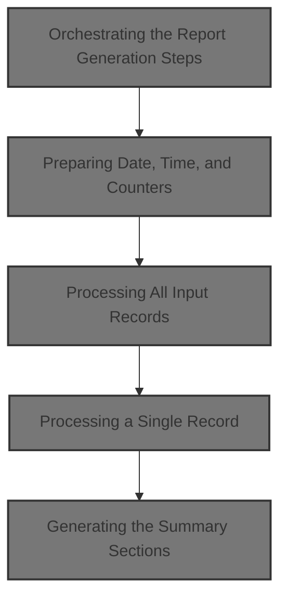
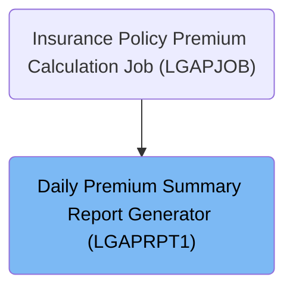

# Overview

This document describes the flow for generating a daily premium summary report. The process receives premium output records, processes each record to update premium totals, approval status counts, and risk analysis, and outputs a formatted management report for review.

## Dependencies

### Program

- LGAPRPT1 (<SwmPath>[base/src/LGAPRPT1.cbl](base/src/LGAPRPT1.cbl)</SwmPath>)

### Copybook

- OUTPUTREC (<SwmPath>[base/src/OUTPUTREC.cpy](base/src/OUTPUTREC.cpy)</SwmPath>)

# Where is this program used?

This program is used once, as represented in the following diagram:

&nbsp;

*This is an auto-generated document by Swimm 🌊 and has not yet been verified by a human*

<SwmMeta version="3.0.0" repo-id="Z2l0aHViJTNBJTNBU3dpbW1pby1nZW5hcHAtbW90b3IlM0ElM0FHaXJpLVN3aW1t" repo-name="Swimmio-genapp-motor">Powered by [Swimm](https://app.swimm.io/)</SwmMeta>
