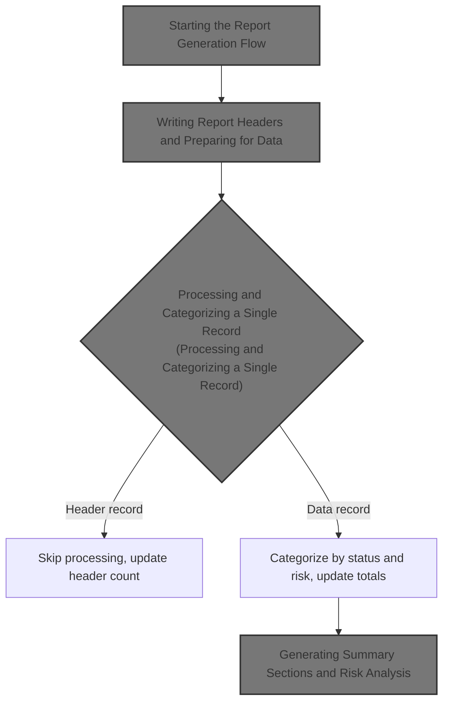
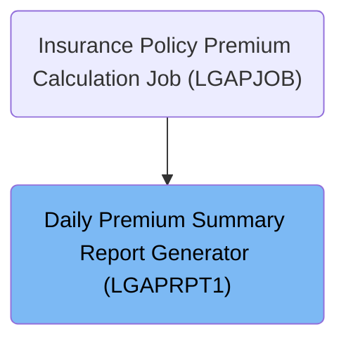
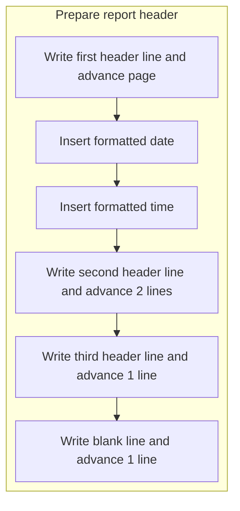
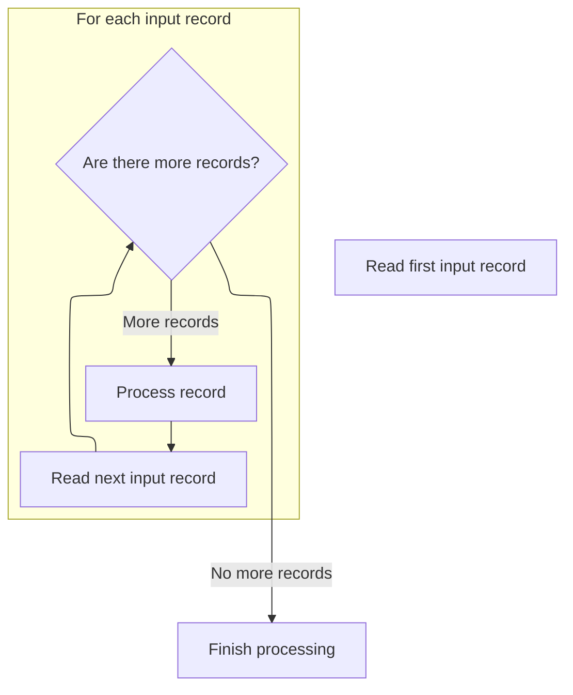
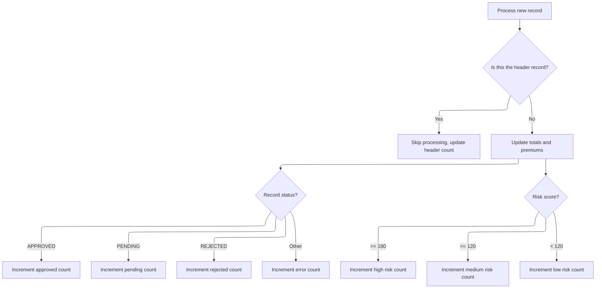
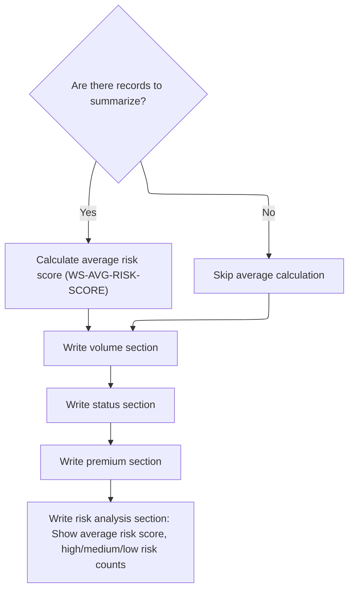

# Overview

This document explains the flow for generating daily premium summary reports. Premium output records are processed and transformed into a formatted management report, providing statistics, status breakdowns, and risk analysis for management review.



## Dependencies

### Program

- <SwmToken path="base/src/LGAPRPT1.cbl" pos="2:6:6" line-data="       PROGRAM-ID. LGAPRPT1.">`LGAPRPT1`</SwmToken> (<SwmPath>[base/src/LGAPRPT1.cbl](base/src/LGAPRPT1.cbl)</SwmPath>)

### Copybook

- OUTPUTREC (<SwmPath>[base/src/OUTPUTREC.cpy](base/src/OUTPUTREC.cpy)</SwmPath>)

# Where is this program used?

This program is used once, as represented in the following diagram:



## Input and Output Tables/Files used in the Program

| Table / File Name                                                                                                                                             | Type | Description                                | Usage Mode | Key Fields / Layout Highlights |
| ------------------------------------------------------------------------------------------------------------------------------------------------------------- | ---- | ------------------------------------------ | ---------- | ------------------------------ |
| <SwmToken path="base/src/LGAPRPT1.cbl" pos="15:3:5" line-data="           SELECT INPUT-FILE ASSIGN TO &#39;INPUT&#39;">`INPUT-FILE`</SwmToken>                | File | Daily insurance policy premium details     | Input      | File resource                  |
| <SwmToken path="base/src/LGAPRPT1.cbl" pos="19:3:5" line-data="           SELECT REPORT-FILE ASSIGN TO &#39;REPORT&#39;">`REPORT-FILE`</SwmToken>             | File | Formatted management summary report output | Output     | File resource                  |
| <SwmToken path="base/src/LGAPRPT1.cbl" pos="167:3:5" line-data="           WRITE REPORT-LINE FROM RPT-HEADER-1 AFTER ADVANCING PAGE">`REPORT-LINE`</SwmToken> | File | Single line of summary report content      | Output     | File resource                  |

&nbsp;

## Detailed View of the Program's Functionality

## Program Startup and Setup

The program begins by identifying itself and describing its purpose: to read a premium output file and generate a formatted management report with statistics and breakdowns. It sets up the environment and file controls, specifying two files: one for input (the premium data) and one for output (the report).

When execution starts, the main routine performs several steps in order:

1. It initializes the date, time, and all counters and totals.
2. It opens both the input and output files, checking for errors and stopping if files cannot be opened.
3. It writes the report headers, including the formatted date and time.
4. It processes all input records, updating statistics as it goes.
5. It writes the summary sections to the report.
6. It closes both files.

## Initialization of Date, Time, and Counters

The initialization routine first retrieves the current system date and time. It then formats these values into human-readable strings for use in the report headers. After formatting, it resets all counters and accumulators to zero, ensuring that statistics start fresh for each run.

## File Opening and Error Handling

The program opens the input file for reading and the report file for writing. If either file fails to open, it displays an error message and stops execution. If the report file fails to open, it also closes the input file before stopping.

## Writing Report Headers

The header-writing routine outputs several lines to the report:

- The first line is a centered title for the report, and it advances to a new page.
- The second line includes the formatted date and time, placed in their respective fields, and advances two lines.
- The third line is a separator made of equal signs, advancing one line.
- A blank line is written, advancing one more line.

This sets up the top of the report with clear identification and context.

## Processing Input Records

The record-processing routine begins by reading the first input record. It then enters a loop that continues until the end of the input file is reached. For each record:

- It processes the record, updating statistics and categorizing it.
- It reads the next record for the next loop iteration.

## Processing and Categorizing a Single Record

For each record:

- The total record count is incremented.
- If this is the first record (the header), it increments the header count and skips further processing for this record.
- For data records, it converts all relevant fields (risk score and various premiums) from string format to numeric format.
- It adds each premium and the risk score to their respective running totals.
- It categorizes the record by status (approved, pending, rejected, or error) and increments the appropriate counter.
- It categorizes the record by risk level using the risk score: high (180+), medium (<SwmToken path="base/src/LGAPRPT1.cbl" pos="346:11:13" line-data="           MOVE &#39;Medium Risk Policies (120-179):&#39; TO RPT-DETAIL-LABEL">`120-179`</SwmToken>), or low (<120), incrementing the corresponding counter.

## Generating Summary Sections and Risk Analysis

After all records are processed, the summary-writing routine performs several actions:

- It calculates averages, specifically the average risk score, by subtracting the header count from the total record count and dividing the total risk score by the number of data records. If there are no data records, it skips the calculation.
- It writes the volume section, showing the total number of records processed.
- It writes the status section, showing counts for approved, pending, rejected, and error records.
- It writes the premium section, showing totals for fire, crime, flood, weather, and the grand total premium.
- It writes the risk analysis section, showing the average risk score and counts for high, medium, and low risk policies. This section ends with an "END OF REPORT" marker.

## Closing Files

Finally, the program closes both the input and report files, completing the report generation process.

# Rule Definition

| Paragraph Name                                                                                                                                                                                                                                                                                                                                                                                                                                                                                                                                                                                                                                                                                                                                                | Rule ID | Category          | Description                                                                                                                                                                                                                          | Conditions                                                                            | Remarks                                                                                                                                                                                                                                                                                                                                                                                                                                                                                                                                                                                                                                                                                                                                                                                                                                                                                                                                                                                                                                                                                                                                                                                                                                                                                                                                                                                      |
| ------------------------------------------------------------------------------------------------------------------------------------------------------------------------------------------------------------------------------------------------------------------------------------------------------------------------------------------------------------------------------------------------------------------------------------------------------------------------------------------------------------------------------------------------------------------------------------------------------------------------------------------------------------------------------------------------------------------------------------------------------------- | ------- | ----------------- | ------------------------------------------------------------------------------------------------------------------------------------------------------------------------------------------------------------------------------------ | ------------------------------------------------------------------------------------- | -------------------------------------------------------------------------------------------------------------------------------------------------------------------------------------------------------------------------------------------------------------------------------------------------------------------------------------------------------------------------------------------------------------------------------------------------------------------------------------------------------------------------------------------------------------------------------------------------------------------------------------------------------------------------------------------------------------------------------------------------------------------------------------------------------------------------------------------------------------------------------------------------------------------------------------------------------------------------------------------------------------------------------------------------------------------------------------------------------------------------------------------------------------------------------------------------------------------------------------------------------------------------------------------------------------------------------------------------------------------------------------------- |
| <SwmToken path="base/src/LGAPRPT1.cbl" pos="175:3:7" line-data="           PERFORM P510-READ-INPUT">`P510-READ-INPUT`</SwmToken>, <SwmToken path="base/src/LGAPRPT1.cbl" pos="177:3:7" line-data="               PERFORM P520-PROCESS-RECORD">`P520-PROCESS-RECORD`</SwmToken>                                                                                                                                                                                                                                                                                                                                                                                                                                                                                | RL-001  | Data Assignment   | Each input record must be read from a file where each record is 64 characters long, with fields in a fixed order and size. Fields must be parsed according to their defined widths.                                                  | Input file must be available and readable. Each record must be exactly 64 characters. | Field order and sizes: <SwmToken path="base/src/LGAPRPT1.cbl" pos="195:7:11" line-data="           MOVE FUNCTION NUMVAL(OUT-RISK-SCORE) TO WS-RISK-SCORE-NUM">`OUT-RISK-SCORE`</SwmToken> (3 chars, numeric string), <SwmToken path="base/src/LGAPRPT1.cbl" pos="196:7:11" line-data="           MOVE FUNCTION NUMVAL(OUT-FIRE-PREMIUM) TO WS-FIRE-PREM-NUM">`OUT-FIRE-PREMIUM`</SwmToken> (10 chars, numeric string), <SwmToken path="base/src/LGAPRPT1.cbl" pos="197:7:11" line-data="           MOVE FUNCTION NUMVAL(OUT-CRIME-PREMIUM) TO WS-CRIME-PREM-NUM">`OUT-CRIME-PREMIUM`</SwmToken> (10 chars, numeric string), <SwmToken path="base/src/LGAPRPT1.cbl" pos="198:7:11" line-data="           MOVE FUNCTION NUMVAL(OUT-FLOOD-PREMIUM) TO WS-FLOOD-PREM-NUM">`OUT-FLOOD-PREMIUM`</SwmToken> (10 chars, numeric string), <SwmToken path="base/src/LGAPRPT1.cbl" pos="199:7:11" line-data="           MOVE FUNCTION NUMVAL(OUT-WEATHER-PREMIUM) TO WS-WEATHER-PREM-NUM">`OUT-WEATHER-PREMIUM`</SwmToken> (10 chars, numeric string), <SwmToken path="base/src/LGAPRPT1.cbl" pos="200:7:11" line-data="           MOVE FUNCTION NUMVAL(OUT-TOTAL-PREMIUM) TO WS-TOTAL-PREM-NUM">`OUT-TOTAL-PREMIUM`</SwmToken> (11 chars, numeric string), <SwmToken path="base/src/LGAPRPT1.cbl" pos="211:3:5" line-data="           EVALUATE OUT-STATUS">`OUT-STATUS`</SwmToken> (10 chars, string). |
| <SwmToken path="base/src/LGAPRPT1.cbl" pos="125:3:5" line-data="           PERFORM P200-INIT">`P200-INIT`</SwmToken>, <SwmToken path="base/src/LGAPRPT1.cbl" pos="136:3:9" line-data="           PERFORM P210-FORMAT-DATE-TIME">`P210-FORMAT-DATE-TIME`</SwmToken>, <SwmToken path="base/src/LGAPRPT1.cbl" pos="127:3:7" line-data="           PERFORM P400-WRITE-HEADERS">`P400-WRITE-HEADERS`</SwmToken>                                                                                                                                                                                                                                                                                                                                                    | RL-002  | Computation       | The program must obtain the current system date and time, format them as DD/MM/YYYY and HH:MM:SS, and use them in the report header.                                                                                                 | At program initialization, before writing report header.                              | Date format: DD/MM/YYYY (string, 10 chars). Time format: HH:MM:SS (string, 8 chars).                                                                                                                                                                                                                                                                                                                                                                                                                                                                                                                                                                                                                                                                                                                                                                                                                                                                                                                                                                                                                                                                                                                                                                                                                                                                                                         |
| <SwmToken path="base/src/LGAPRPT1.cbl" pos="127:3:7" line-data="           PERFORM P400-WRITE-HEADERS">`P400-WRITE-HEADERS`</SwmToken>                                                                                                                                                                                                                                                                                                                                                                                                                                                                                                                                                                                                                        | RL-003  | Data Assignment   | The report header must include a centered title, formatted date and time, a separator line of '=' characters, and blank lines, each padded to exactly 133 characters.                                                                | After initialization and before processing records.                                   | Header lines: Title (centered, 133 chars), Date/Time (left-aligned labels, right-aligned values, 133 chars), Separator line (133 '=' chars), Blank line (133 spaces).                                                                                                                                                                                                                                                                                                                                                                                                                                                                                                                                                                                                                                                                                                                                                                                                                                                                                                                                                                                                                                                                                                                                                                                                                        |
| <SwmToken path="base/src/LGAPRPT1.cbl" pos="177:3:7" line-data="               PERFORM P520-PROCESS-RECORD">`P520-PROCESS-RECORD`</SwmToken>                                                                                                                                                                                                                                                                                                                                                                                                                                                                                                                                                                                                                  | RL-004  | Computation       | Premium and risk score fields must be converted from string to numeric values before updating totals and counters.                                                                                                                   | For each data record (excluding header).                                              | Fields: <SwmToken path="base/src/LGAPRPT1.cbl" pos="195:7:11" line-data="           MOVE FUNCTION NUMVAL(OUT-RISK-SCORE) TO WS-RISK-SCORE-NUM">`OUT-RISK-SCORE`</SwmToken>, <SwmToken path="base/src/LGAPRPT1.cbl" pos="196:7:11" line-data="           MOVE FUNCTION NUMVAL(OUT-FIRE-PREMIUM) TO WS-FIRE-PREM-NUM">`OUT-FIRE-PREMIUM`</SwmToken>, <SwmToken path="base/src/LGAPRPT1.cbl" pos="197:7:11" line-data="           MOVE FUNCTION NUMVAL(OUT-CRIME-PREMIUM) TO WS-CRIME-PREM-NUM">`OUT-CRIME-PREMIUM`</SwmToken>, <SwmToken path="base/src/LGAPRPT1.cbl" pos="198:7:11" line-data="           MOVE FUNCTION NUMVAL(OUT-FLOOD-PREMIUM) TO WS-FLOOD-PREM-NUM">`OUT-FLOOD-PREMIUM`</SwmToken>, <SwmToken path="base/src/LGAPRPT1.cbl" pos="199:7:11" line-data="           MOVE FUNCTION NUMVAL(OUT-WEATHER-PREMIUM) TO WS-WEATHER-PREM-NUM">`OUT-WEATHER-PREMIUM`</SwmToken>, <SwmToken path="base/src/LGAPRPT1.cbl" pos="200:7:11" line-data="           MOVE FUNCTION NUMVAL(OUT-TOTAL-PREMIUM) TO WS-TOTAL-PREM-NUM">`OUT-TOTAL-PREMIUM`</SwmToken>. Conversion uses NUMVAL function.                                                                                                                                                                                                                                                                                            |
| <SwmToken path="base/src/LGAPRPT1.cbl" pos="177:3:7" line-data="               PERFORM P520-PROCESS-RECORD">`P520-PROCESS-RECORD`</SwmToken>                                                                                                                                                                                                                                                                                                                                                                                                                                                                                                                                                                                                                  | RL-005  | Conditional Logic | Increment counters for each <SwmToken path="base/src/LGAPRPT1.cbl" pos="211:3:5" line-data="           EVALUATE OUT-STATUS">`OUT-STATUS`</SwmToken> value: 'APPROVED', 'PENDING', 'REJECTED', and count any other value as an error. | For each data record (excluding header).                                              | Status values: 'APPROVED', 'PENDING', 'REJECTED', other (error).                                                                                                                                                                                                                                                                                                                                                                                                                                                                                                                                                                                                                                                                                                                                                                                                                                                                                                                                                                                                                                                                                                                                                                                                                                                                                                                             |
| <SwmToken path="base/src/LGAPRPT1.cbl" pos="177:3:7" line-data="               PERFORM P520-PROCESS-RECORD">`P520-PROCESS-RECORD`</SwmToken>                                                                                                                                                                                                                                                                                                                                                                                                                                                                                                                                                                                                                  | RL-006  | Conditional Logic | Categorize each record's risk score as high (>=180), medium (>=120 and <180), or low (<120), and increment the corresponding counter.                                                                                                | For each data record (excluding header).                                              | Risk score thresholds: High (>=180), Medium (>=120 and <180), Low (<120).                                                                                                                                                                                                                                                                                                                                                                                                                                                                                                                                                                                                                                                                                                                                                                                                                                                                                                                                                                                                                                                                                                                                                                                                                                                                                                                    |
| <SwmToken path="base/src/LGAPRPT1.cbl" pos="236:3:7" line-data="           PERFORM P610-CALC-AVERAGES">`P610-CALC-AVERAGES`</SwmToken>                                                                                                                                                                                                                                                                                                                                                                                                                                                                                                                                                                                                                        | RL-007  | Computation       | After processing all records, calculate the average risk score as (sum of risk scores) / (number of data records), excluding the header record. If there are no data records, do not calculate average.                              | After all records processed, if data record count > 0.                                | Average risk score: numeric, 5 digits (999.99).                                                                                                                                                                                                                                                                                                                                                                                                                                                                                                                                                                                                                                                                                                                                                                                                                                                                                                                                                                                                                                                                                                                                                                                                                                                                                                                                              |
| <SwmToken path="base/src/LGAPRPT1.cbl" pos="129:3:7" line-data="           PERFORM P600-WRITE-SUMMARY">`P600-WRITE-SUMMARY`</SwmToken>, <SwmToken path="base/src/LGAPRPT1.cbl" pos="237:3:9" line-data="           PERFORM P620-WRITE-VOLUME-SECTION">`P620-WRITE-VOLUME-SECTION`</SwmToken>, <SwmToken path="base/src/LGAPRPT1.cbl" pos="238:3:9" line-data="           PERFORM P630-WRITE-STATUS-SECTION">`P630-WRITE-STATUS-SECTION`</SwmToken>, <SwmToken path="base/src/LGAPRPT1.cbl" pos="239:3:9" line-data="           PERFORM P640-WRITE-PREMIUM-SECTION">`P640-WRITE-PREMIUM-SECTION`</SwmToken>, <SwmToken path="base/src/LGAPRPT1.cbl" pos="240:3:9" line-data="           PERFORM P650-WRITE-RISK-SECTION.">`P650-WRITE-RISK-SECTION`</SwmToken> | RL-008  | Data Assignment   | Write summary sections to the output report, including total records processed, counts for each status, totals for each premium type, grand total premium, average risk score, and counts for each risk category.                    | After all records processed and calculations complete.                                | Each section header and detail line is 133 characters, labels left-aligned, values right-aligned. Numeric fields formatted as per their size (see remarks for each field).                                                                                                                                                                                                                                                                                                                                                                                                                                                                                                                                                                                                                                                                                                                                                                                                                                                                                                                                                                                                                                                                                                                                                                                                                   |
| <SwmToken path="base/src/LGAPRPT1.cbl" pos="240:3:9" line-data="           PERFORM P650-WRITE-RISK-SECTION.">`P650-WRITE-RISK-SECTION`</SwmToken>                                                                                                                                                                                                                                                                                                                                                                                                                                                                                                                                                                                                             | RL-009  | Data Assignment   | Write a risk analysis section showing the average risk score, high/medium/low risk counts, and end with an 'END OF REPORT' marker.                                                                                                   | After all summary sections written.                                                   | Section header: 'RISK ANALYSIS', 133 chars. Detail lines: average risk score, high/medium/low risk counts, 133 chars each. End marker: 'END OF REPORT', left-aligned, 133 chars.                                                                                                                                                                                                                                                                                                                                                                                                                                                                                                                                                                                                                                                                                                                                                                                                                                                                                                                                                                                                                                                                                                                                                                                                             |
| <SwmToken path="base/src/LGAPRPT1.cbl" pos="127:3:7" line-data="           PERFORM P400-WRITE-HEADERS">`P400-WRITE-HEADERS`</SwmToken>, <SwmToken path="base/src/LGAPRPT1.cbl" pos="237:3:9" line-data="           PERFORM P620-WRITE-VOLUME-SECTION">`P620-WRITE-VOLUME-SECTION`</SwmToken>, <SwmToken path="base/src/LGAPRPT1.cbl" pos="238:3:9" line-data="           PERFORM P630-WRITE-STATUS-SECTION">`P630-WRITE-STATUS-SECTION`</SwmToken>, <SwmToken path="base/src/LGAPRPT1.cbl" pos="239:3:9" line-data="           PERFORM P640-WRITE-PREMIUM-SECTION">`P640-WRITE-PREMIUM-SECTION`</SwmToken>, <SwmToken path="base/src/LGAPRPT1.cbl" pos="240:3:9" line-data="           PERFORM P650-WRITE-RISK-SECTION.">`P650-WRITE-RISK-SECTION`</SwmToken> | RL-010  | Data Assignment   | All output lines must be exactly 133 characters wide, padded with spaces. Section headers and labels are left-aligned, numeric values are right-aligned.                                                                             | For every output line written to the report file.                                     | Line width: 133 characters. Padding: spaces. Alignment: labels left, values right. Section headers centered or left-aligned as per sample output.                                                                                                                                                                                                                                                                                                                                                                                                                                                                                                                                                                                                                                                                                                                                                                                                                                                                                                                                                                                                                                                                                                                                                                                                                                            |
| <SwmToken path="base/src/LGAPRPT1.cbl" pos="125:3:5" line-data="           PERFORM P200-INIT">`P200-INIT`</SwmToken>                                                                                                                                                                                                                                                                                                                                                                                                                                                                                                                                                                                                                                          | RL-011  | Data Assignment   | Before any records are processed, all counters and totals used for statistics and calculations must be set to zero to ensure accurate results.                                                                                       | Program start, before any record is processed.                                        | Counters include those for total records, approved, pending, rejected, error, and header records. Totals include those for each premium type, grand total premium, and risk analysis statistics. All values must be set to zero (numeric zero) before processing begins.                                                                                                                                                                                                                                                                                                                                                                                                                                                                                                                                                                                                                                                                                                                                                                                                                                                                                                                                                                                                                                                                                                                     |
| <SwmToken path="base/src/LGAPRPT1.cbl" pos="177:3:7" line-data="               PERFORM P520-PROCESS-RECORD">`P520-PROCESS-RECORD`</SwmToken>                                                                                                                                                                                                                                                                                                                                                                                                                                                                                                                                                                                                                  | RL-012  | Conditional Logic | The first record in the input file, which serves as a header, must be excluded from all statistical calculations and counters.                                                                                                       | When processing the first record in the input file.                                   | The header record is identified as the first record read from the input file. It is not included in any totals or counters for data records.                                                                                                                                                                                                                                                                                                                                                                                                                                                                                                                                                                                                                                                                                                                                                                                                                                                                                                                                                                                                                                                                                                                                                                                                                                                 |

# User Stories

## User Story 1: Prepare report header and initialize statistics

---

### Story Description:

As a user, I want the report to begin with a properly formatted header, including the current date and time, and for all counters and totals to be initialized to zero so that the report is accurate and easy to read from the start.

---

### Business Rule Mapping:

| Rule ID | Paragraph Name                                                                                                                                                                                                                                                                                                                                                                                             | Rule Description                                                                                                                                                      |
| ------- | ---------------------------------------------------------------------------------------------------------------------------------------------------------------------------------------------------------------------------------------------------------------------------------------------------------------------------------------------------------------------------------------------------------- | --------------------------------------------------------------------------------------------------------------------------------------------------------------------- |
| RL-002  | <SwmToken path="base/src/LGAPRPT1.cbl" pos="125:3:5" line-data="           PERFORM P200-INIT">`P200-INIT`</SwmToken>, <SwmToken path="base/src/LGAPRPT1.cbl" pos="136:3:9" line-data="           PERFORM P210-FORMAT-DATE-TIME">`P210-FORMAT-DATE-TIME`</SwmToken>, <SwmToken path="base/src/LGAPRPT1.cbl" pos="127:3:7" line-data="           PERFORM P400-WRITE-HEADERS">`P400-WRITE-HEADERS`</SwmToken> | The program must obtain the current system date and time, format them as DD/MM/YYYY and HH:MM:SS, and use them in the report header.                                  |
| RL-011  | <SwmToken path="base/src/LGAPRPT1.cbl" pos="125:3:5" line-data="           PERFORM P200-INIT">`P200-INIT`</SwmToken>                                                                                                                                                                                                                                                                                       | Before any records are processed, all counters and totals used for statistics and calculations must be set to zero to ensure accurate results.                        |
| RL-003  | <SwmToken path="base/src/LGAPRPT1.cbl" pos="127:3:7" line-data="           PERFORM P400-WRITE-HEADERS">`P400-WRITE-HEADERS`</SwmToken>                                                                                                                                                                                                                                                                     | The report header must include a centered title, formatted date and time, a separator line of '=' characters, and blank lines, each padded to exactly 133 characters. |

---

### Relevant Functionality:

- <SwmToken path="base/src/LGAPRPT1.cbl" pos="125:3:5" line-data="           PERFORM P200-INIT">`P200-INIT`</SwmToken>
  1. **RL-002:**
     - Get system date in YYYYMMDD
     - Get system time in HHMMSS
     - Format date as DD/MM/YYYY
     - Format time as HH:MM:SS
     - Store formatted values for report header
  2. **RL-011:**
     - Set all counters for record counts and status counts to zero
     - Set all totals for premiums and risk analysis to zero
     - Prepare working fields for calculations by setting them to zero
- <SwmToken path="base/src/LGAPRPT1.cbl" pos="127:3:7" line-data="           PERFORM P400-WRITE-HEADERS">`P400-WRITE-HEADERS`</SwmToken>
  1. **RL-003:**
     - Write title line (centered)
     - Write date/time line (left-aligned labels, right-aligned values)
     - Write separator line
     - Write blank line

## User Story 2: Process input records and update statistics

---

### Story Description:

As a system, I want to read and parse each input record from the file, skip the header record, convert fields to numeric values, categorize risk scores, and increment counters for each status so that all statistics and totals are correctly calculated for the report.

---

### Business Rule Mapping:

| Rule ID | Paragraph Name                                                                                                                                                                                                                                                                 | Rule Description                                                                                                                                                                                                                     |
| ------- | ------------------------------------------------------------------------------------------------------------------------------------------------------------------------------------------------------------------------------------------------------------------------------ | ------------------------------------------------------------------------------------------------------------------------------------------------------------------------------------------------------------------------------------ |
| RL-004  | <SwmToken path="base/src/LGAPRPT1.cbl" pos="177:3:7" line-data="               PERFORM P520-PROCESS-RECORD">`P520-PROCESS-RECORD`</SwmToken>                                                                                                                                   | Premium and risk score fields must be converted from string to numeric values before updating totals and counters.                                                                                                                   |
| RL-005  | <SwmToken path="base/src/LGAPRPT1.cbl" pos="177:3:7" line-data="               PERFORM P520-PROCESS-RECORD">`P520-PROCESS-RECORD`</SwmToken>                                                                                                                                   | Increment counters for each <SwmToken path="base/src/LGAPRPT1.cbl" pos="211:3:5" line-data="           EVALUATE OUT-STATUS">`OUT-STATUS`</SwmToken> value: 'APPROVED', 'PENDING', 'REJECTED', and count any other value as an error. |
| RL-006  | <SwmToken path="base/src/LGAPRPT1.cbl" pos="177:3:7" line-data="               PERFORM P520-PROCESS-RECORD">`P520-PROCESS-RECORD`</SwmToken>                                                                                                                                   | Categorize each record's risk score as high (>=180), medium (>=120 and <180), or low (<120), and increment the corresponding counter.                                                                                                |
| RL-012  | <SwmToken path="base/src/LGAPRPT1.cbl" pos="177:3:7" line-data="               PERFORM P520-PROCESS-RECORD">`P520-PROCESS-RECORD`</SwmToken>                                                                                                                                   | The first record in the input file, which serves as a header, must be excluded from all statistical calculations and counters.                                                                                                       |
| RL-001  | <SwmToken path="base/src/LGAPRPT1.cbl" pos="175:3:7" line-data="           PERFORM P510-READ-INPUT">`P510-READ-INPUT`</SwmToken>, <SwmToken path="base/src/LGAPRPT1.cbl" pos="177:3:7" line-data="               PERFORM P520-PROCESS-RECORD">`P520-PROCESS-RECORD`</SwmToken> | Each input record must be read from a file where each record is 64 characters long, with fields in a fixed order and size. Fields must be parsed according to their defined widths.                                                  |

---

### Relevant Functionality:

- <SwmToken path="base/src/LGAPRPT1.cbl" pos="177:3:7" line-data="               PERFORM P520-PROCESS-RECORD">`P520-PROCESS-RECORD`</SwmToken>
  1. **RL-004:**
     - For each field:
       - Convert string to numeric using NUMVAL
       - Store in working numeric fields
  2. **RL-005:**
     - Evaluate <SwmToken path="base/src/LGAPRPT1.cbl" pos="211:3:5" line-data="           EVALUATE OUT-STATUS">`OUT-STATUS`</SwmToken>:
       - If 'APPROVED', increment approved counter
       - If 'PENDING', increment pending counter
       - If 'REJECTED', increment rejected counter
       - Else, increment error counter
  3. **RL-006:**
     - Evaluate risk score:
       - If >=180, increment high risk counter
       - Else if >=120, increment medium risk counter
       - Else, increment low risk counter
  4. **RL-012:**
     - If the current record is the first record read:
       - Increment the header record counter
       - Do not include this record in any statistical calculations or counters
       - Skip further processing for this record
- <SwmToken path="base/src/LGAPRPT1.cbl" pos="175:3:7" line-data="           PERFORM P510-READ-INPUT">`P510-READ-INPUT`</SwmToken>
  1. **RL-001:**
     - Open input file
     - For each record:
       - Read 64 characters
       - Extract fields by position and size
       - Assign to working fields for further processing

## User Story 3: Generate report summary and risk analysis

---

### Story Description:

As a user, I want the report to include summary sections with totals, averages, and risk analysis, all formatted to exactly 133 characters per line, so that the report is comprehensive, clear, and consistently formatted.

---

### Business Rule Mapping:

| Rule ID | Paragraph Name                                                                                                                                                                                                                                                                                                                                                                                                                                                                                                                                                                                                                                                                                                                                                | Rule Description                                                                                                                                                                                                  |
| ------- | ------------------------------------------------------------------------------------------------------------------------------------------------------------------------------------------------------------------------------------------------------------------------------------------------------------------------------------------------------------------------------------------------------------------------------------------------------------------------------------------------------------------------------------------------------------------------------------------------------------------------------------------------------------------------------------------------------------------------------------------------------------- | ----------------------------------------------------------------------------------------------------------------------------------------------------------------------------------------------------------------- |
| RL-010  | <SwmToken path="base/src/LGAPRPT1.cbl" pos="127:3:7" line-data="           PERFORM P400-WRITE-HEADERS">`P400-WRITE-HEADERS`</SwmToken>, <SwmToken path="base/src/LGAPRPT1.cbl" pos="237:3:9" line-data="           PERFORM P620-WRITE-VOLUME-SECTION">`P620-WRITE-VOLUME-SECTION`</SwmToken>, <SwmToken path="base/src/LGAPRPT1.cbl" pos="238:3:9" line-data="           PERFORM P630-WRITE-STATUS-SECTION">`P630-WRITE-STATUS-SECTION`</SwmToken>, <SwmToken path="base/src/LGAPRPT1.cbl" pos="239:3:9" line-data="           PERFORM P640-WRITE-PREMIUM-SECTION">`P640-WRITE-PREMIUM-SECTION`</SwmToken>, <SwmToken path="base/src/LGAPRPT1.cbl" pos="240:3:9" line-data="           PERFORM P650-WRITE-RISK-SECTION.">`P650-WRITE-RISK-SECTION`</SwmToken> | All output lines must be exactly 133 characters wide, padded with spaces. Section headers and labels are left-aligned, numeric values are right-aligned.                                                          |
| RL-008  | <SwmToken path="base/src/LGAPRPT1.cbl" pos="129:3:7" line-data="           PERFORM P600-WRITE-SUMMARY">`P600-WRITE-SUMMARY`</SwmToken>, <SwmToken path="base/src/LGAPRPT1.cbl" pos="237:3:9" line-data="           PERFORM P620-WRITE-VOLUME-SECTION">`P620-WRITE-VOLUME-SECTION`</SwmToken>, <SwmToken path="base/src/LGAPRPT1.cbl" pos="238:3:9" line-data="           PERFORM P630-WRITE-STATUS-SECTION">`P630-WRITE-STATUS-SECTION`</SwmToken>, <SwmToken path="base/src/LGAPRPT1.cbl" pos="239:3:9" line-data="           PERFORM P640-WRITE-PREMIUM-SECTION">`P640-WRITE-PREMIUM-SECTION`</SwmToken>, <SwmToken path="base/src/LGAPRPT1.cbl" pos="240:3:9" line-data="           PERFORM P650-WRITE-RISK-SECTION.">`P650-WRITE-RISK-SECTION`</SwmToken> | Write summary sections to the output report, including total records processed, counts for each status, totals for each premium type, grand total premium, average risk score, and counts for each risk category. |
| RL-007  | <SwmToken path="base/src/LGAPRPT1.cbl" pos="236:3:7" line-data="           PERFORM P610-CALC-AVERAGES">`P610-CALC-AVERAGES`</SwmToken>                                                                                                                                                                                                                                                                                                                                                                                                                                                                                                                                                                                                                        | After processing all records, calculate the average risk score as (sum of risk scores) / (number of data records), excluding the header record. If there are no data records, do not calculate average.           |
| RL-009  | <SwmToken path="base/src/LGAPRPT1.cbl" pos="240:3:9" line-data="           PERFORM P650-WRITE-RISK-SECTION.">`P650-WRITE-RISK-SECTION`</SwmToken>                                                                                                                                                                                                                                                                                                                                                                                                                                                                                                                                                                                                             | Write a risk analysis section showing the average risk score, high/medium/low risk counts, and end with an 'END OF REPORT' marker.                                                                                |

---

### Relevant Functionality:

- <SwmToken path="base/src/LGAPRPT1.cbl" pos="127:3:7" line-data="           PERFORM P400-WRITE-HEADERS">`P400-WRITE-HEADERS`</SwmToken>
  1. **RL-010:**
     - For each output line:
       - Pad to 133 characters with spaces
       - Align labels to left, values to right
       - For headers, center or left-align as required
- <SwmToken path="base/src/LGAPRPT1.cbl" pos="129:3:7" line-data="           PERFORM P600-WRITE-SUMMARY">`P600-WRITE-SUMMARY`</SwmToken>
  1. **RL-008:**
     - For each section:
       - Write section header
       - Write blank line
       - Write detail lines for each statistic
       - Ensure all lines are 133 characters, labels left, values right
- <SwmToken path="base/src/LGAPRPT1.cbl" pos="236:3:7" line-data="           PERFORM P610-CALC-AVERAGES">`P610-CALC-AVERAGES`</SwmToken>
  1. **RL-007:**
     - Subtract header count from total record count
     - If data record count > 0:
       - Compute average risk score = total risk score / data record count
- <SwmToken path="base/src/LGAPRPT1.cbl" pos="240:3:9" line-data="           PERFORM P650-WRITE-RISK-SECTION.">`P650-WRITE-RISK-SECTION`</SwmToken>
  1. **RL-009:**
     - Write risk analysis section header
     - Write average risk score line
     - Write high/medium/low risk count lines
     - Write blank line
     - Write 'END OF REPORT' marker

# Workflow

# Starting the Report Generation Flow

This section is responsible for orchestrating the entire report generation flow, ensuring all prerequisites are met before processing and finalizing the report.

| Category        | Rule Name                 | Description                                                                                      |
| --------------- | ------------------------- | ------------------------------------------------------------------------------------------------ |
| Data validation | Counter reset requirement | All counters and totals must be reset to zero before any data processing begins.                 |
| Business logic  | Current date/time usage   | The report must use the current system date and time for all headers and timestamps.             |
| Business logic  | Header before records     | Report headers must be written before any records are processed.                                 |
| Business logic  | Summary after records     | The summary section must be written after all records have been processed and totals calculated. |

<SwmSnippet path="/base/src/LGAPRPT1.cbl" line="124">

---

<SwmToken path="base/src/LGAPRPT1.cbl" pos="124:1:3" line-data="       P100-MAIN.">`P100-MAIN`</SwmToken> kicks off the whole report generation. It runs the setup (<SwmToken path="base/src/LGAPRPT1.cbl" pos="125:3:5" line-data="           PERFORM P200-INIT">`P200-INIT`</SwmToken>) to get the date/time and reset all counters, then opens files, writes headers, processes records, writes the summary, and closes files. We call <SwmToken path="base/src/LGAPRPT1.cbl" pos="125:3:5" line-data="           PERFORM P200-INIT">`P200-INIT`</SwmToken> first because we need the formatted date/time and zeroed counters before we can write headers or process any data.

```cobol
       P100-MAIN.
           PERFORM P200-INIT
           PERFORM P300-OPEN-FILES
           PERFORM P400-WRITE-HEADERS
           PERFORM P500-PROCESS-RECORDS
           PERFORM P600-WRITE-SUMMARY
           PERFORM P700-CLOSE-FILES
           STOP RUN.
```

---

</SwmSnippet>

## Initializing Date, Time, and Counters

This section ensures that each report run starts with the correct current date and time in a readable format, and that all counters and totals are reset to avoid data contamination from previous runs.

| Category        | Rule Name                          | Description                                                                                                                |
| --------------- | ---------------------------------- | -------------------------------------------------------------------------------------------------------------------------- |
| Data validation | Use system date and time as source | The section must use the system date in YYYYMMDD format and system time in HHMMSS format as the source for formatting.     |
| Business logic  | Formatted date and time in header  | The report must display the current system date and time in the header, formatted as DD/MM/YYYY and HH:MM:SS respectively. |
| Business logic  | Reset counters and totals          | All counters and totals used in the report must be reset to zero before processing any records.                            |

<SwmSnippet path="/base/src/LGAPRPT1.cbl" line="133">

---

In <SwmToken path="base/src/LGAPRPT1.cbl" pos="133:1:3" line-data="       P200-INIT.">`P200-INIT`</SwmToken> we grab the current date and time from the system, then immediately call <SwmToken path="base/src/LGAPRPT1.cbl" pos="136:3:9" line-data="           PERFORM P210-FORMAT-DATE-TIME">`P210-FORMAT-DATE-TIME`</SwmToken> to turn those raw values into formatted strings for the report headers. This is needed because the rest of the report expects readable date/time, not raw numbers.

```cobol
       P200-INIT.
           ACCEPT WS-CURRENT-DATE FROM DATE YYYYMMDD
           ACCEPT WS-CURRENT-TIME FROM TIME
           PERFORM P210-FORMAT-DATE-TIME
```

---

</SwmSnippet>

<SwmSnippet path="/base/src/LGAPRPT1.cbl" line="141">

---

<SwmToken path="base/src/LGAPRPT1.cbl" pos="141:1:7" line-data="       P210-FORMAT-DATE-TIME.">`P210-FORMAT-DATE-TIME`</SwmToken> takes the raw date/time, slices out the day, month, year, hour, minute, and second, and builds formatted strings like DD/MM/YYYY and HH:MM:SS. It assumes the input is always in the right format and length.

```cobol
       P210-FORMAT-DATE-TIME.
           STRING WS-CURRENT-DATE(5:2) '/'
                  WS-CURRENT-DATE(7:2) '/'
                  WS-CURRENT-DATE(1:4)
                  DELIMITED BY SIZE INTO WS-FORMAT-DATE
           
           STRING WS-CURRENT-TIME(1:2) ':'
                  WS-CURRENT-TIME(3:2) ':'
                  WS-CURRENT-TIME(5:2)
                  DELIMITED BY SIZE INTO WS-FORMAT-TIME.
```

---

</SwmSnippet>

<SwmSnippet path="/base/src/LGAPRPT1.cbl" line="137">

---

After formatting date/time in <SwmToken path="base/src/LGAPRPT1.cbl" pos="125:3:5" line-data="           PERFORM P200-INIT">`P200-INIT`</SwmToken>, we zero out all counters and totals to prep for processing records.

```cobol
           INITIALIZE WS-COUNTERS
           INITIALIZE WS-PREMIUM-TOTALS
           INITIALIZE WS-RISK-ANALYSIS.
```

---

</SwmSnippet>

## Writing Report Headers and Preparing for Data



<SwmSnippet path="/base/src/LGAPRPT1.cbl" line="166">

---

<SwmToken path="base/src/LGAPRPT1.cbl" pos="166:1:5" line-data="       P400-WRITE-HEADERS.">`P400-WRITE-HEADERS`</SwmToken> writes out the report headers, using the formatted date/time from earlier. It moves those values into the header fields, writes each header line with specific spacing, and uses advancing commands to control the layout. The header variables and spacing are all set up for the report's expected format.

```cobol
       P400-WRITE-HEADERS.
           WRITE REPORT-LINE FROM RPT-HEADER-1 AFTER ADVANCING PAGE
           MOVE WS-FORMAT-DATE TO RPT-DATE
           MOVE WS-FORMAT-TIME TO RPT-TIME
           WRITE REPORT-LINE FROM RPT-HEADER-2 AFTER ADVANCING 2 LINES
           WRITE REPORT-LINE FROM RPT-HEADER-3 AFTER ADVANCING 1 LINE
           WRITE REPORT-LINE FROM RPT-BLANK-LINE AFTER ADVANCING 1 LINE.
```

---

</SwmSnippet>

# Processing Input Records and Updating Stats



This section is responsible for sequentially processing all input records, updating statistics and categorizations for each, and ensuring that processing stops when all records have been handled.

| Category       | Rule Name                   | Description                                                                                                                                                                                                                                        |
| -------------- | --------------------------- | -------------------------------------------------------------------------------------------------------------------------------------------------------------------------------------------------------------------------------------------------- |
| Business logic | Process Until End-of-File   | Processing of input records must continue until the end-of-file condition is reached, as indicated by the <SwmToken path="base/src/LGAPRPT1.cbl" pos="176:5:7" line-data="           PERFORM UNTIL INPUT-EOF">`INPUT-EOF`</SwmToken> status value. |
| Business logic | Single Pass Per Record      | Each input record must be processed exactly once to update its statistics and categorization.                                                                                                                                                      |
| Business logic | Update Stats and Categories | The section must update all relevant statistics and categorizations for each record as part of the processing step.                                                                                                                                |

<SwmSnippet path="/base/src/LGAPRPT1.cbl" line="174">

---

<SwmToken path="base/src/LGAPRPT1.cbl" pos="174:1:5" line-data="       P500-PROCESS-RECORDS.">`P500-PROCESS-RECORDS`</SwmToken> reads the first input record, then loops until EOF, calling <SwmToken path="base/src/LGAPRPT1.cbl" pos="177:3:7" line-data="               PERFORM P520-PROCESS-RECORD">`P520-PROCESS-RECORD`</SwmToken> for each record. We need to call <SwmToken path="base/src/LGAPRPT1.cbl" pos="177:3:7" line-data="               PERFORM P520-PROCESS-RECORD">`P520-PROCESS-RECORD`</SwmToken> to handle each record's stats and categorization, then read the next record for the next loop iteration.

```cobol
       P500-PROCESS-RECORDS.
           PERFORM P510-READ-INPUT
           PERFORM UNTIL INPUT-EOF
               PERFORM P520-PROCESS-RECORD
               PERFORM P510-READ-INPUT
           END-PERFORM.
```

---

</SwmSnippet>

# Processing and Categorizing a Single Record



This section is responsible for processing a single record from the report file, updating all relevant counters and totals, and categorizing the record by status and risk level for summary reporting.

| Category        | Rule Name                   | Description                                                                                                                                                                                                                                                                       |
| --------------- | --------------------------- | --------------------------------------------------------------------------------------------------------------------------------------------------------------------------------------------------------------------------------------------------------------------------------- |
| Data validation | Header exclusion            | The first record in the input is always treated as a header and is excluded from all premium, risk, and status calculations. The header count is incremented for this record.                                                                                                     |
| Data validation | Premium and risk conversion | Premium fields (fire, crime, flood, weather, total) and risk score are converted from string to numeric values before being added to their respective running totals.                                                                                                             |
| Business logic  | Status categorization       | Each record is categorized by its status field: 'APPROVED', 'PENDING', 'REJECTED', or any other value. The corresponding counter is incremented for each category. Any status not matching the known values is counted as an error.                                               |
| Business logic  | Risk level categorization   | Each record is categorized into high, medium, or low risk based on its risk score: high risk if the score is 180 or above, medium risk if the score is 120 or above but less than 180, and low risk if the score is less than 120. The corresponding risk counter is incremented. |
| Business logic  | Totals accumulation         | All premium and risk score fields for each record are accumulated into running totals, which are used for summary calculations at the end of processing.                                                                                                                          |

<SwmSnippet path="/base/src/LGAPRPT1.cbl" line="185">

---

In <SwmToken path="base/src/LGAPRPT1.cbl" pos="185:1:5" line-data="       P520-PROCESS-RECORD.">`P520-PROCESS-RECORD`</SwmToken>, we skip the first record since it's just a header, not real data.

```cobol
       P520-PROCESS-RECORD.
           ADD 1 TO WS-TOTAL-REC
           
      *    Skip header record
           IF WS-TOTAL-REC = 1
               ADD 1 TO WS-HEADER-CNT
               GO TO P520-EXIT
           END-IF
```

---

</SwmSnippet>

<SwmSnippet path="/base/src/LGAPRPT1.cbl" line="195">

---

After skipping the header, we convert all the premium and risk fields from strings to numbers, then add them to the running totals. This sets up the data for later summary calculations.

```cobol
           MOVE FUNCTION NUMVAL(OUT-RISK-SCORE) TO WS-RISK-SCORE-NUM
           MOVE FUNCTION NUMVAL(OUT-FIRE-PREMIUM) TO WS-FIRE-PREM-NUM
           MOVE FUNCTION NUMVAL(OUT-CRIME-PREMIUM) TO WS-CRIME-PREM-NUM
           MOVE FUNCTION NUMVAL(OUT-FLOOD-PREMIUM) TO WS-FLOOD-PREM-NUM
           MOVE FUNCTION NUMVAL(OUT-WEATHER-PREMIUM) TO WS-WEATHER-PREM-NUM
           MOVE FUNCTION NUMVAL(OUT-TOTAL-PREMIUM) TO WS-TOTAL-PREM-NUM
           
      *    Accumulate totals
           ADD WS-FIRE-PREM-NUM TO WS-TOTAL-FIRE-PREM
           ADD WS-CRIME-PREM-NUM TO WS-TOTAL-CRIME-PREM
           ADD WS-FLOOD-PREM-NUM TO WS-TOTAL-FLOOD-PREM
           ADD WS-WEATHER-PREM-NUM TO WS-TOTAL-WEATHER-PREM
           ADD WS-TOTAL-PREM-NUM TO WS-GRAND-TOTAL-PREM
           ADD WS-RISK-SCORE-NUM TO WS-TOTAL-RISK-SCORE
```

---

</SwmSnippet>

<SwmSnippet path="/base/src/LGAPRPT1.cbl" line="211">

---

Next we use EVALUATE to bump the right counter based on <SwmToken path="base/src/LGAPRPT1.cbl" pos="211:3:5" line-data="           EVALUATE OUT-STATUS">`OUT-STATUS`</SwmToken>. Anything not matching the known statuses gets counted as an error, so every record is categorized for the summary.

```cobol
           EVALUATE OUT-STATUS
               WHEN 'APPROVED'
                   ADD 1 TO WS-APPROVED-CNT
               WHEN 'PENDING'
                   ADD 1 TO WS-PENDING-CNT
               WHEN 'REJECTED'
                   ADD 1 TO WS-REJECTED-CNT
               WHEN OTHER
                   ADD 1 TO WS-ERROR-CNT
           END-EVALUATE
```

---

</SwmSnippet>

<SwmSnippet path="/base/src/LGAPRPT1.cbl" line="223">

---

Finally in <SwmToken path="base/src/LGAPRPT1.cbl" pos="177:3:7" line-data="               PERFORM P520-PROCESS-RECORD">`P520-PROCESS-RECORD`</SwmToken>, we categorize the record's risk level using the risk score and bump the right risk counter. The thresholds (180, 120) are just business rules for this report.

```cobol
           EVALUATE TRUE
               WHEN WS-RISK-SCORE-NUM >= 180
                   ADD 1 TO WS-HIGH-RISK-CNT
               WHEN WS-RISK-SCORE-NUM >= 120
                   ADD 1 TO WS-MED-RISK-CNT
               WHEN OTHER
                   ADD 1 TO WS-LOW-RISK-CNT
           END-EVALUATE.
```

---

</SwmSnippet>

# Generating Summary Sections and Risk Analysis



This section is responsible for generating the summary and risk analysis portions of the report, ensuring that all relevant statistics are calculated and presented in a clear, business-friendly format.

| Category        | Rule Name                                  | Description                                                                                                                                                                                                                                                        |
| --------------- | ------------------------------------------ | ------------------------------------------------------------------------------------------------------------------------------------------------------------------------------------------------------------------------------------------------------------------ |
| Data validation | Skip average risk calculation when no data | If there are no data records to summarize (i.e., total records minus header count is zero or less), the average risk score calculation is skipped to avoid reporting misleading or invalid statistics.                                                             |
| Business logic  | Average risk score calculation             | The average risk score is calculated by dividing the total risk score by the number of data records (excluding header records).                                                                                                                                    |
| Business logic  | Risk category thresholds                   | Policies are categorized into risk levels using fixed thresholds: High Risk (risk score 180 or above), Medium Risk (risk score between 120 and 179), and Low Risk (risk score below 120). The counts for each category are displayed in the risk analysis section. |
| Business logic  | Summary section order                      | The summary report must include the following sections in order: volume, status, premium, and risk analysis. The risk analysis section is always written last to ensure all statistics are available.                                                              |
| Business logic  | Risk analysis section content              | The risk analysis section must display the average risk score and the counts for each risk category, using predefined labels and formatting for clarity.                                                                                                           |
| Business logic  | End of report marker                       | The report must end with an 'END OF REPORT' marker to clearly indicate completion.                                                                                                                                                                                 |

<SwmSnippet path="/base/src/LGAPRPT1.cbl" line="235">

---

In <SwmToken path="base/src/LGAPRPT1.cbl" pos="235:1:5" line-data="       P600-WRITE-SUMMARY.">`P600-WRITE-SUMMARY`</SwmToken>, we start by calculating averages (<SwmToken path="base/src/LGAPRPT1.cbl" pos="236:3:7" line-data="           PERFORM P610-CALC-AVERAGES">`P610-CALC-AVERAGES`</SwmToken>) so the risk analysis section has the numbers it needs. Then we write each summary section in order.

```cobol
       P600-WRITE-SUMMARY.
           PERFORM P610-CALC-AVERAGES
           PERFORM P620-WRITE-VOLUME-SECTION
           PERFORM P630-WRITE-STATUS-SECTION
           PERFORM P640-WRITE-PREMIUM-SECTION
           PERFORM P650-WRITE-RISK-SECTION.
```

---

</SwmSnippet>

<SwmSnippet path="/base/src/LGAPRPT1.cbl" line="242">

---

<SwmToken path="base/src/LGAPRPT1.cbl" pos="242:1:5" line-data="       P610-CALC-AVERAGES.">`P610-CALC-AVERAGES`</SwmToken> subtracts the header count from the total records to get the real data count, then divides the total risk score by that count to get the average. It skips the calculation if there are no data records to avoid dividing by zero.

```cobol
       P610-CALC-AVERAGES.
           SUBTRACT WS-HEADER-CNT FROM WS-TOTAL-REC
           IF WS-TOTAL-REC > ZERO
               COMPUTE WS-AVG-RISK-SCORE = 
                   WS-TOTAL-RISK-SCORE / WS-TOTAL-REC
           END-IF.
```

---

</SwmSnippet>

<SwmSnippet path="/base/src/LGAPRPT1.cbl" line="235">

---

After calculating averages and writing other summaries in <SwmToken path="base/src/LGAPRPT1.cbl" pos="235:1:5" line-data="       P600-WRITE-SUMMARY.">`P600-WRITE-SUMMARY`</SwmToken>, we write the risk section last so it has all the stats.

```cobol
       P600-WRITE-SUMMARY.
           PERFORM P610-CALC-AVERAGES
           PERFORM P620-WRITE-VOLUME-SECTION
           PERFORM P630-WRITE-STATUS-SECTION
           PERFORM P640-WRITE-PREMIUM-SECTION
           PERFORM P650-WRITE-RISK-SECTION.
```

---

</SwmSnippet>

<SwmSnippet path="/base/src/LGAPRPT1.cbl" line="327">

---

<SwmToken path="base/src/LGAPRPT1.cbl" pos="327:1:7" line-data="       P650-WRITE-RISK-SECTION.">`P650-WRITE-RISK-SECTION`</SwmToken> writes out the risk analysis section using the calculated stats. It fills in the section header, average risk score, and counts for each risk category, using the predefined report line structures and labels with the domain-specific thresholds. It ends with an 'END OF REPORT' marker.

```cobol
       P650-WRITE-RISK-SECTION.
           WRITE REPORT-LINE FROM RPT-BLANK-LINE 
               AFTER ADVANCING 2 LINES
           MOVE 'RISK ANALYSIS' TO RPT-SECTION-TITLE
           WRITE REPORT-LINE FROM RPT-SECTION-HEADER 
               AFTER ADVANCING 1 LINE
           WRITE REPORT-LINE FROM RPT-BLANK-LINE 
               AFTER ADVANCING 1 LINE
           
           MOVE 'Average Risk Score:' TO RPT-DETAIL-LABEL
           MOVE WS-AVG-RISK-SCORE TO RPT-DETAIL-VALUE
           WRITE REPORT-LINE FROM RPT-DETAIL-LINE 
               AFTER ADVANCING 1 LINE
           
           MOVE 'High Risk Policies (180+):' TO RPT-DETAIL-LABEL
           MOVE WS-HIGH-RISK-CNT TO RPT-DETAIL-VALUE
           WRITE REPORT-LINE FROM RPT-DETAIL-LINE 
               AFTER ADVANCING 1 LINE
           
           MOVE 'Medium Risk Policies (120-179):' TO RPT-DETAIL-LABEL
           MOVE WS-MED-RISK-CNT TO RPT-DETAIL-VALUE
           WRITE REPORT-LINE FROM RPT-DETAIL-LINE 
               AFTER ADVANCING 1 LINE
           
           MOVE 'Low Risk Policies (<120):' TO RPT-DETAIL-LABEL
           MOVE WS-LOW-RISK-CNT TO RPT-DETAIL-VALUE
           WRITE REPORT-LINE FROM RPT-DETAIL-LINE 
               AFTER ADVANCING 1 LINE
           
           WRITE REPORT-LINE FROM RPT-BLANK-LINE 
               AFTER ADVANCING 2 LINES
           MOVE 'END OF REPORT' TO RPT-SECTION-TITLE
           WRITE REPORT-LINE FROM RPT-SECTION-HEADER 
               AFTER ADVANCING 1 LINE.
```

---

</SwmSnippet>

&nbsp;

*This is an auto-generated document by Swimm 🌊 and has not yet been verified by a human*

<SwmMeta version="3.0.0" repo-id="Z2l0aHViJTNBJTNBU3dpbW1pby1nZW5hcHAtbW90b3IlM0ElM0FHaXJpLVN3aW1t" repo-name="Swimmio-genapp-motor"><sup>Powered by [Swimm](https://app.swimm.io/)</sup></SwmMeta>
