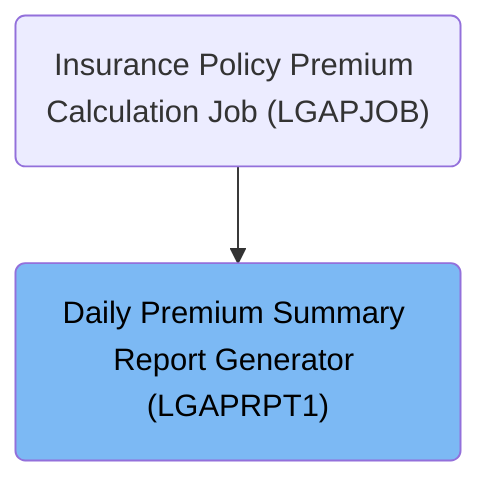
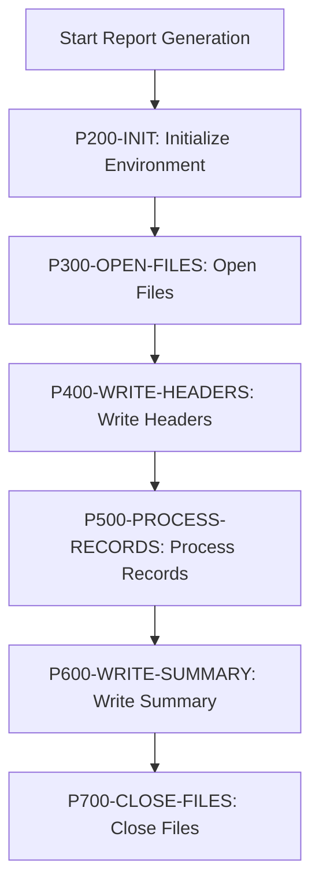
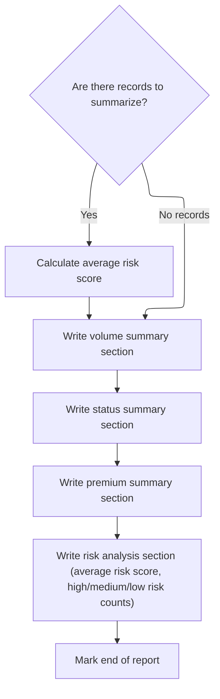

# Overview

This document describes the flow for generating a daily premium summary report. The process takes premium data as input and produces a formatted report with statistics and risk analysis, enabling management to review insurance policy performance.

## Dependencies

### Copybook

- OUTPUTREC (<SwmPath>[base/src/OUTPUTREC.cpy](base/src/OUTPUTREC.cpy)</SwmPath>)

# Where is this program used?

This program is used once, as represented in the following diagram:



## Input and Output Tables/Files used in the Program

| Table / File Name                                                                                                                                 | Type | Description                                 | Usage Mode | Key Fields / Layout Highlights |
| ------------------------------------------------------------------------------------------------------------------------------------------------- | ---- | ------------------------------------------- | ---------- | ------------------------------ |
| <SwmToken path="base/src/LGAPRPT1.cbl" pos="15:3:5" line-data="           SELECT INPUT-FILE ASSIGN TO &#39;INPUT&#39;">`INPUT-FILE`</SwmToken>    | File | Daily insurance policy premium details      | Input      | File resource                  |
| <SwmToken path="base/src/LGAPRPT1.cbl" pos="19:3:5" line-data="           SELECT REPORT-FILE ASSIGN TO &#39;REPORT&#39;">`REPORT-FILE`</SwmToken> | File | Formatted management premium summary report | Output     | File resource                  |
| <SwmToken path="base/src/LGAPRPT1.cbl" pos="328:3:5" line-data="           WRITE REPORT-LINE FROM RPT-BLANK-LINE ">`REPORT-LINE`</SwmToken>       | File | Single line of formatted report output      | Output     | File resource                  |

&nbsp;

## Detailed View of the Program's Functionality

## 1\. Program Initialization and Setup

The program begins by declaring its identity and purpose: it is designed to read a daily premium output file and generate a formatted management report with statistics and breakdowns. It specifies two files for input and output, both handled as line-sequential files. The input file contains the raw data records, while the output file will hold the generated report.

## 2\. Data Structures and Working Storage

The program defines several areas for storing data:

- File status fields are used to track the success or failure of file operations.
- Counters and accumulators are set up to keep track of the number of records processed, the number of approved, pending, rejected, and error records, as well as header records.
- Premium totals are maintained for different categories (fire, crime, flood, weather) and a grand total.
- Risk analysis fields store the total and average risk scores, and counts for high, medium, and low risk policies.
- Temporary work fields are used for converting and storing numeric values from the input records.
- Date and time fields are used to capture and format the current date and time for the report header.
- Report header and detail line structures are defined to format the output lines for the report.

## 3\. Main Report Generation Flow

The main procedure orchestrates the report generation in a step-by-step manner:

1. **Initialize Environment**: The program retrieves the current date and time from the system, formats them into readable strings, and resets all counters and totals to zero for a clean start.
2. **Open Files**: Both the input and output files are opened. If either file fails to open, an error message is displayed and the program stops.
3. **Write Headers**: The report header lines are written to the output file, including the formatted date and time.
4. **Process Records**: The program reads each record from the input file, processes it, and updates all relevant counters and totals.
5. **Write Summary**: After all records are processed, the program writes the summary sections to the report, including volume, status, premium totals, and risk analysis.
6. **Close Files**: Both files are closed to complete the process.

## 4\. Initialization Details

During initialization:

- The current date is accepted in a specific format (YYYYMMDD), and the current time in another format (HHMMSS).
- These raw values are passed to a formatting routine, which slices out the month, day, year, hour, minute, and second, and assembles them into human-readable strings (MM/DD/YYYY and HH:MM:SS).
- All counters and accumulators are reset to zero to ensure no leftover data from previous runs.

## 5\. File Handling

When opening files:

- The input file is opened for reading. If unsuccessful, an error is displayed and the program stops.
- The output file is opened for writing. If unsuccessful, an error is displayed, the input file is closed, and the program stops.

## 6\. Writing Report Headers

The report header consists of:

- A title line centered in the output.
- A line showing the formatted date and time.
- A separator line made of equal signs.
- A blank line for spacing.

## 7\. Processing Input Records

For each record in the input file:

- The total record count is incremented.
- The first record is treated as a header and skipped from further processing, with a separate header count incremented.
- Numeric fields (risk score, premiums) are converted from string to numeric format for calculations.
- Premium values are added to their respective totals.
- The risk score is added to the total risk score.
- The record's status is evaluated and the corresponding counter (approved, pending, rejected, error) is incremented.
- The risk score is categorized into high, medium, or low risk based on fixed thresholds, and the appropriate counter is incremented.

## 8\. Writing the Summary Sections

After all records are processed, the summary is written in several sections:

### a. Calculating Averages

- The header record count is subtracted from the total record count to get the number of actual data records.
- If there are any data records, the average risk score is calculated by dividing the total risk score by the number of records.

### b. Volume Section

- The total number of records processed is displayed.

### c. Status Section

- Counts for approved, pending, rejected, and error records are displayed.

### d. Premium Section

- Totals for fire, crime, flood, and weather premiums are displayed.
- The grand total premium is also displayed.

### e. Risk Analysis Section

- The average risk score is displayed.
- Counts for high, medium, and low risk policies are displayed, with labels indicating the thresholds for each category.
- The section ends with a blank line and an "END OF REPORT" marker.

## 9\. Closing Files

At the end of the process, both the input and output files are closed to ensure all data is properly saved and resources are released.

# Rule Definition

| Paragraph Name                                                                                                                                                                                                                                                                                                                                                                                                                                                                                                                                                                                                        | Rule ID | Category          | Description                                                                                                                                                                                                                                                                                                                                                                                                                                                                                                                                                                                                                                                                                                                                                                                                                                                                                                                                                                                                                                                                                                                                              | Conditions                                                         | Remarks                                                                                                                                                                                                                                                                                                                                                                                                                                                                                                                                                                                                                                                                                                                                                                                                                                                                                                                                                                                                                                                                                                                                                                                                 |
| --------------------------------------------------------------------------------------------------------------------------------------------------------------------------------------------------------------------------------------------------------------------------------------------------------------------------------------------------------------------------------------------------------------------------------------------------------------------------------------------------------------------------------------------------------------------------------------------------------------------- | ------- | ----------------- | -------------------------------------------------------------------------------------------------------------------------------------------------------------------------------------------------------------------------------------------------------------------------------------------------------------------------------------------------------------------------------------------------------------------------------------------------------------------------------------------------------------------------------------------------------------------------------------------------------------------------------------------------------------------------------------------------------------------------------------------------------------------------------------------------------------------------------------------------------------------------------------------------------------------------------------------------------------------------------------------------------------------------------------------------------------------------------------------------------------------------------------------------------- | ------------------------------------------------------------------ | ------------------------------------------------------------------------------------------------------------------------------------------------------------------------------------------------------------------------------------------------------------------------------------------------------------------------------------------------------------------------------------------------------------------------------------------------------------------------------------------------------------------------------------------------------------------------------------------------------------------------------------------------------------------------------------------------------------------------------------------------------------------------------------------------------------------------------------------------------------------------------------------------------------------------------------------------------------------------------------------------------------------------------------------------------------------------------------------------------------------------------------------------------------------------------------------------------- |
| <SwmToken path="base/src/LGAPRPT1.cbl" pos="126:3:7" line-data="           PERFORM P300-OPEN-FILES">`P300-OPEN-FILES`</SwmToken>                                                                                                                                                                                                                                                                                                                                                                                                                                                                                      | RL-001  | Conditional Logic | The program must open the input file named 'INPUT' for reading and the output file named 'REPORT' for writing (overwriting any existing content). If either file cannot be opened, the program must display an error and terminate.                                                                                                                                                                                                                                                                                                                                                                                                                                                                                                                                                                                                                                                                                                                                                                                                                                                                                                                      | At program start, before any processing occurs.                    | Input file: 'INPUT', Output file: 'REPORT'. File status codes: '00' for OK, '10' for EOF.                                                                                                                                                                                                                                                                                                                                                                                                                                                                                                                                                                                                                                                                                                                                                                                                                                                                                                                                                                                                                                                                                                               |
| <SwmToken path="base/src/LGAPRPT1.cbl" pos="125:3:5" line-data="           PERFORM P200-INIT">`P200-INIT`</SwmToken>                                                                                                                                                                                                                                                                                                                                                                                                                                                                                                  | RL-002  | Data Assignment   | All counters and totals must be initialized to zero at the start of report generation.                                                                                                                                                                                                                                                                                                                                                                                                                                                                                                                                                                                                                                                                                                                                                                                                                                                                                                                                                                                                                                                                   | Before processing any records, during initialization.              | Counters: total records processed, approved count, pending count, rejected count, error count, header count, total fire premium, total crime premium, total flood premium, total weather premium, grand total premium, total risk score, average risk score, high risk count, medium risk count, low risk count.                                                                                                                                                                                                                                                                                                                                                                                                                                                                                                                                                                                                                                                                                                                                                                                                                                                                                        |
| <SwmToken path="base/src/LGAPRPT1.cbl" pos="177:3:7" line-data="               PERFORM P520-PROCESS-RECORD">`P520-PROCESS-RECORD`</SwmToken>                                                                                                                                                                                                                                                                                                                                                                                                                                                                          | RL-003  | Conditional Logic | The first record in the input file must be treated as a header record and excluded from all totals and counters; increment a header counter for this record.                                                                                                                                                                                                                                                                                                                                                                                                                                                                                                                                                                                                                                                                                                                                                                                                                                                                                                                                                                                             | When processing the first record (record count = 1).               | Header counter is incremented only for the first record.                                                                                                                                                                                                                                                                                                                                                                                                                                                                                                                                                                                                                                                                                                                                                                                                                                                                                                                                                                                                                                                                                                                                                |
| <SwmToken path="base/src/LGAPRPT1.cbl" pos="177:3:7" line-data="               PERFORM P520-PROCESS-RECORD">`P520-PROCESS-RECORD`</SwmToken>                                                                                                                                                                                                                                                                                                                                                                                                                                                                          | RL-004  | Computation       | Convert all numeric fields (<SwmToken path="base/src/LGAPRPT1.cbl" pos="195:7:11" line-data="           MOVE FUNCTION NUMVAL(OUT-RISK-SCORE) TO WS-RISK-SCORE-NUM">`OUT-RISK-SCORE`</SwmToken>, <SwmToken path="base/src/LGAPRPT1.cbl" pos="196:7:11" line-data="           MOVE FUNCTION NUMVAL(OUT-FIRE-PREMIUM) TO WS-FIRE-PREM-NUM">`OUT-FIRE-PREMIUM`</SwmToken>, <SwmToken path="base/src/LGAPRPT1.cbl" pos="197:7:11" line-data="           MOVE FUNCTION NUMVAL(OUT-CRIME-PREMIUM) TO WS-CRIME-PREM-NUM">`OUT-CRIME-PREMIUM`</SwmToken>, <SwmToken path="base/src/LGAPRPT1.cbl" pos="198:7:11" line-data="           MOVE FUNCTION NUMVAL(OUT-FLOOD-PREMIUM) TO WS-FLOOD-PREM-NUM">`OUT-FLOOD-PREMIUM`</SwmToken>, <SwmToken path="base/src/LGAPRPT1.cbl" pos="199:7:11" line-data="           MOVE FUNCTION NUMVAL(OUT-WEATHER-PREMIUM) TO WS-WEATHER-PREM-NUM">`OUT-WEATHER-PREMIUM`</SwmToken>, <SwmToken path="base/src/LGAPRPT1.cbl" pos="200:7:11" line-data="           MOVE FUNCTION NUMVAL(OUT-TOTAL-PREMIUM) TO WS-TOTAL-PREM-NUM">`OUT-TOTAL-PREMIUM`</SwmToken>) from string to number, treating any invalid or blank value as zero. | For each data record (excluding header).                           | Fields: <SwmToken path="base/src/LGAPRPT1.cbl" pos="195:7:11" line-data="           MOVE FUNCTION NUMVAL(OUT-RISK-SCORE) TO WS-RISK-SCORE-NUM">`OUT-RISK-SCORE`</SwmToken> (3 chars), <SwmToken path="base/src/LGAPRPT1.cbl" pos="196:7:11" line-data="           MOVE FUNCTION NUMVAL(OUT-FIRE-PREMIUM) TO WS-FIRE-PREM-NUM">`OUT-FIRE-PREMIUM`</SwmToken> (10 chars), <SwmToken path="base/src/LGAPRPT1.cbl" pos="197:7:11" line-data="           MOVE FUNCTION NUMVAL(OUT-CRIME-PREMIUM) TO WS-CRIME-PREM-NUM">`OUT-CRIME-PREMIUM`</SwmToken> (10 chars), <SwmToken path="base/src/LGAPRPT1.cbl" pos="198:7:11" line-data="           MOVE FUNCTION NUMVAL(OUT-FLOOD-PREMIUM) TO WS-FLOOD-PREM-NUM">`OUT-FLOOD-PREMIUM`</SwmToken> (10 chars), <SwmToken path="base/src/LGAPRPT1.cbl" pos="199:7:11" line-data="           MOVE FUNCTION NUMVAL(OUT-WEATHER-PREMIUM) TO WS-WEATHER-PREM-NUM">`OUT-WEATHER-PREMIUM`</SwmToken> (10 chars), <SwmToken path="base/src/LGAPRPT1.cbl" pos="200:7:11" line-data="           MOVE FUNCTION NUMVAL(OUT-TOTAL-PREMIUM) TO WS-TOTAL-PREM-NUM">`OUT-TOTAL-PREMIUM`</SwmToken> (11 chars). Use numeric conversion function; if conversion fails, result is zero. |
| <SwmToken path="base/src/LGAPRPT1.cbl" pos="177:3:7" line-data="               PERFORM P520-PROCESS-RECORD">`P520-PROCESS-RECORD`</SwmToken>                                                                                                                                                                                                                                                                                                                                                                                                                                                                          | RL-005  | Computation       | Add each premium field to its corresponding total accumulator. Add the risk score to the total risk score accumulator.                                                                                                                                                                                                                                                                                                                                                                                                                                                                                                                                                                                                                                                                                                                                                                                                                                                                                                                                                                                                                                   | For each data record (excluding header), after numeric conversion. | Accumulators: total fire premium, total crime premium, total flood premium, total weather premium, grand total premium, total risk score.                                                                                                                                                                                                                                                                                                                                                                                                                                                                                                                                                                                                                                                                                                                                                                                                                                                                                                                                                                                                                                                               |
| <SwmToken path="base/src/LGAPRPT1.cbl" pos="177:3:7" line-data="               PERFORM P520-PROCESS-RECORD">`P520-PROCESS-RECORD`</SwmToken>                                                                                                                                                                                                                                                                                                                                                                                                                                                                          | RL-006  | Conditional Logic | Increment the appropriate status counter based on <SwmToken path="base/src/LGAPRPT1.cbl" pos="211:3:5" line-data="           EVALUATE OUT-STATUS">`OUT-STATUS`</SwmToken>: increment the approved counter if the value is exactly 'APPROVED', the pending counter if exactly 'PENDING', the rejected counter if exactly 'REJECTED', and the error/unsupported counter for any other value (case-sensitive).                                                                                                                                                                                                                                                                                                                                                                                                                                                                                                                                                                                                                                                                                                                                              | For each data record (excluding header), after numeric conversion. | <SwmToken path="base/src/LGAPRPT1.cbl" pos="211:3:5" line-data="           EVALUATE OUT-STATUS">`OUT-STATUS`</SwmToken> is a 20-character string. Comparison is case-sensitive.                                                                                                                                                                                                                                                                                                                                                                                                                                                                                                                                                                                                                                                                                                                                                                                                                                                                                                                                                                                                                         |
| <SwmToken path="base/src/LGAPRPT1.cbl" pos="177:3:7" line-data="               PERFORM P520-PROCESS-RECORD">`P520-PROCESS-RECORD`</SwmToken>                                                                                                                                                                                                                                                                                                                                                                                                                                                                          | RL-007  | Conditional Logic | Categorize the risk score as high (>=180), medium (>=120 and <180), or low (<120), and increment the corresponding risk counter.                                                                                                                                                                                                                                                                                                                                                                                                                                                                                                                                                                                                                                                                                                                                                                                                                                                                                                                                                                                                                         | For each data record (excluding header), after numeric conversion. | High risk: risk score >= 180; Medium risk: risk score >= 120 and < 180; Low risk: risk score < 120.                                                                                                                                                                                                                                                                                                                                                                                                                                                                                                                                                                                                                                                                                                                                                                                                                                                                                                                                                                                                                                                                                                     |
| <SwmToken path="base/src/LGAPRPT1.cbl" pos="236:3:7" line-data="           PERFORM P610-CALC-AVERAGES">`P610-CALC-AVERAGES`</SwmToken>                                                                                                                                                                                                                                                                                                                                                                                                                                                                                | RL-008  | Computation       | The average risk score must be calculated as the total risk score divided by the number of data records (total records processed minus header count), if the count is positive; otherwise, the average risk score is zero.                                                                                                                                                                                                                                                                                                                                                                                                                                                                                                                                                                                                                                                                                                                                                                                                                                                                                                                               | After all records have been processed, before report output.       | Average risk score is a number with two decimal places. If the denominator is zero, set average to zero.                                                                                                                                                                                                                                                                                                                                                                                                                                                                                                                                                                                                                                                                                                                                                                                                                                                                                                                                                                                                                                                                                                |
| <SwmToken path="base/src/LGAPRPT1.cbl" pos="136:3:9" line-data="           PERFORM P210-FORMAT-DATE-TIME">`P210-FORMAT-DATE-TIME`</SwmToken>, <SwmToken path="base/src/LGAPRPT1.cbl" pos="127:3:7" line-data="           PERFORM P400-WRITE-HEADERS">`P400-WRITE-HEADERS`</SwmToken>                                                                                                                                                                                                                                                                                                                                  | RL-009  | Computation       | Obtain the current date and time as 8-digit (YYYYMMDD) and 6-digit (HHMMSS) strings, and format them as MM/DD/YYYY and HH:MM:SS for use in the report header. Write a centered title, date/time line, separator, and blank line, all padded to 133 characters.                                                                                                                                                                                                                                                                                                                                                                                                                                                                                                                                                                                                                                                                                                                                                                                                                                                                                           | At the start of report output.                                     | Date: MM/DD/YYYY (10 chars), Time: HH:MM:SS (8 chars). Title: 'DAILY PREMIUM CALCULATION SUMMARY REPORT' centered in 133 chars. Separator: 133 '='. All lines padded to 133 chars.                                                                                                                                                                                                                                                                                                                                                                                                                                                                                                                                                                                                                                                                                                                                                                                                                                                                                                                                                                                                                      |
| <SwmToken path="base/src/LGAPRPT1.cbl" pos="237:3:9" line-data="           PERFORM P620-WRITE-VOLUME-SECTION">`P620-WRITE-VOLUME-SECTION`</SwmToken>, <SwmToken path="base/src/LGAPRPT1.cbl" pos="238:3:9" line-data="           PERFORM P630-WRITE-STATUS-SECTION">`P630-WRITE-STATUS-SECTION`</SwmToken>, <SwmToken path="base/src/LGAPRPT1.cbl" pos="239:3:9" line-data="           PERFORM P640-WRITE-PREMIUM-SECTION">`P640-WRITE-PREMIUM-SECTION`</SwmToken>, <SwmToken path="base/src/LGAPRPT1.cbl" pos="240:3:9" line-data="           PERFORM P650-WRITE-RISK-SECTION.">`P650-WRITE-RISK-SECTION`</SwmToken> | RL-010  | Computation       | The report must include summary sections for processing volume, underwriting decisions, premium totals, and risk analysis, each as a visually distinct block with labels and values on separate lines, blank lines for separation, and all lines padded to 133 characters.                                                                                                                                                                                                                                                                                                                                                                                                                                                                                                                                                                                                                                                                                                                                                                                                                                                                               | After all records have been processed and averages calculated.     | Section titles, labels, and values as described in the spec. All lines padded to 133 chars. Section order and blank lines as specified.                                                                                                                                                                                                                                                                                                                                                                                                                                                                                                                                                                                                                                                                                                                                                                                                                                                                                                                                                                                                                                                                 |
| <SwmToken path="base/src/LGAPRPT1.cbl" pos="130:3:7" line-data="           PERFORM P700-CLOSE-FILES">`P700-CLOSE-FILES`</SwmToken>                                                                                                                                                                                                                                                                                                                                                                                                                                                                                    | RL-011  | Conditional Logic | The program must close both the input and output files at the end of processing.                                                                                                                                                                                                                                                                                                                                                                                                                                                                                                                                                                                                                                                                                                                                                                                                                                                                                                                                                                                                                                                                         | After all report output is complete.                               | No special format; just ensure files are closed.                                                                                                                                                                                                                                                                                                                                                                                                                                                                                                                                                                                                                                                                                                                                                                                                                                                                                                                                                                                                                                                                                                                                                        |

# User Stories

## User Story 1: File Management, Initialization, and Closure

---

### Story Description:

As a system, I want to open the input and output files, initialize all counters and totals to zero, and close the files at the end of processing so that report generation starts reliably, processes accurately, and releases resources properly.

---

### Business Rule Mapping:

| Rule ID | Paragraph Name                                                                                                                     | Rule Description                                                                                                                                                                                                                    |
| ------- | ---------------------------------------------------------------------------------------------------------------------------------- | ----------------------------------------------------------------------------------------------------------------------------------------------------------------------------------------------------------------------------------- |
| RL-002  | <SwmToken path="base/src/LGAPRPT1.cbl" pos="125:3:5" line-data="           PERFORM P200-INIT">`P200-INIT`</SwmToken>               | All counters and totals must be initialized to zero at the start of report generation.                                                                                                                                              |
| RL-001  | <SwmToken path="base/src/LGAPRPT1.cbl" pos="126:3:7" line-data="           PERFORM P300-OPEN-FILES">`P300-OPEN-FILES`</SwmToken>   | The program must open the input file named 'INPUT' for reading and the output file named 'REPORT' for writing (overwriting any existing content). If either file cannot be opened, the program must display an error and terminate. |
| RL-011  | <SwmToken path="base/src/LGAPRPT1.cbl" pos="130:3:7" line-data="           PERFORM P700-CLOSE-FILES">`P700-CLOSE-FILES`</SwmToken> | The program must close both the input and output files at the end of processing.                                                                                                                                                    |

---

### Relevant Functionality:

- <SwmToken path="base/src/LGAPRPT1.cbl" pos="125:3:5" line-data="           PERFORM P200-INIT">`P200-INIT`</SwmToken>
  1. **RL-002:**
     - Set all counters and accumulators to zero
- <SwmToken path="base/src/LGAPRPT1.cbl" pos="126:3:7" line-data="           PERFORM P300-OPEN-FILES">`P300-OPEN-FILES`</SwmToken>
  1. **RL-001:**
     - Attempt to open the input file for reading
     - If the input file cannot be opened, display an error and stop
     - Attempt to open the output file for writing
     - If the output file cannot be opened, display an error, close the input file, and stop
- <SwmToken path="base/src/LGAPRPT1.cbl" pos="130:3:7" line-data="           PERFORM P700-CLOSE-FILES">`P700-CLOSE-FILES`</SwmToken>
  1. **RL-011:**
     - Close the input file
     - Close the output file

## User Story 2: Record Processing and Accumulation

---

### Story Description:

As a system, I want to process each record in the input file by handling the header, converting numeric fields, accumulating totals, categorizing status and risk, so that I can accurately compute all required statistics for the report.

---

### Business Rule Mapping:

| Rule ID | Paragraph Name                                                                                                                               | Rule Description                                                                                                                                                                                                                                                                                                                                                                                                                                                                                                                                                                                                                                                                                                                                                                                                                                                                                                                                                                                                                                                                                                                                         |
| ------- | -------------------------------------------------------------------------------------------------------------------------------------------- | -------------------------------------------------------------------------------------------------------------------------------------------------------------------------------------------------------------------------------------------------------------------------------------------------------------------------------------------------------------------------------------------------------------------------------------------------------------------------------------------------------------------------------------------------------------------------------------------------------------------------------------------------------------------------------------------------------------------------------------------------------------------------------------------------------------------------------------------------------------------------------------------------------------------------------------------------------------------------------------------------------------------------------------------------------------------------------------------------------------------------------------------------------- |
| RL-003  | <SwmToken path="base/src/LGAPRPT1.cbl" pos="177:3:7" line-data="               PERFORM P520-PROCESS-RECORD">`P520-PROCESS-RECORD`</SwmToken> | The first record in the input file must be treated as a header record and excluded from all totals and counters; increment a header counter for this record.                                                                                                                                                                                                                                                                                                                                                                                                                                                                                                                                                                                                                                                                                                                                                                                                                                                                                                                                                                                             |
| RL-004  | <SwmToken path="base/src/LGAPRPT1.cbl" pos="177:3:7" line-data="               PERFORM P520-PROCESS-RECORD">`P520-PROCESS-RECORD`</SwmToken> | Convert all numeric fields (<SwmToken path="base/src/LGAPRPT1.cbl" pos="195:7:11" line-data="           MOVE FUNCTION NUMVAL(OUT-RISK-SCORE) TO WS-RISK-SCORE-NUM">`OUT-RISK-SCORE`</SwmToken>, <SwmToken path="base/src/LGAPRPT1.cbl" pos="196:7:11" line-data="           MOVE FUNCTION NUMVAL(OUT-FIRE-PREMIUM) TO WS-FIRE-PREM-NUM">`OUT-FIRE-PREMIUM`</SwmToken>, <SwmToken path="base/src/LGAPRPT1.cbl" pos="197:7:11" line-data="           MOVE FUNCTION NUMVAL(OUT-CRIME-PREMIUM) TO WS-CRIME-PREM-NUM">`OUT-CRIME-PREMIUM`</SwmToken>, <SwmToken path="base/src/LGAPRPT1.cbl" pos="198:7:11" line-data="           MOVE FUNCTION NUMVAL(OUT-FLOOD-PREMIUM) TO WS-FLOOD-PREM-NUM">`OUT-FLOOD-PREMIUM`</SwmToken>, <SwmToken path="base/src/LGAPRPT1.cbl" pos="199:7:11" line-data="           MOVE FUNCTION NUMVAL(OUT-WEATHER-PREMIUM) TO WS-WEATHER-PREM-NUM">`OUT-WEATHER-PREMIUM`</SwmToken>, <SwmToken path="base/src/LGAPRPT1.cbl" pos="200:7:11" line-data="           MOVE FUNCTION NUMVAL(OUT-TOTAL-PREMIUM) TO WS-TOTAL-PREM-NUM">`OUT-TOTAL-PREMIUM`</SwmToken>) from string to number, treating any invalid or blank value as zero. |
| RL-005  | <SwmToken path="base/src/LGAPRPT1.cbl" pos="177:3:7" line-data="               PERFORM P520-PROCESS-RECORD">`P520-PROCESS-RECORD`</SwmToken> | Add each premium field to its corresponding total accumulator. Add the risk score to the total risk score accumulator.                                                                                                                                                                                                                                                                                                                                                                                                                                                                                                                                                                                                                                                                                                                                                                                                                                                                                                                                                                                                                                   |
| RL-006  | <SwmToken path="base/src/LGAPRPT1.cbl" pos="177:3:7" line-data="               PERFORM P520-PROCESS-RECORD">`P520-PROCESS-RECORD`</SwmToken> | Increment the appropriate status counter based on <SwmToken path="base/src/LGAPRPT1.cbl" pos="211:3:5" line-data="           EVALUATE OUT-STATUS">`OUT-STATUS`</SwmToken>: increment the approved counter if the value is exactly 'APPROVED', the pending counter if exactly 'PENDING', the rejected counter if exactly 'REJECTED', and the error/unsupported counter for any other value (case-sensitive).                                                                                                                                                                                                                                                                                                                                                                                                                                                                                                                                                                                                                                                                                                                                              |
| RL-007  | <SwmToken path="base/src/LGAPRPT1.cbl" pos="177:3:7" line-data="               PERFORM P520-PROCESS-RECORD">`P520-PROCESS-RECORD`</SwmToken> | Categorize the risk score as high (>=180), medium (>=120 and <180), or low (<120), and increment the corresponding risk counter.                                                                                                                                                                                                                                                                                                                                                                                                                                                                                                                                                                                                                                                                                                                                                                                                                                                                                                                                                                                                                         |

---

### Relevant Functionality:

- <SwmToken path="base/src/LGAPRPT1.cbl" pos="177:3:7" line-data="               PERFORM P520-PROCESS-RECORD">`P520-PROCESS-RECORD`</SwmToken>
  1. **RL-003:**
     - If the current record is the first record:
       - Increment the header counter
       - Skip further processing for this record
  2. **RL-004:**
     - For each numeric field:
       - Convert the string to a number using a numeric conversion function
       - If the value is invalid or blank, treat as zero
  3. **RL-005:**
     - Add each numeric premium value to its corresponding total accumulator
     - Add the risk score to the total risk score accumulator
  4. **RL-006:**
     - If <SwmToken path="base/src/LGAPRPT1.cbl" pos="211:3:5" line-data="           EVALUATE OUT-STATUS">`OUT-STATUS`</SwmToken> is 'APPROVED', increment approved counter
     - Else if <SwmToken path="base/src/LGAPRPT1.cbl" pos="211:3:5" line-data="           EVALUATE OUT-STATUS">`OUT-STATUS`</SwmToken> is 'PENDING', increment pending counter
     - Else if <SwmToken path="base/src/LGAPRPT1.cbl" pos="211:3:5" line-data="           EVALUATE OUT-STATUS">`OUT-STATUS`</SwmToken> is 'REJECTED', increment rejected counter
     - Else, increment error/unsupported counter
  5. **RL-007:**
     - If risk score >= 180, increment high risk counter
     - Else if risk score >= 120, increment medium risk counter
     - Else, increment low risk counter

## User Story 3: Report Calculation and Output Formatting

---

### Story Description:

As a user, I want the report to include a formatted header with date and time, and summary sections for volume, decisions, premiums, and risk analysis, so that I can easily review the daily premium calculation results.

---

### Business Rule Mapping:

| Rule ID | Paragraph Name                                                                                                                                                                                                                                                                                                                                                                                                                                                                                                                                                                                                        | Rule Description                                                                                                                                                                                                                                                           |
| ------- | --------------------------------------------------------------------------------------------------------------------------------------------------------------------------------------------------------------------------------------------------------------------------------------------------------------------------------------------------------------------------------------------------------------------------------------------------------------------------------------------------------------------------------------------------------------------------------------------------------------------- | -------------------------------------------------------------------------------------------------------------------------------------------------------------------------------------------------------------------------------------------------------------------------- |
| RL-009  | <SwmToken path="base/src/LGAPRPT1.cbl" pos="136:3:9" line-data="           PERFORM P210-FORMAT-DATE-TIME">`P210-FORMAT-DATE-TIME`</SwmToken>, <SwmToken path="base/src/LGAPRPT1.cbl" pos="127:3:7" line-data="           PERFORM P400-WRITE-HEADERS">`P400-WRITE-HEADERS`</SwmToken>                                                                                                                                                                                                                                                                                                                                  | Obtain the current date and time as 8-digit (YYYYMMDD) and 6-digit (HHMMSS) strings, and format them as MM/DD/YYYY and HH:MM:SS for use in the report header. Write a centered title, date/time line, separator, and blank line, all padded to 133 characters.             |
| RL-008  | <SwmToken path="base/src/LGAPRPT1.cbl" pos="236:3:7" line-data="           PERFORM P610-CALC-AVERAGES">`P610-CALC-AVERAGES`</SwmToken>                                                                                                                                                                                                                                                                                                                                                                                                                                                                                | The average risk score must be calculated as the total risk score divided by the number of data records (total records processed minus header count), if the count is positive; otherwise, the average risk score is zero.                                                 |
| RL-010  | <SwmToken path="base/src/LGAPRPT1.cbl" pos="237:3:9" line-data="           PERFORM P620-WRITE-VOLUME-SECTION">`P620-WRITE-VOLUME-SECTION`</SwmToken>, <SwmToken path="base/src/LGAPRPT1.cbl" pos="238:3:9" line-data="           PERFORM P630-WRITE-STATUS-SECTION">`P630-WRITE-STATUS-SECTION`</SwmToken>, <SwmToken path="base/src/LGAPRPT1.cbl" pos="239:3:9" line-data="           PERFORM P640-WRITE-PREMIUM-SECTION">`P640-WRITE-PREMIUM-SECTION`</SwmToken>, <SwmToken path="base/src/LGAPRPT1.cbl" pos="240:3:9" line-data="           PERFORM P650-WRITE-RISK-SECTION.">`P650-WRITE-RISK-SECTION`</SwmToken> | The report must include summary sections for processing volume, underwriting decisions, premium totals, and risk analysis, each as a visually distinct block with labels and values on separate lines, blank lines for separation, and all lines padded to 133 characters. |

---

### Relevant Functionality:

- <SwmToken path="base/src/LGAPRPT1.cbl" pos="136:3:9" line-data="           PERFORM P210-FORMAT-DATE-TIME">`P210-FORMAT-DATE-TIME`</SwmToken>
  1. **RL-009:**
     - Get current date and time as YYYYMMDD and HHMMSS
     - Format date as MM/DD/YYYY, time as HH:MM:SS
     - Write centered title line (133 chars)
     - Write date/time line (left-aligned, 133 chars)
     - Write separator line (133 '=')
     - Write blank line (133 spaces)
- <SwmToken path="base/src/LGAPRPT1.cbl" pos="236:3:7" line-data="           PERFORM P610-CALC-AVERAGES">`P610-CALC-AVERAGES`</SwmToken>
  1. **RL-008:**
     - Subtract header count from total records processed to get data record count
     - If data record count > 0:
       - Divide total risk score by data record count to get average risk score
     - Else:
       - Set average risk score to zero
- <SwmToken path="base/src/LGAPRPT1.cbl" pos="237:3:9" line-data="           PERFORM P620-WRITE-VOLUME-SECTION">`P620-WRITE-VOLUME-SECTION`</SwmToken>
  1. **RL-010:**
     - For each summary section:
       - Write section title line
       - Write blank lines as required
       - Write label and value lines for each metric
       - Write additional blank lines and 'END OF REPORT' marker as specified

# Workflow

# Orchestrating the Report Generation Steps



This section ensures that the report generation process follows a strict sequence of steps, guaranteeing that all necessary initialization, data processing, and cleanup actions are performed in the correct order to produce a valid report.

| Category        | Rule Name                      | Description                                                                                                                                                                                    |
| --------------- | ------------------------------ | ---------------------------------------------------------------------------------------------------------------------------------------------------------------------------------------------- |
| Data validation | File Availability Check        | All required files must be successfully opened before any data is written or processed in the report.                                                                                          |
| Business logic  | Initialization Requirement     | The report generation process must always begin by resetting the state and initializing the environment to ensure all subsequent steps operate with the correct context and current date/time. |
| Business logic  | Header Precedence              | Headers must be written to the report before any records are processed to ensure the report structure is correct and readable.                                                                 |
| Business logic  | Record Processing Completeness | All records must be processed and included in the report before the summary is written, ensuring completeness of the report data.                                                              |
| Business logic  | Summary Inclusion              | A summary section must be written after all records are processed, providing a consolidated view of the report’s contents.                                                                     |
| Technical step  | Resource Cleanup               | All files used in the report generation process must be properly closed at the end to prevent data loss or corruption.                                                                         |

<SwmSnippet path="/base/src/LGAPRPT1.cbl" line="124">

---

<SwmToken path="base/src/LGAPRPT1.cbl" pos="124:1:3" line-data="       P100-MAIN.">`P100-MAIN`</SwmToken> starts the report flow by resetting state and grabbing the current date/time via <SwmToken path="base/src/LGAPRPT1.cbl" pos="125:3:5" line-data="           PERFORM P200-INIT">`P200-INIT`</SwmToken>, so all later steps work with the right context.

```cobol
       P100-MAIN.
           PERFORM P200-INIT
           PERFORM P300-OPEN-FILES
           PERFORM P400-WRITE-HEADERS
           PERFORM P500-PROCESS-RECORDS
           PERFORM P600-WRITE-SUMMARY
           PERFORM P700-CLOSE-FILES
           STOP RUN.
```

---

</SwmSnippet>

# Preparing Date, Time, and State for Reporting

This section ensures that every report starts with the correct, human-readable date and time in its header, and that all counters and totals are reset before any calculations begin.

| Category       | Rule Name                         | Description                                                                                                         |
| -------------- | --------------------------------- | ------------------------------------------------------------------------------------------------------------------- |
| Business logic | Formatted report header date/time | The report header must display the current date and time, formatted as MM/DD/YYYY and HH:MM:SS, respectively.       |
| Business logic | Counters and totals reset         | All counters and totals used in the report must be reset to zero before any calculations or data processing begins. |

<SwmSnippet path="/base/src/LGAPRPT1.cbl" line="133">

---

In <SwmToken path="base/src/LGAPRPT1.cbl" pos="133:1:3" line-data="       P200-INIT.">`P200-INIT`</SwmToken>, we grab the current date and time from the system. Right after, we call <SwmToken path="base/src/LGAPRPT1.cbl" pos="136:3:9" line-data="           PERFORM P210-FORMAT-DATE-TIME">`P210-FORMAT-DATE-TIME`</SwmToken> to turn those raw values into readable strings for the report headers. Without this, the report would show unformatted numbers instead of a proper date/time.

```cobol
       P200-INIT.
           ACCEPT WS-CURRENT-DATE FROM DATE YYYYMMDD
           ACCEPT WS-CURRENT-TIME FROM TIME
           PERFORM P210-FORMAT-DATE-TIME
```

---

</SwmSnippet>

<SwmSnippet path="/base/src/LGAPRPT1.cbl" line="141">

---

<SwmToken path="base/src/LGAPRPT1.cbl" pos="141:1:7" line-data="       P210-FORMAT-DATE-TIME.">`P210-FORMAT-DATE-TIME`</SwmToken> takes the raw date (YYYYMMDD) and time (HHMMSS), slices out the month, day, year, hour, minute, and second using fixed positions, and builds formatted strings like MM/DD/YYYY and HH:MM:SS for the report. This assumes the input is always in those exact formats.

```cobol
       P210-FORMAT-DATE-TIME.
           STRING WS-CURRENT-DATE(5:2) '/'
                  WS-CURRENT-DATE(7:2) '/'
                  WS-CURRENT-DATE(1:4)
                  DELIMITED BY SIZE INTO WS-FORMAT-DATE
           
           STRING WS-CURRENT-TIME(1:2) ':'
                  WS-CURRENT-TIME(3:2) ':'
                  WS-CURRENT-TIME(5:2)
                  DELIMITED BY SIZE INTO WS-FORMAT-TIME.
```

---

</SwmSnippet>

<SwmSnippet path="/base/src/LGAPRPT1.cbl" line="137">

---

Back in <SwmToken path="base/src/LGAPRPT1.cbl" pos="125:3:5" line-data="           PERFORM P200-INIT">`P200-INIT`</SwmToken>, after date/time formatting, we zero out all counters and totals for a clean start.

```cobol
           INITIALIZE WS-COUNTERS
           INITIALIZE WS-PREMIUM-TOTALS
           INITIALIZE WS-RISK-ANALYSIS.
```

---

</SwmSnippet>

# Building the Report Summary and Risk Analysis



This section is responsible for building the report summary and risk analysis, ensuring that only valid data records are included in calculations, and that risk categories are clearly defined and reported.

| Category       | Rule Name                      | Description                                                                                                                                                                                                           |
| -------------- | ------------------------------ | --------------------------------------------------------------------------------------------------------------------------------------------------------------------------------------------------------------------- |
| Business logic | Exclude headers from averages  | Only data records (excluding headers) are considered when calculating the average risk score. The header count is subtracted from the total record count before performing the calculation.                           |
| Business logic | Average risk score calculation | The average risk score is calculated by dividing the total risk score by the adjusted record count, but only if the adjusted record count is greater than zero.                                                       |
| Business logic | Risk category thresholds       | Risk categories are defined by fixed thresholds: High Risk (score 180 or above), Medium Risk (score 120 to 179), and Low Risk (score below 120). Counts for each category are displayed in the risk analysis section. |
| Business logic | Report section order           | The report summary must include, in order: volume summary, status summary, premium summary, and risk analysis section, followed by an 'END OF REPORT' marker.                                                         |

<SwmSnippet path="/base/src/LGAPRPT1.cbl" line="235">

---

In <SwmToken path="base/src/LGAPRPT1.cbl" pos="235:1:5" line-data="       P600-WRITE-SUMMARY.">`P600-WRITE-SUMMARY`</SwmToken>, we start by calling <SwmToken path="base/src/LGAPRPT1.cbl" pos="236:3:7" line-data="           PERFORM P610-CALC-AVERAGES">`P610-CALC-AVERAGES`</SwmToken> to get the average risk score ready. This needs to happen first because later sections in the summary, like the risk analysis, depend on having that value calculated.

```cobol
       P600-WRITE-SUMMARY.
           PERFORM P610-CALC-AVERAGES
           PERFORM P620-WRITE-VOLUME-SECTION
           PERFORM P630-WRITE-STATUS-SECTION
           PERFORM P640-WRITE-PREMIUM-SECTION
           PERFORM P650-WRITE-RISK-SECTION.
```

---

</SwmSnippet>

<SwmSnippet path="/base/src/LGAPRPT1.cbl" line="242">

---

<SwmToken path="base/src/LGAPRPT1.cbl" pos="242:1:5" line-data="       P610-CALC-AVERAGES.">`P610-CALC-AVERAGES`</SwmToken> adjusts the record count by removing headers, then divides the total risk score by that adjusted count—if it's positive—to get the average risk score. This way, only real data records are considered, and we avoid dividing by zero.

```cobol
       P610-CALC-AVERAGES.
           SUBTRACT WS-HEADER-CNT FROM WS-TOTAL-REC
           IF WS-TOTAL-REC > ZERO
               COMPUTE WS-AVG-RISK-SCORE = 
                   WS-TOTAL-RISK-SCORE / WS-TOTAL-REC
           END-IF.
```

---

</SwmSnippet>

<SwmSnippet path="/base/src/LGAPRPT1.cbl" line="235">

---

Back in <SwmToken path="base/src/LGAPRPT1.cbl" pos="235:1:5" line-data="       P600-WRITE-SUMMARY.">`P600-WRITE-SUMMARY`</SwmToken>, after calculating averages and writing the other summary sections, we call <SwmToken path="base/src/LGAPRPT1.cbl" pos="240:3:9" line-data="           PERFORM P650-WRITE-RISK-SECTION.">`P650-WRITE-RISK-SECTION`</SwmToken> last. This is because it needs the average risk score and risk counts that were just calculated.

```cobol
       P600-WRITE-SUMMARY.
           PERFORM P610-CALC-AVERAGES
           PERFORM P620-WRITE-VOLUME-SECTION
           PERFORM P630-WRITE-STATUS-SECTION
           PERFORM P640-WRITE-PREMIUM-SECTION
           PERFORM P650-WRITE-RISK-SECTION.
```

---

</SwmSnippet>

<SwmSnippet path="/base/src/LGAPRPT1.cbl" line="327">

---

<SwmToken path="base/src/LGAPRPT1.cbl" pos="327:1:7" line-data="       P650-WRITE-RISK-SECTION.">`P650-WRITE-RISK-SECTION`</SwmToken> writes out the risk analysis part of the report. It uses the pre-calculated average risk score and risk counts, applies fixed labels for high, medium, and low risk (based on hardcoded thresholds), and formats everything into the report using standard line structures. It ends with an 'END OF REPORT' marker.

```cobol
       P650-WRITE-RISK-SECTION.
           WRITE REPORT-LINE FROM RPT-BLANK-LINE 
               AFTER ADVANCING 2 LINES
           MOVE 'RISK ANALYSIS' TO RPT-SECTION-TITLE
           WRITE REPORT-LINE FROM RPT-SECTION-HEADER 
               AFTER ADVANCING 1 LINE
           WRITE REPORT-LINE FROM RPT-BLANK-LINE 
               AFTER ADVANCING 1 LINE
           
           MOVE 'Average Risk Score:' TO RPT-DETAIL-LABEL
           MOVE WS-AVG-RISK-SCORE TO RPT-DETAIL-VALUE
           WRITE REPORT-LINE FROM RPT-DETAIL-LINE 
               AFTER ADVANCING 1 LINE
           
           MOVE 'High Risk Policies (180+):' TO RPT-DETAIL-LABEL
           MOVE WS-HIGH-RISK-CNT TO RPT-DETAIL-VALUE
           WRITE REPORT-LINE FROM RPT-DETAIL-LINE 
               AFTER ADVANCING 1 LINE
           
           MOVE 'Medium Risk Policies (120-179):' TO RPT-DETAIL-LABEL
           MOVE WS-MED-RISK-CNT TO RPT-DETAIL-VALUE
           WRITE REPORT-LINE FROM RPT-DETAIL-LINE 
               AFTER ADVANCING 1 LINE
           
           MOVE 'Low Risk Policies (<120):' TO RPT-DETAIL-LABEL
           MOVE WS-LOW-RISK-CNT TO RPT-DETAIL-VALUE
           WRITE REPORT-LINE FROM RPT-DETAIL-LINE 
               AFTER ADVANCING 1 LINE
           
           WRITE REPORT-LINE FROM RPT-BLANK-LINE 
               AFTER ADVANCING 2 LINES
           MOVE 'END OF REPORT' TO RPT-SECTION-TITLE
           WRITE REPORT-LINE FROM RPT-SECTION-HEADER 
               AFTER ADVANCING 1 LINE.
```

---

</SwmSnippet>

&nbsp;

*This is an auto-generated document by Swimm 🌊 and has not yet been verified by a human*

<SwmMeta version="3.0.0" repo-id="Z2l0aHViJTNBJTNBU3dpbW1pby1nZW5hcHAtbW90b3IlM0ElM0FHaXJpLVN3aW1t" repo-name="Swimmio-genapp-motor"><sup>Powered by [Swimm](https://app.swimm.io/)</sup></SwmMeta>
