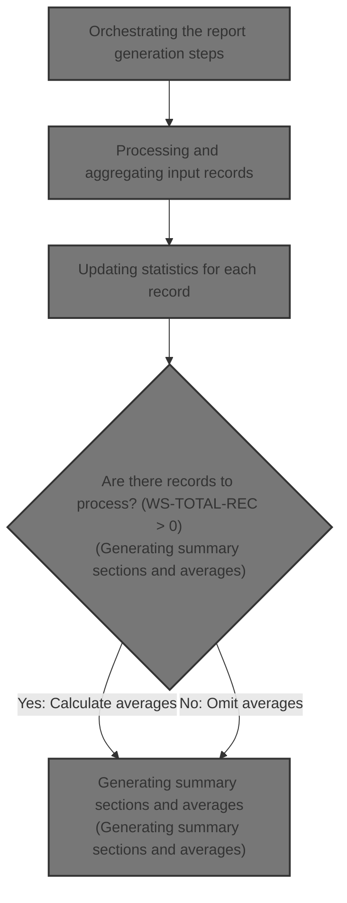
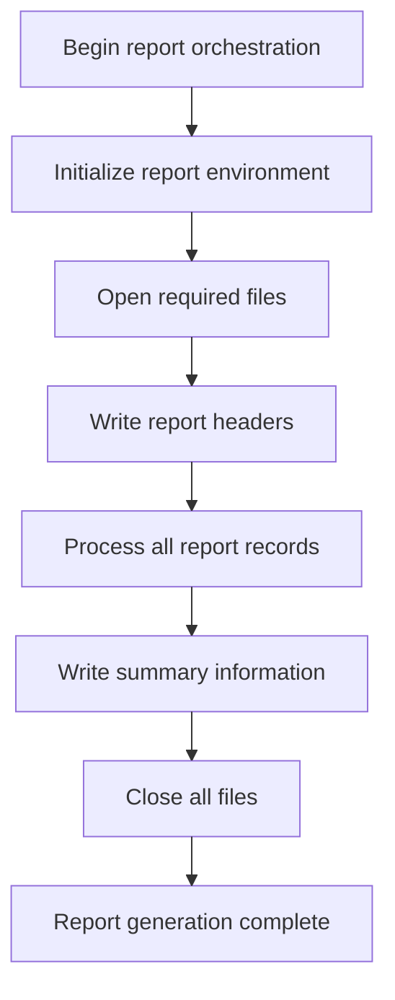
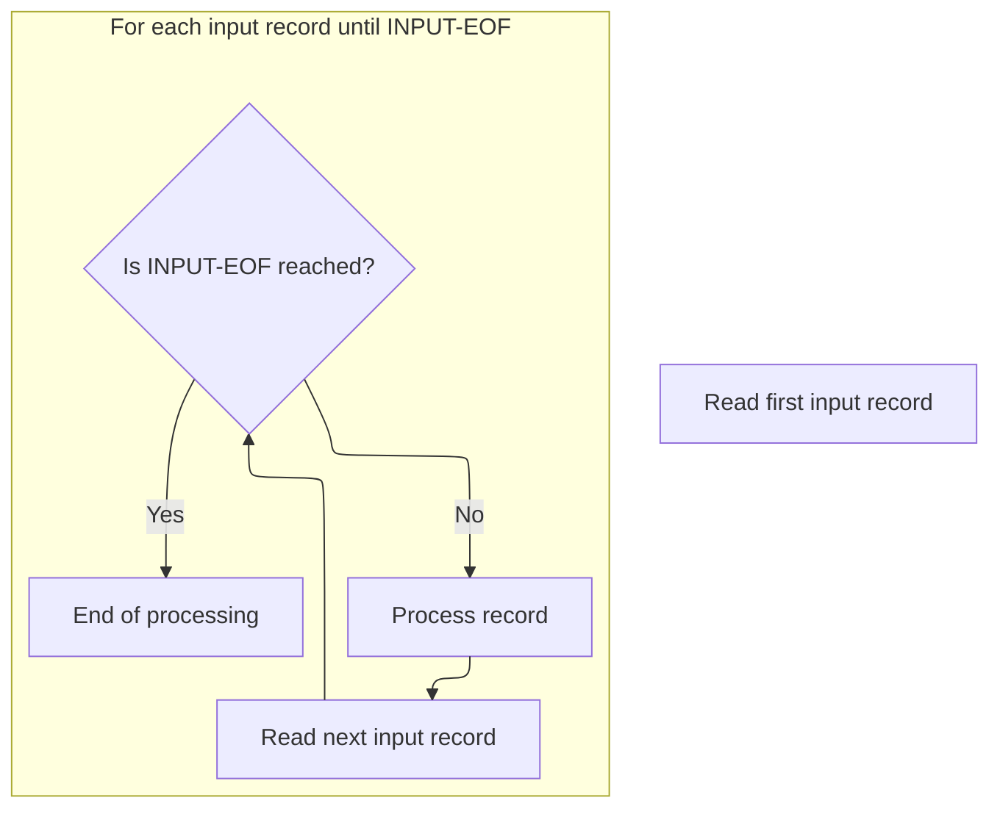
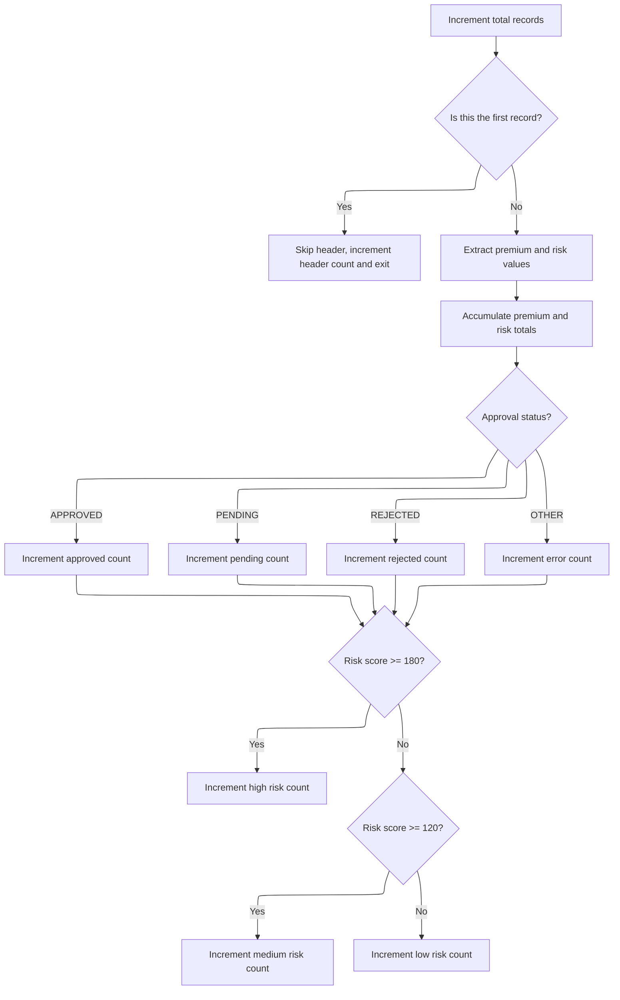
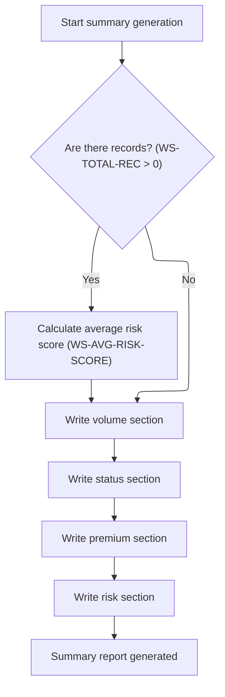

# Overview

This document describes the flow for generating a daily premium summary report. The process reads premium output records, prepares metadata and counters, processes each record to update statistics, and generates a formatted report with totals, approval status breakdowns, and risk analysis for management review.



## Dependencies

### Copybook

- OUTPUTREC

## Input and Output Tables/Files used in the Program

| Table / File Name                                                                                                                                 | Type | Description                                                   | Usage Mode | Key Fields / Layout Highlights |
| ------------------------------------------------------------------------------------------------------------------------------------------------- | ---- | ------------------------------------------------------------- | ---------- | ------------------------------ |
| <SwmToken path="base/src/LGAPRPT1.cbl" pos="15:3:5" line-data="           SELECT INPUT-FILE ASSIGN TO &#39;INPUT&#39;">`INPUT-FILE`</SwmToken>    | File | Daily insurance premium records and risk scores               | Input      | File resource                  |
| <SwmToken path="base/src/LGAPRPT1.cbl" pos="19:3:5" line-data="           SELECT REPORT-FILE ASSIGN TO &#39;REPORT&#39;">`REPORT-FILE`</SwmToken> | File | Formatted management summary report output                    | Output     | File resource                  |
| <SwmToken path="base/src/LGAPRPT1.cbl" pos="30:3:5" line-data="       01  REPORT-LINE                 PIC X(133).">`REPORT-LINE`</SwmToken>       | File | Individual lines of summary report (headers, details, totals) | Output     | File resource                  |

&nbsp;

# Workflow

# Orchestrating the report generation steps



This section ensures that all steps required for report generation are executed in the correct order, guaranteeing the integrity and completeness of the final report.

| Category        | Rule Name                              | Description                                                                                                                                                                                                |
| --------------- | -------------------------------------- | ---------------------------------------------------------------------------------------------------------------------------------------------------------------------------------------------------------- |
| Data validation | Environment Initialization Requirement | Report generation must begin with environment initialization to ensure all working fields and variables are set to their required starting values before any file operations or report logic are executed. |
| Data validation | File Availability Prerequisite         | All required files must be opened before any data is written or processed, ensuring that the report can be generated without interruption or data loss.                                                    |
| Data validation | File Closure Requirement               | All files must be closed at the end of the report generation process to prevent data corruption and ensure system resources are released.                                                                  |
| Business logic  | Header Precedence                      | Report headers must be written before any records are processed, ensuring that the report structure is clear and all subsequent data is properly contextualized.                                           |
| Business logic  | Record Processing Sequence             | All report records must be processed after headers are written and before summary information is generated, ensuring that the report contains all necessary data.                                          |
| Business logic  | Summary Generation Timing              | Summary information must be written after all records are processed, providing a consolidated view of the report data.                                                                                     |

<SwmSnippet path="/base/src/LGAPRPT1.cbl" line="124">

---

<SwmToken path="base/src/LGAPRPT1.cbl" pos="124:1:3" line-data="       P100-MAIN.">`P100-MAIN`</SwmToken> starts the flow, and calls <SwmToken path="base/src/LGAPRPT1.cbl" pos="125:3:5" line-data="           PERFORM P200-INIT">`P200-INIT`</SwmToken> first to set up all the working fields before moving on to file handling and report logic.

```cobol
       P100-MAIN.
           PERFORM P200-INIT
           PERFORM P300-OPEN-FILES
           PERFORM P400-WRITE-HEADERS
           PERFORM P500-PROCESS-RECORDS
           PERFORM P600-WRITE-SUMMARY
           PERFORM P700-CLOSE-FILES
           STOP RUN.
```

---

</SwmSnippet>

# Preparing runtime metadata and counters

This section is responsible for preparing the runtime metadata and counters before generating a report. It ensures that the report header displays the correct current date and time in a human-readable format, and that all statistical counters and totals are reset to provide accurate results for the new report run.

| Category       | Rule Name                 | Description                                                                                                                             |
| -------------- | ------------------------- | --------------------------------------------------------------------------------------------------------------------------------------- |
| Business logic | Formatted report date     | The report header must display the current date in MM/DD/YYYY format, derived from the system date at the time the report is generated. |
| Business logic | Formatted report time     | The report header must display the current time in HH:MM:SS format, derived from the system time at the time the report is generated.   |
| Business logic | Reset counters and totals | All statistical counters and totals must be reset to zero before starting a new report run to ensure accuracy of the report data.       |

<SwmSnippet path="/base/src/LGAPRPT1.cbl" line="133">

---

In <SwmToken path="base/src/LGAPRPT1.cbl" pos="133:1:3" line-data="       P200-INIT.">`P200-INIT`</SwmToken>, we fetch the date/time and call <SwmToken path="base/src/LGAPRPT1.cbl" pos="136:3:9" line-data="           PERFORM P210-FORMAT-DATE-TIME">`P210-FORMAT-DATE-TIME`</SwmToken> to make them readable for the report header.

```cobol
       P200-INIT.
           ACCEPT WS-CURRENT-DATE FROM DATE YYYYMMDD
           ACCEPT WS-CURRENT-TIME FROM TIME
           PERFORM P210-FORMAT-DATE-TIME
```

---

</SwmSnippet>

<SwmSnippet path="/base/src/LGAPRPT1.cbl" line="141">

---

<SwmToken path="base/src/LGAPRPT1.cbl" pos="141:1:7" line-data="       P210-FORMAT-DATE-TIME.">`P210-FORMAT-DATE-TIME`</SwmToken> takes the raw date and time strings, slices out the relevant parts, and builds MM/DD/YYYY and HH:MM:SS formats using string concatenation. It assumes the input is always in the expected format, so if that ever changes, this will break.

```cobol
       P210-FORMAT-DATE-TIME.
           STRING WS-CURRENT-DATE(5:2) '/'
                  WS-CURRENT-DATE(7:2) '/'
                  WS-CURRENT-DATE(1:4)
                  DELIMITED BY SIZE INTO WS-FORMAT-DATE
           
           STRING WS-CURRENT-TIME(1:2) ':'
                  WS-CURRENT-TIME(3:2) ':'
                  WS-CURRENT-TIME(5:2)
                  DELIMITED BY SIZE INTO WS-FORMAT-TIME.
```

---

</SwmSnippet>

<SwmSnippet path="/base/src/LGAPRPT1.cbl" line="137">

---

We just came back from <SwmToken path="base/src/LGAPRPT1.cbl" pos="136:3:9" line-data="           PERFORM P210-FORMAT-DATE-TIME">`P210-FORMAT-DATE-TIME`</SwmToken> with formatted date/time ready for the report header. Now, at the end of <SwmToken path="base/src/LGAPRPT1.cbl" pos="125:3:5" line-data="           PERFORM P200-INIT">`P200-INIT`</SwmToken>, we reset all counters and totals so the report stats start clean for this run.

```cobol
           INITIALIZE WS-COUNTERS
           INITIALIZE WS-PREMIUM-TOTALS
           INITIALIZE WS-RISK-ANALYSIS.
```

---

</SwmSnippet>

# Processing and aggregating input records



This section is responsible for reading input records one by one, processing each record to update the report data, and continuing until all records have been processed. It ensures that no records are missed and that processing stops precisely at the end of the input file.

| Category        | Rule Name                     | Description                                                                                                                                                                                                                                                                                           |
| --------------- | ----------------------------- | ----------------------------------------------------------------------------------------------------------------------------------------------------------------------------------------------------------------------------------------------------------------------------------------------------- |
| Data validation | End-of-file termination       | If the end-of-file condition is detected (<SwmToken path="base/src/LGAPRPT1.cbl" pos="176:5:7" line-data="           PERFORM UNTIL INPUT-EOF">`INPUT-EOF`</SwmToken>), no further records are read or processed, and the section transitions to the end of processing.                                |
| Data validation | Valid record filtering        | The section must ensure that only records with a valid status (<SwmToken path="base/src/LGAPRPT1.cbl" pos="38:3:5" line-data="           88 INPUT-OK                 VALUE &#39;00&#39;.">`INPUT-OK`</SwmToken>) are processed, and any records with an invalid status are excluded from aggregation. |
| Business logic  | Complete record processing    | Processing of input records must continue until the end-of-file condition (<SwmToken path="base/src/LGAPRPT1.cbl" pos="176:5:7" line-data="           PERFORM UNTIL INPUT-EOF">`INPUT-EOF`</SwmToken>) is reached, ensuring all available records are included in the report.                         |
| Business logic  | Individual record aggregation | Each input record must be processed individually and its data must be aggregated into the report dataset, guaranteeing that every record contributes to the final output.                                                                                                                             |

<SwmSnippet path="/base/src/LGAPRPT1.cbl" line="174">

---

<SwmToken path="base/src/LGAPRPT1.cbl" pos="174:1:5" line-data="       P500-PROCESS-RECORDS.">`P500-PROCESS-RECORDS`</SwmToken> loops through the input file, calling <SwmToken path="base/src/LGAPRPT1.cbl" pos="177:3:7" line-data="               PERFORM P520-PROCESS-RECORD">`P520-PROCESS-RECORD`</SwmToken> for each record to update the report data.

```cobol
       P500-PROCESS-RECORDS.
           PERFORM P510-READ-INPUT
           PERFORM UNTIL INPUT-EOF
               PERFORM P520-PROCESS-RECORD
               PERFORM P510-READ-INPUT
           END-PERFORM.
```

---

</SwmSnippet>

# Updating statistics for each record



This section is responsible for maintaining accurate statistics for each processed record, ensuring that summary reports reflect the correct totals and breakdowns by status and risk level.

| Category        | Rule Name                      | Description                                                                                                                                                       |
| --------------- | ------------------------------ | ----------------------------------------------------------------------------------------------------------------------------------------------------------------- |
| Data validation | Header exclusion               | The first record in the batch is treated as a header and is excluded from all statistical calculations except for the header count.                               |
| Data validation | Numeric conversion requirement | Each record must have its premium and risk fields converted from string to numeric before being included in any totals or calculations.                           |
| Business logic  | Premium accumulation           | Premium values for fire, crime, flood, weather, and total must be accumulated across all records to provide aggregate totals for each category.                   |
| Business logic  | Risk score accumulation        | Risk scores must be accumulated across all records to provide a total risk score for the batch.                                                                   |
| Business logic  | Approval status classification | Each record must be classified by its approval status (APPROVED, PENDING, REJECTED, OTHER), and the corresponding counter incremented for summary reporting.      |
| Business logic  | Risk category thresholds       | Records must be categorized into high, medium, or low risk based on their risk score: high risk if score >= 180, medium risk if score >= 120, otherwise low risk. |

<SwmSnippet path="/base/src/LGAPRPT1.cbl" line="185">

---

In <SwmToken path="base/src/LGAPRPT1.cbl" pos="185:1:5" line-data="       P520-PROCESS-RECORD.">`P520-PROCESS-RECORD`</SwmToken>, we skip the header record by checking if it's the first one and exit early.

```cobol
       P520-PROCESS-RECORD.
           ADD 1 TO WS-TOTAL-REC
           
      *    Skip header record
           IF WS-TOTAL-REC = 1
               ADD 1 TO WS-HEADER-CNT
               GO TO P520-EXIT
           END-IF
```

---

</SwmSnippet>

<SwmSnippet path="/base/src/LGAPRPT1.cbl" line="195">

---

After skipping the header, we convert all the premium and risk fields from string to numeric using NUMVAL, then add them to the running totals for each category. This sets up the data for later summary sections.

```cobol
           MOVE FUNCTION NUMVAL(OUT-RISK-SCORE) TO WS-RISK-SCORE-NUM
           MOVE FUNCTION NUMVAL(OUT-FIRE-PREMIUM) TO WS-FIRE-PREM-NUM
           MOVE FUNCTION NUMVAL(OUT-CRIME-PREMIUM) TO WS-CRIME-PREM-NUM
           MOVE FUNCTION NUMVAL(OUT-FLOOD-PREMIUM) TO WS-FLOOD-PREM-NUM
           MOVE FUNCTION NUMVAL(OUT-WEATHER-PREMIUM) TO WS-WEATHER-PREM-NUM
           MOVE FUNCTION NUMVAL(OUT-TOTAL-PREMIUM) TO WS-TOTAL-PREM-NUM
           
      *    Accumulate totals
           ADD WS-FIRE-PREM-NUM TO WS-TOTAL-FIRE-PREM
           ADD WS-CRIME-PREM-NUM TO WS-TOTAL-CRIME-PREM
           ADD WS-FLOOD-PREM-NUM TO WS-TOTAL-FLOOD-PREM
           ADD WS-WEATHER-PREM-NUM TO WS-TOTAL-WEATHER-PREM
           ADD WS-TOTAL-PREM-NUM TO WS-GRAND-TOTAL-PREM
           ADD WS-RISK-SCORE-NUM TO WS-TOTAL-RISK-SCORE
```

---

</SwmSnippet>

<SwmSnippet path="/base/src/LGAPRPT1.cbl" line="211">

---

After updating the totals, we check the <SwmToken path="base/src/LGAPRPT1.cbl" pos="211:3:5" line-data="           EVALUATE OUT-STATUS">`OUT-STATUS`</SwmToken> field and bump the right counter for approved, pending, rejected, or error. This lets us break down the records by underwriting decision in the report.

```cobol
           EVALUATE OUT-STATUS
               WHEN 'APPROVED'
                   ADD 1 TO WS-APPROVED-CNT
               WHEN 'PENDING'
                   ADD 1 TO WS-PENDING-CNT
               WHEN 'REJECTED'
                   ADD 1 TO WS-REJECTED-CNT
               WHEN OTHER
                   ADD 1 TO WS-ERROR-CNT
           END-EVALUATE
```

---

</SwmSnippet>

<SwmSnippet path="/base/src/LGAPRPT1.cbl" line="223">

---

Finally in <SwmToken path="base/src/LGAPRPT1.cbl" pos="177:3:7" line-data="               PERFORM P520-PROCESS-RECORD">`P520-PROCESS-RECORD`</SwmToken>, we use the risk score to bump the right risk counter (high, medium, low) based on fixed thresholds. This sets up the risk breakdown for the summary report.

```cobol
           EVALUATE TRUE
               WHEN WS-RISK-SCORE-NUM >= 180
                   ADD 1 TO WS-HIGH-RISK-CNT
               WHEN WS-RISK-SCORE-NUM >= 120
                   ADD 1 TO WS-MED-RISK-CNT
               WHEN OTHER
                   ADD 1 TO WS-LOW-RISK-CNT
           END-EVALUATE.
```

---

</SwmSnippet>

# Generating summary sections and averages



This section ensures that the summary report contains accurate calculated averages and all required summary sections, based on the available data records.

| Category       | Rule Name                                  | Description                                                                                                                                                             |
| -------------- | ------------------------------------------ | ----------------------------------------------------------------------------------------------------------------------------------------------------------------------- |
| Business logic | Average risk score conditional calculation | The average risk score must be calculated only if there are data records present (i.e., after subtracting header records, the total record count is greater than zero). |
| Business logic | Exclude header records from averages       | Header records must be excluded from the calculation of the average risk score.                                                                                         |
| Business logic | Always write summary sections              | All summary sections (volume, status, premium, risk) must be written for each report, regardless of whether there are data records.                                     |
| Business logic | No average risk score for empty data       | If there are no data records, the average risk score section must not be included in the summary report.                                                                |

<SwmSnippet path="/base/src/LGAPRPT1.cbl" line="235">

---

<SwmToken path="base/src/LGAPRPT1.cbl" pos="235:1:5" line-data="       P600-WRITE-SUMMARY.">`P600-WRITE-SUMMARY`</SwmToken> runs through all the report summary sections. It starts by calling <SwmToken path="base/src/LGAPRPT1.cbl" pos="236:3:7" line-data="           PERFORM P610-CALC-AVERAGES">`P610-CALC-AVERAGES`</SwmToken> to get the average risk score ready, since later sections (especially risk analysis) need that value.

```cobol
       P600-WRITE-SUMMARY.
           PERFORM P610-CALC-AVERAGES
           PERFORM P620-WRITE-VOLUME-SECTION
           PERFORM P630-WRITE-STATUS-SECTION
           PERFORM P640-WRITE-PREMIUM-SECTION
           PERFORM P650-WRITE-RISK-SECTION.
```

---

</SwmSnippet>

<SwmSnippet path="/base/src/LGAPRPT1.cbl" line="242">

---

<SwmToken path="base/src/LGAPRPT1.cbl" pos="242:1:5" line-data="       P610-CALC-AVERAGES.">`P610-CALC-AVERAGES`</SwmToken> skips header records when calculating the average risk score, and only does the math if there's data to work with.

```cobol
       P610-CALC-AVERAGES.
           SUBTRACT WS-HEADER-CNT FROM WS-TOTAL-REC
           IF WS-TOTAL-REC > ZERO
               COMPUTE WS-AVG-RISK-SCORE = 
                   WS-TOTAL-RISK-SCORE / WS-TOTAL-REC
           END-IF.
```

---

</SwmSnippet>

&nbsp;

*This is an auto-generated document by Swimm 🌊 and has not yet been verified by a human*

<SwmMeta version="3.0.0" repo-id="Z2l0aHViJTNBJTNBU3dpbW1pby1nZW5hcHAtbW90b3IlM0ElM0FHaXJpLVN3aW1t" repo-name="Swimmio-genapp-motor"><sup>Powered by [Swimm](https://app.swimm.io/)</sup></SwmMeta>
