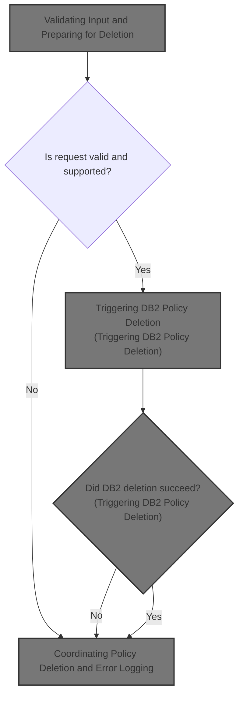
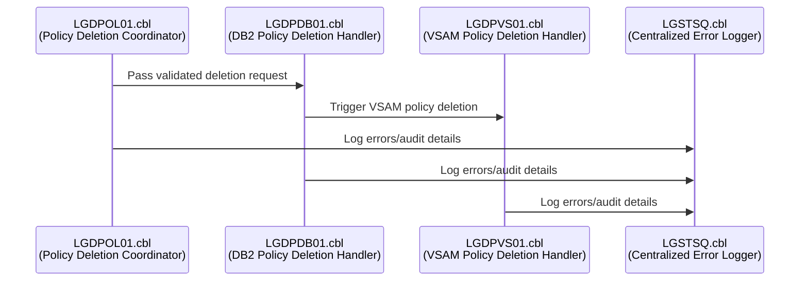
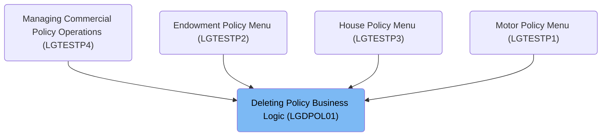

# Overview

This document explains the flow for deleting insurance policies. The process validates requests, coordinates deletion from DB2 and VSAM databases, and logs errors with full transaction context for audit and monitoring.

# Technical Overview

## Dependencies

### Programs

- LGDPDB01 (<SwmPath>[base/src/lgdpdb01.cbl](base/src/lgdpdb01.cbl)</SwmPath>)
- LGDPVS01 (<SwmPath>[base/src/lgdpvs01.cbl](base/src/lgdpvs01.cbl)</SwmPath>)
- LGSTSQ (<SwmPath>[base/src/lgstsq.cbl](base/src/lgstsq.cbl)</SwmPath>)

### Copybooks

- LGCMAREA (<SwmPath>[base/src/lgcmarea.cpy](base/src/lgcmarea.cpy)</SwmPath>)
- SQLCA

# Where is this program used?

This program is used multiple times in the codebase as represented in the following diagram:

&nbsp;

*This is an auto-generated document by Swimm 🌊 and has not yet been verified by a human*

<SwmMeta version="3.0.0" repo-id="Z2l0aHViJTNBJTNBU3dpbW1pby1nZW5hcHAtbW90b3IlM0ElM0FHaXJpLVN3aW1t" repo-name="Swimmio-genapp-motor">Powered by [Swimm](https://app.swimm.io/)</SwmMeta>
