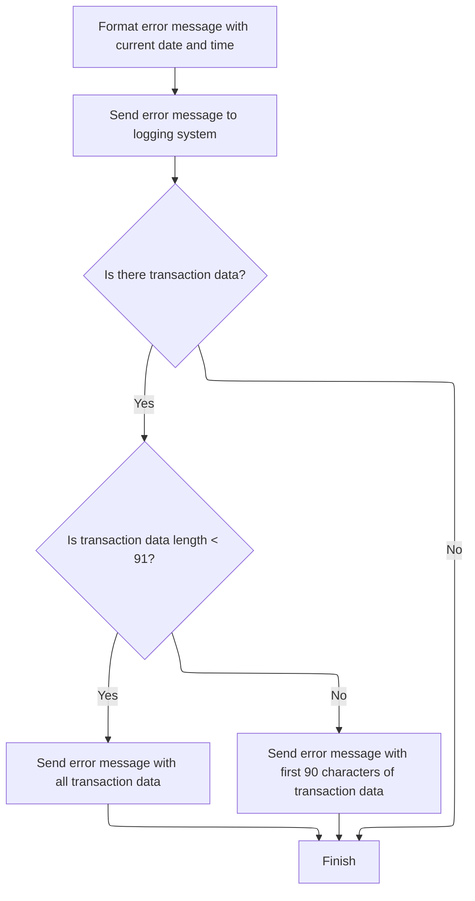
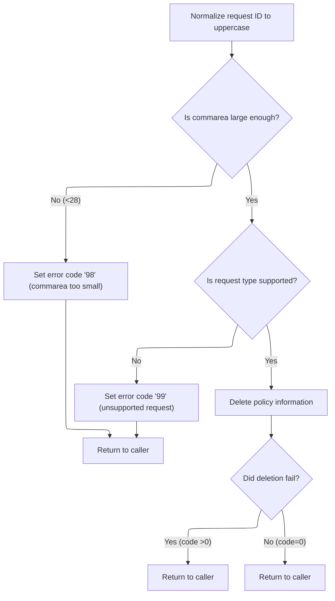
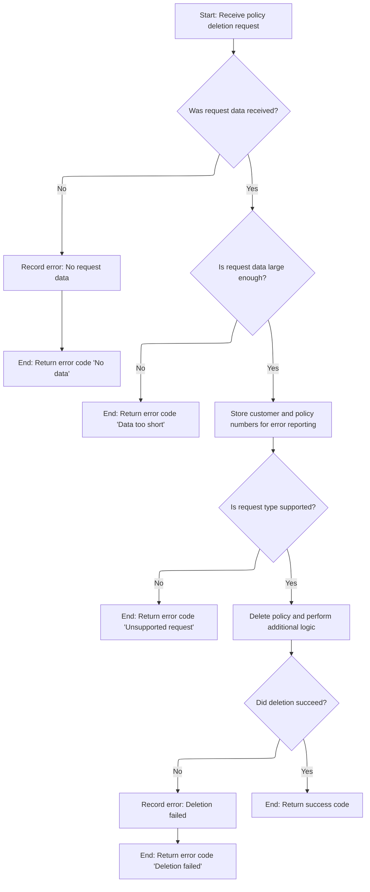

# Overview

This document explains the flow for deleting a policy record. The process validates requests, ensures data integrity, coordinates deletion across modules, and logs all actions and errors with relevant context.

## Dependencies

### Programs

- <SwmToken path="base/src/lgdpol01.cbl" pos="11:6:6" line-data="       PROGRAM-ID. LGDPOL01.">`LGDPOL01`</SwmToken> (<SwmPath>[base/src/lgdpol01.cbl](base/src/lgdpol01.cbl)</SwmPath>)
- <SwmToken path="base/src/lgdpol01.cbl" pos="141:9:9" line-data="           EXEC CICS LINK PROGRAM(LGDPDB01)">`LGDPDB01`</SwmToken> (<SwmPath>[base/src/lgdpdb01.cbl](base/src/lgdpdb01.cbl)</SwmPath>)
- <SwmToken path="base/src/lgdpdb01.cbl" pos="168:9:9" line-data="               EXEC CICS LINK PROGRAM(LGDPVS01)">`LGDPVS01`</SwmToken> (<SwmPath>[base/src/lgdpvs01.cbl](base/src/lgdpvs01.cbl)</SwmPath>)
- LGSTSQ (<SwmPath>[base/src/lgstsq.cbl](base/src/lgstsq.cbl)</SwmPath>)

### Copybooks

- LGCMAREA (<SwmPath>[base/src/lgcmarea.cpy](base/src/lgcmarea.cpy)</SwmPath>)
- SQLCA

# Where is this program used?

This program is used multiple times in the codebase as represented in the following diagram:

```mermaid
graph TD
  blsks("Motor Policy Menu (LGTESTP1)") --> 3pb83("Deleting Policy Business Logic (LGDPOL01)"):::currentEntity
click blsks openCode "base/src/lgtestp1.cbl:1"
r2mpn("House Policy Menu (LGTESTP3)") --> 3pb83("Deleting Policy Business Logic (LGDPOL01)"):::currentEntity
click r2mpn openCode "base/src/lgtestp3.cbl:1"
jncny("Endowment Policy Menu (LGTESTP2)") --> 3pb83("Deleting Policy Business Logic (LGDPOL01)"):::currentEntity
click jncny openCode "base/src/lgtestp2.cbl:1"
b7ujd("Managing Commercial Policies (LGTESTP4)") --> 3pb83("Deleting Policy Business Logic (LGDPOL01)"):::currentEntity
click b7ujd openCode "base/src/lgtestp4.cbl:1"
  
  
click 3pb83 openCode "base/src/lgdpol01.cbl:1"
    classDef currentEntity color:#000000,fill:#7CB9F4

%% Swimm:
%% graph TD
%%   blsks("Motor Policy Menu (LGTESTP1)") --> 3pb83("Deleting Policy Business Logic (<SwmToken path="base/src/lgdpol01.cbl" pos="11:6:6" line-data="       PROGRAM-ID. LGDPOL01.">`LGDPOL01`</SwmToken>)"):::currentEntity
%% click blsks openCode "<SwmPath>[base/src/lgtestp1.cbl](base/src/lgtestp1.cbl)</SwmPath>:1"
%% r2mpn("House Policy Menu (LGTESTP3)") --> 3pb83("Deleting Policy Business Logic (<SwmToken path="base/src/lgdpol01.cbl" pos="11:6:6" line-data="       PROGRAM-ID. LGDPOL01.">`LGDPOL01`</SwmToken>)"):::currentEntity
%% click r2mpn openCode "<SwmPath>[base/src/lgtestp3.cbl](base/src/lgtestp3.cbl)</SwmPath>:1"
%% jncny("Endowment Policy Menu (LGTESTP2)") --> 3pb83("Deleting Policy Business Logic (<SwmToken path="base/src/lgdpol01.cbl" pos="11:6:6" line-data="       PROGRAM-ID. LGDPOL01.">`LGDPOL01`</SwmToken>)"):::currentEntity
%% click jncny openCode "<SwmPath>[base/src/lgtestp2.cbl](base/src/lgtestp2.cbl)</SwmPath>:1"
%% b7ujd("Managing Commercial Policies (LGTESTP4)") --> 3pb83("Deleting Policy Business Logic (<SwmToken path="base/src/lgdpol01.cbl" pos="11:6:6" line-data="       PROGRAM-ID. LGDPOL01.">`LGDPOL01`</SwmToken>)"):::currentEntity
%% click b7ujd openCode "<SwmPath>[base/src/lgtestp4.cbl](base/src/lgtestp4.cbl)</SwmPath>:1"
%%   
%%   
%% click 3pb83 openCode "<SwmPath>[base/src/lgdpol01.cbl](base/src/lgdpol01.cbl)</SwmPath>:1"
%%     classDef currentEntity color:#000000,fill:#7CB9F4
```



## Detailed View of the Program's Functionality

# Starting the transaction and context setup

When a request to delete a policy arrives, the main program first prepares its environment. It initializes a set of variables that will be used to track the transaction, including identifiers for the transaction, terminal, and task. This setup ensures that any subsequent operations, especially error handling and logging, have the necessary context about where and how the request originated.

The program then checks if any request data was actually received. If the request data area is missing, it logs an error message describing the issue and immediately halts the transaction, signaling an abnormal end to the process.

If request data is present, the program resets the return code to indicate no error and stores the length of the incoming data. It also saves a pointer to the request data for later use.

Next, the program verifies that the request data is large enough to contain the required header information. If the data is too short, it sets a specific error code and returns control to the caller, effectively stopping further processing.

# Logging error details and context

Whenever an error is detected—such as missing or insufficient request data—the program formats a detailed error message. It retrieves the current date and time from the system and includes these in the error log, along with other relevant context such as program name and transaction details.

The error message is then sent to a centralized logging system for tracking. If there is any request data available, up to 90 bytes of it are also included in the log. If the request data is shorter than 91 bytes, the entire data is logged; otherwise, only the first 90 bytes are sent. This ensures that enough context is available for debugging without overwhelming the log system.

# Validating input and preparing for policy deletion

After confirming that the request data is present and of sufficient length, the program normalizes the request type identifier to uppercase to ensure consistent processing.

It then checks if the request type is one of the supported types (such as endowment, motor, house, or commercial policy deletion). If the request type is not recognized, an error code is set and the program returns to the caller.

If the request type is valid, the program proceeds to delete the policy information. After attempting the deletion, it checks if the operation was successful. If the deletion failed (indicated by a non-zero return code), the program returns to the caller with the error code. If the deletion succeeded, it simply returns to the caller, signaling successful completion.

# Deleting the policy record in the database

The actual deletion of the policy record is handled by a dedicated module. The main program calls this module and passes along the request data. This module is responsible for interacting with the database to remove the policy record and for handling any errors that may occur during this process.

# Coordinating deletion and error handling across modules

Within the database deletion module, the process begins by validating the incoming request data. If no data is received, an error is logged and the transaction is halted. If the data is present but too short, an error code is set and the process returns to the caller.

If the data is valid, the module converts the customer and policy numbers from the request data into the format required by the database. These values are also stored in the error message structure in case logging is needed later.

The module then checks if the request type is supported. If not, an error code is set and the process returns to the caller. If the request type is valid, the module attempts to delete the policy record from the database.

After the deletion attempt, the module checks the result. If the deletion was successful or if the record was not found (both are considered acceptable outcomes), the process continues. If the deletion failed for any other reason, an error code is set, a detailed error message is logged (including the SQL error code), and the process returns to the caller.

If the database deletion was successful, the module then calls another module to delete the corresponding record from a secondary file (VSAM). This ensures that all traces of the policy are removed from both the database and the file system.

# Deleting the policy record in the VSAM file

The module responsible for file deletion constructs a key using parts of the request type and the customer and policy numbers. It then attempts to delete the record from the file using this key.

If the file deletion fails, the module logs a detailed error message, including the response codes from the file system, and sets a specific error code before returning control to the caller. If the deletion succeeds, the process completes normally.

# Error logging in all modules

Across all modules, error logging follows a consistent pattern. When an error occurs, the current date and time are retrieved and formatted. The error message includes relevant context such as program name, customer and policy numbers, request type, and any system or database error codes.

The error message is sent to a centralized logging system, and up to 90 bytes of request data are included for additional context. This approach ensures that errors are tracked in detail and can be investigated efficiently.

# Rule Definition

| Paragraph Name                                                                                                                                                                                                                                                                                                                                                                                                                                                                                                                                                                                                                                    | Rule ID | Category          | Description                                                                                                                                                                                                                                                                                                                                                                                                                                                                                                                                                                                                                                                                                                                                                                                                                                                                                                                                                                                                                 | Conditions                                                                                                                                                                                          | Remarks                                                                                                                                                                                                                                                                                                                                                                                                                                                                                                                                                                                                                                                                                                                                                                                                               |
| ------------------------------------------------------------------------------------------------------------------------------------------------------------------------------------------------------------------------------------------------------------------------------------------------------------------------------------------------------------------------------------------------------------------------------------------------------------------------------------------------------------------------------------------------------------------------------------------------------------------------------------------------- | ------- | ----------------- | --------------------------------------------------------------------------------------------------------------------------------------------------------------------------------------------------------------------------------------------------------------------------------------------------------------------------------------------------------------------------------------------------------------------------------------------------------------------------------------------------------------------------------------------------------------------------------------------------------------------------------------------------------------------------------------------------------------------------------------------------------------------------------------------------------------------------------------------------------------------------------------------------------------------------------------------------------------------------------------------------------------------------- | --------------------------------------------------------------------------------------------------------------------------------------------------------------------------------------------------- | --------------------------------------------------------------------------------------------------------------------------------------------------------------------------------------------------------------------------------------------------------------------------------------------------------------------------------------------------------------------------------------------------------------------------------------------------------------------------------------------------------------------------------------------------------------------------------------------------------------------------------------------------------------------------------------------------------------------------------------------------------------------------------------------------------------------- |
| MAINLINE SECTION (<SwmPath>[base/src/lgdpol01.cbl](base/src/lgdpol01.cbl)</SwmPath>), MAINLINE SECTION (<SwmPath>[base/src/lgdpdb01.cbl](base/src/lgdpdb01.cbl)</SwmPath>)                                                                                                                                                                                                                                                                                                                                                                                                                                                                        | RL-001  | Conditional Logic | The system must check if the incoming commarea is present and at least 28 bytes in length. If not, it sets <SwmToken path="base/src/lgdpol01.cbl" pos="102:9:13" line-data="           MOVE &#39;00&#39; TO CA-RETURN-CODE">`CA-RETURN-CODE`</SwmToken> to '98', logs an error, and returns immediately.                                                                                                                                                                                                                                                                                                                                                                                                                                                                                                                                                                                                                                                                                                                    | EIBCALEN is zero or less than 28                                                                                                                                                                    | Minimum length constant is 28. <SwmToken path="base/src/lgdpol01.cbl" pos="102:9:13" line-data="           MOVE &#39;00&#39; TO CA-RETURN-CODE">`CA-RETURN-CODE`</SwmToken> is a 2-character string. Error message includes date (MMDDYYYY), time (HHMMSS), program name, error details, and up to 90 bytes of commarea data.                                                                                                                                                                                                                                                                                                                                                                                                                                                                                         |
| MAINLINE SECTION (<SwmPath>[base/src/lgdpol01.cbl](base/src/lgdpol01.cbl)</SwmPath>)                                                                                                                                                                                                                                                                                                                                                                                                                                                                                                                                                              | RL-002  | Data Assignment   | The system must convert the <SwmToken path="base/src/lgdpol01.cbl" pos="117:9:13" line-data="           MOVE FUNCTION UPPER-CASE(CA-REQUEST-ID) TO CA-REQUEST-ID">`CA-REQUEST-ID`</SwmToken> field to uppercase before further processing.                                                                                                                                                                                                                                                                                                                                                                                                                                                                                                                                                                                                                                                                                                                                                                                  | <SwmToken path="base/src/lgdpol01.cbl" pos="117:9:13" line-data="           MOVE FUNCTION UPPER-CASE(CA-REQUEST-ID) TO CA-REQUEST-ID">`CA-REQUEST-ID`</SwmToken> is present                         | <SwmToken path="base/src/lgdpol01.cbl" pos="117:9:13" line-data="           MOVE FUNCTION UPPER-CASE(CA-REQUEST-ID) TO CA-REQUEST-ID">`CA-REQUEST-ID`</SwmToken> is a string field. Normalization uses an uppercase conversion function.                                                                                                                                                                                                                                                                                                                                                                                                                                                                                                                                                                              |
| MAINLINE SECTION (<SwmPath>[base/src/lgdpol01.cbl](base/src/lgdpol01.cbl)</SwmPath>), MAINLINE SECTION (<SwmPath>[base/src/lgdpdb01.cbl](base/src/lgdpdb01.cbl)</SwmPath>)                                                                                                                                                                                                                                                                                                                                                                                                                                                                        | RL-003  | Conditional Logic | The system must check if <SwmToken path="base/src/lgdpol01.cbl" pos="117:9:13" line-data="           MOVE FUNCTION UPPER-CASE(CA-REQUEST-ID) TO CA-REQUEST-ID">`CA-REQUEST-ID`</SwmToken> is one of: <SwmToken path="base/src/lgdpol01.cbl" pos="119:18:18" line-data="           IF ( CA-REQUEST-ID NOT EQUAL TO &#39;01DEND&#39; AND">`01DEND`</SwmToken>, <SwmToken path="base/src/lgdpol01.cbl" pos="120:14:14" line-data="                CA-REQUEST-ID NOT EQUAL TO &#39;01DMOT&#39; AND">`01DMOT`</SwmToken>, <SwmToken path="base/src/lgdpol01.cbl" pos="121:14:14" line-data="                CA-REQUEST-ID NOT EQUAL TO &#39;01DHOU&#39; AND">`01DHOU`</SwmToken>, <SwmToken path="base/src/lgdpol01.cbl" pos="122:14:14" line-data="                CA-REQUEST-ID NOT EQUAL TO &#39;01DCOM&#39; )">`01DCOM`</SwmToken>. If not, set <SwmToken path="base/src/lgdpol01.cbl" pos="102:9:13" line-data="           MOVE &#39;00&#39; TO CA-RETURN-CODE">`CA-RETURN-CODE`</SwmToken> to '99', log error, and return. | <SwmToken path="base/src/lgdpol01.cbl" pos="117:9:13" line-data="           MOVE FUNCTION UPPER-CASE(CA-REQUEST-ID) TO CA-REQUEST-ID">`CA-REQUEST-ID`</SwmToken> is not one of the supported values | Supported values: <SwmToken path="base/src/lgdpol01.cbl" pos="119:18:18" line-data="           IF ( CA-REQUEST-ID NOT EQUAL TO &#39;01DEND&#39; AND">`01DEND`</SwmToken>, <SwmToken path="base/src/lgdpol01.cbl" pos="120:14:14" line-data="                CA-REQUEST-ID NOT EQUAL TO &#39;01DMOT&#39; AND">`01DMOT`</SwmToken>, <SwmToken path="base/src/lgdpol01.cbl" pos="121:14:14" line-data="                CA-REQUEST-ID NOT EQUAL TO &#39;01DHOU&#39; AND">`01DHOU`</SwmToken>, <SwmToken path="base/src/lgdpol01.cbl" pos="122:14:14" line-data="                CA-REQUEST-ID NOT EQUAL TO &#39;01DCOM&#39; )">`01DCOM`</SwmToken>. <SwmToken path="base/src/lgdpol01.cbl" pos="102:9:13" line-data="           MOVE &#39;00&#39; TO CA-RETURN-CODE">`CA-RETURN-CODE`</SwmToken> is a 2-character string. |
| <SwmToken path="base/src/lgdpol01.cbl" pos="126:3:9" line-data="               PERFORM DELETE-POLICY-DB2-INFO">`DELETE-POLICY-DB2-INFO`</SwmToken> (<SwmPath>[base/src/lgdpdb01.cbl](base/src/lgdpdb01.cbl)</SwmPath>)                                                                                                                                                                                                                                                                                                                                                                                                                            | RL-004  | Computation       | The system attempts to delete the policy record from <SwmToken path="base/src/lgdpol01.cbl" pos="126:7:7" line-data="               PERFORM DELETE-POLICY-DB2-INFO">`DB2`</SwmToken> using integer values of <SwmToken path="base/src/lgdpdb01.cbl" pos="149:3:7" line-data="           MOVE CA-CUSTOMER-NUM TO DB2-CUSTOMERNUM-INT">`CA-CUSTOMER-NUM`</SwmToken> and <SwmToken path="base/src/lgdpdb01.cbl" pos="150:3:7" line-data="           MOVE CA-POLICY-NUM   TO DB2-POLICYNUM-INT">`CA-POLICY-NUM`</SwmToken>. Logs operation as ' DELETE POLICY  '.                                                                                                                                                                                                                                                                                                                                                                                                                                                               | <SwmToken path="base/src/lgdpol01.cbl" pos="117:9:13" line-data="           MOVE FUNCTION UPPER-CASE(CA-REQUEST-ID) TO CA-REQUEST-ID">`CA-REQUEST-ID`</SwmToken> is valid and commarea is valid     | Operation description for logging: ' DELETE POLICY  '. Customer and policy numbers are converted to integers for <SwmToken path="base/src/lgdpol01.cbl" pos="126:7:7" line-data="               PERFORM DELETE-POLICY-DB2-INFO">`DB2`</SwmToken>.                                                                                                                                                                                                                                                                                                                                                                                                                                                                                                                                                                     |
| <SwmToken path="base/src/lgdpol01.cbl" pos="126:3:9" line-data="               PERFORM DELETE-POLICY-DB2-INFO">`DELETE-POLICY-DB2-INFO`</SwmToken> (<SwmPath>[base/src/lgdpdb01.cbl](base/src/lgdpdb01.cbl)</SwmPath>)                                                                                                                                                                                                                                                                                                                                                                                                                            | RL-005  | Conditional Logic | If <SwmToken path="base/src/lgdpol01.cbl" pos="126:7:7" line-data="               PERFORM DELETE-POLICY-DB2-INFO">`DB2`</SwmToken> deletion returns SQLCODE other than 0 or 100, set <SwmToken path="base/src/lgdpol01.cbl" pos="102:9:13" line-data="           MOVE &#39;00&#39; TO CA-RETURN-CODE">`CA-RETURN-CODE`</SwmToken> to '90', log error with SQLCODE, customer and policy numbers, and return.                                                                                                                                                                                                                                                                                                                                                                                                                                                                                                                                                                                                                 | SQLCODE is not 0 or 100 after <SwmToken path="base/src/lgdpol01.cbl" pos="126:7:7" line-data="               PERFORM DELETE-POLICY-DB2-INFO">`DB2`</SwmToken> deletion                              | SQLCODE is a numeric field. <SwmToken path="base/src/lgdpol01.cbl" pos="102:9:13" line-data="           MOVE &#39;00&#39; TO CA-RETURN-CODE">`CA-RETURN-CODE`</SwmToken> is a 2-character string. Error message includes SQLCODE, customer and policy numbers.                                                                                                                                                                                                                                                                                                                                                                                                                                                                                                                                                        |
| MAINLINE SECTION (<SwmPath>[base/src/lgdpdb01.cbl](base/src/lgdpdb01.cbl)</SwmPath>), MAINLINE SECTION (<SwmPath>[base/src/lgdpvs01.cbl](base/src/lgdpvs01.cbl)</SwmPath>)                                                                                                                                                                                                                                                                                                                                                                                                                                                                        | RL-006  | Computation       | If <SwmToken path="base/src/lgdpol01.cbl" pos="126:7:7" line-data="               PERFORM DELETE-POLICY-DB2-INFO">`DB2`</SwmToken> deletion is successful or returns SQLCODE 100, attempt to delete the corresponding VSAM record. VSAM key is constructed from 1 byte (4th char of <SwmToken path="base/src/lgdpol01.cbl" pos="117:9:13" line-data="           MOVE FUNCTION UPPER-CASE(CA-REQUEST-ID) TO CA-REQUEST-ID">`CA-REQUEST-ID`</SwmToken>), 10 bytes <SwmToken path="base/src/lgdpdb01.cbl" pos="149:3:7" line-data="           MOVE CA-CUSTOMER-NUM TO DB2-CUSTOMERNUM-INT">`CA-CUSTOMER-NUM`</SwmToken>, 10 bytes <SwmToken path="base/src/lgdpdb01.cbl" pos="150:3:7" line-data="           MOVE CA-POLICY-NUM   TO DB2-POLICYNUM-INT">`CA-POLICY-NUM`</SwmToken> (total 21 bytes).                                                                                                                                                                                                                           | <SwmToken path="base/src/lgdpol01.cbl" pos="126:7:7" line-data="               PERFORM DELETE-POLICY-DB2-INFO">`DB2`</SwmToken> deletion SQLCODE is 0 or 100                                        | VSAM key: 1 byte (4th char of <SwmToken path="base/src/lgdpol01.cbl" pos="117:9:13" line-data="           MOVE FUNCTION UPPER-CASE(CA-REQUEST-ID) TO CA-REQUEST-ID">`CA-REQUEST-ID`</SwmToken>), 10 bytes <SwmToken path="base/src/lgdpdb01.cbl" pos="149:3:7" line-data="           MOVE CA-CUSTOMER-NUM TO DB2-CUSTOMERNUM-INT">`CA-CUSTOMER-NUM`</SwmToken>, 10 bytes <SwmToken path="base/src/lgdpdb01.cbl" pos="150:3:7" line-data="           MOVE CA-POLICY-NUM   TO DB2-POLICYNUM-INT">`CA-POLICY-NUM`</SwmToken>. Total key length: 21 bytes.                                                                                                                                                                                                                                                                |
| MAINLINE SECTION (<SwmPath>[base/src/lgdpvs01.cbl](base/src/lgdpvs01.cbl)</SwmPath>)                                                                                                                                                                                                                                                                                                                                                                                                                                                                                                                                                              | RL-007  | Conditional Logic | If VSAM deletion fails, set <SwmToken path="base/src/lgdpol01.cbl" pos="102:9:13" line-data="           MOVE &#39;00&#39; TO CA-RETURN-CODE">`CA-RETURN-CODE`</SwmToken> to '81', log error with details, and return.                                                                                                                                                                                                                                                                                                                                                                                                                                                                                                                                                                                                                                                                                                                                                                                                       | VSAM deletion response is not NORMAL                                                                                                                                                                | <SwmToken path="base/src/lgdpol01.cbl" pos="102:9:13" line-data="           MOVE &#39;00&#39; TO CA-RETURN-CODE">`CA-RETURN-CODE`</SwmToken> is a 2-character string. Error message includes VSAM response codes and relevant details.                                                                                                                                                                                                                                                                                                                                                                                                                                                                                                                                                                                |
| MAINLINE SECTION (<SwmPath>[base/src/lgdpol01.cbl](base/src/lgdpol01.cbl)</SwmPath>), MAINLINE SECTION (<SwmPath>[base/src/lgdpdb01.cbl](base/src/lgdpdb01.cbl)</SwmPath>), MAINLINE SECTION (<SwmPath>[base/src/lgdpvs01.cbl](base/src/lgdpvs01.cbl)</SwmPath>)                                                                                                                                                                                                                                                                                                                                                                                  | RL-008  | Data Assignment   | If both <SwmToken path="base/src/lgdpol01.cbl" pos="126:7:7" line-data="               PERFORM DELETE-POLICY-DB2-INFO">`DB2`</SwmToken> and VSAM deletions succeed, set <SwmToken path="base/src/lgdpol01.cbl" pos="102:9:13" line-data="           MOVE &#39;00&#39; TO CA-RETURN-CODE">`CA-RETURN-CODE`</SwmToken> to '00'.                                                                                                                                                                                                                                                                                                                                                                                                                                                                                                                                                                                                                                                                                               | <SwmToken path="base/src/lgdpol01.cbl" pos="126:7:7" line-data="               PERFORM DELETE-POLICY-DB2-INFO">`DB2`</SwmToken> deletion SQLCODE is 0 or 100 and VSAM deletion response is NORMAL   | <SwmToken path="base/src/lgdpol01.cbl" pos="102:9:13" line-data="           MOVE &#39;00&#39; TO CA-RETURN-CODE">`CA-RETURN-CODE`</SwmToken> is a 2-character string. Success code is '00'.                                                                                                                                                                                                                                                                                                                                                                                                                                                                                                                                                                                                                           |
| <SwmToken path="base/src/lgdpol01.cbl" pos="97:3:7" line-data="               PERFORM WRITE-ERROR-MESSAGE">`WRITE-ERROR-MESSAGE`</SwmToken> (<SwmPath>[base/src/lgdpol01.cbl](base/src/lgdpol01.cbl)</SwmPath>), <SwmToken path="base/src/lgdpol01.cbl" pos="97:3:7" line-data="               PERFORM WRITE-ERROR-MESSAGE">`WRITE-ERROR-MESSAGE`</SwmToken> (<SwmPath>[base/src/lgdpdb01.cbl](base/src/lgdpdb01.cbl)</SwmPath>), <SwmToken path="base/src/lgdpol01.cbl" pos="97:3:7" line-data="               PERFORM WRITE-ERROR-MESSAGE">`WRITE-ERROR-MESSAGE`</SwmToken> (<SwmPath>[base/src/lgdpvs01.cbl](base/src/lgdpvs01.cbl)</SwmPath>) | RL-009  | Computation       | All error messages must include current date (MMDDYYYY), time (HHMMSS), program name, variable field with error details, and up to first 90 bytes of commarea data.                                                                                                                                                                                                                                                                                                                                                                                                                                                                                                                                                                                                                                                                                                                                                                                                                                                         | Any error condition occurs                                                                                                                                                                          | Error message format: date (8 bytes), time (6 bytes), program name (9 bytes), variable field (varies), up to 90 bytes of commarea data.                                                                                                                                                                                                                                                                                                                                                                                                                                                                                                                                                                                                                                                                               |
| MAINLINE SECTION (<SwmPath>[base/src/lgdpol01.cbl](base/src/lgdpol01.cbl)</SwmPath>), MAINLINE SECTION (<SwmPath>[base/src/lgdpdb01.cbl](base/src/lgdpdb01.cbl)</SwmPath>), MAINLINE SECTION (<SwmPath>[base/src/lgdpvs01.cbl](base/src/lgdpvs01.cbl)</SwmPath>)                                                                                                                                                                                                                                                                                                                                                                                  | RL-010  | Data Assignment   | The system must always return the commarea to the caller with <SwmToken path="base/src/lgdpol01.cbl" pos="102:9:13" line-data="           MOVE &#39;00&#39; TO CA-RETURN-CODE">`CA-RETURN-CODE`</SwmToken> set to the appropriate value.                                                                                                                                                                                                                                                                                                                                                                                                                                                                                                                                                                                                                                                                                                                                                                                    | End of processing                                                                                                                                                                                   | <SwmToken path="base/src/lgdpol01.cbl" pos="102:9:13" line-data="           MOVE &#39;00&#39; TO CA-RETURN-CODE">`CA-RETURN-CODE`</SwmToken> is a 2-character string. Commarea is returned as received, with updated <SwmToken path="base/src/lgdpol01.cbl" pos="102:9:13" line-data="           MOVE &#39;00&#39; TO CA-RETURN-CODE">`CA-RETURN-CODE`</SwmToken>.                                                                                                                                                                                                                                                                                                                                                                                                                                                    |

# User Stories

## User Story 1: Validate and normalize incoming policy deletion requests

---

### Story Description:

As a system, I want to validate and normalize incoming policy deletion requests so that only properly formatted and supported requests are processed, and errors are logged and returned immediately if validation fails.

---

### Business Rule Mapping:

| Rule ID | Paragraph Name                                                                                                                                                                                                                                                                                                                                                                                                                                                                                                                                                                                                                                    | Rule Description                                                                                                                                                                                                                                                                                                                                                                                                                                                                                                                                                                                                                                                                                                                                                                                                                                                                                                                                                                                                            |
| ------- | ------------------------------------------------------------------------------------------------------------------------------------------------------------------------------------------------------------------------------------------------------------------------------------------------------------------------------------------------------------------------------------------------------------------------------------------------------------------------------------------------------------------------------------------------------------------------------------------------------------------------------------------------- | --------------------------------------------------------------------------------------------------------------------------------------------------------------------------------------------------------------------------------------------------------------------------------------------------------------------------------------------------------------------------------------------------------------------------------------------------------------------------------------------------------------------------------------------------------------------------------------------------------------------------------------------------------------------------------------------------------------------------------------------------------------------------------------------------------------------------------------------------------------------------------------------------------------------------------------------------------------------------------------------------------------------------- |
| RL-001  | MAINLINE SECTION (<SwmPath>[base/src/lgdpol01.cbl](base/src/lgdpol01.cbl)</SwmPath>), MAINLINE SECTION (<SwmPath>[base/src/lgdpdb01.cbl](base/src/lgdpdb01.cbl)</SwmPath>)                                                                                                                                                                                                                                                                                                                                                                                                                                                                        | The system must check if the incoming commarea is present and at least 28 bytes in length. If not, it sets <SwmToken path="base/src/lgdpol01.cbl" pos="102:9:13" line-data="           MOVE &#39;00&#39; TO CA-RETURN-CODE">`CA-RETURN-CODE`</SwmToken> to '98', logs an error, and returns immediately.                                                                                                                                                                                                                                                                                                                                                                                                                                                                                                                                                                                                                                                                                                                    |
| RL-002  | MAINLINE SECTION (<SwmPath>[base/src/lgdpol01.cbl](base/src/lgdpol01.cbl)</SwmPath>)                                                                                                                                                                                                                                                                                                                                                                                                                                                                                                                                                              | The system must convert the <SwmToken path="base/src/lgdpol01.cbl" pos="117:9:13" line-data="           MOVE FUNCTION UPPER-CASE(CA-REQUEST-ID) TO CA-REQUEST-ID">`CA-REQUEST-ID`</SwmToken> field to uppercase before further processing.                                                                                                                                                                                                                                                                                                                                                                                                                                                                                                                                                                                                                                                                                                                                                                                  |
| RL-003  | MAINLINE SECTION (<SwmPath>[base/src/lgdpol01.cbl](base/src/lgdpol01.cbl)</SwmPath>), MAINLINE SECTION (<SwmPath>[base/src/lgdpdb01.cbl](base/src/lgdpdb01.cbl)</SwmPath>)                                                                                                                                                                                                                                                                                                                                                                                                                                                                        | The system must check if <SwmToken path="base/src/lgdpol01.cbl" pos="117:9:13" line-data="           MOVE FUNCTION UPPER-CASE(CA-REQUEST-ID) TO CA-REQUEST-ID">`CA-REQUEST-ID`</SwmToken> is one of: <SwmToken path="base/src/lgdpol01.cbl" pos="119:18:18" line-data="           IF ( CA-REQUEST-ID NOT EQUAL TO &#39;01DEND&#39; AND">`01DEND`</SwmToken>, <SwmToken path="base/src/lgdpol01.cbl" pos="120:14:14" line-data="                CA-REQUEST-ID NOT EQUAL TO &#39;01DMOT&#39; AND">`01DMOT`</SwmToken>, <SwmToken path="base/src/lgdpol01.cbl" pos="121:14:14" line-data="                CA-REQUEST-ID NOT EQUAL TO &#39;01DHOU&#39; AND">`01DHOU`</SwmToken>, <SwmToken path="base/src/lgdpol01.cbl" pos="122:14:14" line-data="                CA-REQUEST-ID NOT EQUAL TO &#39;01DCOM&#39; )">`01DCOM`</SwmToken>. If not, set <SwmToken path="base/src/lgdpol01.cbl" pos="102:9:13" line-data="           MOVE &#39;00&#39; TO CA-RETURN-CODE">`CA-RETURN-CODE`</SwmToken> to '99', log error, and return. |
| RL-010  | MAINLINE SECTION (<SwmPath>[base/src/lgdpol01.cbl](base/src/lgdpol01.cbl)</SwmPath>), MAINLINE SECTION (<SwmPath>[base/src/lgdpdb01.cbl](base/src/lgdpdb01.cbl)</SwmPath>), MAINLINE SECTION (<SwmPath>[base/src/lgdpvs01.cbl](base/src/lgdpvs01.cbl)</SwmPath>)                                                                                                                                                                                                                                                                                                                                                                                  | The system must always return the commarea to the caller with <SwmToken path="base/src/lgdpol01.cbl" pos="102:9:13" line-data="           MOVE &#39;00&#39; TO CA-RETURN-CODE">`CA-RETURN-CODE`</SwmToken> set to the appropriate value.                                                                                                                                                                                                                                                                                                                                                                                                                                                                                                                                                                                                                                                                                                                                                                                    |
| RL-009  | <SwmToken path="base/src/lgdpol01.cbl" pos="97:3:7" line-data="               PERFORM WRITE-ERROR-MESSAGE">`WRITE-ERROR-MESSAGE`</SwmToken> (<SwmPath>[base/src/lgdpol01.cbl](base/src/lgdpol01.cbl)</SwmPath>), <SwmToken path="base/src/lgdpol01.cbl" pos="97:3:7" line-data="               PERFORM WRITE-ERROR-MESSAGE">`WRITE-ERROR-MESSAGE`</SwmToken> (<SwmPath>[base/src/lgdpdb01.cbl](base/src/lgdpdb01.cbl)</SwmPath>), <SwmToken path="base/src/lgdpol01.cbl" pos="97:3:7" line-data="               PERFORM WRITE-ERROR-MESSAGE">`WRITE-ERROR-MESSAGE`</SwmToken> (<SwmPath>[base/src/lgdpvs01.cbl](base/src/lgdpvs01.cbl)</SwmPath>) | All error messages must include current date (MMDDYYYY), time (HHMMSS), program name, variable field with error details, and up to first 90 bytes of commarea data.                                                                                                                                                                                                                                                                                                                                                                                                                                                                                                                                                                                                                                                                                                                                                                                                                                                         |

---

### Relevant Functionality:

- **MAINLINE SECTION (**<SwmPath>[base/src/lgdpol01.cbl](base/src/lgdpol01.cbl)</SwmPath>**)**
  1. **RL-001:**
     - If commarea length is zero:
       - Set error details
       - Log error message
       - ABEND with code 'LGCA'
     - If commarea length < 28:
       - Set <SwmToken path="base/src/lgdpol01.cbl" pos="102:9:13" line-data="           MOVE &#39;00&#39; TO CA-RETURN-CODE">`CA-RETURN-CODE`</SwmToken> to '98'
       - Log error message
       - Return commarea
  2. **RL-002:**
     - Convert <SwmToken path="base/src/lgdpol01.cbl" pos="117:9:13" line-data="           MOVE FUNCTION UPPER-CASE(CA-REQUEST-ID) TO CA-REQUEST-ID">`CA-REQUEST-ID`</SwmToken> to uppercase
     - Store back in <SwmToken path="base/src/lgdpol01.cbl" pos="117:9:13" line-data="           MOVE FUNCTION UPPER-CASE(CA-REQUEST-ID) TO CA-REQUEST-ID">`CA-REQUEST-ID`</SwmToken>
  3. **RL-003:**
     - If <SwmToken path="base/src/lgdpol01.cbl" pos="117:9:13" line-data="           MOVE FUNCTION UPPER-CASE(CA-REQUEST-ID) TO CA-REQUEST-ID">`CA-REQUEST-ID`</SwmToken> not in supported list:
       - Set <SwmToken path="base/src/lgdpol01.cbl" pos="102:9:13" line-data="           MOVE &#39;00&#39; TO CA-RETURN-CODE">`CA-RETURN-CODE`</SwmToken> to '99'
       - Log error message
       - Return commarea
  4. **RL-010:**
     - At end of processing:
       - Set <SwmToken path="base/src/lgdpol01.cbl" pos="102:9:13" line-data="           MOVE &#39;00&#39; TO CA-RETURN-CODE">`CA-RETURN-CODE`</SwmToken> to appropriate value
       - Return commarea to caller
- <SwmToken path="base/src/lgdpol01.cbl" pos="97:3:7" line-data="               PERFORM WRITE-ERROR-MESSAGE">`WRITE-ERROR-MESSAGE`</SwmToken> **(**<SwmPath>[base/src/lgdpol01.cbl](base/src/lgdpol01.cbl)</SwmPath>**)**
  1. **RL-009:**
     - On error:
       - Obtain current date and time
       - Populate error message fields
       - Copy up to 90 bytes of commarea data
       - Log error message

## User Story 2: Delete policy records and handle errors

---

### Story Description:

As a system, I want to delete policy records from <SwmToken path="base/src/lgdpol01.cbl" pos="126:7:7" line-data="               PERFORM DELETE-POLICY-DB2-INFO">`DB2`</SwmToken> and VSAM, handle any errors during the process, and set the appropriate return code so that policy deletions are reliable and error conditions are communicated clearly.

---

### Business Rule Mapping:

| Rule ID | Paragraph Name                                                                                                                                                                                                                                                                                                                                                                                                                                                                                                                                                                                                                                    | Rule Description                                                                                                                                                                                                                                                                                                                                                                                                                                                                                                                                                                                                                                                                                                                                                                                  |
| ------- | ------------------------------------------------------------------------------------------------------------------------------------------------------------------------------------------------------------------------------------------------------------------------------------------------------------------------------------------------------------------------------------------------------------------------------------------------------------------------------------------------------------------------------------------------------------------------------------------------------------------------------------------------- | ------------------------------------------------------------------------------------------------------------------------------------------------------------------------------------------------------------------------------------------------------------------------------------------------------------------------------------------------------------------------------------------------------------------------------------------------------------------------------------------------------------------------------------------------------------------------------------------------------------------------------------------------------------------------------------------------------------------------------------------------------------------------------------------------- |
| RL-004  | <SwmToken path="base/src/lgdpol01.cbl" pos="126:3:9" line-data="               PERFORM DELETE-POLICY-DB2-INFO">`DELETE-POLICY-DB2-INFO`</SwmToken> (<SwmPath>[base/src/lgdpdb01.cbl](base/src/lgdpdb01.cbl)</SwmPath>)                                                                                                                                                                                                                                                                                                                                                                                                                            | The system attempts to delete the policy record from <SwmToken path="base/src/lgdpol01.cbl" pos="126:7:7" line-data="               PERFORM DELETE-POLICY-DB2-INFO">`DB2`</SwmToken> using integer values of <SwmToken path="base/src/lgdpdb01.cbl" pos="149:3:7" line-data="           MOVE CA-CUSTOMER-NUM TO DB2-CUSTOMERNUM-INT">`CA-CUSTOMER-NUM`</SwmToken> and <SwmToken path="base/src/lgdpdb01.cbl" pos="150:3:7" line-data="           MOVE CA-POLICY-NUM   TO DB2-POLICYNUM-INT">`CA-POLICY-NUM`</SwmToken>. Logs operation as ' DELETE POLICY  '.                                                                                                                                                                                                                                     |
| RL-005  | <SwmToken path="base/src/lgdpol01.cbl" pos="126:3:9" line-data="               PERFORM DELETE-POLICY-DB2-INFO">`DELETE-POLICY-DB2-INFO`</SwmToken> (<SwmPath>[base/src/lgdpdb01.cbl](base/src/lgdpdb01.cbl)</SwmPath>)                                                                                                                                                                                                                                                                                                                                                                                                                            | If <SwmToken path="base/src/lgdpol01.cbl" pos="126:7:7" line-data="               PERFORM DELETE-POLICY-DB2-INFO">`DB2`</SwmToken> deletion returns SQLCODE other than 0 or 100, set <SwmToken path="base/src/lgdpol01.cbl" pos="102:9:13" line-data="           MOVE &#39;00&#39; TO CA-RETURN-CODE">`CA-RETURN-CODE`</SwmToken> to '90', log error with SQLCODE, customer and policy numbers, and return.                                                                                                                                                                                                                                                                                                                                                                                       |
| RL-006  | MAINLINE SECTION (<SwmPath>[base/src/lgdpdb01.cbl](base/src/lgdpdb01.cbl)</SwmPath>), MAINLINE SECTION (<SwmPath>[base/src/lgdpvs01.cbl](base/src/lgdpvs01.cbl)</SwmPath>)                                                                                                                                                                                                                                                                                                                                                                                                                                                                        | If <SwmToken path="base/src/lgdpol01.cbl" pos="126:7:7" line-data="               PERFORM DELETE-POLICY-DB2-INFO">`DB2`</SwmToken> deletion is successful or returns SQLCODE 100, attempt to delete the corresponding VSAM record. VSAM key is constructed from 1 byte (4th char of <SwmToken path="base/src/lgdpol01.cbl" pos="117:9:13" line-data="           MOVE FUNCTION UPPER-CASE(CA-REQUEST-ID) TO CA-REQUEST-ID">`CA-REQUEST-ID`</SwmToken>), 10 bytes <SwmToken path="base/src/lgdpdb01.cbl" pos="149:3:7" line-data="           MOVE CA-CUSTOMER-NUM TO DB2-CUSTOMERNUM-INT">`CA-CUSTOMER-NUM`</SwmToken>, 10 bytes <SwmToken path="base/src/lgdpdb01.cbl" pos="150:3:7" line-data="           MOVE CA-POLICY-NUM   TO DB2-POLICYNUM-INT">`CA-POLICY-NUM`</SwmToken> (total 21 bytes). |
| RL-007  | MAINLINE SECTION (<SwmPath>[base/src/lgdpvs01.cbl](base/src/lgdpvs01.cbl)</SwmPath>)                                                                                                                                                                                                                                                                                                                                                                                                                                                                                                                                                              | If VSAM deletion fails, set <SwmToken path="base/src/lgdpol01.cbl" pos="102:9:13" line-data="           MOVE &#39;00&#39; TO CA-RETURN-CODE">`CA-RETURN-CODE`</SwmToken> to '81', log error with details, and return.                                                                                                                                                                                                                                                                                                                                                                                                                                                                                                                                                                             |
| RL-008  | MAINLINE SECTION (<SwmPath>[base/src/lgdpol01.cbl](base/src/lgdpol01.cbl)</SwmPath>), MAINLINE SECTION (<SwmPath>[base/src/lgdpdb01.cbl](base/src/lgdpdb01.cbl)</SwmPath>), MAINLINE SECTION (<SwmPath>[base/src/lgdpvs01.cbl](base/src/lgdpvs01.cbl)</SwmPath>)                                                                                                                                                                                                                                                                                                                                                                                  | If both <SwmToken path="base/src/lgdpol01.cbl" pos="126:7:7" line-data="               PERFORM DELETE-POLICY-DB2-INFO">`DB2`</SwmToken> and VSAM deletions succeed, set <SwmToken path="base/src/lgdpol01.cbl" pos="102:9:13" line-data="           MOVE &#39;00&#39; TO CA-RETURN-CODE">`CA-RETURN-CODE`</SwmToken> to '00'.                                                                                                                                                                                                                                                                                                                                                                                                                                                                     |
| RL-010  | MAINLINE SECTION (<SwmPath>[base/src/lgdpol01.cbl](base/src/lgdpol01.cbl)</SwmPath>), MAINLINE SECTION (<SwmPath>[base/src/lgdpdb01.cbl](base/src/lgdpdb01.cbl)</SwmPath>), MAINLINE SECTION (<SwmPath>[base/src/lgdpvs01.cbl](base/src/lgdpvs01.cbl)</SwmPath>)                                                                                                                                                                                                                                                                                                                                                                                  | The system must always return the commarea to the caller with <SwmToken path="base/src/lgdpol01.cbl" pos="102:9:13" line-data="           MOVE &#39;00&#39; TO CA-RETURN-CODE">`CA-RETURN-CODE`</SwmToken> set to the appropriate value.                                                                                                                                                                                                                                                                                                                                                                                                                                                                                                                                                          |
| RL-009  | <SwmToken path="base/src/lgdpol01.cbl" pos="97:3:7" line-data="               PERFORM WRITE-ERROR-MESSAGE">`WRITE-ERROR-MESSAGE`</SwmToken> (<SwmPath>[base/src/lgdpol01.cbl](base/src/lgdpol01.cbl)</SwmPath>), <SwmToken path="base/src/lgdpol01.cbl" pos="97:3:7" line-data="               PERFORM WRITE-ERROR-MESSAGE">`WRITE-ERROR-MESSAGE`</SwmToken> (<SwmPath>[base/src/lgdpdb01.cbl](base/src/lgdpdb01.cbl)</SwmPath>), <SwmToken path="base/src/lgdpol01.cbl" pos="97:3:7" line-data="               PERFORM WRITE-ERROR-MESSAGE">`WRITE-ERROR-MESSAGE`</SwmToken> (<SwmPath>[base/src/lgdpvs01.cbl](base/src/lgdpvs01.cbl)</SwmPath>) | All error messages must include current date (MMDDYYYY), time (HHMMSS), program name, variable field with error details, and up to first 90 bytes of commarea data.                                                                                                                                                                                                                                                                                                                                                                                                                                                                                                                                                                                                                               |

---

### Relevant Functionality:

- <SwmToken path="base/src/lgdpol01.cbl" pos="126:3:9" line-data="               PERFORM DELETE-POLICY-DB2-INFO">`DELETE-POLICY-DB2-INFO`</SwmToken> **(**<SwmPath>[base/src/lgdpdb01.cbl](base/src/lgdpdb01.cbl)</SwmPath>**)**
  1. **RL-004:**
     - Convert <SwmToken path="base/src/lgdpdb01.cbl" pos="149:3:7" line-data="           MOVE CA-CUSTOMER-NUM TO DB2-CUSTOMERNUM-INT">`CA-CUSTOMER-NUM`</SwmToken> and <SwmToken path="base/src/lgdpdb01.cbl" pos="150:3:7" line-data="           MOVE CA-POLICY-NUM   TO DB2-POLICYNUM-INT">`CA-POLICY-NUM`</SwmToken> to integers
     - Attempt <SwmToken path="base/src/lgdpol01.cbl" pos="126:7:7" line-data="               PERFORM DELETE-POLICY-DB2-INFO">`DB2`</SwmToken> DELETE operation
     - Log operation description
  2. **RL-005:**
     - If SQLCODE != 0 and != 100:
       - Set <SwmToken path="base/src/lgdpol01.cbl" pos="102:9:13" line-data="           MOVE &#39;00&#39; TO CA-RETURN-CODE">`CA-RETURN-CODE`</SwmToken> to '90'
       - Log error message with SQLCODE, customer and policy numbers
       - Return commarea
- **MAINLINE SECTION (**<SwmPath>[base/src/lgdpdb01.cbl](base/src/lgdpdb01.cbl)</SwmPath>**)**
  1. **RL-006:**
     - If SQLCODE == 0 or 100:
       - Construct VSAM key
       - Attempt VSAM DELETE operation
- **MAINLINE SECTION (**<SwmPath>[base/src/lgdpvs01.cbl](base/src/lgdpvs01.cbl)</SwmPath>**)**
  1. **RL-007:**
     - If VSAM deletion response != NORMAL:
       - Set <SwmToken path="base/src/lgdpol01.cbl" pos="102:9:13" line-data="           MOVE &#39;00&#39; TO CA-RETURN-CODE">`CA-RETURN-CODE`</SwmToken> to '81'
       - Log error message with VSAM response codes
       - Return commarea
- **MAINLINE SECTION (**<SwmPath>[base/src/lgdpol01.cbl](base/src/lgdpol01.cbl)</SwmPath>**)**
  1. **RL-008:**
     - If <SwmToken path="base/src/lgdpol01.cbl" pos="126:7:7" line-data="               PERFORM DELETE-POLICY-DB2-INFO">`DB2`</SwmToken> deletion succeeded (SQLCODE 0 or 100) and VSAM deletion succeeded (NORMAL):
       - Set <SwmToken path="base/src/lgdpol01.cbl" pos="102:9:13" line-data="           MOVE &#39;00&#39; TO CA-RETURN-CODE">`CA-RETURN-CODE`</SwmToken> to '00'
  2. **RL-010:**
     - At end of processing:
       - Set <SwmToken path="base/src/lgdpol01.cbl" pos="102:9:13" line-data="           MOVE &#39;00&#39; TO CA-RETURN-CODE">`CA-RETURN-CODE`</SwmToken> to appropriate value
       - Return commarea to caller
- <SwmToken path="base/src/lgdpol01.cbl" pos="97:3:7" line-data="               PERFORM WRITE-ERROR-MESSAGE">`WRITE-ERROR-MESSAGE`</SwmToken> **(**<SwmPath>[base/src/lgdpol01.cbl](base/src/lgdpol01.cbl)</SwmPath>**)**
  1. **RL-009:**
     - On error:
       - Obtain current date and time
       - Populate error message fields
       - Copy up to 90 bytes of commarea data
       - Log error message

# Workflow

# Starting the transaction and context setup



```mermaid
%%{init: {"flowchart": {"defaultRenderer": "elk"}} }%%
flowchart TD
    node1["Validate incoming request"] --> node2{"Is request data present? (EIBCALEN > 0)"}
    click node1 openCode "base/src/lgdpol01.cbl:78:88"
    node2 -->|"No"| node3["Logging error details and context"]
    click node2 openCode "base/src/lgdpol01.cbl:95:99"
    
    node2 -->|"Yes"| node4{"Is request type supported? (CA-REQUEST-ID in [01DEND,01DMOT,01DHOU,01DCOM])"}
    click node4 openCode "base/src/lgdpol01.cbl:117:130"
    node4 -->|"No"| node3
    node4 -->|"Yes"| node5["Process request and return"]
    click node5 openCode "base/src/lgdpol01.cbl:117:133"

classDef HeadingStyle fill:#777777,stroke:#333,stroke-width:2px;
click node3 goToHeading "Logging error details and context"
node3:::HeadingStyle

%% Swimm:
%% %%{init: {"flowchart": {"defaultRenderer": "elk"}} }%%
%% flowchart TD
%%     node1["Validate incoming request"] --> node2{"Is request data present? (EIBCALEN > 0)"}
%%     click node1 openCode "<SwmPath>[base/src/lgdpol01.cbl](base/src/lgdpol01.cbl)</SwmPath>:78:88"
%%     node2 -->|"No"| node3["Logging error details and context"]
%%     click node2 openCode "<SwmPath>[base/src/lgdpol01.cbl](base/src/lgdpol01.cbl)</SwmPath>:95:99"
%%     
%%     node2 -->|"Yes"| node4{"Is request type supported? (<SwmToken path="base/src/lgdpol01.cbl" pos="117:9:13" line-data="           MOVE FUNCTION UPPER-CASE(CA-REQUEST-ID) TO CA-REQUEST-ID">`CA-REQUEST-ID`</SwmToken> in [<SwmToken path="base/src/lgdpol01.cbl" pos="119:18:18" line-data="           IF ( CA-REQUEST-ID NOT EQUAL TO &#39;01DEND&#39; AND">`01DEND`</SwmToken>,<SwmToken path="base/src/lgdpol01.cbl" pos="120:14:14" line-data="                CA-REQUEST-ID NOT EQUAL TO &#39;01DMOT&#39; AND">`01DMOT`</SwmToken>,<SwmToken path="base/src/lgdpol01.cbl" pos="121:14:14" line-data="                CA-REQUEST-ID NOT EQUAL TO &#39;01DHOU&#39; AND">`01DHOU`</SwmToken>,<SwmToken path="base/src/lgdpol01.cbl" pos="122:14:14" line-data="                CA-REQUEST-ID NOT EQUAL TO &#39;01DCOM&#39; )">`01DCOM`</SwmToken>])"}
%%     click node4 openCode "<SwmPath>[base/src/lgdpol01.cbl](base/src/lgdpol01.cbl)</SwmPath>:117:130"
%%     node4 -->|"No"| node3
%%     node4 -->|"Yes"| node5["Process request and return"]
%%     click node5 openCode "<SwmPath>[base/src/lgdpol01.cbl](base/src/lgdpol01.cbl)</SwmPath>:117:133"
%% 
%% classDef HeadingStyle fill:#777777,stroke:#333,stroke-width:2px;
%% click node3 goToHeading "Logging error details and context"
%% node3:::HeadingStyle
```

This section ensures that every incoming request is validated for presence and type, sets up the transaction context, and logs errors with appropriate details if the request is invalid or unsupported. It is the entry point for all subsequent processing.

| Category        | Rule Name                         | Description                                                                                                                                                                                                                                                                                                                                                                                                                                                                                                                                                                                                                                                                                                                                                                                                                                                                                                                    |
| --------------- | --------------------------------- | ------------------------------------------------------------------------------------------------------------------------------------------------------------------------------------------------------------------------------------------------------------------------------------------------------------------------------------------------------------------------------------------------------------------------------------------------------------------------------------------------------------------------------------------------------------------------------------------------------------------------------------------------------------------------------------------------------------------------------------------------------------------------------------------------------------------------------------------------------------------------------------------------------------------------------ |
| Data validation | Supported request type validation | Only requests with a supported request type (<SwmToken path="base/src/lgdpol01.cbl" pos="117:9:13" line-data="           MOVE FUNCTION UPPER-CASE(CA-REQUEST-ID) TO CA-REQUEST-ID">`CA-REQUEST-ID`</SwmToken> in \[<SwmToken path="base/src/lgdpol01.cbl" pos="119:18:18" line-data="           IF ( CA-REQUEST-ID NOT EQUAL TO &#39;01DEND&#39; AND">`01DEND`</SwmToken>,<SwmToken path="base/src/lgdpol01.cbl" pos="120:14:14" line-data="                CA-REQUEST-ID NOT EQUAL TO &#39;01DMOT&#39; AND">`01DMOT`</SwmToken>,<SwmToken path="base/src/lgdpol01.cbl" pos="121:14:14" line-data="                CA-REQUEST-ID NOT EQUAL TO &#39;01DHOU&#39; AND">`01DHOU`</SwmToken>,<SwmToken path="base/src/lgdpol01.cbl" pos="122:14:14" line-data="                CA-REQUEST-ID NOT EQUAL TO &#39;01DCOM&#39; )">`01DCOM`</SwmToken>\]) are allowed to proceed; unsupported types must be logged as errors and halted. |
| Business logic  | Error log completeness            | All error logs must include the current date, time, and transaction context details to ensure accurate tracking and troubleshooting.                                                                                                                                                                                                                                                                                                                                                                                                                                                                                                                                                                                                                                                                                                                                                                                           |

<SwmSnippet path="/base/src/lgdpol01.cbl" line="78">

---

In <SwmToken path="base/src/lgdpol01.cbl" pos="78:1:1" line-data="       MAINLINE SECTION.">`MAINLINE`</SwmToken>, we kick off the flow by setting up the transaction context—initializing the header and copying the transaction, terminal, and task IDs into working storage. This sets up the environment for everything that follows, including error handling and logging.

```cobol
       MAINLINE SECTION.

      *----------------------------------------------------------------*
      * Common code                                                    *
      *----------------------------------------------------------------*
      * initialize working storage variables
           INITIALIZE WS-HEADER.
      * set up general variable
           MOVE EIBTRNID TO WS-TRANSID.
           MOVE EIBTRMID TO WS-TERMID.
           MOVE EIBTASKN TO WS-TASKNUM.
```

---

</SwmSnippet>

<SwmSnippet path="/base/src/lgdpol01.cbl" line="95">

---

If there's no commarea, we log the error and halt the transaction right away.

```cobol
           IF EIBCALEN IS EQUAL TO ZERO
               MOVE ' NO COMMAREA RECEIVED' TO EM-VARIABLE
               PERFORM WRITE-ERROR-MESSAGE
               EXEC CICS ABEND ABCODE('LGCA') NODUMP END-EXEC
           END-IF
```

---

</SwmSnippet>

## Logging error details and context



This section ensures that all error events are logged with relevant context, including a timestamp and transaction data when available, to support effective monitoring and debugging.

| Category       | Rule Name                   | Description                                                                                                                        |
| -------------- | --------------------------- | ---------------------------------------------------------------------------------------------------------------------------------- |
| Business logic | Timestamp inclusion         | Every error message must include the current date and time to provide a precise timestamp for when the error occurred.             |
| Business logic | Transaction data logging    | If transaction data is present, it must be included in the error log entry to provide additional context for troubleshooting.      |
| Business logic | Transaction data truncation | Only the first 90 characters of transaction data are logged if the data exceeds 90 characters, to ensure message size consistency. |

<SwmSnippet path="/base/src/lgdpol01.cbl" line="154">

---

In <SwmToken path="base/src/lgdpol01.cbl" pos="154:1:5" line-data="       WRITE-ERROR-MESSAGE.">`WRITE-ERROR-MESSAGE`</SwmToken>, we grab the current time and date using CICS commands and prep them for the error message. This sets up the timestamp for the log entry before we send it off to the queue.

```cobol
       WRITE-ERROR-MESSAGE.
      * Save SQLCODE in message
      * Obtain and format current time and date
           EXEC CICS ASKTIME ABSTIME(WS-ABSTIME)
           END-EXEC
           EXEC CICS FORMATTIME ABSTIME(Ws-ABSTIME)
                     MMDDYYYY(WS-DATE)
                     TIME(WS-TIME)
           END-EXEC
```

---

</SwmSnippet>

<SwmSnippet path="/base/src/lgdpol01.cbl" line="163">

---

After prepping the timestamp, we move the date/time into the error message fields and call LGSTSQ to queue the error message. This hands off the error details for central logging.

```cobol
           MOVE WS-DATE TO EM-DATE
           MOVE WS-TIME TO EM-TIME
      * Write output message to TDQ
           EXEC CICS LINK PROGRAM('LGSTSQ')
                     COMMAREA(ERROR-MSG)
                     LENGTH(LENGTH OF ERROR-MSG)
           END-EXEC.
```

---

</SwmSnippet>

<SwmSnippet path="/base/src/lgdpol01.cbl" line="171">

---

We log up to 90 bytes of commarea data if available, then exit.

```cobol
           IF EIBCALEN > 0 THEN
             IF EIBCALEN < 91 THEN
               MOVE DFHCOMMAREA(1:EIBCALEN) TO CA-DATA
               EXEC CICS LINK PROGRAM('LGSTSQ')
                         COMMAREA(CA-ERROR-MSG)
                         LENGTH(LENGTH OF CA-ERROR-MSG)
               END-EXEC
             ELSE
               MOVE DFHCOMMAREA(1:90) TO CA-DATA
               EXEC CICS LINK PROGRAM('LGSTSQ')
                         COMMAREA(CA-ERROR-MSG)
                         LENGTH(LENGTH OF CA-ERROR-MSG)
               END-EXEC
             END-IF
           END-IF.
           EXIT.
```

---

</SwmSnippet>

## Validating input and preparing for policy deletion



<SwmSnippet path="/base/src/lgdpol01.cbl" line="102">

---

Back in MAINLINE, after logging any missing commarea error, we reset the return code and check if the commarea is big enough. If not, we set an error code and bail out early.

```cobol
           MOVE '00' TO CA-RETURN-CODE
           MOVE EIBCALEN TO WS-CALEN.
           SET WS-ADDR-DFHCOMMAREA TO ADDRESS OF DFHCOMMAREA.

      * Check commarea is large enough
           IF EIBCALEN IS LESS THAN WS-CA-HEADER-LEN
             MOVE '98' TO CA-RETURN-CODE
             EXEC CICS RETURN END-EXEC
           END-IF
```

---

</SwmSnippet>

<SwmSnippet path="/base/src/lgdpol01.cbl" line="117">

---

Here we finish up MAINLINE by checking if the request ID matches a supported type. If it does, we call <SwmToken path="base/src/lgdpol01.cbl" pos="126:3:9" line-data="               PERFORM DELETE-POLICY-DB2-INFO">`DELETE-POLICY-DB2-INFO`</SwmToken> to actually delete the policy. If not, we set an error code and return.

```cobol
           MOVE FUNCTION UPPER-CASE(CA-REQUEST-ID) TO CA-REQUEST-ID

           IF ( CA-REQUEST-ID NOT EQUAL TO '01DEND' AND
                CA-REQUEST-ID NOT EQUAL TO '01DMOT' AND
                CA-REQUEST-ID NOT EQUAL TO '01DHOU' AND
                CA-REQUEST-ID NOT EQUAL TO '01DCOM' )
      *        Request is not recognised or supported
               MOVE '99' TO CA-RETURN-CODE
           ELSE
               PERFORM DELETE-POLICY-DB2-INFO
               If CA-RETURN-CODE > 0
                 EXEC CICS RETURN END-EXEC
               End-if
           END-IF

      * Return to caller
           EXEC CICS RETURN END-EXEC.
```

---

</SwmSnippet>

# Deleting the policy record in the database

This section manages the deletion of a policy record in the database by passing the required information to a dedicated module that performs the actual database operation and handles related errors and logging.

| Category        | Rule Name                        | Description                                                                                                                                                    |
| --------------- | -------------------------------- | -------------------------------------------------------------------------------------------------------------------------------------------------------------- |
| Data validation | Valid Policy Identifier Required | A policy record must only be deleted if a valid policy identifier is provided in the input data.                                                               |
| Data validation | Data Integrity Enforcement       | The deletion process must ensure that all related data integrity constraints are respected, such as not deleting a policy that is referenced by other records. |
| Business logic  | Deletion Logging                 | All deletion attempts must be logged, including successful deletions and any errors encountered during the process.                                            |

<SwmSnippet path="/base/src/lgdpol01.cbl" line="139">

---

In <SwmToken path="base/src/lgdpol01.cbl" pos="139:1:7" line-data="       DELETE-POLICY-DB2-INFO.">`DELETE-POLICY-DB2-INFO`</SwmToken>, we call <SwmToken path="base/src/lgdpol01.cbl" pos="141:9:9" line-data="           EXEC CICS LINK PROGRAM(LGDPDB01)">`LGDPDB01`</SwmToken> and pass the commarea. That module does the actual <SwmToken path="base/src/lgdpol01.cbl" pos="139:5:5" line-data="       DELETE-POLICY-DB2-INFO.">`DB2`</SwmToken> delete and handles any errors or logging.

```cobol
       DELETE-POLICY-DB2-INFO.

           EXEC CICS LINK PROGRAM(LGDPDB01)
                Commarea(DFHCOMMAREA)
                LENGTH(32500)
           END-EXEC.

           EXIT.
```

---

</SwmSnippet>

# Coordinating deletion and error handling across modules



This section governs the business rules for validating, processing, and error handling of policy deletion requests, ensuring data integrity and consistent error reporting across modules.

| Category       | Rule Name                   | Description                                                                                                                                                                             |
| -------------- | --------------------------- | --------------------------------------------------------------------------------------------------------------------------------------------------------------------------------------- |
| Business logic | Error reporting identifiers | Customer and policy numbers from the request must be stored for error reporting and audit purposes whenever an error occurs.                                                            |
| Business logic | Return code clarity         | The final output must be a return code indicating either success ('00') or the specific error encountered ('LGCA', '98', '99', '90', '81'), ensuring clear communication to the caller. |

<SwmSnippet path="/base/src/lgdpdb01.cbl" line="111">

---

In <SwmToken path="base/src/lgdpol01.cbl" pos="141:9:9" line-data="           EXEC CICS LINK PROGRAM(LGDPDB01)">`LGDPDB01`</SwmToken>'s MAINLINE, we validate the commarea, convert customer/policy numbers for <SwmToken path="base/src/lgdpdb01.cbl" pos="124:5:5" line-data="      * initialize DB2 host variables">`DB2`</SwmToken>, and check the request ID. If valid, we delete from <SwmToken path="base/src/lgdpdb01.cbl" pos="124:5:5" line-data="      * initialize DB2 host variables">`DB2`</SwmToken> and then call <SwmToken path="base/src/lgdpdb01.cbl" pos="168:9:9" line-data="               EXEC CICS LINK PROGRAM(LGDPVS01)">`LGDPVS01`</SwmToken> to clean up the VSAM file. Errors get logged and returned as needed.

```cobol
       MAINLINE SECTION.

      *----------------------------------------------------------------*
      * Common code                                                    *
      *----------------------------------------------------------------*
      * initialize working storage variables
           INITIALIZE WS-HEADER.
      * set up general variable
           MOVE EIBTRNID TO WS-TRANSID.
           MOVE EIBTRMID TO WS-TERMID.
           MOVE EIBTASKN TO WS-TASKNUM.
      *----------------------------------------------------------------*

      * initialize DB2 host variables
           INITIALIZE DB2-IN-INTEGERS.

      *----------------------------------------------------------------*
      * Check commarea and obtain required details                     *
      *----------------------------------------------------------------*
      * If NO commarea received issue an ABEND
           IF EIBCALEN IS EQUAL TO ZERO
               MOVE ' NO COMMAREA RECEIVED' TO EM-VARIABLE
               PERFORM WRITE-ERROR-MESSAGE
               EXEC CICS ABEND ABCODE('LGCA') NODUMP END-EXEC
           END-IF

      * initialize commarea return code to zero
           MOVE '00' TO CA-RETURN-CODE
           MOVE EIBCALEN TO WS-CALEN.
           SET WS-ADDR-DFHCOMMAREA TO ADDRESS OF DFHCOMMAREA.

      * Check commarea is large enough
           IF EIBCALEN IS LESS THAN WS-CA-HEADER-LEN
             MOVE '98' TO CA-RETURN-CODE
             EXEC CICS RETURN END-EXEC
           END-IF

      * Convert commarea customer & policy nums to DB2 integer format
           MOVE CA-CUSTOMER-NUM TO DB2-CUSTOMERNUM-INT
           MOVE CA-POLICY-NUM   TO DB2-POLICYNUM-INT
      * and save in error msg field incase required
           MOVE CA-CUSTOMER-NUM TO EM-CUSNUM
           MOVE CA-POLICY-NUM   TO EM-POLNUM

      *----------------------------------------------------------------*
      * Check request-id in commarea and if recognised ...             *
      * Call routine to delete row from policy table                   *
      *----------------------------------------------------------------*

           IF ( CA-REQUEST-ID NOT EQUAL TO '01DEND' AND
                CA-REQUEST-ID NOT EQUAL TO '01DHOU' AND
                CA-REQUEST-ID NOT EQUAL TO '01DCOM' AND
                CA-REQUEST-ID NOT EQUAL TO '01DMOT' ) Then
      *        Request is not recognised or supported
               MOVE '99' TO CA-RETURN-CODE
           ELSE
               PERFORM DELETE-POLICY-DB2-INFO
               EXEC CICS LINK PROGRAM(LGDPVS01)
                    Commarea(DFHCOMMAREA)
                    LENGTH(32500)
               END-EXEC
           END-IF.

      * Return to caller
           EXEC CICS RETURN END-EXEC.
```

---

</SwmSnippet>

<SwmSnippet path="/base/src/lgdpdb01.cbl" line="212">

---

In <SwmToken path="base/src/lgdpdb01.cbl" pos="212:1:5" line-data="       WRITE-ERROR-MESSAGE.">`WRITE-ERROR-MESSAGE`</SwmToken>, we use CICS ASKTIME and FORMATTIME to get a system timestamp, then send the error message and up to 90 bytes of commarea data to LGSTSQ for logging. This keeps error tracking consistent and centralized.

```cobol
       WRITE-ERROR-MESSAGE.
      * Save SQLCODE in message
           MOVE SQLCODE TO EM-SQLRC
      * Obtain and format current time and date
           EXEC CICS ASKTIME ABSTIME(WS-ABSTIME)
           END-EXEC
           EXEC CICS FORMATTIME ABSTIME(Ws-ABSTIME)
                     MMDDYYYY(WS-DATE)
                     TIME(WS-TIME)
           END-EXEC
           MOVE WS-DATE TO EM-DATE
           MOVE WS-TIME TO EM-TIME
      * Write output message to TDQ
           EXEC CICS LINK PROGRAM('LGSTSQ')
                     COMMAREA(ERROR-MSG)
                     LENGTH(LENGTH OF ERROR-MSG)
           END-EXEC.
      * Write 90 bytes or as much as we have of commarea to TDQ
           IF EIBCALEN > 0 THEN
             IF EIBCALEN < 91 THEN
               MOVE DFHCOMMAREA(1:EIBCALEN) TO CA-DATA
               EXEC CICS LINK PROGRAM('LGSTSQ')
                         COMMAREA(CA-ERROR-MSG)
                         LENGTH(LENGTH OF CA-ERROR-MSG)
               END-EXEC
             ELSE
               MOVE DFHCOMMAREA(1:90) TO CA-DATA
               EXEC CICS LINK PROGRAM('LGSTSQ')
                         COMMAREA(CA-ERROR-MSG)
                         LENGTH(LENGTH OF CA-ERROR-MSG)
               END-EXEC
             END-IF
           END-IF.
           EXIT.
```

---

</SwmSnippet>

<SwmSnippet path="/base/src/lgdpdb01.cbl" line="186">

---

In <SwmToken path="base/src/lgdpdb01.cbl" pos="186:1:7" line-data="       DELETE-POLICY-DB2-INFO.">`DELETE-POLICY-DB2-INFO`</SwmToken>, we set <SwmToken path="base/src/lgdpdb01.cbl" pos="188:13:15" line-data="           MOVE &#39; DELETE POLICY  &#39; TO EM-SQLREQ">`EM-SQLREQ`</SwmToken> to ' DELETE POLICY  ' for logging, run the SQL DELETE, and treat both success and 'not found' as OK. Any other SQLCODE triggers error logging and an early return.

```cobol
       DELETE-POLICY-DB2-INFO.

           MOVE ' DELETE POLICY  ' TO EM-SQLREQ
           EXEC SQL
             DELETE
               FROM POLICY
               WHERE ( CUSTOMERNUMBER = :DB2-CUSTOMERNUM-INT AND
                       POLICYNUMBER  = :DB2-POLICYNUM-INT      )
           END-EXEC

      *    Treat SQLCODE 0 and SQLCODE 100 (record not found) as
      *    successful - end result is record does not exist
           IF SQLCODE NOT EQUAL 0 Then
               MOVE '90' TO CA-RETURN-CODE
               PERFORM WRITE-ERROR-MESSAGE
               EXEC CICS RETURN END-EXEC
           END-IF.

           EXIT.
```

---

</SwmSnippet>

<SwmSnippet path="/base/src/lgdpvs01.cbl" line="72">

---

In <SwmToken path="base/src/lgdpdb01.cbl" pos="168:9:9" line-data="               EXEC CICS LINK PROGRAM(LGDPVS01)">`LGDPVS01`</SwmToken>, we build the VSAM key using a substring of the request ID and customer/policy numbers, then delete the record with a fixed 21-byte key. If the delete fails, we log the error and set a specific error code.

```cobol
       MAINLINE SECTION.
      *
      *---------------------------------------------------------------*
           Move EIBCALEN To WS-Commarea-Len.
      *---------------------------------------------------------------*
           Move CA-Request-ID(4:1) To WF-Request-ID
           Move CA-Policy-Num      To WF-Policy-Num
           Move CA-Customer-Num    To WF-Customer-Num
      *---------------------------------------------------------------*
           Exec CICS Delete File('KSDSPOLY')
                     Ridfld(WF-Policy-Key)
                     KeyLength(21)
                     RESP(WS-RESP)
           End-Exec.
           If WS-RESP Not = DFHRESP(NORMAL)
             Move EIBRESP2 To WS-RESP2
             MOVE '81' TO CA-RETURN-CODE
             PERFORM WRITE-ERROR-MESSAGE
             EXEC CICS RETURN END-EXEC
           End-If.
```

---

</SwmSnippet>

&nbsp;

*This is an auto-generated document by Swimm 🌊 and has not yet been verified by a human*

<SwmMeta version="3.0.0" repo-id="Z2l0aHViJTNBJTNBU3dpbW1pby1nZW5hcHAtbW90b3IlM0ElM0FHaXJpLVN3aW1t" repo-name="Swimmio-genapp-motor"><sup>Powered by [Swimm](https://app.swimm.io/)</sup></SwmMeta>
