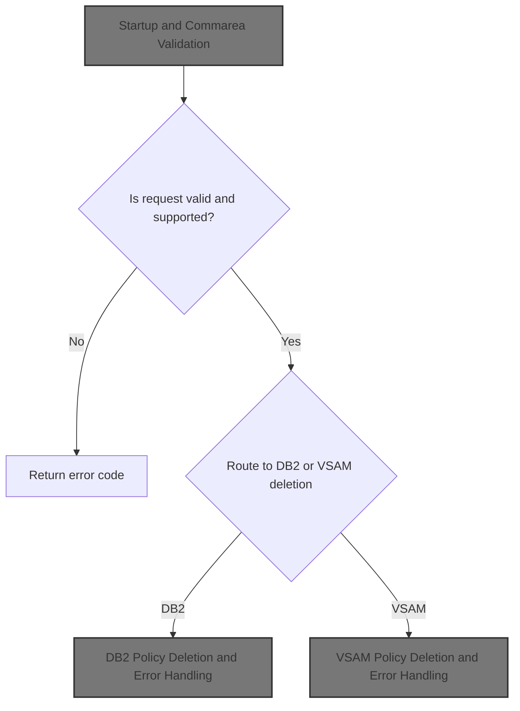
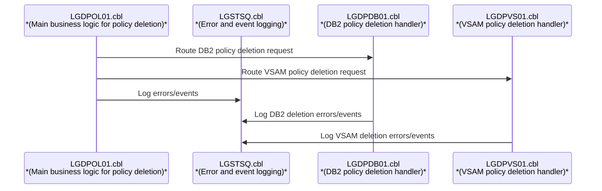
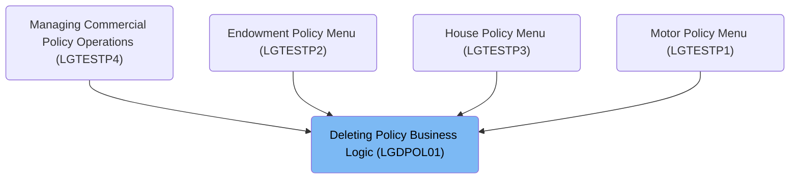
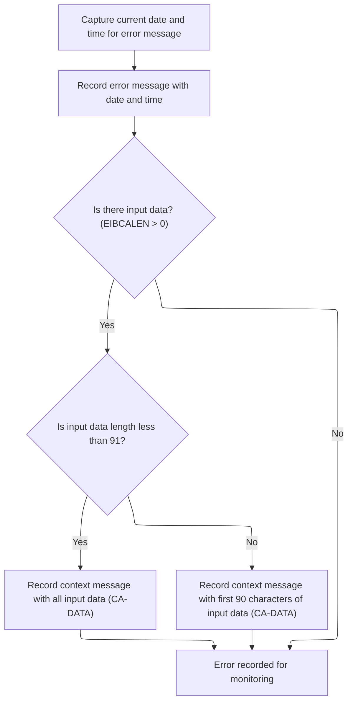
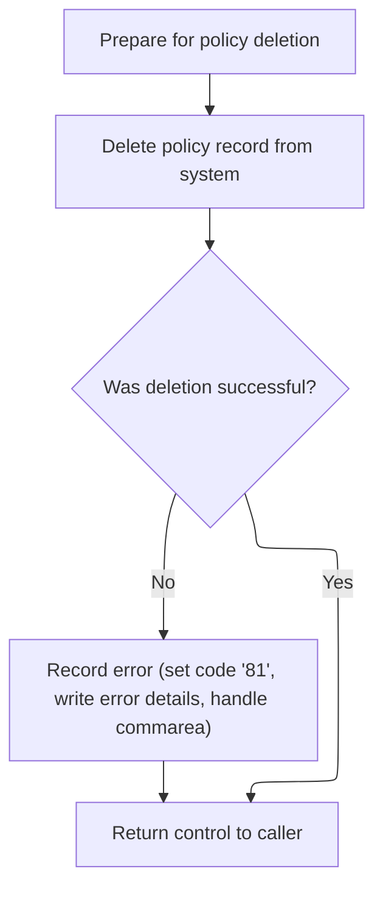

# Overview

This document explains the flow for deleting insurance policies. The process validates requests, routes deletion to the appropriate backend, and ensures all actions are logged for traceability.



# Technical Overview



## Dependencies

### Programs

- <SwmToken path="base/src/lgdpol01.cbl" pos="141:9:9" line-data="           EXEC CICS LINK PROGRAM(LGDPDB01)">`LGDPDB01`</SwmToken> (<SwmPath>[base/src/lgdpdb01.cbl](base/src/lgdpdb01.cbl)</SwmPath>)
- <SwmToken path="base/src/lgdpdb01.cbl" pos="168:9:9" line-data="               EXEC CICS LINK PROGRAM(LGDPVS01)">`LGDPVS01`</SwmToken> (<SwmPath>[base/src/lgdpvs01.cbl](base/src/lgdpvs01.cbl)</SwmPath>)
- LGSTSQ (<SwmPath>[base/src/lgstsq.cbl](base/src/lgstsq.cbl)</SwmPath>)

### Copybooks

- LGCMAREA (<SwmPath>[base/src/lgcmarea.cpy](base/src/lgcmarea.cpy)</SwmPath>)
- SQLCA

# Where is this program used?

This program is used multiple times in the codebase as represented in the following diagram:



# Workflow

# Startup and Commarea Validation

This section ensures that the program starts with valid input data and a properly initialized environment, preventing execution with missing or invalid transaction context.

<SwmSnippet path="/base/src/lgdpol01.cbl" line="78">

---

In <SwmToken path="base/src/lgdpol01.cbl" pos="78:1:1" line-data="       MAINLINE SECTION.">`MAINLINE`</SwmToken>, we kick off by prepping working storage and copying over transaction context (IDs). The first real check is whether the commarea length is zero—if so, we bail out with an error message and abend. This prevents us from running with no input data. If we get past that, we set up the commarea return code and working storage pointers for later use. This is the setup and initial validation phase before any business logic runs.

```cobol
       MAINLINE SECTION.

      *----------------------------------------------------------------*
      * Common code                                                    *
      *----------------------------------------------------------------*
      * initialize working storage variables
           INITIALIZE WS-HEADER.
      * set up general variable
           MOVE EIBTRNID TO WS-TRANSID.
           MOVE EIBTRMID TO WS-TERMID.
           MOVE EIBTASKN TO WS-TASKNUM.
```

---

</SwmSnippet>

<SwmSnippet path="/base/src/lgdpol01.cbl" line="95">

---

Here, if the commarea is missing, we set an error message and call <SwmToken path="base/src/lgdpol01.cbl" pos="97:3:7" line-data="               PERFORM WRITE-ERROR-MESSAGE">`WRITE-ERROR-MESSAGE`</SwmToken> to log the problem before abending. This way, we capture the failure details for later analysis.

```cobol
           IF EIBCALEN IS EQUAL TO ZERO
               MOVE ' NO COMMAREA RECEIVED' TO EM-VARIABLE
               PERFORM WRITE-ERROR-MESSAGE
               EXEC CICS ABEND ABCODE('LGCA') NODUMP END-EXEC
           END-IF
```

---

</SwmSnippet>

## Error Logging and Message Formatting



This section ensures that all errors are logged with a timestamp and relevant context, supporting effective monitoring and troubleshooting. It also ensures that input data context is included in the logs when available, up to a defined maximum length.

| Category       | Rule Name                    | Description                                                                                                                                                                                                                        |
| -------------- | ---------------------------- | ---------------------------------------------------------------------------------------------------------------------------------------------------------------------------------------------------------------------------------- |
| Business logic | Timestamp inclusion          | Every error message must include the current date and time, formatted as MMDDYYYY and HHMMSS, to provide a precise timestamp for each logged event.                                                                                |
| Business logic | Dual queue logging           | Error messages must be recorded to both the transient data queue (TDQ) and the temporary storage queue (TSQ) to ensure redundancy and availability for monitoring systems.                                                         |
| Business logic | Input data context limit     | If input data is present, up to 90 bytes of the input data must be included in the error context message. If the input data is less than 91 bytes, all of it is included; otherwise, only the first 90 bytes are logged.           |
| Business logic | No input data fallback       | If no input data is present, only the error message with timestamp is recorded, without additional context.                                                                                                                        |
| Business logic | Program identifier inclusion | Error messages must include a program identifier (<SwmToken path="base/src/lgdpol01.cbl" pos="11:6:6" line-data="       PROGRAM-ID. LGDPOL01.">`LGDPOL01`</SwmToken>) to indicate the source of the error for easier traceability. |

<SwmSnippet path="/base/src/lgdpol01.cbl" line="154">

---

In <SwmToken path="base/src/lgdpol01.cbl" pos="154:1:5" line-data="       WRITE-ERROR-MESSAGE.">`WRITE-ERROR-MESSAGE`</SwmToken>, we grab the current time and date using CICS commands, format them, and stick them into the error message structure. This sets up the error log entry with a timestamp before we send it off to the logging program.

```cobol
       WRITE-ERROR-MESSAGE.
      * Save SQLCODE in message
      * Obtain and format current time and date
           EXEC CICS ASKTIME ABSTIME(WS-ABSTIME)
           END-EXEC
           EXEC CICS FORMATTIME ABSTIME(Ws-ABSTIME)
                     MMDDYYYY(WS-DATE)
                     TIME(WS-TIME)
           END-EXEC
```

---

</SwmSnippet>

<SwmSnippet path="/base/src/lgdpol01.cbl" line="163">

---

After prepping the error message, we call LGSTSQ to handle the actual queue write. This keeps all logging and message queueing logic in one place, so we don't duplicate it everywhere.

```cobol
           MOVE WS-DATE TO EM-DATE
           MOVE WS-TIME TO EM-TIME
      * Write output message to TDQ
           EXEC CICS LINK PROGRAM('LGSTSQ')
                     COMMAREA(ERROR-MSG)
                     LENGTH(LENGTH OF ERROR-MSG)
           END-EXEC.
```

---

</SwmSnippet>

<SwmSnippet path="/base/src/lgstsq.cbl" line="55">

---

<SwmToken path="base/src/lgstsq.cbl" pos="55:1:1" line-data="       MAINLINE SECTION.">`MAINLINE`</SwmToken> in LGSTSQ checks if the message came from another program or from a terminal, sets a flag, and copies the right data. If the message starts with 'Q=', it extracts an extension for queue naming. Then it writes the message to both TDQ and TSQ, and if it's a received message, sends a minimal response back to the sender.

```cobol
       MAINLINE SECTION.

           MOVE SPACES TO WRITE-MSG.
           MOVE SPACES TO WS-RECV.

           EXEC CICS ASSIGN SYSID(WRITE-MSG-SYSID)
                RESP(WS-RESP)
           END-EXEC.

           EXEC CICS ASSIGN INVOKINGPROG(WS-INVOKEPROG)
                RESP(WS-RESP)
           END-EXEC.
           
           IF WS-INVOKEPROG NOT = SPACES
              MOVE 'C' To WS-FLAG
              MOVE COMMA-DATA  TO WRITE-MSG-MSG
              MOVE EIBCALEN    TO WS-RECV-LEN
           ELSE
              EXEC CICS RECEIVE INTO(WS-RECV)
                  LENGTH(WS-RECV-LEN)
                  RESP(WS-RESP)
              END-EXEC
              MOVE 'R' To WS-FLAG
              MOVE WS-RECV-DATA  TO WRITE-MSG-MSG
              SUBTRACT 5 FROM WS-RECV-LEN
           END-IF.

           MOVE 'GENAERRS' TO STSQ-NAME.
           IF WRITE-MSG-MSG(1:2) = 'Q=' THEN
              MOVE WRITE-MSG-MSG(3:4) TO STSQ-EXT
              MOVE WRITE-MSG-REST TO TEMPO
              MOVE TEMPO          TO WRITE-MSG-MSG
              SUBTRACT 7 FROM WS-RECV-LEN
           END-IF.

           ADD 5 TO WS-RECV-LEN.

      * Write output message to TDQ CSMT
      *
           EXEC CICS WRITEQ TD QUEUE(STDQ-NAME)
                     FROM(WRITE-MSG)
                     RESP(WS-RESP)
                     LENGTH(WS-RECV-LEN)

           END-EXEC.

      * Write output message to Genapp TSQ
      * If no space is available then the task will not wait for
      *  storage to become available but will ignore the request...
      *
           EXEC CICS WRITEQ TS QUEUE(STSQ-NAME)
                     FROM(WRITE-MSG)
                     RESP(WS-RESP)
                     NOSUSPEND
                     LENGTH(WS-RECV-LEN)

           END-EXEC.

           If WS-FLAG = 'R' Then
             EXEC CICS SEND TEXT FROM(FILLER-X)
              WAIT
              ERASE
              LENGTH(1)
              FREEKB
             END-EXEC.

           EXEC CICS RETURN
           END-EXEC.
```

---

</SwmSnippet>

<SwmSnippet path="/base/src/lgdpol01.cbl" line="171">

---

After returning from LGSTSQ, <SwmToken path="base/src/lgdpol01.cbl" pos="97:3:7" line-data="               PERFORM WRITE-ERROR-MESSAGE">`WRITE-ERROR-MESSAGE`</SwmToken> checks if there's commarea data to log. If so, it copies up to 90 bytes and logs that too, again via LGSTSQ. This gives extra context in the logs without risking overflow.

```cobol
           IF EIBCALEN > 0 THEN
             IF EIBCALEN < 91 THEN
               MOVE DFHCOMMAREA(1:EIBCALEN) TO CA-DATA
               EXEC CICS LINK PROGRAM('LGSTSQ')
                         COMMAREA(CA-ERROR-MSG)
                         LENGTH(LENGTH OF CA-ERROR-MSG)
               END-EXEC
             ELSE
               MOVE DFHCOMMAREA(1:90) TO CA-DATA
               EXEC CICS LINK PROGRAM('LGSTSQ')
                         COMMAREA(CA-ERROR-MSG)
                         LENGTH(LENGTH OF CA-ERROR-MSG)
               END-EXEC
             END-IF
           END-IF.
           EXIT.
```

---

</SwmSnippet>

## Commarea Structure and Request Validation

```mermaid
%%{init: {"flowchart": {"defaultRenderer": "elk"}} }%%
flowchart TD
    node2{"Is commarea large enough? (EIBCALEN >= 28)"}
    click node2 openCode "base/src/lgdpol01.cbl:107:110"
    node2 -->|"No"| node3["Return error code '98' (commarea too small)"]
    click node3 openCode "base/src/lgdpol01.cbl:108:109"
    node3 --> node11["Return to caller"]
    click node11 openCode "base/src/lgdpol01.cbl:109:109"
    node2 -->|"Yes"| node4["Normalize request ID to upper-case"]
    click node4 openCode "base/src/lgdpol01.cbl:117:117"
    node4 --> node5{"Is request type supported? (01DEND, 01DMOT, 01DHOU, 01DCOM)"}
    click node5 openCode "base/src/lgdpol01.cbl:119:122"
    node5 -->|"No"| node6["Return error code '99' (unsupported request)"]
    click node6 openCode "base/src/lgdpol01.cbl:124:124"
    node6 --> node12["Return to caller"]
    click node12 openCode "base/src/lgdpol01.cbl:133:133"
    node5 -->|"Yes"| node7["Process request (delete policy info)"]
    click node7 openCode "base/src/lgdpol01.cbl:126:126"
    node7 --> node8{"Did deletion fail? (CA-RETURN-CODE > 0)"}
    click node8 openCode "base/src/lgdpol01.cbl:127:128"
    node8 -->|"Yes"| node9["Return error code (deletion failed)"]
    click node9 openCode "base/src/lgdpol01.cbl:128:128"
    node9 --> node13["Return to caller"]
    click node13 openCode "base/src/lgdpol01.cbl:128:128"
    node8 -->|"No"| node10["Return success code '00'"]
    click node10 openCode "base/src/lgdpol01.cbl:133:133"
    node10 --> node14["Return to caller"]
    click node14 openCode "base/src/lgdpol01.cbl:133:133"

classDef HeadingStyle fill:#777777,stroke:#333,stroke-width:2px;

%% Swimm:
%% %%{init: {"flowchart": {"defaultRenderer": "elk"}} }%%
%% flowchart TD
%%     node2{"Is commarea large enough? (EIBCALEN >= 28)"}
%%     click node2 openCode "<SwmPath>[base/src/lgdpol01.cbl](base/src/lgdpol01.cbl)</SwmPath>:107:110"
%%     node2 -->|"No"| node3["Return error code '98' (commarea too small)"]
%%     click node3 openCode "<SwmPath>[base/src/lgdpol01.cbl](base/src/lgdpol01.cbl)</SwmPath>:108:109"
%%     node3 --> node11["Return to caller"]
%%     click node11 openCode "<SwmPath>[base/src/lgdpol01.cbl](base/src/lgdpol01.cbl)</SwmPath>:109:109"
%%     node2 -->|"Yes"| node4["Normalize request ID to upper-case"]
%%     click node4 openCode "<SwmPath>[base/src/lgdpol01.cbl](base/src/lgdpol01.cbl)</SwmPath>:117:117"
%%     node4 --> node5{"Is request type supported? (<SwmToken path="base/src/lgdpol01.cbl" pos="119:18:18" line-data="           IF ( CA-REQUEST-ID NOT EQUAL TO &#39;01DEND&#39; AND">`01DEND`</SwmToken>, <SwmToken path="base/src/lgdpol01.cbl" pos="120:14:14" line-data="                CA-REQUEST-ID NOT EQUAL TO &#39;01DMOT&#39; AND">`01DMOT`</SwmToken>, <SwmToken path="base/src/lgdpol01.cbl" pos="121:14:14" line-data="                CA-REQUEST-ID NOT EQUAL TO &#39;01DHOU&#39; AND">`01DHOU`</SwmToken>, <SwmToken path="base/src/lgdpol01.cbl" pos="122:14:14" line-data="                CA-REQUEST-ID NOT EQUAL TO &#39;01DCOM&#39; )">`01DCOM`</SwmToken>)"}
%%     click node5 openCode "<SwmPath>[base/src/lgdpol01.cbl](base/src/lgdpol01.cbl)</SwmPath>:119:122"
%%     node5 -->|"No"| node6["Return error code '99' (unsupported request)"]
%%     click node6 openCode "<SwmPath>[base/src/lgdpol01.cbl](base/src/lgdpol01.cbl)</SwmPath>:124:124"
%%     node6 --> node12["Return to caller"]
%%     click node12 openCode "<SwmPath>[base/src/lgdpol01.cbl](base/src/lgdpol01.cbl)</SwmPath>:133:133"
%%     node5 -->|"Yes"| node7["Process request (delete policy info)"]
%%     click node7 openCode "<SwmPath>[base/src/lgdpol01.cbl](base/src/lgdpol01.cbl)</SwmPath>:126:126"
%%     node7 --> node8{"Did deletion fail? (<SwmToken path="base/src/lgdpol01.cbl" pos="102:9:13" line-data="           MOVE &#39;00&#39; TO CA-RETURN-CODE">`CA-RETURN-CODE`</SwmToken> > 0)"}
%%     click node8 openCode "<SwmPath>[base/src/lgdpol01.cbl](base/src/lgdpol01.cbl)</SwmPath>:127:128"
%%     node8 -->|"Yes"| node9["Return error code (deletion failed)"]
%%     click node9 openCode "<SwmPath>[base/src/lgdpol01.cbl](base/src/lgdpol01.cbl)</SwmPath>:128:128"
%%     node9 --> node13["Return to caller"]
%%     click node13 openCode "<SwmPath>[base/src/lgdpol01.cbl](base/src/lgdpol01.cbl)</SwmPath>:128:128"
%%     node8 -->|"No"| node10["Return success code '00'"]
%%     click node10 openCode "<SwmPath>[base/src/lgdpol01.cbl](base/src/lgdpol01.cbl)</SwmPath>:133:133"
%%     node10 --> node14["Return to caller"]
%%     click node14 openCode "<SwmPath>[base/src/lgdpol01.cbl](base/src/lgdpol01.cbl)</SwmPath>:133:133"
%% 
%% classDef HeadingStyle fill:#777777,stroke:#333,stroke-width:2px;
```



<SwmSnippet path="/base/src/lgdpol01.cbl" line="102">

---

Back in MAINLINE, after handling any missing commarea errors, we check if the commarea is big enough for required fields. If not, we set an error code ('98') and return immediately. This prevents us from working with incomplete data.

```cobol
           MOVE '00' TO CA-RETURN-CODE
           MOVE EIBCALEN TO WS-CALEN.
           SET WS-ADDR-DFHCOMMAREA TO ADDRESS OF DFHCOMMAREA.

      * Check commarea is large enough
           IF EIBCALEN IS LESS THAN WS-CA-HEADER-LEN
             MOVE '98' TO CA-RETURN-CODE
             EXEC CICS RETURN END-EXEC
           END-IF
```

---

</SwmSnippet>

<SwmSnippet path="/base/src/lgdpol01.cbl" line="117">

---

After validating the commarea, we uppercase the request ID and check if it's one of the allowed delete types. If not, we set an error code ('99'). If it matches, we call <SwmToken path="base/src/lgdpol01.cbl" pos="126:3:9" line-data="               PERFORM DELETE-POLICY-DB2-INFO">`DELETE-POLICY-DB2-INFO`</SwmToken> to actually remove the policy. If that fails, we return right away.

```cobol
           MOVE FUNCTION UPPER-CASE(CA-REQUEST-ID) TO CA-REQUEST-ID

           IF ( CA-REQUEST-ID NOT EQUAL TO '01DEND' AND
                CA-REQUEST-ID NOT EQUAL TO '01DMOT' AND
                CA-REQUEST-ID NOT EQUAL TO '01DHOU' AND
                CA-REQUEST-ID NOT EQUAL TO '01DCOM' )
      *        Request is not recognised or supported
               MOVE '99' TO CA-RETURN-CODE
           ELSE
               PERFORM DELETE-POLICY-DB2-INFO
               If CA-RETURN-CODE > 0
                 EXEC CICS RETURN END-EXEC
               End-if
           END-IF

      * Return to caller
           EXEC CICS RETURN END-EXEC.
```

---

</SwmSnippet>

# <SwmToken path="base/src/lgdpol01.cbl" pos="126:7:7" line-data="               PERFORM DELETE-POLICY-DB2-INFO">`DB2`</SwmToken> Policy Deletion Logic

This section ensures that policy deletion requests are routed to a specialized <SwmToken path="base/src/lgdpol01.cbl" pos="126:7:7" line-data="               PERFORM DELETE-POLICY-DB2-INFO">`DB2`</SwmToken> handler program, maintaining separation of concerns and ensuring that database logic does not interfere with the main business flow.

<SwmSnippet path="/base/src/lgdpol01.cbl" line="139">

---

In <SwmToken path="base/src/lgdpol01.cbl" pos="139:1:7" line-data="       DELETE-POLICY-DB2-INFO.">`DELETE-POLICY-DB2-INFO`</SwmToken>, we just link to <SwmToken path="base/src/lgdpol01.cbl" pos="141:9:9" line-data="           EXEC CICS LINK PROGRAM(LGDPDB01)">`LGDPDB01`</SwmToken>, passing the commarea. That program handles the <SwmToken path="base/src/lgdpol01.cbl" pos="139:5:5" line-data="       DELETE-POLICY-DB2-INFO.">`DB2`</SwmToken> delete, so we don't mix <SwmToken path="base/src/lgdpol01.cbl" pos="139:5:5" line-data="       DELETE-POLICY-DB2-INFO.">`DB2`</SwmToken> logic into the main business flow.

```cobol
       DELETE-POLICY-DB2-INFO.

           EXEC CICS LINK PROGRAM(LGDPDB01)
                Commarea(DFHCOMMAREA)
                LENGTH(32500)
           END-EXEC.

           EXIT.
```

---

</SwmSnippet>

# <SwmToken path="base/src/lgdpol01.cbl" pos="126:7:7" line-data="               PERFORM DELETE-POLICY-DB2-INFO">`DB2`</SwmToken> Policy Deletion and Error Handling



This section governs the business rules for deleting a policy record in <SwmToken path="base/src/lgdpol01.cbl" pos="126:7:7" line-data="               PERFORM DELETE-POLICY-DB2-INFO">`DB2`</SwmToken>, ensuring that only valid requests are processed, errors are handled with clear codes, and all actions are logged for traceability.

```mermaid
%%{init: {"flowchart": {"defaultRenderer": "elk"}} }%%
flowchart TD
  node1["Start: Receive policy deletion request"] --> node2{"Was commarea received?"}
  click node1 openCode "base/src/lgdpdb01.cbl:111:131"
  node2 -->|"No"| node3["Record error: No commarea (CA-RETURN-CODE '99')"]
  click node2 openCode "base/src/lgdpdb01.cbl:131:135"
  node3 --> node4["Write error message"]
  click node3 openCode "base/src/lgdpdb01.cbl:132:135"
  click node4 openCode "base/src/lgdpdb01.cbl:212:245"
  node4 --> node9["Return to caller"]
  node2 -->|"Yes"| node5{"Is commarea large enough?"}
  click node5 openCode "base/src/lgdpdb01.cbl:143:146"
  node5 -->|"No"| node6["Return error: Commarea too short (CA-RETURN-CODE '98')"]
  click node6 openCode "base/src/lgdpdb01.cbl:144:145"
  node6 --> node9
  node5 -->|"Yes"| node7{"Is request type supported?"}
  click node7 openCode "base/src/lgdpdb01.cbl:160:172"
  node7 -->|"No"| node8["Record error: Unsupported request type (CA-RETURN-CODE '99')"]
  click node8 openCode "base/src/lgdpdb01.cbl:165:166"
  node8 --> node4
  node7 -->|"Yes"| node10["Delete policy record and call external program"]
  click node10 openCode "base/src/lgdpdb01.cbl:167:171"
  node10 --> node9
  node9["Return to caller"]
  click node9 openCode "base/src/lgdpdb01.cbl:175:175"
classDef HeadingStyle fill:#777777,stroke:#333,stroke-width:2px;

%% Swimm:
%% %%{init: {"flowchart": {"defaultRenderer": "elk"}} }%%
%% flowchart TD
%%   node1["Start: Receive policy deletion request"] --> node2{"Was commarea received?"}
%%   click node1 openCode "<SwmPath>[base/src/lgdpdb01.cbl](base/src/lgdpdb01.cbl)</SwmPath>:111:131"
%%   node2 -->|"No"| node3["Record error: No commarea (<SwmToken path="base/src/lgdpol01.cbl" pos="102:9:13" line-data="           MOVE &#39;00&#39; TO CA-RETURN-CODE">`CA-RETURN-CODE`</SwmToken> '99')"]
%%   click node2 openCode "<SwmPath>[base/src/lgdpdb01.cbl](base/src/lgdpdb01.cbl)</SwmPath>:131:135"
%%   node3 --> node4["Write error message"]
%%   click node3 openCode "<SwmPath>[base/src/lgdpdb01.cbl](base/src/lgdpdb01.cbl)</SwmPath>:132:135"
%%   click node4 openCode "<SwmPath>[base/src/lgdpdb01.cbl](base/src/lgdpdb01.cbl)</SwmPath>:212:245"
%%   node4 --> node9["Return to caller"]
%%   node2 -->|"Yes"| node5{"Is commarea large enough?"}
%%   click node5 openCode "<SwmPath>[base/src/lgdpdb01.cbl](base/src/lgdpdb01.cbl)</SwmPath>:143:146"
%%   node5 -->|"No"| node6["Return error: Commarea too short (<SwmToken path="base/src/lgdpol01.cbl" pos="102:9:13" line-data="           MOVE &#39;00&#39; TO CA-RETURN-CODE">`CA-RETURN-CODE`</SwmToken> '98')"]
%%   click node6 openCode "<SwmPath>[base/src/lgdpdb01.cbl](base/src/lgdpdb01.cbl)</SwmPath>:144:145"
%%   node6 --> node9
%%   node5 -->|"Yes"| node7{"Is request type supported?"}
%%   click node7 openCode "<SwmPath>[base/src/lgdpdb01.cbl](base/src/lgdpdb01.cbl)</SwmPath>:160:172"
%%   node7 -->|"No"| node8["Record error: Unsupported request type (<SwmToken path="base/src/lgdpol01.cbl" pos="102:9:13" line-data="           MOVE &#39;00&#39; TO CA-RETURN-CODE">`CA-RETURN-CODE`</SwmToken> '99')"]
%%   click node8 openCode "<SwmPath>[base/src/lgdpdb01.cbl](base/src/lgdpdb01.cbl)</SwmPath>:165:166"
%%   node8 --> node4
%%   node7 -->|"Yes"| node10["Delete policy record and call external program"]
%%   click node10 openCode "<SwmPath>[base/src/lgdpdb01.cbl](base/src/lgdpdb01.cbl)</SwmPath>:167:171"
%%   node10 --> node9
%%   node9["Return to caller"]
%%   click node9 openCode "<SwmPath>[base/src/lgdpdb01.cbl](base/src/lgdpdb01.cbl)</SwmPath>:175:175"
%% classDef HeadingStyle fill:#777777,stroke:#333,stroke-width:2px;
```

| Category        | Rule Name               | Description                                                                                                                                                                                                                                                                                                                                                                                                                                                                                                                                                                                                                                                                                                                                                                                                         |
| --------------- | ----------------------- | ------------------------------------------------------------------------------------------------------------------------------------------------------------------------------------------------------------------------------------------------------------------------------------------------------------------------------------------------------------------------------------------------------------------------------------------------------------------------------------------------------------------------------------------------------------------------------------------------------------------------------------------------------------------------------------------------------------------------------------------------------------------------------------------------------------------- |
| Data validation | Missing commarea error  | If no commarea is received with the request, the operation must be aborted and an error code '99' must be set in the return code field. An error message must be logged for traceability.                                                                                                                                                                                                                                                                                                                                                                                                                                                                                                                                                                                                                           |
| Data validation | Minimum commarea length | If the commarea received is shorter than the required minimum length (+28 bytes), the operation must be aborted and an error code '98' must be set in the return code field.                                                                                                                                                                                                                                                                                                                                                                                                                                                                                                                                                                                                                                        |
| Data validation | Supported request types | Only requests with a supported request ID (<SwmToken path="base/src/lgdpol01.cbl" pos="119:18:18" line-data="           IF ( CA-REQUEST-ID NOT EQUAL TO &#39;01DEND&#39; AND">`01DEND`</SwmToken>, <SwmToken path="base/src/lgdpol01.cbl" pos="121:14:14" line-data="                CA-REQUEST-ID NOT EQUAL TO &#39;01DHOU&#39; AND">`01DHOU`</SwmToken>, <SwmToken path="base/src/lgdpol01.cbl" pos="122:14:14" line-data="                CA-REQUEST-ID NOT EQUAL TO &#39;01DCOM&#39; )">`01DCOM`</SwmToken>, <SwmToken path="base/src/lgdpol01.cbl" pos="120:14:14" line-data="                CA-REQUEST-ID NOT EQUAL TO &#39;01DMOT&#39; AND">`01DMOT`</SwmToken>) are allowed to proceed with policy deletion. Unsupported request types must result in error code '99' and an error message must be logged. |
| Business logic  | Policy deletion outcome | When a valid deletion request is received, the policy record must be deleted from the <SwmToken path="base/src/lgdpol01.cbl" pos="126:7:7" line-data="               PERFORM DELETE-POLICY-DB2-INFO">`DB2`</SwmToken> database using the provided customer and policy numbers. Both successful deletion (SQLCODE 0) and record not found (SQLCODE 100) are considered successful outcomes.                                                                                                                                                                                                                                                                                                                                                                                                                          |

<SwmSnippet path="/base/src/lgdpdb01.cbl" line="111">

---

In <SwmToken path="base/src/lgdpol01.cbl" pos="141:9:9" line-data="           EXEC CICS LINK PROGRAM(LGDPDB01)">`LGDPDB01`</SwmToken>'s MAINLINE, we validate the commarea, prep <SwmToken path="base/src/lgdpdb01.cbl" pos="124:5:5" line-data="      * initialize DB2 host variables">`DB2`</SwmToken> variables, and check the request ID. If it's not a supported delete, we set an error code. If it is, we perform the delete and link to another program for further cleanup. All errors and edge cases are handled with specific return codes for clarity.

```cobol
       MAINLINE SECTION.

      *----------------------------------------------------------------*
      * Common code                                                    *
      *----------------------------------------------------------------*
      * initialize working storage variables
           INITIALIZE WS-HEADER.
      * set up general variable
           MOVE EIBTRNID TO WS-TRANSID.
           MOVE EIBTRMID TO WS-TERMID.
           MOVE EIBTASKN TO WS-TASKNUM.
      *----------------------------------------------------------------*

      * initialize DB2 host variables
           INITIALIZE DB2-IN-INTEGERS.

      *----------------------------------------------------------------*
      * Check commarea and obtain required details                     *
      *----------------------------------------------------------------*
      * If NO commarea received issue an ABEND
           IF EIBCALEN IS EQUAL TO ZERO
               MOVE ' NO COMMAREA RECEIVED' TO EM-VARIABLE
               PERFORM WRITE-ERROR-MESSAGE
               EXEC CICS ABEND ABCODE('LGCA') NODUMP END-EXEC
           END-IF

      * initialize commarea return code to zero
           MOVE '00' TO CA-RETURN-CODE
           MOVE EIBCALEN TO WS-CALEN.
           SET WS-ADDR-DFHCOMMAREA TO ADDRESS OF DFHCOMMAREA.

      * Check commarea is large enough
           IF EIBCALEN IS LESS THAN WS-CA-HEADER-LEN
             MOVE '98' TO CA-RETURN-CODE
             EXEC CICS RETURN END-EXEC
           END-IF

      * Convert commarea customer & policy nums to DB2 integer format
           MOVE CA-CUSTOMER-NUM TO DB2-CUSTOMERNUM-INT
           MOVE CA-POLICY-NUM   TO DB2-POLICYNUM-INT
      * and save in error msg field incase required
           MOVE CA-CUSTOMER-NUM TO EM-CUSNUM
           MOVE CA-POLICY-NUM   TO EM-POLNUM

      *----------------------------------------------------------------*
      * Check request-id in commarea and if recognised ...             *
      * Call routine to delete row from policy table                   *
      *----------------------------------------------------------------*

           IF ( CA-REQUEST-ID NOT EQUAL TO '01DEND' AND
                CA-REQUEST-ID NOT EQUAL TO '01DHOU' AND
                CA-REQUEST-ID NOT EQUAL TO '01DCOM' AND
                CA-REQUEST-ID NOT EQUAL TO '01DMOT' ) Then
      *        Request is not recognised or supported
               MOVE '99' TO CA-RETURN-CODE
           ELSE
               PERFORM DELETE-POLICY-DB2-INFO
               EXEC CICS LINK PROGRAM(LGDPVS01)
                    Commarea(DFHCOMMAREA)
                    LENGTH(32500)
               END-EXEC
           END-IF.

      * Return to caller
           EXEC CICS RETURN END-EXEC.
```

---

</SwmSnippet>

<SwmSnippet path="/base/src/lgdpdb01.cbl" line="212">

---

In <SwmToken path="base/src/lgdpdb01.cbl" pos="212:1:5" line-data="       WRITE-ERROR-MESSAGE.">`WRITE-ERROR-MESSAGE`</SwmToken>, we log the error details (including SQL code and timestamp) via LGSTSQ, then optionally log up to 90 bytes of commarea data for extra context. This helps with debugging and tracking down issues.

```cobol
       WRITE-ERROR-MESSAGE.
      * Save SQLCODE in message
           MOVE SQLCODE TO EM-SQLRC
      * Obtain and format current time and date
           EXEC CICS ASKTIME ABSTIME(WS-ABSTIME)
           END-EXEC
           EXEC CICS FORMATTIME ABSTIME(Ws-ABSTIME)
                     MMDDYYYY(WS-DATE)
                     TIME(WS-TIME)
           END-EXEC
           MOVE WS-DATE TO EM-DATE
           MOVE WS-TIME TO EM-TIME
      * Write output message to TDQ
           EXEC CICS LINK PROGRAM('LGSTSQ')
                     COMMAREA(ERROR-MSG)
                     LENGTH(LENGTH OF ERROR-MSG)
           END-EXEC.
      * Write 90 bytes or as much as we have of commarea to TDQ
           IF EIBCALEN > 0 THEN
             IF EIBCALEN < 91 THEN
               MOVE DFHCOMMAREA(1:EIBCALEN) TO CA-DATA
               EXEC CICS LINK PROGRAM('LGSTSQ')
                         COMMAREA(CA-ERROR-MSG)
                         LENGTH(LENGTH OF CA-ERROR-MSG)
               END-EXEC
             ELSE
               MOVE DFHCOMMAREA(1:90) TO CA-DATA
               EXEC CICS LINK PROGRAM('LGSTSQ')
                         COMMAREA(CA-ERROR-MSG)
                         LENGTH(LENGTH OF CA-ERROR-MSG)
               END-EXEC
             END-IF
           END-IF.
           EXIT.
```

---

</SwmSnippet>

<SwmSnippet path="/base/src/lgdpdb01.cbl" line="186">

---

In <SwmToken path="base/src/lgdpdb01.cbl" pos="186:1:7" line-data="       DELETE-POLICY-DB2-INFO.">`DELETE-POLICY-DB2-INFO`</SwmToken>, we set up the SQL operation type, run the DELETE using customer and policy numbers, and treat both 'deleted' and 'not found' as success. If there's an error, we log it and set a specific error code before returning.

```cobol
       DELETE-POLICY-DB2-INFO.

           MOVE ' DELETE POLICY  ' TO EM-SQLREQ
           EXEC SQL
             DELETE
               FROM POLICY
               WHERE ( CUSTOMERNUMBER = :DB2-CUSTOMERNUM-INT AND
                       POLICYNUMBER  = :DB2-POLICYNUM-INT      )
           END-EXEC

      *    Treat SQLCODE 0 and SQLCODE 100 (record not found) as
      *    successful - end result is record does not exist
           IF SQLCODE NOT EQUAL 0 Then
               MOVE '90' TO CA-RETURN-CODE
               PERFORM WRITE-ERROR-MESSAGE
               EXEC CICS RETURN END-EXEC
           END-IF.

           EXIT.
```

---

</SwmSnippet>

# VSAM Policy Deletion and Error Handling



This section is responsible for deleting a policy record from the system and ensuring robust error handling if the deletion is unsuccessful. It guarantees that all failed deletions are logged with sufficient detail for future troubleshooting.

| Category        | Rule Name                         | Description                                                                                                                                                                            |
| --------------- | --------------------------------- | -------------------------------------------------------------------------------------------------------------------------------------------------------------------------------------- |
| Data validation | Key field preparation requirement | A policy record must only be deleted if the key fields (request ID, policy number, customer number) are correctly prepared and mapped from the commarea to the working storage fields. |
| Business logic  | Policy deletion error code        | When a deletion fails, the return code '81' must be set in the commarea to indicate a policy deletion error to the caller.                                                             |
| Business logic  | Guaranteed control return         | Regardless of success or failure, control must always be returned to the caller after attempting to delete a policy record.                                                            |

<SwmSnippet path="/base/src/lgdpvs01.cbl" line="72">

---

In MAINLINE for <SwmToken path="base/src/lgdpdb01.cbl" pos="168:9:9" line-data="               EXEC CICS LINK PROGRAM(LGDPVS01)">`LGDPVS01`</SwmToken>, we prep the key fields, try to delete the VSAM record, and if it fails, we log the error and set a return code before exiting. This keeps error handling tight and visible.

```cobol
       MAINLINE SECTION.
      *
      *---------------------------------------------------------------*
           Move EIBCALEN To WS-Commarea-Len.
      *---------------------------------------------------------------*
           Move CA-Request-ID(4:1) To WF-Request-ID
           Move CA-Policy-Num      To WF-Policy-Num
           Move CA-Customer-Num    To WF-Customer-Num
      *---------------------------------------------------------------*
           Exec CICS Delete File('KSDSPOLY')
                     Ridfld(WF-Policy-Key)
                     KeyLength(21)
                     RESP(WS-RESP)
           End-Exec.
           If WS-RESP Not = DFHRESP(NORMAL)
             Move EIBRESP2 To WS-RESP2
             MOVE '81' TO CA-RETURN-CODE
             PERFORM WRITE-ERROR-MESSAGE
             EXEC CICS RETURN END-EXEC
           End-If.
```

---

</SwmSnippet>

<SwmSnippet path="/base/src/lgdpvs01.cbl" line="99">

---

In <SwmToken path="base/src/lgdpvs01.cbl" pos="99:1:5" line-data="       WRITE-ERROR-MESSAGE.">`WRITE-ERROR-MESSAGE`</SwmToken>, we log the error details (including timestamp, customer, policy, and response codes) via LGSTSQ, then optionally log up to 90 bytes of commarea data for extra context. This helps with debugging and tracking down issues.

```cobol
       WRITE-ERROR-MESSAGE.
           EXEC CICS ASKTIME ABSTIME(WS-ABSTIME)
           END-EXEC
           EXEC CICS FORMATTIME ABSTIME(WS-ABSTIME)
                     MMDDYYYY(WS-DATE)
                     TIME(WS-TIME)
           END-EXEC
      *
           MOVE WS-DATE TO EM-DATE
           MOVE WS-TIME TO EM-TIME
           Move CA-Customer-Num To EM-CUSNUM 
           Move CA-POLICY-NUM To EM-POLNUM 
           Move WS-RESP         To EM-RespRC
           Move WS-RESP2        To EM-Resp2RC
           EXEC CICS LINK PROGRAM('LGSTSQ')
                     COMMAREA(ERROR-MSG)
                     LENGTH(LENGTH OF ERROR-MSG)
           END-EXEC.
           IF EIBCALEN > 0 THEN
             IF EIBCALEN < 91 THEN
               MOVE DFHCOMMAREA(1:EIBCALEN) TO CA-DATA
               EXEC CICS LINK PROGRAM('LGSTSQ')
                         COMMAREA(CA-ERROR-MSG)
                         LENGTH(Length Of CA-ERROR-MSG)
               END-EXEC
             ELSE
               MOVE DFHCOMMAREA(1:90) TO CA-DATA
               EXEC CICS LINK PROGRAM('LGSTSQ')
                         COMMAREA(CA-ERROR-MSG)
                         LENGTH(Length Of CA-ERROR-MSG)
               END-EXEC
             END-IF
           END-IF.
           EXIT.
```

---

</SwmSnippet>

<SwmSnippet path="/base/src/lgdpvs01.cbl" line="95">

---

<SwmToken path="base/src/lgdpvs01.cbl" pos="95:1:3" line-data="       A-EXIT.">`A-EXIT`</SwmToken>, EXIT, and GOBACK just end the program and return control. No special logic—just a clean exit.

```cobol
       A-EXIT.
           EXIT.
           GOBACK.
```

---

</SwmSnippet>

&nbsp;

*This is an auto-generated document by Swimm 🌊 and has not yet been verified by a human*

<SwmMeta version="3.0.0" repo-id="Z2l0aHViJTNBJTNBU3dpbW1pby1nZW5hcHAtbW90b3IlM0ElM0FHaXJpLVN3aW1t" repo-name="Swimmio-genapp-motor"><sup>Powered by [Swimm](https://app.swimm.io/)</sup></SwmMeta>
