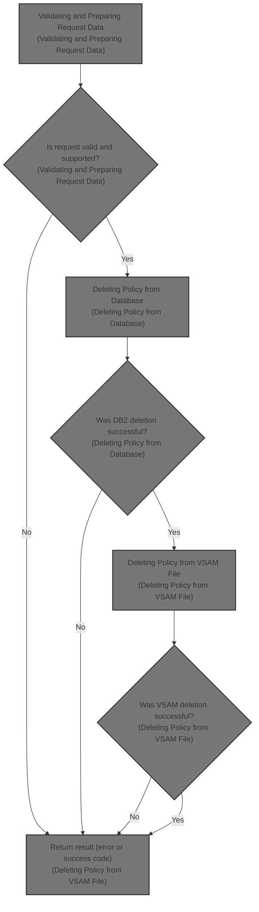
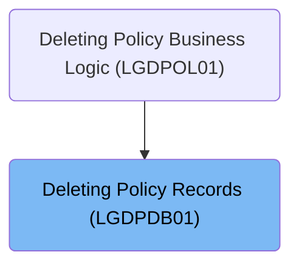

# Overview

This document describes the flow for deleting a policy record for a customer. The process validates requests, deletes the policy from both DB2 and VSAM databases, and logs error context if deletion fails.

## Dependencies

### Programs

- LGDPDB01 (<SwmPath>[base/src/lgdpdb01.cbl](base/src/lgdpdb01.cbl)</SwmPath>)
- LGDPVS01 (<SwmPath>[base/src/lgdpvs01.cbl](base/src/lgdpvs01.cbl)</SwmPath>)
- LGSTSQ (<SwmPath>[base/src/lgstsq.cbl](base/src/lgstsq.cbl)</SwmPath>)

### Copybooks

- LGCMAREA (<SwmPath>[base/src/lgcmarea.cpy](base/src/lgcmarea.cpy)</SwmPath>)
- SQLCA

# Where is this program used?

This program is used once, as represented in the following diagram:

&nbsp;

*This is an auto-generated document by Swimm 🌊 and has not yet been verified by a human*

<SwmMeta version="3.0.0" repo-id="Z2l0aHViJTNBJTNBU3dpbW1pby1nZW5hcHAtbW90b3IlM0ElM0FHaXJpLVN3aW1t" repo-name="Swimmio-genapp-motor">Powered by [Swimm](https://app.swimm.io/)</SwmMeta>
