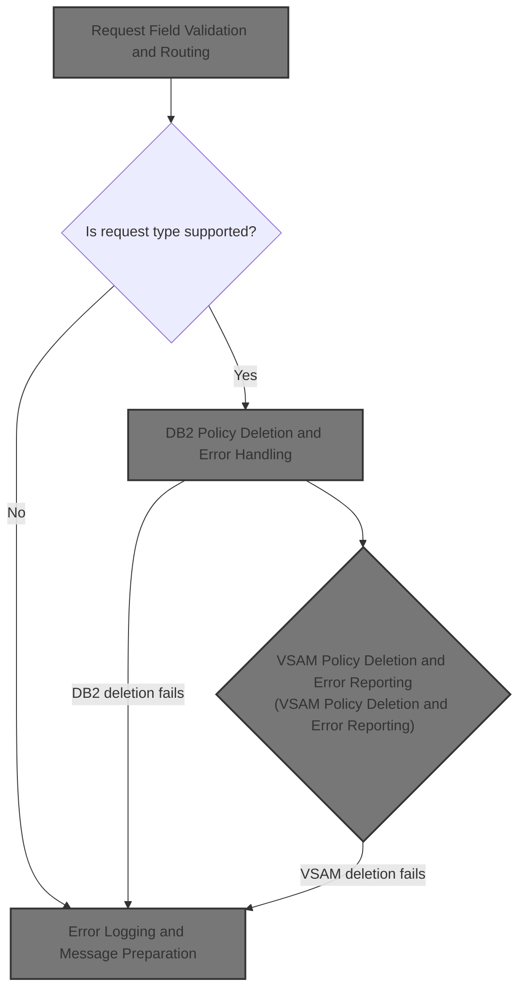
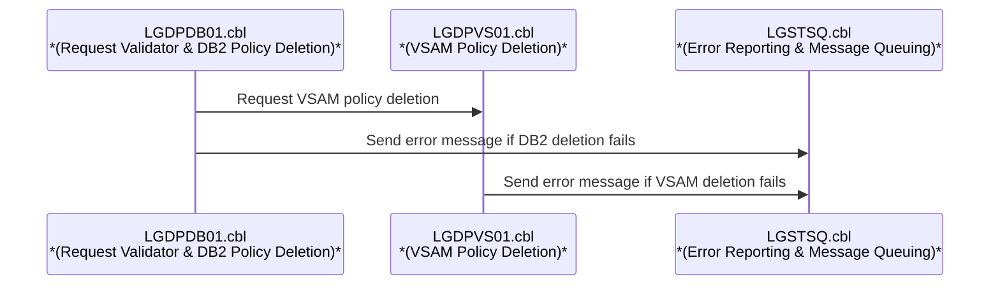
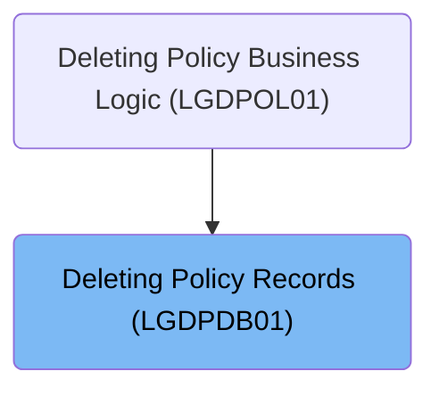
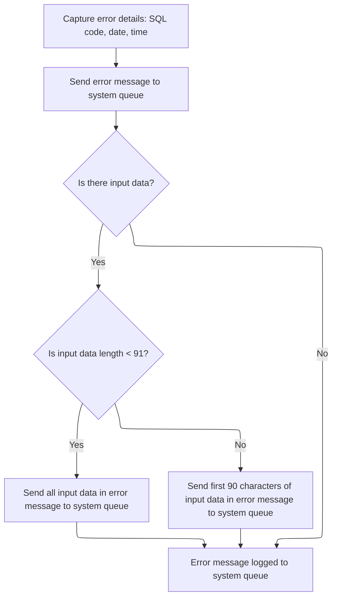
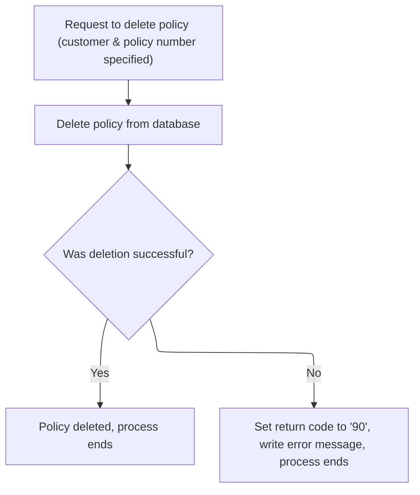
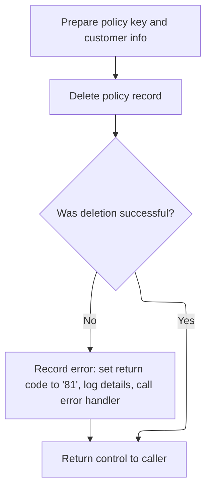

# Overview

This document describes the flow for deleting insurance policies. The process validates requests, checks for supported deletion types, and coordinates the removal of policy records from both <SwmToken path="base/src/lgdpdb01.cbl" pos="124:5:5" line-data="      * initialize DB2 host variables">`DB2`</SwmToken> and VSAM storage. Errors are logged and reported for audit and troubleshooting.



# Technical Overview



## Dependencies

### Programs

- <SwmToken path="base/src/lgdpdb01.cbl" pos="168:9:9" line-data="               EXEC CICS LINK PROGRAM(LGDPVS01)">`LGDPVS01`</SwmToken> (<SwmPath>[base/src/lgdpvs01.cbl](base/src/lgdpvs01.cbl)</SwmPath>)
- LGSTSQ (<SwmPath>[base/src/lgstsq.cbl](base/src/lgstsq.cbl)</SwmPath>)

### Copybooks

- LGCMAREA (<SwmPath>[base/src/lgcmarea.cpy](base/src/lgcmarea.cpy)</SwmPath>)
- SQLCA

# Where is this program used?

This program is used once, as represented in the following diagram:



## Input and Output Tables/Files used in the Program

| Table / File Name | Type                                                                                                                    | Description                                                     | Usage Mode | Key Fields / Layout Highlights           |
| ----------------- | ----------------------------------------------------------------------------------------------------------------------- | --------------------------------------------------------------- | ---------- | ---------------------------------------- |
| POLICY            | <SwmToken path="base/src/lgdpdb01.cbl" pos="124:5:5" line-data="      * initialize DB2 host variables">`DB2`</SwmToken> | Insurance policy master record: customer, type, dates, payment. | Output     | Database table with relational structure |

&nbsp;

# Workflow

# Startup and Request Validation

This section ensures the application is correctly initialized and that the incoming request contains the required commarea data before any business logic is executed.

| Category        | Rule Name          | Description                                                                                                                                              |
| --------------- | ------------------ | -------------------------------------------------------------------------------------------------------------------------------------------------------- |
| Data validation | Mandatory Commarea | If the commarea is not present in the request (length is zero), an error message must be logged with details and the program must terminate immediately. |

<SwmSnippet path="/base/src/lgdpdb01.cbl" line="111">

---

This is just the setup: prepping storage and <SwmToken path="base/src/lgdpdb01.cbl" pos="124:5:5" line-data="      * initialize DB2 host variables">`DB2`</SwmToken> variables, and grabbing IDs from the CICS environment before we check the request.

```cobol
       MAINLINE SECTION.

      *----------------------------------------------------------------*
      * Common code                                                    *
      *----------------------------------------------------------------*
      * initialize working storage variables
           INITIALIZE WS-HEADER.
      * set up general variable
           MOVE EIBTRNID TO WS-TRANSID.
           MOVE EIBTRMID TO WS-TERMID.
           MOVE EIBTASKN TO WS-TASKNUM.
      *----------------------------------------------------------------*

      * initialize DB2 host variables
           INITIALIZE DB2-IN-INTEGERS.
```

---

</SwmSnippet>

<SwmSnippet path="/base/src/lgdpdb01.cbl" line="131">

---

If there's no commarea, we log the error details and abend right away. Calling <SwmToken path="base/src/lgdpdb01.cbl" pos="133:3:7" line-data="               PERFORM WRITE-ERROR-MESSAGE">`WRITE-ERROR-MESSAGE`</SwmToken> here makes sure the missing input is recorded for audit and troubleshooting before the program stops.

```cobol
           IF EIBCALEN IS EQUAL TO ZERO
               MOVE ' NO COMMAREA RECEIVED' TO EM-VARIABLE
               PERFORM WRITE-ERROR-MESSAGE
               EXEC CICS ABEND ABCODE('LGCA') NODUMP END-EXEC
           END-IF
```

---

</SwmSnippet>

## Error Logging and Message Preparation



This section ensures that all relevant error context is captured and logged in a consistent format, enabling effective troubleshooting and audit trails. It enforces limits on the size of logged input data to prevent oversized messages and ensures all errors are recorded in both system and Genapp queues.

| Category        | Rule Name                  | Description                                                                                                                                                                                     |
| --------------- | -------------------------- | ----------------------------------------------------------------------------------------------------------------------------------------------------------------------------------------------- |
| Data validation | Message format consistency | Error messages must be formatted according to the defined structure, including fixed headers and offsets, to ensure consistency across all logged errors.                                       |
| Business logic  | Error context inclusion    | Every error message must include the SQL code, the current date, and the current time to provide full context for troubleshooting.                                                              |
| Business logic  | Input data size limit      | If input data (commarea) is present, include up to 90 bytes of it in the error message. If the input data is less than 91 bytes, include all of it; otherwise, include only the first 90 bytes. |
| Business logic  | Dual queue logging         | All error messages must be sent to both the system queue and the Genapp queue to ensure redundancy and availability for different analysis tools.                                               |

<SwmSnippet path="/base/src/lgdpdb01.cbl" line="212">

---

In <SwmToken path="base/src/lgdpdb01.cbl" pos="212:1:5" line-data="       WRITE-ERROR-MESSAGE.">`WRITE-ERROR-MESSAGE`</SwmToken>, we grab the current time and date, format them, and stash them in the error message structure along with the SQLCODE. This sets up the error log with all the context needed for later analysis.

```cobol
       WRITE-ERROR-MESSAGE.
      * Save SQLCODE in message
           MOVE SQLCODE TO EM-SQLRC
      * Obtain and format current time and date
           EXEC CICS ASKTIME ABSTIME(WS-ABSTIME)
           END-EXEC
           EXEC CICS FORMATTIME ABSTIME(Ws-ABSTIME)
                     MMDDYYYY(WS-DATE)
                     TIME(WS-TIME)
           END-EXEC
```

---

</SwmSnippet>

<SwmSnippet path="/base/src/lgdpdb01.cbl" line="222">

---

After prepping the error message, we call LGSTSQ to handle the actual queue write. This offloads message queuing and keeps the error logging consistent across the system.

```cobol
           MOVE WS-DATE TO EM-DATE
           MOVE WS-TIME TO EM-TIME
      * Write output message to TDQ
           EXEC CICS LINK PROGRAM('LGSTSQ')
                     COMMAREA(ERROR-MSG)
                     LENGTH(LENGTH OF ERROR-MSG)
           END-EXEC.
```

---

</SwmSnippet>

<SwmSnippet path="/base/src/lgstsq.cbl" line="55">

---

<SwmToken path="base/src/lgstsq.cbl" pos="55:1:1" line-data="       MAINLINE SECTION.">`MAINLINE`</SwmToken> in LGSTSQ handles message formatting, queue selection, and writing to both system and Genapp queues. It uses fixed offsets to strip or add headers based on message format, and flags to decide if a response is needed.

```cobol
       MAINLINE SECTION.

           MOVE SPACES TO WRITE-MSG.
           MOVE SPACES TO WS-RECV.

           EXEC CICS ASSIGN SYSID(WRITE-MSG-SYSID)
                RESP(WS-RESP)
           END-EXEC.

           EXEC CICS ASSIGN INVOKINGPROG(WS-INVOKEPROG)
                RESP(WS-RESP)
           END-EXEC.
           
           IF WS-INVOKEPROG NOT = SPACES
              MOVE 'C' To WS-FLAG
              MOVE COMMA-DATA  TO WRITE-MSG-MSG
              MOVE EIBCALEN    TO WS-RECV-LEN
           ELSE
              EXEC CICS RECEIVE INTO(WS-RECV)
                  LENGTH(WS-RECV-LEN)
                  RESP(WS-RESP)
              END-EXEC
              MOVE 'R' To WS-FLAG
              MOVE WS-RECV-DATA  TO WRITE-MSG-MSG
              SUBTRACT 5 FROM WS-RECV-LEN
           END-IF.

           MOVE 'GENAERRS' TO STSQ-NAME.
           IF WRITE-MSG-MSG(1:2) = 'Q=' THEN
              MOVE WRITE-MSG-MSG(3:4) TO STSQ-EXT
              MOVE WRITE-MSG-REST TO TEMPO
              MOVE TEMPO          TO WRITE-MSG-MSG
              SUBTRACT 7 FROM WS-RECV-LEN
           END-IF.

           ADD 5 TO WS-RECV-LEN.

      * Write output message to TDQ CSMT
      *
           EXEC CICS WRITEQ TD QUEUE(STDQ-NAME)
                     FROM(WRITE-MSG)
                     RESP(WS-RESP)
                     LENGTH(WS-RECV-LEN)

           END-EXEC.

      * Write output message to Genapp TSQ
      * If no space is available then the task will not wait for
      *  storage to become available but will ignore the request...
      *
           EXEC CICS WRITEQ TS QUEUE(STSQ-NAME)
                     FROM(WRITE-MSG)
                     RESP(WS-RESP)
                     NOSUSPEND
                     LENGTH(WS-RECV-LEN)

           END-EXEC.

           If WS-FLAG = 'R' Then
             EXEC CICS SEND TEXT FROM(FILLER-X)
              WAIT
              ERASE
              LENGTH(1)
              FREEKB
             END-EXEC.

           EXEC CICS RETURN
           END-EXEC.
```

---

</SwmSnippet>

<SwmSnippet path="/base/src/lgdpdb01.cbl" line="230">

---

After returning from LGSTSQ, <SwmToken path="base/src/lgdpdb01.cbl" pos="133:3:7" line-data="               PERFORM WRITE-ERROR-MESSAGE">`WRITE-ERROR-MESSAGE`</SwmToken> checks if there's commarea data to log. If so, it copies up to 90 bytes and calls LGSTSQ again to queue this chunk. This keeps error logs from getting too big.

```cobol
           IF EIBCALEN > 0 THEN
             IF EIBCALEN < 91 THEN
               MOVE DFHCOMMAREA(1:EIBCALEN) TO CA-DATA
               EXEC CICS LINK PROGRAM('LGSTSQ')
                         COMMAREA(CA-ERROR-MSG)
                         LENGTH(LENGTH OF CA-ERROR-MSG)
               END-EXEC
             ELSE
               MOVE DFHCOMMAREA(1:90) TO CA-DATA
               EXEC CICS LINK PROGRAM('LGSTSQ')
                         COMMAREA(CA-ERROR-MSG)
                         LENGTH(LENGTH OF CA-ERROR-MSG)
               END-EXEC
             END-IF
           END-IF.
           EXIT.
```

---

</SwmSnippet>

## Request Field Validation and Routing

```mermaid
%%{init: {"flowchart": {"defaultRenderer": "elk"}} }%%
flowchart TD
    node1["Start request processing (set success code '00')"] --> node2{"Is communication area large enough?"}
    click node1 openCode "base/src/lgdpdb01.cbl:138:139"
    node2 -->|"No"| node3["Return error: commarea too small (code '98')"]
    click node2 openCode "base/src/lgdpdb01.cbl:143:146"
    click node3 openCode "base/src/lgdpdb01.cbl:144:145"
    node2 -->|"Yes"| node4["Map customer/policy identifiers and save for error messaging"]
    click node4 openCode "base/src/lgdpdb01.cbl:149:153"
    node4 --> node5{"Is request type supported? (01DEND, 01DHOU, 01DCOM, 01DMOT)"}
    click node5 openCode "base/src/lgdpdb01.cbl:160:163"
    node5 -->|"No"| node6["Return error: unsupported request (code '99')"]
    click node6 openCode "base/src/lgdpdb01.cbl:165:165"
    node5 -->|"Yes"| node7["Delete policy info and process supported request"]
    click node7 openCode "base/src/lgdpdb01.cbl:167:171"
    node6 --> node8["Return to caller"]
    click node8 openCode "base/src/lgdpdb01.cbl:175:175"
    node7 --> node8
    node3 --> node8
classDef HeadingStyle fill:#777777,stroke:#333,stroke-width:2px;

%% Swimm:
%% %%{init: {"flowchart": {"defaultRenderer": "elk"}} }%%
%% flowchart TD
%%     node1["Start request processing (set success code '00')"] --> node2{"Is communication area large enough?"}
%%     click node1 openCode "<SwmPath>[base/src/lgdpdb01.cbl](base/src/lgdpdb01.cbl)</SwmPath>:138:139"
%%     node2 -->|"No"| node3["Return error: commarea too small (code '98')"]
%%     click node2 openCode "<SwmPath>[base/src/lgdpdb01.cbl](base/src/lgdpdb01.cbl)</SwmPath>:143:146"
%%     click node3 openCode "<SwmPath>[base/src/lgdpdb01.cbl](base/src/lgdpdb01.cbl)</SwmPath>:144:145"
%%     node2 -->|"Yes"| node4["Map customer/policy identifiers and save for error messaging"]
%%     click node4 openCode "<SwmPath>[base/src/lgdpdb01.cbl](base/src/lgdpdb01.cbl)</SwmPath>:149:153"
%%     node4 --> node5{"Is request type supported? (<SwmToken path="base/src/lgdpdb01.cbl" pos="160:18:18" line-data="           IF ( CA-REQUEST-ID NOT EQUAL TO &#39;01DEND&#39; AND">`01DEND`</SwmToken>, <SwmToken path="base/src/lgdpdb01.cbl" pos="161:14:14" line-data="                CA-REQUEST-ID NOT EQUAL TO &#39;01DHOU&#39; AND">`01DHOU`</SwmToken>, <SwmToken path="base/src/lgdpdb01.cbl" pos="162:14:14" line-data="                CA-REQUEST-ID NOT EQUAL TO &#39;01DCOM&#39; AND">`01DCOM`</SwmToken>, <SwmToken path="base/src/lgdpdb01.cbl" pos="163:14:14" line-data="                CA-REQUEST-ID NOT EQUAL TO &#39;01DMOT&#39; ) Then">`01DMOT`</SwmToken>)"}
%%     click node5 openCode "<SwmPath>[base/src/lgdpdb01.cbl](base/src/lgdpdb01.cbl)</SwmPath>:160:163"
%%     node5 -->|"No"| node6["Return error: unsupported request (code '99')"]
%%     click node6 openCode "<SwmPath>[base/src/lgdpdb01.cbl](base/src/lgdpdb01.cbl)</SwmPath>:165:165"
%%     node5 -->|"Yes"| node7["Delete policy info and process supported request"]
%%     click node7 openCode "<SwmPath>[base/src/lgdpdb01.cbl](base/src/lgdpdb01.cbl)</SwmPath>:167:171"
%%     node6 --> node8["Return to caller"]
%%     click node8 openCode "<SwmPath>[base/src/lgdpdb01.cbl](base/src/lgdpdb01.cbl)</SwmPath>:175:175"
%%     node7 --> node8
%%     node3 --> node8
%% classDef HeadingStyle fill:#777777,stroke:#333,stroke-width:2px;
```



<SwmSnippet path="/base/src/lgdpdb01.cbl" line="138">

---

After error handling, we validate the commarea length and exit early if it's not long enough.

```cobol
           MOVE '00' TO CA-RETURN-CODE
           MOVE EIBCALEN TO WS-CALEN.
           SET WS-ADDR-DFHCOMMAREA TO ADDRESS OF DFHCOMMAREA.

      * Check commarea is large enough
           IF EIBCALEN IS LESS THAN WS-CA-HEADER-LEN
             MOVE '98' TO CA-RETURN-CODE
             EXEC CICS RETURN END-EXEC
           END-IF
```

---

</SwmSnippet>

<SwmSnippet path="/base/src/lgdpdb01.cbl" line="149">

---

Here we convert the customer and policy numbers from the commarea into <SwmToken path="base/src/lgdpdb01.cbl" pos="149:11:11" line-data="           MOVE CA-CUSTOMER-NUM TO DB2-CUSTOMERNUM-INT">`DB2`</SwmToken> integer variables for SQL use, and also stash them in the error message fields for logging if something goes wrong later.

```cobol
           MOVE CA-CUSTOMER-NUM TO DB2-CUSTOMERNUM-INT
           MOVE CA-POLICY-NUM   TO DB2-POLICYNUM-INT
      * and save in error msg field incase required
           MOVE CA-CUSTOMER-NUM TO EM-CUSNUM
           MOVE CA-POLICY-NUM   TO EM-POLNUM
```

---

</SwmSnippet>

<SwmSnippet path="/base/src/lgdpdb01.cbl" line="160">

---

We check if the request ID matches one of the allowed types for deletion. If not, we set an error code and return. If it matches, we delete the policy info from <SwmToken path="base/src/lgdpdb01.cbl" pos="167:7:7" line-data="               PERFORM DELETE-POLICY-DB2-INFO">`DB2`</SwmToken> and then link to <SwmToken path="base/src/lgdpdb01.cbl" pos="168:9:9" line-data="               EXEC CICS LINK PROGRAM(LGDPVS01)">`LGDPVS01`</SwmToken> for further cleanup.

```cobol
           IF ( CA-REQUEST-ID NOT EQUAL TO '01DEND' AND
                CA-REQUEST-ID NOT EQUAL TO '01DHOU' AND
                CA-REQUEST-ID NOT EQUAL TO '01DCOM' AND
                CA-REQUEST-ID NOT EQUAL TO '01DMOT' ) Then
      *        Request is not recognised or supported
               MOVE '99' TO CA-RETURN-CODE
           ELSE
               PERFORM DELETE-POLICY-DB2-INFO
               EXEC CICS LINK PROGRAM(LGDPVS01)
                    Commarea(DFHCOMMAREA)
                    LENGTH(32500)
               END-EXEC
           END-IF.

      * Return to caller
           EXEC CICS RETURN END-EXEC.
```

---

</SwmSnippet>

# <SwmToken path="base/src/lgdpdb01.cbl" pos="124:5:5" line-data="      * initialize DB2 host variables">`DB2`</SwmToken> Policy Deletion and Error Handling



This section governs the business logic and error handling for deleting a policy from the <SwmToken path="base/src/lgdpdb01.cbl" pos="124:5:5" line-data="      * initialize DB2 host variables">`DB2`</SwmToken> database. It ensures that only valid requests are processed, and that errors are communicated clearly to downstream systems and users.

| Category        | Rule Name                            | Description                                                                                                               |
| --------------- | ------------------------------------ | ------------------------------------------------------------------------------------------------------------------------- |
| Data validation | Policy deletion requires identifiers | A policy can only be deleted if both a valid customer number and policy number are provided in the request.               |
| Business logic  | Successful deletion confirmation     | If the deletion is successful, the process ends with confirmation that the policy has been deleted.                       |
| Business logic  | Error message content requirements   | The error message must include the request type ('DELETE POLICY'), customer number, policy number, and the SQLCODE value. |

<SwmSnippet path="/base/src/lgdpdb01.cbl" line="186">

---

In <SwmToken path="base/src/lgdpdb01.cbl" pos="186:1:7" line-data="       DELETE-POLICY-DB2-INFO.">`DELETE-POLICY-DB2-INFO`</SwmToken>, we set up the error message to show we're deleting a policy, then run the SQL DELETE using the customer and policy numbers from earlier.

```cobol
       DELETE-POLICY-DB2-INFO.

           MOVE ' DELETE POLICY  ' TO EM-SQLREQ
           EXEC SQL
             DELETE
               FROM POLICY
               WHERE ( CUSTOMERNUMBER = :DB2-CUSTOMERNUM-INT AND
                       POLICYNUMBER  = :DB2-POLICYNUM-INT      )
           END-EXEC
```

---

</SwmSnippet>

<SwmSnippet path="/base/src/lgdpdb01.cbl" line="198">

---

After the DELETE, if the SQLCODE isn't 0 or 100, we set an error code, log the error with <SwmToken path="base/src/lgdpdb01.cbl" pos="200:3:7" line-data="               PERFORM WRITE-ERROR-MESSAGE">`WRITE-ERROR-MESSAGE`</SwmToken>, and return. Otherwise, we just exit.

```cobol
           IF SQLCODE NOT EQUAL 0 Then
               MOVE '90' TO CA-RETURN-CODE
               PERFORM WRITE-ERROR-MESSAGE
               EXEC CICS RETURN END-EXEC
           END-IF.

           EXIT.
```

---

</SwmSnippet>

# VSAM Policy Deletion and Error Reporting



This section governs the deletion of policy records from the VSAM file and ensures that any errors encountered during the process are properly logged and reported for operational transparency and troubleshooting.

| Category       | Rule Name                 | Description                                                                                                                                                     |
| -------------- | ------------------------- | --------------------------------------------------------------------------------------------------------------------------------------------------------------- |
| Business logic | Error Logging Requirement | All unsuccessful deletion attempts must be logged with the error code, customer number, policy number, and system response codes for audit and troubleshooting. |
| Business logic | Error Timestamping        | The error log must include a timestamp formatted as MMDDYYYY and TIME to provide a precise record of when the error occurred.                                   |
| Business logic | Successful Deletion Flow  | If the deletion is successful, control must be returned to the caller without logging an error.                                                                 |

<SwmSnippet path="/base/src/lgdpvs01.cbl" line="72">

---

In MAINLINE of <SwmToken path="base/src/lgdpdb01.cbl" pos="168:9:9" line-data="               EXEC CICS LINK PROGRAM(LGDPVS01)">`LGDPVS01`</SwmToken>, we prep the key fields, try to delete the policy from the VSAM file, and if it fails, we log the error and exit.

```cobol
       MAINLINE SECTION.
      *
      *---------------------------------------------------------------*
           Move EIBCALEN To WS-Commarea-Len.
      *---------------------------------------------------------------*
           Move CA-Request-ID(4:1) To WF-Request-ID
           Move CA-Policy-Num      To WF-Policy-Num
           Move CA-Customer-Num    To WF-Customer-Num
      *---------------------------------------------------------------*
           Exec CICS Delete File('KSDSPOLY')
                     Ridfld(WF-Policy-Key)
                     KeyLength(21)
                     RESP(WS-RESP)
           End-Exec.
           If WS-RESP Not = DFHRESP(NORMAL)
             Move EIBRESP2 To WS-RESP2
             MOVE '81' TO CA-RETURN-CODE
             PERFORM WRITE-ERROR-MESSAGE
             EXEC CICS RETURN END-EXEC
           End-If.
```

---

</SwmSnippet>

<SwmSnippet path="/base/src/lgdpvs01.cbl" line="99">

---

In <SwmToken path="base/src/lgdpvs01.cbl" pos="99:1:5" line-data="       WRITE-ERROR-MESSAGE.">`WRITE-ERROR-MESSAGE`</SwmToken>, we format the timestamp, fill in the error message fields, and call LGSTSQ to queue the error. If there's commarea data, we copy up to 90 bytes and call LGSTSQ again to log that chunk too.

```cobol
       WRITE-ERROR-MESSAGE.
           EXEC CICS ASKTIME ABSTIME(WS-ABSTIME)
           END-EXEC
           EXEC CICS FORMATTIME ABSTIME(WS-ABSTIME)
                     MMDDYYYY(WS-DATE)
                     TIME(WS-TIME)
           END-EXEC
      *
           MOVE WS-DATE TO EM-DATE
           MOVE WS-TIME TO EM-TIME
           Move CA-Customer-Num To EM-CUSNUM 
           Move CA-POLICY-NUM To EM-POLNUM 
           Move WS-RESP         To EM-RespRC
           Move WS-RESP2        To EM-Resp2RC
           EXEC CICS LINK PROGRAM('LGSTSQ')
                     COMMAREA(ERROR-MSG)
                     LENGTH(LENGTH OF ERROR-MSG)
           END-EXEC.
           IF EIBCALEN > 0 THEN
             IF EIBCALEN < 91 THEN
               MOVE DFHCOMMAREA(1:EIBCALEN) TO CA-DATA
               EXEC CICS LINK PROGRAM('LGSTSQ')
                         COMMAREA(CA-ERROR-MSG)
                         LENGTH(Length Of CA-ERROR-MSG)
               END-EXEC
             ELSE
               MOVE DFHCOMMAREA(1:90) TO CA-DATA
               EXEC CICS LINK PROGRAM('LGSTSQ')
                         COMMAREA(CA-ERROR-MSG)
                         LENGTH(Length Of CA-ERROR-MSG)
               END-EXEC
             END-IF
           END-IF.
           EXIT.
```

---

</SwmSnippet>

&nbsp;

*This is an auto-generated document by Swimm 🌊 and has not yet been verified by a human*

<SwmMeta version="3.0.0" repo-id="Z2l0aHViJTNBJTNBU3dpbW1pby1nZW5hcHAtbW90b3IlM0ElM0FHaXJpLVN3aW1t" repo-name="Swimmio-genapp-motor"><sup>Powered by [Swimm](https://app.swimm.io/)</sup></SwmMeta>
