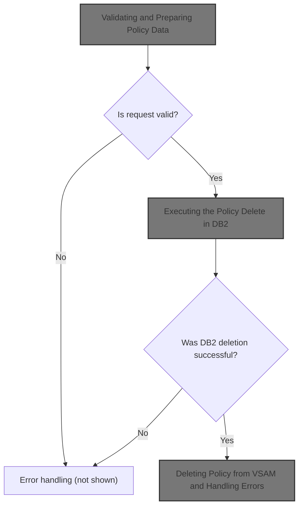
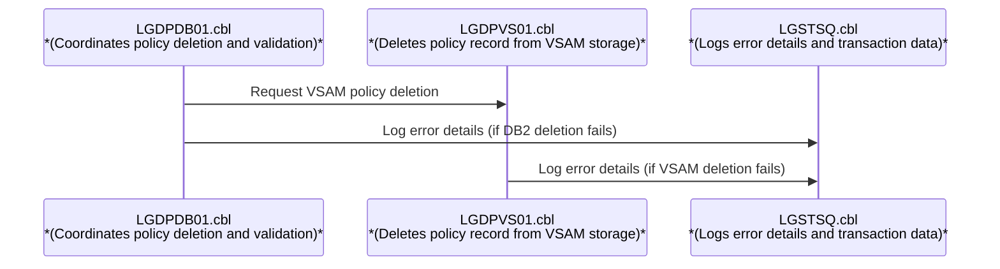
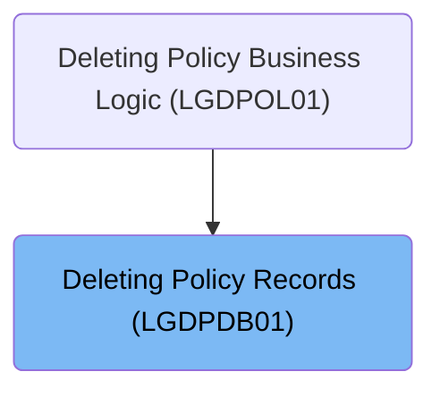
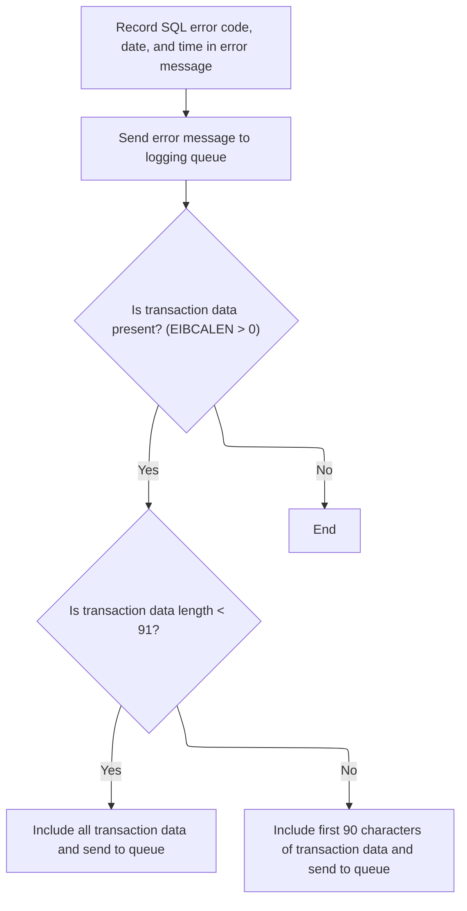
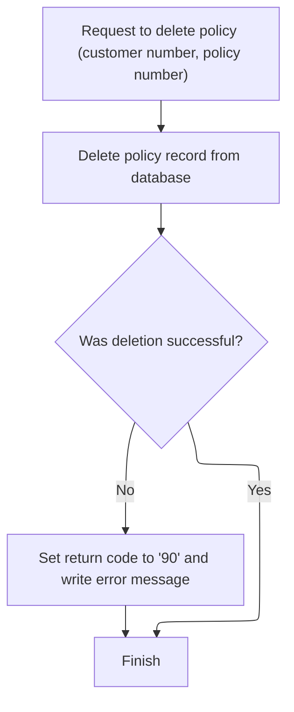
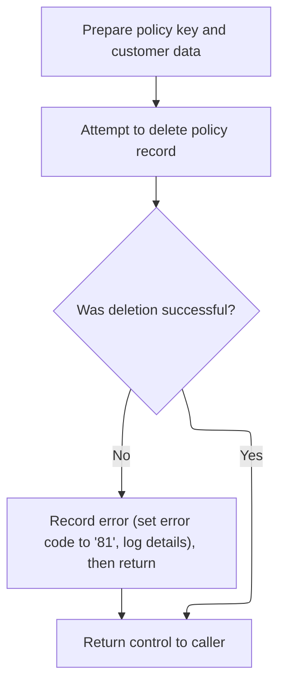

# Overview

This document explains the flow for deleting a policy record. The process receives a policy deletion request, validates the input, and coordinates the removal of the policy from both <SwmToken path="base/src/lgdpdb01.cbl" pos="124:5:5" line-data="      * initialize DB2 host variables">`DB2`</SwmToken> and VSAM storage. If any errors occur, error details and transaction data are logged.



# Technical Overview



## Dependencies

### Programs

- <SwmToken path="base/src/lgdpdb01.cbl" pos="168:9:9" line-data="               EXEC CICS LINK PROGRAM(LGDPVS01)">`LGDPVS01`</SwmToken> (<SwmPath>[base/src/lgdpvs01.cbl](base/src/lgdpvs01.cbl)</SwmPath>)
- LGSTSQ (<SwmPath>[base/src/lgstsq.cbl](base/src/lgstsq.cbl)</SwmPath>)

### Copybooks

- LGCMAREA (<SwmPath>[base/src/lgcmarea.cpy](base/src/lgcmarea.cpy)</SwmPath>)
- SQLCA

# Where is this program used?

This program is used once, as represented in the following diagram:



## Input and Output Tables/Files used in the Program

| Table / File Name | Type                                                                                                                    | Description                                                    | Usage Mode | Key Fields / Layout Highlights           |
| ----------------- | ----------------------------------------------------------------------------------------------------------------------- | -------------------------------------------------------------- | ---------- | ---------------------------------------- |
| POLICY            | <SwmToken path="base/src/lgdpdb01.cbl" pos="124:5:5" line-data="      * initialize DB2 host variables">`DB2`</SwmToken> | Insurance policy master record: customer, type, dates, payment | Output     | Database table with relational structure |

&nbsp;

## Detailed View of the Program's Functionality

# Starting the Transaction and Initializing State

At the beginning of the main program, all internal variables and structures used for processing and error handling are reset to their default states. This includes variables for tracking transaction, terminal, and task identifiers, which are copied from the system environment to local storage. These identifiers are essential for tracing and managing the transaction throughout its lifecycle.

Next, the program prepares the variables that will be used for database operations, ensuring that all fields required for interacting with the database are cleared and ready for new data.

A critical check is performed to determine if any input data (commarea) was provided to the transaction. If no input is detected, an error message is constructed and logged, and the transaction is forcibly terminated with a specific error code. This ensures that missing input scenarios are captured for later analysis.

# Capturing and Formatting Error Details

When an error occurs, a dedicated routine is invoked to record all relevant details. This routine first captures the database error code and stores it in the error message structure. It then retrieves the current date and time from the system and formats them for inclusion in the log entry, ensuring that every error is timestamped.

The error message, now containing the error code, date, time, and other context, is sent to a logging program. This program is responsible for writing the message to both transient and temporary queues, guaranteeing that the error is recorded in multiple places for reliability.

If any input data was provided to the transaction, up to 90 bytes of this data are also sent to the logging program. This allows for the input that caused the error to be captured alongside the error details, aiding in troubleshooting.

The logging program determines the source of the message data—either directly from the input area or from a system receive operation. It handles special cases where the message specifies a particular queue name, adjusts the message length accordingly, and writes the message to both the system and application queues. If the message was received from the system, a brief response is sent back to the requester.

# Validating and Preparing Policy Data

After error handling, the program resets the return code and checks if the input data is large enough to contain all required fields. If the input is too short, a specific error code is set, and the transaction is ended immediately to prevent processing incomplete data.

If the input is sufficient, the customer and policy numbers are extracted and prepared for database operations. These values are also stored in the error message structure in case an error occurs later.

The program then checks if the request type matches one of the supported operations. If the request type is not recognized, an error code is set, and no further processing occurs. If the request type is valid, the program proceeds to delete the policy information from the database and then calls a secondary program to remove the policy from a file-based storage system. Upon successful completion, a success code is returned to the caller.

# Executing the Policy Delete in <SwmToken path="base/src/lgdpdb01.cbl" pos="124:5:5" line-data="      * initialize DB2 host variables">`DB2`</SwmToken>

To delete a policy, the program sets up the error message context and executes a database command to remove the policy record based on the provided customer and policy numbers.

If the database operation fails, an error code is set, the error is logged using the previously described routine, and the transaction is ended. This ensures that any failure in the database operation is properly recorded and that no further processing occurs with invalid data.

If the database operation succeeds, the program continues with the next steps in the transaction.

# Deleting Policy from VSAM and Handling Errors

In the secondary program responsible for file-based storage, the key fields required to identify the policy record are prepared. The program then attempts to delete the policy record from the file.

If the deletion fails, a specific error code is set, and a detailed error message is constructed and logged. This message includes the date, time, customer and policy numbers, and the response codes from the file operation. Up to 90 bytes of input data are also logged if available. The transaction is then ended to prevent further processing.

If the deletion succeeds, control is returned to the caller, and the transaction completes successfully.

# Summary

The overall flow ensures that every step of the policy deletion process—from input validation to database and file operations—is carefully managed and monitored. Errors are captured with detailed context and logged reliably, and input data is preserved for troubleshooting. The system is designed to handle missing or invalid input gracefully, and to record all relevant details for both successful and failed operations.

# Data Definitions

| Table / Record Name | Type                                                                                                                    | Short Description                                              | Usage Mode      |
| ------------------- | ----------------------------------------------------------------------------------------------------------------------- | -------------------------------------------------------------- | --------------- |
| POLICY              | <SwmToken path="base/src/lgdpdb01.cbl" pos="124:5:5" line-data="      * initialize DB2 host variables">`DB2`</SwmToken> | Insurance policy master record: customer, type, dates, payment | Output (DELETE) |

&nbsp;

# Rule Definition

| Paragraph Name                                                                                                                                                                                                                                                                                                                                                                                                                       | Rule ID | Category          | Description                                                                                                                                                                                                                                                                                                                                                                                                                                                                                                                                                                                                                                                                                                                                                                                              | Conditions                                                                                                                                               | Remarks                                                                                                                                                                                                                                                                                                                                                                                                                                                                                                                                                                                                                                                                                          |
| ------------------------------------------------------------------------------------------------------------------------------------------------------------------------------------------------------------------------------------------------------------------------------------------------------------------------------------------------------------------------------------------------------------------------------------ | ------- | ----------------- | -------------------------------------------------------------------------------------------------------------------------------------------------------------------------------------------------------------------------------------------------------------------------------------------------------------------------------------------------------------------------------------------------------------------------------------------------------------------------------------------------------------------------------------------------------------------------------------------------------------------------------------------------------------------------------------------------------------------------------------------------------------------------------------------------------- | -------------------------------------------------------------------------------------------------------------------------------------------------------- | ------------------------------------------------------------------------------------------------------------------------------------------------------------------------------------------------------------------------------------------------------------------------------------------------------------------------------------------------------------------------------------------------------------------------------------------------------------------------------------------------------------------------------------------------------------------------------------------------------------------------------------------------------------------------------------------------ |
| MAINLINE SECTION (<SwmToken path="base/src/lgdpdb01.cbl" pos="13:6:6" line-data="       PROGRAM-ID. LGDPDB01.">`LGDPDB01`</SwmToken>), MAINLINE SECTION (<SwmToken path="base/src/lgdpdb01.cbl" pos="168:9:9" line-data="               EXEC CICS LINK PROGRAM(LGDPVS01)">`LGDPVS01`</SwmToken>)                                                                                                                                     | RL-001  | Data Assignment   | At the beginning of each transaction, the program must initialize all working storage variables and <SwmToken path="base/src/lgdpdb01.cbl" pos="124:5:5" line-data="      * initialize DB2 host variables">`DB2`</SwmToken> host variables to ensure a clean state for processing.                                                                                                                                                                                                                                                                                                                                                                                                                                                                                                                       | Transaction start (entry to MAINLINE section)                                                                                                            | No specific constants; all variables are set to their default or blank values.                                                                                                                                                                                                                                                                                                                                                                                                                                                                                                                                                                                                                   |
| MAINLINE SECTION (<SwmToken path="base/src/lgdpdb01.cbl" pos="13:6:6" line-data="       PROGRAM-ID. LGDPDB01.">`LGDPDB01`</SwmToken>)                                                                                                                                                                                                                                                                                                | RL-002  | Data Assignment   | The program must copy the transaction ID, terminal ID, and task ID from the CICS environment into local variables for use during processing and error reporting.                                                                                                                                                                                                                                                                                                                                                                                                                                                                                                                                                                                                                                         | Transaction start                                                                                                                                        | Transaction ID, terminal ID, and task ID are extracted from EIBTRNID, EIBTRMID, and EIBTASKN respectively.                                                                                                                                                                                                                                                                                                                                                                                                                                                                                                                                                                                       |
| MAINLINE SECTION (<SwmToken path="base/src/lgdpdb01.cbl" pos="13:6:6" line-data="       PROGRAM-ID. LGDPDB01.">`LGDPDB01`</SwmToken>)                                                                                                                                                                                                                                                                                                | RL-003  | Conditional Logic | If the input buffer length (EIBCALEN) is zero, the program must log an error message containing the SQL error code, current date, and time, then terminate the transaction.                                                                                                                                                                                                                                                                                                                                                                                                                                                                                                                                                                                                                              | EIBCALEN = 0                                                                                                                                             | Error message includes SQL error code, date, time, and program name. Message sent to LGSTSQ for logging.                                                                                                                                                                                                                                                                                                                                                                                                                                                                                                                                                                                         |
| <SwmToken path="base/src/lgdpdb01.cbl" pos="133:3:7" line-data="               PERFORM WRITE-ERROR-MESSAGE">`WRITE-ERROR-MESSAGE`</SwmToken> (<SwmToken path="base/src/lgdpdb01.cbl" pos="13:6:6" line-data="       PROGRAM-ID. LGDPDB01.">`LGDPDB01`</SwmToken>, <SwmToken path="base/src/lgdpdb01.cbl" pos="168:9:9" line-data="               EXEC CICS LINK PROGRAM(LGDPVS01)">`LGDPVS01`</SwmToken>), MAINLINE SECTION (LGSTSQ) | RL-004  | Computation       | All error messages must be sent to the error logging queue handler (LGSTSQ), which writes the message to both a transient data queue (TDQ) and a temporary storage queue (TSQ).                                                                                                                                                                                                                                                                                                                                                                                                                                                                                                                                                                                                                          | Any error condition or explicit error logging request                                                                                                    | Error message format includes date (string, 8 chars), time (string, 6 chars), program name (string, 9 chars), customer number (string, 10 chars), policy number (string, 10 chars), and error codes (SQLCODE, RESP, <SwmToken path="base/src/lgdpvs01.cbl" pos="87:9:9" line-data="             Move EIBRESP2 To WS-RESP2">`RESP2`</SwmToken> as numbers).                                                                                                                                                                                                                                                                                                                                       |
| <SwmToken path="base/src/lgdpdb01.cbl" pos="133:3:7" line-data="               PERFORM WRITE-ERROR-MESSAGE">`WRITE-ERROR-MESSAGE`</SwmToken> (<SwmToken path="base/src/lgdpdb01.cbl" pos="13:6:6" line-data="       PROGRAM-ID. LGDPDB01.">`LGDPDB01`</SwmToken>, <SwmToken path="base/src/lgdpdb01.cbl" pos="168:9:9" line-data="               EXEC CICS LINK PROGRAM(LGDPVS01)">`LGDPVS01`</SwmToken>)                            | RL-005  | Computation       | If commarea data is present, up to 90 bytes of the commarea must be included in a separate error message and sent to the error logging queue for context.                                                                                                                                                                                                                                                                                                                                                                                                                                                                                                                                                                                                                                                | EIBCALEN > 0                                                                                                                                             | If EIBCALEN < 91, use actual length; otherwise, use first 90 bytes. Message field is string, up to 90 chars.                                                                                                                                                                                                                                                                                                                                                                                                                                                                                                                                                                                     |
| MAINLINE SECTION (<SwmToken path="base/src/lgdpdb01.cbl" pos="13:6:6" line-data="       PROGRAM-ID. LGDPDB01.">`LGDPDB01`</SwmToken>)                                                                                                                                                                                                                                                                                                | RL-006  | Conditional Logic | The program must validate that the commarea length is at least 28 bytes before processing. If not, it must set the return code in the commarea to '98' and return to the caller.                                                                                                                                                                                                                                                                                                                                                                                                                                                                                                                                                                                                                         | EIBCALEN < 28                                                                                                                                            | Return code '98' is a string, 2 chars, set in commarea.                                                                                                                                                                                                                                                                                                                                                                                                                                                                                                                                                                                                                                          |
| MAINLINE SECTION (<SwmToken path="base/src/lgdpdb01.cbl" pos="13:6:6" line-data="       PROGRAM-ID. LGDPDB01.">`LGDPDB01`</SwmToken>), MAINLINE SECTION (<SwmToken path="base/src/lgdpdb01.cbl" pos="168:9:9" line-data="               EXEC CICS LINK PROGRAM(LGDPVS01)">`LGDPVS01`</SwmToken>)                                                                                                                                     | RL-007  | Data Assignment   | The program must extract the request ID, customer number, and policy number from the commarea and prepare them for use in <SwmToken path="base/src/lgdpdb01.cbl" pos="124:5:5" line-data="      * initialize DB2 host variables">`DB2`</SwmToken> operations and error message fields.                                                                                                                                                                                                                                                                                                                                                                                                                                                                                                                   | Commarea is present and valid length                                                                                                                     | Request ID (string, 6 chars), customer number (string, 10 chars), policy number (string, 10 chars).                                                                                                                                                                                                                                                                                                                                                                                                                                                                                                                                                                                              |
| MAINLINE SECTION (<SwmToken path="base/src/lgdpdb01.cbl" pos="13:6:6" line-data="       PROGRAM-ID. LGDPDB01.">`LGDPDB01`</SwmToken>)                                                                                                                                                                                                                                                                                                | RL-008  | Conditional Logic | The program must check if the request ID matches one of the supported types: <SwmToken path="base/src/lgdpdb01.cbl" pos="160:18:18" line-data="           IF ( CA-REQUEST-ID NOT EQUAL TO &#39;01DEND&#39; AND">`01DEND`</SwmToken>, <SwmToken path="base/src/lgdpdb01.cbl" pos="161:14:14" line-data="                CA-REQUEST-ID NOT EQUAL TO &#39;01DHOU&#39; AND">`01DHOU`</SwmToken>, <SwmToken path="base/src/lgdpdb01.cbl" pos="162:14:14" line-data="                CA-REQUEST-ID NOT EQUAL TO &#39;01DCOM&#39; AND">`01DCOM`</SwmToken>, or <SwmToken path="base/src/lgdpdb01.cbl" pos="163:14:14" line-data="                CA-REQUEST-ID NOT EQUAL TO &#39;01DMOT&#39; ) Then">`01DMOT`</SwmToken>. If not, it must set the return code in the commarea to '99' and return to the caller. | Request ID not in supported list                                                                                                                         | Supported request IDs: <SwmToken path="base/src/lgdpdb01.cbl" pos="160:18:18" line-data="           IF ( CA-REQUEST-ID NOT EQUAL TO &#39;01DEND&#39; AND">`01DEND`</SwmToken>, <SwmToken path="base/src/lgdpdb01.cbl" pos="161:14:14" line-data="                CA-REQUEST-ID NOT EQUAL TO &#39;01DHOU&#39; AND">`01DHOU`</SwmToken>, <SwmToken path="base/src/lgdpdb01.cbl" pos="162:14:14" line-data="                CA-REQUEST-ID NOT EQUAL TO &#39;01DCOM&#39; AND">`01DCOM`</SwmToken>, <SwmToken path="base/src/lgdpdb01.cbl" pos="163:14:14" line-data="                CA-REQUEST-ID NOT EQUAL TO &#39;01DMOT&#39; ) Then">`01DMOT`</SwmToken>. Return code '99' is a string, 2 chars. |
| <SwmToken path="base/src/lgdpdb01.cbl" pos="167:3:9" line-data="               PERFORM DELETE-POLICY-DB2-INFO">`DELETE-POLICY-DB2-INFO`</SwmToken> (<SwmToken path="base/src/lgdpdb01.cbl" pos="13:6:6" line-data="       PROGRAM-ID. LGDPDB01.">`LGDPDB01`</SwmToken>)                                                                                                                                                              | RL-009  | Computation       | If the request ID is supported, the program must attempt to delete the policy record from the <SwmToken path="base/src/lgdpdb01.cbl" pos="124:5:5" line-data="      * initialize DB2 host variables">`DB2`</SwmToken> database using the customer number and policy number.                                                                                                                                                                                                                                                                                                                                                                                                                                                                                                                              | Request ID is supported                                                                                                                                  | <SwmToken path="base/src/lgdpdb01.cbl" pos="124:5:5" line-data="      * initialize DB2 host variables">`DB2`</SwmToken> delete uses integer representations of customer and policy numbers.                                                                                                                                                                                                                                                                                                                                                                                                                                                                                                      |
| <SwmToken path="base/src/lgdpdb01.cbl" pos="167:3:9" line-data="               PERFORM DELETE-POLICY-DB2-INFO">`DELETE-POLICY-DB2-INFO`</SwmToken> (<SwmToken path="base/src/lgdpdb01.cbl" pos="13:6:6" line-data="       PROGRAM-ID. LGDPDB01.">`LGDPDB01`</SwmToken>)                                                                                                                                                              | RL-010  | Conditional Logic | If the <SwmToken path="base/src/lgdpdb01.cbl" pos="124:5:5" line-data="      * initialize DB2 host variables">`DB2`</SwmToken> delete operation fails (SQLCODE not 0), the program must set the return code in the commarea to '90', log the error with all relevant details (including SQLCODE), and return to the caller.                                                                                                                                                                                                                                                                                                                                                                                                                                                                              | SQLCODE not 0 after <SwmToken path="base/src/lgdpdb01.cbl" pos="124:5:5" line-data="      * initialize DB2 host variables">`DB2`</SwmToken> DELETE       | Return code '90' is a string, 2 chars. Error message includes SQLCODE (number, 5 digits).                                                                                                                                                                                                                                                                                                                                                                                                                                                                                                                                                                                                        |
| MAINLINE SECTION (<SwmToken path="base/src/lgdpdb01.cbl" pos="168:9:9" line-data="               EXEC CICS LINK PROGRAM(LGDPVS01)">`LGDPVS01`</SwmToken>)                                                                                                                                                                                                                                                                            | RL-011  | Computation       | If the <SwmToken path="base/src/lgdpdb01.cbl" pos="124:5:5" line-data="      * initialize DB2 host variables">`DB2`</SwmToken> delete is successful, the program must attempt to delete the policy record from the VSAM file using the appropriate key structure.                                                                                                                                                                                                                                                                                                                                                                                                                                                                                                                                        | <SwmToken path="base/src/lgdpdb01.cbl" pos="124:5:5" line-data="      * initialize DB2 host variables">`DB2`</SwmToken> delete successful                | VSAM key structure includes request ID (1 char), customer number (10 chars), policy number (10 chars).                                                                                                                                                                                                                                                                                                                                                                                                                                                                                                                                                                                           |
| MAINLINE SECTION (<SwmToken path="base/src/lgdpdb01.cbl" pos="168:9:9" line-data="               EXEC CICS LINK PROGRAM(LGDPVS01)">`LGDPVS01`</SwmToken>)                                                                                                                                                                                                                                                                            | RL-012  | Conditional Logic | If the VSAM delete operation fails, the program must set the return code in the commarea to '81', log the error with all relevant details (including VSAM response codes), and return to the caller.                                                                                                                                                                                                                                                                                                                                                                                                                                                                                                                                                                                                     | VSAM delete fails (RESP not NORMAL)                                                                                                                      | Return code '81' is a string, 2 chars. Error message includes RESP and <SwmToken path="base/src/lgdpvs01.cbl" pos="87:9:9" line-data="             Move EIBRESP2 To WS-RESP2">`RESP2`</SwmToken> (numbers, 8 digits).                                                                                                                                                                                                                                                                                                                                                                                                                                                                            |
| MAINLINE SECTION (<SwmToken path="base/src/lgdpdb01.cbl" pos="168:9:9" line-data="               EXEC CICS LINK PROGRAM(LGDPVS01)">`LGDPVS01`</SwmToken>)                                                                                                                                                                                                                                                                            | RL-013  | Data Assignment   | On successful completion of both <SwmToken path="base/src/lgdpdb01.cbl" pos="124:5:5" line-data="      * initialize DB2 host variables">`DB2`</SwmToken> and VSAM deletes, the program must set the return code in the commarea to '00' and return to the caller.                                                                                                                                                                                                                                                                                                                                                                                                                                                                                                                                        | Both <SwmToken path="base/src/lgdpdb01.cbl" pos="124:5:5" line-data="      * initialize DB2 host variables">`DB2`</SwmToken> and VSAM deletes successful | Return code '00' is a string, 2 chars.                                                                                                                                                                                                                                                                                                                                                                                                                                                                                                                                                                                                                                                           |
| <SwmToken path="base/src/lgdpdb01.cbl" pos="133:3:7" line-data="               PERFORM WRITE-ERROR-MESSAGE">`WRITE-ERROR-MESSAGE`</SwmToken> (<SwmToken path="base/src/lgdpdb01.cbl" pos="13:6:6" line-data="       PROGRAM-ID. LGDPDB01.">`LGDPDB01`</SwmToken>, <SwmToken path="base/src/lgdpdb01.cbl" pos="168:9:9" line-data="               EXEC CICS LINK PROGRAM(LGDPVS01)">`LGDPVS01`</SwmToken>)                            | RL-014  | Computation       | All error messages must include the date, time, program name, customer number, policy number, and relevant error codes (SQLCODE for <SwmToken path="base/src/lgdpdb01.cbl" pos="124:5:5" line-data="      * initialize DB2 host variables">`DB2`</SwmToken>, RESP/RESP2 for VSAM).                                                                                                                                                                                                                                                                                                                                                                                                                                                                                                                       | Any error logging event                                                                                                                                  | Date (string, 8 chars), time (string, 6 chars), program name (string, 9 chars), customer number (string, 10 chars), policy number (string, 10 chars), SQLCODE (number, 5 digits), RESP/RESP2 (number, 8 digits).                                                                                                                                                                                                                                                                                                                                                                                                                                                                                 |
| MAINLINE SECTION (LGSTSQ)                                                                                                                                                                                                                                                                                                                                                                                                            | RL-015  | Computation       | The error logging queue handler (LGSTSQ) must determine the source of the message data (commarea or CICS RECEIVE), handle queue naming prefixes, adjust message length as needed, and write the message to both TDQ and TSQ.                                                                                                                                                                                                                                                                                                                                                                                                                                                                                                                                                                             | Any message received for logging                                                                                                                         | Default queue name is GENAERRS; if Q=nnnn prefix is present, queue name is <SwmToken path="base/src/lgstsq.cbl" pos="6:19:19" line-data="      *  parm Q=nnnn is passed then Queue name GENAnnnn is used        *">`GENAnnnn`</SwmToken>. Message length is adjusted based on source and content.                                                                                                                                                                                                                                                                                                                                                                                                |
| MAINLINE SECTION (LGSTSQ)                                                                                                                                                                                                                                                                                                                                                                                                            | RL-016  | Conditional Logic | If the message was received from a requester (via RECEIVE), the handler must send a one-character response back.                                                                                                                                                                                                                                                                                                                                                                                                                                                                                                                                                                                                                                                                                         | Message source is RECEIVE (not commarea)                                                                                                                 | Response is a single character (string, 1 char).                                                                                                                                                                                                                                                                                                                                                                                                                                                                                                                                                                                                                                                 |

# User Stories

## User Story 1: Transaction Initialization and Input Validation

---

### Story Description:

As a system, I want to initialize all working storage and <SwmToken path="base/src/lgdpdb01.cbl" pos="124:5:5" line-data="      * initialize DB2 host variables">`DB2`</SwmToken> host variables, copy transaction identifiers, and validate the input buffer and commarea so that each transaction starts with a clean state and only valid requests are processed.

---

### Business Rule Mapping:

| Rule ID | Paragraph Name                                                                                                                                                                                                                                                                                   | Rule Description                                                                                                                                                                                                                                                                   |
| ------- | ------------------------------------------------------------------------------------------------------------------------------------------------------------------------------------------------------------------------------------------------------------------------------------------------ | ---------------------------------------------------------------------------------------------------------------------------------------------------------------------------------------------------------------------------------------------------------------------------------- |
| RL-001  | MAINLINE SECTION (<SwmToken path="base/src/lgdpdb01.cbl" pos="13:6:6" line-data="       PROGRAM-ID. LGDPDB01.">`LGDPDB01`</SwmToken>), MAINLINE SECTION (<SwmToken path="base/src/lgdpdb01.cbl" pos="168:9:9" line-data="               EXEC CICS LINK PROGRAM(LGDPVS01)">`LGDPVS01`</SwmToken>) | At the beginning of each transaction, the program must initialize all working storage variables and <SwmToken path="base/src/lgdpdb01.cbl" pos="124:5:5" line-data="      * initialize DB2 host variables">`DB2`</SwmToken> host variables to ensure a clean state for processing. |
| RL-002  | MAINLINE SECTION (<SwmToken path="base/src/lgdpdb01.cbl" pos="13:6:6" line-data="       PROGRAM-ID. LGDPDB01.">`LGDPDB01`</SwmToken>)                                                                                                                                                            | The program must copy the transaction ID, terminal ID, and task ID from the CICS environment into local variables for use during processing and error reporting.                                                                                                                   |
| RL-003  | MAINLINE SECTION (<SwmToken path="base/src/lgdpdb01.cbl" pos="13:6:6" line-data="       PROGRAM-ID. LGDPDB01.">`LGDPDB01`</SwmToken>)                                                                                                                                                            | If the input buffer length (EIBCALEN) is zero, the program must log an error message containing the SQL error code, current date, and time, then terminate the transaction.                                                                                                        |
| RL-006  | MAINLINE SECTION (<SwmToken path="base/src/lgdpdb01.cbl" pos="13:6:6" line-data="       PROGRAM-ID. LGDPDB01.">`LGDPDB01`</SwmToken>)                                                                                                                                                            | The program must validate that the commarea length is at least 28 bytes before processing. If not, it must set the return code in the commarea to '98' and return to the caller.                                                                                                   |

---

### Relevant Functionality:

- **MAINLINE SECTION (**<SwmToken path="base/src/lgdpdb01.cbl" pos="13:6:6" line-data="       PROGRAM-ID. LGDPDB01.">`LGDPDB01`</SwmToken>**)**
  1. **RL-001:**
     - On transaction start:
       - Set all working storage variables to initial values
       - Set <SwmToken path="base/src/lgdpdb01.cbl" pos="124:5:5" line-data="      * initialize DB2 host variables">`DB2`</SwmToken> host variables to initial values
  2. **RL-002:**
     - On transaction start:
       - Move EIBTRNID to local transaction ID variable
       - Move EIBTRMID to local terminal ID variable
       - Move EIBTASKN to local task ID variable
  3. **RL-003:**
     - If input buffer length is zero:
       - Set error message fields (SQL error code, date, time, program name)
       - Call LGSTSQ to log the error
       - Terminate transaction with ABEND
  4. **RL-006:**
     - If commarea length < 28:
       - Set return code to '98' in commarea
       - Return to caller

## User Story 2: Transaction Processing and Policy Deletion

---

### Story Description:

As a system, I want to extract request details from the commarea, validate the request type, and attempt to delete the policy record from both <SwmToken path="base/src/lgdpdb01.cbl" pos="124:5:5" line-data="      * initialize DB2 host variables">`DB2`</SwmToken> and VSAM, setting appropriate return codes and logging errors if any operation fails, so that policy records are reliably deleted and errors are handled gracefully.

---

### Business Rule Mapping:

| Rule ID | Paragraph Name                                                                                                                                                                                                                                                                                   | Rule Description                                                                                                                                                                                                                                                                                                                                                                                                                                                                                                                                                                                                                                                                                                                                                                                         |
| ------- | ------------------------------------------------------------------------------------------------------------------------------------------------------------------------------------------------------------------------------------------------------------------------------------------------ | -------------------------------------------------------------------------------------------------------------------------------------------------------------------------------------------------------------------------------------------------------------------------------------------------------------------------------------------------------------------------------------------------------------------------------------------------------------------------------------------------------------------------------------------------------------------------------------------------------------------------------------------------------------------------------------------------------------------------------------------------------------------------------------------------------- |
| RL-007  | MAINLINE SECTION (<SwmToken path="base/src/lgdpdb01.cbl" pos="13:6:6" line-data="       PROGRAM-ID. LGDPDB01.">`LGDPDB01`</SwmToken>), MAINLINE SECTION (<SwmToken path="base/src/lgdpdb01.cbl" pos="168:9:9" line-data="               EXEC CICS LINK PROGRAM(LGDPVS01)">`LGDPVS01`</SwmToken>) | The program must extract the request ID, customer number, and policy number from the commarea and prepare them for use in <SwmToken path="base/src/lgdpdb01.cbl" pos="124:5:5" line-data="      * initialize DB2 host variables">`DB2`</SwmToken> operations and error message fields.                                                                                                                                                                                                                                                                                                                                                                                                                                                                                                                   |
| RL-008  | MAINLINE SECTION (<SwmToken path="base/src/lgdpdb01.cbl" pos="13:6:6" line-data="       PROGRAM-ID. LGDPDB01.">`LGDPDB01`</SwmToken>)                                                                                                                                                            | The program must check if the request ID matches one of the supported types: <SwmToken path="base/src/lgdpdb01.cbl" pos="160:18:18" line-data="           IF ( CA-REQUEST-ID NOT EQUAL TO &#39;01DEND&#39; AND">`01DEND`</SwmToken>, <SwmToken path="base/src/lgdpdb01.cbl" pos="161:14:14" line-data="                CA-REQUEST-ID NOT EQUAL TO &#39;01DHOU&#39; AND">`01DHOU`</SwmToken>, <SwmToken path="base/src/lgdpdb01.cbl" pos="162:14:14" line-data="                CA-REQUEST-ID NOT EQUAL TO &#39;01DCOM&#39; AND">`01DCOM`</SwmToken>, or <SwmToken path="base/src/lgdpdb01.cbl" pos="163:14:14" line-data="                CA-REQUEST-ID NOT EQUAL TO &#39;01DMOT&#39; ) Then">`01DMOT`</SwmToken>. If not, it must set the return code in the commarea to '99' and return to the caller. |
| RL-009  | <SwmToken path="base/src/lgdpdb01.cbl" pos="167:3:9" line-data="               PERFORM DELETE-POLICY-DB2-INFO">`DELETE-POLICY-DB2-INFO`</SwmToken> (<SwmToken path="base/src/lgdpdb01.cbl" pos="13:6:6" line-data="       PROGRAM-ID. LGDPDB01.">`LGDPDB01`</SwmToken>)                          | If the request ID is supported, the program must attempt to delete the policy record from the <SwmToken path="base/src/lgdpdb01.cbl" pos="124:5:5" line-data="      * initialize DB2 host variables">`DB2`</SwmToken> database using the customer number and policy number.                                                                                                                                                                                                                                                                                                                                                                                                                                                                                                                              |
| RL-010  | <SwmToken path="base/src/lgdpdb01.cbl" pos="167:3:9" line-data="               PERFORM DELETE-POLICY-DB2-INFO">`DELETE-POLICY-DB2-INFO`</SwmToken> (<SwmToken path="base/src/lgdpdb01.cbl" pos="13:6:6" line-data="       PROGRAM-ID. LGDPDB01.">`LGDPDB01`</SwmToken>)                          | If the <SwmToken path="base/src/lgdpdb01.cbl" pos="124:5:5" line-data="      * initialize DB2 host variables">`DB2`</SwmToken> delete operation fails (SQLCODE not 0), the program must set the return code in the commarea to '90', log the error with all relevant details (including SQLCODE), and return to the caller.                                                                                                                                                                                                                                                                                                                                                                                                                                                                              |
| RL-011  | MAINLINE SECTION (<SwmToken path="base/src/lgdpdb01.cbl" pos="168:9:9" line-data="               EXEC CICS LINK PROGRAM(LGDPVS01)">`LGDPVS01`</SwmToken>)                                                                                                                                        | If the <SwmToken path="base/src/lgdpdb01.cbl" pos="124:5:5" line-data="      * initialize DB2 host variables">`DB2`</SwmToken> delete is successful, the program must attempt to delete the policy record from the VSAM file using the appropriate key structure.                                                                                                                                                                                                                                                                                                                                                                                                                                                                                                                                        |
| RL-012  | MAINLINE SECTION (<SwmToken path="base/src/lgdpdb01.cbl" pos="168:9:9" line-data="               EXEC CICS LINK PROGRAM(LGDPVS01)">`LGDPVS01`</SwmToken>)                                                                                                                                        | If the VSAM delete operation fails, the program must set the return code in the commarea to '81', log the error with all relevant details (including VSAM response codes), and return to the caller.                                                                                                                                                                                                                                                                                                                                                                                                                                                                                                                                                                                                     |
| RL-013  | MAINLINE SECTION (<SwmToken path="base/src/lgdpdb01.cbl" pos="168:9:9" line-data="               EXEC CICS LINK PROGRAM(LGDPVS01)">`LGDPVS01`</SwmToken>)                                                                                                                                        | On successful completion of both <SwmToken path="base/src/lgdpdb01.cbl" pos="124:5:5" line-data="      * initialize DB2 host variables">`DB2`</SwmToken> and VSAM deletes, the program must set the return code in the commarea to '00' and return to the caller.                                                                                                                                                                                                                                                                                                                                                                                                                                                                                                                                        |

---

### Relevant Functionality:

- **MAINLINE SECTION (**<SwmToken path="base/src/lgdpdb01.cbl" pos="13:6:6" line-data="       PROGRAM-ID. LGDPDB01.">`LGDPDB01`</SwmToken>**)**
  1. **RL-007:**
     - Extract request ID, customer number, and policy number from commarea
     - Assign to local variables for <SwmToken path="base/src/lgdpdb01.cbl" pos="124:5:5" line-data="      * initialize DB2 host variables">`DB2`</SwmToken> and error message use
  2. **RL-008:**
     - If request ID not supported:
       - Set return code to '99' in commarea
       - Return to caller
- <SwmToken path="base/src/lgdpdb01.cbl" pos="167:3:9" line-data="               PERFORM DELETE-POLICY-DB2-INFO">`DELETE-POLICY-DB2-INFO`</SwmToken> **(**<SwmToken path="base/src/lgdpdb01.cbl" pos="13:6:6" line-data="       PROGRAM-ID. LGDPDB01.">`LGDPDB01`</SwmToken>**)**
  1. **RL-009:**
     - If request ID is supported:
       - Convert customer and policy numbers to <SwmToken path="base/src/lgdpdb01.cbl" pos="124:5:5" line-data="      * initialize DB2 host variables">`DB2`</SwmToken> integer format
       - Execute <SwmToken path="base/src/lgdpdb01.cbl" pos="124:5:5" line-data="      * initialize DB2 host variables">`DB2`</SwmToken> DELETE statement
  2. **RL-010:**
     - If <SwmToken path="base/src/lgdpdb01.cbl" pos="124:5:5" line-data="      * initialize DB2 host variables">`DB2`</SwmToken> delete fails:
       - Set return code to '90' in commarea
       - Log error with SQLCODE and details
       - Return to caller
- **MAINLINE SECTION (**<SwmToken path="base/src/lgdpdb01.cbl" pos="168:9:9" line-data="               EXEC CICS LINK PROGRAM(LGDPVS01)">`LGDPVS01`</SwmToken>**)**
  1. **RL-011:**
     - If <SwmToken path="base/src/lgdpdb01.cbl" pos="124:5:5" line-data="      * initialize DB2 host variables">`DB2`</SwmToken> delete successful:
       - Build VSAM key from request ID, customer number, policy number
       - Execute VSAM DELETE operation
  2. **RL-012:**
     - If VSAM delete fails:
       - Set return code to '81' in commarea
       - Log error with RESP and <SwmToken path="base/src/lgdpvs01.cbl" pos="87:9:9" line-data="             Move EIBRESP2 To WS-RESP2">`RESP2`</SwmToken>
       - Return to caller
  3. **RL-013:**
     - If both deletes successful:
       - Set return code to '00' in commarea
       - Return to caller

## User Story 3: Error Logging and Queue Handling

---

### Story Description:

As a system, I want to log all error messages with relevant details, include commarea context when available, and ensure messages are written to both TDQ and TSQ via the error logging queue handler, which manages queue naming, message length, and responses to requesters, so that errors are fully documented and traceable.

---

### Business Rule Mapping:

| Rule ID | Paragraph Name                                                                                                                                                                                                                                                                                                                                                                                                                       | Rule Description                                                                                                                                                                                                                                                                   |
| ------- | ------------------------------------------------------------------------------------------------------------------------------------------------------------------------------------------------------------------------------------------------------------------------------------------------------------------------------------------------------------------------------------------------------------------------------------ | ---------------------------------------------------------------------------------------------------------------------------------------------------------------------------------------------------------------------------------------------------------------------------------- |
| RL-004  | <SwmToken path="base/src/lgdpdb01.cbl" pos="133:3:7" line-data="               PERFORM WRITE-ERROR-MESSAGE">`WRITE-ERROR-MESSAGE`</SwmToken> (<SwmToken path="base/src/lgdpdb01.cbl" pos="13:6:6" line-data="       PROGRAM-ID. LGDPDB01.">`LGDPDB01`</SwmToken>, <SwmToken path="base/src/lgdpdb01.cbl" pos="168:9:9" line-data="               EXEC CICS LINK PROGRAM(LGDPVS01)">`LGDPVS01`</SwmToken>), MAINLINE SECTION (LGSTSQ) | All error messages must be sent to the error logging queue handler (LGSTSQ), which writes the message to both a transient data queue (TDQ) and a temporary storage queue (TSQ).                                                                                                    |
| RL-005  | <SwmToken path="base/src/lgdpdb01.cbl" pos="133:3:7" line-data="               PERFORM WRITE-ERROR-MESSAGE">`WRITE-ERROR-MESSAGE`</SwmToken> (<SwmToken path="base/src/lgdpdb01.cbl" pos="13:6:6" line-data="       PROGRAM-ID. LGDPDB01.">`LGDPDB01`</SwmToken>, <SwmToken path="base/src/lgdpdb01.cbl" pos="168:9:9" line-data="               EXEC CICS LINK PROGRAM(LGDPVS01)">`LGDPVS01`</SwmToken>)                            | If commarea data is present, up to 90 bytes of the commarea must be included in a separate error message and sent to the error logging queue for context.                                                                                                                          |
| RL-014  | <SwmToken path="base/src/lgdpdb01.cbl" pos="133:3:7" line-data="               PERFORM WRITE-ERROR-MESSAGE">`WRITE-ERROR-MESSAGE`</SwmToken> (<SwmToken path="base/src/lgdpdb01.cbl" pos="13:6:6" line-data="       PROGRAM-ID. LGDPDB01.">`LGDPDB01`</SwmToken>, <SwmToken path="base/src/lgdpdb01.cbl" pos="168:9:9" line-data="               EXEC CICS LINK PROGRAM(LGDPVS01)">`LGDPVS01`</SwmToken>)                            | All error messages must include the date, time, program name, customer number, policy number, and relevant error codes (SQLCODE for <SwmToken path="base/src/lgdpdb01.cbl" pos="124:5:5" line-data="      * initialize DB2 host variables">`DB2`</SwmToken>, RESP/RESP2 for VSAM). |
| RL-015  | MAINLINE SECTION (LGSTSQ)                                                                                                                                                                                                                                                                                                                                                                                                            | The error logging queue handler (LGSTSQ) must determine the source of the message data (commarea or CICS RECEIVE), handle queue naming prefixes, adjust message length as needed, and write the message to both TDQ and TSQ.                                                       |
| RL-016  | MAINLINE SECTION (LGSTSQ)                                                                                                                                                                                                                                                                                                                                                                                                            | If the message was received from a requester (via RECEIVE), the handler must send a one-character response back.                                                                                                                                                                   |

---

### Relevant Functionality:

- <SwmToken path="base/src/lgdpdb01.cbl" pos="133:3:7" line-data="               PERFORM WRITE-ERROR-MESSAGE">`WRITE-ERROR-MESSAGE`</SwmToken> **(**<SwmToken path="base/src/lgdpdb01.cbl" pos="13:6:6" line-data="       PROGRAM-ID. LGDPDB01.">`LGDPDB01`</SwmToken>
  1. **RL-004:**
     - On error:
       - Format error message with required fields
       - Call LGSTSQ with error message
       - LGSTSQ writes message to TDQ (CSMT) and TSQ (GENAERRS or <SwmToken path="base/src/lgstsq.cbl" pos="6:19:19" line-data="      *  parm Q=nnnn is passed then Queue name GENAnnnn is used        *">`GENAnnnn`</SwmToken>)
  2. **RL-005:**
     - If commarea present:
       - If length < 91, copy actual length
       - Else, copy first 90 bytes
       - Send to LGSTSQ for logging
  3. **RL-014:**
     - On error logging:
       - Format message with all required fields
       - Send to LGSTSQ for logging
- **MAINLINE SECTION (LGSTSQ)**
  1. **RL-015:**
     - Determine if message is from commarea or RECEIVE
     - If Q=nnnn prefix present, adjust queue name
     - Adjust message length as needed
     - Write message to TDQ (CSMT) and TSQ (GENAERRS/GENAnnnn)
  2. **RL-016:**
     - If message source is RECEIVE:
       - Send one-character response back to requester

# Workflow

# Starting the Transaction and Initializing State

This section is responsible for setting up the initial state for a transaction, ensuring all required context and variables are available for downstream processing, and handling the scenario where required input is missing.

| Category        | Rule Name                           | Description                                                                                                                                                                                                                                                            |
| --------------- | ----------------------------------- | ---------------------------------------------------------------------------------------------------------------------------------------------------------------------------------------------------------------------------------------------------------------------- |
| Data validation | Mandatory input enforcement         | If no commarea is received (EIBCALEN = 0), an error message must be logged and the transaction must be abended to prevent processing without required input.                                                                                                           |
| Data validation | Minimum commarea length requirement | The minimum required commarea length for processing must be +28 bytes, as defined by <SwmToken path="base/src/lgdpdb01.cbl" pos="143:11:17" line-data="           IF EIBCALEN IS LESS THAN WS-CA-HEADER-LEN">`WS-CA-HEADER-LEN`</SwmToken>.                            |
| Business logic  | Initialize transaction context      | All working storage variables and <SwmToken path="base/src/lgdpdb01.cbl" pos="124:5:5" line-data="      * initialize DB2 host variables">`DB2`</SwmToken> host variables must be initialized at the start of the transaction to ensure a clean context for processing. |
| Business logic  | Capture transaction identifiers     | Transaction, terminal, and task IDs must be copied from the CICS environment into local variables to uniquely identify and track the transaction throughout its lifecycle.                                                                                             |

<SwmSnippet path="/base/src/lgdpdb01.cbl" line="111">

---

In <SwmToken path="base/src/lgdpdb01.cbl" pos="111:1:1" line-data="       MAINLINE SECTION.">`MAINLINE`</SwmToken>, we kick off the flow by initializing all the working storage and <SwmToken path="base/src/lgdpdb01.cbl" pos="124:5:5" line-data="      * initialize DB2 host variables">`DB2`</SwmToken> host variables, and copying the transaction, terminal, and task IDs from the CICS environment into local variables. This sets up the context for everything that follows, including error handling and <SwmToken path="base/src/lgdpdb01.cbl" pos="124:5:5" line-data="      * initialize DB2 host variables">`DB2`</SwmToken> operations.

```cobol
       MAINLINE SECTION.

      *----------------------------------------------------------------*
      * Common code                                                    *
      *----------------------------------------------------------------*
      * initialize working storage variables
           INITIALIZE WS-HEADER.
      * set up general variable
           MOVE EIBTRNID TO WS-TRANSID.
           MOVE EIBTRMID TO WS-TERMID.
           MOVE EIBTASKN TO WS-TASKNUM.
      *----------------------------------------------------------------*

      * initialize DB2 host variables
           INITIALIZE DB2-IN-INTEGERS.
```

---

</SwmSnippet>

<SwmSnippet path="/base/src/lgdpdb01.cbl" line="131">

---

If no commarea is received (EIBCALEN = 0), we log an error message with <SwmToken path="base/src/lgdpdb01.cbl" pos="133:3:7" line-data="               PERFORM WRITE-ERROR-MESSAGE">`WRITE-ERROR-MESSAGE`</SwmToken> and then abend the transaction. This makes sure we capture the missing input scenario for later review.

```cobol
           IF EIBCALEN IS EQUAL TO ZERO
               MOVE ' NO COMMAREA RECEIVED' TO EM-VARIABLE
               PERFORM WRITE-ERROR-MESSAGE
               EXEC CICS ABEND ABCODE('LGCA') NODUMP END-EXEC
           END-IF
```

---

</SwmSnippet>

## Capturing and Formatting Error Details



This section ensures that all relevant error details are captured and logged in a consistent format, enabling effective error tracking and troubleshooting. It also ensures that transaction data triggering the error is included in the log entry, up to a defined maximum length.

| Category       | Rule Name                  | Description                                                                                                                                                                                                                           |
| -------------- | -------------------------- | ------------------------------------------------------------------------------------------------------------------------------------------------------------------------------------------------------------------------------------- |
| Business logic | Error message traceability | Whenever an SQL error occurs, the error message must include the SQL error code, the current date, and the current time to ensure traceability.                                                                                       |
| Business logic | Transaction data inclusion | If transaction data is present, up to 90 bytes of this data must be included in the error message for logging. If the transaction data is less than 91 bytes, all of it is included; otherwise, only the first 90 bytes are included. |
| Business logic | Error log redundancy       | Error messages must be sent to both the transient data queue (TDQ) and the temporary storage queue (TSQ) to ensure redundancy and prevent loss of error logs.                                                                         |
| Business logic | Error receipt confirmation | If the error message is received via CICS RECEIVE, a one-character response must be sent back to the requester to confirm receipt.                                                                                                    |
| Business logic | Queue extension extraction | If the transaction data starts with the prefix 'Q=', the next four characters must be extracted as an extension and the remaining message adjusted accordingly.                                                                       |

<SwmSnippet path="/base/src/lgdpdb01.cbl" line="212">

---

In <SwmToken path="base/src/lgdpdb01.cbl" pos="212:1:5" line-data="       WRITE-ERROR-MESSAGE.">`WRITE-ERROR-MESSAGE`</SwmToken>, we grab the SQLCODE and stick it in the error message, then fetch and format the current time and date so the log entry is timestamped. This sets up all the details we need for tracking what happened and when.

```cobol
       WRITE-ERROR-MESSAGE.
      * Save SQLCODE in message
           MOVE SQLCODE TO EM-SQLRC
      * Obtain and format current time and date
           EXEC CICS ASKTIME ABSTIME(WS-ABSTIME)
           END-EXEC
           EXEC CICS FORMATTIME ABSTIME(Ws-ABSTIME)
                     MMDDYYYY(WS-DATE)
                     TIME(WS-TIME)
           END-EXEC
```

---

</SwmSnippet>

<SwmSnippet path="/base/src/lgdpdb01.cbl" line="222">

---

After formatting the error details, we send the message to LGSTSQ. That program actually writes the error to the system queues, so the log entry doesn't get lost.

```cobol
           MOVE WS-DATE TO EM-DATE
           MOVE WS-TIME TO EM-TIME
      * Write output message to TDQ
           EXEC CICS LINK PROGRAM('LGSTSQ')
                     COMMAREA(ERROR-MSG)
                     LENGTH(LENGTH OF ERROR-MSG)
           END-EXEC.
```

---

</SwmSnippet>

<SwmSnippet path="/base/src/lgstsq.cbl" line="55">

---

In <SwmToken path="base/src/lgstsq.cbl" pos="55:1:1" line-data="       MAINLINE SECTION.">`MAINLINE`</SwmToken> of LGSTSQ, we decide where the message data comes from (either <SwmToken path="base/src/lgstsq.cbl" pos="70:3:5" line-data="              MOVE COMMA-DATA  TO WRITE-MSG-MSG">`COMMA-DATA`</SwmToken> or a CICS RECEIVE), handle any special 'Q=' prefix, adjust message length, and then write the message to both TDQ and TSQ. If the message was received, we send a one-character response back to the requester.

```cobol
       MAINLINE SECTION.

           MOVE SPACES TO WRITE-MSG.
           MOVE SPACES TO WS-RECV.

           EXEC CICS ASSIGN SYSID(WRITE-MSG-SYSID)
                RESP(WS-RESP)
           END-EXEC.

           EXEC CICS ASSIGN INVOKINGPROG(WS-INVOKEPROG)
                RESP(WS-RESP)
           END-EXEC.
           
           IF WS-INVOKEPROG NOT = SPACES
              MOVE 'C' To WS-FLAG
              MOVE COMMA-DATA  TO WRITE-MSG-MSG
              MOVE EIBCALEN    TO WS-RECV-LEN
           ELSE
              EXEC CICS RECEIVE INTO(WS-RECV)
                  LENGTH(WS-RECV-LEN)
                  RESP(WS-RESP)
              END-EXEC
              MOVE 'R' To WS-FLAG
              MOVE WS-RECV-DATA  TO WRITE-MSG-MSG
              SUBTRACT 5 FROM WS-RECV-LEN
           END-IF.

           MOVE 'GENAERRS' TO STSQ-NAME.
           IF WRITE-MSG-MSG(1:2) = 'Q=' THEN
              MOVE WRITE-MSG-MSG(3:4) TO STSQ-EXT
              MOVE WRITE-MSG-REST TO TEMPO
              MOVE TEMPO          TO WRITE-MSG-MSG
              SUBTRACT 7 FROM WS-RECV-LEN
           END-IF.

           ADD 5 TO WS-RECV-LEN.

      * Write output message to TDQ CSMT
      *
           EXEC CICS WRITEQ TD QUEUE(STDQ-NAME)
                     FROM(WRITE-MSG)
                     RESP(WS-RESP)
                     LENGTH(WS-RECV-LEN)

           END-EXEC.

      * Write output message to Genapp TSQ
      * If no space is available then the task will not wait for
      *  storage to become available but will ignore the request...
      *
           EXEC CICS WRITEQ TS QUEUE(STSQ-NAME)
                     FROM(WRITE-MSG)
                     RESP(WS-RESP)
                     NOSUSPEND
                     LENGTH(WS-RECV-LEN)

           END-EXEC.

           If WS-FLAG = 'R' Then
             EXEC CICS SEND TEXT FROM(FILLER-X)
              WAIT
              ERASE
              LENGTH(1)
              FREEKB
             END-EXEC.

           EXEC CICS RETURN
           END-EXEC.
```

---

</SwmSnippet>

<SwmSnippet path="/base/src/lgdpdb01.cbl" line="230">

---

After returning from LGSTSQ, <SwmToken path="base/src/lgdpdb01.cbl" pos="133:3:7" line-data="               PERFORM WRITE-ERROR-MESSAGE">`WRITE-ERROR-MESSAGE`</SwmToken> checks if there's any commarea data. If so, it copies up to 90 bytes and sends it to LGSTSQ for logging. This makes sure we capture the input that triggered the error, even if it's partial.

```cobol
           IF EIBCALEN > 0 THEN
             IF EIBCALEN < 91 THEN
               MOVE DFHCOMMAREA(1:EIBCALEN) TO CA-DATA
               EXEC CICS LINK PROGRAM('LGSTSQ')
                         COMMAREA(CA-ERROR-MSG)
                         LENGTH(LENGTH OF CA-ERROR-MSG)
               END-EXEC
             ELSE
               MOVE DFHCOMMAREA(1:90) TO CA-DATA
               EXEC CICS LINK PROGRAM('LGSTSQ')
                         COMMAREA(CA-ERROR-MSG)
                         LENGTH(LENGTH OF CA-ERROR-MSG)
               END-EXEC
             END-IF
           END-IF.
           EXIT.
```

---

</SwmSnippet>

## Validating and Preparing Policy Data

```mermaid
%%{init: {"flowchart": {"defaultRenderer": "elk"}} }%%
flowchart TD
    node1["Start MAINLINE processing"] --> node2{"Is commarea large enough? (EIBCALEN >= 28)"}
    click node1 openCode "base/src/lgdpdb01.cbl:138:139"
    node2 -->|"No"| node3["Set error code '98', return to caller"]
    click node2 openCode "base/src/lgdpdb01.cbl:143:146"
    click node3 openCode "base/src/lgdpdb01.cbl:144:145"
    node2 -->|"Yes"| node4["Prepare customer and policy info for DB2 and error message"]
    click node4 openCode "base/src/lgdpdb01.cbl:149:153"
    node4 --> node5{"Is request type supported? (01DEND, 01DHOU, 01DCOM, 01DMOT)"}
    click node5 openCode "base/src/lgdpdb01.cbl:160:163"
    node5 -->|"No"| node6["Set error code '99', return to caller"]
    click node6 openCode "base/src/lgdpdb01.cbl:165:166"
    node5 -->|"Yes"| node7["Delete policy info, process request with LGDPVS01, return success ('00')"]
    click node7 openCode "base/src/lgdpdb01.cbl:167:171"
    node7 --> node8["Return to caller"]
    click node8 openCode "base/src/lgdpdb01.cbl:175:175"
    node3 --> node8
    node6 --> node8

classDef HeadingStyle fill:#777777,stroke:#333,stroke-width:2px;

%% Swimm:
%% %%{init: {"flowchart": {"defaultRenderer": "elk"}} }%%
%% flowchart TD
%%     node1["Start MAINLINE processing"] --> node2{"Is commarea large enough? (EIBCALEN >= 28)"}
%%     click node1 openCode "<SwmPath>[base/src/lgdpdb01.cbl](base/src/lgdpdb01.cbl)</SwmPath>:138:139"
%%     node2 -->|"No"| node3["Set error code '98', return to caller"]
%%     click node2 openCode "<SwmPath>[base/src/lgdpdb01.cbl](base/src/lgdpdb01.cbl)</SwmPath>:143:146"
%%     click node3 openCode "<SwmPath>[base/src/lgdpdb01.cbl](base/src/lgdpdb01.cbl)</SwmPath>:144:145"
%%     node2 -->|"Yes"| node4["Prepare customer and policy info for <SwmToken path="base/src/lgdpdb01.cbl" pos="124:5:5" line-data="      * initialize DB2 host variables">`DB2`</SwmToken> and error message"]
%%     click node4 openCode "<SwmPath>[base/src/lgdpdb01.cbl](base/src/lgdpdb01.cbl)</SwmPath>:149:153"
%%     node4 --> node5{"Is request type supported? (<SwmToken path="base/src/lgdpdb01.cbl" pos="160:18:18" line-data="           IF ( CA-REQUEST-ID NOT EQUAL TO &#39;01DEND&#39; AND">`01DEND`</SwmToken>, <SwmToken path="base/src/lgdpdb01.cbl" pos="161:14:14" line-data="                CA-REQUEST-ID NOT EQUAL TO &#39;01DHOU&#39; AND">`01DHOU`</SwmToken>, <SwmToken path="base/src/lgdpdb01.cbl" pos="162:14:14" line-data="                CA-REQUEST-ID NOT EQUAL TO &#39;01DCOM&#39; AND">`01DCOM`</SwmToken>, <SwmToken path="base/src/lgdpdb01.cbl" pos="163:14:14" line-data="                CA-REQUEST-ID NOT EQUAL TO &#39;01DMOT&#39; ) Then">`01DMOT`</SwmToken>)"}
%%     click node5 openCode "<SwmPath>[base/src/lgdpdb01.cbl](base/src/lgdpdb01.cbl)</SwmPath>:160:163"
%%     node5 -->|"No"| node6["Set error code '99', return to caller"]
%%     click node6 openCode "<SwmPath>[base/src/lgdpdb01.cbl](base/src/lgdpdb01.cbl)</SwmPath>:165:166"
%%     node5 -->|"Yes"| node7["Delete policy info, process request with <SwmToken path="base/src/lgdpdb01.cbl" pos="168:9:9" line-data="               EXEC CICS LINK PROGRAM(LGDPVS01)">`LGDPVS01`</SwmToken>, return success ('00')"]
%%     click node7 openCode "<SwmPath>[base/src/lgdpdb01.cbl](base/src/lgdpdb01.cbl)</SwmPath>:167:171"
%%     node7 --> node8["Return to caller"]
%%     click node8 openCode "<SwmPath>[base/src/lgdpdb01.cbl](base/src/lgdpdb01.cbl)</SwmPath>:175:175"
%%     node3 --> node8
%%     node6 --> node8
%% 
%% classDef HeadingStyle fill:#777777,stroke:#333,stroke-width:2px;
```



<SwmSnippet path="/base/src/lgdpdb01.cbl" line="138">

---

Back in MAINLINE, after error handling, we reset the return code and check if the commarea is big enough. If not, we bail out with a specific error code so we don't process incomplete data.

```cobol
           MOVE '00' TO CA-RETURN-CODE
           MOVE EIBCALEN TO WS-CALEN.
           SET WS-ADDR-DFHCOMMAREA TO ADDRESS OF DFHCOMMAREA.

      * Check commarea is large enough
           IF EIBCALEN IS LESS THAN WS-CA-HEADER-LEN
             MOVE '98' TO CA-RETURN-CODE
             EXEC CICS RETURN END-EXEC
           END-IF
```

---

</SwmSnippet>

<SwmSnippet path="/base/src/lgdpdb01.cbl" line="149">

---

Here we copy the customer and policy numbers into <SwmToken path="base/src/lgdpdb01.cbl" pos="149:11:11" line-data="           MOVE CA-CUSTOMER-NUM TO DB2-CUSTOMERNUM-INT">`DB2`</SwmToken> input fields and also into the error message fields. This sets up both the <SwmToken path="base/src/lgdpdb01.cbl" pos="149:11:11" line-data="           MOVE CA-CUSTOMER-NUM TO DB2-CUSTOMERNUM-INT">`DB2`</SwmToken> delete and any error logging that might happen if things go wrong.

```cobol
           MOVE CA-CUSTOMER-NUM TO DB2-CUSTOMERNUM-INT
           MOVE CA-POLICY-NUM   TO DB2-POLICYNUM-INT
      * and save in error msg field incase required
           MOVE CA-CUSTOMER-NUM TO EM-CUSNUM
           MOVE CA-POLICY-NUM   TO EM-POLNUM
```

---

</SwmSnippet>

<SwmSnippet path="/base/src/lgdpdb01.cbl" line="160">

---

We check if the request ID matches a supported type. If not, we set an error code and skip the delete. Otherwise, we call <SwmToken path="base/src/lgdpdb01.cbl" pos="167:3:9" line-data="               PERFORM DELETE-POLICY-DB2-INFO">`DELETE-POLICY-DB2-INFO`</SwmToken> to actually remove the policy from the database.

```cobol
           IF ( CA-REQUEST-ID NOT EQUAL TO '01DEND' AND
                CA-REQUEST-ID NOT EQUAL TO '01DHOU' AND
                CA-REQUEST-ID NOT EQUAL TO '01DCOM' AND
                CA-REQUEST-ID NOT EQUAL TO '01DMOT' ) Then
      *        Request is not recognised or supported
               MOVE '99' TO CA-RETURN-CODE
           ELSE
               PERFORM DELETE-POLICY-DB2-INFO
               EXEC CICS LINK PROGRAM(LGDPVS01)
                    Commarea(DFHCOMMAREA)
                    LENGTH(32500)
               END-EXEC
           END-IF.

      * Return to caller
           EXEC CICS RETURN END-EXEC.
```

---

</SwmSnippet>

# Executing the Policy Delete in <SwmToken path="base/src/lgdpdb01.cbl" pos="124:5:5" line-data="      * initialize DB2 host variables">`DB2`</SwmToken>



This section governs the business logic for deleting a policy record from the <SwmToken path="base/src/lgdpdb01.cbl" pos="124:5:5" line-data="      * initialize DB2 host variables">`DB2`</SwmToken> database, ensuring that only valid requests are processed and that errors are handled and communicated appropriately.

| Category        | Rule Name                      | Description                                                                                                                                           |
| --------------- | ------------------------------ | ----------------------------------------------------------------------------------------------------------------------------------------------------- |
| Data validation | Valid policy identification    | A policy can only be deleted if both a valid customer number and policy number are provided in the request.                                           |
| Business logic  | Successful deletion completion | If the policy record is successfully deleted from the database, the process completes without error and no return code is set.                        |
| Business logic  | Error message context          | The error message for a failed deletion must include the customer number, policy number, SQL request type ('DELETE POLICY'), and the SQL return code. |

<SwmSnippet path="/base/src/lgdpdb01.cbl" line="186">

---

In <SwmToken path="base/src/lgdpdb01.cbl" pos="186:1:7" line-data="       DELETE-POLICY-DB2-INFO.">`DELETE-POLICY-DB2-INFO`</SwmToken>, we set up the error message context and run the SQL delete for the policy. This is the actual <SwmToken path="base/src/lgdpdb01.cbl" pos="186:5:5" line-data="       DELETE-POLICY-DB2-INFO.">`DB2`</SwmToken> operation that removes the record.

```cobol
       DELETE-POLICY-DB2-INFO.

           MOVE ' DELETE POLICY  ' TO EM-SQLREQ
           EXEC SQL
             DELETE
               FROM POLICY
               WHERE ( CUSTOMERNUMBER = :DB2-CUSTOMERNUM-INT AND
                       POLICYNUMBER  = :DB2-POLICYNUM-INT      )
           END-EXEC
```

---

</SwmSnippet>

<SwmSnippet path="/base/src/lgdpdb01.cbl" line="198">

---

If the <SwmToken path="base/src/lgdpdb01.cbl" pos="124:5:5" line-data="      * initialize DB2 host variables">`DB2`</SwmToken> delete fails, we set an error code, log the error with <SwmToken path="base/src/lgdpdb01.cbl" pos="200:3:7" line-data="               PERFORM WRITE-ERROR-MESSAGE">`WRITE-ERROR-MESSAGE`</SwmToken>, and return. This makes sure the failure is tracked and we don't keep going with bad data.

```cobol
           IF SQLCODE NOT EQUAL 0 Then
               MOVE '90' TO CA-RETURN-CODE
               PERFORM WRITE-ERROR-MESSAGE
               EXEC CICS RETURN END-EXEC
           END-IF.

           EXIT.
```

---

</SwmSnippet>

# Deleting Policy from VSAM and Handling Errors



This section governs the process of deleting a policy record from the VSAM file and ensures that any errors encountered during the deletion are properly logged and communicated back to the caller.

| Category        | Rule Name                  | Description                                                                                                        |
| --------------- | -------------------------- | ------------------------------------------------------------------------------------------------------------------ |
| Data validation | Key field preparation      | Prepare the key fields (request ID, policy number, customer number) before attempting to delete the policy record. |
| Business logic  | Successful deletion return | If the policy deletion is successful, return control to the caller without logging any errors.                     |

<SwmSnippet path="/base/src/lgdpvs01.cbl" line="72">

---

In MAINLINE of <SwmToken path="base/src/lgdpdb01.cbl" pos="168:9:9" line-data="               EXEC CICS LINK PROGRAM(LGDPVS01)">`LGDPVS01`</SwmToken>, we prep the key fields for the VSAM delete and run the CICS delete. If it fails, we set <SwmToken path="base/src/lgdpvs01.cbl" pos="88:9:13" line-data="             MOVE &#39;81&#39; TO CA-RETURN-CODE">`CA-RETURN-CODE`</SwmToken> to '81', log the error, and return. The error code is specific to this failure type.

```cobol
       MAINLINE SECTION.
      *
      *---------------------------------------------------------------*
           Move EIBCALEN To WS-Commarea-Len.
      *---------------------------------------------------------------*
           Move CA-Request-ID(4:1) To WF-Request-ID
           Move CA-Policy-Num      To WF-Policy-Num
           Move CA-Customer-Num    To WF-Customer-Num
      *---------------------------------------------------------------*
           Exec CICS Delete File('KSDSPOLY')
                     Ridfld(WF-Policy-Key)
                     KeyLength(21)
                     RESP(WS-RESP)
           End-Exec.
           If WS-RESP Not = DFHRESP(NORMAL)
             Move EIBRESP2 To WS-RESP2
             MOVE '81' TO CA-RETURN-CODE
             PERFORM WRITE-ERROR-MESSAGE
             EXEC CICS RETURN END-EXEC
           End-If.
```

---

</SwmSnippet>

<SwmSnippet path="/base/src/lgdpvs01.cbl" line="99">

---

In <SwmToken path="base/src/lgdpvs01.cbl" pos="99:1:5" line-data="       WRITE-ERROR-MESSAGE.">`WRITE-ERROR-MESSAGE`</SwmToken>, we format the error details, send them to LGSTSQ, and then, if there's commarea data, we copy up to 90 bytes and send that too. This makes sure both the error and the input context are logged, but we cap the input data to avoid buffer overruns.

```cobol
       WRITE-ERROR-MESSAGE.
           EXEC CICS ASKTIME ABSTIME(WS-ABSTIME)
           END-EXEC
           EXEC CICS FORMATTIME ABSTIME(WS-ABSTIME)
                     MMDDYYYY(WS-DATE)
                     TIME(WS-TIME)
           END-EXEC
      *
           MOVE WS-DATE TO EM-DATE
           MOVE WS-TIME TO EM-TIME
           Move CA-Customer-Num To EM-CUSNUM 
           Move CA-POLICY-NUM To EM-POLNUM 
           Move WS-RESP         To EM-RespRC
           Move WS-RESP2        To EM-Resp2RC
           EXEC CICS LINK PROGRAM('LGSTSQ')
                     COMMAREA(ERROR-MSG)
                     LENGTH(LENGTH OF ERROR-MSG)
           END-EXEC.
           IF EIBCALEN > 0 THEN
             IF EIBCALEN < 91 THEN
               MOVE DFHCOMMAREA(1:EIBCALEN) TO CA-DATA
               EXEC CICS LINK PROGRAM('LGSTSQ')
                         COMMAREA(CA-ERROR-MSG)
                         LENGTH(Length Of CA-ERROR-MSG)
               END-EXEC
             ELSE
               MOVE DFHCOMMAREA(1:90) TO CA-DATA
               EXEC CICS LINK PROGRAM('LGSTSQ')
                         COMMAREA(CA-ERROR-MSG)
                         LENGTH(Length Of CA-ERROR-MSG)
               END-EXEC
             END-IF
           END-IF.
           EXIT.
```

---

</SwmSnippet>

&nbsp;

*This is an auto-generated document by Swimm 🌊 and has not yet been verified by a human*

<SwmMeta version="3.0.0" repo-id="Z2l0aHViJTNBJTNBU3dpbW1pby1nZW5hcHAtbW90b3IlM0ElM0FHaXJpLVN3aW1t" repo-name="Swimmio-genapp-motor"><sup>Powered by [Swimm](https://app.swimm.io/)</sup></SwmMeta>
