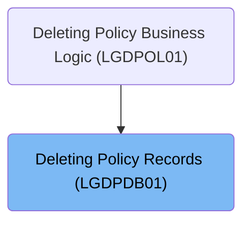
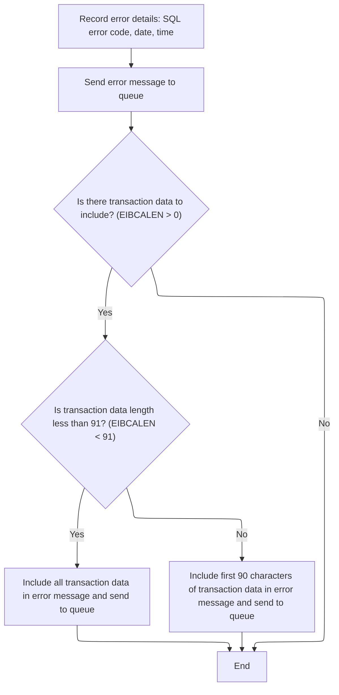
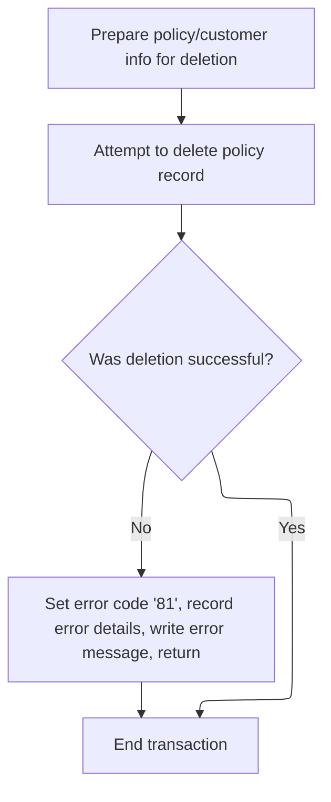

```mermaid
%%{init: {"flowchart": {"defaultRenderer": "elk"}} }%%
flowchart TD
    node1["Start MAINLINE processing"] --> node2{"Is commarea large enough? (EIBCALEN >= 28)"}
    click node1 openCode "base/src/lgdpdb01.cbl:138:141"
    node2 -->|"No"| node3["Set CA-RETURN-CODE to '98' (commarea too small) and return"]
    click node2 openCode "base/src/lgdpdb01.cbl:143:146"
    click node3 openCode "base/src/lgdpdb01.cbl:144:145"
    node2 -->|"Yes"| node4["Set up customer and policy variables (DB2 and error message fields)"]
    click node4 openCode "base/src/lgdpdb01.cbl:149:153"
    node4 --> node5{"Is request type supported? (01DEND, 01DHOU, 01DCOM, 01DMOT)"}
    click node5 openCode "base/src/lgdpdb01.cbl:160:163"
    node5 -->|"No"| node6["Set CA-RETURN-CODE to '99' (unsupported request) and return"]
    click node6 openCode "base/src/lgdpdb01.cbl:165:175"
    node5 -->|"Yes"| node7["Delete policy info and delegate request to handler"]
    click node7 openCode "base/src/lgdpdb01.cbl:167:171"
    node7 --> node8["Return to caller"]
    click node8 openCode "base/src/lgdpdb01.cbl:175:175"
classDef HeadingStyle fill:#777777,stroke:#333,stroke-width:2px;

%% Swimm:
%% %%{init: {"flowchart": {"defaultRenderer": "elk"}} }%%
%% flowchart TD
%%     node1["Start MAINLINE processing"] --> node2{"Is commarea large enough? (EIBCALEN >= 28)"}
%%     click node1 openCode "<SwmPath>[base/src/lgdpdb01.cbl](base/src/lgdpdb01.cbl)</SwmPath>:138:141"
%%     node2 -->|"No"| node3["Set <SwmToken path="base/src/lgdpdb01.cbl" pos="138:9:13" line-data="           MOVE &#39;00&#39; TO CA-RETURN-CODE">`CA-RETURN-CODE`</SwmToken> to '98' (commarea too small) and return"]
%%     click node2 openCode "<SwmPath>[base/src/lgdpdb01.cbl](base/src/lgdpdb01.cbl)</SwmPath>:143:146"
%%     click node3 openCode "<SwmPath>[base/src/lgdpdb01.cbl](base/src/lgdpdb01.cbl)</SwmPath>:144:145"
%%     node2 -->|"Yes"| node4["Set up customer and policy variables (<SwmToken path="base/src/lgdpdb01.cbl" pos="124:5:5" line-data="      * initialize DB2 host variables">`DB2`</SwmToken> and error message fields)"]
%%     click node4 openCode "<SwmPath>[base/src/lgdpdb01.cbl](base/src/lgdpdb01.cbl)</SwmPath>:149:153"
%%     node4 --> node5{"Is request type supported? (<SwmToken path="base/src/lgdpdb01.cbl" pos="160:18:18" line-data="           IF ( CA-REQUEST-ID NOT EQUAL TO &#39;01DEND&#39; AND">`01DEND`</SwmToken>, <SwmToken path="base/src/lgdpdb01.cbl" pos="161:14:14" line-data="                CA-REQUEST-ID NOT EQUAL TO &#39;01DHOU&#39; AND">`01DHOU`</SwmToken>, <SwmToken path="base/src/lgdpdb01.cbl" pos="162:14:14" line-data="                CA-REQUEST-ID NOT EQUAL TO &#39;01DCOM&#39; AND">`01DCOM`</SwmToken>, <SwmToken path="base/src/lgdpdb01.cbl" pos="163:14:14" line-data="                CA-REQUEST-ID NOT EQUAL TO &#39;01DMOT&#39; ) Then">`01DMOT`</SwmToken>)"}
%%     click node5 openCode "<SwmPath>[base/src/lgdpdb01.cbl](base/src/lgdpdb01.cbl)</SwmPath>:160:163"
%%     node5 -->|"No"| node6["Set <SwmToken path="base/src/lgdpdb01.cbl" pos="138:9:13" line-data="           MOVE &#39;00&#39; TO CA-RETURN-CODE">`CA-RETURN-CODE`</SwmToken> to '99' (unsupported request) and return"]
%%     click node6 openCode "<SwmPath>[base/src/lgdpdb01.cbl](base/src/lgdpdb01.cbl)</SwmPath>:165:175"
%%     node5 -->|"Yes"| node7["Delete policy info and delegate request to handler"]
%%     click node7 openCode "<SwmPath>[base/src/lgdpdb01.cbl](base/src/lgdpdb01.cbl)</SwmPath>:167:171"
%%     node7 --> node8["Return to caller"]
%%     click node8 openCode "<SwmPath>[base/src/lgdpdb01.cbl](base/src/lgdpdb01.cbl)</SwmPath>:175:175"
%% classDef HeadingStyle fill:#777777,stroke:#333,stroke-width:2px;
```

# Overview

```mermaid
flowchart TD
    node1["Validating commarea and prepping DB2 input
(Validating commarea and prepping DB2 input)"]:::HeadingStyle --> node2{"Is commarea valid and request type supported?
(Validating commarea and prepping DB2 input)"}:::HeadingStyle
    node2 -->|"No"|node3["Error: Invalid request
(Validating commarea and prepping DB2 input)"]:::HeadingStyle
    node2 -->|"Yes"|node4["Deleting policy record from DB2 and handling errors
(Deleting policy record from DB2 and handling errors)"]:::HeadingStyle
    node4 --> node5{"Did DB2 deletion succeed?
(Deleting policy record from DB2 and handling errors)"}:::HeadingStyle
    node5 -->|"No"|node6["Error: DB2 deletion failed
(Deleting policy record from DB2 and handling errors)"]:::HeadingStyle
    node5 -->|"Yes"|node7["Deleting policy record from VSAM and error reporting
(Deleting policy record from VSAM and error reporting)"]:::HeadingStyle
    node7 --> node8{"Did VSAM deletion succeed?
(Deleting policy record from VSAM and error reporting)"}:::HeadingStyle
    node8 -->|"No"|node9["Error: VSAM deletion failed
(Deleting policy record from VSAM and error reporting)"]:::HeadingStyle
    node8 -->|"Yes"|node10["Policy record deleted
(Deleting policy record from VSAM and error reporting)"]:::HeadingStyle

    click node1 goToHeading "Validating commarea and prepping DB2 input"
    click node2 goToHeading "Validating commarea and prepping DB2 input"
    click node3 goToHeading "Validating commarea and prepping DB2 input"
    click node4 goToHeading "Deleting policy record from DB2 and handling errors"
    click node5 goToHeading "Deleting policy record from DB2 and handling errors"
    click node6 goToHeading "Deleting policy record from DB2 and handling errors"
    click node7 goToHeading "Deleting policy record from VSAM and error reporting"
    click node8 goToHeading "Deleting policy record from VSAM and error reporting"
    click node9 goToHeading "Deleting policy record from VSAM and error reporting"
    click node10 goToHeading "Deleting policy record from VSAM and error reporting"
classDef HeadingStyle fill:#777777,stroke:#333,stroke-width:2px;

%% Swimm:
%% flowchart TD
%%     node1["Validating commarea and prepping <SwmToken path="base/src/lgdpdb01.cbl" pos="124:5:5" line-data="      * initialize DB2 host variables">`DB2`</SwmToken> input
%% (Validating commarea and prepping <SwmToken path="base/src/lgdpdb01.cbl" pos="124:5:5" line-data="      * initialize DB2 host variables">`DB2`</SwmToken> input)"]:::HeadingStyle --> node2{"Is commarea valid and request type supported?
%% (Validating commarea and prepping <SwmToken path="base/src/lgdpdb01.cbl" pos="124:5:5" line-data="      * initialize DB2 host variables">`DB2`</SwmToken> input)"}:::HeadingStyle
%%     node2 -->|"No"|node3["Error: Invalid request
%% (Validating commarea and prepping <SwmToken path="base/src/lgdpdb01.cbl" pos="124:5:5" line-data="      * initialize DB2 host variables">`DB2`</SwmToken> input)"]:::HeadingStyle
%%     node2 -->|"Yes"|node4["Deleting policy record from <SwmToken path="base/src/lgdpdb01.cbl" pos="124:5:5" line-data="      * initialize DB2 host variables">`DB2`</SwmToken> and handling errors
%% (Deleting policy record from <SwmToken path="base/src/lgdpdb01.cbl" pos="124:5:5" line-data="      * initialize DB2 host variables">`DB2`</SwmToken> and handling errors)"]:::HeadingStyle
%%     node4 --> node5{"Did <SwmToken path="base/src/lgdpdb01.cbl" pos="124:5:5" line-data="      * initialize DB2 host variables">`DB2`</SwmToken> deletion succeed?
%% (Deleting policy record from <SwmToken path="base/src/lgdpdb01.cbl" pos="124:5:5" line-data="      * initialize DB2 host variables">`DB2`</SwmToken> and handling errors)"}:::HeadingStyle
%%     node5 -->|"No"|node6["Error: <SwmToken path="base/src/lgdpdb01.cbl" pos="124:5:5" line-data="      * initialize DB2 host variables">`DB2`</SwmToken> deletion failed
%% (Deleting policy record from <SwmToken path="base/src/lgdpdb01.cbl" pos="124:5:5" line-data="      * initialize DB2 host variables">`DB2`</SwmToken> and handling errors)"]:::HeadingStyle
%%     node5 -->|"Yes"|node7["Deleting policy record from VSAM and error reporting
%% (Deleting policy record from VSAM and error reporting)"]:::HeadingStyle
%%     node7 --> node8{"Did VSAM deletion succeed?
%% (Deleting policy record from VSAM and error reporting)"}:::HeadingStyle
%%     node8 -->|"No"|node9["Error: VSAM deletion failed
%% (Deleting policy record from VSAM and error reporting)"]:::HeadingStyle
%%     node8 -->|"Yes"|node10["Policy record deleted
%% (Deleting policy record from VSAM and error reporting)"]:::HeadingStyle
%% 
%%     click node1 goToHeading "Validating commarea and prepping <SwmToken path="base/src/lgdpdb01.cbl" pos="124:5:5" line-data="      * initialize DB2 host variables">`DB2`</SwmToken> input"
%%     click node2 goToHeading "Validating commarea and prepping <SwmToken path="base/src/lgdpdb01.cbl" pos="124:5:5" line-data="      * initialize DB2 host variables">`DB2`</SwmToken> input"
%%     click node3 goToHeading "Validating commarea and prepping <SwmToken path="base/src/lgdpdb01.cbl" pos="124:5:5" line-data="      * initialize DB2 host variables">`DB2`</SwmToken> input"
%%     click node4 goToHeading "Deleting policy record from <SwmToken path="base/src/lgdpdb01.cbl" pos="124:5:5" line-data="      * initialize DB2 host variables">`DB2`</SwmToken> and handling errors"
%%     click node5 goToHeading "Deleting policy record from <SwmToken path="base/src/lgdpdb01.cbl" pos="124:5:5" line-data="      * initialize DB2 host variables">`DB2`</SwmToken> and handling errors"
%%     click node6 goToHeading "Deleting policy record from <SwmToken path="base/src/lgdpdb01.cbl" pos="124:5:5" line-data="      * initialize DB2 host variables">`DB2`</SwmToken> and handling errors"
%%     click node7 goToHeading "Deleting policy record from VSAM and error reporting"
%%     click node8 goToHeading "Deleting policy record from VSAM and error reporting"
%%     click node9 goToHeading "Deleting policy record from VSAM and error reporting"
%%     click node10 goToHeading "Deleting policy record from VSAM and error reporting"
%% classDef HeadingStyle fill:#777777,stroke:#333,stroke-width:2px;
```

This document describes the flow for deleting a policy record for a customer. The process validates the request, deletes the record from <SwmToken path="base/src/lgdpdb01.cbl" pos="124:5:5" line-data="      * initialize DB2 host variables">`DB2`</SwmToken> and VSAM, and logs detailed error information for traceability.



## Dependencies

### Programs

- <SwmToken path="base/src/lgdpdb01.cbl" pos="13:6:6" line-data="       PROGRAM-ID. LGDPDB01.">`LGDPDB01`</SwmToken> (<SwmPath>[base/src/lgdpdb01.cbl](base/src/lgdpdb01.cbl)</SwmPath>)
- <SwmToken path="base/src/lgdpdb01.cbl" pos="168:9:9" line-data="               EXEC CICS LINK PROGRAM(LGDPVS01)">`LGDPVS01`</SwmToken> (<SwmPath>[base/src/lgdpvs01.cbl](base/src/lgdpvs01.cbl)</SwmPath>)
- LGSTSQ (<SwmPath>[base/src/lgstsq.cbl](base/src/lgstsq.cbl)</SwmPath>)

### Copybooks

- LGCMAREA (<SwmPath>[base/src/lgcmarea.cpy](base/src/lgcmarea.cpy)</SwmPath>)
- SQLCA

# Where is this program used?

This program is used once, as represented in the following diagram:



## Input and Output Tables/Files used in the Program

| Table / File Name | Type                                                                                                                    | Description                                                                    | Usage Mode | Key Fields / Layout Highlights           |
| ----------------- | ----------------------------------------------------------------------------------------------------------------------- | ------------------------------------------------------------------------------ | ---------- | ---------------------------------------- |
| POLICY            | <SwmToken path="base/src/lgdpdb01.cbl" pos="124:5:5" line-data="      * initialize DB2 host variables">`DB2`</SwmToken> | Insurance policy core details (customer, number, type, dates, broker, payment) | Output     | Database table with relational structure |

&nbsp;

## Detailed View of the Program's Functionality

# Starting the request validation and setup

When a request arrives, the main program begins by initializing all the necessary working storage areas. This includes preparing space for transaction details and setting up variables that will be used for database operations. It also initializes variables that will hold customer and policy numbers in the format required by the database. If the request does not include a communication area (commarea), the program logs an error message with details and then terminates the transaction, ensuring that the absence of required data is traceable.

# Logging error details and preparing message data

If an error occurs (such as missing commarea), the program constructs a detailed error message. This message includes the SQL error code, the current date and time, and other relevant transaction information. The error message is then sent to a central queue handler program, which is responsible for logging the message to both a transient data queue (TDQ) and a temporary storage queue (TSQ).

The queue handler determines whether the message originated from another program or from a user. If the message contains a special prefix indicating a custom queue name, it adjusts the queue name accordingly. The handler then writes the message to the appropriate queues. If the message was received from a user, it also sends a response back to the user before returning control.

After logging the main error message, the program checks if there is additional transaction data in the commarea. If present, it sends up to 90 bytes of this data to the queue handler for further logging. If the data is longer than 90 bytes, only the first 90 bytes are sent.

# Validating commarea and prepping <SwmToken path="base/src/lgdpdb01.cbl" pos="124:5:5" line-data="      * initialize DB2 host variables">`DB2`</SwmToken> input

Once error handling is complete, the program sets a default return code and checks if the commarea is large enough to contain all required information. If the commarea is too small, it sets a specific error code and returns immediately.

If the commarea is valid, the program converts the customer and policy numbers from the commarea into the integer format required by the database. These values are also stored in the error message structure in case they are needed for future error reporting.

The program then checks if the request type matches one of the supported delete operations (endowment, house, motor, or commercial). If the request type is not supported, it sets an error code and returns. If the request type is valid, the program proceeds to delete the policy record from the database and then calls a secondary program to delete the corresponding record from a VSAM file.

# Deleting policy record from <SwmToken path="base/src/lgdpdb01.cbl" pos="124:5:5" line-data="      * initialize DB2 host variables">`DB2`</SwmToken> and handling errors

To delete the policy record from the database, the program executes a SQL DELETE statement using the customer and policy numbers. If the deletion fails (i.e., the SQL error code is not zero), the program sets an error code, logs the error details using the previously described error logging procedure, and returns control to the caller.

# Deleting policy record from VSAM and error reporting

The secondary program responsible for VSAM file operations prepares the key fields needed to identify the policy record. It then attempts to delete the record from the VSAM file. If the deletion is unsuccessful, it captures the response codes, sets an error code, logs the error details (including the date, time, customer and policy numbers, and response codes), and returns control to the caller.

The error logging procedure in this program also checks for additional commarea data and, if present, sends up to 90 bytes of it to the queue handler for further logging. This ensures that all relevant information about the failed operation is captured for troubleshooting and audit purposes.

# Data Definitions

| Table / Record Name | Type                                                                                                                    | Short Description                                                              | Usage Mode      |
| ------------------- | ----------------------------------------------------------------------------------------------------------------------- | ------------------------------------------------------------------------------ | --------------- |
| POLICY              | <SwmToken path="base/src/lgdpdb01.cbl" pos="124:5:5" line-data="      * initialize DB2 host variables">`DB2`</SwmToken> | Insurance policy core details (customer, number, type, dates, broker, payment) | Output (DELETE) |

&nbsp;

# Rule Definition

| Paragraph Name                                                                                                                                                                                                                                                                                                                                                                                                                                                                                                                                                                      | Rule ID | Category          | Description                                                                                                                                                                                                                                                                                                                                                                                                                                                                                                                                                                                                                                                                                                                                                                                                                                                                                       | Conditions                                                                                                                                                                         | Remarks                                                                                                                                                                                                                                                                                                                                                                                                                                                                                                                                                                                                                                                                                                            |
| ----------------------------------------------------------------------------------------------------------------------------------------------------------------------------------------------------------------------------------------------------------------------------------------------------------------------------------------------------------------------------------------------------------------------------------------------------------------------------------------------------------------------------------------------------------------------------------- | ------- | ----------------- | ------------------------------------------------------------------------------------------------------------------------------------------------------------------------------------------------------------------------------------------------------------------------------------------------------------------------------------------------------------------------------------------------------------------------------------------------------------------------------------------------------------------------------------------------------------------------------------------------------------------------------------------------------------------------------------------------------------------------------------------------------------------------------------------------------------------------------------------------------------------------------------------------- | ---------------------------------------------------------------------------------------------------------------------------------------------------------------------------------- | ------------------------------------------------------------------------------------------------------------------------------------------------------------------------------------------------------------------------------------------------------------------------------------------------------------------------------------------------------------------------------------------------------------------------------------------------------------------------------------------------------------------------------------------------------------------------------------------------------------------------------------------------------------------------------------------------------------------ |
| MAINLINE SECTION (<SwmToken path="base/src/lgdpdb01.cbl" pos="13:6:6" line-data="       PROGRAM-ID. LGDPDB01.">`LGDPDB01`</SwmToken>), MAINLINE SECTION (<SwmToken path="base/src/lgdpdb01.cbl" pos="168:9:9" line-data="               EXEC CICS LINK PROGRAM(LGDPVS01)">`LGDPVS01`</SwmToken>)                                                                                                                                                                                                                                                                                    | RL-001  | Conditional Logic | The program must check if the commarea is present and has at least 28 bytes. If missing, terminate and log an error. If present but too short, set return code to '98' and return.                                                                                                                                                                                                                                                                                                                                                                                                                                                                                                                                                                                                                                                                                                                | Commarea is missing (EIBCALEN = 0) or commarea length < 28 bytes.                                                                                                                  | Minimum length constant: 28. Return code for too short: '98'. Error message includes commarea data up to 90 bytes.                                                                                                                                                                                                                                                                                                                                                                                                                                                                                                                                                                                                 |
| MAINLINE SECTION (<SwmToken path="base/src/lgdpdb01.cbl" pos="13:6:6" line-data="       PROGRAM-ID. LGDPDB01.">`LGDPDB01`</SwmToken>), MAINLINE SECTION (<SwmToken path="base/src/lgdpdb01.cbl" pos="168:9:9" line-data="               EXEC CICS LINK PROGRAM(LGDPVS01)">`LGDPVS01`</SwmToken>)                                                                                                                                                                                                                                                                                    | RL-002  | Data Assignment   | Extract <SwmToken path="base/src/lgdpdb01.cbl" pos="160:5:9" line-data="           IF ( CA-REQUEST-ID NOT EQUAL TO &#39;01DEND&#39; AND">`CA-REQUEST-ID`</SwmToken> (6 chars), <SwmToken path="base/src/lgdpdb01.cbl" pos="149:3:7" line-data="           MOVE CA-CUSTOMER-NUM TO DB2-CUSTOMERNUM-INT">`CA-CUSTOMER-NUM`</SwmToken> (10 chars), <SwmToken path="base/src/lgdpdb01.cbl" pos="150:3:7" line-data="           MOVE CA-POLICY-NUM   TO DB2-POLICYNUM-INT">`CA-POLICY-NUM`</SwmToken> (10 chars), and <SwmToken path="base/src/lgdpdb01.cbl" pos="138:9:13" line-data="           MOVE &#39;00&#39; TO CA-RETURN-CODE">`CA-RETURN-CODE`</SwmToken> (2 chars) from the commarea for further processing.                                                                                                                                                                                 | Commarea is present and length >= 28 bytes.                                                                                                                                        | Field sizes: <SwmToken path="base/src/lgdpdb01.cbl" pos="160:5:9" line-data="           IF ( CA-REQUEST-ID NOT EQUAL TO &#39;01DEND&#39; AND">`CA-REQUEST-ID`</SwmToken> (6 chars), <SwmToken path="base/src/lgdpdb01.cbl" pos="149:3:7" line-data="           MOVE CA-CUSTOMER-NUM TO DB2-CUSTOMERNUM-INT">`CA-CUSTOMER-NUM`</SwmToken> (10 chars), <SwmToken path="base/src/lgdpdb01.cbl" pos="150:3:7" line-data="           MOVE CA-POLICY-NUM   TO DB2-POLICYNUM-INT">`CA-POLICY-NUM`</SwmToken> (10 chars), <SwmToken path="base/src/lgdpdb01.cbl" pos="138:9:13" line-data="           MOVE &#39;00&#39; TO CA-RETURN-CODE">`CA-RETURN-CODE`</SwmToken> (2 chars).                                          |
| MAINLINE SECTION (<SwmToken path="base/src/lgdpdb01.cbl" pos="13:6:6" line-data="       PROGRAM-ID. LGDPDB01.">`LGDPDB01`</SwmToken>)                                                                                                                                                                                                                                                                                                                                                                                                                                               | RL-003  | Conditional Logic | Only process requests where <SwmToken path="base/src/lgdpdb01.cbl" pos="160:5:9" line-data="           IF ( CA-REQUEST-ID NOT EQUAL TO &#39;01DEND&#39; AND">`CA-REQUEST-ID`</SwmToken> is one of: <SwmToken path="base/src/lgdpdb01.cbl" pos="160:18:18" line-data="           IF ( CA-REQUEST-ID NOT EQUAL TO &#39;01DEND&#39; AND">`01DEND`</SwmToken>, <SwmToken path="base/src/lgdpdb01.cbl" pos="161:14:14" line-data="                CA-REQUEST-ID NOT EQUAL TO &#39;01DHOU&#39; AND">`01DHOU`</SwmToken>, <SwmToken path="base/src/lgdpdb01.cbl" pos="162:14:14" line-data="                CA-REQUEST-ID NOT EQUAL TO &#39;01DCOM&#39; AND">`01DCOM`</SwmToken>, or <SwmToken path="base/src/lgdpdb01.cbl" pos="163:14:14" line-data="                CA-REQUEST-ID NOT EQUAL TO &#39;01DMOT&#39; ) Then">`01DMOT`</SwmToken>. Unsupported requests set return code to '99' and return. | <SwmToken path="base/src/lgdpdb01.cbl" pos="160:5:9" line-data="           IF ( CA-REQUEST-ID NOT EQUAL TO &#39;01DEND&#39; AND">`CA-REQUEST-ID`</SwmToken> not in supported list. | Supported request IDs: <SwmToken path="base/src/lgdpdb01.cbl" pos="160:18:18" line-data="           IF ( CA-REQUEST-ID NOT EQUAL TO &#39;01DEND&#39; AND">`01DEND`</SwmToken>, <SwmToken path="base/src/lgdpdb01.cbl" pos="161:14:14" line-data="                CA-REQUEST-ID NOT EQUAL TO &#39;01DHOU&#39; AND">`01DHOU`</SwmToken>, <SwmToken path="base/src/lgdpdb01.cbl" pos="162:14:14" line-data="                CA-REQUEST-ID NOT EQUAL TO &#39;01DCOM&#39; AND">`01DCOM`</SwmToken>, <SwmToken path="base/src/lgdpdb01.cbl" pos="163:14:14" line-data="                CA-REQUEST-ID NOT EQUAL TO &#39;01DMOT&#39; ) Then">`01DMOT`</SwmToken>. Return code for unsupported: '99'.                       |
| MAINLINE SECTION (<SwmToken path="base/src/lgdpdb01.cbl" pos="13:6:6" line-data="       PROGRAM-ID. LGDPDB01.">`LGDPDB01`</SwmToken>)                                                                                                                                                                                                                                                                                                                                                                                                                                               | RL-004  | Computation       | Convert <SwmToken path="base/src/lgdpdb01.cbl" pos="149:3:7" line-data="           MOVE CA-CUSTOMER-NUM TO DB2-CUSTOMERNUM-INT">`CA-CUSTOMER-NUM`</SwmToken> and <SwmToken path="base/src/lgdpdb01.cbl" pos="150:3:7" line-data="           MOVE CA-POLICY-NUM   TO DB2-POLICYNUM-INT">`CA-POLICY-NUM`</SwmToken> to integer format for <SwmToken path="base/src/lgdpdb01.cbl" pos="124:5:5" line-data="      * initialize DB2 host variables">`DB2`</SwmToken> operations.                                                                                                                                                                                                                                                                                                                                                                                                                       | Commarea is valid and request type is supported.                                                                                                                                   | Conversion to integer format required for <SwmToken path="base/src/lgdpdb01.cbl" pos="124:5:5" line-data="      * initialize DB2 host variables">`DB2`</SwmToken> operations.                                                                                                                                                                                                                                                                                                                                                                                                                                                                                                                                      |
| <SwmToken path="base/src/lgdpdb01.cbl" pos="167:3:9" line-data="               PERFORM DELETE-POLICY-DB2-INFO">`DELETE-POLICY-DB2-INFO`</SwmToken> (<SwmToken path="base/src/lgdpdb01.cbl" pos="13:6:6" line-data="       PROGRAM-ID. LGDPDB01.">`LGDPDB01`</SwmToken>)                                                                                                                                                                                                                                                                                                             | RL-005  | Computation       | Attempt to delete the policy record from <SwmToken path="base/src/lgdpdb01.cbl" pos="124:5:5" line-data="      * initialize DB2 host variables">`DB2`</SwmToken> POLICY table where customer and policy numbers match. If SQLCODE is not 0 or 100, set return code to '90', log error, and return.                                                                                                                                                                                                                                                                                                                                                                                                                                                                                                                                                                                                | Valid request type and <SwmToken path="base/src/lgdpdb01.cbl" pos="124:5:5" line-data="      * initialize DB2 host variables">`DB2`</SwmToken> delete attempted.                   | SQLCODE 0 and 100 are considered success. Return code for <SwmToken path="base/src/lgdpdb01.cbl" pos="124:5:5" line-data="      * initialize DB2 host variables">`DB2`</SwmToken> error: '90'. Error message includes SQLCODE and context.                                                                                                                                                                                                                                                                                                                                                                                                                                                                         |
| MAINLINE SECTION (<SwmToken path="base/src/lgdpdb01.cbl" pos="168:9:9" line-data="               EXEC CICS LINK PROGRAM(LGDPVS01)">`LGDPVS01`</SwmToken>)                                                                                                                                                                                                                                                                                                                                                                                                                           | RL-006  | Computation       | Delete the corresponding policy record from VSAM file 'KSDSPOLY' using a key composed of: 1 char from <SwmToken path="base/src/lgdpdb01.cbl" pos="160:5:9" line-data="           IF ( CA-REQUEST-ID NOT EQUAL TO &#39;01DEND&#39; AND">`CA-REQUEST-ID`</SwmToken> (position 4), 10 chars from <SwmToken path="base/src/lgdpdb01.cbl" pos="149:3:7" line-data="           MOVE CA-CUSTOMER-NUM TO DB2-CUSTOMERNUM-INT">`CA-CUSTOMER-NUM`</SwmToken>, and 10 chars from <SwmToken path="base/src/lgdpdb01.cbl" pos="150:3:7" line-data="           MOVE CA-POLICY-NUM   TO DB2-POLICYNUM-INT">`CA-POLICY-NUM`</SwmToken>. If VSAM delete fails, set return code to '81', log error, and return.                                                                                                                                                                                                     | <SwmToken path="base/src/lgdpdb01.cbl" pos="124:5:5" line-data="      * initialize DB2 host variables">`DB2`</SwmToken> delete succeeded and VSAM delete attempted.                | VSAM key: 1 char (<SwmToken path="base/src/lgdpdb01.cbl" pos="160:5:9" line-data="           IF ( CA-REQUEST-ID NOT EQUAL TO &#39;01DEND&#39; AND">`CA-REQUEST-ID`</SwmToken> pos 4) + 10 chars (<SwmToken path="base/src/lgdpdb01.cbl" pos="149:3:7" line-data="           MOVE CA-CUSTOMER-NUM TO DB2-CUSTOMERNUM-INT">`CA-CUSTOMER-NUM`</SwmToken>) + 10 chars (<SwmToken path="base/src/lgdpdb01.cbl" pos="150:3:7" line-data="           MOVE CA-POLICY-NUM   TO DB2-POLICYNUM-INT">`CA-POLICY-NUM`</SwmToken>). Return code for VSAM error: '81'. Error message includes RESP and <SwmToken path="base/src/lgdpvs01.cbl" pos="87:9:9" line-data="             Move EIBRESP2 To WS-RESP2">`RESP2`</SwmToken>. |
| <SwmToken path="base/src/lgdpdb01.cbl" pos="133:3:7" line-data="               PERFORM WRITE-ERROR-MESSAGE">`WRITE-ERROR-MESSAGE`</SwmToken> (<SwmToken path="base/src/lgdpdb01.cbl" pos="13:6:6" line-data="       PROGRAM-ID. LGDPDB01.">`LGDPDB01`</SwmToken>), <SwmToken path="base/src/lgdpdb01.cbl" pos="133:3:7" line-data="               PERFORM WRITE-ERROR-MESSAGE">`WRITE-ERROR-MESSAGE`</SwmToken> (<SwmToken path="base/src/lgdpdb01.cbl" pos="168:9:9" line-data="               EXEC CICS LINK PROGRAM(LGDPVS01)">`LGDPVS01`</SwmToken>), MAINLINE SECTION (LGSTSQ) | RL-007  | Computation       | Construct error message containing date (8 chars), time (6 chars), program name (9 chars), customer number (10 chars), policy number (10 chars), SQL request (16 chars), SQLCODE (5 digits, signed), and for VSAM errors, RESP and <SwmToken path="base/src/lgdpvs01.cbl" pos="87:9:9" line-data="             Move EIBRESP2 To WS-RESP2">`RESP2`</SwmToken> codes. Send to logging program via queueing interface.                                                                                                                                                                                                                                                                                                                                                                                                                                                                               | Any error condition encountered.                                                                                                                                                   | Error message format: date (8 chars), time (6 chars), program name (9 chars), customer number (10 chars), policy number (10 chars), SQL request (16 chars), SQLCODE (5 digits, signed), RESP (5 digits, signed), <SwmToken path="base/src/lgdpvs01.cbl" pos="87:9:9" line-data="             Move EIBRESP2 To WS-RESP2">`RESP2`</SwmToken> (5 digits, signed).                                                                                                                                                                                                                                                                                                                                                     |
| <SwmToken path="base/src/lgdpdb01.cbl" pos="133:3:7" line-data="               PERFORM WRITE-ERROR-MESSAGE">`WRITE-ERROR-MESSAGE`</SwmToken> (<SwmToken path="base/src/lgdpdb01.cbl" pos="13:6:6" line-data="       PROGRAM-ID. LGDPDB01.">`LGDPDB01`</SwmToken>), <SwmToken path="base/src/lgdpdb01.cbl" pos="133:3:7" line-data="               PERFORM WRITE-ERROR-MESSAGE">`WRITE-ERROR-MESSAGE`</SwmToken> (<SwmToken path="base/src/lgdpdb01.cbl" pos="168:9:9" line-data="               EXEC CICS LINK PROGRAM(LGDPVS01)">`LGDPVS01`</SwmToken>), MAINLINE SECTION (LGSTSQ) | RL-008  | Computation       | If commarea is present and EIBCALEN > 0, include up to 90 bytes of commarea data in a separate error message and send to logging program.                                                                                                                                                                                                                                                                                                                                                                                                                                                                                                                                                                                                                                                                                                                                                         | Commarea present and EIBCALEN > 0.                                                                                                                                                 | Maximum commarea data included: 90 bytes. If longer, only first 90 bytes sent.                                                                                                                                                                                                                                                                                                                                                                                                                                                                                                                                                                                                                                     |
| MAINLINE SECTION (LGSTSQ)                                                                                                                                                                                                                                                                                                                                                                                                                                                                                                                                                           | RL-009  | Computation       | Logging program writes error messages to both transient data queue (TDQ, 'CSMT') and temporary storage queue (TSQ, 'GENAERRS' or <SwmToken path="base/src/lgstsq.cbl" pos="6:19:19" line-data="      *  parm Q=nnnn is passed then Queue name GENAnnnn is used        *">`GENAnnnn`</SwmToken>).                                                                                                                                                                                                                                                                                                                                                                                                                                                                                                                                                                                                  | Error message constructed and sent to logging program.                                                                                                                             | TDQ name: 'CSMT'. TSQ name: 'GENAERRS' or <SwmToken path="base/src/lgstsq.cbl" pos="6:19:19" line-data="      *  parm Q=nnnn is passed then Queue name GENAnnnn is used        *">`GENAnnnn`</SwmToken> if Q=nnnn parameter present.                                                                                                                                                                                                                                                                                                                                                                                                                                                                               |
| MAINLINE SECTION (<SwmToken path="base/src/lgdpdb01.cbl" pos="13:6:6" line-data="       PROGRAM-ID. LGDPDB01.">`LGDPDB01`</SwmToken>), MAINLINE SECTION (<SwmToken path="base/src/lgdpdb01.cbl" pos="168:9:9" line-data="               EXEC CICS LINK PROGRAM(LGDPVS01)">`LGDPVS01`</SwmToken>)                                                                                                                                                                                                                                                                                    | RL-010  | Data Assignment   | Set <SwmToken path="base/src/lgdpdb01.cbl" pos="138:9:13" line-data="           MOVE &#39;00&#39; TO CA-RETURN-CODE">`CA-RETURN-CODE`</SwmToken> in commarea to indicate result: '98' for commarea too short, '99' for unsupported request, '90' for <SwmToken path="base/src/lgdpdb01.cbl" pos="124:5:5" line-data="      * initialize DB2 host variables">`DB2`</SwmToken> error, '81' for VSAM error, and appropriate codes for success.                                                                                                                                                                                                                                                                                                                                                                                                                                                       | After each operation or error condition.                                                                                                                                           | Return codes: '98' (commarea too short), '99' (unsupported request), '90' (<SwmToken path="base/src/lgdpdb01.cbl" pos="124:5:5" line-data="      * initialize DB2 host variables">`DB2`</SwmToken> error), '81' (VSAM error), '00' (success).                                                                                                                                                                                                                                                                                                                                                                                                                                                                      |

# User Stories

## User Story 1: Validate and extract commarea input

---

### Story Description:

As a system, I want to validate the presence and minimum length of the commarea and extract required fields so that only valid requests are processed and errors are handled appropriately.

---

### Business Rule Mapping:

| Rule ID | Paragraph Name                                                                                                                                                                                                                                                                                   | Rule Description                                                                                                                                                                                                                                                                                                                                                                                                                                                                                                                                                                                                                                                                                                  |
| ------- | ------------------------------------------------------------------------------------------------------------------------------------------------------------------------------------------------------------------------------------------------------------------------------------------------ | ----------------------------------------------------------------------------------------------------------------------------------------------------------------------------------------------------------------------------------------------------------------------------------------------------------------------------------------------------------------------------------------------------------------------------------------------------------------------------------------------------------------------------------------------------------------------------------------------------------------------------------------------------------------------------------------------------------------- |
| RL-001  | MAINLINE SECTION (<SwmToken path="base/src/lgdpdb01.cbl" pos="13:6:6" line-data="       PROGRAM-ID. LGDPDB01.">`LGDPDB01`</SwmToken>), MAINLINE SECTION (<SwmToken path="base/src/lgdpdb01.cbl" pos="168:9:9" line-data="               EXEC CICS LINK PROGRAM(LGDPVS01)">`LGDPVS01`</SwmToken>) | The program must check if the commarea is present and has at least 28 bytes. If missing, terminate and log an error. If present but too short, set return code to '98' and return.                                                                                                                                                                                                                                                                                                                                                                                                                                                                                                                                |
| RL-002  | MAINLINE SECTION (<SwmToken path="base/src/lgdpdb01.cbl" pos="13:6:6" line-data="       PROGRAM-ID. LGDPDB01.">`LGDPDB01`</SwmToken>), MAINLINE SECTION (<SwmToken path="base/src/lgdpdb01.cbl" pos="168:9:9" line-data="               EXEC CICS LINK PROGRAM(LGDPVS01)">`LGDPVS01`</SwmToken>) | Extract <SwmToken path="base/src/lgdpdb01.cbl" pos="160:5:9" line-data="           IF ( CA-REQUEST-ID NOT EQUAL TO &#39;01DEND&#39; AND">`CA-REQUEST-ID`</SwmToken> (6 chars), <SwmToken path="base/src/lgdpdb01.cbl" pos="149:3:7" line-data="           MOVE CA-CUSTOMER-NUM TO DB2-CUSTOMERNUM-INT">`CA-CUSTOMER-NUM`</SwmToken> (10 chars), <SwmToken path="base/src/lgdpdb01.cbl" pos="150:3:7" line-data="           MOVE CA-POLICY-NUM   TO DB2-POLICYNUM-INT">`CA-POLICY-NUM`</SwmToken> (10 chars), and <SwmToken path="base/src/lgdpdb01.cbl" pos="138:9:13" line-data="           MOVE &#39;00&#39; TO CA-RETURN-CODE">`CA-RETURN-CODE`</SwmToken> (2 chars) from the commarea for further processing. |
| RL-010  | MAINLINE SECTION (<SwmToken path="base/src/lgdpdb01.cbl" pos="13:6:6" line-data="       PROGRAM-ID. LGDPDB01.">`LGDPDB01`</SwmToken>), MAINLINE SECTION (<SwmToken path="base/src/lgdpdb01.cbl" pos="168:9:9" line-data="               EXEC CICS LINK PROGRAM(LGDPVS01)">`LGDPVS01`</SwmToken>) | Set <SwmToken path="base/src/lgdpdb01.cbl" pos="138:9:13" line-data="           MOVE &#39;00&#39; TO CA-RETURN-CODE">`CA-RETURN-CODE`</SwmToken> in commarea to indicate result: '98' for commarea too short, '99' for unsupported request, '90' for <SwmToken path="base/src/lgdpdb01.cbl" pos="124:5:5" line-data="      * initialize DB2 host variables">`DB2`</SwmToken> error, '81' for VSAM error, and appropriate codes for success.                                                                                                                                                                                                                                                                       |

---

### Relevant Functionality:

- **MAINLINE SECTION (**<SwmToken path="base/src/lgdpdb01.cbl" pos="13:6:6" line-data="       PROGRAM-ID. LGDPDB01.">`LGDPDB01`</SwmToken>**)**
  1. **RL-001:**
     - If commarea length is zero:
       - Log error message
       - Terminate with abend
     - If commarea length < 28:
       - Set return code to '98'
       - Return
     - If commarea length >= 28:
       - Continue processing
  2. **RL-002:**
     - Extract <SwmToken path="base/src/lgdpdb01.cbl" pos="160:5:9" line-data="           IF ( CA-REQUEST-ID NOT EQUAL TO &#39;01DEND&#39; AND">`CA-REQUEST-ID`</SwmToken> from commarea (first 6 chars)
     - Extract <SwmToken path="base/src/lgdpdb01.cbl" pos="149:3:7" line-data="           MOVE CA-CUSTOMER-NUM TO DB2-CUSTOMERNUM-INT">`CA-CUSTOMER-NUM`</SwmToken> (next 10 chars)
     - Extract <SwmToken path="base/src/lgdpdb01.cbl" pos="150:3:7" line-data="           MOVE CA-POLICY-NUM   TO DB2-POLICYNUM-INT">`CA-POLICY-NUM`</SwmToken> (next 10 chars)
     - Extract <SwmToken path="base/src/lgdpdb01.cbl" pos="138:9:13" line-data="           MOVE &#39;00&#39; TO CA-RETURN-CODE">`CA-RETURN-CODE`</SwmToken> (next 2 chars)
  3. **RL-010:**
     - After each operation:
       - Set <SwmToken path="base/src/lgdpdb01.cbl" pos="138:9:13" line-data="           MOVE &#39;00&#39; TO CA-RETURN-CODE">`CA-RETURN-CODE`</SwmToken> according to result
       - Return or continue as appropriate

## User Story 2: Process supported request types and prepare for <SwmToken path="base/src/lgdpdb01.cbl" pos="124:5:5" line-data="      * initialize DB2 host variables">`DB2`</SwmToken> operations

---

### Story Description:

As a system, I want to ensure only supported request types are processed and convert customer and policy numbers for <SwmToken path="base/src/lgdpdb01.cbl" pos="124:5:5" line-data="      * initialize DB2 host variables">`DB2`</SwmToken> operations so that unsupported requests are rejected and valid requests are correctly prepared for database actions.

---

### Business Rule Mapping:

| Rule ID | Paragraph Name                                                                                                                                                                                                                                                                                   | Rule Description                                                                                                                                                                                                                                                                                                                                                                                                                                                                                                                                                                                                                                                                                                                                                                                                                                                                                  |
| ------- | ------------------------------------------------------------------------------------------------------------------------------------------------------------------------------------------------------------------------------------------------------------------------------------------------ | ------------------------------------------------------------------------------------------------------------------------------------------------------------------------------------------------------------------------------------------------------------------------------------------------------------------------------------------------------------------------------------------------------------------------------------------------------------------------------------------------------------------------------------------------------------------------------------------------------------------------------------------------------------------------------------------------------------------------------------------------------------------------------------------------------------------------------------------------------------------------------------------------- |
| RL-003  | MAINLINE SECTION (<SwmToken path="base/src/lgdpdb01.cbl" pos="13:6:6" line-data="       PROGRAM-ID. LGDPDB01.">`LGDPDB01`</SwmToken>)                                                                                                                                                            | Only process requests where <SwmToken path="base/src/lgdpdb01.cbl" pos="160:5:9" line-data="           IF ( CA-REQUEST-ID NOT EQUAL TO &#39;01DEND&#39; AND">`CA-REQUEST-ID`</SwmToken> is one of: <SwmToken path="base/src/lgdpdb01.cbl" pos="160:18:18" line-data="           IF ( CA-REQUEST-ID NOT EQUAL TO &#39;01DEND&#39; AND">`01DEND`</SwmToken>, <SwmToken path="base/src/lgdpdb01.cbl" pos="161:14:14" line-data="                CA-REQUEST-ID NOT EQUAL TO &#39;01DHOU&#39; AND">`01DHOU`</SwmToken>, <SwmToken path="base/src/lgdpdb01.cbl" pos="162:14:14" line-data="                CA-REQUEST-ID NOT EQUAL TO &#39;01DCOM&#39; AND">`01DCOM`</SwmToken>, or <SwmToken path="base/src/lgdpdb01.cbl" pos="163:14:14" line-data="                CA-REQUEST-ID NOT EQUAL TO &#39;01DMOT&#39; ) Then">`01DMOT`</SwmToken>. Unsupported requests set return code to '99' and return. |
| RL-004  | MAINLINE SECTION (<SwmToken path="base/src/lgdpdb01.cbl" pos="13:6:6" line-data="       PROGRAM-ID. LGDPDB01.">`LGDPDB01`</SwmToken>)                                                                                                                                                            | Convert <SwmToken path="base/src/lgdpdb01.cbl" pos="149:3:7" line-data="           MOVE CA-CUSTOMER-NUM TO DB2-CUSTOMERNUM-INT">`CA-CUSTOMER-NUM`</SwmToken> and <SwmToken path="base/src/lgdpdb01.cbl" pos="150:3:7" line-data="           MOVE CA-POLICY-NUM   TO DB2-POLICYNUM-INT">`CA-POLICY-NUM`</SwmToken> to integer format for <SwmToken path="base/src/lgdpdb01.cbl" pos="124:5:5" line-data="      * initialize DB2 host variables">`DB2`</SwmToken> operations.                                                                                                                                                                                                                                                                                                                                                                                                                       |
| RL-010  | MAINLINE SECTION (<SwmToken path="base/src/lgdpdb01.cbl" pos="13:6:6" line-data="       PROGRAM-ID. LGDPDB01.">`LGDPDB01`</SwmToken>), MAINLINE SECTION (<SwmToken path="base/src/lgdpdb01.cbl" pos="168:9:9" line-data="               EXEC CICS LINK PROGRAM(LGDPVS01)">`LGDPVS01`</SwmToken>) | Set <SwmToken path="base/src/lgdpdb01.cbl" pos="138:9:13" line-data="           MOVE &#39;00&#39; TO CA-RETURN-CODE">`CA-RETURN-CODE`</SwmToken> in commarea to indicate result: '98' for commarea too short, '99' for unsupported request, '90' for <SwmToken path="base/src/lgdpdb01.cbl" pos="124:5:5" line-data="      * initialize DB2 host variables">`DB2`</SwmToken> error, '81' for VSAM error, and appropriate codes for success.                                                                                                                                                                                                                                                                                                                                                                                                                                                       |

---

### Relevant Functionality:

- **MAINLINE SECTION (**<SwmToken path="base/src/lgdpdb01.cbl" pos="13:6:6" line-data="       PROGRAM-ID. LGDPDB01.">`LGDPDB01`</SwmToken>**)**
  1. **RL-003:**
     - If <SwmToken path="base/src/lgdpdb01.cbl" pos="160:5:9" line-data="           IF ( CA-REQUEST-ID NOT EQUAL TO &#39;01DEND&#39; AND">`CA-REQUEST-ID`</SwmToken> not in supported list:
       - Set return code to '99'
       - Return
     - Else:
       - Continue processing
  2. **RL-004:**
     - Convert <SwmToken path="base/src/lgdpdb01.cbl" pos="149:3:7" line-data="           MOVE CA-CUSTOMER-NUM TO DB2-CUSTOMERNUM-INT">`CA-CUSTOMER-NUM`</SwmToken> to integer
     - Convert <SwmToken path="base/src/lgdpdb01.cbl" pos="150:3:7" line-data="           MOVE CA-POLICY-NUM   TO DB2-POLICYNUM-INT">`CA-POLICY-NUM`</SwmToken> to integer
     - Store for <SwmToken path="base/src/lgdpdb01.cbl" pos="124:5:5" line-data="      * initialize DB2 host variables">`DB2`</SwmToken> operations
  3. **RL-010:**
     - After each operation:
       - Set <SwmToken path="base/src/lgdpdb01.cbl" pos="138:9:13" line-data="           MOVE &#39;00&#39; TO CA-RETURN-CODE">`CA-RETURN-CODE`</SwmToken> according to result
       - Return or continue as appropriate

## User Story 3: Delete policy records in <SwmToken path="base/src/lgdpdb01.cbl" pos="124:5:5" line-data="      * initialize DB2 host variables">`DB2`</SwmToken> and VSAM with error handling

---

### Story Description:

As a system, I want to delete policy records from <SwmToken path="base/src/lgdpdb01.cbl" pos="124:5:5" line-data="      * initialize DB2 host variables">`DB2`</SwmToken> and VSAM and handle errors by setting appropriate return codes so that data integrity is maintained and failures are reported correctly.

---

### Business Rule Mapping:

| Rule ID | Paragraph Name                                                                                                                                                                                                                                                                                   | Rule Description                                                                                                                                                                                                                                                                                                                                                                                                                                                                                                                                                                                                                                                                              |
| ------- | ------------------------------------------------------------------------------------------------------------------------------------------------------------------------------------------------------------------------------------------------------------------------------------------------ | --------------------------------------------------------------------------------------------------------------------------------------------------------------------------------------------------------------------------------------------------------------------------------------------------------------------------------------------------------------------------------------------------------------------------------------------------------------------------------------------------------------------------------------------------------------------------------------------------------------------------------------------------------------------------------------------- |
| RL-005  | <SwmToken path="base/src/lgdpdb01.cbl" pos="167:3:9" line-data="               PERFORM DELETE-POLICY-DB2-INFO">`DELETE-POLICY-DB2-INFO`</SwmToken> (<SwmToken path="base/src/lgdpdb01.cbl" pos="13:6:6" line-data="       PROGRAM-ID. LGDPDB01.">`LGDPDB01`</SwmToken>)                          | Attempt to delete the policy record from <SwmToken path="base/src/lgdpdb01.cbl" pos="124:5:5" line-data="      * initialize DB2 host variables">`DB2`</SwmToken> POLICY table where customer and policy numbers match. If SQLCODE is not 0 or 100, set return code to '90', log error, and return.                                                                                                                                                                                                                                                                                                                                                                                            |
| RL-006  | MAINLINE SECTION (<SwmToken path="base/src/lgdpdb01.cbl" pos="168:9:9" line-data="               EXEC CICS LINK PROGRAM(LGDPVS01)">`LGDPVS01`</SwmToken>)                                                                                                                                        | Delete the corresponding policy record from VSAM file 'KSDSPOLY' using a key composed of: 1 char from <SwmToken path="base/src/lgdpdb01.cbl" pos="160:5:9" line-data="           IF ( CA-REQUEST-ID NOT EQUAL TO &#39;01DEND&#39; AND">`CA-REQUEST-ID`</SwmToken> (position 4), 10 chars from <SwmToken path="base/src/lgdpdb01.cbl" pos="149:3:7" line-data="           MOVE CA-CUSTOMER-NUM TO DB2-CUSTOMERNUM-INT">`CA-CUSTOMER-NUM`</SwmToken>, and 10 chars from <SwmToken path="base/src/lgdpdb01.cbl" pos="150:3:7" line-data="           MOVE CA-POLICY-NUM   TO DB2-POLICYNUM-INT">`CA-POLICY-NUM`</SwmToken>. If VSAM delete fails, set return code to '81', log error, and return. |
| RL-010  | MAINLINE SECTION (<SwmToken path="base/src/lgdpdb01.cbl" pos="13:6:6" line-data="       PROGRAM-ID. LGDPDB01.">`LGDPDB01`</SwmToken>), MAINLINE SECTION (<SwmToken path="base/src/lgdpdb01.cbl" pos="168:9:9" line-data="               EXEC CICS LINK PROGRAM(LGDPVS01)">`LGDPVS01`</SwmToken>) | Set <SwmToken path="base/src/lgdpdb01.cbl" pos="138:9:13" line-data="           MOVE &#39;00&#39; TO CA-RETURN-CODE">`CA-RETURN-CODE`</SwmToken> in commarea to indicate result: '98' for commarea too short, '99' for unsupported request, '90' for <SwmToken path="base/src/lgdpdb01.cbl" pos="124:5:5" line-data="      * initialize DB2 host variables">`DB2`</SwmToken> error, '81' for VSAM error, and appropriate codes for success.                                                                                                                                                                                                                                                   |

---

### Relevant Functionality:

- <SwmToken path="base/src/lgdpdb01.cbl" pos="167:3:9" line-data="               PERFORM DELETE-POLICY-DB2-INFO">`DELETE-POLICY-DB2-INFO`</SwmToken> **(**<SwmToken path="base/src/lgdpdb01.cbl" pos="13:6:6" line-data="       PROGRAM-ID. LGDPDB01.">`LGDPDB01`</SwmToken>**)**
  1. **RL-005:**
     - Attempt <SwmToken path="base/src/lgdpdb01.cbl" pos="124:5:5" line-data="      * initialize DB2 host variables">`DB2`</SwmToken> delete
     - If SQLCODE not 0 or 100:
       - Set return code to '90'
       - Log error message
       - Return
     - Else:
       - Continue processing
- **MAINLINE SECTION (**<SwmToken path="base/src/lgdpdb01.cbl" pos="168:9:9" line-data="               EXEC CICS LINK PROGRAM(LGDPVS01)">`LGDPVS01`</SwmToken>**)**
  1. **RL-006:**
     - Compose VSAM key
     - Attempt VSAM delete
     - If RESP not normal:
       - Set return code to '81'
       - Log error message
       - Return
     - Else:
       - Continue processing
- **MAINLINE SECTION (**<SwmToken path="base/src/lgdpdb01.cbl" pos="13:6:6" line-data="       PROGRAM-ID. LGDPDB01.">`LGDPDB01`</SwmToken>**)**
  1. **RL-010:**
     - After each operation:
       - Set <SwmToken path="base/src/lgdpdb01.cbl" pos="138:9:13" line-data="           MOVE &#39;00&#39; TO CA-RETURN-CODE">`CA-RETURN-CODE`</SwmToken> according to result
       - Return or continue as appropriate

## User Story 4: Construct and log error messages

---

### Story Description:

As a system, I want to construct detailed error messages and send them to the logging program, including commarea data when present, so that all errors are traceable and can be reviewed in both transient and temporary storage queues.

---

### Business Rule Mapping:

| Rule ID | Paragraph Name                                                                                                                                                                                                                                                                                                                                                                                                                                                                                                                                                                      | Rule Description                                                                                                                                                                                                                                                                                                                                                                                                    |
| ------- | ----------------------------------------------------------------------------------------------------------------------------------------------------------------------------------------------------------------------------------------------------------------------------------------------------------------------------------------------------------------------------------------------------------------------------------------------------------------------------------------------------------------------------------------------------------------------------------- | ------------------------------------------------------------------------------------------------------------------------------------------------------------------------------------------------------------------------------------------------------------------------------------------------------------------------------------------------------------------------------------------------------------------- |
| RL-007  | <SwmToken path="base/src/lgdpdb01.cbl" pos="133:3:7" line-data="               PERFORM WRITE-ERROR-MESSAGE">`WRITE-ERROR-MESSAGE`</SwmToken> (<SwmToken path="base/src/lgdpdb01.cbl" pos="13:6:6" line-data="       PROGRAM-ID. LGDPDB01.">`LGDPDB01`</SwmToken>), <SwmToken path="base/src/lgdpdb01.cbl" pos="133:3:7" line-data="               PERFORM WRITE-ERROR-MESSAGE">`WRITE-ERROR-MESSAGE`</SwmToken> (<SwmToken path="base/src/lgdpdb01.cbl" pos="168:9:9" line-data="               EXEC CICS LINK PROGRAM(LGDPVS01)">`LGDPVS01`</SwmToken>), MAINLINE SECTION (LGSTSQ) | Construct error message containing date (8 chars), time (6 chars), program name (9 chars), customer number (10 chars), policy number (10 chars), SQL request (16 chars), SQLCODE (5 digits, signed), and for VSAM errors, RESP and <SwmToken path="base/src/lgdpvs01.cbl" pos="87:9:9" line-data="             Move EIBRESP2 To WS-RESP2">`RESP2`</SwmToken> codes. Send to logging program via queueing interface. |
| RL-008  | <SwmToken path="base/src/lgdpdb01.cbl" pos="133:3:7" line-data="               PERFORM WRITE-ERROR-MESSAGE">`WRITE-ERROR-MESSAGE`</SwmToken> (<SwmToken path="base/src/lgdpdb01.cbl" pos="13:6:6" line-data="       PROGRAM-ID. LGDPDB01.">`LGDPDB01`</SwmToken>), <SwmToken path="base/src/lgdpdb01.cbl" pos="133:3:7" line-data="               PERFORM WRITE-ERROR-MESSAGE">`WRITE-ERROR-MESSAGE`</SwmToken> (<SwmToken path="base/src/lgdpdb01.cbl" pos="168:9:9" line-data="               EXEC CICS LINK PROGRAM(LGDPVS01)">`LGDPVS01`</SwmToken>), MAINLINE SECTION (LGSTSQ) | If commarea is present and EIBCALEN > 0, include up to 90 bytes of commarea data in a separate error message and send to logging program.                                                                                                                                                                                                                                                                           |
| RL-009  | MAINLINE SECTION (LGSTSQ)                                                                                                                                                                                                                                                                                                                                                                                                                                                                                                                                                           | Logging program writes error messages to both transient data queue (TDQ, 'CSMT') and temporary storage queue (TSQ, 'GENAERRS' or <SwmToken path="base/src/lgstsq.cbl" pos="6:19:19" line-data="      *  parm Q=nnnn is passed then Queue name GENAnnnn is used        *">`GENAnnnn`</SwmToken>).                                                                                                                    |

---

### Relevant Functionality:

- <SwmToken path="base/src/lgdpdb01.cbl" pos="133:3:7" line-data="               PERFORM WRITE-ERROR-MESSAGE">`WRITE-ERROR-MESSAGE`</SwmToken> **(**<SwmToken path="base/src/lgdpdb01.cbl" pos="13:6:6" line-data="       PROGRAM-ID. LGDPDB01.">`LGDPDB01`</SwmToken>**)**
  1. **RL-007:**
     - On error:
       - Construct error message with required fields
       - Send error message to logging program via queue
  2. **RL-008:**
     - If commarea present and EIBCALEN > 0:
       - If EIBCALEN < 91:
         - Include all commarea data
       - Else:
         - Include first 90 bytes
       - Send to logging program
- **MAINLINE SECTION (LGSTSQ)**
  1. **RL-009:**
     - Write error message to TDQ 'CSMT'
     - Write error message to TSQ 'GENAERRS' or <SwmToken path="base/src/lgstsq.cbl" pos="6:19:19" line-data="      *  parm Q=nnnn is passed then Queue name GENAnnnn is used        *">`GENAnnnn`</SwmToken> (if Q=nnnn parameter present)

# Workflow

# Starting the request validation and setup

This section ensures that all required context and variables are set up before any request validation or database operations begin. It also enforces the presence of the commarea, which is critical for processing requests.

| Category       | Rule Name                  | Description                                                                                                                                                                            |
| -------------- | -------------------------- | -------------------------------------------------------------------------------------------------------------------------------------------------------------------------------------- |
| Business logic | Error message traceability | All error messages must include the customer number and policy number from the request, as well as the specific error encountered, to ensure traceability and support troubleshooting. |

<SwmSnippet path="/base/src/lgdpdb01.cbl" line="111">

---

In <SwmToken path="base/src/lgdpdb01.cbl" pos="111:1:1" line-data="       MAINLINE SECTION.">`MAINLINE`</SwmToken>, we kick off the flow by setting up all the context: working storage for transaction info, and <SwmToken path="base/src/lgdpdb01.cbl" pos="124:5:5" line-data="      * initialize DB2 host variables">`DB2`</SwmToken> host variables for SQL operations. This is where we prep everything needed for request validation and later <SwmToken path="base/src/lgdpdb01.cbl" pos="124:5:5" line-data="      * initialize DB2 host variables">`DB2`</SwmToken> work. If anything's missing or malformed, error handling will catch it downstream.

```cobol
       MAINLINE SECTION.

      *----------------------------------------------------------------*
      * Common code                                                    *
      *----------------------------------------------------------------*
      * initialize working storage variables
           INITIALIZE WS-HEADER.
      * set up general variable
           MOVE EIBTRNID TO WS-TRANSID.
           MOVE EIBTRMID TO WS-TERMID.
           MOVE EIBTASKN TO WS-TASKNUM.
      *----------------------------------------------------------------*

      * initialize DB2 host variables
           INITIALIZE DB2-IN-INTEGERS.
```

---

</SwmSnippet>

<SwmSnippet path="/base/src/lgdpdb01.cbl" line="131">

---

We log the error and terminate if no commarea is present, so the issue is traceable.

```cobol
           IF EIBCALEN IS EQUAL TO ZERO
               MOVE ' NO COMMAREA RECEIVED' TO EM-VARIABLE
               PERFORM WRITE-ERROR-MESSAGE
               EXEC CICS ABEND ABCODE('LGCA') NODUMP END-EXEC
           END-IF
```

---

</SwmSnippet>

## Logging error details and preparing message data



This section ensures that all relevant error information is captured, formatted, and reliably sent to the central logging system for error tracking and analysis. It also handles the inclusion and truncation of transaction data as needed.

| Category       | Rule Name                                 | Description                                                                                                                                                                |
| -------------- | ----------------------------------------- | -------------------------------------------------------------------------------------------------------------------------------------------------------------------------- |
| Business logic | Error detail capture                      | Whenever an error occurs, the SQL error code, current date, and current time must be recorded in the error message for traceability.                                       |
| Business logic | Transaction data inclusion and truncation | If transaction data is present, it must be included in the error message. If the transaction data length exceeds 90 characters, only the first 90 characters are included. |
| Business logic | Centralized error logging                 | All error messages must be sent to both the TDQ and TSQ queues for logging and downstream processing.                                                                      |
| Business logic | Received message handling                 | If the error message is received from another program, the message format must be adjusted and a response sent back to the sender.                                         |
| Business logic | No transaction data handling              | If there is no transaction data present, the error message is sent without transaction data and processing ends.                                                           |

<SwmSnippet path="/base/src/lgdpdb01.cbl" line="212">

---

In <SwmToken path="base/src/lgdpdb01.cbl" pos="212:1:5" line-data="       WRITE-ERROR-MESSAGE.">`WRITE-ERROR-MESSAGE`</SwmToken>, we stash the SQLCODE and grab the current timestamp, then format and store them in the error message. This sets up all the info needed for downstream error tracking.

```cobol
       WRITE-ERROR-MESSAGE.
      * Save SQLCODE in message
           MOVE SQLCODE TO EM-SQLRC
      * Obtain and format current time and date
           EXEC CICS ASKTIME ABSTIME(WS-ABSTIME)
           END-EXEC
           EXEC CICS FORMATTIME ABSTIME(Ws-ABSTIME)
                     MMDDYYYY(WS-DATE)
                     TIME(WS-TIME)
           END-EXEC
```

---

</SwmSnippet>

<SwmSnippet path="/base/src/lgdpdb01.cbl" line="222">

---

After prepping the error message, we call LGSTSQ to queue it for logging. This hands off all the error details to the central message handler.

```cobol
           MOVE WS-DATE TO EM-DATE
           MOVE WS-TIME TO EM-TIME
      * Write output message to TDQ
           EXEC CICS LINK PROGRAM('LGSTSQ')
                     COMMAREA(ERROR-MSG)
                     LENGTH(LENGTH OF ERROR-MSG)
           END-EXEC.
```

---

</SwmSnippet>

<SwmSnippet path="/base/src/lgstsq.cbl" line="55">

---

<SwmToken path="base/src/lgstsq.cbl" pos="55:1:1" line-data="       MAINLINE SECTION.">`MAINLINE`</SwmToken> in LGSTSQ decides if the message comes from another program or a user, tweaks the message format if needed, and writes it to both TDQ and TSQ queues. If it's a received message, it also sends a response back before returning.

```cobol
       MAINLINE SECTION.

           MOVE SPACES TO WRITE-MSG.
           MOVE SPACES TO WS-RECV.

           EXEC CICS ASSIGN SYSID(WRITE-MSG-SYSID)
                RESP(WS-RESP)
           END-EXEC.

           EXEC CICS ASSIGN INVOKINGPROG(WS-INVOKEPROG)
                RESP(WS-RESP)
           END-EXEC.
           
           IF WS-INVOKEPROG NOT = SPACES
              MOVE 'C' To WS-FLAG
              MOVE COMMA-DATA  TO WRITE-MSG-MSG
              MOVE EIBCALEN    TO WS-RECV-LEN
           ELSE
              EXEC CICS RECEIVE INTO(WS-RECV)
                  LENGTH(WS-RECV-LEN)
                  RESP(WS-RESP)
              END-EXEC
              MOVE 'R' To WS-FLAG
              MOVE WS-RECV-DATA  TO WRITE-MSG-MSG
              SUBTRACT 5 FROM WS-RECV-LEN
           END-IF.

           MOVE 'GENAERRS' TO STSQ-NAME.
           IF WRITE-MSG-MSG(1:2) = 'Q=' THEN
              MOVE WRITE-MSG-MSG(3:4) TO STSQ-EXT
              MOVE WRITE-MSG-REST TO TEMPO
              MOVE TEMPO          TO WRITE-MSG-MSG
              SUBTRACT 7 FROM WS-RECV-LEN
           END-IF.

           ADD 5 TO WS-RECV-LEN.

      * Write output message to TDQ CSMT
      *
           EXEC CICS WRITEQ TD QUEUE(STDQ-NAME)
                     FROM(WRITE-MSG)
                     RESP(WS-RESP)
                     LENGTH(WS-RECV-LEN)

           END-EXEC.

      * Write output message to Genapp TSQ
      * If no space is available then the task will not wait for
      *  storage to become available but will ignore the request...
      *
           EXEC CICS WRITEQ TS QUEUE(STSQ-NAME)
                     FROM(WRITE-MSG)
                     RESP(WS-RESP)
                     NOSUSPEND
                     LENGTH(WS-RECV-LEN)

           END-EXEC.

           If WS-FLAG = 'R' Then
             EXEC CICS SEND TEXT FROM(FILLER-X)
              WAIT
              ERASE
              LENGTH(1)
              FREEKB
             END-EXEC.

           EXEC CICS RETURN
           END-EXEC.
```

---

</SwmSnippet>

<SwmSnippet path="/base/src/lgdpdb01.cbl" line="230">

---

After returning from LGSTSQ in <SwmToken path="base/src/lgdpdb01.cbl" pos="133:3:7" line-data="               PERFORM WRITE-ERROR-MESSAGE">`WRITE-ERROR-MESSAGE`</SwmToken>, we check if there's commarea data to log. If so, we send up to 90 bytes of it to LGSTSQ for additional logging. Anything longer gets truncated.

```cobol
           IF EIBCALEN > 0 THEN
             IF EIBCALEN < 91 THEN
               MOVE DFHCOMMAREA(1:EIBCALEN) TO CA-DATA
               EXEC CICS LINK PROGRAM('LGSTSQ')
                         COMMAREA(CA-ERROR-MSG)
                         LENGTH(LENGTH OF CA-ERROR-MSG)
               END-EXEC
             ELSE
               MOVE DFHCOMMAREA(1:90) TO CA-DATA
               EXEC CICS LINK PROGRAM('LGSTSQ')
                         COMMAREA(CA-ERROR-MSG)
                         LENGTH(LENGTH OF CA-ERROR-MSG)
               END-EXEC
             END-IF
           END-IF.
           EXIT.
```

---

</SwmSnippet>

## Validating commarea and prepping <SwmToken path="base/src/lgdpdb01.cbl" pos="124:5:5" line-data="      * initialize DB2 host variables">`DB2`</SwmToken> input



<SwmSnippet path="/base/src/lgdpdb01.cbl" line="138">

---

Back in MAINLINE after <SwmToken path="base/src/lgdpdb01.cbl" pos="133:3:7" line-data="               PERFORM WRITE-ERROR-MESSAGE">`WRITE-ERROR-MESSAGE`</SwmToken>, we set up the default return code and check if the commarea is big enough. If not, we bail out with code '98'.

```cobol
           MOVE '00' TO CA-RETURN-CODE
           MOVE EIBCALEN TO WS-CALEN.
           SET WS-ADDR-DFHCOMMAREA TO ADDRESS OF DFHCOMMAREA.

      * Check commarea is large enough
           IF EIBCALEN IS LESS THAN WS-CA-HEADER-LEN
             MOVE '98' TO CA-RETURN-CODE
             EXEC CICS RETURN END-EXEC
           END-IF
```

---

</SwmSnippet>

<SwmSnippet path="/base/src/lgdpdb01.cbl" line="149">

---

After validating the commarea, we convert the customer and policy numbers to <SwmToken path="base/src/lgdpdb01.cbl" pos="149:11:11" line-data="           MOVE CA-CUSTOMER-NUM TO DB2-CUSTOMERNUM-INT">`DB2`</SwmToken> integer format and stash them in both <SwmToken path="base/src/lgdpdb01.cbl" pos="149:11:11" line-data="           MOVE CA-CUSTOMER-NUM TO DB2-CUSTOMERNUM-INT">`DB2`</SwmToken> host variables and error message fields for later use.

```cobol
           MOVE CA-CUSTOMER-NUM TO DB2-CUSTOMERNUM-INT
           MOVE CA-POLICY-NUM   TO DB2-POLICYNUM-INT
      * and save in error msg field incase required
           MOVE CA-CUSTOMER-NUM TO EM-CUSNUM
           MOVE CA-POLICY-NUM   TO EM-POLNUM
```

---

</SwmSnippet>

<SwmSnippet path="/base/src/lgdpdb01.cbl" line="160">

---

We check if the request ID matches one of the allowed delete types. If not, we set a return code and exit. If it matches, we run the <SwmToken path="base/src/lgdpdb01.cbl" pos="167:7:7" line-data="               PERFORM DELETE-POLICY-DB2-INFO">`DB2`</SwmToken> delete and then call <SwmToken path="base/src/lgdpdb01.cbl" pos="168:9:9" line-data="               EXEC CICS LINK PROGRAM(LGDPVS01)">`LGDPVS01`</SwmToken> to handle VSAM file cleanup.

```cobol
           IF ( CA-REQUEST-ID NOT EQUAL TO '01DEND' AND
                CA-REQUEST-ID NOT EQUAL TO '01DHOU' AND
                CA-REQUEST-ID NOT EQUAL TO '01DCOM' AND
                CA-REQUEST-ID NOT EQUAL TO '01DMOT' ) Then
      *        Request is not recognised or supported
               MOVE '99' TO CA-RETURN-CODE
           ELSE
               PERFORM DELETE-POLICY-DB2-INFO
               EXEC CICS LINK PROGRAM(LGDPVS01)
                    Commarea(DFHCOMMAREA)
                    LENGTH(32500)
               END-EXEC
           END-IF.

      * Return to caller
           EXEC CICS RETURN END-EXEC.
```

---

</SwmSnippet>

# Deleting policy record from <SwmToken path="base/src/lgdpdb01.cbl" pos="124:5:5" line-data="      * initialize DB2 host variables">`DB2`</SwmToken> and handling errors

This section ensures that policy records are deleted from <SwmToken path="base/src/lgdpdb01.cbl" pos="124:5:5" line-data="      * initialize DB2 host variables">`DB2`</SwmToken> for a given customer and policy number, and that any errors encountered during the process are properly logged and surfaced for further handling.

| Category        | Rule Name                     | Description                                                                                                                                           |
| --------------- | ----------------------------- | ----------------------------------------------------------------------------------------------------------------------------------------------------- |
| Data validation | Valid policy deletion request | A policy record must only be deleted if both the customer number and policy number are provided and valid.                                            |
| Business logic  | Comprehensive error message   | The error message must include the customer number, policy number, SQL request type, and SQL return code to provide complete context for the failure. |

<SwmSnippet path="/base/src/lgdpdb01.cbl" line="186">

---

In <SwmToken path="base/src/lgdpdb01.cbl" pos="186:1:7" line-data="       DELETE-POLICY-DB2-INFO.">`DELETE-POLICY-DB2-INFO`</SwmToken>, we run the <SwmToken path="base/src/lgdpdb01.cbl" pos="186:5:5" line-data="       DELETE-POLICY-DB2-INFO.">`DB2`</SwmToken> delete for the policy and customer number, and set up the error message context for logging if anything goes wrong.

```cobol
       DELETE-POLICY-DB2-INFO.

           MOVE ' DELETE POLICY  ' TO EM-SQLREQ
           EXEC SQL
             DELETE
               FROM POLICY
               WHERE ( CUSTOMERNUMBER = :DB2-CUSTOMERNUM-INT AND
                       POLICYNUMBER  = :DB2-POLICYNUM-INT      )
           END-EXEC
```

---

</SwmSnippet>

<SwmSnippet path="/base/src/lgdpdb01.cbl" line="198">

---

If the <SwmToken path="base/src/lgdpdb01.cbl" pos="124:5:5" line-data="      * initialize DB2 host variables">`DB2`</SwmToken> delete fails, we set the error code, log the details with <SwmToken path="base/src/lgdpdb01.cbl" pos="200:3:7" line-data="               PERFORM WRITE-ERROR-MESSAGE">`WRITE-ERROR-MESSAGE`</SwmToken>, and exit so the error is captured and doesn't go unnoticed.

```cobol
           IF SQLCODE NOT EQUAL 0 Then
               MOVE '90' TO CA-RETURN-CODE
               PERFORM WRITE-ERROR-MESSAGE
               EXEC CICS RETURN END-EXEC
           END-IF.

           EXIT.
```

---

</SwmSnippet>

# Deleting policy record from VSAM and error reporting



This section is responsible for deleting a policy record from the VSAM file and reporting any errors that occur during the process. It ensures that failed deletions are properly logged and communicated for further investigation.

| Category        | Rule Name                            | Description                                                                                                                                                 |
| --------------- | ------------------------------------ | ----------------------------------------------------------------------------------------------------------------------------------------------------------- |
| Data validation | Policy record match required         | A policy record must only be deleted if the provided key fields (Request ID, Policy Number, Customer Number) match an existing record in the VSAM file.     |
| Business logic  | Include commarea data in error logs  | When an error occurs and commarea data is present, up to 90 bytes of this data must be included in the error message sent to LGSTSQ for additional context. |
| Business logic  | Comprehensive error message content  | All error messages must include the date, time, customer number, policy number, and response codes to ensure complete traceability.                         |
| Business logic  | Immediate transaction end on success | If the deletion is successful, the transaction must end immediately without further processing.                                                             |

<SwmSnippet path="/base/src/lgdpvs01.cbl" line="72">

---

In <SwmToken path="base/src/lgdpvs01.cbl" pos="72:1:1" line-data="       MAINLINE SECTION.">`MAINLINE`</SwmToken> of <SwmToken path="base/src/lgdpdb01.cbl" pos="168:9:9" line-data="               EXEC CICS LINK PROGRAM(LGDPVS01)">`LGDPVS01`</SwmToken>, we prep the VSAM key fields, run the delete, and check the response. If it fails, we set code '81', log the error, and exit.

```cobol
       MAINLINE SECTION.
      *
      *---------------------------------------------------------------*
           Move EIBCALEN To WS-Commarea-Len.
      *---------------------------------------------------------------*
           Move CA-Request-ID(4:1) To WF-Request-ID
           Move CA-Policy-Num      To WF-Policy-Num
           Move CA-Customer-Num    To WF-Customer-Num
      *---------------------------------------------------------------*
           Exec CICS Delete File('KSDSPOLY')
                     Ridfld(WF-Policy-Key)
                     KeyLength(21)
                     RESP(WS-RESP)
           End-Exec.
           If WS-RESP Not = DFHRESP(NORMAL)
             Move EIBRESP2 To WS-RESP2
             MOVE '81' TO CA-RETURN-CODE
             PERFORM WRITE-ERROR-MESSAGE
             EXEC CICS RETURN END-EXEC
           End-If.
```

---

</SwmSnippet>

<SwmSnippet path="/base/src/lgdpvs01.cbl" line="99">

---

In <SwmToken path="base/src/lgdpvs01.cbl" pos="99:1:5" line-data="       WRITE-ERROR-MESSAGE.">`WRITE-ERROR-MESSAGE`</SwmToken>, we grab the timestamp, fill in error fields, and send the message to LGSTSQ. If there's commarea data, we send up to 90 bytes of it to LGSTSQ for extra logging.

```cobol
       WRITE-ERROR-MESSAGE.
           EXEC CICS ASKTIME ABSTIME(WS-ABSTIME)
           END-EXEC
           EXEC CICS FORMATTIME ABSTIME(WS-ABSTIME)
                     MMDDYYYY(WS-DATE)
                     TIME(WS-TIME)
           END-EXEC
      *
           MOVE WS-DATE TO EM-DATE
           MOVE WS-TIME TO EM-TIME
           Move CA-Customer-Num To EM-CUSNUM 
           Move CA-POLICY-NUM To EM-POLNUM 
           Move WS-RESP         To EM-RespRC
           Move WS-RESP2        To EM-Resp2RC
           EXEC CICS LINK PROGRAM('LGSTSQ')
                     COMMAREA(ERROR-MSG)
                     LENGTH(LENGTH OF ERROR-MSG)
           END-EXEC.
           IF EIBCALEN > 0 THEN
             IF EIBCALEN < 91 THEN
               MOVE DFHCOMMAREA(1:EIBCALEN) TO CA-DATA
               EXEC CICS LINK PROGRAM('LGSTSQ')
                         COMMAREA(CA-ERROR-MSG)
                         LENGTH(Length Of CA-ERROR-MSG)
               END-EXEC
             ELSE
               MOVE DFHCOMMAREA(1:90) TO CA-DATA
               EXEC CICS LINK PROGRAM('LGSTSQ')
                         COMMAREA(CA-ERROR-MSG)
                         LENGTH(Length Of CA-ERROR-MSG)
               END-EXEC
             END-IF
           END-IF.
           EXIT.
```

---

</SwmSnippet>

&nbsp;

*This is an auto-generated document by Swimm 🌊 and has not yet been verified by a human*

<SwmMeta version="3.0.0" repo-id="Z2l0aHViJTNBJTNBU3dpbW1pby1nZW5hcHAtbW90b3IlM0ElM0FHaXJpLVN3aW1t" repo-name="Swimmio-genapp-motor"><sup>Powered by [Swimm](https://app.swimm.io/)</sup></SwmMeta>
