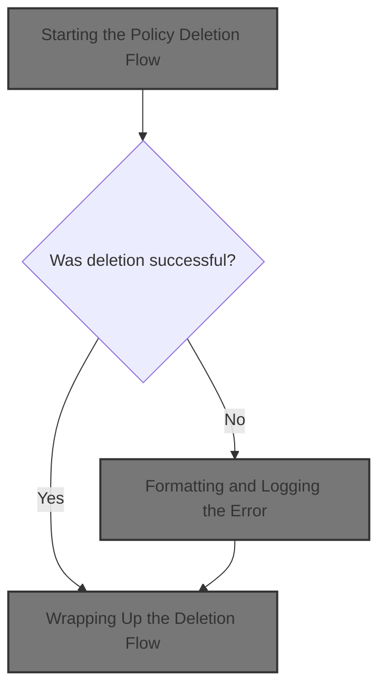
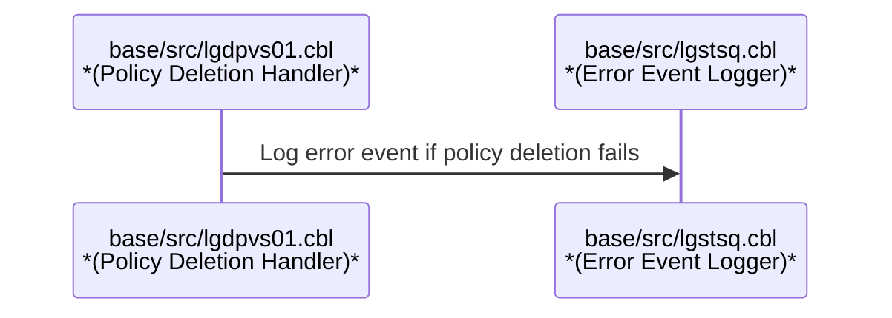
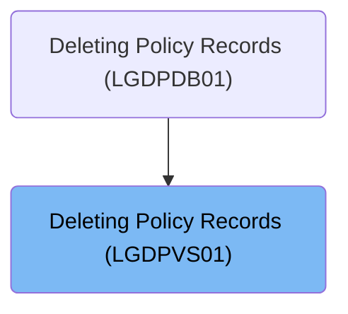
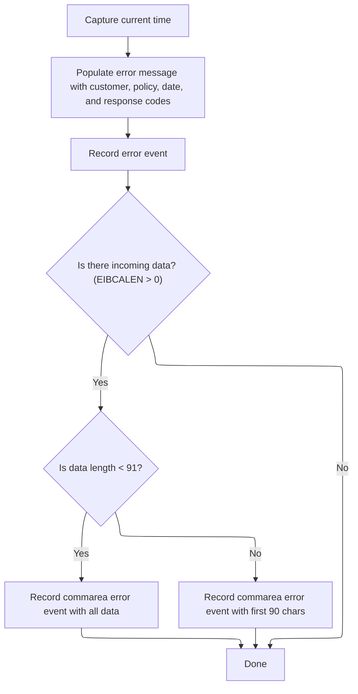

# Overview

This document describes the flow for deleting policy records. The process receives a request with customer and policy identifiers, attempts to remove the specified policy, and logs any errors with relevant business context.



# Technical Overview



## Dependencies

### Program

- LGSTSQ (<SwmPath>[base/src/lgstsq.cbl](base/src/lgstsq.cbl)</SwmPath>)

### Copybook

- LGCMAREA (<SwmPath>[base/src/lgcmarea.cpy](base/src/lgcmarea.cpy)</SwmPath>)

# Where is this program used?

This program is used once, as represented in the following diagram:



## Detailed View of the Program's Functionality

a. Starting the Policy Deletion Flow

The process begins by preparing to delete a policy record. The program first determines the length of the incoming communication area (commarea), which is a block of data passed to the program. It then extracts the request type, policy number, and customer number from the commarea and places them into local working storage fields. These fields are used to construct a key that uniquely identifies the policy record in the database (specifically, a VSAM KSDS file named 'KSDSPOLY').

Once the key is ready, the program attempts to delete the policy record from the file. The result of this delete operation is captured in a response code. If the deletion is successful, the program proceeds to its normal exit. If the deletion fails, the program prepares to handle the error.

b. Error Handling After Failed Deletion

If the deletion operation does not succeed (i.e., the response code does not indicate a normal outcome), the program captures an additional response code for further diagnostics. It sets a return code in the commarea to indicate an error has occurred. Then, it performs a routine to log the error details by calling a subroutine (<SwmToken path="base/src/lgdpvs01.cbl" pos="89:3:7" line-data="             PERFORM WRITE-ERROR-MESSAGE">`WRITE-ERROR-MESSAGE`</SwmToken>). After logging the error, the program immediately returns control to the caller, ending further processing for this request.

c. Formatting and Logging the Error

The error logging routine begins by capturing the current system time. It requests the absolute time from the system and then formats it into human-readable date and time strings. These are stored for inclusion in the error message.

Next, the program constructs a detailed error message. This message includes the date, time, program name, policy number, customer number, the name of the file involved in the operation, and both response codes from the failed delete attempt. This structured message is then sent to a logging program (LGSTSQ) using a CICS LINK command, which passes the message as a commarea.

d. Writing the Error Message to Queues (LGSTSQ)

The logging program (LGSTSQ) prepares to write the error message to two different queues: a transient data queue (TDQ) for system logs and a temporary storage queue (TSQ) for application-specific logs.

- It first clears out any previous message data and determines the system ID and the name of the program that invoked it.
- If the program was invoked directly (not via a terminal), it marks the message as a "C" (commarea) type and copies the incoming data into the message buffer.
- If invoked via a terminal, it receives data from the terminal, marks the message as an "R" (receive) type, and copies the relevant data into the message buffer, adjusting the length accordingly.
- By default, the queue name is set to 'GENAERRS'. However, if the message starts with a special prefix ('Q='), the queue name is dynamically adjusted to <SwmToken path="base/src/lgstsq.cbl" pos="6:19:19" line-data="      *  parm Q=nnnn is passed then Queue name GENAnnnn is used        *">`GENAnnnn`</SwmToken>, where 'nnnn' is extracted from the message.
- The message length is adjusted to include system and formatting information.

The message is then written to the system log queue (CSMT) and the application-specific queue (GENAERRS or the dynamically determined name). If the message was received from a terminal, a minimal response is sent back to the terminal to acknowledge receipt.

e. Logging Additional Context from the Commarea

After logging the main error message, the program checks if there is any additional data in the commarea (i.e., if the length of the incoming data is greater than zero). If so, it prepares a secondary error message that includes up to 90 characters of the commarea data, prefixed with 'COMMAREA='. If the commarea is shorter than 91 characters, the entire commarea is included; otherwise, only the first 90 characters are used. This secondary message is also sent to the logging program (LGSTSQ) for recording.

f. Wrapping Up the Deletion Flow

After all error logging is complete (or if the deletion was successful), the program exits cleanly. It performs any necessary cleanup and returns control to the caller, marking the end of the policy deletion process.

# Rule Definition

| Paragraph Name                                                                                                                                                                                                                                                                            | Rule ID | Category          | Description                                                                                                                                                                                                                                                                                                                                                                                                                                                                                                                                                                                                                                                                                             | Conditions                                                                                                                                                                                                                                                                                                                                                                                                                                                                              | Remarks                                                                                                                                                                                                                                                                                                                                                                                                                                                                                                                                                                                                                                                                                                                     |
| ----------------------------------------------------------------------------------------------------------------------------------------------------------------------------------------------------------------------------------------------------------------------------------------- | ------- | ----------------- | ------------------------------------------------------------------------------------------------------------------------------------------------------------------------------------------------------------------------------------------------------------------------------------------------------------------------------------------------------------------------------------------------------------------------------------------------------------------------------------------------------------------------------------------------------------------------------------------------------------------------------------------------------------------------------------------------------- | --------------------------------------------------------------------------------------------------------------------------------------------------------------------------------------------------------------------------------------------------------------------------------------------------------------------------------------------------------------------------------------------------------------------------------------------------------------------------------------- | --------------------------------------------------------------------------------------------------------------------------------------------------------------------------------------------------------------------------------------------------------------------------------------------------------------------------------------------------------------------------------------------------------------------------------------------------------------------------------------------------------------------------------------------------------------------------------------------------------------------------------------------------------------------------------------------------------------------------- |
| MAINLINE SECTION (<SwmToken path="base/src/lgdpvs01.cbl" pos="11:6:6" line-data="       PROGRAM-ID. LGDPVS01.">`LGDPVS01`</SwmToken>), MAINLINE SECTION (LGSTSQ)                                                                                                                          | RL-001  | Conditional Logic | The deletion flow is initiated when an external request provides a commarea structure containing <SwmToken path="base/src/lgdpvs01.cbl" pos="77:3:7" line-data="           Move CA-Request-ID(4:1) To WF-Request-ID">`CA-Request-ID`</SwmToken>, <SwmToken path="base/src/lgdpvs01.cbl" pos="78:3:7" line-data="           Move CA-Policy-Num      To WF-Policy-Num">`CA-Policy-Num`</SwmToken>, <SwmToken path="base/src/lgdpvs01.cbl" pos="79:3:7" line-data="           Move CA-Customer-Num    To WF-Customer-Num">`CA-Customer-Num`</SwmToken>, and <SwmToken path="base/src/lgdpvs01.cbl" pos="88:9:13" line-data="             MOVE &#39;81&#39; TO CA-RETURN-CODE">`CA-RETURN-CODE`</SwmToken>. | External request must provide a commarea with the required fields.                                                                                                                                                                                                                                                                                                                                                                                                                      | <SwmToken path="base/src/lgdpvs01.cbl" pos="77:3:7" line-data="           Move CA-Request-ID(4:1) To WF-Request-ID">`CA-Request-ID`</SwmToken>: 4 chars, <SwmToken path="base/src/lgdpvs01.cbl" pos="78:3:7" line-data="           Move CA-Policy-Num      To WF-Policy-Num">`CA-Policy-Num`</SwmToken>: 10 chars, <SwmToken path="base/src/lgdpvs01.cbl" pos="79:3:7" line-data="           Move CA-Customer-Num    To WF-Customer-Num">`CA-Customer-Num`</SwmToken>: 10 chars, <SwmToken path="base/src/lgdpvs01.cbl" pos="88:9:13" line-data="             MOVE &#39;81&#39; TO CA-RETURN-CODE">`CA-RETURN-CODE`</SwmToken>: 2 chars. The commarea is treated as a string for error event logging.                       |
| MAINLINE SECTION (<SwmToken path="base/src/lgdpvs01.cbl" pos="11:6:6" line-data="       PROGRAM-ID. LGDPVS01.">`LGDPVS01`</SwmToken>)                                                                                                                                                     | RL-002  | Computation       | The policy record to be deleted is identified by a file key composed of the first character of <SwmToken path="base/src/lgdpvs01.cbl" pos="77:3:7" line-data="           Move CA-Request-ID(4:1) To WF-Request-ID">`CA-Request-ID`</SwmToken>, <SwmToken path="base/src/lgdpvs01.cbl" pos="79:3:7" line-data="           Move CA-Customer-Num    To WF-Customer-Num">`CA-Customer-Num`</SwmToken>, and <SwmToken path="base/src/lgdpvs01.cbl" pos="78:3:7" line-data="           Move CA-Policy-Num      To WF-Policy-Num">`CA-Policy-Num`</SwmToken>.                                                                                                                                                  | <SwmToken path="base/src/lgdpvs01.cbl" pos="77:3:7" line-data="           Move CA-Request-ID(4:1) To WF-Request-ID">`CA-Request-ID`</SwmToken>, <SwmToken path="base/src/lgdpvs01.cbl" pos="78:3:7" line-data="           Move CA-Policy-Num      To WF-Policy-Num">`CA-Policy-Num`</SwmToken>, and <SwmToken path="base/src/lgdpvs01.cbl" pos="79:3:7" line-data="           Move CA-Customer-Num    To WF-Customer-Num">`CA-Customer-Num`</SwmToken> must be present in the commarea. | File key format: 1 char (first of <SwmToken path="base/src/lgdpvs01.cbl" pos="77:3:7" line-data="           Move CA-Request-ID(4:1) To WF-Request-ID">`CA-Request-ID`</SwmToken>) + 10 chars (<SwmToken path="base/src/lgdpvs01.cbl" pos="79:3:7" line-data="           Move CA-Customer-Num    To WF-Customer-Num">`CA-Customer-Num`</SwmToken>) + 10 chars (<SwmToken path="base/src/lgdpvs01.cbl" pos="78:3:7" line-data="           Move CA-Policy-Num      To WF-Policy-Num">`CA-Policy-Num`</SwmToken>), total 21 chars.                                                                                                                                                                                              |
| MAINLINE SECTION (<SwmToken path="base/src/lgdpvs01.cbl" pos="11:6:6" line-data="       PROGRAM-ID. LGDPVS01.">`LGDPVS01`</SwmToken>)                                                                                                                                                     | RL-003  | Conditional Logic | On successful deletion (response code equals 0), control returns to the caller with no changes to the commarea.                                                                                                                                                                                                                                                                                                                                                                                                                                                                                                                                                                                         | Response code from delete operation equals 0 (DFHRESP(NORMAL)).                                                                                                                                                                                                                                                                                                                                                                                                                         | No changes to commarea fields.                                                                                                                                                                                                                                                                                                                                                                                                                                                                                                                                                                                                                                                                                              |
| MAINLINE SECTION (<SwmToken path="base/src/lgdpvs01.cbl" pos="11:6:6" line-data="       PROGRAM-ID. LGDPVS01.">`LGDPVS01`</SwmToken>)                                                                                                                                                     | RL-004  | Conditional Logic | On error (response code not equal to 0), <SwmToken path="base/src/lgdpvs01.cbl" pos="88:9:13" line-data="             MOVE &#39;81&#39; TO CA-RETURN-CODE">`CA-RETURN-CODE`</SwmToken> in the commarea is set to '81' before returning control to the caller.                                                                                                                                                                                                                                                                                                                                                                                                                                           | Response code from delete operation not equal to 0.                                                                                                                                                                                                                                                                                                                                                                                                                                     | <SwmToken path="base/src/lgdpvs01.cbl" pos="88:9:13" line-data="             MOVE &#39;81&#39; TO CA-RETURN-CODE">`CA-RETURN-CODE`</SwmToken> set to '81'.                                                                                                                                                                                                                                                                                                                                                                                                                                                                                                                                                                  |
| <SwmToken path="base/src/lgdpvs01.cbl" pos="89:3:7" line-data="             PERFORM WRITE-ERROR-MESSAGE">`WRITE-ERROR-MESSAGE`</SwmToken> (<SwmToken path="base/src/lgdpvs01.cbl" pos="11:6:6" line-data="       PROGRAM-ID. LGDPVS01.">`LGDPVS01`</SwmToken>), MAINLINE SECTION (LGSTSQ) | RL-005  | Conditional Logic | If there is incoming commarea data (length > 0), a commarea error event message is logged, consisting of the literal 'COMMAREA=' followed by up to 90 characters of commarea data.                                                                                                                                                                                                                                                                                                                                                                                                                                                                                                                      | EIBCALEN > 0 (commarea length greater than 0).                                                                                                                                                                                                                                                                                                                                                                                                                                          | Message format: 'COMMAREA=' (9 chars) + up to 90 chars of commarea data. If commarea data > 90 chars, only first 90 chars are used. Message truncated to 90 chars if longer.                                                                                                                                                                                                                                                                                                                                                                                                                                                                                                                                                |
| MAINLINE SECTION (LGSTSQ)                                                                                                                                                                                                                                                                 | RL-006  | Data Assignment   | Error and event messages are written to both the transient data queue (CSMT) and the temporary storage queue (GENAERRS or <SwmToken path="base/src/lgstsq.cbl" pos="6:19:19" line-data="      *  parm Q=nnnn is passed then Queue name GENAnnnn is used        *">`GENAnnnn`</SwmToken>), with each message truncated to 90 characters if longer.                                                                                                                                                                                                                                                                                                                                                       | Any error or event message to be logged.                                                                                                                                                                                                                                                                                                                                                                                                                                                | Queue names: CSMT (TDQ), GENAERRS or <SwmToken path="base/src/lgstsq.cbl" pos="6:19:19" line-data="      *  parm Q=nnnn is passed then Queue name GENAnnnn is used        *">`GENAnnnn`</SwmToken> (TSQ, determined by Q=nnnn parameter in message). Message length: truncated to 90 chars if longer.                                                                                                                                                                                                                                                                                                                                                                                                                       |
| MAINLINE SECTION (<SwmToken path="base/src/lgdpvs01.cbl" pos="11:6:6" line-data="       PROGRAM-ID. LGDPVS01.">`LGDPVS01`</SwmToken>), MAINLINE SECTION (LGSTSQ)                                                                                                                          | RL-007  | Conditional Logic | The logic should allow for mocking or stubbing file and queue interactions for testing purposes.                                                                                                                                                                                                                                                                                                                                                                                                                                                                                                                                                                                                        | Testing mode or test harness is active.                                                                                                                                                                                                                                                                                                                                                                                                                                                 | No specific constants; implementation should allow replacement of file and queue operations with mocks/stubs.                                                                                                                                                                                                                                                                                                                                                                                                                                                                                                                                                                                                               |
| <SwmToken path="base/src/lgdpvs01.cbl" pos="89:3:7" line-data="             PERFORM WRITE-ERROR-MESSAGE">`WRITE-ERROR-MESSAGE`</SwmToken> (<SwmToken path="base/src/lgdpvs01.cbl" pos="11:6:6" line-data="       PROGRAM-ID. LGDPVS01.">`LGDPVS01`</SwmToken>)                            | RL-008  | Computation       | On error, an error message is constructed and logged synchronously. The message includes: current date (MMDDYYYY), current time (HHMMSS), program name (<SwmToken path="base/src/lgdpvs01.cbl" pos="11:6:6" line-data="       PROGRAM-ID. LGDPVS01.">`LGDPVS01`</SwmToken>), policy number, customer number, literal 'Delete file KSDSPOLY', response code (5 digits, right-justified), and secondary response code (5 digits, right-justified), concatenated as a single string in the specified order and format.                                                                                                                                                                                     | Response code from delete operation not equal to 0.                                                                                                                                                                                                                                                                                                                                                                                                                                     | Date: MMDDYYYY (8 chars), Time: HHMMSS (6 chars), Program name: ' <SwmToken path="base/src/lgdpvs01.cbl" pos="11:6:6" line-data="       PROGRAM-ID. LGDPVS01.">`LGDPVS01`</SwmToken>' (9 chars), Policy number: 10 chars, Customer number: 10 chars, Literal: ' Delete file KSDSPOLY' (21 chars), Response code: 5 digits, right-justified, Secondary response code: 5 digits, right-justified. Entire message truncated to 90 chars if longer. The message is written to both the transient data queue (CSMT) and the temporary storage queue (GENAERRS or <SwmToken path="base/src/lgstsq.cbl" pos="6:19:19" line-data="      *  parm Q=nnnn is passed then Queue name GENAnnnn is used        *">`GENAnnnn`</SwmToken>). |

# User Stories

## User Story 1: Policy Deletion Request and Response Handling

---

### Story Description:

As an external system, I want to request the deletion of a policy record by providing a commarea structure so that the correct record is deleted and I receive an appropriate response indicating success or error, and the logic allows for mocking or stubbing file interactions for testing purposes.

---

### Business Rule Mapping:

| Rule ID | Paragraph Name                                                                                                                                                   | Rule Description                                                                                                                                                                                                                                                                                                                                                                                                                                                                                                                                                                                                                                                                                        |
| ------- | ---------------------------------------------------------------------------------------------------------------------------------------------------------------- | ------------------------------------------------------------------------------------------------------------------------------------------------------------------------------------------------------------------------------------------------------------------------------------------------------------------------------------------------------------------------------------------------------------------------------------------------------------------------------------------------------------------------------------------------------------------------------------------------------------------------------------------------------------------------------------------------------- |
| RL-001  | MAINLINE SECTION (<SwmToken path="base/src/lgdpvs01.cbl" pos="11:6:6" line-data="       PROGRAM-ID. LGDPVS01.">`LGDPVS01`</SwmToken>), MAINLINE SECTION (LGSTSQ) | The deletion flow is initiated when an external request provides a commarea structure containing <SwmToken path="base/src/lgdpvs01.cbl" pos="77:3:7" line-data="           Move CA-Request-ID(4:1) To WF-Request-ID">`CA-Request-ID`</SwmToken>, <SwmToken path="base/src/lgdpvs01.cbl" pos="78:3:7" line-data="           Move CA-Policy-Num      To WF-Policy-Num">`CA-Policy-Num`</SwmToken>, <SwmToken path="base/src/lgdpvs01.cbl" pos="79:3:7" line-data="           Move CA-Customer-Num    To WF-Customer-Num">`CA-Customer-Num`</SwmToken>, and <SwmToken path="base/src/lgdpvs01.cbl" pos="88:9:13" line-data="             MOVE &#39;81&#39; TO CA-RETURN-CODE">`CA-RETURN-CODE`</SwmToken>. |
| RL-002  | MAINLINE SECTION (<SwmToken path="base/src/lgdpvs01.cbl" pos="11:6:6" line-data="       PROGRAM-ID. LGDPVS01.">`LGDPVS01`</SwmToken>)                            | The policy record to be deleted is identified by a file key composed of the first character of <SwmToken path="base/src/lgdpvs01.cbl" pos="77:3:7" line-data="           Move CA-Request-ID(4:1) To WF-Request-ID">`CA-Request-ID`</SwmToken>, <SwmToken path="base/src/lgdpvs01.cbl" pos="79:3:7" line-data="           Move CA-Customer-Num    To WF-Customer-Num">`CA-Customer-Num`</SwmToken>, and <SwmToken path="base/src/lgdpvs01.cbl" pos="78:3:7" line-data="           Move CA-Policy-Num      To WF-Policy-Num">`CA-Policy-Num`</SwmToken>.                                                                                                                                                  |
| RL-003  | MAINLINE SECTION (<SwmToken path="base/src/lgdpvs01.cbl" pos="11:6:6" line-data="       PROGRAM-ID. LGDPVS01.">`LGDPVS01`</SwmToken>)                            | On successful deletion (response code equals 0), control returns to the caller with no changes to the commarea.                                                                                                                                                                                                                                                                                                                                                                                                                                                                                                                                                                                         |
| RL-004  | MAINLINE SECTION (<SwmToken path="base/src/lgdpvs01.cbl" pos="11:6:6" line-data="       PROGRAM-ID. LGDPVS01.">`LGDPVS01`</SwmToken>)                            | On error (response code not equal to 0), <SwmToken path="base/src/lgdpvs01.cbl" pos="88:9:13" line-data="             MOVE &#39;81&#39; TO CA-RETURN-CODE">`CA-RETURN-CODE`</SwmToken> in the commarea is set to '81' before returning control to the caller.                                                                                                                                                                                                                                                                                                                                                                                                                                           |
| RL-007  | MAINLINE SECTION (<SwmToken path="base/src/lgdpvs01.cbl" pos="11:6:6" line-data="       PROGRAM-ID. LGDPVS01.">`LGDPVS01`</SwmToken>), MAINLINE SECTION (LGSTSQ) | The logic should allow for mocking or stubbing file and queue interactions for testing purposes.                                                                                                                                                                                                                                                                                                                                                                                                                                                                                                                                                                                                        |

---

### Relevant Functionality:

- **MAINLINE SECTION (**<SwmToken path="base/src/lgdpvs01.cbl" pos="11:6:6" line-data="       PROGRAM-ID. LGDPVS01.">`LGDPVS01`</SwmToken>**)**
  1. **RL-001:**
     - On program entry, check for presence of commarea data.
     - Extract <SwmToken path="base/src/lgdpvs01.cbl" pos="77:3:7" line-data="           Move CA-Request-ID(4:1) To WF-Request-ID">`CA-Request-ID`</SwmToken>, <SwmToken path="base/src/lgdpvs01.cbl" pos="78:3:7" line-data="           Move CA-Policy-Num      To WF-Policy-Num">`CA-Policy-Num`</SwmToken>, <SwmToken path="base/src/lgdpvs01.cbl" pos="79:3:7" line-data="           Move CA-Customer-Num    To WF-Customer-Num">`CA-Customer-Num`</SwmToken>, and <SwmToken path="base/src/lgdpvs01.cbl" pos="88:9:13" line-data="             MOVE &#39;81&#39; TO CA-RETURN-CODE">`CA-RETURN-CODE`</SwmToken> from commarea.
     - Proceed to deletion logic.
  2. **RL-002:**
     - Construct file key:
       - Take first character of <SwmToken path="base/src/lgdpvs01.cbl" pos="77:3:7" line-data="           Move CA-Request-ID(4:1) To WF-Request-ID">`CA-Request-ID`</SwmToken>.
       - Concatenate <SwmToken path="base/src/lgdpvs01.cbl" pos="79:3:7" line-data="           Move CA-Customer-Num    To WF-Customer-Num">`CA-Customer-Num`</SwmToken>.
       - Concatenate <SwmToken path="base/src/lgdpvs01.cbl" pos="78:3:7" line-data="           Move CA-Policy-Num      To WF-Policy-Num">`CA-Policy-Num`</SwmToken>.
     - Use file key for VSAM KSDS delete operation.
  3. **RL-003:**
     - If response code is 0:
       - Return control to caller.
       - Do not modify commarea.
  4. **RL-004:**
     - If response code is not 0:
       - Set <SwmToken path="base/src/lgdpvs01.cbl" pos="88:9:13" line-data="             MOVE &#39;81&#39; TO CA-RETURN-CODE">`CA-RETURN-CODE`</SwmToken> in commarea to '81'.
       - Proceed to error logging.
  5. **RL-007:**
     - Provide abstraction or hooks for file and queue operations.
     - Allow test harness to inject mock or stub implementations.
     - Ensure normal logic is bypassed when mocks/stubs are active.

## User Story 2: Error and Event Logging

---

### Story Description:

As a system, I want error and event messages (including commarea error events and detailed error logs) to be constructed and written to both transient and temporary storage queues, with proper formatting and truncation, and the logic allows for mocking or stubbing queue interactions for testing purposes, so that errors and events are traceable, auditable, and testable.

---

### Business Rule Mapping:

| Rule ID | Paragraph Name                                                                                                                                                                                                                                                                            | Rule Description                                                                                                                                                                                                                                                                                                                                                                                                                                                                                                    |
| ------- | ----------------------------------------------------------------------------------------------------------------------------------------------------------------------------------------------------------------------------------------------------------------------------------------- | ------------------------------------------------------------------------------------------------------------------------------------------------------------------------------------------------------------------------------------------------------------------------------------------------------------------------------------------------------------------------------------------------------------------------------------------------------------------------------------------------------------------- |
| RL-005  | <SwmToken path="base/src/lgdpvs01.cbl" pos="89:3:7" line-data="             PERFORM WRITE-ERROR-MESSAGE">`WRITE-ERROR-MESSAGE`</SwmToken> (<SwmToken path="base/src/lgdpvs01.cbl" pos="11:6:6" line-data="       PROGRAM-ID. LGDPVS01.">`LGDPVS01`</SwmToken>), MAINLINE SECTION (LGSTSQ) | If there is incoming commarea data (length > 0), a commarea error event message is logged, consisting of the literal 'COMMAREA=' followed by up to 90 characters of commarea data.                                                                                                                                                                                                                                                                                                                                  |
| RL-008  | <SwmToken path="base/src/lgdpvs01.cbl" pos="89:3:7" line-data="             PERFORM WRITE-ERROR-MESSAGE">`WRITE-ERROR-MESSAGE`</SwmToken> (<SwmToken path="base/src/lgdpvs01.cbl" pos="11:6:6" line-data="       PROGRAM-ID. LGDPVS01.">`LGDPVS01`</SwmToken>)                            | On error, an error message is constructed and logged synchronously. The message includes: current date (MMDDYYYY), current time (HHMMSS), program name (<SwmToken path="base/src/lgdpvs01.cbl" pos="11:6:6" line-data="       PROGRAM-ID. LGDPVS01.">`LGDPVS01`</SwmToken>), policy number, customer number, literal 'Delete file KSDSPOLY', response code (5 digits, right-justified), and secondary response code (5 digits, right-justified), concatenated as a single string in the specified order and format. |
| RL-006  | MAINLINE SECTION (LGSTSQ)                                                                                                                                                                                                                                                                 | Error and event messages are written to both the transient data queue (CSMT) and the temporary storage queue (GENAERRS or <SwmToken path="base/src/lgstsq.cbl" pos="6:19:19" line-data="      *  parm Q=nnnn is passed then Queue name GENAnnnn is used        *">`GENAnnnn`</SwmToken>), with each message truncated to 90 characters if longer.                                                                                                                                                                   |
| RL-007  | MAINLINE SECTION (<SwmToken path="base/src/lgdpvs01.cbl" pos="11:6:6" line-data="       PROGRAM-ID. LGDPVS01.">`LGDPVS01`</SwmToken>), MAINLINE SECTION (LGSTSQ)                                                                                                                          | The logic should allow for mocking or stubbing file and queue interactions for testing purposes.                                                                                                                                                                                                                                                                                                                                                                                                                    |

---

### Relevant Functionality:

- <SwmToken path="base/src/lgdpvs01.cbl" pos="89:3:7" line-data="             PERFORM WRITE-ERROR-MESSAGE">`WRITE-ERROR-MESSAGE`</SwmToken> **(**<SwmToken path="base/src/lgdpvs01.cbl" pos="11:6:6" line-data="       PROGRAM-ID. LGDPVS01.">`LGDPVS01`</SwmToken>**)**
  1. **RL-005:**
     - If commarea length > 0:
       - If length <= 90, use entire commarea data.
       - If length > 90, use first 90 chars.
       - Format message as 'COMMAREA=' + commarea data.
       - Log message to both CSMT (TDQ) and GENAERRS/GENAnnnn (TSQ) via LGSTSQ.
  2. **RL-008:**
     - On error:
       - Obtain the current date in MMDDYYYY format.
       - Obtain the current time in HHMMSS format.
       - Prepare the program name as the literal string <SwmToken path="base/src/lgdpvs01.cbl" pos="11:6:6" line-data="       PROGRAM-ID. LGDPVS01.">`LGDPVS01`</SwmToken>.
       - Retrieve the policy number and customer number from the request.
       - Add the literal string 'Delete file KSDSPOLY'.
       - Format the response code as a 5-digit, right-justified number.
       - Format the secondary response code as a 5-digit, right-justified number.
       - Concatenate all fields in the specified order into a single string.
       - If the message exceeds 90 characters, truncate it to 90 characters.
       - Write the message to the transient data queue (CSMT).
       - Write the message to the temporary storage queue (GENAERRS or <SwmToken path="base/src/lgstsq.cbl" pos="6:19:19" line-data="      *  parm Q=nnnn is passed then Queue name GENAnnnn is used        *">`GENAnnnn`</SwmToken>, depending on the queue naming logic).
- **MAINLINE SECTION (LGSTSQ)**
  1. **RL-006:**
     - Prepare message for logging.
     - If message starts with 'Q=', use <SwmToken path="base/src/lgstsq.cbl" pos="6:19:19" line-data="      *  parm Q=nnnn is passed then Queue name GENAnnnn is used        *">`GENAnnnn`</SwmToken> as TSQ name, else use GENAERRS.
     - Truncate message to 90 chars if longer.
     - Write message to CSMT (TDQ).
     - Write message to TSQ (GENAERRS or <SwmToken path="base/src/lgstsq.cbl" pos="6:19:19" line-data="      *  parm Q=nnnn is passed then Queue name GENAnnnn is used        *">`GENAnnnn`</SwmToken>).
     - If invoked via RECEIVE, send text response.
- **MAINLINE SECTION (**<SwmToken path="base/src/lgdpvs01.cbl" pos="11:6:6" line-data="       PROGRAM-ID. LGDPVS01.">`LGDPVS01`</SwmToken>**)**
  1. **RL-007:**
     - Provide abstraction or hooks for file and queue operations.
     - Allow test harness to inject mock or stub implementations.
     - Ensure normal logic is bypassed when mocks/stubs are active.

# Workflow

# Starting the Policy Deletion Flow

This section governs the initiation of the policy deletion flow, ensuring that the correct policy is targeted for deletion and that errors are properly logged and handled.

| Category        | Rule Name                        | Description                                                                                                                               |
| --------------- | -------------------------------- | ----------------------------------------------------------------------------------------------------------------------------------------- |
| Data validation | Extract identifiers for deletion | The system must extract the request ID, customer number, and policy number from the incoming request data before attempting any deletion. |
| Business logic  | Attempt policy deletion          | The system must attempt to delete the policy record identified by the extracted customer and policy numbers.                              |

<SwmSnippet path="/base/src/lgdpvs01.cbl" line="72">

---

We start by extracting the relevant IDs from the commarea and try to delete the policy record from the file. This sets up everything for either a successful exit or error handling next.

```cobol
       MAINLINE SECTION.
      *
      *---------------------------------------------------------------*
           Move EIBCALEN To WS-Commarea-Len.
      *---------------------------------------------------------------*
           Move CA-Request-ID(4:1) To WF-Request-ID
           Move CA-Policy-Num      To WF-Policy-Num
           Move CA-Customer-Num    To WF-Customer-Num
      *---------------------------------------------------------------*
           Exec CICS Delete File('KSDSPOLY')
                     Ridfld(WF-Policy-Key)
                     KeyLength(21)
                     RESP(WS-RESP)
           End-Exec.
```

---

</SwmSnippet>

<SwmSnippet path="/base/src/lgdpvs01.cbl" line="86">

---

If the delete fails, we log the error by calling <SwmToken path="base/src/lgdpvs01.cbl" pos="89:3:7" line-data="             PERFORM WRITE-ERROR-MESSAGE">`WRITE-ERROR-MESSAGE`</SwmToken>, then return control.

```cobol
           If WS-RESP Not = DFHRESP(NORMAL)
             Move EIBRESP2 To WS-RESP2
             MOVE '81' TO CA-RETURN-CODE
             PERFORM WRITE-ERROR-MESSAGE
             EXEC CICS RETURN END-EXEC
           End-If.
```

---

</SwmSnippet>

## Formatting and Logging the Error



This section ensures that all error events are consistently formatted and logged with relevant business context, including customer and policy identifiers, timestamps, and response codes. It also captures and logs additional context from incoming data, subject to a length restriction.

| Category       | Rule Name                   | Description                                                                                                                                             |
| -------------- | --------------------------- | ------------------------------------------------------------------------------------------------------------------------------------------------------- |
| Business logic | Error message completeness  | The error message must include the current date and time, customer number, policy number, and response codes for every error event logged.              |
| Business logic | Incoming data context limit | If there is incoming data associated with the error event, the system must log this data as additional context, but only up to the first 90 characters. |
| Business logic | Dual queue logging          | Error messages must be logged to both the transient data queue (CSMT) and the temporary storage queue (GENAERRS) for redundancy and traceability.       |
| Business logic | Data length handling        | If the incoming data length is less than 91 characters, the entire data must be logged; if it is 91 or more, only the first 90 characters are logged.   |
| Business logic | No data fallback            | If there is no incoming data, only the main error message is logged and no additional context message is created.                                       |
| Technical step | Non-blocking error logging  | Error logging must not wait for storage to become available; if no space is available in the temporary storage queue, the request is ignored.           |

<SwmSnippet path="/base/src/lgdpvs01.cbl" line="99">

---

We fetch and format the current time to include in the error log.

```cobol
       WRITE-ERROR-MESSAGE.
           EXEC CICS ASKTIME ABSTIME(WS-ABSTIME)
           END-EXEC
           EXEC CICS FORMATTIME ABSTIME(WS-ABSTIME)
                     MMDDYYYY(WS-DATE)
                     TIME(WS-TIME)
           END-EXEC
```

---

</SwmSnippet>

<SwmSnippet path="/base/src/lgdpvs01.cbl" line="107">

---

We prep the error message, log it via LGSTSQ, and if there's extra context, we send that too, but capped at 90 chars.

```cobol
           MOVE WS-DATE TO EM-DATE
           MOVE WS-TIME TO EM-TIME
           Move CA-Customer-Num To EM-CUSNUM 
           Move CA-POLICY-NUM To EM-POLNUM 
           Move WS-RESP         To EM-RespRC
           Move WS-RESP2        To EM-Resp2RC
           EXEC CICS LINK PROGRAM('LGSTSQ')
                     COMMAREA(ERROR-MSG)
                     LENGTH(LENGTH OF ERROR-MSG)
           END-EXEC.
```

---

</SwmSnippet>

<SwmSnippet path="/base/src/lgstsq.cbl" line="55">

---

We prep the message, optionally tweak it, write it to two queues, and send a response if needed.

```cobol
       MAINLINE SECTION.

           MOVE SPACES TO WRITE-MSG.
           MOVE SPACES TO WS-RECV.

           EXEC CICS ASSIGN SYSID(WRITE-MSG-SYSID)
                RESP(WS-RESP)
           END-EXEC.

           EXEC CICS ASSIGN INVOKINGPROG(WS-INVOKEPROG)
                RESP(WS-RESP)
           END-EXEC.
           
           IF WS-INVOKEPROG NOT = SPACES
              MOVE 'C' To WS-FLAG
              MOVE COMMA-DATA  TO WRITE-MSG-MSG
              MOVE EIBCALEN    TO WS-RECV-LEN
           ELSE
              EXEC CICS RECEIVE INTO(WS-RECV)
                  LENGTH(WS-RECV-LEN)
                  RESP(WS-RESP)
              END-EXEC
              MOVE 'R' To WS-FLAG
              MOVE WS-RECV-DATA  TO WRITE-MSG-MSG
              SUBTRACT 5 FROM WS-RECV-LEN
           END-IF.

           MOVE 'GENAERRS' TO STSQ-NAME.
           IF WRITE-MSG-MSG(1:2) = 'Q=' THEN
              MOVE WRITE-MSG-MSG(3:4) TO STSQ-EXT
              MOVE WRITE-MSG-REST TO TEMPO
              MOVE TEMPO          TO WRITE-MSG-MSG
              SUBTRACT 7 FROM WS-RECV-LEN
           END-IF.

           ADD 5 TO WS-RECV-LEN.

      * Write output message to TDQ CSMT
      *
           EXEC CICS WRITEQ TD QUEUE(STDQ-NAME)
                     FROM(WRITE-MSG)
                     RESP(WS-RESP)
                     LENGTH(WS-RECV-LEN)

           END-EXEC.

      * Write output message to Genapp TSQ
      * If no space is available then the task will not wait for
      *  storage to become available but will ignore the request...
      *
           EXEC CICS WRITEQ TS QUEUE(STSQ-NAME)
                     FROM(WRITE-MSG)
                     RESP(WS-RESP)
                     NOSUSPEND
                     LENGTH(WS-RECV-LEN)

           END-EXEC.

           If WS-FLAG = 'R' Then
             EXEC CICS SEND TEXT FROM(FILLER-X)
              WAIT
              ERASE
              LENGTH(1)
              FREEKB
             END-EXEC.

           EXEC CICS RETURN
           END-EXEC.
```

---

</SwmSnippet>

<SwmSnippet path="/base/src/lgdpvs01.cbl" line="117">

---

After logging the main error, we send extra context if available, but only up to 90 chars.

```cobol
           IF EIBCALEN > 0 THEN
             IF EIBCALEN < 91 THEN
               MOVE DFHCOMMAREA(1:EIBCALEN) TO CA-DATA
               EXEC CICS LINK PROGRAM('LGSTSQ')
                         COMMAREA(CA-ERROR-MSG)
                         LENGTH(Length Of CA-ERROR-MSG)
               END-EXEC
             ELSE
               MOVE DFHCOMMAREA(1:90) TO CA-DATA
               EXEC CICS LINK PROGRAM('LGSTSQ')
                         COMMAREA(CA-ERROR-MSG)
                         LENGTH(Length Of CA-ERROR-MSG)
               END-EXEC
             END-IF
           END-IF.
           EXIT.
```

---

</SwmSnippet>

## Wrapping Up the Deletion Flow

<SwmSnippet path="/base/src/lgdpvs01.cbl" line="95">

---

We just end the process and return control.

```cobol
       A-EXIT.
           EXIT.
           GOBACK.
```

---

</SwmSnippet>

&nbsp;

*This is an auto-generated document by Swimm 🌊 and has not yet been verified by a human*

<SwmMeta version="3.0.0" repo-id="Z2l0aHViJTNBJTNBU3dpbW1pby1nZW5hcHAtbW90b3IlM0ElM0FHaXJpLVN3aW1t" repo-name="Swimmio-genapp-motor"><sup>Powered by [Swimm](https://app.swimm.io/)</sup></SwmMeta>
