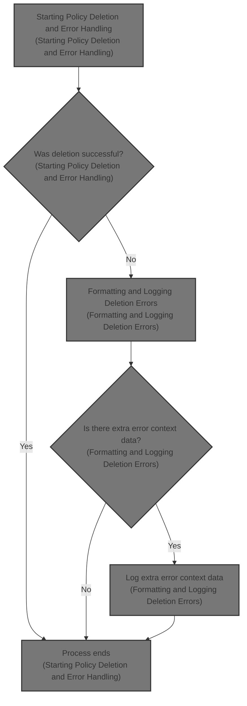
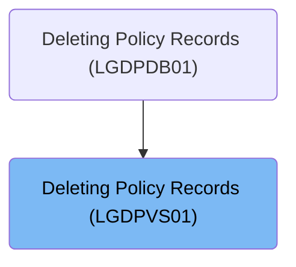
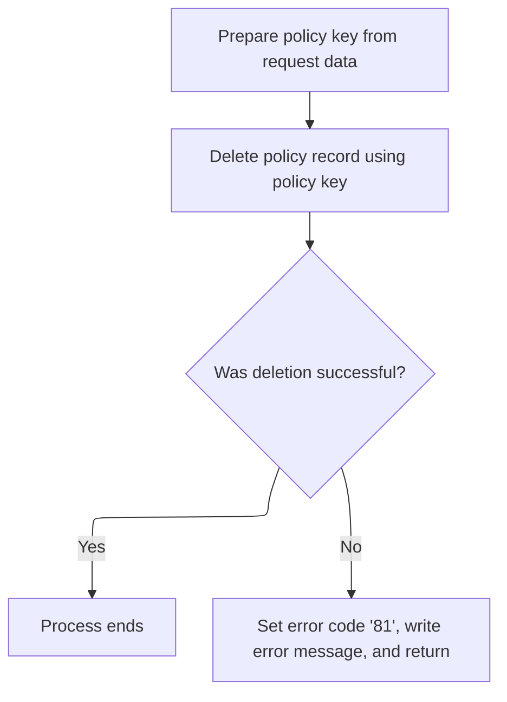
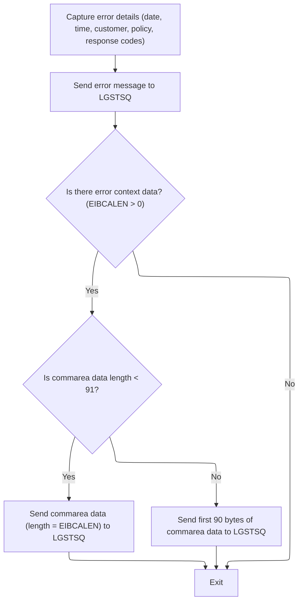

# Overview

This document describes the flow for deleting policy records. The process receives policy and customer identifiers, attempts to remove the matching record, and ensures that any errors are logged with complete context for audit and troubleshooting.



## Dependencies

### Programs

- <SwmToken path="base/src/lgdpvs01.cbl" pos="11:6:6" line-data="       PROGRAM-ID. LGDPVS01.">`LGDPVS01`</SwmToken> (<SwmPath>[base/src/lgdpvs01.cbl](base/src/lgdpvs01.cbl)</SwmPath>)
- LGSTSQ (<SwmPath>[base/src/lgstsq.cbl](base/src/lgstsq.cbl)</SwmPath>)

### Copybook

- LGCMAREA (<SwmPath>[base/src/lgcmarea.cpy](base/src/lgcmarea.cpy)</SwmPath>)

# Where is this program used?

This program is used once, as represented in the following diagram:



## Detailed View of the Program's Functionality

a. Starting Policy Deletion and Error Handling

The process begins by preparing the necessary information to identify the policy record that needs to be deleted. The system receives a request containing identifiers such as the request ID, policy number, and customer number. These identifiers are extracted from the incoming request and copied into internal storage fields specifically set up for this purpose.

Once the identifiers are in place, the system attempts to delete the policy record from a specialized file (a VSAM KSDS file). The deletion command is issued using the combined key made up of the request ID, customer number, and policy number. The result of this deletion operation is captured in a dedicated response field, which will be checked to determine if the operation was successful.

After the deletion attempt, the system checks the response code:

- If the deletion was successful (the response code indicates normal completion), the process ends immediately.
- If the deletion failed (the response code indicates an error), the system performs several actions:
  - It captures a secondary response code for additional error context.
  - It sets a specific return code ('81') to indicate a deletion error.
  - It triggers the error logging routine to record the details of the failure.
  - It returns control to the caller, ensuring that the error is properly reported and no further processing occurs.

b. Formatting and Logging Deletion Errors

When a deletion error occurs, the system enters the error logging routine. The first step is to capture the current system date and time, which are formatted and stored for inclusion in the error log. This timestamp allows for precise tracking of when the error happened.

Next, the system constructs a detailed error message. This message includes:

- The formatted date and time.
- The customer number and policy number involved in the failed operation.
- The primary and secondary response codes from the deletion attempt.
- A fixed identifier indicating the program and operation that failed.

This error message is then sent to a specialized logging and queueing program. The message is passed as a block of data, along with its length, to ensure it is properly recorded.

After logging the main error message, the system checks if there is any additional context data provided in the original request (known as the commarea). If such data exists:

- If the data is less than 91 characters, the entire data block is included in a secondary error message and sent to the logging program.
- If the data is longer, only the first 90 characters are included to avoid exceeding message size limits.

This ensures that any extra information that might help diagnose the error is also captured and logged.

c. Logging Program (LGSTSQ) Actions

The logging and queueing program receives the error message and determines how to process it based on how it was invoked:

- If it was called directly by another program (not as a result of a message being received), it marks the message as a command and prepares it for logging.
- If it was invoked as a result of a message being received, it marks the message as received data, extracts the relevant portion, and adjusts the message length accordingly.

The program then determines the appropriate queue name for storing the message. By default, it uses a standard error queue, but if the message contains a special prefix (indicating a different queue), it adjusts the queue name and message content as needed.

The message is then written to two places:

- A transient data queue (TDQ), which is typically used for system logs or operator messages.
- A temporary storage queue (TSQ), which is used for application-level error tracking.

If the program was invoked as a result of a received message, it sends a minimal response back to acknowledge receipt before returning control.

d. Summary of Error Context Handling

After the main error message is logged, the system ensures that any additional context from the original request is not lost. It checks the length of the extra data and sends it in a separate message to the logging program, either in full or truncated to fit the allowed size. This two-step logging process guarantees that both the main error details and any supplementary information are available for troubleshooting and audit purposes.

# Rule Definition

| Paragraph Name                                                                                                                                              | Rule ID | Category          | Description                                                                                                                                                                                                                                                                                                                                                                                                                                                                                                                                                                 | Conditions                                                                                                                                                                                                                                                                                                                                                                                                                                                                         | Remarks                                                                                                                                                                                                                                                                                                                                                                                                                                                                                                                                                                                                                                                                                                                                                                                                                                                                                                                                                                                                                                                                                                                                                                                                                                                                                       |
| ----------------------------------------------------------------------------------------------------------------------------------------------------------- | ------- | ----------------- | --------------------------------------------------------------------------------------------------------------------------------------------------------------------------------------------------------------------------------------------------------------------------------------------------------------------------------------------------------------------------------------------------------------------------------------------------------------------------------------------------------------------------------------------------------------------------- | ---------------------------------------------------------------------------------------------------------------------------------------------------------------------------------------------------------------------------------------------------------------------------------------------------------------------------------------------------------------------------------------------------------------------------------------------------------------------------------- | --------------------------------------------------------------------------------------------------------------------------------------------------------------------------------------------------------------------------------------------------------------------------------------------------------------------------------------------------------------------------------------------------------------------------------------------------------------------------------------------------------------------------------------------------------------------------------------------------------------------------------------------------------------------------------------------------------------------------------------------------------------------------------------------------------------------------------------------------------------------------------------------------------------------------------------------------------------------------------------------------------------------------------------------------------------------------------------------------------------------------------------------------------------------------------------------------------------------------------------------------------------------------------------------- |
| DFHCOMMAREA definition, MAINLINE SECTION                                                                                                                    | RL-001  | Data Assignment   | The system must accept an incoming request via DFHCOMMAREA containing <SwmToken path="base/src/lgdpvs01.cbl" pos="77:3:7" line-data="           Move CA-Request-ID(4:1) To WF-Request-ID">`CA-Request-ID`</SwmToken> (1 character), <SwmToken path="base/src/lgdpvs01.cbl" pos="79:3:7" line-data="           Move CA-Customer-Num    To WF-Customer-Num">`CA-Customer-Num`</SwmToken> (10 characters), and <SwmToken path="base/src/lgdpvs01.cbl" pos="78:3:7" line-data="           Move CA-Policy-Num      To WF-Policy-Num">`CA-Policy-Num`</SwmToken> (10 characters). | Incoming request is present in DFHCOMMAREA.                                                                                                                                                                                                                                                                                                                                                                                                                                        | <SwmToken path="base/src/lgdpvs01.cbl" pos="77:3:7" line-data="           Move CA-Request-ID(4:1) To WF-Request-ID">`CA-Request-ID`</SwmToken>: string, 1 character; <SwmToken path="base/src/lgdpvs01.cbl" pos="79:3:7" line-data="           Move CA-Customer-Num    To WF-Customer-Num">`CA-Customer-Num`</SwmToken>: string, 10 characters; <SwmToken path="base/src/lgdpvs01.cbl" pos="78:3:7" line-data="           Move CA-Policy-Num      To WF-Policy-Num">`CA-Policy-Num`</SwmToken>: string, 10 characters.                                                                                                                                                                                                                                                                                                                                                                                                                                                                                                                                                                                                                                                                                                                                                                        |
| MAINLINE SECTION                                                                                                                                            | RL-002  | Computation       | The system constructs a 21-byte policy key by concatenating the 4th character of <SwmToken path="base/src/lgdpvs01.cbl" pos="77:3:7" line-data="           Move CA-Request-ID(4:1) To WF-Request-ID">`CA-Request-ID`</SwmToken>, <SwmToken path="base/src/lgdpvs01.cbl" pos="79:3:7" line-data="           Move CA-Customer-Num    To WF-Customer-Num">`CA-Customer-Num`</SwmToken>, and <SwmToken path="base/src/lgdpvs01.cbl" pos="78:3:7" line-data="           Move CA-Policy-Num      To WF-Policy-Num">`CA-Policy-Num`</SwmToken>.                                    | <SwmToken path="base/src/lgdpvs01.cbl" pos="77:3:7" line-data="           Move CA-Request-ID(4:1) To WF-Request-ID">`CA-Request-ID`</SwmToken>, <SwmToken path="base/src/lgdpvs01.cbl" pos="79:3:7" line-data="           Move CA-Customer-Num    To WF-Customer-Num">`CA-Customer-Num`</SwmToken>, and <SwmToken path="base/src/lgdpvs01.cbl" pos="78:3:7" line-data="           Move CA-Policy-Num      To WF-Policy-Num">`CA-Policy-Num`</SwmToken> are present in the request. | Policy key format: 1 character (<SwmToken path="base/src/lgdpvs01.cbl" pos="77:3:7" line-data="           Move CA-Request-ID(4:1) To WF-Request-ID">`CA-Request-ID`</SwmToken> 4th char) + 10 characters (<SwmToken path="base/src/lgdpvs01.cbl" pos="79:3:7" line-data="           Move CA-Customer-Num    To WF-Customer-Num">`CA-Customer-Num`</SwmToken>) + 10 characters (<SwmToken path="base/src/lgdpvs01.cbl" pos="78:3:7" line-data="           Move CA-Policy-Num      To WF-Policy-Num">`CA-Policy-Num`</SwmToken>) = 21 bytes.                                                                                                                                                                                                                                                                                                                                                                                                                                                                                                                                                                                                                                                                                                                                                    |
| MAINLINE SECTION                                                                                                                                            | RL-003  | Computation       | The system attempts to delete the policy record from the VSAM file 'KSDSPOLY' using the constructed policy key.                                                                                                                                                                                                                                                                                                                                                                                                                                                             | Policy key is constructed.                                                                                                                                                                                                                                                                                                                                                                                                                                                         | VSAM file name: 'KSDSPOLY'. Key length: 21 bytes.                                                                                                                                                                                                                                                                                                                                                                                                                                                                                                                                                                                                                                                                                                                                                                                                                                                                                                                                                                                                                                                                                                                                                                                                                                             |
| MAINLINE SECTION, <SwmToken path="base/src/lgdpvs01.cbl" pos="89:3:7" line-data="             PERFORM WRITE-ERROR-MESSAGE">`WRITE-ERROR-MESSAGE`</SwmToken> | RL-004  | Data Assignment   | The system captures the response code (<SwmToken path="base/src/lgdpvs01.cbl" pos="49:3:5" line-data="             05 EM-RESPRC              PIC +9(5) USAGE DISPLAY.">`EM-RESPRC`</SwmToken>) and secondary response code (<SwmToken path="base/src/lgdpvs01.cbl" pos="51:3:5" line-data="             05 EM-RESP2RC             PIC +9(5) USAGE DISPLAY.">`EM-RESP2RC`</SwmToken>) from the deletion attempt.                                                                                                                                                             | Deletion attempt is made.                                                                                                                                                                                                                                                                                                                                                                                                                                                          | Response code: number, up to 5 digits; Secondary response code: number, up to 5 digits.                                                                                                                                                                                                                                                                                                                                                                                                                                                                                                                                                                                                                                                                                                                                                                                                                                                                                                                                                                                                                                                                                                                                                                                                       |
| <SwmToken path="base/src/lgdpvs01.cbl" pos="89:3:7" line-data="             PERFORM WRITE-ERROR-MESSAGE">`WRITE-ERROR-MESSAGE`</SwmToken>                   | RL-005  | Conditional Logic | If the deletion is unsuccessful, the system formats an error message with date, time, program name, policy number, customer number, file name, and response codes.                                                                                                                                                                                                                                                                                                                                                                                                          | Deletion response code is not NORMAL.                                                                                                                                                                                                                                                                                                                                                                                                                                              | <SwmToken path="base/src/lgdpvs01.cbl" pos="114:3:5" line-data="                     COMMAREA(ERROR-MSG)">`ERROR-MSG`</SwmToken> format: 90 bytes. Fields: <SwmToken path="base/src/lgdpvs01.cbl" pos="107:9:11" line-data="           MOVE WS-DATE TO EM-DATE">`EM-DATE`</SwmToken> (MMDDYYYY, 8 bytes), <SwmToken path="base/src/lgdpvs01.cbl" pos="108:9:11" line-data="           MOVE WS-TIME TO EM-TIME">`EM-TIME`</SwmToken> (HHMMSS, 6 bytes), EM-PROGRAM (' <SwmToken path="base/src/lgdpvs01.cbl" pos="11:6:6" line-data="       PROGRAM-ID. LGDPVS01.">`LGDPVS01`</SwmToken>', 9 bytes), <SwmToken path="base/src/lgdpvs01.cbl" pos="110:11:13" line-data="           Move CA-POLICY-NUM To EM-POLNUM ">`EM-POLNUM`</SwmToken> (10 bytes), <SwmToken path="base/src/lgdpvs01.cbl" pos="109:11:13" line-data="           Move CA-Customer-Num To EM-CUSNUM ">`EM-CUSNUM`</SwmToken> (10 bytes), EM-FILE (' Delete file KSDSPOLY', 21 bytes), <SwmToken path="base/src/lgdpvs01.cbl" pos="49:3:5" line-data="             05 EM-RESPRC              PIC +9(5) USAGE DISPLAY.">`EM-RESPRC`</SwmToken> (5 digits), <SwmToken path="base/src/lgdpvs01.cbl" pos="51:3:5" line-data="             05 EM-RESP2RC             PIC +9(5) USAGE DISPLAY.">`EM-RESP2RC`</SwmToken> (5 digits). |
| <SwmToken path="base/src/lgdpvs01.cbl" pos="89:3:7" line-data="             PERFORM WRITE-ERROR-MESSAGE">`WRITE-ERROR-MESSAGE`</SwmToken>                   | RL-006  | Computation       | The system sends the formatted 90-byte error message to LGSTSQ for logging and queueing.                                                                                                                                                                                                                                                                                                                                                                                                                                                                                    | Error message is formatted.                                                                                                                                                                                                                                                                                                                                                                                                                                                        | <SwmToken path="base/src/lgdpvs01.cbl" pos="114:3:5" line-data="                     COMMAREA(ERROR-MSG)">`ERROR-MSG`</SwmToken>: 90 bytes, sent via CICS LINK to LGSTSQ.                                                                                                                                                                                                                                                                                                                                                                                                                                                                                                                                                                                                                                                                                                                                                                                                                                                                                                                                                                                                                                                                                                                     |
| <SwmToken path="base/src/lgdpvs01.cbl" pos="89:3:7" line-data="             PERFORM WRITE-ERROR-MESSAGE">`WRITE-ERROR-MESSAGE`</SwmToken>                   | RL-007  | Conditional Logic | If additional context data is present (EIBCALEN > 0), send it to LGSTSQ as <SwmToken path="base/src/lgdpvs01.cbl" pos="121:3:7" line-data="                         COMMAREA(CA-ERROR-MSG)">`CA-ERROR-MSG`</SwmToken>. If length < 91 bytes, send entire data; if length >= 91 bytes, send only first 90 bytes.                                                                                                                                                                                                                                                             | EIBCALEN > 0.                                                                                                                                                                                                                                                                                                                                                                                                                                                                      | <SwmToken path="base/src/lgdpvs01.cbl" pos="121:3:7" line-data="                         COMMAREA(CA-ERROR-MSG)">`CA-ERROR-MSG`</SwmToken>: 'COMMAREA=' (9 bytes) + up to 90 bytes of data.                                                                                                                                                                                                                                                                                                                                                                                                                                                                                                                                                                                                                                                                                                                                                                                                                                                                                                                                                                                                                                                                                                   |
| MAINLINE SECTION (LGSTSQ)                                                                                                                                   | RL-008  | Conditional Logic | LGSTSQ writes the error message to TSQ 'GENAERRS' by default, or to <SwmToken path="base/src/lgstsq.cbl" pos="6:19:19" line-data="      *  parm Q=nnnn is passed then Queue name GENAnnnn is used        *">`GENAnnnn`</SwmToken> if the message starts with 'Q=nnnn'.                                                                                                                                                                                                                                                                                                      | Message content starts with 'Q='.                                                                                                                                                                                                                                                                                                                                                                                                                                                  | TSQ queue name: 'GENAERRS' (default), or <SwmToken path="base/src/lgstsq.cbl" pos="6:19:19" line-data="      *  parm Q=nnnn is passed then Queue name GENAnnnn is used        *">`GENAnnnn`</SwmToken> (if message starts with 'Q=nnnn').                                                                                                                                                                                                                                                                                                                                                                                                                                                                                                                                                                                                                                                                                                                                                                                                                                                                                                                                                                                                                                                     |
| MAINLINE SECTION (LGSTSQ)                                                                                                                                   | RL-009  | Computation       | LGSTSQ writes the error message to both TDQ (CSMT) and TSQ (GENAERRS or <SwmToken path="base/src/lgstsq.cbl" pos="6:19:19" line-data="      *  parm Q=nnnn is passed then Queue name GENAnnnn is used        *">`GENAnnnn`</SwmToken>).                                                                                                                                                                                                                                                                                                                                     | Error message is received or linked.                                                                                                                                                                                                                                                                                                                                                                                                                                               | TDQ name: 'CSMT'; TSQ name: 'GENAERRS' or <SwmToken path="base/src/lgstsq.cbl" pos="6:19:19" line-data="      *  parm Q=nnnn is passed then Queue name GENAnnnn is used        *">`GENAnnnn`</SwmToken>. Message length: as determined by context, typically 90 bytes plus any required padding.                                                                                                                                                                                                                                                                                                                                                                                                                                                                                                                                                                                                                                                                                                                                                                                                                                                                                                                                                                                              |
| <SwmToken path="base/src/lgdpvs01.cbl" pos="89:3:7" line-data="             PERFORM WRITE-ERROR-MESSAGE">`WRITE-ERROR-MESSAGE`</SwmToken>                   | RL-010  | Computation       | The system uses CICS ASKTIME and FORMATTIME to retrieve and format the current date and time for error logging.                                                                                                                                                                                                                                                                                                                                                                                                                                                             | Error message needs to be formatted.                                                                                                                                                                                                                                                                                                                                                                                                                                               | Date format: MMDDYYYY (8 bytes); Time format: HHMMSS (6 bytes).                                                                                                                                                                                                                                                                                                                                                                                                                                                                                                                                                                                                                                                                                                                                                                                                                                                                                                                                                                                                                                                                                                                                                                                                                               |
| MAINLINE SECTION (LGSTSQ)                                                                                                                                   | RL-011  | Conditional Logic | LGSTSQ sends a 1-byte response back if the message is received via a queue rather than a program link.                                                                                                                                                                                                                                                                                                                                                                                                                                                                      | Message is received via queue (not linked from another program).                                                                                                                                                                                                                                                                                                                                                                                                                   | Response: 1 byte, sent using CICS SEND TEXT. The response consists of a single character, typically used to acknowledge receipt.                                                                                                                                                                                                                                                                                                                                                                                                                                                                                                                                                                                                                                                                                                                                                                                                                                                                                                                                                                                                                                                                                                                                                              |

# User Stories

## User Story 1: Process policy deletion request

---

### Story Description:

As a system, I want to accept a policy deletion request and attempt to delete the corresponding record from the VSAM file so that policy records can be managed and removed as needed.

---

### Business Rule Mapping:

| Rule ID | Paragraph Name                                                                                                                                              | Rule Description                                                                                                                                                                                                                                                                                                                                                                                                                                                                                                                                                            |
| ------- | ----------------------------------------------------------------------------------------------------------------------------------------------------------- | --------------------------------------------------------------------------------------------------------------------------------------------------------------------------------------------------------------------------------------------------------------------------------------------------------------------------------------------------------------------------------------------------------------------------------------------------------------------------------------------------------------------------------------------------------------------------- |
| RL-001  | DFHCOMMAREA definition, MAINLINE SECTION                                                                                                                    | The system must accept an incoming request via DFHCOMMAREA containing <SwmToken path="base/src/lgdpvs01.cbl" pos="77:3:7" line-data="           Move CA-Request-ID(4:1) To WF-Request-ID">`CA-Request-ID`</SwmToken> (1 character), <SwmToken path="base/src/lgdpvs01.cbl" pos="79:3:7" line-data="           Move CA-Customer-Num    To WF-Customer-Num">`CA-Customer-Num`</SwmToken> (10 characters), and <SwmToken path="base/src/lgdpvs01.cbl" pos="78:3:7" line-data="           Move CA-Policy-Num      To WF-Policy-Num">`CA-Policy-Num`</SwmToken> (10 characters). |
| RL-002  | MAINLINE SECTION                                                                                                                                            | The system constructs a 21-byte policy key by concatenating the 4th character of <SwmToken path="base/src/lgdpvs01.cbl" pos="77:3:7" line-data="           Move CA-Request-ID(4:1) To WF-Request-ID">`CA-Request-ID`</SwmToken>, <SwmToken path="base/src/lgdpvs01.cbl" pos="79:3:7" line-data="           Move CA-Customer-Num    To WF-Customer-Num">`CA-Customer-Num`</SwmToken>, and <SwmToken path="base/src/lgdpvs01.cbl" pos="78:3:7" line-data="           Move CA-Policy-Num      To WF-Policy-Num">`CA-Policy-Num`</SwmToken>.                                    |
| RL-003  | MAINLINE SECTION                                                                                                                                            | The system attempts to delete the policy record from the VSAM file 'KSDSPOLY' using the constructed policy key.                                                                                                                                                                                                                                                                                                                                                                                                                                                             |
| RL-004  | MAINLINE SECTION, <SwmToken path="base/src/lgdpvs01.cbl" pos="89:3:7" line-data="             PERFORM WRITE-ERROR-MESSAGE">`WRITE-ERROR-MESSAGE`</SwmToken> | The system captures the response code (<SwmToken path="base/src/lgdpvs01.cbl" pos="49:3:5" line-data="             05 EM-RESPRC              PIC +9(5) USAGE DISPLAY.">`EM-RESPRC`</SwmToken>) and secondary response code (<SwmToken path="base/src/lgdpvs01.cbl" pos="51:3:5" line-data="             05 EM-RESP2RC             PIC +9(5) USAGE DISPLAY.">`EM-RESP2RC`</SwmToken>) from the deletion attempt.                                                                                                                                                             |

---

### Relevant Functionality:

- **DFHCOMMAREA definition**
  1. **RL-001:**
     - Define DFHCOMMAREA structure to include required fields.
     - On program start, move values from DFHCOMMAREA to working storage for processing.
- **MAINLINE SECTION**
  1. **RL-002:**
     - Extract 4th character from <SwmToken path="base/src/lgdpvs01.cbl" pos="77:3:7" line-data="           Move CA-Request-ID(4:1) To WF-Request-ID">`CA-Request-ID`</SwmToken>.
     - Concatenate with <SwmToken path="base/src/lgdpvs01.cbl" pos="79:3:7" line-data="           Move CA-Customer-Num    To WF-Customer-Num">`CA-Customer-Num`</SwmToken> and <SwmToken path="base/src/lgdpvs01.cbl" pos="78:3:7" line-data="           Move CA-Policy-Num      To WF-Policy-Num">`CA-Policy-Num`</SwmToken>.
     - Store result as policy key for VSAM operations.
  2. **RL-003:**
     - Execute CICS DELETE FILE operation on 'KSDSPOLY' using policy key.
     - Capture response codes for further processing.
  3. **RL-004:**
     - After deletion, move response codes to working storage.
     - Use these codes in error message formatting if needed.

## User Story 2: Handle and log deletion errors

---

### Story Description:

As a system, I want to format and send detailed error messages to the logging queue when a policy deletion fails so that errors can be tracked and diagnosed effectively.

---

### Business Rule Mapping:

| Rule ID | Paragraph Name                                                                                                                            | Rule Description                                                                                                                                                                                                                                                                                                |
| ------- | ----------------------------------------------------------------------------------------------------------------------------------------- | --------------------------------------------------------------------------------------------------------------------------------------------------------------------------------------------------------------------------------------------------------------------------------------------------------------- |
| RL-005  | <SwmToken path="base/src/lgdpvs01.cbl" pos="89:3:7" line-data="             PERFORM WRITE-ERROR-MESSAGE">`WRITE-ERROR-MESSAGE`</SwmToken> | If the deletion is unsuccessful, the system formats an error message with date, time, program name, policy number, customer number, file name, and response codes.                                                                                                                                              |
| RL-006  | <SwmToken path="base/src/lgdpvs01.cbl" pos="89:3:7" line-data="             PERFORM WRITE-ERROR-MESSAGE">`WRITE-ERROR-MESSAGE`</SwmToken> | The system sends the formatted 90-byte error message to LGSTSQ for logging and queueing.                                                                                                                                                                                                                        |
| RL-007  | <SwmToken path="base/src/lgdpvs01.cbl" pos="89:3:7" line-data="             PERFORM WRITE-ERROR-MESSAGE">`WRITE-ERROR-MESSAGE`</SwmToken> | If additional context data is present (EIBCALEN > 0), send it to LGSTSQ as <SwmToken path="base/src/lgdpvs01.cbl" pos="121:3:7" line-data="                         COMMAREA(CA-ERROR-MSG)">`CA-ERROR-MSG`</SwmToken>. If length < 91 bytes, send entire data; if length >= 91 bytes, send only first 90 bytes. |
| RL-010  | <SwmToken path="base/src/lgdpvs01.cbl" pos="89:3:7" line-data="             PERFORM WRITE-ERROR-MESSAGE">`WRITE-ERROR-MESSAGE`</SwmToken> | The system uses CICS ASKTIME and FORMATTIME to retrieve and format the current date and time for error logging.                                                                                                                                                                                                 |

---

### Relevant Functionality:

- <SwmToken path="base/src/lgdpvs01.cbl" pos="89:3:7" line-data="             PERFORM WRITE-ERROR-MESSAGE">`WRITE-ERROR-MESSAGE`</SwmToken>
  1. **RL-005:**
     - Retrieve current date and time using CICS ASKTIME and FORMATTIME.
     - Move relevant request and response data into error message fields.
     - Format error message as specified.
  2. **RL-006:**
     - Execute CICS LINK to LGSTSQ with <SwmToken path="base/src/lgdpvs01.cbl" pos="114:3:5" line-data="                     COMMAREA(ERROR-MSG)">`ERROR-MSG`</SwmToken> as commarea.
  3. **RL-007:**
     - Check EIBCALEN.
     - If < 91, move all context data to <SwmToken path="base/src/lgdpvs01.cbl" pos="121:3:7" line-data="                         COMMAREA(CA-ERROR-MSG)">`CA-ERROR-MSG`</SwmToken>.
     - If >= 91, move first 90 bytes to <SwmToken path="base/src/lgdpvs01.cbl" pos="121:3:7" line-data="                         COMMAREA(CA-ERROR-MSG)">`CA-ERROR-MSG`</SwmToken>.
     - Send <SwmToken path="base/src/lgdpvs01.cbl" pos="121:3:7" line-data="                         COMMAREA(CA-ERROR-MSG)">`CA-ERROR-MSG`</SwmToken> to LGSTSQ via CICS LINK.
  4. **RL-010:**
     - Use CICS ASKTIME to get current time.
     - Use CICS FORMATTIME to format date and time.
     - Move formatted values to error message fields.

## User Story 3: Log error messages and send acknowledgements

---

### Story Description:

As a system, I want to log error messages to both TDQ and TSQ and send an acknowledgement response when a message is received so that error information is reliably stored and receipt is confirmed.

---

### Business Rule Mapping:

| Rule ID | Paragraph Name            | Rule Description                                                                                                                                                                                                                                                       |
| ------- | ------------------------- | ---------------------------------------------------------------------------------------------------------------------------------------------------------------------------------------------------------------------------------------------------------------------- |
| RL-008  | MAINLINE SECTION (LGSTSQ) | LGSTSQ writes the error message to TSQ 'GENAERRS' by default, or to <SwmToken path="base/src/lgstsq.cbl" pos="6:19:19" line-data="      *  parm Q=nnnn is passed then Queue name GENAnnnn is used        *">`GENAnnnn`</SwmToken> if the message starts with 'Q=nnnn'. |
| RL-009  | MAINLINE SECTION (LGSTSQ) | LGSTSQ writes the error message to both TDQ (CSMT) and TSQ (GENAERRS or <SwmToken path="base/src/lgstsq.cbl" pos="6:19:19" line-data="      *  parm Q=nnnn is passed then Queue name GENAnnnn is used        *">`GENAnnnn`</SwmToken>).                                |
| RL-011  | MAINLINE SECTION (LGSTSQ) | LGSTSQ sends a 1-byte response back if the message is received via a queue rather than a program link.                                                                                                                                                                 |

---

### Relevant Functionality:

- **MAINLINE SECTION (LGSTSQ)**
  1. **RL-008:**
     - Check if message starts with 'Q='.
     - If so, extract 'nnnn' and set TSQ name to <SwmToken path="base/src/lgstsq.cbl" pos="6:19:19" line-data="      *  parm Q=nnnn is passed then Queue name GENAnnnn is used        *">`GENAnnnn`</SwmToken>.
     - Otherwise, use 'GENAERRS'.
  2. **RL-009:**
     - Write message to TDQ 'CSMT'.
     - Write message to TSQ (queue name as determined above).
     - Use appropriate message length.
  3. **RL-011:**
     - Determine if the message was received via queue (not linked).
     - If so, send a 1-byte response using CICS SEND TEXT to acknowledge receipt.

# Workflow

# Starting Policy Deletion and Error Handling



This section governs the deletion of a policy record based on incoming request data, and manages error handling if the deletion fails.

| Category        | Rule Name                                | Description                                                                                                      |
| --------------- | ---------------------------------------- | ---------------------------------------------------------------------------------------------------------------- |
| Data validation | Policy Identifier Match                  | The policy record must be deleted only if the provided policy and customer identifiers match an existing record. |
| Business logic  | Immediate Process Termination on Success | The process must end immediately after a successful deletion, with no further actions taken.                     |

<SwmSnippet path="/base/src/lgdpvs01.cbl" line="72">

---

In <SwmToken path="base/src/lgdpvs01.cbl" pos="72:1:1" line-data="       MAINLINE SECTION.">`MAINLINE`</SwmToken>, we start by copying the incoming request and policy/customer identifiers into working storage fields. Then we attempt to delete the policy record from the VSAM file using these identifiers. The RESP field is set up to capture the result of the deletion for error handling later.

```cobol
       MAINLINE SECTION.
      *
      *---------------------------------------------------------------*
           Move EIBCALEN To WS-Commarea-Len.
      *---------------------------------------------------------------*
           Move CA-Request-ID(4:1) To WF-Request-ID
           Move CA-Policy-Num      To WF-Policy-Num
           Move CA-Customer-Num    To WF-Customer-Num
      *---------------------------------------------------------------*
           Exec CICS Delete File('KSDSPOLY')
                     Ridfld(WF-Policy-Key)
                     KeyLength(21)
                     RESP(WS-RESP)
           End-Exec.
```

---

</SwmSnippet>

<SwmSnippet path="/base/src/lgdpvs01.cbl" line="86">

---

If the delete fails, we log the error and exit, making sure the failure is tracked.

```cobol
           If WS-RESP Not = DFHRESP(NORMAL)
             Move EIBRESP2 To WS-RESP2
             MOVE '81' TO CA-RETURN-CODE
             PERFORM WRITE-ERROR-MESSAGE
             EXEC CICS RETURN END-EXEC
           End-If.
```

---

</SwmSnippet>

# Formatting and Logging Deletion Errors



This section ensures that all deletion errors are captured with full context, formatted consistently, and reliably logged for audit and troubleshooting purposes.

| Category        | Rule Name                    | Description                                                                                                                                                                                                                                                                                                                                                               |
| --------------- | ---------------------------- | ------------------------------------------------------------------------------------------------------------------------------------------------------------------------------------------------------------------------------------------------------------------------------------------------------------------------------------------------------------------------- |
| Data validation | Consistent error formatting  | Error messages must be formatted consistently according to the <SwmToken path="base/src/lgdpvs01.cbl" pos="114:3:5" line-data="                     COMMAREA(ERROR-MSG)">`ERROR-MSG`</SwmToken> and <SwmToken path="base/src/lgdpvs01.cbl" pos="121:3:7" line-data="                         COMMAREA(CA-ERROR-MSG)">`CA-ERROR-MSG`</SwmToken> structures before logging. |
| Business logic  | Complete error context       | Every deletion error must include the exact date and time of occurrence, as well as customer number, policy number, and both response codes in the error log entry.                                                                                                                                                                                                       |
| Business logic  | Preserve extra error context | If additional context data is present in DFHCOMMAREA, up to 90 bytes of this data must be logged as a separate error message to preserve error context.                                                                                                                                                                                                                   |
| Business logic  | Dual queue logging           | All error messages must be sent to both TDQ and TSQ queues to ensure redundancy and reliable retrieval for downstream processes.                                                                                                                                                                                                                                          |

<SwmSnippet path="/base/src/lgdpvs01.cbl" line="99">

---

In <SwmToken path="base/src/lgdpvs01.cbl" pos="99:1:5" line-data="       WRITE-ERROR-MESSAGE.">`WRITE-ERROR-MESSAGE`</SwmToken>, we grab the current system time and format it for inclusion in the error log. This timestamp is used to track exactly when the deletion error happened.

```cobol
       WRITE-ERROR-MESSAGE.
           EXEC CICS ASKTIME ABSTIME(WS-ABSTIME)
           END-EXEC
           EXEC CICS FORMATTIME ABSTIME(WS-ABSTIME)
                     MMDDYYYY(WS-DATE)
                     TIME(WS-TIME)
           END-EXEC
```

---

</SwmSnippet>

<SwmSnippet path="/base/src/lgdpvs01.cbl" line="107">

---

After formatting the time, we fill out the <SwmToken path="base/src/lgdpvs01.cbl" pos="114:3:5" line-data="                     COMMAREA(ERROR-MSG)">`ERROR-MSG`</SwmToken> with all the relevant details (date, time, customer, policy, response codes) and call LGSTSQ to handle the actual logging and queueing of the error message.

```cobol
           MOVE WS-DATE TO EM-DATE
           MOVE WS-TIME TO EM-TIME
           Move CA-Customer-Num To EM-CUSNUM 
           Move CA-POLICY-NUM To EM-POLNUM 
           Move WS-RESP         To EM-RespRC
           Move WS-RESP2        To EM-Resp2RC
           EXEC CICS LINK PROGRAM('LGSTSQ')
                     COMMAREA(ERROR-MSG)
                     LENGTH(LENGTH OF ERROR-MSG)
           END-EXEC.
```

---

</SwmSnippet>

<SwmSnippet path="/base/src/lgstsq.cbl" line="55">

---

In LGSTSQ, we decide if the message is a command or received data, adjust the message format and length if needed, and then write it to both TDQ and TSQ queues. If it's a received message, we send a short response back before returning.

```cobol
       MAINLINE SECTION.

           MOVE SPACES TO WRITE-MSG.
           MOVE SPACES TO WS-RECV.

           EXEC CICS ASSIGN SYSID(WRITE-MSG-SYSID)
                RESP(WS-RESP)
           END-EXEC.

           EXEC CICS ASSIGN INVOKINGPROG(WS-INVOKEPROG)
                RESP(WS-RESP)
           END-EXEC.
           
           IF WS-INVOKEPROG NOT = SPACES
              MOVE 'C' To WS-FLAG
              MOVE COMMA-DATA  TO WRITE-MSG-MSG
              MOVE EIBCALEN    TO WS-RECV-LEN
           ELSE
              EXEC CICS RECEIVE INTO(WS-RECV)
                  LENGTH(WS-RECV-LEN)
                  RESP(WS-RESP)
              END-EXEC
              MOVE 'R' To WS-FLAG
              MOVE WS-RECV-DATA  TO WRITE-MSG-MSG
              SUBTRACT 5 FROM WS-RECV-LEN
           END-IF.

           MOVE 'GENAERRS' TO STSQ-NAME.
           IF WRITE-MSG-MSG(1:2) = 'Q=' THEN
              MOVE WRITE-MSG-MSG(3:4) TO STSQ-EXT
              MOVE WRITE-MSG-REST TO TEMPO
              MOVE TEMPO          TO WRITE-MSG-MSG
              SUBTRACT 7 FROM WS-RECV-LEN
           END-IF.

           ADD 5 TO WS-RECV-LEN.

      * Write output message to TDQ CSMT
      *
           EXEC CICS WRITEQ TD QUEUE(STDQ-NAME)
                     FROM(WRITE-MSG)
                     RESP(WS-RESP)
                     LENGTH(WS-RECV-LEN)

           END-EXEC.

      * Write output message to Genapp TSQ
      * If no space is available then the task will not wait for
      *  storage to become available but will ignore the request...
      *
           EXEC CICS WRITEQ TS QUEUE(STSQ-NAME)
                     FROM(WRITE-MSG)
                     RESP(WS-RESP)
                     NOSUSPEND
                     LENGTH(WS-RECV-LEN)

           END-EXEC.

           If WS-FLAG = 'R' Then
             EXEC CICS SEND TEXT FROM(FILLER-X)
              WAIT
              ERASE
              LENGTH(1)
              FREEKB
             END-EXEC.

           EXEC CICS RETURN
           END-EXEC.
```

---

</SwmSnippet>

<SwmSnippet path="/base/src/lgdpvs01.cbl" line="117">

---

After returning from LGSTSQ, <SwmToken path="base/src/lgdpvs01.cbl" pos="89:3:7" line-data="             PERFORM WRITE-ERROR-MESSAGE">`WRITE-ERROR-MESSAGE`</SwmToken> checks if there's extra data in DFHCOMMAREA. If so, it moves up to 90 characters into <SwmToken path="base/src/lgdpvs01.cbl" pos="119:12:14" line-data="               MOVE DFHCOMMAREA(1:EIBCALEN) TO CA-DATA">`CA-DATA`</SwmToken> and calls LGSTSQ again to log this extra info, making sure we don't lose any context.

```cobol
           IF EIBCALEN > 0 THEN
             IF EIBCALEN < 91 THEN
               MOVE DFHCOMMAREA(1:EIBCALEN) TO CA-DATA
               EXEC CICS LINK PROGRAM('LGSTSQ')
                         COMMAREA(CA-ERROR-MSG)
                         LENGTH(Length Of CA-ERROR-MSG)
               END-EXEC
             ELSE
               MOVE DFHCOMMAREA(1:90) TO CA-DATA
               EXEC CICS LINK PROGRAM('LGSTSQ')
                         COMMAREA(CA-ERROR-MSG)
                         LENGTH(Length Of CA-ERROR-MSG)
               END-EXEC
             END-IF
           END-IF.
           EXIT.
```

---

</SwmSnippet>

&nbsp;

*This is an auto-generated document by Swimm 🌊 and has not yet been verified by a human*

<SwmMeta version="3.0.0" repo-id="Z2l0aHViJTNBJTNBU3dpbW1pby1nZW5hcHAtbW90b3IlM0ElM0FHaXJpLVN3aW1t" repo-name="Swimmio-genapp-motor"><sup>Powered by [Swimm](https://app.swimm.io/)</sup></SwmMeta>
