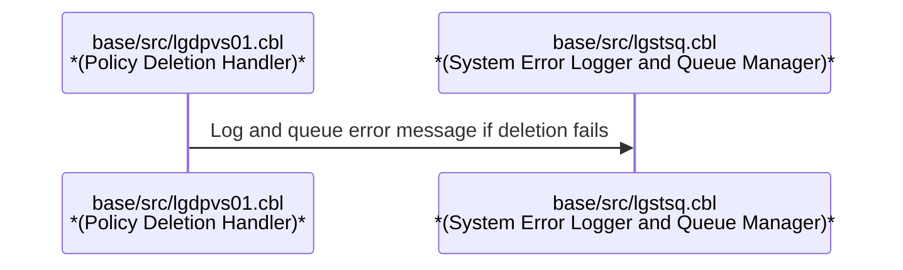
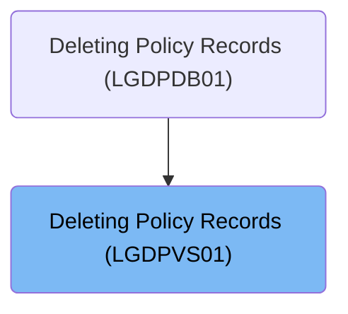
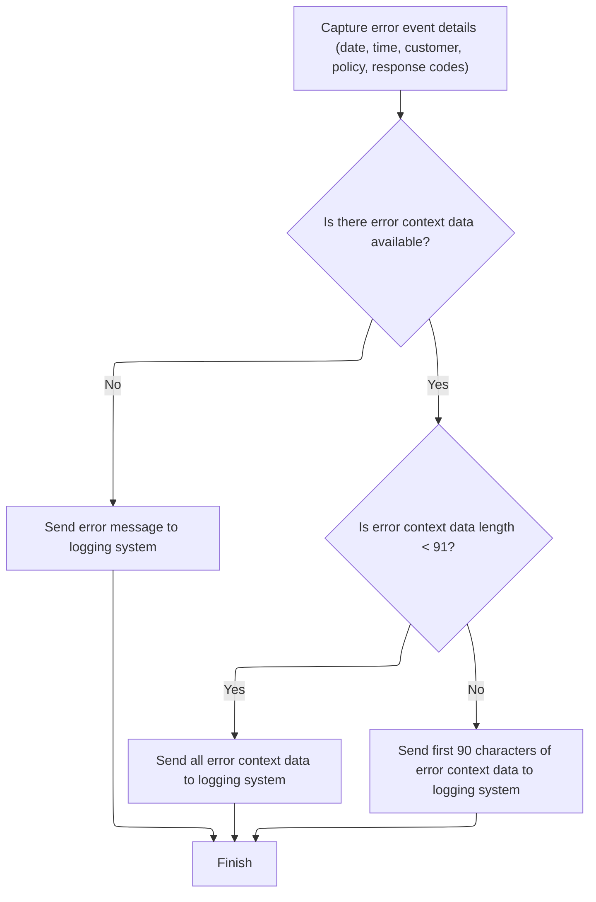

# Overview

This document explains the flow of deleting policy records. The process receives customer and policy numbers, attempts to delete the specified record, and ensures that any errors are logged and queued for system tracking and auditing.

# Technical Overview



## Dependencies

### Program

- LGSTSQ (<SwmPath>[base/src/lgstsq.cbl](base/src/lgstsq.cbl)</SwmPath>)

### Copybook

- LGCMAREA (<SwmPath>[base/src/lgcmarea.cpy](base/src/lgcmarea.cpy)</SwmPath>)

# Where is this program used?

This program is used once, as represented in the following diagram:



# Workflow

# Starting the Policy Deletion Process

This section governs the initiation of the policy deletion workflow, ensuring the correct identification and handling of customer and policy data, and managing error reporting if the deletion fails.

| Category        | Rule Name                              | Description                                                                                                                                                   |
| --------------- | -------------------------------------- | ------------------------------------------------------------------------------------------------------------------------------------------------------------- |
| Data validation | Customer and Policy Number Consistency | The customer number and policy number in the workflow must exactly match those provided in the request to ensure the correct record is targeted for deletion. |

<SwmSnippet path="/base/src/lgdpvs01.cbl" line="72">

---

In MAINLINE, we start by prepping the workflow fields: grab just the 4th character from <SwmToken path="base/src/lgdpvs01.cbl" pos="77:3:7" line-data="           Move CA-Request-ID(4:1) To WF-Request-ID">`CA-Request-ID`</SwmToken> for <SwmToken path="base/src/lgdpvs01.cbl" pos="77:16:20" line-data="           Move CA-Request-ID(4:1) To WF-Request-ID">`WF-Request-ID`</SwmToken> (so the code assumes <SwmToken path="base/src/lgdpvs01.cbl" pos="77:3:7" line-data="           Move CA-Request-ID(4:1) To WF-Request-ID">`CA-Request-ID`</SwmToken> is always at least 4 chars), then copy customer and policy numbers. After that, we immediately call CICS to delete the policy record using the constructed key. This sets up everything for the deletion and error handling that follows.

```cobol
       MAINLINE SECTION.
      *
      *---------------------------------------------------------------*
           Move EIBCALEN To WS-Commarea-Len.
      *---------------------------------------------------------------*
           Move CA-Request-ID(4:1) To WF-Request-ID
           Move CA-Policy-Num      To WF-Policy-Num
           Move CA-Customer-Num    To WF-Customer-Num
      *---------------------------------------------------------------*
           Exec CICS Delete File('KSDSPOLY')
                     Ridfld(WF-Policy-Key)
                     KeyLength(21)
                     RESP(WS-RESP)
           End-Exec.
```

---

</SwmSnippet>

<SwmSnippet path="/base/src/lgdpvs01.cbl" line="86">

---

If the delete fails, we set a specific error code and call <SwmToken path="base/src/lgdpvs01.cbl" pos="89:3:7" line-data="             PERFORM WRITE-ERROR-MESSAGE">`WRITE-ERROR-MESSAGE`</SwmToken> to log the failure before returning.

```cobol
           If WS-RESP Not = DFHRESP(NORMAL)
             Move EIBRESP2 To WS-RESP2
             MOVE '81' TO CA-RETURN-CODE
             PERFORM WRITE-ERROR-MESSAGE
             EXEC CICS RETURN END-EXEC
           End-If.
```

---

</SwmSnippet>

## Logging Error Details and Queueing



This section ensures that all error events are comprehensively logged with relevant details and context, and that these logs are reliably queued for system tracking and auditing. It also enforces data length limits for error context to maintain consistency and prevent overflow.

| Category       | Rule Name                            | Description                                                                                                              |
| -------------- | ------------------------------------ | ------------------------------------------------------------------------------------------------------------------------ |
| Business logic | Mandatory error details              | Every error event must include the date, time, customer number, policy number, and response codes in the logged message. |
| Business logic | Include error context data           | If error context data is available, it must be included in the error log message.                                        |
| Business logic | Short context data logging           | If the error context data length is less than 91 characters, the entire context data must be logged.                     |
| Business logic | Long context data truncation         | If the error context data length is 91 characters or more, only the first 90 characters must be logged.                  |
| Business logic | Dual queue logging                   | All error messages must be queued to both temporary and permanent system queues for tracking and auditing.               |
| Business logic | Minimal response for received errors | If the error message is received rather than invoked, a minimal response must be sent before returning.                  |

<SwmSnippet path="/base/src/lgdpvs01.cbl" line="99">

---

In <SwmToken path="base/src/lgdpvs01.cbl" pos="99:1:5" line-data="       WRITE-ERROR-MESSAGE.">`WRITE-ERROR-MESSAGE`</SwmToken>, we grab the current system time and format it into date and time fields. This sets up the timestamp for the error log entry.

```cobol
       WRITE-ERROR-MESSAGE.
           EXEC CICS ASKTIME ABSTIME(WS-ABSTIME)
           END-EXEC
           EXEC CICS FORMATTIME ABSTIME(WS-ABSTIME)
                     MMDDYYYY(WS-DATE)
                     TIME(WS-TIME)
           END-EXEC
```

---

</SwmSnippet>

<SwmSnippet path="/base/src/lgdpvs01.cbl" line="107">

---

We fill out the error message and call LGSTSQ to queue it for system tracking.

```cobol
           MOVE WS-DATE TO EM-DATE
           MOVE WS-TIME TO EM-TIME
           Move CA-Customer-Num To EM-CUSNUM 
           Move CA-POLICY-NUM To EM-POLNUM 
           Move WS-RESP         To EM-RespRC
           Move WS-RESP2        To EM-Resp2RC
           EXEC CICS LINK PROGRAM('LGSTSQ')
                     COMMAREA(ERROR-MSG)
                     LENGTH(LENGTH OF ERROR-MSG)
           END-EXEC.
```

---

</SwmSnippet>

<SwmSnippet path="/base/src/lgstsq.cbl" line="55">

---

LGSTSQ checks if the message comes from an invoking program or is received, sets flags, and processes special 'Q=' messages. It writes the message to both a temporary and a permanent queue, and if the message was received, sends a minimal response before returning.

```cobol
       MAINLINE SECTION.

           MOVE SPACES TO WRITE-MSG.
           MOVE SPACES TO WS-RECV.

           EXEC CICS ASSIGN SYSID(WRITE-MSG-SYSID)
                RESP(WS-RESP)
           END-EXEC.

           EXEC CICS ASSIGN INVOKINGPROG(WS-INVOKEPROG)
                RESP(WS-RESP)
           END-EXEC.
           
           IF WS-INVOKEPROG NOT = SPACES
              MOVE 'C' To WS-FLAG
              MOVE COMMA-DATA  TO WRITE-MSG-MSG
              MOVE EIBCALEN    TO WS-RECV-LEN
           ELSE
              EXEC CICS RECEIVE INTO(WS-RECV)
                  LENGTH(WS-RECV-LEN)
                  RESP(WS-RESP)
              END-EXEC
              MOVE 'R' To WS-FLAG
              MOVE WS-RECV-DATA  TO WRITE-MSG-MSG
              SUBTRACT 5 FROM WS-RECV-LEN
           END-IF.

           MOVE 'GENAERRS' TO STSQ-NAME.
           IF WRITE-MSG-MSG(1:2) = 'Q=' THEN
              MOVE WRITE-MSG-MSG(3:4) TO STSQ-EXT
              MOVE WRITE-MSG-REST TO TEMPO
              MOVE TEMPO          TO WRITE-MSG-MSG
              SUBTRACT 7 FROM WS-RECV-LEN
           END-IF.

           ADD 5 TO WS-RECV-LEN.

      * Write output message to TDQ CSMT
      *
           EXEC CICS WRITEQ TD QUEUE(STDQ-NAME)
                     FROM(WRITE-MSG)
                     RESP(WS-RESP)
                     LENGTH(WS-RECV-LEN)

           END-EXEC.

      * Write output message to Genapp TSQ
      * If no space is available then the task will not wait for
      *  storage to become available but will ignore the request...
      *
           EXEC CICS WRITEQ TS QUEUE(STSQ-NAME)
                     FROM(WRITE-MSG)
                     RESP(WS-RESP)
                     NOSUSPEND
                     LENGTH(WS-RECV-LEN)

           END-EXEC.

           If WS-FLAG = 'R' Then
             EXEC CICS SEND TEXT FROM(FILLER-X)
              WAIT
              ERASE
              LENGTH(1)
              FREEKB
             END-EXEC.

           EXEC CICS RETURN
           END-EXEC.
```

---

</SwmSnippet>

<SwmSnippet path="/base/src/lgdpvs01.cbl" line="117">

---

After returning from LGSTSQ, <SwmToken path="base/src/lgdpvs01.cbl" pos="89:3:7" line-data="             PERFORM WRITE-ERROR-MESSAGE">`WRITE-ERROR-MESSAGE`</SwmToken> checks the commarea length and, if present, copies the data and calls LGSTSQ again to queue another error message. This handles both short and long commarea cases for error tracking.

```cobol
           IF EIBCALEN > 0 THEN
             IF EIBCALEN < 91 THEN
               MOVE DFHCOMMAREA(1:EIBCALEN) TO CA-DATA
               EXEC CICS LINK PROGRAM('LGSTSQ')
                         COMMAREA(CA-ERROR-MSG)
                         LENGTH(Length Of CA-ERROR-MSG)
               END-EXEC
             ELSE
               MOVE DFHCOMMAREA(1:90) TO CA-DATA
               EXEC CICS LINK PROGRAM('LGSTSQ')
                         COMMAREA(CA-ERROR-MSG)
                         LENGTH(Length Of CA-ERROR-MSG)
               END-EXEC
             END-IF
           END-IF.
           EXIT.
```

---

</SwmSnippet>

## Completing the Deletion Flow

<SwmSnippet path="/base/src/lgdpvs01.cbl" line="95">

---

<SwmToken path="base/src/lgdpvs01.cbl" pos="95:1:3" line-data="       A-EXIT.">`A-EXIT`</SwmToken> just ends the program with EXIT and GOBACK—no extra logic, just a clean return to the caller.

```cobol
       A-EXIT.
           EXIT.
           GOBACK.
```

---

</SwmSnippet>

&nbsp;

*This is an auto-generated document by Swimm 🌊 and has not yet been verified by a human*

<SwmMeta version="3.0.0" repo-id="Z2l0aHViJTNBJTNBU3dpbW1pby1nZW5hcHAtbW90b3IlM0ElM0FHaXJpLVN3aW1t" repo-name="Swimmio-genapp-motor"><sup>Powered by [Swimm](https://app.swimm.io/)</sup></SwmMeta>
