# Overview

This document describes the flow for managing endowment policy transactions. Users interact with a menu to inquire about, add, delete, or update policies. Each operation is validated and dispatched to backend business logic, with results and messages returned to the user interface.

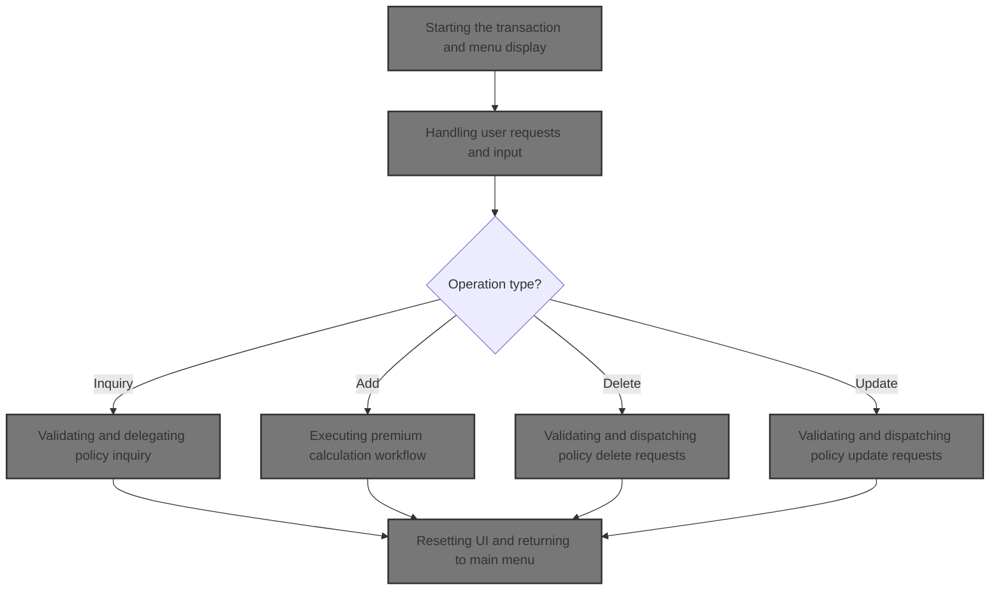

# Technical Overview

```mermaid
sequenceDiagram
  participant MENU as LGTESTP2.cbl<br/>*(Endowment Policy Transaction Menu)*
  participant INQDISP as LGIPOL01.cbl<br/>*(Policy Inquiry Dispatcher)*
  participant INQPROC as LGIPDB01.cbl<br/>*(Policy Data Processor)*
  participant ADDDISP as LGAPOL01.cbl<br/>*(Premium Calculation Dispatcher)*
  participant ADDPROC as base/src/LGAPDB01.cbl<br/>*(Premium Calculator)*
  participant RISK as base/src/LGAPDB03.cbl<br/>*(Risk and Premium Evaluator)*
  participant ACTUARY as base/src/LGAPDB04.cbl<br/>*(Advanced Actuarial Calculator)*
  participant DELDISP as LGDPOL01.cbl<br/>*(Policy Delete Dispatcher)*
  participant DELPROC as LGDPDB01.cbl<br/>*(Policy Deletion Processor)*
  participant DELVSAM as LGDPVS01.cbl<br/>*(VSAM Policy Deletion Handler)*
  participant UPDDISP as LGUPOL01.cbl<br/>*(Policy Update Dispatcher)*
  participant UPDPROC as LGUPDB01.cbl<br/>*(Policy Update Processor)*
  participant UPDVSAM as LGUPVS01.cbl<br/>*(VSAM Policy Update Handler)*
  participant LOGGER as LGSTS2Q.cbl<br/>*(Error and Event Logger)*

  MENU->>INQDISP: Dispatch inquiry request
  INQDISP->>INQPROC: Process policy inquiry
  INQDISP->>LOGGER: Log errors/events

  MENU->>ADDDISP: Dispatch add policy request
  ADDDISP->>ADDPROC: Calculate premium and process add
  ADDPROC->>RISK: Evaluate risk and calculate basic premium
  ADDPROC->>ACTUARY: Perform advanced actuarial calculation
  ADDDISP->>LOGGER: Log errors/events

  MENU->>DELDISP: Dispatch delete policy request
  DELDISP->>DELPROC: Process policy deletion in DB2
  DELPROC->>DELVSAM: Handle VSAM policy deletion
  DELDISP->>LOGGER: Log errors/events

  MENU->>UPDDISP: Dispatch update policy request
  UPDDISP->>UPDPROC: Process policy update in DB2
  UPDPROC->>UPDVSAM: Handle VSAM policy update
  UPDDISP->>LOGGER: Log errors/events

%% Swimm:
%% sequenceDiagram
%%   participant MENU as LGTESTP2.cbl<br/>*(Endowment Policy Transaction Menu)*
%%   participant INQDISP as LGIPOL01.cbl<br/>*(Policy Inquiry Dispatcher)*
%%   participant INQPROC as LGIPDB01.cbl<br/>*(Policy Data Processor)*
%%   participant ADDDISP as LGAPOL01.cbl<br/>*(Premium Calculation Dispatcher)*
%%   participant ADDPROC as <SwmPath>[base/src/LGAPDB01.cbl](base/src/LGAPDB01.cbl)</SwmPath><br/>*(Premium Calculator)*
%%   participant RISK as <SwmPath>[base/src/LGAPDB03.cbl](base/src/LGAPDB03.cbl)</SwmPath><br/>*(Risk and Premium Evaluator)*
%%   participant ACTUARY as <SwmPath>[base/src/LGAPDB04.cbl](base/src/LGAPDB04.cbl)</SwmPath><br/>*(Advanced Actuarial Calculator)*
%%   participant DELDISP as LGDPOL01.cbl<br/>*(Policy Delete Dispatcher)*
%%   participant DELPROC as LGDPDB01.cbl<br/>*(Policy Deletion Processor)*
%%   participant DELVSAM as LGDPVS01.cbl<br/>*(VSAM Policy Deletion Handler)*
%%   participant UPDDISP as LGUPOL01.cbl<br/>*(Policy Update Dispatcher)*
%%   participant UPDPROC as LGUPDB01.cbl<br/>*(Policy Update Processor)*
%%   participant UPDVSAM as LGUPVS01.cbl<br/>*(VSAM Policy Update Handler)*
%%   participant LOGGER as LGSTS2Q.cbl<br/>*(Error and Event Logger)*
%% 
%%   MENU->>INQDISP: Dispatch inquiry request
%%   INQDISP->>INQPROC: Process policy inquiry
%%   INQDISP->>LOGGER: Log errors/events
%% 
%%   MENU->>ADDDISP: Dispatch add policy request
%%   ADDDISP->>ADDPROC: Calculate premium and process add
%%   ADDPROC->>RISK: Evaluate risk and calculate basic premium
%%   ADDPROC->>ACTUARY: Perform advanced actuarial calculation
%%   ADDDISP->>LOGGER: Log errors/events
%% 
%%   MENU->>DELDISP: Dispatch delete policy request
%%   DELDISP->>DELPROC: Process policy deletion in <SwmToken path="base/src/lgipdb01.cbl" pos="242:5:5" line-data="      * initialize DB2 host variables">`DB2`</SwmToken>
%%   DELPROC->>DELVSAM: Handle VSAM policy deletion
%%   DELDISP->>LOGGER: Log errors/events
%% 
%%   MENU->>UPDDISP: Dispatch update policy request
%%   UPDDISP->>UPDPROC: Process policy update in <SwmToken path="base/src/lgipdb01.cbl" pos="242:5:5" line-data="      * initialize DB2 host variables">`DB2`</SwmToken>
%%   UPDPROC->>UPDVSAM: Handle VSAM policy update
%%   UPDDISP->>LOGGER: Log errors/events
```

## Dependencies

### Programs

- <SwmToken path="base/src/lgtestp2.cbl" pos="67:10:10" line-data="                 EXEC CICS LINK PROGRAM(&#39;LGIPOL01&#39;)">`LGIPOL01`</SwmToken> (<SwmPath>[base/src/lgipol01.cbl](base/src/lgipol01.cbl)</SwmPath>)
- <SwmToken path="base/src/lgipol01.cbl" pos="91:9:9" line-data="           EXEC CICS LINK Program(LGIPDB01)">`LGIPDB01`</SwmToken> (<SwmPath>[base/src/lgipdb01.cbl](base/src/lgipdb01.cbl)</SwmPath>)
- LGSTSQ (<SwmPath>[base/src/lgstsq.cbl](base/src/lgstsq.cbl)</SwmPath>)
- <SwmToken path="base/src/lgtestp2.cbl" pos="105:10:10" line-data="                 EXEC CICS LINK PROGRAM(&#39;LGAPOL01&#39;)">`LGAPOL01`</SwmToken> (<SwmPath>[base/src/lgapol01.cbl](base/src/lgapol01.cbl)</SwmPath>)
- <SwmToken path="base/src/lgapol01.cbl" pos="103:9:9" line-data="           EXEC CICS Link Program(LGAPDB01)">`LGAPDB01`</SwmToken> (<SwmPath>[base/src/LGAPDB01.cbl](base/src/LGAPDB01.cbl)</SwmPath>)
- <SwmToken path="base/src/LGAPDB01.cbl" pos="269:4:4" line-data="           CALL &#39;LGAPDB02&#39; USING IN-PROPERTY-TYPE, IN-POSTCODE, ">`LGAPDB02`</SwmToken>
- <SwmToken path="base/src/LGAPDB01.cbl" pos="276:4:4" line-data="           CALL &#39;LGAPDB03&#39; USING WS-BASE-RISK-SCR, IN-FIRE-PERIL, ">`LGAPDB03`</SwmToken> (<SwmPath>[base/src/LGAPDB03.cbl](base/src/LGAPDB03.cbl)</SwmPath>)
- <SwmToken path="base/src/LGAPDB01.cbl" pos="313:4:4" line-data="               CALL &#39;LGAPDB04&#39; USING LK-INPUT-DATA, LK-COVERAGE-DATA, ">`LGAPDB04`</SwmToken> (<SwmPath>[base/src/LGAPDB04.cbl](base/src/LGAPDB04.cbl)</SwmPath>)
- <SwmToken path="base/src/lgtestp2.cbl" pos="129:10:10" line-data="                 EXEC CICS LINK PROGRAM(&#39;LGDPOL01&#39;)">`LGDPOL01`</SwmToken> (<SwmPath>[base/src/lgdpol01.cbl](base/src/lgdpol01.cbl)</SwmPath>)
- <SwmToken path="base/src/lgdpol01.cbl" pos="141:9:9" line-data="           EXEC CICS LINK PROGRAM(LGDPDB01)">`LGDPDB01`</SwmToken> (<SwmPath>[base/src/lgdpdb01.cbl](base/src/lgdpdb01.cbl)</SwmPath>)
- <SwmToken path="base/src/lgdpdb01.cbl" pos="168:9:9" line-data="               EXEC CICS LINK PROGRAM(LGDPVS01)">`LGDPVS01`</SwmToken> (<SwmPath>[base/src/lgdpvs01.cbl](base/src/lgdpvs01.cbl)</SwmPath>)
- <SwmToken path="base/src/lgtestp2.cbl" pos="198:10:10" line-data="                 EXEC CICS LINK PROGRAM(&#39;LGUPOL01&#39;)">`LGUPOL01`</SwmToken> (<SwmPath>[base/src/lgupol01.cbl](base/src/lgupol01.cbl)</SwmPath>)
- <SwmToken path="base/src/lgupol01.cbl" pos="157:9:9" line-data="           EXEC CICS LINK Program(LGUPDB01)">`LGUPDB01`</SwmToken> (<SwmPath>[base/src/lgupdb01.cbl](base/src/lgupdb01.cbl)</SwmPath>)
- <SwmToken path="base/src/lgupdb01.cbl" pos="209:9:9" line-data="           EXEC CICS LINK Program(LGUPVS01)">`LGUPVS01`</SwmToken> (<SwmPath>[base/src/lgupvs01.cbl](base/src/lgupvs01.cbl)</SwmPath>)

### Copybooks

- SQLCA
- LGPOLICY (<SwmPath>[base/src/lgpolicy.cpy](base/src/lgpolicy.cpy)</SwmPath>)
- LGCMAREA (<SwmPath>[base/src/lgcmarea.cpy](base/src/lgcmarea.cpy)</SwmPath>)
- <SwmToken path="base/src/LGAPDB01.cbl" pos="35:3:3" line-data="           COPY INPUTREC2.">`INPUTREC2`</SwmToken> (<SwmPath>[base/src/INPUTREC2.cpy](base/src/INPUTREC2.cpy)</SwmPath>)
- OUTPUTREC (<SwmPath>[base/src/OUTPUTREC.cpy](base/src/OUTPUTREC.cpy)</SwmPath>)
- WORKSTOR (<SwmPath>[base/src/WORKSTOR.cpy](base/src/WORKSTOR.cpy)</SwmPath>)
- LGAPACT (<SwmPath>[base/src/LGAPACT.cpy](base/src/LGAPACT.cpy)</SwmPath>)
- SSMAP

# Workflow

# Starting the transaction and menu display

This section governs the entry point for user sessions, deciding whether to process an incoming request or to initialize and display the main menu for user interaction.

| Category        | Rule Name                                      | Description                                                                                                                                                                                                                                                                                                                                                                         |
| --------------- | ---------------------------------------------- | ----------------------------------------------------------------------------------------------------------------------------------------------------------------------------------------------------------------------------------------------------------------------------------------------------------------------------------------------------------------------------------- |
| Data validation | Menu Display Screen Erasure                    | The main menu must always be displayed with a cleared screen to avoid showing residual data from previous sessions or transactions.                                                                                                                                                                                                                                                 |
| Data validation | Session Variable Reset                         | Session variables <SwmToken path="base/src/lgtestp2.cbl" pos="38:9:9" line-data="           MOVE &#39;0000000000&#39;   To ENP2CNOO.">`ENP2CNOO`</SwmToken> and <SwmToken path="base/src/lgtestp2.cbl" pos="39:9:9" line-data="           MOVE &#39;0000000000&#39;   To ENP2PNOO.">`ENP2PNOO`</SwmToken> must be reset to '0000000000' at the start of a new or returning session. |
| Business logic  | Input Data Processing Priority                 | If the transaction contains input data, the system must proceed to process the user's request instead of displaying the main menu.                                                                                                                                                                                                                                                  |
| Business logic  | Session Initialization for New/Returning Users | If there is no input data, the system must initialize all relevant session variables and prepare the main menu for display to the user.                                                                                                                                                                                                                                             |

<SwmSnippet path="/base/src/lgtestp2.cbl" line="30">

---

In <SwmToken path="base/src/lgtestp2.cbl" pos="30:1:1" line-data="       MAINLINE SECTION.">`MAINLINE`</SwmToken>, we check if the transaction has input data (EIBCALEN > 0). If it does, we jump to <SwmToken path="base/src/lgtestp2.cbl" pos="33:5:7" line-data="              GO TO A-GAIN.">`A-GAIN`</SwmToken> to process the user's request. If not, we stay here and proceed to initialize variables and display the main menu. This is the entry point for both new sessions and returning users.

```cobol
       MAINLINE SECTION.

           IF EIBCALEN > 0
              GO TO A-GAIN.
```

---

</SwmSnippet>

<SwmSnippet path="/base/src/lgtestp2.cbl" line="35">

---

Here we initialize the input/output areas and the communication area, then send the main menu map (<SwmToken path="base/src/lgtestp2.cbl" pos="42:11:11" line-data="           EXEC CICS SEND MAP (&#39;SSMAPP2&#39;)">`SSMAPP2`</SwmToken>) to the terminal. This sets up the UI for the user to start interacting with the system.

```cobol
           Initialize SSMAPP2I.
           Initialize SSMAPP2O.
           Initialize COMM-AREA.
           MOVE '0000000000'   To ENP2CNOO.
           MOVE '0000000000'   To ENP2PNOO.

      * Display Main Menu
           EXEC CICS SEND MAP ('SSMAPP2')
                     MAPSET ('SSMAP')
                     ERASE
                     END-EXEC.
```

---

</SwmSnippet>

# Handling user requests and input

```mermaid
%%{init: {"flowchart": {"defaultRenderer": "elk"}} }%%
flowchart TD
    node1["User selects insurance policy operation"] --> node2{"Which operation?"}
    click node1 openCode "base/src/lgtestp2.cbl:47:58"
    node2 -->|"Inquiry (1)"| node3["Prepare inquiry request (CA-REQUEST-ID=01IEND)"]
    click node2 openCode "base/src/lgtestp2.cbl:63:70"
    node3 --> node4["Validating and delegating policy inquiry"]
    
    node4 --> node5{"CA-RETURN-CODE > 0?"}
    click node5 openCode "base/src/lgtestp2.cbl:71:73"
    node5 -->|"No"| node6["Display policy details to user"]
    click node6 openCode "base/src/lgtestp2.cbl:75:87"
    node5 -->|"Yes"| node7["Handling missing policy data"]
    
    node2 -->|"Add (2)"| node8["Prepare add request (CA-REQUEST-ID=01AEND)"]
    click node8 openCode "base/src/lgtestp2.cbl:90:104"
    node8 --> node9["Executing premium calculation workflow"]
    
    node9 --> node10{"CA-RETURN-CODE > 0?"}
    click node10 openCode "base/src/lgtestp2.cbl:109:112"
    node10 -->|"No"| node11["Show 'New Life Policy Inserted'"]
    click node11 openCode "base/src/lgtestp2.cbl:113:122"
    node10 -->|"Yes"| node12{"CA-RETURN-CODE = 70?"}
    click node12 openCode "base/src/lgtestp2.cbl:269:276"
    node12 -->|"Yes"| node13["Show 'Customer does not exist'"]
    click node13 openCode "base/src/lgtestp2.cbl:271:272"
    node12 -->|"No"| node14["Show 'Error Adding Life Policy'"]
    click node14 openCode "base/src/lgtestp2.cbl:274:275"
    node2 -->|"Delete (3)"| node15["Prepare delete request (CA-REQUEST-ID=01DEND)"]
    click node15 openCode "base/src/lgtestp2.cbl:125:132"
    node15 --> node16["Validating and dispatching policy delete requests"]
    
    node16 --> node17{"CA-RETURN-CODE > 0?"}
    click node17 openCode "base/src/lgtestp2.cbl:133:136"
    node17 -->|"No"| node18["Show 'Life Policy Deleted'"]
    click node18 openCode "base/src/lgtestp2.cbl:138:152"
    node17 -->|"Yes"| node19["Show 'Error Deleting Life Policy'"]
    click node19 openCode "base/src/lgtestp2.cbl:282:284"
    node2 -->|"Update (4)"| node20["Prepare update request (CA-REQUEST-ID=01UEND)"]
    click node20 openCode "base/src/lgtestp2.cbl:184:197"
    node20 --> node21["Validating and dispatching policy update requests"]
    
    node21 --> node22{"CA-RETURN-CODE > 0?"}
    click node22 openCode "base/src/lgtestp2.cbl:202:204"
    node22 -->|"No"| node23["Show 'Life Policy Updated'"]
    click node23 openCode "base/src/lgtestp2.cbl:206:214"
    node22 -->|"Yes"| node24["Show 'Error Updating Life Policy'"]
    click node24 openCode "base/src/lgtestp2.cbl:279:280"
    node2 -->|"Other"| node25["Show 'Please enter a valid option'"]
    click node25 openCode "base/src/lgtestp2.cbl:220:228"
    node25 --> node26["Prompt user to re-enter option"]
    click node26 openCode "base/src/lgtestp2.cbl:229:230"
    node26 --> node27["Return to start or end"]
    click node27 openCode "base/src/lgtestp2.cbl:236:237"

classDef HeadingStyle fill:#777777,stroke:#333,stroke-width:2px;
click node4 goToHeading "Validating and delegating policy inquiry"
node4:::HeadingStyle
click node7 goToHeading "Handling missing policy data"
node7:::HeadingStyle
click node9 goToHeading "Executing premium calculation workflow"
node9:::HeadingStyle
click node16 goToHeading "Validating and dispatching policy delete requests"
node16:::HeadingStyle
click node21 goToHeading "Validating and dispatching policy update requests"
node21:::HeadingStyle

%% Swimm:
%% %%{init: {"flowchart": {"defaultRenderer": "elk"}} }%%
%% flowchart TD
%%     node1["User selects insurance policy operation"] --> node2{"Which operation?"}
%%     click node1 openCode "<SwmPath>[base/src/lgtestp2.cbl](base/src/lgtestp2.cbl)</SwmPath>:47:58"
%%     node2 -->|"Inquiry (1)"| node3["Prepare inquiry request (<SwmToken path="base/src/lgtestp2.cbl" pos="64:9:13" line-data="                 Move &#39;01IEND&#39;   To CA-REQUEST-ID">`CA-REQUEST-ID`</SwmToken>=<SwmToken path="base/src/lgtestp2.cbl" pos="64:4:4" line-data="                 Move &#39;01IEND&#39;   To CA-REQUEST-ID">`01IEND`</SwmToken>)"]
%%     click node2 openCode "<SwmPath>[base/src/lgtestp2.cbl](base/src/lgtestp2.cbl)</SwmPath>:63:70"
%%     node3 --> node4["Validating and delegating policy inquiry"]
%%     
%%     node4 --> node5{"<SwmToken path="base/src/lgtestp2.cbl" pos="71:3:7" line-data="                 IF CA-RETURN-CODE &gt; 0">`CA-RETURN-CODE`</SwmToken> > 0?"}
%%     click node5 openCode "<SwmPath>[base/src/lgtestp2.cbl](base/src/lgtestp2.cbl)</SwmPath>:71:73"
%%     node5 -->|"No"| node6["Display policy details to user"]
%%     click node6 openCode "<SwmPath>[base/src/lgtestp2.cbl](base/src/lgtestp2.cbl)</SwmPath>:75:87"
%%     node5 -->|"Yes"| node7["Handling missing policy data"]
%%     
%%     node2 -->|"Add (2)"| node8["Prepare add request (<SwmToken path="base/src/lgtestp2.cbl" pos="64:9:13" line-data="                 Move &#39;01IEND&#39;   To CA-REQUEST-ID">`CA-REQUEST-ID`</SwmToken>=<SwmToken path="base/src/lgtestp2.cbl" pos="91:4:4" line-data="                 Move &#39;01AEND&#39;          To CA-REQUEST-ID">`01AEND`</SwmToken>)"]
%%     click node8 openCode "<SwmPath>[base/src/lgtestp2.cbl](base/src/lgtestp2.cbl)</SwmPath>:90:104"
%%     node8 --> node9["Executing premium calculation workflow"]
%%     
%%     node9 --> node10{"<SwmToken path="base/src/lgtestp2.cbl" pos="71:3:7" line-data="                 IF CA-RETURN-CODE &gt; 0">`CA-RETURN-CODE`</SwmToken> > 0?"}
%%     click node10 openCode "<SwmPath>[base/src/lgtestp2.cbl](base/src/lgtestp2.cbl)</SwmPath>:109:112"
%%     node10 -->|"No"| node11["Show 'New Life Policy Inserted'"]
%%     click node11 openCode "<SwmPath>[base/src/lgtestp2.cbl](base/src/lgtestp2.cbl)</SwmPath>:113:122"
%%     node10 -->|"Yes"| node12{"<SwmToken path="base/src/lgtestp2.cbl" pos="71:3:7" line-data="                 IF CA-RETURN-CODE &gt; 0">`CA-RETURN-CODE`</SwmToken> = 70?"}
%%     click node12 openCode "<SwmPath>[base/src/lgtestp2.cbl](base/src/lgtestp2.cbl)</SwmPath>:269:276"
%%     node12 -->|"Yes"| node13["Show 'Customer does not exist'"]
%%     click node13 openCode "<SwmPath>[base/src/lgtestp2.cbl](base/src/lgtestp2.cbl)</SwmPath>:271:272"
%%     node12 -->|"No"| node14["Show 'Error Adding Life Policy'"]
%%     click node14 openCode "<SwmPath>[base/src/lgtestp2.cbl](base/src/lgtestp2.cbl)</SwmPath>:274:275"
%%     node2 -->|"Delete (3)"| node15["Prepare delete request (<SwmToken path="base/src/lgtestp2.cbl" pos="64:9:13" line-data="                 Move &#39;01IEND&#39;   To CA-REQUEST-ID">`CA-REQUEST-ID`</SwmToken>=<SwmToken path="base/src/lgtestp2.cbl" pos="126:4:4" line-data="                 Move &#39;01DEND&#39;   To CA-REQUEST-ID">`01DEND`</SwmToken>)"]
%%     click node15 openCode "<SwmPath>[base/src/lgtestp2.cbl](base/src/lgtestp2.cbl)</SwmPath>:125:132"
%%     node15 --> node16["Validating and dispatching policy delete requests"]
%%     
%%     node16 --> node17{"<SwmToken path="base/src/lgtestp2.cbl" pos="71:3:7" line-data="                 IF CA-RETURN-CODE &gt; 0">`CA-RETURN-CODE`</SwmToken> > 0?"}
%%     click node17 openCode "<SwmPath>[base/src/lgtestp2.cbl](base/src/lgtestp2.cbl)</SwmPath>:133:136"
%%     node17 -->|"No"| node18["Show 'Life Policy Deleted'"]
%%     click node18 openCode "<SwmPath>[base/src/lgtestp2.cbl](base/src/lgtestp2.cbl)</SwmPath>:138:152"
%%     node17 -->|"Yes"| node19["Show 'Error Deleting Life Policy'"]
%%     click node19 openCode "<SwmPath>[base/src/lgtestp2.cbl](base/src/lgtestp2.cbl)</SwmPath>:282:284"
%%     node2 -->|"Update (4)"| node20["Prepare update request (<SwmToken path="base/src/lgtestp2.cbl" pos="64:9:13" line-data="                 Move &#39;01IEND&#39;   To CA-REQUEST-ID">`CA-REQUEST-ID`</SwmToken>=<SwmToken path="base/src/lgtestp2.cbl" pos="184:4:4" line-data="                 Move &#39;01UEND&#39;          To CA-REQUEST-ID">`01UEND`</SwmToken>)"]
%%     click node20 openCode "<SwmPath>[base/src/lgtestp2.cbl](base/src/lgtestp2.cbl)</SwmPath>:184:197"
%%     node20 --> node21["Validating and dispatching policy update requests"]
%%     
%%     node21 --> node22{"<SwmToken path="base/src/lgtestp2.cbl" pos="71:3:7" line-data="                 IF CA-RETURN-CODE &gt; 0">`CA-RETURN-CODE`</SwmToken> > 0?"}
%%     click node22 openCode "<SwmPath>[base/src/lgtestp2.cbl](base/src/lgtestp2.cbl)</SwmPath>:202:204"
%%     node22 -->|"No"| node23["Show 'Life Policy Updated'"]
%%     click node23 openCode "<SwmPath>[base/src/lgtestp2.cbl](base/src/lgtestp2.cbl)</SwmPath>:206:214"
%%     node22 -->|"Yes"| node24["Show 'Error Updating Life Policy'"]
%%     click node24 openCode "<SwmPath>[base/src/lgtestp2.cbl](base/src/lgtestp2.cbl)</SwmPath>:279:280"
%%     node2 -->|"Other"| node25["Show 'Please enter a valid option'"]
%%     click node25 openCode "<SwmPath>[base/src/lgtestp2.cbl](base/src/lgtestp2.cbl)</SwmPath>:220:228"
%%     node25 --> node26["Prompt user to re-enter option"]
%%     click node26 openCode "<SwmPath>[base/src/lgtestp2.cbl](base/src/lgtestp2.cbl)</SwmPath>:229:230"
%%     node26 --> node27["Return to start or end"]
%%     click node27 openCode "<SwmPath>[base/src/lgtestp2.cbl](base/src/lgtestp2.cbl)</SwmPath>:236:237"
%% 
%% classDef HeadingStyle fill:#777777,stroke:#333,stroke-width:2px;
%% click node4 goToHeading "Validating and delegating policy inquiry"
%% node4:::HeadingStyle
%% click node7 goToHeading "Handling missing policy data"
%% node7:::HeadingStyle
%% click node9 goToHeading "Executing premium calculation workflow"
%% node9:::HeadingStyle
%% click node16 goToHeading "Validating and dispatching policy delete requests"
%% node16:::HeadingStyle
%% click node21 goToHeading "Validating and dispatching policy update requests"
%% node21:::HeadingStyle
```

This section governs how user requests for insurance policy operations are received, validated, and dispatched to the appropriate business logic, ensuring that only valid and supported operations are processed and that users receive clear feedback for both successful and failed actions.

| Category        | Rule Name                                   | Description                                                                                                                                                                                                                                                                                                                                                                                                                                                                                                                                                                                                                                                                                                                                                                                                                                                                                                                                                                                                                                                                                                                                                                                                                                                                                                                                                                                                                                                                                                                                                                                                                                                                                                                                                                                                                                                                                                                                                                                                                  |
| --------------- | ------------------------------------------- | ---------------------------------------------------------------------------------------------------------------------------------------------------------------------------------------------------------------------------------------------------------------------------------------------------------------------------------------------------------------------------------------------------------------------------------------------------------------------------------------------------------------------------------------------------------------------------------------------------------------------------------------------------------------------------------------------------------------------------------------------------------------------------------------------------------------------------------------------------------------------------------------------------------------------------------------------------------------------------------------------------------------------------------------------------------------------------------------------------------------------------------------------------------------------------------------------------------------------------------------------------------------------------------------------------------------------------------------------------------------------------------------------------------------------------------------------------------------------------------------------------------------------------------------------------------------------------------------------------------------------------------------------------------------------------------------------------------------------------------------------------------------------------------------------------------------------------------------------------------------------------------------------------------------------------------------------------------------------------------------------------------------------------- |
| Data validation | Supported operations enforcement            | Only the following operations are supported: Inquiry (1), Add (2), Delete (3), Update (4). Any other input results in an error message prompting the user to enter a valid option.                                                                                                                                                                                                                                                                                                                                                                                                                                                                                                                                                                                                                                                                                                                                                                                                                                                                                                                                                                                                                                                                                                                                                                                                                                                                                                                                                                                                                                                                                                                                                                                                                                                                                                                                                                                                                                           |
| Data validation | Input validation and completeness           | User input fields (such as customer number, policy number, and policy details) must be present and in the expected format for the selected operation. Missing or invalid input results in an error message and halts further processing.                                                                                                                                                                                                                                                                                                                                                                                                                                                                                                                                                                                                                                                                                                                                                                                                                                                                                                                                                                                                                                                                                                                                                                                                                                                                                                                                                                                                                                                                                                                                                                                                                                                                                                                                                                                     |
| Business logic  | Operation request ID assignment             | For each operation, a specific request ID is set in the request context: <SwmToken path="base/src/lgtestp2.cbl" pos="64:4:4" line-data="                 Move &#39;01IEND&#39;   To CA-REQUEST-ID">`01IEND`</SwmToken> for Inquiry, <SwmToken path="base/src/lgtestp2.cbl" pos="91:4:4" line-data="                 Move &#39;01AEND&#39;          To CA-REQUEST-ID">`01AEND`</SwmToken> for Add, <SwmToken path="base/src/lgtestp2.cbl" pos="126:4:4" line-data="                 Move &#39;01DEND&#39;   To CA-REQUEST-ID">`01DEND`</SwmToken> for Delete, and <SwmToken path="base/src/lgtestp2.cbl" pos="184:4:4" line-data="                 Move &#39;01UEND&#39;          To CA-REQUEST-ID">`01UEND`</SwmToken> for Update. These IDs drive the downstream business logic and determine which program is called.                                                                                                                                                                                                                                                                                                                                                                                                                                                                                                                                                                                                                                                                                                                                                                                                                                                                                                                                                                                                                                                                                                                                                                                                      |
| Business logic  | Operation success confirmation              | When a policy operation succeeds (<SwmToken path="base/src/lgtestp2.cbl" pos="71:3:7" line-data="                 IF CA-RETURN-CODE &gt; 0">`CA-RETURN-CODE`</SwmToken> = 0), a confirmation message is displayed to the user (e.g., 'Policy details displayed', 'New Life Policy Inserted', 'Life Policy Deleted', 'Life Policy Updated').                                                                                                                                                                                                                                                                                                                                                                                                                                                                                                                                                                                                                                                                                                                                                                                                                                                                                                                                                                                                                                                                                                                                                                                                                                                                                                                                                                                                                                                                                                                                                                                                                                                                                  |
| Business logic  | Add operation field population              | For Add operations, specific fields in the request context (such as <SwmToken path="base/src/lgtestp2.cbl" pos="94:7:9" line-data="                 Move 0                 To CA-BROKERID">`CA-BROKERID`</SwmToken>, <SwmToken path="base/src/lgtestp2.cbl" pos="95:9:11" line-data="                 Move &#39;        &#39;        To CA-BROKERSREF">`CA-BROKERSREF`</SwmToken>, <SwmToken path="base/src/lgtestp2.cbl" pos="83:3:7" line-data="                 Move CA-E-EQUITIES     To  ENP2EQUI">`CA-E-EQUITIES`</SwmToken>, <SwmToken path="base/src/lgtestp2.cbl" pos="77:3:9" line-data="                 Move CA-E-FUND-NAME    To  ENP2FNMI">`CA-E-FUND-NAME`</SwmToken>, <SwmToken path="base/src/lgtestp2.cbl" pos="80:3:9" line-data="                 Move CA-E-LIFE-ASSURED To  ENP2LIFI">`CA-E-LIFE-ASSURED`</SwmToken>, <SwmToken path="base/src/lgtestp2.cbl" pos="82:3:9" line-data="                 Move CA-E-MANAGED-FUND To  ENP2MANI">`CA-E-MANAGED-FUND`</SwmToken>, <SwmToken path="base/src/lgtestp2.cbl" pos="79:3:9" line-data="                 Move CA-E-SUM-ASSURED  To  ENP2SUMI">`CA-E-SUM-ASSURED`</SwmToken>, <SwmToken path="base/src/lgtestp2.cbl" pos="78:3:7" line-data="                 Move CA-E-TERM         To  ENP2TERI">`CA-E-TERM`</SwmToken>, <SwmToken path="base/src/lgtestp2.cbl" pos="81:3:9" line-data="                 Move CA-E-WITH-PROFITS To  ENP2WPRI">`CA-E-WITH-PROFITS`</SwmToken>, <SwmToken path="base/src/lgtestp2.cbl" pos="76:3:7" line-data="                 Move CA-EXPIRY-DATE    To  ENP2EDAI">`CA-EXPIRY-DATE`</SwmToken>, <SwmToken path="base/src/lgtestp2.cbl" pos="75:3:7" line-data="                 Move CA-ISSUE-DATE     To  ENP2IDAI">`CA-ISSUE-DATE`</SwmToken>, <SwmToken path="base/src/lgtestp2.cbl" pos="93:7:9" line-data="                 Move 0                 To CA-PAYMENT">`CA-PAYMENT`</SwmToken>) are set based on user input and operation type, ensuring correct data is passed to the premium calculation workflow. |
| Business logic  | Policy number assignment for inquiry/delete | For Inquiry and Delete operations, the policy number is set to '0000000000' when the operation code is '1' (Inquiry) or '3' (Delete), ensuring that the correct policy record is targeted for these actions.                                                                                                                                                                                                                                                                                                                                                                                                                                                                                                                                                                                                                                                                                                                                                                                                                                                                                                                                                                                                                                                                                                                                                                                                                                                                                                                                                                                                                                                                                                                                                                                                                                                                                                                                                                                                                 |

<SwmSnippet path="/base/src/lgtestp2.cbl" line="47">

---

In <SwmToken path="base/src/lgtestp2.cbl" pos="47:1:3" line-data="       A-GAIN.">`A-GAIN`</SwmToken>, we set up handlers for user actions (like CLEAR and <SwmToken path="base/src/lgtestp2.cbl" pos="51:1:1" line-data="                     PF3(ENDIT) END-EXEC.">`PF3`</SwmToken>) and for map failures, then receive the user's input from the <SwmToken path="base/src/lgtestp2.cbl" pos="56:10:10" line-data="           EXEC CICS RECEIVE MAP(&#39;SSMAPP2&#39;)">`SSMAPP2`</SwmToken> map. The logic expects specific fields and formats, which are unique to this repo's business rules.

```cobol
       A-GAIN.

           EXEC CICS HANDLE AID
                     CLEAR(CLEARIT)
                     PF3(ENDIT) END-EXEC.
           EXEC CICS HANDLE CONDITION
                     MAPFAIL(ENDIT)
                     END-EXEC.

           EXEC CICS RECEIVE MAP('SSMAPP2')
                     INTO(SSMAPP2I)
                     MAPSET('SSMAP') END-EXEC.
```

---

</SwmSnippet>

<SwmSnippet path="/base/src/lgtestp2.cbl" line="63">

---

Here we set up the request context for a policy inquiry using a hardcoded request ID (<SwmToken path="base/src/lgtestp2.cbl" pos="64:4:4" line-data="                 Move &#39;01IEND&#39;   To CA-REQUEST-ID">`01IEND`</SwmToken>), move user input into the commarea, and call <SwmToken path="base/src/lgtestp2.cbl" pos="67:10:10" line-data="                 EXEC CICS LINK PROGRAM(&#39;LGIPOL01&#39;)">`LGIPOL01`</SwmToken> to fetch policy details. The constants used here are tightly coupled to the business logic and drive what happens next.

```cobol
             WHEN '1'
                 Move '01IEND'   To CA-REQUEST-ID
                 Move ENP2CNOO   To CA-CUSTOMER-NUM
                 Move ENP2PNOO   To CA-POLICY-NUM
                 EXEC CICS LINK PROGRAM('LGIPOL01')
                           COMMAREA(COMM-AREA)
                           LENGTH(32500)
                 END-EXEC
```

---

</SwmSnippet>

## Validating and delegating policy inquiry

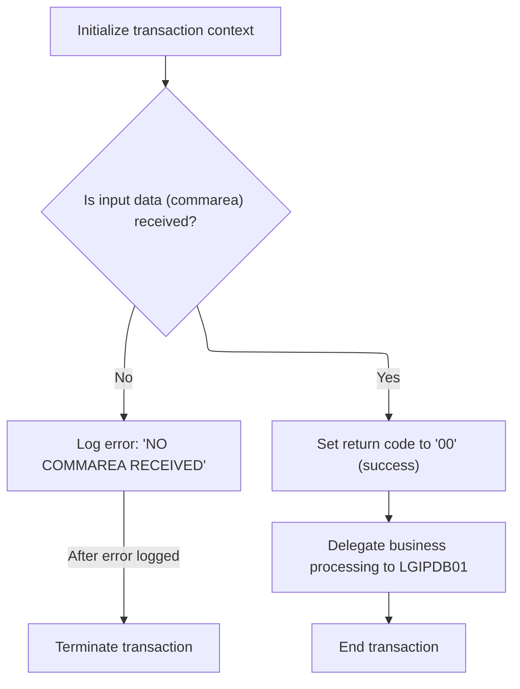

This section is responsible for validating the presence of input data for a policy inquiry transaction, setting up the transaction context, and delegating the actual policy inquiry to the database layer if validation passes.

<SwmSnippet path="/base/src/lgipol01.cbl" line="70">

---

<SwmToken path="base/src/lgipol01.cbl" pos="70:1:1" line-data="       MAINLINE SECTION.">`MAINLINE`</SwmToken> in <SwmToken path="base/src/lgtestp2.cbl" pos="67:10:10" line-data="                 EXEC CICS LINK PROGRAM(&#39;LGIPOL01&#39;)">`LGIPOL01`</SwmToken> checks for valid input, sets up transaction context, and if the commarea is missing, logs an error and abends. Then it links to <SwmToken path="base/src/lgipol01.cbl" pos="91:9:9" line-data="           EXEC CICS LINK Program(LGIPDB01)">`LGIPDB01`</SwmToken> to actually fetch the policy details from <SwmToken path="base/src/lgipdb01.cbl" pos="242:5:5" line-data="      * initialize DB2 host variables">`DB2`</SwmToken>. This is where the inquiry is handed off to the database layer.

```cobol
       MAINLINE SECTION.
      *
           INITIALIZE WS-HEADER.
      *
           MOVE EIBTRNID TO WS-TRANSID.
           MOVE EIBTRMID TO WS-TERMID.
           MOVE EIBTASKN TO WS-TASKNUM.
      *
      * If NO commarea received issue an ABEND
           IF EIBCALEN IS EQUAL TO ZERO
               MOVE ' NO COMMAREA RECEIVED' TO EM-VARIABLE
               PERFORM WRITE-ERROR-MESSAGE
               EXEC CICS ABEND ABCODE('LGCA') NODUMP END-EXEC
           END-IF

      * initialize commarea return code to zero
           MOVE '00' TO CA-RETURN-CODE
           MOVE EIBCALEN TO WS-CALEN.
           SET WS-ADDR-DFHCOMMAREA TO ADDRESS OF DFHCOMMAREA.
      *

           EXEC CICS LINK Program(LGIPDB01)
               Commarea(DFHCOMMAREA)
               Length(32500)
           END-EXEC.

           EXEC CICS RETURN END-EXEC.
```

---

</SwmSnippet>

## Logging errors and writing to queues

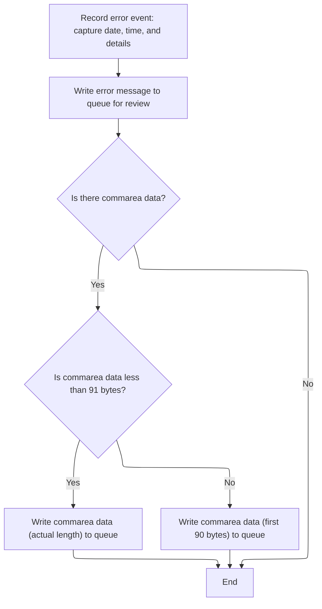

This section governs how error events and related data are captured, formatted, and reliably written to system and Genapp queues for tracking and review.

| Category       | Rule Name                     | Description                                                                                                                                                                                |
| -------------- | ----------------------------- | ------------------------------------------------------------------------------------------------------------------------------------------------------------------------------------------ |
| Business logic | Timestamped error logging     | Every error event must include the current date and time, formatted according to system standards, in the error message output.                                                            |
| Business logic | Dual queue error delivery     | All error messages must be written to both the system TDQ and the Genapp TSQ queues for review and tracking.                                                                               |
| Business logic | Commarea data size limit      | If commarea data is present, up to 90 bytes of it must be included in the queue message; if less than 91 bytes, the actual length is used, otherwise only the first 90 bytes are included. |
| Business logic | Error message prefix handling | Error messages must be formatted to remove any leading 'Q=' prefix and adjust the message length accordingly before writing to queues.                                                     |
| Business logic | Queue message acknowledgement | If a message is received from a queue, a minimal response must be sent back to acknowledge receipt.                                                                                        |

<SwmSnippet path="/base/src/lgipol01.cbl" line="107">

---

<SwmToken path="base/src/lgipol01.cbl" pos="107:1:5" line-data="       WRITE-ERROR-MESSAGE.">`WRITE-ERROR-MESSAGE`</SwmToken> grabs the current <SwmToken path="base/src/lgipol01.cbl" pos="35:7:9" line-data="      * Variables for time/date processing">`time/date`</SwmToken>, formats it, and sends the error details to LGSTSQ for queue logging. If there's commarea data, it writes up to 90 bytes of it to the queue as well. This keeps error tracking consistent and avoids overflows.

```cobol
       WRITE-ERROR-MESSAGE.
      * Save SQLCODE in message
      * Obtain and format current time and date
           EXEC CICS ASKTIME ABSTIME(ABS-TIME)
           END-EXEC
           EXEC CICS FORMATTIME ABSTIME(ABS-TIME)
                     MMDDYYYY(DATE1)
                     TIME(TIME1)
           END-EXEC
           MOVE DATE1 TO EM-DATE
           MOVE TIME1 TO EM-TIME
      * Write output message to TDQ
           EXEC CICS LINK PROGRAM('LGSTSQ')
                     COMMAREA(ERROR-MSG)
                     LENGTH(LENGTH OF ERROR-MSG)
           END-EXEC.
      * Write 90 bytes or as much as we have of commarea to TDQ
           IF EIBCALEN > 0 THEN
             IF EIBCALEN < 91 THEN
               MOVE DFHCOMMAREA(1:EIBCALEN) TO CA-DATA
               EXEC CICS LINK PROGRAM('LGSTSQ')
                         COMMAREA(CA-ERROR-MSG)
                         LENGTH(LENGTH OF CA-ERROR-MSG)
               END-EXEC
             ELSE
               MOVE DFHCOMMAREA(1:90) TO CA-DATA
               EXEC CICS LINK PROGRAM('LGSTSQ')
                         COMMAREA(CA-ERROR-MSG)
                         LENGTH(LENGTH OF CA-ERROR-MSG)
               END-EXEC
             END-IF
           END-IF.
           EXIT.
```

---

</SwmSnippet>

<SwmSnippet path="/base/src/lgstsq.cbl" line="55">

---

<SwmToken path="base/src/lgstsq.cbl" pos="55:1:1" line-data="       MAINLINE SECTION.">`MAINLINE`</SwmToken> in LGSTSQ figures out where the message came from, formats it (removing 'Q=' if present), adjusts the length, and writes it to both TDQ and TSQ queues. If the message was received, it sends a minimal response back. This covers both system and Genapp logging.

```cobol
       MAINLINE SECTION.

           MOVE SPACES TO WRITE-MSG.
           MOVE SPACES TO WS-RECV.

           EXEC CICS ASSIGN SYSID(WRITE-MSG-SYSID)
                RESP(WS-RESP)
           END-EXEC.

           EXEC CICS ASSIGN INVOKINGPROG(WS-INVOKEPROG)
                RESP(WS-RESP)
           END-EXEC.
           
           IF WS-INVOKEPROG NOT = SPACES
              MOVE 'C' To WS-FLAG
              MOVE COMMA-DATA  TO WRITE-MSG-MSG
              MOVE EIBCALEN    TO WS-RECV-LEN
           ELSE
              EXEC CICS RECEIVE INTO(WS-RECV)
                  LENGTH(WS-RECV-LEN)
                  RESP(WS-RESP)
              END-EXEC
              MOVE 'R' To WS-FLAG
              MOVE WS-RECV-DATA  TO WRITE-MSG-MSG
              SUBTRACT 5 FROM WS-RECV-LEN
           END-IF.

           MOVE 'GENAERRS' TO STSQ-NAME.
           IF WRITE-MSG-MSG(1:2) = 'Q=' THEN
              MOVE WRITE-MSG-MSG(3:4) TO STSQ-EXT
              MOVE WRITE-MSG-REST TO TEMPO
              MOVE TEMPO          TO WRITE-MSG-MSG
              SUBTRACT 7 FROM WS-RECV-LEN
           END-IF.

           ADD 5 TO WS-RECV-LEN.

      * Write output message to TDQ CSMT
      *
           EXEC CICS WRITEQ TD QUEUE(STDQ-NAME)
                     FROM(WRITE-MSG)
                     RESP(WS-RESP)
                     LENGTH(WS-RECV-LEN)

           END-EXEC.

      * Write output message to Genapp TSQ
      * If no space is available then the task will not wait for
      *  storage to become available but will ignore the request...
      *
           EXEC CICS WRITEQ TS QUEUE(STSQ-NAME)
                     FROM(WRITE-MSG)
                     RESP(WS-RESP)
                     NOSUSPEND
                     LENGTH(WS-RECV-LEN)

           END-EXEC.

           If WS-FLAG = 'R' Then
             EXEC CICS SEND TEXT FROM(FILLER-X)
              WAIT
              ERASE
              LENGTH(1)
              FREEKB
             END-EXEC.

           EXEC CICS RETURN
           END-EXEC.
```

---

</SwmSnippet>

## Dispatching and processing policy data requests

```mermaid
%%{init: {"flowchart": {"defaultRenderer": "elk"}} }%%
flowchart TD
    node1["Initialize variables and working storage"]
    click node1 openCode "base/src/lgipdb01.cbl:230:246"
    node1 --> node2{"Is request data present?"}
    click node2 openCode "base/src/lgipdb01.cbl:251:255"
    node2 -->|"No"| node3["Write error message and abort"]
    click node3 openCode "base/src/lgipdb01.cbl:252:254"
    node2 -->|"Yes"| node4["Prepare commarea and convert input"]
    click node4 openCode "base/src/lgipdb01.cbl:258:267"
    node4 --> node5{"Which policy type is requested?"}
    click node5 openCode "base/src/lgipdb01.cbl:277:310"
    node5 -->|"Endowment"| node6{"Was DB query successful?"}
    click node6 openCode "base/src/lgipdb01.cbl:370:431"
    node6 -->|"Yes"| node11["Return endowment policy details"]
    click node11 openCode "base/src/lgipdb01.cbl:395:418"
    node6 -->|"No data"| node12["Set error code: invalid customer/policy"]
    click node12 openCode "base/src/lgipdb01.cbl:423:424"
    node6 -->|"Error"| node13["Set error code and write error message"]
    click node13 openCode "base/src/lgipdb01.cbl:426:429"
    node5 -->|"House"| node7{"Was DB query successful?"}
    click node7 openCode "base/src/lgipdb01.cbl:478:521"
    node7 -->|"Yes"| node14["Return house policy details"]
    click node14 openCode "base/src/lgipdb01.cbl:492:508"
    node7 -->|"No data"| node15["Set error code: invalid customer/policy"]
    click node15 openCode "base/src/lgipdb01.cbl:514:515"
    node7 -->|"Error"| node16["Set error code and write error message"]
    click node16 openCode "base/src/lgipdb01.cbl:517:519"
    node5 -->|"Motor"| node8{"Was DB query successful?"}
    click node8 openCode "base/src/lgipdb01.cbl:572:619"
    node8 -->|"Yes"| node17["Return motor policy details"]
    click node17 openCode "base/src/lgipdb01.cbl:585:606"
    node8 -->|"No data"| node18["Set error code: invalid customer/policy"]
    click node18 openCode "base/src/lgipdb01.cbl:612:613"
    node8 -->|"Error"| node19["Set error code and write error message"]
    click node19 openCode "base/src/lgipdb01.cbl:615:617"
    node5 -->|"Commercial"| node9["Retrieve commercial policy details"]
    click node9 openCode "base/src/lgipdb01.cbl:292:306"
    node5 -->|"Other"| node10["Set error code"]
    click node10 openCode "base/src/lgipdb01.cbl:308:309"

classDef HeadingStyle fill:#777777,stroke:#333,stroke-width:2px;

%% Swimm:
%% %%{init: {"flowchart": {"defaultRenderer": "elk"}} }%%
%% flowchart TD
%%     node1["Initialize variables and working storage"]
%%     click node1 openCode "<SwmPath>[base/src/lgipdb01.cbl](base/src/lgipdb01.cbl)</SwmPath>:230:246"
%%     node1 --> node2{"Is request data present?"}
%%     click node2 openCode "<SwmPath>[base/src/lgipdb01.cbl](base/src/lgipdb01.cbl)</SwmPath>:251:255"
%%     node2 -->|"No"| node3["Write error message and abort"]
%%     click node3 openCode "<SwmPath>[base/src/lgipdb01.cbl](base/src/lgipdb01.cbl)</SwmPath>:252:254"
%%     node2 -->|"Yes"| node4["Prepare commarea and convert input"]
%%     click node4 openCode "<SwmPath>[base/src/lgipdb01.cbl](base/src/lgipdb01.cbl)</SwmPath>:258:267"
%%     node4 --> node5{"Which policy type is requested?"}
%%     click node5 openCode "<SwmPath>[base/src/lgipdb01.cbl](base/src/lgipdb01.cbl)</SwmPath>:277:310"
%%     node5 -->|"Endowment"| node6{"Was DB query successful?"}
%%     click node6 openCode "<SwmPath>[base/src/lgipdb01.cbl](base/src/lgipdb01.cbl)</SwmPath>:370:431"
%%     node6 -->|"Yes"| node11["Return endowment policy details"]
%%     click node11 openCode "<SwmPath>[base/src/lgipdb01.cbl](base/src/lgipdb01.cbl)</SwmPath>:395:418"
%%     node6 -->|"No data"| node12["Set error code: invalid customer/policy"]
%%     click node12 openCode "<SwmPath>[base/src/lgipdb01.cbl](base/src/lgipdb01.cbl)</SwmPath>:423:424"
%%     node6 -->|"Error"| node13["Set error code and write error message"]
%%     click node13 openCode "<SwmPath>[base/src/lgipdb01.cbl](base/src/lgipdb01.cbl)</SwmPath>:426:429"
%%     node5 -->|"House"| node7{"Was DB query successful?"}
%%     click node7 openCode "<SwmPath>[base/src/lgipdb01.cbl](base/src/lgipdb01.cbl)</SwmPath>:478:521"
%%     node7 -->|"Yes"| node14["Return house policy details"]
%%     click node14 openCode "<SwmPath>[base/src/lgipdb01.cbl](base/src/lgipdb01.cbl)</SwmPath>:492:508"
%%     node7 -->|"No data"| node15["Set error code: invalid customer/policy"]
%%     click node15 openCode "<SwmPath>[base/src/lgipdb01.cbl](base/src/lgipdb01.cbl)</SwmPath>:514:515"
%%     node7 -->|"Error"| node16["Set error code and write error message"]
%%     click node16 openCode "<SwmPath>[base/src/lgipdb01.cbl](base/src/lgipdb01.cbl)</SwmPath>:517:519"
%%     node5 -->|"Motor"| node8{"Was DB query successful?"}
%%     click node8 openCode "<SwmPath>[base/src/lgipdb01.cbl](base/src/lgipdb01.cbl)</SwmPath>:572:619"
%%     node8 -->|"Yes"| node17["Return motor policy details"]
%%     click node17 openCode "<SwmPath>[base/src/lgipdb01.cbl](base/src/lgipdb01.cbl)</SwmPath>:585:606"
%%     node8 -->|"No data"| node18["Set error code: invalid customer/policy"]
%%     click node18 openCode "<SwmPath>[base/src/lgipdb01.cbl](base/src/lgipdb01.cbl)</SwmPath>:612:613"
%%     node8 -->|"Error"| node19["Set error code and write error message"]
%%     click node19 openCode "<SwmPath>[base/src/lgipdb01.cbl](base/src/lgipdb01.cbl)</SwmPath>:615:617"
%%     node5 -->|"Commercial"| node9["Retrieve commercial policy details"]
%%     click node9 openCode "<SwmPath>[base/src/lgipdb01.cbl](base/src/lgipdb01.cbl)</SwmPath>:292:306"
%%     node5 -->|"Other"| node10["Set error code"]
%%     click node10 openCode "<SwmPath>[base/src/lgipdb01.cbl](base/src/lgipdb01.cbl)</SwmPath>:308:309"
%% 
%% classDef HeadingStyle fill:#777777,stroke:#333,stroke-width:2px;
```

This section governs how policy data requests are dispatched and processed. It ensures that only valid requests are handled, routes them to the correct policy type handler, and manages error codes and output formatting for both successful and failed queries. The section supports multiple policy types and ensures that returned data is complete, accurate, and fits within the provided buffer.

| Category       | Rule Name            | Description                                                                                                                                                            |
| -------------- | -------------------- | ---------------------------------------------------------------------------------------------------------------------------------------------------------------------- |
| Business logic | Policy type dispatch | Each supported policy type (Endowment, House, Motor, Commercial) must be routed to its corresponding handler, which retrieves and returns the relevant policy details. |

<SwmSnippet path="/base/src/lgipdb01.cbl" line="230">

---

<SwmToken path="base/src/lgipdb01.cbl" pos="230:1:1" line-data="       MAINLINE SECTION.">`MAINLINE`</SwmToken> in <SwmToken path="base/src/lgipol01.cbl" pos="91:9:9" line-data="           EXEC CICS LINK Program(LGIPDB01)">`LGIPDB01`</SwmToken> sets up context, checks for valid input, converts request IDs to uppercase, and dispatches to the right subroutine based on the policy type. Each request ID triggers a different <SwmToken path="base/src/lgipdb01.cbl" pos="242:5:5" line-data="      * initialize DB2 host variables">`DB2`</SwmToken> query and data handling routine.

```cobol
       MAINLINE SECTION.

      *----------------------------------------------------------------*
      * Common code                                                    *
      *----------------------------------------------------------------*
      * initialize working storage variables
           INITIALIZE WS-HEADER.
      * set up general variable
           MOVE EIBTRNID TO WS-TRANSID.
           MOVE EIBTRMID TO WS-TERMID.
           MOVE EIBTASKN TO WS-TASKNUM.
      *----------------------------------------------------------------*
      * initialize DB2 host variables
           INITIALIZE DB2-IN-INTEGERS.
           INITIALIZE DB2-OUT-INTEGERS.
           INITIALIZE DB2-POLICY.

      *---------------------------------------------------------------*
      * Check commarea and obtain required details                    *
      *---------------------------------------------------------------*
      * If NO commarea received issue an ABEND
           IF EIBCALEN IS EQUAL TO ZERO
             MOVE ' NO COMMAREA RECEIVED' TO EM-VARIABLE
             PERFORM WRITE-ERROR-MESSAGE
             EXEC CICS ABEND ABCODE('LGCA') NODUMP END-EXEC
           END-IF

      * initialize commarea return code to zero
           MOVE '00' TO CA-RETURN-CODE
           MOVE EIBCALEN TO WS-CALEN
           SET WS-ADDR-DFHCOMMAREA TO ADDRESS OF DFHCOMMAREA

      * Convert commarea customer & policy nums to DB2 integer format
           MOVE CA-CUSTOMER-NUM TO DB2-CUSTOMERNUM-INT
           MOVE CA-POLICY-NUM   TO DB2-POLICYNUM-INT
      * and save in error msg field incase required
           MOVE CA-CUSTOMER-NUM TO EM-CUSNUM
           MOVE CA-POLICY-NUM   TO EM-POLNUM

      *----------------------------------------------------------------*
      * Check which policy type is being requested                     *
      * This is not actually required whilst only endowment policy     *
      * inquires are supported, but will make future expansion simpler *
      *----------------------------------------------------------------*
      * Upper case value passed in Request Id field                    *
           MOVE FUNCTION UPPER-CASE(CA-REQUEST-ID) TO WS-REQUEST-ID

           EVALUATE WS-REQUEST-ID

             WHEN '01IEND'
               INITIALIZE DB2-ENDOWMENT
               PERFORM GET-ENDOW-DB2-INFO

             WHEN '01IHOU'
               INITIALIZE DB2-HOUSE
               PERFORM GET-HOUSE-DB2-INFO

             WHEN '01IMOT'
               INITIALIZE DB2-MOTOR
               PERFORM GET-MOTOR-DB2-INFO

             WHEN '01ICOM'
               INITIALIZE DB2-COMMERCIAL
               PERFORM GET-COMMERCIAL-DB2-INFO-1

             WHEN '02ICOM'
               INITIALIZE DB2-COMMERCIAL
               PERFORM GET-COMMERCIAL-DB2-INFO-2

             WHEN '03ICOM'
               INITIALIZE DB2-COMMERCIAL
               PERFORM GET-COMMERCIAL-DB2-INFO-3

             WHEN '05ICOM'
               INITIALIZE DB2-COMMERCIAL
               PERFORM GET-COMMERCIAL-DB2-INFO-5

             WHEN OTHER
               MOVE '99' TO CA-RETURN-CODE

           END-EVALUATE.
```

---

</SwmSnippet>

<SwmSnippet path="/base/src/lgipdb01.cbl" line="997">

---

<SwmToken path="base/src/lgipdb01.cbl" pos="997:1:5" line-data="       WRITE-ERROR-MESSAGE.">`WRITE-ERROR-MESSAGE`</SwmToken> in <SwmToken path="base/src/lgipol01.cbl" pos="91:9:9" line-data="           EXEC CICS LINK Program(LGIPDB01)">`LGIPDB01`</SwmToken> logs the SQL error code and timestamp, then sends both the error details and up to 90 bytes of commarea data to LGSTSQ for queue tracking. This covers both the error and the context for debugging.

```cobol
       WRITE-ERROR-MESSAGE.
      * Save SQLCODE in message
           MOVE SQLCODE TO EM-SQLRC
      * Obtain and format current time and date
           EXEC CICS ASKTIME ABSTIME(ABS-TIME)
           END-EXEC
           EXEC CICS FORMATTIME ABSTIME(ABS-TIME)
                     MMDDYYYY(DATE1)
                     TIME(TIME1)
           END-EXEC
           MOVE DATE1 TO EM-DATE
           MOVE TIME1 TO EM-TIME
      * Write output message to TDQ
           EXEC CICS LINK PROGRAM('LGSTSQ')
                     COMMAREA(ERROR-MSG)
                     LENGTH(LENGTH OF ERROR-MSG)
           END-EXEC.
      * Write 90 bytes or as much as we have of commarea to TDQ
           IF EIBCALEN > 0 THEN
             IF EIBCALEN < 91 THEN
               MOVE DFHCOMMAREA(1:EIBCALEN) TO CA-DATA
               EXEC CICS LINK PROGRAM('LGSTSQ')
                         COMMAREA(CA-ERROR-MSG)
                         LENGTH(LENGTH OF CA-ERROR-MSG)
               END-EXEC
             ELSE
               MOVE DFHCOMMAREA(1:90) TO CA-DATA
               EXEC CICS LINK PROGRAM('LGSTSQ')
                         COMMAREA(CA-ERROR-MSG)
                         LENGTH(LENGTH OF CA-ERROR-MSG)
               END-EXEC
             END-IF
           END-IF.
           EXIT.
```

---

</SwmSnippet>

<SwmSnippet path="/base/src/lgipdb01.cbl" line="327">

---

<SwmToken path="base/src/lgipdb01.cbl" pos="327:1:7" line-data="       GET-ENDOW-DB2-INFO.">`GET-ENDOW-DB2-INFO`</SwmToken> runs a <SwmToken path="base/src/lgipdb01.cbl" pos="327:5:5" line-data="       GET-ENDOW-DB2-INFO.">`DB2`</SwmToken> query, calculates the buffer size needed for all policy data (including variable-length fields), checks if the commarea is big enough, and moves only <SwmToken path="base/src/lgipdb01.cbl" pos="379:13:15" line-data="      *      check whether PADDINGDATA field is non-null">`non-null`</SwmToken> fields. It marks the end of data with 'FINAL' and sets error codes if anything fails.

```cobol
       GET-ENDOW-DB2-INFO.

           MOVE ' SELECT ENDOW ' TO EM-SQLREQ
           EXEC SQL
             SELECT  ISSUEDATE,
                     EXPIRYDATE,
                     LASTCHANGED,
                     BROKERID,
                     BROKERSREFERENCE,
                     PAYMENT,
                     WITHPROFITS,
                     EQUITIES,
                     MANAGEDFUND,
                     FUNDNAME,
                     TERM,
                     SUMASSURED,
                     LIFEASSURED,
                     PADDINGDATA,
                     LENGTH(PADDINGDATA)
             INTO  :DB2-ISSUEDATE,
                   :DB2-EXPIRYDATE,
                   :DB2-LASTCHANGED,
                   :DB2-BROKERID-INT INDICATOR :IND-BROKERID,
                   :DB2-BROKERSREF INDICATOR :IND-BROKERSREF,
                   :DB2-PAYMENT-INT INDICATOR :IND-PAYMENT,
                   :DB2-E-WITHPROFITS,
                   :DB2-E-EQUITIES,
                   :DB2-E-MANAGEDFUND,
                   :DB2-E-FUNDNAME,
                   :DB2-E-TERM-SINT,
                   :DB2-E-SUMASSURED-INT,
                   :DB2-E-LIFEASSURED,
                   :DB2-E-PADDINGDATA INDICATOR :IND-E-PADDINGDATA,
                   :DB2-E-PADDING-LEN INDICATOR :IND-E-PADDINGDATAL
             FROM  POLICY,ENDOWMENT
             WHERE ( POLICY.POLICYNUMBER =
                        ENDOWMENT.POLICYNUMBER   AND
                     POLICY.CUSTOMERNUMBER =
                        :DB2-CUSTOMERNUM-INT             AND
                     POLICY.POLICYNUMBER =
                        :DB2-POLICYNUM-INT               )
           END-EXEC

           IF SQLCODE = 0
      *      Select was successful

      *      Calculate size of commarea required to return all data
             ADD WS-CA-HEADERTRAILER-LEN TO WS-REQUIRED-CA-LEN
             ADD WS-FULL-ENDOW-LEN       TO WS-REQUIRED-CA-LEN

      *----------------------------------------------------------------*
      *      Specific code to allow for length of VACHAR data
      *      check whether PADDINGDATA field is non-null
      *        and calculate length of endowment policy
      *        and position of free space in commarea after policy data
      *----------------------------------------------------------------*
             IF IND-E-PADDINGDATAL NOT EQUAL MINUS-ONE
               ADD DB2-E-PADDING-LEN TO WS-REQUIRED-CA-LEN
               ADD DB2-E-PADDING-LEN TO END-POLICY-POS
             END-IF

      *      if commarea received is not large enough ...
      *        set error return code and return to caller
             IF EIBCALEN IS LESS THAN WS-REQUIRED-CA-LEN
               MOVE '98' TO CA-RETURN-CODE
               EXEC CICS RETURN END-EXEC
             ELSE
      *        Length is sufficent so move data to commarea
      *        Move Integer fields to required length numerics
      *        Don't move null fields
               IF IND-BROKERID NOT EQUAL MINUS-ONE
                 MOVE DB2-BROKERID-INT    TO DB2-BROKERID
               END-IF
               IF IND-PAYMENT NOT EQUAL MINUS-ONE
                 MOVE DB2-PAYMENT-INT TO DB2-PAYMENT
               END-IF
      *----------------------------------------------------------------*
               MOVE DB2-E-TERM-SINT       TO DB2-E-TERM
               MOVE DB2-E-SUMASSURED-INT  TO DB2-E-SUMASSURED

               MOVE DB2-POLICY-COMMON     TO CA-POLICY-COMMON
               MOVE DB2-ENDOW-FIXED
                   TO CA-ENDOWMENT(1:WS-ENDOW-LEN)
               IF IND-E-PADDINGDATA NOT EQUAL MINUS-ONE
                 MOVE DB2-E-PADDINGDATA TO
                     CA-E-PADDING-DATA(1:DB2-E-PADDING-LEN)
               END-IF
             END-IF

      *      Mark the end of the policy data
             MOVE 'FINAL' TO CA-E-PADDING-DATA(END-POLICY-POS:5)

           ELSE
      *      Non-zero SQLCODE from first SQL FETCH statement
             IF SQLCODE EQUAL 100
      *        No rows found - invalid customer / policy number
               MOVE '01' TO CA-RETURN-CODE
             ELSE
      *        something has gone wrong
               MOVE '90' TO CA-RETURN-CODE
      *        Write error message to TD QUEUE(CSMT)
               PERFORM WRITE-ERROR-MESSAGE
             END-IF

           END-IF.
           EXIT.
```

---

</SwmSnippet>

<SwmSnippet path="/base/src/lgipdb01.cbl" line="441">

---

<SwmToken path="base/src/lgipdb01.cbl" pos="441:1:7" line-data="       GET-HOUSE-DB2-INFO.">`GET-HOUSE-DB2-INFO`</SwmToken> fetches house policy data, calculates the required buffer size, checks for null fields using indicators, moves only valid data, and sets error codes if the buffer is too small or no data is found.

```cobol
       GET-HOUSE-DB2-INFO.

           MOVE ' SELECT HOUSE ' TO EM-SQLREQ
           EXEC SQL
             SELECT  ISSUEDATE,
                     EXPIRYDATE,
                     LASTCHANGED,
                     BROKERID,
                     BROKERSREFERENCE,
                     PAYMENT,
                     PROPERTYTYPE,
                     BEDROOMS,
                     VALUE,
                     HOUSENAME,
                     HOUSENUMBER,
                     POSTCODE
             INTO  :DB2-ISSUEDATE,
                   :DB2-EXPIRYDATE,
                   :DB2-LASTCHANGED,
                   :DB2-BROKERID-INT INDICATOR :IND-BROKERID,
                   :DB2-BROKERSREF INDICATOR :IND-BROKERSREF,
                   :DB2-PAYMENT-INT INDICATOR :IND-PAYMENT,
                   :DB2-H-PROPERTYTYPE,
                   :DB2-H-BEDROOMS-SINT,
                   :DB2-H-VALUE-INT,
                   :DB2-H-HOUSENAME,
                   :DB2-H-HOUSENUMBER,
                   :DB2-H-POSTCODE
             FROM  POLICY,HOUSE
             WHERE ( POLICY.POLICYNUMBER =
                        HOUSE.POLICYNUMBER   AND
                     POLICY.CUSTOMERNUMBER =
                        :DB2-CUSTOMERNUM-INT             AND
                     POLICY.POLICYNUMBER =
                        :DB2-POLICYNUM-INT               )
           END-EXEC

           IF SQLCODE = 0
      *      Select was successful

      *      Calculate size of commarea required to return all data
             ADD WS-CA-HEADERTRAILER-LEN TO WS-REQUIRED-CA-LEN
             ADD WS-FULL-HOUSE-LEN       TO WS-REQUIRED-CA-LEN

      *      if commarea received is not large enough ...
      *        set error return code and return to caller
             IF EIBCALEN IS LESS THAN WS-REQUIRED-CA-LEN
               MOVE '98' TO CA-RETURN-CODE
               EXEC CICS RETURN END-EXEC
             ELSE
      *        Length is sufficent so move data to commarea
      *        Move Integer fields to required length numerics
      *        Don't move null fields
               IF IND-BROKERID NOT EQUAL MINUS-ONE
                 MOVE DB2-BROKERID-INT  TO DB2-BROKERID
               END-IF
               IF IND-PAYMENT NOT EQUAL MINUS-ONE
                 MOVE DB2-PAYMENT-INT TO DB2-PAYMENT
               END-IF
               MOVE DB2-H-BEDROOMS-SINT TO DB2-H-BEDROOMS
               MOVE DB2-H-VALUE-INT     TO DB2-H-VALUE

               MOVE DB2-POLICY-COMMON   TO CA-POLICY-COMMON
               MOVE DB2-HOUSE           TO CA-HOUSE(1:WS-HOUSE-LEN)
             END-IF

      *      Mark the end of the policy data
             MOVE 'FINAL' TO CA-H-FILLER(1:5)

           ELSE
      *      Non-zero SQLCODE from first SQL FETCH statement
             IF SQLCODE EQUAL 100
      *        No rows found - invalid customer / policy number
               MOVE '01' TO CA-RETURN-CODE
             ELSE
      *        something has gone wrong
               MOVE '90' TO CA-RETURN-CODE
      *        Write error message to TD QUEUE(CSMT)
               PERFORM WRITE-ERROR-MESSAGE
             END-IF

           END-IF.
           EXIT.
```

---

</SwmSnippet>

<SwmSnippet path="/base/src/lgipdb01.cbl" line="529">

---

<SwmToken path="base/src/lgipdb01.cbl" pos="529:1:7" line-data="       GET-MOTOR-DB2-INFO.">`GET-MOTOR-DB2-INFO`</SwmToken> fetches motor policy data, calculates the required buffer size, checks for nulls using indicators, moves only valid fields, and marks the end with 'FINAL'. Error codes are set for buffer issues or missing data.

```cobol
       GET-MOTOR-DB2-INFO.

           MOVE ' SELECT MOTOR ' TO EM-SQLREQ
           EXEC SQL
             SELECT  ISSUEDATE,
                     EXPIRYDATE,
                     LASTCHANGED,
                     BROKERID,
                     BROKERSREFERENCE,
                     PAYMENT,
                     MAKE,
                     MODEL,
                     VALUE,
                     REGNUMBER,
                     COLOUR,
                     CC,
                     YEAROFMANUFACTURE,
                     PREMIUM,
                     ACCIDENTS
             INTO  :DB2-ISSUEDATE,
                   :DB2-EXPIRYDATE,
                   :DB2-LASTCHANGED,
                   :DB2-BROKERID-INT INDICATOR :IND-BROKERID,
                   :DB2-BROKERSREF INDICATOR :IND-BROKERSREF,
                   :DB2-PAYMENT-INT INDICATOR :IND-PAYMENT,
                   :DB2-M-MAKE,
                   :DB2-M-MODEL,
                   :DB2-M-VALUE-INT,
                   :DB2-M-REGNUMBER,
                   :DB2-M-COLOUR,
                   :DB2-M-CC-SINT,
                   :DB2-M-MANUFACTURED,
                   :DB2-M-PREMIUM-INT,
                   :DB2-M-ACCIDENTS-INT
             FROM  POLICY,MOTOR
             WHERE ( POLICY.POLICYNUMBER =
                        MOTOR.POLICYNUMBER   AND
                     POLICY.CUSTOMERNUMBER =
                        :DB2-CUSTOMERNUM-INT             AND
                     POLICY.POLICYNUMBER =
                        :DB2-POLICYNUM-INT               )
           END-EXEC

           IF SQLCODE = 0
      *      Select was successful

      *      Calculate size of commarea required to return all data
             ADD WS-CA-HEADERTRAILER-LEN TO WS-REQUIRED-CA-LEN
             ADD WS-FULL-MOTOR-LEN       TO WS-REQUIRED-CA-LEN

      *      if commarea received is not large enough ...
      *        set error return code and return to caller
             IF EIBCALEN IS LESS THAN WS-REQUIRED-CA-LEN
               MOVE '98' TO CA-RETURN-CODE
               EXEC CICS RETURN END-EXEC
             ELSE
      *        Length is sufficent so move data to commarea
      *        Move Integer fields to required length numerics
      *        Don't move null fields
               IF IND-BROKERID NOT EQUAL MINUS-ONE
                 MOVE DB2-BROKERID-INT TO DB2-BROKERID
               END-IF
               IF IND-PAYMENT NOT EQUAL MINUS-ONE
                 MOVE DB2-PAYMENT-INT    TO DB2-PAYMENT
               END-IF
               MOVE DB2-M-CC-SINT      TO DB2-M-CC
               MOVE DB2-M-VALUE-INT    TO DB2-M-VALUE
               MOVE DB2-M-PREMIUM-INT  TO DB2-M-PREMIUM
               MOVE DB2-M-ACCIDENTS-INT TO DB2-M-ACCIDENTS
               MOVE DB2-M-PREMIUM-INT  TO CA-M-PREMIUM
               MOVE DB2-M-ACCIDENTS-INT TO CA-M-ACCIDENTS

               MOVE DB2-POLICY-COMMON  TO CA-POLICY-COMMON
               MOVE DB2-MOTOR          TO CA-MOTOR(1:WS-MOTOR-LEN)
             END-IF

      *      Mark the end of the policy data
             MOVE 'FINAL' TO CA-M-FILLER(1:5)

           ELSE
      *      Non-zero SQLCODE from first SQL FETCH statement
             IF SQLCODE EQUAL 100
      *        No rows found - invalid customer / policy number
               MOVE '01' TO CA-RETURN-CODE
             ELSE
      *        something has gone wrong
               MOVE '90' TO CA-RETURN-CODE
      *        Write error message to TD QUEUE(CSMT)
               PERFORM WRITE-ERROR-MESSAGE
             END-IF

           END-IF.
           EXIT.
```

---

</SwmSnippet>

## Handling inquiry results and error transitions

<SwmSnippet path="/base/src/lgtestp2.cbl" line="71">

---

<SwmToken path="base/src/lgtestp2.cbl" pos="72:5:7" line-data="                   GO TO NO-DATA">`NO-DATA`</SwmToken> sets the message for no returned data and jumps to <SwmToken path="base/src/lgtestp2.cbl" pos="272:5:7" line-data="               Go To ERROR-OUT">`ERROR-OUT`</SwmToken> to show the menu again. This is how we handle empty or failed inquiries.

```cobol
                 IF CA-RETURN-CODE > 0
                   GO TO NO-DATA
                 END-IF
```

---

</SwmSnippet>

## Handling missing policy data

This section ensures that when no policy data is available, the user is notified and the application returns to a stable state, allowing further actions from the main menu.

| Category        | Rule Name                        | Description                                                                                                                  |
| --------------- | -------------------------------- | ---------------------------------------------------------------------------------------------------------------------------- |
| Data validation | Block Operations On Missing Data | The system must not proceed with any policy-related operations if no data is returned, to prevent errors or invalid actions. |
| Business logic  | No Data Notification             | If no policy data is returned, display a message to the user stating 'No data was returned.'                                 |
| Business logic  | UI Reset After Error             | After notifying the user of missing data, the system must reset the UI and show the main menu to allow further user actions. |

<SwmSnippet path="/base/src/lgtestp2.cbl" line="286">

---

In <SwmToken path="base/src/lgtestp2.cbl" pos="288:5:7" line-data="           Go To ERROR-OUT.">`ERROR-OUT`</SwmToken>, we send the <SwmToken path="base/src/lgtestp2.cbl" pos="42:11:11" line-data="           EXEC CICS SEND MAP (&#39;SSMAPP2&#39;)">`SSMAPP2`</SwmToken> map from SSMAP to the terminal, refreshing the UI and showing the main menu again. This is how we reset the screen after an error or no data.

```cobol
       NO-DATA.
           Move 'No data was returned.'            To  ERP2FLDO
           Go To ERROR-OUT.
```

---

</SwmSnippet>

## Resetting UI and returning to main menu

This section governs how the application resets the UI and navigates back to the main menu, ensuring the user sees the correct information and the system is ready for the next transaction.

| Category       | Rule Name                        | Description                                                                                                                                                                      |
| -------------- | -------------------------------- | -------------------------------------------------------------------------------------------------------------------------------------------------------------------------------- |
| Business logic | UI Reset on Menu Return          | When returning to the main menu, the UI must be reset so that no residual data from the previous transaction is displayed to the user.                                           |
| Business logic | Display Returned Policy Data     | Any policy data returned from the backend must be displayed to the user in the output area of the UI map, even if no data is present (in which case the fields should be empty). |
| Business logic | Prepare Data for Policy Creation | When preparing to add a new policy, the communication area must be populated with the user's input data before handing off to the backend transaction.                           |
| Business logic | Return Control to Main Menu      | Control must always be returned to the main menu transaction after completing the current transaction, passing any relevant data in the communication area.                      |

<SwmSnippet path="/base/src/lgtestp2.cbl" line="290">

---

<SwmToken path="base/src/lgtestp2.cbl" pos="229:5:7" line-data="                 GO TO ENDIT-STARTIT">`ENDIT-STARTIT`</SwmToken> returns control to the <SwmToken path="base/src/lgtestp2.cbl" pos="241:4:4" line-data="                TRANSID(&#39;SSP2&#39;)">`SSP2`</SwmToken> transaction, passing back the commarea data. This is how we hand off to the next transaction or menu in CICS.

```cobol
       ERROR-OUT.
           EXEC CICS SEND MAP ('SSMAPP2')
                     FROM(SSMAPP2O)
                     MAPSET ('SSMAP')
           END-EXEC.
```

---

</SwmSnippet>

<SwmSnippet path="/base/src/lgtestp2.cbl" line="296">

---

Back in <SwmToken path="base/src/lgtestp2.cbl" pos="33:5:7" line-data="              GO TO A-GAIN.">`A-GAIN`</SwmToken> after <SwmToken path="base/src/lgtestp2.cbl" pos="72:5:7" line-data="                   GO TO NO-DATA">`NO-DATA`</SwmToken>, we move the returned policy fields into the output area and send the map to the terminal. This updates the UI for the user with whatever data was returned (or not).

```cobol
           Initialize SSMAPP2I.
           Initialize SSMAPP2O.
           Initialize COMM-AREA.

           GO TO ENDIT-STARTIT.
```

---

</SwmSnippet>

<SwmSnippet path="/base/src/lgtestp2.cbl" line="239">

---

Back in <SwmToken path="base/src/lgtestp2.cbl" pos="33:5:7" line-data="              GO TO A-GAIN.">`A-GAIN`</SwmToken> after <SwmToken path="base/src/lgtestp2.cbl" pos="239:1:3" line-data="       ENDIT-STARTIT.">`ENDIT-STARTIT`</SwmToken>, we prep the commarea with user input for adding a new policy. This sets up the next backend call for policy creation.

```cobol
       ENDIT-STARTIT.
           EXEC CICS RETURN
                TRANSID('SSP2')
                COMMAREA(COMM-AREA)
                END-EXEC.
```

---

</SwmSnippet>

## Updating UI after no-data or menu return

<SwmSnippet path="/base/src/lgtestp2.cbl" line="75">

---

Back in <SwmToken path="base/src/lgtestp2.cbl" pos="33:5:7" line-data="              GO TO A-GAIN.">`A-GAIN`</SwmToken> after <SwmToken path="base/src/lgtestp2.cbl" pos="72:5:7" line-data="                   GO TO NO-DATA">`NO-DATA`</SwmToken>, we move the returned policy fields into the output area and send the map to the terminal. This updates the UI for the user with whatever data was returned (or not).

```cobol
                 Move CA-ISSUE-DATE     To  ENP2IDAI
                 Move CA-EXPIRY-DATE    To  ENP2EDAI
                 Move CA-E-FUND-NAME    To  ENP2FNMI
                 Move CA-E-TERM         To  ENP2TERI
                 Move CA-E-SUM-ASSURED  To  ENP2SUMI
                 Move CA-E-LIFE-ASSURED To  ENP2LIFI
                 Move CA-E-WITH-PROFITS To  ENP2WPRI
                 Move CA-E-MANAGED-FUND To  ENP2MANI
                 Move CA-E-EQUITIES     To  ENP2EQUI
                 EXEC CICS SEND MAP ('SSMAPP2')
                           FROM(SSMAPP2O)
                           MAPSET ('SSMAP')
                 END-EXEC
```

---

</SwmSnippet>

<SwmSnippet path="/base/src/lgtestp2.cbl" line="90">

---

<SwmToken path="base/src/lgapol01.cbl" pos="68:1:3" line-data="       P100-MAIN SECTION.">`P100-MAIN`</SwmToken> checks for valid input, sets up control variables, validates commarea length, and calls <SwmToken path="base/src/lgapol01.cbl" pos="103:9:9" line-data="           EXEC CICS Link Program(LGAPDB01)">`LGAPDB01`</SwmToken> to process the policy application and calculate premiums. Errors are logged and handled if anything is missing or invalid.

```cobol
             WHEN '2'
                 Move '01AEND'          To CA-REQUEST-ID
                 Move ENP2CNOI          To CA-CUSTOMER-NUM
                 Move 0                 To CA-PAYMENT
                 Move 0                 To CA-BROKERID
                 Move '        '        To CA-BROKERSREF
                 Move ENP2IDAI          To CA-ISSUE-DATE
                 Move ENP2EDAI          To CA-EXPIRY-DATE
                 Move ENP2FNMI          To CA-E-FUND-NAME
                 Move ENP2TERI          To CA-E-TERM
                 Move ENP2SUMI          To CA-E-SUM-ASSURED
                 Move ENP2LIFI          To CA-E-LIFE-ASSURED
                 Move ENP2WPRI          To CA-E-WITH-PROFITS
                 Move ENP2MANI          To CA-E-MANAGED-FUND
                 Move ENP2EQUI          To CA-E-EQUITIES
```

---

</SwmSnippet>

<SwmSnippet path="/base/src/lgtestp2.cbl" line="105">

---

<SwmToken path="base/src/lgapol01.cbl" pos="85:3:5" line-data="               PERFORM P999-ERROR">`P999-ERROR`</SwmToken> formats the error message with <SwmToken path="base/src/lgipol01.cbl" pos="35:7:9" line-data="      * Variables for time/date processing">`time/date`</SwmToken>, sends it to LGSTSQ for logging, and writes up to 90 bytes of commarea data if present. This keeps error tracking consistent and avoids overflows.

```cobol
                 EXEC CICS LINK PROGRAM('LGAPOL01')
                           COMMAREA(COMM-AREA)
                           LENGTH(32500)
                 END-EXEC
```

---

</SwmSnippet>

## Executing premium calculation workflow

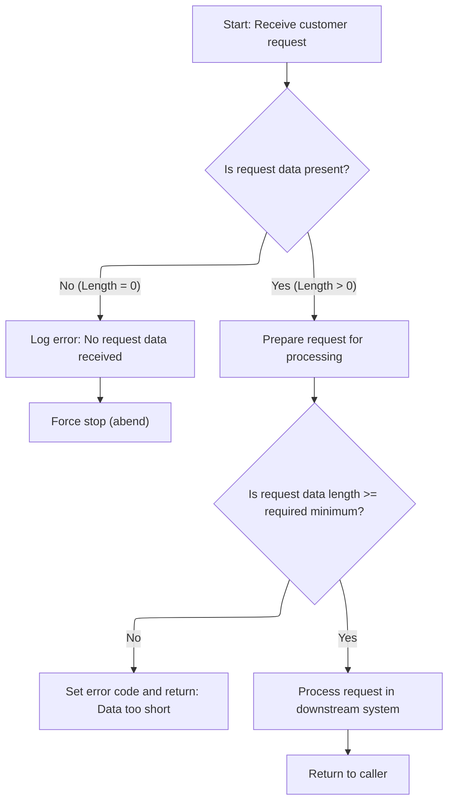

This section governs the workflow for executing premium calculations, including validation of incoming requests, error handling, and passing valid requests to downstream systems for processing.

| Category        | Rule Name               | Description                                                                                                                                                |
| --------------- | ----------------------- | ---------------------------------------------------------------------------------------------------------------------------------------------------------- |
| Data validation | Missing request data    | If no request data is received (length is zero), an error message must be logged and the workflow must be forcefully stopped.                              |
| Data validation | Minimum request length  | If the request data length is less than the required minimum (header length + required length), an error code '98' must be set and returned to the caller. |
| Business logic  | Downstream processing   | Valid requests (with sufficient data length) must be processed in the downstream system and the workflow must return to the caller upon completion.        |
| Technical step  | Workflow initialization | The workflow must initialize control fields and set up necessary variables before any validation or processing occurs.                                     |

<SwmSnippet path="/base/src/lgapol01.cbl" line="68">

---

<SwmToken path="base/src/LGAPDB01.cbl" pos="90:1:1" line-data="       P001.">`P001`</SwmToken> runs the full premium calculation workflow: initializes fields, loads config, opens files, processes records, closes files, generates summary, and displays stats. Each step builds on the previous to handle policy data end-to-end.

```cobol
       P100-MAIN SECTION.

      *----------------------------------------------------------------*
      * Common code                                                    *
      *----------------------------------------------------------------*
           INITIALIZE W1-CONTROL.
           MOVE EIBTRNID TO W1-TID.
           MOVE EIBTRMID TO W1-TRM.
           MOVE EIBTASKN TO W1-TSK.
           MOVE EIBCALEN TO W1-LEN.
      *----------------------------------------------------------------*

      *----------------------------------------------------------------*
      * Check commarea and obtain required details                     *
      *----------------------------------------------------------------*
           IF EIBCALEN IS EQUAL TO ZERO
               MOVE ' NO COMMAREA RECEIVED' TO W3-DETAIL
               PERFORM P999-ERROR
               EXEC CICS ABEND ABCODE('LGCA') NODUMP END-EXEC
           END-IF

           MOVE '00' TO CA-RETURN-CODE
           SET W1-PTR TO ADDRESS OF DFHCOMMAREA.

           ADD W4-HDR-LEN TO W4-REQ-LEN


           IF EIBCALEN IS LESS THAN W4-REQ-LEN
             MOVE '98' TO CA-RETURN-CODE
             EXEC CICS RETURN END-EXEC
           END-IF

      *----------------------------------------------------------------*
      *    Perform the data Inserts                                    *
      *----------------------------------------------------------------*
           EXEC CICS Link Program(LGAPDB01)
                Commarea(DFHCOMMAREA)
                LENGTH(32500)
           END-EXEC.

           EXEC CICS RETURN END-EXEC.
```

---

</SwmSnippet>

<SwmSnippet path="/base/src/lgapol01.cbl" line="119">

---

<SwmToken path="base/src/lgapol01.cbl" pos="119:1:3" line-data="       P999-ERROR.">`P999-ERROR`</SwmToken> formats the error message with <SwmToken path="base/src/lgipol01.cbl" pos="35:7:9" line-data="      * Variables for time/date processing">`time/date`</SwmToken>, sends it to LGSTSQ for logging, and writes up to 90 bytes of commarea data if present. This keeps error tracking consistent and avoids overflows.

```cobol
       P999-ERROR.
      * Save SQLCODE in message
      * Obtain and format current time and date
           EXEC CICS ASKTIME ABSTIME(W2-TIME)
           END-EXEC
           EXEC CICS FORMATTIME ABSTIME(W2-TIME)
                     MMDDYYYY(W2-DATE1)
                     TIME(W2-DATE2)
           END-EXEC
           MOVE W2-DATE1 TO W3-DATE
           MOVE W2-DATE2 TO W3-TIME
      * Write output message to TDQ
           EXEC CICS LINK PROGRAM('LGSTSQ')
                     COMMAREA(W3-MESSAGE)
                     LENGTH(LENGTH OF W3-MESSAGE)
           END-EXEC.
      * Write 90 bytes or as much as we have of commarea to TDQ
           IF EIBCALEN > 0 THEN
             IF EIBCALEN < 91 THEN
               MOVE DFHCOMMAREA(1:EIBCALEN) TO CA-DATA
               EXEC CICS LINK PROGRAM('LGSTSQ')
                         COMMAREA(CA-ERROR-MSG)
                         LENGTH(LENGTH OF CA-ERROR-MSG)
               END-EXEC
             ELSE
               MOVE DFHCOMMAREA(1:90) TO CA-DATA
               EXEC CICS LINK PROGRAM('LGSTSQ')
                         COMMAREA(CA-ERROR-MSG)
                         LENGTH(LENGTH OF CA-ERROR-MSG)
               END-EXEC
             END-IF
           END-IF.
           EXIT.
```

---

</SwmSnippet>

## Executing premium calculation workflow

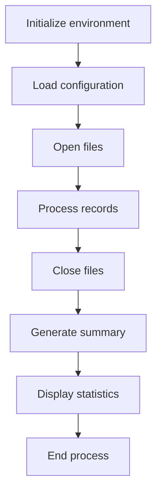

This section governs the execution of the premium calculation workflow, ensuring that all necessary steps are performed in sequence and that configuration values are validated before use.

| Category        | Rule Name                      | Description                                                                                                                                        |
| --------------- | ------------------------------ | -------------------------------------------------------------------------------------------------------------------------------------------------- |
| Data validation | Configuration value validation | All configuration values must be validated before use. If a value is expected to be numeric, it must be converted to the appropriate numeric type. |
| Business logic  | Complete record processing     | The workflow must process all available records before generating the summary and statistics.                                                      |
| Business logic  | Summary generation             | A summary of the premium calculation must be generated after all records are processed and files are closed.                                       |
| Business logic  | Statistics display             | Statistics must be displayed to the user after the summary is generated, providing visibility into the workflow results.                           |

<SwmSnippet path="/base/src/LGAPDB01.cbl" line="90">

---

We read and validate config values, converting them if they're numeric.

```cobol
       P001.
           PERFORM P002-INITIALIZE
           PERFORM P003-LOAD-CONFIG
           PERFORM P005-OPEN-FILES
           PERFORM P006-PROCESS-RECORDS
           PERFORM P014-CLOSE-FILES
           PERFORM P015-GENERATE-SUMMARY
           PERFORM P016-DISPLAY-STATS
           STOP RUN.
```

---

</SwmSnippet>

## Processing and validating input records

This section ensures that configuration values required for risk and premium calculations are available, valid, and correctly formatted before further processing.

| Category        | Rule Name                            | Description                                                                                                                  |
| --------------- | ------------------------------------ | ---------------------------------------------------------------------------------------------------------------------------- |
| Data validation | Numeric configuration validation     | Each configuration value must be validated to ensure it is numeric before it is used in calculations.                        |
| Data validation | Exclude invalid configuration values | If a configuration value is not numeric, it must not be used in calculations and should be excluded from further processing. |
| Business logic  | Configuration value conversion       | Configuration values must be converted to numeric format before being stored for use in calculations.                        |

<SwmSnippet path="/base/src/LGAPDB01.cbl" line="112">

---

We loop through input, validate, and process or log errors for each record.

```cobol
       P003-LOAD-CONFIG.
           OPEN INPUT CONFIG-FILE
           IF NOT CONFIG-OK
               DISPLAY 'Warning: Config file not available - using defaults'
               PERFORM P004-SET-DEFAULTS
           ELSE
               PERFORM P004-READ-CONFIG-VALUES
               CLOSE CONFIG-FILE
           END-IF.
```

---

</SwmSnippet>

<SwmSnippet path="/base/src/LGAPDB01.cbl" line="125">

---

We read and validate config values, converting them if they're numeric.

```cobol
       P004-READ-CONFIG-VALUES.
           MOVE 'MAX_RISK_SCORE' TO CONFIG-KEY
           READ CONFIG-FILE
           IF CONFIG-OK AND NUMERIC-CONFIG
               MOVE FUNCTION NUMVAL(CONFIG-VALUE) TO WS-MAX-RISK-SCORE
           END-IF
           
           MOVE 'MIN_PREMIUM' TO CONFIG-KEY
           READ CONFIG-FILE
           IF CONFIG-OK AND NUMERIC-CONFIG
               MOVE FUNCTION NUMVAL(CONFIG-VALUE) TO WS-MIN-PREMIUM
           END-IF.
```

---

</SwmSnippet>

## Processing and validating input records

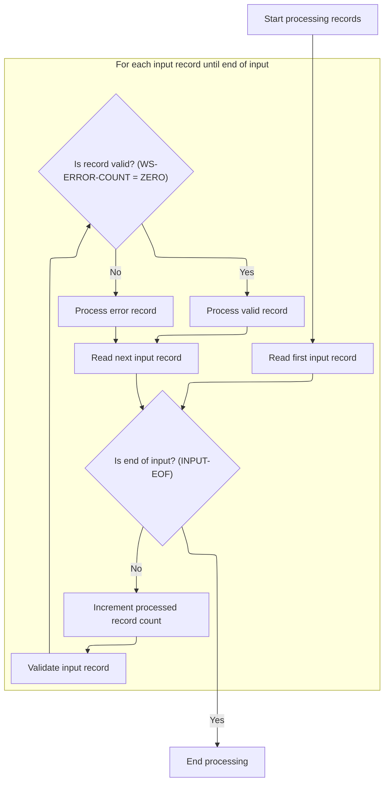

This section is responsible for iterating through all input records, validating each one, and ensuring that only valid records are processed, while error records are logged and counted.

| Category        | Rule Name                 | Description                                                                                                                                                                                                                                                      |
| --------------- | ------------------------- | ---------------------------------------------------------------------------------------------------------------------------------------------------------------------------------------------------------------------------------------------------------------- |
| Data validation | Input record validation   | Each input record must be validated before any business processing occurs. Validation checks for errors in the record data.                                                                                                                                      |
| Data validation | End of input detection    | Processing must continue until the end-of-input condition (<SwmToken path="base/src/LGAPDB01.cbl" pos="180:5:7" line-data="           PERFORM UNTIL INPUT-EOF">`INPUT-EOF`</SwmToken>) is reached, at which point record processing stops.                       |
| Business logic  | Valid record processing   | If a record passes validation (no errors found), it must be processed as a valid record and included in the processed record count.                                                                                                                              |
| Business logic  | Processed record counting | The processed record count (<SwmToken path="base/src/LGAPDB01.cbl" pos="181:7:11" line-data="               ADD 1 TO WS-REC-CNT">`WS-REC-CNT`</SwmToken>) must be incremented for every input record read, regardless of whether it is valid or contains errors. |

<SwmSnippet path="/base/src/LGAPDB01.cbl" line="178">

---

We loop through input, validate, and process or log errors for each record.

```cobol
       P006-PROCESS-RECORDS.
           PERFORM P007-READ-INPUT
           PERFORM UNTIL INPUT-EOF
               ADD 1 TO WS-REC-CNT
               PERFORM P008-VALIDATE-INPUT-RECORD
               IF WS-ERROR-COUNT = ZERO
                   PERFORM P009-PROCESS-VALID-RECORD
               ELSE
                   PERFORM P010-PROCESS-ERROR-RECORD
               END-IF
               PERFORM P007-READ-INPUT
           END-PERFORM.
```

---

</SwmSnippet>

## Validating input records and logging errors

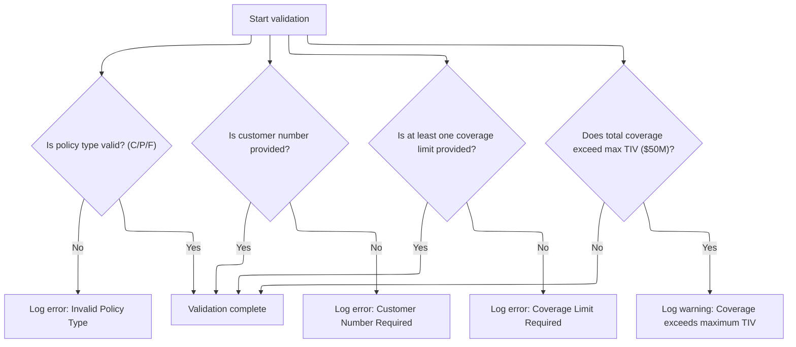

This section enforces business rules on input records to ensure data integrity before further processing. It validates key fields and logs any validation failures or warnings for each record.

| Category        | Rule Name                | Description                                                                                                                                                                   |
| --------------- | ------------------------ | ----------------------------------------------------------------------------------------------------------------------------------------------------------------------------- |
| Data validation | Valid Policy Type        | Policy type must be one of the following values: 'C' (Commercial), 'P' (Personal), or 'F' (Farm). If the policy type is not valid, an error is logged for the record.         |
| Data validation | Customer Number Required | Customer number must be provided and cannot be blank. If missing, an error is logged for the record.                                                                          |
| Data validation | Coverage Limit Required  | At least one coverage limit (building, contents, or business interruption) must be provided and non-zero. If all are zero, an error is logged for the record.                 |
| Business logic  | Maximum TIV Warning      | If the sum of building, contents, and business interruption coverage limits exceeds the maximum Total Insured Value (TIV) of $50,000,000, a warning is logged for the record. |

<SwmSnippet path="/base/src/LGAPDB01.cbl" line="195">

---

<SwmToken path="base/src/LGAPDB01.cbl" pos="195:1:7" line-data="       P008-VALIDATE-INPUT-RECORD.">`P008-VALIDATE-INPUT-RECORD`</SwmToken> enforces business rules on input records and logs any validation failures or warnings before processing continues.

```cobol
       P008-VALIDATE-INPUT-RECORD.
           INITIALIZE WS-ERROR-HANDLING
           
           IF NOT COMMERCIAL-POLICY AND 
              NOT PERSONAL-POLICY AND 
              NOT FARM-POLICY
               PERFORM P008A-LOG-ERROR WITH 
                   'POL001' 'F' 'IN-POLICY-TYPE' 
                   'Invalid Policy Type'
           END-IF
           
           IF IN-CUSTOMER-NUM = SPACES
               PERFORM P008A-LOG-ERROR WITH 
                   'CUS001' 'F' 'IN-CUSTOMER-NUM' 
                   'Customer Number Required'
           END-IF
           
           IF IN-BUILDING-LIMIT = ZERO AND 
              IN-CONTENTS-LIMIT = ZERO
               PERFORM P008A-LOG-ERROR WITH 
                   'COV001' 'F' 'COVERAGE-LIMITS' 
                   'At least one coverage limit required'
           END-IF
           
           IF IN-BUILDING-LIMIT + IN-CONTENTS-LIMIT + 
              IN-BI-LIMIT > WS-MAX-TIV
               PERFORM P008A-LOG-ERROR WITH 
                   'COV002' 'W' 'COVERAGE-LIMITS' 
                   'Total coverage exceeds maximum TIV'
           END-IF.
```

---

</SwmSnippet>

<SwmSnippet path="/base/src/LGAPDB01.cbl" line="226">

---

<SwmToken path="base/src/LGAPDB01.cbl" pos="226:1:5" line-data="       P008A-LOG-ERROR.">`P008A-LOG-ERROR`</SwmToken> bumps the error count and logs the error details (code, severity, field, message) into parallel arrays using the count as an index. This lets the rest of the flow access all errors for the record in a structured way, but only up to 20 errors per record.

```cobol
       P008A-LOG-ERROR.
           ADD 1 TO WS-ERROR-COUNT
           SET ERR-IDX TO WS-ERROR-COUNT
           MOVE WS-ERROR-CODE TO WS-ERROR-CODE (ERR-IDX)
           MOVE WS-ERROR-SEVERITY TO WS-ERROR-SEVERITY (ERR-IDX)
           MOVE WS-ERROR-FIELD TO WS-ERROR-FIELD (ERR-IDX)
           MOVE WS-ERROR-MESSAGE TO WS-ERROR-MESSAGE (ERR-IDX).
```

---

</SwmSnippet>

## Processing valid records

This section is responsible for splitting valid policy records into commercial and non-commercial categories. Commercial policies are processed in the main calculation flow, while non-commercial policies are flagged as errors and counted separately.

| Category        | Rule Name                            | Description                                                                                                                                                                      |
| --------------- | ------------------------------------ | -------------------------------------------------------------------------------------------------------------------------------------------------------------------------------- |
| Data validation | Counter initialization               | The processed count and error count must both start at zero for each run of the section.                                                                                         |
| Business logic  | Commercial policy processing         | If a policy record is identified as a commercial policy (policy type 'C'), it must be processed in the main calculation flow and the processed count must be incremented by one. |
| Business logic  | Non-commercial policy error flagging | If a policy record is not identified as a commercial policy (policy type not 'C'), it must be flagged as an error and the error count must be incremented by one.                |

<SwmSnippet path="/base/src/LGAPDB01.cbl" line="234">

---

<SwmToken path="base/src/LGAPDB01.cbl" pos="234:1:7" line-data="       P009-PROCESS-VALID-RECORD.">`P009-PROCESS-VALID-RECORD`</SwmToken> splits commercial policies into the main calculation flow and flags others as errors.

```cobol
       P009-PROCESS-VALID-RECORD.
           IF COMMERCIAL-POLICY
               PERFORM P011-PROCESS-COMMERCIAL
               ADD 1 TO WS-PROC-CNT
           ELSE
               PERFORM P012-PROCESS-NON-COMMERCIAL
               ADD 1 TO WS-ERR-CNT
           END-IF.
```

---

</SwmSnippet>

## Running commercial policy calculations

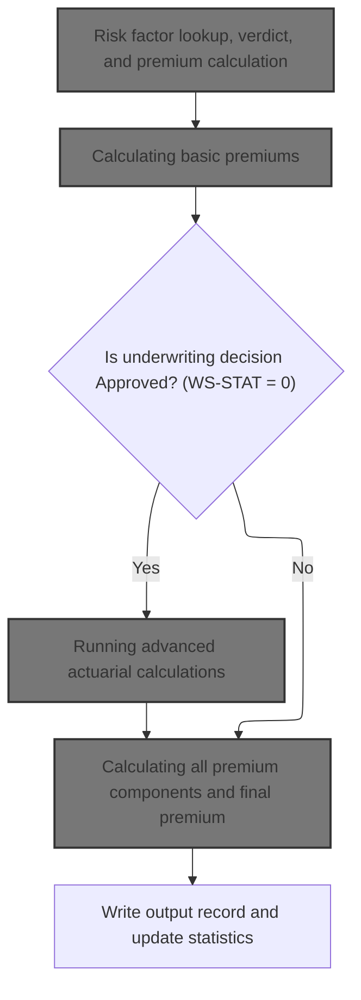

This section governs the calculation of commercial insurance policy premiums, risk scoring, and underwriting decisions. It ensures that only valid and approved policies receive advanced actuarial treatment and that all relevant business rules are applied before finalizing outputs.

| Category        | Rule Name                                   | Description                                                                                                                                                                                                                        |
| --------------- | ------------------------------------------- | ---------------------------------------------------------------------------------------------------------------------------------------------------------------------------------------------------------------------------------- |
| Data validation | Mandatory risk scoring                      | Every commercial policy must undergo risk scoring before any premium calculation is performed.                                                                                                                                     |
| Data validation | Detailed output record requirement          | Output records must include underwriting verdict, description, rejection reason (if applicable), and all calculated premium values.                                                                                                |
| Business logic  | Universal basic premium calculation         | Basic premium calculation must be performed for all policies, regardless of underwriting decision.                                                                                                                                 |
| Business logic  | Conditional advanced actuarial calculation  | Advanced actuarial calculations are only performed for policies with an underwriting decision of 'Approved' (<SwmToken path="base/src/LGAPDB01.cbl" pos="261:3:5" line-data="           IF WS-STAT = 0">`WS-STAT`</SwmToken> = 0). |
| Business logic  | Comprehensive premium component calculation | All premium components, including exposures, rates, modifiers, catastrophe loading, expenses, discounts, and taxes, must be calculated and combined to determine the final premium for each policy.                                |
| Business logic  | Premium business rule application           | Business rules must be applied to all calculated premiums before output is finalized.                                                                                                                                              |
| Business logic  | Statistics update after processing          | Statistics must be updated after each policy is processed to reflect the latest underwriting and premium data.                                                                                                                     |

<SwmSnippet path="/base/src/LGAPDB01.cbl" line="258">

---

In <SwmToken path="base/src/LGAPDB01.cbl" pos="258:1:5" line-data="       P011-PROCESS-COMMERCIAL.">`P011-PROCESS-COMMERCIAL`</SwmToken>, the flow runs risk scoring, basic premium calculation, and—if approved—an enhanced actuarial calculation. Then it applies business rules, writes the output, and updates stats. Each step builds on the previous, so only valid, approved policies get the full treatment.

```cobol
       P011-PROCESS-COMMERCIAL.
           PERFORM P011A-CALCULATE-RISK-SCORE
           PERFORM P011B-BASIC-PREMIUM-CALC
           IF WS-STAT = 0
               PERFORM P011C-ENHANCED-ACTUARIAL-CALC
           END-IF
           PERFORM P011D-APPLY-BUSINESS-RULES
           PERFORM P011E-WRITE-OUTPUT-RECORD
           PERFORM P011F-UPDATE-STATISTICS.
```

---

</SwmSnippet>

### Calculating basic premiums

This section determines the basic insurance premiums for a policy application by evaluating risk factors, peril exposures, and eligibility for discounts, then assigns an underwriting decision and returns all relevant premium and decision data.

| Category        | Rule Name                        | Description                                                                                                                                                                    |
| --------------- | -------------------------------- | ------------------------------------------------------------------------------------------------------------------------------------------------------------------------------ |
| Data validation | Consistent output delivery       | Premiums and decision status must be returned for every policy application, regardless of the outcome.                                                                         |
| Business logic  | Peril-based premium calculation  | Premiums for each peril (fire, crime, flood, weather) must be calculated based on the corresponding risk scores and peril values provided for the property and policy.         |
| Business logic  | Total premium aggregation        | The total premium must be the sum of the individual peril premiums, adjusted by any applicable discount factors.                                                               |
| Business logic  | Discount eligibility application | Discount factors must be applied if the customer is eligible for multi-policy, claims-free, or safety program discounts, as indicated in the eligibility flags.                |
| Business logic  | Underwriting decision assignment | The underwriting decision status must be set to 'approved', 'pending', 'rejected', or 'referred' based on the calculated risk scores and business rules for policy acceptance. |

<SwmSnippet path="/base/src/LGAPDB01.cbl" line="275">

---

<SwmToken path="base/src/LGAPDB01.cbl" pos="275:1:7" line-data="       P011B-BASIC-PREMIUM-CALC.">`P011B-BASIC-PREMIUM-CALC`</SwmToken> calls <SwmToken path="base/src/LGAPDB01.cbl" pos="276:4:4" line-data="           CALL &#39;LGAPDB03&#39; USING WS-BASE-RISK-SCR, IN-FIRE-PERIL, ">`LGAPDB03`</SwmToken>, passing risk scores and peril values. <SwmToken path="base/src/LGAPDB01.cbl" pos="276:4:4" line-data="           CALL &#39;LGAPDB03&#39; USING WS-BASE-RISK-SCR, IN-FIRE-PERIL, ">`LGAPDB03`</SwmToken> handles risk factor lookup, verdict assignment, and premium math, then returns the calculated premiums and decision status.

```cobol
       P011B-BASIC-PREMIUM-CALC.
           CALL 'LGAPDB03' USING WS-BASE-RISK-SCR, IN-FIRE-PERIL, 
                                IN-CRIME-PERIL, IN-FLOOD-PERIL, 
                                IN-WEATHER-PERIL, WS-STAT,
                                WS-STAT-DESC, WS-REJ-RSN, WS-FR-PREM,
                                WS-CR-PREM, WS-FL-PREM, WS-WE-PREM,
                                WS-TOT-PREM, WS-DISC-FACT.
```

---

</SwmSnippet>

### Risk factor lookup, verdict, and premium calculation

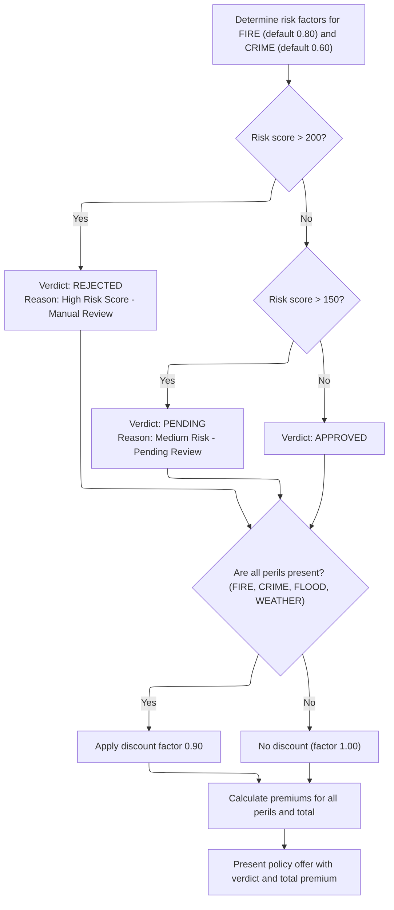

This section determines insurance policy eligibility and pricing by evaluating risk factors, assigning a verdict based on risk score thresholds, and calculating premiums for each peril. It ensures consistent risk and pricing logic for policy offers.

| Category       | Rule Name                    | Description                                                                                                                                                                                                                              |
| -------------- | ---------------------------- | ---------------------------------------------------------------------------------------------------------------------------------------------------------------------------------------------------------------------------------------- |
| Business logic | High risk rejection          | If the risk score is greater than 200, the policy verdict is REJECTED and the reason is 'High Risk Score - Manual Review Required'.                                                                                                      |
| Business logic | Medium risk pending          | If the risk score is greater than 150 but less than or equal to 200, the policy verdict is PENDING and the reason is 'Medium Risk - Pending Review'.                                                                                     |
| Business logic | Low risk approval            | If the risk score is 150 or less, the policy verdict is APPROVED and no rejection reason is set.                                                                                                                                         |
| Business logic | Full coverage discount       | If all perils (FIRE, CRIME, FLOOD, WEATHER) are present, apply a discount factor of <SwmToken path="base/src/LGAPDB03.cbl" pos="99:3:5" line-data="             MOVE 0.90 TO LK-DISC-FACT">`0.90`</SwmToken> to the premium calculation. |
| Business logic | Partial coverage no discount | If any peril is missing, no discount is applied and the discount factor remains <SwmToken path="base/src/LGAPDB03.cbl" pos="93:3:5" line-data="           MOVE 1.00 TO LK-DISC-FACT">`1.00`</SwmToken>.                                  |
| Business logic | Peril premium calculation    | Premiums for each peril are calculated as: (risk score × peril risk factor × peril coverage indicator × discount factor).                                                                                                                |
| Business logic | Total premium summation      | The total premium is the sum of the premiums for FIRE, CRIME, FLOOD, and WEATHER perils.                                                                                                                                                 |

<SwmSnippet path="/base/src/LGAPDB03.cbl" line="42">

---

<SwmToken path="base/src/LGAPDB03.cbl" pos="42:1:3" line-data="       MAIN-LOGIC.">`MAIN-LOGIC`</SwmToken> in <SwmToken path="base/src/LGAPDB01.cbl" pos="276:4:4" line-data="           CALL &#39;LGAPDB03&#39; USING WS-BASE-RISK-SCR, IN-FIRE-PERIL, ">`LGAPDB03`</SwmToken> chains together risk factor lookup (from <SwmToken path="base/src/lgipdb01.cbl" pos="242:5:5" line-data="      * initialize DB2 host variables">`DB2`</SwmToken>, with defaults if missing), verdict assignment based on risk score, and premium calculations for each peril. This keeps the risk and pricing logic centralized and consistent.

```cobol
       MAIN-LOGIC.
           PERFORM GET-RISK-FACTORS
           PERFORM CALCULATE-VERDICT
           PERFORM CALCULATE-PREMIUMS
           GOBACK.
```

---

</SwmSnippet>

<SwmSnippet path="/base/src/LGAPDB03.cbl" line="48">

---

<SwmToken path="base/src/LGAPDB03.cbl" pos="48:1:5" line-data="       GET-RISK-FACTORS.">`GET-RISK-FACTORS`</SwmToken> grabs fire and crime risk factors from <SwmToken path="base/src/lgipdb01.cbl" pos="242:5:5" line-data="      * initialize DB2 host variables">`DB2`</SwmToken>. If the lookup fails, it falls back to hardcoded defaults. This keeps the premium calculation running even if the DB is missing entries, but the numbers may be off.

```cobol
       GET-RISK-FACTORS.
           EXEC SQL
               SELECT FACTOR_VALUE INTO :WS-FIRE-FACTOR
               FROM RISK_FACTORS
               WHERE PERIL_TYPE = 'FIRE'
           END-EXEC.
           
           IF SQLCODE = 0
               CONTINUE
           ELSE
               MOVE 0.80 TO WS-FIRE-FACTOR
           END-IF.
           
           EXEC SQL
               SELECT FACTOR_VALUE INTO :WS-CRIME-FACTOR
               FROM RISK_FACTORS
               WHERE PERIL_TYPE = 'CRIME'
           END-EXEC.
           
           IF SQLCODE = 0
               CONTINUE
           ELSE
               MOVE 0.60 TO WS-CRIME-FACTOR
           END-IF.
```

---

</SwmSnippet>

<SwmSnippet path="/base/src/LGAPDB03.cbl" line="73">

---

<SwmToken path="base/src/LGAPDB03.cbl" pos="73:1:3" line-data="       CALCULATE-VERDICT.">`CALCULATE-VERDICT`</SwmToken> uses the risk score to set the policy status: >200 is rejected, >150 is pending, and <=150 is approved. Each status gets a description and reason, so downstream logic knows what to do next.

```cobol
       CALCULATE-VERDICT.
           IF LK-RISK-SCORE > 200
             MOVE 2 TO LK-STAT
             MOVE 'REJECTED' TO LK-STAT-DESC
             MOVE 'High Risk Score - Manual Review Required' 
               TO LK-REJ-RSN
           ELSE
             IF LK-RISK-SCORE > 150
               MOVE 1 TO LK-STAT
               MOVE 'PENDING' TO LK-STAT-DESC
               MOVE 'Medium Risk - Pending Review'
                 TO LK-REJ-RSN
             ELSE
               MOVE 0 TO LK-STAT
               MOVE 'APPROVED' TO LK-STAT-DESC
               MOVE SPACES TO LK-REJ-RSN
             END-IF
           END-IF.
```

---

</SwmSnippet>

<SwmSnippet path="/base/src/LGAPDB03.cbl" line="92">

---

<SwmToken path="base/src/LGAPDB03.cbl" pos="92:1:3" line-data="       CALCULATE-PREMIUMS.">`CALCULATE-PREMIUMS`</SwmToken> sets a discount factor based on peril coverage, then calculates premiums for each peril using risk score and peril-specific factors. It sums these for the total premium. Full coverage gets a discount, partial coverage doesn't.

```cobol
       CALCULATE-PREMIUMS.
           MOVE 1.00 TO LK-DISC-FACT
           
           IF LK-FIRE-PERIL > 0 AND
              LK-CRIME-PERIL > 0 AND
              LK-FLOOD-PERIL > 0 AND
              LK-WEATHER-PERIL > 0
             MOVE 0.90 TO LK-DISC-FACT
           END-IF

           COMPUTE LK-FIRE-PREMIUM =
             ((LK-RISK-SCORE * WS-FIRE-FACTOR) * LK-FIRE-PERIL *
               LK-DISC-FACT)
           
           COMPUTE LK-CRIME-PREMIUM =
             ((LK-RISK-SCORE * WS-CRIME-FACTOR) * LK-CRIME-PERIL *
               LK-DISC-FACT)
           
           COMPUTE LK-FLOOD-PREMIUM =
             ((LK-RISK-SCORE * WS-FLOOD-FACTOR) * LK-FLOOD-PERIL *
               LK-DISC-FACT)
           
           COMPUTE LK-WEATHER-PREMIUM =
             ((LK-RISK-SCORE * WS-WEATHER-FACTOR) * LK-WEATHER-PERIL *
               LK-DISC-FACT)

           COMPUTE LK-TOTAL-PREMIUM = 
             LK-FIRE-PREMIUM + LK-CRIME-PREMIUM + 
             LK-FLOOD-PREMIUM + LK-WEATHER-PREMIUM. 
```

---

</SwmSnippet>

### Running advanced actuarial calculations

```mermaid
%%{init: {"flowchart": {"defaultRenderer": "elk"}} }%%
flowchart TD
    node1["Prepare policy and risk data for actuarial calculation"]
    click node1 openCode "base/src/LGAPDB01.cbl:283:311"
    node1 --> node2{"Is current total premium > $500?"}
    click node2 openCode "base/src/LGAPDB01.cbl:312:312"
    node2 -->|"Yes"| node3["Call advanced actuarial calculation (LGAPDB04)"]
    click node3 openCode "base/src/LGAPDB01.cbl:313:314"
    node2 -->|"No"| node6["Keep current premium and factors"]
    click node6 openCode "base/src/LGAPDB01.cbl:325:325"
    node3 --> node4{"Is enhanced premium > current premium?"}
    click node4 openCode "base/src/LGAPDB01.cbl:317:317"
    node4 -->|"Yes"| node5["Update premium and rating factors with enhanced results"]
    click node5 openCode "base/src/LGAPDB01.cbl:318:324"
    node4 -->|"No"| node6
    node5 --> node6
classDef HeadingStyle fill:#777777,stroke:#333,stroke-width:2px;

%% Swimm:
%% %%{init: {"flowchart": {"defaultRenderer": "elk"}} }%%
%% flowchart TD
%%     node1["Prepare policy and risk data for actuarial calculation"]
%%     click node1 openCode "<SwmPath>[base/src/LGAPDB01.cbl](base/src/LGAPDB01.cbl)</SwmPath>:283:311"
%%     node1 --> node2{"Is current total premium > $500?"}
%%     click node2 openCode "<SwmPath>[base/src/LGAPDB01.cbl](base/src/LGAPDB01.cbl)</SwmPath>:312:312"
%%     node2 -->|"Yes"| node3["Call advanced actuarial calculation (<SwmToken path="base/src/LGAPDB01.cbl" pos="313:4:4" line-data="               CALL &#39;LGAPDB04&#39; USING LK-INPUT-DATA, LK-COVERAGE-DATA, ">`LGAPDB04`</SwmToken>)"]
%%     click node3 openCode "<SwmPath>[base/src/LGAPDB01.cbl](base/src/LGAPDB01.cbl)</SwmPath>:313:314"
%%     node2 -->|"No"| node6["Keep current premium and factors"]
%%     click node6 openCode "<SwmPath>[base/src/LGAPDB01.cbl](base/src/LGAPDB01.cbl)</SwmPath>:325:325"
%%     node3 --> node4{"Is enhanced premium > current premium?"}
%%     click node4 openCode "<SwmPath>[base/src/LGAPDB01.cbl](base/src/LGAPDB01.cbl)</SwmPath>:317:317"
%%     node4 -->|"Yes"| node5["Update premium and rating factors with enhanced results"]
%%     click node5 openCode "<SwmPath>[base/src/LGAPDB01.cbl](base/src/LGAPDB01.cbl)</SwmPath>:318:324"
%%     node4 -->|"No"| node6
%%     node5 --> node6
%% classDef HeadingStyle fill:#777777,stroke:#333,stroke-width:2px;
```

This section determines whether to run an advanced actuarial calculation for a policy, based on the current total premium. If eligible, it updates the premium and rating factors only if the advanced calculation produces a higher premium than the current value.

| Category        | Rule Name                      | Description                                                                                                                                                         |
| --------------- | ------------------------------ | ------------------------------------------------------------------------------------------------------------------------------------------------------------------- |
| Data validation | Minimum premium eligibility    | Advanced actuarial calculation is only performed if the current total premium exceeds $500.                                                                         |
| Data validation | Comprehensive data preparation | All relevant policy, property, coverage, and claims data must be included in the input structure for the actuarial calculation.                                     |
| Business logic  | Enhanced premium adoption      | If the advanced actuarial calculation produces a higher total premium than the current value, the premium and rating factors are updated with the enhanced results. |
| Business logic  | Retain original premium        | If the advanced actuarial calculation does not produce a higher premium, the original premium and rating factors are retained.                                      |

<SwmSnippet path="/base/src/LGAPDB01.cbl" line="283">

---

<SwmToken path="base/src/LGAPDB01.cbl" pos="283:1:7" line-data="       P011C-ENHANCED-ACTUARIAL-CALC.">`P011C-ENHANCED-ACTUARIAL-CALC`</SwmToken> sets up all the input data for the advanced actuarial calculation and calls <SwmToken path="base/src/LGAPDB01.cbl" pos="313:4:4" line-data="               CALL &#39;LGAPDB04&#39; USING LK-INPUT-DATA, LK-COVERAGE-DATA, ">`LGAPDB04`</SwmToken> if the premium is above the minimum. If <SwmToken path="base/src/LGAPDB01.cbl" pos="313:4:4" line-data="               CALL &#39;LGAPDB04&#39; USING LK-INPUT-DATA, LK-COVERAGE-DATA, ">`LGAPDB04`</SwmToken> returns a higher premium, it updates the main premium fields with the enhanced results.

```cobol
       P011C-ENHANCED-ACTUARIAL-CALC.
      *    Prepare input structure for actuarial calculation
           MOVE IN-CUSTOMER-NUM TO LK-CUSTOMER-NUM
           MOVE WS-BASE-RISK-SCR TO LK-RISK-SCORE
           MOVE IN-PROPERTY-TYPE TO LK-PROPERTY-TYPE
           MOVE IN-TERRITORY-CODE TO LK-TERRITORY
           MOVE IN-CONSTRUCTION-TYPE TO LK-CONSTRUCTION-TYPE
           MOVE IN-OCCUPANCY-CODE TO LK-OCCUPANCY-CODE
           MOVE IN-SPRINKLER-IND TO LK-PROTECTION-CLASS
           MOVE IN-YEAR-BUILT TO LK-YEAR-BUILT
           MOVE IN-SQUARE-FOOTAGE TO LK-SQUARE-FOOTAGE
           MOVE IN-YEARS-IN-BUSINESS TO LK-YEARS-IN-BUSINESS
           MOVE IN-CLAIMS-COUNT-3YR TO LK-CLAIMS-COUNT-5YR
           MOVE IN-CLAIMS-AMOUNT-3YR TO LK-CLAIMS-AMOUNT-5YR
           
      *    Set coverage data
           MOVE IN-BUILDING-LIMIT TO LK-BUILDING-LIMIT
           MOVE IN-CONTENTS-LIMIT TO LK-CONTENTS-LIMIT
           MOVE IN-BI-LIMIT TO LK-BI-LIMIT
           MOVE IN-FIRE-DEDUCTIBLE TO LK-FIRE-DEDUCTIBLE
           MOVE IN-WIND-DEDUCTIBLE TO LK-WIND-DEDUCTIBLE
           MOVE IN-FLOOD-DEDUCTIBLE TO LK-FLOOD-DEDUCTIBLE
           MOVE IN-OTHER-DEDUCTIBLE TO LK-OTHER-DEDUCTIBLE
           MOVE IN-FIRE-PERIL TO LK-FIRE-PERIL
           MOVE IN-CRIME-PERIL TO LK-CRIME-PERIL
           MOVE IN-FLOOD-PERIL TO LK-FLOOD-PERIL
           MOVE IN-WEATHER-PERIL TO LK-WEATHER-PERIL
           
      *    Call advanced actuarial calculation program (only for approved cases)
           IF WS-TOT-PREM > WS-MIN-PREMIUM
               CALL 'LGAPDB04' USING LK-INPUT-DATA, LK-COVERAGE-DATA, 
                                    LK-OUTPUT-RESULTS
               
      *        Update with enhanced calculations if successful
               IF LK-TOTAL-PREMIUM > WS-TOT-PREM
                   MOVE LK-FIRE-PREMIUM TO WS-FR-PREM
                   MOVE LK-CRIME-PREMIUM TO WS-CR-PREM
                   MOVE LK-FLOOD-PREMIUM TO WS-FL-PREM
                   MOVE LK-WEATHER-PREMIUM TO WS-WE-PREM
                   MOVE LK-TOTAL-PREMIUM TO WS-TOT-PREM
                   MOVE LK-EXPERIENCE-MOD TO WS-EXPERIENCE-MOD
               END-IF
           END-IF.
```

---

</SwmSnippet>

### Calculating all premium components and final premium

```mermaid
%%{init: {"flowchart": {"defaultRenderer": "elk"}} }%%
flowchart TD
    node1["Start premium calculation"] --> node2["Initialize policy and rates"]
    click node1 openCode "base/src/LGAPDB04.cbl:138:150"
    click node2 openCode "base/src/LGAPDB04.cbl:138:150"
    node2 --> node3["Analyze exposure"]
    click node3 openCode "base/src/LGAPDB04.cbl:138:150"
    node3 --> node4["Apply experience modification"]
    click node4 openCode "base/src/LGAPDB04.cbl:234:258"
    node4 --> node5["Apply schedule modification"]
    click node5 openCode "base/src/LGAPDB04.cbl:138:150"
    node5 --> node6["Calculate base premium"]
    click node6 openCode "base/src/LGAPDB04.cbl:138:150"
    node6 --> node7["Add catastrophe loading"]
    click node7 openCode "base/src/LGAPDB04.cbl:369:394"
    node7 --> node8["Calculate expenses"]
    click node8 openCode "base/src/LGAPDB04.cbl:138:150"
    node8 --> node9["Apply discounts"]
    click node9 openCode "base/src/LGAPDB04.cbl:407:454"
    node9 --> node10["Calculate taxes"]
    click node10 openCode "base/src/LGAPDB04.cbl:138:150"
    node10 --> node11["Compute final premium and apply caps"]
    click node11 openCode "base/src/LGAPDB04.cbl:464:477"

classDef HeadingStyle fill:#777777,stroke:#333,stroke-width:2px;

%% Swimm:
%% %%{init: {"flowchart": {"defaultRenderer": "elk"}} }%%
%% flowchart TD
%%     node1["Start premium calculation"] --> node2["Initialize policy and rates"]
%%     click node1 openCode "<SwmPath>[base/src/LGAPDB04.cbl](base/src/LGAPDB04.cbl)</SwmPath>:138:150"
%%     click node2 openCode "<SwmPath>[base/src/LGAPDB04.cbl](base/src/LGAPDB04.cbl)</SwmPath>:138:150"
%%     node2 --> node3["Analyze exposure"]
%%     click node3 openCode "<SwmPath>[base/src/LGAPDB04.cbl](base/src/LGAPDB04.cbl)</SwmPath>:138:150"
%%     node3 --> node4["Apply experience modification"]
%%     click node4 openCode "<SwmPath>[base/src/LGAPDB04.cbl](base/src/LGAPDB04.cbl)</SwmPath>:234:258"
%%     node4 --> node5["Apply schedule modification"]
%%     click node5 openCode "<SwmPath>[base/src/LGAPDB04.cbl](base/src/LGAPDB04.cbl)</SwmPath>:138:150"
%%     node5 --> node6["Calculate base premium"]
%%     click node6 openCode "<SwmPath>[base/src/LGAPDB04.cbl](base/src/LGAPDB04.cbl)</SwmPath>:138:150"
%%     node6 --> node7["Add catastrophe loading"]
%%     click node7 openCode "<SwmPath>[base/src/LGAPDB04.cbl](base/src/LGAPDB04.cbl)</SwmPath>:369:394"
%%     node7 --> node8["Calculate expenses"]
%%     click node8 openCode "<SwmPath>[base/src/LGAPDB04.cbl](base/src/LGAPDB04.cbl)</SwmPath>:138:150"
%%     node8 --> node9["Apply discounts"]
%%     click node9 openCode "<SwmPath>[base/src/LGAPDB04.cbl](base/src/LGAPDB04.cbl)</SwmPath>:407:454"
%%     node9 --> node10["Calculate taxes"]
%%     click node10 openCode "<SwmPath>[base/src/LGAPDB04.cbl](base/src/LGAPDB04.cbl)</SwmPath>:138:150"
%%     node10 --> node11["Compute final premium and apply caps"]
%%     click node11 openCode "<SwmPath>[base/src/LGAPDB04.cbl](base/src/LGAPDB04.cbl)</SwmPath>:464:477"
%% 
%% classDef HeadingStyle fill:#777777,stroke:#333,stroke-width:2px;
```

This section governs the calculation of all premium components and the final premium for an insurance policy. It ensures that each modifier, loading, discount, and cap is applied according to business rules, resulting in a compliant and accurate premium quote.

| Category       | Rule Name                    | Description                                                                                                                                                                                                                                                                                                                                                                                                                                                                                                                                                                   |
| -------------- | ---------------------------- | ----------------------------------------------------------------------------------------------------------------------------------------------------------------------------------------------------------------------------------------------------------------------------------------------------------------------------------------------------------------------------------------------------------------------------------------------------------------------------------------------------------------------------------------------------------------------------- |
| Business logic | Experience modifier limits   | The experience modifier is determined by years in business and claims history. Policies with 5 or more years and no claims receive a discount (modifier set to 0.85). Otherwise, the modifier is increased based on the claims ratio, but is always capped between 0.5 and 2.0. New businesses (less than 5 years) receive a slight penalty (modifier set to 1.1).                                                                                                                                                                                                            |
| Business logic | Catastrophe loading factors  | Catastrophe loading is calculated by adding weighted premiums for each covered peril. Fixed factors are applied for hurricane, earthquake, tornado, and flood perils, and only included if the peril is selected in the policy.                                                                                                                                                                                                                                                                                                                                               |
| Business logic | Discount calculation and cap | The total discount is calculated by adding multi-peril, claims-free, and deductible credits. The multi-peril discount is 10% if all four major perils are covered, or 5% for certain combinations. <SwmToken path="base/src/LGAPDB04.cbl" pos="425:3:5" line-data="      * Claims-free discount  ">`Claims-free`</SwmToken> discount is 7.5% for policies with no claims and 5+ years in business. Deductible credits are added for high deductibles: 2.5% for fire ($10,000+), 3.5% for wind ($25,000+), and 4.5% for flood ($50,000+). The total discount is capped at 25%. |
| Business logic | Discount application scope   | The discount is applied to the sum of all premium components except tax. This ensures that tax is calculated on the full premium before discounts.                                                                                                                                                                                                                                                                                                                                                                                                                            |
| Business logic | Final premium and rate cap   | The final premium is calculated by summing all premium components, subtracting discounts, and adding tax. The final rate factor is computed as total premium divided by total insured value. If the final rate factor exceeds 0.05, it is capped at 0.05 and the premium is recalculated accordingly.                                                                                                                                                                                                                                                                         |

<SwmSnippet path="/base/src/LGAPDB04.cbl" line="138">

---

<SwmToken path="base/src/LGAPDB04.cbl" pos="138:1:3" line-data="       P100-MAIN.">`P100-MAIN`</SwmToken> in <SwmToken path="base/src/LGAPDB01.cbl" pos="313:4:4" line-data="               CALL &#39;LGAPDB04&#39; USING LK-INPUT-DATA, LK-COVERAGE-DATA, ">`LGAPDB04`</SwmToken> runs the full premium calculation workflow: initializes, loads rates, calculates exposures, applies experience and schedule modifiers, computes base premium, adds catastrophe and expense loadings, applies discounts and taxes, and finally calculates the capped final premium and rate factor.

```cobol
       P100-MAIN.
           PERFORM P200-INIT
           PERFORM P300-RATES
           PERFORM P350-EXPOSURE
           PERFORM P400-EXP-MOD
           PERFORM P500-SCHED-MOD
           PERFORM P600-BASE-PREM
           PERFORM P700-CAT-LOAD
           PERFORM P800-EXPENSE
           PERFORM P900-DISC
           PERFORM P950-TAXES
           PERFORM P999-FINAL
           GOBACK.
```

---

</SwmSnippet>

<SwmSnippet path="/base/src/LGAPDB04.cbl" line="234">

---

<SwmToken path="base/src/LGAPDB04.cbl" pos="234:1:5" line-data="       P400-EXP-MOD.">`P400-EXP-MOD`</SwmToken> calculates the experience modifier based on years in business and claims history. No claims and 5+ years gets a discount, otherwise the modifier is bumped up based on claims ratio, but always capped between 0.5 and 2.0. New businesses get a slight penalty.

```cobol
       P400-EXP-MOD.
           MOVE 1.0000 TO WS-EXPERIENCE-MOD
           
           IF LK-YEARS-IN-BUSINESS >= 5
               IF LK-CLAIMS-COUNT-5YR = ZERO
                   MOVE 0.8500 TO WS-EXPERIENCE-MOD
               ELSE
                   COMPUTE WS-EXPERIENCE-MOD = 
                       1.0000 + 
                       ((LK-CLAIMS-AMOUNT-5YR / WS-TOTAL-INSURED-VAL) * 
                        WS-CREDIBILITY-FACTOR * 0.50)
                   
                   IF WS-EXPERIENCE-MOD > 2.0000
                       MOVE 2.0000 TO WS-EXPERIENCE-MOD
                   END-IF
                   
                   IF WS-EXPERIENCE-MOD < 0.5000
                       MOVE 0.5000 TO WS-EXPERIENCE-MOD
                   END-IF
               END-IF
           ELSE
               MOVE 1.1000 TO WS-EXPERIENCE-MOD
           END-IF
           
           MOVE WS-EXPERIENCE-MOD TO LK-EXPERIENCE-MOD.
```

---

</SwmSnippet>

<SwmSnippet path="/base/src/LGAPDB04.cbl" line="369">

---

<SwmToken path="base/src/LGAPDB04.cbl" pos="369:1:5" line-data="       P700-CAT-LOAD.">`P700-CAT-LOAD`</SwmToken> builds up the catastrophe loading by adding weighted premiums for each peril if they're covered. It uses fixed factors for hurricane, earthquake, tornado, and flood, then moves the total to the output field.

```cobol
       P700-CAT-LOAD.
           MOVE ZERO TO WS-CAT-LOADING
           
      * Hurricane loading (wind/weather peril)
           IF LK-WEATHER-PERIL > ZERO
               COMPUTE WS-CAT-LOADING = WS-CAT-LOADING +
                   (LK-WEATHER-PREMIUM * WS-HURRICANE-FACTOR)
           END-IF
           
      * Earthquake loading (affects all perils)  
           COMPUTE WS-CAT-LOADING = WS-CAT-LOADING +
               (LK-BASE-AMOUNT * WS-EARTHQUAKE-FACTOR)
           
      * Tornado loading (weather peril primarily)
           IF LK-WEATHER-PERIL > ZERO
               COMPUTE WS-CAT-LOADING = WS-CAT-LOADING +
                   (LK-WEATHER-PREMIUM * WS-TORNADO-FACTOR)
           END-IF
           
      * Flood cat loading (if flood coverage selected)
           IF LK-FLOOD-PERIL > ZERO
               COMPUTE WS-CAT-LOADING = WS-CAT-LOADING +
                   (LK-FLOOD-PREMIUM * WS-FLOOD-FACTOR)
           END-IF
           
           MOVE WS-CAT-LOADING TO LK-CAT-LOAD-AMT.
```

---

</SwmSnippet>

<SwmSnippet path="/base/src/LGAPDB04.cbl" line="407">

---

<SwmToken path="base/src/LGAPDB04.cbl" pos="407:1:3" line-data="       P900-DISC.">`P900-DISC`</SwmToken> calculates the total discount by adding multi-peril, claims-free, and deductible credits, then caps it at 25%. The discount is applied to the sum of all premium components except tax.

```cobol
       P900-DISC.
           MOVE ZERO TO WS-TOTAL-DISCOUNT
           
      * Multi-peril discount
           MOVE ZERO TO WS-MULTI-PERIL-DISC
           IF LK-FIRE-PERIL > ZERO AND
              LK-CRIME-PERIL > ZERO AND
              LK-FLOOD-PERIL > ZERO AND
              LK-WEATHER-PERIL > ZERO
               MOVE 0.100 TO WS-MULTI-PERIL-DISC
           ELSE
               IF LK-FIRE-PERIL > ZERO AND
                  LK-WEATHER-PERIL > ZERO AND
                  (LK-CRIME-PERIL > ZERO OR LK-FLOOD-PERIL > ZERO)
                   MOVE 0.050 TO WS-MULTI-PERIL-DISC
               END-IF
           END-IF
           
      * Claims-free discount  
           MOVE ZERO TO WS-CLAIMS-FREE-DISC
           IF LK-CLAIMS-COUNT-5YR = ZERO AND LK-YEARS-IN-BUSINESS >= 5
               MOVE 0.075 TO WS-CLAIMS-FREE-DISC
           END-IF
           
      * Deductible credit
           MOVE ZERO TO WS-DEDUCTIBLE-CREDIT
           IF LK-FIRE-DEDUCTIBLE >= 10000
               ADD 0.025 TO WS-DEDUCTIBLE-CREDIT
           END-IF
           IF LK-WIND-DEDUCTIBLE >= 25000  
               ADD 0.035 TO WS-DEDUCTIBLE-CREDIT
           END-IF
           IF LK-FLOOD-DEDUCTIBLE >= 50000
               ADD 0.045 TO WS-DEDUCTIBLE-CREDIT
           END-IF
           
           COMPUTE WS-TOTAL-DISCOUNT = 
               WS-MULTI-PERIL-DISC + WS-CLAIMS-FREE-DISC + 
               WS-DEDUCTIBLE-CREDIT
               
           IF WS-TOTAL-DISCOUNT > 0.250
               MOVE 0.250 TO WS-TOTAL-DISCOUNT
           END-IF
           
           COMPUTE LK-DISCOUNT-AMT = 
               (LK-BASE-AMOUNT + LK-CAT-LOAD-AMT + 
                LK-EXPENSE-LOAD-AMT + LK-PROFIT-LOAD-AMT) *
               WS-TOTAL-DISCOUNT.
```

---

</SwmSnippet>

<SwmSnippet path="/base/src/LGAPDB04.cbl" line="464">

---

<SwmToken path="base/src/LGAPDB04.cbl" pos="464:1:3" line-data="       P999-FINAL.">`P999-FINAL`</SwmToken> adds up all premium components, subtracts discounts, and applies tax. It then calculates the final rate factor and caps it at 0.05 if needed, recalculating the premium if the cap is hit.

```cobol
       P999-FINAL.
           COMPUTE LK-TOTAL-PREMIUM = 
               LK-BASE-AMOUNT + LK-CAT-LOAD-AMT + 
               LK-EXPENSE-LOAD-AMT + LK-PROFIT-LOAD-AMT -
               LK-DISCOUNT-AMT + LK-TAX-AMT
               
           COMPUTE LK-FINAL-RATE-FACTOR = 
               LK-TOTAL-PREMIUM / WS-TOTAL-INSURED-VAL
               
           IF LK-FINAL-RATE-FACTOR > 0.050000
               MOVE 0.050000 TO LK-FINAL-RATE-FACTOR
               COMPUTE LK-TOTAL-PREMIUM = 
                   WS-TOTAL-INSURED-VAL * LK-FINAL-RATE-FACTOR
           END-IF.
```

---

</SwmSnippet>

### Applying business rules, writing output, and updating stats

```mermaid
%%{init: {"flowchart": {"defaultRenderer": "elk"}} }%%
flowchart TD
    node1["Calculate risk score"]
    click node1 openCode "base/src/LGAPDB01.cbl:259:259"
    node1 --> node2["Calculate basic premium"]
    click node2 openCode "base/src/LGAPDB01.cbl:260:260"
    node2 --> node3{"Is underwriting approved? (WS-STAT = 0)"}
    click node3 openCode "base/src/LGAPDB01.cbl:261:263"
    node3 -->|"Yes"| node4["Perform enhanced actuarial calculation"]
    click node4 openCode "base/src/LGAPDB01.cbl:262:262"
    node3 -->|"No"| node5["Apply business rules"]
    click node5 openCode "base/src/LGAPDB01.cbl:264:264"
    node4 --> node5
    node5 --> node6["Write output record"]
    click node6 openCode "base/src/LGAPDB01.cbl:265:265"
    node6 --> node7["Update aggregate premium"]
    click node7 openCode "base/src/LGAPDB01.cbl:366:366"
    node7 --> node8["Update risk score totals"]
    click node8 openCode "base/src/LGAPDB01.cbl:367:367"
    node8 --> node9{"Application status (WS-STAT)"}
    click node9 openCode "base/src/LGAPDB01.cbl:369:373"
    node9 -->|"Approved (0)"| node10["Increment approved count"]
    click node10 openCode "base/src/LGAPDB01.cbl:370:370"
    node9 -->|"Pending (1)"| node11["Increment pending count"]
    click node11 openCode "base/src/LGAPDB01.cbl:371:371"
    node9 -->|"Rejected (2)"| node12["Increment rejected count"]
    click node12 openCode "base/src/LGAPDB01.cbl:372:372"
    node10 --> node13{"Is risk score > 200?"}
    node11 --> node13
    node12 --> node13
    click node13 openCode "base/src/LGAPDB01.cbl:375:376"
    node13 -->|"Yes"| node14["Increment high risk count"]
    click node14 openCode "base/src/LGAPDB01.cbl:376:376"
    node13 -->|"No"| node15["End"]

classDef HeadingStyle fill:#777777,stroke:#333,stroke-width:2px;

%% Swimm:
%% %%{init: {"flowchart": {"defaultRenderer": "elk"}} }%%
%% flowchart TD
%%     node1["Calculate risk score"]
%%     click node1 openCode "<SwmPath>[base/src/LGAPDB01.cbl](base/src/LGAPDB01.cbl)</SwmPath>:259:259"
%%     node1 --> node2["Calculate basic premium"]
%%     click node2 openCode "<SwmPath>[base/src/LGAPDB01.cbl](base/src/LGAPDB01.cbl)</SwmPath>:260:260"
%%     node2 --> node3{"Is underwriting approved? (<SwmToken path="base/src/LGAPDB01.cbl" pos="261:3:5" line-data="           IF WS-STAT = 0">`WS-STAT`</SwmToken> = 0)"}
%%     click node3 openCode "<SwmPath>[base/src/LGAPDB01.cbl](base/src/LGAPDB01.cbl)</SwmPath>:261:263"
%%     node3 -->|"Yes"| node4["Perform enhanced actuarial calculation"]
%%     click node4 openCode "<SwmPath>[base/src/LGAPDB01.cbl](base/src/LGAPDB01.cbl)</SwmPath>:262:262"
%%     node3 -->|"No"| node5["Apply business rules"]
%%     click node5 openCode "<SwmPath>[base/src/LGAPDB01.cbl](base/src/LGAPDB01.cbl)</SwmPath>:264:264"
%%     node4 --> node5
%%     node5 --> node6["Write output record"]
%%     click node6 openCode "<SwmPath>[base/src/LGAPDB01.cbl](base/src/LGAPDB01.cbl)</SwmPath>:265:265"
%%     node6 --> node7["Update aggregate premium"]
%%     click node7 openCode "<SwmPath>[base/src/LGAPDB01.cbl](base/src/LGAPDB01.cbl)</SwmPath>:366:366"
%%     node7 --> node8["Update risk score totals"]
%%     click node8 openCode "<SwmPath>[base/src/LGAPDB01.cbl](base/src/LGAPDB01.cbl)</SwmPath>:367:367"
%%     node8 --> node9{"Application status (<SwmToken path="base/src/LGAPDB01.cbl" pos="261:3:5" line-data="           IF WS-STAT = 0">`WS-STAT`</SwmToken>)"}
%%     click node9 openCode "<SwmPath>[base/src/LGAPDB01.cbl](base/src/LGAPDB01.cbl)</SwmPath>:369:373"
%%     node9 -->|"Approved (0)"| node10["Increment approved count"]
%%     click node10 openCode "<SwmPath>[base/src/LGAPDB01.cbl](base/src/LGAPDB01.cbl)</SwmPath>:370:370"
%%     node9 -->|"Pending (1)"| node11["Increment pending count"]
%%     click node11 openCode "<SwmPath>[base/src/LGAPDB01.cbl](base/src/LGAPDB01.cbl)</SwmPath>:371:371"
%%     node9 -->|"Rejected (2)"| node12["Increment rejected count"]
%%     click node12 openCode "<SwmPath>[base/src/LGAPDB01.cbl](base/src/LGAPDB01.cbl)</SwmPath>:372:372"
%%     node10 --> node13{"Is risk score > 200?"}
%%     node11 --> node13
%%     node12 --> node13
%%     click node13 openCode "<SwmPath>[base/src/LGAPDB01.cbl](base/src/LGAPDB01.cbl)</SwmPath>:375:376"
%%     node13 -->|"Yes"| node14["Increment high risk count"]
%%     click node14 openCode "<SwmPath>[base/src/LGAPDB01.cbl](base/src/LGAPDB01.cbl)</SwmPath>:376:376"
%%     node13 -->|"No"| node15["End"]
%% 
%% classDef HeadingStyle fill:#777777,stroke:#333,stroke-width:2px;
```

<SwmSnippet path="/base/src/LGAPDB01.cbl" line="258">

---

After the enhanced calc, business rules are applied, output is written, and stats are updated.

```cobol
       P011-PROCESS-COMMERCIAL.
           PERFORM P011A-CALCULATE-RISK-SCORE
           PERFORM P011B-BASIC-PREMIUM-CALC
           IF WS-STAT = 0
               PERFORM P011C-ENHANCED-ACTUARIAL-CALC
           END-IF
           PERFORM P011D-APPLY-BUSINESS-RULES
           PERFORM P011E-WRITE-OUTPUT-RECORD
           PERFORM P011F-UPDATE-STATISTICS.
```

---

</SwmSnippet>

<SwmSnippet path="/base/src/LGAPDB01.cbl" line="365">

---

<SwmToken path="base/src/LGAPDB01.cbl" pos="365:1:5" line-data="       P011F-UPDATE-STATISTICS.">`P011F-UPDATE-STATISTICS`</SwmToken> adds up the premium and risk score totals, then increments counters for approved, pending, rejected, and high-risk policies based on status and risk score. The high-risk threshold is set at 200.

```cobol
       P011F-UPDATE-STATISTICS.
           ADD WS-TOT-PREM TO WS-TOTAL-PREMIUM-AMT
           ADD WS-BASE-RISK-SCR TO WS-CONTROL-TOTALS
           
           EVALUATE WS-STAT
               WHEN 0 ADD 1 TO WS-APPROVED-CNT
               WHEN 1 ADD 1 TO WS-PENDING-CNT
               WHEN 2 ADD 1 TO WS-REJECTED-CNT
           END-EVALUATE
           
           IF WS-BASE-RISK-SCR > 200
               ADD 1 TO WS-HIGH-RISK-CNT
           END-IF.
```

---

</SwmSnippet>

## Handling add policy errors and transitions

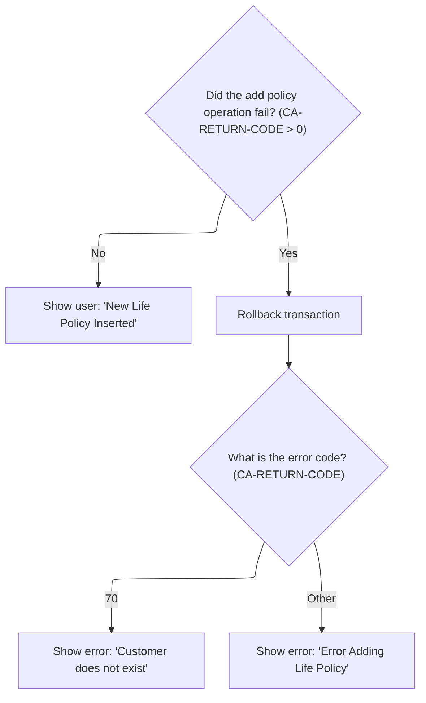

<SwmSnippet path="/base/src/lgtestp2.cbl" line="109">

---

We just returned from <SwmPath>[base/src/lgapol01.cbl](base/src/lgapol01.cbl)</SwmPath> in <SwmToken path="base/src/lgtestp2.cbl" pos="33:5:7" line-data="              GO TO A-GAIN.">`A-GAIN`</SwmToken>. If the add operation failed (<SwmToken path="base/src/lgtestp2.cbl" pos="109:3:7" line-data="                 IF CA-RETURN-CODE &gt; 0">`CA-RETURN-CODE`</SwmToken> > 0), the flow rolls back and jumps to <SwmToken path="base/src/lgtestp2.cbl" pos="111:5:7" line-data="                   GO TO NO-ADD">`NO-ADD`</SwmToken> to show the error message. This keeps the user informed and the system clean.

```cobol
                 IF CA-RETURN-CODE > 0
                   Exec CICS Syncpoint Rollback End-Exec
                   GO TO NO-ADD
                 END-IF
```

---

</SwmSnippet>

<SwmSnippet path="/base/src/lgtestp2.cbl" line="268">

---

<SwmToken path="base/src/lgtestp2.cbl" pos="268:1:3" line-data="       NO-ADD.">`NO-ADD`</SwmToken> picks the error message based on the return code—customer not found or generic add error—then jumps to <SwmToken path="base/src/lgtestp2.cbl" pos="272:5:7" line-data="               Go To ERROR-OUT">`ERROR-OUT`</SwmToken> to reset the UI and let the user try again.

```cobol
       NO-ADD.
           Evaluate CA-RETURN-CODE
             When 70
               Move 'Customer does not exist'          To  ERP1FLDO
               Go To ERROR-OUT
             When Other
               Move 'Error Adding Life Policy'        To  ERP1FLDO
               Go To ERROR-OUT
           End-Evaluate.
```

---

</SwmSnippet>

<SwmSnippet path="/base/src/lgtestp2.cbl" line="113">

---

After returning from <SwmToken path="base/src/lgtestp2.cbl" pos="111:5:7" line-data="                   GO TO NO-ADD">`NO-ADD`</SwmToken> in <SwmToken path="base/src/lgtestp2.cbl" pos="33:5:7" line-data="              GO TO A-GAIN.">`A-GAIN`</SwmToken>, the flow moves the relevant fields into the output area and sends the main menu map to the terminal, showing the error message to the user.

```cobol
                 Move CA-CUSTOMER-NUM To ENP2CNOI
                 Move CA-POLICY-NUM   To ENP2PNOI
                 Move CA-E-FUND-NAME  To ENP2FNMI
                 Move ' '             To ENP2OPTI
                 Move 'New Life Policy Inserted'
                   To  ERP2FLDO
                 EXEC CICS SEND MAP ('SSMAPP2')
                           FROM(SSMAPP2O)
                           MAPSET ('SSMAP')
                 END-EXEC
```

---

</SwmSnippet>

<SwmSnippet path="/base/src/lgtestp2.cbl" line="125">

---

When option '3' is selected, the flow sets up the delete request and calls <SwmToken path="base/src/lgtestp2.cbl" pos="129:10:10" line-data="                 EXEC CICS LINK PROGRAM(&#39;LGDPOL01&#39;)">`LGDPOL01`</SwmToken>, passing all the necessary data for the backend to process the policy deletion.

```cobol
             WHEN '3'
                 Move '01DEND'   To CA-REQUEST-ID
                 Move ENP2CNOO   To CA-CUSTOMER-NUM
                 Move ENP2PNOO   To CA-POLICY-NUM
                 EXEC CICS LINK PROGRAM('LGDPOL01')
                           COMMAREA(COMM-AREA)
                           LENGTH(32500)
                 END-EXEC
```

---

</SwmSnippet>

## Validating and dispatching policy delete requests

```mermaid
%%{init: {"flowchart": {"defaultRenderer": "elk"}} }%%
flowchart TD
    node1["Start: Prepare request context"] --> node2{"Commarea received?"}
    click node1 openCode "base/src/lgdpol01.cbl:84:89"
    node2 -->|"No"| node3["Write error message and return: No commarea received (code '99')"]
    click node2 openCode "base/src/lgdpol01.cbl:95:99"
    click node3 openCode "base/src/lgdpol01.cbl:96:98"
    node2 -->|"Yes"| node4{"Commarea large enough?"}
    click node4 openCode "base/src/lgdpol01.cbl:107:110"
    node4 -->|"No"| node5["Return to caller: Commarea too small (code '98')"]
    click node5 openCode "base/src/lgdpol01.cbl:108:109"
    node4 -->|"Yes"| node6["Upper-case request ID"]
    click node6 openCode "base/src/lgdpol01.cbl:117:117"
    node6 --> node7{"Request type supported?"}
    click node7 openCode "base/src/lgdpol01.cbl:119:122"
    node7 -->|"No"| node8["Return to caller: Unsupported request type (code '99')"]
    click node8 openCode "base/src/lgdpol01.cbl:124:124"
    node7 -->|"Yes"| node9["Delete policy"]
    click node9 openCode "base/src/lgdpol01.cbl:126:126"
    node9 --> node10{"CA-RETURN-CODE > 0 after deletion?"}
    click node10 openCode "base/src/lgdpol01.cbl:127:129"
    node10 -->|"Yes"| node11["Return to caller: Deletion failed"]
    click node11 openCode "base/src/lgdpol01.cbl:128:128"
    node10 -->|"No"| node12["Return to caller: Success (code '00')"]
    click node12 openCode "base/src/lgdpol01.cbl:133:133"
classDef HeadingStyle fill:#777777,stroke:#333,stroke-width:2px;

%% Swimm:
%% %%{init: {"flowchart": {"defaultRenderer": "elk"}} }%%
%% flowchart TD
%%     node1["Start: Prepare request context"] --> node2{"Commarea received?"}
%%     click node1 openCode "<SwmPath>[base/src/lgdpol01.cbl](base/src/lgdpol01.cbl)</SwmPath>:84:89"
%%     node2 -->|"No"| node3["Write error message and return: No commarea received (code '99')"]
%%     click node2 openCode "<SwmPath>[base/src/lgdpol01.cbl](base/src/lgdpol01.cbl)</SwmPath>:95:99"
%%     click node3 openCode "<SwmPath>[base/src/lgdpol01.cbl](base/src/lgdpol01.cbl)</SwmPath>:96:98"
%%     node2 -->|"Yes"| node4{"Commarea large enough?"}
%%     click node4 openCode "<SwmPath>[base/src/lgdpol01.cbl](base/src/lgdpol01.cbl)</SwmPath>:107:110"
%%     node4 -->|"No"| node5["Return to caller: Commarea too small (code '98')"]
%%     click node5 openCode "<SwmPath>[base/src/lgdpol01.cbl](base/src/lgdpol01.cbl)</SwmPath>:108:109"
%%     node4 -->|"Yes"| node6["Upper-case request ID"]
%%     click node6 openCode "<SwmPath>[base/src/lgdpol01.cbl](base/src/lgdpol01.cbl)</SwmPath>:117:117"
%%     node6 --> node7{"Request type supported?"}
%%     click node7 openCode "<SwmPath>[base/src/lgdpol01.cbl](base/src/lgdpol01.cbl)</SwmPath>:119:122"
%%     node7 -->|"No"| node8["Return to caller: Unsupported request type (code '99')"]
%%     click node8 openCode "<SwmPath>[base/src/lgdpol01.cbl](base/src/lgdpol01.cbl)</SwmPath>:124:124"
%%     node7 -->|"Yes"| node9["Delete policy"]
%%     click node9 openCode "<SwmPath>[base/src/lgdpol01.cbl](base/src/lgdpol01.cbl)</SwmPath>:126:126"
%%     node9 --> node10{"<SwmToken path="base/src/lgtestp2.cbl" pos="71:3:7" line-data="                 IF CA-RETURN-CODE &gt; 0">`CA-RETURN-CODE`</SwmToken> > 0 after deletion?"}
%%     click node10 openCode "<SwmPath>[base/src/lgdpol01.cbl](base/src/lgdpol01.cbl)</SwmPath>:127:129"
%%     node10 -->|"Yes"| node11["Return to caller: Deletion failed"]
%%     click node11 openCode "<SwmPath>[base/src/lgdpol01.cbl](base/src/lgdpol01.cbl)</SwmPath>:128:128"
%%     node10 -->|"No"| node12["Return to caller: Success (code '00')"]
%%     click node12 openCode "<SwmPath>[base/src/lgdpol01.cbl](base/src/lgdpol01.cbl)</SwmPath>:133:133"
%% classDef HeadingStyle fill:#777777,stroke:#333,stroke-width:2px;
```

This section is responsible for validating incoming policy delete requests, ensuring all required conditions are met before dispatching the request for deletion. It checks the presence and size of the commarea, validates the request type, and handles error reporting and logging for any issues encountered during the process. Only recognized request IDs are allowed to proceed to policy deletion, and all outcomes are communicated back to the caller with appropriate return codes.

| Category        | Rule Name                        | Description                                                                                                                                                                                                                                                                                                                                                                                                                                                                                                                                                                                                                                                                                                                                                                       |
| --------------- | -------------------------------- | --------------------------------------------------------------------------------------------------------------------------------------------------------------------------------------------------------------------------------------------------------------------------------------------------------------------------------------------------------------------------------------------------------------------------------------------------------------------------------------------------------------------------------------------------------------------------------------------------------------------------------------------------------------------------------------------------------------------------------------------------------------------------------- |
| Data validation | Commarea presence required       | If no commarea is received with the request, the process must log an error message and return an error code '99' to the caller, indicating the request cannot be processed.                                                                                                                                                                                                                                                                                                                                                                                                                                                                                                                                                                                                       |
| Data validation | Minimum commarea size            | If the commarea received is smaller than 28 bytes, the process must return an error code '98' to the caller, indicating the request is invalid due to insufficient data.                                                                                                                                                                                                                                                                                                                                                                                                                                                                                                                                                                                                          |
| Data validation | Supported request types only     | Only requests with a recognized request ID (<SwmToken path="base/src/lgtestp2.cbl" pos="126:4:4" line-data="                 Move &#39;01DEND&#39;   To CA-REQUEST-ID">`01DEND`</SwmToken>, <SwmToken path="base/src/lgdpol01.cbl" pos="120:14:14" line-data="                CA-REQUEST-ID NOT EQUAL TO &#39;01DMOT&#39; AND">`01DMOT`</SwmToken>, <SwmToken path="base/src/lgdpol01.cbl" pos="121:14:14" line-data="                CA-REQUEST-ID NOT EQUAL TO &#39;01DHOU&#39; AND">`01DHOU`</SwmToken>, or <SwmToken path="base/src/lgdpol01.cbl" pos="122:14:14" line-data="                CA-REQUEST-ID NOT EQUAL TO &#39;01DCOM&#39; )">`01DCOM`</SwmToken>) are allowed to proceed. Any other request ID must result in an error code '99' being returned to the caller. |
| Business logic  | Successful deletion confirmation | If all validations pass and the policy deletion is successful, the process must return a success code '00' to the caller.                                                                                                                                                                                                                                                                                                                                                                                                                                                                                                                                                                                                                                                         |

<SwmSnippet path="/base/src/lgdpol01.cbl" line="78">

---

MAINLINE in <SwmToken path="base/src/lgtestp2.cbl" pos="129:10:10" line-data="                 EXEC CICS LINK PROGRAM(&#39;LGDPOL01&#39;)">`LGDPOL01`</SwmToken> checks for commarea presence and size, logs errors if missing, and only proceeds if the request ID is recognized. If valid, it calls <SwmToken path="base/src/lgdpol01.cbl" pos="126:3:9" line-data="               PERFORM DELETE-POLICY-DB2-INFO">`DELETE-POLICY-DB2-INFO`</SwmToken> to actually delete the policy.

```cobol
       MAINLINE SECTION.

      *----------------------------------------------------------------*
      * Common code                                                    *
      *----------------------------------------------------------------*
      * initialize working storage variables
           INITIALIZE WS-HEADER.
      * set up general variable
           MOVE EIBTRNID TO WS-TRANSID.
           MOVE EIBTRMID TO WS-TERMID.
           MOVE EIBTASKN TO WS-TASKNUM.
      *----------------------------------------------------------------*

      *----------------------------------------------------------------*
      * Check commarea and obtain required details                     *
      *----------------------------------------------------------------*
      * If NO commarea received issue an ABEND
           IF EIBCALEN IS EQUAL TO ZERO
               MOVE ' NO COMMAREA RECEIVED' TO EM-VARIABLE
               PERFORM WRITE-ERROR-MESSAGE
               EXEC CICS ABEND ABCODE('LGCA') NODUMP END-EXEC
           END-IF

      * initialize commarea return code to zero
           MOVE '00' TO CA-RETURN-CODE
           MOVE EIBCALEN TO WS-CALEN.
           SET WS-ADDR-DFHCOMMAREA TO ADDRESS OF DFHCOMMAREA.

      * Check commarea is large enough
           IF EIBCALEN IS LESS THAN WS-CA-HEADER-LEN
             MOVE '98' TO CA-RETURN-CODE
             EXEC CICS RETURN END-EXEC
           END-IF

      *----------------------------------------------------------------*
      * Check request-id in commarea and if recognised ...             *
      * Call routine to delete row from policy table                   *
      *----------------------------------------------------------------*
      * Upper case value passed in Request Id field                    *
           MOVE FUNCTION UPPER-CASE(CA-REQUEST-ID) TO CA-REQUEST-ID

           IF ( CA-REQUEST-ID NOT EQUAL TO '01DEND' AND
                CA-REQUEST-ID NOT EQUAL TO '01DMOT' AND
                CA-REQUEST-ID NOT EQUAL TO '01DHOU' AND
                CA-REQUEST-ID NOT EQUAL TO '01DCOM' )
      *        Request is not recognised or supported
               MOVE '99' TO CA-RETURN-CODE
           ELSE
               PERFORM DELETE-POLICY-DB2-INFO
               If CA-RETURN-CODE > 0
                 EXEC CICS RETURN END-EXEC
               End-if
           END-IF

      * Return to caller
           EXEC CICS RETURN END-EXEC.
```

---

</SwmSnippet>

<SwmSnippet path="/base/src/lgdpol01.cbl" line="154">

---

<SwmToken path="base/src/lgdpol01.cbl" pos="154:1:5" line-data="       WRITE-ERROR-MESSAGE.">`WRITE-ERROR-MESSAGE`</SwmToken> in <SwmToken path="base/src/lgtestp2.cbl" pos="129:10:10" line-data="                 EXEC CICS LINK PROGRAM(&#39;LGDPOL01&#39;)">`LGDPOL01`</SwmToken> logs the error with timestamp, then sends both the main error message and up to 90 bytes of commarea data to LGSTSQ for queue logging. This keeps error tracking detailed and avoids overflows.

```cobol
       WRITE-ERROR-MESSAGE.
      * Save SQLCODE in message
      * Obtain and format current time and date
           EXEC CICS ASKTIME ABSTIME(WS-ABSTIME)
           END-EXEC
           EXEC CICS FORMATTIME ABSTIME(Ws-ABSTIME)
                     MMDDYYYY(WS-DATE)
                     TIME(WS-TIME)
           END-EXEC
           MOVE WS-DATE TO EM-DATE
           MOVE WS-TIME TO EM-TIME
      * Write output message to TDQ
           EXEC CICS LINK PROGRAM('LGSTSQ')
                     COMMAREA(ERROR-MSG)
                     LENGTH(LENGTH OF ERROR-MSG)
           END-EXEC.
      * Write 90 bytes or as much as we have of commarea to TDQ
           IF EIBCALEN > 0 THEN
             IF EIBCALEN < 91 THEN
               MOVE DFHCOMMAREA(1:EIBCALEN) TO CA-DATA
               EXEC CICS LINK PROGRAM('LGSTSQ')
                         COMMAREA(CA-ERROR-MSG)
                         LENGTH(LENGTH OF CA-ERROR-MSG)
               END-EXEC
             ELSE
               MOVE DFHCOMMAREA(1:90) TO CA-DATA
               EXEC CICS LINK PROGRAM('LGSTSQ')
                         COMMAREA(CA-ERROR-MSG)
                         LENGTH(LENGTH OF CA-ERROR-MSG)
               END-EXEC
             END-IF
           END-IF.
           EXIT.
```

---

</SwmSnippet>

## Deleting policy records in <SwmToken path="base/src/lgipdb01.cbl" pos="242:5:5" line-data="      * initialize DB2 host variables">`DB2`</SwmToken>

This section governs the process for deleting policy records from the <SwmToken path="base/src/lgipdb01.cbl" pos="242:5:5" line-data="      * initialize DB2 host variables">`DB2`</SwmToken> database, ensuring that only valid requests result in the removal of policy data and that errors are handled appropriately.

| Category        | Rule Name                        | Description                                                                                                            |
| --------------- | -------------------------------- | ---------------------------------------------------------------------------------------------------------------------- |
| Data validation | Valid policy identifier required | A policy record can only be deleted if a valid policy identifier is provided in the request.                           |
| Data validation | Required fields validation       | Deletion requests must include all required fields in the commarea; missing fields result in rejection of the request. |
| Business logic  | Deletion confirmation            | Upon successful deletion, the system must confirm the removal of the policy record and provide a success response.     |

<SwmSnippet path="/base/src/lgdpol01.cbl" line="139">

---

<SwmToken path="base/src/lgdpol01.cbl" pos="139:1:7" line-data="       DELETE-POLICY-DB2-INFO.">`DELETE-POLICY-DB2-INFO`</SwmToken> calls <SwmToken path="base/src/lgdpol01.cbl" pos="141:9:9" line-data="           EXEC CICS LINK PROGRAM(LGDPDB01)">`LGDPDB01`</SwmToken>, passing the full commarea so the backend can delete the policy record from <SwmToken path="base/src/lgdpol01.cbl" pos="139:5:5" line-data="       DELETE-POLICY-DB2-INFO.">`DB2`</SwmToken>.

```cobol
       DELETE-POLICY-DB2-INFO.

           EXEC CICS LINK PROGRAM(LGDPDB01)
                Commarea(DFHCOMMAREA)
                LENGTH(32500)
           END-EXEC.

           EXIT.
```

---

</SwmSnippet>

## Validating, deleting, and logging policy records

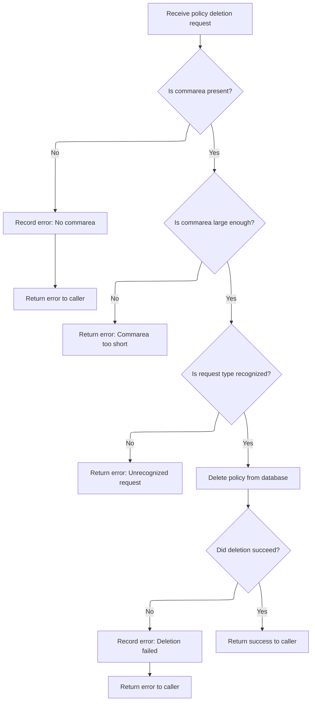

This section governs the validation, deletion, and error logging for policy record deletion requests. It ensures only valid requests are processed, and all errors are logged for audit and troubleshooting purposes.

| Category        | Rule Name                     | Description                                                                                                                                                                                                                                                                                                                                                                                                                                                                                                                                                                                                                                                                                                                              |
| --------------- | ----------------------------- | ---------------------------------------------------------------------------------------------------------------------------------------------------------------------------------------------------------------------------------------------------------------------------------------------------------------------------------------------------------------------------------------------------------------------------------------------------------------------------------------------------------------------------------------------------------------------------------------------------------------------------------------------------------------------------------------------------------------------------------------- |
| Data validation | Recognized request types only | Only requests with recognized request IDs (<SwmToken path="base/src/lgtestp2.cbl" pos="126:4:4" line-data="                 Move &#39;01DEND&#39;   To CA-REQUEST-ID">`01DEND`</SwmToken>, <SwmToken path="base/src/lgdpol01.cbl" pos="121:14:14" line-data="                CA-REQUEST-ID NOT EQUAL TO &#39;01DHOU&#39; AND">`01DHOU`</SwmToken>, <SwmToken path="base/src/lgdpol01.cbl" pos="122:14:14" line-data="                CA-REQUEST-ID NOT EQUAL TO &#39;01DCOM&#39; )">`01DCOM`</SwmToken>, <SwmToken path="base/src/lgdpol01.cbl" pos="120:14:14" line-data="                CA-REQUEST-ID NOT EQUAL TO &#39;01DMOT&#39; AND">`01DMOT`</SwmToken>) are allowed to proceed; all others must be rejected with an error code. |
| Business logic  | Detailed error logging        | All errors must be logged with the SQL error code, timestamp, and up to 90 bytes of commarea data to ensure detailed tracking and avoid overflow.                                                                                                                                                                                                                                                                                                                                                                                                                                                                                                                                                                                        |
| Business logic  | Successful deletion response  | If the policy deletion is successful (SQLCODE 0 or 100), a success code must be returned to the caller.                                                                                                                                                                                                                                                                                                                                                                                                                                                                                                                                                                                                                                  |

<SwmSnippet path="/base/src/lgdpdb01.cbl" line="111">

---

MAINLINE in <SwmToken path="base/src/lgdpol01.cbl" pos="141:9:9" line-data="           EXEC CICS LINK PROGRAM(LGDPDB01)">`LGDPDB01`</SwmToken> checks commarea, converts input fields, validates the request ID, and only then calls <SwmToken path="base/src/lgdpdb01.cbl" pos="167:3:9" line-data="               PERFORM DELETE-POLICY-DB2-INFO">`DELETE-POLICY-DB2-INFO`</SwmToken> to delete the policy. Errors are logged if anything fails.

```cobol
       MAINLINE SECTION.

      *----------------------------------------------------------------*
      * Common code                                                    *
      *----------------------------------------------------------------*
      * initialize working storage variables
           INITIALIZE WS-HEADER.
      * set up general variable
           MOVE EIBTRNID TO WS-TRANSID.
           MOVE EIBTRMID TO WS-TERMID.
           MOVE EIBTASKN TO WS-TASKNUM.
      *----------------------------------------------------------------*

      * initialize DB2 host variables
           INITIALIZE DB2-IN-INTEGERS.

      *----------------------------------------------------------------*
      * Check commarea and obtain required details                     *
      *----------------------------------------------------------------*
      * If NO commarea received issue an ABEND
           IF EIBCALEN IS EQUAL TO ZERO
               MOVE ' NO COMMAREA RECEIVED' TO EM-VARIABLE
               PERFORM WRITE-ERROR-MESSAGE
               EXEC CICS ABEND ABCODE('LGCA') NODUMP END-EXEC
           END-IF

      * initialize commarea return code to zero
           MOVE '00' TO CA-RETURN-CODE
           MOVE EIBCALEN TO WS-CALEN.
           SET WS-ADDR-DFHCOMMAREA TO ADDRESS OF DFHCOMMAREA.

      * Check commarea is large enough
           IF EIBCALEN IS LESS THAN WS-CA-HEADER-LEN
             MOVE '98' TO CA-RETURN-CODE
             EXEC CICS RETURN END-EXEC
           END-IF

      * Convert commarea customer & policy nums to DB2 integer format
           MOVE CA-CUSTOMER-NUM TO DB2-CUSTOMERNUM-INT
           MOVE CA-POLICY-NUM   TO DB2-POLICYNUM-INT
      * and save in error msg field incase required
           MOVE CA-CUSTOMER-NUM TO EM-CUSNUM
           MOVE CA-POLICY-NUM   TO EM-POLNUM

      *----------------------------------------------------------------*
      * Check request-id in commarea and if recognised ...             *
      * Call routine to delete row from policy table                   *
      *----------------------------------------------------------------*

           IF ( CA-REQUEST-ID NOT EQUAL TO '01DEND' AND
                CA-REQUEST-ID NOT EQUAL TO '01DHOU' AND
                CA-REQUEST-ID NOT EQUAL TO '01DCOM' AND
                CA-REQUEST-ID NOT EQUAL TO '01DMOT' ) Then
      *        Request is not recognised or supported
               MOVE '99' TO CA-RETURN-CODE
           ELSE
               PERFORM DELETE-POLICY-DB2-INFO
               EXEC CICS LINK PROGRAM(LGDPVS01)
                    Commarea(DFHCOMMAREA)
                    LENGTH(32500)
               END-EXEC
           END-IF.

      * Return to caller
           EXEC CICS RETURN END-EXEC.
```

---

</SwmSnippet>

<SwmSnippet path="/base/src/lgdpdb01.cbl" line="212">

---

<SwmToken path="base/src/lgdpdb01.cbl" pos="212:1:5" line-data="       WRITE-ERROR-MESSAGE.">`WRITE-ERROR-MESSAGE`</SwmToken> in <SwmToken path="base/src/lgdpol01.cbl" pos="141:9:9" line-data="           EXEC CICS LINK PROGRAM(LGDPDB01)">`LGDPDB01`</SwmToken> logs the SQL error code and timestamp, then sends both the error message and up to 90 bytes of commarea data to LGSTSQ for queue logging. This keeps error tracking detailed and avoids overflows.

```cobol
       WRITE-ERROR-MESSAGE.
      * Save SQLCODE in message
           MOVE SQLCODE TO EM-SQLRC
      * Obtain and format current time and date
           EXEC CICS ASKTIME ABSTIME(WS-ABSTIME)
           END-EXEC
           EXEC CICS FORMATTIME ABSTIME(Ws-ABSTIME)
                     MMDDYYYY(WS-DATE)
                     TIME(WS-TIME)
           END-EXEC
           MOVE WS-DATE TO EM-DATE
           MOVE WS-TIME TO EM-TIME
      * Write output message to TDQ
           EXEC CICS LINK PROGRAM('LGSTSQ')
                     COMMAREA(ERROR-MSG)
                     LENGTH(LENGTH OF ERROR-MSG)
           END-EXEC.
      * Write 90 bytes or as much as we have of commarea to TDQ
           IF EIBCALEN > 0 THEN
             IF EIBCALEN < 91 THEN
               MOVE DFHCOMMAREA(1:EIBCALEN) TO CA-DATA
               EXEC CICS LINK PROGRAM('LGSTSQ')
                         COMMAREA(CA-ERROR-MSG)
                         LENGTH(LENGTH OF CA-ERROR-MSG)
               END-EXEC
             ELSE
               MOVE DFHCOMMAREA(1:90) TO CA-DATA
               EXEC CICS LINK PROGRAM('LGSTSQ')
                         COMMAREA(CA-ERROR-MSG)
                         LENGTH(LENGTH OF CA-ERROR-MSG)
               END-EXEC
             END-IF
           END-IF.
           EXIT.
```

---

</SwmSnippet>

<SwmSnippet path="/base/src/lgdpdb01.cbl" line="186">

---

<SwmToken path="base/src/lgdpdb01.cbl" pos="186:1:7" line-data="       DELETE-POLICY-DB2-INFO.">`DELETE-POLICY-DB2-INFO`</SwmToken> runs the <SwmToken path="base/src/lgdpdb01.cbl" pos="186:5:5" line-data="       DELETE-POLICY-DB2-INFO.">`DB2`</SwmToken> delete for the policy. If the SQLCODE isn't 0 or 100, it logs the error and returns early. Otherwise, it exits cleanly.

```cobol
       DELETE-POLICY-DB2-INFO.

           MOVE ' DELETE POLICY  ' TO EM-SQLREQ
           EXEC SQL
             DELETE
               FROM POLICY
               WHERE ( CUSTOMERNUMBER = :DB2-CUSTOMERNUM-INT AND
                       POLICYNUMBER  = :DB2-POLICYNUM-INT      )
           END-EXEC

      *    Treat SQLCODE 0 and SQLCODE 100 (record not found) as
      *    successful - end result is record does not exist
           IF SQLCODE NOT EQUAL 0 Then
               MOVE '90' TO CA-RETURN-CODE
               PERFORM WRITE-ERROR-MESSAGE
               EXEC CICS RETURN END-EXEC
           END-IF.

           EXIT.
```

---

</SwmSnippet>

## Deleting policy records in VSAM and error handling

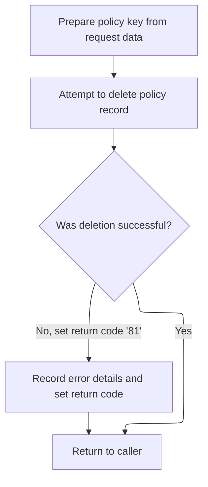

This section governs the deletion of policy records from the VSAM file and ensures robust error handling and logging for any failed deletion attempts. It is critical for maintaining data integrity and providing traceability for failed operations.

| Category        | Rule Name                     | Description                                                                                                                                                                                 |
| --------------- | ----------------------------- | ------------------------------------------------------------------------------------------------------------------------------------------------------------------------------------------- |
| Data validation | Policy record match required  | A policy record must be deleted from the VSAM file only if the provided key fields (request ID, customer number, policy number) match an existing record.                                   |
| Business logic  | Commarea data logging limit   | When logging error details, if commarea data is present, up to 90 bytes of it must be included in the error log. If the commarea data exceeds 90 bytes, only the first 90 bytes are logged. |
| Business logic  | Return on successful deletion | If the deletion is successful, the system must return control to the caller without logging any error or setting a non-normal return code.                                                  |

<SwmSnippet path="/base/src/lgdpvs01.cbl" line="72">

---

In <SwmToken path="base/src/lgdpvs01.cbl" pos="72:1:1" line-data="       MAINLINE SECTION.">`MAINLINE`</SwmToken> of <SwmPath>[base/src/lgdpvs01.cbl](base/src/lgdpvs01.cbl)</SwmPath>, we prep the key fields, then run a CICS delete on the VSAM file (KSDSPOLY) for the policy. If the delete fails (non-normal RESP), we log the error and return immediately. This is where the actual VSAM record removal happens, and any failure is handled right here before moving on.

```cobol
       MAINLINE SECTION.
      *
      *---------------------------------------------------------------*
           Move EIBCALEN To WS-Commarea-Len.
      *---------------------------------------------------------------*
           Move CA-Request-ID(4:1) To WF-Request-ID
           Move CA-Policy-Num      To WF-Policy-Num
           Move CA-Customer-Num    To WF-Customer-Num
      *---------------------------------------------------------------*
           Exec CICS Delete File('KSDSPOLY')
                     Ridfld(WF-Policy-Key)
                     KeyLength(21)
                     RESP(WS-RESP)
           End-Exec.
           If WS-RESP Not = DFHRESP(NORMAL)
             Move EIBRESP2 To WS-RESP2
             MOVE '81' TO CA-RETURN-CODE
             PERFORM WRITE-ERROR-MESSAGE
             EXEC CICS RETURN END-EXEC
           End-If.
```

---

</SwmSnippet>

<SwmSnippet path="/base/src/lgdpvs01.cbl" line="99">

---

In <SwmToken path="base/src/lgdpvs01.cbl" pos="99:1:5" line-data="       WRITE-ERROR-MESSAGE.">`WRITE-ERROR-MESSAGE`</SwmToken>, we build an error message with timestamp, customer/policy info, and response codes, then call LGSTSQ to log it. If there's commarea data, we send up to 90 bytes of it to LGSTSQ as well. The 90-byte limit is hardcoded and not explained, but it keeps the logged data chunked and predictable.

```cobol
       WRITE-ERROR-MESSAGE.
           EXEC CICS ASKTIME ABSTIME(WS-ABSTIME)
           END-EXEC
           EXEC CICS FORMATTIME ABSTIME(WS-ABSTIME)
                     MMDDYYYY(WS-DATE)
                     TIME(WS-TIME)
           END-EXEC
      *
           MOVE WS-DATE TO EM-DATE
           MOVE WS-TIME TO EM-TIME
           Move CA-Customer-Num To EM-CUSNUM 
           Move CA-POLICY-NUM To EM-POLNUM 
           Move WS-RESP         To EM-RespRC
           Move WS-RESP2        To EM-Resp2RC
           EXEC CICS LINK PROGRAM('LGSTSQ')
                     COMMAREA(ERROR-MSG)
                     LENGTH(LENGTH OF ERROR-MSG)
           END-EXEC.
           IF EIBCALEN > 0 THEN
             IF EIBCALEN < 91 THEN
               MOVE DFHCOMMAREA(1:EIBCALEN) TO CA-DATA
               EXEC CICS LINK PROGRAM('LGSTSQ')
                         COMMAREA(CA-ERROR-MSG)
                         LENGTH(Length Of CA-ERROR-MSG)
               END-EXEC
             ELSE
               MOVE DFHCOMMAREA(1:90) TO CA-DATA
               EXEC CICS LINK PROGRAM('LGSTSQ')
                         COMMAREA(CA-ERROR-MSG)
                         LENGTH(Length Of CA-ERROR-MSG)
               END-EXEC
             END-IF
           END-IF.
           EXIT.
```

---

</SwmSnippet>

## Handling delete failures and UI reset

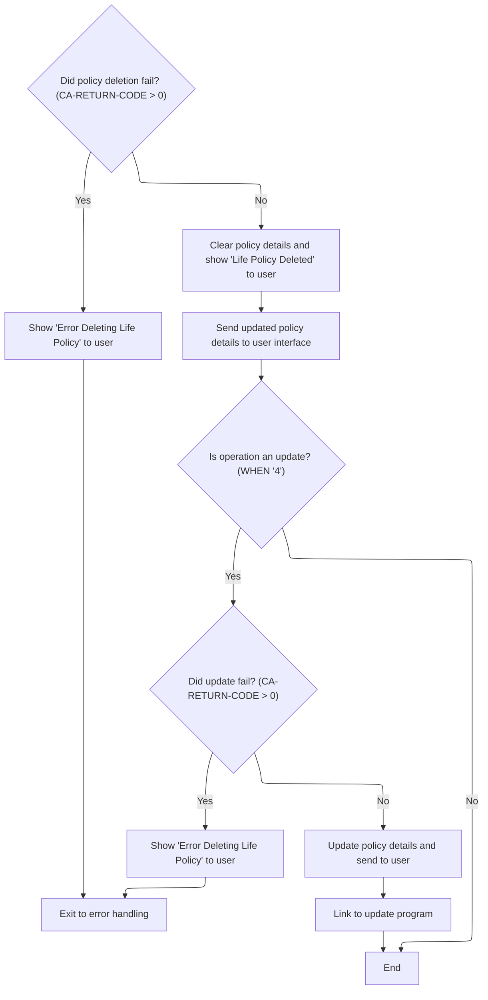

<SwmSnippet path="/base/src/lgtestp2.cbl" line="133">

---

Back in <SwmToken path="base/src/lgtestp2.cbl" pos="33:5:7" line-data="              GO TO A-GAIN.">`A-GAIN`</SwmToken> after returning from <SwmPath>[base/src/lgdpol01.cbl](base/src/lgdpol01.cbl)</SwmPath>, if the delete failed (<SwmToken path="base/src/lgtestp2.cbl" pos="133:3:7" line-data="                 IF CA-RETURN-CODE &gt; 0">`CA-RETURN-CODE`</SwmToken> > 0), we roll back the transaction and jump to <SwmToken path="base/src/lgtestp2.cbl" pos="135:5:7" line-data="                   GO TO NO-DELETE">`NO-DELETE`</SwmToken>. This keeps error handling and messaging consistent for the user.

```cobol
                 IF CA-RETURN-CODE > 0
                   Exec CICS Syncpoint Rollback End-Exec
                   GO TO NO-DELETE
                 END-IF
```

---

</SwmSnippet>

<SwmSnippet path="/base/src/lgtestp2.cbl" line="282">

---

In <SwmToken path="base/src/lgtestp2.cbl" pos="282:1:3" line-data="       NO-DELETE.">`NO-DELETE`</SwmToken>, we set the error message for the user and then jump to <SwmToken path="base/src/lgtestp2.cbl" pos="284:5:7" line-data="           Go To ERROR-OUT.">`ERROR-OUT`</SwmToken> to redraw the main menu. This keeps the UI flow clean after a failed delete.

```cobol
       NO-DELETE.
           Move 'Error Deleting Life Policy'       To  ERP2FLDO
           Go To ERROR-OUT.
```

---

</SwmSnippet>

<SwmSnippet path="/base/src/lgtestp2.cbl" line="138">

---

Back in <SwmToken path="base/src/lgtestp2.cbl" pos="33:5:7" line-data="              GO TO A-GAIN.">`A-GAIN`</SwmToken> after <SwmToken path="base/src/lgtestp2.cbl" pos="135:5:7" line-data="                   GO TO NO-DELETE">`NO-DELETE`</SwmToken>, we clear all the policy output fields and set the message to 'Life Policy Deleted'. This makes sure the UI doesn't show any old data after a failed delete.

```cobol
                 Move Spaces            To  ENP2IDAI
                 Move Spaces            To  ENP2EDAI
                 Move Spaces            To  ENP2FNMI
                 Move Spaces            To  ENP2TERI
                 Move Spaces            To  ENP2SUMI
                 Move Spaces            To  ENP2LIFI
                 Move Spaces            To  ENP2WPRI
                 Move Spaces            To  ENP2MANI
                 Move Spaces            To  ENP2EQUI
                 Move 'Life Policy Deleted'
                   To  ERP2FLDO
```

---

</SwmSnippet>

<SwmSnippet path="/base/src/lgtestp2.cbl" line="149">

---

After clearing the fields, we send the main menu map to the terminal. This refreshes the UI so the user can start over.

```cobol
                 EXEC CICS SEND MAP ('SSMAPP2')
                           FROM(SSMAPP2O)
                           MAPSET ('SSMAP')
                 END-EXEC
```

---

</SwmSnippet>

<SwmSnippet path="/base/src/lgtestp2.cbl" line="155">

---

When the user picks option '4', we prep the inquiry request and call <SwmToken path="base/src/lgtestp2.cbl" pos="159:10:10" line-data="                 EXEC CICS LINK PROGRAM(&#39;LGIPOL01&#39;)">`LGIPOL01`</SwmToken> to fetch the current policy data for editing.

```cobol
             WHEN '4'
                 Move '01IEND'   To CA-REQUEST-ID
                 Move ENP2CNOO   To CA-CUSTOMER-NUM
                 Move ENP2PNOO   To CA-POLICY-NUM
                 EXEC CICS LINK PROGRAM('LGIPOL01')
                           COMMAREA(COMM-AREA)
                           LENGTH(32500)
                 END-EXEC
```

---

</SwmSnippet>

<SwmSnippet path="/base/src/lgtestp2.cbl" line="163">

---

After the inquiry call, if it fails, we go straight to <SwmToken path="base/src/lgtestp2.cbl" pos="164:5:7" line-data="                   GO TO NO-DATA">`NO-DATA`</SwmToken> to handle the error and reset the UI.

```cobol
                 IF CA-RETURN-CODE > 0
                   GO TO NO-DATA
                 END-IF
```

---

</SwmSnippet>

<SwmSnippet path="/base/src/lgtestp2.cbl" line="167">

---

After a successful inquiry, we move the policy data to the output fields and send the map so the user can edit the details for the update.

```cobol
                 Move CA-ISSUE-DATE     To  ENP2IDAI
                 Move CA-EXPIRY-DATE    To  ENP2EDAI
                 Move CA-E-FUND-NAME    To  ENP2FNMI
                 Move CA-E-TERM         To  ENP2TERI
                 Move CA-E-SUM-ASSURED  To  ENP2SUMI
                 Move CA-E-LIFE-ASSURED To  ENP2LIFI
                 Move CA-E-WITH-PROFITS To  ENP2WPRI
                 Move CA-E-MANAGED-FUND To  ENP2MANI
                 Move CA-E-EQUITIES     To  ENP2EQUI
                 EXEC CICS SEND MAP ('SSMAPP2')
                           FROM(SSMAPP2O)
                           MAPSET ('SSMAP')
                 END-EXEC
                 EXEC CICS RECEIVE MAP('SSMAPP2')
                           INTO(SSMAPP2I)
                           MAPSET('SSMAP') END-EXEC
```

---

</SwmSnippet>

<SwmSnippet path="/base/src/lgtestp2.cbl" line="184">

---

Before calling <SwmToken path="base/src/lgtestp2.cbl" pos="198:10:10" line-data="                 EXEC CICS LINK PROGRAM(&#39;LGUPOL01&#39;)">`LGUPOL01`</SwmToken> to update, we move all the edited fields into the commarea, resetting payment and broker fields to defaults. This preps the update request cleanly.

```cobol
                 Move '01UEND'          To CA-REQUEST-ID
                 Move ENP2CNOI          To CA-CUSTOMER-NUM
                 Move 0                 To CA-PAYMENT
                 Move 0                 To CA-BROKERID
                 Move '        '        To CA-BROKERSREF
                 Move ENP2IDAI          To CA-ISSUE-DATE
                 Move ENP2EDAI          To CA-EXPIRY-DATE
                 Move ENP2FNMI          To CA-E-FUND-NAME
                 Move ENP2TERI          To CA-E-TERM
                 Move ENP2SUMI          To CA-E-SUM-ASSURED
                 Move ENP2LIFI          To CA-E-LIFE-ASSURED
                 Move ENP2WPRI          To CA-E-WITH-PROFITS
                 Move ENP2MANI          To CA-E-MANAGED-FUND
                 Move ENP2EQUI          To CA-E-EQUITIES
```

---

</SwmSnippet>

<SwmSnippet path="/base/src/lgtestp2.cbl" line="198">

---

After prepping the update fields, we call <SwmToken path="base/src/lgtestp2.cbl" pos="198:10:10" line-data="                 EXEC CICS LINK PROGRAM(&#39;LGUPOL01&#39;)">`LGUPOL01`</SwmToken> with the commarea. This hands off the update logic to the backend program that knows all the business rules for policy updates.

```cobol
                 EXEC CICS LINK PROGRAM('LGUPOL01')
                           COMMAREA(COMM-AREA)
                           LENGTH(32500)
                 END-EXEC
```

---

</SwmSnippet>

## Validating and dispatching policy update requests

```mermaid
%%{init: {"flowchart": {"defaultRenderer": "elk"}} }%%
flowchart TD
    node1["Initialize transaction and variables"]
    click node1 openCode "base/src/lgupol01.cbl:89:93"
    node1 --> node2{"Is commarea received?"}
    click node2 openCode "base/src/lgupol01.cbl:99:103"
    node2 -->|"No"| node3["Set error message: No commarea"]
    click node3 openCode "base/src/lgupol01.cbl:100:101"
    node3 --> node4["Write error message"]
    click node4 openCode "base/src/lgupol01.cbl:101:101"
    node4 --> node5["Abort transaction"]
    click node5 openCode "base/src/lgupol01.cbl:102:102"
    node2 -->|"Yes"| node6["Set return code to 00"]
    click node6 openCode "base/src/lgupol01.cbl:105:105"
    node6 --> node7{"Which policy type?"}
    click node7 openCode "base/src/lgupol01.cbl:113:141"
    node7 -->|"Endowment"| node8{"Is data sufficient for Endowment?"}
    click node8 openCode "base/src/lgupol01.cbl:116:118"
    node8 -->|"No"| node9["Set error code: 98"]
    click node9 openCode "base/src/lgupol01.cbl:119:120"
    node9 --> node10["Return"]
    click node10 openCode "base/src/lgupol01.cbl:120:120"
    node8 -->|"Yes"| node11["Update policy info"]
    click node11 openCode "base/src/lgupol01.cbl:143:143"
    node11 --> node10
    node7 -->|"House"| node12{"Is data sufficient for House?"}
    click node12 openCode "base/src/lgupol01.cbl:124:126"
    node12 -->|"No"| node9
    node12 -->|"Yes"| node11
    node7 -->|"Motor"| node13{"Is data sufficient for Motor?"}
    click node13 openCode "base/src/lgupol01.cbl:132:134"
    node13 -->|"No"| node9
    node13 -->|"Yes"| node11
    node7 -->|"Other"| node14["Set error code: 99"]
    click node14 openCode "base/src/lgupol01.cbl:140:140"
    node14 --> node10
classDef HeadingStyle fill:#777777,stroke:#333,stroke-width:2px;

%% Swimm:
%% %%{init: {"flowchart": {"defaultRenderer": "elk"}} }%%
%% flowchart TD
%%     node1["Initialize transaction and variables"]
%%     click node1 openCode "<SwmPath>[base/src/lgupol01.cbl](base/src/lgupol01.cbl)</SwmPath>:89:93"
%%     node1 --> node2{"Is commarea received?"}
%%     click node2 openCode "<SwmPath>[base/src/lgupol01.cbl](base/src/lgupol01.cbl)</SwmPath>:99:103"
%%     node2 -->|"No"| node3["Set error message: No commarea"]
%%     click node3 openCode "<SwmPath>[base/src/lgupol01.cbl](base/src/lgupol01.cbl)</SwmPath>:100:101"
%%     node3 --> node4["Write error message"]
%%     click node4 openCode "<SwmPath>[base/src/lgupol01.cbl](base/src/lgupol01.cbl)</SwmPath>:101:101"
%%     node4 --> node5["Abort transaction"]
%%     click node5 openCode "<SwmPath>[base/src/lgupol01.cbl](base/src/lgupol01.cbl)</SwmPath>:102:102"
%%     node2 -->|"Yes"| node6["Set return code to 00"]
%%     click node6 openCode "<SwmPath>[base/src/lgupol01.cbl](base/src/lgupol01.cbl)</SwmPath>:105:105"
%%     node6 --> node7{"Which policy type?"}
%%     click node7 openCode "<SwmPath>[base/src/lgupol01.cbl](base/src/lgupol01.cbl)</SwmPath>:113:141"
%%     node7 -->|"Endowment"| node8{"Is data sufficient for Endowment?"}
%%     click node8 openCode "<SwmPath>[base/src/lgupol01.cbl](base/src/lgupol01.cbl)</SwmPath>:116:118"
%%     node8 -->|"No"| node9["Set error code: 98"]
%%     click node9 openCode "<SwmPath>[base/src/lgupol01.cbl](base/src/lgupol01.cbl)</SwmPath>:119:120"
%%     node9 --> node10["Return"]
%%     click node10 openCode "<SwmPath>[base/src/lgupol01.cbl](base/src/lgupol01.cbl)</SwmPath>:120:120"
%%     node8 -->|"Yes"| node11["Update policy info"]
%%     click node11 openCode "<SwmPath>[base/src/lgupol01.cbl](base/src/lgupol01.cbl)</SwmPath>:143:143"
%%     node11 --> node10
%%     node7 -->|"House"| node12{"Is data sufficient for House?"}
%%     click node12 openCode "<SwmPath>[base/src/lgupol01.cbl](base/src/lgupol01.cbl)</SwmPath>:124:126"
%%     node12 -->|"No"| node9
%%     node12 -->|"Yes"| node11
%%     node7 -->|"Motor"| node13{"Is data sufficient for Motor?"}
%%     click node13 openCode "<SwmPath>[base/src/lgupol01.cbl](base/src/lgupol01.cbl)</SwmPath>:132:134"
%%     node13 -->|"No"| node9
%%     node13 -->|"Yes"| node11
%%     node7 -->|"Other"| node14["Set error code: 99"]
%%     click node14 openCode "<SwmPath>[base/src/lgupol01.cbl](base/src/lgupol01.cbl)</SwmPath>:140:140"
%%     node14 --> node10
%% classDef HeadingStyle fill:#777777,stroke:#333,stroke-width:2px;
```

This section governs the validation and dispatching of policy update requests, ensuring only complete and correct requests are processed, and that errors are logged and communicated clearly.

| Category        | Rule Name                     | Description                                                                                                                                                                                                                                                                                                   |
| --------------- | ----------------------------- | ------------------------------------------------------------------------------------------------------------------------------------------------------------------------------------------------------------------------------------------------------------------------------------------------------------- |
| Data validation | Missing commarea abort        | If no commarea is received with the request, the transaction must be aborted and an error message 'NO COMMAREA RECEIVED' must be logged.                                                                                                                                                                      |
| Data validation | Minimum data for policy type  | For each policy type (Endowment, House, Motor), the request must include a commarea of at least the minimum required length: 152 bytes for Endowment, 158 bytes for House, and 165 bytes for Motor (header plus type-specific length). Requests with insufficient data must be rejected with error code '98'. |
| Data validation | Unknown policy type rejection | If the policy type in the request is not recognized (not Endowment, House, or Motor), the request must be rejected with error code '99'.                                                                                                                                                                      |
| Business logic  | Dispatch valid update         | If all validations pass, the policy update request must be dispatched to the database for processing.                                                                                                                                                                                                         |

<SwmSnippet path="/base/src/lgupol01.cbl" line="83">

---

In <SwmToken path="base/src/lgupol01.cbl" pos="83:1:1" line-data="       MAINLINE SECTION.">`MAINLINE`</SwmToken> of <SwmPath>[base/src/lgupol01.cbl](base/src/lgupol01.cbl)</SwmPath>, we validate the commarea and request ID, bail out if anything's missing or too short, and then call <SwmToken path="base/src/lgupol01.cbl" pos="143:3:9" line-data="           PERFORM UPDATE-POLICY-DB2-INFO.">`UPDATE-POLICY-DB2-INFO`</SwmToken> to actually run the update. This keeps the update logic safe and type-specific.

```cobol
       MAINLINE SECTION.

      *----------------------------------------------------------------*
      * Common code                                                    *
      *----------------------------------------------------------------*
      * initialize working storage variables
           INITIALIZE WS-HEADER.
      * set up general variable
           MOVE EIBTRNID TO WS-TRANSID.
           MOVE EIBTRMID TO WS-TERMID.
           MOVE EIBTASKN TO WS-TASKNUM.

      *----------------------------------------------------------------*
      * Check commarea and obtain required details                     *
      *----------------------------------------------------------------*
      * If NO commarea received issue an ABEND
           IF EIBCALEN IS EQUAL TO ZERO
               MOVE ' NO COMMAREA RECEIVED' TO EM-VARIABLE
               PERFORM WRITE-ERROR-MESSAGE
               EXEC CICS ABEND ABCODE('LGCA') NODUMP END-EXEC
           END-IF
      * initialize commarea return code to zero
           MOVE '00' TO CA-RETURN-CODE
           MOVE EIBCALEN TO WS-CALEN.
           SET WS-ADDR-DFHCOMMAREA TO ADDRESS OF DFHCOMMAREA.

      *----------------------------------------------------------------*
      * Check which policy type is being requested                     *
      *   and chec commarea length                                     *
      *----------------------------------------------------------------*
           EVALUATE CA-REQUEST-ID

             WHEN '01UEND'
               ADD WS-CA-HEADER-LEN  TO WS-REQUIRED-CA-LEN
               ADD WS-FULL-ENDOW-LEN TO WS-REQUIRED-CA-LEN
               IF EIBCALEN IS LESS THAN WS-REQUIRED-CA-LEN
                 MOVE '98' TO CA-RETURN-CODE
                 EXEC CICS RETURN END-EXEC
               END-IF

             WHEN '01UHOU'
               ADD WS-CA-HEADER-LEN  TO WS-REQUIRED-CA-LEN
               ADD WS-FULL-HOUSE-LEN TO WS-REQUIRED-CA-LEN
               IF EIBCALEN IS LESS THAN WS-REQUIRED-CA-LEN
                 MOVE '98' TO CA-RETURN-CODE
                 EXEC CICS RETURN END-EXEC
               END-IF

             WHEN '01UMOT'
               ADD WS-CA-HEADER-LEN  TO WS-REQUIRED-CA-LEN
               ADD WS-FULL-MOTOR-LEN TO WS-REQUIRED-CA-LEN
               IF EIBCALEN IS LESS THAN WS-REQUIRED-CA-LEN
                 MOVE '98' TO CA-RETURN-CODE
                 EXEC CICS RETURN END-EXEC
               END-IF

             WHEN OTHER
               MOVE '99' TO CA-RETURN-CODE
           END-EVALUATE

           PERFORM UPDATE-POLICY-DB2-INFO.
```

---

</SwmSnippet>

<SwmSnippet path="/base/src/lgupol01.cbl" line="169">

---

In <SwmToken path="base/src/lgupol01.cbl" pos="169:1:5" line-data="       WRITE-ERROR-MESSAGE.">`WRITE-ERROR-MESSAGE`</SwmToken>, we timestamp the error, fill in the error structure, and call LGSTSQ to log it. If there's commarea data, we send up to 90 bytes of it as well. The 90-byte limit is just a fixed chunk for logging context.

```cobol
       WRITE-ERROR-MESSAGE.
      * Save SQLCODE in message
      * Obtain and format current time and date
           EXEC CICS ASKTIME ABSTIME(WS-ABSTIME)
           END-EXEC
           EXEC CICS FORMATTIME ABSTIME(WS-ABSTIME)
                     MMDDYYYY(WS-DATE)
                     TIME(WS-TIME)
           END-EXEC
           MOVE WS-DATE TO EM-DATE
           MOVE WS-TIME TO EM-TIME
      * Write output message to TDQ
           EXEC CICS LINK PROGRAM('LGSTSQ')
                     COMMAREA(ERROR-MSG)
                     LENGTH(LENGTH OF ERROR-MSG)
           END-EXEC.
      * Write 90 bytes or as much as we have of commarea to TDQ
           IF EIBCALEN > 0 THEN
             IF EIBCALEN < 91 THEN
               MOVE DFHCOMMAREA(1:EIBCALEN) TO CA-DATA
               EXEC CICS LINK PROGRAM('LGSTSQ')
                         COMMAREA(CA-ERROR-MSG)
                         LENGTH(LENGTH OF CA-ERROR-MSG)
               END-EXEC
             ELSE
               MOVE DFHCOMMAREA(1:90) TO CA-DATA
               EXEC CICS LINK PROGRAM('LGSTSQ')
                         COMMAREA(CA-ERROR-MSG)
                         LENGTH(LENGTH OF CA-ERROR-MSG)
               END-EXEC
             END-IF
           END-IF.
           EXIT.
```

---

</SwmSnippet>

<SwmSnippet path="/base/src/lgupol01.cbl" line="83">

---

After all the checks in MAINLINE, we call <SwmToken path="base/src/lgupol01.cbl" pos="143:3:9" line-data="           PERFORM UPDATE-POLICY-DB2-INFO.">`UPDATE-POLICY-DB2-INFO`</SwmToken> to actually update the policy in the DB. This is the last step in the update request flow.

```cobol
       MAINLINE SECTION.

      *----------------------------------------------------------------*
      * Common code                                                    *
      *----------------------------------------------------------------*
      * initialize working storage variables
           INITIALIZE WS-HEADER.
      * set up general variable
           MOVE EIBTRNID TO WS-TRANSID.
           MOVE EIBTRMID TO WS-TERMID.
           MOVE EIBTASKN TO WS-TASKNUM.

      *----------------------------------------------------------------*
      * Check commarea and obtain required details                     *
      *----------------------------------------------------------------*
      * If NO commarea received issue an ABEND
           IF EIBCALEN IS EQUAL TO ZERO
               MOVE ' NO COMMAREA RECEIVED' TO EM-VARIABLE
               PERFORM WRITE-ERROR-MESSAGE
               EXEC CICS ABEND ABCODE('LGCA') NODUMP END-EXEC
           END-IF
      * initialize commarea return code to zero
           MOVE '00' TO CA-RETURN-CODE
           MOVE EIBCALEN TO WS-CALEN.
           SET WS-ADDR-DFHCOMMAREA TO ADDRESS OF DFHCOMMAREA.

      *----------------------------------------------------------------*
      * Check which policy type is being requested                     *
      *   and chec commarea length                                     *
      *----------------------------------------------------------------*
           EVALUATE CA-REQUEST-ID

             WHEN '01UEND'
               ADD WS-CA-HEADER-LEN  TO WS-REQUIRED-CA-LEN
               ADD WS-FULL-ENDOW-LEN TO WS-REQUIRED-CA-LEN
               IF EIBCALEN IS LESS THAN WS-REQUIRED-CA-LEN
                 MOVE '98' TO CA-RETURN-CODE
                 EXEC CICS RETURN END-EXEC
               END-IF

             WHEN '01UHOU'
               ADD WS-CA-HEADER-LEN  TO WS-REQUIRED-CA-LEN
               ADD WS-FULL-HOUSE-LEN TO WS-REQUIRED-CA-LEN
               IF EIBCALEN IS LESS THAN WS-REQUIRED-CA-LEN
                 MOVE '98' TO CA-RETURN-CODE
                 EXEC CICS RETURN END-EXEC
               END-IF

             WHEN '01UMOT'
               ADD WS-CA-HEADER-LEN  TO WS-REQUIRED-CA-LEN
               ADD WS-FULL-MOTOR-LEN TO WS-REQUIRED-CA-LEN
               IF EIBCALEN IS LESS THAN WS-REQUIRED-CA-LEN
                 MOVE '98' TO CA-RETURN-CODE
                 EXEC CICS RETURN END-EXEC
               END-IF

             WHEN OTHER
               MOVE '99' TO CA-RETURN-CODE
           END-EVALUATE

           PERFORM UPDATE-POLICY-DB2-INFO.
```

---

</SwmSnippet>

## Updating policy records in <SwmToken path="base/src/lgipdb01.cbl" pos="242:5:5" line-data="      * initialize DB2 host variables">`DB2`</SwmToken>

This section is responsible for updating existing policy records in the <SwmToken path="base/src/lgipdb01.cbl" pos="242:5:5" line-data="      * initialize DB2 host variables">`DB2`</SwmToken> database, ensuring that all changes to policy data are accurately reflected in the system.

| Category        | Rule Name                  | Description                                                                                                                                                                                                                                                                  |
| --------------- | -------------------------- | ---------------------------------------------------------------------------------------------------------------------------------------------------------------------------------------------------------------------------------------------------------------------------- |
| Data validation | Policy record completeness | Only valid and complete policy records are eligible for update in the <SwmToken path="base/src/lgipdb01.cbl" pos="242:5:5" line-data="      * initialize DB2 host variables">`DB2`</SwmToken> database. All mandatory fields must be present before the update is attempted. |
| Data validation | Policy existence check     | If the policy record does not exist in the <SwmToken path="base/src/lgipdb01.cbl" pos="242:5:5" line-data="      * initialize DB2 host variables">`DB2`</SwmToken> database, the update operation must not proceed and an error message must be generated.                   |
| Business logic  | Update audit logging       | All updates to policy records must be logged with a timestamp and user identifier for audit purposes.                                                                                                                                                                        |
| Business logic  | Business hours restriction | Updates must only be performed during defined business hours (e.g., 8:00 AM to 6:00 PM local time) unless an override is authorized.                                                                                                                                         |

<SwmSnippet path="/base/src/lgupol01.cbl" line="155">

---

In <SwmToken path="base/src/lgupol01.cbl" pos="155:1:7" line-data="       UPDATE-POLICY-DB2-INFO.">`UPDATE-POLICY-DB2-INFO`</SwmToken>, we link to <SwmToken path="base/src/lgupol01.cbl" pos="157:9:9" line-data="           EXEC CICS LINK Program(LGUPDB01)">`LGUPDB01`</SwmToken> with the commarea. That program does the actual <SwmToken path="base/src/lgupol01.cbl" pos="155:5:5" line-data="       UPDATE-POLICY-DB2-INFO.">`DB2`</SwmToken> update for the policy.

```cobol
       UPDATE-POLICY-DB2-INFO.

           EXEC CICS LINK Program(LGUPDB01)
                Commarea(DFHCOMMAREA)
                LENGTH(32500)
           END-EXEC.

           EXIT.
```

---

</SwmSnippet>

## Validating, updating, and logging policy records

```mermaid
%%{init: {"flowchart": {"defaultRenderer": "elk"}} }%%
flowchart TD
    node1["Start: Initialize business context"] --> node2{"Was request data (commarea) received?"}
    click node1 openCode "base/src/lgupdb01.cbl:162:178"
    node2 -->|"No"| node3["Log error: No request data"]
    click node2 openCode "base/src/lgupdb01.cbl:183:187"
    click node3 openCode "base/src/lgupdb01.cbl:184:186"
    node3 --> node4["Abort transaction"]
    click node4 openCode "base/src/lgupdb01.cbl:186:187"
    node2 -->|"Yes"| node5["Set request status to success"]
    click node5 openCode "base/src/lgupdb01.cbl:190:192"
    node5 --> node6["Save customer and policy numbers for processing"]
    click node6 openCode "base/src/lgupdb01.cbl:195:200"
    node6 --> node7["Update policy information in database"]
    click node7 openCode "base/src/lgupdb01.cbl:207:207"
    node7 --> node8["Process request in downstream system"]
    click node8 openCode "base/src/lgupdb01.cbl:209:212"
classDef HeadingStyle fill:#777777,stroke:#333,stroke-width:2px;

%% Swimm:
%% %%{init: {"flowchart": {"defaultRenderer": "elk"}} }%%
%% flowchart TD
%%     node1["Start: Initialize business context"] --> node2{"Was request data (commarea) received?"}
%%     click node1 openCode "<SwmPath>[base/src/lgupdb01.cbl](base/src/lgupdb01.cbl)</SwmPath>:162:178"
%%     node2 -->|"No"| node3["Log error: No request data"]
%%     click node2 openCode "<SwmPath>[base/src/lgupdb01.cbl](base/src/lgupdb01.cbl)</SwmPath>:183:187"
%%     click node3 openCode "<SwmPath>[base/src/lgupdb01.cbl](base/src/lgupdb01.cbl)</SwmPath>:184:186"
%%     node3 --> node4["Abort transaction"]
%%     click node4 openCode "<SwmPath>[base/src/lgupdb01.cbl](base/src/lgupdb01.cbl)</SwmPath>:186:187"
%%     node2 -->|"Yes"| node5["Set request status to success"]
%%     click node5 openCode "<SwmPath>[base/src/lgupdb01.cbl](base/src/lgupdb01.cbl)</SwmPath>:190:192"
%%     node5 --> node6["Save customer and policy numbers for processing"]
%%     click node6 openCode "<SwmPath>[base/src/lgupdb01.cbl](base/src/lgupdb01.cbl)</SwmPath>:195:200"
%%     node6 --> node7["Update policy information in database"]
%%     click node7 openCode "<SwmPath>[base/src/lgupdb01.cbl](base/src/lgupdb01.cbl)</SwmPath>:207:207"
%%     node7 --> node8["Process request in downstream system"]
%%     click node8 openCode "<SwmPath>[base/src/lgupdb01.cbl](base/src/lgupdb01.cbl)</SwmPath>:209:212"
%% classDef HeadingStyle fill:#777777,stroke:#333,stroke-width:2px;
```

This section is responsible for validating incoming policy update requests, updating the corresponding policy record in the database, and ensuring that all errors are logged with sufficient detail for audit and troubleshooting purposes.

<SwmSnippet path="/base/src/lgupdb01.cbl" line="162">

---

Here, we prep and validate everything, update the <SwmToken path="base/src/lgupdb01.cbl" pos="175:5:5" line-data="      * initialize DB2 host variables">`DB2`</SwmToken> record, and then pass control to <SwmToken path="base/src/lgupdb01.cbl" pos="209:9:9" line-data="           EXEC CICS LINK Program(LGUPVS01)">`LGUPVS01`</SwmToken>.

```cobol
       MAINLINE SECTION.

      *----------------------------------------------------------------*
      * Common code                                                    *
      *----------------------------------------------------------------*
      * initialize working storage variables
           INITIALIZE WS-HEADER.
      * set up general variable
           MOVE EIBTRNID TO WS-TRANSID.
           MOVE EIBTRMID TO WS-TERMID.
           MOVE EIBTASKN TO WS-TASKNUM.
           MOVE SPACES   TO WS-RETRY.
      *----------------------------------------------------------------*
      * initialize DB2 host variables
           INITIALIZE DB2-POLICY.
           INITIALIZE DB2-IN-INTEGERS.

      *----------------------------------------------------------------*
      * Check commarea and obtain required details                     *
      *----------------------------------------------------------------*
      * If NO commarea received issue an ABEND
           IF EIBCALEN IS EQUAL TO ZERO
               MOVE ' NO COMMAREA RECEIVED' TO EM-VARIABLE
               PERFORM WRITE-ERROR-MESSAGE
               EXEC CICS ABEND ABCODE('LGCA') NODUMP END-EXEC
           END-IF

      * initialize commarea return code to zero
           MOVE '00' TO CA-RETURN-CODE
           MOVE EIBCALEN TO WS-CALEN.
           SET WS-ADDR-DFHCOMMAREA TO ADDRESS OF DFHCOMMAREA.

      * Convert commarea customer & policy nums to DB2 integer format
           MOVE CA-CUSTOMER-NUM TO DB2-CUSTOMERNUM-INT
           MOVE CA-POLICY-NUM   TO DB2-POLICYNUM-INT
      * and save in error msg field incase required
           MOVE CA-CUSTOMER-NUM TO EM-CUSNUM
           MOVE CA-POLICY-NUM   TO EM-POLNUM

      *----------------------------------------------------------------*
      * Check which policy type is being requested                     *
      *   and check commarea length                                    *
      *----------------------------------------------------------------*

      *    Call procedure to update required tables
           PERFORM UPDATE-POLICY-DB2-INFO.

           EXEC CICS LINK Program(LGUPVS01)
                Commarea(DFHCOMMAREA)
                LENGTH(225)
           END-EXEC.
```

---

</SwmSnippet>

<SwmSnippet path="/base/src/lgupdb01.cbl" line="502">

---

In <SwmToken path="base/src/lgupdb01.cbl" pos="502:1:5" line-data="       WRITE-ERROR-MESSAGE.">`WRITE-ERROR-MESSAGE`</SwmToken>, we log the SQLCODE, timestamp, and all the error context, then call LGSTSQ to write it to the queue. If there's commarea data, we send up to 90 bytes of that too for extra context.

```cobol
       WRITE-ERROR-MESSAGE.
      * Save SQLCODE in message
           MOVE SQLCODE TO EM-SQLRC
      * Obtain and format current time and date
           EXEC CICS ASKTIME ABSTIME(WS-ABSTIME)
           END-EXEC
           EXEC CICS FORMATTIME ABSTIME(WS-ABSTIME)
                     MMDDYYYY(WS-DATE)
                     TIME(WS-TIME)
           END-EXEC
           MOVE WS-DATE TO EM-DATE
           MOVE WS-TIME TO EM-TIME
      * Write output message to TDQ
           EXEC CICS LINK PROGRAM('LGSTSQ')
                     COMMAREA(ERROR-MSG)
                     LENGTH(LENGTH OF ERROR-MSG)
           END-EXEC.
      * Write 90 bytes or as much as we have of commarea to TDQ
           IF EIBCALEN > 0 THEN
             IF EIBCALEN < 91 THEN
               MOVE DFHCOMMAREA(1:EIBCALEN) TO CA-DATA
               EXEC CICS LINK PROGRAM('LGSTSQ')
                         COMMAREA(CA-ERROR-MSG)
                         LENGTH(LENGTH OF CA-ERROR-MSG)
               END-EXEC
             ELSE
               MOVE DFHCOMMAREA(1:90) TO CA-DATA
               EXEC CICS LINK PROGRAM('LGSTSQ')
                         COMMAREA(CA-ERROR-MSG)
                         LENGTH(LENGTH OF CA-ERROR-MSG)
               END-EXEC
             END-IF
           END-IF.
           EXIT.
```

---

</SwmSnippet>

## Updating policy type tables and handling concurrency

```mermaid
%%{init: {"flowchart": {"defaultRenderer": "elk"}} }%%
flowchart TD
    node1["Open policy cursor"]
    click node1 openCode "base/src/lgupdb01.cbl:254:257"
    node1 --> node2{"SQLCODE after open?"}
    click node2 openCode "base/src/lgupdb01.cbl:259:270"
    node2 -->|"0 (Success)"| node3["Fetch policy row"]
    click node3 openCode "base/src/lgupdb01.cbl:273:273"
    node2 -->|"-913 or Other"| node8["Return error (CA-RETURN-CODE '90')"]
    click node8 openCode "base/src/lgupdb01.cbl:263:269"
    node8 --> node17["Close cursor"]
    click node17 openCode "base/src/lgupdb01.cbl:360:367"
    node17 --> node18["Finish"]
    node3 --> node4{"SQLCODE after fetch?"}
    click node4 openCode "base/src/lgupdb01.cbl:275:358"
    node4 -->|"0 (Success)"| node5{"Do timestamps match?"}
    node4 -->|"100 (Not found)"| node15["Return not found (CA-RETURN-CODE '01')"]
    click node15 openCode "base/src/lgupdb01.cbl:352:352"
    node15 --> node17
    node4 -->|"Other"| node8
    node5 -->|"Yes"| node6{"Policy type (CA-REQUEST-ID)?"}
    node5 -->|"No"| node16["Return timestamp mismatch (CA-RETURN-CODE '02')"]
    click node16 openCode "base/src/lgupdb01.cbl:346:346"
    node16 --> node17
    node6 -->|"Endowment"| node10["Update Endowment policy"]
    click node10 openCode "base/src/lgupdb01.cbl:288:288"
    node6 -->|"House"| node11["Update House policy"]
    click node11 openCode "base/src/lgupdb01.cbl:293:293"
    node6 -->|"Motor"| node12["Update Motor policy"]
    click node12 openCode "base/src/lgupdb01.cbl:298:298"
    node10 --> node7["Update main policy table"]
    node11 --> node7
    node12 --> node7
    click node7 openCode "base/src/lgupdb01.cbl:317:326"
    node7 --> node13{"SQLCODE after main policy update?"}
    click node13 openCode "base/src/lgupdb01.cbl:336:342"
    node13 -->|"0 (Success)"| node14["Fetch new timestamp"]
    click node14 openCode "base/src/lgupdb01.cbl:329:334"
    node14 --> node17
    node13 -->|"Other"| node8
    node17["Close cursor"]
    click node17 openCode "base/src/lgupdb01.cbl:360:367"
    node18["Finish"]
    click node18 openCode "base/src/lgupdb01.cbl:368:368"

classDef HeadingStyle fill:#777777,stroke:#333,stroke-width:2px;

%% Swimm:
%% %%{init: {"flowchart": {"defaultRenderer": "elk"}} }%%
%% flowchart TD
%%     node1["Open policy cursor"]
%%     click node1 openCode "<SwmPath>[base/src/lgupdb01.cbl](base/src/lgupdb01.cbl)</SwmPath>:254:257"
%%     node1 --> node2{"SQLCODE after open?"}
%%     click node2 openCode "<SwmPath>[base/src/lgupdb01.cbl](base/src/lgupdb01.cbl)</SwmPath>:259:270"
%%     node2 -->|"0 (Success)"| node3["Fetch policy row"]
%%     click node3 openCode "<SwmPath>[base/src/lgupdb01.cbl](base/src/lgupdb01.cbl)</SwmPath>:273:273"
%%     node2 -->|"-913 or Other"| node8["Return error (<SwmToken path="base/src/lgtestp2.cbl" pos="71:3:7" line-data="                 IF CA-RETURN-CODE &gt; 0">`CA-RETURN-CODE`</SwmToken> '90')"]
%%     click node8 openCode "<SwmPath>[base/src/lgupdb01.cbl](base/src/lgupdb01.cbl)</SwmPath>:263:269"
%%     node8 --> node17["Close cursor"]
%%     click node17 openCode "<SwmPath>[base/src/lgupdb01.cbl](base/src/lgupdb01.cbl)</SwmPath>:360:367"
%%     node17 --> node18["Finish"]
%%     node3 --> node4{"SQLCODE after fetch?"}
%%     click node4 openCode "<SwmPath>[base/src/lgupdb01.cbl](base/src/lgupdb01.cbl)</SwmPath>:275:358"
%%     node4 -->|"0 (Success)"| node5{"Do timestamps match?"}
%%     node4 -->|"100 (Not found)"| node15["Return not found (<SwmToken path="base/src/lgtestp2.cbl" pos="71:3:7" line-data="                 IF CA-RETURN-CODE &gt; 0">`CA-RETURN-CODE`</SwmToken> '01')"]
%%     click node15 openCode "<SwmPath>[base/src/lgupdb01.cbl](base/src/lgupdb01.cbl)</SwmPath>:352:352"
%%     node15 --> node17
%%     node4 -->|"Other"| node8
%%     node5 -->|"Yes"| node6{"Policy type (<SwmToken path="base/src/lgtestp2.cbl" pos="64:9:13" line-data="                 Move &#39;01IEND&#39;   To CA-REQUEST-ID">`CA-REQUEST-ID`</SwmToken>)?"}
%%     node5 -->|"No"| node16["Return timestamp mismatch (<SwmToken path="base/src/lgtestp2.cbl" pos="71:3:7" line-data="                 IF CA-RETURN-CODE &gt; 0">`CA-RETURN-CODE`</SwmToken> '02')"]
%%     click node16 openCode "<SwmPath>[base/src/lgupdb01.cbl](base/src/lgupdb01.cbl)</SwmPath>:346:346"
%%     node16 --> node17
%%     node6 -->|"Endowment"| node10["Update Endowment policy"]
%%     click node10 openCode "<SwmPath>[base/src/lgupdb01.cbl](base/src/lgupdb01.cbl)</SwmPath>:288:288"
%%     node6 -->|"House"| node11["Update House policy"]
%%     click node11 openCode "<SwmPath>[base/src/lgupdb01.cbl](base/src/lgupdb01.cbl)</SwmPath>:293:293"
%%     node6 -->|"Motor"| node12["Update Motor policy"]
%%     click node12 openCode "<SwmPath>[base/src/lgupdb01.cbl](base/src/lgupdb01.cbl)</SwmPath>:298:298"
%%     node10 --> node7["Update main policy table"]
%%     node11 --> node7
%%     node12 --> node7
%%     click node7 openCode "<SwmPath>[base/src/lgupdb01.cbl](base/src/lgupdb01.cbl)</SwmPath>:317:326"
%%     node7 --> node13{"SQLCODE after main policy update?"}
%%     click node13 openCode "<SwmPath>[base/src/lgupdb01.cbl](base/src/lgupdb01.cbl)</SwmPath>:336:342"
%%     node13 -->|"0 (Success)"| node14["Fetch new timestamp"]
%%     click node14 openCode "<SwmPath>[base/src/lgupdb01.cbl](base/src/lgupdb01.cbl)</SwmPath>:329:334"
%%     node14 --> node17
%%     node13 -->|"Other"| node8
%%     node17["Close cursor"]
%%     click node17 openCode "<SwmPath>[base/src/lgupdb01.cbl](base/src/lgupdb01.cbl)</SwmPath>:360:367"
%%     node18["Finish"]
%%     click node18 openCode "<SwmPath>[base/src/lgupdb01.cbl](base/src/lgupdb01.cbl)</SwmPath>:368:368"
%% 
%% classDef HeadingStyle fill:#777777,stroke:#333,stroke-width:2px;
```

This section ensures that policy updates are performed safely and accurately, updating the correct policy type table and handling concurrency to prevent data conflicts. It provides clear feedback on the outcome of each update attempt.

| Category        | Rule Name                   | Description                                                                                                                                                                                                                                                                                                                        |
| --------------- | --------------------------- | ---------------------------------------------------------------------------------------------------------------------------------------------------------------------------------------------------------------------------------------------------------------------------------------------------------------------------------- |
| Data validation | Timestamp concurrency check | A policy update is only allowed if the timestamp in the request matches the timestamp in the database for the policy. If the timestamps do not match, the update is rejected to prevent overwriting concurrent changes.                                                                                                            |
| Data validation | Policy existence validation | If the policy is not found in the database (SQLCODE 100), the update is not performed and a 'not found' status code ('01') is returned.                                                                                                                                                                                            |
| Business logic  | Policy type routing         | The policy type specified in the request determines which policy type table (Endowment, House, Motor) is updated. Only one table is updated per request, based on the <SwmToken path="base/src/lgtestp2.cbl" pos="64:9:13" line-data="                 Move &#39;01IEND&#39;   To CA-REQUEST-ID">`CA-REQUEST-ID`</SwmToken> value. |
| Business logic  | Main policy table update    | After a successful update, the main policy table is updated with the new details and the timestamp is refreshed to reflect the change. The new timestamp is returned in the response.                                                                                                                                              |

<SwmSnippet path="/base/src/lgupdb01.cbl" line="251">

---

In <SwmToken path="base/src/lgupdb01.cbl" pos="251:1:7" line-data="       UPDATE-POLICY-DB2-INFO.">`UPDATE-POLICY-DB2-INFO`</SwmToken>, we open a cursor, fetch the policy, and check if the timestamps match. If they do, we update the right policy type table (endowment, house, or motor) based on the request ID. If not, we bail out to avoid conflicts.

```cobol
       UPDATE-POLICY-DB2-INFO.

      *    Open the cursor.
           MOVE ' OPEN   PCURSOR ' TO EM-SQLREQ
           EXEC SQL
             OPEN POLICY_CURSOR
           END-EXEC

           Evaluate SQLCODE
             When 0
               MOVE '00' TO CA-RETURN-CODE
             When -913
               MOVE '90' TO CA-RETURN-CODE
               PERFORM WRITE-ERROR-MESSAGE
               EXEC CICS RETURN END-EXEC
             When Other
               MOVE '90' TO CA-RETURN-CODE
               PERFORM WRITE-ERROR-MESSAGE
               EXEC CICS RETURN END-EXEC
           END-Evaluate.

      *    Fetch the first row (we only expect one matching row)
           PERFORM FETCH-DB2-POLICY-ROW

           IF SQLCODE = 0
      *      Fetch was successful
      *      Compare timestamp in commarea with that in DB2
             IF CA-LASTCHANGED EQUAL TO DB2-LASTCHANGED

      *----------------------------------------------------------------*
      *      Select for Update and Update specific policy type table   *
      *----------------------------------------------------------------*
             EVALUATE CA-REQUEST-ID

      *** Endowment ***
               WHEN '01UEND'
      *          Call routine to update Endowment table
                 PERFORM UPDATE-ENDOW-DB2-INFO

      *** House ***
               WHEN '01UHOU'
      *          Call routine to update Housetable
                 PERFORM UPDATE-HOUSE-DB2-INFO

      *** Motor ***
               WHEN '01UMOT'
      *          Call routine to update Motor table
                 PERFORM UPDATE-MOTOR-DB2-INFO

             END-EVALUATE
      *----------------------------------------------------------------*
              IF CA-RETURN-CODE NOT EQUAL '00'
      *         Update policy type specific table has failed
      *         So close cursor and return
                PERFORM CLOSE-PCURSOR
                EXEC CICS RETURN END-EXEC
              END-IF

      *----------------------------------------------------------------*
      *        Now update Policy table and set new timestamp           *
      *----------------------------------------------------------------*
      *        Move numeric commarea fields to integer format
               MOVE CA-BROKERID      TO DB2-BROKERID-INT
               MOVE CA-PAYMENT       TO DB2-PAYMENT-INT

      *        Update policy table details
               MOVE ' UPDATE POLICY  ' TO EM-SQLREQ
               EXEC SQL
                 UPDATE POLICY
                   SET ISSUEDATE        = :CA-ISSUE-DATE,
                       EXPIRYDATE       = :CA-EXPIRY-DATE,
                       LASTCHANGED      = CURRENT TIMESTAMP ,
                       BROKERID         = :DB2-BROKERID-INT,
                       BROKERSREFERENCE = :CA-BROKERSREF
                   WHERE CURRENT OF POLICY_CURSOR
               END-EXEC

      *        get value of assigned Timestamp for return in commarea
               EXEC SQL
                 SELECT LASTCHANGED
                   INTO :CA-LASTCHANGED
                   FROM POLICY
                   WHERE POLICYNUMBER = :DB2-POLICYNUM-INT
               END-EXEC

               IF SQLCODE NOT EQUAL 0
      *          Non-zero SQLCODE from Update of policy table
                   EXEC CICS SYNCPOINT ROLLBACK END-EXEC
                   MOVE '90' TO CA-RETURN-CODE
      *            Write error message to TD QUEUE(CSMT)
                   PERFORM WRITE-ERROR-MESSAGE
               END-IF

             ELSE
      *        Timestamps do not match (policy table v commarea)
               MOVE '02' TO CA-RETURN-CODE
             END-IF

           ELSE
      *      Non-zero SQLCODE from first SQL FETCH statement
             IF SQLCODE EQUAL 100
               MOVE '01' TO CA-RETURN-CODE
             ELSE
               MOVE '90' TO CA-RETURN-CODE
      *        Write error message to TD QUEUE(CSMT)
               PERFORM WRITE-ERROR-MESSAGE
             END-IF
           END-IF.
      *    Now close the Cursor and we're done!
           PERFORM CLOSE-PCURSOR.
```

---

</SwmSnippet>

<SwmSnippet path="/base/src/lgupdb01.cbl" line="387">

---

In <SwmToken path="base/src/lgupdb01.cbl" pos="387:1:7" line-data="       UPDATE-ENDOW-DB2-INFO.">`UPDATE-ENDOW-DB2-INFO`</SwmToken>, we convert the term and sum assured to integer, then update the endowment table with all the edited fields. If the update fails, we set the return code and log the error.

```cobol
       UPDATE-ENDOW-DB2-INFO.

      *    Move numeric commarea fields to DB2 Integer formats
           MOVE CA-E-TERM        TO DB2-E-TERM-SINT
           MOVE CA-E-SUM-ASSURED TO DB2-E-SUMASSURED-INT

           MOVE ' UPDATE ENDOW ' TO EM-SQLREQ
           EXEC SQL
             UPDATE ENDOWMENT
               SET
                 WITHPROFITS   = :CA-E-WITH-PROFITS,
                   EQUITIES    = :CA-E-EQUITIES,
                   MANAGEDFUND = :CA-E-MANAGED-FUND,
                   FUNDNAME    = :CA-E-FUND-NAME,
                   TERM        = :DB2-E-TERM-SINT,
                   SUMASSURED  = :DB2-E-SUMASSURED-INT,
                   LIFEASSURED = :CA-E-LIFE-ASSURED
               WHERE
                   POLICYNUMBER = :DB2-POLICYNUM-INT
           END-EXEC

           IF SQLCODE NOT EQUAL 0
      *      Non-zero SQLCODE from UPDATE statement
             IF SQLCODE EQUAL 100
               MOVE '01' TO CA-RETURN-CODE
             ELSE
               MOVE '90' TO CA-RETURN-CODE
      *        Write error message to TD QUEUE(CSMT)
               PERFORM WRITE-ERROR-MESSAGE
             END-IF
           END-IF.
           EXIT.
```

---

</SwmSnippet>

<SwmSnippet path="/base/src/lgupdb01.cbl" line="424">

---

In <SwmToken path="base/src/lgupdb01.cbl" pos="424:1:7" line-data="       UPDATE-HOUSE-DB2-INFO.">`UPDATE-HOUSE-DB2-INFO`</SwmToken>, we convert bedrooms and value to integer, then update the house table fields. If the update fails, we set the return code and log the error.

```cobol
       UPDATE-HOUSE-DB2-INFO.

      *    Move numeric commarea fields to DB2 Integer formats
           MOVE CA-H-BEDROOMS    TO DB2-H-BEDROOMS-SINT
           MOVE CA-H-VALUE       TO DB2-H-VALUE-INT

           MOVE ' UPDATE HOUSE ' TO EM-SQLREQ
           EXEC SQL
             UPDATE HOUSE
               SET
                    PROPERTYTYPE = :CA-H-PROPERTY-TYPE,
                    BEDROOMS     = :DB2-H-BEDROOMS-SINT,
                    VALUE        = :DB2-H-VALUE-INT,
                    HOUSENAME    = :CA-H-HOUSE-NAME,
                    HOUSENUMBER  = :CA-H-HOUSE-NUMBER,
                    POSTCODE     = :CA-H-POSTCODE
               WHERE
                    POLICYNUMBER = :DB2-POLICYNUM-INT
           END-EXEC

           IF SQLCODE NOT EQUAL 0
      *      Non-zero SQLCODE from UPDATE statement
             IF SQLCODE = 100
               MOVE '01' TO CA-RETURN-CODE
             ELSE
               MOVE '90' TO CA-RETURN-CODE
      *        Write error message to TD QUEUE(CSMT)
               PERFORM WRITE-ERROR-MESSAGE
             END-IF
           END-IF.
           EXIT.
```

---

</SwmSnippet>

<SwmSnippet path="/base/src/lgupdb01.cbl" line="460">

---

In <SwmToken path="base/src/lgupdb01.cbl" pos="460:1:7" line-data="       UPDATE-MOTOR-DB2-INFO.">`UPDATE-MOTOR-DB2-INFO`</SwmToken>, we convert all the relevant motor fields to integer, then update the motor table. If the update fails, we set the return code and log the error.

```cobol
       UPDATE-MOTOR-DB2-INFO.

      *    Move numeric commarea fields to DB2 Integer formats
           MOVE CA-M-CC          TO DB2-M-CC-SINT
           MOVE CA-M-VALUE       TO DB2-M-VALUE-INT
           MOVE CA-M-PREMIUM     TO DB2-M-PREMIUM-INT
           MOVE CA-M-ACCIDENTS   TO DB2-M-ACCIDENTS-INT

           MOVE ' UPDATE MOTOR ' TO EM-SQLREQ
           EXEC SQL
             UPDATE MOTOR
               SET
                    MAKE              = :CA-M-MAKE,
                    MODEL             = :CA-M-MODEL,
                    VALUE             = :DB2-M-VALUE-INT,
                    REGNUMBER         = :CA-M-REGNUMBER,
                    COLOUR            = :CA-M-COLOUR,
                    CC                = :DB2-M-CC-SINT,
                    YEAROFMANUFACTURE = :CA-M-MANUFACTURED,
                    PREMIUM           = :DB2-M-PREMIUM-INT,
                    ACCIDENTS         = :DB2-M-ACCIDENTS-INT
               WHERE
                    POLICYNUMBER      = :DB2-POLICYNUM-INT
           END-EXEC

           IF SQLCODE NOT EQUAL 0
      *      Non-zero SQLCODE from UPDATE statement
             IF SQLCODE EQUAL 100
               MOVE '01' TO CA-RETURN-CODE
             ELSE
               MOVE '90' TO CA-RETURN-CODE
      *        Write error message to TD QUEUE(CSMT)
               PERFORM WRITE-ERROR-MESSAGE
             END-IF
           END-IF.
           EXIT.
```

---

</SwmSnippet>

<SwmSnippet path="/base/src/lgupdb01.cbl" line="362">

---

In <SwmToken path="base/src/lgupdb01.cbl" pos="362:1:3" line-data="       CLOSE-PCURSOR.">`CLOSE-PCURSOR`</SwmToken>, we close the <SwmToken path="base/src/lgipdb01.cbl" pos="242:5:5" line-data="      * initialize DB2 host variables">`DB2`</SwmToken> cursor and handle any errors. If the cursor wasn't open, we just exit; otherwise, we log any issues and return.

```cobol
       CLOSE-PCURSOR.
      *    Now close the Cursor and we're done!
           MOVE ' CLOSE  PCURSOR' TO EM-SQLREQ
           EXEC SQL
             CLOSE POLICY_CURSOR
           END-EXEC.

           Evaluate SQLCODE
             When 0
               MOVE '00' TO CA-RETURN-CODE
             When -501
               MOVE '00' TO CA-RETURN-CODE
               MOVE '-501 detected c' TO EM-SQLREQ
               EXEC CICS RETURN END-EXEC
             When Other
               MOVE '90' TO CA-RETURN-CODE
               PERFORM WRITE-ERROR-MESSAGE
               EXEC CICS RETURN END-EXEC
           END-Evaluate.
           EXIT.
```

---

</SwmSnippet>

## Updating policy records in VSAM and error handling

```mermaid
%%{init: {"flowchart": {"defaultRenderer": "elk"}} }%%
flowchart TD
  node1["Start: Receive policy update request"]
  click node1 openCode "base/src/lgupvs01.cbl:97:105"
  node1 --> node1a["Set policy and customer number"]
  click node1a openCode "base/src/lgupvs01.cbl:102:104"
  node1a --> node2{"What type of policy request?"}
  click node2 openCode "base/src/lgupvs01.cbl:106:135"
  node2 -->|"Customer"| node3["Update customer policy fields"]
  click node3 openCode "base/src/lgupvs01.cbl:109:111"
  node2 -->|"Endowment"| node4["Update endowment policy fields"]
  click node4 openCode "base/src/lgupvs01.cbl:114:118"
  node2 -->|"House"| node5["Update house policy fields"]
  click node5 openCode "base/src/lgupvs01.cbl:121:125"
  node2 -->|"Motor"| node6["Update motor policy fields"]
  click node6 openCode "base/src/lgupvs01.cbl:128:131"
  node2 -->|"Other"| node7["Clear policy data"]
  click node7 openCode "base/src/lgupvs01.cbl:134:134"
  node3 --> node8["Retrieve existing policy"]
  node4 --> node8
  node5 --> node8
  node6 --> node8
  node7 --> node8
  click node8 openCode "base/src/lgupvs01.cbl:139:146"
  node8 --> node9{"Was retrieval successful?"}
  click node9 openCode "base/src/lgupvs01.cbl:147:153"
  node9 -->|"Yes"| node10["Rewrite policy with updated data"]
  click node10 openCode "base/src/lgupvs01.cbl:155:159"
  node9 -->|"No"| node11["Return error and abort"]
  click node11 openCode "base/src/lgupvs01.cbl:150:152"
  node10 --> node12{"Was rewrite successful?"}
  click node12 openCode "base/src/lgupvs01.cbl:160:166"
  node12 -->|"Yes"| node13["Policy updated successfully"]
  click node13 openCode "base/src/lgupvs01.cbl:166:166"
  node12 -->|"No"| node14["Return error and abort"]
  click node14 openCode "base/src/lgupvs01.cbl:163:165"
classDef HeadingStyle fill:#777777,stroke:#333,stroke-width:2px;

%% Swimm:
%% %%{init: {"flowchart": {"defaultRenderer": "elk"}} }%%
%% flowchart TD
%%   node1["Start: Receive policy update request"]
%%   click node1 openCode "<SwmPath>[base/src/lgupvs01.cbl](base/src/lgupvs01.cbl)</SwmPath>:97:105"
%%   node1 --> node1a["Set policy and customer number"]
%%   click node1a openCode "<SwmPath>[base/src/lgupvs01.cbl](base/src/lgupvs01.cbl)</SwmPath>:102:104"
%%   node1a --> node2{"What type of policy request?"}
%%   click node2 openCode "<SwmPath>[base/src/lgupvs01.cbl](base/src/lgupvs01.cbl)</SwmPath>:106:135"
%%   node2 -->|"Customer"| node3["Update customer policy fields"]
%%   click node3 openCode "<SwmPath>[base/src/lgupvs01.cbl](base/src/lgupvs01.cbl)</SwmPath>:109:111"
%%   node2 -->|"Endowment"| node4["Update endowment policy fields"]
%%   click node4 openCode "<SwmPath>[base/src/lgupvs01.cbl](base/src/lgupvs01.cbl)</SwmPath>:114:118"
%%   node2 -->|"House"| node5["Update house policy fields"]
%%   click node5 openCode "<SwmPath>[base/src/lgupvs01.cbl](base/src/lgupvs01.cbl)</SwmPath>:121:125"
%%   node2 -->|"Motor"| node6["Update motor policy fields"]
%%   click node6 openCode "<SwmPath>[base/src/lgupvs01.cbl](base/src/lgupvs01.cbl)</SwmPath>:128:131"
%%   node2 -->|"Other"| node7["Clear policy data"]
%%   click node7 openCode "<SwmPath>[base/src/lgupvs01.cbl](base/src/lgupvs01.cbl)</SwmPath>:134:134"
%%   node3 --> node8["Retrieve existing policy"]
%%   node4 --> node8
%%   node5 --> node8
%%   node6 --> node8
%%   node7 --> node8
%%   click node8 openCode "<SwmPath>[base/src/lgupvs01.cbl](base/src/lgupvs01.cbl)</SwmPath>:139:146"
%%   node8 --> node9{"Was retrieval successful?"}
%%   click node9 openCode "<SwmPath>[base/src/lgupvs01.cbl](base/src/lgupvs01.cbl)</SwmPath>:147:153"
%%   node9 -->|"Yes"| node10["Rewrite policy with updated data"]
%%   click node10 openCode "<SwmPath>[base/src/lgupvs01.cbl](base/src/lgupvs01.cbl)</SwmPath>:155:159"
%%   node9 -->|"No"| node11["Return error and abort"]
%%   click node11 openCode "<SwmPath>[base/src/lgupvs01.cbl](base/src/lgupvs01.cbl)</SwmPath>:150:152"
%%   node10 --> node12{"Was rewrite successful?"}
%%   click node12 openCode "<SwmPath>[base/src/lgupvs01.cbl](base/src/lgupvs01.cbl)</SwmPath>:160:166"
%%   node12 -->|"Yes"| node13["Policy updated successfully"]
%%   click node13 openCode "<SwmPath>[base/src/lgupvs01.cbl](base/src/lgupvs01.cbl)</SwmPath>:166:166"
%%   node12 -->|"No"| node14["Return error and abort"]
%%   click node14 openCode "<SwmPath>[base/src/lgupvs01.cbl](base/src/lgupvs01.cbl)</SwmPath>:163:165"
%% classDef HeadingStyle fill:#777777,stroke:#333,stroke-width:2px;
```

This section governs how policy update requests are processed, how the correct fields are selected and updated based on policy type, and how errors are handled and logged if the update cannot be completed.

| Category        | Rule Name                     | Description                                                                                                                                                   |
| --------------- | ----------------------------- | ------------------------------------------------------------------------------------------------------------------------------------------------------------- |
| Data validation | Valid policy type required    | The policy update request must specify a valid policy type: Customer, Endowment, House, Motor, or Other. Only these types are accepted for processing.        |
| Data validation | Policy retrieval prerequisite | A policy record must be successfully retrieved from VSAM before it can be updated. If retrieval fails, the update process is aborted and an error is logged.  |
| Business logic  | Selective field update        | For each policy type, only the relevant fields for that type are updated in the policy record. Fields unrelated to the selected policy type are not modified. |
| Business logic  | Clear data for 'Other' type   | If the policy type is 'Other', all policy data fields are cleared before attempting to update the record.                                                     |
| Business logic  | Success confirmation          | If the policy record is successfully updated, a success message is returned and no error is logged.                                                           |

<SwmSnippet path="/base/src/lgupvs01.cbl" line="97">

---

In MAINLINE of <SwmPath>[base/src/lgupvs01.cbl](base/src/lgupvs01.cbl)</SwmPath>, we prep the working fields based on the request type, read the VSAM record, and rewrite it with the new data. If anything fails, we log and abend right away.

```cobol
       MAINLINE SECTION.
      *
      *---------------------------------------------------------------*
           Move EIBCALEN To WS-Commarea-Len.
      *---------------------------------------------------------------*
           Move CA-Request-ID(4:1) To WF-Request-ID
           Move CA-Policy-Num      To WF-Policy-Num
           Move CA-Customer-Num    To WF-Customer-Num

           Evaluate WF-Request-ID

             When 'C'
               Move CA-B-Postcode  To WF-B-Postcode
               Move CA-B-Status    To WF-B-Status
               Move CA-B-Customer  To WF-B-Customer

             When 'E'
               Move CA-E-WITH-PROFITS To  WF-E-WITH-PROFITS
               Move CA-E-EQUITIES     To  WF-E-EQUITIES
               Move CA-E-MANAGED-FUND To  WF-E-MANAGED-FUND
               Move CA-E-FUND-NAME    To  WF-E-FUND-NAME
               Move CA-E-LIFE-ASSURED To  WF-E-LIFE-ASSURED

             When 'H'
               Move CA-H-PROPERTY-TYPE To  WF-H-PROPERTY-TYPE
               Move CA-H-BEDROOMS      To  WF-H-BEDROOMS
               Move CA-H-VALUE         To  WF-H-VALUE
               Move CA-H-POSTCODE      To  WF-H-POSTCODE
               Move CA-H-HOUSE-NAME    To  WF-H-HOUSE-NAME

             When 'M'
               Move CA-M-MAKE          To  WF-M-MAKE
               Move CA-M-MODEL         To  WF-M-MODEL
               Move CA-M-VALUE         To  WF-M-VALUE
               Move CA-M-REGNUMBER     To  WF-M-REGNUMBER

             When Other
               Move Spaces To WF-Policy-Data
           End-Evaluate

           Move CA-Policy-Num      To WF-Policy-Num
      *---------------------------------------------------------------*
           Exec CICS Read File('KSDSPOLY')
                     Into(WS-FileIn)
                     Length(WS-Commarea-Len)
                     Ridfld(WF-Policy-Key)
                     KeyLength(21)
                     RESP(WS-RESP)
                     Update
           End-Exec.
           If WS-RESP Not = DFHRESP(NORMAL)
             Move EIBRESP2 To WS-RESP2
             MOVE '81' TO CA-RETURN-CODE
             PERFORM WRITE-ERROR-MESSAGE
             EXEC CICS ABEND ABCODE('LGV3') NODUMP END-EXEC
             EXEC CICS RETURN END-EXEC
           End-If.
      *---------------------------------------------------------------*
           Exec CICS ReWrite File('KSDSPOLY')
                     From(WF-Policy-Info)
                     Length(WS-Commarea-LenF)
                     RESP(WS-RESP)
           End-Exec.
           If WS-RESP Not = DFHRESP(NORMAL)
             Move EIBRESP2 To WS-RESP2
             MOVE '82' TO CA-RETURN-CODE
             PERFORM WRITE-ERROR-MESSAGE
             EXEC CICS ABEND ABCODE('LGV4') NODUMP END-EXEC
             EXEC CICS RETURN END-EXEC
           End-If.
```

---

</SwmSnippet>

<SwmSnippet path="/base/src/lgupvs01.cbl" line="174">

---

In <SwmToken path="base/src/lgupvs01.cbl" pos="174:1:5" line-data="       WRITE-ERROR-MESSAGE.">`WRITE-ERROR-MESSAGE`</SwmToken>, we timestamp the error, fill in the error structure, and call LGSTSQ to log it. If there's commarea data, we send up to 90 bytes of it as well. The 90-byte limit is just a fixed chunk for logging context.

```cobol
       WRITE-ERROR-MESSAGE.
           EXEC CICS ASKTIME ABSTIME(WS-ABSTIME)
           END-EXEC
           EXEC CICS FORMATTIME ABSTIME(WS-ABSTIME)
                     MMDDYYYY(WS-DATE)
                     TIME(WS-TIME)
           END-EXEC
      *
           MOVE WS-DATE TO EM-DATE
           MOVE WS-TIME TO EM-TIME
           Move CA-Customer-Num To EM-Cusnum
           Move WS-RESP         To EM-RespRC
           Move WS-RESP2        To EM-Resp2RC
           EXEC CICS LINK PROGRAM('LGSTSQ')
                     COMMAREA(ERROR-MSG)
                     LENGTH(LENGTH OF ERROR-MSG)
           END-EXEC.
           IF EIBCALEN > 0 THEN
             IF EIBCALEN < 91 THEN
               MOVE DFHCOMMAREA(1:EIBCALEN) TO CA-DATA
               EXEC CICS LINK PROGRAM('LGSTSQ')
                         COMMAREA(CA-ERROR-MSG)
                         LENGTH(Length Of CA-ERROR-MSG)
               END-EXEC
             ELSE
               MOVE DFHCOMMAREA(1:90) TO CA-DATA
               EXEC CICS LINK PROGRAM('LGSTSQ')
                         COMMAREA(CA-ERROR-MSG)
                         LENGTH(Length Of CA-ERROR-MSG)
               END-EXEC
             END-IF
           END-IF.
           EXIT.
```

---

</SwmSnippet>

## Handling update failures and UI reset

<SwmSnippet path="/base/src/lgtestp2.cbl" line="202">

---

Back in <SwmToken path="base/src/lgtestp2.cbl" pos="33:5:7" line-data="              GO TO A-GAIN.">`A-GAIN`</SwmToken> after returning from <SwmPath>[base/src/lgupol01.cbl](base/src/lgupol01.cbl)</SwmPath>, if the update failed (<SwmToken path="base/src/lgtestp2.cbl" pos="202:3:7" line-data="                 IF CA-RETURN-CODE &gt; 0">`CA-RETURN-CODE`</SwmToken> > 0), we jump to <SwmToken path="base/src/lgtestp2.cbl" pos="203:5:7" line-data="                   GO TO NO-UPD">`NO-UPD`</SwmToken> to handle the error and show the right message.

```cobol
                 IF CA-RETURN-CODE > 0
                   GO TO NO-UPD
                 END-IF
```

---

</SwmSnippet>

<SwmSnippet path="/base/src/lgtestp2.cbl" line="278">

---

In <SwmToken path="base/src/lgtestp2.cbl" pos="278:1:3" line-data="       NO-UPD.">`NO-UPD`</SwmToken>, we set the error message for the user and then jump to <SwmToken path="base/src/lgtestp2.cbl" pos="280:5:7" line-data="           Go To ERROR-OUT.">`ERROR-OUT`</SwmToken> to redraw the main menu. This keeps the UI flow clean after a failed update.

```cobol
       NO-UPD.
           Move 'Error Updating Life Policy'       To  ERP2FLDO
           Go To ERROR-OUT.
```

---

</SwmSnippet>

<SwmSnippet path="/base/src/lgtestp2.cbl" line="206">

---

Back in <SwmToken path="base/src/lgtestp2.cbl" pos="33:5:7" line-data="              GO TO A-GAIN.">`A-GAIN`</SwmToken> after <SwmToken path="base/src/lgtestp2.cbl" pos="203:5:7" line-data="                   GO TO NO-UPD">`NO-UPD`</SwmToken>, we move the updated customer and policy numbers to the output, reset the option, and set the updated message. This keeps the UI in sync after an update.

```cobol
                 Move CA-CUSTOMER-NUM To ENP2CNOI
                 Move CA-POLICY-NUM   To ENP2PNOI
                 Move ' '             To ENP2OPTI
                 Move 'Life Policy Updated'
                   To  ERP2FLDO
                 EXEC CICS SEND MAP ('SSMAPP2')
                           FROM(SSMAPP2O)
                           MAPSET ('SSMAP')
                 END-EXEC
```

---

</SwmSnippet>

<SwmSnippet path="/base/src/lgtestp2.cbl" line="218">

---

At the end of <SwmToken path="base/src/lgtestp2.cbl" pos="33:5:7" line-data="              GO TO A-GAIN.">`A-GAIN`</SwmToken>, we branch on the user option, prep the right request, call the backend, handle errors, and update the UI with hardcoded messages and request IDs. If the user enters an invalid option, we show an error and prompt again. All the business logic is driven by these constants and the EVALUATE block.

```cobol
             WHEN OTHER

                 Move 'Please enter a valid option'
                   To  ERP2FLDO
                 Move -1 To ENP2OPTL

                 EXEC CICS SEND MAP ('SSMAPP2')
                           FROM(SSMAPP2O)
                           MAPSET ('SSMAP')
                           CURSOR
                 END-EXEC
                 GO TO ENDIT-STARTIT

           END-EVALUATE.


      *    Send message to terminal and return

           EXEC CICS RETURN
           END-EXEC.
```

---

</SwmSnippet>

&nbsp;

*This is an auto-generated document by Swimm 🌊 and has not yet been verified by a human*

<SwmMeta version="3.0.0" repo-id="Z2l0aHViJTNBJTNBU3dpbW1pby1nZW5hcHAtbW90b3IlM0ElM0FHaXJpLVN3aW1t" repo-name="Swimmio-genapp-motor"><sup>Powered by [Swimm](https://app.swimm.io/)</sup></SwmMeta>
