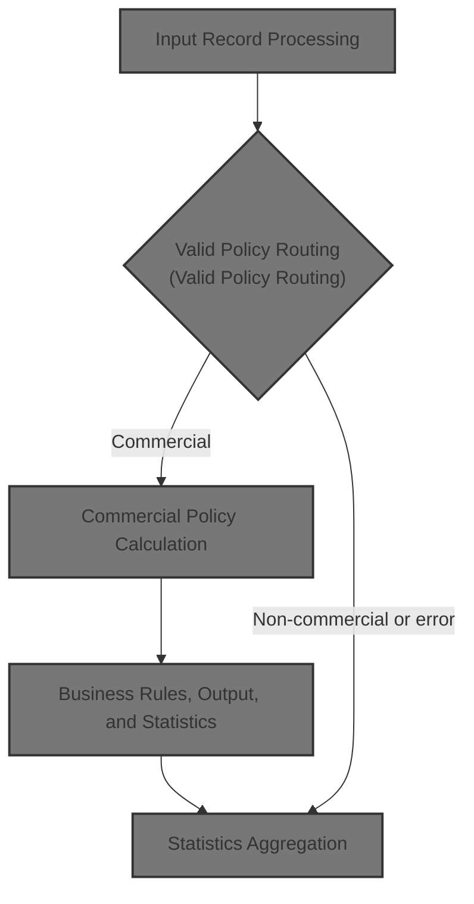
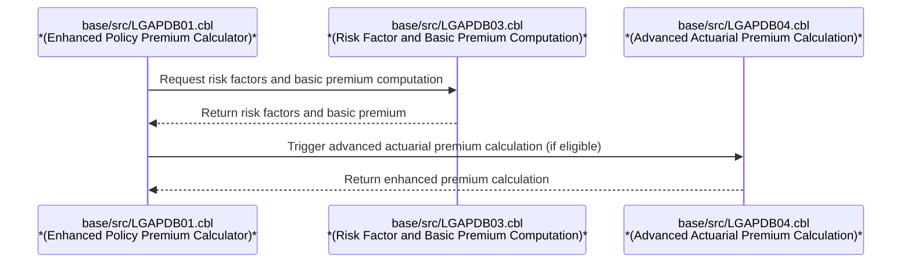
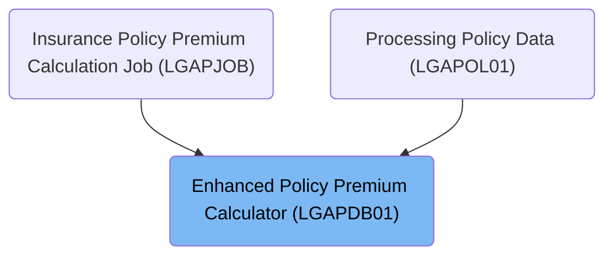

# Overview

This document describes the flow for calculating enhanced insurance policy premiums. Insurance policy records are validated and routed for commercial or non-commercial processing. Commercial policies undergo risk assessment and premium calculation, with advanced actuarial logic applied when eligible. The flow aggregates statistics and writes output records for both valid and error cases.

# Technical Overview

## Dependencies

### Programs

- LGAPDB02
- LGAPDB03 (<SwmPath>[base/src/LGAPDB03.cbl](base/src/LGAPDB03.cbl)</SwmPath>)
- LGAPDB04 (<SwmPath>[base/src/LGAPDB04.cbl](base/src/LGAPDB04.cbl)</SwmPath>)

### Copybooks

- SQLCA
- INPUTREC2 (<SwmPath>[base/src/INPUTREC2.cpy](base/src/INPUTREC2.cpy)</SwmPath>)
- OUTPUTREC (<SwmPath>[base/src/OUTPUTREC.cpy](base/src/OUTPUTREC.cpy)</SwmPath>)
- WORKSTOR (<SwmPath>[base/src/WORKSTOR.cpy](base/src/WORKSTOR.cpy)</SwmPath>)
- LGAPACT (<SwmPath>[base/src/LGAPACT.cpy](base/src/LGAPACT.cpy)</SwmPath>)

# Where is this program used?

This program is used multiple times in the codebase as represented in the following diagram:

&nbsp;

*This is an auto-generated document by Swimm 🌊 and has not yet been verified by a human*

<SwmMeta version="3.0.0" repo-id="Z2l0aHViJTNBJTNBU3dpbW1pby1nZW5hcHAtbW90b3IlM0ElM0FHaXJpLVN3aW1t" repo-name="Swimmio-genapp-motor">Powered by [Swimm](https://app.swimm.io/)</SwmMeta>
