# Overview

This document describes the flow for processing insurance policy applications. Policy records are validated, premiums and risk scores are calculated for eligible commercial policies, approval status is determined, and summary statistics are produced for business reporting.

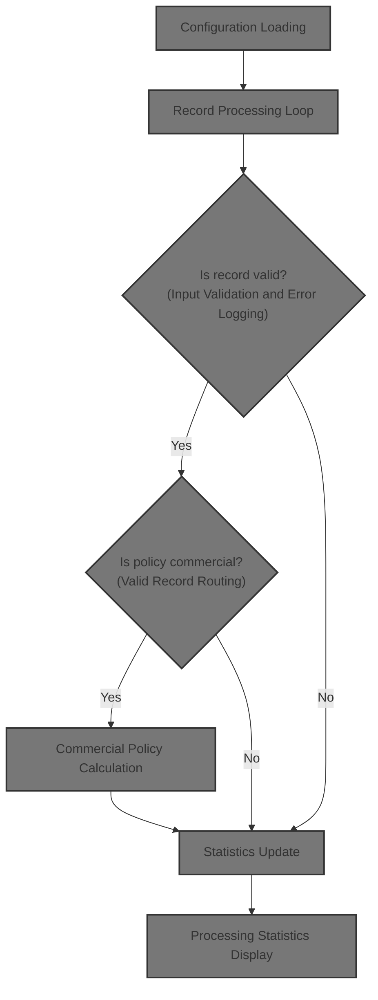

## Dependencies

### Programs

- <SwmToken path="base/src/LGAPDB01.cbl" pos="269:4:4" line-data="           CALL &#39;LGAPDB02&#39; USING IN-PROPERTY-TYPE, IN-POSTCODE, ">`LGAPDB02`</SwmToken>
- <SwmToken path="base/src/LGAPDB01.cbl" pos="276:4:4" line-data="           CALL &#39;LGAPDB03&#39; USING WS-BASE-RISK-SCR, IN-FIRE-PERIL, ">`LGAPDB03`</SwmToken> (<SwmPath>[base/src/LGAPDB03.cbl](base/src/LGAPDB03.cbl)</SwmPath>)
- <SwmToken path="base/src/LGAPDB01.cbl" pos="313:4:4" line-data="               CALL &#39;LGAPDB04&#39; USING LK-INPUT-DATA, LK-COVERAGE-DATA, ">`LGAPDB04`</SwmToken> (<SwmPath>[base/src/LGAPDB04.cbl](base/src/LGAPDB04.cbl)</SwmPath>)

### Copybooks

- SQLCA
- <SwmToken path="base/src/LGAPDB01.cbl" pos="35:3:3" line-data="           COPY INPUTREC2.">`INPUTREC2`</SwmToken> (<SwmPath>[base/src/INPUTREC2.cpy](base/src/INPUTREC2.cpy)</SwmPath>)
- OUTPUTREC (<SwmPath>[base/src/OUTPUTREC.cpy](base/src/OUTPUTREC.cpy)</SwmPath>)
- WORKSTOR (<SwmPath>[base/src/WORKSTOR.cpy](base/src/WORKSTOR.cpy)</SwmPath>)
- LGAPACT (<SwmPath>[base/src/LGAPACT.cpy](base/src/LGAPACT.cpy)</SwmPath>)

# Where is this program used?

This program is used multiple times in the codebase as represented in the following diagram:

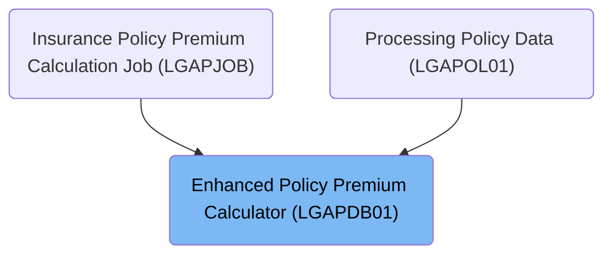

## Input and Output Tables/Files used in the Program

| Table / File Name                                                                                                                             | Type | Description                                   | Usage Mode | Key Fields / Layout Highlights           |
| --------------------------------------------------------------------------------------------------------------------------------------------- | ---- | --------------------------------------------- | ---------- | ---------------------------------------- |
| <SwmToken path="base/src/LGAPDB01.cbl" pos="113:5:7" line-data="           OPEN INPUT CONFIG-FILE">`CONFIG-FILE`</SwmToken>                   | DB2  | System config parameters and thresholds       | Input      | Database table with relational structure |
| <SwmToken path="base/src/LGAPDB01.cbl" pos="395:3:5" line-data="           CLOSE INPUT-FILE">`INPUT-FILE`</SwmToken>                          | DB2  | Insurance policy application input data       | Input      | Database table with relational structure |
| <SwmToken path="base/src/LGAPDB01.cbl" pos="396:3:5" line-data="           CLOSE OUTPUT-FILE">`OUTPUT-FILE`</SwmToken>                        | DB2  | Calculated premium results per policy         | Output     | Database table with relational structure |
| <SwmToken path="base/src/LGAPDB01.cbl" pos="255:3:5" line-data="           WRITE OUTPUT-RECORD">`OUTPUT-RECORD`</SwmToken>                    | DB2  | Premium breakdown and underwriting decision   | Output     | Database table with relational structure |
| <SwmToken path="base/src/LGAPDB01.cbl" pos="398:3:5" line-data="               CLOSE SUMMARY-FILE">`SUMMARY-FILE`</SwmToken>                  | DB2  | Summary of batch processing statistics        | Output     | Database table with relational structure |
| <SwmToken path="base/src/LGAPDB01.cbl" pos="64:3:5" line-data="       01  SUMMARY-RECORD             PIC X(132).">`SUMMARY-RECORD`</SwmToken> | DB2  | Batch summary line (counts, totals, averages) | Output     | Database table with relational structure |

&nbsp;

## Detailed View of the Program's Functionality

# a. Startup and Preparation

When the program starts, it immediately performs a series of setup steps to prepare for processing insurance policy records:

1. **Initialization**: All working storage areas, counters, and data structures are reset to their initial states. This includes counters for processed records, error tracking, risk analysis, actuarial data, premium breakdowns, and decision data. The program also displays startup messages and captures the current processing date in a standard format.

2. **Configuration Loading**: The program attempts to open and read a configuration file. If the file is not available, it displays a warning and loads default configuration values. If the file is present, it reads specific configuration parameters (such as maximum risk score and minimum premium) and updates the internal settings accordingly.

3. **File Opening**: The program opens all necessary files for input, output, configuration, rates, and summary. It checks for errors when opening each file and stops execution if any critical file cannot be opened (except for the summary file, which is optional).

4. **Header Writing**: Before processing records, the program writes a header row to the output file, labeling each column for clarity.

# b. Configuration Loading

The configuration loading process involves:

- Attempting to open the configuration file.
- If the file is not available, displaying a warning and loading default values.
- If the file is available, reading specific configuration keys:
  - The program looks for a maximum risk score value. If found and valid, it updates the internal threshold.
  - It then looks for a minimum premium value. If found and valid, it updates the internal minimum premium.
- After reading the necessary values, the configuration file is closed.

# c. Config Value Extraction

For each configuration value needed:

- The program sets the key for the desired configuration parameter (e.g., maximum risk score).
- It reads the value from the configuration file.
- If the value is present and numeric, it converts and stores it in the appropriate internal variable.
- This process is repeated for each required configuration parameter (e.g., minimum premium).

# d. Record Processing Loop

The core of the program is a loop that processes each input record one by one:

1. **Reading Records**: The program reads the first input record to start the loop.

2. **Processing Each Record**:

   - The record count is incremented.
   - The record is validated for required fields and data correctness.
   - If the record passes validation (no errors found), it is routed for further processing.
   - If the record fails validation, it is handled as an error record.
   - After processing, the program reads the next input record and repeats the loop until all records are processed.

# e. Input Validation and Error Logging

For each input record, the program performs several validation checks:

- **Policy Type Check**: Ensures the policy type is one of the supported types (commercial, personal, or farm). If not, an error is logged.
- **Customer Number Check**: Ensures a customer number is provided. If missing, an error is logged.
- **Coverage Limit Check**: Ensures at least one coverage limit is specified. If both are zero, an error is logged.
- **Total Coverage Check**: Ensures the total coverage does not exceed the maximum allowed value. If it does, a warning is logged (but the record is not rejected for this alone).

Errors are logged by incrementing an error count and storing details about each error (code, severity, field, and message) in parallel arrays, allowing multiple errors per record.

# f. Valid Record Routing

After validation:

- If the policy is a commercial policy, it is sent for full commercial processing, and the processed count is incremented.
- If the policy is not commercial, it is handled as an unsupported type, and the error count is incremented.

# g. Commercial Policy Calculation

For valid commercial policies, the program performs several steps:

1. **Risk Score Calculation**: Calls an external module to calculate the base risk score using property and customer data.

2. **Basic Premium Calculation**: Calls another external module to calculate the basic premium and related values based on the risk score and peril information.

3. **Enhanced Actuarial Calculation**: If the policy is initially approved, the program prepares detailed input data and calls an advanced actuarial calculation module. If the enhanced premium is higher than the basic premium, it updates the premium fields with the enhanced values.

4. **Business Rules Application**: The program evaluates the results against business rules:

   - If the risk score exceeds the maximum, the policy is rejected.
   - If the premium is below the minimum, the policy is marked as pending for review.
   - If the risk score is high but not over the maximum, the policy is marked as pending for underwriter review.
   - Otherwise, the policy is approved.

5. **Output Record Writing**: The program writes the processed results to the output file, including all calculated values and decision status.

6. **Statistics Update**: The program updates overall statistics, including total premium, risk score totals, and counts for approved, pending, rejected, and high-risk policies.

# h. Error Record Output

For records that fail validation:

- Key input fields are copied to the output.
- All premium and risk fields are set to zero.
- The status is set to indicate an error.
- The rejection reason is set based on the first error message.
- The error record is written to the output file.
- The error count is incremented.

# i. File Closure

After all records are processed:

- The input and output files are closed.
- The summary file is only closed if it was successfully opened and is in a valid state, to prevent data loss or corruption.

# j. Processing Statistics Display

At the end of processing, the program displays a summary of the results:

- Total records read
- Records processed
- Records approved, pending, and rejected
- Error records
- High-risk count
- Total premium generated

If any records were processed, the average risk score is also displayed.

# k. Summary File Generation

If the summary file was successfully opened, the program writes a summary report including:

- A title and processing date
- Total records processed
- Counts of approved, pending, and rejected policies
- Total premium amount
- Average risk score (if applicable)

This summary provides a concise overview of the processing run for reporting or auditing purposes.

# Data Definitions

| Table / Record Name                                                                                                                           | Type | Short Description                             | Usage Mode |
| --------------------------------------------------------------------------------------------------------------------------------------------- | ---- | --------------------------------------------- | ---------- |
| <SwmToken path="base/src/LGAPDB01.cbl" pos="113:5:7" line-data="           OPEN INPUT CONFIG-FILE">`CONFIG-FILE`</SwmToken>                   | DB2  | System config parameters and thresholds       | Input      |
| <SwmToken path="base/src/LGAPDB01.cbl" pos="395:3:5" line-data="           CLOSE INPUT-FILE">`INPUT-FILE`</SwmToken>                          | DB2  | Insurance policy application input data       | Input      |
| <SwmToken path="base/src/LGAPDB01.cbl" pos="396:3:5" line-data="           CLOSE OUTPUT-FILE">`OUTPUT-FILE`</SwmToken>                        | DB2  | Calculated premium results per policy         | Output     |
| <SwmToken path="base/src/LGAPDB01.cbl" pos="255:3:5" line-data="           WRITE OUTPUT-RECORD">`OUTPUT-RECORD`</SwmToken>                    | DB2  | Premium breakdown and underwriting decision   | Output     |
| <SwmToken path="base/src/LGAPDB01.cbl" pos="398:3:5" line-data="               CLOSE SUMMARY-FILE">`SUMMARY-FILE`</SwmToken>                  | DB2  | Summary of batch processing statistics        | Output     |
| <SwmToken path="base/src/LGAPDB01.cbl" pos="64:3:5" line-data="       01  SUMMARY-RECORD             PIC X(132).">`SUMMARY-RECORD`</SwmToken> | DB2  | Batch summary line (counts, totals, averages) | Output     |

&nbsp;

# Rule Definition

| Paragraph Name                                                                                                                                                                                                                                                                                                                                                                                                                                                                                                                                                                                                                                                                                                                                                                             | Rule ID | Category          | Description                                                                                                                                                                                                                                                                                             | Conditions                                                                                                                                                                                                    | Remarks                                                                                                                                                                                                                                                                                                                                                                                                                                                                                                                                                                                                                                                                                                                                                                                                                                                                                                |
| ------------------------------------------------------------------------------------------------------------------------------------------------------------------------------------------------------------------------------------------------------------------------------------------------------------------------------------------------------------------------------------------------------------------------------------------------------------------------------------------------------------------------------------------------------------------------------------------------------------------------------------------------------------------------------------------------------------------------------------------------------------------------------------------ | ------- | ----------------- | ------------------------------------------------------------------------------------------------------------------------------------------------------------------------------------------------------------------------------------------------------------------------------------------------------- | ------------------------------------------------------------------------------------------------------------------------------------------------------------------------------------------------------------- | ------------------------------------------------------------------------------------------------------------------------------------------------------------------------------------------------------------------------------------------------------------------------------------------------------------------------------------------------------------------------------------------------------------------------------------------------------------------------------------------------------------------------------------------------------------------------------------------------------------------------------------------------------------------------------------------------------------------------------------------------------------------------------------------------------------------------------------------------------------------------------------------------------ |
| <SwmToken path="base/src/LGAPDB01.cbl" pos="91:3:5" line-data="           PERFORM P002-INITIALIZE">`P002-INITIALIZE`</SwmToken>                                                                                                                                                                                                                                                                                                                                                                                                                                                                                                                                                                                                                                                            | RL-001  | Data Assignment   | All processing counters and working storage areas must be initialized before any record processing begins.                                                                                                                                                                                              | Program startup, before any input records are read.                                                                                                                                                           | Counters and working storage are set to zero or cleared. No specific format requirements.                                                                                                                                                                                                                                                                                                                                                                                                                                                                                                                                                                                                                                                                                                                                                                                                              |
| <SwmToken path="base/src/LGAPDB01.cbl" pos="91:3:5" line-data="           PERFORM P002-INITIALIZE">`P002-INITIALIZE`</SwmToken>                                                                                                                                                                                                                                                                                                                                                                                                                                                                                                                                                                                                                                                            | RL-002  | Data Assignment   | The processing date must be set in YYYYMMDD format at program startup.                                                                                                                                                                                                                                  | Program startup.                                                                                                                                                                                              | Date is stored as an 8-digit number (YYYYMMDD).                                                                                                                                                                                                                                                                                                                                                                                                                                                                                                                                                                                                                                                                                                                                                                                                                                                        |
| <SwmToken path="base/src/LGAPDB01.cbl" pos="92:3:7" line-data="           PERFORM P003-LOAD-CONFIG">`P003-LOAD-CONFIG`</SwmToken>, <SwmToken path="base/src/LGAPDB01.cbl" pos="116:3:7" line-data="               PERFORM P004-SET-DEFAULTS">`P004-SET-DEFAULTS`</SwmToken>, <SwmToken path="base/src/LGAPDB01.cbl" pos="118:3:9" line-data="               PERFORM P004-READ-CONFIG-VALUES">`P004-READ-CONFIG-VALUES`</SwmToken>                                                                                                                                                                                                                                                                                                                                                          | RL-003  | Conditional Logic | Attempt to load configuration parameters from <SwmToken path="base/src/LGAPDB01.cbl" pos="17:12:14" line-data="           SELECT CONFIG-FILE ASSIGN TO &#39;CONFIG.DAT&#39;">`CONFIG.DAT`</SwmToken>. If unavailable, use default values.                                                               | At program startup, after initialization.                                                                                                                                                                     | Parameters include <SwmToken path="base/src/LGAPDB01.cbl" pos="126:4:4" line-data="           MOVE &#39;MAX_RISK_SCORE&#39; TO CONFIG-KEY">`MAX_RISK_SCORE`</SwmToken> (default 250), <SwmToken path="base/src/LGAPDB01.cbl" pos="132:4:4" line-data="           MOVE &#39;MIN_PREMIUM&#39; TO CONFIG-KEY">`MIN_PREMIUM`</SwmToken> (default <SwmToken path="base/src/LGAPDB01.cbl" pos="84:19:21" line-data="           05 WS-MIN-PREMIUM           PIC 9(6)V99 VALUE 500.00.">`500.00`</SwmToken>).                                                                                                                                                                                                                                                                                                                                                                                                  |
| <SwmToken path="base/src/LGAPDB01.cbl" pos="182:3:9" line-data="               PERFORM P008-VALIDATE-INPUT-RECORD">`P008-VALIDATE-INPUT-RECORD`</SwmToken>                                                                                                                                                                                                                                                                                                                                                                                                                                                                                                                                                                                                                                 | RL-004  | Conditional Logic | Each input record must have a valid policy type, a present customer number, and at least one non-zero coverage limit. If total coverage exceeds 50,000,000, log a warning but continue.                                                                                                                 | For each input record read.                                                                                                                                                                                   | Policy type must be COMMERCIAL, PERSONAL, or FARM. Customer number must not be blank. At least one of building, contents, or BI coverage must be non-zero. Total coverage limit is 50,000,000.                                                                                                                                                                                                                                                                                                                                                                                                                                                                                                                                                                                                                                                                                                         |
| <SwmToken path="base/src/LGAPDB01.cbl" pos="236:3:7" line-data="               PERFORM P011-PROCESS-COMMERCIAL">`P011-PROCESS-COMMERCIAL`</SwmToken>, <SwmToken path="base/src/LGAPDB01.cbl" pos="259:3:9" line-data="           PERFORM P011A-CALCULATE-RISK-SCORE">`P011A-CALCULATE-RISK-SCORE`</SwmToken>, <SwmToken path="base/src/LGAPDB01.cbl" pos="260:3:9" line-data="           PERFORM P011B-BASIC-PREMIUM-CALC">`P011B-BASIC-PREMIUM-CALC`</SwmToken>, <SwmToken path="base/src/LGAPDB01.cbl" pos="262:3:9" line-data="               PERFORM P011C-ENHANCED-ACTUARIAL-CALC">`P011C-ENHANCED-ACTUARIAL-CALC`</SwmToken>, <SwmToken path="base/src/LGAPDB01.cbl" pos="264:3:9" line-data="           PERFORM P011D-APPLY-BUSINESS-RULES">`P011D-APPLY-BUSINESS-RULES`</SwmToken> | RL-005  | Computation       | For commercial policies, calculate risk score and premiums using specified formulas, clamp risk score to <SwmToken path="base/src/LGAPDB01.cbl" pos="126:4:4" line-data="           MOVE &#39;MAX_RISK_SCORE&#39; TO CONFIG-KEY">`MAX_RISK_SCORE`</SwmToken>, and determine status based on thresholds. | Input record is valid and policy type is COMMERCIAL.                                                                                                                                                          | Risk score formula: 100 + (building + contents limit)/1,000,000 + (10 if flood coverage) + (10 if weather coverage) + (customer history \* 5). Clamp to <SwmToken path="base/src/LGAPDB01.cbl" pos="126:4:4" line-data="           MOVE &#39;MAX_RISK_SCORE&#39; TO CONFIG-KEY">`MAX_RISK_SCORE`</SwmToken>. Premiums: fire = risk_score \* 2 if fire peril, crime = risk_score \* 1.5 if crime peril, flood = risk_score \* 2.5 if flood peril, weather = risk_score \* 1.2 if weather peril. Status: REJECTED if risk_score > <SwmToken path="base/src/LGAPDB01.cbl" pos="126:4:4" line-data="           MOVE &#39;MAX_RISK_SCORE&#39; TO CONFIG-KEY">`MAX_RISK_SCORE`</SwmToken>, PENDING if total_premium < <SwmToken path="base/src/LGAPDB01.cbl" pos="132:4:4" line-data="           MOVE &#39;MIN_PREMIUM&#39; TO CONFIG-KEY">`MIN_PREMIUM`</SwmToken> or risk_score > 180, APPROVED otherwise. |
| <SwmToken path="base/src/LGAPDB01.cbl" pos="262:3:9" line-data="               PERFORM P011C-ENHANCED-ACTUARIAL-CALC">`P011C-ENHANCED-ACTUARIAL-CALC`</SwmToken>                                                                                                                                                                                                                                                                                                                                                                                                                                                                                                                                                                                                                           | RL-006  | Computation       | If status is APPROVED and total_premium >= <SwmToken path="base/src/LGAPDB01.cbl" pos="132:4:4" line-data="           MOVE &#39;MIN_PREMIUM&#39; TO CONFIG-KEY">`MIN_PREMIUM`</SwmToken>, perform enhanced actuarial calculation. Use enhanced premiums if they exceed the basic calculation.           | Policy is commercial, status is APPROVED, and total_premium >= <SwmToken path="base/src/LGAPDB01.cbl" pos="132:4:4" line-data="           MOVE &#39;MIN_PREMIUM&#39; TO CONFIG-KEY">`MIN_PREMIUM`</SwmToken>. | Experience mod = 1.0 + (claims count 3yr \* 0.01). Enhanced premiums = peril premium \* experience mod. Use enhanced values if enhanced total premium > basic total premium.                                                                                                                                                                                                                                                                                                                                                                                                                                                                                                                                                                                                                                                                                                                           |
| <SwmToken path="base/src/LGAPDB01.cbl" pos="239:3:9" line-data="               PERFORM P012-PROCESS-NON-COMMERCIAL">`P012-PROCESS-NON-COMMERCIAL`</SwmToken>                                                                                                                                                                                                                                                                                                                                                                                                                                                                                                                                                                                                                               | RL-007  | Conditional Logic | For non-commercial policies, reject the record and set status to UNSUPPORTED.                                                                                                                                                                                                                           | Input record is valid and policy type is not COMMERCIAL.                                                                                                                                                      | All premium fields set to zero. Status set to 'UNSUPPORTED'. Reject reason: 'Only Commercial policies supported in this version'.                                                                                                                                                                                                                                                                                                                                                                                                                                                                                                                                                                                                                                                                                                                                                                      |
| <SwmToken path="base/src/LGAPDB01.cbl" pos="186:3:9" line-data="                   PERFORM P010-PROCESS-ERROR-RECORD">`P010-PROCESS-ERROR-RECORD`</SwmToken>                                                                                                                                                                                                                                                                                                                                                                                                                                                                                                                                                                                                                               | RL-008  | Data Assignment   | For invalid records, write an error record with all premium fields set to zero, status set to ERROR, and the first character of the error message as the reject reason.                                                                                                                                 | Input record fails validation.                                                                                                                                                                                | All premium fields are zero. Status is 'ERROR'. Reject reason is first character of error message.                                                                                                                                                                                                                                                                                                                                                                                                                                                                                                                                                                                                                                                                                                                                                                                                     |
| <SwmToken path="base/src/LGAPDB01.cbl" pos="365:1:5" line-data="       P011F-UPDATE-STATISTICS.">`P011F-UPDATE-STATISTICS`</SwmToken>                                                                                                                                                                                                                                                                                                                                                                                                                                                                                                                                                                                                                                                      | RL-009  | Computation       | After processing each record, update statistics including premium totals, risk score totals, and counters for approved, pending, rejected, errors, and high-risk.                                                                                                                                       | After each record is processed.                                                                                                                                                                               | Counters and totals are numeric. High-risk is defined as risk score > 200.                                                                                                                                                                                                                                                                                                                                                                                                                                                                                                                                                                                                                                                                                                                                                                                                                             |
| <SwmToken path="base/src/LGAPDB01.cbl" pos="96:3:7" line-data="           PERFORM P015-GENERATE-SUMMARY">`P015-GENERATE-SUMMARY`</SwmToken>, <SwmToken path="base/src/LGAPDB01.cbl" pos="97:3:7" line-data="           PERFORM P016-DISPLAY-STATS">`P016-DISPLAY-STATS`</SwmToken>                                                                                                                                                                                                                                                                                                                                                                                                                                                                                                         | RL-010  | Computation       | At the end of processing, generate a summary and display statistics including records read, processed, approved, pending, rejected, errors, high risk, total premium, and average risk score.                                                                                                           | After all records have been processed.                                                                                                                                                                        | Summary includes counts and totals. Average risk score is calculated if any records processed.                                                                                                                                                                                                                                                                                                                                                                                                                                                                                                                                                                                                                                                                                                                                                                                                         |

# User Stories

## User Story 1: Program Initialization and Configuration Loading

---

### Story Description:

As a system, I want to initialize all counters and working storage, set the processing date, and load configuration parameters (using defaults if unavailable) so that the program is ready for record processing with correct operational parameters.

---

### Business Rule Mapping:

| Rule ID | Paragraph Name                                                                                                                                                                                                                                                                                                                                                                                                                    | Rule Description                                                                                                                                                                                                                          |
| ------- | --------------------------------------------------------------------------------------------------------------------------------------------------------------------------------------------------------------------------------------------------------------------------------------------------------------------------------------------------------------------------------------------------------------------------------- | ----------------------------------------------------------------------------------------------------------------------------------------------------------------------------------------------------------------------------------------- |
| RL-001  | <SwmToken path="base/src/LGAPDB01.cbl" pos="91:3:5" line-data="           PERFORM P002-INITIALIZE">`P002-INITIALIZE`</SwmToken>                                                                                                                                                                                                                                                                                                   | All processing counters and working storage areas must be initialized before any record processing begins.                                                                                                                                |
| RL-002  | <SwmToken path="base/src/LGAPDB01.cbl" pos="91:3:5" line-data="           PERFORM P002-INITIALIZE">`P002-INITIALIZE`</SwmToken>                                                                                                                                                                                                                                                                                                   | The processing date must be set in YYYYMMDD format at program startup.                                                                                                                                                                    |
| RL-003  | <SwmToken path="base/src/LGAPDB01.cbl" pos="92:3:7" line-data="           PERFORM P003-LOAD-CONFIG">`P003-LOAD-CONFIG`</SwmToken>, <SwmToken path="base/src/LGAPDB01.cbl" pos="116:3:7" line-data="               PERFORM P004-SET-DEFAULTS">`P004-SET-DEFAULTS`</SwmToken>, <SwmToken path="base/src/LGAPDB01.cbl" pos="118:3:9" line-data="               PERFORM P004-READ-CONFIG-VALUES">`P004-READ-CONFIG-VALUES`</SwmToken> | Attempt to load configuration parameters from <SwmToken path="base/src/LGAPDB01.cbl" pos="17:12:14" line-data="           SELECT CONFIG-FILE ASSIGN TO &#39;CONFIG.DAT&#39;">`CONFIG.DAT`</SwmToken>. If unavailable, use default values. |

---

### Relevant Functionality:

- <SwmToken path="base/src/LGAPDB01.cbl" pos="91:3:5" line-data="           PERFORM P002-INITIALIZE">`P002-INITIALIZE`</SwmToken>
  1. **RL-001:**
     - At program start:
       - Set all counters (e.g., approved, pending, error, premium totals) to zero.
       - Clear or initialize all working storage areas used for calculations and output.
  2. **RL-002:**
     - At program start:
       - Retrieve current system date in YYYYMMDD format.
       - Store in processing date field.
- <SwmToken path="base/src/LGAPDB01.cbl" pos="92:3:7" line-data="           PERFORM P003-LOAD-CONFIG">`P003-LOAD-CONFIG`</SwmToken>
  1. **RL-003:**
     - Try to open <SwmToken path="base/src/LGAPDB01.cbl" pos="17:12:14" line-data="           SELECT CONFIG-FILE ASSIGN TO &#39;CONFIG.DAT&#39;">`CONFIG.DAT`</SwmToken> for input.
       - If file not available:
         - Set <SwmToken path="base/src/LGAPDB01.cbl" pos="126:4:4" line-data="           MOVE &#39;MAX_RISK_SCORE&#39; TO CONFIG-KEY">`MAX_RISK_SCORE`</SwmToken> to 250.
         - Set <SwmToken path="base/src/LGAPDB01.cbl" pos="132:4:4" line-data="           MOVE &#39;MIN_PREMIUM&#39; TO CONFIG-KEY">`MIN_PREMIUM`</SwmToken> to <SwmToken path="base/src/LGAPDB01.cbl" pos="84:19:21" line-data="           05 WS-MIN-PREMIUM           PIC 9(6)V99 VALUE 500.00.">`500.00`</SwmToken>.
       - Else:
         - Read <SwmToken path="base/src/LGAPDB01.cbl" pos="126:4:4" line-data="           MOVE &#39;MAX_RISK_SCORE&#39; TO CONFIG-KEY">`MAX_RISK_SCORE`</SwmToken> and <SwmToken path="base/src/LGAPDB01.cbl" pos="132:4:4" line-data="           MOVE &#39;MIN_PREMIUM&#39; TO CONFIG-KEY">`MIN_PREMIUM`</SwmToken> from file if present and numeric.

## User Story 2: Input Record Validation and Error Handling

---

### Story Description:

As a system, I want to validate each input record for required fields and coverage limits, reject non-commercial policies, and handle invalid records by writing error records so that only valid and supported records are processed and errors are tracked appropriately.

---

### Business Rule Mapping:

| Rule ID | Paragraph Name                                                                                                                                               | Rule Description                                                                                                                                                                        |
| ------- | ------------------------------------------------------------------------------------------------------------------------------------------------------------ | --------------------------------------------------------------------------------------------------------------------------------------------------------------------------------------- |
| RL-004  | <SwmToken path="base/src/LGAPDB01.cbl" pos="182:3:9" line-data="               PERFORM P008-VALIDATE-INPUT-RECORD">`P008-VALIDATE-INPUT-RECORD`</SwmToken>   | Each input record must have a valid policy type, a present customer number, and at least one non-zero coverage limit. If total coverage exceeds 50,000,000, log a warning but continue. |
| RL-008  | <SwmToken path="base/src/LGAPDB01.cbl" pos="186:3:9" line-data="                   PERFORM P010-PROCESS-ERROR-RECORD">`P010-PROCESS-ERROR-RECORD`</SwmToken> | For invalid records, write an error record with all premium fields set to zero, status set to ERROR, and the first character of the error message as the reject reason.                 |
| RL-007  | <SwmToken path="base/src/LGAPDB01.cbl" pos="239:3:9" line-data="               PERFORM P012-PROCESS-NON-COMMERCIAL">`P012-PROCESS-NON-COMMERCIAL`</SwmToken> | For non-commercial policies, reject the record and set status to UNSUPPORTED.                                                                                                           |

---

### Relevant Functionality:

- <SwmToken path="base/src/LGAPDB01.cbl" pos="182:3:9" line-data="               PERFORM P008-VALIDATE-INPUT-RECORD">`P008-VALIDATE-INPUT-RECORD`</SwmToken>
  1. **RL-004:**
     - For each input record:
       - If policy type is not COMMERCIAL, PERSONAL, or FARM, log error.
       - If customer number is blank, log error.
       - If all coverage limits are zero, log error.
       - If total coverage > 50,000,000, log warning but continue.
- <SwmToken path="base/src/LGAPDB01.cbl" pos="186:3:9" line-data="                   PERFORM P010-PROCESS-ERROR-RECORD">`P010-PROCESS-ERROR-RECORD`</SwmToken>
  1. **RL-008:**
     - If record is invalid:
       - Set all premium fields to zero.
       - Set status to ERROR.
       - Set reject reason to first character of error message.
       - Write output record.
- <SwmToken path="base/src/LGAPDB01.cbl" pos="239:3:9" line-data="               PERFORM P012-PROCESS-NON-COMMERCIAL">`P012-PROCESS-NON-COMMERCIAL`</SwmToken>
  1. **RL-007:**
     - If policy type is not COMMERCIAL:
       - Set all premium fields to zero.
       - Set status to UNSUPPORTED.
       - Set reject reason to specified message.
       - Write output record.

## User Story 3: Commercial Policy Processing and Premium Calculation

---

### Story Description:

As a commercial policyholder, I want my policy to be evaluated for risk score and premiums, with status determined according to business rules and enhanced actuarial calculations applied when eligible, so that I receive accurate premium and status information based on my policy details.

---

### Business Rule Mapping:

| Rule ID | Paragraph Name                                                                                                                                                                                                                                                                                                                                                                                                                                                                                                                                                                                                                                                                                                                                                                             | Rule Description                                                                                                                                                                                                                                                                                        |
| ------- | ------------------------------------------------------------------------------------------------------------------------------------------------------------------------------------------------------------------------------------------------------------------------------------------------------------------------------------------------------------------------------------------------------------------------------------------------------------------------------------------------------------------------------------------------------------------------------------------------------------------------------------------------------------------------------------------------------------------------------------------------------------------------------------------ | ------------------------------------------------------------------------------------------------------------------------------------------------------------------------------------------------------------------------------------------------------------------------------------------------------- |
| RL-005  | <SwmToken path="base/src/LGAPDB01.cbl" pos="236:3:7" line-data="               PERFORM P011-PROCESS-COMMERCIAL">`P011-PROCESS-COMMERCIAL`</SwmToken>, <SwmToken path="base/src/LGAPDB01.cbl" pos="259:3:9" line-data="           PERFORM P011A-CALCULATE-RISK-SCORE">`P011A-CALCULATE-RISK-SCORE`</SwmToken>, <SwmToken path="base/src/LGAPDB01.cbl" pos="260:3:9" line-data="           PERFORM P011B-BASIC-PREMIUM-CALC">`P011B-BASIC-PREMIUM-CALC`</SwmToken>, <SwmToken path="base/src/LGAPDB01.cbl" pos="262:3:9" line-data="               PERFORM P011C-ENHANCED-ACTUARIAL-CALC">`P011C-ENHANCED-ACTUARIAL-CALC`</SwmToken>, <SwmToken path="base/src/LGAPDB01.cbl" pos="264:3:9" line-data="           PERFORM P011D-APPLY-BUSINESS-RULES">`P011D-APPLY-BUSINESS-RULES`</SwmToken> | For commercial policies, calculate risk score and premiums using specified formulas, clamp risk score to <SwmToken path="base/src/LGAPDB01.cbl" pos="126:4:4" line-data="           MOVE &#39;MAX_RISK_SCORE&#39; TO CONFIG-KEY">`MAX_RISK_SCORE`</SwmToken>, and determine status based on thresholds. |
| RL-006  | <SwmToken path="base/src/LGAPDB01.cbl" pos="262:3:9" line-data="               PERFORM P011C-ENHANCED-ACTUARIAL-CALC">`P011C-ENHANCED-ACTUARIAL-CALC`</SwmToken>                                                                                                                                                                                                                                                                                                                                                                                                                                                                                                                                                                                                                           | If status is APPROVED and total_premium >= <SwmToken path="base/src/LGAPDB01.cbl" pos="132:4:4" line-data="           MOVE &#39;MIN_PREMIUM&#39; TO CONFIG-KEY">`MIN_PREMIUM`</SwmToken>, perform enhanced actuarial calculation. Use enhanced premiums if they exceed the basic calculation.           |

---

### Relevant Functionality:

- <SwmToken path="base/src/LGAPDB01.cbl" pos="236:3:7" line-data="               PERFORM P011-PROCESS-COMMERCIAL">`P011-PROCESS-COMMERCIAL`</SwmToken>
  1. **RL-005:**
     - If policy type is COMMERCIAL:
       - Calculate risk score using formula.
       - Clamp risk score to <SwmToken path="base/src/LGAPDB01.cbl" pos="126:4:4" line-data="           MOVE &#39;MAX_RISK_SCORE&#39; TO CONFIG-KEY">`MAX_RISK_SCORE`</SwmToken>.
       - Calculate premiums for each peril as specified.
       - Sum premiums for total.
       - If risk_score > <SwmToken path="base/src/LGAPDB01.cbl" pos="126:4:4" line-data="           MOVE &#39;MAX_RISK_SCORE&#39; TO CONFIG-KEY">`MAX_RISK_SCORE`</SwmToken>, set status to REJECTED.
       - If total_premium < <SwmToken path="base/src/LGAPDB01.cbl" pos="132:4:4" line-data="           MOVE &#39;MIN_PREMIUM&#39; TO CONFIG-KEY">`MIN_PREMIUM`</SwmToken>, set status to PENDING.
       - If risk_score > 180, set status to PENDING.
       - Otherwise, set status to APPROVED.
- <SwmToken path="base/src/LGAPDB01.cbl" pos="262:3:9" line-data="               PERFORM P011C-ENHANCED-ACTUARIAL-CALC">`P011C-ENHANCED-ACTUARIAL-CALC`</SwmToken>
  1. **RL-006:**
     - If status is APPROVED and total_premium >= <SwmToken path="base/src/LGAPDB01.cbl" pos="132:4:4" line-data="           MOVE &#39;MIN_PREMIUM&#39; TO CONFIG-KEY">`MIN_PREMIUM`</SwmToken>:
       - Calculate experience mod.
       - Multiply each peril premium by experience mod.
       - If enhanced total premium > basic total premium, use enhanced values for output.

## User Story 4: Statistics Updating and Summary Reporting

---

### Story Description:

As a system, I want to update processing statistics after each record and generate a summary report at the end of processing so that stakeholders can review performance metrics and outcomes for all processed records.

---

### Business Rule Mapping:

| Rule ID | Paragraph Name                                                                                                                                                                                                                                                                     | Rule Description                                                                                                                                                                              |
| ------- | ---------------------------------------------------------------------------------------------------------------------------------------------------------------------------------------------------------------------------------------------------------------------------------- | --------------------------------------------------------------------------------------------------------------------------------------------------------------------------------------------- |
| RL-009  | <SwmToken path="base/src/LGAPDB01.cbl" pos="365:1:5" line-data="       P011F-UPDATE-STATISTICS.">`P011F-UPDATE-STATISTICS`</SwmToken>                                                                                                                                              | After processing each record, update statistics including premium totals, risk score totals, and counters for approved, pending, rejected, errors, and high-risk.                             |
| RL-010  | <SwmToken path="base/src/LGAPDB01.cbl" pos="96:3:7" line-data="           PERFORM P015-GENERATE-SUMMARY">`P015-GENERATE-SUMMARY`</SwmToken>, <SwmToken path="base/src/LGAPDB01.cbl" pos="97:3:7" line-data="           PERFORM P016-DISPLAY-STATS">`P016-DISPLAY-STATS`</SwmToken> | At the end of processing, generate a summary and display statistics including records read, processed, approved, pending, rejected, errors, high risk, total premium, and average risk score. |

---

### Relevant Functionality:

- <SwmToken path="base/src/LGAPDB01.cbl" pos="365:1:5" line-data="       P011F-UPDATE-STATISTICS.">`P011F-UPDATE-STATISTICS`</SwmToken>
  1. **RL-009:**
     - After processing each record:
       - Add total premium to overall premium amount.
       - Add risk score to risk score totals.
       - Increment counters for approved, pending, rejected, errors, and high-risk (risk score > 200).
- <SwmToken path="base/src/LGAPDB01.cbl" pos="96:3:7" line-data="           PERFORM P015-GENERATE-SUMMARY">`P015-GENERATE-SUMMARY`</SwmToken>
  1. **RL-010:**
     - After all records processed:
       - Write summary with counts and totals to summary file.
       - Display statistics to console.

# Workflow

# Startup and Preparation

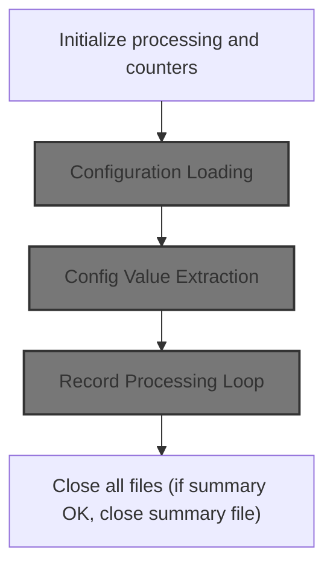

The Startup and Preparation section ensures the system is correctly initialized and configured before any insurance policy records are processed. It guarantees that all necessary data, counters, and configuration values are set, so subsequent business logic can operate reliably.

| Category        | Rule Name                      | Description                                                                                                                                                                                                                                                                                                                                                                                                  |
| --------------- | ------------------------------ | ------------------------------------------------------------------------------------------------------------------------------------------------------------------------------------------------------------------------------------------------------------------------------------------------------------------------------------------------------------------------------------------------------------ |
| Data validation | System Reset Before Processing | All relevant counters and working storage must be reset to zero or their initial state before any processing begins.                                                                                                                                                                                                                                                                                         |
| Data validation | Processing Date Capture        | The processing date must be captured in YYYYMMDD format and stored for use in all subsequent calculations and reporting.                                                                                                                                                                                                                                                                                     |
| Data validation | Record Processing Readiness    | The system must be prepared to process insurance policy records, ensuring all necessary data and configuration are in place before starting the record processing loop.                                                                                                                                                                                                                                      |
| Business logic  | Startup Information Display    | The system must display startup information, including the product name and version, to inform users of the current system state.                                                                                                                                                                                                                                                                            |
| Business logic  | Key Parameter Extraction       | Key configuration parameters, such as <SwmToken path="base/src/LGAPDB01.cbl" pos="126:4:4" line-data="           MOVE &#39;MAX_RISK_SCORE&#39; TO CONFIG-KEY">`MAX_RISK_SCORE`</SwmToken> and <SwmToken path="base/src/LGAPDB01.cbl" pos="132:4:4" line-data="           MOVE &#39;MIN_PREMIUM&#39; TO CONFIG-KEY">`MIN_PREMIUM`</SwmToken>, must be extracted and stored for use in actuarial calculations. |

<SwmSnippet path="/base/src/LGAPDB01.cbl" line="90">

---

<SwmToken path="base/src/LGAPDB01.cbl" pos="90:1:1" line-data="       P001.">`P001`</SwmToken> starts the flow, and calls <SwmToken path="base/src/LGAPDB01.cbl" pos="91:3:5" line-data="           PERFORM P002-INITIALIZE">`P002-INITIALIZE`</SwmToken> right away to reset all relevant working data and set the processing date before anything else happens.

```cobol
       P001.
           PERFORM P002-INITIALIZE
           PERFORM P003-LOAD-CONFIG
           PERFORM P005-OPEN-FILES
           PERFORM P006-PROCESS-RECORDS
           PERFORM P014-CLOSE-FILES
           PERFORM P015-GENERATE-SUMMARY
           PERFORM P016-DISPLAY-STATS
           STOP RUN.
```

---

</SwmSnippet>

<SwmSnippet path="/base/src/LGAPDB01.cbl" line="100">

---

<SwmToken path="base/src/LGAPDB01.cbl" pos="100:1:3" line-data="       P002-INITIALIZE.">`P002-INITIALIZE`</SwmToken> resets all relevant working storage, shows startup info, and grabs the processing date in YYYYMMDD format.

```cobol
       P002-INITIALIZE.
           DISPLAY 'Enhanced Policy Premium Calculator Starting...'
           DISPLAY 'Version 2.1 - With Actuarial Calculations'
           INITIALIZE WS-PROCESSING-COUNTERS
           INITIALIZE WS-ENHANCED-COUNTERS
           INITIALIZE WS-RISK-ANALYSIS
           INITIALIZE WS-ACTUARIAL-DATA
           INITIALIZE WS-PREMIUM-BREAKDOWN
           INITIALIZE WS-DECISION-DATA
           
           ACCEPT WS-PROCESSING-DATE FROM DATE YYYYMMDD.
```

---

</SwmSnippet>

## Configuration Loading

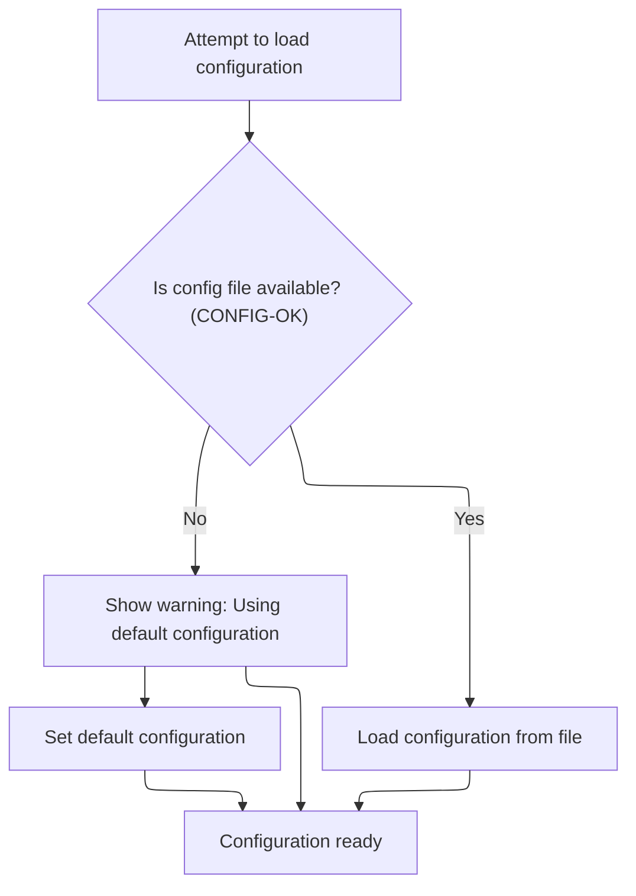

The main product role of this section is to ensure that the application has a valid configuration available for its operations, either by loading user-provided settings from a file or by falling back to a predefined default configuration.

| Category       | Rule Name                    | Description                                                                                                                             |
| -------------- | ---------------------------- | --------------------------------------------------------------------------------------------------------------------------------------- |
| Business logic | Fallback to defaults         | If the configuration file is not available, the system must use a predefined set of default configuration values to proceed.            |
| Business logic | Load configuration from file | If the configuration file is available, the system must load configuration values from the file and use them for subsequent operations. |

<SwmSnippet path="/base/src/LGAPDB01.cbl" line="112">

---

<SwmToken path="base/src/LGAPDB01.cbl" pos="112:1:5" line-data="       P003-LOAD-CONFIG.">`P003-LOAD-CONFIG`</SwmToken> opens the config file, checks if it's available, and either loads defaults or reads config values. We call <SwmToken path="base/src/LGAPDB01.cbl" pos="118:3:9" line-data="               PERFORM P004-READ-CONFIG-VALUES">`P004-READ-CONFIG-VALUES`</SwmToken> next if the file is present to actually pull in the needed parameters for calculations.

```cobol
       P003-LOAD-CONFIG.
           OPEN INPUT CONFIG-FILE
           IF NOT CONFIG-OK
               DISPLAY 'Warning: Config file not available - using defaults'
               PERFORM P004-SET-DEFAULTS
           ELSE
               PERFORM P004-READ-CONFIG-VALUES
               CLOSE CONFIG-FILE
           END-IF.
```

---

</SwmSnippet>

## Config Value Extraction

```mermaid
%%{init: {"flowchart": {"defaultRenderer": "elk"}} }%%
flowchart TD
    node1["Read MAX_RISK_SCORE from config file"]
    click node1 openCode "base/src/LGAPDB01.cbl:126:128"
    node1 --> node2{"Is value valid and numeric?"}
    click node2 openCode "base/src/LGAPDB01.cbl:128:130"
    node2 -->|"Yes"| node3["Update maximum risk score threshold"]
    click node3 openCode "base/src/LGAPDB01.cbl:129:130"
    node2 -->|"No"| node5["Read MIN_PREMIUM from config file"]
    node3 --> node5
    click node5 openCode "base/src/LGAPDB01.cbl:132:134"
    node5 --> node6{"Is value valid and numeric?"}
    click node6 openCode "base/src/LGAPDB01.cbl:134:136"
    node6 -->|"Yes"| node7["Update minimum premium threshold"]
    click node7 openCode "base/src/LGAPDB01.cbl:135:136"
    node6 -->|"No"| node8["End"]
    click node8 openCode "base/src/LGAPDB01.cbl:136:136"

classDef HeadingStyle fill:#777777,stroke:#333,stroke-width:2px;

%% Swimm:
%% %%{init: {"flowchart": {"defaultRenderer": "elk"}} }%%
%% flowchart TD
%%     node1["Read <SwmToken path="base/src/LGAPDB01.cbl" pos="126:4:4" line-data="           MOVE &#39;MAX_RISK_SCORE&#39; TO CONFIG-KEY">`MAX_RISK_SCORE`</SwmToken> from config file"]
%%     click node1 openCode "<SwmPath>[base/src/LGAPDB01.cbl](base/src/LGAPDB01.cbl)</SwmPath>:126:128"
%%     node1 --> node2{"Is value valid and numeric?"}
%%     click node2 openCode "<SwmPath>[base/src/LGAPDB01.cbl](base/src/LGAPDB01.cbl)</SwmPath>:128:130"
%%     node2 -->|"Yes"| node3["Update maximum risk score threshold"]
%%     click node3 openCode "<SwmPath>[base/src/LGAPDB01.cbl](base/src/LGAPDB01.cbl)</SwmPath>:129:130"
%%     node2 -->|"No"| node5["Read <SwmToken path="base/src/LGAPDB01.cbl" pos="132:4:4" line-data="           MOVE &#39;MIN_PREMIUM&#39; TO CONFIG-KEY">`MIN_PREMIUM`</SwmToken> from config file"]
%%     node3 --> node5
%%     click node5 openCode "<SwmPath>[base/src/LGAPDB01.cbl](base/src/LGAPDB01.cbl)</SwmPath>:132:134"
%%     node5 --> node6{"Is value valid and numeric?"}
%%     click node6 openCode "<SwmPath>[base/src/LGAPDB01.cbl](base/src/LGAPDB01.cbl)</SwmPath>:134:136"
%%     node6 -->|"Yes"| node7["Update minimum premium threshold"]
%%     click node7 openCode "<SwmPath>[base/src/LGAPDB01.cbl](base/src/LGAPDB01.cbl)</SwmPath>:135:136"
%%     node6 -->|"No"| node8["End"]
%%     click node8 openCode "<SwmPath>[base/src/LGAPDB01.cbl](base/src/LGAPDB01.cbl)</SwmPath>:136:136"
%% 
%% classDef HeadingStyle fill:#777777,stroke:#333,stroke-width:2px;
```

This section ensures that configurable thresholds for risk score and premium are set according to values provided in the config file, but only if those values are valid and numeric. This allows business users to adjust system behavior without code changes, while maintaining safe defaults if configuration is missing or incorrect.

| Category        | Rule Name                       | Description                                                                                                                                                                                                                                                                                                                                                                                                                                                          |
| --------------- | ------------------------------- | -------------------------------------------------------------------------------------------------------------------------------------------------------------------------------------------------------------------------------------------------------------------------------------------------------------------------------------------------------------------------------------------------------------------------------------------------------------------- |
| Data validation | Numeric Config Validation       | Only configuration values with <SwmToken path="base/src/LGAPDB01.cbl" pos="44:3:5" line-data="           05 CONFIG-TYPE              PIC X(1).">`CONFIG-TYPE`</SwmToken> set to 'N' (numeric) are considered valid for updating thresholds. Values with other types are ignored and defaults are used.                                                                                                                                                               |
| Business logic  | Max Risk Score Threshold Update | If the value for <SwmToken path="base/src/LGAPDB01.cbl" pos="126:4:4" line-data="           MOVE &#39;MAX_RISK_SCORE&#39; TO CONFIG-KEY">`MAX_RISK_SCORE`</SwmToken> in the config file is present, valid, and numeric, update the maximum risk score threshold to this value. Otherwise, retain the default value of 250.                                                                                                                                           |
| Business logic  | Min Premium Threshold Update    | If the value for <SwmToken path="base/src/LGAPDB01.cbl" pos="132:4:4" line-data="           MOVE &#39;MIN_PREMIUM&#39; TO CONFIG-KEY">`MIN_PREMIUM`</SwmToken> in the config file is present, valid, and numeric, update the minimum premium threshold to this value. Otherwise, retain the default value of <SwmToken path="base/src/LGAPDB01.cbl" pos="84:19:21" line-data="           05 WS-MIN-PREMIUM           PIC 9(6)V99 VALUE 500.00.">`500.00`</SwmToken>. |

<SwmSnippet path="/base/src/LGAPDB01.cbl" line="125">

---

In <SwmToken path="base/src/LGAPDB01.cbl" pos="125:1:7" line-data="       P004-READ-CONFIG-VALUES.">`P004-READ-CONFIG-VALUES`</SwmToken>, we set <SwmToken path="base/src/LGAPDB01.cbl" pos="126:9:11" line-data="           MOVE &#39;MAX_RISK_SCORE&#39; TO CONFIG-KEY">`CONFIG-KEY`</SwmToken> to <SwmToken path="base/src/LGAPDB01.cbl" pos="126:4:4" line-data="           MOVE &#39;MAX_RISK_SCORE&#39; TO CONFIG-KEY">`MAX_RISK_SCORE`</SwmToken>, read the config file, and if the value is numeric and the read is successful, we convert and store it. This pattern is repeated for <SwmToken path="base/src/LGAPDB01.cbl" pos="132:4:4" line-data="           MOVE &#39;MIN_PREMIUM&#39; TO CONFIG-KEY">`MIN_PREMIUM`</SwmToken>.

```cobol
       P004-READ-CONFIG-VALUES.
           MOVE 'MAX_RISK_SCORE' TO CONFIG-KEY
           READ CONFIG-FILE
           IF CONFIG-OK AND NUMERIC-CONFIG
               MOVE FUNCTION NUMVAL(CONFIG-VALUE) TO WS-MAX-RISK-SCORE
           END-IF
```

---

</SwmSnippet>

<SwmSnippet path="/base/src/LGAPDB01.cbl" line="132">

---

After reading <SwmToken path="base/src/LGAPDB01.cbl" pos="132:4:4" line-data="           MOVE &#39;MIN_PREMIUM&#39; TO CONFIG-KEY">`MIN_PREMIUM`</SwmToken>, if it's numeric and the read is successful, we convert and store it in <SwmToken path="base/src/LGAPDB01.cbl" pos="135:14:18" line-data="               MOVE FUNCTION NUMVAL(CONFIG-VALUE) TO WS-MIN-PREMIUM">`WS-MIN-PREMIUM`</SwmToken>. Otherwise, we leave the default value in place.

```cobol
           MOVE 'MIN_PREMIUM' TO CONFIG-KEY
           READ CONFIG-FILE
           IF CONFIG-OK AND NUMERIC-CONFIG
               MOVE FUNCTION NUMVAL(CONFIG-VALUE) TO WS-MIN-PREMIUM
           END-IF.
```

---

</SwmSnippet>

## Record Processing Loop

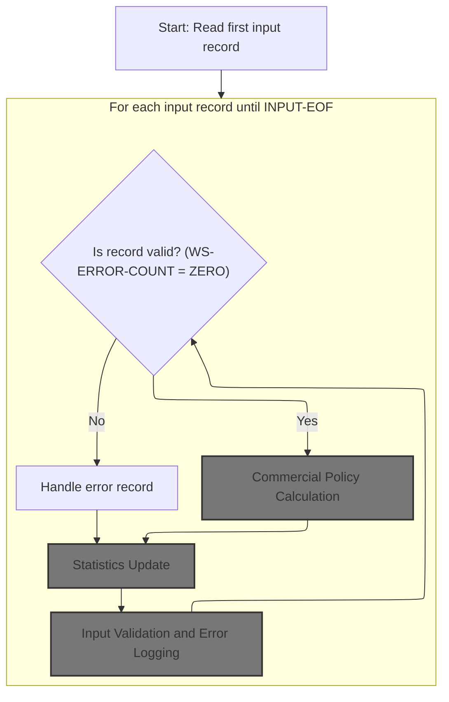

This section governs the main record processing loop for insurance policy applications, ensuring each record is validated, processed according to business rules, errors are logged, and statistics are updated for reporting and operational tracking.

| Category        | Rule Name                     | Description                                                                                                                                                                                                                                                   |
| --------------- | ----------------------------- | ------------------------------------------------------------------------------------------------------------------------------------------------------------------------------------------------------------------------------------------------------------- |
| Data validation | Mandatory Field Validation    | Each input record must be validated for mandatory fields and appropriate coverage values before any further processing. Records missing required data or containing invalid values are flagged as errors.                                                     |
| Business logic  | Valid Record Routing          | Only records with zero validation errors (<SwmToken path="base/src/LGAPDB01.cbl" pos="183:3:7" line-data="               IF WS-ERROR-COUNT = ZERO">`WS-ERROR-COUNT`</SwmToken> = ZERO) are eligible for commercial policy calculation and further processing. |
| Business logic  | Commercial Policy Calculation | For each valid commercial policy record, premiums and risk scores must be calculated using customer and property data, and the application result (approved, pending, rejected, high-risk) must be determined according to business rules.                    |
| Business logic  | Statistics Update             | After processing each record, business counters must be updated to reflect the number of processed, rejected, warning, and approved records, as well as aggregated premium amounts and risk scores.                                                           |
| Technical step  | End-of-File Processing        | The record processing loop must continue until the end-of-file condition is reached (<SwmToken path="base/src/LGAPDB01.cbl" pos="180:5:7" line-data="           PERFORM UNTIL INPUT-EOF">`INPUT-EOF`</SwmToken>), ensuring all input records are processed.   |

<SwmSnippet path="/base/src/LGAPDB01.cbl" line="178">

---

In <SwmToken path="base/src/LGAPDB01.cbl" pos="178:1:5" line-data="       P006-PROCESS-RECORDS.">`P006-PROCESS-RECORDS`</SwmToken>, we start by reading the first input record to kick off the loop that processes each policy application.

```cobol
       P006-PROCESS-RECORDS.
           PERFORM P007-READ-INPUT
```

---

</SwmSnippet>

<SwmSnippet path="/base/src/LGAPDB01.cbl" line="180">

---

After reading each record in <SwmToken path="base/src/LGAPDB01.cbl" pos="94:3:7" line-data="           PERFORM P006-PROCESS-RECORDS">`P006-PROCESS-RECORDS`</SwmToken>, we increment the record count and call <SwmToken path="base/src/LGAPDB01.cbl" pos="182:3:9" line-data="               PERFORM P008-VALIDATE-INPUT-RECORD">`P008-VALIDATE-INPUT-RECORD`</SwmToken> to check for mandatory fields and valid data before deciding how to process the record.

```cobol
           PERFORM UNTIL INPUT-EOF
               ADD 1 TO WS-REC-CNT
               PERFORM P008-VALIDATE-INPUT-RECORD
               IF WS-ERROR-COUNT = ZERO
                   PERFORM P009-PROCESS-VALID-RECORD
               ELSE
                   PERFORM P010-PROCESS-ERROR-RECORD
               END-IF
               PERFORM P007-READ-INPUT
           END-PERFORM.
```

---

</SwmSnippet>

### Input Validation and Error Logging

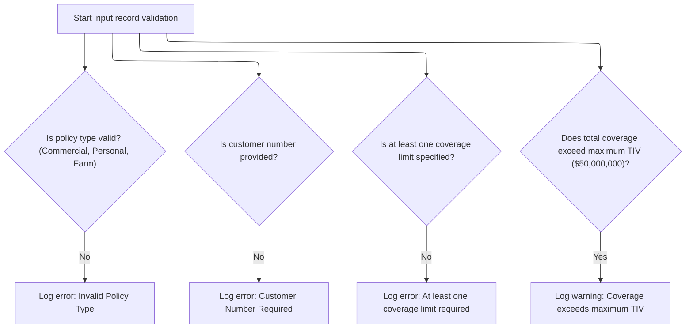

This section ensures that each input record meets the required business criteria before further processing. It validates key fields and logs errors or warnings for any issues found, supporting data quality and compliance.

| Category        | Rule Name                   | Description                                                                                                                                                  |
| --------------- | --------------------------- | ------------------------------------------------------------------------------------------------------------------------------------------------------------ |
| Data validation | Supported policy types only | Only policy types 'Commercial', 'Personal', or 'Farm' are accepted. Any other value is considered invalid and must be logged as an error.                    |
| Data validation | Customer number required    | A customer number must be provided for every input record. If missing, an error must be logged and the record flagged.                                       |
| Data validation | Minimum coverage required   | At least one coverage limit (building, contents, or BI) must be specified and non-zero. If all are zero, an error must be logged.                            |
| Business logic  | Maximum TIV warning         | If the total coverage (building + contents + BI) exceeds the maximum allowed TIV ($50,000,000), a warning must be logged, but the record is still processed. |

<SwmSnippet path="/base/src/LGAPDB01.cbl" line="195">

---

In <SwmToken path="base/src/LGAPDB01.cbl" pos="195:1:7" line-data="       P008-VALIDATE-INPUT-RECORD.">`P008-VALIDATE-INPUT-RECORD`</SwmToken>, we check if the policy type matches one of the supported flags. If not, we call <SwmToken path="base/src/LGAPDB01.cbl" pos="201:3:7" line-data="               PERFORM P008A-LOG-ERROR WITH ">`P008A-LOG-ERROR`</SwmToken> to record the invalid type before moving on.

```cobol
       P008-VALIDATE-INPUT-RECORD.
           INITIALIZE WS-ERROR-HANDLING
           
           IF NOT COMMERCIAL-POLICY AND 
              NOT PERSONAL-POLICY AND 
              NOT FARM-POLICY
               PERFORM P008A-LOG-ERROR WITH 
                   'POL001' 'F' 'IN-POLICY-TYPE' 
                   'Invalid Policy Type'
           END-IF
```

---

</SwmSnippet>

<SwmSnippet path="/base/src/LGAPDB01.cbl" line="226">

---

<SwmToken path="base/src/LGAPDB01.cbl" pos="226:1:5" line-data="       P008A-LOG-ERROR.">`P008A-LOG-ERROR`</SwmToken> bumps the error count and stores error details in parallel arrays indexed by the count. This lets us track up to 20 errors per record.

```cobol
       P008A-LOG-ERROR.
           ADD 1 TO WS-ERROR-COUNT
           SET ERR-IDX TO WS-ERROR-COUNT
           MOVE WS-ERROR-CODE TO WS-ERROR-CODE (ERR-IDX)
           MOVE WS-ERROR-SEVERITY TO WS-ERROR-SEVERITY (ERR-IDX)
           MOVE WS-ERROR-FIELD TO WS-ERROR-FIELD (ERR-IDX)
           MOVE WS-ERROR-MESSAGE TO WS-ERROR-MESSAGE (ERR-IDX).
```

---

</SwmSnippet>

<SwmSnippet path="/base/src/LGAPDB01.cbl" line="206">

---

After logging errors, we check for a blank customer number and log an error if it's missing.

```cobol
           IF IN-CUSTOMER-NUM = SPACES
               PERFORM P008A-LOG-ERROR WITH 
                   'CUS001' 'F' 'IN-CUSTOMER-NUM' 
                   'Customer Number Required'
           END-IF
```

---

</SwmSnippet>

<SwmSnippet path="/base/src/LGAPDB01.cbl" line="212">

---

We make sure at least one coverage limit is non-zero, and log an error if both are zero.

```cobol
           IF IN-BUILDING-LIMIT = ZERO AND 
              IN-CONTENTS-LIMIT = ZERO
               PERFORM P008A-LOG-ERROR WITH 
                   'COV001' 'F' 'COVERAGE-LIMITS' 
                   'At least one coverage limit required'
           END-IF
```

---

</SwmSnippet>

<SwmSnippet path="/base/src/LGAPDB01.cbl" line="219">

---

After previous validations, we check if total coverage exceeds the max allowed (<SwmToken path="base/src/LGAPDB01.cbl" pos="220:9:13" line-data="              IN-BI-LIMIT &gt; WS-MAX-TIV">`WS-MAX-TIV`</SwmToken>). If it does, we log a warning but still allow the record to proceed.

```cobol
           IF IN-BUILDING-LIMIT + IN-CONTENTS-LIMIT + 
              IN-BI-LIMIT > WS-MAX-TIV
               PERFORM P008A-LOG-ERROR WITH 
                   'COV002' 'W' 'COVERAGE-LIMITS' 
                   'Total coverage exceeds maximum TIV'
           END-IF.
```

---

</SwmSnippet>

### Valid Record Routing

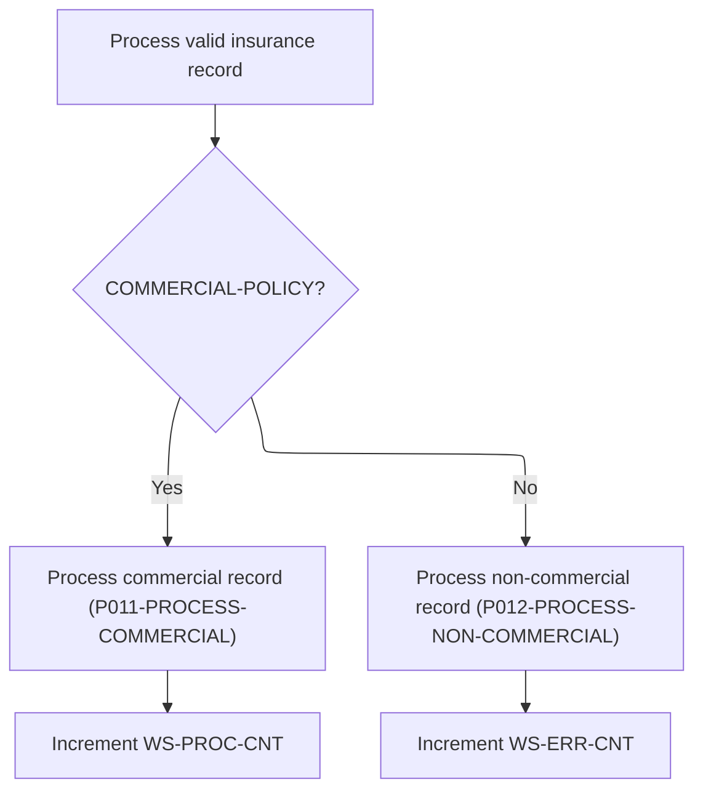

This section governs the routing of valid insurance records, ensuring that only commercial policies are processed for further business operations, while non-commercial policies are rejected and tracked as errors.

| Category        | Rule Name                     | Description                                                                                                                                                                                                                                  |
| --------------- | ----------------------------- | -------------------------------------------------------------------------------------------------------------------------------------------------------------------------------------------------------------------------------------------- |
| Data validation | Commercial policy definition  | A record is considered commercial only if the <SwmToken path="base/src/LGAPDB01.cbl" pos="202:10:14" line-data="                   &#39;POL001&#39; &#39;F&#39; &#39;IN-POLICY-TYPE&#39; ">`IN-POLICY-TYPE`</SwmToken> field is exactly 'C'. |
| Business logic  | Commercial policy eligibility | Only records with a policy type of 'C' (commercial) are eligible for full processing. All other policy types are rejected.                                                                                                                   |
| Business logic  | Processed record tracking     | Each processed commercial policy record increases the processed record counter by one.                                                                                                                                                       |
| Business logic  | Error record tracking         | Each rejected non-commercial policy record increases the error counter by one.                                                                                                                                                               |

<SwmSnippet path="/base/src/LGAPDB01.cbl" line="234">

---

We route commercial policies for full processing, and reject non-commercial ones.

```cobol
       P009-PROCESS-VALID-RECORD.
           IF COMMERCIAL-POLICY
               PERFORM P011-PROCESS-COMMERCIAL
               ADD 1 TO WS-PROC-CNT
           ELSE
               PERFORM P012-PROCESS-NON-COMMERCIAL
               ADD 1 TO WS-ERR-CNT
           END-IF.
```

---

</SwmSnippet>

### Commercial Policy Calculation

The main product role of this section is to determine the commercial policy approval status and calculate any eligible discounts based on underwriting decisions and customer eligibility criteria.

| Category        | Rule Name                           | Description                                                                                                                                                                                                                                 |
| --------------- | ----------------------------------- | ------------------------------------------------------------------------------------------------------------------------------------------------------------------------------------------------------------------------------------------- |
| Data validation | Maximum Discount Factor             | The total discount factor (WS-TOTAL-DISC-FACT) must be calculated by multiplying all applicable discount factors, and cannot exceed a maximum allowed value (e.g., 1.00).                                                                   |
| Business logic  | Policy Approval Status              | If the underwriting decision status is 'UW-APPROVED' (<SwmToken path="base/src/LGAPDB01.cbl" pos="369:3:5" line-data="           EVALUATE WS-STAT">`WS-STAT`</SwmToken> = 0), the policy is eligible for issuance and discount calculation. |
| Business logic  | Multi-Policy Discount Eligibility   | If the multi-policy eligibility flag is 'Y', the customer is eligible for a multi-policy discount.                                                                                                                                          |
| Business logic  | Claims-Free Discount Eligibility    | If the claims-free eligibility flag is 'Y', the customer is eligible for a claims-free discount.                                                                                                                                            |
| Business logic  | Safety Program Discount Eligibility | If the safety program eligibility flag is 'Y', the customer is eligible for a safety program discount.                                                                                                                                      |

See <SwmLink doc-title="Commercial Policy Processing and Underwriting Flow">[Commercial Policy Processing and Underwriting Flow](.swm%5Ccommercial-policy-processing-and-underwriting-flow.il1upt42.sw.md)</SwmLink>

### Statistics Update

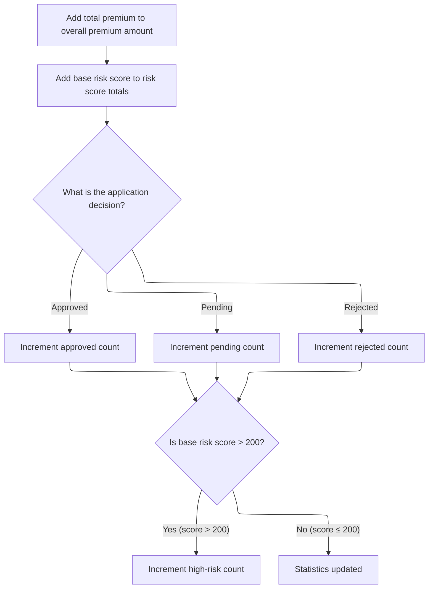

This section is responsible for updating key aggregate statistics after processing each insurance application. It ensures that premium totals, risk scores, and decision-based counters are accurately maintained for reporting and operational oversight.

| Category       | Rule Name                      | Description                                                                                                              |
| -------------- | ------------------------------ | ------------------------------------------------------------------------------------------------------------------------ |
| Business logic | Aggregate premium tracking     | Add the total premium from the current application to the overall premium amount tracked for all processed applications. |
| Business logic | Aggregate risk score tracking  | Add the base risk score from the current application to the cumulative risk score totals for all processed applications. |
| Business logic | Approved application counting  | Increment the approved count if the application decision is 'approved'.                                                  |
| Business logic | Pending application counting   | Increment the pending count if the application decision is 'pending'.                                                    |
| Business logic | Rejected application counting  | Increment the rejected count if the application decision is 'rejected'.                                                  |
| Business logic | High-risk application flagging | Increment the high-risk count if the base risk score for the application is greater than 200.                            |

<SwmSnippet path="/base/src/LGAPDB01.cbl" line="365">

---

In <SwmToken path="base/src/LGAPDB01.cbl" pos="365:1:5" line-data="       P011F-UPDATE-STATISTICS.">`P011F-UPDATE-STATISTICS`</SwmToken>, we update total premium, risk score totals, and increment the right counter based on <SwmToken path="base/src/LGAPDB01.cbl" pos="369:3:5" line-data="           EVALUATE WS-STAT">`WS-STAT`</SwmToken> (approved, pending, rejected). If the risk score is over 200, we bump the high-risk count.

```cobol
       P011F-UPDATE-STATISTICS.
           ADD WS-TOT-PREM TO WS-TOTAL-PREMIUM-AMT
           ADD WS-BASE-RISK-SCR TO WS-CONTROL-TOTALS
           
           EVALUATE WS-STAT
               WHEN 0 ADD 1 TO WS-APPROVED-CNT
               WHEN 1 ADD 1 TO WS-PENDING-CNT
               WHEN 2 ADD 1 TO WS-REJECTED-CNT
           END-EVALUATE
```

---

</SwmSnippet>

<SwmSnippet path="/base/src/LGAPDB01.cbl" line="375">

---

After updating the main counters, if the base risk score is over 200, we increment the high-risk counter. This flags records for reporting as high risk.

```cobol
           IF WS-BASE-RISK-SCR > 200
               ADD 1 TO WS-HIGH-RISK-CNT
           END-IF.
```

---

</SwmSnippet>

### Error Record Output

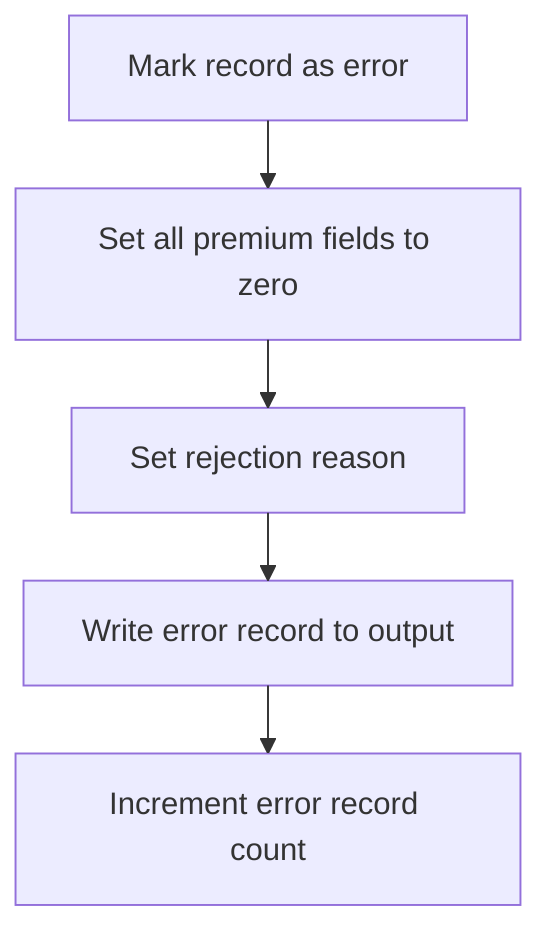

<SwmSnippet path="/base/src/LGAPDB01.cbl" line="243">

---

<SwmToken path="base/src/LGAPDB01.cbl" pos="243:1:7" line-data="       P010-PROCESS-ERROR-RECORD.">`P010-PROCESS-ERROR-RECORD`</SwmToken> copies key input fields to output, zeros all premium and risk fields, sets status to 'ERROR', puts the first char of the error message as the reject reason, writes the record, and bumps the error count.

```cobol
       P010-PROCESS-ERROR-RECORD.
           MOVE IN-CUSTOMER-NUM TO OUT-CUSTOMER-NUM
           MOVE IN-PROPERTY-TYPE TO OUT-PROPERTY-TYPE
           MOVE IN-POSTCODE TO OUT-POSTCODE
           MOVE ZERO TO OUT-RISK-SCORE
           MOVE ZERO TO OUT-FIRE-PREMIUM
           MOVE ZERO TO OUT-CRIME-PREMIUM
           MOVE ZERO TO OUT-FLOOD-PREMIUM
           MOVE ZERO TO OUT-WEATHER-PREMIUM
           MOVE ZERO TO OUT-TOTAL-PREMIUM
           MOVE 'ERROR' TO OUT-STATUS
           MOVE WS-ERROR-MESSAGE (1) TO OUT-REJECT-REASON
           WRITE OUTPUT-RECORD
           ADD 1 TO WS-ERR-CNT.
```

---

</SwmSnippet>

## File Closure

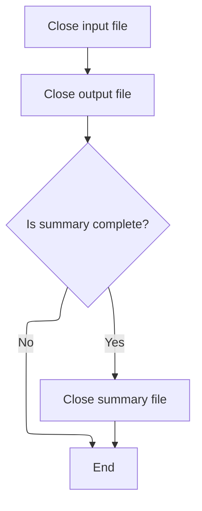

<SwmSnippet path="/base/src/LGAPDB01.cbl" line="394">

---

<SwmToken path="base/src/LGAPDB01.cbl" pos="394:1:5" line-data="       P014-CLOSE-FILES.">`P014-CLOSE-FILES`</SwmToken> closes input and output files, and only closes the summary file if its status is OK. This protects summary data from being closed in an invalid state.

```cobol
       P014-CLOSE-FILES.
           CLOSE INPUT-FILE
           CLOSE OUTPUT-FILE
           IF SUMMARY-OK
               CLOSE SUMMARY-FILE
           END-IF.
```

---

</SwmSnippet>

# Processing Statistics Display

This section provides a summary of key processing statistics to business users, helping them understand the outcomes of the record processing operation and highlighting important metrics such as approval rates, error counts, and premium totals.

| Category        | Rule Name                              | Description                                                                                                                                                   |
| --------------- | -------------------------------------- | ------------------------------------------------------------------------------------------------------------------------------------------------------------- |
| Data validation | Conditional average risk score display | Only display the average risk score if at least one record was processed (i.e., processed count is greater than zero).                                        |
| Business logic  | Display all main counters              | Display the total number of records read, processed, approved, pending, rejected, error, high risk, and the total premium generated at the end of processing. |
| Business logic  | Average risk score calculation         | The average risk score is calculated as the total risk score divided by the number of processed records.                                                      |

<SwmSnippet path="/base/src/LGAPDB01.cbl" line="450">

---

In <SwmToken path="base/src/LGAPDB01.cbl" pos="450:1:5" line-data="       P016-DISPLAY-STATS.">`P016-DISPLAY-STATS`</SwmToken>, we show all the main counters for records read, processed, approved, pending, rejected, errors, high risk, and total premium. The average risk score is only shown if records were processed.

```cobol
       P016-DISPLAY-STATS.
           DISPLAY 'Enhanced Processing Complete:'
           DISPLAY 'Total Records Read: ' WS-REC-CNT
           DISPLAY 'Records Processed: ' WS-PROC-CNT
           DISPLAY 'Records Approved: ' WS-APPROVED-CNT
           DISPLAY 'Records Pending: ' WS-PENDING-CNT  
           DISPLAY 'Records Rejected: ' WS-REJECTED-CNT
           DISPLAY 'Error Records: ' WS-ERR-CNT
           DISPLAY 'High Risk Count: ' WS-HIGH-RISK-CNT
           DISPLAY 'Total Premium Generated: $' WS-TOTAL-PREMIUM-AMT
```

---

</SwmSnippet>

<SwmSnippet path="/base/src/LGAPDB01.cbl" line="460">

---

After showing the main stats, we only display the average risk score if at least one record was processed. This keeps the output relevant and avoids errors.

```cobol
           IF WS-PROC-CNT > ZERO
               DISPLAY 'Average Risk Score: ' WS-AVG-RISK-SCORE
           END-IF.
```

---

</SwmSnippet>

&nbsp;

*This is an auto-generated document by Swimm 🌊 and has not yet been verified by a human*

<SwmMeta version="3.0.0" repo-id="Z2l0aHViJTNBJTNBU3dpbW1pby1nZW5hcHAtbW90b3IlM0ElM0FHaXJpLVN3aW1t" repo-name="Swimmio-genapp-motor"><sup>Powered by [Swimm](https://app.swimm.io/)</sup></SwmMeta>
