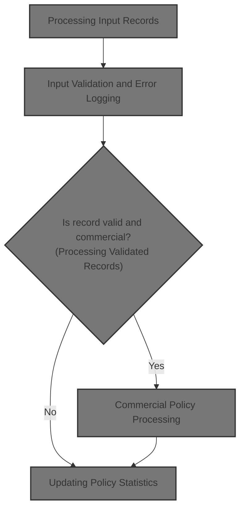
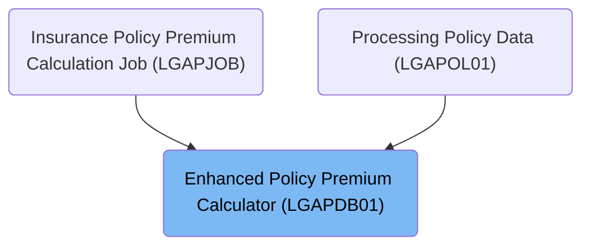
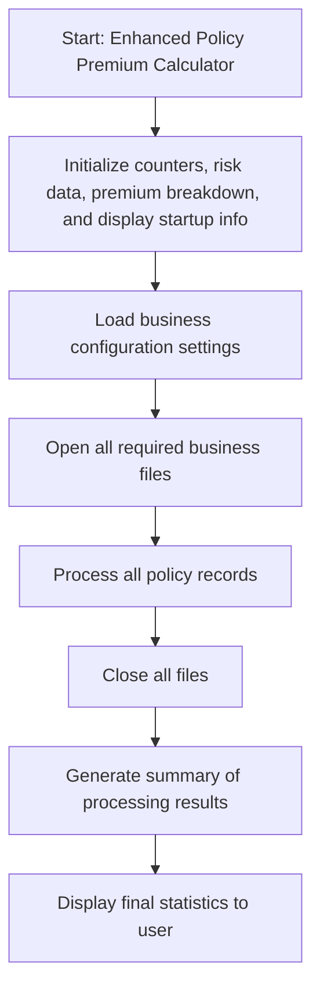
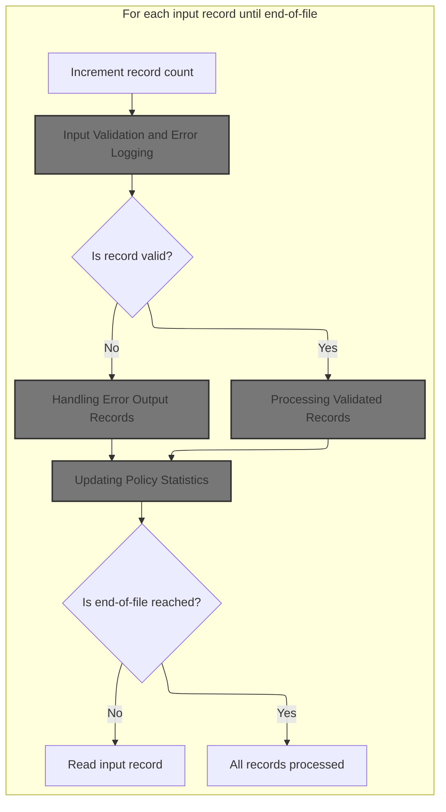
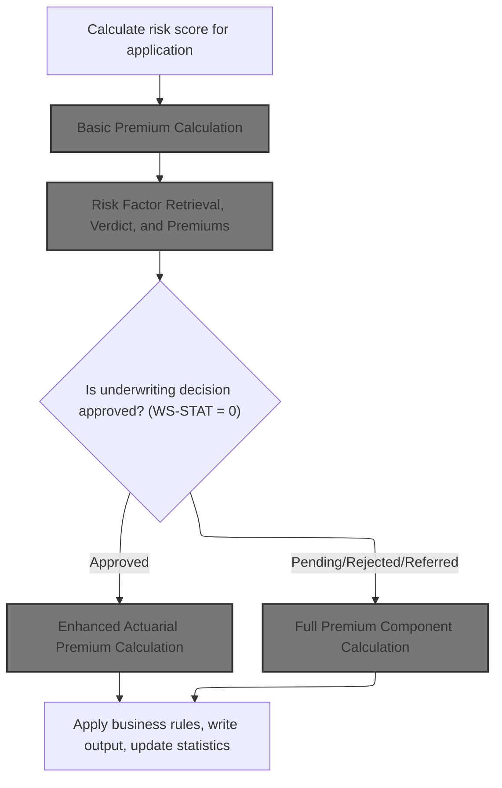
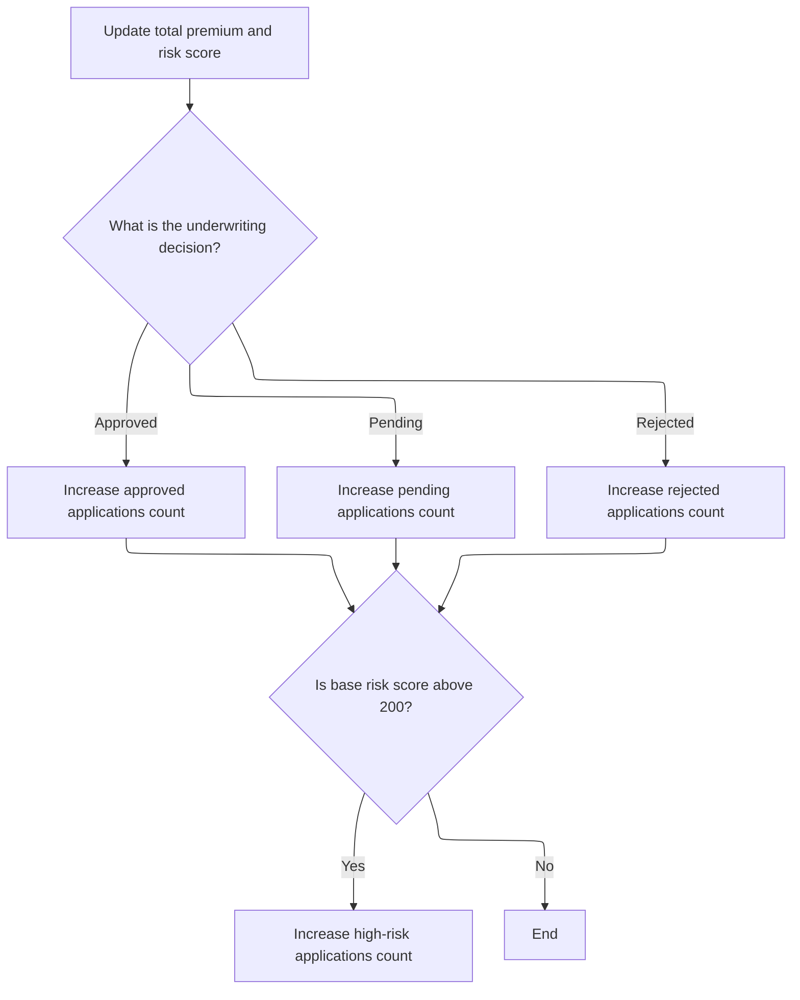

# Overview

This document describes how insurance policy records are processed to calculate premiums for commercial policies. The flow validates input data, applies business rules, calculates risk scores and premiums, and updates policy statistics. Non-commercial and invalid records are logged for reporting.



## Dependencies

### Programs

- <SwmToken path="base/src/LGAPDB01.cbl" pos="2:6:6" line-data="       PROGRAM-ID. LGAPDB01.">`LGAPDB01`</SwmToken> (<SwmPath>[base/src/LGAPDB01.cbl](base/src/LGAPDB01.cbl)</SwmPath>)
- <SwmToken path="base/src/LGAPDB01.cbl" pos="269:4:4" line-data="           CALL &#39;LGAPDB02&#39; USING IN-PROPERTY-TYPE, IN-POSTCODE, ">`LGAPDB02`</SwmToken>
- <SwmToken path="base/src/LGAPDB01.cbl" pos="276:4:4" line-data="           CALL &#39;LGAPDB03&#39; USING WS-BASE-RISK-SCR, IN-FIRE-PERIL, ">`LGAPDB03`</SwmToken> (<SwmPath>[base/src/LGAPDB03.cbl](base/src/LGAPDB03.cbl)</SwmPath>)
- <SwmToken path="base/src/LGAPDB01.cbl" pos="313:4:4" line-data="               CALL &#39;LGAPDB04&#39; USING LK-INPUT-DATA, LK-COVERAGE-DATA, ">`LGAPDB04`</SwmToken> (<SwmPath>[base/src/LGAPDB04.cbl](base/src/LGAPDB04.cbl)</SwmPath>)

### Copybooks

- SQLCA
- <SwmToken path="base/src/LGAPDB01.cbl" pos="35:3:3" line-data="           COPY INPUTREC2.">`INPUTREC2`</SwmToken> (<SwmPath>[base/src/INPUTREC2.cpy](base/src/INPUTREC2.cpy)</SwmPath>)
- OUTPUTREC (<SwmPath>[base/src/OUTPUTREC.cpy](base/src/OUTPUTREC.cpy)</SwmPath>)
- WORKSTOR (<SwmPath>[base/src/WORKSTOR.cpy](base/src/WORKSTOR.cpy)</SwmPath>)
- LGAPACT (<SwmPath>[base/src/LGAPACT.cpy](base/src/LGAPACT.cpy)</SwmPath>)

# Where is this program used?

This program is used multiple times in the codebase as represented in the following diagram:



## Input and Output Tables/Files used in the Program

| Table / File Name                                                                                                                                        | Type | Description                                         | Usage Mode | Key Fields / Layout Highlights           |
| -------------------------------------------------------------------------------------------------------------------------------------------------------- | ---- | --------------------------------------------------- | ---------- | ---------------------------------------- |
| <SwmToken path="base/src/LGAPDB01.cbl" pos="17:3:5" line-data="           SELECT CONFIG-FILE ASSIGN TO &#39;CONFIG.DAT&#39;">`CONFIG-FILE`</SwmToken>    | DB2  | System configuration parameters and thresholds      | Input      | Database table with relational structure |
| <SwmToken path="base/src/LGAPDB01.cbl" pos="9:3:5" line-data="           SELECT INPUT-FILE ASSIGN TO &#39;INPUT.DAT&#39;">`INPUT-FILE`</SwmToken>        | DB2  | Policy application and property risk input data     | Input      | Database table with relational structure |
| <SwmToken path="base/src/LGAPDB01.cbl" pos="13:3:5" line-data="           SELECT OUTPUT-FILE ASSIGN TO &#39;OUTPUT.DAT&#39;">`OUTPUT-FILE`</SwmToken>    | DB2  | Calculated premium and underwriting decision output | Output     | Database table with relational structure |
| <SwmToken path="base/src/LGAPDB01.cbl" pos="255:3:5" line-data="           WRITE OUTPUT-RECORD">`OUTPUT-RECORD`</SwmToken>                               | DB2  | Single policy premium and risk calculation result   | Output     | Database table with relational structure |
| <SwmToken path="base/src/LGAPDB01.cbl" pos="27:3:5" line-data="           SELECT SUMMARY-FILE ASSIGN TO &#39;SUMMARY.DAT&#39;">`SUMMARY-FILE`</SwmToken> | DB2  | Summary statistics and processing totals            | Output     | Database table with relational structure |
| <SwmToken path="base/src/LGAPDB01.cbl" pos="64:3:5" line-data="       01  SUMMARY-RECORD             PIC X(132).">`SUMMARY-RECORD`</SwmToken>            | DB2  | Summary line for processing statistics or totals    | Output     | Database table with relational structure |

&nbsp;

## Detailed View of the Program's Functionality

# Startup and Initialization

At program start, the main routine initiates the enhanced policy premium calculator. It first resets all counters, risk data, premium breakdowns, and displays startup/version information to the user. All relevant working storage is cleared, and the processing date is accepted from the user. Next, business configuration settings are loaded, either from a configuration file or by falling back to defaults if the file is unavailable. After configuration, all required business files (input, output, summary, etc.) are opened, and headers are written to the output file.

# Processing Input Records

The program enters a loop to process each input record from the input file until the end-of-file is reached. For each record, the record count is incremented, and the record is validated. If validation passes (no errors), the record is processed as valid; otherwise, it is logged as an error and handled accordingly.

## Input Validation and Error Logging

Validation checks include:

- Ensuring the policy type is one of the allowed types (commercial, personal, or farm). If not, an error is logged.
- Checking that a customer number is provided; if missing, an error is logged.
- Verifying that at least one coverage limit (building or contents) is set; if both are zero, an error is logged.
- Summing all coverage limits and ensuring the total does not exceed the maximum allowed insured value. If it does, a warning is logged (not a blocking error).

Each error encountered is logged by incrementing the error count, setting the error array index, and copying error details into arrays for reporting and downstream logic.

## Processing Validated Records

If the record is valid:

- Commercial policies are routed to full processing, which includes risk score calculation, premium calculation, and possible enhanced actuarial calculations.
- Non-commercial policies are rejected, logged, and written to output with a message indicating only commercial policies are supported.

# Commercial Policy Processing

Processing a commercial policy involves several steps:

## Risk Score Calculation

The risk score for the application is calculated using a dedicated module, which considers property type, location, coverage limits, and customer history.

## Basic Premium Calculation

The basic premium calculation is performed by calling a separate module. This module receives the risk score and peril indicators (fire, crime, flood, weather) and returns the status, description, rejection reason, individual peril premiums, total premium, and discount factor.

## Risk Factor Retrieval, Verdict, and Premiums

Within the premium calculation module:

- Risk factors for fire and crime are retrieved from a database. If unavailable, default values are used.
- The risk score is evaluated to determine the underwriting verdict:
  - If the score is above 200, the application is rejected.
  - If the score is above 150 but not over 200, the application is marked as pending.
  - Otherwise, the application is approved.
- A discount factor is set. If all four perils are present, a 10% discount is applied; otherwise, no discount.
- Premiums for each peril are calculated using the risk score, peril-specific factors, and the discount factor. The total premium is the sum of all peril premiums.

## Enhanced Actuarial Premium Calculation

If the policy is approved and the total premium exceeds the minimum threshold, the program prepares all customer, property, and coverage data for advanced actuarial calculation. This involves:

- Copying all relevant fields into the actuarial input structure.
- Calling the advanced actuarial calculation module.
- If the enhanced premium is greater than the current premium, the premium breakdown fields are updated with the enhanced values.

### Full Premium Component Calculation

The advanced actuarial calculation module performs the following steps:

- Initializes exposures for building, contents, and business interruption by scaling limits with the risk score.
- Sums exposures for total insured value and calculates exposure density.
- Loads base rates for each peril from the database or uses defaults if unavailable.
- Calculates the experience modifier based on years in business and claims history, capping it between 0.5 and 2.0.
- Applies scheduled modifications based on building age, protection class, occupancy hazard, and exposure density, capping the schedule modifier between -0.2 and +0.4.
- Calculates base premiums for each covered peril using exposures, rate table lookups, experience and schedule modifiers, and a trend factor. Flood premiums receive an extra multiplier.
- Adds catastrophe loads for hurricane, earthquake, tornado, and flood, based on peril selection and premium amounts.
- Adds expense and profit loads to the premium.
- Calculates discounts:
  - <SwmToken path="base/src/LGAPDB04.cbl" pos="410:3:5" line-data="      * Multi-peril discount">`Multi-peril`</SwmToken> discount (10% if all perils, 5% for certain combinations).
  - <SwmToken path="base/src/LGAPDB04.cbl" pos="425:3:5" line-data="      * Claims-free discount  ">`Claims-free`</SwmToken> discount (7.5% if no claims and sufficient years in business).
  - Deductible credits (varies by deductible amounts).
  - Caps total discount at 25%.
- Applies taxes to the premium.
- Finalizes the premium and calculates the rate factor, capping the rate factor at 0.05 if necessary and recalculating the premium if capped.

## Business Rules, Output, and Statistics

After premium calculation:

- Business rules are applied to determine the final underwriting decision (rejected if risk score exceeds maximum, pending if premium is below minimum or risk score is high, otherwise approved).
- The output record is written, including all calculated values and decision information.
- Policy statistics are updated by adding the premium and risk score to totals and incrementing the appropriate counters (approved, pending, rejected, high risk).

## Updating Policy Statistics

Statistics are updated as follows:

- The total premium and risk score are added to running totals.
- The appropriate counter is incremented based on the underwriting decision (approved, pending, rejected).
- If the risk score is above 200, the high-risk counter is incremented.

## Handling Error Output Records

For records with validation errors:

- Key input fields are copied for traceability.
- All calculated values are zeroed out.
- Status is set to 'ERROR', and the rejection reason is set to the first error message.
- The record is written to output, and the error count is incremented.

# Closing and Summary

After all records are processed:

- All files are closed.
- A summary of processing results is generated and written to the summary file, including counts of processed, approved, pending, rejected, error, and high-risk records, as well as total and average premium and risk score.
- Final statistics are displayed to the user.

# Data Definitions

| Table / Record Name                                                                                                                                      | Type | Short Description                                   | Usage Mode |
| -------------------------------------------------------------------------------------------------------------------------------------------------------- | ---- | --------------------------------------------------- | ---------- |
| <SwmToken path="base/src/LGAPDB01.cbl" pos="17:3:5" line-data="           SELECT CONFIG-FILE ASSIGN TO &#39;CONFIG.DAT&#39;">`CONFIG-FILE`</SwmToken>    | DB2  | System configuration parameters and thresholds      | Input      |
| <SwmToken path="base/src/LGAPDB01.cbl" pos="9:3:5" line-data="           SELECT INPUT-FILE ASSIGN TO &#39;INPUT.DAT&#39;">`INPUT-FILE`</SwmToken>        | DB2  | Policy application and property risk input data     | Input      |
| <SwmToken path="base/src/LGAPDB01.cbl" pos="13:3:5" line-data="           SELECT OUTPUT-FILE ASSIGN TO &#39;OUTPUT.DAT&#39;">`OUTPUT-FILE`</SwmToken>    | DB2  | Calculated premium and underwriting decision output | Output     |
| <SwmToken path="base/src/LGAPDB01.cbl" pos="255:3:5" line-data="           WRITE OUTPUT-RECORD">`OUTPUT-RECORD`</SwmToken>                               | DB2  | Single policy premium and risk calculation result   | Output     |
| <SwmToken path="base/src/LGAPDB01.cbl" pos="27:3:5" line-data="           SELECT SUMMARY-FILE ASSIGN TO &#39;SUMMARY.DAT&#39;">`SUMMARY-FILE`</SwmToken> | DB2  | Summary statistics and processing totals            | Output     |
| <SwmToken path="base/src/LGAPDB01.cbl" pos="64:3:5" line-data="       01  SUMMARY-RECORD             PIC X(132).">`SUMMARY-RECORD`</SwmToken>            | DB2  | Summary line for processing statistics or totals    | Output     |

&nbsp;

# Rule Definition

| Paragraph Name                                                                                                                                                                                                                                                                                                                                                                                                                                                                                                                                                                                                                     | Rule ID | Category          | Description                                                                                                                                                                                                                                                                                                                                                                                                                                                                                                                        | Conditions                                                                                                                                                                                                                                                                                                                                                                                                                                                                                                                                                                                                                                                                          | Remarks                                                                                                                                                                                                                                                                                                                                                                                                                                                                                                                                                                                                                                                                                                                                                                                                                                                                                                                                                                                                                                                                                                                                                                                                                                                                                                                                                                                                                                                                                                                                                                                                                                                                                                                                                                                                                                                                                                                                                                                                                                                                                                                                                                                                                                                                                                                                                                             |
| ---------------------------------------------------------------------------------------------------------------------------------------------------------------------------------------------------------------------------------------------------------------------------------------------------------------------------------------------------------------------------------------------------------------------------------------------------------------------------------------------------------------------------------------------------------------------------------------------------------------------------------- | ------- | ----------------- | ---------------------------------------------------------------------------------------------------------------------------------------------------------------------------------------------------------------------------------------------------------------------------------------------------------------------------------------------------------------------------------------------------------------------------------------------------------------------------------------------------------------------------------- | ----------------------------------------------------------------------------------------------------------------------------------------------------------------------------------------------------------------------------------------------------------------------------------------------------------------------------------------------------------------------------------------------------------------------------------------------------------------------------------------------------------------------------------------------------------------------------------------------------------------------------------------------------------------------------------- | ----------------------------------------------------------------------------------------------------------------------------------------------------------------------------------------------------------------------------------------------------------------------------------------------------------------------------------------------------------------------------------------------------------------------------------------------------------------------------------------------------------------------------------------------------------------------------------------------------------------------------------------------------------------------------------------------------------------------------------------------------------------------------------------------------------------------------------------------------------------------------------------------------------------------------------------------------------------------------------------------------------------------------------------------------------------------------------------------------------------------------------------------------------------------------------------------------------------------------------------------------------------------------------------------------------------------------------------------------------------------------------------------------------------------------------------------------------------------------------------------------------------------------------------------------------------------------------------------------------------------------------------------------------------------------------------------------------------------------------------------------------------------------------------------------------------------------------------------------------------------------------------------------------------------------------------------------------------------------------------------------------------------------------------------------------------------------------------------------------------------------------------------------------------------------------------------------------------------------------------------------------------------------------------------------------------------------------------------------------------------------------- |
| <SwmToken path="base/src/LGAPDB01.cbl" pos="182:3:9" line-data="               PERFORM P008-VALIDATE-INPUT-RECORD">`P008-VALIDATE-INPUT-RECORD`</SwmToken>, <SwmToken path="base/src/LGAPDB01.cbl" pos="201:3:7" line-data="               PERFORM P008A-LOG-ERROR WITH ">`P008A-LOG-ERROR`</SwmToken>                                                                                                                                                                                                                                                                                                                             | RL-001  | Conditional Logic | Each input record must be validated for required fields and correct formats. If a required field is missing or a numeric field is malformed, the record is flagged as an error.                                                                                                                                                                                                                                                                                                                                                    | Required fields must be present and numeric fields must be correctly formatted.                                                                                                                                                                                                                                                                                                                                                                                                                                                                                                                                                                                                     | Required fields: customer number, policy type, at least one coverage limit. Numeric fields: coverage limits, peril indicators. Error records have zeroed premiums, status 'ERROR', and the first error message as the reject reason.                                                                                                                                                                                                                                                                                                                                                                                                                                                                                                                                                                                                                                                                                                                                                                                                                                                                                                                                                                                                                                                                                                                                                                                                                                                                                                                                                                                                                                                                                                                                                                                                                                                                                                                                                                                                                                                                                                                                                                                                                                                                                                                                                |
| <SwmToken path="base/src/LGAPDB01.cbl" pos="182:3:9" line-data="               PERFORM P008-VALIDATE-INPUT-RECORD">`P008-VALIDATE-INPUT-RECORD`</SwmToken>, <SwmToken path="base/src/LGAPDB01.cbl" pos="239:3:9" line-data="               PERFORM P012-PROCESS-NON-COMMERCIAL">`P012-PROCESS-NON-COMMERCIAL`</SwmToken>                                                                                                                                                                                                                                                                                                           | RL-002  | Conditional Logic | Policy type must be one of 'C', 'P', or 'F'. Only commercial ('C') policies are processed; others are rejected as unsupported.                                                                                                                                                                                                                                                                                                                                                                                                     | Policy type must be 'C', 'P', or 'F'. Only 'C' is supported.                                                                                                                                                                                                                                                                                                                                                                                                                                                                                                                                                                                                                        | Unsupported policy types have zeroed calculated fields, status 'UNSUPPORTED', and a reject reason.                                                                                                                                                                                                                                                                                                                                                                                                                                                                                                                                                                                                                                                                                                                                                                                                                                                                                                                                                                                                                                                                                                                                                                                                                                                                                                                                                                                                                                                                                                                                                                                                                                                                                                                                                                                                                                                                                                                                                                                                                                                                                                                                                                                                                                                                                  |
| <SwmToken path="base/src/LGAPDB01.cbl" pos="182:3:9" line-data="               PERFORM P008-VALIDATE-INPUT-RECORD">`P008-VALIDATE-INPUT-RECORD`</SwmToken>                                                                                                                                                                                                                                                                                                                                                                                                                                                                         | RL-003  | Conditional Logic | At least one coverage limit (building, contents, or BI) must be greater than zero. If all are zero, the record is flagged as an error.                                                                                                                                                                                                                                                                                                                                                                                             | <SwmToken path="base/src/LGAPDB01.cbl" pos="212:3:7" line-data="           IF IN-BUILDING-LIMIT = ZERO AND ">`IN-BUILDING-LIMIT`</SwmToken>, <SwmToken path="base/src/LGAPDB01.cbl" pos="213:1:5" line-data="              IN-CONTENTS-LIMIT = ZERO">`IN-CONTENTS-LIMIT`</SwmToken>, <SwmToken path="base/src/LGAPDB01.cbl" pos="220:1:5" line-data="              IN-BI-LIMIT &gt; WS-MAX-TIV">`IN-BI-LIMIT`</SwmToken>; at least one > 0.                                                                                                                                                                                                                                         | Error records have zeroed premiums, status 'ERROR', and the first error message as the reject reason.                                                                                                                                                                                                                                                                                                                                                                                                                                                                                                                                                                                                                                                                                                                                                                                                                                                                                                                                                                                                                                                                                                                                                                                                                                                                                                                                                                                                                                                                                                                                                                                                                                                                                                                                                                                                                                                                                                                                                                                                                                                                                                                                                                                                                                                                               |
| <SwmToken path="base/src/LGAPDB01.cbl" pos="182:3:9" line-data="               PERFORM P008-VALIDATE-INPUT-RECORD">`P008-VALIDATE-INPUT-RECORD`</SwmToken>                                                                                                                                                                                                                                                                                                                                                                                                                                                                         | RL-004  | Conditional Logic | Peril indicators must be numeric. Zero means not selected; positive means selected.                                                                                                                                                                                                                                                                                                                                                                                                                                                | <SwmToken path="base/src/LGAPDB01.cbl" pos="276:18:22" line-data="           CALL &#39;LGAPDB03&#39; USING WS-BASE-RISK-SCR, IN-FIRE-PERIL, ">`IN-FIRE-PERIL`</SwmToken>, <SwmToken path="base/src/LGAPDB01.cbl" pos="277:1:5" line-data="                                IN-CRIME-PERIL, IN-FLOOD-PERIL, ">`IN-CRIME-PERIL`</SwmToken>, <SwmToken path="base/src/LGAPDB01.cbl" pos="277:8:12" line-data="                                IN-CRIME-PERIL, IN-FLOOD-PERIL, ">`IN-FLOOD-PERIL`</SwmToken>, <SwmToken path="base/src/LGAPDB01.cbl" pos="278:1:5" line-data="                                IN-WEATHER-PERIL, WS-STAT,">`IN-WEATHER-PERIL`</SwmToken> must be numeric. | Peril indicators: numeric, zero = not selected, positive = selected.                                                                                                                                                                                                                                                                                                                                                                                                                                                                                                                                                                                                                                                                                                                                                                                                                                                                                                                                                                                                                                                                                                                                                                                                                                                                                                                                                                                                                                                                                                                                                                                                                                                                                                                                                                                                                                                                                                                                                                                                                                                                                                                                                                                                                                                                                                                |
| <SwmToken path="base/src/LGAPDB01.cbl" pos="236:3:7" line-data="               PERFORM P011-PROCESS-COMMERCIAL">`P011-PROCESS-COMMERCIAL`</SwmToken>, <SwmToken path="base/src/LGAPDB01.cbl" pos="259:3:9" line-data="           PERFORM P011A-CALCULATE-RISK-SCORE">`P011A-CALCULATE-RISK-SCORE`</SwmToken>, <SwmToken path="base/src/LGAPDB01.cbl" pos="260:3:9" line-data="           PERFORM P011B-BASIC-PREMIUM-CALC">`P011B-BASIC-PREMIUM-CALC`</SwmToken>, <SwmToken path="base/src/LGAPDB01.cbl" pos="262:3:9" line-data="               PERFORM P011C-ENHANCED-ACTUARIAL-CALC">`P011C-ENHANCED-ACTUARIAL-CALC`</SwmToken> | RL-005  | Computation       | For commercial policies, risk score and premium calculations are performed using both basic and advanced actuarial logic.                                                                                                                                                                                                                                                                                                                                                                                                          | Policy type is 'C' and record is valid.                                                                                                                                                                                                                                                                                                                                                                                                                                                                                                                                                                                                                                             | Premium calculation uses constants: Expense Ratio=<SwmToken path="base/src/LGAPDB04.cbl" pos="23:15:17" line-data="           05 WS-EXPENSE-RATIO         PIC V999 VALUE 0.350.">`0.350`</SwmToken>, Profit Margin=<SwmToken path="base/src/LGAPDB04.cbl" pos="24:15:17" line-data="           05 WS-PROFIT-MARGIN         PIC V999 VALUE 0.150.">`0.150`</SwmToken>, Base Loss Ratio=<SwmToken path="base/src/LGAPDB04.cbl" pos="25:17:19" line-data="           05 WS-BASE-LOSS-RATIO       PIC V999 VALUE 0.600.">`0.600`</SwmToken>, Trend Factor=<SwmToken path="base/src/LGAPDB04.cbl" pos="26:15:17" line-data="           05 WS-TREND-FACTOR          PIC V9999 VALUE 1.0350.">`1.0350`</SwmToken>, Credibility Factor=<SwmToken path="base/src/LGAPDB04.cbl" pos="27:15:17" line-data="           05 WS-CREDIBILITY-FACTOR    PIC V999 VALUE 0.750.">`0.750`</SwmToken>, Cat Model Factors (Hurricane=<SwmToken path="base/src/LGAPDB04.cbl" pos="35:15:17" line-data="           05 WS-HURRICANE-FACTOR      PIC V9999 VALUE 0.0125.">`0.0125`</SwmToken>, Earthquake=<SwmToken path="base/src/LGAPDB04.cbl" pos="36:15:17" line-data="           05 WS-EARTHQUAKE-FACTOR     PIC V9999 VALUE 0.0080.">`0.0080`</SwmToken>, Tornado=<SwmToken path="base/src/LGAPDB04.cbl" pos="37:15:17" line-data="           05 WS-TORNADO-FACTOR        PIC V9999 VALUE 0.0045.">`0.0045`</SwmToken>, Flood=<SwmToken path="base/src/LGAPDB04.cbl" pos="38:15:17" line-data="           05 WS-FLOOD-FACTOR          PIC V9999 VALUE 0.0090.">`0.0090`</SwmToken>), Minimum Premium=<SwmToken path="base/src/LGAPDB01.cbl" pos="84:19:21" line-data="           05 WS-MIN-PREMIUM           PIC 9(6)V99 VALUE 500.00.">`500.00`</SwmToken>, Maximum TIV=50,000,000.00, Rate Table Defaults (Fire=<SwmToken path="base/src/LGAPDB04.cbl" pos="196:3:5" line-data="               MOVE 0.008500 TO WS-BASE-RATE (1, 1, 1, 1)">`0.008500`</SwmToken>, Crime=<SwmToken path="base/src/LGAPDB04.cbl" pos="225:7:9" line-data="                   WHEN 2  MOVE 0.006200 TO ">`0.006200`</SwmToken>, Flood=<SwmToken path="base/src/LGAPDB04.cbl" pos="227:7:9" line-data="                   WHEN 3  MOVE 0.012800 TO ">`0.012800`</SwmToken>, Weather=<SwmToken path="base/src/LGAPDB04.cbl" pos="229:7:9" line-data="                   WHEN 4  MOVE 0.009600 TO ">`0.009600`</SwmToken>). |
| <SwmToken path="base/src/LGAPDB03.cbl" pos="43:3:7" line-data="           PERFORM GET-RISK-FACTORS">`GET-RISK-FACTORS`</SwmToken> in <SwmToken path="base/src/LGAPDB01.cbl" pos="276:4:4" line-data="           CALL &#39;LGAPDB03&#39; USING WS-BASE-RISK-SCR, IN-FIRE-PERIL, ">`LGAPDB03`</SwmToken>                                                                                                                                                                                                                                                                                                                             | RL-006  | Data Assignment   | Risk factors for FIRE and CRIME are retrieved from <SwmToken path="base/src/LGAPDB03.cbl" pos="51:3:3" line-data="               FROM RISK_FACTORS">`RISK_FACTORS`</SwmToken> table. If not found, use defaults: FIRE=<SwmToken path="base/src/LGAPDB03.cbl" pos="58:3:5" line-data="               MOVE 0.80 TO WS-FIRE-FACTOR">`0.80`</SwmToken>, CRIME=<SwmToken path="base/src/LGAPDB03.cbl" pos="70:3:5" line-data="               MOVE 0.60 TO WS-CRIME-FACTOR">`0.60`</SwmToken>. Flood and weather use hardcoded defaults. | SQL lookup for peril type; if not found, use default.                                                                                                                                                                                                                                                                                                                                                                                                                                                                                                                                                                                                                               | Default values: FIRE=<SwmToken path="base/src/LGAPDB03.cbl" pos="58:3:5" line-data="               MOVE 0.80 TO WS-FIRE-FACTOR">`0.80`</SwmToken>, CRIME=<SwmToken path="base/src/LGAPDB03.cbl" pos="70:3:5" line-data="               MOVE 0.60 TO WS-CRIME-FACTOR">`0.60`</SwmToken>, FLOOD=<SwmToken path="base/src/LGAPDB03.cbl" pos="16:15:17" line-data="       01  WS-FLOOD-FACTOR             PIC V99 VALUE 1.20.">`1.20`</SwmToken>, WEATHER=<SwmToken path="base/src/LGAPDB03.cbl" pos="99:3:5" line-data="             MOVE 0.90 TO LK-DISC-FACT">`0.90`</SwmToken>.                                                                                                                                                                                                                                                                                                                                                                                                                                                                                                                                                                                                                                                                                                                                                                                                                                                                                                                                                                                                                                                                                                                                                                                                                                                                                                                                                                                                                                                                                                                                                                                                                                                                                                                                                                                                     |
| <SwmToken path="base/src/LGAPDB03.cbl" pos="45:3:5" line-data="           PERFORM CALCULATE-PREMIUMS">`CALCULATE-PREMIUMS`</SwmToken> in <SwmToken path="base/src/LGAPDB01.cbl" pos="276:4:4" line-data="           CALL &#39;LGAPDB03&#39; USING WS-BASE-RISK-SCR, IN-FIRE-PERIL, ">`LGAPDB03`</SwmToken>, <SwmToken path="base/src/LGAPDB04.cbl" pos="147:3:5" line-data="           PERFORM P900-DISC">`P900-DISC`</SwmToken> in <SwmToken path="base/src/LGAPDB01.cbl" pos="313:4:4" line-data="               CALL &#39;LGAPDB04&#39; USING LK-INPUT-DATA, LK-COVERAGE-DATA, ">`LGAPDB04`</SwmToken>                          | RL-007  | Computation       | Discounts are applied based on peril selection, claims-free status, and deductible credits. Total discount is capped at 25%.                                                                                                                                                                                                                                                                                                                                                                                                       | Peril selection, claims-free, deductible amounts.                                                                                                                                                                                                                                                                                                                                                                                                                                                                                                                                                                                                                                   | Discounts: 10% for all four perils, 5% for fire+weather+crime/flood, 7.5% for claims-free, deductible credits (2.5% for fire ≥ 10,000, 3.5% for wind ≥ 25,000, 4.5% for flood ≥ 50,000). Cap: 25%.                                                                                                                                                                                                                                                                                                                                                                                                                                                                                                                                                                                                                                                                                                                                                                                                                                                                                                                                                                                                                                                                                                                                                                                                                                                                                                                                                                                                                                                                                                                                                                                                                                                                                                                                                                                                                                                                                                                                                                                                                                                                                                                                                                                  |
| <SwmToken path="base/src/LGAPDB01.cbl" pos="265:3:9" line-data="           PERFORM P011E-WRITE-OUTPUT-RECORD">`P011E-WRITE-OUTPUT-RECORD`</SwmToken>, Output formatting in OUTPUTREC                                                                                                                                                                                                                                                                                                                                                                                                                                               | RL-008  | Data Assignment   | Premiums must be rounded to two decimal places and formatted as fixed-width numeric fields (<SwmToken path="base/src/LGAPDB01.cbl" pos="58:15:15" line-data="              10 RATE-MIN-PREMIUM      PIC 9(6)V99.">`V99`</SwmToken>), right-justified, with no currency symbols.                                                                                                                                                                                                                                                    | Premium calculation complete.                                                                                                                                                                                                                                                                                                                                                                                                                                                                                                                                                                                                                                                       | Premium fields: numeric, two decimals, right-justified, no currency symbols, fixed-width as per OUTPUTREC.                                                                                                                                                                                                                                                                                                                                                                                                                                                                                                                                                                                                                                                                                                                                                                                                                                                                                                                                                                                                                                                                                                                                                                                                                                                                                                                                                                                                                                                                                                                                                                                                                                                                                                                                                                                                                                                                                                                                                                                                                                                                                                                                                                                                                                                                          |
| <SwmToken path="base/src/LGAPDB04.cbl" pos="149:3:5" line-data="           PERFORM P999-FINAL">`P999-FINAL`</SwmToken> in <SwmToken path="base/src/LGAPDB01.cbl" pos="313:4:4" line-data="               CALL &#39;LGAPDB04&#39; USING LK-INPUT-DATA, LK-COVERAGE-DATA, ">`LGAPDB04`</SwmToken>                                                                                                                                                                                                                                                                                                                                    | RL-009  | Computation       | If the calculated rate factor exceeds <SwmToken path="base/src/LGAPDB04.cbl" pos="473:13:15" line-data="           IF LK-FINAL-RATE-FACTOR &gt; 0.050000">`0.050000`</SwmToken>, it is capped and the premium is recalculated.                                                                                                                                                                                                                                                                                                     | <SwmToken path="base/src/LGAPDB04.cbl" pos="470:3:9" line-data="           COMPUTE LK-FINAL-RATE-FACTOR = ">`LK-FINAL-RATE-FACTOR`</SwmToken> > <SwmToken path="base/src/LGAPDB04.cbl" pos="473:13:15" line-data="           IF LK-FINAL-RATE-FACTOR &gt; 0.050000">`0.050000`</SwmToken>.                                                                                                                                                                                                                                                                                                                                                                                          | Rate factor cap: <SwmToken path="base/src/LGAPDB04.cbl" pos="473:13:15" line-data="           IF LK-FINAL-RATE-FACTOR &gt; 0.050000">`0.050000`</SwmToken>. Premium recalculated as insured value \* capped rate factor.                                                                                                                                                                                                                                                                                                                                                                                                                                                                                                                                                                                                                                                                                                                                                                                                                                                                                                                                                                                                                                                                                                                                                                                                                                                                                                                                                                                                                                                                                                                                                                                                                                                                                                                                                                                                                                                                                                                                                                                                                                                                                                                                                            |
| <SwmToken path="base/src/LGAPDB01.cbl" pos="264:3:9" line-data="           PERFORM P011D-APPLY-BUSINESS-RULES">`P011D-APPLY-BUSINESS-RULES`</SwmToken>, <SwmToken path="base/src/LGAPDB01.cbl" pos="265:3:9" line-data="           PERFORM P011E-WRITE-OUTPUT-RECORD">`P011E-WRITE-OUTPUT-RECORD`</SwmToken>                                                                                                                                                                                                                                                                                                                       | RL-010  | Conditional Logic | If the calculated premium is below the minimum premium, status is set to 'PENDING'.                                                                                                                                                                                                                                                                                                                                                                                                                                                | Premium < minimum premium.                                                                                                                                                                                                                                                                                                                                                                                                                                                                                                                                                                                                                                                          | Minimum premium: <SwmToken path="base/src/LGAPDB01.cbl" pos="84:19:21" line-data="           05 WS-MIN-PREMIUM           PIC 9(6)V99 VALUE 500.00.">`500.00`</SwmToken> (default, overridable by config). Status: 'PENDING'.                                                                                                                                                                                                                                                                                                                                                                                                                                                                                                                                                                                                                                                                                                                                                                                                                                                                                                                                                                                                                                                                                                                                                                                                                                                                                                                                                                                                                                                                                                                                                                                                                                                                                                                                                                                                                                                                                                                                                                                                                                                                                                                                                        |
| <SwmToken path="base/src/LGAPDB01.cbl" pos="186:3:9" line-data="                   PERFORM P010-PROCESS-ERROR-RECORD">`P010-PROCESS-ERROR-RECORD`</SwmToken>                                                                                                                                                                                                                                                                                                                                                                                                                                                                       | RL-011  | Data Assignment   | For error records, calculated fields are zeroed, status set to 'ERROR', and the reject reason is populated with the first error encountered.                                                                                                                                                                                                                                                                                                                                                                                       | Record flagged as error during validation.                                                                                                                                                                                                                                                                                                                                                                                                                                                                                                                                                                                                                                          | Calculated fields: zeroed. Status: 'ERROR'. Reject reason: first error message. Output format: fixed-width as per OUTPUTREC.                                                                                                                                                                                                                                                                                                                                                                                                                                                                                                                                                                                                                                                                                                                                                                                                                                                                                                                                                                                                                                                                                                                                                                                                                                                                                                                                                                                                                                                                                                                                                                                                                                                                                                                                                                                                                                                                                                                                                                                                                                                                                                                                                                                                                                                        |
| <SwmToken path="base/src/LGAPDB01.cbl" pos="239:3:9" line-data="               PERFORM P012-PROCESS-NON-COMMERCIAL">`P012-PROCESS-NON-COMMERCIAL`</SwmToken>                                                                                                                                                                                                                                                                                                                                                                                                                                                                       | RL-012  | Data Assignment   | For unsupported policy types, status is set to 'UNSUPPORTED' and all calculated fields are zeroed.                                                                                                                                                                                                                                                                                                                                                                                                                                 | Policy type is not 'C'.                                                                                                                                                                                                                                                                                                                                                                                                                                                                                                                                                                                                                                                             | Calculated fields: zeroed. Status: 'UNSUPPORTED'. Reject reason: 'Only Commercial policies supported in this version'. Output format: fixed-width as per OUTPUTREC.                                                                                                                                                                                                                                                                                                                                                                                                                                                                                                                                                                                                                                                                                                                                                                                                                                                                                                                                                                                                                                                                                                                                                                                                                                                                                                                                                                                                                                                                                                                                                                                                                                                                                                                                                                                                                                                                                                                                                                                                                                                                                                                                                                                                                 |
| All validation, calculation, discounting, and formatting sections                                                                                                                                                                                                                                                                                                                                                                                                                                                                                                                                                                  | RL-013  | Conditional Logic | All business rules for validation, calculation, discounting, and formatting must be strictly enforced as described in the specification.                                                                                                                                                                                                                                                                                                                                                                                           | All processing steps.                                                                                                                                                                                                                                                                                                                                                                                                                                                                                                                                                                                                                                                               | All constants and formats as specified. No deviation from rules.                                                                                                                                                                                                                                                                                                                                                                                                                                                                                                                                                                                                                                                                                                                                                                                                                                                                                                                                                                                                                                                                                                                                                                                                                                                                                                                                                                                                                                                                                                                                                                                                                                                                                                                                                                                                                                                                                                                                                                                                                                                                                                                                                                                                                                                                                                                    |
| <SwmToken path="base/src/LGAPDB01.cbl" pos="182:3:9" line-data="               PERFORM P008-VALIDATE-INPUT-RECORD">`P008-VALIDATE-INPUT-RECORD`</SwmToken>                                                                                                                                                                                                                                                                                                                                                                                                                                                                         | RL-014  | Conditional Logic | The sum of all coverage limits (building, contents, BI) must not exceed the configured maximum total insured value (TIV). If exceeded, a warning is logged but the record is not rejected.                                                                                                                                                                                                                                                                                                                                         | Sum of building, contents, and BI coverage limits > configured maximum TIV.                                                                                                                                                                                                                                                                                                                                                                                                                                                                                                                                                                                                         | Maximum TIV default: 50,000,000.00. This value can be overridden by configuration. If the sum of coverage limits exceeds the maximum TIV, a warning is logged, but the record is still processed and not rejected.                                                                                                                                                                                                                                                                                                                                                                                                                                                                                                                                                                                                                                                                                                                                                                                                                                                                                                                                                                                                                                                                                                                                                                                                                                                                                                                                                                                                                                                                                                                                                                                                                                                                                                                                                                                                                                                                                                                                                                                                                                                                                                                                                                  |

# User Stories

## User Story 1: Validate input records and enforce field requirements

---

### Story Description:

As a system, I want to validate each input record for required fields, correct formats, and coverage limits so that only valid records are processed and errors are flagged appropriately.

---

### Business Rule Mapping:

| Rule ID | Paragraph Name                                                                                                                                                                                                                                                                                         | Rule Description                                                                                                                                                                           |
| ------- | ------------------------------------------------------------------------------------------------------------------------------------------------------------------------------------------------------------------------------------------------------------------------------------------------------ | ------------------------------------------------------------------------------------------------------------------------------------------------------------------------------------------ |
| RL-001  | <SwmToken path="base/src/LGAPDB01.cbl" pos="182:3:9" line-data="               PERFORM P008-VALIDATE-INPUT-RECORD">`P008-VALIDATE-INPUT-RECORD`</SwmToken>, <SwmToken path="base/src/LGAPDB01.cbl" pos="201:3:7" line-data="               PERFORM P008A-LOG-ERROR WITH ">`P008A-LOG-ERROR`</SwmToken> | Each input record must be validated for required fields and correct formats. If a required field is missing or a numeric field is malformed, the record is flagged as an error.            |
| RL-003  | <SwmToken path="base/src/LGAPDB01.cbl" pos="182:3:9" line-data="               PERFORM P008-VALIDATE-INPUT-RECORD">`P008-VALIDATE-INPUT-RECORD`</SwmToken>                                                                                                                                             | At least one coverage limit (building, contents, or BI) must be greater than zero. If all are zero, the record is flagged as an error.                                                     |
| RL-004  | <SwmToken path="base/src/LGAPDB01.cbl" pos="182:3:9" line-data="               PERFORM P008-VALIDATE-INPUT-RECORD">`P008-VALIDATE-INPUT-RECORD`</SwmToken>                                                                                                                                             | Peril indicators must be numeric. Zero means not selected; positive means selected.                                                                                                        |
| RL-014  | <SwmToken path="base/src/LGAPDB01.cbl" pos="182:3:9" line-data="               PERFORM P008-VALIDATE-INPUT-RECORD">`P008-VALIDATE-INPUT-RECORD`</SwmToken>                                                                                                                                             | The sum of all coverage limits (building, contents, BI) must not exceed the configured maximum total insured value (TIV). If exceeded, a warning is logged but the record is not rejected. |
| RL-013  | All validation, calculation, discounting, and formatting sections                                                                                                                                                                                                                                      | All business rules for validation, calculation, discounting, and formatting must be strictly enforced as described in the specification.                                                   |

---

### Relevant Functionality:

- <SwmToken path="base/src/LGAPDB01.cbl" pos="182:3:9" line-data="               PERFORM P008-VALIDATE-INPUT-RECORD">`P008-VALIDATE-INPUT-RECORD`</SwmToken>
  1. **RL-001:**
     - For each input record:
       - Check if policy type is valid ('C', 'P', 'F').
       - Check if customer number is present (not spaces).
       - Check if at least one coverage limit > 0.
       - Check numeric fields for correct format.
       - If any validation fails:
         - Flag record as error.
         - Zero all premium fields.
         - Set status to 'ERROR'.
         - Set reject reason to first error message.
         - Write to output.
  2. **RL-003:**
     - If all coverage limits are zero:
       - Flag record as error.
       - Zero all premium fields.
       - Set status to 'ERROR'.
       - Set reject reason to 'At least one coverage limit required'.
       - Write to output.
  3. **RL-004:**
     - For each peril indicator:
       - Check if numeric.
       - Interpret zero as not selected, positive as selected.
  4. **RL-014:**
     - Calculate the sum of building, contents, and BI coverage limits for each record.
     - Retrieve the configured maximum TIV (default 50,000,000.00, or overridden by configuration).
     - If the sum of coverage limits exceeds the maximum TIV:
       - Log a warning indicating the total coverage exceeds the maximum allowed TIV.
       - Continue processing the record as normal (do not reject).
- **All validation**
  1. **RL-013:**
     - At each step, enforce validation, calculation, discounting, and formatting rules as described.
     - Use configuration overrides where available.
     - Do not process records that fail validation except as error/unsupported output.

## User Story 2: Handle policy type support and errors

---

### Story Description:

As a system, I want to process only commercial policy types and flag unsupported types with appropriate status and reject reasons so that users are informed when their policy type is not supported.

---

### Business Rule Mapping:

| Rule ID | Paragraph Name                                                                                                                                                                                                                                                                                                           | Rule Description                                                                                                                         |
| ------- | ------------------------------------------------------------------------------------------------------------------------------------------------------------------------------------------------------------------------------------------------------------------------------------------------------------------------ | ---------------------------------------------------------------------------------------------------------------------------------------- |
| RL-002  | <SwmToken path="base/src/LGAPDB01.cbl" pos="182:3:9" line-data="               PERFORM P008-VALIDATE-INPUT-RECORD">`P008-VALIDATE-INPUT-RECORD`</SwmToken>, <SwmToken path="base/src/LGAPDB01.cbl" pos="239:3:9" line-data="               PERFORM P012-PROCESS-NON-COMMERCIAL">`P012-PROCESS-NON-COMMERCIAL`</SwmToken> | Policy type must be one of 'C', 'P', or 'F'. Only commercial ('C') policies are processed; others are rejected as unsupported.           |
| RL-012  | <SwmToken path="base/src/LGAPDB01.cbl" pos="239:3:9" line-data="               PERFORM P012-PROCESS-NON-COMMERCIAL">`P012-PROCESS-NON-COMMERCIAL`</SwmToken>                                                                                                                                                             | For unsupported policy types, status is set to 'UNSUPPORTED' and all calculated fields are zeroed.                                       |
| RL-013  | All validation, calculation, discounting, and formatting sections                                                                                                                                                                                                                                                        | All business rules for validation, calculation, discounting, and formatting must be strictly enforced as described in the specification. |

---

### Relevant Functionality:

- <SwmToken path="base/src/LGAPDB01.cbl" pos="182:3:9" line-data="               PERFORM P008-VALIDATE-INPUT-RECORD">`P008-VALIDATE-INPUT-RECORD`</SwmToken>
  1. **RL-002:**
     - If policy type is not 'C', 'P', or 'F':
       - Flag as error.
     - If policy type is not 'C':
       - Zero all calculated fields.
       - Set status to 'UNSUPPORTED'.
       - Set reject reason to 'Only Commercial policies supported in this version'.
       - Write to output.
- <SwmToken path="base/src/LGAPDB01.cbl" pos="239:3:9" line-data="               PERFORM P012-PROCESS-NON-COMMERCIAL">`P012-PROCESS-NON-COMMERCIAL`</SwmToken>
  1. **RL-012:**
     - Zero all calculated fields.
     - Set status to 'UNSUPPORTED'.
     - Set reject reason to 'Only Commercial policies supported in this version'.
     - Write to output in fixed-width format.
- **All validation**
  1. **RL-013:**
     - At each step, enforce validation, calculation, discounting, and formatting rules as described.
     - Use configuration overrides where available.
     - Do not process records that fail validation except as error/unsupported output.

## User Story 3: Process commercial policies and calculate premiums

---

### Story Description:

As a commercial policyholder, I want my risk score and premium to be calculated accurately using risk factors, discounts, and business rules so that I receive a fair and compliant premium quote.

---

### Business Rule Mapping:

| Rule ID | Paragraph Name                                                                                                                                                                                                                                                                                                                                                                                                                                                                                                                                                                                                                     | Rule Description                                                                                                                                                                                                                                                                                                                                                                                                                                                                                                                   |
| ------- | ---------------------------------------------------------------------------------------------------------------------------------------------------------------------------------------------------------------------------------------------------------------------------------------------------------------------------------------------------------------------------------------------------------------------------------------------------------------------------------------------------------------------------------------------------------------------------------------------------------------------------------- | ---------------------------------------------------------------------------------------------------------------------------------------------------------------------------------------------------------------------------------------------------------------------------------------------------------------------------------------------------------------------------------------------------------------------------------------------------------------------------------------------------------------------------------- |
| RL-005  | <SwmToken path="base/src/LGAPDB01.cbl" pos="236:3:7" line-data="               PERFORM P011-PROCESS-COMMERCIAL">`P011-PROCESS-COMMERCIAL`</SwmToken>, <SwmToken path="base/src/LGAPDB01.cbl" pos="259:3:9" line-data="           PERFORM P011A-CALCULATE-RISK-SCORE">`P011A-CALCULATE-RISK-SCORE`</SwmToken>, <SwmToken path="base/src/LGAPDB01.cbl" pos="260:3:9" line-data="           PERFORM P011B-BASIC-PREMIUM-CALC">`P011B-BASIC-PREMIUM-CALC`</SwmToken>, <SwmToken path="base/src/LGAPDB01.cbl" pos="262:3:9" line-data="               PERFORM P011C-ENHANCED-ACTUARIAL-CALC">`P011C-ENHANCED-ACTUARIAL-CALC`</SwmToken> | For commercial policies, risk score and premium calculations are performed using both basic and advanced actuarial logic.                                                                                                                                                                                                                                                                                                                                                                                                          |
| RL-006  | <SwmToken path="base/src/LGAPDB03.cbl" pos="43:3:7" line-data="           PERFORM GET-RISK-FACTORS">`GET-RISK-FACTORS`</SwmToken> in <SwmToken path="base/src/LGAPDB01.cbl" pos="276:4:4" line-data="           CALL &#39;LGAPDB03&#39; USING WS-BASE-RISK-SCR, IN-FIRE-PERIL, ">`LGAPDB03`</SwmToken>                                                                                                                                                                                                                                                                                                                             | Risk factors for FIRE and CRIME are retrieved from <SwmToken path="base/src/LGAPDB03.cbl" pos="51:3:3" line-data="               FROM RISK_FACTORS">`RISK_FACTORS`</SwmToken> table. If not found, use defaults: FIRE=<SwmToken path="base/src/LGAPDB03.cbl" pos="58:3:5" line-data="               MOVE 0.80 TO WS-FIRE-FACTOR">`0.80`</SwmToken>, CRIME=<SwmToken path="base/src/LGAPDB03.cbl" pos="70:3:5" line-data="               MOVE 0.60 TO WS-CRIME-FACTOR">`0.60`</SwmToken>. Flood and weather use hardcoded defaults. |
| RL-007  | <SwmToken path="base/src/LGAPDB03.cbl" pos="45:3:5" line-data="           PERFORM CALCULATE-PREMIUMS">`CALCULATE-PREMIUMS`</SwmToken> in <SwmToken path="base/src/LGAPDB01.cbl" pos="276:4:4" line-data="           CALL &#39;LGAPDB03&#39; USING WS-BASE-RISK-SCR, IN-FIRE-PERIL, ">`LGAPDB03`</SwmToken>, <SwmToken path="base/src/LGAPDB04.cbl" pos="147:3:5" line-data="           PERFORM P900-DISC">`P900-DISC`</SwmToken> in <SwmToken path="base/src/LGAPDB01.cbl" pos="313:4:4" line-data="               CALL &#39;LGAPDB04&#39; USING LK-INPUT-DATA, LK-COVERAGE-DATA, ">`LGAPDB04`</SwmToken>                          | Discounts are applied based on peril selection, claims-free status, and deductible credits. Total discount is capped at 25%.                                                                                                                                                                                                                                                                                                                                                                                                       |
| RL-009  | <SwmToken path="base/src/LGAPDB04.cbl" pos="149:3:5" line-data="           PERFORM P999-FINAL">`P999-FINAL`</SwmToken> in <SwmToken path="base/src/LGAPDB01.cbl" pos="313:4:4" line-data="               CALL &#39;LGAPDB04&#39; USING LK-INPUT-DATA, LK-COVERAGE-DATA, ">`LGAPDB04`</SwmToken>                                                                                                                                                                                                                                                                                                                                    | If the calculated rate factor exceeds <SwmToken path="base/src/LGAPDB04.cbl" pos="473:13:15" line-data="           IF LK-FINAL-RATE-FACTOR &gt; 0.050000">`0.050000`</SwmToken>, it is capped and the premium is recalculated.                                                                                                                                                                                                                                                                                                     |
| RL-010  | <SwmToken path="base/src/LGAPDB01.cbl" pos="264:3:9" line-data="           PERFORM P011D-APPLY-BUSINESS-RULES">`P011D-APPLY-BUSINESS-RULES`</SwmToken>, <SwmToken path="base/src/LGAPDB01.cbl" pos="265:3:9" line-data="           PERFORM P011E-WRITE-OUTPUT-RECORD">`P011E-WRITE-OUTPUT-RECORD`</SwmToken>                                                                                                                                                                                                                                                                                                                       | If the calculated premium is below the minimum premium, status is set to 'PENDING'.                                                                                                                                                                                                                                                                                                                                                                                                                                                |
| RL-013  | All validation, calculation, discounting, and formatting sections                                                                                                                                                                                                                                                                                                                                                                                                                                                                                                                                                                  | All business rules for validation, calculation, discounting, and formatting must be strictly enforced as described in the specification.                                                                                                                                                                                                                                                                                                                                                                                           |

---

### Relevant Functionality:

- <SwmToken path="base/src/LGAPDB01.cbl" pos="236:3:7" line-data="               PERFORM P011-PROCESS-COMMERCIAL">`P011-PROCESS-COMMERCIAL`</SwmToken>
  1. **RL-005:**
     - Calculate risk score (call <SwmToken path="base/src/LGAPDB01.cbl" pos="269:4:4" line-data="           CALL &#39;LGAPDB02&#39; USING IN-PROPERTY-TYPE, IN-POSTCODE, ">`LGAPDB02`</SwmToken>).
     - Calculate basic premiums (call <SwmToken path="base/src/LGAPDB01.cbl" pos="276:4:4" line-data="           CALL &#39;LGAPDB03&#39; USING WS-BASE-RISK-SCR, IN-FIRE-PERIL, ">`LGAPDB03`</SwmToken>).
     - If approved, call advanced actuarial calculation (<SwmToken path="base/src/LGAPDB01.cbl" pos="313:4:4" line-data="               CALL &#39;LGAPDB04&#39; USING LK-INPUT-DATA, LK-COVERAGE-DATA, ">`LGAPDB04`</SwmToken>).
     - Update premium fields if enhanced premium is higher.
- <SwmToken path="base/src/LGAPDB03.cbl" pos="43:3:7" line-data="           PERFORM GET-RISK-FACTORS">`GET-RISK-FACTORS`</SwmToken> **in** <SwmToken path="base/src/LGAPDB01.cbl" pos="276:4:4" line-data="           CALL &#39;LGAPDB03&#39; USING WS-BASE-RISK-SCR, IN-FIRE-PERIL, ">`LGAPDB03`</SwmToken>
  1. **RL-006:**
     - Query <SwmToken path="base/src/LGAPDB03.cbl" pos="51:3:3" line-data="               FROM RISK_FACTORS">`RISK_FACTORS`</SwmToken> for FIRE and CRIME.
     - If not found, assign default values.
     - Assign hardcoded defaults for FLOOD and WEATHER.
- <SwmToken path="base/src/LGAPDB03.cbl" pos="45:3:5" line-data="           PERFORM CALCULATE-PREMIUMS">`CALCULATE-PREMIUMS`</SwmToken> **in** <SwmToken path="base/src/LGAPDB01.cbl" pos="276:4:4" line-data="           CALL &#39;LGAPDB03&#39; USING WS-BASE-RISK-SCR, IN-FIRE-PERIL, ">`LGAPDB03`</SwmToken>
  1. **RL-007:**
     - If all four perils selected, apply 10% discount.
     - If fire+weather+crime/flood, apply 5% discount.
     - If claims-free (no claims, 5+ years), apply 7.5% discount.
     - Apply deductible credits as specified.
     - Sum discounts and cap at 25%.
     - Apply discount to premium calculation.
- <SwmToken path="base/src/LGAPDB04.cbl" pos="149:3:5" line-data="           PERFORM P999-FINAL">`P999-FINAL`</SwmToken> **in** <SwmToken path="base/src/LGAPDB01.cbl" pos="313:4:4" line-data="               CALL &#39;LGAPDB04&#39; USING LK-INPUT-DATA, LK-COVERAGE-DATA, ">`LGAPDB04`</SwmToken>
  1. **RL-009:**
     - If final rate factor > <SwmToken path="base/src/LGAPDB04.cbl" pos="473:13:15" line-data="           IF LK-FINAL-RATE-FACTOR &gt; 0.050000">`0.050000`</SwmToken>:
       - Set rate factor to <SwmToken path="base/src/LGAPDB04.cbl" pos="473:13:15" line-data="           IF LK-FINAL-RATE-FACTOR &gt; 0.050000">`0.050000`</SwmToken>.
       - Recalculate premium as insured value \* capped rate factor.
- <SwmToken path="base/src/LGAPDB01.cbl" pos="264:3:9" line-data="           PERFORM P011D-APPLY-BUSINESS-RULES">`P011D-APPLY-BUSINESS-RULES`</SwmToken>
  1. **RL-010:**
     - If calculated premium < minimum premium:
       - Set status to 'PENDING'.
       - Set reject reason to 'Premium below minimum - requires review'.
- **All validation**
  1. **RL-013:**
     - At each step, enforce validation, calculation, discounting, and formatting rules as described.
     - Use configuration overrides where available.
     - Do not process records that fail validation except as error/unsupported output.

## User Story 4: Generate output records with correct formatting and error handling

---

### Story Description:

As a system, I want to write output records in the required fixed-width format, rounding premiums and handling errors and unsupported types as specified so that output data is consistent and meets integration requirements.

---

### Business Rule Mapping:

| Rule ID | Paragraph Name                                                                                                                                                                       | Rule Description                                                                                                                                                                                                                                                                |
| ------- | ------------------------------------------------------------------------------------------------------------------------------------------------------------------------------------ | ------------------------------------------------------------------------------------------------------------------------------------------------------------------------------------------------------------------------------------------------------------------------------- |
| RL-011  | <SwmToken path="base/src/LGAPDB01.cbl" pos="186:3:9" line-data="                   PERFORM P010-PROCESS-ERROR-RECORD">`P010-PROCESS-ERROR-RECORD`</SwmToken>                         | For error records, calculated fields are zeroed, status set to 'ERROR', and the reject reason is populated with the first error encountered.                                                                                                                                    |
| RL-008  | <SwmToken path="base/src/LGAPDB01.cbl" pos="265:3:9" line-data="           PERFORM P011E-WRITE-OUTPUT-RECORD">`P011E-WRITE-OUTPUT-RECORD`</SwmToken>, Output formatting in OUTPUTREC | Premiums must be rounded to two decimal places and formatted as fixed-width numeric fields (<SwmToken path="base/src/LGAPDB01.cbl" pos="58:15:15" line-data="              10 RATE-MIN-PREMIUM      PIC 9(6)V99.">`V99`</SwmToken>), right-justified, with no currency symbols. |
| RL-012  | <SwmToken path="base/src/LGAPDB01.cbl" pos="239:3:9" line-data="               PERFORM P012-PROCESS-NON-COMMERCIAL">`P012-PROCESS-NON-COMMERCIAL`</SwmToken>                         | For unsupported policy types, status is set to 'UNSUPPORTED' and all calculated fields are zeroed.                                                                                                                                                                              |
| RL-013  | All validation, calculation, discounting, and formatting sections                                                                                                                    | All business rules for validation, calculation, discounting, and formatting must be strictly enforced as described in the specification.                                                                                                                                        |

---

### Relevant Functionality:

- <SwmToken path="base/src/LGAPDB01.cbl" pos="186:3:9" line-data="                   PERFORM P010-PROCESS-ERROR-RECORD">`P010-PROCESS-ERROR-RECORD`</SwmToken>
  1. **RL-011:**
     - Zero all calculated fields.
     - Set status to 'ERROR'.
     - Set reject reason to first error message.
     - Write to output in fixed-width format.
- <SwmToken path="base/src/LGAPDB01.cbl" pos="265:3:9" line-data="           PERFORM P011E-WRITE-OUTPUT-RECORD">`P011E-WRITE-OUTPUT-RECORD`</SwmToken>
  1. **RL-008:**
     - Round premium values to two decimals.
     - Format as fixed-width numeric fields (<SwmToken path="base/src/LGAPDB01.cbl" pos="58:15:15" line-data="              10 RATE-MIN-PREMIUM      PIC 9(6)V99.">`V99`</SwmToken>), right-justified.
     - No currency symbols.
     - Pad/truncate to field length as specified in OUTPUTREC.
- <SwmToken path="base/src/LGAPDB01.cbl" pos="239:3:9" line-data="               PERFORM P012-PROCESS-NON-COMMERCIAL">`P012-PROCESS-NON-COMMERCIAL`</SwmToken>
  1. **RL-012:**
     - Zero all calculated fields.
     - Set status to 'UNSUPPORTED'.
     - Set reject reason to 'Only Commercial policies supported in this version'.
     - Write to output in fixed-width format.
- **All validation**
  1. **RL-013:**
     - At each step, enforce validation, calculation, discounting, and formatting rules as described.
     - Use configuration overrides where available.
     - Do not process records that fail validation except as error/unsupported output.

# Workflow

# Startup and Initialization



The Startup and Initialization section ensures the Enhanced Policy Premium Calculator is correctly prepared for operation by resetting all relevant data, capturing the processing date, loading business configuration, and preparing all necessary files and data structures before any policy processing occurs.

| Category        | Rule Name                   | Description                                                                                                                                                                 |
| --------------- | --------------------------- | --------------------------------------------------------------------------------------------------------------------------------------------------------------------------- |
| Data validation | Capture Processing Date     | The processing date must be captured from the user in YYYYMMDD format before any records are processed.                                                                     |
| Data validation | Open Required Files         | All required business files must be opened and available before processing begins.                                                                                          |
| Business logic  | Reset Working Data          | All working storage counters, risk analysis data, actuarial data, premium breakdowns, and decision data must be reset to their initial values before any processing begins. |
| Business logic  | Display Startup Info        | The system must display startup and version information to the user at the beginning of each run.                                                                           |
| Business logic  | Load Business Configuration | Business configuration settings must be loaded before any policy records are processed.                                                                                     |
| Business logic  | Generate Processing Summary | A summary of processing results must be generated and displayed to the user after all records are processed.                                                                |
| Business logic  | Display Final Statistics    | Final statistics must be displayed to the user at the end of processing, including any relevant totals or error counts.                                                     |

<SwmSnippet path="/base/src/LGAPDB01.cbl" line="90">

---

<SwmToken path="base/src/LGAPDB01.cbl" pos="90:1:1" line-data="       P001.">`P001`</SwmToken> starts the program, and the first thing it does is run <SwmToken path="base/src/LGAPDB01.cbl" pos="91:3:5" line-data="           PERFORM P002-INITIALIZE">`P002-INITIALIZE`</SwmToken> to reset all working data and set the processing date before anything else happens.

```cobol
       P001.
           PERFORM P002-INITIALIZE
           PERFORM P003-LOAD-CONFIG
           PERFORM P005-OPEN-FILES
           PERFORM P006-PROCESS-RECORDS
           PERFORM P014-CLOSE-FILES
           PERFORM P015-GENERATE-SUMMARY
           PERFORM P016-DISPLAY-STATS
           STOP RUN.
```

---

</SwmSnippet>

<SwmSnippet path="/base/src/LGAPDB01.cbl" line="100">

---

<SwmToken path="base/src/LGAPDB01.cbl" pos="100:1:3" line-data="       P002-INITIALIZE.">`P002-INITIALIZE`</SwmToken> shows startup/version messages, clears all relevant working storage, and takes the processing date from the user.

```cobol
       P002-INITIALIZE.
           DISPLAY 'Enhanced Policy Premium Calculator Starting...'
           DISPLAY 'Version 2.1 - With Actuarial Calculations'
           INITIALIZE WS-PROCESSING-COUNTERS
           INITIALIZE WS-ENHANCED-COUNTERS
           INITIALIZE WS-RISK-ANALYSIS
           INITIALIZE WS-ACTUARIAL-DATA
           INITIALIZE WS-PREMIUM-BREAKDOWN
           INITIALIZE WS-DECISION-DATA
           
           ACCEPT WS-PROCESSING-DATE FROM DATE YYYYMMDD.
```

---

</SwmSnippet>

# Processing Input Records



This section is responsible for processing each input insurance policy record one by one, validating the data, and updating business statistics or error logs based on the outcome. The main product role is to ensure that only valid records are processed for business logic, while invalid records are logged and counted for error tracking.

| Category        | Rule Name                    | Description                                                                                                                                                                                               |
| --------------- | ---------------------------- | --------------------------------------------------------------------------------------------------------------------------------------------------------------------------------------------------------- |
| Data validation | Mandatory Input Validation   | Each input record must be validated for mandatory fields and appropriate coverage values before any business processing occurs. Records failing validation are not processed further as valid records.    |
| Business logic  | Record Counting              | A running count of all input records processed must be maintained and incremented for each record read, regardless of validity.                                                                           |
| Business logic  | Policy Type Routing          | Processing of valid records must route the policy to either commercial or non-commercial logic based on the policy type, ensuring correct business rules are applied for each segment.                    |
| Business logic  | Statistics Update            | Business statistics, including counters for total processed, errors, warnings, rejected, and approved policies, must be updated after each record is processed, reflecting the latest state of the batch. |
| Technical step  | End-of-File Processing Limit | Processing must continue until the end-of-file condition is reached, defined as the input status code being '10'. No further records are processed after this point.                                      |

<SwmSnippet path="/base/src/LGAPDB01.cbl" line="178">

---

In <SwmToken path="base/src/LGAPDB01.cbl" pos="178:1:5" line-data="       P006-PROCESS-RECORDS.">`P006-PROCESS-RECORDS`</SwmToken>, we start by reading the first input record. This sets up the loop so we can process records one by one, starting with the first one already loaded.

```cobol
       P006-PROCESS-RECORDS.
           PERFORM P007-READ-INPUT
```

---

</SwmSnippet>

<SwmSnippet path="/base/src/LGAPDB01.cbl" line="180">

---

After reading each record, we increment the record count and run validation. If there are no errors, we process the record as valid; otherwise, we log it as an error. Validation is needed here to filter out bad data before any business logic runs.

```cobol
           PERFORM UNTIL INPUT-EOF
               ADD 1 TO WS-REC-CNT
               PERFORM P008-VALIDATE-INPUT-RECORD
               IF WS-ERROR-COUNT = ZERO
                   PERFORM P009-PROCESS-VALID-RECORD
               ELSE
                   PERFORM P010-PROCESS-ERROR-RECORD
               END-IF
               PERFORM P007-READ-INPUT
           END-PERFORM.
```

---

</SwmSnippet>

## Input Validation and Error Logging



```mermaid
%%{init: {"flowchart": {"defaultRenderer": "elk"}} }%%
flowchart TD
    node1["Start input record validation"]
    click node1 openCode "base/src/LGAPDB01.cbl:195:196"
    node1 --> node2{"Is policy type valid? (C/P/F)"}
    click node2 openCode "base/src/LGAPDB01.cbl:198:204"
    node2 -->|"No"| node3["Log error: Invalid Policy Type"]
    click node3 openCode "base/src/LGAPDB01.cbl:201:203"
    node2 -->|"Yes"| node4
    node4 --> node5{"Is customer number provided?"}
    click node5 openCode "base/src/LGAPDB01.cbl:206:210"
    node5 -->|"No"| node6["Log error: Customer Number Required"]
    click node6 openCode "base/src/LGAPDB01.cbl:207:209"
    node5 -->|"Yes"| node7
    node7 --> node8{"Is at least one coverage limit provided?"}
    click node8 openCode "base/src/LGAPDB01.cbl:212:217"
    node8 -->|"No"| node9["Log error: Coverage Limit Required"]
    click node9 openCode "base/src/LGAPDB01.cbl:214:216"
    node8 -->|"Yes"| node10
    node10 --> node11{"Does total coverage exceed max TIV ($50M)?"}
    click node11 openCode "base/src/LGAPDB01.cbl:219:224"
    node11 -->|"Yes"| node12["Log warning: Coverage exceeds maximum TIV"]
    click node12 openCode "base/src/LGAPDB01.cbl:221:223"
    node11 -->|"No"| node13["Validation complete"]
    click node13 openCode "base/src/LGAPDB01.cbl:195:224"
classDef HeadingStyle fill:#777777,stroke:#333,stroke-width:2px;

%% Swimm:
%% %%{init: {"flowchart": {"defaultRenderer": "elk"}} }%%
%% flowchart TD
%%     node1["Start input record validation"]
%%     click node1 openCode "<SwmPath>[base/src/LGAPDB01.cbl](base/src/LGAPDB01.cbl)</SwmPath>:195:196"
%%     node1 --> node2{"Is policy type valid? (C/P/F)"}
%%     click node2 openCode "<SwmPath>[base/src/LGAPDB01.cbl](base/src/LGAPDB01.cbl)</SwmPath>:198:204"
%%     node2 -->|"No"| node3["Log error: Invalid Policy Type"]
%%     click node3 openCode "<SwmPath>[base/src/LGAPDB01.cbl](base/src/LGAPDB01.cbl)</SwmPath>:201:203"
%%     node2 -->|"Yes"| node4
%%     node4 --> node5{"Is customer number provided?"}
%%     click node5 openCode "<SwmPath>[base/src/LGAPDB01.cbl](base/src/LGAPDB01.cbl)</SwmPath>:206:210"
%%     node5 -->|"No"| node6["Log error: Customer Number Required"]
%%     click node6 openCode "<SwmPath>[base/src/LGAPDB01.cbl](base/src/LGAPDB01.cbl)</SwmPath>:207:209"
%%     node5 -->|"Yes"| node7
%%     node7 --> node8{"Is at least one coverage limit provided?"}
%%     click node8 openCode "<SwmPath>[base/src/LGAPDB01.cbl](base/src/LGAPDB01.cbl)</SwmPath>:212:217"
%%     node8 -->|"No"| node9["Log error: Coverage Limit Required"]
%%     click node9 openCode "<SwmPath>[base/src/LGAPDB01.cbl](base/src/LGAPDB01.cbl)</SwmPath>:214:216"
%%     node8 -->|"Yes"| node10
%%     node10 --> node11{"Does total coverage exceed max TIV ($50M)?"}
%%     click node11 openCode "<SwmPath>[base/src/LGAPDB01.cbl](base/src/LGAPDB01.cbl)</SwmPath>:219:224"
%%     node11 -->|"Yes"| node12["Log warning: Coverage exceeds maximum TIV"]
%%     click node12 openCode "<SwmPath>[base/src/LGAPDB01.cbl](base/src/LGAPDB01.cbl)</SwmPath>:221:223"
%%     node11 -->|"No"| node13["Validation complete"]
%%     click node13 openCode "<SwmPath>[base/src/LGAPDB01.cbl](base/src/LGAPDB01.cbl)</SwmPath>:195:224"
%% classDef HeadingStyle fill:#777777,stroke:#333,stroke-width:2px;
```

This section ensures that each input record meets business requirements for policy type, customer identification, and coverage limits. It logs errors and warnings for any violations, supporting data quality and compliance.

| Category        | Rule Name                     | Description                                                                                                                                                               |
| --------------- | ----------------------------- | ------------------------------------------------------------------------------------------------------------------------------------------------------------------------- |
| Data validation | Valid Policy Type Enforcement | Only policy types 'C' (Commercial), 'P' (Personal), or 'F' (Farm) are considered valid. Any other value is treated as invalid and must be logged as an error.             |
| Data validation | Customer Number Requirement   | A customer number must be provided for every input record. If missing, an error is logged and the record is flagged for correction.                                       |
| Data validation | Coverage Limit Requirement    | At least one coverage limit (building or contents) must be provided. If both are zero, an error is logged and the record is considered incomplete.                        |
| Business logic  | Maximum TIV Warning           | If the sum of building, contents, and BI coverage limits exceeds the maximum Total Insured Value (TIV) of $50,000,000, a warning is logged but the record is not blocked. |

<SwmSnippet path="/base/src/LGAPDB01.cbl" line="195">

---

We check for valid policy type, and if it's not allowed, we log the error and move on.

```cobol
       P008-VALIDATE-INPUT-RECORD.
           INITIALIZE WS-ERROR-HANDLING
           
           IF NOT COMMERCIAL-POLICY AND 
              NOT PERSONAL-POLICY AND 
              NOT FARM-POLICY
               PERFORM P008A-LOG-ERROR WITH 
                   'POL001' 'F' 'IN-POLICY-TYPE' 
                   'Invalid Policy Type'
           END-IF
```

---

</SwmSnippet>

<SwmSnippet path="/base/src/LGAPDB01.cbl" line="226">

---

<SwmToken path="base/src/LGAPDB01.cbl" pos="226:1:5" line-data="       P008A-LOG-ERROR.">`P008A-LOG-ERROR`</SwmToken> bumps the error count, sets the array index, and copies error details into the arrays. This lets us track multiple errors per record for reporting and downstream logic.

```cobol
       P008A-LOG-ERROR.
           ADD 1 TO WS-ERROR-COUNT
           SET ERR-IDX TO WS-ERROR-COUNT
           MOVE WS-ERROR-CODE TO WS-ERROR-CODE (ERR-IDX)
           MOVE WS-ERROR-SEVERITY TO WS-ERROR-SEVERITY (ERR-IDX)
           MOVE WS-ERROR-FIELD TO WS-ERROR-FIELD (ERR-IDX)
           MOVE WS-ERROR-MESSAGE TO WS-ERROR-MESSAGE (ERR-IDX).
```

---

</SwmSnippet>

<SwmSnippet path="/base/src/LGAPDB01.cbl" line="206">

---

Back in <SwmToken path="base/src/LGAPDB01.cbl" pos="182:3:9" line-data="               PERFORM P008-VALIDATE-INPUT-RECORD">`P008-VALIDATE-INPUT-RECORD`</SwmToken>, after logging any previous errors, we check if the customer number is missing. If it is, we log another error for this required field.

```cobol
           IF IN-CUSTOMER-NUM = SPACES
               PERFORM P008A-LOG-ERROR WITH 
                   'CUS001' 'F' 'IN-CUSTOMER-NUM' 
                   'Customer Number Required'
           END-IF
```

---

</SwmSnippet>

<SwmSnippet path="/base/src/LGAPDB01.cbl" line="212">

---

After checking for customer number, we make sure at least one coverage limit is set. If both building and contents limits are zero, we log an error for missing coverage.

```cobol
           IF IN-BUILDING-LIMIT = ZERO AND 
              IN-CONTENTS-LIMIT = ZERO
               PERFORM P008A-LOG-ERROR WITH 
                   'COV001' 'F' 'COVERAGE-LIMITS' 
                   'At least one coverage limit required'
           END-IF
```

---

</SwmSnippet>

<SwmSnippet path="/base/src/LGAPDB01.cbl" line="219">

---

After all the required field checks, we sum up the coverage limits and compare to the max allowed. If it goes over, we log a warning instead of blocking the record.

```cobol
           IF IN-BUILDING-LIMIT + IN-CONTENTS-LIMIT + 
              IN-BI-LIMIT > WS-MAX-TIV
               PERFORM P008A-LOG-ERROR WITH 
                   'COV002' 'W' 'COVERAGE-LIMITS' 
                   'Total coverage exceeds maximum TIV'
           END-IF.
```

---

</SwmSnippet>

## Processing Validated Records

This section determines how validated insurance policy records are processed based on their type. Commercial policies are routed for full processing, while non-commercial policies are rejected and logged for error tracking. The section also maintains counters for processed and rejected records.

| Category        | Rule Name                       | Description                                                                                                                                                                    |
| --------------- | ------------------------------- | ------------------------------------------------------------------------------------------------------------------------------------------------------------------------------ |
| Data validation | Commercial Policy Eligibility   | Only policies identified as commercial (policy type 'C') are eligible for full processing. All other policy types are considered non-commercial and are not processed further. |
| Business logic  | Processed Records Counting      | Each commercial policy that is processed increases the processed records counter by one, ensuring accurate tracking of successful operations.                                  |
| Business logic  | Non-Commercial Policy Rejection | Non-commercial policies are rejected and logged, and each rejection increases the error counter by one for monitoring and reporting purposes.                                  |

<SwmSnippet path="/base/src/LGAPDB01.cbl" line="234">

---

We route commercial policies to full processing, and non-commercial ones get rejected and logged.

```cobol
       P009-PROCESS-VALID-RECORD.
           IF COMMERCIAL-POLICY
               PERFORM P011-PROCESS-COMMERCIAL
               ADD 1 TO WS-PROC-CNT
           ELSE
               PERFORM P012-PROCESS-NON-COMMERCIAL
               ADD 1 TO WS-ERR-CNT
           END-IF.
```

---

</SwmSnippet>

## Commercial Policy Processing



The Commercial Policy Processing section governs the end-to-end calculation of insurance premiums for commercial policy applications. It determines the risk score, applies premium calculations based on underwriting decisions, and ensures that all relevant business rules and discounts are applied before finalizing the premium output.

| Category        | Rule Name                           | Description                                                                                                                                                                                                                                                                                                                               |
| --------------- | ----------------------------------- | ----------------------------------------------------------------------------------------------------------------------------------------------------------------------------------------------------------------------------------------------------------------------------------------------------------------------------------------- |
| Data validation | Comprehensive Output Requirement    | The output for each policy must include the risk status, verdict description, rejection reason (if any), premium values for each peril, and the applied discount factor.                                                                                                                                                                  |
| Data validation | Minimum Premium Enforcement         | If the minimum premium requirement is not met during enhanced actuarial calculation, the premium must be adjusted to meet the minimum threshold before finalizing the output.                                                                                                                                                             |
| Business logic  | Mandatory Risk Score Calculation    | A risk score must be calculated for every commercial policy application before any premium calculation is performed. The risk score directly influences the premium calculation process.                                                                                                                                                  |
| Business logic  | Enhanced Premium for Approved Cases | If the underwriting decision is 'Approved' (<SwmToken path="base/src/LGAPDB01.cbl" pos="261:3:5" line-data="           IF WS-STAT = 0">`WS-STAT`</SwmToken> = 0), the enhanced actuarial premium calculation must be performed to determine the final premium and modifiers.                                                              |
| Business logic  | Full Premium for Non-Approved Cases | If the underwriting decision is 'Pending', 'Rejected', or 'Referred' (<SwmToken path="base/src/LGAPDB01.cbl" pos="261:3:5" line-data="           IF WS-STAT = 0">`WS-STAT`</SwmToken> = 1, 2, or 3), the full premium component calculation must be performed, but the policy is not eligible for enhanced actuarial premium calculation. |
| Business logic  | Discount Eligibility Application    | The premium calculation must consider all applicable discounts, including multi-policy, claims-free, and safety program eligibility, as indicated by the corresponding eligibility flags.                                                                                                                                                 |

<SwmSnippet path="/base/src/LGAPDB01.cbl" line="258">

---

In <SwmToken path="base/src/LGAPDB01.cbl" pos="258:1:5" line-data="       P011-PROCESS-COMMERCIAL.">`P011-PROCESS-COMMERCIAL`</SwmToken>, we first calculate the risk score, then immediately use it to run the basic premium calculation. The risk score feeds into the premium logic, so the order matters.

```cobol
       P011-PROCESS-COMMERCIAL.
           PERFORM P011A-CALCULATE-RISK-SCORE
           PERFORM P011B-BASIC-PREMIUM-CALC
```

---

</SwmSnippet>

### Basic Premium Calculation

The Basic Premium Calculation section determines the insurance premium for a policy by evaluating risk scores and peril indicators, applying relevant loadings and discounts, and producing a breakdown of premiums and underwriting decisions.

| Category        | Rule Name                        | Description                                                                                                                                                                                                                                              |
| --------------- | -------------------------------- | -------------------------------------------------------------------------------------------------------------------------------------------------------------------------------------------------------------------------------------------------------- |
| Data validation | Missing Risk Data Handling       | If the risk score is zero or peril indicators are missing, the premium calculation must not proceed and an appropriate rejection reason must be set.                                                                                                     |
| Data validation | Input Data Version Validation    | Premiums must be calculated using the latest version of input data (record version '01').                                                                                                                                                                |
| Business logic  | Peril Premium Calculation        | The premium for each peril (fire, crime, flood, weather) must be calculated based on the provided risk score and peril indicator values.                                                                                                                 |
| Business logic  | Total Premium Aggregation        | The total premium must be the sum of the individual peril premiums, adjusted by any applicable discount factor.                                                                                                                                          |
| Business logic  | Discount Factor Application      | A discount factor of <SwmToken path="base/src/LGAPDB03.cbl" pos="93:3:5" line-data="           MOVE 1.00 TO LK-DISC-FACT">`1.00`</SwmToken> must be applied unless eligibility for discounts (multi-policy, claims-free, safety program) is established. |
| Business logic  | Underwriting Decision Assignment | The underwriting decision status must be set to 'Approved', 'Pending', 'Rejected', or 'Referred' based on the risk analysis and premium calculation outcome.                                                                                             |
| Business logic  | Premium Breakdown Reporting      | Premium breakdown must be provided for each peril and as a total, including any loadings and discounts applied.                                                                                                                                          |

<SwmSnippet path="/base/src/LGAPDB01.cbl" line="275">

---

<SwmToken path="base/src/LGAPDB01.cbl" pos="275:1:7" line-data="       P011B-BASIC-PREMIUM-CALC.">`P011B-BASIC-PREMIUM-CALC`</SwmToken> calls <SwmToken path="base/src/LGAPDB01.cbl" pos="276:4:4" line-data="           CALL &#39;LGAPDB03&#39; USING WS-BASE-RISK-SCR, IN-FIRE-PERIL, ">`LGAPDB03`</SwmToken>, passing risk score and peril indicators. This offloads the actual premium calculation to a dedicated module, keeping the main flow simple.

```cobol
       P011B-BASIC-PREMIUM-CALC.
           CALL 'LGAPDB03' USING WS-BASE-RISK-SCR, IN-FIRE-PERIL, 
                                IN-CRIME-PERIL, IN-FLOOD-PERIL, 
                                IN-WEATHER-PERIL, WS-STAT,
                                WS-STAT-DESC, WS-REJ-RSN, WS-FR-PREM,
                                WS-CR-PREM, WS-FL-PREM, WS-WE-PREM,
                                WS-TOT-PREM, WS-DISC-FACT.
```

---

</SwmSnippet>

### Risk Factor Retrieval, Verdict, and Premiums

```mermaid
%%{init: {"flowchart": {"defaultRenderer": "elk"}} }%%
flowchart TD
  node1["Retrieve risk factors for FIRE, CRIME, FLOOD, WEATHER"] --> node2{"Risk factor found in DB?"}
  click node1 openCode "base/src/LGAPDB03.cbl:48:71"
  node2 -->|"Yes"| node3["Use DB value"]
  node2 -->|"No"| node4["Use default value"]
  click node3 openCode "base/src/LGAPDB03.cbl:48:71"
  click node4 openCode "base/src/LGAPDB03.cbl:48:71"
  node3 --> node5["Decide application verdict"]
  node4 --> node5
  click node5 openCode "base/src/LGAPDB03.cbl:73:90"
  node5 --> node6{"Risk score > 200?"}
  node6 -->|"Yes"| node7["Set status to 'REJECTED'"]
  node6 -->|"No"| node8{"Risk score > 150?"}
  node8 -->|"Yes"| node9["Set status to 'PENDING'"]
  node8 -->|"No"| node10["Set status to 'APPROVED'"]
  click node7 openCode "base/src/LGAPDB03.cbl:73:77"
  click node9 openCode "base/src/LGAPDB03.cbl:80:84"
  click node10 openCode "base/src/LGAPDB03.cbl:86:88"
  node7 --> node11["Set discount factor"]
  node9 --> node11
  node10 --> node11
  node11 --> node12{"All perils present (>0)?"}
  click node11 openCode "base/src/LGAPDB03.cbl:93:99"
  node12 -->|"Yes"| node13["Apply 10% discount"]
  node12 -->|"No"| node14["No discount"]
  click node13 openCode "base/src/LGAPDB03.cbl:95:99"
  click node14 openCode "base/src/LGAPDB03.cbl:93:94"
  node13 --> node15["Calculate premiums for each peril and total"]
  node14 --> node15
  click node15 openCode "base/src/LGAPDB03.cbl:102:120"
classDef HeadingStyle fill:#777777,stroke:#333,stroke-width:2px;

%% Swimm:
%% %%{init: {"flowchart": {"defaultRenderer": "elk"}} }%%
%% flowchart TD
%%   node1["Retrieve risk factors for FIRE, CRIME, FLOOD, WEATHER"] --> node2{"Risk factor found in DB?"}
%%   click node1 openCode "<SwmPath>[base/src/LGAPDB03.cbl](base/src/LGAPDB03.cbl)</SwmPath>:48:71"
%%   node2 -->|"Yes"| node3["Use DB value"]
%%   node2 -->|"No"| node4["Use default value"]
%%   click node3 openCode "<SwmPath>[base/src/LGAPDB03.cbl](base/src/LGAPDB03.cbl)</SwmPath>:48:71"
%%   click node4 openCode "<SwmPath>[base/src/LGAPDB03.cbl](base/src/LGAPDB03.cbl)</SwmPath>:48:71"
%%   node3 --> node5["Decide application verdict"]
%%   node4 --> node5
%%   click node5 openCode "<SwmPath>[base/src/LGAPDB03.cbl](base/src/LGAPDB03.cbl)</SwmPath>:73:90"
%%   node5 --> node6{"Risk score > 200?"}
%%   node6 -->|"Yes"| node7["Set status to 'REJECTED'"]
%%   node6 -->|"No"| node8{"Risk score > 150?"}
%%   node8 -->|"Yes"| node9["Set status to 'PENDING'"]
%%   node8 -->|"No"| node10["Set status to 'APPROVED'"]
%%   click node7 openCode "<SwmPath>[base/src/LGAPDB03.cbl](base/src/LGAPDB03.cbl)</SwmPath>:73:77"
%%   click node9 openCode "<SwmPath>[base/src/LGAPDB03.cbl](base/src/LGAPDB03.cbl)</SwmPath>:80:84"
%%   click node10 openCode "<SwmPath>[base/src/LGAPDB03.cbl](base/src/LGAPDB03.cbl)</SwmPath>:86:88"
%%   node7 --> node11["Set discount factor"]
%%   node9 --> node11
%%   node10 --> node11
%%   node11 --> node12{"All perils present (>0)?"}
%%   click node11 openCode "<SwmPath>[base/src/LGAPDB03.cbl](base/src/LGAPDB03.cbl)</SwmPath>:93:99"
%%   node12 -->|"Yes"| node13["Apply 10% discount"]
%%   node12 -->|"No"| node14["No discount"]
%%   click node13 openCode "<SwmPath>[base/src/LGAPDB03.cbl](base/src/LGAPDB03.cbl)</SwmPath>:95:99"
%%   click node14 openCode "<SwmPath>[base/src/LGAPDB03.cbl](base/src/LGAPDB03.cbl)</SwmPath>:93:94"
%%   node13 --> node15["Calculate premiums for each peril and total"]
%%   node14 --> node15
%%   click node15 openCode "<SwmPath>[base/src/LGAPDB03.cbl](base/src/LGAPDB03.cbl)</SwmPath>:102:120"
%% classDef HeadingStyle fill:#777777,stroke:#333,stroke-width:2px;
```



This section governs how risk factors are sourced, how the application verdict is determined based on risk score thresholds, and how premiums and discounts are calculated for insurance applications.

| Category       | Rule Name                     | Description                                                                                                                                                                                                                                                                                                                                                                  |
| -------------- | ----------------------------- | ---------------------------------------------------------------------------------------------------------------------------------------------------------------------------------------------------------------------------------------------------------------------------------------------------------------------------------------------------------------------------- |
| Business logic | Default risk factor fallback  | If a risk factor for FIRE or CRIME is not found in the database, use the default value of <SwmToken path="base/src/LGAPDB03.cbl" pos="58:3:5" line-data="               MOVE 0.80 TO WS-FIRE-FACTOR">`0.80`</SwmToken> for FIRE and <SwmToken path="base/src/LGAPDB03.cbl" pos="70:3:5" line-data="               MOVE 0.60 TO WS-CRIME-FACTOR">`0.60`</SwmToken> for CRIME. |
| Business logic | High risk rejection threshold | If the risk score is greater than 200, set the application status to 'REJECTED' and provide the reason 'High Risk Score - Manual Review Required'.                                                                                                                                                                                                                           |
| Business logic | Medium risk pending threshold | If the risk score is greater than 150 but less than or equal to 200, set the application status to 'PENDING' and provide the reason 'Medium Risk - Pending Review'.                                                                                                                                                                                                          |
| Business logic | Low risk approval threshold   | If the risk score is 150 or less, set the application status to 'APPROVED' and clear any rejection reason.                                                                                                                                                                                                                                                                   |
| Business logic | Full coverage discount        | If all perils (FIRE, CRIME, FLOOD, WEATHER) are present (each peril value > 0), apply a 10% discount to the premium calculation.                                                                                                                                                                                                                                             |
| Business logic | Premium calculation formula   | Premiums for each peril are calculated by multiplying the risk score, the peril's risk factor, the peril value, and the discount factor (if applicable). The total premium is the sum of all peril premiums.                                                                                                                                                                 |

<SwmSnippet path="/base/src/LGAPDB03.cbl" line="42">

---

<SwmToken path="base/src/LGAPDB03.cbl" pos="42:1:3" line-data="       MAIN-LOGIC.">`MAIN-LOGIC`</SwmToken> in <SwmToken path="base/src/LGAPDB01.cbl" pos="276:4:4" line-data="           CALL &#39;LGAPDB03&#39; USING WS-BASE-RISK-SCR, IN-FIRE-PERIL, ">`LGAPDB03`</SwmToken> runs the whole risk and premium calculation sequence: fetches risk factors, sets the verdict, and computes premiums. This keeps all related logic together and makes the call from the main program straightforward.

```cobol
       MAIN-LOGIC.
           PERFORM GET-RISK-FACTORS
           PERFORM CALCULATE-VERDICT
           PERFORM CALCULATE-PREMIUMS
           GOBACK.
```

---

</SwmSnippet>

<SwmSnippet path="/base/src/LGAPDB03.cbl" line="48">

---

<SwmToken path="base/src/LGAPDB03.cbl" pos="48:1:5" line-data="       GET-RISK-FACTORS.">`GET-RISK-FACTORS`</SwmToken> tries to fetch FIRE and CRIME factors from the database. If the query fails, it uses default values. This keeps the calculation running even if the DB is missing data.

```cobol
       GET-RISK-FACTORS.
           EXEC SQL
               SELECT FACTOR_VALUE INTO :WS-FIRE-FACTOR
               FROM RISK_FACTORS
               WHERE PERIL_TYPE = 'FIRE'
           END-EXEC.
           
           IF SQLCODE = 0
               CONTINUE
           ELSE
               MOVE 0.80 TO WS-FIRE-FACTOR
           END-IF.
           
           EXEC SQL
               SELECT FACTOR_VALUE INTO :WS-CRIME-FACTOR
               FROM RISK_FACTORS
               WHERE PERIL_TYPE = 'CRIME'
           END-EXEC.
           
           IF SQLCODE = 0
               CONTINUE
           ELSE
               MOVE 0.60 TO WS-CRIME-FACTOR
           END-IF.
```

---

</SwmSnippet>

<SwmSnippet path="/base/src/LGAPDB03.cbl" line="73">

---

<SwmToken path="base/src/LGAPDB03.cbl" pos="73:1:3" line-data="       CALCULATE-VERDICT.">`CALCULATE-VERDICT`</SwmToken> checks the risk score and sets the verdict status and reason. The thresholds (200, 150) split records into rejected, pending, or approved, which controls what happens next.

```cobol
       CALCULATE-VERDICT.
           IF LK-RISK-SCORE > 200
             MOVE 2 TO LK-STAT
             MOVE 'REJECTED' TO LK-STAT-DESC
             MOVE 'High Risk Score - Manual Review Required' 
               TO LK-REJ-RSN
           ELSE
             IF LK-RISK-SCORE > 150
               MOVE 1 TO LK-STAT
               MOVE 'PENDING' TO LK-STAT-DESC
               MOVE 'Medium Risk - Pending Review'
                 TO LK-REJ-RSN
             ELSE
               MOVE 0 TO LK-STAT
               MOVE 'APPROVED' TO LK-STAT-DESC
               MOVE SPACES TO LK-REJ-RSN
             END-IF
           END-IF.
```

---

</SwmSnippet>

<SwmSnippet path="/base/src/LGAPDB03.cbl" line="92">

---

<SwmToken path="base/src/LGAPDB03.cbl" pos="92:1:3" line-data="       CALCULATE-PREMIUMS.">`CALCULATE-PREMIUMS`</SwmToken> sets a discount factor (<SwmToken path="base/src/LGAPDB03.cbl" pos="99:3:5" line-data="             MOVE 0.90 TO LK-DISC-FACT">`0.90`</SwmToken> if all perils are present), then calculates each peril's premium using fixed factors and sums them up for the total premium. This rewards full coverage and weights each peril by risk.

```cobol
       CALCULATE-PREMIUMS.
           MOVE 1.00 TO LK-DISC-FACT
           
           IF LK-FIRE-PERIL > 0 AND
              LK-CRIME-PERIL > 0 AND
              LK-FLOOD-PERIL > 0 AND
              LK-WEATHER-PERIL > 0
             MOVE 0.90 TO LK-DISC-FACT
           END-IF

           COMPUTE LK-FIRE-PREMIUM =
             ((LK-RISK-SCORE * WS-FIRE-FACTOR) * LK-FIRE-PERIL *
               LK-DISC-FACT)
           
           COMPUTE LK-CRIME-PREMIUM =
             ((LK-RISK-SCORE * WS-CRIME-FACTOR) * LK-CRIME-PERIL *
               LK-DISC-FACT)
           
           COMPUTE LK-FLOOD-PREMIUM =
             ((LK-RISK-SCORE * WS-FLOOD-FACTOR) * LK-FLOOD-PERIL *
               LK-DISC-FACT)
           
           COMPUTE LK-WEATHER-PREMIUM =
             ((LK-RISK-SCORE * WS-WEATHER-FACTOR) * LK-WEATHER-PERIL *
               LK-DISC-FACT)

           COMPUTE LK-TOTAL-PREMIUM = 
             LK-FIRE-PREMIUM + LK-CRIME-PREMIUM + 
             LK-FLOOD-PREMIUM + LK-WEATHER-PREMIUM. 
```

---

</SwmSnippet>

### Enhanced Actuarial Calculation Trigger

<SwmSnippet path="/base/src/LGAPDB01.cbl" line="261">

---

Back in <SwmToken path="base/src/LGAPDB01.cbl" pos="236:3:7" line-data="               PERFORM P011-PROCESS-COMMERCIAL">`P011-PROCESS-COMMERCIAL`</SwmToken>, after basic premium calculation, we check if the policy is approved. If so, we run the enhanced actuarial calculation to potentially update the premium breakdown.

```cobol
           IF WS-STAT = 0
               PERFORM P011C-ENHANCED-ACTUARIAL-CALC
           END-IF
```

---

</SwmSnippet>

### Enhanced Actuarial Premium Calculation

```mermaid
%%{init: {"flowchart": {"defaultRenderer": "elk"}} }%%
flowchart TD
    node1["Prepare input and coverage data for actuarial calculation"]
    click node1 openCode "base/src/LGAPDB01.cbl:283:309"
    node1 --> node2{"Is current total premium > minimum premium (500.00)?"}
    click node2 openCode "base/src/LGAPDB01.cbl:312:312"
    node2 -->|"Yes"| node3["Perform enhanced actuarial calculation (LGAPDB04)"]
    click node3 openCode "base/src/LGAPDB01.cbl:313:314"
    node2 -->|"No"| node6["Keep original premium and components"]
    click node6 openCode "base/src/LGAPDB01.cbl:325:325"
    node3 --> node4{"Is enhanced premium > current premium?"}
    click node4 openCode "base/src/LGAPDB01.cbl:317:317"
    node4 -->|"Yes"| node5["Update premium and components (fire, crime, flood, weather, experience modifier)"]
    click node5 openCode "base/src/LGAPDB01.cbl:318:324"
    node4 -->|"No"| node6
    node5 --> node6
classDef HeadingStyle fill:#777777,stroke:#333,stroke-width:2px;

%% Swimm:
%% %%{init: {"flowchart": {"defaultRenderer": "elk"}} }%%
%% flowchart TD
%%     node1["Prepare input and coverage data for actuarial calculation"]
%%     click node1 openCode "<SwmPath>[base/src/LGAPDB01.cbl](base/src/LGAPDB01.cbl)</SwmPath>:283:309"
%%     node1 --> node2{"Is current total premium > minimum premium (<SwmToken path="base/src/LGAPDB01.cbl" pos="84:19:21" line-data="           05 WS-MIN-PREMIUM           PIC 9(6)V99 VALUE 500.00.">`500.00`</SwmToken>)?"}
%%     click node2 openCode "<SwmPath>[base/src/LGAPDB01.cbl](base/src/LGAPDB01.cbl)</SwmPath>:312:312"
%%     node2 -->|"Yes"| node3["Perform enhanced actuarial calculation (<SwmToken path="base/src/LGAPDB01.cbl" pos="313:4:4" line-data="               CALL &#39;LGAPDB04&#39; USING LK-INPUT-DATA, LK-COVERAGE-DATA, ">`LGAPDB04`</SwmToken>)"]
%%     click node3 openCode "<SwmPath>[base/src/LGAPDB01.cbl](base/src/LGAPDB01.cbl)</SwmPath>:313:314"
%%     node2 -->|"No"| node6["Keep original premium and components"]
%%     click node6 openCode "<SwmPath>[base/src/LGAPDB01.cbl](base/src/LGAPDB01.cbl)</SwmPath>:325:325"
%%     node3 --> node4{"Is enhanced premium > current premium?"}
%%     click node4 openCode "<SwmPath>[base/src/LGAPDB01.cbl](base/src/LGAPDB01.cbl)</SwmPath>:317:317"
%%     node4 -->|"Yes"| node5["Update premium and components (fire, crime, flood, weather, experience modifier)"]
%%     click node5 openCode "<SwmPath>[base/src/LGAPDB01.cbl](base/src/LGAPDB01.cbl)</SwmPath>:318:324"
%%     node4 -->|"No"| node6
%%     node5 --> node6
%% classDef HeadingStyle fill:#777777,stroke:#333,stroke-width:2px;
```



This section governs when and how enhanced actuarial premium calculations are triggered and how premium breakdowns are updated based on business rules.

| Category        | Rule Name                               | Description                                                                                                                                                                                                                              |
| --------------- | --------------------------------------- | ---------------------------------------------------------------------------------------------------------------------------------------------------------------------------------------------------------------------------------------- |
| Data validation | Minimum premium threshold               | The enhanced actuarial calculation is only performed if the current total premium is greater than the minimum premium threshold of $500.00.                                                                                              |
| Data validation | Actuarial input completeness            | All relevant customer, property, and coverage fields must be copied into the actuarial input structure before performing the enhanced calculation.                                                                                       |
| Business logic  | Premium update on improvement           | If the enhanced actuarial calculation produces a total premium greater than the current premium, the premium and its component breakdowns (fire, crime, flood, weather, experience modifier) are updated to reflect the enhanced values. |
| Business logic  | Retain original premium if not improved | If the enhanced actuarial calculation does not produce a higher premium than the current premium, the original premium and its components are retained without change.                                                                   |

<SwmSnippet path="/base/src/LGAPDB01.cbl" line="283">

---

In <SwmToken path="base/src/LGAPDB01.cbl" pos="283:1:7" line-data="       P011C-ENHANCED-ACTUARIAL-CALC.">`P011C-ENHANCED-ACTUARIAL-CALC`</SwmToken>, we copy all the customer, property, and coverage fields into the actuarial input structure. This sets up the data for the advanced premium calculation.

```cobol
       P011C-ENHANCED-ACTUARIAL-CALC.
      *    Prepare input structure for actuarial calculation
           MOVE IN-CUSTOMER-NUM TO LK-CUSTOMER-NUM
           MOVE WS-BASE-RISK-SCR TO LK-RISK-SCORE
           MOVE IN-PROPERTY-TYPE TO LK-PROPERTY-TYPE
           MOVE IN-TERRITORY-CODE TO LK-TERRITORY
           MOVE IN-CONSTRUCTION-TYPE TO LK-CONSTRUCTION-TYPE
           MOVE IN-OCCUPANCY-CODE TO LK-OCCUPANCY-CODE
           MOVE IN-SPRINKLER-IND TO LK-PROTECTION-CLASS
           MOVE IN-YEAR-BUILT TO LK-YEAR-BUILT
           MOVE IN-SQUARE-FOOTAGE TO LK-SQUARE-FOOTAGE
           MOVE IN-YEARS-IN-BUSINESS TO LK-YEARS-IN-BUSINESS
           MOVE IN-CLAIMS-COUNT-3YR TO LK-CLAIMS-COUNT-5YR
           MOVE IN-CLAIMS-AMOUNT-3YR TO LK-CLAIMS-AMOUNT-5YR
           
      *    Set coverage data
           MOVE IN-BUILDING-LIMIT TO LK-BUILDING-LIMIT
           MOVE IN-CONTENTS-LIMIT TO LK-CONTENTS-LIMIT
           MOVE IN-BI-LIMIT TO LK-BI-LIMIT
           MOVE IN-FIRE-DEDUCTIBLE TO LK-FIRE-DEDUCTIBLE
           MOVE IN-WIND-DEDUCTIBLE TO LK-WIND-DEDUCTIBLE
           MOVE IN-FLOOD-DEDUCTIBLE TO LK-FLOOD-DEDUCTIBLE
           MOVE IN-OTHER-DEDUCTIBLE TO LK-OTHER-DEDUCTIBLE
           MOVE IN-FIRE-PERIL TO LK-FIRE-PERIL
           MOVE IN-CRIME-PERIL TO LK-CRIME-PERIL
           MOVE IN-FLOOD-PERIL TO LK-FLOOD-PERIL
           MOVE IN-WEATHER-PERIL TO LK-WEATHER-PERIL
```

---

</SwmSnippet>

<SwmSnippet path="/base/src/LGAPDB01.cbl" line="312">

---

After prepping the input, we call <SwmToken path="base/src/LGAPDB01.cbl" pos="313:4:4" line-data="               CALL &#39;LGAPDB04&#39; USING LK-INPUT-DATA, LK-COVERAGE-DATA, ">`LGAPDB04`</SwmToken> if the premium is above the minimum. If the enhanced calculation gives a higher premium, we update the premium breakdown fields accordingly.

```cobol
           IF WS-TOT-PREM > WS-MIN-PREMIUM
               CALL 'LGAPDB04' USING LK-INPUT-DATA, LK-COVERAGE-DATA, 
                                    LK-OUTPUT-RESULTS
               
      *        Update with enhanced calculations if successful
               IF LK-TOTAL-PREMIUM > WS-TOT-PREM
                   MOVE LK-FIRE-PREMIUM TO WS-FR-PREM
                   MOVE LK-CRIME-PREMIUM TO WS-CR-PREM
                   MOVE LK-FLOOD-PREMIUM TO WS-FL-PREM
                   MOVE LK-WEATHER-PREMIUM TO WS-WE-PREM
                   MOVE LK-TOTAL-PREMIUM TO WS-TOT-PREM
                   MOVE LK-EXPERIENCE-MOD TO WS-EXPERIENCE-MOD
               END-IF
           END-IF.
```

---

</SwmSnippet>

### Full Premium Component Calculation



```mermaid
%%{init: {"flowchart": {"defaultRenderer": "elk"}} }%%
flowchart TD
  node1["Initialize exposures and insured values"] --> node2["Determine base rates"]
  click node1 openCode "base/src/LGAPDB04.cbl:152:174"
  node2 --> node3["Calculate experience modification"]
  click node2 openCode "base/src/LGAPDB04.cbl:139:140"
  node3 --> node4["Apply scheduled modifications"]
  click node3 openCode "base/src/LGAPDB04.cbl:234:258"
  node4 --> node5{"Is coverage for fire, crime, flood, or weather present?"}
  click node4 openCode "base/src/LGAPDB04.cbl:143:144"
  node5 -->|"Yes"| node6["Calculate base premium for covered perils"]
  node5 -->|"No"| node7["Skip premium calculation"]
  click node6 openCode "base/src/LGAPDB04.cbl:318:367"
  node6 --> node8["Add catastrophe load"]
  click node8 openCode "base/src/LGAPDB04.cbl:145:146"
  node8 --> node9["Add expense load"]
  click node9 openCode "base/src/LGAPDB04.cbl:146:147"
  node9 --> node10["Calculate discounts"]
  click node10 openCode "base/src/LGAPDB04.cbl:407:454"
  subgraph discountLogic["Discount Calculation"]
    node10 --> node11{"All four perils covered?"}
    node11 -->|"Yes"| node12["Apply 10% multi-peril discount"]
    node11 -->|"No"| node13{"Fire & weather covered plus crime or flood?"}
    node13 -->|"Yes"| node14["Apply 5% multi-peril discount"]
    node13 -->|"No"| node15["No multi-peril discount"]
    node12 --> node16
    node14 --> node16
    node15 --> node16
    node16{"Claims count = 0 and years in business >= 5?"}
    node16 -->|"Yes"| node17["Apply 7.5% claims-free discount"]
    node16 -->|"No"| node18["No claims-free discount"]
    node17 --> node19
    node18 --> node19
    node19{"Deductibles above thresholds?"}
    node19 -->|"Yes"| node20["Apply deductible credits"]
    node19 -->|"No"| node21["No deductible credits"]
    node20 --> node22
    node21 --> node22
    node22{"Is total discount > 25%?"}
    node22 -->|"Yes"| node23["Cap discount at 25%"]
    node22 -->|"No"| node24["Apply calculated discount"]
  end
  node23 --> node25["Apply taxes"]
  node24 --> node25
  click node25 openCode "base/src/LGAPDB04.cbl:148:149"
  node25 --> node26["Finalize premium and rate factor"]
  click node26 openCode "base/src/LGAPDB04.cbl:464:477"
  node26 --> node27{"Is final rate factor > 0.050000?"}
  node27 -->|"Yes"| node28["Cap rate factor at 0.050000"]
  node27 -->|"No"| node29["Use calculated rate factor"]
  click node28 openCode "base/src/LGAPDB04.cbl:473:476"
  click node29 openCode "base/src/LGAPDB04.cbl:470:472"
classDef HeadingStyle fill:#777777,stroke:#333,stroke-width:2px;

%% Swimm:
%% %%{init: {"flowchart": {"defaultRenderer": "elk"}} }%%
%% flowchart TD
%%   node1["Initialize exposures and insured values"] --> node2["Determine base rates"]
%%   click node1 openCode "<SwmPath>[base/src/LGAPDB04.cbl](base/src/LGAPDB04.cbl)</SwmPath>:152:174"
%%   node2 --> node3["Calculate experience modification"]
%%   click node2 openCode "<SwmPath>[base/src/LGAPDB04.cbl](base/src/LGAPDB04.cbl)</SwmPath>:139:140"
%%   node3 --> node4["Apply scheduled modifications"]
%%   click node3 openCode "<SwmPath>[base/src/LGAPDB04.cbl](base/src/LGAPDB04.cbl)</SwmPath>:234:258"
%%   node4 --> node5{"Is coverage for fire, crime, flood, or weather present?"}
%%   click node4 openCode "<SwmPath>[base/src/LGAPDB04.cbl](base/src/LGAPDB04.cbl)</SwmPath>:143:144"
%%   node5 -->|"Yes"| node6["Calculate base premium for covered perils"]
%%   node5 -->|"No"| node7["Skip premium calculation"]
%%   click node6 openCode "<SwmPath>[base/src/LGAPDB04.cbl](base/src/LGAPDB04.cbl)</SwmPath>:318:367"
%%   node6 --> node8["Add catastrophe load"]
%%   click node8 openCode "<SwmPath>[base/src/LGAPDB04.cbl](base/src/LGAPDB04.cbl)</SwmPath>:145:146"
%%   node8 --> node9["Add expense load"]
%%   click node9 openCode "<SwmPath>[base/src/LGAPDB04.cbl](base/src/LGAPDB04.cbl)</SwmPath>:146:147"
%%   node9 --> node10["Calculate discounts"]
%%   click node10 openCode "<SwmPath>[base/src/LGAPDB04.cbl](base/src/LGAPDB04.cbl)</SwmPath>:407:454"
%%   subgraph discountLogic["Discount Calculation"]
%%     node10 --> node11{"All four perils covered?"}
%%     node11 -->|"Yes"| node12["Apply 10% multi-peril discount"]
%%     node11 -->|"No"| node13{"Fire & weather covered plus crime or flood?"}
%%     node13 -->|"Yes"| node14["Apply 5% multi-peril discount"]
%%     node13 -->|"No"| node15["No multi-peril discount"]
%%     node12 --> node16
%%     node14 --> node16
%%     node15 --> node16
%%     node16{"Claims count = 0 and years in business >= 5?"}
%%     node16 -->|"Yes"| node17["Apply 7.5% claims-free discount"]
%%     node16 -->|"No"| node18["No claims-free discount"]
%%     node17 --> node19
%%     node18 --> node19
%%     node19{"Deductibles above thresholds?"}
%%     node19 -->|"Yes"| node20["Apply deductible credits"]
%%     node19 -->|"No"| node21["No deductible credits"]
%%     node20 --> node22
%%     node21 --> node22
%%     node22{"Is total discount > 25%?"}
%%     node22 -->|"Yes"| node23["Cap discount at 25%"]
%%     node22 -->|"No"| node24["Apply calculated discount"]
%%   end
%%   node23 --> node25["Apply taxes"]
%%   node24 --> node25
%%   click node25 openCode "<SwmPath>[base/src/LGAPDB04.cbl](base/src/LGAPDB04.cbl)</SwmPath>:148:149"
%%   node25 --> node26["Finalize premium and rate factor"]
%%   click node26 openCode "<SwmPath>[base/src/LGAPDB04.cbl](base/src/LGAPDB04.cbl)</SwmPath>:464:477"
%%   node26 --> node27{"Is final rate factor > <SwmToken path="base/src/LGAPDB04.cbl" pos="473:13:15" line-data="           IF LK-FINAL-RATE-FACTOR &gt; 0.050000">`0.050000`</SwmToken>?"}
%%   node27 -->|"Yes"| node28["Cap rate factor at <SwmToken path="base/src/LGAPDB04.cbl" pos="473:13:15" line-data="           IF LK-FINAL-RATE-FACTOR &gt; 0.050000">`0.050000`</SwmToken>"]
%%   node27 -->|"No"| node29["Use calculated rate factor"]
%%   click node28 openCode "<SwmPath>[base/src/LGAPDB04.cbl](base/src/LGAPDB04.cbl)</SwmPath>:473:476"
%%   click node29 openCode "<SwmPath>[base/src/LGAPDB04.cbl](base/src/LGAPDB04.cbl)</SwmPath>:470:472"
%% classDef HeadingStyle fill:#777777,stroke:#333,stroke-width:2px;
```

This section calculates the full premium for a commercial insurance policy by combining exposures, rates, experience and schedule modifiers, peril-specific calculations, catastrophe and expense loads, discounts, taxes, and final rate factor capping.

| Category        | Rule Name                                                                                                                         | Description                                                                                                                                                                                                                                                                                                                                                                                                                                           |
| --------------- | --------------------------------------------------------------------------------------------------------------------------------- | ----------------------------------------------------------------------------------------------------------------------------------------------------------------------------------------------------------------------------------------------------------------------------------------------------------------------------------------------------------------------------------------------------------------------------------------------------- |
| Data validation | Discount cap                                                                                                                      | The total discount from all sources (multi-peril, claims-free, deductible credits) is capped at 25%.                                                                                                                                                                                                                                                                                                                                                  |
| Data validation | Rate factor cap                                                                                                                   | The final rate factor is calculated as total premium divided by total insured value. If the rate factor exceeds <SwmToken path="base/src/LGAPDB04.cbl" pos="473:13:15" line-data="           IF LK-FINAL-RATE-FACTOR &gt; 0.050000">`0.050000`</SwmToken>, it is capped at <SwmToken path="base/src/LGAPDB04.cbl" pos="473:13:15" line-data="           IF LK-FINAL-RATE-FACTOR &gt; 0.050000">`0.050000`</SwmToken> and the premium is recalculated. |
| Business logic  | Experience modifier                                                                                                               | The experience modifier is set based on years in business and claims history: 0.85 for claims-free businesses with 5+ years, scaled up to 2.0 for high claims, and 1.10 for new businesses. The modifier is capped between 0.5 and 2.0.                                                                                                                                                                                                               |
| Business logic  | Peril premium calculation                                                                                                         | Premiums for each peril (fire, crime, flood, weather) are calculated only if the peril is selected. Flood premium receives an additional <SwmToken path="base/src/LGAPDB04.cbl" pos="352:9:11" line-data="                   WS-TREND-FACTOR * 1.25">`1.25`</SwmToken> multiplier. All peril premiums are summed for the base premium.                                                                                                                |
| Business logic  | <SwmToken path="base/src/LGAPDB04.cbl" pos="410:3:5" line-data="      * Multi-peril discount">`Multi-peril`</SwmToken> discount   | A multi-peril discount of 10% is applied if all four perils are covered. If fire and weather are covered plus either crime or flood, a 5% discount is applied. Otherwise, no multi-peril discount is given.                                                                                                                                                                                                                                           |
| Business logic  | <SwmToken path="base/src/LGAPDB04.cbl" pos="425:3:5" line-data="      * Claims-free discount  ">`Claims-free`</SwmToken> discount | A claims-free discount of 7.5% is applied if the business has zero claims in the last 5 years and has been in business for at least 5 years.                                                                                                                                                                                                                                                                                                          |
| Business logic  | Deductible credits                                                                                                                | Deductible credits are applied as follows: 2.5% for fire deductibles >= $10,000, 3.5% for wind deductibles >= $25,000, and 4.5% for flood deductibles >= $50,000.                                                                                                                                                                                                                                                                                     |

<SwmSnippet path="/base/src/LGAPDB04.cbl" line="138">

---

<SwmToken path="base/src/LGAPDB04.cbl" pos="138:1:3" line-data="       P100-MAIN.">`P100-MAIN`</SwmToken> in <SwmToken path="base/src/LGAPDB01.cbl" pos="313:4:4" line-data="               CALL &#39;LGAPDB04&#39; USING LK-INPUT-DATA, LK-COVERAGE-DATA, ">`LGAPDB04`</SwmToken> runs through all the premium component calculations in order: exposures, rates, adjustments, base, cat loads, expenses, discounts, taxes, and final premium. This keeps everything modular and easy to follow.

```cobol
       P100-MAIN.
           PERFORM P200-INIT
           PERFORM P300-RATES
           PERFORM P350-EXPOSURE
           PERFORM P400-EXP-MOD
           PERFORM P500-SCHED-MOD
           PERFORM P600-BASE-PREM
           PERFORM P700-CAT-LOAD
           PERFORM P800-EXPENSE
           PERFORM P900-DISC
           PERFORM P950-TAXES
           PERFORM P999-FINAL
           GOBACK.
```

---

</SwmSnippet>

<SwmSnippet path="/base/src/LGAPDB04.cbl" line="152">

---

<SwmToken path="base/src/LGAPDB04.cbl" pos="152:1:3" line-data="       P200-INIT.">`P200-INIT`</SwmToken> calculates exposures for building, contents, and BI by scaling limits with the risk score. It sums these for total insured value and divides by square footage for exposure density, using a fallback if needed.

```cobol
       P200-INIT.
           INITIALIZE WS-CALCULATION-AREAS
           INITIALIZE WS-BASE-RATE-TABLE
           
           COMPUTE WS-BUILDING-EXPOSURE = 
               LK-BUILDING-LIMIT * (1 + (LK-RISK-SCORE - 100) / 1000)
               
           COMPUTE WS-CONTENTS-EXPOSURE = 
               LK-CONTENTS-LIMIT * (1 + (LK-RISK-SCORE - 100) / 1000)
               
           COMPUTE WS-BI-EXPOSURE = 
               LK-BI-LIMIT * (1 + (LK-RISK-SCORE - 100) / 1000)
               
           COMPUTE WS-TOTAL-INSURED-VAL = 
               WS-BUILDING-EXPOSURE + WS-CONTENTS-EXPOSURE + 
               WS-BI-EXPOSURE
               
           IF LK-SQUARE-FOOTAGE > ZERO
               COMPUTE WS-EXPOSURE-DENSITY = 
                   WS-TOTAL-INSURED-VAL / LK-SQUARE-FOOTAGE
           ELSE
               MOVE 100.00 TO WS-EXPOSURE-DENSITY
           END-IF.
```

---

</SwmSnippet>

<SwmSnippet path="/base/src/LGAPDB04.cbl" line="234">

---

<SwmToken path="base/src/LGAPDB04.cbl" pos="234:1:5" line-data="       P400-EXP-MOD.">`P400-EXP-MOD`</SwmToken> sets the experience modifier based on years in business and claims history. No claims gets a discount, claims scale the modifier, and new businesses get a penalty. The modifier is capped between 0.5 and 2.0.

```cobol
       P400-EXP-MOD.
           MOVE 1.0000 TO WS-EXPERIENCE-MOD
           
           IF LK-YEARS-IN-BUSINESS >= 5
               IF LK-CLAIMS-COUNT-5YR = ZERO
                   MOVE 0.8500 TO WS-EXPERIENCE-MOD
               ELSE
                   COMPUTE WS-EXPERIENCE-MOD = 
                       1.0000 + 
                       ((LK-CLAIMS-AMOUNT-5YR / WS-TOTAL-INSURED-VAL) * 
                        WS-CREDIBILITY-FACTOR * 0.50)
                   
                   IF WS-EXPERIENCE-MOD > 2.0000
                       MOVE 2.0000 TO WS-EXPERIENCE-MOD
                   END-IF
                   
                   IF WS-EXPERIENCE-MOD < 0.5000
                       MOVE 0.5000 TO WS-EXPERIENCE-MOD
                   END-IF
               END-IF
           ELSE
               MOVE 1.1000 TO WS-EXPERIENCE-MOD
           END-IF
           
           MOVE WS-EXPERIENCE-MOD TO LK-EXPERIENCE-MOD.
```

---

</SwmSnippet>

<SwmSnippet path="/base/src/LGAPDB04.cbl" line="318">

---

<SwmToken path="base/src/LGAPDB04.cbl" pos="318:1:5" line-data="       P600-BASE-PREM.">`P600-BASE-PREM`</SwmToken> loops through each peril, checks if it's selected, and calculates the premium using exposures, rate table lookups, experience and schedule modifiers, and a trend factor. Flood gets an extra multiplier. All premiums are summed for the base amount.

```cobol
       P600-BASE-PREM.
           MOVE ZERO TO LK-BASE-AMOUNT
           
      * FIRE PREMIUM
           IF LK-FIRE-PERIL > ZERO
               COMPUTE LK-FIRE-PREMIUM = 
                   (WS-BUILDING-EXPOSURE + WS-CONTENTS-EXPOSURE) *
                   WS-BASE-RATE (1, 1, 1, 1) * 
                   WS-EXPERIENCE-MOD *
                   (1 + WS-SCHEDULE-MOD) *
                   WS-TREND-FACTOR
                   
               ADD LK-FIRE-PREMIUM TO LK-BASE-AMOUNT
           END-IF
           
      * CRIME PREMIUM
           IF LK-CRIME-PERIL > ZERO
               COMPUTE LK-CRIME-PREMIUM = 
                   (WS-CONTENTS-EXPOSURE * 0.80) *
                   WS-BASE-RATE (2, 1, 1, 1) * 
                   WS-EXPERIENCE-MOD *
                   (1 + WS-SCHEDULE-MOD) *
                   WS-TREND-FACTOR
                   
               ADD LK-CRIME-PREMIUM TO LK-BASE-AMOUNT
           END-IF
           
      * FLOOD PREMIUM
           IF LK-FLOOD-PERIL > ZERO
               COMPUTE LK-FLOOD-PREMIUM = 
                   WS-BUILDING-EXPOSURE *
                   WS-BASE-RATE (3, 1, 1, 1) * 
                   WS-EXPERIENCE-MOD *
                   (1 + WS-SCHEDULE-MOD) *
                   WS-TREND-FACTOR * 1.25
                   
               ADD LK-FLOOD-PREMIUM TO LK-BASE-AMOUNT
           END-IF
           
      * WEATHER PREMIUM
           IF LK-WEATHER-PERIL > ZERO
               COMPUTE LK-WEATHER-PREMIUM = 
                   (WS-BUILDING-EXPOSURE + WS-CONTENTS-EXPOSURE) *
                   WS-BASE-RATE (4, 1, 1, 1) * 
                   WS-EXPERIENCE-MOD *
                   (1 + WS-SCHEDULE-MOD) *
                   WS-TREND-FACTOR
                   
               ADD LK-WEATHER-PREMIUM TO LK-BASE-AMOUNT
           END-IF.
```

---

</SwmSnippet>

<SwmSnippet path="/base/src/LGAPDB04.cbl" line="407">

---

<SwmToken path="base/src/LGAPDB04.cbl" pos="407:1:3" line-data="       P900-DISC.">`P900-DISC`</SwmToken> calculates multi-peril, claims-free, and deductible discounts, adds them up, and caps the total at 0.25. The final discount amount is applied to the sum of all premium components.

```cobol
       P900-DISC.
           MOVE ZERO TO WS-TOTAL-DISCOUNT
           
      * Multi-peril discount
           MOVE ZERO TO WS-MULTI-PERIL-DISC
           IF LK-FIRE-PERIL > ZERO AND
              LK-CRIME-PERIL > ZERO AND
              LK-FLOOD-PERIL > ZERO AND
              LK-WEATHER-PERIL > ZERO
               MOVE 0.100 TO WS-MULTI-PERIL-DISC
           ELSE
               IF LK-FIRE-PERIL > ZERO AND
                  LK-WEATHER-PERIL > ZERO AND
                  (LK-CRIME-PERIL > ZERO OR LK-FLOOD-PERIL > ZERO)
                   MOVE 0.050 TO WS-MULTI-PERIL-DISC
               END-IF
           END-IF
           
      * Claims-free discount  
           MOVE ZERO TO WS-CLAIMS-FREE-DISC
           IF LK-CLAIMS-COUNT-5YR = ZERO AND LK-YEARS-IN-BUSINESS >= 5
               MOVE 0.075 TO WS-CLAIMS-FREE-DISC
           END-IF
           
      * Deductible credit
           MOVE ZERO TO WS-DEDUCTIBLE-CREDIT
           IF LK-FIRE-DEDUCTIBLE >= 10000
               ADD 0.025 TO WS-DEDUCTIBLE-CREDIT
           END-IF
           IF LK-WIND-DEDUCTIBLE >= 25000  
               ADD 0.035 TO WS-DEDUCTIBLE-CREDIT
           END-IF
           IF LK-FLOOD-DEDUCTIBLE >= 50000
               ADD 0.045 TO WS-DEDUCTIBLE-CREDIT
           END-IF
           
           COMPUTE WS-TOTAL-DISCOUNT = 
               WS-MULTI-PERIL-DISC + WS-CLAIMS-FREE-DISC + 
               WS-DEDUCTIBLE-CREDIT
               
           IF WS-TOTAL-DISCOUNT > 0.250
               MOVE 0.250 TO WS-TOTAL-DISCOUNT
           END-IF
           
           COMPUTE LK-DISCOUNT-AMT = 
               (LK-BASE-AMOUNT + LK-CAT-LOAD-AMT + 
                LK-EXPENSE-LOAD-AMT + LK-PROFIT-LOAD-AMT) *
               WS-TOTAL-DISCOUNT.
```

---

</SwmSnippet>

<SwmSnippet path="/base/src/LGAPDB04.cbl" line="464">

---

<SwmToken path="base/src/LGAPDB04.cbl" pos="464:1:3" line-data="       P999-FINAL.">`P999-FINAL`</SwmToken> sums all premium components, subtracts discounts, adds tax, and divides by total insured value for the rate factor. If the rate factor is over 0.05, it's capped and the premium is recalculated.

```cobol
       P999-FINAL.
           COMPUTE LK-TOTAL-PREMIUM = 
               LK-BASE-AMOUNT + LK-CAT-LOAD-AMT + 
               LK-EXPENSE-LOAD-AMT + LK-PROFIT-LOAD-AMT -
               LK-DISCOUNT-AMT + LK-TAX-AMT
               
           COMPUTE LK-FINAL-RATE-FACTOR = 
               LK-TOTAL-PREMIUM / WS-TOTAL-INSURED-VAL
               
           IF LK-FINAL-RATE-FACTOR > 0.050000
               MOVE 0.050000 TO LK-FINAL-RATE-FACTOR
               COMPUTE LK-TOTAL-PREMIUM = 
                   WS-TOTAL-INSURED-VAL * LK-FINAL-RATE-FACTOR
           END-IF.
```

---

</SwmSnippet>

### Business Rules, Output, and Statistics

<SwmSnippet path="/base/src/LGAPDB01.cbl" line="264">

---

After premium calc, we apply business rules, write output, and update stats.

```cobol
           PERFORM P011D-APPLY-BUSINESS-RULES
           PERFORM P011E-WRITE-OUTPUT-RECORD
           PERFORM P011F-UPDATE-STATISTICS.
```

---

</SwmSnippet>

## Updating Policy Statistics



This section ensures that policy statistics are kept up to date by incrementing the appropriate counters and totals based on the underwriting decision and risk score for each processed application.

| Category       | Rule Name                      | Description                                                                                                                   |
| -------------- | ------------------------------ | ----------------------------------------------------------------------------------------------------------------------------- |
| Business logic | Premium accumulation           | The total premium amount must be increased by the premium value of each processed application.                                |
| Business logic | Risk score accumulation        | The total risk score must be increased by the base risk score of each processed application.                                  |
| Business logic | Approved application counting  | The count of approved applications must be increased by one for each application with an underwriting decision of 'approved'. |
| Business logic | Pending application counting   | The count of pending applications must be increased by one for each application with an underwriting decision of 'pending'.   |
| Business logic | Rejected application counting  | The count of rejected applications must be increased by one for each application with an underwriting decision of 'rejected'. |
| Business logic | High-risk application tracking | If the base risk score for an application is greater than 200, the count of high-risk applications must be increased by one.  |

<SwmSnippet path="/base/src/LGAPDB01.cbl" line="365">

---

In <SwmToken path="base/src/LGAPDB01.cbl" pos="365:1:5" line-data="       P011F-UPDATE-STATISTICS.">`P011F-UPDATE-STATISTICS`</SwmToken>, we add the premium and risk score to totals, then increment the right counter based on <SwmToken path="base/src/LGAPDB01.cbl" pos="369:3:5" line-data="           EVALUATE WS-STAT">`WS-STAT`</SwmToken> (approved, pending, rejected). This keeps the stats up to date for reporting.

```cobol
       P011F-UPDATE-STATISTICS.
           ADD WS-TOT-PREM TO WS-TOTAL-PREMIUM-AMT
           ADD WS-BASE-RISK-SCR TO WS-CONTROL-TOTALS
           
           EVALUATE WS-STAT
               WHEN 0 ADD 1 TO WS-APPROVED-CNT
               WHEN 1 ADD 1 TO WS-PENDING-CNT
               WHEN 2 ADD 1 TO WS-REJECTED-CNT
           END-EVALUATE
```

---

</SwmSnippet>

<SwmSnippet path="/base/src/LGAPDB01.cbl" line="375">

---

After updating the main counters, we check if the risk score is over 200. If so, we bump the high risk counter for tracking in reports.

```cobol
           IF WS-BASE-RISK-SCR > 200
               ADD 1 TO WS-HIGH-RISK-CNT
           END-IF.
```

---

</SwmSnippet>

## Handling Error Output Records

<SwmSnippet path="/base/src/LGAPDB01.cbl" line="243">

---

<SwmToken path="base/src/LGAPDB01.cbl" pos="243:1:7" line-data="       P010-PROCESS-ERROR-RECORD.">`P010-PROCESS-ERROR-RECORD`</SwmToken> copies key input fields for traceability, zeroes out all calculated values, sets the status to 'ERROR', stores a single-character reject code, writes the record, and increments the error count.

```cobol
       P010-PROCESS-ERROR-RECORD.
           MOVE IN-CUSTOMER-NUM TO OUT-CUSTOMER-NUM
           MOVE IN-PROPERTY-TYPE TO OUT-PROPERTY-TYPE
           MOVE IN-POSTCODE TO OUT-POSTCODE
           MOVE ZERO TO OUT-RISK-SCORE
           MOVE ZERO TO OUT-FIRE-PREMIUM
           MOVE ZERO TO OUT-CRIME-PREMIUM
           MOVE ZERO TO OUT-FLOOD-PREMIUM
           MOVE ZERO TO OUT-WEATHER-PREMIUM
           MOVE ZERO TO OUT-TOTAL-PREMIUM
           MOVE 'ERROR' TO OUT-STATUS
           MOVE WS-ERROR-MESSAGE (1) TO OUT-REJECT-REASON
           WRITE OUTPUT-RECORD
           ADD 1 TO WS-ERR-CNT.
```

---

</SwmSnippet>

&nbsp;

*This is an auto-generated document by Swimm 🌊 and has not yet been verified by a human*

<SwmMeta version="3.0.0" repo-id="Z2l0aHViJTNBJTNBU3dpbW1pby1nZW5hcHAtbW90b3IlM0ElM0FHaXJpLVN3aW1t" repo-name="Swimmio-genapp-motor"><sup>Powered by [Swimm](https://app.swimm.io/)</sup></SwmMeta>
