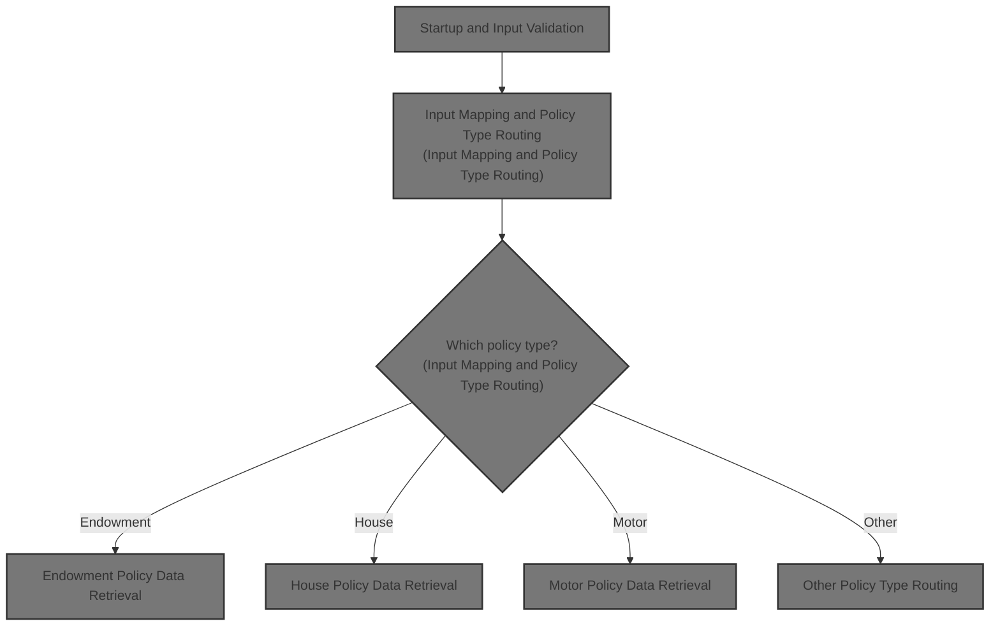
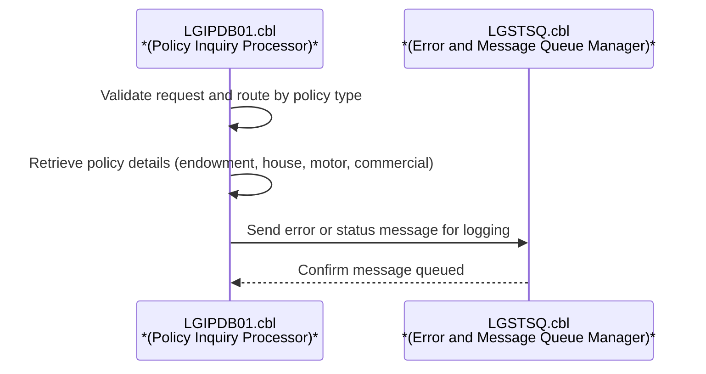
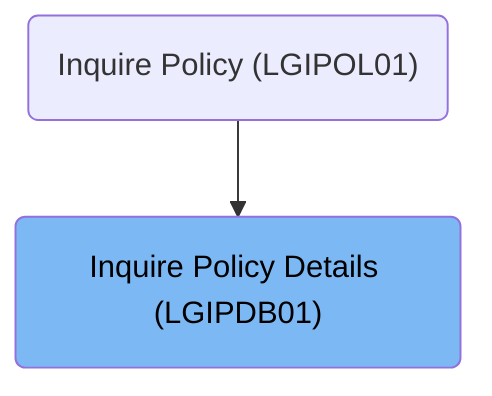
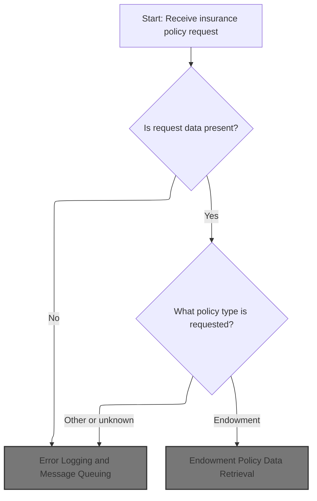
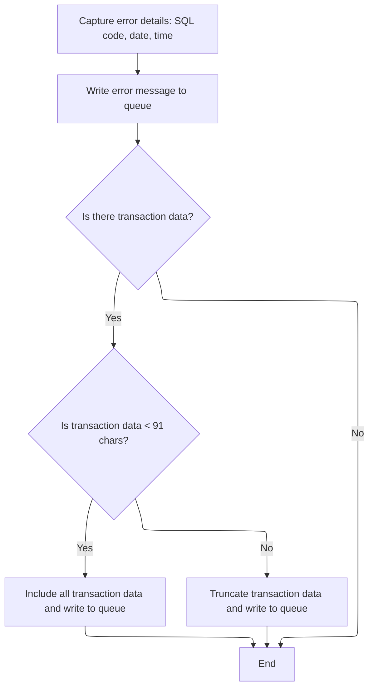
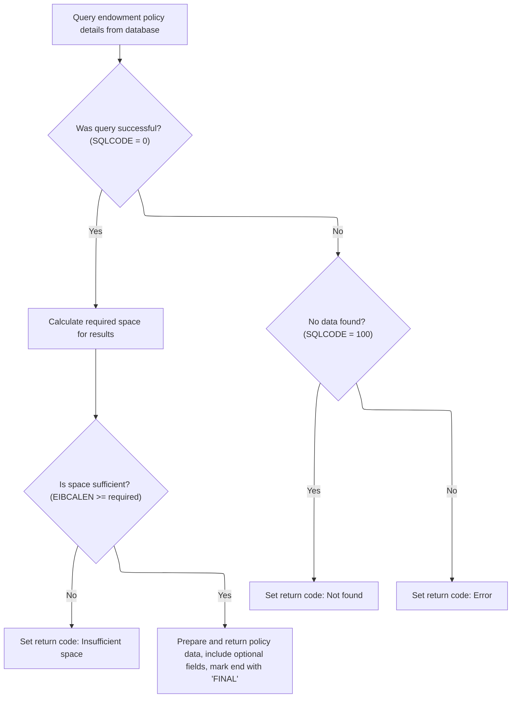
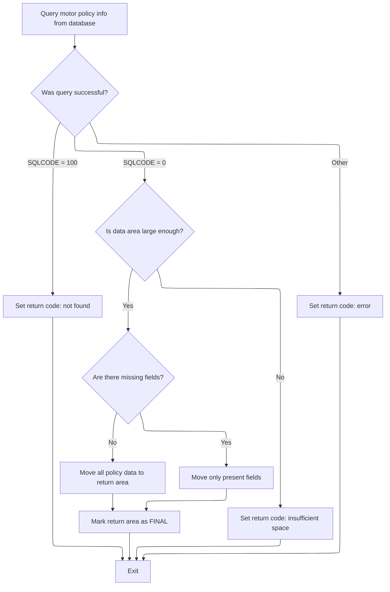

# Overview

This document describes the flow for handling insurance policy inquiries. Incoming requests are validated, routed by policy type, and result in detailed policy information or error codes, supporting endowment, house, motor, and commercial policies.



# Technical Overview



## Dependencies

### Program

- LGSTSQ (<SwmPath>[base/src/lgstsq.cbl](base/src/lgstsq.cbl)</SwmPath>)

### Copybooks

- SQLCA
- LGPOLICY (<SwmPath>[base/src/lgpolicy.cpy](base/src/lgpolicy.cpy)</SwmPath>)
- LGCMAREA (<SwmPath>[base/src/lgcmarea.cpy](base/src/lgcmarea.cpy)</SwmPath>)

# Where is this program used?

This program is used once, as represented in the following diagram:



## Input and Output Tables/Files used in the Program

| Table / File Name | Type                                                                                                                    | Description                                                         | Usage Mode | Key Fields / Layout Highlights                                                                                                                                                                                                                                                                                                                                                                                                                                                                                                                                                                                                                                                                                                                                                                                                                                                                                                                                                                                                                                                                                                                                                                                                                                                                                                                                                                                                                                                                                                                                                                                                                                                                                                                                                                                                                                                                                                                                                                                                                                                                                                                                                                                                                                                                                                                                                                                                                                                                                                                                                                                                                                                                                                                                                                                                                                                                                                                                                                                                                                                                                                                                                                                                                                                                                                                                                                                                                                                                                                                                                                                                                                                                                                                                                                                                                                                                                                                                                                                                                                                                                                                                                                                                                                                                                                                                                                                                                                                                                                                                                                                                                                                                                                                                                                                                                                                                                                                                                                                                                                                                                                                                                                                                                                                                                                                                                                                                                                                                                                                                                                                                                                                                                                                                                                                                                                                                                                                                                                                                                                                                                                                                                                                                                                                                                                                                                                                                                                                                                                                                                                                                                                                                                                                                                                                                                                                                                                                                                                                                                                                                                                                                                                                                                                                                                                                                                                                                                                                                                                                                                                                                                                                                                                                                                                                                                                                                                                                                                                                                                                                                                                                                                                                                                                                                                                                                                                                                                                                                                                                                                                                                                                                                                                                                                                                                                                                                                                                                                                                                                                                                                                                                                                                                                                                                                                                                                                                                                                                                                                                                                                                                                                                                                                                                                                                                                                                                                                                                                                                                                                                                                                                                                                                                                                                                                                                                                                                                                                                                                                                                                                                                                                                                                                                                                                                                                                                                                                                                                                                                                                                                                                                                                                                                                                                                                                                                                                                                                                                                                                                                                                                                                                                                                                                                                                                                                                                                                                                                                                                                                                                                                                                                                                                                                                                                                                                                                                                                                                                                                                                                                                                                                                                                                                                                                                                                                                                                                                  |
| ----------------- | ----------------------------------------------------------------------------------------------------------------------- | ------------------------------------------------------------------- | ---------- | ------------------------------------------------------------------------------------------------------------------------------------------------------------------------------------------------------------------------------------------------------------------------------------------------------------------------------------------------------------------------------------------------------------------------------------------------------------------------------------------------------------------------------------------------------------------------------------------------------------------------------------------------------------------------------------------------------------------------------------------------------------------------------------------------------------------------------------------------------------------------------------------------------------------------------------------------------------------------------------------------------------------------------------------------------------------------------------------------------------------------------------------------------------------------------------------------------------------------------------------------------------------------------------------------------------------------------------------------------------------------------------------------------------------------------------------------------------------------------------------------------------------------------------------------------------------------------------------------------------------------------------------------------------------------------------------------------------------------------------------------------------------------------------------------------------------------------------------------------------------------------------------------------------------------------------------------------------------------------------------------------------------------------------------------------------------------------------------------------------------------------------------------------------------------------------------------------------------------------------------------------------------------------------------------------------------------------------------------------------------------------------------------------------------------------------------------------------------------------------------------------------------------------------------------------------------------------------------------------------------------------------------------------------------------------------------------------------------------------------------------------------------------------------------------------------------------------------------------------------------------------------------------------------------------------------------------------------------------------------------------------------------------------------------------------------------------------------------------------------------------------------------------------------------------------------------------------------------------------------------------------------------------------------------------------------------------------------------------------------------------------------------------------------------------------------------------------------------------------------------------------------------------------------------------------------------------------------------------------------------------------------------------------------------------------------------------------------------------------------------------------------------------------------------------------------------------------------------------------------------------------------------------------------------------------------------------------------------------------------------------------------------------------------------------------------------------------------------------------------------------------------------------------------------------------------------------------------------------------------------------------------------------------------------------------------------------------------------------------------------------------------------------------------------------------------------------------------------------------------------------------------------------------------------------------------------------------------------------------------------------------------------------------------------------------------------------------------------------------------------------------------------------------------------------------------------------------------------------------------------------------------------------------------------------------------------------------------------------------------------------------------------------------------------------------------------------------------------------------------------------------------------------------------------------------------------------------------------------------------------------------------------------------------------------------------------------------------------------------------------------------------------------------------------------------------------------------------------------------------------------------------------------------------------------------------------------------------------------------------------------------------------------------------------------------------------------------------------------------------------------------------------------------------------------------------------------------------------------------------------------------------------------------------------------------------------------------------------------------------------------------------------------------------------------------------------------------------------------------------------------------------------------------------------------------------------------------------------------------------------------------------------------------------------------------------------------------------------------------------------------------------------------------------------------------------------------------------------------------------------------------------------------------------------------------------------------------------------------------------------------------------------------------------------------------------------------------------------------------------------------------------------------------------------------------------------------------------------------------------------------------------------------------------------------------------------------------------------------------------------------------------------------------------------------------------------------------------------------------------------------------------------------------------------------------------------------------------------------------------------------------------------------------------------------------------------------------------------------------------------------------------------------------------------------------------------------------------------------------------------------------------------------------------------------------------------------------------------------------------------------------------------------------------------------------------------------------------------------------------------------------------------------------------------------------------------------------------------------------------------------------------------------------------------------------------------------------------------------------------------------------------------------------------------------------------------------------------------------------------------------------------------------------------------------------------------------------------------------------------------------------------------------------------------------------------------------------------------------------------------------------------------------------------------------------------------------------------------------------------------------------------------------------------------------------------------------------------------------------------------------------------------------------------------------------------------------------------------------------------------------------------------------------------------------------------------------------------------------------------------------------------------------------------------------------------------------------------------------------------------------------------------------------------------------------------------------------------------------------------------------------------------------------------------------------------------------------------------------------------------------------------------------------------------------------------------------------------------------------------------------------------------------------------------------------------------------------------------------------------------------------------------------------------------------------------------------------------------------------------------------------------------------------------------------------------------------------------------------------------------------------------------------------------------------------------------------------------------------------------------------------------------------------------------------------------------------------------------------------------------------------------------------------------------------------------------------------------------------------------------------------------------------------------------------------------------------------------------------------------------------------------------------------------------------------------------------------------------------------------------------------------------------------------------------------------------------------------------------------------------------------------------------------------------------------------------------------------------------------------------------------------------------------------------------------------------------------------------------------------------------------------------------------------------------------------------------------------------------------------------------------------------------------------------------------------------------------------------------------------------------------------------------------------------------------------------------------------------------------------------------------------------------------------------------------------------------------------------------------------------------------------------------------------------------------------------------------------------------------------------------------------------------------------------------------------------------------------------------------------------------------------------------------------------------------------------------------------------------------------------------------------------------------------------------------------------------------------------------------------------------------------------------------------------------------------------------------------------------------------------------------------------------------------------------------------------------------------------------------------------------------------------------------------------------------------------------------------------------------------------------------------------------------------------------------------------------------------------------------------------------------------------------------------------------------------------------------------------------------------------------------------------------------------------------------------------------------------------------------------------------------------------------------------------------------------------------------------------------------------------------------------------------------------------------------------------------------------------------------------------------------------------------------------------------------------------------------------------------------------------------------------------------------------------------------- |
| POLICY            | <SwmToken path="base/src/lgipdb01.cbl" pos="242:5:5" line-data="      * initialize DB2 host variables">`DB2`</SwmToken> | Insurance policy master data: type, number, dates, broker, payment. | Input      | <SwmToken path="base/src/lgipdb01.cbl" pos="92:1:1" line-data="                   CustomerNumber,">`CustomerNumber`</SwmToken>, <SwmToken path="base/src/lgipdb01.cbl" pos="93:3:3" line-data="                   Policy.PolicyNumber,">`PolicyNumber`</SwmToken>, <SwmToken path="base/src/lgipdb01.cbl" pos="94:1:1" line-data="                   RequestDate,">`RequestDate`</SwmToken>, <SwmToken path="base/src/lgipdb01.cbl" pos="95:1:1" line-data="                   StartDate,">`StartDate`</SwmToken>, <SwmToken path="base/src/lgipdb01.cbl" pos="96:1:1" line-data="                   RenewalDate,">`RenewalDate`</SwmToken>, <SwmToken path="base/src/lgipdb01.cbl" pos="97:1:1" line-data="                   Address,">`Address`</SwmToken>, <SwmToken path="base/src/lgipdb01.cbl" pos="98:1:1" line-data="                   Zipcode,">`Zipcode`</SwmToken>, <SwmToken path="base/src/lgipdb01.cbl" pos="99:1:1" line-data="                   LatitudeN,">`LatitudeN`</SwmToken>, <SwmToken path="base/src/lgipdb01.cbl" pos="100:1:1" line-data="                   LongitudeW,">`LongitudeW`</SwmToken>, <SwmToken path="base/src/lgipdb01.cbl" pos="101:1:1" line-data="                   Customer,">`Customer`</SwmToken>, <SwmToken path="base/src/lgipdb01.cbl" pos="102:1:1" line-data="                   PropertyType,">`PropertyType`</SwmToken>, <SwmToken path="base/src/lgipdb01.cbl" pos="103:1:1" line-data="                   FirePeril,">`FirePeril`</SwmToken>, <SwmToken path="base/src/lgipdb01.cbl" pos="104:1:1" line-data="                   FirePremium,">`FirePremium`</SwmToken>, <SwmToken path="base/src/lgipdb01.cbl" pos="105:1:1" line-data="                   CrimePeril,">`CrimePeril`</SwmToken>, <SwmToken path="base/src/lgipdb01.cbl" pos="106:1:1" line-data="                   CrimePremium,">`CrimePremium`</SwmToken>, <SwmToken path="base/src/lgipdb01.cbl" pos="107:1:1" line-data="                   FloodPeril,">`FloodPeril`</SwmToken>, <SwmToken path="base/src/lgipdb01.cbl" pos="108:1:1" line-data="                   FloodPremium,">`FloodPremium`</SwmToken>, <SwmToken path="base/src/lgipdb01.cbl" pos="109:1:1" line-data="                   WeatherPeril,">`WeatherPeril`</SwmToken>, <SwmToken path="base/src/lgipdb01.cbl" pos="110:1:1" line-data="                   WeatherPremium,">`WeatherPremium`</SwmToken>, <SwmToken path="base/src/lgipdb01.cbl" pos="111:1:1" line-data="                   Status,">`Status`</SwmToken>, <SwmToken path="base/src/lgipdb01.cbl" pos="112:1:1" line-data="                   RejectionReason">`RejectionReason`</SwmToken>, <SwmToken path="base/src/lgipdb01.cbl" pos="331:3:3" line-data="             SELECT  ISSUEDATE,">`ISSUEDATE`</SwmToken>, <SwmToken path="base/src/lgipdb01.cbl" pos="332:1:1" line-data="                     EXPIRYDATE,">`EXPIRYDATE`</SwmToken>, <SwmToken path="base/src/lgipdb01.cbl" pos="333:1:1" line-data="                     LASTCHANGED,">`LASTCHANGED`</SwmToken>, <SwmToken path="base/src/lgipdb01.cbl" pos="334:1:1" line-data="                     BROKERID,">`BROKERID`</SwmToken>, <SwmToken path="base/src/lgipdb01.cbl" pos="335:1:1" line-data="                     BROKERSREFERENCE,">`BROKERSREFERENCE`</SwmToken>, <SwmToken path="base/src/lgipdb01.cbl" pos="336:1:1" line-data="                     PAYMENT,">`PAYMENT`</SwmToken>, <SwmToken path="base/src/lgipdb01.cbl" pos="337:1:1" line-data="                     WITHPROFITS,">`WITHPROFITS`</SwmToken>, <SwmToken path="base/src/lgipdb01.cbl" pos="338:1:1" line-data="                     EQUITIES,">`EQUITIES`</SwmToken>, <SwmToken path="base/src/lgipdb01.cbl" pos="339:1:1" line-data="                     MANAGEDFUND,">`MANAGEDFUND`</SwmToken>, <SwmToken path="base/src/lgipdb01.cbl" pos="340:1:1" line-data="                     FUNDNAME,">`FUNDNAME`</SwmToken>, <SwmToken path="base/src/lgipdb01.cbl" pos="341:1:1" line-data="                     TERM,">`TERM`</SwmToken>, <SwmToken path="base/src/lgipdb01.cbl" pos="342:1:1" line-data="                     SUMASSURED,">`SUMASSURED`</SwmToken>, <SwmToken path="base/src/lgipdb01.cbl" pos="343:1:1" line-data="                     LIFEASSURED,">`LIFEASSURED`</SwmToken>, <SwmToken path="base/src/lgipdb01.cbl" pos="344:1:1" line-data="                     PADDINGDATA,">`PADDINGDATA`</SwmToken>, <SwmToken path="base/src/lgipdb01.cbl" pos="345:1:1" line-data="                     LENGTH(PADDINGDATA)">`LENGTH`</SwmToken>, <SwmToken path="base/src/lgipdb01.cbl" pos="347:2:4" line-data="                   :DB2-EXPIRYDATE,">`DB2-EXPIRYDATE`</SwmToken>, <SwmToken path="base/src/lgipdb01.cbl" pos="348:2:4" line-data="                   :DB2-LASTCHANGED,">`DB2-LASTCHANGED`</SwmToken>, <SwmToken path="base/src/lgipdb01.cbl" pos="349:11:13" line-data="                   :DB2-BROKERID-INT INDICATOR :IND-BROKERID,">`IND-BROKERID`</SwmToken>, <SwmToken path="base/src/lgipdb01.cbl" pos="350:9:11" line-data="                   :DB2-BROKERSREF INDICATOR :IND-BROKERSREF,">`IND-BROKERSREF`</SwmToken>, <SwmToken path="base/src/lgipdb01.cbl" pos="351:11:13" line-data="                   :DB2-PAYMENT-INT INDICATOR :IND-PAYMENT,">`IND-PAYMENT`</SwmToken>, <SwmToken path="base/src/lgipdb01.cbl" pos="352:2:6" line-data="                   :DB2-E-WITHPROFITS,">`DB2-E-WITHPROFITS`</SwmToken>, <SwmToken path="base/src/lgipdb01.cbl" pos="353:2:6" line-data="                   :DB2-E-EQUITIES,">`DB2-E-EQUITIES`</SwmToken>, <SwmToken path="base/src/lgipdb01.cbl" pos="354:2:6" line-data="                   :DB2-E-MANAGEDFUND,">`DB2-E-MANAGEDFUND`</SwmToken>, <SwmToken path="base/src/lgipdb01.cbl" pos="355:2:6" line-data="                   :DB2-E-FUNDNAME,">`DB2-E-FUNDNAME`</SwmToken>, <SwmToken path="base/src/lgipdb01.cbl" pos="356:2:8" line-data="                   :DB2-E-TERM-SINT,">`DB2-E-TERM-SINT`</SwmToken>, <SwmToken path="base/src/lgipdb01.cbl" pos="357:2:8" line-data="                   :DB2-E-SUMASSURED-INT,">`DB2-E-SUMASSURED-INT`</SwmToken>, <SwmToken path="base/src/lgipdb01.cbl" pos="358:2:6" line-data="                   :DB2-E-LIFEASSURED,">`DB2-E-LIFEASSURED`</SwmToken>, <SwmToken path="base/src/lgipdb01.cbl" pos="359:11:15" line-data="                   :DB2-E-PADDINGDATA INDICATOR :IND-E-PADDINGDATA,">`IND-E-PADDINGDATA`</SwmToken>, <SwmToken path="base/src/lgipdb01.cbl" pos="360:13:17" line-data="                   :DB2-E-PADDING-LEN INDICATOR :IND-E-PADDINGDATAL">`IND-E-PADDINGDATAL`</SwmToken>, <SwmToken path="base/src/lgipdb01.cbl" pos="451:1:1" line-data="                     PROPERTYTYPE,">`PROPERTYTYPE`</SwmToken>, <SwmToken path="base/src/lgipdb01.cbl" pos="452:1:1" line-data="                     BEDROOMS,">`BEDROOMS`</SwmToken>, <SwmToken path="base/src/lgipdb01.cbl" pos="453:1:1" line-data="                     VALUE,">`VALUE`</SwmToken>, <SwmToken path="base/src/lgipdb01.cbl" pos="454:1:1" line-data="                     HOUSENAME,">`HOUSENAME`</SwmToken>, <SwmToken path="base/src/lgipdb01.cbl" pos="455:1:1" line-data="                     HOUSENUMBER,">`HOUSENUMBER`</SwmToken>, <SwmToken path="base/src/lgipdb01.cbl" pos="346:4:6" line-data="             INTO  :DB2-ISSUEDATE,">`DB2-ISSUEDATE`</SwmToken>, <SwmToken path="base/src/lgipdb01.cbl" pos="463:2:6" line-data="                   :DB2-H-PROPERTYTYPE,">`DB2-H-PROPERTYTYPE`</SwmToken>, <SwmToken path="base/src/lgipdb01.cbl" pos="464:2:8" line-data="                   :DB2-H-BEDROOMS-SINT,">`DB2-H-BEDROOMS-SINT`</SwmToken>, <SwmToken path="base/src/lgipdb01.cbl" pos="465:2:8" line-data="                   :DB2-H-VALUE-INT,">`DB2-H-VALUE-INT`</SwmToken>, <SwmToken path="base/src/lgipdb01.cbl" pos="466:2:6" line-data="                   :DB2-H-HOUSENAME,">`DB2-H-HOUSENAME`</SwmToken>, <SwmToken path="base/src/lgipdb01.cbl" pos="467:2:6" line-data="                   :DB2-H-HOUSENUMBER,">`DB2-H-HOUSENUMBER`</SwmToken>, <SwmToken path="base/src/lgipdb01.cbl" pos="468:2:6" line-data="                   :DB2-H-POSTCODE">`DB2-H-POSTCODE`</SwmToken>, <SwmToken path="base/src/lgipdb01.cbl" pos="539:1:1" line-data="                     MAKE,">`MAKE`</SwmToken>, <SwmToken path="base/src/lgipdb01.cbl" pos="540:1:1" line-data="                     MODEL,">`MODEL`</SwmToken>, <SwmToken path="base/src/lgipdb01.cbl" pos="542:1:1" line-data="                     REGNUMBER,">`REGNUMBER`</SwmToken>, <SwmToken path="base/src/lgipdb01.cbl" pos="543:1:1" line-data="                     COLOUR,">`COLOUR`</SwmToken>, <SwmToken path="base/src/lgipdb01.cbl" pos="544:1:1" line-data="                     CC,">`CC`</SwmToken>, <SwmToken path="base/src/lgipdb01.cbl" pos="545:1:1" line-data="                     YEAROFMANUFACTURE,">`YEAROFMANUFACTURE`</SwmToken>, <SwmToken path="base/src/lgipdb01.cbl" pos="546:1:1" line-data="                     PREMIUM,">`PREMIUM`</SwmToken>, <SwmToken path="base/src/lgipdb01.cbl" pos="554:2:6" line-data="                   :DB2-M-MAKE,">`DB2-M-MAKE`</SwmToken>, <SwmToken path="base/src/lgipdb01.cbl" pos="555:2:6" line-data="                   :DB2-M-MODEL,">`DB2-M-MODEL`</SwmToken>, <SwmToken path="base/src/lgipdb01.cbl" pos="556:2:8" line-data="                   :DB2-M-VALUE-INT,">`DB2-M-VALUE-INT`</SwmToken>, <SwmToken path="base/src/lgipdb01.cbl" pos="557:2:6" line-data="                   :DB2-M-REGNUMBER,">`DB2-M-REGNUMBER`</SwmToken>, <SwmToken path="base/src/lgipdb01.cbl" pos="558:2:6" line-data="                   :DB2-M-COLOUR,">`DB2-M-COLOUR`</SwmToken>, <SwmToken path="base/src/lgipdb01.cbl" pos="559:2:8" line-data="                   :DB2-M-CC-SINT,">`DB2-M-CC-SINT`</SwmToken>, <SwmToken path="base/src/lgipdb01.cbl" pos="560:2:6" line-data="                   :DB2-M-MANUFACTURED,">`DB2-M-MANUFACTURED`</SwmToken>, <SwmToken path="base/src/lgipdb01.cbl" pos="561:2:8" line-data="                   :DB2-M-PREMIUM-INT,">`DB2-M-PREMIUM-INT`</SwmToken>, <SwmToken path="base/src/lgipdb01.cbl" pos="562:2:8" line-data="                   :DB2-M-ACCIDENTS-INT">`DB2-M-ACCIDENTS-INT`</SwmToken>, <SwmToken path="base/src/lgipdb01.cbl" pos="655:2:6" line-data="                   :DB2-B-Address,">`DB2-B-Address`</SwmToken>, <SwmToken path="base/src/lgipdb01.cbl" pos="656:2:6" line-data="                   :DB2-B-Postcode,">`DB2-B-Postcode`</SwmToken>, <SwmToken path="base/src/lgipdb01.cbl" pos="657:2:6" line-data="                   :DB2-B-Latitude,">`DB2-B-Latitude`</SwmToken>, <SwmToken path="base/src/lgipdb01.cbl" pos="658:2:6" line-data="                   :DB2-B-Longitude,">`DB2-B-Longitude`</SwmToken>, <SwmToken path="base/src/lgipdb01.cbl" pos="659:2:6" line-data="                   :DB2-B-Customer,">`DB2-B-Customer`</SwmToken>, <SwmToken path="base/src/lgipdb01.cbl" pos="660:2:6" line-data="                   :DB2-B-PropType,">`DB2-B-PropType`</SwmToken>, <SwmToken path="base/src/lgipdb01.cbl" pos="182:3:9" line-data="           03 DB2-B-FirePeril-Int      PIC S9(4) COMP.">`DB2-B-FirePeril-Int`</SwmToken>, <SwmToken path="base/src/lgipdb01.cbl" pos="183:3:9" line-data="           03 DB2-B-FirePremium-Int    PIC S9(9) COMP.">`DB2-B-FirePremium-Int`</SwmToken>, <SwmToken path="base/src/lgipdb01.cbl" pos="184:3:9" line-data="           03 DB2-B-CrimePeril-Int     PIC S9(4) COMP.">`DB2-B-CrimePeril-Int`</SwmToken>, <SwmToken path="base/src/lgipdb01.cbl" pos="185:3:9" line-data="           03 DB2-B-CrimePremium-Int   PIC S9(9) COMP.">`DB2-B-CrimePremium-Int`</SwmToken>, <SwmToken path="base/src/lgipdb01.cbl" pos="186:3:9" line-data="           03 DB2-B-FloodPeril-Int     PIC S9(4) COMP.">`DB2-B-FloodPeril-Int`</SwmToken>, <SwmToken path="base/src/lgipdb01.cbl" pos="187:3:9" line-data="           03 DB2-B-FloodPremium-Int   PIC S9(9) COMP.">`DB2-B-FloodPremium-Int`</SwmToken>, <SwmToken path="base/src/lgipdb01.cbl" pos="188:3:9" line-data="           03 DB2-B-WeatherPeril-Int   PIC S9(4) COMP.">`DB2-B-WeatherPeril-Int`</SwmToken>, <SwmToken path="base/src/lgipdb01.cbl" pos="189:3:9" line-data="           03 DB2-B-WeatherPremium-Int PIC S9(9) COMP.">`DB2-B-WeatherPremium-Int`</SwmToken>, <SwmToken path="base/src/lgipdb01.cbl" pos="190:3:9" line-data="           03 DB2-B-Status-Int         PIC S9(4) COMP.">`DB2-B-Status-Int`</SwmToken>, <SwmToken path="base/src/lgipdb01.cbl" pos="670:2:6" line-data="                   :DB2-B-RejectReason">`DB2-B-RejectReason`</SwmToken>, <SwmToken path="base/src/lgipdb01.cbl" pos="263:11:15" line-data="           MOVE CA-CUSTOMER-NUM TO DB2-CUSTOMERNUM-INT">`DB2-CUSTOMERNUM-INT`</SwmToken> |

&nbsp;

# Workflow

# Startup and Input Validation



This section acts as the entry point for insurance policy requests, ensuring all required data and environment setup are in place before any business logic is executed. It validates the presence of input data and routes requests based on policy type, handling errors and unsupported requests appropriately.

| Category       | Rule Name                | Description                                                                                                                              |
| -------------- | ------------------------ | ---------------------------------------------------------------------------------------------------------------------------------------- |
| Business logic | Endowment policy routing | If the requested policy type is 'Endowment', the system must retrieve endowment policy data for the customer and policy number provided. |

<SwmSnippet path="/base/src/lgipdb01.cbl" line="230">

---

In <SwmToken path="base/src/lgipdb01.cbl" pos="230:1:1" line-data="       MAINLINE SECTION.">`MAINLINE`</SwmToken>, this is where we set up all the local and DB2-related buffers, copy the transaction IDs, and prep the environment for the rest of the logic. It’s just the entry point, making sure everything is clean before we touch any real data.

```cobol
       MAINLINE SECTION.

      *----------------------------------------------------------------*
      * Common code                                                    *
      *----------------------------------------------------------------*
      * initialize working storage variables
           INITIALIZE WS-HEADER.
      * set up general variable
           MOVE EIBTRNID TO WS-TRANSID.
           MOVE EIBTRMID TO WS-TERMID.
           MOVE EIBTASKN TO WS-TASKNUM.
      *----------------------------------------------------------------*
      * initialize DB2 host variables
           INITIALIZE DB2-IN-INTEGERS.
           INITIALIZE DB2-OUT-INTEGERS.
           INITIALIZE DB2-POLICY.
```

---

</SwmSnippet>

<SwmSnippet path="/base/src/lgipdb01.cbl" line="251">

---

If there’s no input, we log it and abort right away.

```cobol
           IF EIBCALEN IS EQUAL TO ZERO
             MOVE ' NO COMMAREA RECEIVED' TO EM-VARIABLE
             PERFORM WRITE-ERROR-MESSAGE
             EXEC CICS ABEND ABCODE('LGCA') NODUMP END-EXEC
           END-IF
```

---

</SwmSnippet>

## Error Logging and Message Queuing



This section is responsible for capturing error context from SQL operations, formatting the error message, and ensuring it is reliably logged and queued for downstream processing. It also handles the inclusion and truncation of transaction data as needed.

| Category        | Rule Name                            | Description                                                                                                                                                                                                                                                                                                                                                                                                             |
| --------------- | ------------------------------------ | ----------------------------------------------------------------------------------------------------------------------------------------------------------------------------------------------------------------------------------------------------------------------------------------------------------------------------------------------------------------------------------------------------------------------- |
| Data validation | Message format standardization       | Error messages must be formatted according to the defined <SwmToken path="base/src/lgipdb01.cbl" pos="1011:3:5" line-data="                     COMMAREA(ERROR-MSG)">`ERROR-MSG`</SwmToken> and <SwmToken path="base/src/lgipdb01.cbl" pos="1019:3:7" line-data="                         COMMAREA(CA-ERROR-MSG)">`CA-ERROR-MSG`</SwmToken> structures to ensure consistency and compatibility with downstream systems. |
| Business logic  | Error context completeness           | Every error message must include the SQL code, current date, and current time to provide full error context.                                                                                                                                                                                                                                                                                                            |
| Business logic  | Dual queue logging                   | Error messages must be written to both the transient data queue (TDQ) and the temporary storage queue (TSQ) to guarantee reliable logging and message availability.                                                                                                                                                                                                                                                     |
| Business logic  | Transaction data truncation          | If transaction data (commarea) is present, up to 90 bytes must be included in the error message; if the data exceeds 90 bytes, it must be truncated to 90 bytes.                                                                                                                                                                                                                                                        |
| Business logic  | Conditional transaction data logging | If no transaction data is present, only the error context (SQL code, date, time) is logged.                                                                                                                                                                                                                                                                                                                             |

<SwmSnippet path="/base/src/lgipdb01.cbl" line="997">

---

In <SwmToken path="base/src/lgipdb01.cbl" pos="997:1:5" line-data="       WRITE-ERROR-MESSAGE.">`WRITE-ERROR-MESSAGE`</SwmToken>, we grab the SQLCODE, get the current <SwmToken path="base/src/lgipdb01.cbl" pos="42:7:9" line-data="      * Variables for time/date processing">`time/date`</SwmToken> using CICS ASKTIME/FORMATTIME, and stash those in the error message struct. This sets up the error context before we queue it.

```cobol
       WRITE-ERROR-MESSAGE.
      * Save SQLCODE in message
           MOVE SQLCODE TO EM-SQLRC
      * Obtain and format current time and date
           EXEC CICS ASKTIME ABSTIME(ABS-TIME)
           END-EXEC
           EXEC CICS FORMATTIME ABSTIME(ABS-TIME)
                     MMDDYYYY(DATE1)
                     TIME(TIME1)
           END-EXEC
```

---

</SwmSnippet>

<SwmSnippet path="/base/src/lgipdb01.cbl" line="1007">

---

After prepping the error message, we call LGSTSQ using CICS LINK to actually queue the error. This hands off the formatted error and context to the queue manager for logging.

```cobol
           MOVE DATE1 TO EM-DATE
           MOVE TIME1 TO EM-TIME
      * Write output message to TDQ
           EXEC CICS LINK PROGRAM('LGSTSQ')
                     COMMAREA(ERROR-MSG)
                     LENGTH(LENGTH OF ERROR-MSG)
           END-EXEC.
```

---

</SwmSnippet>

<SwmSnippet path="/base/src/lgstsq.cbl" line="55">

---

<SwmToken path="base/src/lgstsq.cbl" pos="55:1:1" line-data="       MAINLINE SECTION.">`MAINLINE`</SwmToken> in LGSTSQ sets up the message source, handles protocol-specific tweaks (like 'Q='), and writes the message to both TDQ and TSQ. If it’s a received message, it sends a quick response back. This covers all message routing and queueing.

```cobol
       MAINLINE SECTION.

           MOVE SPACES TO WRITE-MSG.
           MOVE SPACES TO WS-RECV.

           EXEC CICS ASSIGN SYSID(WRITE-MSG-SYSID)
                RESP(WS-RESP)
           END-EXEC.

           EXEC CICS ASSIGN INVOKINGPROG(WS-INVOKEPROG)
                RESP(WS-RESP)
           END-EXEC.
           
           IF WS-INVOKEPROG NOT = SPACES
              MOVE 'C' To WS-FLAG
              MOVE COMMA-DATA  TO WRITE-MSG-MSG
              MOVE EIBCALEN    TO WS-RECV-LEN
           ELSE
              EXEC CICS RECEIVE INTO(WS-RECV)
                  LENGTH(WS-RECV-LEN)
                  RESP(WS-RESP)
              END-EXEC
              MOVE 'R' To WS-FLAG
              MOVE WS-RECV-DATA  TO WRITE-MSG-MSG
              SUBTRACT 5 FROM WS-RECV-LEN
           END-IF.

           MOVE 'GENAERRS' TO STSQ-NAME.
           IF WRITE-MSG-MSG(1:2) = 'Q=' THEN
              MOVE WRITE-MSG-MSG(3:4) TO STSQ-EXT
              MOVE WRITE-MSG-REST TO TEMPO
              MOVE TEMPO          TO WRITE-MSG-MSG
              SUBTRACT 7 FROM WS-RECV-LEN
           END-IF.

           ADD 5 TO WS-RECV-LEN.

      * Write output message to TDQ CSMT
      *
           EXEC CICS WRITEQ TD QUEUE(STDQ-NAME)
                     FROM(WRITE-MSG)
                     RESP(WS-RESP)
                     LENGTH(WS-RECV-LEN)

           END-EXEC.

      * Write output message to Genapp TSQ
      * If no space is available then the task will not wait for
      *  storage to become available but will ignore the request...
      *
           EXEC CICS WRITEQ TS QUEUE(STSQ-NAME)
                     FROM(WRITE-MSG)
                     RESP(WS-RESP)
                     NOSUSPEND
                     LENGTH(WS-RECV-LEN)

           END-EXEC.

           If WS-FLAG = 'R' Then
             EXEC CICS SEND TEXT FROM(FILLER-X)
              WAIT
              ERASE
              LENGTH(1)
              FREEKB
             END-EXEC.

           EXEC CICS RETURN
           END-EXEC.
```

---

</SwmSnippet>

<SwmSnippet path="/base/src/lgipdb01.cbl" line="1015">

---

After returning from LGSTSQ, <SwmToken path="base/src/lgipdb01.cbl" pos="253:3:7" line-data="             PERFORM WRITE-ERROR-MESSAGE">`WRITE-ERROR-MESSAGE`</SwmToken> checks if there’s commarea data to log. If so, it writes up to 90 bytes of it to the queue using LGSTSQ again. This makes sure we capture any relevant transaction context, but anything longer gets chopped.

```cobol
           IF EIBCALEN > 0 THEN
             IF EIBCALEN < 91 THEN
               MOVE DFHCOMMAREA(1:EIBCALEN) TO CA-DATA
               EXEC CICS LINK PROGRAM('LGSTSQ')
                         COMMAREA(CA-ERROR-MSG)
                         LENGTH(LENGTH OF CA-ERROR-MSG)
               END-EXEC
             ELSE
               MOVE DFHCOMMAREA(1:90) TO CA-DATA
               EXEC CICS LINK PROGRAM('LGSTSQ')
                         COMMAREA(CA-ERROR-MSG)
                         LENGTH(LENGTH OF CA-ERROR-MSG)
               END-EXEC
             END-IF
           END-IF.
           EXIT.
```

---

</SwmSnippet>

## Input Mapping and Policy Type Routing

<SwmSnippet path="/base/src/lgipdb01.cbl" line="258">

---

Back in MAINLINE after <SwmToken path="base/src/lgipdb01.cbl" pos="253:3:7" line-data="             PERFORM WRITE-ERROR-MESSAGE">`WRITE-ERROR-MESSAGE`</SwmToken>, we reset the return code, map the input fields to <SwmToken path="base/src/lgipdb01.cbl" pos="262:17:17" line-data="      * Convert commarea customer &amp; policy nums to DB2 integer format">`DB2`</SwmToken> integer format, and prep the request ID for routing. This sets up the next step for policy type handling.

```cobol
           MOVE '00' TO CA-RETURN-CODE
           MOVE EIBCALEN TO WS-CALEN
           SET WS-ADDR-DFHCOMMAREA TO ADDRESS OF DFHCOMMAREA

      * Convert commarea customer & policy nums to DB2 integer format
           MOVE CA-CUSTOMER-NUM TO DB2-CUSTOMERNUM-INT
           MOVE CA-POLICY-NUM   TO DB2-POLICYNUM-INT
      * and save in error msg field incase required
           MOVE CA-CUSTOMER-NUM TO EM-CUSNUM
           MOVE CA-POLICY-NUM   TO EM-POLNUM

      *----------------------------------------------------------------*
      * Check which policy type is being requested                     *
      * This is not actually required whilst only endowment policy     *
      * inquires are supported, but will make future expansion simpler *
      *----------------------------------------------------------------*
      * Upper case value passed in Request Id field                    *
           MOVE FUNCTION UPPER-CASE(CA-REQUEST-ID) TO WS-REQUEST-ID
```

---

</SwmSnippet>

<SwmSnippet path="/base/src/lgipdb01.cbl" line="277">

---

Here we route based on the request ID. If it’s for an endowment policy, we set up the buffers and call <SwmToken path="base/src/lgipdb01.cbl" pos="281:3:9" line-data="               PERFORM GET-ENDOW-DB2-INFO">`GET-ENDOW-DB2-INFO`</SwmToken> to fetch the details.

```cobol
           EVALUATE WS-REQUEST-ID

             WHEN '01IEND'
               INITIALIZE DB2-ENDOWMENT
               PERFORM GET-ENDOW-DB2-INFO
```

---

</SwmSnippet>

## Endowment Policy Data Retrieval



This section is responsible for retrieving and returning all relevant endowment policy data for a given customer and policy number, ensuring that only valid and present fields are included, and handling errors and buffer sizing appropriately.

| Category        | Rule Name                      | Description                                                                                                                                                              |
| --------------- | ------------------------------ | ------------------------------------------------------------------------------------------------------------------------------------------------------------------------ |
| Data validation | Valid policy match required    | Only return policy data if both customer number and policy number match records in the POLICY and ENDOWMENT tables.                                                      |
| Data validation | Buffer size enforcement        | If the output buffer (commarea) is too small to hold all required data, set the return code to '98' for 'Insufficient space' and do not return policy data.              |
| Business logic  | Optional field inclusion       | Include optional fields (such as BROKERID, PAYMENT, PADDINGDATA) in the output only if they are present and not NULL in the database.                                    |
| Business logic  | End of data marker             | Mark the end of returned policy data with a 'FINAL' indicator so the caller can reliably detect the end of the data.                                                     |
| Business logic  | Output buffer size calculation | Calculate the required output buffer size by adding fixed header/trailer length (+33) and full endowment length (+124), plus any variable-length field sizes if present. |

<SwmSnippet path="/base/src/lgipdb01.cbl" line="327">

---

In <SwmToken path="base/src/lgipdb01.cbl" pos="327:1:7" line-data="       GET-ENDOW-DB2-INFO.">`GET-ENDOW-DB2-INFO`</SwmToken>, we run a SELECT to grab all the policy and endowment fields we need. Indicator variables are set up for nullable fields, and we stash the SQL request string for error tracking.

```cobol
       GET-ENDOW-DB2-INFO.

           MOVE ' SELECT ENDOW ' TO EM-SQLREQ
           EXEC SQL
             SELECT  ISSUEDATE,
                     EXPIRYDATE,
                     LASTCHANGED,
                     BROKERID,
                     BROKERSREFERENCE,
                     PAYMENT,
                     WITHPROFITS,
                     EQUITIES,
                     MANAGEDFUND,
                     FUNDNAME,
                     TERM,
                     SUMASSURED,
                     LIFEASSURED,
                     PADDINGDATA,
                     LENGTH(PADDINGDATA)
             INTO  :DB2-ISSUEDATE,
                   :DB2-EXPIRYDATE,
                   :DB2-LASTCHANGED,
                   :DB2-BROKERID-INT INDICATOR :IND-BROKERID,
                   :DB2-BROKERSREF INDICATOR :IND-BROKERSREF,
                   :DB2-PAYMENT-INT INDICATOR :IND-PAYMENT,
                   :DB2-E-WITHPROFITS,
                   :DB2-E-EQUITIES,
                   :DB2-E-MANAGEDFUND,
                   :DB2-E-FUNDNAME,
                   :DB2-E-TERM-SINT,
                   :DB2-E-SUMASSURED-INT,
                   :DB2-E-LIFEASSURED,
                   :DB2-E-PADDINGDATA INDICATOR :IND-E-PADDINGDATA,
                   :DB2-E-PADDING-LEN INDICATOR :IND-E-PADDINGDATAL
             FROM  POLICY,ENDOWMENT
             WHERE ( POLICY.POLICYNUMBER =
                        ENDOWMENT.POLICYNUMBER   AND
                     POLICY.CUSTOMERNUMBER =
                        :DB2-CUSTOMERNUM-INT             AND
                     POLICY.POLICYNUMBER =
                        :DB2-POLICYNUM-INT               )
           END-EXEC
```

---

</SwmSnippet>

<SwmSnippet path="/base/src/lgipdb01.cbl" line="370">

---

After a successful SELECT, we add up the fixed header/trailer and policy lengths to figure out how big the output buffer needs to be. This sets up the next step for handling variable-length fields.

```cobol
           IF SQLCODE = 0
      *      Select was successful

      *      Calculate size of commarea required to return all data
             ADD WS-CA-HEADERTRAILER-LEN TO WS-REQUIRED-CA-LEN
             ADD WS-FULL-ENDOW-LEN       TO WS-REQUIRED-CA-LEN
```

---

</SwmSnippet>

<SwmSnippet path="/base/src/lgipdb01.cbl" line="383">

---

If the variable-length PADDINGDATA field is present, we bump up the buffer size and the position marker so we can copy just the valid data. If it’s NULL, we skip it.

```cobol
             IF IND-E-PADDINGDATAL NOT EQUAL MINUS-ONE
               ADD DB2-E-PADDING-LEN TO WS-REQUIRED-CA-LEN
               ADD DB2-E-PADDING-LEN TO END-POLICY-POS
             END-IF
```

---

</SwmSnippet>

<SwmSnippet path="/base/src/lgipdb01.cbl" line="390">

---

If the commarea is too small, we bail out with an error code. Otherwise, we copy only the <SwmToken path="base/src/lgipdb01.cbl" pos="398:3:3" line-data="                 MOVE DB2-BROKERID-INT    TO DB2-BROKERID">`DB2`</SwmToken> fields that aren’t NULL, using the indicator variables to skip any missing data.

```cobol
             IF EIBCALEN IS LESS THAN WS-REQUIRED-CA-LEN
               MOVE '98' TO CA-RETURN-CODE
               EXEC CICS RETURN END-EXEC
             ELSE
      *        Length is sufficent so move data to commarea
      *        Move Integer fields to required length numerics
      *        Don't move null fields
               IF IND-BROKERID NOT EQUAL MINUS-ONE
                 MOVE DB2-BROKERID-INT    TO DB2-BROKERID
               END-IF
```

---

</SwmSnippet>

<SwmSnippet path="/base/src/lgipdb01.cbl" line="400">

---

We do the same check for PAYMENT—only copy it if the indicator says it’s valid. This keeps the output clean and avoids garbage values.

```cobol
               IF IND-PAYMENT NOT EQUAL MINUS-ONE
                 MOVE DB2-PAYMENT-INT TO DB2-PAYMENT
               END-IF
```

---

</SwmSnippet>

<SwmSnippet path="/base/src/lgipdb01.cbl" line="404">

---

After copying the fixed fields, we check if the variable-length PADDINGDATA is present. If so, we copy just the valid part to the output buffer.

```cobol
               MOVE DB2-E-TERM-SINT       TO DB2-E-TERM
               MOVE DB2-E-SUMASSURED-INT  TO DB2-E-SUMASSURED

               MOVE DB2-POLICY-COMMON     TO CA-POLICY-COMMON
               MOVE DB2-ENDOW-FIXED
                   TO CA-ENDOWMENT(1:WS-ENDOW-LEN)
               IF IND-E-PADDINGDATA NOT EQUAL MINUS-ONE
                 MOVE DB2-E-PADDINGDATA TO
                     CA-E-PADDING-DATA(1:DB2-E-PADDING-LEN)
               END-IF
```

---

</SwmSnippet>

<SwmSnippet path="/base/src/lgipdb01.cbl" line="417">

---

After copying all the policy data, we drop a 'FINAL' marker at the end so the caller knows where the data stops. This makes parsing straightforward.

```cobol
             MOVE 'FINAL' TO CA-E-PADDING-DATA(END-POLICY-POS:5)

           ELSE
      *      Non-zero SQLCODE from first SQL FETCH statement
             IF SQLCODE EQUAL 100
      *        No rows found - invalid customer / policy number
               MOVE '01' TO CA-RETURN-CODE
             ELSE
      *        something has gone wrong
               MOVE '90' TO CA-RETURN-CODE
```

---

</SwmSnippet>

<SwmSnippet path="/base/src/lgipdb01.cbl" line="428">

---

If the <SwmToken path="base/src/lgipdb01.cbl" pos="242:5:5" line-data="      * initialize DB2 host variables">`DB2`</SwmToken> query fails, we call <SwmToken path="base/src/lgipdb01.cbl" pos="428:3:7" line-data="               PERFORM WRITE-ERROR-MESSAGE">`WRITE-ERROR-MESSAGE`</SwmToken> to log the error and all relevant context. This keeps error tracking consistent.

```cobol
               PERFORM WRITE-ERROR-MESSAGE
```

---

</SwmSnippet>

<SwmSnippet path="/base/src/lgipdb01.cbl" line="429">

---

After logging the error in <SwmToken path="base/src/lgipdb01.cbl" pos="253:3:7" line-data="             PERFORM WRITE-ERROR-MESSAGE">`WRITE-ERROR-MESSAGE`</SwmToken>, <SwmToken path="base/src/lgipdb01.cbl" pos="281:3:9" line-data="               PERFORM GET-ENDOW-DB2-INFO">`GET-ENDOW-DB2-INFO`</SwmToken> just exits. The caller gets the error code and knows the details were logged.

```cobol
             END-IF

           END-IF.
           EXIT.
```

---

</SwmSnippet>

## Other Policy Type Routing

```mermaid
%%{init: {"flowchart": {"defaultRenderer": "elk"}} }%%
flowchart TD
    node1{"What is the insurance request type? (CA-REQUEST-ID)"}
    click node1 openCode "base/src/lgipdb01.cbl:283:310"
    node1 -->|"House (01IHOU)"| node2["Prepare house data and retrieve house insurance info"]
    click node2 openCode "base/src/lgipdb01.cbl:284:285"
    node1 -->|"Motor (01IMOT)"| node3["Prepare motor data and retrieve motor insurance info"]
    click node3 openCode "base/src/lgipdb01.cbl:288:289"
    subgraph commercialTypes["Commercial Insurance"]
      node1 -->|"Commercial (01ICOM, 02ICOM, 03ICOM, 05ICOM)"| node4["Prepare commercial data"]
      click node4 openCode "base/src/lgipdb01.cbl:292:304"
      node4 --> node5{"Which commercial type?"}
      click node5 openCode "base/src/lgipdb01.cbl:292:306"
      node5 -->|"Type 1 (01ICOM)"| node6["Retrieve commercial insurance info (type 1)"]
      click node6 openCode "base/src/lgipdb01.cbl:293:294"
      node5 -->|"Type 2 (02ICOM)"| node7["Retrieve commercial insurance info (type 2)"]
      click node7 openCode "base/src/lgipdb01.cbl:297:298"
      node5 -->|"Type 3 (03ICOM)"| node8["Retrieve commercial insurance info (type 3)"]
      click node8 openCode "base/src/lgipdb01.cbl:301:302"
      node5 -->|"Type 5 (05ICOM)"| node9["Retrieve commercial insurance info (type 5)"]
      click node9 openCode "base/src/lgipdb01.cbl:305:306"
    end
    node1 -->|"Other"| node10["Set error code (CA-RETURN-CODE = '99')"]
    click node10 openCode "base/src/lgipdb01.cbl:308:309"

classDef HeadingStyle fill:#777777,stroke:#333,stroke-width:2px;

%% Swimm:
%% %%{init: {"flowchart": {"defaultRenderer": "elk"}} }%%
%% flowchart TD
%%     node1{"What is the insurance request type? (<SwmToken path="base/src/lgipdb01.cbl" pos="275:9:13" line-data="           MOVE FUNCTION UPPER-CASE(CA-REQUEST-ID) TO WS-REQUEST-ID">`CA-REQUEST-ID`</SwmToken>)"}
%%     click node1 openCode "<SwmPath>[base/src/lgipdb01.cbl](base/src/lgipdb01.cbl)</SwmPath>:283:310"
%%     node1 -->|"House (<SwmToken path="base/src/lgipdb01.cbl" pos="283:4:4" line-data="             WHEN &#39;01IHOU&#39;">`01IHOU`</SwmToken>)"| node2["Prepare house data and retrieve house insurance info"]
%%     click node2 openCode "<SwmPath>[base/src/lgipdb01.cbl](base/src/lgipdb01.cbl)</SwmPath>:284:285"
%%     node1 -->|"Motor (<SwmToken path="base/src/lgipdb01.cbl" pos="287:4:4" line-data="             WHEN &#39;01IMOT&#39;">`01IMOT`</SwmToken>)"| node3["Prepare motor data and retrieve motor insurance info"]
%%     click node3 openCode "<SwmPath>[base/src/lgipdb01.cbl](base/src/lgipdb01.cbl)</SwmPath>:288:289"
%%     subgraph commercialTypes["Commercial Insurance"]
%%       node1 -->|"Commercial (<SwmToken path="base/src/lgipdb01.cbl" pos="291:4:4" line-data="             WHEN &#39;01ICOM&#39;">`01ICOM`</SwmToken>, <SwmToken path="base/src/lgipdb01.cbl" pos="295:4:4" line-data="             WHEN &#39;02ICOM&#39;">`02ICOM`</SwmToken>, <SwmToken path="base/src/lgipdb01.cbl" pos="299:4:4" line-data="             WHEN &#39;03ICOM&#39;">`03ICOM`</SwmToken>, <SwmToken path="base/src/lgipdb01.cbl" pos="303:4:4" line-data="             WHEN &#39;05ICOM&#39;">`05ICOM`</SwmToken>)"| node4["Prepare commercial data"]
%%       click node4 openCode "<SwmPath>[base/src/lgipdb01.cbl](base/src/lgipdb01.cbl)</SwmPath>:292:304"
%%       node4 --> node5{"Which commercial type?"}
%%       click node5 openCode "<SwmPath>[base/src/lgipdb01.cbl](base/src/lgipdb01.cbl)</SwmPath>:292:306"
%%       node5 -->|"Type 1 (<SwmToken path="base/src/lgipdb01.cbl" pos="291:4:4" line-data="             WHEN &#39;01ICOM&#39;">`01ICOM`</SwmToken>)"| node6["Retrieve commercial insurance info (type 1)"]
%%       click node6 openCode "<SwmPath>[base/src/lgipdb01.cbl](base/src/lgipdb01.cbl)</SwmPath>:293:294"
%%       node5 -->|"Type 2 (<SwmToken path="base/src/lgipdb01.cbl" pos="295:4:4" line-data="             WHEN &#39;02ICOM&#39;">`02ICOM`</SwmToken>)"| node7["Retrieve commercial insurance info (type 2)"]
%%       click node7 openCode "<SwmPath>[base/src/lgipdb01.cbl](base/src/lgipdb01.cbl)</SwmPath>:297:298"
%%       node5 -->|"Type 3 (<SwmToken path="base/src/lgipdb01.cbl" pos="299:4:4" line-data="             WHEN &#39;03ICOM&#39;">`03ICOM`</SwmToken>)"| node8["Retrieve commercial insurance info (type 3)"]
%%       click node8 openCode "<SwmPath>[base/src/lgipdb01.cbl](base/src/lgipdb01.cbl)</SwmPath>:301:302"
%%       node5 -->|"Type 5 (<SwmToken path="base/src/lgipdb01.cbl" pos="303:4:4" line-data="             WHEN &#39;05ICOM&#39;">`05ICOM`</SwmToken>)"| node9["Retrieve commercial insurance info (type 5)"]
%%       click node9 openCode "<SwmPath>[base/src/lgipdb01.cbl](base/src/lgipdb01.cbl)</SwmPath>:305:306"
%%     end
%%     node1 -->|"Other"| node10["Set error code (<SwmToken path="base/src/lgipdb01.cbl" pos="258:9:13" line-data="           MOVE &#39;00&#39; TO CA-RETURN-CODE">`CA-RETURN-CODE`</SwmToken> = '99')"]
%%     click node10 openCode "<SwmPath>[base/src/lgipdb01.cbl](base/src/lgipdb01.cbl)</SwmPath>:308:309"
%% 
%% classDef HeadingStyle fill:#777777,stroke:#333,stroke-width:2px;
```



<SwmSnippet path="/base/src/lgipdb01.cbl" line="283">

---

Back in MAINLINE after <SwmToken path="base/src/lgipdb01.cbl" pos="281:3:9" line-data="               PERFORM GET-ENDOW-DB2-INFO">`GET-ENDOW-DB2-INFO`</SwmToken>, we route to the next <SwmToken path="base/src/lgipdb01.cbl" pos="284:3:3" line-data="               INITIALIZE DB2-HOUSE">`DB2`</SwmToken> info fetcher based on the request type. For house policies, we set up the buffers and call <SwmToken path="base/src/lgipdb01.cbl" pos="285:3:9" line-data="               PERFORM GET-HOUSE-DB2-INFO">`GET-HOUSE-DB2-INFO`</SwmToken>. Same pattern for motor and commercial types.

```cobol
             WHEN '01IHOU'
               INITIALIZE DB2-HOUSE
               PERFORM GET-HOUSE-DB2-INFO

             WHEN '01IMOT'
               INITIALIZE DB2-MOTOR
               PERFORM GET-MOTOR-DB2-INFO

             WHEN '01ICOM'
               INITIALIZE DB2-COMMERCIAL
               PERFORM GET-COMMERCIAL-DB2-INFO-1

             WHEN '02ICOM'
               INITIALIZE DB2-COMMERCIAL
               PERFORM GET-COMMERCIAL-DB2-INFO-2

             WHEN '03ICOM'
               INITIALIZE DB2-COMMERCIAL
               PERFORM GET-COMMERCIAL-DB2-INFO-3

             WHEN '05ICOM'
               INITIALIZE DB2-COMMERCIAL
               PERFORM GET-COMMERCIAL-DB2-INFO-5

             WHEN OTHER
               MOVE '99' TO CA-RETURN-CODE

           END-EVALUATE.
```

---

</SwmSnippet>

# House Policy Data Retrieval

```mermaid
%%{init: {"flowchart": {"defaultRenderer": "elk"}} }%%
flowchart TD
    node1["Query house and policy info from database"] --> node2{"SQLCODE = 0?"}
    click node1 openCode "base/src/lgipdb01.cbl:443:476"
    node2 -->|"Yes"| node3{"Is communication area large enough?"}
    click node2 openCode "base/src/lgipdb01.cbl:478:478"
    node3 -->|"No"| node4["Return error: area too small (CA-RETURN-CODE = 98)"]
    click node3 openCode "base/src/lgipdb01.cbl:487:489"
    node3 -->|"Yes"| node5{"Are broker/payment fields present?"}
    click node5 openCode "base/src/lgipdb01.cbl:494:499"
    node5 -->|"No"| node6["Fill missing broker/payment fields with defaults"]
    click node6 openCode "base/src/lgipdb01.cbl:494:499"
    node5 -->|"Yes"| node7["Prepare and move house and policy info to output"]
    click node7 openCode "base/src/lgipdb01.cbl:500:505"
    node6 --> node7
    node7 --> node8["Finalize output (set FINAL flag)"]
    click node8 openCode "base/src/lgipdb01.cbl:508:508"
    node8 --> node9["Return success"]
    click node9 openCode "base/src/lgipdb01.cbl:509:509"
    node2 -->|"No"| node10{"SQLCODE = 100?"}
    click node10 openCode "base/src/lgipdb01.cbl:512:514"
    node10 -->|"Yes"| node11["Return code: no data found (CA-RETURN-CODE = 01)"]
    click node11 openCode "base/src/lgipdb01.cbl:514:514"
    node10 -->|"No"| node12["Return code: unexpected error (CA-RETURN-CODE = 90)"]
    click node12 openCode "base/src/lgipdb01.cbl:517:517"

classDef HeadingStyle fill:#777777,stroke:#333,stroke-width:2px;

%% Swimm:
%% %%{init: {"flowchart": {"defaultRenderer": "elk"}} }%%
%% flowchart TD
%%     node1["Query house and policy info from database"] --> node2{"SQLCODE = 0?"}
%%     click node1 openCode "<SwmPath>[base/src/lgipdb01.cbl](base/src/lgipdb01.cbl)</SwmPath>:443:476"
%%     node2 -->|"Yes"| node3{"Is communication area large enough?"}
%%     click node2 openCode "<SwmPath>[base/src/lgipdb01.cbl](base/src/lgipdb01.cbl)</SwmPath>:478:478"
%%     node3 -->|"No"| node4["Return error: area too small (<SwmToken path="base/src/lgipdb01.cbl" pos="258:9:13" line-data="           MOVE &#39;00&#39; TO CA-RETURN-CODE">`CA-RETURN-CODE`</SwmToken> = 98)"]
%%     click node3 openCode "<SwmPath>[base/src/lgipdb01.cbl](base/src/lgipdb01.cbl)</SwmPath>:487:489"
%%     node3 -->|"Yes"| node5{"Are broker/payment fields present?"}
%%     click node5 openCode "<SwmPath>[base/src/lgipdb01.cbl](base/src/lgipdb01.cbl)</SwmPath>:494:499"
%%     node5 -->|"No"| node6["Fill missing broker/payment fields with defaults"]
%%     click node6 openCode "<SwmPath>[base/src/lgipdb01.cbl](base/src/lgipdb01.cbl)</SwmPath>:494:499"
%%     node5 -->|"Yes"| node7["Prepare and move house and policy info to output"]
%%     click node7 openCode "<SwmPath>[base/src/lgipdb01.cbl](base/src/lgipdb01.cbl)</SwmPath>:500:505"
%%     node6 --> node7
%%     node7 --> node8["Finalize output (set FINAL flag)"]
%%     click node8 openCode "<SwmPath>[base/src/lgipdb01.cbl](base/src/lgipdb01.cbl)</SwmPath>:508:508"
%%     node8 --> node9["Return success"]
%%     click node9 openCode "<SwmPath>[base/src/lgipdb01.cbl](base/src/lgipdb01.cbl)</SwmPath>:509:509"
%%     node2 -->|"No"| node10{"SQLCODE = 100?"}
%%     click node10 openCode "<SwmPath>[base/src/lgipdb01.cbl](base/src/lgipdb01.cbl)</SwmPath>:512:514"
%%     node10 -->|"Yes"| node11["Return code: no data found (<SwmToken path="base/src/lgipdb01.cbl" pos="258:9:13" line-data="           MOVE &#39;00&#39; TO CA-RETURN-CODE">`CA-RETURN-CODE`</SwmToken> = 01)"]
%%     click node11 openCode "<SwmPath>[base/src/lgipdb01.cbl](base/src/lgipdb01.cbl)</SwmPath>:514:514"
%%     node10 -->|"No"| node12["Return code: unexpected error (<SwmToken path="base/src/lgipdb01.cbl" pos="258:9:13" line-data="           MOVE &#39;00&#39; TO CA-RETURN-CODE">`CA-RETURN-CODE`</SwmToken> = 90)"]
%%     click node12 openCode "<SwmPath>[base/src/lgipdb01.cbl](base/src/lgipdb01.cbl)</SwmPath>:517:517"
%% 
%% classDef HeadingStyle fill:#777777,stroke:#333,stroke-width:2px;
```



The main product role of this section is to provide accurate and complete house and policy data to the caller, ensuring that all required fields are present, errors are handled consistently, and the output format matches expectations.

| Category        | Rule Name                         | Description                                                                                                                                                                                                                                                                                            |
| --------------- | --------------------------------- | ------------------------------------------------------------------------------------------------------------------------------------------------------------------------------------------------------------------------------------------------------------------------------------------------------ |
| Data validation | Minimum buffer size requirement   | If the communication area (commarea) provided by the caller is too small to hold the required output (less than 163 bytes: 33 for header/trailer plus 130 for full house data), an error code (98) must be returned and no data is provided.                                                           |
| Business logic  | Complete data on success          | If the database query is successful (SQLCODE = 0), the output must include all requested house and policy fields, except for those that are NULL, which must be omitted or filled with default values.                                                                                                 |
| Business logic  | Default values for missing fields | If broker or payment fields are missing (NULL in <SwmToken path="base/src/lgipdb01.cbl" pos="242:5:5" line-data="      * initialize DB2 host variables">`DB2`</SwmToken>), the output must fill these fields with default values to ensure the output structure is complete and avoids garbage values. |
| Business logic  | Output finalization marker        | After successful data retrieval and output preparation, a 'FINAL' marker must be set in the output to indicate the end of valid data to the caller.                                                                                                                                                    |

<SwmSnippet path="/base/src/lgipdb01.cbl" line="441">

---

In <SwmToken path="base/src/lgipdb01.cbl" pos="441:1:7" line-data="       GET-HOUSE-DB2-INFO.">`GET-HOUSE-DB2-INFO`</SwmToken>, we run a SELECT to grab all the house policy fields. We assume the input numbers are valid and just fetch the data. Indicator variables are set for nullable fields.

```cobol
       GET-HOUSE-DB2-INFO.

           MOVE ' SELECT HOUSE ' TO EM-SQLREQ
           EXEC SQL
             SELECT  ISSUEDATE,
                     EXPIRYDATE,
                     LASTCHANGED,
                     BROKERID,
                     BROKERSREFERENCE,
                     PAYMENT,
                     PROPERTYTYPE,
                     BEDROOMS,
                     VALUE,
                     HOUSENAME,
                     HOUSENUMBER,
                     POSTCODE
             INTO  :DB2-ISSUEDATE,
                   :DB2-EXPIRYDATE,
                   :DB2-LASTCHANGED,
                   :DB2-BROKERID-INT INDICATOR :IND-BROKERID,
                   :DB2-BROKERSREF INDICATOR :IND-BROKERSREF,
                   :DB2-PAYMENT-INT INDICATOR :IND-PAYMENT,
                   :DB2-H-PROPERTYTYPE,
                   :DB2-H-BEDROOMS-SINT,
                   :DB2-H-VALUE-INT,
                   :DB2-H-HOUSENAME,
                   :DB2-H-HOUSENUMBER,
                   :DB2-H-POSTCODE
             FROM  POLICY,HOUSE
             WHERE ( POLICY.POLICYNUMBER =
                        HOUSE.POLICYNUMBER   AND
                     POLICY.CUSTOMERNUMBER =
                        :DB2-CUSTOMERNUM-INT             AND
                     POLICY.POLICYNUMBER =
                        :DB2-POLICYNUM-INT               )
           END-EXEC
```

---

</SwmSnippet>

<SwmSnippet path="/base/src/lgipdb01.cbl" line="478">

---

After a successful SELECT, we calculate the buffer size needed for the output. If the commarea is too small, we set an error code and exit. Otherwise, we copy only the <SwmToken path="base/src/lgipdb01.cbl" pos="495:3:3" line-data="                 MOVE DB2-BROKERID-INT  TO DB2-BROKERID">`DB2`</SwmToken> fields that aren’t NULL.

```cobol
           IF SQLCODE = 0
      *      Select was successful

      *      Calculate size of commarea required to return all data
             ADD WS-CA-HEADERTRAILER-LEN TO WS-REQUIRED-CA-LEN
             ADD WS-FULL-HOUSE-LEN       TO WS-REQUIRED-CA-LEN

      *      if commarea received is not large enough ...
      *        set error return code and return to caller
             IF EIBCALEN IS LESS THAN WS-REQUIRED-CA-LEN
               MOVE '98' TO CA-RETURN-CODE
               EXEC CICS RETURN END-EXEC
             ELSE
      *        Length is sufficent so move data to commarea
      *        Move Integer fields to required length numerics
      *        Don't move null fields
               IF IND-BROKERID NOT EQUAL MINUS-ONE
                 MOVE DB2-BROKERID-INT  TO DB2-BROKERID
               END-IF
```

---

</SwmSnippet>

<SwmSnippet path="/base/src/lgipdb01.cbl" line="497">

---

We do the same check for PAYMENT—only copy it if the indicator says it’s valid. This keeps the output clean and avoids garbage values.

```cobol
               IF IND-PAYMENT NOT EQUAL MINUS-ONE
                 MOVE DB2-PAYMENT-INT TO DB2-PAYMENT
               END-IF
```

---

</SwmSnippet>

<SwmSnippet path="/base/src/lgipdb01.cbl" line="500">

---

After handling the indicators, we copy the <SwmToken path="base/src/lgipdb01.cbl" pos="500:3:3" line-data="               MOVE DB2-H-BEDROOMS-SINT TO DB2-H-BEDROOMS">`DB2`</SwmToken> output fields into the commarea structures so the caller gets the expected format.

```cobol
               MOVE DB2-H-BEDROOMS-SINT TO DB2-H-BEDROOMS
               MOVE DB2-H-VALUE-INT     TO DB2-H-VALUE

               MOVE DB2-POLICY-COMMON   TO CA-POLICY-COMMON
               MOVE DB2-HOUSE           TO CA-HOUSE(1:WS-HOUSE-LEN)
             END-IF
```

---

</SwmSnippet>

<SwmSnippet path="/base/src/lgipdb01.cbl" line="508">

---

After copying the data, we drop a 'FINAL' marker and set error codes for any failure scenarios. This tells the caller what went wrong or where the data ends.

```cobol
             MOVE 'FINAL' TO CA-H-FILLER(1:5)

           ELSE
      *      Non-zero SQLCODE from first SQL FETCH statement
             IF SQLCODE EQUAL 100
      *        No rows found - invalid customer / policy number
               MOVE '01' TO CA-RETURN-CODE
             ELSE
      *        something has gone wrong
               MOVE '90' TO CA-RETURN-CODE
```

---

</SwmSnippet>

<SwmSnippet path="/base/src/lgipdb01.cbl" line="519">

---

If the <SwmToken path="base/src/lgipdb01.cbl" pos="242:5:5" line-data="      * initialize DB2 host variables">`DB2`</SwmToken> query fails, we call <SwmToken path="base/src/lgipdb01.cbl" pos="519:3:7" line-data="               PERFORM WRITE-ERROR-MESSAGE">`WRITE-ERROR-MESSAGE`</SwmToken> to log the error and all relevant context. This keeps error tracking consistent.

```cobol
               PERFORM WRITE-ERROR-MESSAGE
```

---

</SwmSnippet>

<SwmSnippet path="/base/src/lgipdb01.cbl" line="520">

---

After logging the error in <SwmToken path="base/src/lgipdb01.cbl" pos="253:3:7" line-data="             PERFORM WRITE-ERROR-MESSAGE">`WRITE-ERROR-MESSAGE`</SwmToken>, <SwmToken path="base/src/lgipdb01.cbl" pos="285:3:9" line-data="               PERFORM GET-HOUSE-DB2-INFO">`GET-HOUSE-DB2-INFO`</SwmToken> just exits. The caller gets the error code and knows the details were logged.

```cobol
             END-IF

           END-IF.
           EXIT.
```

---

</SwmSnippet>

# Motor Policy Data Retrieval



This section is responsible for retrieving motor policy information for a given customer and policy number, ensuring that only valid and complete data is returned to the caller, and providing clear error codes and markers for any issues encountered.

| Category        | Rule Name                      | Description                                                                                                                                                                                                                                                                                                                                                                                                                                                                                         |
| --------------- | ------------------------------ | --------------------------------------------------------------------------------------------------------------------------------------------------------------------------------------------------------------------------------------------------------------------------------------------------------------------------------------------------------------------------------------------------------------------------------------------------------------------------------------------------- |
| Data validation | Insufficient buffer space code | If the buffer (commarea) provided is smaller than the required size (<SwmToken path="base/src/lgipdb01.cbl" pos="374:3:9" line-data="             ADD WS-CA-HEADERTRAILER-LEN TO WS-REQUIRED-CA-LEN">`WS-CA-HEADERTRAILER-LEN`</SwmToken> + <SwmToken path="base/src/lgipdb01.cbl" pos="577:3:9" line-data="             ADD WS-FULL-MOTOR-LEN       TO WS-REQUIRED-CA-LEN">`WS-FULL-MOTOR-LEN`</SwmToken>), set the return code to '98' to indicate insufficient space and do not return any data. |
| Business logic  | Omit null fields               | Only fields that are not null (as indicated by their respective indicator variables) are copied into the output structure. Null fields are omitted to prevent returning invalid or garbage data.                                                                                                                                                                                                                                                                                                    |
| Business logic  | Final marker on output         | After successfully copying all required data, mark the output area with a 'FINAL' indicator to signal completion and data integrity to the caller.                                                                                                                                                                                                                                                                                                                                                  |

<SwmSnippet path="/base/src/lgipdb01.cbl" line="529">

---

In <SwmToken path="base/src/lgipdb01.cbl" pos="529:1:7" line-data="       GET-MOTOR-DB2-INFO.">`GET-MOTOR-DB2-INFO`</SwmToken>, we run a SELECT to grab all the motor policy fields. We assume the input numbers are valid and just fetch the data. Indicator variables are set for nullable fields.

```cobol
       GET-MOTOR-DB2-INFO.

           MOVE ' SELECT MOTOR ' TO EM-SQLREQ
           EXEC SQL
             SELECT  ISSUEDATE,
                     EXPIRYDATE,
                     LASTCHANGED,
                     BROKERID,
                     BROKERSREFERENCE,
                     PAYMENT,
                     MAKE,
                     MODEL,
                     VALUE,
                     REGNUMBER,
                     COLOUR,
                     CC,
                     YEAROFMANUFACTURE,
                     PREMIUM,
                     ACCIDENTS
             INTO  :DB2-ISSUEDATE,
                   :DB2-EXPIRYDATE,
                   :DB2-LASTCHANGED,
                   :DB2-BROKERID-INT INDICATOR :IND-BROKERID,
                   :DB2-BROKERSREF INDICATOR :IND-BROKERSREF,
                   :DB2-PAYMENT-INT INDICATOR :IND-PAYMENT,
                   :DB2-M-MAKE,
                   :DB2-M-MODEL,
                   :DB2-M-VALUE-INT,
                   :DB2-M-REGNUMBER,
                   :DB2-M-COLOUR,
                   :DB2-M-CC-SINT,
                   :DB2-M-MANUFACTURED,
                   :DB2-M-PREMIUM-INT,
                   :DB2-M-ACCIDENTS-INT
             FROM  POLICY,MOTOR
             WHERE ( POLICY.POLICYNUMBER =
                        MOTOR.POLICYNUMBER   AND
                     POLICY.CUSTOMERNUMBER =
                        :DB2-CUSTOMERNUM-INT             AND
                     POLICY.POLICYNUMBER =
                        :DB2-POLICYNUM-INT               )
           END-EXEC
```

---

</SwmSnippet>

<SwmSnippet path="/base/src/lgipdb01.cbl" line="572">

---

After a successful SELECT, we calculate the buffer size needed for the output. If the commarea is too small, we set an error code and exit. Otherwise, we copy only the <SwmToken path="base/src/lgipdb01.cbl" pos="589:3:3" line-data="                 MOVE DB2-BROKERID-INT TO DB2-BROKERID">`DB2`</SwmToken> fields that aren’t NULL.

```cobol
           IF SQLCODE = 0
      *      Select was successful

      *      Calculate size of commarea required to return all data
             ADD WS-CA-HEADERTRAILER-LEN TO WS-REQUIRED-CA-LEN
             ADD WS-FULL-MOTOR-LEN       TO WS-REQUIRED-CA-LEN

      *      if commarea received is not large enough ...
      *        set error return code and return to caller
             IF EIBCALEN IS LESS THAN WS-REQUIRED-CA-LEN
               MOVE '98' TO CA-RETURN-CODE
               EXEC CICS RETURN END-EXEC
             ELSE
      *        Length is sufficent so move data to commarea
      *        Move Integer fields to required length numerics
      *        Don't move null fields
               IF IND-BROKERID NOT EQUAL MINUS-ONE
                 MOVE DB2-BROKERID-INT TO DB2-BROKERID
               END-IF
```

---

</SwmSnippet>

<SwmSnippet path="/base/src/lgipdb01.cbl" line="591">

---

We do the same check for PAYMENT—only copy it if the indicator says it’s valid. This keeps the output clean and avoids garbage values.

```cobol
               IF IND-PAYMENT NOT EQUAL MINUS-ONE
                 MOVE DB2-PAYMENT-INT    TO DB2-PAYMENT
               END-IF
```

---

</SwmSnippet>

<SwmSnippet path="/base/src/lgipdb01.cbl" line="594">

---

After handling the indicators, we copy the <SwmToken path="base/src/lgipdb01.cbl" pos="594:3:3" line-data="               MOVE DB2-M-CC-SINT      TO DB2-M-CC">`DB2`</SwmToken> output fields into the commarea structures so the caller gets the expected format.

```cobol
               MOVE DB2-M-CC-SINT      TO DB2-M-CC
               MOVE DB2-M-VALUE-INT    TO DB2-M-VALUE
               MOVE DB2-M-PREMIUM-INT  TO DB2-M-PREMIUM
               MOVE DB2-M-ACCIDENTS-INT TO DB2-M-ACCIDENTS
               MOVE DB2-M-PREMIUM-INT  TO CA-M-PREMIUM
               MOVE DB2-M-ACCIDENTS-INT TO CA-M-ACCIDENTS

               MOVE DB2-POLICY-COMMON  TO CA-POLICY-COMMON
               MOVE DB2-MOTOR          TO CA-MOTOR(1:WS-MOTOR-LEN)
             END-IF
```

---

</SwmSnippet>

<SwmSnippet path="/base/src/lgipdb01.cbl" line="606">

---

After copying the data, we drop a 'FINAL' marker and set error codes for any failure scenarios. This tells the caller what went wrong or where the data ends.

```cobol
             MOVE 'FINAL' TO CA-M-FILLER(1:5)

           ELSE
      *      Non-zero SQLCODE from first SQL FETCH statement
             IF SQLCODE EQUAL 100
      *        No rows found - invalid customer / policy number
               MOVE '01' TO CA-RETURN-CODE
             ELSE
      *        something has gone wrong
               MOVE '90' TO CA-RETURN-CODE
```

---

</SwmSnippet>

<SwmSnippet path="/base/src/lgipdb01.cbl" line="617">

---

If the <SwmToken path="base/src/lgipdb01.cbl" pos="242:5:5" line-data="      * initialize DB2 host variables">`DB2`</SwmToken> query fails, we call <SwmToken path="base/src/lgipdb01.cbl" pos="617:3:7" line-data="               PERFORM WRITE-ERROR-MESSAGE">`WRITE-ERROR-MESSAGE`</SwmToken> to log the error and all relevant context. This keeps error tracking consistent.

```cobol
               PERFORM WRITE-ERROR-MESSAGE
```

---

</SwmSnippet>

<SwmSnippet path="/base/src/lgipdb01.cbl" line="618">

---

After logging the error in <SwmToken path="base/src/lgipdb01.cbl" pos="253:3:7" line-data="             PERFORM WRITE-ERROR-MESSAGE">`WRITE-ERROR-MESSAGE`</SwmToken>, <SwmToken path="base/src/lgipdb01.cbl" pos="289:3:9" line-data="               PERFORM GET-MOTOR-DB2-INFO">`GET-MOTOR-DB2-INFO`</SwmToken> just exits. The caller gets the error code and knows the details were logged.

```cobol
             END-IF

           END-IF.
           EXIT.
```

---

</SwmSnippet>

&nbsp;

*This is an auto-generated document by Swimm 🌊 and has not yet been verified by a human*

<SwmMeta version="3.0.0" repo-id="Z2l0aHViJTNBJTNBU3dpbW1pby1nZW5hcHAtbW90b3IlM0ElM0FHaXJpLVN3aW1t" repo-name="Swimmio-genapp-motor"><sup>Powered by [Swimm](https://app.swimm.io/)</sup></SwmMeta>
