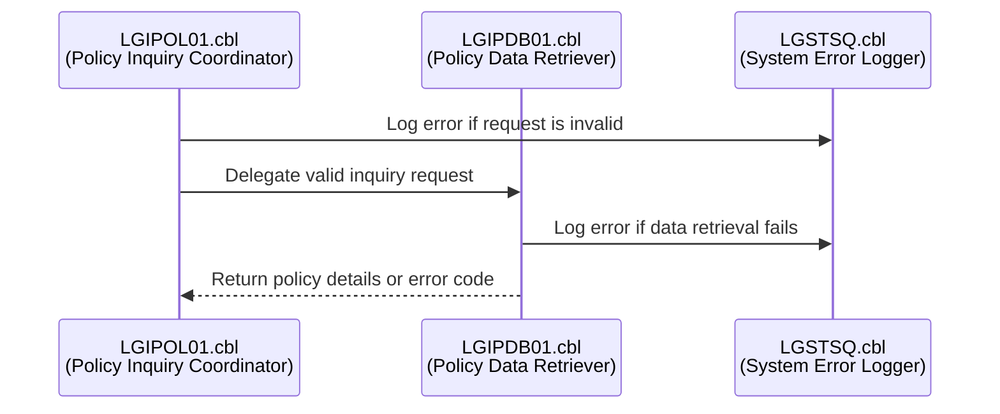
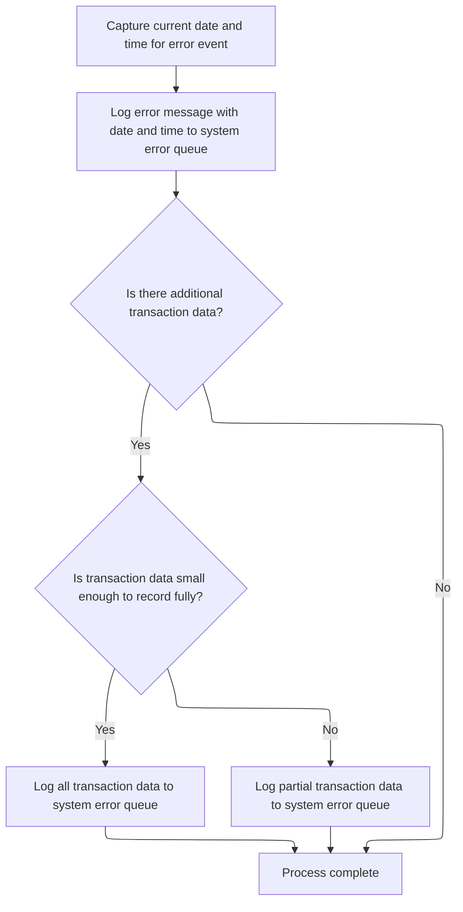

# Overview

This document describes the flow for inquiring about insurance policies. The process validates requests, logs errors with transaction context, and routes valid requests to specialized handlers for Endowment, House, Motor, or Commercial policies. Policy details are retrieved and returned to the requester.

# Technical Overview



## Dependencies

### Programs

- <SwmToken path="base/src/lgipol01.cbl" pos="91:9:9" line-data="           EXEC CICS LINK Program(LGIPDB01)">`LGIPDB01`</SwmToken> (<SwmPath>[base/src/lgipdb01.cbl](base/src/lgipdb01.cbl)</SwmPath>)
- LGSTSQ (<SwmPath>[base/src/lgstsq.cbl](base/src/lgstsq.cbl)</SwmPath>)

### Copybooks

- SQLCA
- LGPOLICY (<SwmPath>[base/src/lgpolicy.cpy](base/src/lgpolicy.cpy)</SwmPath>)
- LGCMAREA (<SwmPath>[base/src/lgcmarea.cpy](base/src/lgcmarea.cpy)</SwmPath>)

# Where is this program used?

This program is used multiple times in the codebase as represented in the following diagram:

```mermaid
graph TD
  w2fo7("Managing Commercial Policy Operations (LGTESTP4)") --> dlur7("Inquire Policy (LGIPOL01)"):::currentEntity
click w2fo7 openCode "base/src/lgtestp4.cbl:1"
92p2k("Endowment Policy Menu (LGTESTP2)") --> dlur7("Inquire Policy (LGIPOL01)"):::currentEntity
click 92p2k openCode "base/src/lgtestp2.cbl:1"
mbacd("House Policy Menu (LGTESTP3)") --> dlur7("Inquire Policy (LGIPOL01)"):::currentEntity
click mbacd openCode "base/src/lgtestp3.cbl:1"
q0cmm("Motor Policy Menu (LGTESTP1)") --> dlur7("Inquire Policy (LGIPOL01)"):::currentEntity
click q0cmm openCode "base/src/lgtestp1.cbl:1"
  
  
click dlur7 openCode "base/src/lgipol01.cbl:1"
    classDef currentEntity color:#000000,fill:#7CB9F4

%% Swimm:
%% graph TD
%%   w2fo7("Managing Commercial Policy Operations (LGTESTP4)") --> dlur7("Inquire Policy (<SwmToken path="base/src/lgipol01.cbl" pos="13:6:6" line-data="       PROGRAM-ID. LGIPOL01.">`LGIPOL01`</SwmToken>)"):::currentEntity
%% click w2fo7 openCode "<SwmPath>[base/src/lgtestp4.cbl](base/src/lgtestp4.cbl)</SwmPath>:1"
%% 92p2k("Endowment Policy Menu (LGTESTP2)") --> dlur7("Inquire Policy (<SwmToken path="base/src/lgipol01.cbl" pos="13:6:6" line-data="       PROGRAM-ID. LGIPOL01.">`LGIPOL01`</SwmToken>)"):::currentEntity
%% click 92p2k openCode "<SwmPath>[base/src/lgtestp2.cbl](base/src/lgtestp2.cbl)</SwmPath>:1"
%% mbacd("House Policy Menu (LGTESTP3)") --> dlur7("Inquire Policy (<SwmToken path="base/src/lgipol01.cbl" pos="13:6:6" line-data="       PROGRAM-ID. LGIPOL01.">`LGIPOL01`</SwmToken>)"):::currentEntity
%% click mbacd openCode "<SwmPath>[base/src/lgtestp3.cbl](base/src/lgtestp3.cbl)</SwmPath>:1"
%% q0cmm("Motor Policy Menu (LGTESTP1)") --> dlur7("Inquire Policy (<SwmToken path="base/src/lgipol01.cbl" pos="13:6:6" line-data="       PROGRAM-ID. LGIPOL01.">`LGIPOL01`</SwmToken>)"):::currentEntity
%% click q0cmm openCode "<SwmPath>[base/src/lgtestp1.cbl](base/src/lgtestp1.cbl)</SwmPath>:1"
%%   
%%   
%% click dlur7 openCode "<SwmPath>[base/src/lgipol01.cbl](base/src/lgipol01.cbl)</SwmPath>:1"
%%     classDef currentEntity color:#000000,fill:#7CB9F4
```



# Workflow

# Startup and Input Validation

This section ensures that every transaction starts with a properly initialized workspace and valid input data. It also guarantees that any missing critical input (commarea) is detected early, logged for diagnostics, and handled by terminating the process to prevent further errors.

| Category       | Rule Name                  | Description                                                                                                                        |
| -------------- | -------------------------- | ---------------------------------------------------------------------------------------------------------------------------------- |
| Business logic | Workspace Initialization   | The workspace must be initialized with the current transaction ID, terminal ID, and task number at the start of every transaction. |
| Business logic | Error Message Traceability | All error messages must include the current date, time, and relevant transaction data to ensure complete traceability.             |

<SwmSnippet path="/base/src/lgipol01.cbl" line="70">

---

In <SwmToken path="base/src/lgipol01.cbl" pos="70:1:1" line-data="       MAINLINE SECTION.">`MAINLINE`</SwmToken>, we kick off by prepping the workspace and copying transaction metadata. If there's no commarea, we prep an error message and call <SwmToken path="base/src/lgipol01.cbl" pos="81:3:7" line-data="               PERFORM WRITE-ERROR-MESSAGE">`WRITE-ERROR-MESSAGE`</SwmToken> to log what went wrong before abending. This way, the error context isn't lost when the program stops.

```cobol
       MAINLINE SECTION.
      *
           INITIALIZE WS-HEADER.
      *
           MOVE EIBTRNID TO WS-TRANSID.
           MOVE EIBTRMID TO WS-TERMID.
           MOVE EIBTASKN TO WS-TASKNUM.
      *
      * If NO commarea received issue an ABEND
           IF EIBCALEN IS EQUAL TO ZERO
               MOVE ' NO COMMAREA RECEIVED' TO EM-VARIABLE
               PERFORM WRITE-ERROR-MESSAGE
               EXEC CICS ABEND ABCODE('LGCA') NODUMP END-EXEC
           END-IF
```

---

</SwmSnippet>

## Error Logging and Timestamping



This section ensures that every error event is logged with precise timing and relevant transaction context, supporting auditability and troubleshooting. It also manages the inclusion of transaction data based on its size, and guarantees that error messages are reliably queued for system monitoring.

| Category       | Rule Name                       | Description                                                                                                                                                                |
| -------------- | ------------------------------- | -------------------------------------------------------------------------------------------------------------------------------------------------------------------------- |
| Business logic | Timestamp inclusion             | Every error message must include the exact date and time when the error occurred, formatted as MMDDYYYY and HHMMSS.                                                        |
| Business logic | Dual queue logging              | Error messages must be logged to both transient and persistent system queues to ensure reliable delivery and retention.                                                    |
| Business logic | Transaction data limit          | If transaction data is present, up to 90 bytes must be included in the error log for additional context. If the data exceeds 90 bytes, only the first 90 bytes are logged. |
| Business logic | Conditional transaction logging | If no transaction data is present, only the error message and timestamp are logged.                                                                                        |

<SwmSnippet path="/base/src/lgipol01.cbl" line="107">

---

In <SwmToken path="base/src/lgipol01.cbl" pos="107:1:5" line-data="       WRITE-ERROR-MESSAGE.">`WRITE-ERROR-MESSAGE`</SwmToken>, we fetch and format the current timestamp so every error message is logged with when it happened.

```cobol
       WRITE-ERROR-MESSAGE.
      * Save SQLCODE in message
      * Obtain and format current time and date
           EXEC CICS ASKTIME ABSTIME(ABS-TIME)
           END-EXEC
           EXEC CICS FORMATTIME ABSTIME(ABS-TIME)
                     MMDDYYYY(DATE1)
                     TIME(TIME1)
           END-EXEC
```

---

</SwmSnippet>

<SwmSnippet path="/base/src/lgipol01.cbl" line="116">

---

After timestamping the error, we call LGSTSQ to actually write the error message to the system queues. This keeps the logging logic clean and hands off queue management to a dedicated program.

```cobol
           MOVE DATE1 TO EM-DATE
           MOVE TIME1 TO EM-TIME
      * Write output message to TDQ
           EXEC CICS LINK PROGRAM('LGSTSQ')
                     COMMAREA(ERROR-MSG)
                     LENGTH(LENGTH OF ERROR-MSG)
           END-EXEC.
```

---

</SwmSnippet>

<SwmSnippet path="/base/src/lgstsq.cbl" line="55">

---

<SwmToken path="base/src/lgstsq.cbl" pos="55:1:1" line-data="       MAINLINE SECTION.">`MAINLINE`</SwmToken> in LGSTSQ handles message source detection, strips protocol prefixes, adjusts message lengths, and writes the message to both a TDQ and a TSQ. If the message was received (not invoked), it sends a one-char response back. This covers both persistent and transient message handling.

```cobol
       MAINLINE SECTION.

           MOVE SPACES TO WRITE-MSG.
           MOVE SPACES TO WS-RECV.

           EXEC CICS ASSIGN SYSID(WRITE-MSG-SYSID)
                RESP(WS-RESP)
           END-EXEC.

           EXEC CICS ASSIGN INVOKINGPROG(WS-INVOKEPROG)
                RESP(WS-RESP)
           END-EXEC.
           
           IF WS-INVOKEPROG NOT = SPACES
              MOVE 'C' To WS-FLAG
              MOVE COMMA-DATA  TO WRITE-MSG-MSG
              MOVE EIBCALEN    TO WS-RECV-LEN
           ELSE
              EXEC CICS RECEIVE INTO(WS-RECV)
                  LENGTH(WS-RECV-LEN)
                  RESP(WS-RESP)
              END-EXEC
              MOVE 'R' To WS-FLAG
              MOVE WS-RECV-DATA  TO WRITE-MSG-MSG
              SUBTRACT 5 FROM WS-RECV-LEN
           END-IF.

           MOVE 'GENAERRS' TO STSQ-NAME.
           IF WRITE-MSG-MSG(1:2) = 'Q=' THEN
              MOVE WRITE-MSG-MSG(3:4) TO STSQ-EXT
              MOVE WRITE-MSG-REST TO TEMPO
              MOVE TEMPO          TO WRITE-MSG-MSG
              SUBTRACT 7 FROM WS-RECV-LEN
           END-IF.

           ADD 5 TO WS-RECV-LEN.

      * Write output message to TDQ CSMT
      *
           EXEC CICS WRITEQ TD QUEUE(STDQ-NAME)
                     FROM(WRITE-MSG)
                     RESP(WS-RESP)
                     LENGTH(WS-RECV-LEN)

           END-EXEC.

      * Write output message to Genapp TSQ
      * If no space is available then the task will not wait for
      *  storage to become available but will ignore the request...
      *
           EXEC CICS WRITEQ TS QUEUE(STSQ-NAME)
                     FROM(WRITE-MSG)
                     RESP(WS-RESP)
                     NOSUSPEND
                     LENGTH(WS-RECV-LEN)

           END-EXEC.

           If WS-FLAG = 'R' Then
             EXEC CICS SEND TEXT FROM(FILLER-X)
              WAIT
              ERASE
              LENGTH(1)
              FREEKB
             END-EXEC.

           EXEC CICS RETURN
           END-EXEC.
```

---

</SwmSnippet>

<SwmSnippet path="/base/src/lgipol01.cbl" line="124">

---

Back in <SwmToken path="base/src/lgipol01.cbl" pos="81:3:7" line-data="               PERFORM WRITE-ERROR-MESSAGE">`WRITE-ERROR-MESSAGE`</SwmToken>, we log up to 90 bytes of commarea data for extra context, then queue it using LGSTSQ.

```cobol
           IF EIBCALEN > 0 THEN
             IF EIBCALEN < 91 THEN
               MOVE DFHCOMMAREA(1:EIBCALEN) TO CA-DATA
               EXEC CICS LINK PROGRAM('LGSTSQ')
                         COMMAREA(CA-ERROR-MSG)
                         LENGTH(LENGTH OF CA-ERROR-MSG)
               END-EXEC
             ELSE
               MOVE DFHCOMMAREA(1:90) TO CA-DATA
               EXEC CICS LINK PROGRAM('LGSTSQ')
                         COMMAREA(CA-ERROR-MSG)
                         LENGTH(LENGTH OF CA-ERROR-MSG)
               END-EXEC
             END-IF
           END-IF.
           EXIT.
```

---

</SwmSnippet>

## Normal Processing and Database Delegation

<SwmSnippet path="/base/src/lgipol01.cbl" line="86">

---

After returning from <SwmToken path="base/src/lgipol01.cbl" pos="81:3:7" line-data="               PERFORM WRITE-ERROR-MESSAGE">`WRITE-ERROR-MESSAGE`</SwmToken>, MAINLINE resets the return code, sets up pointers, and then links to <SwmToken path="base/src/lgipol01.cbl" pos="91:9:9" line-data="           EXEC CICS LINK Program(LGIPDB01)">`LGIPDB01`</SwmToken> to handle the actual policy inquiry logic. This keeps the mainline lean and hands off the heavy lifting.

```cobol
           MOVE '00' TO CA-RETURN-CODE
           MOVE EIBCALEN TO WS-CALEN.
           SET WS-ADDR-DFHCOMMAREA TO ADDRESS OF DFHCOMMAREA.
      *

           EXEC CICS LINK Program(LGIPDB01)
               Commarea(DFHCOMMAREA)
               Length(32500)
           END-EXEC.

           EXEC CICS RETURN END-EXEC.
```

---

</SwmSnippet>

# Policy Inquiry Routing and Data Retrieval

```mermaid
%%{init: {"flowchart": {"defaultRenderer": "elk"}} }%%
flowchart TD
    node1["Start policy inquiry"] --> node2{"Was commarea received?"}
    click node1 openCode "base/src/lgipdb01.cbl:230:235"
    node2 -->|"No"| node3["Abort: No commarea received (CA-RETURN-CODE '99')"]
    click node2 openCode "base/src/lgipdb01.cbl:251:255"
    click node3 openCode "base/src/lgipdb01.cbl:251:255"
    node2 -->|"Yes"| node4{"Which policy type is requested?"}
    click node4 openCode "base/src/lgipdb01.cbl:277:310"
    node4 -->|"Endowment (01IEND)"| node5["Retrieve endowment policy details"]
    click node5 openCode "base/src/lgipdb01.cbl:327:432"
    node4 -->|"House (01IHOU)"| node6["Retrieve house policy details"]
    click node6 openCode "base/src/lgipdb01.cbl:441:523"
    node4 -->|"Motor (01IMOT)"| node7["Retrieve motor policy details"]
    click node7 openCode "base/src/lgipdb01.cbl:529:621"
    node4 -->|"Commercial (01ICOM, 02ICOM, 03ICOM, 05ICOM)"| node8["Retrieve commercial policy details"]
    click node8 openCode "base/src/lgipdb01.cbl:292:306"
    node4 -->|"Unknown request"| node9["Set error code: Unknown request (CA-RETURN-CODE '99')"]
    click node9 openCode "base/src/lgipdb01.cbl:308:309"
    node5 --> node10{"Is commarea large enough for data?"}
    node6 --> node10
    node7 --> node10
    node8 --> node10
    node10 -->|"No"| node15["Set error code: Commarea too small (CA-RETURN-CODE '98')"]
    click node15 openCode "base/src/lgipdb01.cbl:390:392"
    node10 -->|"Yes"| node11["Return policy details"]
    click node11 openCode "base/src/lgipdb01.cbl:395:417"
    node5 --> node12{"Was retrieval successful?"}
    node6 --> node12
    node7 --> node12
    node8 --> node12
    node12 -->|"No rows found"| node13["Set error code: Invalid customer/policy (CA-RETURN-CODE '01')"]
    click node13 openCode "base/src/lgipdb01.cbl:423:424"
    node12 -->|"General error"| node14["Set error code: General failure (CA-RETURN-CODE '90') and record error"]
    click node14 openCode "base/src/lgipdb01.cbl:426:429"
classDef HeadingStyle fill:#777777,stroke:#333,stroke-width:2px;

%% Swimm:
%% %%{init: {"flowchart": {"defaultRenderer": "elk"}} }%%
%% flowchart TD
%%     node1["Start policy inquiry"] --> node2{"Was commarea received?"}
%%     click node1 openCode "<SwmPath>[base/src/lgipdb01.cbl](base/src/lgipdb01.cbl)</SwmPath>:230:235"
%%     node2 -->|"No"| node3["Abort: No commarea received (<SwmToken path="base/src/lgipol01.cbl" pos="86:9:13" line-data="           MOVE &#39;00&#39; TO CA-RETURN-CODE">`CA-RETURN-CODE`</SwmToken> '99')"]
%%     click node2 openCode "<SwmPath>[base/src/lgipdb01.cbl](base/src/lgipdb01.cbl)</SwmPath>:251:255"
%%     click node3 openCode "<SwmPath>[base/src/lgipdb01.cbl](base/src/lgipdb01.cbl)</SwmPath>:251:255"
%%     node2 -->|"Yes"| node4{"Which policy type is requested?"}
%%     click node4 openCode "<SwmPath>[base/src/lgipdb01.cbl](base/src/lgipdb01.cbl)</SwmPath>:277:310"
%%     node4 -->|"Endowment (<SwmToken path="base/src/lgipdb01.cbl" pos="279:4:4" line-data="             WHEN &#39;01IEND&#39;">`01IEND`</SwmToken>)"| node5["Retrieve endowment policy details"]
%%     click node5 openCode "<SwmPath>[base/src/lgipdb01.cbl](base/src/lgipdb01.cbl)</SwmPath>:327:432"
%%     node4 -->|"House (<SwmToken path="base/src/lgipdb01.cbl" pos="283:4:4" line-data="             WHEN &#39;01IHOU&#39;">`01IHOU`</SwmToken>)"| node6["Retrieve house policy details"]
%%     click node6 openCode "<SwmPath>[base/src/lgipdb01.cbl](base/src/lgipdb01.cbl)</SwmPath>:441:523"
%%     node4 -->|"Motor (<SwmToken path="base/src/lgipdb01.cbl" pos="287:4:4" line-data="             WHEN &#39;01IMOT&#39;">`01IMOT`</SwmToken>)"| node7["Retrieve motor policy details"]
%%     click node7 openCode "<SwmPath>[base/src/lgipdb01.cbl](base/src/lgipdb01.cbl)</SwmPath>:529:621"
%%     node4 -->|"Commercial (<SwmToken path="base/src/lgipdb01.cbl" pos="291:4:4" line-data="             WHEN &#39;01ICOM&#39;">`01ICOM`</SwmToken>, <SwmToken path="base/src/lgipdb01.cbl" pos="295:4:4" line-data="             WHEN &#39;02ICOM&#39;">`02ICOM`</SwmToken>, <SwmToken path="base/src/lgipdb01.cbl" pos="299:4:4" line-data="             WHEN &#39;03ICOM&#39;">`03ICOM`</SwmToken>, <SwmToken path="base/src/lgipdb01.cbl" pos="303:4:4" line-data="             WHEN &#39;05ICOM&#39;">`05ICOM`</SwmToken>)"| node8["Retrieve commercial policy details"]
%%     click node8 openCode "<SwmPath>[base/src/lgipdb01.cbl](base/src/lgipdb01.cbl)</SwmPath>:292:306"
%%     node4 -->|"Unknown request"| node9["Set error code: Unknown request (<SwmToken path="base/src/lgipol01.cbl" pos="86:9:13" line-data="           MOVE &#39;00&#39; TO CA-RETURN-CODE">`CA-RETURN-CODE`</SwmToken> '99')"]
%%     click node9 openCode "<SwmPath>[base/src/lgipdb01.cbl](base/src/lgipdb01.cbl)</SwmPath>:308:309"
%%     node5 --> node10{"Is commarea large enough for data?"}
%%     node6 --> node10
%%     node7 --> node10
%%     node8 --> node10
%%     node10 -->|"No"| node15["Set error code: Commarea too small (<SwmToken path="base/src/lgipol01.cbl" pos="86:9:13" line-data="           MOVE &#39;00&#39; TO CA-RETURN-CODE">`CA-RETURN-CODE`</SwmToken> '98')"]
%%     click node15 openCode "<SwmPath>[base/src/lgipdb01.cbl](base/src/lgipdb01.cbl)</SwmPath>:390:392"
%%     node10 -->|"Yes"| node11["Return policy details"]
%%     click node11 openCode "<SwmPath>[base/src/lgipdb01.cbl](base/src/lgipdb01.cbl)</SwmPath>:395:417"
%%     node5 --> node12{"Was retrieval successful?"}
%%     node6 --> node12
%%     node7 --> node12
%%     node8 --> node12
%%     node12 -->|"No rows found"| node13["Set error code: Invalid customer/policy (<SwmToken path="base/src/lgipol01.cbl" pos="86:9:13" line-data="           MOVE &#39;00&#39; TO CA-RETURN-CODE">`CA-RETURN-CODE`</SwmToken> '01')"]
%%     click node13 openCode "<SwmPath>[base/src/lgipdb01.cbl](base/src/lgipdb01.cbl)</SwmPath>:423:424"
%%     node12 -->|"General error"| node14["Set error code: General failure (<SwmToken path="base/src/lgipol01.cbl" pos="86:9:13" line-data="           MOVE &#39;00&#39; TO CA-RETURN-CODE">`CA-RETURN-CODE`</SwmToken> '90') and record error"]
%%     click node14 openCode "<SwmPath>[base/src/lgipdb01.cbl](base/src/lgipdb01.cbl)</SwmPath>:426:429"
%% classDef HeadingStyle fill:#777777,stroke:#333,stroke-width:2px;
```



This section governs the routing and retrieval of policy data based on incoming requests. It ensures that only valid requests with sufficient buffer space are processed, and that errors are handled and logged consistently.

| Category       | Rule Name                     | Description                                                                                                                                                                                                                                                                                                                                                                                                                                                                                                                                                                                                                                                                                                                                                                                                                                                                                                                                                                                                                      |
| -------------- | ----------------------------- | -------------------------------------------------------------------------------------------------------------------------------------------------------------------------------------------------------------------------------------------------------------------------------------------------------------------------------------------------------------------------------------------------------------------------------------------------------------------------------------------------------------------------------------------------------------------------------------------------------------------------------------------------------------------------------------------------------------------------------------------------------------------------------------------------------------------------------------------------------------------------------------------------------------------------------------------------------------------------------------------------------------------------------- |
| Business logic | Policy type routing           | The request is routed to the appropriate policy handler based on the request ID. Supported types are Endowment (<SwmToken path="base/src/lgipdb01.cbl" pos="279:4:4" line-data="             WHEN &#39;01IEND&#39;">`01IEND`</SwmToken>), House (<SwmToken path="base/src/lgipdb01.cbl" pos="283:4:4" line-data="             WHEN &#39;01IHOU&#39;">`01IHOU`</SwmToken>), Motor (<SwmToken path="base/src/lgipdb01.cbl" pos="287:4:4" line-data="             WHEN &#39;01IMOT&#39;">`01IMOT`</SwmToken>), and Commercial (<SwmToken path="base/src/lgipdb01.cbl" pos="291:4:4" line-data="             WHEN &#39;01ICOM&#39;">`01ICOM`</SwmToken>, <SwmToken path="base/src/lgipdb01.cbl" pos="295:4:4" line-data="             WHEN &#39;02ICOM&#39;">`02ICOM`</SwmToken>, <SwmToken path="base/src/lgipdb01.cbl" pos="299:4:4" line-data="             WHEN &#39;03ICOM&#39;">`03ICOM`</SwmToken>, <SwmToken path="base/src/lgipdb01.cbl" pos="303:4:4" line-data="             WHEN &#39;05ICOM&#39;">`05ICOM`</SwmToken>). |
| Business logic | Successful policy data return | When policy data is successfully retrieved and the buffer is sufficient, all relevant fields are returned in the commarea, with the end of data marked by 'FINAL'.                                                                                                                                                                                                                                                                                                                                                                                                                                                                                                                                                                                                                                                                                                                                                                                                                                                               |

<SwmSnippet path="/base/src/lgipdb01.cbl" line="230">

---

<SwmToken path="base/src/lgipdb01.cbl" pos="230:1:1" line-data="       MAINLINE SECTION.">`MAINLINE`</SwmToken> in <SwmToken path="base/src/lgipol01.cbl" pos="91:9:9" line-data="           EXEC CICS LINK Program(LGIPDB01)">`LGIPDB01`</SwmToken> sets up working storage, checks for a commarea, preps <SwmToken path="base/src/lgipdb01.cbl" pos="242:5:5" line-data="      * initialize DB2 host variables">`DB2`</SwmToken> input, and then routes the request to the right policy handler based on the request ID. If the type is unknown, it sets an error code.

```cobol
       MAINLINE SECTION.

      *----------------------------------------------------------------*
      * Common code                                                    *
      *----------------------------------------------------------------*
      * initialize working storage variables
           INITIALIZE WS-HEADER.
      * set up general variable
           MOVE EIBTRNID TO WS-TRANSID.
           MOVE EIBTRMID TO WS-TERMID.
           MOVE EIBTASKN TO WS-TASKNUM.
      *----------------------------------------------------------------*
      * initialize DB2 host variables
           INITIALIZE DB2-IN-INTEGERS.
           INITIALIZE DB2-OUT-INTEGERS.
           INITIALIZE DB2-POLICY.

      *---------------------------------------------------------------*
      * Check commarea and obtain required details                    *
      *---------------------------------------------------------------*
      * If NO commarea received issue an ABEND
           IF EIBCALEN IS EQUAL TO ZERO
             MOVE ' NO COMMAREA RECEIVED' TO EM-VARIABLE
             PERFORM WRITE-ERROR-MESSAGE
             EXEC CICS ABEND ABCODE('LGCA') NODUMP END-EXEC
           END-IF

      * initialize commarea return code to zero
           MOVE '00' TO CA-RETURN-CODE
           MOVE EIBCALEN TO WS-CALEN
           SET WS-ADDR-DFHCOMMAREA TO ADDRESS OF DFHCOMMAREA

      * Convert commarea customer & policy nums to DB2 integer format
           MOVE CA-CUSTOMER-NUM TO DB2-CUSTOMERNUM-INT
           MOVE CA-POLICY-NUM   TO DB2-POLICYNUM-INT
      * and save in error msg field incase required
           MOVE CA-CUSTOMER-NUM TO EM-CUSNUM
           MOVE CA-POLICY-NUM   TO EM-POLNUM

      *----------------------------------------------------------------*
      * Check which policy type is being requested                     *
      * This is not actually required whilst only endowment policy     *
      * inquires are supported, but will make future expansion simpler *
      *----------------------------------------------------------------*
      * Upper case value passed in Request Id field                    *
           MOVE FUNCTION UPPER-CASE(CA-REQUEST-ID) TO WS-REQUEST-ID

           EVALUATE WS-REQUEST-ID

             WHEN '01IEND'
               INITIALIZE DB2-ENDOWMENT
               PERFORM GET-ENDOW-DB2-INFO

             WHEN '01IHOU'
               INITIALIZE DB2-HOUSE
               PERFORM GET-HOUSE-DB2-INFO

             WHEN '01IMOT'
               INITIALIZE DB2-MOTOR
               PERFORM GET-MOTOR-DB2-INFO

             WHEN '01ICOM'
               INITIALIZE DB2-COMMERCIAL
               PERFORM GET-COMMERCIAL-DB2-INFO-1

             WHEN '02ICOM'
               INITIALIZE DB2-COMMERCIAL
               PERFORM GET-COMMERCIAL-DB2-INFO-2

             WHEN '03ICOM'
               INITIALIZE DB2-COMMERCIAL
               PERFORM GET-COMMERCIAL-DB2-INFO-3

             WHEN '05ICOM'
               INITIALIZE DB2-COMMERCIAL
               PERFORM GET-COMMERCIAL-DB2-INFO-5

             WHEN OTHER
               MOVE '99' TO CA-RETURN-CODE

           END-EVALUATE.
```

---

</SwmSnippet>

<SwmSnippet path="/base/src/lgipdb01.cbl" line="997">

---

In <SwmToken path="base/src/lgipol01.cbl" pos="91:9:9" line-data="           EXEC CICS LINK Program(LGIPDB01)">`LGIPDB01`</SwmToken>'s <SwmToken path="base/src/lgipdb01.cbl" pos="997:1:5" line-data="       WRITE-ERROR-MESSAGE.">`WRITE-ERROR-MESSAGE`</SwmToken>, we log the SQLCODE, timestamp, and error details, then call LGSTSQ to queue the error. If there's commarea data, we cap it at 90 bytes and queue that too. This keeps error logs consistent and avoids overflows.

```cobol
       WRITE-ERROR-MESSAGE.
      * Save SQLCODE in message
           MOVE SQLCODE TO EM-SQLRC
      * Obtain and format current time and date
           EXEC CICS ASKTIME ABSTIME(ABS-TIME)
           END-EXEC
           EXEC CICS FORMATTIME ABSTIME(ABS-TIME)
                     MMDDYYYY(DATE1)
                     TIME(TIME1)
           END-EXEC
           MOVE DATE1 TO EM-DATE
           MOVE TIME1 TO EM-TIME
      * Write output message to TDQ
           EXEC CICS LINK PROGRAM('LGSTSQ')
                     COMMAREA(ERROR-MSG)
                     LENGTH(LENGTH OF ERROR-MSG)
           END-EXEC.
      * Write 90 bytes or as much as we have of commarea to TDQ
           IF EIBCALEN > 0 THEN
             IF EIBCALEN < 91 THEN
               MOVE DFHCOMMAREA(1:EIBCALEN) TO CA-DATA
               EXEC CICS LINK PROGRAM('LGSTSQ')
                         COMMAREA(CA-ERROR-MSG)
                         LENGTH(LENGTH OF CA-ERROR-MSG)
               END-EXEC
             ELSE
               MOVE DFHCOMMAREA(1:90) TO CA-DATA
               EXEC CICS LINK PROGRAM('LGSTSQ')
                         COMMAREA(CA-ERROR-MSG)
                         LENGTH(LENGTH OF CA-ERROR-MSG)
               END-EXEC
             END-IF
           END-IF.
           EXIT.
```

---

</SwmSnippet>

<SwmSnippet path="/base/src/lgipdb01.cbl" line="327">

---

<SwmToken path="base/src/lgipdb01.cbl" pos="327:1:7" line-data="       GET-ENDOW-DB2-INFO.">`GET-ENDOW-DB2-INFO`</SwmToken> runs the SELECT for endowment policy details, checks if the commarea is big enough, and if so, moves the <SwmToken path="base/src/lgipdb01.cbl" pos="327:5:5" line-data="       GET-ENDOW-DB2-INFO.">`DB2`</SwmToken> results into the output. If not, it sets an error code. Errors or missing data trigger error logging.

```cobol
       GET-ENDOW-DB2-INFO.

           MOVE ' SELECT ENDOW ' TO EM-SQLREQ
           EXEC SQL
             SELECT  ISSUEDATE,
                     EXPIRYDATE,
                     LASTCHANGED,
                     BROKERID,
                     BROKERSREFERENCE,
                     PAYMENT,
                     WITHPROFITS,
                     EQUITIES,
                     MANAGEDFUND,
                     FUNDNAME,
                     TERM,
                     SUMASSURED,
                     LIFEASSURED,
                     PADDINGDATA,
                     LENGTH(PADDINGDATA)
             INTO  :DB2-ISSUEDATE,
                   :DB2-EXPIRYDATE,
                   :DB2-LASTCHANGED,
                   :DB2-BROKERID-INT INDICATOR :IND-BROKERID,
                   :DB2-BROKERSREF INDICATOR :IND-BROKERSREF,
                   :DB2-PAYMENT-INT INDICATOR :IND-PAYMENT,
                   :DB2-E-WITHPROFITS,
                   :DB2-E-EQUITIES,
                   :DB2-E-MANAGEDFUND,
                   :DB2-E-FUNDNAME,
                   :DB2-E-TERM-SINT,
                   :DB2-E-SUMASSURED-INT,
                   :DB2-E-LIFEASSURED,
                   :DB2-E-PADDINGDATA INDICATOR :IND-E-PADDINGDATA,
                   :DB2-E-PADDING-LEN INDICATOR :IND-E-PADDINGDATAL
             FROM  POLICY,ENDOWMENT
             WHERE ( POLICY.POLICYNUMBER =
                        ENDOWMENT.POLICYNUMBER   AND
                     POLICY.CUSTOMERNUMBER =
                        :DB2-CUSTOMERNUM-INT             AND
                     POLICY.POLICYNUMBER =
                        :DB2-POLICYNUM-INT               )
           END-EXEC

           IF SQLCODE = 0
      *      Select was successful

      *      Calculate size of commarea required to return all data
             ADD WS-CA-HEADERTRAILER-LEN TO WS-REQUIRED-CA-LEN
             ADD WS-FULL-ENDOW-LEN       TO WS-REQUIRED-CA-LEN

      *----------------------------------------------------------------*
      *      Specific code to allow for length of VACHAR data
      *      check whether PADDINGDATA field is non-null
      *        and calculate length of endowment policy
      *        and position of free space in commarea after policy data
      *----------------------------------------------------------------*
             IF IND-E-PADDINGDATAL NOT EQUAL MINUS-ONE
               ADD DB2-E-PADDING-LEN TO WS-REQUIRED-CA-LEN
               ADD DB2-E-PADDING-LEN TO END-POLICY-POS
             END-IF

      *      if commarea received is not large enough ...
      *        set error return code and return to caller
             IF EIBCALEN IS LESS THAN WS-REQUIRED-CA-LEN
               MOVE '98' TO CA-RETURN-CODE
               EXEC CICS RETURN END-EXEC
             ELSE
      *        Length is sufficent so move data to commarea
      *        Move Integer fields to required length numerics
      *        Don't move null fields
               IF IND-BROKERID NOT EQUAL MINUS-ONE
                 MOVE DB2-BROKERID-INT    TO DB2-BROKERID
               END-IF
               IF IND-PAYMENT NOT EQUAL MINUS-ONE
                 MOVE DB2-PAYMENT-INT TO DB2-PAYMENT
               END-IF
      *----------------------------------------------------------------*
               MOVE DB2-E-TERM-SINT       TO DB2-E-TERM
               MOVE DB2-E-SUMASSURED-INT  TO DB2-E-SUMASSURED

               MOVE DB2-POLICY-COMMON     TO CA-POLICY-COMMON
               MOVE DB2-ENDOW-FIXED
                   TO CA-ENDOWMENT(1:WS-ENDOW-LEN)
               IF IND-E-PADDINGDATA NOT EQUAL MINUS-ONE
                 MOVE DB2-E-PADDINGDATA TO
                     CA-E-PADDING-DATA(1:DB2-E-PADDING-LEN)
               END-IF
             END-IF

      *      Mark the end of the policy data
             MOVE 'FINAL' TO CA-E-PADDING-DATA(END-POLICY-POS:5)

           ELSE
      *      Non-zero SQLCODE from first SQL FETCH statement
             IF SQLCODE EQUAL 100
      *        No rows found - invalid customer / policy number
               MOVE '01' TO CA-RETURN-CODE
             ELSE
      *        something has gone wrong
               MOVE '90' TO CA-RETURN-CODE
      *        Write error message to TD QUEUE(CSMT)
               PERFORM WRITE-ERROR-MESSAGE
             END-IF

           END-IF.
           EXIT.
```

---

</SwmSnippet>

<SwmSnippet path="/base/src/lgipdb01.cbl" line="441">

---

<SwmToken path="base/src/lgipdb01.cbl" pos="441:1:7" line-data="       GET-HOUSE-DB2-INFO.">`GET-HOUSE-DB2-INFO`</SwmToken> fetches house policy data, checks if the buffer is big enough, and fills it if so. It handles nulls, sets return codes for errors, and marks the end of data with 'FINAL'.

```cobol
       GET-HOUSE-DB2-INFO.

           MOVE ' SELECT HOUSE ' TO EM-SQLREQ
           EXEC SQL
             SELECT  ISSUEDATE,
                     EXPIRYDATE,
                     LASTCHANGED,
                     BROKERID,
                     BROKERSREFERENCE,
                     PAYMENT,
                     PROPERTYTYPE,
                     BEDROOMS,
                     VALUE,
                     HOUSENAME,
                     HOUSENUMBER,
                     POSTCODE
             INTO  :DB2-ISSUEDATE,
                   :DB2-EXPIRYDATE,
                   :DB2-LASTCHANGED,
                   :DB2-BROKERID-INT INDICATOR :IND-BROKERID,
                   :DB2-BROKERSREF INDICATOR :IND-BROKERSREF,
                   :DB2-PAYMENT-INT INDICATOR :IND-PAYMENT,
                   :DB2-H-PROPERTYTYPE,
                   :DB2-H-BEDROOMS-SINT,
                   :DB2-H-VALUE-INT,
                   :DB2-H-HOUSENAME,
                   :DB2-H-HOUSENUMBER,
                   :DB2-H-POSTCODE
             FROM  POLICY,HOUSE
             WHERE ( POLICY.POLICYNUMBER =
                        HOUSE.POLICYNUMBER   AND
                     POLICY.CUSTOMERNUMBER =
                        :DB2-CUSTOMERNUM-INT             AND
                     POLICY.POLICYNUMBER =
                        :DB2-POLICYNUM-INT               )
           END-EXEC

           IF SQLCODE = 0
      *      Select was successful

      *      Calculate size of commarea required to return all data
             ADD WS-CA-HEADERTRAILER-LEN TO WS-REQUIRED-CA-LEN
             ADD WS-FULL-HOUSE-LEN       TO WS-REQUIRED-CA-LEN

      *      if commarea received is not large enough ...
      *        set error return code and return to caller
             IF EIBCALEN IS LESS THAN WS-REQUIRED-CA-LEN
               MOVE '98' TO CA-RETURN-CODE
               EXEC CICS RETURN END-EXEC
             ELSE
      *        Length is sufficent so move data to commarea
      *        Move Integer fields to required length numerics
      *        Don't move null fields
               IF IND-BROKERID NOT EQUAL MINUS-ONE
                 MOVE DB2-BROKERID-INT  TO DB2-BROKERID
               END-IF
               IF IND-PAYMENT NOT EQUAL MINUS-ONE
                 MOVE DB2-PAYMENT-INT TO DB2-PAYMENT
               END-IF
               MOVE DB2-H-BEDROOMS-SINT TO DB2-H-BEDROOMS
               MOVE DB2-H-VALUE-INT     TO DB2-H-VALUE

               MOVE DB2-POLICY-COMMON   TO CA-POLICY-COMMON
               MOVE DB2-HOUSE           TO CA-HOUSE(1:WS-HOUSE-LEN)
             END-IF

      *      Mark the end of the policy data
             MOVE 'FINAL' TO CA-H-FILLER(1:5)

           ELSE
      *      Non-zero SQLCODE from first SQL FETCH statement
             IF SQLCODE EQUAL 100
      *        No rows found - invalid customer / policy number
               MOVE '01' TO CA-RETURN-CODE
             ELSE
      *        something has gone wrong
               MOVE '90' TO CA-RETURN-CODE
      *        Write error message to TD QUEUE(CSMT)
               PERFORM WRITE-ERROR-MESSAGE
             END-IF

           END-IF.
           EXIT.
```

---

</SwmSnippet>

<SwmSnippet path="/base/src/lgipdb01.cbl" line="529">

---

<SwmToken path="base/src/lgipdb01.cbl" pos="529:1:7" line-data="       GET-MOTOR-DB2-INFO.">`GET-MOTOR-DB2-INFO`</SwmToken> runs the SELECT for motor policy data, checks buffer size using repo-specific constants, and fills the commarea if possible. It handles nulls, sets error codes, and logs errors if needed.

```cobol
       GET-MOTOR-DB2-INFO.

           MOVE ' SELECT MOTOR ' TO EM-SQLREQ
           EXEC SQL
             SELECT  ISSUEDATE,
                     EXPIRYDATE,
                     LASTCHANGED,
                     BROKERID,
                     BROKERSREFERENCE,
                     PAYMENT,
                     MAKE,
                     MODEL,
                     VALUE,
                     REGNUMBER,
                     COLOUR,
                     CC,
                     YEAROFMANUFACTURE,
                     PREMIUM,
                     ACCIDENTS
             INTO  :DB2-ISSUEDATE,
                   :DB2-EXPIRYDATE,
                   :DB2-LASTCHANGED,
                   :DB2-BROKERID-INT INDICATOR :IND-BROKERID,
                   :DB2-BROKERSREF INDICATOR :IND-BROKERSREF,
                   :DB2-PAYMENT-INT INDICATOR :IND-PAYMENT,
                   :DB2-M-MAKE,
                   :DB2-M-MODEL,
                   :DB2-M-VALUE-INT,
                   :DB2-M-REGNUMBER,
                   :DB2-M-COLOUR,
                   :DB2-M-CC-SINT,
                   :DB2-M-MANUFACTURED,
                   :DB2-M-PREMIUM-INT,
                   :DB2-M-ACCIDENTS-INT
             FROM  POLICY,MOTOR
             WHERE ( POLICY.POLICYNUMBER =
                        MOTOR.POLICYNUMBER   AND
                     POLICY.CUSTOMERNUMBER =
                        :DB2-CUSTOMERNUM-INT             AND
                     POLICY.POLICYNUMBER =
                        :DB2-POLICYNUM-INT               )
           END-EXEC

           IF SQLCODE = 0
      *      Select was successful

      *      Calculate size of commarea required to return all data
             ADD WS-CA-HEADERTRAILER-LEN TO WS-REQUIRED-CA-LEN
             ADD WS-FULL-MOTOR-LEN       TO WS-REQUIRED-CA-LEN

      *      if commarea received is not large enough ...
      *        set error return code and return to caller
             IF EIBCALEN IS LESS THAN WS-REQUIRED-CA-LEN
               MOVE '98' TO CA-RETURN-CODE
               EXEC CICS RETURN END-EXEC
             ELSE
      *        Length is sufficent so move data to commarea
      *        Move Integer fields to required length numerics
      *        Don't move null fields
               IF IND-BROKERID NOT EQUAL MINUS-ONE
                 MOVE DB2-BROKERID-INT TO DB2-BROKERID
               END-IF
               IF IND-PAYMENT NOT EQUAL MINUS-ONE
                 MOVE DB2-PAYMENT-INT    TO DB2-PAYMENT
               END-IF
               MOVE DB2-M-CC-SINT      TO DB2-M-CC
               MOVE DB2-M-VALUE-INT    TO DB2-M-VALUE
               MOVE DB2-M-PREMIUM-INT  TO DB2-M-PREMIUM
               MOVE DB2-M-ACCIDENTS-INT TO DB2-M-ACCIDENTS
               MOVE DB2-M-PREMIUM-INT  TO CA-M-PREMIUM
               MOVE DB2-M-ACCIDENTS-INT TO CA-M-ACCIDENTS

               MOVE DB2-POLICY-COMMON  TO CA-POLICY-COMMON
               MOVE DB2-MOTOR          TO CA-MOTOR(1:WS-MOTOR-LEN)
             END-IF

      *      Mark the end of the policy data
             MOVE 'FINAL' TO CA-M-FILLER(1:5)

           ELSE
      *      Non-zero SQLCODE from first SQL FETCH statement
             IF SQLCODE EQUAL 100
      *        No rows found - invalid customer / policy number
               MOVE '01' TO CA-RETURN-CODE
             ELSE
      *        something has gone wrong
               MOVE '90' TO CA-RETURN-CODE
      *        Write error message to TD QUEUE(CSMT)
               PERFORM WRITE-ERROR-MESSAGE
             END-IF

           END-IF.
           EXIT.
```

---

</SwmSnippet>

&nbsp;

*This is an auto-generated document by Swimm 🌊 and has not yet been verified by a human*

<SwmMeta version="3.0.0" repo-id="Z2l0aHViJTNBJTNBU3dpbW1pby1nZW5hcHAtbW90b3IlM0ElM0FHaXJpLVN3aW1t" repo-name="Swimmio-genapp-motor"><sup>Powered by [Swimm](https://app.swimm.io/)</sup></SwmMeta>
