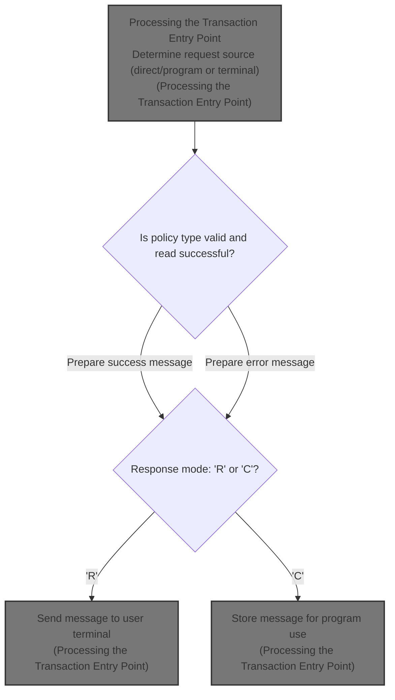

# Overview

This document describes how transaction requests are processed to inquire about policy information. The LGIPVS01 program determines the request source, validates policy data, and delivers a response message to the user or another program.

## Dependencies

### Program

- LGIPVS01 (<SwmPath>[base/src/lgipvs01.cbl](base/src/lgipvs01.cbl)</SwmPath>)

&nbsp;

*This is an auto-generated document by Swimm 🌊 and has not yet been verified by a human*

<SwmMeta version="3.0.0" repo-id="Z2l0aHViJTNBJTNBU3dpbW1pby1nZW5hcHAtbW90b3IlM0ElM0FHaXJpLVN3aW1t" repo-name="Swimmio-genapp-motor">Powered by [Swimm](https://app.swimm.io/)</SwmMeta>
