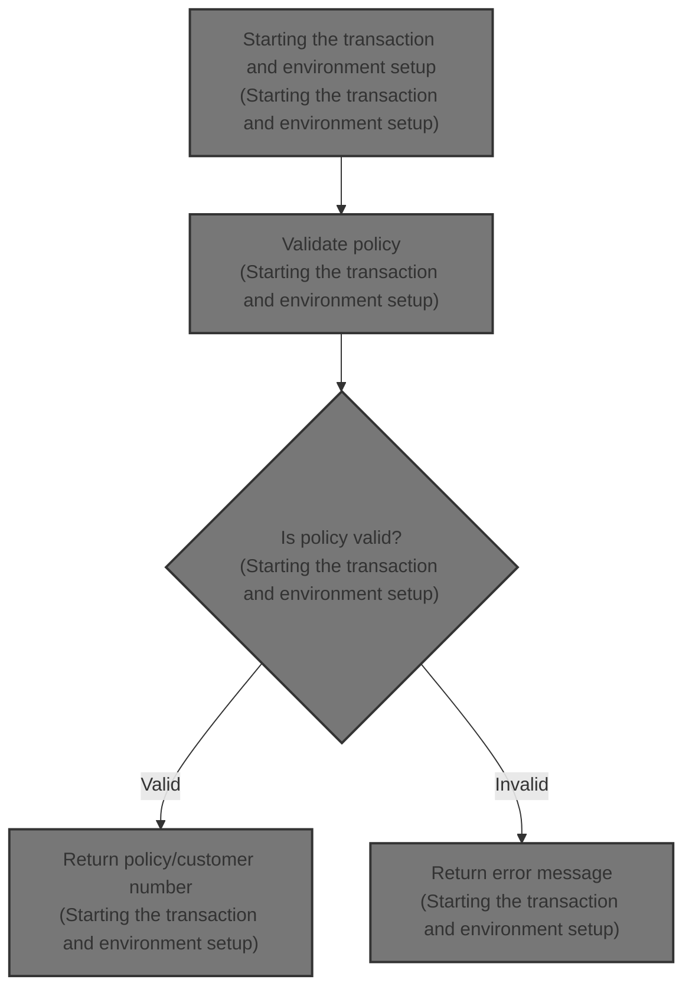

# Overview

This document explains the process of handling policy inquiries. When a transaction request is received, the system validates the policy information and returns either a valid policy/customer number or an error message. The response is delivered immediately or prepared for further processing, depending on the request type.



## Detailed View of the Program's Functionality

a. Transaction Start and Environment Setup

The program begins by preparing for a new transaction. It first clears out the buffer used to receive incoming data, ensuring no leftover information from previous transactions. Next, it queries the system for three key pieces of information: the system identifier, the start code, and the name of the invoking program. These values are fetched from the transaction environment and stored for use in decision-making later in the flow.

b. Determining Request Type and Preparing Communication Area

The program then checks whether the request is a direct start or has been invoked by another program, or if it is a standard receive operation. This is done by examining the start code and the invoking program name. If the request is direct or invoked, a flag is set to indicate this, and the communication area is populated with data from the incoming parameters. The length of the data to be processed is also set and adjusted. If the request is a standard receive, the program receives data into the buffer, sets a different flag, copies the relevant data into the communication area, and adjusts the length accordingly.

c. Building the Policy Key and Reading Policy Data

With the communication area prepared, the program constructs a key for policy lookup. It extracts the policy type and number from the communication area, which together form the key used to search for a policy record. The program then attempts to read the corresponding policy data from a file that stores policy records. The read operation is performed using the constructed key, and the result is stored for validation.

d. Validating Policy Data and Preparing Response

After attempting to read the policy data, the program checks whether the retrieved policy type matches the requested type and whether the file read was successful. If either check fails, it prepares an error message indicating a bad policy, and sets the customer and policy numbers to a specific value to signal failure. If the policy is valid, it prepares a response containing the policy key information.

e. Sending Response or Preparing for Next Step

Depending on the flag set earlier (which indicates the type of request), the program either sends the prepared message directly to the user or populates the communication area with the response data for further processing. If the request was a standard receive, the message is sent immediately. If it was a direct or invoked request, the response is stored in the communication area for use by the next step in the transaction.

f. Transaction Completion

Finally, the program returns control to the transaction system, signaling the end of its processing for this request. This ensures that the transaction is properly closed and resources are released.

# Rule Definition

| Paragraph Name | Rule ID | Category          | Description                                                                                                                                                                                                                                     | Conditions                                                                                 | Remarks                                                                                                                                                                                          |
| -------------- | ------- | ----------------- | ----------------------------------------------------------------------------------------------------------------------------------------------------------------------------------------------------------------------------------------------- | ------------------------------------------------------------------------------------------ | ------------------------------------------------------------------------------------------------------------------------------------------------------------------------------------------------ |
| 79-89          | RL-001  | Data Assignment   | The system must assign system codes (SYSID, STARTCODE, Invokingprog) from the incoming request to internal storage for further processing.                                                                                                      | Upon receiving a request, regardless of type.                                              | SYSID is a 4-character string, STARTCODE is a 2-character string, Invokingprog is an 8-character string. All are initialized to spaces.                                                          |
| 90-105         | RL-002  | Conditional Logic | The system must determine if the request is a direct start (first byte of start code is 'D') or invoked (invoking program is not spaces). If so, set the processing flag to 'C'. Otherwise, set the flag to 'R' for received/terminal requests. | After system codes are assigned.                                                           | Flag is a single character: 'C' for direct/invoked, 'R' for terminal. Direct start is indicated by first byte of start code = 'D'.                                                               |
| 92-105         | RL-003  | Data Assignment   | For direct/invoked requests (flag 'C'), copy commarea data from the incoming request. For terminal requests (flag 'R'), receive data from the terminal and copy it to the commarea.                                                             | After determining the request type and setting the flag.                                   | Commarea is 80 bytes. For direct/invoked, data is copied from the incoming commarea. For terminal, data is received from the terminal buffer (74 bytes of data after 5 bytes of transaction ID). |
| 107-109        | RL-004  | Computation       | The system constructs the policy key using the first byte as the policy type and the next 10 bytes as the policy/customer number from the commarea.                                                                                             | After commarea is prepared.                                                                | Policy key is 11 bytes: 1 byte type (alphanumeric), 10 bytes number (numeric, left-padded with zeros if necessary).                                                                              |
| 111-119        | RL-005  | Computation       | The system reads the policy record from the KSDSPOLY file using the constructed key (1 byte type + 10 bytes number).                                                                                                                            | After constructing the policy key.                                                         | File read uses 11-byte key. File is KSDSPOLY. Read is generic and expects a 64-byte record.                                                                                                      |
| 121-125        | RL-006  | Conditional Logic | If the policy record is not found or the type does not match, prepare an error message in the commarea and set the key to '0000000013'.                                                                                                         | After attempting to read the policy record, if the record is not found or type mismatches. | Error message is 'Policy Bad='. Key is set to '0000000013' (10 digits). Message is left-aligned, padded with spaces to 11 bytes. Key is 10 bytes, left-padded with zeros if necessary.           |
| 126-128        | RL-007  | Data Assignment   | If the policy record is valid, prepare a response in the commarea with the message 'Policy Key=' and the valid policy key.                                                                                                                      | After reading the policy record and confirming it is valid.                                | Message is 'Policy Key=' (11 bytes). Key is the valid policy key (type + number, 11 bytes).                                                                                                      |
| 130-141        | RL-008  | Conditional Logic | If the request is terminal (flag 'R'), send the message directly to the user terminal. Otherwise, prepare the commarea for the next step in the transaction.                                                                                    | After preparing the response message and key.                                              | For terminal, send 80-byte message to terminal. For programmatic, copy message and key to commarea fields (11 bytes text, 21 bytes key).                                                         |
| 143-144        | RL-009  | Computation       | After all processing is complete, the system must return control to CICS.                                                                                                                                                                       | After sending response or preparing commarea.                                              | Standard CICS RETURN operation. No data returned except as previously set in commarea or terminal.                                                                                               |

# User Stories

## User Story 1: Handle incoming requests and prepare commarea

---

### Story Description:

As a system, I want to receive a request, assign system codes, determine the request type, and prepare the commarea accordingly so that the request can be processed correctly based on its origin.

---

### Business Rule Mapping:

| Rule ID | Paragraph Name | Rule Description                                                                                                                                                                                                                                |
| ------- | -------------- | ----------------------------------------------------------------------------------------------------------------------------------------------------------------------------------------------------------------------------------------------- |
| RL-001  | 79-89          | The system must assign system codes (SYSID, STARTCODE, Invokingprog) from the incoming request to internal storage for further processing.                                                                                                      |
| RL-002  | 90-105         | The system must determine if the request is a direct start (first byte of start code is 'D') or invoked (invoking program is not spaces). If so, set the processing flag to 'C'. Otherwise, set the flag to 'R' for received/terminal requests. |
| RL-003  | 92-105         | For direct/invoked requests (flag 'C'), copy commarea data from the incoming request. For terminal requests (flag 'R'), receive data from the terminal and copy it to the commarea.                                                             |

---

### Relevant Functionality:

- **79-89**
  1. **RL-001:**
     - On request receipt:
       - Assign system ID from environment to internal storage.
       - Assign start code from environment to internal storage.
       - Assign invoking program name from environment to internal storage.
- **90-105**
  1. **RL-002:**
     - If first byte of start code is 'D' or invoking program is not spaces:
       - Set processing flag to 'C'.
     - Else:
       - Set processing flag to 'R'.
- **92-105**
  1. **RL-003:**
     - If flag is 'C':
       - Copy commarea data from request to internal commarea.
     - Else (flag is 'R'):
       - Receive data from terminal into buffer.
       - Copy terminal data portion to internal commarea.

## User Story 2: Process policy key and read policy record

---

### Story Description:

As a system, I want to construct a policy key from the commarea and read the corresponding policy record so that I can validate the policy and proceed with the correct response.

---

### Business Rule Mapping:

| Rule ID | Paragraph Name | Rule Description                                                                                                                                    |
| ------- | -------------- | --------------------------------------------------------------------------------------------------------------------------------------------------- |
| RL-004  | 107-109        | The system constructs the policy key using the first byte as the policy type and the next 10 bytes as the policy/customer number from the commarea. |
| RL-005  | 111-119        | The system reads the policy record from the KSDSPOLY file using the constructed key (1 byte type + 10 bytes number).                                |

---

### Relevant Functionality:

- **107-109**
  1. **RL-004:**
     - Set policy key type to first byte of commarea.
     - Set policy key number to next 10 bytes of commarea.
- **111-119**
  1. **RL-005:**
     - Issue file read to KSDSPOLY using constructed key (type + number).
     - Store result in policy area.

## User Story 3: Prepare and deliver response, then return control

---

### Story Description:

As a system, I want to prepare an appropriate response message based on the policy record outcome, deliver it to the correct destination, and return control to CICS so that the user or invoking program receives the correct information and the transaction is properly concluded.

---

### Business Rule Mapping:

| Rule ID | Paragraph Name | Rule Description                                                                                                                                             |
| ------- | -------------- | ------------------------------------------------------------------------------------------------------------------------------------------------------------ |
| RL-006  | 121-125        | If the policy record is not found or the type does not match, prepare an error message in the commarea and set the key to '0000000013'.                      |
| RL-007  | 126-128        | If the policy record is valid, prepare a response in the commarea with the message 'Policy Key=' and the valid policy key.                                   |
| RL-008  | 130-141        | If the request is terminal (flag 'R'), send the message directly to the user terminal. Otherwise, prepare the commarea for the next step in the transaction. |
| RL-009  | 143-144        | After all processing is complete, the system must return control to CICS.                                                                                    |

---

### Relevant Functionality:

- **121-125**
  1. **RL-006:**
     - If policy type does not match or file read is not successful:
       - Set message text to 'Policy Bad='.
       - Set key to '0000000013'.
- **126-128**
  1. **RL-007:**
     - If policy record is valid:
       - Set message text to 'Policy Key='.
       - Set key to the valid policy key.
- **130-141**
  1. **RL-008:**
     - If flag is 'R':
       - Send message to terminal (80 bytes).
     - Else:
       - Copy message text and key to commarea fields for next program.
- **143-144**
  1. **RL-009:**
     - Issue RETURN to CICS.

# Workflow

# Starting the transaction and environment setup

```mermaid
%%{init: {"flowchart": {"defaultRenderer": "elk"}} }%%
flowchart TD
    node1["Receive request and assign system codes"] --> node2{"Is direct start or invoked?"}
    click node1 openCode "base/src/lgipvs01.cbl:75:89"
    node2 -->|"Direct/Invoked"| node3["Prepare commarea for direct/invoked request"]
    click node2 openCode "base/src/lgipvs01.cbl:90:97"
    node2 -->|"Received"| node4["Receive data and prepare commarea"]
    click node3 openCode "base/src/lgipvs01.cbl:90:97"
    click node4 openCode "base/src/lgipvs01.cbl:98:105"
    node3 --> node5["Set up policy key from commarea"]
    node4 --> node5
    click node5 openCode "base/src/lgipvs01.cbl:107:110"
    node5 --> node6["Read policy data from file"]
    click node6 openCode "base/src/lgipvs01.cbl:111:119"
    node6 --> node7{"Is policy valid?"}
    click node7 openCode "base/src/lgipvs01.cbl:121:128"
    node7 -->|"Invalid"| node8["Prepare error message: 'Policy Bad=', customer/policy number = 13"]
    click node8 openCode "base/src/lgipvs01.cbl:123:125"
    node7 -->|"Valid"| node9["Prepare response with policy key"]
    click node9 openCode "base/src/lgipvs01.cbl:127:128"
    node8 --> node10{"Is flag 'R'?"}
    node9 --> node10
    click node10 openCode "base/src/lgipvs01.cbl:130:141"
    node10 -->|"Yes"| node11["Send message to user"]
    click node11 openCode "base/src/lgipvs01.cbl:131:136"
    node10 -->|"No"| node12["Prepare COMMA-Data for next step"]
    click node12 openCode "base/src/lgipvs01.cbl:138:140"
    node11 --> node13["Return"]
    node12 --> node13["Return"]
    click node13 openCode "base/src/lgipvs01.cbl:143:144"
classDef HeadingStyle fill:#777777,stroke:#333,stroke-width:2px;

%% Swimm:
%% %%{init: {"flowchart": {"defaultRenderer": "elk"}} }%%
%% flowchart TD
%%     node1["Receive request and assign system codes"] --> node2{"Is direct start or invoked?"}
%%     click node1 openCode "<SwmPath>[base/src/lgipvs01.cbl](base/src/lgipvs01.cbl)</SwmPath>:75:89"
%%     node2 -->|"Direct/Invoked"| node3["Prepare commarea for direct/invoked request"]
%%     click node2 openCode "<SwmPath>[base/src/lgipvs01.cbl](base/src/lgipvs01.cbl)</SwmPath>:90:97"
%%     node2 -->|"Received"| node4["Receive data and prepare commarea"]
%%     click node3 openCode "<SwmPath>[base/src/lgipvs01.cbl](base/src/lgipvs01.cbl)</SwmPath>:90:97"
%%     click node4 openCode "<SwmPath>[base/src/lgipvs01.cbl](base/src/lgipvs01.cbl)</SwmPath>:98:105"
%%     node3 --> node5["Set up policy key from commarea"]
%%     node4 --> node5
%%     click node5 openCode "<SwmPath>[base/src/lgipvs01.cbl](base/src/lgipvs01.cbl)</SwmPath>:107:110"
%%     node5 --> node6["Read policy data from file"]
%%     click node6 openCode "<SwmPath>[base/src/lgipvs01.cbl](base/src/lgipvs01.cbl)</SwmPath>:111:119"
%%     node6 --> node7{"Is policy valid?"}
%%     click node7 openCode "<SwmPath>[base/src/lgipvs01.cbl](base/src/lgipvs01.cbl)</SwmPath>:121:128"
%%     node7 -->|"Invalid"| node8["Prepare error message: 'Policy Bad=', customer/policy number = 13"]
%%     click node8 openCode "<SwmPath>[base/src/lgipvs01.cbl](base/src/lgipvs01.cbl)</SwmPath>:123:125"
%%     node7 -->|"Valid"| node9["Prepare response with policy key"]
%%     click node9 openCode "<SwmPath>[base/src/lgipvs01.cbl](base/src/lgipvs01.cbl)</SwmPath>:127:128"
%%     node8 --> node10{"Is flag 'R'?"}
%%     node9 --> node10
%%     click node10 openCode "<SwmPath>[base/src/lgipvs01.cbl](base/src/lgipvs01.cbl)</SwmPath>:130:141"
%%     node10 -->|"Yes"| node11["Send message to user"]
%%     click node11 openCode "<SwmPath>[base/src/lgipvs01.cbl](base/src/lgipvs01.cbl)</SwmPath>:131:136"
%%     node10 -->|"No"| node12["Prepare <SwmToken path="base/src/lgipvs01.cbl" pos="138:7:9" line-data="             Move Spaces          To COMMA-Data">`COMMA-Data`</SwmToken> for next step"]
%%     click node12 openCode "<SwmPath>[base/src/lgipvs01.cbl](base/src/lgipvs01.cbl)</SwmPath>:138:140"
%%     node11 --> node13["Return"]
%%     node12 --> node13["Return"]
%%     click node13 openCode "<SwmPath>[base/src/lgipvs01.cbl](base/src/lgipvs01.cbl)</SwmPath>:143:144"
%% classDef HeadingStyle fill:#777777,stroke:#333,stroke-width:2px;
```



This section is responsible for initializing the transaction environment, determining the type of request, setting up the communication area, and preparing the response or next step based on policy validation.

| Category       | Rule Name                          | Description                                                                                                                                                                                                          |
| -------------- | ---------------------------------- | -------------------------------------------------------------------------------------------------------------------------------------------------------------------------------------------------------------------- |
| Business logic | Direct or Invoked Request Handling | If the request is a direct start (start code begins with 'D') or is invoked by another program, the system must set the flag to 'C', use the communication area as input, and adjust the receive length accordingly. |
| Business logic | Regular Receive Handling           | If the request is a regular receive, the system must receive data into the buffer, set the flag to 'R', and use the received data as the communication area, adjusting the receive length by subtracting 6.          |
| Business logic | Policy Lookup                      | The system must construct a policy key from the communication area and attempt to read the corresponding policy record from the policy file.                                                                         |
| Business logic | Valid Policy Response              | If the policy is valid, the system must prepare a response message containing the policy key data.                                                                                                                   |
| Business logic | Response Dispatch Based on Flag    | If the flag is 'R', the system must send the response message to the user immediately; otherwise, it must prepare the communication area for the next processing step.                                               |

<SwmSnippet path="/base/src/lgipvs01.cbl" line="75">

---

In MAINLINE, this is where the flow starts: it clears out the receive buffer, then grabs the system ID, start code, and invoking program from CICS. These values are used to decide what happens next in the transaction.

```cobol
       MAINLINE SECTION.
      *
           MOVE SPACES TO WS-RECV.

           EXEC CICS ASSIGN SYSID(WS-SYSID)
                RESP(WS-RESP)
           END-EXEC.

           EXEC CICS ASSIGN STARTCODE(WS-STARTCODE)
                RESP(WS-RESP)
           END-EXEC.

           EXEC CICS ASSIGN Invokingprog(WS-Invokeprog)
                RESP(WS-RESP)
           END-EXEC.
```

---

</SwmSnippet>

<SwmSnippet path="/base/src/lgipvs01.cbl" line="90">

---

Here the flow checks if we're dealing with a command or a regular receive by looking at <SwmToken path="base/src/lgipvs01.cbl" pos="90:3:5" line-data="           IF WS-STARTCODE(1:1) = &#39;D&#39; or">`WS-STARTCODE`</SwmToken> and <SwmToken path="base/src/lgipvs01.cbl" pos="91:1:3" line-data="              WS-Invokeprog Not = Spaces">`WS-Invokeprog`</SwmToken>. Based on that, it sets the flag and communication area, and adjusts the length for later use.

```cobol
           IF WS-STARTCODE(1:1) = 'D' or
              WS-Invokeprog Not = Spaces
              MOVE 'C' To WS-FLAG
              MOVE COMMA-DATA  TO WS-COMMAREA
              MOVE EIBCALEN    TO WS-RECV-LEN
              MOVE 11          TO WS-RECV-LEN
              SUBTRACT 1 FROM WS-RECV-LEN
           ELSE
              EXEC CICS RECEIVE INTO(WS-RECV)
                  LENGTH(WS-RECV-LEN)
                  RESP(WS-RESP)
              END-EXEC
              MOVE 'R' To WS-FLAG
              MOVE WS-RECV-DATA  TO WS-COMMAREA
              SUBTRACT 6 FROM WS-RECV-LEN
           END-IF.
```

---

</SwmSnippet>

<SwmSnippet path="/base/src/lgipvs01.cbl" line="107">

---

Next we take the data from the communication area, build the key, and call the KSDSPOLY file to try to fetch the matching policy record. This sets up the data for validation and message creation.

```cobol
           Move Spaces                      To CA-Area
           Move WS-Commarea(1:1)            To Part-Key-Type
           Move WS-Commarea(2:WS-RECV-LEN)  To Part-Key-Num
      *
           Exec CICS Read File('KSDSPOLY')
                     Into(CA-AREA)
                     Length(F64)
                     Ridfld(PART-KEY)
                     KeyLength(F11)
                     Generic
                     RESP(WS-RESP)
                     GTEQ
           End-Exec.
```

---

</SwmSnippet>

<SwmSnippet path="/base/src/lgipvs01.cbl" line="121">

---

Here we check if the policy type matches and if the file read was successful. If not, we set the message to 'Policy Bad=' and mark the numbers as 13 to indicate failure. Otherwise, we prep the valid policy data for the message.

```cobol
           If CA-Policy-Type   Not = Part-Key-Type Or
              WS-RESP NOT          = DFHRESP(NORMAL)
             Move 'Policy Bad='   To Write-Msg-Text
             Move 13              To WRITE-Msg-CustNum
             Move 13              To WRITE-Msg-PolNum
           Else
             Move CA-Area to WRITE-MSG-Key
           End-If
```

---

</SwmSnippet>

<SwmSnippet path="/base/src/lgipvs01.cbl" line="130">

---

Finally, depending on the flag, we either send the message to the client right away or prep it in the communication area for later use. Then we return control to CICS.

```cobol
           If WS-FLAG = 'R' Then
             EXEC CICS SEND TEXT FROM(WRITE-MSG)
              WAIT
              ERASE
              LENGTH(80)
              FREEKB
             END-EXEC
           Else
             Move Spaces          To COMMA-Data
             Move Write-Msg-Text  To COMMA-Data-Text
             Move Write-Msg-Key   To COMMA-Data-Key
           End-If.

           EXEC CICS RETURN
           END-EXEC.
```

---

</SwmSnippet>

&nbsp;

*This is an auto-generated document by Swimm 🌊 and has not yet been verified by a human*

<SwmMeta version="3.0.0" repo-id="Z2l0aHViJTNBJTNBU3dpbW1pby1nZW5hcHAtbW90b3IlM0ElM0FHaXJpLVN3aW1t" repo-name="Swimmio-genapp-motor"><sup>Powered by [Swimm](https://app.swimm.io/)</sup></SwmMeta>
