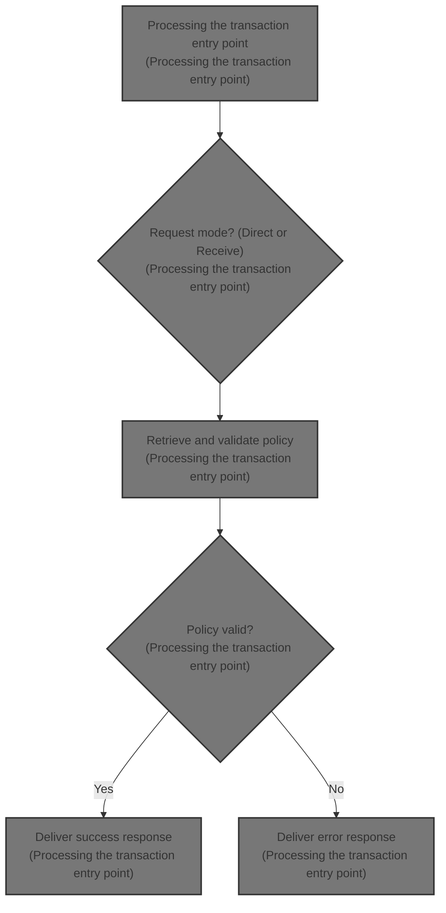

# Overview

This document explains the flow of policy inquiry. The system processes incoming requests to retrieve and validate policy information, then delivers the result to the appropriate recipient, either a user terminal or another program.



## Dependencies

### Program

- <SwmToken path="base/src/lgipvs01.cbl" pos="13:6:6" line-data="       PROGRAM-ID. LGIPVS01.">`LGIPVS01`</SwmToken> (<SwmPath>[base/src/lgipvs01.cbl](base/src/lgipvs01.cbl)</SwmPath>)

## Detailed View of the Program's Functionality

a. Initialization and Workspace Setup

When a transaction begins, the program first clears the area used to receive input data. It then retrieves three key system and program identifiers using system calls: the system ID, a code indicating how the transaction was started, and the name of the invoking program. These identifiers are stored for use in subsequent decision-making about how to process the incoming request.

b. Determining Request Type and Preparing Input

The program checks whether the transaction was started directly (either by a specific code or by an invoking program being present). If so, it sets a mode indicating a direct call, copies the input data from a shared area, and adjusts the length of the data to be processed. If the transaction was not started directly, it receives input data from the user terminal, sets a mode indicating a receive flow, copies the received data for processing, and adjusts the length accordingly.

c. Building the Policy Key and Reading Policy Data

Next, the program prepares to access the policy file. It clears the area where policy data will be stored, then constructs a key for the policy file using the input data: the first character is used as the policy type, and the remaining characters (up to the adjusted length) are used as the policy number. Using this key, the program attempts to read the corresponding policy record from the file.

d. Validating Policy Data and Preparing Output Message

After attempting to read the policy record, the program checks two things: whether the type of the retrieved policy matches the requested type, and whether the read operation was successful. If either check fails, it prepares an error message, setting both the customer and policy numbers in the output to a default error value. If both checks pass, it copies the retrieved policy data into the output message.

e. Responding to the Request

Finally, the program decides how to deliver the response based on the mode set earlier. If the request was received from a user terminal, it sends the output message directly to the terminal, ensuring the screen is cleared and the keyboard is freed for further input. If the request was a direct programmatic call, it prepares the output data in a shared area for use by the calling program, copying both the message text and the policy key data.

f. Transaction Completion

After preparing and sending the response, the program ends the transaction and returns control to the system, ensuring all resources are properly released.

# Rule Definition

| Paragraph Name   | Rule ID | Category          | Description                                                                                                                                                                                                                                                                                                                                                                                                                                                                                                     | Conditions                                                             | Remarks                                                                                                                                                                                                                                                                                                                                                                                                                                                                                                                                                                                                                                                                                                                                                                  |
| ---------------- | ------- | ----------------- | --------------------------------------------------------------------------------------------------------------------------------------------------------------------------------------------------------------------------------------------------------------------------------------------------------------------------------------------------------------------------------------------------------------------------------------------------------------------------------------------------------------- | ---------------------------------------------------------------------- | ------------------------------------------------------------------------------------------------------------------------------------------------------------------------------------------------------------------------------------------------------------------------------------------------------------------------------------------------------------------------------------------------------------------------------------------------------------------------------------------------------------------------------------------------------------------------------------------------------------------------------------------------------------------------------------------------------------------------------------------------------------------------ |
| MAINLINE SECTION | RL-001  | Conditional Logic | The program determines its processing mode by inspecting the first character of the start code and the value of the invoking program. If the start code starts with 'D' or the invoking program is not blank, the mode is set to direct/programmatic ('C'); otherwise, it is set to receive/terminal ('R').                                                                                                                                                                                                     | First character of start code is 'D' OR invoking program is not blank. | Mode values: 'C' for direct/programmatic, 'R' for receive/terminal.                                                                                                                                                                                                                                                                                                                                                                                                                                                                                                                                                                                                                                                                                                      |
| MAINLINE SECTION | RL-002  | Conditional Logic | Depending on the processing mode, the program selects the input data source. In mode 'C', input data is taken from the programmatic data area; in mode 'R', input data is taken from the terminal receive area.                                                                                                                                                                                                                                                                                                 | Mode is 'C' or 'R'.                                                    | Input data sources: programmatic data area (mode 'C'), terminal receive area (mode 'R').                                                                                                                                                                                                                                                                                                                                                                                                                                                                                                                                                                                                                                                                                 |
| MAINLINE SECTION | RL-003  | Computation       | The policy key for lookup is constructed by concatenating the first character (Type) and the next 10 characters (Number) of the input data, with no separator. The Number is zero-padded on the left to 10 characters if necessary.                                                                                                                                                                                                                                                                             | Input data is available from the selected source.                      | Policy key format: Type (1 character, left-justified) + Number (10 characters, zero-padded left), total 11 characters.                                                                                                                                                                                                                                                                                                                                                                                                                                                                                                                                                                                                                                                   |
| MAINLINE SECTION | RL-004  | Computation       | The program reads the policy file using the constructed policy key (Type + Number, 11 characters) as the lookup key.                                                                                                                                                                                                                                                                                                                                                                                            | Policy key has been constructed.                                       | File lookup key: 11 characters (Type + Number).                                                                                                                                                                                                                                                                                                                                                                                                                                                                                                                                                                                                                                                                                                                          |
| MAINLINE SECTION | RL-005  | Conditional Logic | After reading the record, the program validates that the policy type in the file matches the Type from the key. If the record is not found or the type does not match, an error message is produced; otherwise, a success message is produced.                                                                                                                                                                                                                                                                  | File record is read; policy type is available.                         | Error message: Type='X', <SwmToken path="base/src/lgipvs01.cbl" pos="124:11:11" line-data="             Move 13              To WRITE-Msg-CustNum">`CustNum`</SwmToken>=13, <SwmToken path="base/src/lgipvs01.cbl" pos="125:11:11" line-data="             Move 13              To WRITE-Msg-PolNum">`PolNum`</SwmToken>=13 (both zero-padded to 10 characters). Success message: Type (1 char, left-justified), <SwmToken path="base/src/lgipvs01.cbl" pos="124:11:11" line-data="             Move 13              To WRITE-Msg-CustNum">`CustNum`</SwmToken> (10 chars, zero-padded left), <SwmToken path="base/src/lgipvs01.cbl" pos="125:11:11" line-data="             Move 13              To WRITE-Msg-PolNum">`PolNum`</SwmToken> (10 chars, zero-padded left). |
| MAINLINE SECTION | RL-006  | Data Assignment   | The output message consists of a message text ('Policy Key=' for success, 'Policy Bad=' for error) and a policy key (\[Type\]\[<SwmToken path="base/src/lgipvs01.cbl" pos="124:11:11" line-data="             Move 13              To WRITE-Msg-CustNum">`CustNum`</SwmToken>\]\[<SwmToken path="base/src/lgipvs01.cbl" pos="125:11:11" line-data="             Move 13              To WRITE-Msg-PolNum">`PolNum`</SwmToken>\], 21 characters), followed by unused padding as defined in the output structure. | Result of file lookup and validation is available.                     | Message text: 'Policy Key=' (success), 'Policy Bad=' (error). Policy key: 21 characters (\[Type\]\[<SwmToken path="base/src/lgipvs01.cbl" pos="124:11:11" line-data="             Move 13              To WRITE-Msg-CustNum">`CustNum`</SwmToken>\]\[<SwmToken path="base/src/lgipvs01.cbl" pos="125:11:11" line-data="             Move 13              To WRITE-Msg-PolNum">`PolNum`</SwmToken>\]). Padding: unused space as defined in output structure.                                                                                                                                                                                                                                                                                                              |
| MAINLINE SECTION | RL-007  | Conditional Logic | In mode 'R', the output message is sent to the terminal; in mode 'C', the output message is placed in the programmatic data area for programmatic use.                                                                                                                                                                                                                                                                                                                                                          | Mode is 'C' or 'R'; output message is ready.                           | Output routing: terminal (mode 'R'), programmatic data area (mode 'C').                                                                                                                                                                                                                                                                                                                                                                                                                                                                                                                                                                                                                                                                                                  |
| MAINLINE SECTION | RL-008  | Data Assignment   | All numeric fields in the output message (<SwmToken path="base/src/lgipvs01.cbl" pos="124:11:11" line-data="             Move 13              To WRITE-Msg-CustNum">`CustNum`</SwmToken>, <SwmToken path="base/src/lgipvs01.cbl" pos="125:11:11" line-data="             Move 13              To WRITE-Msg-PolNum">`PolNum`</SwmToken>) must be zero-padded on the left to 10 characters.                                                                                                                       | Output message is being constructed.                                   | Numeric fields: <SwmToken path="base/src/lgipvs01.cbl" pos="124:11:11" line-data="             Move 13              To WRITE-Msg-CustNum">`CustNum`</SwmToken> and <SwmToken path="base/src/lgipvs01.cbl" pos="125:11:11" line-data="             Move 13              To WRITE-Msg-PolNum">`PolNum`</SwmToken>, each 10 characters, zero-padded left.                                                                                                                                                                                                                                                                                                                                                                                                                   |

# User Stories

## User Story 1: Determine processing mode and select input data source

---

### Story Description:

As a system, I want to determine the processing mode based on the start code and invoking program, and select the appropriate input data source so that the program can process data correctly in either direct/programmatic or receive/terminal mode.

---

### Business Rule Mapping:

| Rule ID | Paragraph Name   | Rule Description                                                                                                                                                                                                                                                                                            |
| ------- | ---------------- | ----------------------------------------------------------------------------------------------------------------------------------------------------------------------------------------------------------------------------------------------------------------------------------------------------------- |
| RL-001  | MAINLINE SECTION | The program determines its processing mode by inspecting the first character of the start code and the value of the invoking program. If the start code starts with 'D' or the invoking program is not blank, the mode is set to direct/programmatic ('C'); otherwise, it is set to receive/terminal ('R'). |
| RL-002  | MAINLINE SECTION | Depending on the processing mode, the program selects the input data source. In mode 'C', input data is taken from the programmatic data area; in mode 'R', input data is taken from the terminal receive area.                                                                                             |

---

### Relevant Functionality:

- **MAINLINE SECTION**
  1. **RL-001:**
     - If start code starts with 'D' or invoking program is not blank:
       - Set mode to 'C'
     - Else:
       - Set mode to 'R'
  2. **RL-002:**
     - If mode is 'C':
       - Use programmatic data area as input
     - Else (mode 'R'):
       - Use terminal receive area as input

## User Story 2: Policy key construction, file lookup, output message generation, formatting, and routing

---

### Story Description:

As a user, I want the system to construct a policy key from the input data, use it to look up the policy file, validate the record, generate a success or error message with correct formatting, and route the output to the appropriate destination so that I receive accurate and properly formatted feedback about the policy lookup in the correct location.

---

### Business Rule Mapping:

| Rule ID | Paragraph Name   | Rule Description                                                                                                                                                                                                                                                                                                                                                                                                                                                                                                |
| ------- | ---------------- | --------------------------------------------------------------------------------------------------------------------------------------------------------------------------------------------------------------------------------------------------------------------------------------------------------------------------------------------------------------------------------------------------------------------------------------------------------------------------------------------------------------- |
| RL-003  | MAINLINE SECTION | The policy key for lookup is constructed by concatenating the first character (Type) and the next 10 characters (Number) of the input data, with no separator. The Number is zero-padded on the left to 10 characters if necessary.                                                                                                                                                                                                                                                                             |
| RL-004  | MAINLINE SECTION | The program reads the policy file using the constructed policy key (Type + Number, 11 characters) as the lookup key.                                                                                                                                                                                                                                                                                                                                                                                            |
| RL-005  | MAINLINE SECTION | After reading the record, the program validates that the policy type in the file matches the Type from the key. If the record is not found or the type does not match, an error message is produced; otherwise, a success message is produced.                                                                                                                                                                                                                                                                  |
| RL-006  | MAINLINE SECTION | The output message consists of a message text ('Policy Key=' for success, 'Policy Bad=' for error) and a policy key (\[Type\]\[<SwmToken path="base/src/lgipvs01.cbl" pos="124:11:11" line-data="             Move 13              To WRITE-Msg-CustNum">`CustNum`</SwmToken>\]\[<SwmToken path="base/src/lgipvs01.cbl" pos="125:11:11" line-data="             Move 13              To WRITE-Msg-PolNum">`PolNum`</SwmToken>\], 21 characters), followed by unused padding as defined in the output structure. |
| RL-007  | MAINLINE SECTION | In mode 'R', the output message is sent to the terminal; in mode 'C', the output message is placed in the programmatic data area for programmatic use.                                                                                                                                                                                                                                                                                                                                                          |
| RL-008  | MAINLINE SECTION | All numeric fields in the output message (<SwmToken path="base/src/lgipvs01.cbl" pos="124:11:11" line-data="             Move 13              To WRITE-Msg-CustNum">`CustNum`</SwmToken>, <SwmToken path="base/src/lgipvs01.cbl" pos="125:11:11" line-data="             Move 13              To WRITE-Msg-PolNum">`PolNum`</SwmToken>) must be zero-padded on the left to 10 characters.                                                                                                                       |

---

### Relevant Functionality:

- **MAINLINE SECTION**
  1. **RL-003:**
     - Extract first character from input data as Type
     - Extract next up to 10 characters as Number
     - Zero-pad Number on the left to 10 characters
     - Concatenate Type and Number to form policy key
  2. **RL-004:**
     - Use constructed policy key to read from policy file
  3. **RL-005:**
     - If file record not found or policy type does not match:
       - Set output message to error format
     - Else:
       - Set output message to success format using file record values
  4. **RL-006:**
     - Set message text based on result (success or error)
     - Format policy key as \[Type\]\[<SwmToken path="base/src/lgipvs01.cbl" pos="124:11:11" line-data="             Move 13              To WRITE-Msg-CustNum">`CustNum`</SwmToken>\]\[<SwmToken path="base/src/lgipvs01.cbl" pos="125:11:11" line-data="             Move 13              To WRITE-Msg-PolNum">`PolNum`</SwmToken>\], 21 characters
     - Add unused padding as required
  5. **RL-007:**
     - If mode is 'R':
       - Send output message to terminal
     - Else (mode 'C'):
       - Place output message in programmatic data area
  6. **RL-008:**
     - For each numeric field in output:
       - Zero-pad value on the left to 10 characters

# Workflow

# Processing the transaction entry point

```mermaid
%%{init: {"flowchart": {"defaultRenderer": "elk"}} }%%
flowchart TD
  node1["Start: Incoming request"] --> node2{"Direct request? (STARTCODE = 'D' or Invokingprog set)"}
  click node1 openCode "base/src/lgipvs01.cbl:75:89"
  node2 -->|"Direct"| node3["Set mode 'C', use input data as policy key"]
  node2 -->|"Receive"| node4["Set mode 'R', receive data from user"]
  click node2 openCode "base/src/lgipvs01.cbl:90:97"
  click node3 openCode "base/src/lgipvs01.cbl:90:97"
  click node4 openCode "base/src/lgipvs01.cbl:98:105"
  node3 --> node5["Retrieve policy from file"]
  node4 --> node5
  click node5 openCode "base/src/lgipvs01.cbl:107:119"
  node5 --> node6{"Policy valid? (Type matches & read successful)"}
  click node6 openCode "base/src/lgipvs01.cbl:121:128"
  node6 -->|"No"| node7["Prepare error message (CustNum=13, PolNum=13)"]
  node6 -->|"Yes"| node8["Prepare success message with policy key"]
  click node7 openCode "base/src/lgipvs01.cbl:123:125"
  click node8 openCode "base/src/lgipvs01.cbl:127:128"
  node7 --> node9{"Mode 'R'?"}
  node8 --> node9
  click node9 openCode "base/src/lgipvs01.cbl:130:141"
  node9 -->|"Yes"| node10["Send message to user"]
  node9 -->|"No"| node11["Prepare response for program"]
  click node10 openCode "base/src/lgipvs01.cbl:131:136"
  click node11 openCode "base/src/lgipvs01.cbl:138:140"
  node10 --> node12["End"]
  node11 --> node12
  click node12 openCode "base/src/lgipvs01.cbl:143:144"
classDef HeadingStyle fill:#777777,stroke:#333,stroke-width:2px;

%% Swimm:
%% %%{init: {"flowchart": {"defaultRenderer": "elk"}} }%%
%% flowchart TD
%%   node1["Start: Incoming request"] --> node2{"Direct request? (STARTCODE = 'D' or Invokingprog set)"}
%%   click node1 openCode "<SwmPath>[base/src/lgipvs01.cbl](base/src/lgipvs01.cbl)</SwmPath>:75:89"
%%   node2 -->|"Direct"| node3["Set mode 'C', use input data as policy key"]
%%   node2 -->|"Receive"| node4["Set mode 'R', receive data from user"]
%%   click node2 openCode "<SwmPath>[base/src/lgipvs01.cbl](base/src/lgipvs01.cbl)</SwmPath>:90:97"
%%   click node3 openCode "<SwmPath>[base/src/lgipvs01.cbl](base/src/lgipvs01.cbl)</SwmPath>:90:97"
%%   click node4 openCode "<SwmPath>[base/src/lgipvs01.cbl](base/src/lgipvs01.cbl)</SwmPath>:98:105"
%%   node3 --> node5["Retrieve policy from file"]
%%   node4 --> node5
%%   click node5 openCode "<SwmPath>[base/src/lgipvs01.cbl](base/src/lgipvs01.cbl)</SwmPath>:107:119"
%%   node5 --> node6{"Policy valid? (Type matches & read successful)"}
%%   click node6 openCode "<SwmPath>[base/src/lgipvs01.cbl](base/src/lgipvs01.cbl)</SwmPath>:121:128"
%%   node6 -->|"No"| node7["Prepare error message (<SwmToken path="base/src/lgipvs01.cbl" pos="124:11:11" line-data="             Move 13              To WRITE-Msg-CustNum">`CustNum`</SwmToken>=13, <SwmToken path="base/src/lgipvs01.cbl" pos="125:11:11" line-data="             Move 13              To WRITE-Msg-PolNum">`PolNum`</SwmToken>=13)"]
%%   node6 -->|"Yes"| node8["Prepare success message with policy key"]
%%   click node7 openCode "<SwmPath>[base/src/lgipvs01.cbl](base/src/lgipvs01.cbl)</SwmPath>:123:125"
%%   click node8 openCode "<SwmPath>[base/src/lgipvs01.cbl](base/src/lgipvs01.cbl)</SwmPath>:127:128"
%%   node7 --> node9{"Mode 'R'?"}
%%   node8 --> node9
%%   click node9 openCode "<SwmPath>[base/src/lgipvs01.cbl](base/src/lgipvs01.cbl)</SwmPath>:130:141"
%%   node9 -->|"Yes"| node10["Send message to user"]
%%   node9 -->|"No"| node11["Prepare response for program"]
%%   click node10 openCode "<SwmPath>[base/src/lgipvs01.cbl](base/src/lgipvs01.cbl)</SwmPath>:131:136"
%%   click node11 openCode "<SwmPath>[base/src/lgipvs01.cbl](base/src/lgipvs01.cbl)</SwmPath>:138:140"
%%   node10 --> node12["End"]
%%   node11 --> node12
%%   click node12 openCode "<SwmPath>[base/src/lgipvs01.cbl](base/src/lgipvs01.cbl)</SwmPath>:143:144"
%% classDef HeadingStyle fill:#777777,stroke:#333,stroke-width:2px;
```



This section is responsible for initializing the transaction, determining the mode of operation (direct or receive), retrieving policy data, validating the policy, and preparing the appropriate response for either user display or programmatic consumption.

| Category       | Rule Name                      | Description                                                                                                                                                    |
| -------------- | ------------------------------ | -------------------------------------------------------------------------------------------------------------------------------------------------------------- |
| Business logic | Direct request mode            | If the incoming request is direct (STARTCODE = 'D' or Invokingprog is set), the transaction must use the input data as the policy key and set the mode to 'C'. |
| Business logic | Receive request mode           | If the incoming request is not direct, the transaction must receive data from the user, set the mode to 'R', and use the received data as the policy key.      |
| Business logic | Policy retrieval               | The transaction must retrieve the policy from the file using the constructed key, regardless of the mode.                                                      |
| Business logic | Policy validation success      | If the policy is valid and the read is successful, the transaction must prepare a success message containing the policy key.                                   |
| Business logic | User response delivery         | If the transaction mode is 'R', the response message must be sent to the user terminal.                                                                        |
| Business logic | Programmatic response delivery | If the transaction mode is not 'R', the response must be prepared for programmatic use in the communication area.                                              |

<SwmSnippet path="/base/src/lgipvs01.cbl" line="75">

---

In MAINLINE, this is where the transaction starts. The code sets up the workspace by clearing <SwmToken path="base/src/lgipvs01.cbl" pos="77:7:9" line-data="           MOVE SPACES TO WS-RECV.">`WS-RECV`</SwmToken> and fetching system and program identifiers (SYSID, STARTCODE, Invokingprog) using CICS ASSIGN calls. These values are used immediately after to decide how to process the incoming data.

```cobol
       MAINLINE SECTION.
      *
           MOVE SPACES TO WS-RECV.

           EXEC CICS ASSIGN SYSID(WS-SYSID)
                RESP(WS-RESP)
           END-EXEC.

           EXEC CICS ASSIGN STARTCODE(WS-STARTCODE)
                RESP(WS-RESP)
           END-EXEC.

           EXEC CICS ASSIGN Invokingprog(WS-Invokeprog)
                RESP(WS-RESP)
           END-EXEC.
```

---

</SwmSnippet>

<SwmSnippet path="/base/src/lgipvs01.cbl" line="90">

---

This is where we decide if we're using existing data or receiving new input, and set flags so the rest of the flow knows how to handle it.

```cobol
           IF WS-STARTCODE(1:1) = 'D' or
              WS-Invokeprog Not = Spaces
              MOVE 'C' To WS-FLAG
              MOVE COMMA-DATA  TO WS-COMMAREA
              MOVE EIBCALEN    TO WS-RECV-LEN
              MOVE 11          TO WS-RECV-LEN
              SUBTRACT 1 FROM WS-RECV-LEN
           ELSE
              EXEC CICS RECEIVE INTO(WS-RECV)
                  LENGTH(WS-RECV-LEN)
                  RESP(WS-RESP)
              END-EXEC
              MOVE 'R' To WS-FLAG
              MOVE WS-RECV-DATA  TO WS-COMMAREA
              SUBTRACT 6 FROM WS-RECV-LEN
           END-IF.
```

---

</SwmSnippet>

<SwmSnippet path="/base/src/lgipvs01.cbl" line="107">

---

This is where we build the key from <SwmToken path="base/src/lgipvs01.cbl" pos="93:9:11" line-data="              MOVE COMMA-DATA  TO WS-COMMAREA">`WS-COMMAREA`</SwmToken> and call the KSDSPOLY file to fetch the policy data. The result of this read is used in the next step to validate the transaction.

```cobol
           Move Spaces                      To CA-Area
           Move WS-Commarea(1:1)            To Part-Key-Type
           Move WS-Commarea(2:WS-RECV-LEN)  To Part-Key-Num
      *
           Exec CICS Read File('KSDSPOLY')
                     Into(CA-AREA)
                     Length(F64)
                     Ridfld(PART-KEY)
                     KeyLength(F11)
                     Generic
                     RESP(WS-RESP)
                     GTEQ
           End-Exec.
```

---

</SwmSnippet>

<SwmSnippet path="/base/src/lgipvs01.cbl" line="121">

---

After reading the policy, we check if the type matches and if the read was successful. If not, we set an error message and mark the numeric fields as 13. If all is good, we copy the policy data for output.

```cobol
           If CA-Policy-Type   Not = Part-Key-Type Or
              WS-RESP NOT          = DFHRESP(NORMAL)
             Move 'Policy Bad='   To Write-Msg-Text
             Move 13              To WRITE-Msg-CustNum
             Move 13              To WRITE-Msg-PolNum
           Else
             Move CA-Area to WRITE-MSG-Key
           End-If
```

---

</SwmSnippet>

<SwmSnippet path="/base/src/lgipvs01.cbl" line="130">

---

Finally, depending on the flag, we either send the message to the terminal (if it's a receive flow) or prep the output in <SwmToken path="base/src/lgipvs01.cbl" pos="93:3:5" line-data="              MOVE COMMA-DATA  TO WS-COMMAREA">`COMMA-DATA`</SwmToken> for programmatic use. Then we return from the transaction.

```cobol
           If WS-FLAG = 'R' Then
             EXEC CICS SEND TEXT FROM(WRITE-MSG)
              WAIT
              ERASE
              LENGTH(80)
              FREEKB
             END-EXEC
           Else
             Move Spaces          To COMMA-Data
             Move Write-Msg-Text  To COMMA-Data-Text
             Move Write-Msg-Key   To COMMA-Data-Key
           End-If.

           EXEC CICS RETURN
           END-EXEC.
```

---

</SwmSnippet>

&nbsp;

*This is an auto-generated document by Swimm 🌊 and has not yet been verified by a human*

<SwmMeta version="3.0.0" repo-id="Z2l0aHViJTNBJTNBU3dpbW1pby1nZW5hcHAtbW90b3IlM0ElM0FHaXJpLVN3aW1t" repo-name="Swimmio-genapp-motor"><sup>Powered by [Swimm](https://app.swimm.io/)</sup></SwmMeta>
