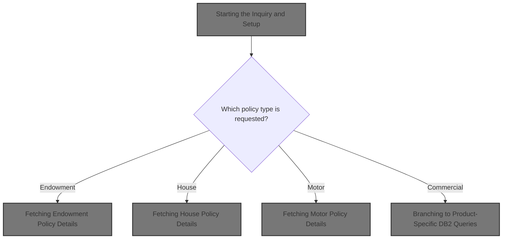
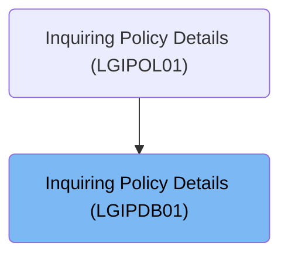
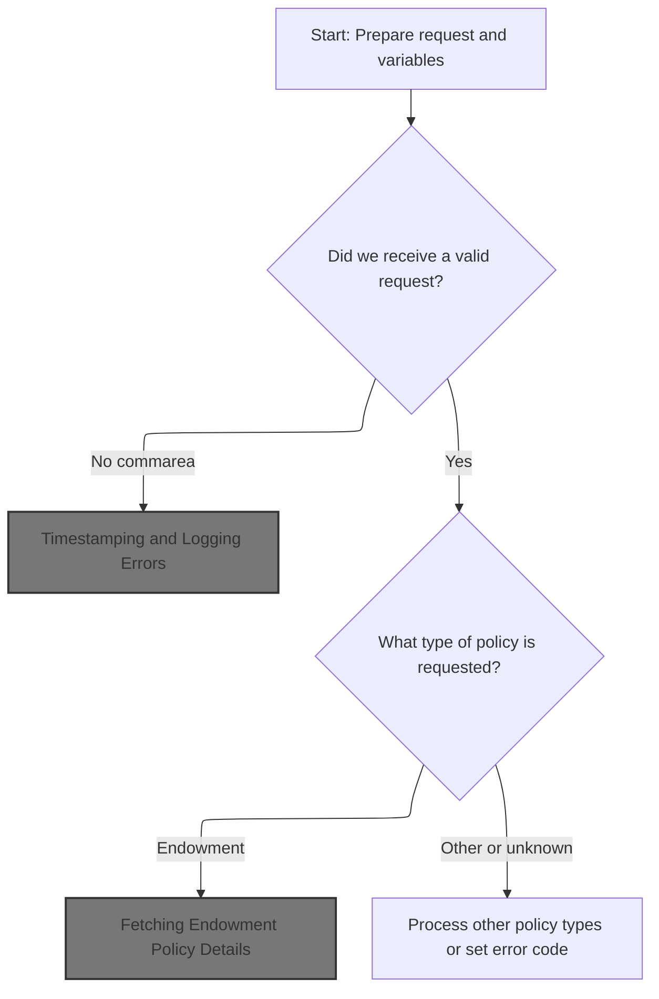
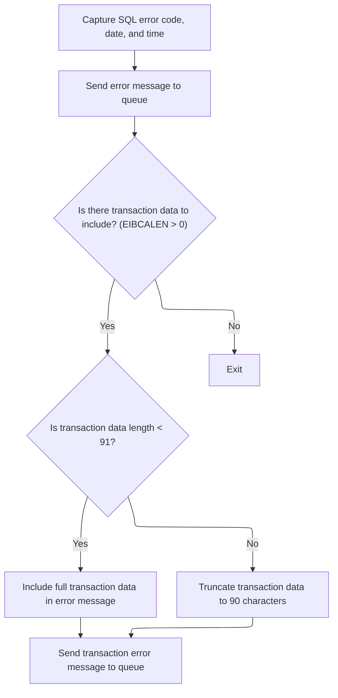
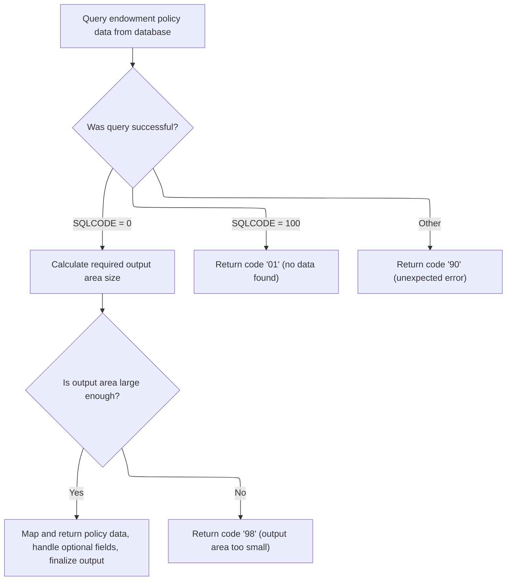
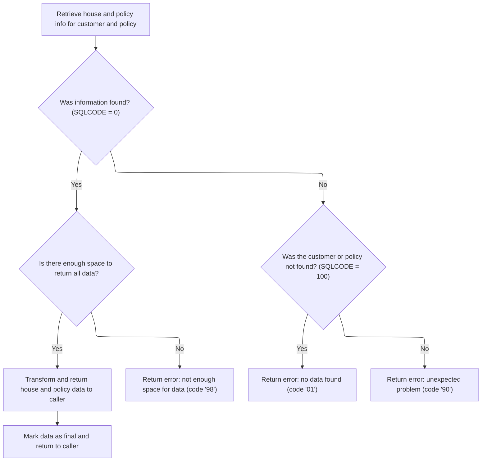
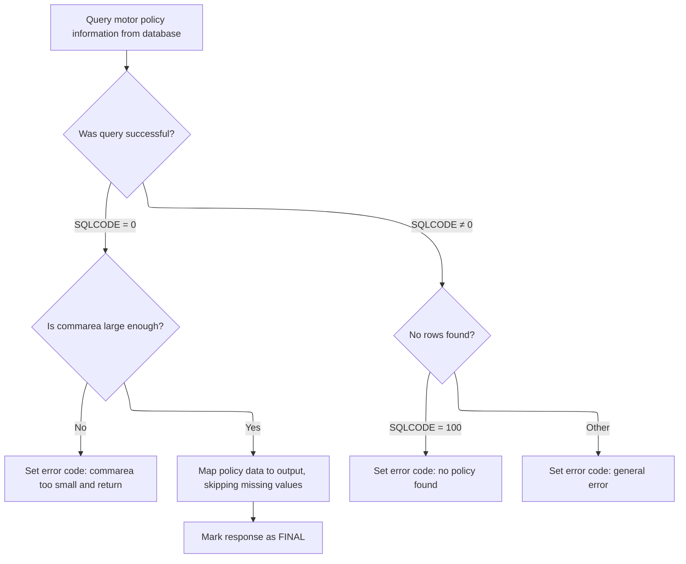

```mermaid
%%{init: {"flowchart": {"defaultRenderer": "elk"}} }%%
flowchart TD
    node1{"Which insurance type is requested? (CA-REQUEST-ID)"}
    click node1 openCode "base/src/lgipdb01.cbl:283:310"
    node1 -->|"House (01IHOU)"| node2["Initialize house data and retrieve house info"]
    click node2 openCode "base/src/lgipdb01.cbl:284:285"
    node1 -->|"Motor (01IMOT)"| node3["Initialize motor data and retrieve motor info"]
    click node3 openCode "base/src/lgipdb01.cbl:288:289"
    node1 -->|"01ICOM"| node4["Initialize commercial data and retrieve commercial info 1"]
    click node4 openCode "base/src/lgipdb01.cbl:292:293"
    node1 -->|"02ICOM"| node5["Initialize commercial data and retrieve commercial info 2"]
    click node5 openCode "base/src/lgipdb01.cbl:296:297"
    node1 -->|"03ICOM"| node6["Initialize commercial data and retrieve commercial info 3"]
    click node6 openCode "base/src/lgipdb01.cbl:300:301"
    node1 -->|"05ICOM"| node7["Initialize commercial data and retrieve commercial info 5"]
    click node7 openCode "base/src/lgipdb01.cbl:304:305"
    node1 -->|"Any other value"| node8["Set return code to '99' (error)"]
    click node8 openCode "base/src/lgipdb01.cbl:308:309"

classDef HeadingStyle fill:#777777,stroke:#333,stroke-width:2px;

%% Swimm:
%% %%{init: {"flowchart": {"defaultRenderer": "elk"}} }%%
%% flowchart TD
%%     node1{"Which insurance type is requested? (<SwmToken path="base/src/lgipdb01.cbl" pos="275:9:13" line-data="           MOVE FUNCTION UPPER-CASE(CA-REQUEST-ID) TO WS-REQUEST-ID">`CA-REQUEST-ID`</SwmToken>)"}
%%     click node1 openCode "<SwmPath>[base/src/lgipdb01.cbl](base/src/lgipdb01.cbl)</SwmPath>:283:310"
%%     node1 -->|"House (<SwmToken path="base/src/lgipdb01.cbl" pos="283:4:4" line-data="             WHEN &#39;01IHOU&#39;">`01IHOU`</SwmToken>)"| node2["Initialize house data and retrieve house info"]
%%     click node2 openCode "<SwmPath>[base/src/lgipdb01.cbl](base/src/lgipdb01.cbl)</SwmPath>:284:285"
%%     node1 -->|"Motor (<SwmToken path="base/src/lgipdb01.cbl" pos="287:4:4" line-data="             WHEN &#39;01IMOT&#39;">`01IMOT`</SwmToken>)"| node3["Initialize motor data and retrieve motor info"]
%%     click node3 openCode "<SwmPath>[base/src/lgipdb01.cbl](base/src/lgipdb01.cbl)</SwmPath>:288:289"
%%     node1 -->|"<SwmToken path="base/src/lgipdb01.cbl" pos="291:4:4" line-data="             WHEN &#39;01ICOM&#39;">`01ICOM`</SwmToken>"| node4["Initialize commercial data and retrieve commercial info 1"]
%%     click node4 openCode "<SwmPath>[base/src/lgipdb01.cbl](base/src/lgipdb01.cbl)</SwmPath>:292:293"
%%     node1 -->|"<SwmToken path="base/src/lgipdb01.cbl" pos="295:4:4" line-data="             WHEN &#39;02ICOM&#39;">`02ICOM`</SwmToken>"| node5["Initialize commercial data and retrieve commercial info 2"]
%%     click node5 openCode "<SwmPath>[base/src/lgipdb01.cbl](base/src/lgipdb01.cbl)</SwmPath>:296:297"
%%     node1 -->|"<SwmToken path="base/src/lgipdb01.cbl" pos="299:4:4" line-data="             WHEN &#39;03ICOM&#39;">`03ICOM`</SwmToken>"| node6["Initialize commercial data and retrieve commercial info 3"]
%%     click node6 openCode "<SwmPath>[base/src/lgipdb01.cbl](base/src/lgipdb01.cbl)</SwmPath>:300:301"
%%     node1 -->|"<SwmToken path="base/src/lgipdb01.cbl" pos="303:4:4" line-data="             WHEN &#39;05ICOM&#39;">`05ICOM`</SwmToken>"| node7["Initialize commercial data and retrieve commercial info 5"]
%%     click node7 openCode "<SwmPath>[base/src/lgipdb01.cbl](base/src/lgipdb01.cbl)</SwmPath>:304:305"
%%     node1 -->|"Any other value"| node8["Set return code to '99' (error)"]
%%     click node8 openCode "<SwmPath>[base/src/lgipdb01.cbl](base/src/lgipdb01.cbl)</SwmPath>:308:309"
%% 
%% classDef HeadingStyle fill:#777777,stroke:#333,stroke-width:2px;
```

# Overview

This document describes the flow for inquiring insurance policy details. The process validates the request, identifies the policy type, and retrieves the corresponding policy information for Endowment, House, Motor, or Commercial products. The flow returns detailed policy data or an error code based on the outcome.



## Dependencies

### Programs

- <SwmToken path="base/src/lgipdb01.cbl" pos="13:6:6" line-data="       PROGRAM-ID. LGIPDB01.">`LGIPDB01`</SwmToken> (<SwmPath>[base/src/lgipdb01.cbl](base/src/lgipdb01.cbl)</SwmPath>)
- LGSTSQ (<SwmPath>[base/src/lgstsq.cbl](base/src/lgstsq.cbl)</SwmPath>)

### Copybooks

- SQLCA
- LGPOLICY (<SwmPath>[base/src/lgpolicy.cpy](base/src/lgpolicy.cpy)</SwmPath>)
- LGCMAREA (<SwmPath>[base/src/lgcmarea.cpy](base/src/lgcmarea.cpy)</SwmPath>)

# Where is this program used?

This program is used once, as represented in the following diagram:



## Input and Output Tables/Files used in the Program

| Table / File Name | Type                                                                                                                    | Description                                           | Usage Mode | Key Fields / Layout Highlights                                                                                                                                                                                                                                                                                                                                                                                                                                                                                                                                                                                                                                                                                                                                                                                                                                                                                                                                                                                                                                                                                                                                                                                                                                                                                                                                                                                                                                                                                                                                                                                                                                                                                                                                                                                                                                                                                                                                                                                                                                                                                                                                                                                                                                                                                                                                                                                                                                                                                                                                                                                                                                                                                                                                                                                                                                                                                                                                                                                                                                                                                                                                                                                                                                                                                                                                                                                                                                                                                                                                                                                                                                                                                                                                                                                                                                                                                                                                                                                                                                                                                                                                                                                                                                                                                                                                                                                                                                                                                                                                                                                                                                                                                                                                                                                                                                                                                                                                                                                                                                                                                                                                                                                                                                                                                                                                                                                                                                                                                                                                                                                                                                                                                                                                                                                                                                                                                                                                                                                                                                                                                                                                                                                                                                                                                                                                                                                                                                                                                                                                                                                                                                                                                                                                                                                                                                                                                                                                                                                                                                                                                                                                                                                                                                                                                                                                                                                                                                                                                                                                                                                                                                                                                                                                                                                                                                                                                                                                                                                                                                                                                                                                                                                                                                                                                                                                                                                                                                                                                                                                                                                                                                                                                                                                                                                                                                                                                                                                                                                                                                                                                                                                                                                                                                                                                                                                                                                                                                                                                                                                                                                                                                                                                                                                                                                                                                                                                                                                                                                                                                                                                                                                                                                                                                                                                                                                                                                                                                                                                                                                                                                                                                                                                                                                                                                                                                                                                                                                                                                                                                                                                                                                                                                                                                                                                                                                                                                                                                                                                                                                                                                                                                                                                                                                                                                                                                                                                                                                                                                                                                                                                                                                                                                                                                                                                                                                                                                                                                                                                                                                                                                                                                                                                                                                                                                                                                                                                                  |
| ----------------- | ----------------------------------------------------------------------------------------------------------------------- | ----------------------------------------------------- | ---------- | ------------------------------------------------------------------------------------------------------------------------------------------------------------------------------------------------------------------------------------------------------------------------------------------------------------------------------------------------------------------------------------------------------------------------------------------------------------------------------------------------------------------------------------------------------------------------------------------------------------------------------------------------------------------------------------------------------------------------------------------------------------------------------------------------------------------------------------------------------------------------------------------------------------------------------------------------------------------------------------------------------------------------------------------------------------------------------------------------------------------------------------------------------------------------------------------------------------------------------------------------------------------------------------------------------------------------------------------------------------------------------------------------------------------------------------------------------------------------------------------------------------------------------------------------------------------------------------------------------------------------------------------------------------------------------------------------------------------------------------------------------------------------------------------------------------------------------------------------------------------------------------------------------------------------------------------------------------------------------------------------------------------------------------------------------------------------------------------------------------------------------------------------------------------------------------------------------------------------------------------------------------------------------------------------------------------------------------------------------------------------------------------------------------------------------------------------------------------------------------------------------------------------------------------------------------------------------------------------------------------------------------------------------------------------------------------------------------------------------------------------------------------------------------------------------------------------------------------------------------------------------------------------------------------------------------------------------------------------------------------------------------------------------------------------------------------------------------------------------------------------------------------------------------------------------------------------------------------------------------------------------------------------------------------------------------------------------------------------------------------------------------------------------------------------------------------------------------------------------------------------------------------------------------------------------------------------------------------------------------------------------------------------------------------------------------------------------------------------------------------------------------------------------------------------------------------------------------------------------------------------------------------------------------------------------------------------------------------------------------------------------------------------------------------------------------------------------------------------------------------------------------------------------------------------------------------------------------------------------------------------------------------------------------------------------------------------------------------------------------------------------------------------------------------------------------------------------------------------------------------------------------------------------------------------------------------------------------------------------------------------------------------------------------------------------------------------------------------------------------------------------------------------------------------------------------------------------------------------------------------------------------------------------------------------------------------------------------------------------------------------------------------------------------------------------------------------------------------------------------------------------------------------------------------------------------------------------------------------------------------------------------------------------------------------------------------------------------------------------------------------------------------------------------------------------------------------------------------------------------------------------------------------------------------------------------------------------------------------------------------------------------------------------------------------------------------------------------------------------------------------------------------------------------------------------------------------------------------------------------------------------------------------------------------------------------------------------------------------------------------------------------------------------------------------------------------------------------------------------------------------------------------------------------------------------------------------------------------------------------------------------------------------------------------------------------------------------------------------------------------------------------------------------------------------------------------------------------------------------------------------------------------------------------------------------------------------------------------------------------------------------------------------------------------------------------------------------------------------------------------------------------------------------------------------------------------------------------------------------------------------------------------------------------------------------------------------------------------------------------------------------------------------------------------------------------------------------------------------------------------------------------------------------------------------------------------------------------------------------------------------------------------------------------------------------------------------------------------------------------------------------------------------------------------------------------------------------------------------------------------------------------------------------------------------------------------------------------------------------------------------------------------------------------------------------------------------------------------------------------------------------------------------------------------------------------------------------------------------------------------------------------------------------------------------------------------------------------------------------------------------------------------------------------------------------------------------------------------------------------------------------------------------------------------------------------------------------------------------------------------------------------------------------------------------------------------------------------------------------------------------------------------------------------------------------------------------------------------------------------------------------------------------------------------------------------------------------------------------------------------------------------------------------------------------------------------------------------------------------------------------------------------------------------------------------------------------------------------------------------------------------------------------------------------------------------------------------------------------------------------------------------------------------------------------------------------------------------------------------------------------------------------------------------------------------------------------------------------------------------------------------------------------------------------------------------------------------------------------------------------------------------------------------------------------------------------------------------------------------------------------------------------------------------------------------------------------------------------------------------------------------------------------------------------------------------------------------------------------------------------------------------------------------------------------------------------------------------------------------------------------------------------------------------------------------------------------------------------------------------------------------------------------------------------------------------------------------------------------------------------------------------------------------------------------------------------------------------------------------------------------------------------------------------------------------------------------------------------------------------------------------------------------------------------------------------------------------------------------------------------------------------------------------------------------------------------------------------------------------------------------------------------------------------------------------------------------------------------------------------------------------------------------------------------------------------------------------------------------------------------------------------------------------------------------------------------------------------------------------------------------------------------------------------------------------------------------------------------------------------------------------------------------------------------------------------------------------------------------------------------------------------------------------------------------------------------------------------------------------------------------------------------------------------------------------------------------------------------------------------------------------------------------------------------------------------------------------------------------------------------------------------------------------------------------------------------------------------------------------------------------------------------------------------------------------------------------------------------------------------------------------------------------------------------------------------------------------------------------------------------------------------------------------------------------------------------------------------------------------------------------------------------------------------------------------------------------------------------------------------------------------------------------------------------------------------------------------------------------------------------------------------------------------------------------------------------------------------------------------------------------------------------------------------------------------------------------------------------------------------------------------------------------------------------------------------------------------------------------------------------------------------------------------------------------------------------------------------------------------------------------------------------------------------------------------- |
| POLICY            | <SwmToken path="base/src/lgipdb01.cbl" pos="242:5:5" line-data="      * initialize DB2 host variables">`DB2`</SwmToken> | Insurance policy core details and linkage to customer | Input      | <SwmToken path="base/src/lgipdb01.cbl" pos="92:1:1" line-data="                   CustomerNumber,">`CustomerNumber`</SwmToken>, <SwmToken path="base/src/lgipdb01.cbl" pos="93:3:3" line-data="                   Policy.PolicyNumber,">`PolicyNumber`</SwmToken>, <SwmToken path="base/src/lgipdb01.cbl" pos="94:1:1" line-data="                   RequestDate,">`RequestDate`</SwmToken>, <SwmToken path="base/src/lgipdb01.cbl" pos="95:1:1" line-data="                   StartDate,">`StartDate`</SwmToken>, <SwmToken path="base/src/lgipdb01.cbl" pos="96:1:1" line-data="                   RenewalDate,">`RenewalDate`</SwmToken>, <SwmToken path="base/src/lgipdb01.cbl" pos="97:1:1" line-data="                   Address,">`Address`</SwmToken>, <SwmToken path="base/src/lgipdb01.cbl" pos="98:1:1" line-data="                   Zipcode,">`Zipcode`</SwmToken>, <SwmToken path="base/src/lgipdb01.cbl" pos="99:1:1" line-data="                   LatitudeN,">`LatitudeN`</SwmToken>, <SwmToken path="base/src/lgipdb01.cbl" pos="100:1:1" line-data="                   LongitudeW,">`LongitudeW`</SwmToken>, <SwmToken path="base/src/lgipdb01.cbl" pos="101:1:1" line-data="                   Customer,">`Customer`</SwmToken>, <SwmToken path="base/src/lgipdb01.cbl" pos="102:1:1" line-data="                   PropertyType,">`PropertyType`</SwmToken>, <SwmToken path="base/src/lgipdb01.cbl" pos="103:1:1" line-data="                   FirePeril,">`FirePeril`</SwmToken>, <SwmToken path="base/src/lgipdb01.cbl" pos="104:1:1" line-data="                   FirePremium,">`FirePremium`</SwmToken>, <SwmToken path="base/src/lgipdb01.cbl" pos="105:1:1" line-data="                   CrimePeril,">`CrimePeril`</SwmToken>, <SwmToken path="base/src/lgipdb01.cbl" pos="106:1:1" line-data="                   CrimePremium,">`CrimePremium`</SwmToken>, <SwmToken path="base/src/lgipdb01.cbl" pos="107:1:1" line-data="                   FloodPeril,">`FloodPeril`</SwmToken>, <SwmToken path="base/src/lgipdb01.cbl" pos="108:1:1" line-data="                   FloodPremium,">`FloodPremium`</SwmToken>, <SwmToken path="base/src/lgipdb01.cbl" pos="109:1:1" line-data="                   WeatherPeril,">`WeatherPeril`</SwmToken>, <SwmToken path="base/src/lgipdb01.cbl" pos="110:1:1" line-data="                   WeatherPremium,">`WeatherPremium`</SwmToken>, <SwmToken path="base/src/lgipdb01.cbl" pos="111:1:1" line-data="                   Status,">`Status`</SwmToken>, <SwmToken path="base/src/lgipdb01.cbl" pos="112:1:1" line-data="                   RejectionReason">`RejectionReason`</SwmToken>, <SwmToken path="base/src/lgipdb01.cbl" pos="331:3:3" line-data="             SELECT  ISSUEDATE,">`ISSUEDATE`</SwmToken>, <SwmToken path="base/src/lgipdb01.cbl" pos="332:1:1" line-data="                     EXPIRYDATE,">`EXPIRYDATE`</SwmToken>, <SwmToken path="base/src/lgipdb01.cbl" pos="333:1:1" line-data="                     LASTCHANGED,">`LASTCHANGED`</SwmToken>, <SwmToken path="base/src/lgipdb01.cbl" pos="334:1:1" line-data="                     BROKERID,">`BROKERID`</SwmToken>, <SwmToken path="base/src/lgipdb01.cbl" pos="335:1:1" line-data="                     BROKERSREFERENCE,">`BROKERSREFERENCE`</SwmToken>, <SwmToken path="base/src/lgipdb01.cbl" pos="336:1:1" line-data="                     PAYMENT,">`PAYMENT`</SwmToken>, <SwmToken path="base/src/lgipdb01.cbl" pos="337:1:1" line-data="                     WITHPROFITS,">`WITHPROFITS`</SwmToken>, <SwmToken path="base/src/lgipdb01.cbl" pos="338:1:1" line-data="                     EQUITIES,">`EQUITIES`</SwmToken>, <SwmToken path="base/src/lgipdb01.cbl" pos="339:1:1" line-data="                     MANAGEDFUND,">`MANAGEDFUND`</SwmToken>, <SwmToken path="base/src/lgipdb01.cbl" pos="340:1:1" line-data="                     FUNDNAME,">`FUNDNAME`</SwmToken>, <SwmToken path="base/src/lgipdb01.cbl" pos="341:1:1" line-data="                     TERM,">`TERM`</SwmToken>, <SwmToken path="base/src/lgipdb01.cbl" pos="342:1:1" line-data="                     SUMASSURED,">`SUMASSURED`</SwmToken>, <SwmToken path="base/src/lgipdb01.cbl" pos="343:1:1" line-data="                     LIFEASSURED,">`LIFEASSURED`</SwmToken>, <SwmToken path="base/src/lgipdb01.cbl" pos="344:1:1" line-data="                     PADDINGDATA,">`PADDINGDATA`</SwmToken>, <SwmToken path="base/src/lgipdb01.cbl" pos="345:1:1" line-data="                     LENGTH(PADDINGDATA)">`LENGTH`</SwmToken>, <SwmToken path="base/src/lgipdb01.cbl" pos="347:2:4" line-data="                   :DB2-EXPIRYDATE,">`DB2-EXPIRYDATE`</SwmToken>, <SwmToken path="base/src/lgipdb01.cbl" pos="348:2:4" line-data="                   :DB2-LASTCHANGED,">`DB2-LASTCHANGED`</SwmToken>, <SwmToken path="base/src/lgipdb01.cbl" pos="349:11:13" line-data="                   :DB2-BROKERID-INT INDICATOR :IND-BROKERID,">`IND-BROKERID`</SwmToken>, <SwmToken path="base/src/lgipdb01.cbl" pos="350:9:11" line-data="                   :DB2-BROKERSREF INDICATOR :IND-BROKERSREF,">`IND-BROKERSREF`</SwmToken>, <SwmToken path="base/src/lgipdb01.cbl" pos="351:11:13" line-data="                   :DB2-PAYMENT-INT INDICATOR :IND-PAYMENT,">`IND-PAYMENT`</SwmToken>, <SwmToken path="base/src/lgipdb01.cbl" pos="352:2:6" line-data="                   :DB2-E-WITHPROFITS,">`DB2-E-WITHPROFITS`</SwmToken>, <SwmToken path="base/src/lgipdb01.cbl" pos="353:2:6" line-data="                   :DB2-E-EQUITIES,">`DB2-E-EQUITIES`</SwmToken>, <SwmToken path="base/src/lgipdb01.cbl" pos="354:2:6" line-data="                   :DB2-E-MANAGEDFUND,">`DB2-E-MANAGEDFUND`</SwmToken>, <SwmToken path="base/src/lgipdb01.cbl" pos="355:2:6" line-data="                   :DB2-E-FUNDNAME,">`DB2-E-FUNDNAME`</SwmToken>, <SwmToken path="base/src/lgipdb01.cbl" pos="356:2:8" line-data="                   :DB2-E-TERM-SINT,">`DB2-E-TERM-SINT`</SwmToken>, <SwmToken path="base/src/lgipdb01.cbl" pos="357:2:8" line-data="                   :DB2-E-SUMASSURED-INT,">`DB2-E-SUMASSURED-INT`</SwmToken>, <SwmToken path="base/src/lgipdb01.cbl" pos="358:2:6" line-data="                   :DB2-E-LIFEASSURED,">`DB2-E-LIFEASSURED`</SwmToken>, <SwmToken path="base/src/lgipdb01.cbl" pos="359:11:15" line-data="                   :DB2-E-PADDINGDATA INDICATOR :IND-E-PADDINGDATA,">`IND-E-PADDINGDATA`</SwmToken>, <SwmToken path="base/src/lgipdb01.cbl" pos="360:13:17" line-data="                   :DB2-E-PADDING-LEN INDICATOR :IND-E-PADDINGDATAL">`IND-E-PADDINGDATAL`</SwmToken>, <SwmToken path="base/src/lgipdb01.cbl" pos="451:1:1" line-data="                     PROPERTYTYPE,">`PROPERTYTYPE`</SwmToken>, <SwmToken path="base/src/lgipdb01.cbl" pos="452:1:1" line-data="                     BEDROOMS,">`BEDROOMS`</SwmToken>, <SwmToken path="base/src/lgipdb01.cbl" pos="453:1:1" line-data="                     VALUE,">`VALUE`</SwmToken>, <SwmToken path="base/src/lgipdb01.cbl" pos="454:1:1" line-data="                     HOUSENAME,">`HOUSENAME`</SwmToken>, <SwmToken path="base/src/lgipdb01.cbl" pos="455:1:1" line-data="                     HOUSENUMBER,">`HOUSENUMBER`</SwmToken>, <SwmToken path="base/src/lgipdb01.cbl" pos="346:4:6" line-data="             INTO  :DB2-ISSUEDATE,">`DB2-ISSUEDATE`</SwmToken>, <SwmToken path="base/src/lgipdb01.cbl" pos="463:2:6" line-data="                   :DB2-H-PROPERTYTYPE,">`DB2-H-PROPERTYTYPE`</SwmToken>, <SwmToken path="base/src/lgipdb01.cbl" pos="464:2:8" line-data="                   :DB2-H-BEDROOMS-SINT,">`DB2-H-BEDROOMS-SINT`</SwmToken>, <SwmToken path="base/src/lgipdb01.cbl" pos="465:2:8" line-data="                   :DB2-H-VALUE-INT,">`DB2-H-VALUE-INT`</SwmToken>, <SwmToken path="base/src/lgipdb01.cbl" pos="466:2:6" line-data="                   :DB2-H-HOUSENAME,">`DB2-H-HOUSENAME`</SwmToken>, <SwmToken path="base/src/lgipdb01.cbl" pos="467:2:6" line-data="                   :DB2-H-HOUSENUMBER,">`DB2-H-HOUSENUMBER`</SwmToken>, <SwmToken path="base/src/lgipdb01.cbl" pos="468:2:6" line-data="                   :DB2-H-POSTCODE">`DB2-H-POSTCODE`</SwmToken>, <SwmToken path="base/src/lgipdb01.cbl" pos="539:1:1" line-data="                     MAKE,">`MAKE`</SwmToken>, <SwmToken path="base/src/lgipdb01.cbl" pos="540:1:1" line-data="                     MODEL,">`MODEL`</SwmToken>, <SwmToken path="base/src/lgipdb01.cbl" pos="542:1:1" line-data="                     REGNUMBER,">`REGNUMBER`</SwmToken>, <SwmToken path="base/src/lgipdb01.cbl" pos="543:1:1" line-data="                     COLOUR,">`COLOUR`</SwmToken>, <SwmToken path="base/src/lgipdb01.cbl" pos="544:1:1" line-data="                     CC,">`CC`</SwmToken>, <SwmToken path="base/src/lgipdb01.cbl" pos="545:1:1" line-data="                     YEAROFMANUFACTURE,">`YEAROFMANUFACTURE`</SwmToken>, <SwmToken path="base/src/lgipdb01.cbl" pos="546:1:1" line-data="                     PREMIUM,">`PREMIUM`</SwmToken>, <SwmToken path="base/src/lgipdb01.cbl" pos="554:2:6" line-data="                   :DB2-M-MAKE,">`DB2-M-MAKE`</SwmToken>, <SwmToken path="base/src/lgipdb01.cbl" pos="555:2:6" line-data="                   :DB2-M-MODEL,">`DB2-M-MODEL`</SwmToken>, <SwmToken path="base/src/lgipdb01.cbl" pos="556:2:8" line-data="                   :DB2-M-VALUE-INT,">`DB2-M-VALUE-INT`</SwmToken>, <SwmToken path="base/src/lgipdb01.cbl" pos="557:2:6" line-data="                   :DB2-M-REGNUMBER,">`DB2-M-REGNUMBER`</SwmToken>, <SwmToken path="base/src/lgipdb01.cbl" pos="558:2:6" line-data="                   :DB2-M-COLOUR,">`DB2-M-COLOUR`</SwmToken>, <SwmToken path="base/src/lgipdb01.cbl" pos="559:2:8" line-data="                   :DB2-M-CC-SINT,">`DB2-M-CC-SINT`</SwmToken>, <SwmToken path="base/src/lgipdb01.cbl" pos="560:2:6" line-data="                   :DB2-M-MANUFACTURED,">`DB2-M-MANUFACTURED`</SwmToken>, <SwmToken path="base/src/lgipdb01.cbl" pos="561:2:8" line-data="                   :DB2-M-PREMIUM-INT,">`DB2-M-PREMIUM-INT`</SwmToken>, <SwmToken path="base/src/lgipdb01.cbl" pos="562:2:8" line-data="                   :DB2-M-ACCIDENTS-INT">`DB2-M-ACCIDENTS-INT`</SwmToken>, <SwmToken path="base/src/lgipdb01.cbl" pos="655:2:6" line-data="                   :DB2-B-Address,">`DB2-B-Address`</SwmToken>, <SwmToken path="base/src/lgipdb01.cbl" pos="656:2:6" line-data="                   :DB2-B-Postcode,">`DB2-B-Postcode`</SwmToken>, <SwmToken path="base/src/lgipdb01.cbl" pos="657:2:6" line-data="                   :DB2-B-Latitude,">`DB2-B-Latitude`</SwmToken>, <SwmToken path="base/src/lgipdb01.cbl" pos="658:2:6" line-data="                   :DB2-B-Longitude,">`DB2-B-Longitude`</SwmToken>, <SwmToken path="base/src/lgipdb01.cbl" pos="659:2:6" line-data="                   :DB2-B-Customer,">`DB2-B-Customer`</SwmToken>, <SwmToken path="base/src/lgipdb01.cbl" pos="660:2:6" line-data="                   :DB2-B-PropType,">`DB2-B-PropType`</SwmToken>, <SwmToken path="base/src/lgipdb01.cbl" pos="182:3:9" line-data="           03 DB2-B-FirePeril-Int      PIC S9(4) COMP.">`DB2-B-FirePeril-Int`</SwmToken>, <SwmToken path="base/src/lgipdb01.cbl" pos="183:3:9" line-data="           03 DB2-B-FirePremium-Int    PIC S9(9) COMP.">`DB2-B-FirePremium-Int`</SwmToken>, <SwmToken path="base/src/lgipdb01.cbl" pos="184:3:9" line-data="           03 DB2-B-CrimePeril-Int     PIC S9(4) COMP.">`DB2-B-CrimePeril-Int`</SwmToken>, <SwmToken path="base/src/lgipdb01.cbl" pos="185:3:9" line-data="           03 DB2-B-CrimePremium-Int   PIC S9(9) COMP.">`DB2-B-CrimePremium-Int`</SwmToken>, <SwmToken path="base/src/lgipdb01.cbl" pos="186:3:9" line-data="           03 DB2-B-FloodPeril-Int     PIC S9(4) COMP.">`DB2-B-FloodPeril-Int`</SwmToken>, <SwmToken path="base/src/lgipdb01.cbl" pos="187:3:9" line-data="           03 DB2-B-FloodPremium-Int   PIC S9(9) COMP.">`DB2-B-FloodPremium-Int`</SwmToken>, <SwmToken path="base/src/lgipdb01.cbl" pos="188:3:9" line-data="           03 DB2-B-WeatherPeril-Int   PIC S9(4) COMP.">`DB2-B-WeatherPeril-Int`</SwmToken>, <SwmToken path="base/src/lgipdb01.cbl" pos="189:3:9" line-data="           03 DB2-B-WeatherPremium-Int PIC S9(9) COMP.">`DB2-B-WeatherPremium-Int`</SwmToken>, <SwmToken path="base/src/lgipdb01.cbl" pos="190:3:9" line-data="           03 DB2-B-Status-Int         PIC S9(4) COMP.">`DB2-B-Status-Int`</SwmToken>, <SwmToken path="base/src/lgipdb01.cbl" pos="670:2:6" line-data="                   :DB2-B-RejectReason">`DB2-B-RejectReason`</SwmToken>, <SwmToken path="base/src/lgipdb01.cbl" pos="263:11:15" line-data="           MOVE CA-CUSTOMER-NUM TO DB2-CUSTOMERNUM-INT">`DB2-CUSTOMERNUM-INT`</SwmToken> |

&nbsp;

## Detailed View of the Program's Functionality

# LGSTSQ Error Message Queueing Logic

## Initialization and Setup

- The program starts by clearing out the message and receive buffers to ensure no leftover data from previous invocations.
- It retrieves the system identifier and the name of the program that invoked this routine, storing these for later use in message routing and logging.

## Determining Invocation Mode

- The program checks if it was called directly (linked) or triggered by a queue receive operation.
- If called directly, it sets a flag indicating this mode, copies the incoming message data into the output buffer, and sets the message length based on the input.
- If triggered by a queue receive, it performs a receive operation to get the message, sets a different flag, copies the received data into the output buffer, and adjusts the message length to account for header information.

## Queue Name Handling

- By default, the target queue name for error messages is set to a standard value.
- If the message starts with a special prefix indicating a custom queue (e.g., "Q=xxxx"), the program extracts the custom queue extension, adjusts the message buffer to remove the prefix, and updates the message length accordingly.

## Message Length Adjustment

- The program adds a fixed offset to the message length to account for header or control information before writing to the queues.

## Writing to Queues

- The error message is written to a transient data queue for system logging.
- The same message is also written to a temporary storage queue for application-level tracking. If there is no space available, the operation is ignored rather than causing the task to wait.

## Special Handling for Received Messages

- If the program was triggered by a queue receive, it sends a control text to the terminal, erases the screen, waits for user acknowledgment, and frees the keyboard resource.

## Program Termination

- The program ends by returning control to the caller or system.

# <SwmToken path="base/src/lgipdb01.cbl" pos="13:6:6" line-data="       PROGRAM-ID. LGIPDB01.">`LGIPDB01`</SwmToken> Policy Inquiry Flow

## Mainline Initialization

- The entry point sets up all runtime and database variables, including transaction context and pointers to the input buffer.
- It clears out all <SwmToken path="base/src/lgipdb01.cbl" pos="242:5:5" line-data="      * initialize DB2 host variables">`DB2`</SwmToken> host variables to prevent accidental use of stale data.
- If the input buffer is missing, it logs an error message and immediately aborts the transaction.

## Preparing for Policy Inquiry

- The program initializes the return code and stores the input buffer length.
- It converts customer and policy numbers from the input buffer into DB2-compatible integer formats.
- These values are also saved in the error message structure for potential logging.
- The request type is uppercased for consistent handling.

## Policy Type Branching

- The program checks the request type and branches to the appropriate handler for each supported policy type:
  - Endowment
  - House
  - Motor
  - Several commercial variants
- If the request type is not recognized, it sets an error code indicating an unsupported request.

## Endowment Policy Inquiry

- The handler for endowment policies runs a database query joining the policy and endowment tables using the provided customer and policy numbers.
- If the query succeeds:
  - It calculates the required output buffer size, including any variable-length fields.
  - If the buffer is too small, it sets an error code and returns.
  - Otherwise, it copies all relevant fields from the database to the output buffer, skipping any fields that are null.
  - It marks the end of the policy data with a special indicator.
- If no data is found, it sets an error code for "not found."
- For any other database error, it sets a general error code and logs the error message.

## House Policy Inquiry

- The handler for house policies runs a database query joining the policy and house tables.
- If the query succeeds:
  - It calculates the required output buffer size.
  - If the buffer is too small, it sets an error code and returns.
  - Otherwise, it copies all relevant fields from the database to the output buffer, skipping any fields that are null.
  - It marks the end of the policy data with a special indicator.
- If no data is found, it sets an error code for "not found."
- For any other database error, it sets a general error code and logs the error message.

## Motor Policy Inquiry

- The handler for motor policies runs a database query joining the policy and motor tables.
- If the query succeeds:
  - It calculates the required output buffer size.
  - If the buffer is too small, it sets an error code and returns.
  - Otherwise, it copies all relevant fields from the database to the output buffer, skipping any fields that are null.
  - It marks the end of the policy data with a special indicator.
- If no data is found, it sets an error code for "not found."
- For any other database error, it sets a general error code and logs the error message.

## Commercial Policy Inquiry

- Several handlers exist for different commercial policy inquiry types, each running a database query with slightly different selection criteria.
- The logic for buffer size calculation, data copying, and error handling is similar to the other policy types.

## Error Message Logging

- When an error occurs, the program constructs an error message including the SQL error code, current date and time, and relevant customer/policy information.
- It sends this message to the error queue using the LGSTSQ routine.
- If there is input buffer data, up to 90 bytes of it are also sent to the error queue for additional context.

## Program Termination

- After handling the request or error, the program returns control to the caller, ensuring that the appropriate return code is set in the output buffer.

# Data Definitions

| Table / Record Name | Type                                                                                                                    | Short Description                                     | Usage Mode             |
| ------------------- | ----------------------------------------------------------------------------------------------------------------------- | ----------------------------------------------------- | ---------------------- |
| POLICY              | <SwmToken path="base/src/lgipdb01.cbl" pos="242:5:5" line-data="      * initialize DB2 host variables">`DB2`</SwmToken> | Insurance policy core details and linkage to customer | Input (DECLARE/SELECT) |

&nbsp;

# Rule Definition

| Paragraph Name                                                                                                                                                                                                                                                                                                                                                                                                                                                                                                                                                                                                                                                                                                                                           | Rule ID | Category          | Description                                                                                                                                                                | Conditions                                                                                                                                                                                                                                                                                                                                                                                                                                                                                                                                                                                                                                                                                                                                                                                                                                                                                                                                                                                 | Remarks                                                                                                                                                                                                                                                                                                                                                                                                                                                                                                                                                                                                                                                                                                                                                                                                                                                                                                                                                                              |
| -------------------------------------------------------------------------------------------------------------------------------------------------------------------------------------------------------------------------------------------------------------------------------------------------------------------------------------------------------------------------------------------------------------------------------------------------------------------------------------------------------------------------------------------------------------------------------------------------------------------------------------------------------------------------------------------------------------------------------------------------------- | ------- | ----------------- | -------------------------------------------------------------------------------------------------------------------------------------------------------------------------- | ------------------------------------------------------------------------------------------------------------------------------------------------------------------------------------------------------------------------------------------------------------------------------------------------------------------------------------------------------------------------------------------------------------------------------------------------------------------------------------------------------------------------------------------------------------------------------------------------------------------------------------------------------------------------------------------------------------------------------------------------------------------------------------------------------------------------------------------------------------------------------------------------------------------------------------------------------------------------------------------ | ------------------------------------------------------------------------------------------------------------------------------------------------------------------------------------------------------------------------------------------------------------------------------------------------------------------------------------------------------------------------------------------------------------------------------------------------------------------------------------------------------------------------------------------------------------------------------------------------------------------------------------------------------------------------------------------------------------------------------------------------------------------------------------------------------------------------------------------------------------------------------------------------------------------------------------------------------------------------------------ |
| MAINLINE SECTION                                                                                                                                                                                                                                                                                                                                                                                                                                                                                                                                                                                                                                                                                                                                         | RL-001  | Conditional Logic | Selects which type of policy inquiry to perform (Endowment, House, Motor, Commercial) based on the request ID provided in the input commarea.                              | Request ID field in commarea must be present and uppercased. Must match one of the supported inquiry types: <SwmToken path="base/src/lgipdb01.cbl" pos="279:4:4" line-data="             WHEN &#39;01IEND&#39;">`01IEND`</SwmToken>, <SwmToken path="base/src/lgipdb01.cbl" pos="283:4:4" line-data="             WHEN &#39;01IHOU&#39;">`01IHOU`</SwmToken>, <SwmToken path="base/src/lgipdb01.cbl" pos="287:4:4" line-data="             WHEN &#39;01IMOT&#39;">`01IMOT`</SwmToken>, <SwmToken path="base/src/lgipdb01.cbl" pos="291:4:4" line-data="             WHEN &#39;01ICOM&#39;">`01ICOM`</SwmToken>, <SwmToken path="base/src/lgipdb01.cbl" pos="295:4:4" line-data="             WHEN &#39;02ICOM&#39;">`02ICOM`</SwmToken>, <SwmToken path="base/src/lgipdb01.cbl" pos="299:4:4" line-data="             WHEN &#39;03ICOM&#39;">`03ICOM`</SwmToken>, <SwmToken path="base/src/lgipdb01.cbl" pos="303:4:4" line-data="             WHEN &#39;05ICOM&#39;">`05ICOM`</SwmToken>. | Supported request IDs: <SwmToken path="base/src/lgipdb01.cbl" pos="279:4:4" line-data="             WHEN &#39;01IEND&#39;">`01IEND`</SwmToken>, <SwmToken path="base/src/lgipdb01.cbl" pos="283:4:4" line-data="             WHEN &#39;01IHOU&#39;">`01IHOU`</SwmToken>, <SwmToken path="base/src/lgipdb01.cbl" pos="287:4:4" line-data="             WHEN &#39;01IMOT&#39;">`01IMOT`</SwmToken>, <SwmToken path="base/src/lgipdb01.cbl" pos="291:4:4" line-data="             WHEN &#39;01ICOM&#39;">`01ICOM`</SwmToken>, <SwmToken path="base/src/lgipdb01.cbl" pos="295:4:4" line-data="             WHEN &#39;02ICOM&#39;">`02ICOM`</SwmToken>, <SwmToken path="base/src/lgipdb01.cbl" pos="299:4:4" line-data="             WHEN &#39;03ICOM&#39;">`03ICOM`</SwmToken>, <SwmToken path="base/src/lgipdb01.cbl" pos="303:4:4" line-data="             WHEN &#39;05ICOM&#39;">`05ICOM`</SwmToken>. Output format depends on policy type, with specific field sizes for each type. |
| MAINLINE SECTION                                                                                                                                                                                                                                                                                                                                                                                                                                                                                                                                                                                                                                                                                                                                         | RL-002  | Conditional Logic | Validates that a commarea is present and of sufficient length before processing the request.                                                                               | EIBCALEN (commarea length) must be greater than zero and sufficient for the required output.                                                                                                                                                                                                                                                                                                                                                                                                                                                                                                                                                                                                                                                                                                                                                                                                                                                                                               | If EIBCALEN is zero, set error message and abend with code 'LGCA'. If EIBCALEN is less than required length for output, set return code to '98'.                                                                                                                                                                                                                                                                                                                                                                                                                                                                                                                                                                                                                                                                                                                                                                                                                                     |
| <SwmToken path="base/src/lgipdb01.cbl" pos="281:3:9" line-data="               PERFORM GET-ENDOW-DB2-INFO">`GET-ENDOW-DB2-INFO`</SwmToken>, <SwmToken path="base/src/lgipdb01.cbl" pos="285:3:9" line-data="               PERFORM GET-HOUSE-DB2-INFO">`GET-HOUSE-DB2-INFO`</SwmToken>, <SwmToken path="base/src/lgipdb01.cbl" pos="289:3:9" line-data="               PERFORM GET-MOTOR-DB2-INFO">`GET-MOTOR-DB2-INFO`</SwmToken>, <SwmToken path="base/src/lgipdb01.cbl" pos="293:3:11" line-data="               PERFORM GET-COMMERCIAL-DB2-INFO-1">`GET-COMMERCIAL-DB2-INFO-1`</SwmToken>, <SwmToken path="base/src/lgipdb01.cbl" pos="297:3:11" line-data="               PERFORM GET-COMMERCIAL-DB2-INFO-2">`GET-COMMERCIAL-DB2-INFO-2`</SwmToken> | RL-003  | Computation       | Executes SQL SELECT statements to retrieve policy details, handling null values using indicator variables and mapping results to output fields.                            | SQL SELECT must succeed (SQLCODE = 0). Indicator variables for nullable columns must be checked before moving values.                                                                                                                                                                                                                                                                                                                                                                                                                                                                                                                                                                                                                                                                                                                                                                                                                                                                      | Indicator variables are set to -1 if column is null. Only <SwmToken path="base/src/lgipdb01.cbl" pos="379:13:15" line-data="      *      check whether PADDINGDATA field is non-null">`non-null`</SwmToken> values are moved to output fields. Output formats are fixed-length alphanumeric or numeric fields as defined for each policy type.                                                                                                                                                                                                                                                                                                                                                                                                                                                                                                                                                                                                                                       |
| <SwmToken path="base/src/lgipdb01.cbl" pos="281:3:9" line-data="               PERFORM GET-ENDOW-DB2-INFO">`GET-ENDOW-DB2-INFO`</SwmToken>, <SwmToken path="base/src/lgipdb01.cbl" pos="285:3:9" line-data="               PERFORM GET-HOUSE-DB2-INFO">`GET-HOUSE-DB2-INFO`</SwmToken>, <SwmToken path="base/src/lgipdb01.cbl" pos="289:3:9" line-data="               PERFORM GET-MOTOR-DB2-INFO">`GET-MOTOR-DB2-INFO`</SwmToken>, <SwmToken path="base/src/lgipdb01.cbl" pos="293:3:11" line-data="               PERFORM GET-COMMERCIAL-DB2-INFO-1">`GET-COMMERCIAL-DB2-INFO-1`</SwmToken>, <SwmToken path="base/src/lgipdb01.cbl" pos="297:3:11" line-data="               PERFORM GET-COMMERCIAL-DB2-INFO-2">`GET-COMMERCIAL-DB2-INFO-2`</SwmToken> | RL-004  | Data Assignment   | Constructs the output buffer for the response, ensuring all required fields are present and marking the end of the data with a 'FINAL' string.                             | Output buffer must be large enough to hold all required fields and end marker.                                                                                                                                                                                                                                                                                                                                                                                                                                                                                                                                                                                                                                                                                                                                                                                                                                                                                                             | End marker is the string 'FINAL' placed at the end of the policy data. Output buffer sizes are calculated based on header/trailer and policy-specific lengths.                                                                                                                                                                                                                                                                                                                                                                                                                                                                                                                                                                                                                                                                                                                                                                                                                       |
| <SwmToken path="base/src/lgipdb01.cbl" pos="253:3:7" line-data="             PERFORM WRITE-ERROR-MESSAGE">`WRITE-ERROR-MESSAGE`</SwmToken>                                                                                                                                                                                                                                                                                                                                                                                                                                                                                                                                                                                                               | RL-005  | Data Assignment   | Formats and writes error messages to the system queue, including contextual information such as date, time, program name, customer and policy numbers, and SQL error code. | Any error condition encountered during processing (missing commarea, SQL error, insufficient buffer, etc.).                                                                                                                                                                                                                                                                                                                                                                                                                                                                                                                                                                                                                                                                                                                                                                                                                                                                                | Error message format includes: date (MMDDYYYY), time (HHMMSS), program name (<SwmToken path="base/src/lgipdb01.cbl" pos="13:6:6" line-data="       PROGRAM-ID. LGIPDB01.">`LGIPDB01`</SwmToken>), customer number (10 digits), policy number (10 digits), SQL request description (16 chars), SQLCODE (+99999). Message is written to queue 'CSMT' via LGSTSQ program.                                                                                                                                                                                                                                                                                                                                                                                                                                                                                                                                                                                                               |
| <SwmPath>[base/src/lgstsq.cbl](base/src/lgstsq.cbl)</SwmPath> MAINLINE SECTION                                                                                                                                                                                                                                                                                                                                                                                                                                                                                                                                                                                                                                                                           | RL-006  | Conditional Logic | Determines the queue name for error reporting based on the input message. If the message starts with 'Q=', uses a specific queue name; otherwise, uses the default.        | If <SwmToken path="base/src/lgstsq.cbl" pos="70:9:13" line-data="              MOVE COMMA-DATA  TO WRITE-MSG-MSG">`WRITE-MSG-MSG`</SwmToken> starts with 'Q=', extract queue extension and use <SwmToken path="base/src/lgstsq.cbl" pos="6:19:19" line-data="      *  parm Q=nnnn is passed then Queue name GENAnnnn is used        *">`GENAnnnn`</SwmToken> as queue name; else use 'GENAERRS'.                                                                                                                                                                                                                                                                                                                                                                                                                                                                                                                                                                                           | Default queue name is 'GENAERRS'. If 'Q=nnnn' is present, queue name is <SwmToken path="base/src/lgstsq.cbl" pos="6:19:19" line-data="      *  parm Q=nnnn is passed then Queue name GENAnnnn is used        *">`GENAnnnn`</SwmToken>.                                                                                                                                                                                                                                                                                                                                                                                                                                                                                                                                                                                                                                                                                                                                               |
| <SwmToken path="base/src/lgipdb01.cbl" pos="301:3:11" line-data="               PERFORM GET-COMMERCIAL-DB2-INFO-3">`GET-COMMERCIAL-DB2-INFO-3`</SwmToken>, <SwmToken path="base/src/lgipdb01.cbl" pos="305:3:11" line-data="               PERFORM GET-COMMERCIAL-DB2-INFO-5">`GET-COMMERCIAL-DB2-INFO-5`</SwmToken>                                                                                                                                                                                                                                                                                                                                                                                                                                     | RL-007  | Computation       | Handles multiple records returned by cursor-based queries, limiting the number of records processed and returned.                                                          | Cursor-based query returns more than one record. Limit is set to 20 records.                                                                                                                                                                                                                                                                                                                                                                                                                                                                                                                                                                                                                                                                                                                                                                                                                                                                                                               | Maximum of 20 records processed per request. If more than 20, set SQLCODE to 17 to stop processing.                                                                                                                                                                                                                                                                                                                                                                                                                                                                                                                                                                                                                                                                                                                                                                                                                                                                                  |

# User Stories

## User Story 1: Initiate and validate policy inquiry

---

### Story Description:

As a system, I want to validate incoming requests and select the appropriate policy inquiry type so that users receive accurate responses for their specific policy needs.

---

### Business Rule Mapping:

| Rule ID | Paragraph Name   | Rule Description                                                                                                                              |
| ------- | ---------------- | --------------------------------------------------------------------------------------------------------------------------------------------- |
| RL-001  | MAINLINE SECTION | Selects which type of policy inquiry to perform (Endowment, House, Motor, Commercial) based on the request ID provided in the input commarea. |
| RL-002  | MAINLINE SECTION | Validates that a commarea is present and of sufficient length before processing the request.                                                  |

---

### Relevant Functionality:

- **MAINLINE SECTION**
  1. **RL-001:**
     - Read request ID from input commarea
     - Convert to uppercase
     - Evaluate request ID:
       - If <SwmToken path="base/src/lgipdb01.cbl" pos="279:4:4" line-data="             WHEN &#39;01IEND&#39;">`01IEND`</SwmToken>, perform Endowment inquiry
       - If <SwmToken path="base/src/lgipdb01.cbl" pos="283:4:4" line-data="             WHEN &#39;01IHOU&#39;">`01IHOU`</SwmToken>, perform House inquiry
       - If <SwmToken path="base/src/lgipdb01.cbl" pos="287:4:4" line-data="             WHEN &#39;01IMOT&#39;">`01IMOT`</SwmToken>, perform Motor inquiry
       - If <SwmToken path="base/src/lgipdb01.cbl" pos="291:4:4" line-data="             WHEN &#39;01ICOM&#39;">`01ICOM`</SwmToken>, <SwmToken path="base/src/lgipdb01.cbl" pos="295:4:4" line-data="             WHEN &#39;02ICOM&#39;">`02ICOM`</SwmToken>, <SwmToken path="base/src/lgipdb01.cbl" pos="299:4:4" line-data="             WHEN &#39;03ICOM&#39;">`03ICOM`</SwmToken>, <SwmToken path="base/src/lgipdb01.cbl" pos="303:4:4" line-data="             WHEN &#39;05ICOM&#39;">`05ICOM`</SwmToken>, perform Commercial inquiry (different variants)
       - If none match, set return code to '99'
  2. **RL-002:**
     - If commarea length is zero:
       - Set error message
       - Write error to queue
       - ABEND with code 'LGCA'
     - Else, if commarea length is less than required for output:
       - Set return code to '98'
       - Return to caller

## User Story 2: Retrieve and format policy details, including multiple commercial records

---

### Story Description:

As a user, I want to receive complete and correctly formatted policy details, including support for multiple commercial policy records, so that I can understand my policy information and review multiple policies efficiently.

---

### Business Rule Mapping:

| Rule ID | Paragraph Name                                                                                                                                                                                                                                                                                                                                                                                                                                                                                                                                                                                                                                                                                                                                           | Rule Description                                                                                                                                |
| ------- | -------------------------------------------------------------------------------------------------------------------------------------------------------------------------------------------------------------------------------------------------------------------------------------------------------------------------------------------------------------------------------------------------------------------------------------------------------------------------------------------------------------------------------------------------------------------------------------------------------------------------------------------------------------------------------------------------------------------------------------------------------- | ----------------------------------------------------------------------------------------------------------------------------------------------- |
| RL-003  | <SwmToken path="base/src/lgipdb01.cbl" pos="281:3:9" line-data="               PERFORM GET-ENDOW-DB2-INFO">`GET-ENDOW-DB2-INFO`</SwmToken>, <SwmToken path="base/src/lgipdb01.cbl" pos="285:3:9" line-data="               PERFORM GET-HOUSE-DB2-INFO">`GET-HOUSE-DB2-INFO`</SwmToken>, <SwmToken path="base/src/lgipdb01.cbl" pos="289:3:9" line-data="               PERFORM GET-MOTOR-DB2-INFO">`GET-MOTOR-DB2-INFO`</SwmToken>, <SwmToken path="base/src/lgipdb01.cbl" pos="293:3:11" line-data="               PERFORM GET-COMMERCIAL-DB2-INFO-1">`GET-COMMERCIAL-DB2-INFO-1`</SwmToken>, <SwmToken path="base/src/lgipdb01.cbl" pos="297:3:11" line-data="               PERFORM GET-COMMERCIAL-DB2-INFO-2">`GET-COMMERCIAL-DB2-INFO-2`</SwmToken> | Executes SQL SELECT statements to retrieve policy details, handling null values using indicator variables and mapping results to output fields. |
| RL-004  | <SwmToken path="base/src/lgipdb01.cbl" pos="281:3:9" line-data="               PERFORM GET-ENDOW-DB2-INFO">`GET-ENDOW-DB2-INFO`</SwmToken>, <SwmToken path="base/src/lgipdb01.cbl" pos="285:3:9" line-data="               PERFORM GET-HOUSE-DB2-INFO">`GET-HOUSE-DB2-INFO`</SwmToken>, <SwmToken path="base/src/lgipdb01.cbl" pos="289:3:9" line-data="               PERFORM GET-MOTOR-DB2-INFO">`GET-MOTOR-DB2-INFO`</SwmToken>, <SwmToken path="base/src/lgipdb01.cbl" pos="293:3:11" line-data="               PERFORM GET-COMMERCIAL-DB2-INFO-1">`GET-COMMERCIAL-DB2-INFO-1`</SwmToken>, <SwmToken path="base/src/lgipdb01.cbl" pos="297:3:11" line-data="               PERFORM GET-COMMERCIAL-DB2-INFO-2">`GET-COMMERCIAL-DB2-INFO-2`</SwmToken> | Constructs the output buffer for the response, ensuring all required fields are present and marking the end of the data with a 'FINAL' string.  |
| RL-007  | <SwmToken path="base/src/lgipdb01.cbl" pos="301:3:11" line-data="               PERFORM GET-COMMERCIAL-DB2-INFO-3">`GET-COMMERCIAL-DB2-INFO-3`</SwmToken>, <SwmToken path="base/src/lgipdb01.cbl" pos="305:3:11" line-data="               PERFORM GET-COMMERCIAL-DB2-INFO-5">`GET-COMMERCIAL-DB2-INFO-5`</SwmToken>                                                                                                                                                                                                                                                                                                                                                                                                                                     | Handles multiple records returned by cursor-based queries, limiting the number of records processed and returned.                               |

---

### Relevant Functionality:

- <SwmToken path="base/src/lgipdb01.cbl" pos="281:3:9" line-data="               PERFORM GET-ENDOW-DB2-INFO">`GET-ENDOW-DB2-INFO`</SwmToken>
  1. **RL-003:**
     - Execute SQL SELECT for requested policy type
     - If SQLCODE = 0:
       - For each nullable column:
         - If indicator variable != -1, move value to output field
       - Move all required fields to output buffer
     - Else if SQLCODE = 100:
       - Set return code to '01' (no rows found)
     - Else:
       - Set return code to '90' (other error)
       - Write error message
  2. **RL-004:**
     - Calculate required output buffer size
     - If buffer is large enough:
       - Move all required fields to output buffer
       - Place 'FINAL' string at end of policy data
     - Else:
       - Set return code to '98'
- <SwmToken path="base/src/lgipdb01.cbl" pos="301:3:11" line-data="               PERFORM GET-COMMERCIAL-DB2-INFO-3">`GET-COMMERCIAL-DB2-INFO-3`</SwmToken>
  1. **RL-007:**
     - Open cursor
     - Fetch records in loop
     - For each record:
       - Map fields to output buffer
       - Increment record count
       - If record count > 20, set SQLCODE to 17 and exit loop
     - Close cursor

## User Story 3: Robust error messaging and reporting

---

### Story Description:

As a system, I want to generate and route detailed error messages with contextual information so that issues can be tracked and resolved efficiently.

---

### Business Rule Mapping:

| Rule ID | Paragraph Name                                                                                                                             | Rule Description                                                                                                                                                           |
| ------- | ------------------------------------------------------------------------------------------------------------------------------------------ | -------------------------------------------------------------------------------------------------------------------------------------------------------------------------- |
| RL-005  | <SwmToken path="base/src/lgipdb01.cbl" pos="253:3:7" line-data="             PERFORM WRITE-ERROR-MESSAGE">`WRITE-ERROR-MESSAGE`</SwmToken> | Formats and writes error messages to the system queue, including contextual information such as date, time, program name, customer and policy numbers, and SQL error code. |
| RL-006  | <SwmPath>[base/src/lgstsq.cbl](base/src/lgstsq.cbl)</SwmPath> MAINLINE SECTION                                                             | Determines the queue name for error reporting based on the input message. If the message starts with 'Q=', uses a specific queue name; otherwise, uses the default.        |

---

### Relevant Functionality:

- <SwmToken path="base/src/lgipdb01.cbl" pos="253:3:7" line-data="             PERFORM WRITE-ERROR-MESSAGE">`WRITE-ERROR-MESSAGE`</SwmToken>
  1. **RL-005:**
     - On error:
       - Format error message with date, time, program name, customer/policy numbers, SQL request, SQLCODE
       - Write message to queue 'CSMT' via LGSTSQ
       - If commarea present, write up to 90 bytes of commarea to queue
- <SwmPath>[base/src/lgstsq.cbl](base/src/lgstsq.cbl)</SwmPath> **MAINLINE SECTION**
  1. **RL-006:**
     - If message starts with 'Q=':
       - Extract next 4 characters as queue extension
       - Set queue name to 'GENA' + extension
       - Adjust message and buffer length
     - Else:
       - Use default queue name 'GENAERRS'

# Workflow

# Starting the Inquiry and Setup



This section ensures that all necessary variables and context are properly initialized before any business logic is executed. It validates the incoming request and routes processing based on the type of policy requested, or logs and handles errors if the request is invalid.

| Category       | Rule Name           | Description                                                                                                                                                                                                                         |
| -------------- | ------------------- | ----------------------------------------------------------------------------------------------------------------------------------------------------------------------------------------------------------------------------------- |
| Business logic | Policy Type Routing | The system must validate the type of policy requested and route processing accordingly. If the policy type is 'Endowment', fetch endowment policy details. For other or unknown types, process as appropriate or set an error code. |

<SwmSnippet path="/base/src/lgipdb01.cbl" line="230">

---

In <SwmToken path="base/src/lgipdb01.cbl" pos="230:1:1" line-data="       MAINLINE SECTION.">`MAINLINE`</SwmToken>, this is the entry point where we prep all the runtime and <SwmToken path="base/src/lgipdb01.cbl" pos="242:5:5" line-data="      * initialize DB2 host variables">`DB2`</SwmToken> variables. We set up the transaction context and zero out <SwmToken path="base/src/lgipdb01.cbl" pos="242:5:5" line-data="      * initialize DB2 host variables">`DB2`</SwmToken> host fields so later <SwmToken path="base/src/lgipdb01.cbl" pos="242:5:5" line-data="      * initialize DB2 host variables">`DB2`</SwmToken> operations don't pick up garbage. This is the foundation before any business logic or error handling kicks in.

```cobol
       MAINLINE SECTION.

      *----------------------------------------------------------------*
      * Common code                                                    *
      *----------------------------------------------------------------*
      * initialize working storage variables
           INITIALIZE WS-HEADER.
      * set up general variable
           MOVE EIBTRNID TO WS-TRANSID.
           MOVE EIBTRMID TO WS-TERMID.
           MOVE EIBTASKN TO WS-TASKNUM.
      *----------------------------------------------------------------*
      * initialize DB2 host variables
           INITIALIZE DB2-IN-INTEGERS.
           INITIALIZE DB2-OUT-INTEGERS.
           INITIALIZE DB2-POLICY.
```

---

</SwmSnippet>

<SwmSnippet path="/base/src/lgipdb01.cbl" line="251">

---

Here we check if the input buffer (commarea) is missing. If so, we log the error using <SwmToken path="base/src/lgipdb01.cbl" pos="253:3:7" line-data="             PERFORM WRITE-ERROR-MESSAGE">`WRITE-ERROR-MESSAGE`</SwmToken> and then abend the transaction. This stops the flow early if the input is invalid.

```cobol
           IF EIBCALEN IS EQUAL TO ZERO
             MOVE ' NO COMMAREA RECEIVED' TO EM-VARIABLE
             PERFORM WRITE-ERROR-MESSAGE
             EXEC CICS ABEND ABCODE('LGCA') NODUMP END-EXEC
           END-IF
```

---

</SwmSnippet>

## Timestamping and Logging Errors



This section ensures that all SQL errors are timestamped and logged with relevant transaction data, providing traceability and supporting error analysis. It enforces limits on the amount of transaction data included to maintain concise logs.

| Category       | Rule Name                           | Description                                                                                                                                                                    |
| -------------- | ----------------------------------- | ------------------------------------------------------------------------------------------------------------------------------------------------------------------------------ |
| Business logic | Error timestamping and code logging | Every SQL error must be logged with the exact date and time of occurrence, as well as the SQL error code, to ensure traceability and support error analysis.                   |
| Business logic | Transaction data inclusion limit    | If transaction data is present, up to 90 bytes of it must be included in the error log to provide context for the error, but not more than 90 bytes to avoid message overruns. |
| Business logic | Transaction data truncation         | If the transaction data length is less than 91 bytes, the full transaction data is included in the error message; otherwise, only the first 90 bytes are included.             |
| Business logic | Error message queueing              | All formatted error messages must be sent to both the system's TDQ and TSQ queues for logging, ensuring redundancy and availability for later analysis.                        |
| Business logic | Special message prefix handling     | Special handling is required for messages prefixed with 'Q='; these must have their prefix removed and be processed with adjusted message length.                              |

<SwmSnippet path="/base/src/lgipdb01.cbl" line="997">

---

In <SwmToken path="base/src/lgipdb01.cbl" pos="997:1:5" line-data="       WRITE-ERROR-MESSAGE.">`WRITE-ERROR-MESSAGE`</SwmToken>, we grab the current time and date, format them, and save them in the error message. We also stash the SQLCODE so the error log has both timing and <SwmToken path="base/src/lgipdb01.cbl" pos="242:5:5" line-data="      * initialize DB2 host variables">`DB2`</SwmToken> error info for later analysis.

```cobol
       WRITE-ERROR-MESSAGE.
      * Save SQLCODE in message
           MOVE SQLCODE TO EM-SQLRC
      * Obtain and format current time and date
           EXEC CICS ASKTIME ABSTIME(ABS-TIME)
           END-EXEC
           EXEC CICS FORMATTIME ABSTIME(ABS-TIME)
                     MMDDYYYY(DATE1)
                     TIME(TIME1)
           END-EXEC
```

---

</SwmSnippet>

<SwmSnippet path="/base/src/lgipdb01.cbl" line="1007">

---

After formatting the error message, we call LGSTSQ to queue it for logging. This makes sure errors are captured in the system's message queues for tracking.

```cobol
           MOVE DATE1 TO EM-DATE
           MOVE TIME1 TO EM-TIME
      * Write output message to TDQ
           EXEC CICS LINK PROGRAM('LGSTSQ')
                     COMMAREA(ERROR-MSG)
                     LENGTH(LENGTH OF ERROR-MSG)
           END-EXEC.
```

---

</SwmSnippet>

<SwmSnippet path="/base/src/lgstsq.cbl" line="55">

---

LGSTSQ processes the error message by checking if it was invoked or received, adjusts message length using hardcoded offsets, handles special 'Q=' prefixed messages, and writes the result to both TDQ and TSQ. If the message was received, it sends a control text and frees the keyboard resource.

```cobol
       MAINLINE SECTION.

           MOVE SPACES TO WRITE-MSG.
           MOVE SPACES TO WS-RECV.

           EXEC CICS ASSIGN SYSID(WRITE-MSG-SYSID)
                RESP(WS-RESP)
           END-EXEC.

           EXEC CICS ASSIGN INVOKINGPROG(WS-INVOKEPROG)
                RESP(WS-RESP)
           END-EXEC.
           
           IF WS-INVOKEPROG NOT = SPACES
              MOVE 'C' To WS-FLAG
              MOVE COMMA-DATA  TO WRITE-MSG-MSG
              MOVE EIBCALEN    TO WS-RECV-LEN
           ELSE
              EXEC CICS RECEIVE INTO(WS-RECV)
                  LENGTH(WS-RECV-LEN)
                  RESP(WS-RESP)
              END-EXEC
              MOVE 'R' To WS-FLAG
              MOVE WS-RECV-DATA  TO WRITE-MSG-MSG
              SUBTRACT 5 FROM WS-RECV-LEN
           END-IF.

           MOVE 'GENAERRS' TO STSQ-NAME.
           IF WRITE-MSG-MSG(1:2) = 'Q=' THEN
              MOVE WRITE-MSG-MSG(3:4) TO STSQ-EXT
              MOVE WRITE-MSG-REST TO TEMPO
              MOVE TEMPO          TO WRITE-MSG-MSG
              SUBTRACT 7 FROM WS-RECV-LEN
           END-IF.

           ADD 5 TO WS-RECV-LEN.

      * Write output message to TDQ CSMT
      *
           EXEC CICS WRITEQ TD QUEUE(STDQ-NAME)
                     FROM(WRITE-MSG)
                     RESP(WS-RESP)
                     LENGTH(WS-RECV-LEN)

           END-EXEC.

      * Write output message to Genapp TSQ
      * If no space is available then the task will not wait for
      *  storage to become available but will ignore the request...
      *
           EXEC CICS WRITEQ TS QUEUE(STSQ-NAME)
                     FROM(WRITE-MSG)
                     RESP(WS-RESP)
                     NOSUSPEND
                     LENGTH(WS-RECV-LEN)

           END-EXEC.

           If WS-FLAG = 'R' Then
             EXEC CICS SEND TEXT FROM(FILLER-X)
              WAIT
              ERASE
              LENGTH(1)
              FREEKB
             END-EXEC.

           EXEC CICS RETURN
           END-EXEC.
```

---

</SwmSnippet>

<SwmSnippet path="/base/src/lgipdb01.cbl" line="1015">

---

After returning from LGSTSQ, <SwmToken path="base/src/lgipdb01.cbl" pos="253:3:7" line-data="             PERFORM WRITE-ERROR-MESSAGE">`WRITE-ERROR-MESSAGE`</SwmToken> checks if there's commarea data and sends up to 90 bytes of it to LGSTSQ for logging. This keeps error logs concise and avoids overruns.

```cobol
           IF EIBCALEN > 0 THEN
             IF EIBCALEN < 91 THEN
               MOVE DFHCOMMAREA(1:EIBCALEN) TO CA-DATA
               EXEC CICS LINK PROGRAM('LGSTSQ')
                         COMMAREA(CA-ERROR-MSG)
                         LENGTH(LENGTH OF CA-ERROR-MSG)
               END-EXEC
             ELSE
               MOVE DFHCOMMAREA(1:90) TO CA-DATA
               EXEC CICS LINK PROGRAM('LGSTSQ')
                         COMMAREA(CA-ERROR-MSG)
                         LENGTH(LENGTH OF CA-ERROR-MSG)
               END-EXEC
             END-IF
           END-IF.
           EXIT.
```

---

</SwmSnippet>

## Preparing Policy Data for Inquiry

```mermaid
%%{init: {"flowchart": {"defaultRenderer": "elk"}} }%%
flowchart TD
    node1["Initialize request context (customer/policy numbers)"] --> node2{"Is request type 01IEND (Endowment inquiry)?"}
    click node1 openCode "base/src/lgipdb01.cbl:258:275"
    node2 -->|"Yes"| node3["Prepare endowment policy data"]
    click node2 openCode "base/src/lgipdb01.cbl:277:279"
    node3 --> node4["Retrieve DB2 info for endowment policy"]
    click node3 openCode "base/src/lgipdb01.cbl:280:281"
    click node4 openCode "base/src/lgipdb01.cbl:281:281"
    node2 -->|"No"| node5["Other policy types not yet supported"]
    click node5 openCode "base/src/lgipdb01.cbl:279:279"

classDef HeadingStyle fill:#777777,stroke:#333,stroke-width:2px;

%% Swimm:
%% %%{init: {"flowchart": {"defaultRenderer": "elk"}} }%%
%% flowchart TD
%%     node1["Initialize request context (customer/policy numbers)"] --> node2{"Is request type <SwmToken path="base/src/lgipdb01.cbl" pos="279:4:4" line-data="             WHEN &#39;01IEND&#39;">`01IEND`</SwmToken> (Endowment inquiry)?"}
%%     click node1 openCode "<SwmPath>[base/src/lgipdb01.cbl](base/src/lgipdb01.cbl)</SwmPath>:258:275"
%%     node2 -->|"Yes"| node3["Prepare endowment policy data"]
%%     click node2 openCode "<SwmPath>[base/src/lgipdb01.cbl](base/src/lgipdb01.cbl)</SwmPath>:277:279"
%%     node3 --> node4["Retrieve <SwmToken path="base/src/lgipdb01.cbl" pos="242:5:5" line-data="      * initialize DB2 host variables">`DB2`</SwmToken> info for endowment policy"]
%%     click node3 openCode "<SwmPath>[base/src/lgipdb01.cbl](base/src/lgipdb01.cbl)</SwmPath>:280:281"
%%     click node4 openCode "<SwmPath>[base/src/lgipdb01.cbl](base/src/lgipdb01.cbl)</SwmPath>:281:281"
%%     node2 -->|"No"| node5["Other policy types not yet supported"]
%%     click node5 openCode "<SwmPath>[base/src/lgipdb01.cbl](base/src/lgipdb01.cbl)</SwmPath>:279:279"
%% 
%% classDef HeadingStyle fill:#777777,stroke:#333,stroke-width:2px;
```



<SwmSnippet path="/base/src/lgipdb01.cbl" line="258">

---

Back in MAINLINE after <SwmToken path="base/src/lgipdb01.cbl" pos="253:3:7" line-data="             PERFORM WRITE-ERROR-MESSAGE">`WRITE-ERROR-MESSAGE`</SwmToken>, we prep the <SwmToken path="base/src/lgipdb01.cbl" pos="262:17:17" line-data="      * Convert commarea customer &amp; policy nums to DB2 integer format">`DB2`</SwmToken> input fields and error message context using values from the commarea. We also uppercase the request ID for consistent downstream handling.

```cobol
           MOVE '00' TO CA-RETURN-CODE
           MOVE EIBCALEN TO WS-CALEN
           SET WS-ADDR-DFHCOMMAREA TO ADDRESS OF DFHCOMMAREA

      * Convert commarea customer & policy nums to DB2 integer format
           MOVE CA-CUSTOMER-NUM TO DB2-CUSTOMERNUM-INT
           MOVE CA-POLICY-NUM   TO DB2-POLICYNUM-INT
      * and save in error msg field incase required
           MOVE CA-CUSTOMER-NUM TO EM-CUSNUM
           MOVE CA-POLICY-NUM   TO EM-POLNUM

      *----------------------------------------------------------------*
      * Check which policy type is being requested                     *
      * This is not actually required whilst only endowment policy     *
      * inquires are supported, but will make future expansion simpler *
      *----------------------------------------------------------------*
      * Upper case value passed in Request Id field                    *
           MOVE FUNCTION UPPER-CASE(CA-REQUEST-ID) TO WS-REQUEST-ID
```

---

</SwmSnippet>

<SwmSnippet path="/base/src/lgipdb01.cbl" line="277">

---

Here we check the request type and, if it's for an endowment policy, we initialize the <SwmToken path="base/src/lgipdb01.cbl" pos="280:3:3" line-data="               INITIALIZE DB2-ENDOWMENT">`DB2`</SwmToken> structures and call <SwmToken path="base/src/lgipdb01.cbl" pos="281:3:9" line-data="               PERFORM GET-ENDOW-DB2-INFO">`GET-ENDOW-DB2-INFO`</SwmToken> to fetch the details.

```cobol
           EVALUATE WS-REQUEST-ID

             WHEN '01IEND'
               INITIALIZE DB2-ENDOWMENT
               PERFORM GET-ENDOW-DB2-INFO
```

---

</SwmSnippet>

## Fetching Endowment Policy Details



This section is responsible for fetching endowment policy details from the database, validating the output buffer size, mapping the results into the commarea structure, and returning appropriate status codes based on the outcome.

<SwmSnippet path="/base/src/lgipdb01.cbl" line="327">

---

In <SwmToken path="base/src/lgipdb01.cbl" pos="327:1:7" line-data="       GET-ENDOW-DB2-INFO.">`GET-ENDOW-DB2-INFO`</SwmToken>, we run a SQL SELECT joining POLICY and ENDOWMENT tables using the input customer and policy numbers. This assumes those inputs are valid and the commarea length is meaningful for later checks.

```cobol
       GET-ENDOW-DB2-INFO.

           MOVE ' SELECT ENDOW ' TO EM-SQLREQ
           EXEC SQL
             SELECT  ISSUEDATE,
                     EXPIRYDATE,
                     LASTCHANGED,
                     BROKERID,
                     BROKERSREFERENCE,
                     PAYMENT,
                     WITHPROFITS,
                     EQUITIES,
                     MANAGEDFUND,
                     FUNDNAME,
                     TERM,
                     SUMASSURED,
                     LIFEASSURED,
                     PADDINGDATA,
                     LENGTH(PADDINGDATA)
             INTO  :DB2-ISSUEDATE,
                   :DB2-EXPIRYDATE,
                   :DB2-LASTCHANGED,
                   :DB2-BROKERID-INT INDICATOR :IND-BROKERID,
                   :DB2-BROKERSREF INDICATOR :IND-BROKERSREF,
                   :DB2-PAYMENT-INT INDICATOR :IND-PAYMENT,
                   :DB2-E-WITHPROFITS,
                   :DB2-E-EQUITIES,
                   :DB2-E-MANAGEDFUND,
                   :DB2-E-FUNDNAME,
                   :DB2-E-TERM-SINT,
                   :DB2-E-SUMASSURED-INT,
                   :DB2-E-LIFEASSURED,
                   :DB2-E-PADDINGDATA INDICATOR :IND-E-PADDINGDATA,
                   :DB2-E-PADDING-LEN INDICATOR :IND-E-PADDINGDATAL
             FROM  POLICY,ENDOWMENT
             WHERE ( POLICY.POLICYNUMBER =
                        ENDOWMENT.POLICYNUMBER   AND
                     POLICY.CUSTOMERNUMBER =
                        :DB2-CUSTOMERNUM-INT             AND
                     POLICY.POLICYNUMBER =
                        :DB2-POLICYNUM-INT               )
           END-EXEC
```

---

</SwmSnippet>

<SwmSnippet path="/base/src/lgipdb01.cbl" line="370">

---

After a successful SQL, we add up the fixed header/trailer and full endowment lengths to figure out how much buffer we need for the response.

```cobol
           IF SQLCODE = 0
      *      Select was successful

      *      Calculate size of commarea required to return all data
             ADD WS-CA-HEADERTRAILER-LEN TO WS-REQUIRED-CA-LEN
             ADD WS-FULL-ENDOW-LEN       TO WS-REQUIRED-CA-LEN
```

---

</SwmSnippet>

<SwmSnippet path="/base/src/lgipdb01.cbl" line="383">

---

We adjust the buffer size if there's extra variable-length data.

```cobol
             IF IND-E-PADDINGDATAL NOT EQUAL MINUS-ONE
               ADD DB2-E-PADDING-LEN TO WS-REQUIRED-CA-LEN
               ADD DB2-E-PADDING-LEN TO END-POLICY-POS
             END-IF
```

---

</SwmSnippet>

<SwmSnippet path="/base/src/lgipdb01.cbl" line="390">

---

Here we check if the buffer is big enough, set return codes based on the outcome, and only move <SwmToken path="base/src/lgipdb01.cbl" pos="398:3:3" line-data="                 MOVE DB2-BROKERID-INT    TO DB2-BROKERID">`DB2`</SwmToken> fields to the commarea if they're not null. We also mark the end of the policy data with 'FINAL'.

```cobol
             IF EIBCALEN IS LESS THAN WS-REQUIRED-CA-LEN
               MOVE '98' TO CA-RETURN-CODE
               EXEC CICS RETURN END-EXEC
             ELSE
      *        Length is sufficent so move data to commarea
      *        Move Integer fields to required length numerics
      *        Don't move null fields
               IF IND-BROKERID NOT EQUAL MINUS-ONE
                 MOVE DB2-BROKERID-INT    TO DB2-BROKERID
               END-IF
```

---

</SwmSnippet>

<SwmSnippet path="/base/src/lgipdb01.cbl" line="400">

---

We only move the <SwmToken path="base/src/lgipdb01.cbl" pos="401:3:3" line-data="                 MOVE DB2-PAYMENT-INT TO DB2-PAYMENT">`DB2`</SwmToken> payment value to the output if the indicator says it's not null. This keeps the response clean.

```cobol
               IF IND-PAYMENT NOT EQUAL MINUS-ONE
                 MOVE DB2-PAYMENT-INT TO DB2-PAYMENT
               END-IF
```

---

</SwmSnippet>

<SwmSnippet path="/base/src/lgipdb01.cbl" line="404">

---

We copy fixed and variable <SwmToken path="base/src/lgipdb01.cbl" pos="404:3:3" line-data="               MOVE DB2-E-TERM-SINT       TO DB2-E-TERM">`DB2`</SwmToken> fields to the commarea, but only if their indicators say they're valid. This includes the padding data if present.

```cobol
               MOVE DB2-E-TERM-SINT       TO DB2-E-TERM
               MOVE DB2-E-SUMASSURED-INT  TO DB2-E-SUMASSURED

               MOVE DB2-POLICY-COMMON     TO CA-POLICY-COMMON
               MOVE DB2-ENDOW-FIXED
                   TO CA-ENDOWMENT(1:WS-ENDOW-LEN)
               IF IND-E-PADDINGDATA NOT EQUAL MINUS-ONE
                 MOVE DB2-E-PADDINGDATA TO
                     CA-E-PADDING-DATA(1:DB2-E-PADDING-LEN)
               END-IF
```

---

</SwmSnippet>

<SwmSnippet path="/base/src/lgipdb01.cbl" line="417">

---

We write 'FINAL' at the end of the policy data to mark the boundary, then handle error codes for no data or general errors as needed.

```cobol
             MOVE 'FINAL' TO CA-E-PADDING-DATA(END-POLICY-POS:5)

           ELSE
      *      Non-zero SQLCODE from first SQL FETCH statement
             IF SQLCODE EQUAL 100
      *        No rows found - invalid customer / policy number
               MOVE '01' TO CA-RETURN-CODE
             ELSE
      *        something has gone wrong
               MOVE '90' TO CA-RETURN-CODE
```

---

</SwmSnippet>

<SwmSnippet path="/base/src/lgipdb01.cbl" line="428">

---

If we hit a general <SwmToken path="base/src/lgipdb01.cbl" pos="242:5:5" line-data="      * initialize DB2 host variables">`DB2`</SwmToken> error, we call <SwmToken path="base/src/lgipdb01.cbl" pos="428:3:7" line-data="               PERFORM WRITE-ERROR-MESSAGE">`WRITE-ERROR-MESSAGE`</SwmToken> to log the details for later troubleshooting.

```cobol
               PERFORM WRITE-ERROR-MESSAGE
```

---

</SwmSnippet>

<SwmSnippet path="/base/src/lgipdb01.cbl" line="429">

---

After <SwmToken path="base/src/lgipdb01.cbl" pos="253:3:7" line-data="             PERFORM WRITE-ERROR-MESSAGE">`WRITE-ERROR-MESSAGE`</SwmToken> in <SwmToken path="base/src/lgipdb01.cbl" pos="281:3:9" line-data="               PERFORM GET-ENDOW-DB2-INFO">`GET-ENDOW-DB2-INFO`</SwmToken>, we exit the function so the error code is returned and no more work is done for this request.

```cobol
             END-IF

           END-IF.
           EXIT.
```

---

</SwmSnippet>

## Branching to Product-Specific <SwmToken path="base/src/lgipdb01.cbl" pos="242:5:5" line-data="      * initialize DB2 host variables">`DB2`</SwmToken> Queries



<SwmSnippet path="/base/src/lgipdb01.cbl" line="283">

---

After <SwmToken path="base/src/lgipdb01.cbl" pos="281:3:9" line-data="               PERFORM GET-ENDOW-DB2-INFO">`GET-ENDOW-DB2-INFO`</SwmToken>, MAINLINE checks the request type and branches to <SwmToken path="base/src/lgipdb01.cbl" pos="285:3:9" line-data="               PERFORM GET-HOUSE-DB2-INFO">`GET-HOUSE-DB2-INFO`</SwmToken> if it's a house policy inquiry. This keeps the logic modular for each product type.

```cobol
             WHEN '01IHOU'
               INITIALIZE DB2-HOUSE
               PERFORM GET-HOUSE-DB2-INFO

             WHEN '01IMOT'
               INITIALIZE DB2-MOTOR
               PERFORM GET-MOTOR-DB2-INFO

             WHEN '01ICOM'
               INITIALIZE DB2-COMMERCIAL
               PERFORM GET-COMMERCIAL-DB2-INFO-1

             WHEN '02ICOM'
               INITIALIZE DB2-COMMERCIAL
               PERFORM GET-COMMERCIAL-DB2-INFO-2

             WHEN '03ICOM'
               INITIALIZE DB2-COMMERCIAL
               PERFORM GET-COMMERCIAL-DB2-INFO-3

             WHEN '05ICOM'
               INITIALIZE DB2-COMMERCIAL
               PERFORM GET-COMMERCIAL-DB2-INFO-5

             WHEN OTHER
               MOVE '99' TO CA-RETURN-CODE

           END-EVALUATE.
```

---

</SwmSnippet>

# Fetching House Policy Details



This section is responsible for fetching house policy details for a given customer and policy number. It ensures that the requested data is available, fits within the provided buffer, and is returned in a structured format, or an appropriate error code is set if the request cannot be fulfilled.

<SwmSnippet path="/base/src/lgipdb01.cbl" line="441">

---

In <SwmToken path="base/src/lgipdb01.cbl" pos="441:1:7" line-data="       GET-HOUSE-DB2-INFO.">`GET-HOUSE-DB2-INFO`</SwmToken>, we query <SwmToken path="base/src/lgipdb01.cbl" pos="441:5:5" line-data="       GET-HOUSE-DB2-INFO.">`DB2`</SwmToken> for house policy details using the input customer and policy numbers. We assume these are valid and the buffer size is correct for later checks.

```cobol
       GET-HOUSE-DB2-INFO.

           MOVE ' SELECT HOUSE ' TO EM-SQLREQ
           EXEC SQL
             SELECT  ISSUEDATE,
                     EXPIRYDATE,
                     LASTCHANGED,
                     BROKERID,
                     BROKERSREFERENCE,
                     PAYMENT,
                     PROPERTYTYPE,
                     BEDROOMS,
                     VALUE,
                     HOUSENAME,
                     HOUSENUMBER,
                     POSTCODE
             INTO  :DB2-ISSUEDATE,
                   :DB2-EXPIRYDATE,
                   :DB2-LASTCHANGED,
                   :DB2-BROKERID-INT INDICATOR :IND-BROKERID,
                   :DB2-BROKERSREF INDICATOR :IND-BROKERSREF,
                   :DB2-PAYMENT-INT INDICATOR :IND-PAYMENT,
                   :DB2-H-PROPERTYTYPE,
                   :DB2-H-BEDROOMS-SINT,
                   :DB2-H-VALUE-INT,
                   :DB2-H-HOUSENAME,
                   :DB2-H-HOUSENUMBER,
                   :DB2-H-POSTCODE
             FROM  POLICY,HOUSE
             WHERE ( POLICY.POLICYNUMBER =
                        HOUSE.POLICYNUMBER   AND
                     POLICY.CUSTOMERNUMBER =
                        :DB2-CUSTOMERNUM-INT             AND
                     POLICY.POLICYNUMBER =
                        :DB2-POLICYNUM-INT               )
           END-EXEC
```

---

</SwmSnippet>

<SwmSnippet path="/base/src/lgipdb01.cbl" line="478">

---

After a successful SQL, we calculate the required buffer size and check if it's big enough. If not, we set an error code and bail out. Otherwise, we move <SwmToken path="base/src/lgipdb01.cbl" pos="495:3:3" line-data="                 MOVE DB2-BROKERID-INT  TO DB2-BROKERID">`DB2`</SwmToken> fields to the commarea, checking indicators for nulls.

```cobol
           IF SQLCODE = 0
      *      Select was successful

      *      Calculate size of commarea required to return all data
             ADD WS-CA-HEADERTRAILER-LEN TO WS-REQUIRED-CA-LEN
             ADD WS-FULL-HOUSE-LEN       TO WS-REQUIRED-CA-LEN

      *      if commarea received is not large enough ...
      *        set error return code and return to caller
             IF EIBCALEN IS LESS THAN WS-REQUIRED-CA-LEN
               MOVE '98' TO CA-RETURN-CODE
               EXEC CICS RETURN END-EXEC
             ELSE
      *        Length is sufficent so move data to commarea
      *        Move Integer fields to required length numerics
      *        Don't move null fields
               IF IND-BROKERID NOT EQUAL MINUS-ONE
                 MOVE DB2-BROKERID-INT  TO DB2-BROKERID
               END-IF
```

---

</SwmSnippet>

<SwmSnippet path="/base/src/lgipdb01.cbl" line="497">

---

We only move the <SwmToken path="base/src/lgipdb01.cbl" pos="498:3:3" line-data="                 MOVE DB2-PAYMENT-INT TO DB2-PAYMENT">`DB2`</SwmToken> payment value to the output if the indicator says it's not null. This keeps the response clean.

```cobol
               IF IND-PAYMENT NOT EQUAL MINUS-ONE
                 MOVE DB2-PAYMENT-INT TO DB2-PAYMENT
               END-IF
```

---

</SwmSnippet>

<SwmSnippet path="/base/src/lgipdb01.cbl" line="500">

---

We copy the bedroom and value fields from <SwmToken path="base/src/lgipdb01.cbl" pos="500:3:3" line-data="               MOVE DB2-H-BEDROOMS-SINT TO DB2-H-BEDROOMS">`DB2`</SwmToken> to the output, then move the rest of the house and policy data into the commarea.

```cobol
               MOVE DB2-H-BEDROOMS-SINT TO DB2-H-BEDROOMS
               MOVE DB2-H-VALUE-INT     TO DB2-H-VALUE

               MOVE DB2-POLICY-COMMON   TO CA-POLICY-COMMON
               MOVE DB2-HOUSE           TO CA-HOUSE(1:WS-HOUSE-LEN)
             END-IF
```

---

</SwmSnippet>

<SwmSnippet path="/base/src/lgipdb01.cbl" line="508">

---

We write 'FINAL' at the end of the house data to mark the boundary, then handle error codes for no data or general errors as needed.

```cobol
             MOVE 'FINAL' TO CA-H-FILLER(1:5)

           ELSE
      *      Non-zero SQLCODE from first SQL FETCH statement
             IF SQLCODE EQUAL 100
      *        No rows found - invalid customer / policy number
               MOVE '01' TO CA-RETURN-CODE
             ELSE
      *        something has gone wrong
               MOVE '90' TO CA-RETURN-CODE
```

---

</SwmSnippet>

<SwmSnippet path="/base/src/lgipdb01.cbl" line="519">

---

If we hit a general <SwmToken path="base/src/lgipdb01.cbl" pos="242:5:5" line-data="      * initialize DB2 host variables">`DB2`</SwmToken> error, we call <SwmToken path="base/src/lgipdb01.cbl" pos="519:3:7" line-data="               PERFORM WRITE-ERROR-MESSAGE">`WRITE-ERROR-MESSAGE`</SwmToken> to log the details for later troubleshooting.

```cobol
               PERFORM WRITE-ERROR-MESSAGE
```

---

</SwmSnippet>

<SwmSnippet path="/base/src/lgipdb01.cbl" line="520">

---

After <SwmToken path="base/src/lgipdb01.cbl" pos="253:3:7" line-data="             PERFORM WRITE-ERROR-MESSAGE">`WRITE-ERROR-MESSAGE`</SwmToken> in <SwmToken path="base/src/lgipdb01.cbl" pos="285:3:9" line-data="               PERFORM GET-HOUSE-DB2-INFO">`GET-HOUSE-DB2-INFO`</SwmToken>, we exit the function so the error code is returned and no more work is done for this request.

```cobol
             END-IF

           END-IF.
           EXIT.
```

---

</SwmSnippet>

# Fetching Motor Policy Details



This section is responsible for retrieving motor policy details for a given customer and policy number, ensuring the response is correctly formatted and error conditions are handled according to business requirements.

<SwmSnippet path="/base/src/lgipdb01.cbl" line="529">

---

In <SwmToken path="base/src/lgipdb01.cbl" pos="529:1:7" line-data="       GET-MOTOR-DB2-INFO.">`GET-MOTOR-DB2-INFO`</SwmToken>, we query <SwmToken path="base/src/lgipdb01.cbl" pos="529:5:5" line-data="       GET-MOTOR-DB2-INFO.">`DB2`</SwmToken> for motor policy details using the input customer and policy numbers. We assume these are valid and the buffer size is correct for later checks.

```cobol
       GET-MOTOR-DB2-INFO.

           MOVE ' SELECT MOTOR ' TO EM-SQLREQ
           EXEC SQL
             SELECT  ISSUEDATE,
                     EXPIRYDATE,
                     LASTCHANGED,
                     BROKERID,
                     BROKERSREFERENCE,
                     PAYMENT,
                     MAKE,
                     MODEL,
                     VALUE,
                     REGNUMBER,
                     COLOUR,
                     CC,
                     YEAROFMANUFACTURE,
                     PREMIUM,
                     ACCIDENTS
             INTO  :DB2-ISSUEDATE,
                   :DB2-EXPIRYDATE,
                   :DB2-LASTCHANGED,
                   :DB2-BROKERID-INT INDICATOR :IND-BROKERID,
                   :DB2-BROKERSREF INDICATOR :IND-BROKERSREF,
                   :DB2-PAYMENT-INT INDICATOR :IND-PAYMENT,
                   :DB2-M-MAKE,
                   :DB2-M-MODEL,
                   :DB2-M-VALUE-INT,
                   :DB2-M-REGNUMBER,
                   :DB2-M-COLOUR,
                   :DB2-M-CC-SINT,
                   :DB2-M-MANUFACTURED,
                   :DB2-M-PREMIUM-INT,
                   :DB2-M-ACCIDENTS-INT
             FROM  POLICY,MOTOR
             WHERE ( POLICY.POLICYNUMBER =
                        MOTOR.POLICYNUMBER   AND
                     POLICY.CUSTOMERNUMBER =
                        :DB2-CUSTOMERNUM-INT             AND
                     POLICY.POLICYNUMBER =
                        :DB2-POLICYNUM-INT               )
           END-EXEC
```

---

</SwmSnippet>

<SwmSnippet path="/base/src/lgipdb01.cbl" line="572">

---

After a successful SQL, we calculate the required buffer size and check if it's big enough. If not, we set an error code and bail out. Otherwise, we move <SwmToken path="base/src/lgipdb01.cbl" pos="589:3:3" line-data="                 MOVE DB2-BROKERID-INT TO DB2-BROKERID">`DB2`</SwmToken> fields to the commarea, checking indicators for nulls.

```cobol
           IF SQLCODE = 0
      *      Select was successful

      *      Calculate size of commarea required to return all data
             ADD WS-CA-HEADERTRAILER-LEN TO WS-REQUIRED-CA-LEN
             ADD WS-FULL-MOTOR-LEN       TO WS-REQUIRED-CA-LEN

      *      if commarea received is not large enough ...
      *        set error return code and return to caller
             IF EIBCALEN IS LESS THAN WS-REQUIRED-CA-LEN
               MOVE '98' TO CA-RETURN-CODE
               EXEC CICS RETURN END-EXEC
             ELSE
      *        Length is sufficent so move data to commarea
      *        Move Integer fields to required length numerics
      *        Don't move null fields
               IF IND-BROKERID NOT EQUAL MINUS-ONE
                 MOVE DB2-BROKERID-INT TO DB2-BROKERID
               END-IF
```

---

</SwmSnippet>

<SwmSnippet path="/base/src/lgipdb01.cbl" line="591">

---

We only move the <SwmToken path="base/src/lgipdb01.cbl" pos="592:3:3" line-data="                 MOVE DB2-PAYMENT-INT    TO DB2-PAYMENT">`DB2`</SwmToken> payment value to the output if the indicator says it's not null. This keeps the response clean.

```cobol
               IF IND-PAYMENT NOT EQUAL MINUS-ONE
                 MOVE DB2-PAYMENT-INT    TO DB2-PAYMENT
               END-IF
```

---

</SwmSnippet>

<SwmSnippet path="/base/src/lgipdb01.cbl" line="594">

---

We map <SwmToken path="base/src/lgipdb01.cbl" pos="594:3:3" line-data="               MOVE DB2-M-CC-SINT      TO DB2-M-CC">`DB2`</SwmToken> integer fields to their display equivalents and copy all motor and policy data into the commarea for the response.

```cobol
               MOVE DB2-M-CC-SINT      TO DB2-M-CC
               MOVE DB2-M-VALUE-INT    TO DB2-M-VALUE
               MOVE DB2-M-PREMIUM-INT  TO DB2-M-PREMIUM
               MOVE DB2-M-ACCIDENTS-INT TO DB2-M-ACCIDENTS
               MOVE DB2-M-PREMIUM-INT  TO CA-M-PREMIUM
               MOVE DB2-M-ACCIDENTS-INT TO CA-M-ACCIDENTS

               MOVE DB2-POLICY-COMMON  TO CA-POLICY-COMMON
               MOVE DB2-MOTOR          TO CA-MOTOR(1:WS-MOTOR-LEN)
             END-IF
```

---

</SwmSnippet>

<SwmSnippet path="/base/src/lgipdb01.cbl" line="606">

---

We write 'FINAL' at the end of the motor data to mark the boundary, then handle error codes for no data or general errors as needed.

```cobol
             MOVE 'FINAL' TO CA-M-FILLER(1:5)

           ELSE
      *      Non-zero SQLCODE from first SQL FETCH statement
             IF SQLCODE EQUAL 100
      *        No rows found - invalid customer / policy number
               MOVE '01' TO CA-RETURN-CODE
             ELSE
      *        something has gone wrong
               MOVE '90' TO CA-RETURN-CODE
```

---

</SwmSnippet>

<SwmSnippet path="/base/src/lgipdb01.cbl" line="617">

---

If we hit a general <SwmToken path="base/src/lgipdb01.cbl" pos="242:5:5" line-data="      * initialize DB2 host variables">`DB2`</SwmToken> error, we call <SwmToken path="base/src/lgipdb01.cbl" pos="617:3:7" line-data="               PERFORM WRITE-ERROR-MESSAGE">`WRITE-ERROR-MESSAGE`</SwmToken> to log the details for later troubleshooting.

```cobol
               PERFORM WRITE-ERROR-MESSAGE
```

---

</SwmSnippet>

<SwmSnippet path="/base/src/lgipdb01.cbl" line="618">

---

After <SwmToken path="base/src/lgipdb01.cbl" pos="253:3:7" line-data="             PERFORM WRITE-ERROR-MESSAGE">`WRITE-ERROR-MESSAGE`</SwmToken> in <SwmToken path="base/src/lgipdb01.cbl" pos="289:3:9" line-data="               PERFORM GET-MOTOR-DB2-INFO">`GET-MOTOR-DB2-INFO`</SwmToken>, we exit the function so the error code is returned and no more work is done for this request.

```cobol
             END-IF

           END-IF.
           EXIT.
```

---

</SwmSnippet>

&nbsp;

*This is an auto-generated document by Swimm 🌊 and has not yet been verified by a human*

<SwmMeta version="3.0.0" repo-id="Z2l0aHViJTNBJTNBU3dpbW1pby1nZW5hcHAtbW90b3IlM0ElM0FHaXJpLVN3aW1t" repo-name="Swimmio-genapp-motor"><sup>Powered by [Swimm](https://app.swimm.io/)</sup></SwmMeta>
